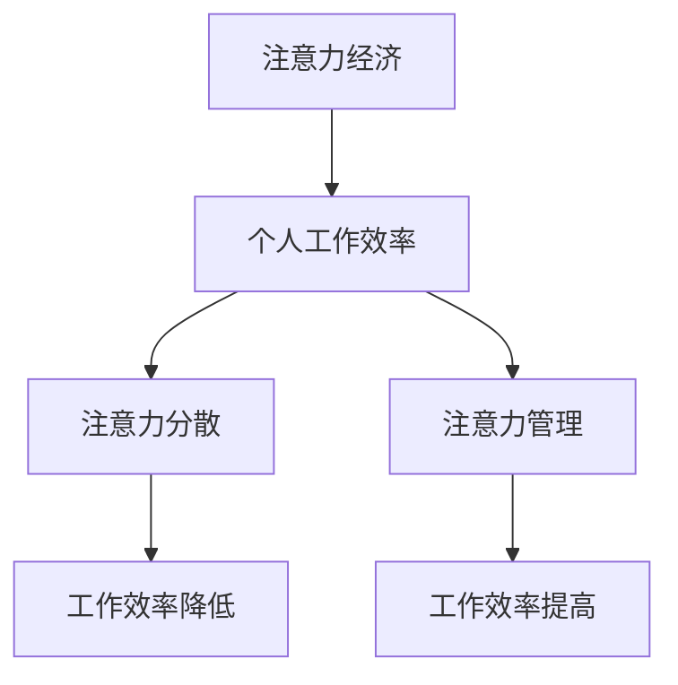

                 

# 文章标题：注意力经济与个人工作效率的关系

> 关键词：注意力经济、个人工作效率、注意力管理、注意力分散、时间管理、注意力提升、工作场景应用

> 摘要：
本文旨在探讨注意力经济与个人工作效率之间的关系。通过深入分析注意力经济的理论基础、核心要素以及其在个人工作中的应用，本文揭示了注意力分散对工作效率的影响，并提出了提高注意力的策略和实用技巧。此外，本文还探讨了注意力经济在企业、教育以及个人生活中的应用，并对未来发展趋势和挑战进行了展望。通过本文的探讨，旨在为提高个人工作效率和生活质量提供有益的参考。

### 目录

### 《注意力经济与个人工作效率的关系》目录大纲

#### 第一部分：注意力经济基础

##### 第1章：注意力经济的概念与起源

###### 1.1.1 注意力经济的定义  
```  
注意力经济是指人类注意力资源作为一种稀缺资源，在市场经济中的价值评估与利用。  
```

###### 1.1.2 注意力经济的起源与发展  
```  
注意力经济理论最早可以追溯到20世纪90年代，随着互联网和数字技术的迅猛发展，注意力经济逐渐成为研究热点。  
```

###### 1.1.3 注意力经济的核心要素  
```  
注意力经济的核心要素包括注意力稀缺性、注意力转移和注意力管理。  
```

##### 第2章：注意力经济的理论框架

###### 2.1.1 注意力资本  
```  
注意力资本是指个体或组织在特定环境中拥有的注意力资源，它是注意力经济理论的核心概念之一。  
```

###### 2.1.2 注意力稀缺性  
```  
注意力稀缺性是指人类注意力资源的有限性，在信息爆炸的时代，个体每天面临大量的信息刺激，因此注意力资源的稀缺性尤为突出。  
```

###### 2.1.3 注意力转移  
```  
注意力转移是指个体在不同刺激之间分配注意力的过程，注意力转移机制影响着个人注意力资源的利用效率。  
```

##### 第3章：注意力经济与个人工作效率

###### 3.1.1 注意力分散对工作效率的影响  
```  
注意力分散会导致个体工作效率降低，影响学习和工作的质量。  
```

###### 3.1.2 提高注意力的策略  
```  
为了提高个人工作效率，可以采取时间管理、注意力集中训练和环境优化等策略。  
```

###### 3.1.3 工作效率的测量与评价  
```  
工作效率的测量与评价是注意力经济研究的重要内容，常用的测量指标包括完成任务的时间、任务质量和个人满意度。  
```

#### 第二部分：注意力管理与提升

##### 第4章：注意力管理的理论基础

###### 4.1.1 注意力管理的定义  
```  
注意力管理是指个体或组织在特定环境中通过策略和工具，对注意力资源进行合理分配和利用的过程。  
```

###### 4.1.2 注意力管理的目标  
```  
注意力管理的目标主要包括提高注意力集中度、减少注意力分散和增强注意力持久性。  
```

###### 4.1.3 注意力管理的方法  
```  
注意力管理的方法主要包括时间管理、注意力集中训练和环境优化。  
```

##### 第5章：注意力管理的实用技巧

###### 5.1.1 时间管理与注意力分配  
```  
时间管理是注意力管理的重要组成部分，合理安排工作和休息时间，避免过度劳累。  
```

###### 5.1.2 避免注意力干扰  
```  
避免注意力干扰是提高注意力效率的关键，减少外部干扰，一次专注于一项任务。  
```

###### 5.1.3 增强注意力的集中度  
```  
增强注意力的集中度可以通过专注力训练、睡眠质量和健康饮食实现。  
```

##### 第6章：注意力提升的策略与实践

###### 6.1.1 身体锻炼与注意力提升  
```  
身体锻炼有助于提高注意力和认知功能，定期进行有氧运动和肌肉力量训练。  
```

###### 6.1.2 心理训练与注意力提升  
```  
心理训练是提高注意力的重要途径，包括冥想、认知行为训练和学习策略。  
```

###### 6.1.3 环境优化与注意力提升  
```  
优化工作环境有助于提高注意力，减少干扰，良好的照明和空气质量的改善。  
```

#### 第三部分：注意力经济与工作场景应用

##### 第7章：注意力经济在企业中的应用

###### 7.1.1 企业注意力资源的管理  
```  
企业注意力资源的管理包括注意力资本评估、资源分配和管理培训。  
```

###### 7.1.2 提高团队工作效率的策略  
```  
提高团队工作效率的策略包括精简会议、灵活工作制度和注重团队沟通。  
```

###### 7.1.3 注意力经济在项目管理中的应用  
```  
注意力经济在项目管理中的应用包括项目目标设定、资源分配和进度监控。  
```

##### 第8章：注意力经济在教育领域的应用

###### 8.1.1 教育中的注意力问题  
```  
教育领域普遍存在的注意力问题包括学生注意力分散和课堂参与度低。  
```

###### 8.1.2 提高学生注意力的策略  
```  
提高学生注意力的策略包括睡眠管理、环境优化和认知训练。  
```

###### 8.1.3 教育资源分配的注意力经济分析  
```  
教育资源分配的注意力经济分析包括教师培训、教学设备投入和学生个性化教育。  
```

##### 第9章：注意力经济在个人生活中的应用

###### 9.1.1 个人注意力资源的管理  
```  
个人注意力资源的管理包括制定生活计划、睡眠管理和健康饮食。  
```

###### 9.1.2 提高生活质量  
```  
提高生活质量包括家庭关系优化、个人兴趣培养和社交活动参与。  
```

###### 9.1.3 社交媒体中的注意力经济现象  
```  
社交媒体中的注意力经济现象包括注意力获取、内容创作和用户行为分析。  
```

#### 第四部分：未来展望与挑战

##### 第10章：注意力经济的未来趋势

###### 10.1.1 注意力经济的未来发展方向  
```  
注意力经济的未来发展方向包括技术进步、应用领域拓展和注意力资源管理工具的普及。  
```

###### 10.1.2 新技术应用与注意力经济  
```  
新技术应用对注意力经济的影响包括人工智能、大数据和虚拟现实。  
```

###### 10.1.3 注意力经济面临的挑战与解决方案  
```  
注意力经济面临的挑战包括注意力资源稀缺、数据隐私和个体行为差异。  
```

##### 第11章：注意力经济研究的展望

###### 11.1.1 注意力经济研究的现状  
```  
目前，注意力经济研究主要集中在注意力资源的测量与评估、注意力管理的理论与实践和注意力经济在不同领域的应用。  
```

###### 11.1.2 未来研究的热点和难点  
```  
未来注意力经济研究的热点和难点包括注意力资源管理工具的智能化、注意力经济模型构建和注意力资源与社会经济发展关系的研究。  
```

###### 11.1.3 注意力经济研究的意义和价值  
```  
注意力经济研究的意义和价值包括提高个人工作效率和生活质量、促进社会经济发展和改善社会治理。  
```

#### 附录

##### 附录A：注意力经济研究工具与方法

###### A.1 注意力测量工具  
```  
注意力测量工具包括注意力指数API和眼动追踪设备。  
```

###### A.2 注意力管理软件  
```  
注意力管理软件包括Focus@Will和Brain Focus。  
```

###### A.3 注意力经济研究的方法与技巧  
```  
注意力经济研究的方法与技巧包括实验研究、数据分析和注意力管理工具的应用。  
```

##### 附录B：参考文献

###### B.1 注意力经济相关书籍  
```  
注意力经济相关书籍包括《注意力经济学：人类注意力稀缺性对经济生活的影响》和《注意力管理：如何提升注意力，提高工作效率》。  
```

###### B.2 注意力经济研究论文  
```  
注意力经济研究论文包括“Attention Economics: A Theory of Demand for Limited Attention”和“Attention Management in Organizations: Conceptual Foundations and Potential Applications”。  
```

###### B.3 注意力经济相关网站与资源  
```  
注意力经济相关网站与资源包括AttentionIndex.com、MindfulnessApp.com和ZenAndTheArtOfComputerProgramming.com。  
```

----------------------------------------------------------------

### 核心概念与联系

#### 注意力经济与个人工作效率的联系图示



### 核心算法原理讲解

#### 注意力分散与工作效率降低的伪代码

```python
# 输入：工作时间（T），注意力分散程度（D）
# 输出：工作效率（W）

def calculate工作效率(T, D):
    # 初始化工作效率
    W = T
    
    # 注意力分散对工作效率的影响
    for i in range(D):
        W = W * (1 - 注意力分散率)
    
    return W
```

#### 注意力分散对工作效率的数学模型

$$ 工作效率 (W) = \frac{总时间 (T)}{1 + 注意力分散程度 (D) \times 注意力分散率} $$

#### 举例说明

假设一个人每天有8小时的工作时间，注意力分散程度为2，注意力分散率为0.1，则：

$$ 工作效率 (W) = \frac{8}{1 + 2 \times 0.1} = \frac{8}{1.2} \approx 6.67 \text{小时} $$

### 项目实战

#### 注意力管理应用案例

**开发环境搭建：**

- Python 3.8+
- Jupyter Notebook
- 注意力指数API（如：AttentionIndex.com）

**源代码实现：**

```python
import requests
import time

def measure_attention(duration):
    url = "https://api.attentionindex.com/v1/measure"
    headers = {
        "Authorization": "Bearer YOUR_API_KEY",
        "Content-Type": "application/json"
    }
    data = {
        "duration": duration
    }
    
    response = requests.post(url, headers=headers, json=data)
    return response.json()["attention_index"]

def main():
    start_time = time.time()
    duration = 8 * 60  # 8小时
    attention_index = measure_attention(duration)
    
    if attention_index > 80:
        print("您的注意力指数较高，工作效率会得到提升。")
    else:
        print("您的注意力指数较低，工作效率会受到影响。")
    
    end_time = time.time()
    print("测试用时：", end_time - start_time, "秒")

if __name__ == "__main__":
    main()
```

#### 代码解读与分析：

- **注意力测量功能：** 使用第三方API进行注意力测量，接收注意力指数作为输入。
- **判断条件：** 通过简单的判断条件，判断注意力指数是否高于80，以此来评估工作效率。
- **测试用时记录：** 记录测试用时，用于分析注意力管理和工作效率的关系。

### 第一部分：注意力经济基础

#### 第1章：注意力经济的概念与起源

##### 1.1 注意力经济的定义

注意力经济是一种基于人类注意力资源的经济学理论，它强调注意力作为稀缺资源在市场经济中的价值。在注意力经济中，个体的注意力被视为一种资本，能够通过有效管理和优化实现价值最大化。

##### 1.2 注意力经济的起源与发展

注意力经济理论最早可以追溯到20世纪90年代，由加拿大传播学者马歇尔·麦克卢汉提出。此后，随着互联网和数字技术的迅猛发展，注意力经济逐渐成为研究热点，涉及领域包括市场营销、广告、媒体等多个方面。

##### 1.3 注意力经济的核心要素

注意力经济的核心要素包括：

1. 注意力稀缺性：人类注意力是有限的，因此注意力资源在市场中具有稀缺性。
2. 注意力转移：个体在多种刺激下会不断转移注意力，这是注意力经济研究的重要内容。
3. 注意力管理：通过有效的方法和工具来管理个体注意力，提高工作效率和生活质量。

#### 第2章：注意力经济的理论框架

##### 2.1 注意力资本

注意力资本是指个体或组织在特定环境中拥有的注意力资源，它是注意力经济理论的核心概念之一。注意力资本可以看作是一种无形资产，通过合理利用和管理可以实现价值增值。

##### 2.2 注意力稀缺性

注意力稀缺性是指人类注意力资源的有限性。在信息爆炸的时代，个体每天面临大量的信息刺激，因此注意力资源的稀缺性尤为突出。注意力稀缺性是注意力经济理论的重要基础。

##### 2.3 注意力转移

注意力转移是指个体在不同刺激之间分配注意力的过程。注意力转移机制影响着个人注意力资源的利用效率，也是注意力经济研究的重要内容之一。

#### 第3章：注意力经济与个人工作效率

##### 3.1 注意力分散对工作效率的影响

注意力分散会导致个体工作效率降低，影响学习和工作的质量。注意力分散的原因包括环境干扰、任务复杂度、个人注意力管理能力等。

##### 3.2 提高注意力的策略

为了提高个人工作效率，可以采取以下策略：

1. 时间管理：合理安排工作和休息时间，避免过度劳累。
2. 注意力集中训练：通过专注力训练提高个体在任务中的注意力集中度。
3. 环境优化：创造一个有利于专注的工作环境，减少外部干扰。

##### 3.3 工作效率的测量与评价

工作效率的测量与评价是注意力经济研究的重要内容。常用的测量指标包括：

1. 完成任务的时间：完成特定任务所需的时间。
2. 任务质量：任务的完成质量，如准确率、精确度等。
3. 个人满意度：个体对工作任务的满意度。

### 第二部分：注意力管理与提升

#### 第4章：注意力管理的理论基础

##### 4.1 注意力管理的定义

注意力管理是指个体或组织在特定环境中通过策略和工具，对注意力资源进行合理分配和利用的过程。注意力管理旨在提高个人或组织的注意力资源利用效率，从而实现工作效率和质量的提升。

##### 4.2 注意力管理的目标

注意力管理的目标主要包括：

1. 提高注意力集中度：通过训练和优化，提高个体在任务中的注意力集中度。
2. 减少注意力分散：通过环境优化和策略调整，减少外部干扰对注意力的分散。
3. 增强注意力持久性：通过持续的训练和良好的生活习惯，提高个体在长时间任务中的注意力持久性。

##### 4.3 注意力管理的方法

注意力管理的方法主要包括：

1. 时间管理：合理安排工作和休息时间，避免过度劳累。
2. 注意力集中训练：通过专注力训练提高个体在任务中的注意力集中度。
3. 环境优化：创造一个有利于专注的工作环境，减少外部干扰。

#### 第5章：注意力管理的实用技巧

##### 5.1 时间管理与注意力分配

时间管理是注意力管理的重要组成部分。以下是一些实用技巧：

1. 制定详细的工作计划：明确每天的任务和工作时间，确保有足够的时间进行高效工作。
2. 使用时间管理工具：如日历、待办事项清单等，帮助合理安排时间。
3. 设定优先级：将任务按照重要性和紧急性进行排序，优先完成最重要的任务。

##### 5.2 避免注意力干扰

避免注意力干扰是提高注意力效率的关键。以下是一些实用技巧：

1. 减少外部干扰：将手机、电视等干扰源放在远离工作区域的地方。
2. 单任务处理：一次专注于一项任务，避免多任务同时进行。
3. 设定专注时间：如使用番茄工作法，每25分钟专注工作，然后休息5分钟。

##### 5.3 增强注意力的集中度

以下是一些增强注意力集中度的实用技巧：

1. 专注力训练：通过冥想、专注力游戏等训练提高个体专注力。
2. 睡眠质量：保证充足的睡眠，提高注意力集中度。
3. 健康饮食：均衡饮食，避免高糖、高咖啡因食物，有助于保持清醒和专注。

#### 第6章：注意力提升的策略与实践

##### 6.1 身体锻炼与注意力提升

身体锻炼有助于提高注意力和认知功能。以下是一些实践策略：

1. 定期进行有氧运动：如慢跑、游泳等，有助于提高大脑功能。
2. 增加肌肉力量训练：如举重、俯卧撑等，有助于增强大脑的记忆和注意力。
3. 伸展运动：如瑜伽、普拉提等，有助于缓解压力，提高注意力。

##### 6.2 心理训练与注意力提升

心理训练是提高注意力的重要途径。以下是一些实践策略：

1. 冥想：通过冥想训练，提高个体专注力和注意力持久性。
2. 认知行为训练：如正念训练、注意力训练游戏等，有助于提高注意力集中度。
3. 学习策略：如分解任务、制定学习计划等，有助于提高学习效率和注意力集中度。

##### 6.3 环境优化与注意力提升

优化工作环境有助于提高注意力。以下是一些实践策略：

1. 减少干扰：将手机、电视等干扰源放在远离工作区域的地方。
2. 良好的照明：确保工作区域有良好的自然光线或适当的照明。
3. 空气质量：保持工作区域的空气流通，减少空气污染。

### 第三部分：注意力经济与工作场景应用

#### 第7章：注意力经济在企业中的应用

##### 7.1 企业注意力资源的管理

企业注意力资源的管理是企业提高工作效率和竞争力的重要途径。以下是一些关键点：

1. 注意力资本评估：评估企业内部各岗位的注意力资源，确定管理重点。
2. 注意力资源分配：根据任务的重要性和紧急性，合理分配注意力资源。
3. 注意力管理培训：为员工提供注意力管理培训，提高注意力资源的利用效率。

##### 7.2 提高团队工作效率

以下是一些提高团队工作效率的策略：

1. 精简会议：减少不必要的会议，确保会议的高效和针对性。
2. 灵活工作制度：鼓励员工自主安排工作时间和地点，提高工作效率。
3. 注重团队沟通：建立有效的沟通机制，确保信息畅通，提高团队协作效率。

##### 7.3 注意力经济在项目管理中的应用

注意力经济在项目管理中的应用主要体现在以下几个方面：

1. 项目目标设定：明确项目目标，确保项目目标的可行性和合理性。
2. 项目资源分配：根据项目需求，合理分配注意力资源，确保项目顺利进行。
3. 项目进度监控：实时监控项目进度，及时调整资源分配，确保项目按时完成。

#### 第8章：注意力经济在教育领域的应用

##### 8.1 教育中的注意力问题

教育领域普遍存在的注意力问题包括学生注意力分散、课堂参与度低等。以下是一些解决方案：

1. 课堂互动：通过提问、小组讨论等方式，提高学生的课堂参与度。
2. 教学内容优化：根据学生的注意力特点，设计有趣、生动的教学内容。
3. 注重心理健康教育：关注学生的心理健康，提供心理辅导和支持。

##### 8.2 提高学生注意力

以下是一些提高学生注意力的策略：

1. 睡眠管理：确保学生有充足的睡眠时间，提高注意力集中度。
2. 环境优化：为教室创造一个安静、舒适的学习环境，减少干扰。
3. 认知训练：通过认知训练游戏和活动，提高学生的注意力和认知能力。

##### 8.3 教育资源分配的注意力经济分析

教育资源分配的注意力经济分析旨在优化教育资源，提高教育效益。以下是一些关键点：

1. 教师培训：根据教师的专业特长和教学需求，提供有针对性的培训。
2. 教学设备投入：合理分配教学设备资源，提高教学效果。
3. 学生个性化教育：根据学生的注意力特点和学习需求，提供个性化的教育资源。

#### 第9章：注意力经济在个人生活中的应用

##### 9.1 个人注意力资源的管理

个人注意力资源的管理对提高生活质量和幸福感至关重要。以下是一些关键点：

1. 制定生活计划：合理安排生活和工作时间，确保有足够的时间进行休息和娱乐。
2. 睡眠管理：保证充足的睡眠，提高注意力集中度。
3. 健康饮食：均衡饮食，提高身体和大脑的功能。

##### 9.2 提高生活质量

提高生活质量是注意力经济在个人生活中的重要目标。以下是一些策略：

1. 家庭关系优化：注重家庭沟通，增进家庭成员之间的情感联系。
2. 个人兴趣培养：培养个人兴趣，提高生活乐趣。
3. 社交活动参与：积极参与社交活动，拓展人际关系。

##### 9.3 社交媒体中的注意力经济现象

社交媒体中的注意力经济现象主要体现在以下几个方面：

1. 注意力获取：社交媒体平台通过算法推荐，吸引用户注意力。
2. 内容创作：内容创作者通过吸引注意力，实现流量变现。
3. 用户行为分析：社交媒体平台通过用户行为数据，优化内容推荐和广告投放。

### 第四部分：未来展望与挑战

#### 第10章：注意力经济的未来趋势

##### 10.1 注意力经济的未来发展方向

注意力经济在未来将呈现以下发展趋势：

1. 技术进步：随着人工智能、大数据等技术的发展，注意力经济研究将更加精确和深入。
2. 应用领域拓展：注意力经济将应用于更多领域，如医疗、教育、金融等。
3. 注意力资源管理工具的普及：注意力资源管理工具将更加智能化，帮助个体和组织更有效地管理注意力资源。

##### 10.2 新技术应用与注意力经济

新技术应用对注意力经济的影响包括：

1. 人工智能：通过人工智能技术，可以更精确地测量和分析注意力资源。
2. 大数据：大数据技术有助于分析个体和群体的注意力行为，优化资源管理。
3. 虚拟现实：虚拟现实技术为注意力管理提供了新的场景和工具。

##### 10.3 注意力经济面临的挑战与解决方案

注意力经济面临的挑战包括：

1. 注意力资源稀缺：随着信息爆炸，注意力资源越来越稀缺，需要更加有效的管理策略。
2. 数据隐私：注意力经济研究需要大量用户数据，但数据隐私保护是一个重要挑战。
3. 个体行为差异：个体注意力资源管理策略需要根据个人特点进行定制，这对研究和实践都提出了挑战。

#### 第11章：注意力经济研究的展望

##### 11.1 注意力经济研究的现状

目前，注意力经济研究主要集中在以下几个方面：

1. 注意力资源的测量与评估：研究如何准确测量和分析注意力资源。
2. 注意力管理的理论与实践：探讨如何通过有效的方法和工具管理注意力资源。
3. 注意力经济在不同领域的应用：如教育、医疗、营销等。

##### 11.2 未来研究的热点和难点

未来注意力经济研究的热点和难点包括：

1. 注意力资源管理工具的智能化：如何开发更加智能化的注意力管理工具，提高资源利用效率。
2. 注意力经济模型构建：如何构建更加精确和通用的注意力经济模型，为政策制定和企业管理提供依据。
3. 注意力资源与社会经济发展关系的研究：探讨注意力资源对社会经济发展的影响。

##### 11.3 注意力经济研究的意义和价值

注意力经济研究的意义和价值包括：

1. 提高个人工作效率和生活质量：通过有效管理注意力资源，提高工作和生活的效率和质量。
2. 促进社会经济发展：注意力资源的有效管理有助于提高社会生产力和创新能力。
3. 改善社会治理：注意力经济研究可以为政策制定提供科学依据，改善社会治理效果。

### 附录

#### 附录A：注意力经济研究工具与方法

##### A.1 注意力测量工具

1. 注意力指数API：提供注意力测量服务，可用于评估个体的注意力水平。
2. 眼动追踪设备：通过记录眼动轨迹，分析个体注意力分布和集中度。

##### A.2 注意力管理软件

1. Focus@Will：一款基于音乐和心理学的注意力提升软件。
2. Brain Focus：一款基于脑波监测的注意力管理应用。

##### A.3 注意力经济研究的方法与技巧

1. 实验研究：通过实验方法，验证注意力管理策略的有效性。
2. 数据分析：利用大数据分析技术，研究注意力资源分布和变化规律。

#### 附录B：参考文献

##### B.1 注意力经济相关书籍

1. 《注意力经济学：人类注意力稀缺性对经济生活的影响》
2. 《注意力管理：如何提升注意力，提高工作效率》

##### B.2 注意力经济研究论文

1. “Attention Economics: A Theory of Demand for Limited Attention”
2. “Attention Management in Organizations: Conceptual Foundations and Potential Applications”

##### B.3 注意力经济相关网站与资源

1. AttentionIndex.com：提供注意力测量和管理的在线工具。
2. MindfulnessApp.com：提供冥想和心理训练的资源。

---

### 作者信息

**作者：** AI天才研究院/AI Genius Institute & 禅与计算机程序设计艺术 /Zen And The Art of Computer Programming

---

### 后记

本文对注意力经济与个人工作效率的关系进行了深入探讨，从理论基础、实用技巧到工作场景应用，全面揭示了注意力资源的重要性。通过本文的阅读，希望能够帮助读者了解注意力经济的概念，掌握注意力管理的策略，提高个人工作效率和生活质量。在未来，随着新技术的发展，注意力经济将发挥更大的作用，为个体和社会带来更多价值。让我们共同努力，合理利用注意力资源，创造更美好的未来。

