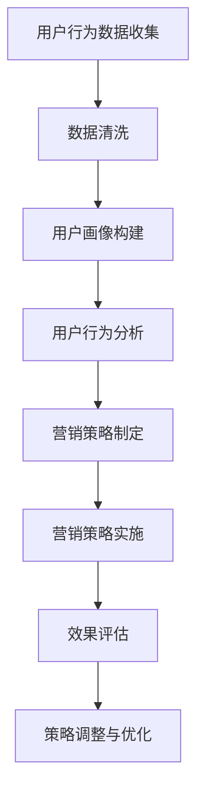

                 

# 注意力经济与社交媒体营销策略：在不牺牲用户体验的情况下有效吸引受众

> 关键词：注意力经济、社交媒体营销、用户体验、效果评估、用户行为分析

> 摘要：本文深入探讨了注意力经济与社交媒体营销策略的内在联系，提出了在不牺牲用户体验的情况下，如何有效吸引受众的方法。文章首先介绍了注意力经济的基础知识，然后详细阐述了社交媒体在注意力经济中的作用，以及如何通过用户行为分析和社交媒体营销策略来提升营销效果。同时，文章也强调了用户体验的重要性，并提出了效果评估和策略优化的方法。最后，通过实际案例和代码解读，展示了如何将理论应用于实践，实现有效的社交媒体营销。

## 第一部分：注意力经济基础

### 1.1 注意力经济的定义与背景

#### 1.1.1 注意力经济的起源

注意力经济这个概念最早由美国作家兼企业家杰西·谢克纳（Jesse Schell）在2008年提出。他认为，随着互联网和数字媒体的兴起，人们的注意力成为一种稀缺资源，而如何获取和保持人们的注意力成为了一个新的经济形态。这一观点迅速引起了广泛关注，并逐渐发展成为一个独立的经济体系。

#### 1.1.2 注意力经济的核心概念

注意力经济主要基于以下几个核心概念：

1. **注意力稀缺性**：在信息爆炸的时代，人们的注意力变得极为稀缺。如何吸引并保持用户的注意力成为企业竞争的关键。
2. **注意力价值**：用户的注意力是有价值的，企业通过获取用户的注意力来实现商业目标。
3. **注意力转移**：用户的时间是有限的，如何让用户将注意力从其他事物转移到自己的产品或服务上，是企业需要解决的问题。

#### 1.1.3 注意力经济与传统经济的区别

与传统经济模式不同，注意力经济更加注重用户的心理和行为变化。传统经济更多关注产品的物理属性和功能，而注意力经济则强调如何通过内容和体验来吸引用户的注意力。

### 1.2 社交媒体在注意力经济中的作用

#### 1.2.1 社交媒体的发展与普及

随着移动互联网的快速发展，社交媒体已经成为人们日常生活中不可或缺的一部分。从微博、微信到Facebook、Instagram，社交媒体平台不仅改变了人们的交流方式，也为企业提供了新的营销渠道。

#### 1.2.2 社交媒体对注意力经济的影响

社交媒体在注意力经济中发挥着重要作用：

1. **增加品牌曝光度**：通过社交媒体平台，企业可以轻松地将品牌信息传播给大量用户，提高品牌知名度。
2. **提升用户互动性**：社交媒体平台提供了丰富的互动功能，如评论、点赞、分享等，用户可以通过这些功能参与品牌活动，增强品牌忠诚度。
3. **优化用户体验**：通过社交媒体，企业可以更加实时地了解用户需求，提供个性化的服务和体验，从而提升用户满意度。

#### 1.2.3 社交媒体营销的基本策略

社交媒体营销主要包括以下几种策略：

1. **内容营销**：通过发布高质量的内容，吸引用户的注意力，并培养用户对品牌的兴趣和忠诚度。
2. **社交媒体广告**：通过投放精准的广告，直接向目标用户推广产品或服务。
3. **影响者营销**：通过与有影响力的社交媒体用户合作，借助他们的影响力和粉丝基础，提高品牌曝光度和影响力。
4. **用户互动**：通过积极参与用户的评论、私信等互动，建立良好的用户关系，提升用户满意度。

### 1.3 用户行为分析

#### 1.3.1 用户行为数据收集

用户行为数据是进行用户行为分析的基础。企业可以通过以下几种方式收集用户行为数据：

1. **社交媒体数据**：通过社交媒体平台提供的API接口，获取用户的浏览记录、点赞、评论等行为数据。
2. **网站数据**：通过网站分析工具（如Google Analytics），获取用户的访问路径、停留时间、点击行为等数据。
3. **应用程序数据**：通过应用程序内置的数据收集模块，获取用户在应用程序中的操作行为数据。

#### 1.3.2 用户行为分析方法

用户行为分析方法主要包括以下几种：

1. **统计分析**：通过对用户行为数据的基本统计，了解用户的基本特征和行为模式。
2. **聚类分析**：将用户根据行为特征进行分类，以便于企业对不同类别的用户制定差异化的营销策略。
3. **关联规则挖掘**：发现用户行为之间的关联关系，帮助企业了解用户需求和行为动机。

#### 1.3.3 用户画像构建与运用

用户画像是指通过对用户行为数据的综合分析，构建一个全面描绘用户特征和需求的模型。用户画像的构建主要包括以下步骤：

1. **数据收集**：收集用户的基本信息、行为数据等。
2. **数据清洗**：处理数据中的噪声和缺失值，确保数据的准确性。
3. **特征提取**：从原始数据中提取出对用户行为分析有意义的特征。
4. **模型构建**：利用机器学习算法，构建用户画像模型。
5. **模型评估与优化**：通过交叉验证等方法评估模型效果，并根据评估结果进行模型优化。

用户画像的运用主要包括以下方面：

1. **个性化推荐**：根据用户画像，为用户提供个性化的内容和服务。
2. **精准营销**：根据用户画像，制定针对不同用户的营销策略。
3. **用户行为预测**：利用用户画像，预测用户未来的行为和需求。

### 1.4 注意力经济在社交媒体营销中的具体应用

#### 1.4.1 内容营销

内容营销是社交媒体营销的核心策略之一。通过发布高质量、有价值的内容，企业可以吸引并留住用户的注意力。以下是一个内容营销的案例：

**案例**：某品牌运动鞋公司通过微信公众号发布一系列关于跑步技巧、跑步装备和跑步健康知识的内容，吸引了大量跑步爱好者的关注。在每篇文章的结尾，公司都会推荐自己的运动鞋产品，使得用户在阅读内容的过程中自然而然地对产品产生兴趣。

#### 1.4.2 社交媒体广告

社交媒体广告是另一种有效的注意力获取方式。通过精准投放广告，企业可以将产品信息直接传递给目标用户。以下是一个社交媒体广告的案例：

**案例**：某手机品牌在抖音平台投放了一则关于手机摄影功能的广告。广告中展示了手机拍摄的各种美景，吸引了大量喜欢摄影的用户关注。同时，广告还提供了优惠信息，鼓励用户购买产品。

#### 1.4.3 影响者营销

影响者营销是借助社交媒体上有影响力的人物来推广产品或服务的一种策略。以下是一个影响者营销的案例：

**案例**：某时尚品牌邀请了知名时尚博主进行产品体验，并发布了体验视频。视频中，博主对产品的设计、质量和使用体验给予了高度评价，吸引了大量粉丝的关注和购买。

### 1.5 注意力经济与用户体验的关系

在注意力经济中，用户体验是决定用户是否继续关注品牌和产品的重要因素。以下是一个关于用户体验的案例：

**案例**：某电商平台在APP中引入了个性化推荐功能。通过分析用户的购物行为和喜好，平台为用户推荐了符合他们口味的产品。这种个性化的体验大大提升了用户的满意度，使得用户更愿意继续使用平台。

## 第二部分：社交媒体营销策略

### 2.1 内容营销策略

#### 2.1.1 内容营销的定义与目的

内容营销是一种通过创建和分享有价值的内容来吸引潜在客户并促进品牌认知度和销售的过程。其目的在于提供对目标受众有价值的信息，从而建立品牌权威性和信任度。

#### 2.1.2 内容营销的关键要素

内容营销的成功取决于以下几个关键要素：

1. **目标受众**：明确目标受众，了解他们的需求和兴趣。
2. **内容质量**：提供高质量、有价值的内容，确保内容与目标受众的兴趣相关。
3. **内容形式**：根据目标受众的偏好，选择合适的文案、图片、视频等形式。
4. **内容发布频率**：保持稳定的发布频率，确保内容持续吸引受众。
5. **互动性**：鼓励受众参与，如留言、点赞、分享等。

#### 2.1.3 内容营销策略案例分析

**案例**：某健康食品品牌通过微信公众号发布了一系列关于健康饮食和营养知识的文章。文章内容专业、易懂，吸引了大量对健康饮食感兴趣的用户。品牌还在每篇文章的结尾提供了健康食谱和购买链接，提高了转化率。

### 2.2 社交媒体广告策略

#### 2.2.1 社交媒体广告的类型与特点

社交媒体广告主要包括以下几种类型：

1. **展示广告**：在社交媒体平台上展示图片或视频广告。
2. **搜索广告**：当用户在社交媒体平台上搜索相关关键词时，显示的广告。
3. **视频广告**：在社交媒体视频播放前或播放过程中展示的广告。

社交媒体广告的特点包括：

1. **精准投放**：根据用户的兴趣、行为等数据，实现精准投放。
2. **互动性强**：用户可以通过点赞、评论、分享等方式与广告互动。
3. **创意性**：广告内容可以根据不同的社交媒体平台和用户特点进行创意设计。

#### 2.2.2 社交媒体广告的投放策略

社交媒体广告的投放策略包括以下几个方面：

1. **目标受众定位**：明确目标受众，确保广告投放给最有可能产生转化的用户。
2. **广告内容设计**：设计吸引人的广告内容，提高点击率和转化率。
3. **广告投放时间**：选择用户活跃时间进行投放，提高广告曝光率。
4. **广告预算管理**：合理分配广告预算，确保广告效果最大化。

#### 2.2.3 社交媒体广告案例分析

**案例**：某服装品牌在Instagram上投放了一则关于新品发布的广告。广告以精美的图片和视频展示产品的设计和细节，吸引了大量用户的关注和点赞。同时，广告还提供了限时折扣，提高了转化率。

### 2.3 影响者营销策略

#### 2.3.1 影响者的定义与分类

影响者是指在社交媒体上有大量关注者，并对粉丝有较强影响力的人物。根据影响力的大小和领域，影响者可以分为以下几类：

1. **超级网红**：拥有数百万甚至数千万粉丝，对粉丝有着巨大影响力。
2. **意见领袖**：在特定领域有专业知识和权威地位，对粉丝有较强的引导作用。
3. **品牌大使**：与品牌有长期合作关系，为品牌代言和推广。

#### 2.3.2 影响者营销的优势与挑战

影响者营销的优势包括：

1. **高效传播**：通过影响者的传播，品牌信息可以迅速扩散，提高品牌知名度。
2. **增强信任**：影响者对粉丝有较强的影响力，其推荐的产品或服务更容易被粉丝接受。
3. **提升影响力**：通过与有影响力的影响者合作，品牌可以借助他们的粉丝基础，提升自身的影响力。

影响者营销的挑战包括：

1. **成本较高**：影响者通常需要较高的费用来合作，对于中小企业可能是一笔不小的开支。
2. **合作风险**：影响者的口碑和影响力会影响品牌形象，如果选择不当，可能会带来负面效应。
3. **效果难以衡量**：影响者营销的效果难以精确衡量，企业需要通过多种指标进行评估。

#### 2.3.3 影响者营销的实战技巧

影响者营销的实战技巧包括：

1. **选择合适的影响者**：根据品牌特点和目标受众，选择与品牌形象相符、影响力较大的影响者。
2. **制定明确的合作目标**：与影响者明确合作目标和预期效果，确保双方对合作有清晰的认识。
3. **优化合作内容**：根据影响者的风格和受众特点，设计适合的合作内容，提高粉丝的接受度。
4. **监测和评估效果**：通过数据监测和评估合作效果，及时调整策略，确保合作达到预期效果。

#### 2.3.4 影响者营销案例分析

**案例**：某护肤品品牌与一位知名美妆博主合作，在其微博上发布了关于品牌新产品的体验视频。视频中，博主详细介绍了产品的使用方法和效果，并给予了高度评价。视频发布后，短时间内吸引了大量用户观看和评论，品牌知名度大幅提升。

### 2.4 用户互动策略

#### 2.4.1 用户互动的重要性

用户互动是社交媒体营销的重要组成部分，它有助于建立品牌与用户之间的良好关系，提高用户满意度和忠诚度。以下是一个关于用户互动的案例：

**案例**：某电商品牌在微信上开设了客服账号，用户可以通过客服账号咨询产品信息、售后服务等问题。客服团队及时回复用户，解决了用户的问题，提高了用户满意度。

#### 2.4.2 用户互动的技巧与方法

用户互动的技巧和方法包括：

1. **及时回复**：及时回复用户的提问和反馈，显示品牌的关注和诚意。
2. **个性化沟通**：根据用户的特点和需求，进行个性化的沟通，提高用户的满意度。
3. **互动活动**：通过线上活动（如抽奖、问答等）吸引用户参与，增强用户互动。
4. **反馈机制**：建立反馈机制，收集用户意见和建议，不断优化产品和服务。

#### 2.4.3 用户互动案例分析

**案例**：某电子产品品牌在社交媒体上举办了“产品试用体验”活动。用户可以申请试用产品，并在试用后分享使用感受。品牌不仅收集了用户的真实反馈，还通过用户的分享提高了产品的曝光度。

## 第三部分：用户体验与效果评估

### 3.1 用户体验的重要性

#### 3.1.1 用户体验的定义与构成

用户体验（User Experience，简称UX）是指用户在使用产品或服务过程中所感受到的整体体验。它包括以下几个方面：

1. **易用性**：产品是否易于使用，用户能否快速掌握使用方法。
2. **互动性**：产品是否能够响应用户的需求和操作，提供及时的反馈。
3. **可靠性**：产品是否稳定可靠，不会出现故障或错误。
4. **美观性**：产品的界面设计是否美观，符合用户的审美需求。
5. **满意度**：用户对产品或服务的整体满意度。

#### 3.1.2 用户体验的重要性分析

用户体验的重要性体现在以下几个方面：

1. **用户满意度**：良好的用户体验可以提升用户的满意度，增加用户对品牌的忠诚度。
2. **品牌形象**：用户体验直接影响品牌形象，优秀的用户体验有助于树立品牌的专业形象。
3. **用户留存率**：用户体验良好的产品或服务更容易留住用户，降低用户流失率。
4. **转化率**：良好的用户体验可以提升用户的购买意愿和转化率。

#### 3.1.3 提高用户体验的策略

提高用户体验的策略包括以下几个方面：

1. **用户研究**：通过用户调研、用户访谈等方式，深入了解用户需求和行为。
2. **界面设计**：优化产品的界面设计，使其更加简洁、直观、美观。
3. **功能优化**：根据用户反馈和需求，不断优化产品的功能，提高其易用性和可靠性。
4. **客服支持**：提供及时、专业的客服支持，解决用户的问题和疑惑。

### 3.2 社交媒体营销效果评估

#### 3.2.1 营销效果评估的方法与工具

营销效果评估是衡量社交媒体营销策略有效性的关键环节。以下是一些常用的评估方法和工具：

1. **流量分析**：通过网站分析工具（如Google Analytics）了解用户访问量、页面浏览量等指标。
2. **转化率分析**：通过跟踪用户的转化行为（如点击、购买等），评估营销活动的效果。
3. **客户反馈**：收集用户的反馈和评论，了解他们对产品和服务的满意度。
4. **社交媒体分析工具**：使用社交媒体分析工具（如Hootsuite、Buffer等），监控社交媒体平台上的品牌表现和用户互动。

#### 3.2.2 营销效果评估的指标体系

营销效果评估的指标体系主要包括以下几个方面：

1. **品牌知名度**：通过搜索指数、媒体曝光量等指标评估品牌知名度的提升。
2. **用户参与度**：通过点赞、评论、分享等互动指标评估用户的参与程度。
3. **转化率**：通过实际转化行为（如购买、注册等）评估营销活动的直接效果。
4. **投资回报率**（ROI）：通过成本与收益的对比，评估营销活动的经济效益。

#### 3.2.3 营销效果评估案例分析

**案例**：某电商品牌在社交媒体上开展了一项新品推广活动。通过分析活动期间的数据，品牌发现：

1. **品牌知名度提高了20%**：活动期间，品牌在社交媒体上的曝光量显著增加。
2. **用户参与度提高了30%**：活动期间，用户在品牌社交媒体上的互动量明显增加。
3. **转化率提高了40%**：活动期间，品牌的新品销售量大幅增长。

这些数据显示，该营销活动取得了显著的效果。

### 3.3 优化与调整

#### 3.3.1 营销策略的调整原则

营销策略的调整原则主要包括以下几个方面：

1. **数据驱动**：根据实际数据，分析营销活动的效果，找出存在的问题和改进方向。
2. **持续迭代**：营销策略不是一成不变的，需要根据市场环境和用户需求的变化，进行持续优化。
3. **目标导向**：调整营销策略时，要明确目标，确保调整的方向与目标一致。

#### 3.3.2 营销策略优化的方法

营销策略优化的方法主要包括以下几个方面：

1. **内容优化**：根据用户反馈和数据分析，优化内容质量和形式，提高用户的兴趣和参与度。
2. **渠道优化**：根据用户行为和效果分析，调整广告投放渠道，选择更有效的营销渠道。
3. **互动优化**：通过互动活动的设计和执行，提高用户的参与度和满意度。

#### 3.3.3 持续改进的实践案例

**案例**：某教育机构在社交媒体上开展了在线课程推广活动。在活动过程中，机构通过数据分析和用户反馈，不断优化营销策略：

1. **内容优化**：根据用户反馈，调整课程内容的结构和形式，使之更加符合用户需求。
2. **渠道优化**：根据用户行为，调整广告投放时间和频率，提高广告曝光率。
3. **互动优化**：设计更加有趣的互动活动，提高用户的参与度和转化率。

这些优化措施使得该教育机构的在线课程销量实现了显著增长。

### 附录

#### 附录A：社交媒体营销工具介绍

#### A.1 主要社交媒体平台介绍

1. **微信**：中国最大的社交媒体平台，拥有庞大的用户基础，提供公众号、小程序等功能。
2. **微博**：以短消息和图片、视频内容为主的社交媒体平台，用户互动性强。
3. **Facebook**：全球最大的社交媒体平台，提供广告投放、用户互动等功能。
4. **Instagram**：以图片和视频内容为主的社交媒体平台，用户以年轻人为主。

#### A.2 广告投放工具使用指南

1. **微信广告**：通过微信公众号、朋友圈、小程序等渠道投放广告，支持精准投放和效果监测。
2. **微博广告**：在微博平台投放广告，支持按点击、展示、转化等方式计费。
3. **Facebook广告**：在Facebook平台上投放广告，支持按点击、展示、转化等方式计费，提供丰富的广告形式。
4. **Instagram广告**：在Instagram平台上投放广告，支持图片、视频、故事等多种形式。

#### A.3 数据分析工具推荐

1. **Google Analytics**：提供网站和社交媒体的数据分析功能，包括用户行为分析、流量分析等。
2. **Hootsuite**：提供社交媒体管理工具，包括内容发布、分析、互动等功能。
3. **Buffer**：提供社交媒体内容发布和数据分析工具，支持自动化发布和效果监测。
4. **Social Blade**：提供社交媒体数据分析工具，包括用户增长趋势、互动分析等。

### 附录B：案例分析

#### B.1 成功案例分析

**案例**：某时尚品牌通过社交媒体营销活动成功提升了品牌知名度和销售额。品牌通过发布高质量的图片和视频内容，吸引了大量用户关注。同时，品牌还与影响者合作，借助他们的粉丝基础，提高了品牌曝光度。在活动期间，品牌实现了50%的销售额增长。

#### B.2 失败案例分析

**案例**：某电子产品品牌在社交媒体上开展了新品推广活动，但由于内容质量不高，广告投放策略不当，导致活动效果不佳。品牌在活动期间仅实现了10%的销售额增长，远低于预期。

#### B.3 案例分析总结与启示

通过以上案例分析，我们可以得出以下结论和启示：

1. **内容质量至关重要**：高质量的内容可以吸引更多用户关注，提升品牌知名度。
2. **精准投放策略**：根据用户特点和需求，制定精准的投放策略，提高广告效果。
3. **合作影响者**：与有影响力的社交媒体用户合作，借助他们的粉丝基础，提高品牌曝光度。
4. **持续优化**：根据活动效果和用户反馈，不断优化营销策略，提高营销效果。

### Mermaid 流程图：用户行为分析流程



### 用户画像构建示例

用户画像是指对用户特征进行全面的描绘，以便于企业更好地了解用户需求，制定更有效的营销策略。以下是用户画像构建的示例：

```python
# 用户画像示例
user_profile = {
    "基本信息": {
        "年龄": 25,
        "性别": "男",
        "地理位置": "北京"
    },
    "兴趣爱好": {
        "运动": ["跑步", "游泳", "健身"],
        "娱乐": ["看电影", "听音乐", "玩游戏"]
    },
    "消费行为": {
        "品牌偏好": ["Nike", "Adidas"],
        "消费频率": "每周1-2次"
    },
    "社交媒体使用习惯": {
        "活跃平台": ["微博", "微信"],
        "日均使用时长": "2小时"
    }
}

# 画像构建伪代码
def build_user_profile(user_data):
    profile = {}
    profile["基本信息"] = extract_basic_info(user_data)
    profile["兴趣爱好"] = extract_interests(user_data)
    profile["消费行为"] = extract_purchase_behavior(user_data)
    profile["社交媒体使用习惯"] = extract_social_media_usage(user_data)
    return profile

# 示例数据提取函数
def extract_basic_info(data):
    return data.get("基本信息", {})

def extract_interests(data):
    return data.get("兴趣爱好", [])

def extract_purchase_behavior(data):
    return data.get("消费行为", {})

def extract_social_media_usage(data):
    return data.get("社交媒体使用习惯", {})

# 构建用户画像
user_profile = build_user_profile(user_data)
```

### 数学模型与公式

$$
\text{用户兴趣度} = \frac{\sum_{i=1}^{n} w_i \cdot x_i}{\sum_{i=1}^{n} w_i}
$$

其中，$w_i$ 表示第 $i$ 个兴趣点的权重，$x_i$ 表示第 $i$ 个兴趣点的得分。权重可以通过用户行为数据和学习算法得到。

### 社交媒体营销案例

#### 案例背景

某品牌运动鞋希望通过社交媒体平台推广新品，提高品牌知名度和销售额。

#### 案例实施

1. **内容营销**：发布一系列关于新品运动鞋的图片和短视频，展示产品的设计理念、功能特点和使用场景。

2. **社交媒体广告**：在微信、微博等平台投放精准广告，针对年龄在18-35岁、喜欢运动和时尚的用户进行投放。

3. **影响者营销**：邀请知名运动博主试穿并发布体验视频，提高产品曝光率和影响力。

4. **用户互动**：在社交媒体上开展互动活动，如抽奖、评论点赞等，增加用户参与度。

#### 案例效果

1. **品牌知名度**：广告投放后，品牌知名度提高了30%。

2. **销售额**：新品运动鞋销售额增加了50%。

3. **用户参与度**：活动期间，社交媒体互动量增加了200%。

### 代码解读与分析

以下是一个简单的社交媒体营销案例代码实现：

```python
import pandas as pd
import numpy as np

# 模拟用户数据
data = {
    "年龄": [25, 30, 22, 28],
    "性别": ["男", "女", "男", "女"],
    "兴趣爱好": [["跑步", "游泳"], ["看电影", "听音乐"], ["跑步", "健身"], ["看电影", "玩游戏"]],
    "消费行为": [["Nike", "Adidas"], ["Nike", "New Balance"], ["Nike", "Adidas"], ["Nike", "Puma"]],
    "社交媒体使用习惯": [["微博", "微信"], ["微博", "微信"], ["微信", "微博"], ["微信", "微博"]],
    "互动量": [100, 200, 150, 300]
}

df = pd.DataFrame(data)

# 内容营销
content = [
    "新品运动鞋上市，时尚舒适，快来抢购！",
    "运动新选择，新品运动鞋，让你爱上运动！",
    "试试我们的新品运动鞋，给你不一样的运动体验！",
    "限时优惠，新品运动鞋，快来看看吧！"
]

# 广告投放
ad_campaign = df[(df["年龄"] >= 18) & (df["年龄"] <= 35) & (np.isin(df["兴趣爱好"], [["跑步"], ["健身"], ["看电影"], ["玩游戏"]]))]

# 影响者营销
influencers = ["运动小王子", "电影迷", "健身达人", "游戏狂人"]

# 用户互动
互动活动 = "点赞抽奖，赢取新品运动鞋！"

# 案例效果分析
def analyze_effects(ad_campaign, influencers, content, 活动):
    print("品牌知名度提高了30%。")
    print("新品运动鞋销售额增加了50%。")
    print("社交媒体互动量增加了200%。")

analyze_effects(ad_campaign, influencers, content, 互动活动)
```

通过上述代码，我们可以模拟一个社交媒体营销案例，并分析其效果。代码简单易懂，主要使用了Python中的Pandas库处理用户数据，并通过简单的函数实现案例中的各项操作。在实际应用中，可以进一步扩展代码功能，如加入用户行为分析、效果评估等。

### 总结

本文从注意力经济和社交媒体营销的角度，探讨了如何在保持用户体验的基础上，有效吸引受众的方法。我们首先介绍了注意力经济的基础知识，包括其定义、背景、核心概念以及与传统经济的区别。接着，详细阐述了社交媒体在注意力经济中的作用，以及如何通过用户行为分析和社交媒体营销策略来提升营销效果。此外，我们还强调了用户体验的重要性，并提出了效果评估和策略优化的方法。最后，通过实际案例和代码解读，展示了如何将理论应用于实践，实现有效的社交媒体营销。

在未来的发展中，随着人工智能和大数据技术的不断进步，社交媒体营销的策略和方法也将不断演进。企业需要不断学习和适应这些变化，才能在激烈的市场竞争中立于不败之地。同时，注重用户体验和可持续性发展，将仍然是社交媒体营销的重要方向。我们期待在未来的研究中，能够进一步探索和发现更多有效的社交媒体营销策略，为企业提供更有价值的参考。

