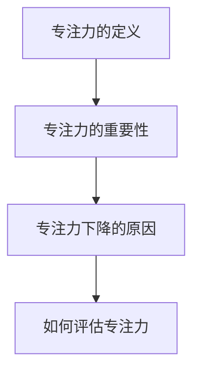
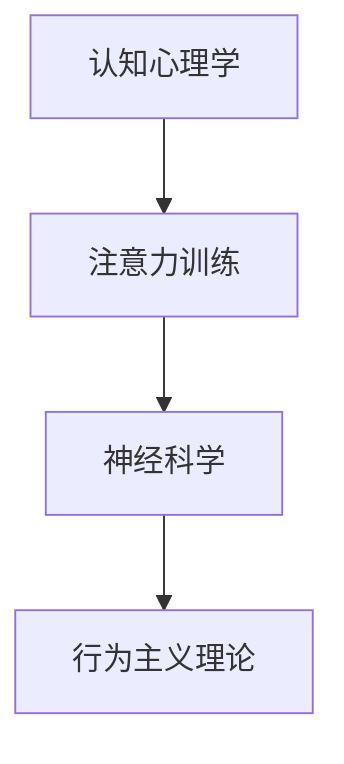
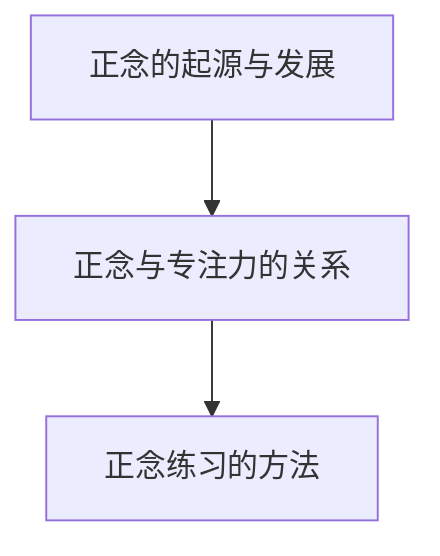
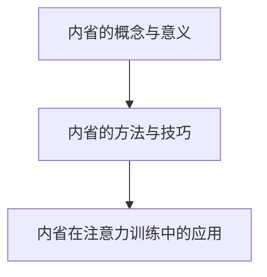
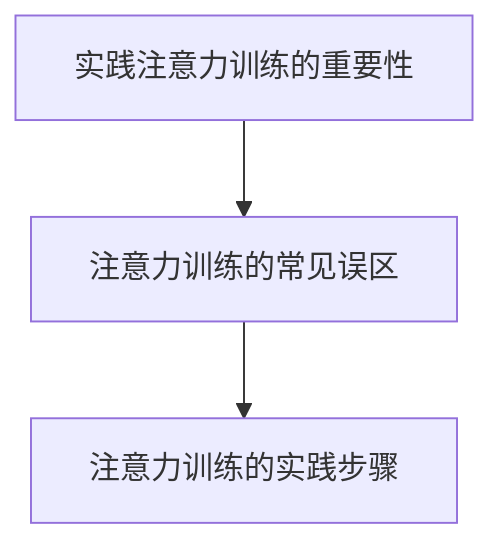
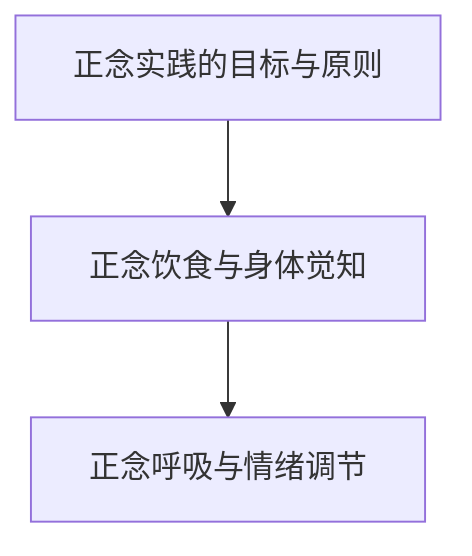

                 

### 文章标题

《注意力训练与正念实践：如何通过内省增强专注力》

关键词：专注力、注意力训练、正念、内省、内省增强、增强专注力

摘要：本文将深入探讨注意力训练与正念实践的关系，通过内省的方法来增强专注力。文章首先分析了专注力的定义和重要性，随后介绍了注意力训练的基本原理和类型，并结合正念与内省的实践，详细探讨了如何通过内省增强专注力。文中通过案例研究展示了这些方法在不同场景下的应用效果，并对未来的发展方向提出了展望。文章旨在为读者提供系统的注意力训练与正念实践指南，帮助提升个人专注力和生活质量。

---

### 第一部分：引言与基础概念

#### 第1章：专注力的重要性

**1.1 专注力的定义与意义**

专注力，又称注意力，是指个体集中精力、排除干扰、保持长时间关注某一对象或任务的心理能力。在计算机科学中，专注力可以类比于CPU的核心频率，决定了信息处理的速度和质量。在人类行为学中，专注力是行为决策、学习和记忆的基础，对个人成就和幸福感有着深远的影响。

**1.2 专注力的重要性**

1. **提高工作效率**：专注力能够帮助人们高效完成工作任务，减少错误和遗漏，提升整体生产效率。
2. **促进学习进步**：良好的专注力有助于深入理解学习内容，加强记忆，提高学习效率。
3. **改善心理健康**：专注力的增强能够减少焦虑和压力，提高情绪稳定性，促进心理健康。
4. **优化人际交往**：专注力有助于更好地倾听和理解他人，提高沟通质量，改善人际关系。

**1.3 为什么专注力下降？**

1. **环境干扰**：现代生活中，电子设备的普及和信息的泛滥使得人们容易受到各种干扰，分散注意力。
2. **习惯问题**：长时间从事低效、单一的任务，容易导致专注力下降，形成习惯性分心。
3. **生理因素**：缺乏足够的睡眠、饮食不均衡等因素也会影响专注力水平。
4. **心理因素**：焦虑、压力和情绪波动等心理问题也会削弱专注力。

**1.4 如何评估专注力？**

1. **专注力测验**：通过专门的测验工具，如瑞文标准推理测验、斯特鲁普效应测试等，可以评估个体的专注力水平。
2. **行为观察**：通过观察个体在工作、学习和日常生活中的表现，可以初步判断其专注力状况。
3. **自我反馈**：个体可以通过记录自己的行为和情绪状态，反思和评估自己的专注力水平。

---

**核心概念与联系：**

专注力的定义、重要性、原因和评估方法相互关联，共同构成了对注意力训练与正念实践的重要基础。以下是一个简化的 Mermaid 流程图，展示了这些概念之间的联系：



### 第2章：注意力训练的基本原理

**2.1 注意力训练的概念**

注意力训练是一种通过特定练习和技巧来提高注意力水平的方法。它包括提高注意力的集中度、持久度和分配度，旨在提升个体在面对复杂任务时的处理能力和效率。

**2.2 注意力训练的理论基础**

1. **认知心理学理论**：认知心理学研究认为，注意力是认知过程的核心，直接影响记忆、决策和问题解决能力。
2. **神经科学理论**：神经科学研究表明，通过特定的训练，可以增强大脑中与注意力相关的神经通路，提高注意力水平。
3. **行为主义理论**：行为主义理论强调，通过重复练习和强化，可以改变个体的行为模式，提高专注力。

**2.3 注意力训练的类型**

1. **选择性注意力训练**：通过筛选重要信息，排除无关干扰，提高专注力。
2. **持续性注意力训练**：通过延长注意力的持续时间，提高专注的持久度。
3. **分配性注意力训练**：通过同时处理多个任务，提高注意力的分配度。

---

**核心概念与联系：**

注意力训练的基本原理涵盖了认知心理学、神经科学和行为主义理论，这些理论共同为注意力训练提供了理论基础。以下是一个简化的 Mermaid 流程图，展示了这些理论之间的联系：



---

### 第3章：注意力训练方法

**3.1 正念与专注力**

**3.1.1 正念的起源与发展**

正念（Mindfulness）起源于佛教的禅修传统，旨在通过专注当下的实践，达到心理的平静和身体的健康。20世纪70年代，美国心理学家约翰·卡巴金（John Kabat-Zinn）将正念引入医学领域，用于治疗慢性疼痛和压力，随后正念在全球范围内得到广泛研究和应用。

**3.1.2 正念与专注力的关系**

正念通过提高个体的觉知能力和注意力集中度，有助于增强专注力。研究发现，正念练习可以减少大脑中与注意力分散相关的活动，增强与专注力相关的神经通路。

**3.1.3 正念练习的方法**

1. **正念呼吸练习**：通过专注于呼吸，放松身心，提高专注力。
2. **正念身体扫描**：通过扫描身体的感觉，提高觉知能力和注意力。
3. **正念步行练习**：通过专注步行，体验身体与环境的互动，提高专注力。

---

**核心概念与联系：**

正念作为一种专注力训练方法，其起源、发展与专注力之间的关系构成了本章的核心内容。以下是一个简化的 Mermaid 流程图，展示了这些概念之间的联系：



---

### 第4章：内省与自我认知

**4.1 内省的概念与意义**

内省（Self-reflection）是指个体对自身思想、情感和行为进行反思和审视的过程。通过内省，个体可以更好地理解自己的内心世界，发现潜在的问题和改进的机会。

**4.2 内省的方法与技巧**

1. **日记法**：通过记录日记，反思自己的日常生活和行为，提高自我认知。
2. **冥想法**：通过冥想，专注内在感受，深入内省，提升专注力。
3. **提问法**：通过提问，深入思考自己的行为动机和结果，促进内省。

**4.3 内省在注意力训练中的应用**

内省可以帮助个体识别自己的注意力分散原因，制定有效的注意力训练计划。通过反思和调整自己的行为模式，个体可以更好地集中注意力，提高专注力。

---

**核心概念与联系：**

内省的概念、方法与应用构成了本章的核心内容。以下是一个简化的 Mermaid 流程图，展示了这些概念之间的联系：



---

### 第5章：注意力训练的实践

**5.1 实践注意力训练的重要性**

实践注意力训练不仅是理论学习的延伸，更是提升专注力的关键。通过实际操作和体验，个体可以将注意力训练的理念和方法融入到日常生活中，逐步提高专注力。

**5.2 注意力训练的常见误区**

1. **过度依赖工具**：依赖各种注意力训练工具，而忽视自身的实践和反思。
2. **急于求成**：期望快速提升专注力，而忽略了长期坚持的重要性。
3. **单一方法训练**：只采用某一种注意力训练方法，而忽略了多种方法的综合应用。

**5.3 注意力训练的实践步骤**

1. **设定目标**：明确注意力训练的目标，制定可行的计划。
2. **持续实践**：坚持每天进行注意力训练，逐步增加训练时间和难度。
3. **反思与调整**：定期反思训练效果，调整训练方法和计划。

---

**核心概念与联系：**

注意力训练的实践步骤、常见误区及重要性构成了本章的核心内容。以下是一个简化的 Mermaid 流程图，展示了这些概念之间的联系：



---

### 第6章：正念实践

**6.1 正念实践的目标与原则**

**6.1.1 目标**

正念实践的目标是通过专注当下的练习，提高个体的觉知能力和情感管理能力，进而增强专注力。

**6.1.2 原则**

1. **无评判**：在练习中不对自己的思想、情感和体验进行评判，保持开放和接受的态度。
2. **当下**：专注于当下的体验，避免被过去的回忆或未来的担忧所干扰。
3. **接纳**：接纳自己的情绪和体验，认识到它们是正常的人性部分。

**6.2 正念饮食与身体觉知**

**6.2.1 正念饮食**

正念饮食是指通过专注进食，体验食物的味道、质地和感觉，从而减少无意识进食和饮食过量。以下是一段正念饮食的指导：

```markdown
**正念饮食指导：**

1. **准备**：在进食前，清理餐桌，创造一个宁静的环境。
2. **专注**：在进食时，放下手机和其他干扰，专注于食物。
3. **细嚼慢咽**：缓慢咀嚼，充分感受食物的味道和质感。
4. **体验**：在进食过程中，注意身体的感受，如饱腹感和满足感。
```

**6.2.2 身体觉知**

身体觉知是正念实践的重要组成部分，通过觉知身体的感受，可以更好地管理情绪和压力。以下是一段身体觉知的指导：

```markdown
**身体觉知指导：**

1. **呼吸**：深呼吸，感受气息在鼻腔、胸腔和腹部流动。
2. **姿势**：保持一个舒适的姿势，如坐直或躺下，放松身体。
3. **感受**：专注于身体的感觉，如疼痛、紧绷或放松。
4. **接纳**：接纳身体的感觉，不评判，只体验。
```

**6.3 正念呼吸与情绪调节**

**6.3.1 正念呼吸**

正念呼吸是一种简单而有效的情绪调节技巧，通过专注呼吸，可以缓解压力和焦虑。以下是一段正念呼吸的指导：

```markdown
**正念呼吸指导：**

1. **准备**：找一个安静的地方，坐直或躺下，闭上眼睛。
2. **深呼吸**：慢慢吸气，感受胸部和腹部的膨胀。
3. **专注**：将注意力集中在呼吸上，感受气息的流动。
4. **放松**：慢慢呼气，放松身体和心情。

**情绪调节**：

1. **识别**：在情绪波动时，停下来，识别自己的情绪。
2. **呼吸**：深呼吸，通过呼吸来调节情绪。
3. **接纳**：接纳情绪的存在，不抗拒，不评判。
4. **释放**：通过呼吸和觉知，逐渐释放情绪。
```

---

**核心概念与联系：**

正念实践的目标、原则以及具体的方法构成了本章的核心内容。以下是一个简化的 Mermaid 流程图，展示了这些概念之间的联系：



---

### 第7章：通过内省增强专注力的案例研究

**7.1 案例一：通过内省改善工作效率**

**背景**：李华是一名公司项目经理，他发现自己经常在工作中分心，导致工作效率低下，项目进度延误。

**内省过程**：

1. **反思**：李华开始记录自己每天的工作内容和分心时刻，分析分心原因。
2. **识别**：他发现，自己的分心主要源于电子邮件、社交媒体和手机通知。
3. **调整**：李华决定关闭手机通知，设定特定时间处理邮件，减少干扰。

**结果**：通过内省和调整，李华的工作效率显著提高，项目进度得以顺利推进。

**分析**：李华通过内省，识别并解决了分心的根本原因，从而显著提升了专注力和工作效率。

---

**7.2 案例二：通过正念提高学习效果**

**背景**：小王是一名高中生，他发现自己学习时容易分心，学习效果不理想。

**正念实践**：

1. **正念呼吸**：每天早晨，小王会花5分钟进行正念呼吸，平静心情。
2. **专注学习**：在学习时，小王会关闭手机和电脑，专注于课本和笔记。
3. **身体觉知**：在学习过程中，小王会定期停下来，感受自己的身体和情绪状态。

**结果**：小王的学习成绩逐渐提高，对学习的兴趣也增加了。

**分析**：小王通过正念实践，提高了专注力和学习效果，同时增强了自我管理和情绪调节能力。

---

**7.3 案例三：通过内省改善人际关系**

**背景**：张女士是一位企业高管，她发现自己在与同事和下属的沟通中容易产生冲突，影响了团队和谐。

**内省过程**：

1. **反思**：张女士开始记录自己与他人的沟通情况，分析冲突的原因。
2. **识别**：她发现，冲突主要源于对同事的不理解和情绪管理问题。
3. **调整**：张女士决定主动与同事沟通，了解他们的工作情况和需求，同时加强情绪管理。

**结果**：张女士的人际关系得到了显著改善，团队协作更加顺畅。

**分析**：张女士通过内省，识别并解决了人际冲突的根本原因，从而提高了人际关系质量。

---

通过以上案例研究，我们可以看到，内省和正念实践在提升专注力和改善生活各个方面都有着显著的成效。这些方法不仅有助于提高工作效率和学习效果，还能改善人际关系，提升整体生活质量。

### 第三部分：结论与展望

#### 第8章：注意力训练与正念实践的总结

**8.1 注意力训练与正念实践的成果**

注意力训练与正念实践在多个方面取得了显著成果：

1. **提高专注力**：通过系统化的训练和内省，个体的专注力得到了显著提升，能够更高效地完成任务。
2. **改善心理健康**：正念实践有助于减少焦虑和压力，提高情绪稳定性，促进心理健康。
3. **优化人际关系**：内省和正念实践有助于个体更好地理解他人，提高沟通质量，改善人际关系。
4. **增强自我认知**：通过内省，个体能够更深入地了解自己的内心世界，发现并解决潜在问题。

**8.2 注意力训练与正念实践的挑战**

尽管注意力训练与正念实践取得了显著成果，但在实践中仍然面临一些挑战：

1. **执行难度**：坚持注意力训练和正念实践需要时间和毅力，很多人难以长期坚持。
2. **效果评估**：如何科学、有效地评估注意力训练与正念实践的效果，仍是一个需要深入研究的问题。
3. **个体差异**：不同个体在注意力训练与正念实践中的效果可能存在显著差异，需要个性化指导。

**8.3 未来发展方向**

为了进一步提升注意力训练与正念实践的效果，未来可以从以下几个方面进行探索：

1. **整合多种方法**：结合注意力训练、正念实践和其他心理训练方法，探索更全面的提升专注力的策略。
2. **技术创新**：利用现代科技，如虚拟现实、增强现实等，开发出更生动、直观的注意力训练工具。
3. **科学验证**：通过大规模、多中心的科学验证，进一步确认注意力训练与正念实践的长期效果和安全性。
4. **普及推广**：通过教育培训、社区活动等途径，将注意力训练与正念实践普及到更广泛的群体，提高整体生活质量。

---

#### 第9章：提升专注力的持续实践

**9.1 保持专注力的习惯**

为了保持专注力，个体可以采取以下措施：

1. **定期练习**：每天设定固定的时间进行注意力训练和正念实践，形成习惯。
2. **设定目标**：为自己设定明确的专注力提升目标，并定期进行评估和调整。
3. **环境优化**：创造一个安静、整洁、有利于专注的工作或学习环境。

**9.2 注意力训练与正念实践的持续性**

1. **定期回顾**：定期回顾自己的注意力训练和正念实践经历，总结经验教训。
2. **持续学习**：通过阅读相关书籍、参加培训课程、交流心得等方式，不断学习和提升。
3. **适应变化**：随着生活和工作环境的变化，及时调整注意力训练和正念实践的方法。

**9.3 针对不同人群的实践建议**

1. **学生**：学生可以通过课堂上的专注力训练、课后的正念练习，提高学习效率和学业成绩。
2. **职场人士**：职场人士可以通过日程管理、时间规划和正念练习，提高工作效率和职业成就感。
3. **老年人**：老年人可以通过正念练习和简单的注意力训练，提高生活质量，减少认知衰退的风险。

---

通过持续实践和不断调整，个体可以不断提升专注力，实现个人目标和提升生活质量。

---

### 附录A：注意力训练与正念实践资源

**A.1 相关书籍推荐**

1. 《正念：一本关于如何活在当下的指南》（Mindfulness: A Practical Guide to Awakening） - 约翰·卡巴金
2. 《专注力训练：提升专注力的心理学技巧与案例》（Focus: The Hidden Driver of Excellence） - 吉姆·莱勒
3. 《禅与计算机程序设计艺术》（The Art of Computer Programming） - 高德纳

**A.2 在线课程与资源**

1. Coursera - 正念课程（Mindfulness for Well-Being and Peak Performance）
2. Udemy - 注意力训练课程（Mastering Focus and Productivity）
3. YouTube - 正念冥想频道（Headspace，Ten Percent Happier）

**A.3 注意力训练与正念实践社区**

1. Facebook - 正念实践群组
2. Reddit - r/Mindfulness 和 r/Productivity
3. Twitter - #Mindfulness 和 #Focus

通过以上资源，读者可以进一步了解和探索注意力训练与正念实践的各个方面，持续提升个人专注力和生活质量。

---

### 附录B：注意力训练与正念实践工具

**B.1 正念冥想应用**

1. **Headspace**：提供各种冥想课程，适合初学者和有经验者。
2. **Calm**：提供放松音乐、自然声音和指导冥想，帮助用户缓解压力。
3. **Insight Timer**：拥有大量的冥想音频，用户可以根据自己的需求选择。

**B.2 注意力训练应用**

1. **Forest**：一款帮助用户提高专注力的应用，通过种植虚拟树木来激励用户。
2. **Pomodoro Timer**：采用番茄工作法，帮助用户高效管理时间。
3. **Freedom**：一款屏蔽干扰应用，帮助用户集中注意力。

**B.3 自我监测工具**

1. **Google Calendar**：通过日程管理，帮助用户规划时间，提高专注力。
2. **RescueTime**：监控用户在电子设备上的使用情况，提供数据分析和建议。
3. **Mood Tracker**：记录用户的情绪变化，帮助识别和应对情绪波动。

这些工具可以辅助读者在日常生活中实践注意力训练和正念方法，提升个人专注力和生活质量。

