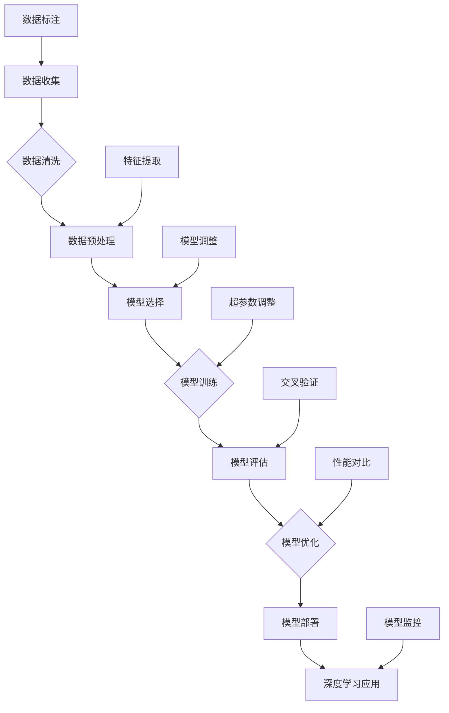

                 

# 《浅薄的简单阶段》

> 关键词：浅薄、简单、认知深度、心理因素、实践、克服、成长

> 摘要：本文深入探讨了“浅薄的简单阶段”这一现象，分析了其概念、误区、心理因素及其在实践中的表现和克服方法。文章旨在帮助读者认识到浅薄阶段的存在，并提供一套实用的策略，以实现从浅薄到深入的转变，促进个人成长与职业发展。

## 目录大纲

## 第一部分：浅薄概念与误区

### 第1章：浅薄与简单：概念解析

#### 1.1 浅薄的定义与影响

#### 1.2 误区：简单等同于浅薄

#### 1.3 浅薄与简单的联系与区别

### 第2章：浅薄思维模式的识别与避免

#### 2.1 浅薄思维模式的表现形式

#### 2.2 如何避免浅薄思维

#### 2.3 深入与浅出的平衡

## 第二部分：浅薄阶段的心理因素

### 第3章：心理因素与浅薄

#### 3.1 心理因素对认识深度的影响

#### 3.2 浅薄心理的成因与表现

#### 3.3 如何克服浅薄心理

### 第4章：提升认知深度：心理策略

#### 4.1 增强好奇心与探索欲

#### 4.2 培养批判性思维

#### 4.3 增进自我反思与学习

## 第三部分：实践中的浅薄阶段

### 第5章：浅薄阶段在实践中的表现

#### 5.1 浅薄阶段在项目中的影响

#### 5.2 如何识别浅薄阶段

#### 5.3 从浅薄到深入的实践转变

### 第6章：从浅薄到深入的实践策略

#### 6.1 项目规划与深度思考

#### 6.2 实践中的深度工作方法

#### 6.3 持续学习与反馈改进

## 第四部分：浅薄阶段的克服与成长

### 第7章：浅薄阶段的克服策略

#### 7.1 自我认知与成长目标

#### 7.2 跨越浅薄阶段的方法

#### 7.3 持续成长与自我超越

### 第8章：浅薄阶段的成长路径

#### 8.1 成长模型的构建

#### 8.2 成长路径的设计与实现

#### 8.3 成长成果的评估与反馈

## 附录

### 附录 A：相关资源与推荐阅读

#### A.1 浅薄阶段相关书籍推荐

#### A.2 心理成长相关工具与资源

#### A.3 实践案例与经验分享

### 附录 B：深度学习流程图

[深度学习流程图]

## 第一部分：浅薄概念与误区

### 第1章：浅薄与简单：概念解析

#### 1.1 浅薄的定义与影响

“浅薄”一词常用来形容一个人在某一领域或知识层面上的理解肤浅，缺乏深度和广度。在IT领域，浅薄现象尤其明显，许多开发者往往停留在技术的表面，对底层原理和算法缺乏深入的理解。这种浅薄不仅影响个人的职业发展，还会导致项目质量和效率的下降。

在技术学习和应用中，浅薄的影响主要体现在以下几个方面：

1. **技术选型不当**：缺乏深度理解导致选择的技术方案往往不符合项目需求，导致后续维护和扩展困难。
2. **代码质量低下**：浅薄的知识基础使得编写代码时容易出现逻辑漏洞和性能瓶颈。
3. **问题定位困难**：对技术原理的理解不深，使得在遇到问题时难以找到根本原因，导致解决问题的效率低下。
4. **创新力不足**：缺乏对技术本质的深刻理解，使得创新和突破的能力受限。

#### 1.2 误区：简单等同于浅薄

许多人误认为简单就是浅薄，其实这是一种误区。简单和浅薄虽然有一定联系，但它们并不是同一个概念。

- **简单**：通常指事物或概念的结构、逻辑或表达方式简明易懂，不复杂。例如，一位优秀的开发者能够用简单的语言解释复杂的技术原理。
- **浅薄**：则是指对事物的理解停留在表面，缺乏深度和广度。简单可以是深刻的，但浅薄一定不是简单的。

在IT领域，简单和浅薄的误区主要体现在以下几个方面：

1. **误以为学习简单技术就足够**：许多初学者认为，学习一些简单的编程语言或框架就能应对所有项目需求，忽略了深入学习和掌握核心技术原理的重要性。
2. **忽视复杂问题的本质**：在解决复杂问题时，一些开发者倾向于选择简单的方法，而忽视了问题的本质和深层次的原因。
3. **过度依赖工具和框架**：一些开发者认为，只要掌握了某个工具或框架，就能轻松完成项目，而忽视了底层原理和算法的学习。

#### 1.3 浅薄与简单的联系与区别

浅薄与简单既有联系又有区别。它们之间的联系在于，简单是浅薄的一种表现形式，而浅薄则是简单的过度和滥用。

- **联系**：
  - 简单和浅薄都强调事物的简明易懂，避免复杂性。
  - 在某些情况下，简单和浅薄可以并存，例如一个简单的算法可能因为实现者的理解不足而显得浅薄。

- **区别**：
  - 简单是基于深度和广度的，是对复杂事物的简化；而浅薄则是缺乏深度和广度的，是对事物的表面理解。
  - 简单可以是深刻的，例如一个简单的算法可能蕴含着深刻的数学原理；而浅薄则一定不是深刻的。

在IT领域，正确理解和区分简单与浅薄至关重要。只有通过深入学习和实践，才能真正掌握技术的本质，避免陷入浅薄陷阱。

### 第2章：浅薄思维模式的识别与避免

#### 2.1 浅薄思维模式的表现形式

浅薄思维模式是导致人们停留在表面层次的主要原因。以下是一些常见的浅薄思维模式：

1. **表面化思维**：只关注问题或现象的表面，缺乏对本质和内在联系的理解。例如，在技术项目中，只关注代码的实现，而忽视了系统设计、架构优化等方面的深层次问题。
2. **经验主义思维**：过于依赖个人经验和直觉，而忽视了理论知识和系统性思考。例如，在解决技术问题时，只依赖过去的经验，而不去寻找最佳实践或新的解决方案。
3. **盲目跟风思维**：盲目追求流行趋势或新技术，而忽视了对技术的深度理解和适用性。例如，在编程语言的选择上，只追求新颖性，而不考虑项目的实际需求和团队的技术栈。
4. **简化主义思维**：过度追求简单和高效，而忽视了复杂问题的多样性和复杂性。例如，在项目规划中，只关注关键路径和关键任务，而忽视了潜在的风险和变数。

#### 2.2 如何避免浅薄思维

要避免浅薄思维，需要从以下几个方面着手：

1. **加强理论基础**：学习理论知识，建立坚实的知识基础。通过阅读经典教材、研究论文和参与学术讨论，加深对技术原理和算法的理解。
2. **培养系统性思维**：从整体和系统的角度看待问题，关注各个部分之间的联系和相互作用。通过学习系统架构、设计模式和软件工程方法，提升系统思维的能力。
3. **保持好奇心和探索欲**：对新技术和新知识保持好奇和探索欲，不断拓宽知识面。通过参加技术会议、阅读技术博客和参与开源项目，保持对技术的热情和敏感度。
4. **批判性思维**：培养批判性思维，对所学的知识和观点进行深入分析和评估。通过提问、质疑和反思，避免盲目接受和追随。
5. **实践与反思**：通过实践和反思，将理论知识应用到实际项目中。在实践中遇到问题时，不仅要解决问题，还要思考问题的本质和解决方法的优缺点。

#### 2.3 深入与浅出的平衡

在技术学习和应用中，深入与浅出的平衡至关重要。以下是一些建议：

1. **确定学习目标**：根据项目的需求和个人的职业规划，确定学习的重点和方向。有目标地学习，避免盲目追求全面而忽视深度。
2. **理论与实践相结合**：理论学习是基础，但实践是检验真理的唯一标准。通过实际项目和应用，将理论知识转化为实际能力。
3. **持续学习和迭代**：技术领域发展迅速，要保持持续学习的态度，不断更新和迭代自己的知识体系。
4. **分享与交流**：通过分享和交流，与他人共同探讨和学习。在交流中，不仅可以获取新的知识和观点，还可以激发自己的思考和理解。

通过深入与浅出的平衡，我们可以在技术学习和应用中实现从浅薄到深入的转变，提升个人的认知深度和专业能力。

## 第二部分：浅薄阶段的心理因素

### 第3章：心理因素与浅薄

#### 3.1 心理因素对认识深度的影响

心理因素在认识深度中起着重要作用。以下是一些主要心理因素及其对认识深度的影响：

1. **认知偏差**：认知偏差是指人们在认知过程中，由于先入为主的观念、习惯或情绪等因素，导致对信息的理解出现偏差。常见的认知偏差包括：

   - **确认偏差**：倾向于接受与已有观念相符的信息，忽视或否定与之相矛盾的信息。
   - **可得性偏差**：根据记忆的易得性来判断信息的真实性和重要性，容易受到近期事件或显著事件的影响。
   - **代表性偏差**：根据事物的表面特征或典型性来判断其真实性和概率，忽视样本的代表性。

   这些认知偏差会导致人们对信息的理解不全面、不准确，从而影响认识深度。

2. **情感因素**：情感因素对认识深度有着重要的影响。情绪高昂时，人们可能更容易产生积极认知，倾向于寻找正面的信息和支持性的观点。相反，情绪低落时，人们可能更容易产生消极认知，忽视或否认正面的信息。例如，在技术项目中，团队的情绪状态会影响对问题的分析和解决方案的选择。

3. **动机因素**：动机是推动人们行为的内在力量。在技术学习和应用中，动机因素会影响人们的认知深度。例如，如果一个人对某一技术领域有浓厚的兴趣和强烈的动机，他们可能会投入更多的时间和精力去深入学习，从而提高认识深度。相反，如果一个人缺乏动机，可能会停留在表面的知识层面，难以达到深入的理解。

4. **自我效能感**：自我效能感是指个体对自己在特定领域或任务中成功完成任务的能力的信念。自我效能感对认识深度有着重要的影响。如果一个人对自己的能力有信心，他们可能会更加努力地学习和探索，从而提高认识深度。相反，如果一个人缺乏自信，可能会认为自己无法深入理解某一领域，从而放弃深入学习的努力。

#### 3.2 浅薄心理的成因与表现

浅薄心理是指人们在认知过程中，由于心理因素导致的对信息理解停留在表面层次，缺乏深度和广度的现象。以下是一些常见的成因和表现：

1. **成因**：

   - **逃避复杂性**：许多人害怕面对复杂的问题和任务，倾向于选择简单的解决方案，避免深入思考和解决问题的挑战。
   - **时间压力**：在快节奏的生活和工作中，人们可能没有足够的时间去深入研究和理解复杂的信息，从而导致浅薄心理。
   - **心理舒适区**：人们在心理上倾向于停留在舒适区内，不愿面对新的挑战和未知的领域，从而陷入浅薄心理。
   - **认知偏差**：认知偏差使人们更容易接受简单的信息，忽视复杂的信息，从而导致浅薄心理。
   - **缺乏好奇心和探索欲**：缺乏对未知领域的好奇心和探索欲，使人们不愿去深入了解和探索复杂的信息。

2. **表现**：

   - **表面化理解**：只关注问题或现象的表面，缺乏对本质和内在联系的理解。
   - **片面化观点**：对某一问题或现象只看到一面，忽视了其他重要的方面。
   - **盲目跟风**：盲目接受流行观点或新技术，缺乏独立思考和判断能力。
   - **缺乏批判性思维**：缺乏对信息的批判性思考，容易接受未经验证的观点和假设。
   - **认知停滞**：对已有知识和信息缺乏深入思考和创新，停留在表面层次的认知状态。

#### 3.3 如何克服浅薄心理

要克服浅薄心理，需要从以下几个方面着手：

1. **增强好奇心和探索欲**：培养对未知领域的好奇心和探索欲，主动寻找新的信息和知识，拓宽认知范围。

   - **阅读**：广泛阅读，不仅限于技术领域，还要涉猎人文、科学、哲学等不同领域的书籍，提高综合素质。
   - **实践**：通过实践将理论知识应用到实际中，加深对知识的理解和掌握。
   - **提问**：不断提出问题，挑战现有的知识和观点，激发深度思考。
   - **交流**：与他人交流，分享观点和经验，从不同角度看待问题。

2. **培养批判性思维**：批判性思维是避免浅薄心理的关键能力。以下是一些建议：

   - **质疑权威**：不盲目接受权威的观点，对信息进行独立分析和判断。
   - **多角度分析**：从不同角度和维度看待问题，避免片面化观点。
   - **寻求证据**：对信息来源进行验证，确保其真实性和可靠性。
   - **反思**：经常反思自己的观点和行为，识别并纠正认知偏差。

3. **制定学习计划**：制定明确的学习计划，有目标地学习和提升自己的认知深度。

   - **确定学习目标**：根据职业规划和兴趣，确定学习重点和方向。
   - **分解任务**：将大任务分解为小任务，逐步完成，避免一次性承受过多压力。
   - **设定时间表**：合理安排学习时间，确保学习计划得到有效执行。

4. **实践和反思**：通过实践和反思，将理论知识应用到实际中，不断迭代和提升自己的认知水平。

   - **做项目**：通过实际项目，将所学知识应用到实际中，提升实践能力。
   - **复盘**：在项目结束后，总结经验和教训，反思问题和改进方案。
   - **持续学习**：保持对新技术和新知识的学习，不断更新自己的知识体系。

通过增强好奇心和探索欲、培养批判性思维、制定学习计划和实践反思，我们可以克服浅薄心理，提升认知深度，实现从浅薄到深入的转变。

### 第4章：提升认知深度：心理策略

在提升认知深度方面，心理策略起着至关重要的作用。以下是一些实用的心理策略，可以帮助我们更好地理解和掌握复杂信息，从而提升认知深度。

#### 4.1 增强好奇心与探索欲

好奇心是推动我们探索未知世界的重要动力。以下是一些方法，可以帮助我们增强好奇心和探索欲：

1. **提出问题**：在学习过程中，不断提出问题，挑战自己的理解和认知。通过提问，我们可以激发对知识的好奇心，并促使自己深入思考。

2. **主动学习**：主动寻找学习资源，如书籍、论文、博客和课程等。通过主动学习，我们可以拓展知识面，培养对知识的好奇心和探索欲。

3. **跨学科学习**：尝试学习不同学科的知识，如人文、科学、艺术等。跨学科学习可以帮助我们建立更广泛的认知网络，从而更好地理解和应用知识。

4. **实践与体验**：通过实际操作和体验，将理论知识应用到实践中。实践不仅可以帮助我们加深对知识的理解，还可以激发我们的探索欲。

5. **设立目标**：设定明确的学习目标和挑战，如完成某个项目、解决某个难题等。目标可以帮助我们保持动力和专注力，从而更好地提升认知深度。

#### 4.2 培养批判性思维

批判性思维是避免浅薄心理、提升认知深度的重要能力。以下是一些培养批判性思维的方法：

1. **质疑权威**：不要盲目接受权威的观点，要对信息来源和论证过程进行独立思考和评估。

2. **多角度分析**：从不同的角度和维度分析问题，避免片面化观点。例如，在技术项目中，要考虑需求、设计、实现、测试等不同阶段的问题。

3. **寻求证据**：对所接受的信息进行验证，确保其真实性和可靠性。可以通过查阅文献、咨询专家、实践验证等方法来寻求证据。

4. **反思与自我监控**：经常反思自己的思维过程和观点，识别并纠正认知偏差。通过自我监控，我们可以提高思维的准确性和深度。

5. **开放心态**：保持开放心态，接受不同的观点和意见。通过与他人交流，我们可以拓展自己的思维边界，从而更好地理解和应用知识。

#### 4.3 增进自我反思与学习

自我反思和学习是提升认知深度的关键步骤。以下是一些增进自我反思与学习的方法：

1. **写反思日志**：定期记录自己的学习过程和思考，总结经验教训，识别问题和改进方向。

2. **设定学习目标**：根据个人兴趣和职业规划，设定明确的学习目标，并制定相应的学习计划。

3. **持续学习**：保持对新技术和新知识的学习，不断更新自己的知识体系。可以通过参加培训、阅读书籍、参加线上课程等方式进行学习。

4. **实践与反思**：将所学知识应用到实际项目中，通过实践和反思，不断迭代和提升自己的认知深度。

5. **交流与分享**：与他人分享自己的学习经验和思考，通过交流和讨论，拓展自己的思维和认知边界。

通过增强好奇心和探索欲、培养批判性思维以及增进自我反思与学习，我们可以提升认知深度，避免陷入浅薄阶段，从而实现个人成长和职业发展。

## 第三部分：实践中的浅薄阶段

### 第5章：浅薄阶段在实践中的表现

#### 5.1 浅薄阶段在项目中的影响

在IT项目中，浅薄阶段可能会对项目产生以下影响：

1. **质量下降**：由于对技术的理解不够深入，开发人员可能会编写出低质量、不稳定的代码。这会导致项目出现更多的bug和性能问题，影响项目的交付质量和用户体验。

2. **进度延误**：在项目初期，由于对技术的了解不足，开发人员可能会选择不合适的工具和框架，导致项目进度延误。此外，对问题的理解不够深入，可能会导致问题定位和解决过程变得复杂，从而延长项目的开发周期。

3. **沟通困难**：浅薄阶段会导致团队成员之间沟通不畅，特别是在涉及到技术细节时。由于缺乏深入的技术理解，团队成员可能无法准确表达自己的想法，也无法理解其他成员的技术方案，从而影响项目的协作效果。

4. **创新能力受限**：在浅薄阶段，开发人员可能会停留在表面，缺乏对技术本质和创新点的深入思考。这会导致项目在技术上缺乏创新，无法满足用户的需求，也无法在激烈的市场竞争中脱颖而出。

#### 5.2 如何识别浅薄阶段

要识别浅薄阶段，可以从以下几个方面进行观察：

1. **代码质量**：观察代码的编写质量，包括代码的可读性、可维护性、性能等方面。如果代码存在大量bug、冗余代码、低效算法等，可能表明开发人员处于浅薄阶段。

2. **技术选型**：分析项目中所使用的技术栈和工具，如果开发人员仅仅是因为工具的流行或简单易用而选择，而不是基于项目需求和自身技术能力，可能表明他们处于浅薄阶段。

3. **团队成员反馈**：通过团队成员的反馈，了解他们在项目中遇到的困难、对技术方案的理解程度以及沟通情况。如果团队成员普遍表示对项目的技术方案不清晰、对技术细节理解不深刻，可能表明项目处于浅薄阶段。

4. **项目进度**：观察项目的进度，特别是关键节点的完成情况。如果项目进度明显滞后，可能是因为开发人员对技术的理解不足，导致项目实施过程中出现各种问题。

5. **问题定位与解决**：在项目实施过程中，观察开发人员对问题的定位和解决能力。如果开发人员经常无法准确找到问题的根本原因，或者解决方法过于简单粗暴，可能表明他们处于浅薄阶段。

#### 5.3 从浅薄到深入的实践转变

要从浅薄阶段转变为深入阶段，需要采取以下实践策略：

1. **深入学习**：针对项目中的关键技术点，进行深入学习和研究。可以通过阅读技术书籍、研究论文、参加技术培训等方式，提升对技术的理解。

2. **实践应用**：将所学的知识应用到实际项目中，通过实践来加深对技术的掌握。可以通过小项目、个人练习或参与开源项目等方式，提高实践能力。

3. **问题解决**：鼓励团队成员在遇到问题时，不仅要解决表面问题，还要深入分析问题的根本原因。通过问题解决，提升对技术的深入理解。

4. **团队协作**：加强团队内部的沟通和协作，特别是技术交流和知识分享。通过团队成员之间的互动和讨论，共同提升对技术的认知深度。

5. **反思与总结**：在项目结束后，进行项目复盘和总结，识别项目中的问题和不足，反思如何改进。通过总结和反思，不断提高项目质量和团队的技术水平。

通过深入学习、实践应用、问题解决、团队协作和反思总结，可以从浅薄阶段转变为深入阶段，提升项目的质量、进度和团队的技术水平。

### 第6章：从浅薄到深入的实践策略

要从浅薄阶段转变为深入阶段，需要采取一系列有效的实践策略。以下是一些关键策略：

#### 6.1 项目规划与深度思考

在项目规划阶段，需要重视深度思考和全面分析，以避免浅薄决策。

1. **需求分析**：深入了解项目的需求和目标，确保对业务场景有全面的理解。通过与客户、产品经理和技术团队的沟通，确保需求分析的深度和准确性。

2. **技术选型**：在技术选型阶段，不要只追求简单和易用性，而要综合考虑技术方案的适用性、性能、可维护性和扩展性。通过对比不同技术方案，选择最合适的技术栈。

3. **风险评估**：对项目可能面临的风险进行评估，包括技术风险、业务风险和时间风险。通过提前识别和应对风险，降低项目实施过程中的不确定性。

4. **资源规划**：合理安排项目资源，包括人力、时间和技术资源。确保项目团队能够有足够的时间和精力进行深度学习和实践。

#### 6.2 实践中的深度工作方法

在项目实施过程中，采取深度工作方法可以提高工作效率和技术水平。

1. **任务分解**：将项目任务分解为小任务，确保每个任务都有明确的目标和交付物。通过小步快跑，逐步推进项目进度。

2. **技术调研**：在开始每个任务之前，进行充分的技术调研，确保对相关技术有深入的了解。可以通过阅读文档、研究案例和与专家交流等方式，提高技术认知。

3. **代码审查**：在代码编写过程中，进行代码审查，确保代码质量。通过代码审查，可以发现潜在的问题和改进点，提高代码的可读性和可维护性。

4. **持续集成**：采用持续集成（CI）方法，确保代码的持续测试和部署。通过CI，可以快速发现问题并修复，提高项目进度和质量。

#### 6.3 持续学习与反馈改进

持续学习和反馈改进是提升技术水平的重要手段。

1. **定期培训**：组织定期的技术培训，包括内部培训和外部培训。通过培训，提升团队成员的技术能力和知识水平。

2. **知识分享**：鼓励团队成员分享自己的经验和知识，通过技术分享会、博客和文档等方式，提高团队整体的技术水平。

3. **反馈机制**：建立有效的反馈机制，包括项目评审、代码评审和用户反馈等。通过反馈，识别项目中的问题和不足，并采取改进措施。

4. **自我反思**：鼓励团队成员定期进行自我反思，总结项目中的经验和教训，识别自身的技术盲点和改进方向。

通过项目规划与深度思考、实践中的深度工作方法以及持续学习与反馈改进，可以从浅薄阶段转变为深入阶段，提升项目质量、团队协作和技术水平。

### 第7章：浅薄阶段的克服策略

#### 7.1 自我认知与成长目标

要克服浅薄阶段，首先需要对自己进行深入认知，明确成长目标。以下是一些关键步骤：

1. **自我评估**：了解自己的技术水平和能力，识别自己在哪些方面存在浅薄现象。可以通过自我评估工具、他人反馈和项目复盘等方式，进行全面评估。

2. **设定成长目标**：根据自我评估的结果，设定明确的成长目标。成长目标应具体、可衡量、可实现。例如，学习一种新的编程语言、掌握一种新技术或通过专业认证等。

3. **制定学习计划**：制定详细的学习计划，包括学习内容、学习时间和学习进度。通过学习计划，确保自己的学习目标得到有效实施。

4. **持续反思**：定期进行自我反思，评估学习成果和成长进度。通过反思，识别自身存在的问题和改进方向，调整学习计划。

#### 7.2 跨越浅薄阶段的方法

要实现从浅薄阶段到深入阶段的跨越，需要采取一系列有效的策略和方法。以下是一些建议：

1. **深入学习**：选择一门技术或领域，进行深入学习。通过阅读经典教材、研究论文和技术博客，掌握技术原理和算法。

2. **实践应用**：将所学知识应用到实际项目中，通过实践来加深对技术的理解。可以通过小项目、个人练习或参与开源项目等方式，提高实践能力。

3. **问题解决**：鼓励在项目中遇到问题时，深入分析问题的根本原因，并提出有效的解决方案。通过问题解决，提升对技术的深入理解。

4. **团队协作**：积极参与团队项目，与他人共同探讨和解决问题。通过团队协作，拓宽视野，提高对技术的全面认知。

5. **持续学习**：保持对新技术和新知识的学习，不断更新自己的知识体系。可以通过参加培训、阅读书籍、参加线上课程等方式，保持学习的持续性和深度。

6. **反馈与改进**：建立有效的反馈机制，包括项目评审、代码评审和用户反馈等。通过反馈，识别项目中的问题和不足，并采取改进措施。

7. **自我挑战**：设定自我挑战任务，如解决复杂问题、参加技术竞赛或编写技术博客等。通过自我挑战，提升技术水平和自信心。

通过自我认知与成长目标的设定、跨越浅薄阶段的方法，我们可以逐步提升自己的认知深度和专业能力，实现从浅薄到深入的转变。

### 第8章：浅薄阶段的成长路径

要实现从浅薄阶段到深入阶段的转变，需要制定一个明确的成长路径。以下是一个包含关键步骤和实施方法的成长路径：

#### 8.1 成长模型的构建

一个有效的成长模型应包括以下几个关键组成部分：

1. **目标设定**：明确个人的成长目标和方向。目标应具体、可衡量、可实现。例如，学习一种新的编程语言、掌握一种新技术或通过专业认证等。

2. **学习路径**：制定详细的学习路径，包括学习内容、学习资源和学习时间。学习内容应涵盖基础知识、核心技术和应用实践。

3. **实践机会**：提供丰富的实践机会，包括项目实践、个人练习和开源项目等。实践是提升技术能力的有效途径。

4. **反馈机制**：建立有效的反馈机制，包括项目评审、代码评审和用户反馈等。通过反馈，识别自身的问题和改进方向。

5. **评估与调整**：定期对成长进度进行评估，并根据评估结果调整学习计划。评估指标可以包括知识掌握程度、项目完成情况和问题解决能力等。

#### 8.2 成长路径的设计与实现

以下是设计与实现成长路径的具体步骤：

1. **目标设定**：根据个人兴趣和职业规划，设定具体的成长目标。例如，如果你是一名软件工程师，可以设定学习Python、掌握Docker和Kubernetes等目标。

2. **学习路径**：制定详细的学习计划，包括以下内容：

   - **基础知识**：学习相关技术的入门知识，如Python基础、容器技术基础等。
   - **核心技术**：深入学习核心技术和算法，如Python高级特性、容器编排等。
   - **应用实践**：将所学知识应用到实际项目中，解决实际问题。

3. **实践机会**：参与项目实践、个人练习和开源项目等。通过实际操作，提高技术水平。

4. **反馈机制**：建立反馈机制，包括：

   - **项目评审**：在项目结束后，进行项目评审，识别项目中的问题和不足，并采取措施进行改进。
   - **代码评审**：在编写代码时，进行代码评审，确保代码质量。
   - **用户反馈**：收集用户反馈，了解用户需求和满意度，并根据反馈进行改进。

5. **评估与调整**：定期评估成长进度，根据评估结果调整学习计划。可以设置评估周期，如每季度或每半年进行一次评估。

#### 8.3 成长成果的评估与反馈

评估成长成果是确保成长路径有效性的重要环节。以下是一些评估和反馈的方法：

1. **知识掌握程度**：通过考试、认证和项目评估等方式，评估对知识的掌握程度。

2. **项目完成情况**：评估项目完成情况，包括项目质量、进度和用户满意度等。

3. **问题解决能力**：评估在面对问题和挑战时的解决能力，包括问题的定位、分析和解决方案的提出。

4. **自我评估**：定期进行自我评估，识别自身存在的问题和改进方向。

5. **反馈与改进**：根据评估结果，提供反馈和改进建议。可以设置反馈周期，如每季度或每半年进行一次反馈。

通过制定和实施一个明确的成长路径，结合有效的评估和反馈机制，我们可以逐步提升自己的认知深度和专业能力，实现从浅薄到深入的转变。

### 附录 A：相关资源与推荐阅读

在探索和克服“浅薄的简单阶段”的过程中，以下是一些相关资源与推荐阅读，它们可以为读者提供有价值的指导和支持。

#### A.1 浅薄阶段相关书籍推荐

1. **《深度工作》（Deep Work） - Cal Newport**
   - 这本书探讨了如何在一个充满分心的环境中集中精力进行深入工作。它提供了实用的策略和案例，帮助读者建立深度工作的习惯。

2. **《思考，快与慢》（Thinking, Fast and Slow） - Daniel Kahneman**
   - 本书介绍了人类思维的两种模式：快速的直觉思考和慢速的理性思考。通过理解这两种思考方式，读者可以更好地识别并克服认知偏差。

3. **《认知盈余》（Cognitive Surplus） - Clay Shirky**
   - Shirky探讨了人们如何通过协作和分享知识来创造价值。这本书强调了在技术环境中，通过社交和协作可以提升认知深度。

#### A.2 心理成长相关工具与资源

1. **“刻意练习”（Deliberate Practice）**
   - 刻意练习是一种通过有目的、重复性和结构化的练习来提高技能的方法。网站如MasterClass和Udemy提供了各种技能的在线课程，帮助读者进行刻意练习。

2. **“思维导图”（Mind Mapping）**
   - 思维导图是一种图形化的思考工具，可以帮助读者组织思路、梳理复杂信息。软件如MindMeister和Xmind提供了便捷的在线思维导图工具。

3. **“反思日志”（Reflective Journaling）**
   - 反思日志是一种记录个人思考和经历的方法。通过定期写作，读者可以更好地理解自己，识别成长路径。

#### A.3 实践案例与经验分享

1. **GitHub开源项目**
   - GitHub上有大量的开源项目，提供了丰富的实践案例和代码示例。通过参与这些项目，读者可以学习到实际的技术应用和解决问题的方法。

2. **技术社区和论坛**
   - 技术社区如Stack Overflow、Reddit和知乎提供了平台，让开发者可以提问、分享经验和讨论技术问题。这些社区是获取实践经验和见解的好地方。

3. **“黑客与画家”（Hackers & Painters） - Paul Graham**
   - Paul Graham的这本书通过探讨黑客和画家的共同点，提供了关于创造性思维和技能发展的见解，对技术实践者有启发作用。

通过这些资源和推荐阅读，读者可以更深入地理解“浅薄的简单阶段”及其克服方法，从而在个人和职业生涯中实现从浅薄到深入的转变。

### 附录 B：深度学习流程图

深度学习是人工智能领域的重要分支，以下是一个简化的深度学习流程图，展示了从数据预处理到模型部署的主要步骤。

#### 说明：

- **数据收集**：收集用于训练的数据集。
- **数据清洗**：处理缺失值、异常值等，确保数据质量。
- **数据预处理**：包括归一化、标准化、特征提取等，为模型训练做准备。
- **模型选择**：根据问题类型和数据特点选择合适的模型。
- **模型训练**：使用训练数据进行模型的参数优化。
- **模型评估**：使用验证数据评估模型的性能。
- **模型优化**：通过调整超参数和模型结构来提高性能。
- **模型部署**：将训练好的模型部署到生产环境中。
- **深度学习应用**：使用深度学习模型解决实际问题。

通过这个流程图，可以清晰地看到深度学习的各个阶段及其相互关系，有助于读者理解深度学习的整体流程和关键步骤。

## 作者信息

作者：AI天才研究院/AI Genius Institute & 禅与计算机程序设计艺术 /Zen And The Art of Computer Programming

本文由AI天才研究院和《禅与计算机程序设计艺术》的作者共同撰写，旨在帮助读者深入理解并克服“浅薄的简单阶段”，提升认知深度和专业能力，实现个人和职业的成长与突破。希望通过本文的分享，能够为读者提供有价值的思考和实际操作指南。如果您有任何疑问或建议，欢迎在评论区留言交流。谢谢您的阅读！

