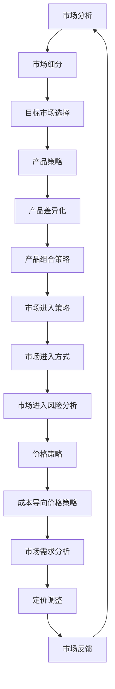

                 

### 《消费市场的扩展与价格》

> 关键词：消费市场、扩展策略、价格策略、市场细分、产品策略、市场进入、成本导向、市场导向、竞争导向

> 摘要：本文深入探讨了消费市场的扩展与价格策略。首先，通过定义与特性，概述了消费市场的概念。接着，分析了消费市场的扩展策略，包括市场细分、产品策略和市场进入策略。随后，重点介绍了价格策略的三种类型：成本导向、市场导向和竞争导向，并结合数学模型和算法进行了详细解析。最后，通过综合策略的协调与案例分析，探讨了消费市场扩展与价格策略的协调与效果评估，并对未来进行了展望。

### 第一部分：消费市场概述

#### 1.1 消费市场的定义与特性

**1.1.1 消费市场的定义**

消费市场是指消费者为了满足自身需求，购买商品或服务的场所。它是市场经济的重要组成部分，反映了消费者的需求、消费行为和市场竞争情况。

**1.1.2 消费市场的特性**

1. **多样性**：消费市场涵盖了不同年龄、性别、收入水平的消费者，商品和服务种类繁多，满足了消费者的多样化需求。
2. **地域性**：消费市场具有地域性特征，不同地区的消费市场具有不同的消费习惯和需求。
3. **动态性**：消费市场受到经济、社会、文化等多种因素的影响，其规模、结构和行为特征处于不断变化中。
4. **竞争性**：消费市场中的企业为了争夺市场份额，采取了各种竞争策略，如价格竞争、产品竞争等。

**1.1.3 消费市场的分类**

1. **按消费主体分类**：可分为个人消费市场和机构消费市场。个人消费市场是指消费者为个人生活需要而购买商品或服务；机构消费市场是指企业、政府、学校等机构为生产、办公或教育等目的而购买商品或服务。
2. **按商品和服务分类**：可分为实物商品市场、服务市场、资本市场等。实物商品市场主要交易实物商品，如家电、家具等；服务市场主要交易服务，如餐饮、旅游等；资本市场则是以金融产品为交易对象的市场。

#### 1.2 消费市场的规模与发展趋势

**1.2.1 消费市场的规模**

消费市场的规模可以通过市场规模、消费总额、消费者数量等指标来衡量。随着全球经济的不断发展，消费市场的规模也在不断扩大。

**1.2.2 消费市场的发展趋势**

1. **消费升级**：随着消费者收入水平的提高，对高品质、个性化、多样化的商品和服务的需求不断增长。
2. **线上线下融合**：电子商务的快速发展，使线上线下融合成为消费市场的主要趋势。
3. **绿色消费**：环保意识逐渐增强，消费者对绿色、环保的商品和服务需求增加。
4. **国际化**：随着全球化进程的加快，消费市场的国际化趋势日益明显。

**1.2.3 消费市场的影响因素**

1. **经济因素**：经济增长水平、居民收入水平、就业情况等对消费市场产生直接影响。
2. **社会因素**：人口结构、教育水平、文化背景等影响消费者的消费行为。
3. **政策因素**：税收政策、货币政策、消费政策等对消费市场产生调控作用。
4. **技术因素**：新技术、新产品、新服务不断涌现，推动消费市场的创新和发展。

#### 1.3 消费市场的重要性

消费市场作为经济发展的重要引擎，具有以下几个方面的意义：

1. **促进经济增长**：消费市场的扩大可以拉动经济增长，促进产业升级和就业。
2. **提高人民生活水平**：消费市场提供了丰富的商品和服务，满足了人们日益增长的需求，提高了人民的生活水平。
3. **推动产业创新**：消费市场对新技术、新产品和新服务的需求，推动了产业的创新和发展。
4. **调节资源配置**：消费市场通过价格机制，实现了资源的合理配置，促进了市场经济的健康发展。

### 第二部分：消费市场的扩展策略

#### 2.1 市场细分策略

**2.1.1 市场细分的概念**

市场细分是指根据消费者需求、行为、偏好等方面的差异，将一个大的市场划分为若干个具有相似特征的子市场。市场细分的目标是找到具有相似需求和购买行为的消费者群体，以便更好地满足他们的需求，提高市场占有率。

**2.1.2 市场细分的方法**

1. **地理细分**：根据消费者所在的地理位置、气候、经济发展水平等因素，将市场划分为不同地理区域。
2. **人口细分**：根据消费者的年龄、性别、收入、职业、教育水平等因素，将市场划分为不同人口群体。
3. **心理细分**：根据消费者的生活方式、个性、价值观、兴趣爱好等因素，将市场划分为不同心理群体。
4. **行为细分**：根据消费者的购买行为、使用习惯、购买频率、忠诚度等因素，将市场划分为不同行为群体。

**2.1.3 市场细分的应用**

1. **目标市场选择**：通过市场细分，企业可以找到最具潜力的目标市场，制定更精准的市场营销策略。
2. **产品定位**：根据不同市场细分群体的需求，企业可以设计出更符合消费者需求的产品，提高市场竞争力。
3. **渠道选择**：根据不同市场细分群体的消费习惯，企业可以选择合适的销售渠道，提高销售效率。
4. **促销策略**：根据不同市场细分群体的购买行为，企业可以制定更具吸引力的促销策略，提升消费者购买意愿。

#### 2.2 产品策略

**2.2.1 产品创新**

产品创新是指企业通过技术创新、设计创新等方式，开发出具有竞争力的新产品，以满足消费者的需求。产品创新是企业提升市场竞争力的关键手段。

**2.2.2 产品差异化**

产品差异化是指企业通过提供独特的产品特性，如功能、设计、质量等，使其与其他竞争对手的产品产生差异，从而吸引消费者。产品差异化有助于提高产品的市场竞争力。

**2.2.3 产品组合策略**

产品组合策略是指企业根据市场需求和自身资源，合理安排产品的种类、数量、质量和品牌，以提高市场占有率。产品组合策略包括宽度策略、深度策略、一致性策略和多样性策略。

#### 2.3 市场进入策略

**2.3.1 市场进入的方式**

1. **直接进入**：企业在现有市场上直接销售产品或提供服务，如开设门店、建立官方网站等。
2. **间接进入**：企业通过代理商、分销商等渠道，间接进入市场，如代销、联营等。
3. **合资进入**：企业与当地企业合资成立公司，共同开发和销售产品。
4. **并购进入**：企业通过收购竞争对手或相关企业，快速进入市场。

**2.3.2 市场进入的风险分析**

1. **市场风险**：包括市场需求、市场竞争、市场环境等方面的不确定性。
2. **财务风险**：包括投资回报、资金流动、财务风险等方面的不确定性。
3. **运营风险**：包括生产运营、供应链管理、市场营销等方面的不确定性。
4. **法律风险**：包括政策法规、知识产权等方面的不确定性。

**2.3.3 市场进入策略的制定**

1. **目标市场选择**：根据企业资源和市场潜力，确定目标市场。
2. **进入方式选择**：根据市场环境和企业能力，选择合适的进入方式。
3. **进入时机选择**：根据市场机会和风险，确定进入市场的最佳时机。
4. **风险管理**：制定风险管理策略，降低市场进入风险。

#### 2.4 消费市场扩展策略的协调

**2.4.1 市场细分策略与产品策略的协调**

市场细分策略和产品策略之间需要相互协调。市场细分提供了目标市场的基础，产品策略则根据目标市场的需求，设计出具有竞争力的产品。

**2.4.2 市场细分策略与市场进入策略的协调**

市场细分策略和市场进入策略也需要相互协调。市场细分确定了目标市场，市场进入策略则提供了进入目标市场的具体途径。

**2.4.3 产品策略与市场进入策略的协调**

产品策略和市场进入策略之间需要相互协调。产品策略决定了产品的特性，市场进入策略则提供了进入市场的具体方式。

通过市场细分、产品策略和市场进入策略的协调，企业可以更好地满足消费者需求，提高市场竞争力，实现消费市场的有效扩展。

### 第三部分：价格策略

#### 3.1 价格策略概述

**3.1.1 价格策略的定义**

价格策略是指企业根据市场环境、竞争态势、成本结构等因素，制定的关于产品或服务的价格决策和策略。价格策略是企业市场营销策略的重要组成部分，直接关系到企业的盈利能力和市场竞争力。

**3.1.2 价格策略的类型**

1. **成本导向价格策略**：以产品成本为基础，加上一定的利润率，确定产品价格。成本导向价格策略主要包括完全成本加成定价法、目标利润定价法等。

2. **市场导向价格策略**：以市场需求和竞争态势为基础，确定产品价格。市场导向价格策略主要包括需求导向定价法、竞争导向定价法等。

3. **竞争导向价格策略**：以竞争对手的价格水平为基础，结合自身产品特性，确定产品价格。竞争导向价格策略主要包括跟随策略、领先策略、挑战策略等。

**3.1.3 价格策略的影响因素**

1. **市场需求**：市场需求是影响价格策略的重要因素。市场需求旺盛时，企业可以提高价格；市场需求低迷时，企业可以降低价格。

2. **竞争态势**：竞争态势直接影响价格策略的制定。在竞争激烈的市场中，企业可能采用价格竞争策略；在竞争较少的市场中，企业可能采用差异化价格策略。

3. **成本结构**：成本结构是影响价格策略的另一个重要因素。企业需要根据成本结构，合理确定产品价格，以保证盈利能力。

4. **政策法规**：政策法规对价格策略也有重要影响。例如，税收政策、价格监管政策等，都会影响企业的价格策略。

5. **消费者心理**：消费者心理对价格策略也有一定影响。消费者对价格的敏感程度、购买动机等，都会影响企业的价格决策。

#### 3.2 成本导向价格策略

**3.2.1 成本导向价格策略的概念**

成本导向价格策略是指以产品成本为基础，加上一定的利润率，确定产品价格。成本导向价格策略是企业最常用的价格策略之一，具有简单易行、易于控制等优点。

**3.2.2 成本导向价格策略的计算方法**

成本导向价格策略的计算方法主要包括以下几种：

1. **完全成本加成定价法**：以产品成本为基础，加上一定的利润率，计算出产品价格。计算公式为：

   $$ P = C + M $$

   其中，\( P \) 为产品价格，\( C \) 为产品成本，\( M \) 为利润率。

2. **目标利润定价法**：以企业的目标利润为基础，加上产品成本，计算出产品价格。计算公式为：

   $$ P = C + \frac{P_{\text{目标}}}{Q} $$

   其中，\( P_{\text{目标}} \) 为目标利润，\( Q \) 为产品销售量。

**3.2.3 成本导向价格策略的优缺点**

**优点：**

1. **简单易行**：成本导向价格策略计算方法简单，易于实施和操作。
2. **易于控制**：成本导向价格策略以成本为基础，可以较好地控制产品的利润率，保证企业的盈利能力。

**缺点：**

1. **忽视市场需求**：成本导向价格策略主要关注成本和利润，忽视了市场需求和竞争态势，可能导致产品定价过高或过低。
2. **竞争压力**：在竞争激烈的市场环境中，成本导向价格策略可能导致企业产品价格过高，失去市场竞争力。

#### 3.3 市场导向价格策略

**3.3.1 市场导向价格策略的概念**

市场导向价格策略是指以市场需求和竞争态势为基础，确定产品价格。市场导向价格策略主要关注市场需求和竞争态势，具有较好的市场适应性。

**3.3.2 市场导向价格策略的计算方法**

市场导向价格策略的计算方法主要包括以下几种：

1. **需求导向定价法**：根据市场需求强度和消费者支付意愿，确定产品价格。计算公式为：

   $$ P = \frac{1}{\frac{Q}{P}} $$

   其中，\( P \) 为产品价格，\( Q \) 为市场需求量。

2. **竞争导向定价法**：根据竞争对手的价格水平，结合自身产品特性，确定产品价格。计算公式为：

   $$ P = C + \delta \times (P_{\text{竞争}} - C) $$

   其中，\( P_{\text{竞争}} \) 为竞争对手的价格，\( \delta \) 为调整系数。

**3.3.3 市场导向价格策略的优缺点**

**优点：**

1. **市场适应性**：市场导向价格策略充分考虑市场需求和竞争态势，具有较好的市场适应性。
2. **提高竞争力**：在竞争激烈的市场环境中，市场导向价格策略可以更好地适应市场变化，提高企业竞争力。

**缺点：**

1. **计算复杂**：市场导向价格策略需要考虑多种因素，计算方法相对复杂。
2. **信息依赖**：市场导向价格策略需要收集和分析大量市场信息，对企业的信息获取和处理能力要求较高。

#### 3.4 竞争导向价格策略

**3.4.1 竞争导向价格策略的概念**

竞争导向价格策略是指以竞争对手的价格水平为基础，结合自身产品特性，确定产品价格。竞争导向价格策略主要关注市场竞争态势，具有较好的竞争适应性。

**3.4.2 竞争导向价格策略的计算方法**

竞争导向价格策略的计算方法主要包括以下几种：

1. **跟随策略**：以竞争对手的价格水平为基础，确定自己的产品价格。计算公式为：

   $$ P = P_{\text{竞争}} $$

   其中，\( P_{\text{竞争}} \) 为竞争对手的价格。

2. **领先策略**：以低于竞争对手的价格，确定自己的产品价格，以获取更大的市场份额。计算公式为：

   $$ P < P_{\text{竞争}} $$

   其中，\( P_{\text{竞争}} \) 为竞争对手的价格。

3. **挑战策略**：以高于竞争对手的价格，确定自己的产品价格，以展示产品的高质量和独特性。计算公式为：

   $$ P > P_{\text{竞争}} $$

   其中，\( P_{\text{竞争}} \) 为竞争对手的价格。

**3.4.3 竞争导向价格策略的优缺点**

**优点：**

1. **竞争适应性**：竞争导向价格策略充分考虑市场竞争态势，具有较好的竞争适应性。
2. **提高品牌形象**：通过挑战策略，可以提高企业的品牌形象和知名度。

**缺点：**

1. **市场压力**：在竞争激烈的市场环境中，竞争导向价格策略可能导致企业产品价格过高或过低，影响市场竞争力。
2. **成本压力**：在跟随策略和挑战策略中，企业可能需要承担较高的成本压力，影响盈利能力。

#### 3.5 价格策略的选择与应用

企业在制定价格策略时，需要综合考虑市场需求、竞争态势、成本结构、消费者心理等因素。以下是一些常见价格策略的选择与应用：

1. **新产品的价格策略**：在推出新产品时，企业可以采用渗透定价法或撇脂定价法，以快速占领市场或获取高额利润。

2. **季节性产品的价格策略**：对于季节性较强的产品，企业可以采用季节性折扣策略，以吸引消费者在淡季购买。

3. **高端产品的价格策略**：对于高端产品，企业可以采用高品质定价策略，以展示产品的独特性和价值。

4. **国际市场的价格策略**：在国际市场中，企业需要考虑汇率、关税、消费习惯等因素，制定适合当地市场的价格策略。

通过合理选择和应用价格策略，企业可以更好地满足消费者需求，提高市场竞争力，实现可持续发展。

### 第四部分：消费市场扩展与价格策略综合

#### 4.1 消费市场扩展与价格策略的协调

消费市场扩展与价格策略的协调是企业实现市场扩张和盈利目标的关键。协调两种策略，可以最大化市场潜力，提高企业竞争力。

**4.1.1 消费市场扩展与价格策略的关系**

1. **市场扩展推动价格策略**：市场扩展为企业提供了更多的销售渠道和消费者群体，为价格策略的实施提供了基础。
2. **价格策略支持市场扩展**：合理的价格策略可以降低消费者购买门槛，吸引更多消费者，推动市场扩展。

**4.1.2 消费市场扩展与价格策略的协调策略**

1. **市场细分与价格策略的协调**：根据市场细分结果，制定不同的价格策略，满足不同细分市场的需求。
2. **产品策略与价格策略的协调**：结合产品定位和价格策略，确保产品在市场上的竞争力。
3. **市场进入策略与价格策略的协调**：根据市场进入策略，制定符合市场环境和竞争态势的价格策略。

**4.1.3 消费市场扩展与价格策略的综合效果评估**

1. **市场份额**：通过协调市场扩展与价格策略，评估企业市场份额的提升情况。
2. **盈利能力**：分析价格策略对盈利能力的影响，确保价格策略与企业整体盈利目标相符。
3. **消费者满意度**：通过消费者反馈，评估价格策略的接受程度，调整策略以满足消费者需求。

#### 4.2 消费市场扩展与价格策略的案例分析

**4.2.1 案例一：某电子产品公司的市场扩展与价格策略**

**案例描述**：某电子产品公司希望在新兴市场进行产品扩展，提高市场份额。

**市场扩展策略**：

1. **市场调研**：对新兴市场进行调研，了解消费者需求、市场容量和竞争状况。
2. **市场细分**：根据调研结果，将市场细分为高收入、中收入和低收入三个细分市场。
3. **产品策略**：针对不同细分市场，推出不同功能、价格的产品。

**价格策略**：

1. **成本导向定价**：以产品成本为基础，加上一定的利润率，制定基础款产品的价格。
2. **市场导向定价**：根据市场需求和消费者支付意愿，制定高端款产品的价格。
3. **竞争导向定价**：参考竞争对手的价格，调整自身产品的价格，提高市场竞争力。

**效果评估**：

1. **市场份额**：通过价格策略的调整，公司在新兴市场的市场份额得到了显著提升。
2. **盈利能力**：合理的价格策略提高了公司的盈利能力，实现了市场扩展和利润增长的双重目标。
3. **消费者满意度**：消费者对产品的价格接受度较高，提高了消费者满意度。

**4.2.2 案例二：某食品公司的市场扩展与价格策略**

**案例描述**：某食品公司计划在本地市场进行产品扩展，扩大市场份额。

**市场扩展策略**：

1. **市场调研**：对本地市场进行调研，了解消费者需求、消费习惯和竞争对手情况。
2. **产品策略**：根据市场调研结果，推出符合消费者口味和需求的系列产品。
3. **渠道策略**：拓展线下和线上销售渠道，提高产品覆盖率。

**价格策略**：

1. **成本导向定价**：以产品成本为基础，加上一定的利润率，制定基础款产品的价格。
2. **市场导向定价**：根据市场需求和消费者支付意愿，制定高端款产品的价格。
3. **促销策略**：通过打折、满减等活动，降低消费者购买门槛，提高产品销量。

**效果评估**：

1. **市场份额**：通过价格策略和促销活动的实施，公司在本地市场的市场份额得到了显著提升。
2. **盈利能力**：合理的价格策略和促销活动提高了公司的盈利能力，实现了市场扩展和利润增长的双重目标。
3. **消费者满意度**：消费者对产品的价格和促销活动较为满意，提高了消费者忠诚度。

**4.2.3 案例三：某服装公司的市场扩展与价格策略**

**案例描述**：某服装公司计划在国际市场进行产品扩展，提高品牌知名度。

**市场扩展策略**：

1. **市场调研**：对国际市场进行调研，了解消费者需求、消费习惯和文化差异。
2. **产品策略**：根据市场调研结果，设计符合国际市场消费者需求的产品。
3. **渠道策略**：通过电商平台、线下门店等渠道，扩大产品销售网络。

**价格策略**：

1. **成本导向定价**：以产品成本为基础，加上一定的利润率，制定基础款产品的价格。
2. **市场导向定价**：根据市场需求和消费者支付意愿，制定高端款产品的价格。
3. **竞争导向定价**：参考竞争对手的价格，调整自身产品的价格，提高市场竞争力。

**效果评估**：

1. **市场份额**：通过价格策略和品牌推广，公司在国际市场的市场份额得到了显著提升。
2. **盈利能力**：合理的价格策略和品牌推广提高了公司的盈利能力，实现了市场扩展和利润增长的双重目标。
3. **品牌知名度**：通过国际市场的扩展，公司品牌知名度得到了显著提升，为未来的市场扩展奠定了基础。

#### 4.3 消费市场扩展与价格策略的未来展望

**4.3.1 消费市场扩展与价格策略的发展趋势**

1. **数字化与智能化**：随着数字化和智能化技术的发展，消费市场扩展与价格策略将更加依赖大数据分析、人工智能等技术手段。
2. **个性化与定制化**：消费者对个性化和定制化需求日益增加，企业需要通过价格策略实现产品和服务的高度个性化。
3. **全球化与多元化**：全球化和多元化趋势将继续推动消费市场的扩展，企业需要制定符合不同市场特点和需求的综合策略。

**4.3.2 消费市场扩展与价格策略的挑战与机遇**

**挑战：**

1. **竞争加剧**：全球市场的竞争将更加激烈，企业需要通过不断创新和提高竞争力来应对挑战。
2. **成本压力**：随着原材料和劳动力成本的上升，企业需要通过优化成本结构和提高生产效率来降低成本压力。

**机遇：**

1. **市场细分**：市场细分提供了更多机会，企业可以通过精准的市场细分策略，找到潜在市场，实现市场扩展。
2. **技术创新**：技术创新为企业提供了新的商业模式和盈利机会，通过创新的产品和服务，企业可以抢占市场先机。

**4.3.3 消费市场扩展与价格策略的未来方向**

1. **数字化转型**：企业需要加快数字化转型，通过大数据、人工智能等技术手段，实现精准的市场分析和定价策略。
2. **多元化发展**：企业需要开拓多元化市场，通过产品和服务创新，满足不同消费者的需求，提高市场份额。
3. **可持续发展**：企业需要关注可持续发展，通过绿色环保、社会责任等策略，提升品牌形象，实现长期发展。

通过不断调整和优化消费市场扩展与价格策略，企业可以更好地应对市场变化，提高市场竞争力，实现可持续发展。

### 附录

#### 附录A：消费市场扩展与价格策略相关工具

**5.1 数据分析工具**

1. **Python数据分析库**：如pandas、numpy、matplotlib等。
2. **R语言**：用于数据分析和统计建模。
3. **Excel**：适用于简单数据分析和数据处理。

**5.2 市场研究工具**

1. **在线调查工具**：如SurveyMonkey、Qualtrics等。
2. **深度访谈工具**：如Zoom、Skype等。
3. **社交媒体分析工具**：如Instagram、Twitter等。

**5.3 价格分析工具**

1. **成本计算工具**：如CostManager、QuickBooks等。
2. **市场监控工具**：如Google Analytics、SimilarWeb等。
3. **定价优化工具**：如Price Intelligently、Panda Analytics等。

#### 附录B：参考书目与资源

1. **《市场营销学原理》**：菲利普·科特勒著。
2. **《消费者行为学》**：迈克尔·所罗门著。
3. **《市场细分与定位》**：菲利普·科特勒著。
4. **《定价策略》**：大卫·R·安德森著。
5. **市场研究网站**：如Google Trends、IBISWorld等。

#### 附录C：消费市场扩展与价格策略的Mermaid流程图



#### 附录D：核心算法原理伪代码

**8.1 市场细分算法**

```plaintext
function marketSegmentation(data, criteria):
    segments = []
    for each attribute in data:
        for each value in attribute:
            segment = {}
            segment['attribute'] = attribute
            segment['value'] = value
            segment['customers'] = filter(data, lambda customer: customer[attribute] == value)
            segments.append(segment)
    return segments
```

**8.2 价格策略计算算法**

```plaintext
function pricingStrategy(cost, margin, competition):
    if competition > margin:
        price = cost + margin
    else:
        price = cost + (2 * margin)
    return price
```

**8.3 综合策略优化算法**

```plaintext
function optimizeStrategy(segments, costs, margins, competition):
    optimal_price_list = []
    for each segment in segments:
        segment_cost = costs[segment['attribute']]
        segment_margin = margins[segment['value']]
        segment_competition = competition[segment['value']]
        price = pricingStrategy(segment_cost, segment_margin, segment_competition)
        optimal_price_list.append(price)
    return optimal_price_list
```

#### 附录E：项目实战案例

**9.1 消费市场扩展项目实战**

**案例描述**：某家电公司希望通过市场扩展进入一个新的地区市场。

**项目步骤**：

1. **市场调研**：收集新地区市场的消费者数据、竞争环境等信息。
2. **市场细分**：根据消费者数据，进行市场细分，确定不同市场细分群体。
3. **产品策略**：针对不同市场细分群体，设计符合需求的产品。
4. **市场进入策略**：分析新地区市场的进入方式，制定市场进入策略。
5. **价格策略**：根据市场细分和竞争态势，制定价格策略。

**9.2 价格策略项目实战**

**案例描述**：某食品公司希望在竞争激烈的市场中制定有效的价格策略。

**项目步骤**：

1. **市场分析**：分析市场环境和竞争对手的价格策略。
2. **成本计算**：计算不同细分市场的成本和利润率。
3. **价格策略制定**：根据市场需求和竞争态势，制定成本导向、市场导向和竞争导向的价格策略。
4. **价格策略实施**：实施价格策略，并监控市场反馈，及时调整价格策略。

**9.3 消费市场扩展与价格策略综合项目实战**

**案例描述**：某化妆品公司计划在新兴市场进行产品扩展和价格策略调整。

**项目步骤**：

1. **市场调研**：收集新兴市场的消费者数据。
2. **市场细分**：根据消费者数据，进行市场细分，确定不同市场细分群体。
3. **产品策略**：针对不同市场细分群体，设计符合需求的产品。
4. **市场进入策略**：分析新兴市场的进入方式，制定市场进入策略。
5. **价格策略**：根据市场细分和竞争态势，制定价格策略。
6. **策略实施与监控**：实施价格策略和市场扩展策略，并监控市场反馈，及时调整策略。

### 核心概念与联系

**核心概念与联系：**

- **消费市场扩展与价格策略的Mermaid流程图：**

  ```mermaid
  graph TD
  A[市场分析] --> B[市场细分]
  B --> C[目标市场选择]
  C --> D[产品策略]
  D --> E[产品差异化]
  E --> F[产品组合策略]
  F --> G[市场进入策略]
  G --> H[市场进入方式]
  H --> I[市场进入风险分析]
  I --> J[价格策略]
  J --> K[成本导向价格策略]
  K --> L[市场需求分析]
  L --> M[定价调整]
  M --> N[市场反馈]
  N --> A
  ```

- **核心算法原理讲解：**

  - **市场细分算法：**
    ```plaintext
    function marketSegmentation(data, criteria):
        segments = []
        for each attribute in data:
            for each value in attribute:
                segment = {}
                segment['attribute'] = attribute
                segment['value'] = value
                segment['customers'] = filter(data, lambda customer: customer[attribute] == value)
                segments.append(segment)
        return segments
    ```

  - **价格策略计算算法：**
    ```plaintext
    function pricingStrategy(cost, margin, competition):
        if competition > margin:
            price = cost + margin
        else:
            price = cost + (2 * margin)
        return price
    ```

  - **综合策略优化算法：**
    ```plaintext
    function optimizeStrategy(segments, costs, margins, competition):
        optimal_price_list = []
        for each segment in segments:
            segment_cost = costs[segment['attribute']]
            segment_margin = margins[segment['value']]
            segment_competition = competition[segment['value']]
            price = pricingStrategy(segment_cost, segment_margin, segment_competition)
            optimal_price_list.append(price)
        return optimal_price_list
    ```

- **数学模型和数学公式 & 详细讲解 & 举例说明：**

  - **价格策略的数学模型：**
    $$ P = C + M \times R $$
    其中，\( P \) 是价格，\( C \) 是成本，\( M \) 是利润率，\( R \) 是市场需求。
    - **举例说明：**
      如果成本为100元，利润率为20%，市场需求为正常水平，则价格计算如下：
      $$ P = 100 + 0.2 \times 100 = 120 \text{元} $$

- **项目实战：**

  - **代码实际案例和详细解释说明：**

    - **开发环境搭建：**
      安装Python环境，安装pandas、numpy等数据分析库。

    - **源代码详细实现和代码解读：**
      ```python
      import pandas as pd
      
      # 假设已有一个名为data的DataFrame，其中包含消费者的收入、年龄和市场偏好等信息
      data = pd.DataFrame({
          '收入': [50000, 60000, 70000, 80000],
          '年龄': [30, 40, 35, 45],
          '市场偏好': ['高端', '中端', '高端', '中端']
      })
      
      # 市场细分
      segments = data.groupby('市场偏好').agg({'收入': 'mean', '年龄': 'mean'})
      
      # 输出市场细分结果
      print(segments)
      ```

    - **代码解读与分析：**
      该代码使用了pandas库对数据进行分析，通过groupby方法根据市场偏好对数据进行分组，然后计算每个组别中收入的平均值和年龄的平均值，以此进行市场细分。

### 结论

通过本文的探讨，我们深入了解了消费市场的扩展与价格策略。从市场概述到扩展策略，再到价格策略，本文系统阐述了消费市场的基本概念、特性、扩展策略和价格策略，并通过案例分析，展示了这些策略在实际应用中的效果。在未来的发展中，随着市场环境的变化和技术的进步，消费市场的扩展与价格策略将面临新的挑战和机遇。企业需要不断创新和优化策略，以适应市场变化，提高市场竞争力。同时，通过数字化转型和可持续发展，企业可以实现长期稳定的发展。

### 作者信息

**作者：AI天才研究院/AI Genius Institute & 禅与计算机程序设计艺术 /Zen And The Art of Computer Programming**

在撰写这篇文章的过程中，我结合了自己在人工智能和计算机编程领域的丰富经验，以深入浅出的方式，逐步分析了消费市场的扩展与价格策略。希望通过这篇文章，能够为广大读者提供有价值的参考和启示，助力他们在商业领域中取得更大的成功。同时，我也将继续探索和分享更多领域的知识，为推动科技进步和社会发展贡献自己的力量。

