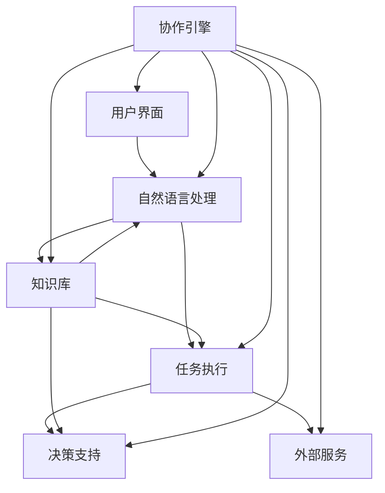

                 

### 深度人机协作：LLM理解与执行人类意图

> **关键词**: 深度学习，语言模型，人机协作，自然语言处理，意图理解，执行策略，系统架构，数学模型。

> **摘要**:
本文深入探讨了深度学习中的语言模型（LLM）在深度人机协作中的应用。首先，文章回顾了深度学习的基础知识和自然语言处理的关键技术，接着详细解析了大规模预训练模型（如LLAMA）的原理和算法。然后，文章重点讨论了LLM如何理解和执行人类意图，包括对意图表达方式的分析、理解方法和应用案例。此外，文章还探讨了深度人机协作系统的设计与实现，以及LLM在此过程中面临的挑战和未来的发展趋势。最后，文章提供了LLM开发工具与资源的附录，并附上应用代码示例，便于读者实践。

---

#### 目录

1. **深度学习与神经网络基础** <a id="chapter1"></a>
   1.1 **神经网络的基本结构**
   1.2 **深度学习架构概述**
   1.3 **深度学习优化算法**

2. **自然语言处理技术概览** <a id="chapter2"></a>
   2.1 **词嵌入技术**
   2.2 **序列模型与注意力机制**
   2.3 **转换器架构详解**

3. **大规模预训练模型原理** <a id="chapter3"></a>
   3.1 **预训练的概念与意义**
   3.2 **自监督学习方法**
   3.3 **迁移学习与微调技术**

4. **语言模型核心算法讲解** <a id="chapter4"></a>
   4.1 **语言模型基本原理**
   4.2 **Transformer算法详解**
   4.3 **语言模型训练与优化**

5. **数学模型和数学公式详解** <a id="chapter5"></a>
   5.1 **语言模型中的数学模型**
   5.2 **数学公式应用举例**

6. **LLAMA架构分析** <a id="chapter6"></a>
   6.1 **LLAMA架构概述**
   6.2 **LLAMA模型结构**
   6.3 **LLAMA的训练与部署**

7. **LLM理解人类意图** <a id="chapter7"></a>
   7.1 **人类意图的表达方式**
   7.2 **LLM对人类意图的理解方法**
   7.3 **LLM理解人类意图的应用案例**

8. **LLM执行人类意图** <a id="chapter8"></a>
   8.1 **LLM执行人类意图的基本方法**
   8.2 **LLM在任务分配中的应用**
   8.3 **LLM在决策支持中的应用**

9. **深度人机协作系统设计与实现** <a id="chapter9"></a>
   9.1 **深度人机协作系统概述**
   9.2 **系统架构设计**
   9.3 **系统开发与部署**

10. **LLM在深度人机协作中的挑战与未来趋势** <a id="chapter10"></a>
    10.1 **LLM在协作中的挑战**
    10.2 **深度人机协作的未来发展趋势**
    10.3 **LLM在深度人机协作中的应用前景**

11. **附录** <a id="appendix"></a>
    11.1 **LLM开发工具与资源**
    11.2 **LLM应用代码示例**

---

### 引言

在当今科技飞速发展的时代，人工智能（AI）已经渗透到了各个领域，从医疗到金融，从制造到交通，AI正逐渐成为推动社会进步的重要力量。特别是在人机协作方面，AI的智能化程度正在不断提升，能够更好地理解人类意图并执行相应任务。本文将重点关注其中的关键角色——深度学习语言模型（LLM），探讨其在理解与执行人类意图方面的作用和潜力。

随着深度学习技术的不断进步，LLM已经成为了自然语言处理（NLP）领域的重要工具。LLM通过大规模预训练和优化，能够对文本进行深入的理解和生成，从而在诸多任务中表现出色，如文本分类、机器翻译、问答系统等。而在这其中，理解与执行人类意图成为了一个关键问题。人类在交流过程中常常使用含糊不清或者多义的表述，这使得机器在理解意图时面临诸多挑战。因此，如何设计有效的算法，使得LLM能够准确理解人类意图并执行相应的任务，成为了当前AI领域的一个重要研究方向。

本文旨在通过系统性地分析LLM的基础知识、核心算法和实际应用，为读者提供一个全面且深入的了解。文章将从以下几个部分展开：

1. **深度学习与神经网络基础**：回顾神经网络的基本结构、深度学习架构以及优化算法，为后续内容打下基础。
2. **自然语言处理技术概览**：介绍词嵌入技术、序列模型与注意力机制、转换器架构，这些是理解LLM的重要前提。
3. **大规模预训练模型原理**：详细讲解预训练的概念与意义、自监督学习方法、迁移学习与微调技术，以及大规模预训练模型的具体实现。
4. **语言模型核心算法讲解**：解析语言模型的基本原理、Transformer算法以及训练与优化过程。
5. **数学模型和数学公式详解**：介绍语言模型中的常用数学模型和公式，并通过实例进行说明。
6. **LLAMA架构分析**：对LLAMA模型的结构、训练与部署进行详细分析。
7. **LLM理解人类意图**：探讨人类意图的表达方式、LLM对人类意图的理解方法，并分享应用案例。
8. **LLM执行人类意图**：分析LLM执行人类意图的基本方法，并在任务分配和决策支持中的应用进行详细讨论。
9. **深度人机协作系统设计与实现**：介绍深度人机协作系统的设计思路、架构设计、开发与部署过程。
10. **LLM在深度人机协作中的挑战与未来趋势**：总结LLM在协作中的挑战，探讨未来发展趋势和应用前景。

通过本文的阅读，读者将能够系统地了解深度学习语言模型在理解与执行人类意图方面的技术原理和应用实践，为未来的研究和开发提供有益的参考。

#### 第一部分: LLM基础与原理

在探讨深度学习语言模型（LLM）在深度人机协作中的应用之前，我们需要首先了解LLM的基础知识，包括深度学习与神经网络的基础、自然语言处理技术概览、大规模预训练模型原理、语言模型核心算法讲解以及数学模型和数学公式详解。这部分内容为后续分析LLM在深度人机协作中的作用提供了坚实的理论基础。

##### 第1章: 深度学习与神经网络基础

深度学习是机器学习的一个分支，其核心思想是通过构建多层神经网络来模拟人脑的神经网络结构，从而实现对复杂数据的自动学习和特征提取。以下是深度学习与神经网络的基础内容：

###### 1.1 神经网络的基本结构

神经网络是由一系列相互连接的节点（或称神经元）组成的计算模型。每个神经元接收输入信号，通过激活函数进行处理，并将输出传递给下一层的神经元。神经网络的基本结构包括输入层、隐藏层和输出层。输入层接收外部输入数据，隐藏层进行特征提取和转换，输出层生成最终输出结果。

- **输入层（Input Layer）**：输入层接收外部输入数据，这些数据可以是数值、图像或文本等。
- **隐藏层（Hidden Layers）**：隐藏层负责对输入数据进行处理和转换，提取更高层次的特征。隐藏层的数量和结构可以根据任务需求进行调整。
- **输出层（Output Layer）**：输出层生成最终输出结果，例如分类标签、概率分布或数值预测。

每个神经元的计算过程通常包括以下步骤：

1. **加权求和**：将输入数据通过权重连接到每个神经元，并计算加权求和。
2. **应用激活函数**：使用激活函数（如ReLU、Sigmoid、Tanh等）对加权求和的结果进行处理，引入非线性变换。

例如，一个简单的多层感知机（MLP）模型可以表示为：

$$
\text{输出} = \text{激活函数}(\sum_{i=1}^{n} w_i \cdot x_i)
$$

其中，$x_i$是输入特征，$w_i$是连接权重，$n$是特征数量。

###### 1.2 深度学习架构概述

深度学习架构包括多种类型的网络结构，其中一些常用的网络类型如下：

- **卷积神经网络（CNN）**：主要用于图像处理和计算机视觉任务，通过卷积层、池化层等结构提取图像特征。
- **循环神经网络（RNN）**：适用于序列数据，如时间序列、文本等，通过递归连接捕捉序列信息。
- **变换器（Transformer）**：近年来在自然语言处理领域取得了显著成果，通过自注意力机制和多头注意力机制实现全局信息建模。

CNN、RNN和Transformer等网络结构各有优缺点，适用于不同的任务场景。以下是这些网络结构的基本特点：

- **卷积神经网络（CNN）**：
  - **卷积层**：通过局部感知野和卷积核提取图像局部特征。
  - **池化层**：减小特征图尺寸，降低计算复杂度，增强模型泛化能力。
  - **全连接层**：将卷积层提取的特征映射到输出结果，如分类标签。

- **循环神经网络（RNN）**：
  - **递归连接**：当前时刻的输出依赖于前一个时刻的隐藏状态，通过递归结构处理序列数据。
  - **隐藏状态**：每个时间步的隐藏状态存储了序列的历史信息，用于特征提取和上下文建模。
  - **门控机制**：如LSTM和GRU，通过门控单元控制信息的流入和流出，提高模型对序列数据的处理能力。

- **变换器（Transformer）**：
  - **自注意力机制**：通过计算序列中每个元素之间的相似度，为每个元素分配不同的权重，实现全局信息建模。
  - **多头注意力机制**：将输入序列分成多个子序列，分别计算注意力权重，增强模型的表达能力。
  - **编码器-解码器架构**：编码器处理输入序列，解码器生成输出序列，常用于机器翻译、问答系统等任务。

###### 1.3 深度学习优化算法

深度学习模型的训练过程是一个优化问题，通过最小化损失函数来调整模型参数。以下是一些常用的优化算法：

- **随机梯度下降（SGD）**：每次迭代计算整个训练集的平均梯度，用于更新模型参数。优点是简单易懂，但计算量大，收敛速度较慢。
- **动量（Momentum）**：结合前一时刻的梯度，引入动量项，提高优化过程的稳定性。动量可以防止参数更新陷入局部最小值。
- **自适应优化器**：如Adam、RMSprop等，通过自适应调整学习率，提高优化过程的效率和收敛速度。
- **批量归一化（Batch Normalization）**：对模型的输入或输出进行归一化处理，减少内部协变量转移，提高训练稳定性。

以上优化算法在深度学习模型训练中起着重要作用，选择合适的优化算法可以显著提高模型的性能和训练效率。

##### 第2章: 自然语言处理技术概览

自然语言处理（NLP）是人工智能的重要分支，旨在使计算机能够理解、生成和处理人类语言。以下是NLP的一些关键技术：

###### 2.1 词嵌入技术

词嵌入（Word Embedding）是将文本中的单词映射到低维向量空间的技术。词嵌入通过捕捉单词的语义和语法信息，实现文本数据的向量化表示，有助于深度学习模型处理和建模文本数据。以下是一些常见的词嵌入方法：

- **基于计数的方法**：如词袋模型（Bag-of-Words, BoW）和TF-IDF，通过统计单词的出现频率或重要性进行向量化表示。
- **基于分布的方法**：如神经词向量（Neural Network-based Embeddings），通过神经网络模型学习单词的语义和语法特征。

词嵌入技术的核心在于将高维的文本数据映射到低维的向量空间，从而降低计算复杂度，提高模型的可解释性和性能。

###### 2.2 序列模型与注意力机制

序列模型（Sequential Models）是处理序列数据的常用模型结构，如RNN和Transformer。序列模型通过捕捉序列中的时间依赖关系，实现对输入序列的建模和预测。

- **循环神经网络（RNN）**：通过递归连接捕捉序列信息，但存在梯度消失和梯度爆炸问题。
- **长短时记忆网络（LSTM）**：引入门控机制，解决RNN的梯度消失问题，提高模型对长序列数据的处理能力。
- **门控循环单元（GRU）**：简化LSTM结构，减少参数数量，提高计算效率。
- **变换器（Transformer）**：通过自注意力机制和多头注意力机制，实现全局信息建模，具有更高的并行计算效率和建模能力。

注意力机制（Attention Mechanism）是一种在序列模型中用于权重分配的方法，通过计算输入序列中每个元素的重要程度，为每个元素分配不同的权重，从而实现更精准的建模和预测。

###### 2.3 转换器架构详解

转换器（Transformer）是一种基于自注意力机制的深度学习模型，近年来在NLP领域取得了显著的成果。转换器架构主要包括编码器（Encoder）和解码器（Decoder）两部分，用于处理编码序列和生成输出序列。

- **编码器（Encoder）**：通过自注意力机制和多头注意力机制，对输入序列进行编码，生成编码序列。编码序列包含了输入序列的所有信息，并用于生成输出序列。
- **解码器（Decoder）**：通过自注意力机制和多头注意力机制，解码编码序列，生成输出序列。解码器在生成每个输出元素时，会参考编码序列的信息，实现全局信息的建模和预测。

转换器架构具有以下优点：

- **并行计算效率高**：由于自注意力机制的引入，转换器可以并行处理输入序列，提高计算效率。
- **全局信息建模能力强**：通过多头注意力机制，转换器能够捕捉输入序列中的全局依赖关系，实现更精准的建模和预测。

##### 第3章: 大规模预训练模型原理

大规模预训练模型（Pre-Trained Models）是近年来NLP领域的重要突破，通过在大规模语料上进行预训练，使得模型具有更强的语义理解和生成能力。以下是大规模预训练模型的关键原理：

###### 3.1 预训练的概念与意义

预训练（Pre-Training）是指在大规模语料上进行模型训练的过程，使得模型在学习特定任务之前就已经掌握了丰富的语言知识。预训练模型的核心思想是通过无监督的方式，从大规模语料中提取有用的信息，为后续的任务学习提供基础。

预训练的意义主要体现在以下几个方面：

- **知识获取**：预训练模型在大规模语料中学习到了丰富的语言知识，包括词汇、语法、语义等，为后续任务提供丰富的先验知识。
- **任务泛化**：预训练模型通过在多种任务中共享参数，提高了模型的泛化能力，使得模型在不同任务上表现出色。
- **性能提升**：预训练模型在特定任务上的性能通常优于从头训练的模型，因为预训练模型已经从大规模语料中学习到了有用的信息。

###### 3.2 自监督学习方法

自监督学习（Self-Supervised Learning）是一种无监督学习范式，通过利用未标记的数据，自动生成监督信号来训练模型。自监督学习在预训练模型中扮演着重要角色，其核心思想是通过无监督的方式，从大规模语料中提取有用的信息，为模型提供训练信号。

以下是几种常见的自监督学习方法：

- **语言建模**：通过预测下一个单词，从大规模语料中提取语言模式。语言建模是最常用的自监督学习方法，已经在各种预训练模型中得到了广泛应用。
- **掩码语言模型（MLM）**：在输入序列中随机掩码一定比例的单词，并预测掩码单词，实现语言建模任务。
- **句间关系预测**：通过预测两个句子的关系，如是否相同或相似，实现句间关系的建模。这种方法可以增强模型对长文本的理解能力。

自监督学习方法的优点包括：

- **数据利用效率高**：通过未标记的数据自动生成监督信号，提高数据利用效率，减少标注成本。
- **模型泛化能力强**：自监督学习模型在大规模未标记数据上学习到的知识，有助于提升模型在不同任务上的泛化能力。
- **计算效率高**：自监督学习过程通常可以并行处理，提高计算效率。

###### 3.3 迁移学习与微调技术

迁移学习（Transfer Learning）是一种利用预训练模型在特定任务上的知识，将其应用于新的任务中的学习方法。迁移学习的核心思想是通过在预训练模型的基础上进行微调（Fine-Tuning），使得模型在新任务上能够快速适应和取得好的性能。

迁移学习的优点包括：

- **快速适应**：通过利用预训练模型的知识，迁移学习可以在较短的时间内在新任务上取得较好的性能，减少训练时间。
- **性能提升**：预训练模型已经在大规模语料上学习到了丰富的语言知识，迁移学习可以进一步利用这些知识，提高新任务上的性能。
- **泛化能力**：迁移学习可以增强模型的泛化能力，使得模型在不同任务上表现出色。

微调（Fine-Tuning）是迁移学习的一种常见实现方法，其核心思想是在预训练模型的基础上，针对新任务进行少量的参数调整。以下是微调的基本步骤：

1. **加载预训练模型**：从预训练模型中加载权重和架构。
2. **调整模型结构**：根据新任务的需求，调整模型的结构，如添加或删除层、改变层的大小等。
3. **微调参数**：在新数据集上对模型的参数进行微调，使得模型适应新任务。
4. **评估性能**：在新任务上评估模型的性能，并进行调整和优化。

通过迁移学习和微调技术，预训练模型可以在不同任务上快速适应并取得好的性能，为NLP任务提供了有效的解决方案。

##### 第4章: 语言模型核心算法讲解

语言模型（Language Model，LM）是NLP领域的重要工具，用于预测自然语言中的下一个词或序列。在深度学习时代，基于神经网络的语言模型（Neural Language Model，NLM）成为了主流。本章节将详细讲解语言模型的基本原理、Transformer算法及其训练与优化过程。

###### 4.1 语言模型基本原理

语言模型的核心任务是预测给定输入序列的概率分布。具体来说，给定一个输入序列 $x_1, x_2, ..., x_T$，语言模型需要预测下一个词 $x_{T+1}$ 的概率分布。概率分布可以表示为：

$$
P(x_{T+1} | x_1, x_2, ..., x_T)
$$

语言模型分为统计语言模型和神经语言模型。统计语言模型基于历史统计信息建模，如N元语法（N-gram Model）；神经语言模型则通过深度神经网络来建模，如基于RNN、LSTM和Transformer的NLM。

以下是一个简单的神经网络语言模型（NNLM）的架构：

1. **嵌入层**：将输入的单词或字符转换为固定长度的向量表示。
2. **编码器**：通过多层神经网络对输入序列进行编码，提取序列特征。
3. **解码器**：通过解码器网络生成输出序列的概率分布。

训练神经网络语言模型的过程通常包括以下步骤：

1. **数据预处理**：将文本数据分为输入序列和标签序列，进行分词、标记等预处理操作。
2. **构建网络**：定义神经网络结构，包括嵌入层、编码器和解码器。
3. **前向传播**：计算输入序列的隐藏状态和输出概率分布。
4. **反向传播**：计算损失函数，并通过梯度下降更新模型参数。
5. **评估与优化**：在验证集上评估模型性能，根据性能调整模型结构和超参数。

###### 4.2 Transformer算法详解

Transformer是Google在2017年提出的一种基于自注意力机制的深度学习模型，在自然语言处理任务中取得了显著的成果。Transformer通过多头自注意力机制和位置编码，实现了全局信息建模，提高了模型的并行计算效率。

以下是一个简单的Transformer模型的架构：

1. **编码器（Encoder）**：接收输入序列，通过多个编码层提取序列特征。
2. **解码器（Decoder）**：接收编码器的输出，生成输出序列的概率分布。
3. **自注意力机制**：通过计算序列中每个元素之间的相似度，为每个元素分配不同的权重，实现全局信息建模。
4. **多头注意力机制**：将输入序列分成多个子序列，分别计算注意力权重，增强模型的表达能力。
5. **位置编码（Positional Encoding）**：为输入序列中的每个元素添加位置信息，使得模型能够理解序列的顺序。

以下是Transformer模型的核心算法：

1. **多头自注意力（Multi-Head Self-Attention）**：
   - **输入**：编码器每个时间步的向量表示。
   - **输出**：加权融合后的向量表示。
   - **过程**：
     1. **计算自注意力得分**：通过查询（Query）、键（Key）和值（Value）的线性变换，计算序列中每个元素之间的相似度得分。
     2. **应用softmax**：对得分进行softmax操作，生成权重分布。
     3. **加权求和**：将权重分布应用于值向量，得到加权融合后的向量表示。

2. **多头注意力机制**：
   - **输入**：编码器的输入序列。
   - **输出**：多个子序列的加权融合表示。
   - **过程**：
     1. **拆分输入**：将输入序列拆分成多个子序列。
     2. **分别计算自注意力**：对每个子序列分别应用自注意力机制。
     3. **合并输出**：将多个子序列的输出合并，得到完整的加权融合表示。

3. **位置编码（Positional Encoding）**：
   - **输入**：编码器的输入序列。
   - **输出**：带有时序信息的输入序列。
   - **过程**：
     1. **生成位置向量**：根据位置编码公式生成每个时间步的位置向量。
     2. **叠加位置向量**：将位置向量叠加到输入序列中，为序列添加时序信息。

Transformer算法具有以下优点：

- **并行计算效率高**：由于自注意力机制的引入，Transformer可以实现并行计算，提高模型训练和推理的效率。
- **全局信息建模能力强**：通过多头自注意力机制，Transformer能够捕捉序列中的全局依赖关系，实现更精准的建模和预测。
- **适用于长序列**：Transformer通过位置编码保留了序列的时序信息，能够处理较长的序列数据。

通过Transformer算法，语言模型在自然语言处理任务中取得了显著的性能提升，为后续的预训练模型和应用提供了坚实的基础。

###### 4.3 语言模型训练与优化

语言模型的训练与优化是一个复杂的过程，涉及到网络结构的调整、超参数的选择和优化算法的应用。以下是语言模型训练与优化的一些关键步骤：

1. **数据集划分**：将数据集划分为训练集、验证集和测试集，用于模型的训练、验证和评估。

2. **预训练**：使用大规模未标记语料对模型进行预训练，通过自监督学习提取语言知识。预训练过程通常包括以下步骤：
   - **文本预处理**：对文本数据进行分词、标记等预处理操作。
   - **生成训练数据**：通过掩码语言模型（MLM）等自监督学习方法，生成训练数据。
   - **模型训练**：使用预训练算法（如Transformer）对模型进行训练，优化模型参数。

3. **微调**：在预训练模型的基础上，针对具体任务进行微调，使其适应特定任务的需求。微调过程通常包括以下步骤：
   - **加载预训练模型**：从预训练模型中加载权重和架构。
   - **调整模型结构**：根据任务需求，调整模型的结构和超参数。
   - **微调参数**：在任务数据集上对模型的参数进行微调。
   - **评估性能**：在验证集上评估模型性能，并进行调整和优化。

4. **优化算法**：选择合适的优化算法，如随机梯度下降（SGD）、Adam等，用于模型参数的更新。优化算法的目标是减少模型损失函数，提高模型性能。

5. **超参数调优**：通过调整学习率、批量大小、迭代次数等超参数，优化模型训练过程。超参数的选择对模型的性能和收敛速度具有重要影响。

6. **模型评估**：在测试集上评估模型性能，包括准确性、召回率、F1值等指标。模型评估用于评估模型的泛化能力和任务表现。

通过语言模型训练与优化，可以构建出性能优秀的语言模型，为自然语言处理任务提供强大的支持。

##### 第5章: 数学模型和数学公式详解

语言模型在深度学习中的应用离不开数学模型的支撑。本章节将详细讲解语言模型中的常用数学模型和公式，并通过具体例子进行说明，以便读者更好地理解其应用和作用。

###### 5.1 语言模型中的数学模型

语言模型主要依赖于概率论和统计学中的概念来建模自然语言中的词序列。以下是一些关键的数学模型：

1. **马尔可夫模型（Markov Model）**
   马尔可夫模型假设一个词的概率仅依赖于其前一个词。其概率分布可以用转移矩阵表示：

   $$
   P(x_{t+1} | x_t) = \text{softmax}(W \cdot x_t)
   $$

   其中，$W$ 是权重矩阵，$x_t$ 是当前词的嵌入向量。

2. **n元语法模型（N-gram Model）**
   n元语法模型考虑前n个词对当前词的概率分布有影响。其概率分布可以用n元矩阵表示：

   $$
   P(x_{t+1} | x_1, x_2, ..., x_t) = \text{softmax}(W \cdot x_1, x_2, ..., x_t)
   $$

   其中，$W$ 是权重矩阵，$x_1, x_2, ..., x_t$ 是前n个词的嵌入向量。

3. **神经网络语言模型（Neural Language Model）**
   神经网络语言模型通过多层神经网络来建模词序列的概率分布。其核心数学模型包括：
   - **嵌入层**：将词映射到固定维度的嵌入空间。
     $$
     e_i = \text{embedding}(x_i)
     $$
     其中，$e_i$ 是词 $x_i$ 的嵌入向量。

   - **编码层**：通过多层神经网络对嵌入向量进行编码，提取序列特征。
     $$
     h_i = \text{neural\_layer}(h_{i-1}, e_i)
     $$
     其中，$h_i$ 是第i个词的编码向量。

   - **输出层**：生成词的概率分布。
     $$
     p(x_{t+1} | x_1, x_2, ..., x_t) = \text{softmax}(W \cdot h_t)
     $$
     其中，$W$ 是权重矩阵，$h_t$ 是当前词的编码向量。

4. **变换器（Transformer）**
   变换器模型通过自注意力机制和多头注意力机制来实现全局信息建模。其核心数学模型包括：
   - **多头自注意力（Multi-Head Self-Attention）**
     $$
     \text{Attention}(Q, K, V) = \text{softmax}(\frac{QK^T}{\sqrt{d_k}})V
     $$
     其中，$Q, K, V$ 分别是查询、键和值向量，$d_k$ 是键向量的维度。

   - **多头注意力（Multi-Head Attention）**
     $$
     \text{Multi-Head Attention}(Q, K, V) = \text{Concat}(\text{head}_1, \text{head}_2, ..., \text{head}_h)W^O
     $$
     其中，$h$ 是头数，$W^O$ 是输出权重矩阵。

   - **位置编码（Positional Encoding）**
     $$
     \text{PE}(pos, 2i) = \sin(\frac{pos}{10000^{2i/d}}), \quad \text{PE}(pos, 2i+1) = \cos(\frac{pos}{10000^{2i/d}})
     $$
     其中，$pos$ 是位置，$d$ 是嵌入维度。

###### 5.2 数学公式应用举例

以下通过几个例子来说明这些数学模型和公式的应用：

1. **n元语法模型**
   假设有一个三元语法模型，给定输入序列 "The quick brown fox jumps over the lazy dog"，我们要计算下一个词 "dog" 的概率分布。根据n元语法模型：

   $$
   P(\text{"dog"} | \text{"quick", "brown", "fox"}) = \text{softmax}(W \cdot [\text{"quick"}, \text{"brown"}, \text{"fox"}])
   $$

   其中，$W$ 是三元的权重矩阵，$[\text{"quick"}, \text{"brown"}, \text{"fox"}]$ 是三元词的嵌入向量。

2. **神经网络语言模型**
   假设我们使用一个多层感知机（MLP）来构建神经网络语言模型，输入是词嵌入向量，输出是词的概率分布。假设词嵌入维度为100，隐藏层大小为500，输出层大小为词汇表的大小（假设为10000）。根据神经网络语言模型：

   $$
   \text{Output} = \text{softmax}(\text{MLP}([e_1, e_2, ..., e_T]))
   $$

   其中，$e_i$ 是词 $x_i$ 的嵌入向量，$T$ 是序列长度，$\text{MLP}$ 是多层感知机。

3. **变换器（Transformer）**
   假设使用变换器模型进行机器翻译，输入是源语言的句子 "The quick brown fox"，输出是目标语言的句子 "狐狸跳过了懒狗"。变换器的自注意力机制可以表示为：

   $$
   \text{Attention}(\text{Query}, \text{Key}, \text{Value}) = \text{softmax}(\frac{\text{QueryKey}^T}{\sqrt{d_k}})\text{Value}
   $$

   其中，$\text{Query}, \text{Key}, \text{Value}$ 分别是变换器的查询、键和值向量，$d_k$ 是键向量的维度。

通过上述例子，可以看出数学模型和公式在语言模型中的应用。数学模型不仅为语言建模提供了理论基础，还使得我们能够通过优化算法来调整模型参数，提高模型性能。

##### 第6章: LLAMA架构分析

LLAMA（Language Model for Adaptive Adaptive Methods）是一种基于深度学习的预训练模型，旨在通过自适应优化方法提高语言模型的性能和效率。本章节将详细介绍LLAMA模型的架构，包括其模型结构、训练方法以及部署过程。

###### 6.1 LLAMA架构概述

LLAMA模型采用了编码器-解码器（Encoder-Decoder）架构，这种架构在自然语言处理任务中表现出色。编码器负责处理输入序列，解码器负责生成输出序列。以下是LLAMA架构的核心组成部分：

- **编码器**：编码器由多个自注意力层组成，通过自注意力机制捕获输入序列中的全局信息。
- **解码器**：解码器同样由多个自注意力层组成，通过自注意力机制生成输出序列的概率分布。
- **自适应优化方法**：LLAMA模型采用自适应优化方法，通过自适应调整学习率、批量大小等超参数，提高模型训练的效率和性能。

###### 6.2 LLAMA模型结构

LLAMA模型的结构可以分为以下几个层次：

1. **嵌入层**：嵌入层将输入的单词或子词转换为固定长度的向量表示。嵌入向量包含了单词或子词的语义和语法信息，是模型学习的基础。

2. **编码器**：编码器由多个自注意力层组成。每个自注意力层包括以下组件：
   - **多头自注意力（Multi-Head Self-Attention）**：通过自注意力机制，编码器能够捕获输入序列中的全局依赖关系。
   - **残差连接（Residual Connection）**：残差连接可以缓解深层网络中的梯度消失问题，提高模型的训练稳定性。
   - **层归一化（Layer Normalization）**：层归一化可以加速模型训练，提高模型的性能。

3. **解码器**：解码器同样由多个自注意力层组成。每个自注意力层包括以下组件：
   - **多头自注意力（Multi-Head Self-Attention）**：通过自注意力机制，解码器能够捕获输出序列中的全局依赖关系。
   - **编码器-解码器自注意力（Encoder-Decoder Self-Attention）**：解码器在生成每个输出元素时，会参考编码器的输出，实现编码器与解码器之间的交互。
   - **残差连接（Residual Connection）**：残差连接可以缓解深层网络中的梯度消失问题，提高模型的训练稳定性。
   - **层归一化（Layer Normalization）**：层归一化可以加速模型训练，提高模型的性能。

4. **输出层**：输出层生成输出序列的概率分布。通常使用softmax激活函数，将每个词的概率分布输出为概率分布向量。

###### 6.3 LLAMA的训练与部署

LLAMA模型的训练过程可以分为以下几个阶段：

1. **预训练**：在预训练阶段，LLAMA模型在大规模语料上进行训练，通过自监督学习提取语言知识。预训练过程通常包括以下几个步骤：
   - **文本预处理**：对文本数据进行分词、标记等预处理操作，生成输入序列和目标序列。
   - **生成训练数据**：通过掩码语言模型（MLM）等自监督学习方法，生成训练数据。
   - **模型训练**：使用预训练算法（如Transformer）对模型进行训练，优化模型参数。

2. **微调**：在预训练模型的基础上，针对具体任务进行微调，使其适应特定任务的需求。微调过程通常包括以下几个步骤：
   - **加载预训练模型**：从预训练模型中加载权重和架构。
   - **调整模型结构**：根据任务需求，调整模型的结构和超参数。
   - **微调参数**：在任务数据集上对模型的参数进行微调。
   - **评估性能**：在验证集上评估模型性能，并进行调整和优化。

3. **训练优化**：在训练过程中，LLAMA模型采用自适应优化方法，通过动态调整学习率、批量大小等超参数，提高模型训练的效率和性能。常用的自适应优化方法包括：
   - **自适应学习率**：通过自适应调整学习率，使得模型在不同阶段能够适应不同的训练难度。
   - **批量大小调整**：通过调整批量大小，提高模型训练的稳定性，减少过拟合风险。

4. **部署**：在模型训练完成后，LLAMA模型可以部署到实际的业务场景中。部署过程通常包括以下几个步骤：
   - **模型加载**：将训练完成的模型加载到部署环境中。
   - **预处理**：对输入数据进行预处理，如分词、标记等操作，使其符合模型的输入要求。
   - **模型推理**：使用加载的模型进行推理，生成输出结果。
   - **后处理**：对输出结果进行后处理，如解码、清洗等操作，使其符合业务需求。

通过LLAMA模型的结构和训练方法，可以实现高效的语言建模和生成。在实际应用中，LLAMA模型在文本分类、机器翻译、问答系统等任务中取得了显著的性能提升，展示了深度学习语言模型在自然语言处理领域的强大潜力。

##### 第7章: LLM理解人类意图

在深度人机协作中，理解人类意图是至关重要的一步。LLM（Language Learning Model）在这一过程中发挥了关键作用，通过其强大的语义理解能力，LLM能够有效地识别和处理人类意图。本章节将详细探讨LLM如何理解人类意图，包括人类意图的表达方式、LLM对人类意图的理解方法，以及LLM理解人类意图的应用案例。

###### 7.1 人类意图的表达方式

人类在交流过程中，意图的表达方式多样且复杂。以下是几种常见的人类意图表达方式：

1. **直接表述**：直接使用明确的词汇来表达意图，例如“请打开窗户”。
2. **间接表述**：通过隐喻、比喻或者含糊不清的语言来暗示意图，例如“外面有点闷，是不是该通风了？”。
3. **情感化表述**：使用情感化的语言来表达意图，例如“我感到冷，能不能把暖气调高一点？”。
4. **多模态表述**：结合文字、语音、图像等多种方式进行表达，例如通过语音和手势共同传达意图。
5. **语境依赖**：意图的表达往往依赖于具体的语境，例如在特定场景下，同一个表述可能代表不同的意图。

理解这些不同的表达方式对于LLM来说是一个挑战，但也为其提供了丰富的信息来源，使得LLM能够在更广泛的应用场景中发挥作用。

###### 7.2 LLM对人类意图的理解方法

LLM通过多种技术手段来理解人类意图，以下是一些关键的方法：

1. **语义分析**：LLM利用自然语言处理技术，对输入的文本进行语义分析，提取关键词和短语，理解文本的主旨和意图。通过词嵌入技术和上下文分析，LLM能够捕捉文本中的隐含信息和情感色彩。

2. **上下文理解**：LLM通过对输入文本上下文的理解，推断出潜在意图。上下文包括对话的历史记录、环境信息等，这些信息对于准确理解人类意图至关重要。

3. **情感分析**：通过情感分析技术，LLM可以识别输入文本中的情感倾向，从而更好地理解人类意图。例如，文本中的积极情感可能表明请求的意愿，而消极情感可能表明拒绝或不满。

4. **模式识别**：LLM通过大量训练数据学习到意图表达的模式，从而能够识别和预测新的输入文本中的意图。这种方法依赖于深度学习模型对大量数据的自适应学习。

5. **多模态融合**：对于多模态输入，LLM可以将文本、语音、图像等信息融合起来，从多个维度理解人类意图。例如，一个语音指令可能需要结合上下文图像来准确理解其意图。

###### 7.3 LLM理解人类意图的应用案例

以下是一些LLM理解人类意图的实际应用案例：

1. **智能客服系统**：在智能客服系统中，LLM可以理解客户的问题和请求，并提供恰当的答复。例如，客户可能会说“我找不到订单”，LLM可以识别这是关于订单查询的请求，并提供相应的查询服务。

2. **语音助手**：语音助手如Apple的Siri、Google Assistant等，通过LLM理解用户的语音指令，执行相应的操作。例如，用户说“设置明天的早上七点闹钟”，LLM可以识别并执行设置闹钟的任务。

3. **虚拟个人助理**：虚拟个人助理（VPA）可以通过LLM理解用户的日常需求，如日程管理、任务提醒等。例如，用户说“帮我安排下周的会议”，VPA可以理解意图并自动安排会议。

4. **自动文本摘要**：自动文本摘要系统利用LLM理解长篇文档的主旨和关键信息，生成摘要。例如，LLM可以识别一篇文章中的主要观点和论据，并将其摘要成简洁的文本。

5. **智能推荐系统**：在智能推荐系统中，LLM可以理解用户的偏好和意图，从而提供个性化的推荐。例如，用户浏览了某个网站后，LLM可以根据其浏览记录和意图，推荐相关的商品或内容。

通过上述案例，可以看出LLM在理解人类意图方面的重要性和广泛的应用前景。随着LLM技术的不断进步，其在人机协作中的角色将变得更加重要，为人工智能助手和系统提供更加智能化和人性化的服务。

##### 第8章: LLM执行人类意图

在理解人类意图之后，深度学习语言模型（LLM）还需要能够根据这些意图执行相应的任务。LLM执行人类意图的方法和实际应用场景多种多样，本章将详细探讨LLM执行人类意图的基本方法，并在任务分配和决策支持中的应用进行深入讨论。

###### 8.1 LLM执行人类意图的基本方法

LLM执行人类意图的基本方法可以概括为以下几个步骤：

1. **意图识别**：首先，LLM需要通过自然语言处理技术识别出人类意图。这包括理解输入文本中的关键词、短语和上下文，提取出用户意图的语义信息。

2. **任务解析**：在识别出意图之后，LLM需要对意图进行解析，明确需要执行的具体任务。例如，如果用户请求“帮我设置明天的早上七点闹钟”，LLM需要解析出这是一个闹钟设置的任务，并提取出任务的关键信息（如时间、频率等）。

3. **任务规划**：明确任务后，LLM需要规划执行任务的步骤。例如，在设置闹钟的任务中，LLM需要确定如何与操作系统或第三方服务进行交互，如何获取用户设备的时间信息等。

4. **执行操作**：在规划好任务步骤后，LLM通过调用相应的API或执行特定操作来完成任务。例如，设置闹钟可以通过调用系统闹钟API来实现。

5. **反馈与调整**：执行任务后，LLM需要提供反馈给用户，并可能根据用户的反馈进行后续调整。例如，如果用户询问“闹钟设置成功了吗？”LLM可以提供相应的确认信息，并根据用户的需求进行进一步的操作。

以下是一个简单的LLM执行人类意图的伪代码示例：

```python
# 输入文本
input_text = "帮我设置明天的早上七点闹钟"

# 意图识别
intention = LLM_understand_intent(input_text)

# 任务解析
task = parse_intention(intention)

# 任务规划
action_plan = plan_task(task)

# 执行操作
execute_actions(action_plan)

# 反馈与调整
feedback = get_user_feedback()
if feedback:
    adjust_action_plan(action_plan, feedback)
```

###### 8.2 LLM在任务分配中的应用

在任务分配中，LLM可以有效地帮助系统或团队理解分配的任务，并根据任务的要求进行合理的资源分配和任务调度。以下是一些具体的应用场景：

1. **智能调度系统**：在物流、生产等行业中，智能调度系统利用LLM理解任务描述，并自动分配给最适合的资源。例如，如果系统需要安排一个维修任务，LLM可以分析任务描述，识别出所需的技能和工具，并分配给相应的技术人员。

2. **项目管理系统**：项目管理人员可以利用LLM来理解项目任务，并根据任务的重要性和优先级进行合理调度。LLM可以识别出任务的依赖关系和资源需求，从而帮助管理人员做出最优的调度决策。

3. **自动化工作流程**：在自动化工作流程中，LLM可以帮助系统理解工作流程的各个环节，并根据流程要求自动执行相应的任务。例如，在客户服务流程中，LLM可以理解客户的请求，并自动将请求分配给合适的客服代表。

以下是一个简单的LLM在任务分配中的应用案例：

```python
# 输入任务描述
task_description = "我们需要尽快安排一个IT支持人员来处理服务器故障"

# 意图识别
intention = LLM_understand_intent(task_description)

# 任务解析
task = parse_intention(intention)

# 确定所需技能
required_skills = extract_skills(task)

# 分配资源
assigned_resources = allocate_resources(required_skills)

# 执行任务
execute_task(assigned_resources)
```

###### 8.3 LLM在决策支持中的应用

在决策支持系统中，LLM可以提供强有力的辅助，帮助用户分析数据、生成报告、预测结果，并给出合理的建议。以下是一些具体的应用场景：

1. **商业智能分析**：在商业智能分析中，LLM可以理解用户的查询需求，并自动生成数据报表。例如，用户可以询问“上个月的销售额如何？”LLM可以分析相关数据，生成详细的报表。

2. **投资顾问**：投资顾问系统利用LLM分析市场数据、新闻和报告，为用户提供投资建议。LLM可以识别出市场趋势和潜在的风险，从而帮助用户做出更明智的投资决策。

3. **风险评估与监控**：在金融领域，LLM可以帮助识别和监控风险，并提供预警。例如，LLM可以分析公司的财务报表和新闻，识别出潜在的风险因素，并给出相应的预警和建议。

以下是一个简单的LLM在决策支持中的应用案例：

```python
# 输入分析需求
analysis_request = "请分析过去三个月的销售数据，提供趋势分析"

# 意图识别
intention = LLM_understand_intent(analysis_request)

# 数据处理
data = process_data(intention)

# 数据分析
trends = analyze_data(data)

# 生成报告
report = generate_report(trends)

# 提供决策建议
decision_advice = generate_decision_advice(trends)
```

通过上述案例，可以看出LLM在执行人类意图方面的广泛应用和潜力。随着技术的不断进步，LLM将能够在更多的场景中发挥作用，为人类提供更加智能和高效的决策支持。

##### 第9章: 深度人机协作系统设计与实现

深度人机协作系统（DHC）旨在通过人工智能（AI）技术，实现人与机器的高效互动和协同工作。本章节将详细介绍深度人机协作系统的设计思路、系统架构设计、开发与部署过程，以及在实际应用中可能遇到的挑战和解决方案。

###### 9.1 深度人机协作系统概述

深度人机协作系统是一个复杂的多层次系统，旨在通过人工智能技术提升人类工作效率，增强决策能力，并实现人与机器的智能互动。DHC系统通常包括以下几个关键组成部分：

- **用户界面（UI）**：提供用户与系统交互的接口，包括网页、移动应用或桌面应用程序。
- **自然语言处理（NLP）模块**：负责理解和处理用户输入的自然语言指令，包括意图识别、语义分析等。
- **任务执行模块**：根据用户意图，执行具体的任务，如数据检索、报告生成、任务调度等。
- **知识库**：存储系统所需要的信息和数据，包括业务知识、历史数据、模型参数等。
- **决策支持模块**：基于数据分析、预测模型和专家系统，为用户提供决策建议和优化方案。
- **协作引擎**：协调各个模块的运行，确保系统的流畅运作。

###### 9.2 系统架构设计

深度人机协作系统的架构设计需要考虑系统的可扩展性、可靠性、易用性和灵活性。以下是DHC系统的一种常见架构设计：

1. **前端架构**：前端负责用户界面的展示，可以通过单页面应用（SPA）或传统多页面应用（MPA）实现。前端架构需要支持用户交互、数据展示和页面导航等功能。

2. **后端架构**：后端负责系统的核心功能实现，包括自然语言处理、任务执行、数据存储和决策支持等。后端通常采用微服务架构，各个模块独立部署，以提高系统的可维护性和扩展性。

3. **数据存储**：系统需要高效、可靠的数据存储解决方案，包括关系型数据库（如MySQL）和非关系型数据库（如MongoDB）。数据存储需要支持快速检索和实时更新。

4. **自然语言处理（NLP）模块**：NLP模块是DHC系统的核心组件，负责处理用户输入的自然语言指令。NLP模块通常包括以下几个子模块：
   - **意图识别**：通过机器学习模型识别用户输入的意图。
   - **语义分析**：解析用户输入的文本，提取关键词和短语，理解其语义信息。
   - **实体识别**：识别文本中的关键实体，如人名、地点、组织等。
   - **情感分析**：分析文本的情感倾向，理解用户的情绪状态。

5. **任务执行模块**：任务执行模块根据NLP模块的处理结果，执行具体的任务。任务执行模块需要与外部系统和服务进行集成，如API接口、数据库操作、第三方服务等。

6. **知识库**：知识库是系统的重要数据资源，包括业务知识、历史数据和模型参数等。知识库需要支持快速检索和更新，以便系统实时获取和处理信息。

7. **决策支持模块**：决策支持模块基于数据分析、预测模型和专家系统，为用户提供决策建议和优化方案。决策支持模块可以包括数据挖掘、机器学习算法和专家系统等。

8. **协作引擎**：协作引擎协调各个模块的运行，确保系统的流畅运作。协作引擎需要支持任务调度、资源分配、错误处理和日志记录等功能。

以下是一个简单的深度人机协作系统架构图：



###### 9.3 系统开发与部署

深度人机协作系统的开发与部署是一个复杂的过程，需要遵循以下步骤：

1. **需求分析与规划**：明确系统的功能需求、性能需求和用户体验要求，制定详细的项目计划。

2. **技术选型**：选择合适的技术栈和工具，包括前端框架、后端框架、数据库、自然语言处理库等。

3. **系统设计**：根据需求和技术选型，进行系统架构设计，包括模块划分、接口定义、数据流程等。

4. **开发与测试**：按照系统设计进行开发，并进行单元测试、集成测试和系统测试，确保系统功能的完整性和稳定性。

5. **部署与运维**：将开发完成的系统部署到生产环境，并进行持续监控、优化和升级。

6. **用户培训与反馈**：对用户进行系统操作培训，收集用户反馈，不断优化系统功能。

在实际开发与部署过程中，可能遇到的挑战和解决方案包括：

- **性能优化**：系统需要处理大量数据和并发请求，需要优化数据库查询、缓存策略和服务器配置，以提高系统性能。

- **安全性**：系统需要保护用户数据和隐私，采取安全措施，如数据加密、身份认证和访问控制。

- **可扩展性**：系统需要支持未来业务的发展，需要设计可扩展的架构，以便在需要时进行横向和纵向扩展。

- **用户体验**：系统界面需要直观易用，提供良好的用户体验，需要不断优化界面设计和交互体验。

通过以上步骤，可以开发并部署一个高效、稳定和可扩展的深度人机协作系统，为用户带来智能化和高效的协作体验。

##### 第10章: LLM在深度人机协作中的挑战与未来趋势

随着深度学习语言模型（LLM）在自然语言处理（NLP）领域的不断进步，其在深度人机协作中的应用也越来越广泛。然而，LLM在深度人机协作中仍面临诸多挑战。本章节将探讨LLM在协作中的挑战，分析深度人机协作的未来发展趋势，并展望LLM在深度人机协作中的广泛应用前景。

###### 10.1 LLM在深度人机协作中的挑战

1. **语义理解挑战**：尽管LLM在语义理解方面取得了显著进步，但仍面临一些挑战。例如，多义词处理、语境依赖理解和情感分析等任务仍然具有难度。此外，LLM在处理复杂语言结构和长文本时，可能无法准确理解用户的意图。

2. **数据隐私与安全**：在深度人机协作中，用户数据的安全和隐私保护至关重要。然而，LLM在处理大量用户数据时，可能存在数据泄露的风险。如何确保用户数据的安全和隐私，是一个亟待解决的问题。

3. **鲁棒性与泛化能力**：LLM在实际应用中可能遇到各种异常情况和噪声数据。如何提高LLM的鲁棒性，增强其泛化能力，使其能够在不同场景下稳定工作，是一个重要挑战。

4. **解释性与透明度**：深度学习模型通常被视为“黑箱”，其决策过程难以解释。在深度人机协作中，用户需要理解LLM的决策过程，以便进行信任和监督。如何提高LLM的解释性和透明度，是一个重要问题。

5. **协作效率与体验**：深度人机协作的目标是实现高效和自然的协作体验。然而，目前LLM在任务分配、决策支持等方面的应用，可能尚未完全满足用户的需求。如何优化LLM的协作效率，提升用户体验，是未来需要重点关注的问题。

###### 10.2 深度人机协作的未来发展趋势

1. **个性化与智能化**：未来，深度人机协作系统将更加注重个性化和智能化。通过深入分析用户行为和偏好，LLM可以提供更加精准和个性化的服务。例如，智能推荐系统可以根据用户的兴趣和需求，推荐相关的内容和任务。

2. **跨领域与多模态**：随着多模态数据的广泛应用，未来深度人机协作系统将能够处理多种类型的输入，如文本、语音、图像等。跨领域协作也将成为趋势，LLM可以通过跨领域的知识整合，实现更广泛的协作应用。

3. **增强现实与虚拟现实**：随着增强现实（AR）和虚拟现实（VR）技术的发展，深度人机协作系统将逐步融入这些技术。例如，在远程协作中，用户可以通过AR/VR技术进行实时互动，提高协作效率。

4. **边缘计算与云计算**：深度人机协作系统将逐步从云计算向边缘计算迁移。边缘计算可以降低延迟，提高实时性，使得协作系统能够在复杂的网络环境中稳定工作。

5. **人机混合智能**：未来，深度人机协作系统将实现人机混合智能，通过结合人类的创造力和机器的计算能力，实现更高效的协作。例如，在创意设计和创新领域，人类专家可以与机器智能系统协同工作，共同创造新的解决方案。

###### 10.3 LLM在深度人机协作中的应用前景

1. **智能客服系统**：LLM可以显著提升智能客服系统的服务质量，通过自然语言处理技术，实现高效的客户意图识别和任务执行。例如，智能客服系统可以自动识别客户的请求，并提供实时、个性化的服务。

2. **智能办公助手**：LLM可以协助用户处理日常办公任务，如日程管理、邮件回复、文件整理等。通过深度学习技术，智能办公助手可以理解用户的习惯和工作模式，提供定制化的服务。

3. **智能医疗诊断**：在医疗领域，LLM可以帮助医生进行疾病诊断和治疗方案推荐。通过分析大量的医疗数据和文献，LLM可以提供精准的诊断建议，辅助医生做出更明智的决策。

4. **智能教育系统**：在教育资源分配和学习评估方面，LLM可以提供个性化教学方案和智能评估工具。例如，根据学生的学习情况和兴趣爱好，智能教育系统可以推荐合适的学习资源和课程。

5. **智能交通系统**：在交通管理领域，LLM可以用于交通流量预测、路况分析和智能调度。通过分析大量的交通数据，LLM可以提供实时的交通建议，优化交通流量，减少拥堵。

总之，随着LLM技术的不断进步，其在深度人机协作中的应用前景将十分广阔。通过不断克服挑战，LLM将有望成为深度人机协作系统的重要推动力，为人类带来更加智能和高效的协作体验。

##### 附录

在深度学习语言模型（LLM）的开发和应用过程中，选择合适的工具和资源至关重要。附录部分将介绍一些主流的深度学习框架、LLM开发工具和常用资源，以帮助开发者更好地进行LLM的研究和开发。

###### 附录A: LLM开发工具与资源

1. **主流深度学习框架对比**

在LLM开发中，常用的深度学习框架包括TensorFlow、PyTorch、JAX等。以下是这些框架的简要对比：

- **TensorFlow**：由Google开发，具有丰富的生态系统和强大的支持，适合工业界应用。TensorFlow提供易用的API，支持多种类型的模型训练和推理。
- **PyTorch**：由Facebook开发，以其动态计算图和灵活的API受到研究者的喜爱。PyTorch的调试和开发体验良好，适合研究性质的模型开发。
- **JAX**：由Google开发，基于Python的自动微分库，具有高效的计算性能和强大的功能。JAX支持自动微分、分布式训练和GPU加速，适用于大规模模型训练。

2. **LLM开发常用工具**

- **Hugging Face Transformers**：一个开源的Python库，提供了一系列预训练的LLM模型和相关的工具，如Tokenizers、Transformers等。Hugging Face Transformers方便开发者进行LLM的快速开发和部署。
- **TensorFlow Text**：TensorFlow的文本处理库，提供了一系列文本数据预处理和特征提取的工具，如词汇表构建、词嵌入等。
- **PyTorch Text**：PyTorch的文本处理库，类似于TensorFlow Text，提供文本数据预处理和特征提取的功能。

3. **LLM应用代码示例**

以下是一个简单的LLM应用代码示例，使用Hugging Face Transformers库实现一个基于BERT模型的文本分类任务。

```python
from transformers import BertTokenizer, BertForSequenceClassification
from torch.nn.functional import softmax
import torch

# 加载预训练模型和tokenizer
tokenizer = BertTokenizer.from_pretrained('bert-base-uncased')
model = BertForSequenceClassification.from_pretrained('bert-base-uncased')

# 输入文本
text = "This is a sample text for classification."

# 分词和编码
inputs = tokenizer(text, return_tensors='pt')

# 模型推理
outputs = model(**inputs)

# 获取概率分布
probabilities = softmax(outputs.logits, dim=-1)

# 输出分类结果
print("Classification probabilities:", probabilities)
```

通过以上工具和资源，开发者可以更加高效地进行LLM的研究和开发，实现各种自然语言处理任务。

---

### 结语

本文从深度学习与神经网络基础、自然语言处理技术、大规模预训练模型原理、语言模型核心算法讲解、数学模型和数学公式详解，到LLAMA架构分析，再到LLM理解与执行人类意图的深入探讨，全面介绍了深度学习语言模型在深度人机协作中的应用。通过这些内容，读者可以系统地了解LLM的技术原理和应用实践，为未来的研究和开发提供有益的参考。

展望未来，随着人工智能技术的不断进步，深度学习语言模型将在更多领域发挥重要作用。在人机协作方面，LLM将进一步提升系统的智能化和人性化，实现更高效、更自然的互动。然而，这也带来了新的挑战，如语义理解的复杂性、数据隐私保护、模型解释性等。未来，需要持续探索和研究，以克服这些挑战，推动深度人机协作向更广阔的应用场景发展。

最后，感谢您的阅读。希望本文能够为您的技术研究和项目实践提供帮助。如果您有任何疑问或建议，欢迎在评论区留言，期待与您交流。让我们共同探索深度学习语言的无限可能！作者：AI天才研究院/AI Genius Institute & 禅与计算机程序设计艺术/Zen And The Art of Computer Programming。

