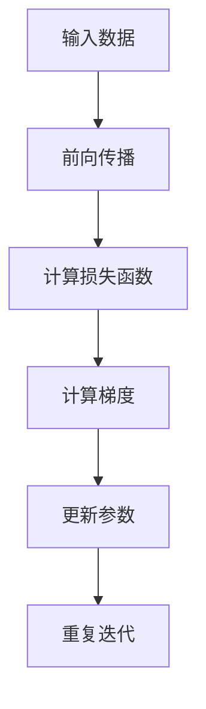

                 

# 文章标题：深度学习 (Deep Learning) 原理与代码实例讲解

> 关键词：深度学习，神经网络，反向传播，卷积神经网络，循环神经网络，生成对抗网络，计算机视觉，自然语言处理，项目实战

> 摘要：本文旨在深入浅出地讲解深度学习的原理及其在计算机视觉和自然语言处理领域的应用。通过逐步分析神经网络的基础算法、数学基础，以及实际项目实战，帮助读者全面了解深度学习的技术要点和开发实践。

## 第一部分：深度学习基础知识

### 第1章：深度学习简介

#### 1.1 深度学习的发展历程

##### 1.1.1 深度学习的起源

深度学习（Deep Learning）起源于1980年代，最初由David E. Rumelhart、George E. Hinton和John L. McClelland等人提出。他们的目标是模拟人脑的神经网络结构，以实现高效的机器学习。然而，由于计算能力和数据量的限制，深度学习在早期并未得到广泛应用。

##### 1.1.2 深度学习的发展里程碑

2006年，Geoffrey Hinton等人提出了深度信念网络（Deep Belief Network，DBN），标志着深度学习的一个重要突破。随后，2009年，Hinton等人提出了达特茅斯神经网络（Dartmouth Neural Network），使得深度学习在图像识别、语音识别等领域取得了显著进展。

##### 1.1.3 深度学习的优势与挑战

深度学习具有强大的表征能力和良好的泛化能力，使其在各个领域表现出色。然而，深度学习也存在一些挑战，如计算资源消耗大、模型训练时间长等。此外，深度学习模型的黑盒特性使得其解释性较差，这也是一个亟待解决的问题。

#### 1.2 深度学习的基本概念

##### 1.2.1 神经网络

神经网络（Neural Network）是深度学习的基础。它由大量的神经元（Neuron）组成，通过层层叠加形成深度网络。神经网络通过学习输入和输出之间的映射关系，实现数据的分类、回归等任务。

##### 1.2.2 前向传播与反向传播

前向传播（Forward Propagation）是神经网络中的一个重要过程。它将输入数据传递到网络的每个层次，通过层层计算得到输出结果。反向传播（Back Propagation）是用于训练神经网络的算法。它通过计算误差的梯度，反向更新网络的权重和偏置，使网络逐渐逼近正确结果。

##### 1.2.3 激活函数

激活函数（Activation Function）是神经网络中的一个关键组件。它用于对神经元的输出进行非线性变换，使神经网络能够学习复杂的非线性关系。常见的激活函数有Sigmoid、ReLU和Tanh等。

##### 1.2.4 损失函数与优化器

损失函数（Loss Function）用于衡量网络预测值与实际值之间的差异。常见的损失函数有均方误差（MSE）和交叉熵（Cross-Entropy）等。优化器（Optimizer）用于调整网络参数，以最小化损失函数。常见的优化器有梯度下降（Gradient Descent）、随机梯度下降（Stochastic Gradient Descent，SGD）和Adam等。

#### 1.3 深度学习的常见架构

##### 1.3.1 卷积神经网络（CNN）

卷积神经网络（Convolutional Neural Network，CNN）是一种专门用于处理图像数据的深度学习模型。它通过卷积操作和池化操作，实现对图像的层次化表征。CNN在计算机视觉领域取得了显著的成功，如图像分类、目标检测和语义分割等。

##### 1.3.2 循环神经网络（RNN）

循环神经网络（Recurrent Neural Network，RNN）是一种用于处理序列数据的深度学习模型。它通过隐藏状态和循环连接，捕捉序列中的长期依赖关系。RNN在自然语言处理、语音识别和时间序列分析等领域表现出色。

##### 1.3.3 长短期记忆网络（LSTM）

长短期记忆网络（Long Short-Term Memory，LSTM）是RNN的一种变体，专门用于解决RNN的梯度消失和梯度爆炸问题。LSTM通过引入门控机制，有效地捕获序列中的长期依赖关系。LSTM在机器翻译、语音识别和情感分析等领域具有广泛应用。

##### 1.3.4 生成对抗网络（GAN）

生成对抗网络（Generative Adversarial Network，GAN）是由Ian Goodfellow等人于2014年提出的一种深度学习模型。它由生成器和判别器两个网络组成，通过对抗训练，生成器试图生成逼真的数据，而判别器则试图区分生成数据和真实数据。GAN在图像生成、风格迁移和超分辨率等领域取得了显著的成果。

## 第二部分：深度学习基础算法

### 第2章：深度学习基础算法

#### 2.1 神经网络基础

##### 2.1.1 神经元与层结构

神经元是神经网络的基本单元。一个简单的神经元可以表示为：

\[ a_3 = \sigma(\sum_{i=1}^{n} w_i a_i + b) \]

其中，\( a_i \)是输入值，\( w_i \)是权重，\( b \)是偏置，\( \sigma \)是激活函数。

神经网络由多个层次组成，包括输入层、隐藏层和输出层。输入层接收外部数据，隐藏层负责数据的表征和学习，输出层产生最终的预测结果。

##### 2.1.2 网络前向传播过程

网络前向传播过程可以分为以下几个步骤：

1. 将输入数据传递到输入层。
2. 将输入层的数据传递到隐藏层，计算隐藏层的输出。
3. 将隐藏层的输出传递到下一层，重复步骤2，直到输出层。
4. 得到网络的最终输出。

前向传播过程中，网络的每个层次都通过前一个层次的输出和权重计算得到当前层次的输出。

##### 2.1.3 伪代码示例：前向传播

```
# 输入数据
x = [1, 2, 3]

# 权重和偏置
w1 = [0.5, 0.6, 0.7]
b1 = 0.3
w2 = [0.8, 0.9, 1.0]
b2 = 0.4

# 激活函数
sigma = lambda x: 1 / (1 + exp(-x))

# 前向传播
a1 = x * w1 + b1
z1 = sigma(a1)
a2 = z1 * w2 + b2
z2 = sigma(a2)

print("输出:", z2)
```

#### 2.2 反向传播算法

##### 2.2.1 反向传播原理

反向传播算法是用于训练神经网络的优化算法。它通过计算损失函数关于网络参数的梯度，更新网络参数，以最小化损失函数。

反向传播算法可以分为以下几个步骤：

1. 前向传播，计算网络的输出。
2. 计算输出层的误差，即损失函数关于输出层的梯度。
3. 通过反向传播，将误差传递到隐藏层，计算隐藏层的误差和梯度。
4. 更新网络参数，包括权重和偏置。
5. 重复步骤1-4，直到网络收敛。

##### 2.2.2 伪代码示例：反向传播

```
# 输入数据
x = [1, 2, 3]
y = [0, 1, 0]

# 权重和偏置
w1 = [0.5, 0.6, 0.7]
b1 = 0.3
w2 = [0.8, 0.9, 1.0]
b2 = 0.4

# 激活函数
sigma = lambda x: 1 / (1 + exp(-x))
sigma_prime = lambda x: x * (1 - x)

# 损失函数
loss = lambda y_hat, y: 0.5 * (y_hat - y)^2

# 前向传播
a1 = x * w1 + b1
z1 = sigma(a1)
a2 = z1 * w2 + b2
z2 = sigma(a2)
y_hat = z2

# 反向传播
delta2 = (y_hat - y) * sigma_prime(z2)
delta1 = (z2 * w2.T * sigma_prime(z1))

# 更新参数
w1 = w1 - learning_rate * (x.T * delta1)
b1 = b1 - learning_rate * delta1
w2 = w2 - learning_rate * (z1.T * delta2)
b2 = b2 - learning_rate * delta2

print("更新后的权重:", w1, w2)
```

##### 2.2.3 梯度下降优化方法

梯度下降（Gradient Descent）是一种常用的优化算法。它通过计算损失函数关于网络参数的梯度，更新网络参数，以最小化损失函数。

梯度下降可以分为以下几个步骤：

1. 初始化网络参数。
2. 计算损失函数关于网络参数的梯度。
3. 更新网络参数，即 \( \theta = \theta - \alpha \cdot \nabla_\theta J(\theta) \)，其中 \( \alpha \) 是学习率。
4. 重复步骤2-3，直到网络收敛。

##### 2.3 激活函数与损失函数

激活函数是神经网络中的一个关键组件，用于对神经元的输出进行非线性变换。常见的激活函数有Sigmoid、ReLU和Tanh等。

损失函数用于衡量网络预测值与实际值之间的差异。常见的损失函数有均方误差（MSE）和交叉熵（Cross-Entropy）等。

##### 2.3.1 激活函数

Sigmoid函数：

\[ \sigma(x) = \frac{1}{1 + e^{-x}} \]

ReLU函数：

\[ \text{ReLU}(x) = \max(0, x) \]

Tanh函数：

\[ \text{Tanh}(x) = \frac{e^x - e^{-x}}{e^x + e^{-x}} \]

##### 2.3.2 损失函数

均方误差（MSE）：

\[ \text{MSE}(y, y') = \frac{1}{2} \sum_{i=1}^{n} (y_i - y'_i)^2 \]

交叉熵（Cross-Entropy）：

\[ \text{CE}(y, y') = -\sum_{i=1}^{n} y_i \log(y'_i) \]

##### 2.3.3 激活函数与损失函数的Mermaid流程图



## 第三部分：深度学习数学基础

### 第3章：深度学习数学基础

#### 3.1 概率论基础

概率论是深度学习的重要基础之一。它用于描述和建模不确定事件的发生概率。

##### 3.1.1 概率分布

概率分布是用于描述随机变量的概率分布情况。常见的概率分布有伯努利分布、二项分布、正态分布等。

伯努利分布：

\[ P(X = k) = p^k (1 - p)^{1 - k} \]

二项分布：

\[ P(X = k) = C_n^k p^k (1 - p)^{n - k} \]

正态分布：

\[ P(X = k) = \frac{1}{\sqrt{2\pi\sigma^2}} e^{-\frac{(x - \mu)^2}{2\sigma^2}} \]

##### 3.1.2 贝叶斯定理

贝叶斯定理是一种用于计算条件概率的概率论公式。它描述了后验概率与先验概率、似然函数之间的关系。

\[ P(A|B) = \frac{P(B|A) P(A)}{P(B)} \]

##### 3.1.3 马尔可夫链

马尔可夫链是一种随机过程，它满足马尔可夫性质，即当前状态只与上一个状态有关，与其他状态无关。

\[ P(X_n = x_n|X_{n-1} = x_{n-1}, X_{n-2} = x_{n-2}, ...) = P(X_n = x_n|X_{n-1} = x_{n-1}) \]

#### 3.2 线性代数基础

线性代数是深度学习中的重要数学工具，用于描述和计算数据的高维空间。

##### 3.2.1 矩阵与向量

矩阵（Matrix）是由一组数按行列排列组成的矩形数组。向量（Vector）是矩阵的一种特殊情况，即只有一行或一列。

\[ A = \begin{bmatrix} a_{11} & a_{12} & \dots & a_{1n} \\ a_{21} & a_{22} & \dots & a_{2n} \\ \vdots & \vdots & \ddots & \vdots \\ a_{m1} & a_{m2} & \dots & a_{mn} \end{bmatrix} \]

向量：

\[ \mathbf{v} = \begin{bmatrix} v_1 \\ v_2 \\ \vdots \\ v_n \end{bmatrix} \]

##### 3.2.2 矩阵运算

矩阵运算包括矩阵加法、矩阵乘法、矩阵转置等。

矩阵加法：

\[ A + B = \begin{bmatrix} a_{11} + b_{11} & a_{12} + b_{12} & \dots & a_{1n} + b_{1n} \\ a_{21} + b_{21} & a_{22} + b_{22} & \dots & a_{2n} + b_{2n} \\ \vdots & \vdots & \ddots & \vdots \\ a_{m1} + b_{m1} & a_{m2} + b_{m2} & \dots & a_{mn} + b_{mn} \end{bmatrix} \]

矩阵乘法：

\[ AB = \begin{bmatrix} \sum_{j=1}^{n} a_{1j} b_{j1} & \sum_{j=1}^{n} a_{1j} b_{j2} & \dots & \sum_{j=1}^{n} a_{1j} b_{jn} \\ \sum_{j=1}^{n} a_{2j} b_{j1} & \sum_{j=1}^{n} a_{2j} b_{j2} & \dots & \sum_{j=1}^{n} a_{2j} b_{jn} \\ \vdots & \vdots & \ddots & \vdots \\ \sum_{j=1}^{n} a_{mj} b_{j1} & \sum_{j=1}^{n} a_{mj} b_{j2} & \dots & \sum_{j=1}^{n} a_{mj} b_{jn} \end{bmatrix} \]

矩阵转置：

\[ A^T = \begin{bmatrix} a_{11} & a_{21} & \dots & a_{m1} \\ a_{12} & a_{22} & \dots & a_{m2} \\ \vdots & \vdots & \ddots & \vdots \\ a_{1n} & a_{2n} & \dots & a_{mn} \end{bmatrix} \]

##### 3.2.3 线性方程组

线性方程组是深度学习中常见的数学问题，用于求解线性方程组。

线性方程组：

\[ Ax = b \]

其中，\( A \)是系数矩阵，\( x \)是未知数向量，\( b \)是常数向量。

线性方程组的解法包括高斯消元法、矩阵求逆法等。

#### 3.3 微积分基础

微积分是深度学习中重要的数学工具，用于描述和计算函数的导数和积分。

##### 3.3.1 导数与微分

导数是描述函数在某一点处的变化率。微分是导数的一种近似表示。

导数：

\[ f'(x) = \lim_{\Delta x \to 0} \frac{f(x + \Delta x) - f(x)}{\Delta x} \]

微分：

\[ df = f'(x) dx \]

##### 3.3.2 积分与反演

积分是导数的反演运算。它用于计算函数在某个区间上的累积值。

积分：

\[ \int_{a}^{b} f(x) dx = F(b) - F(a) \]

其中，\( F(x) \)是\( f(x) \)的一个原函数。

反演：

\[ f(x) = \frac{d}{dx} \int_{a}^{b} f(x) dx \]

##### 3.3.3 梯度下降与优化算法

梯度下降是深度学习中常用的优化算法。它通过计算损失函数关于网络参数的梯度，更新网络参数，以最小化损失函数。

梯度下降：

\[ \theta = \theta - \alpha \cdot \nabla_\theta J(\theta) \]

其中，\( \theta \)是网络参数，\( \alpha \)是学习率，\( \nabla_\theta J(\theta) \)是损失函数关于网络参数的梯度。

优化算法还包括随机梯度下降（SGD）、Adam等。

## 第二部分：深度学习应用实践

### 第4章：计算机视觉应用

计算机视觉是深度学习的一个重要应用领域，涉及图像分类、目标检测、语义分割等任务。

#### 4.1 卷积神经网络（CNN）

卷积神经网络（Convolutional Neural Network，CNN）是一种专门用于处理图像数据的深度学习模型。它通过卷积操作和池化操作，实现对图像的层次化表征。

##### 4.1.1 CNN结构

CNN由多个卷积层、池化层和全连接层组成。卷积层用于提取图像特征，池化层用于降低特征图的维度，全连接层用于进行分类或回归任务。

##### 4.1.2 卷积操作

卷积操作是CNN的核心。它通过在特征图上滑动卷积核，计算局部特征响应，从而提取图像中的关键信息。

卷积操作的计算公式如下：

\[ \text{conv}(x, \mathbf{w}) = \sum_{i=1}^{C} \sum_{j=1}^{H} \sum_{k=1}^{W} x_{ij} \mathbf{w}_{ik} \]

其中，\( x \)是输入特征图，\( \mathbf{w} \)是卷积核，\( C \)、\( H \)和\( W \)分别表示特征图的通道数、高度和宽度。

##### 4.1.3 池化操作

池化操作用于降低特征图的维度。常见的池化操作有最大池化和平均池化。

最大池化：

\[ \text{max-pool}(x, P) = \max(x_{ij}) \]

其中，\( P \)是池化窗口的大小。

平均池化：

\[ \text{avg-pool}(x, P) = \frac{1}{P^2} \sum_{i=1}^{P} \sum_{j=1}^{P} x_{ij} \]

#### 4.2 目标检测与图像识别

目标检测与图像识别是计算机视觉中的重要任务。目标检测旨在识别图像中的多个目标，并定位其位置。图像识别则旨在对图像进行分类。

##### 4.2.1 R-CNN算法

R-CNN（Region-based Convolutional Neural Network）是一种基于区域提议的目标检测算法。它包括以下步骤：

1. 使用选择性搜索（Selective Search）算法生成候选区域。
2. 对每个候选区域使用CNN提取特征。
3. 使用支持向量机（SVM）对特征进行分类。

##### 4.2.2 Fast R-CNN算法

Fast R-CNN是R-CNN的改进版本。它通过共享卷积特征图，提高了检测速度。Fast R-CNN包括以下步骤：

1. 使用选择性搜索算法生成候选区域。
2. 对每个候选区域使用CNN提取特征。
3. 对特征进行全连接层分类。

##### 4.2.3 Faster R-CNN算法

Faster R-CNN是Fast R-CNN的进一步改进。它引入了区域提议网络（Region Proposal Network，RPN），用于生成候选区域。Faster R-CNN包括以下步骤：

1. 使用RPN生成候选区域。
2. 对每个候选区域使用CNN提取特征。
3. 使用ROI（Region of Interest）池化层对特征进行分类。

#### 4.3 语义分割与实例分割

语义分割与实例分割是计算机视觉中的两个重要任务。语义分割旨在对图像中的每个像素进行分类，实例分割则旨在区分图像中的不同实例。

##### 4.3.1 U-Net模型

U-Net是一种用于语义分割的卷积神经网络。它由一个收缩路径和一个扩张路径组成。收缩路径用于提取特征，扩张路径用于生成分割结果。

##### 4.3.2 Mask R-CNN模型

Mask R-CNN是一种基于Faster R-CNN的实例分割模型。它通过引入掩膜分支，同时预测目标和掩膜。Mask R-CNN包括以下步骤：

1. 使用Faster R-CNN检测目标。
2. 对每个目标使用ROI池化层提取特征。
3. 对特征进行分类和掩膜预测。

## 第5章：自然语言处理应用

自然语言处理（Natural Language Processing，NLP）是深度学习的另一个重要应用领域，涉及文本分类、序列标注、语言生成等任务。

#### 5.1 循环神经网络（RNN）

循环神经网络（Recurrent Neural Network，RNN）是一种用于处理序列数据的深度学习模型。它通过隐藏状态和循环连接，捕捉序列中的长期依赖关系。

##### 5.1.1 RNN结构

RNN由多个时间步组成，每个时间步都有一个隐藏状态。隐藏状态通过当前输入和上一个隐藏状态计算得到。

\[ h_t = \text{sigmoid}(W_h \cdot [h_{t-1}, x_t] + b_h) \]

其中，\( h_t \)是时间步\( t \)的隐藏状态，\( x_t \)是时间步\( t \)的输入，\( W_h \)和\( b_h \)是权重和偏置。

##### 5.1.2 HMM与RNN的关系

隐马尔可夫模型（Hidden Markov Model，HMM）是一种用于序列模型建模的统计模型。RNN可以看作是HMM的一种推广，能够处理更复杂的序列建模任务。

##### 5.1.3 LSTM与GRU算法

LSTM（Long Short-Term Memory）和GRU（Gated Recurrent Unit）是RNN的两种变体，专门用于解决RNN的梯度消失和梯度爆炸问题。

LSTM通过引入门控机制，有效地捕获序列中的长期依赖关系。LSTM的隐藏状态更新公式如下：

\[ i_t = \text{sigmoid}(W_i \cdot [h_{t-1}, x_t] + b_i) \]
\[ f_t = \text{sigmoid}(W_f \cdot [h_{t-1}, x_t] + b_f) \]
\[ g_t = \text{tanh}(W_g \cdot [h_{t-1}, x_t] + b_g) \]
\[ o_t = \text{sigmoid}(W_o \cdot [h_{t-1}, x_t] + b_o) \]
\[ h_t = f_t \cdot h_{t-1} + i_t \cdot g_t \]

GRU通过简化LSTM的结构，减少了参数数量。GRU的隐藏状态更新公式如下：

\[ z_t = \text{sigmoid}(W_z \cdot [h_{t-1}, x_t] + b_z) \]
\[ r_t = \text{sigmoid}(W_r \cdot [h_{t-1}, x_t] + b_r) \]
\[ h_t = \text{tanh}(W_h \cdot [z_t \odot h_{t-1}, r_t \odot x_t] + b_h) \]

#### 5.2 序列标注与分类

序列标注与分类是NLP中的常见任务。序列标注旨在对序列中的每个元素进行分类，如词性标注、命名实体识别等。分类则是对整个序列进行分类，如文本分类、情感分析等。

##### 5.2.1 BiLSTM-CRF模型

BiLSTM-CRF（Bidirectional LSTM with Conditional Random Field）是一种结合了双向LSTM和条件随机场（Conditional Random Field，CRF）的序列标注模型。

BiLSTM-CRF的输出层不仅包含全连接层，还包括CRF层。CRF层用于预测标签序列的概率分布，从而提高序列标注的准确性。

##### 5.2.2 序列标注任务

序列标注任务通常涉及以下步骤：

1. 数据预处理，将文本转化为词向量表示。
2. 使用LSTM或GRU模型对文本进行编码。
3. 使用CRF层对编码结果进行分类。

#### 5.3 语言生成与翻译

语言生成与翻译是NLP中的重要任务。语言生成旨在生成符合语法和语义规则的文本，如文本生成、对话系统等。翻译则是对不同语言之间的文本进行转换。

##### 5.3.1 Sequence-to-Sequence模型

Sequence-to-Sequence（Seq2Seq）模型是一种用于序列转换的深度学习模型。它由编码器和解码器组成，分别对输入和输出序列进行编码和解码。

编码器：

\[ h_t^e = \text{LSTM}(x_t^e, h_{t-1}^e) \]

解码器：

\[ y_t^d = \text{LSTM}(y_t^d, h_t^e) \]

##### 5.3.2 转换器架构（Encoder-Decoder）

转换器架构（Encoder-Decoder）是一种基于Seq2Seq模型的NLP模型。它通过引入注意力机制（Attention Mechanism），提高序列转换的准确性。

注意力机制：

\[ a_t = \text{softmax}(\text{ Scores} = \text{ Scores}^T \cdot h_t^e) \]
\[ c_t = \sum_{i=1}^{T_e} a_i \cdot h_i^e \]

其中，\( a_t \)是时间步\( t \)的注意力分布，\( c_t \)是时间步\( t \)的上下文表示。

## 第6章：生成对抗网络（GAN）

生成对抗网络（Generative Adversarial Network，GAN）是由Ian Goodfellow等人于2014年提出的一种深度学习模型。它由生成器和判别器两个网络组成，通过对抗训练生成逼真的数据。

##### 6.1 GAN的基本原理

GAN由生成器和判别器两个网络组成。生成器试图生成逼真的数据，而判别器则试图区分生成数据和真实数据。生成器和判别器相互对抗，共同训练，使生成器生成的数据越来越逼真。

生成器的目标是最大化判别器对生成数据的分类错误率：

\[ G^*: \arg\max_D \mathbb{E}_{x \sim p_{data}(x)}[\log(D(x))] + \mathbb{E}_{z \sim p_z(z)}[\log(1 - D(G(z)))] \]

判别器的目标是最大化生成器和真实数据的分类正确率：

\[ D^*: \arg\max_D \mathbb{E}_{x \sim p_{data}(x)}[\log(D(x))] + \mathbb{E}_{z \sim p_z(z)}[\log(D(G(z)))] \]

其中，\( x \)是真实数据，\( z \)是随机噪声。

##### 6.1.1 GAN的结构

GAN由生成器\( G \)和判别器\( D \)组成。生成器\( G \)将随机噪声\( z \)映射为真实数据的分布。判别器\( D \)用于区分生成数据和真实数据。

\[ G(z) \xrightarrow{G} x' \]
\[ x' \xrightarrow{D} D(x') \]

\[ G: \mathbb{R}^z \rightarrow \mathbb{R}^x \]
\[ D: \mathbb{R}^{x+y} \rightarrow \mathbb{R} \]

##### 6.1.2 对抗训练过程

GAN通过对抗训练进行训练。对抗训练包括以下步骤：

1. 初始化生成器\( G \)和判别器\( D \)的参数。
2. 对生成器\( G \)进行优化，使其生成的数据更接近真实数据。
3. 对判别器\( D \)进行优化，使其更好地区分生成数据和真实数据。
4. 重复步骤2-3，直到生成器生成的数据足够逼真。

##### 6.1.3 GAN的变体

GAN存在多种变体，以解决生成器训练不稳定、判别器训练困难等问题。

1. 鼓励学习（Auxiliary Classifier GAN，AC-GAN）
2. 条件生成对抗网络（Conditional GAN，cGAN）
3. 多个判别器生成对抗网络（Multi-Discriminator GAN，MD-GAN）
4. 辅助生成对抗网络（Auxiliary GAN，Aux-GAN）

##### 6.1.4 GAN的应用

GAN在图像生成、风格迁移和超分辨率等任务中取得了显著成果。

1. 图像生成：GAN可以生成高质量的自然图像，如图像生成对抗网络（Image GAN）。
2. 风格迁移：GAN可以将一种风格迁移到另一种风格，如图像风格迁移（Image Style Transfer）。
3. 超分辨率：GAN可以用于图像超分辨率，提高图像的分辨率。

## 第二部分：深度学习基础算法

### 第2章：深度学习基础算法

深度学习（Deep Learning）是一种人工智能（AI）的方法，它通过模拟人脑中神经网络的运作方式来学习和处理数据。本章将详细介绍深度学习的基础算法，包括神经网络的基本结构、前向传播和反向传播算法，以及激活函数、损失函数和优化器。

#### 2.1 神经网络基础

神经网络（Neural Network，NN）是深度学习的基础组成部分。一个简单的神经网络通常包括以下几个关键组成部分：

1. **输入层**：接收外部输入数据。
2. **隐藏层**：对输入数据进行特征提取和变换。
3. **输出层**：产生最终输出结果。

每个层由多个神经元（节点）组成，神经元之间通过权重（weights）连接。神经元的计算通常包括以下步骤：

\[ z = \sum_{i=1}^{n} w_{i} x_{i} + b \]

其中，\( z \)是神经元的净输入，\( w_{i} \)是权重，\( x_{i} \)是输入值，\( b \)是偏置。

激活函数（Activation Function）用于对神经元的净输入进行非线性变换，常见的激活函数包括：

- **Sigmoid函数**：\[ \sigma(z) = \frac{1}{1 + e^{-z}} \]
- **ReLU函数**（Rectified Linear Unit）：\[ \text{ReLU}(z) = \max(0, z) \]
- **Tanh函数**：\[ \tanh(z) = \frac{e^{z} - e^{-z}}{e^{z} + e^{-z}} \]

#### 2.2 前向传播算法

前向传播（Forward Propagation）是神经网络处理输入数据的过程。以下是前向传播的步骤：

1. **输入层到隐藏层**：
   - 计算每个神经元的净输入和激活值。
   - 使用激活函数对激活值进行非线性变换。

2. **隐藏层到输出层**：
   - 重复上述步骤，直到输出层。

在前向传播过程中，每个神经元的输出值可以表示为：

\[ a_{j}^{(l)} = \sigma(z_{j}^{(l)}) \]

其中，\( a_{j}^{(l)} \)是第\( l \)层第\( j \)个神经元的输出值，\( z_{j}^{(l)} \)是第\( l \)层第\( j \)个神经元的净输入。

#### 2.3 反向传播算法

反向传播（Back Propagation）是用于训练神经网络的优化算法。它通过计算损失函数关于网络参数的梯度，反向更新网络的权重和偏置，使网络逐渐逼近正确结果。以下是反向传播的步骤：

1. **计算输出层的误差**：
   - 使用损失函数（如均方误差MSE）计算输出层预测值与实际值之间的误差。

2. **反向传播误差**：
   - 从输出层开始，反向计算每个层每个神经元的误差。

3. **计算梯度**：
   - 对每个神经元的权重和偏置计算梯度。

4. **更新参数**：
   - 使用梯度下降或其他优化算法更新网络参数。

以下是反向传播过程中误差和梯度的计算伪代码：

```python
# 前向传播计算输出
y_hat = forward_pass(x, W, b)

# 计算损失函数
loss = loss_function(y_hat, y)

# 计算输出层误差
dZ = y_hat - y

# 反向传播计算梯度
dW = (1/m) * dZ.dot(X.T)
db = (1/m) * np.sum(dZ, axis=1, keepdims=True)

# 更新参数
W -= learning_rate * dW
b -= learning_rate * db
```

#### 2.4 激活函数与损失函数

激活函数和损失函数是神经网络中的两个关键组件，用于实现数据的非线性变换和误差度量。

- **激活函数**：如前所述，激活函数用于对神经元的净输入进行非线性变换。它们的选择会影响网络的性能和收敛速度。
- **损失函数**：损失函数用于衡量网络预测值与实际值之间的差异。常见的损失函数包括均方误差（MSE）、交叉熵（Cross-Entropy）等。

均方误差（MSE）：

\[ \text{MSE} = \frac{1}{2} \sum_{i=1}^{n} (y_i - y_{\hat{i}})^2 \]

交叉熵（Cross-Entropy）：

\[ \text{Cross-Entropy} = -\sum_{i=1}^{n} y_i \log(y_{\hat{i}}) \]

#### 2.5 优化器

优化器用于调整网络参数，以最小化损失函数。常见的优化器包括：

- **梯度下降（Gradient Descent）**：
  \[ \theta = \theta - \alpha \cdot \nabla_\theta J(\theta) \]
  其中，\( \alpha \)是学习率，\( \nabla_\theta J(\theta) \)是损失函数关于参数\( \theta \)的梯度。

- **随机梯度下降（Stochastic Gradient Descent，SGD）**：
  \[ \theta = \theta - \alpha \cdot \nabla_\theta J(\theta) \]
  其中，每次迭代只随机选择一个样本来计算梯度。

- **Adam优化器**：
  \[ m_t = \beta_1 m_{t-1} + (1 - \beta_1) [g_t] \]
  \[ v_t = \beta_2 v_{t-1} + (1 - \beta_2) [g_t]^2 \]
  \[ \theta = \theta - \alpha \cdot \frac{m_t}{\sqrt{v_t} + \epsilon} \]
  其中，\( m_t \)和\( v_t \)分别是梯度的一阶矩估计和二阶矩估计，\( \beta_1 \)和\( \beta_2 \)是超参数。

### 结论

本章介绍了深度学习的基础算法，包括神经网络的结构、前向传播和反向传播算法，以及激活函数、损失函数和优化器。这些算法构成了深度学习模型的核心，使得深度学习能够有效地处理复杂的机器学习任务。

### 附录：深度学习工具与资源

#### 附录A：深度学习框架对比

深度学习框架是用于构建和训练深度学习模型的软件库。以下是几个流行的深度学习框架及其特点：

##### A.1 TensorFlow

TensorFlow是由Google开发的开源深度学习框架，具有高度的可扩展性和灵活性。它支持多种编程语言，包括Python、C++和Java。

- **特点**：动态计算图、丰富的API、广泛的社区支持。
- **适用场景**：研究、生产部署、大规模数据处理。

##### A.2 PyTorch

PyTorch是由Facebook开发的开源深度学习框架，以动态计算图和易用性著称。

- **特点**：动态计算图、易用性、强大的GPU支持。
- **适用场景**：研究、快速原型开发。

##### A.3 Theano

Theano是由蒙特利尔大学开发的开源深度学习框架，支持Python，并在GPU上提供了高性能的计算。

- **特点**：静态计算图、支持GPU加速、易于调试。
- **适用场景**：研究、生产部署。

#### 附录B：深度学习资源

以下是一些深度学习相关的资源，包括论文、在线教程和开源项目：

##### B.1 论文推荐

- **Deep Learning**: Ian Goodfellow, Yoshua Bengio, Aaron Courville
- **Building Deep Learning Models with TensorFlow**: Erich Neukirch

##### B.2 在线教程

- [TensorFlow官网教程](https://www.tensorflow.org/tutorials)
- [PyTorch官方文档](https://pytorch.org/tutorials/)
- [深度学习笔记](https://zhuanlan.zhihu.com/p/33633689)

##### B.3 开源项目

- [TensorFlow Models](https://github.com/tensorflow/models)
- [PyTorch Examples](https://github.com/pytorch/examples)
- [深度学习项目集合](https://github.com/tensorflow/tensorflow/blob/master/tensorflow/contrib/eager/examples/tutorials/learning_to_classify_cifar10.ipynb)

这些工具和资源将帮助您更好地了解和应用深度学习技术。通过实践和探索，您将能够掌握深度学习的精髓，并在实际项目中取得成功。

### 作者

- 作者：AI天才研究院（AI Genius Institute） & 禅与计算机程序设计艺术（Zen And The Art of Computer Programming）

