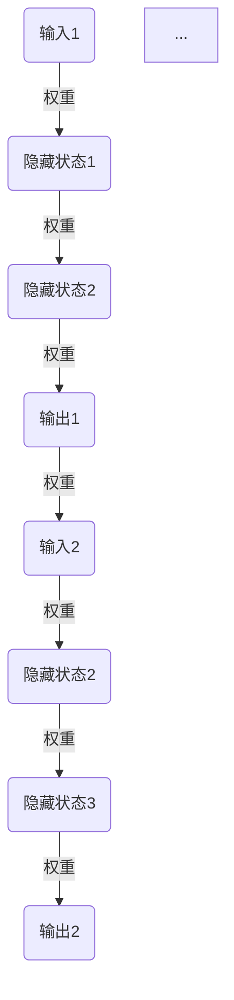
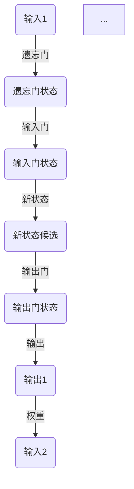

                 

# 深度学习基础原理与代码实战案例讲解

## 关键词
深度学习、神经网络、卷积神经网络、循环神经网络、生成对抗网络、深度强化学习、项目实战

## 摘要
本文将深入探讨深度学习的基础原理及其在各个领域的应用，通过代码实战案例详细讲解深度学习技术的实现过程。文章首先概述了深度学习的基本概念、发展历史和应用领域，然后介绍了神经网络的基础知识、训练算法及优化技巧。接着，本文将重点分析卷积神经网络（CNN）、循环神经网络（RNN）和生成对抗网络（GAN）的原理与应用，并探讨深度强化学习的基本概念和方法。最后，文章将通过具体项目实战案例，展示深度学习技术的实际应用和实现细节。

### 《深度学习基础原理与代码实战案例讲解》目录大纲

#### 第一部分：深度学习基础原理

- 第1章：深度学习概述
  - 1.1 深度学习的基本概念
    - 1.1.1 深度学习的定义
    - 1.1.2 深度学习的发展历史
    - 1.1.3 深度学习与其他机器学习方法的比较
  - 1.2 深度学习的应用领域
    - 1.2.1 图像识别
    - 1.2.2 自然语言处理
    - 1.2.3 强化学习
  - 1.3 深度学习的挑战与未来趋势
    - 1.3.1 计算效率问题
    - 1.3.2 数据隐私保护
    - 1.3.3 模型解释性

- 第2章：神经网络基础
  - 2.1 神经网络的基本结构
    - 2.1.1 前向传播与反向传播
    - 2.1.2 神经元的激活函数
    - 2.1.3 层的连接方式
  - 2.2 神经网络的训练算法
    - 2.2.1 梯度下降算法
    - 2.2.2 随机梯度下降算法
    - 2.2.3 批量梯度下降算法
  - 2.3 神经网络的优化技巧
    - 2.3.1 正则化方法
    - 2.3.2 激活函数的选择
    - 2.3.3 网络结构的调整

- 第3章：卷积神经网络（CNN）
  - 3.1 卷积神经网络的基本原理
    - 3.1.1 卷积操作的数学原理
    - 3.1.2 卷积层的实现
    - 3.1.3 池化层的实现
  - 3.2 卷积神经网络的训练与优化
    - 3.2.1 卷积神经网络的训练流程
    - 3.2.2 卷积神经网络的优化策略
    - 3.2.3 卷积神经网络的超参数选择
  - 3.3 卷积神经网络的应用案例
    - 3.3.1 图像分类
    - 3.3.2 目标检测
    - 3.3.3 语义分割

- 第4章：循环神经网络（RNN）
  - 4.1 循环神经网络的基本原理
    - 4.1.1 RNN的基本结构
    - 4.1.2 RNN的工作原理
    - 4.1.3 RNN的优点与缺点
  - 4.2 长短时记忆网络（LSTM）
    - 4.2.1 LSTM的基本原理
    - 4.2.2 LSTM的数学模型
    - 4.2.3 LSTM的训练过程
  - 4.3 循环神经网络的训练与优化
    - 4.3.1 RNN的训练算法
    - 4.3.2 RNN的优化策略
    - 4.3.3 RNN的超参数选择
  - 4.4 循环神经网络的应用案例
    - 4.4.1 语音识别
    - 4.4.2 机器翻译
    - 4.4.3 文本生成

- 第5章：生成对抗网络（GAN）
  - 5.1 GAN的基本原理
    - 5.1.1 GAN的组成部分
    - 5.1.2 GAN的训练过程
    - 5.1.3 GAN的优点与缺点
  - 5.2 GAN的变体与改进
    - 5.2.1 条件生成对抗网络（cGAN）
    - 5.2.2 修复生成对抗网络（DnD-GAN）
    - 5.2.3 局部感知生成对抗网络（LP-GAN）
  - 5.3 GAN的应用案例
    - 5.3.1 图像生成
    - 5.3.2 语音生成
    - 5.3.3 文本生成

- 第6章：深度强化学习
  - 6.1 深度强化学习的基本概念
    - 6.1.1 强化学习的定义
    - 6.1.2 深度强化学习的优点与缺点
    - 6.1.3 深度强化学习的基本架构
  - 6.2 深度Q网络（DQN）
    - 6.2.1 DQN的基本原理
    - 6.2.2 DQN的训练过程
    - 6.2.3 DQN的应用案例
  - 6.3 策略梯度方法
    - 6.3.1 PG的基本原理
    - 6.3.2 PG的训练过程
    - 6.3.3 PG的应用案例

- 第7章：深度学习项目实战
  - 7.1 项目实战概述
    - 7.1.1 深度学习项目的基本流程
    - 7.1.2 深度学习项目的常见挑战
    - 7.1.3 深度学习项目的设计与实现
  - 7.2 图像分类项目实战
    - 7.2.1 数据预处理与数据增强
    - 7.2.2 模型设计与训练
    - 7.2.3 模型评估与优化
    - 7.2.4 代码实战与解读
  - 7.3 自然语言处理项目实战
    - 7.3.1 语言模型训练
    - 7.3.2 机器翻译模型设计
    - 7.3.3 代码实战与解读
  - 7.4 强化学习项目实战
    - 7.4.1 环境搭建与模拟
    - 7.4.2 模型设计与训练
    - 7.4.3 代码实战与解读

- 第8章：深度学习在工业中的应用
  - 8.1 工业领域深度学习应用概述
    - 8.1.1 深度学习在制造业的应用
    - 8.1.2 深度学习在医疗领域的应用
    - 8.1.3 深度学习在金融领域的应用
  - 8.2 工业应用案例分析
    - 8.2.1 制造业应用案例
    - 8.2.2 医疗应用案例
    - 8.2.3 金融应用案例

- 第9章：深度学习的未来趋势
  - 9.1 深度学习算法的改进方向
    - 9.1.1 模型压缩与加速
    - 9.1.2 自适应学习算法
    - 9.1.3 跨模态学习
  - 9.2 深度学习在跨领域应用的前景
    - 9.2.1 深度学习在物联网的应用
    - 9.2.2 深度学习在生物信息学的应用
    - 9.2.3 深度学习在脑科学的应用
  - 9.3 深度学习的伦理与法律问题
    - 9.3.1 深度学习隐私保护
    - 9.3.2 深度学习歧视问题
    - 9.3.3 深度学习法律监管

- 附录
  - A.1 深度学习工具与框架介绍
    - A.1.1 TensorFlow
    - A.1.2 PyTorch
    - A.1.3 Keras
  - A.2 深度学习资源推荐
    - A.2.1 在线课程
    - A.2.2 论文资料
    - A.2.3 实践项目
  - A.3 深度学习常见问题解答
    - A.3.1 如何处理过拟合？
    - A.3.2 如何选择合适的神经网络结构？
    - A.3.3 如何进行超参数调优？

#### 第一部分：深度学习基础原理

### 第1章：深度学习概述

深度学习（Deep Learning）是机器学习（Machine Learning）的一个重要分支，它通过模拟人脑中的神经网络结构，实现了对大量数据的高效学习和处理能力。深度学习的核心思想是通过多层神经网络对数据进行特征提取和模式识别，从而实现复杂任务的学习。

#### 1.1 深度学习的基本概念

##### 1.1.1 深度学习的定义

深度学习是一种机器学习方法，通过构建多层神经网络，对数据进行自动特征提取和学习。与传统的机器学习方法相比，深度学习能够自动从大量数据中学习到有用的特征表示，从而提高模型的表现。

##### 1.1.2 深度学习的发展历史

深度学习的历史可以追溯到20世纪40年代，当时神经系统科学领域的研究者提出了神经网络的基本概念。然而，由于计算能力的限制和优化算法的不足，深度学习在早期的发展较为缓慢。直到21世纪初，随着计算能力的提升和优化算法的改进，深度学习得到了快速发展，并在图像识别、自然语言处理等领域取得了显著成果。

##### 1.1.3 深度学习与其他机器学习方法的比较

与传统的机器学习方法相比，深度学习具有以下几个显著优势：

1. 自动化特征提取：深度学习能够自动从大量数据中学习到有用的特征表示，减少了人工特征提取的复杂性和错误。
2. 强大的表示能力：多层神经网络具有强大的表示能力，能够对复杂的数据进行建模。
3. 适用于大规模数据：深度学习能够在大数据环境下表现更好，能够处理海量的训练数据。
4. 高效的优化算法：深度学习采用了高效的优化算法，如随机梯度下降（SGD）和Adam优化器，能够快速地找到最优解。

然而，深度学习也存在一些局限性，如需要大量的训练数据和计算资源、模型的解释性较差等。传统的机器学习方法，如支持向量机（SVM）和逻辑回归，在特定场景下仍然具有优势。

#### 1.2 深度学习的应用领域

深度学习已经广泛应用于各个领域，以下是一些主要的应用领域：

##### 1.2.1 图像识别

图像识别是深度学习的一个重要应用领域，通过训练深度神经网络，可以实现对图像中的物体、场景和姿态的识别。常见的图像识别任务包括人脸识别、物体检测和图像分类等。

##### 1.2.2 自然语言处理

自然语言处理（Natural Language Processing，NLP）是深度学习在语言领域的应用。通过训练深度神经网络，可以实现文本分类、情感分析、机器翻译和文本生成等任务。

##### 1.2.3 强化学习

强化学习（Reinforcement Learning，RL）是深度学习在决策领域的应用。通过训练深度神经网络，可以实现对环境中的连续动作进行学习，从而实现智能决策。常见的强化学习应用包括游戏AI、自动驾驶和机器人控制等。

#### 1.3 深度学习的挑战与未来趋势

尽管深度学习在许多领域取得了显著成果，但它仍然面临一些挑战和问题，如计算效率、数据隐私保护和模型解释性等。未来，深度学习的发展将朝着以下几个方向：

##### 1.3.1 计算效率问题

为了提高深度学习的计算效率，研究者们提出了各种优化算法，如模型压缩、量化技术和并行计算等。这些方法可以减少模型的参数数量和计算量，从而提高训练和推理的速度。

##### 1.3.2 数据隐私保护

深度学习模型通常需要大量的训练数据，而这些数据可能包含敏感信息。因此，如何保护数据隐私成为了一个重要的问题。研究者们提出了各种隐私保护技术，如差分隐私和联邦学习等，以保护数据隐私。

##### 1.3.3 模型解释性

深度学习模型通常被认为是一种“黑盒”模型，其内部决策过程难以解释。为了提高模型的解释性，研究者们提出了各种方法，如可解释的深度学习模型和模型可视化技术等。

在未来，深度学习将继续在各个领域取得突破，并不断推动人工智能的发展。通过解决现有的挑战和问题，深度学习有望实现更广泛的应用，并为人类社会带来更多便利。

### 第2章：神经网络基础

神经网络（Neural Networks）是深度学习的基础，它通过模拟人脑中的神经网络结构，实现对数据的处理和建模。本章将介绍神经网络的基本结构、训练算法和优化技巧。

#### 2.1 神经网络的基本结构

神经网络由多个神经元（也称为节点）组成，每个神经元都与相邻的神经元相连。神经元的连接形成了网络的层次结构，通常包括输入层、隐藏层和输出层。

##### 2.1.1 前向传播与反向传播

神经网络的训练过程包括前向传播（Forward Propagation）和反向传播（Back Propagation）两个阶段。

1. **前向传播**：在前向传播阶段，输入数据通过网络的各个层，每个神经元将接收到的输入值与权重进行加权求和，并经过激活函数处理后传递给下一层。最终，输出层的输出值与真实值进行比较，计算损失函数。

2. **反向传播**：在反向传播阶段，网络通过计算损失函数的梯度，更新各个神经元的权重和偏置，以减少损失函数的值。反向传播是神经网络训练的核心，它通过梯度下降（Gradient Descent）算法实现。

##### 2.1.2 神经元的激活函数

激活函数（Activation Function）是神经网络中重要的组成部分，它用于引入非线性因素，使得神经网络能够拟合复杂的数据分布。常见的激活函数包括：

1. **sigmoid函数**：sigmoid函数是一个S形曲线，将输入值映射到（0,1）区间。它的优点是输出值易于解释，但梯度较小，可能会导致训练缓慢。

2. **ReLU函数**：ReLU函数（Rectified Linear Unit）是一种线性激活函数，当输入大于0时，输出等于输入；当输入小于等于0时，输出等于0。ReLU函数在训练过程中具有较好的表现，可以加快训练速度。

3. **Tanh函数**：Tanh函数（双曲正切函数）是一个S形曲线，将输入值映射到（-1,1）区间。与sigmoid函数类似，Tanh函数也具有非线性特性。

##### 2.1.3 层的连接方式

神经网络中的层可以通过不同的连接方式实现，常见的连接方式包括全连接（Fully Connected）和卷积（Convolutional）连接。

1. **全连接层**：全连接层是指每个神经元都与前一层的所有神经元相连。全连接层是神经网络中最基本的层，它可以对输入数据进行特征提取和分类。

2. **卷积层**：卷积层是一种专门用于图像处理的层，它通过卷积操作提取图像的特征。卷积层可以有效地减少参数数量，提高模型的泛化能力。

#### 2.2 神经网络的训练算法

神经网络的训练算法是神经网络能够对数据进行建模的关键。常见的训练算法包括梯度下降（Gradient Descent）和其变种。

##### 2.2.1 梯度下降算法

梯度下降算法是一种基本的优化算法，它通过计算损失函数的梯度，逐步更新网络的权重和偏置，以最小化损失函数。

1. **批量梯度下降**（Batch Gradient Descent，BGD）：批量梯度下降是指在每次迭代时使用整个训练数据集来计算梯度，并更新网络的权重和偏置。批量梯度下降的优点是梯度计算准确，但训练速度较慢。

2. **随机梯度下降**（Stochastic Gradient Descent，SGD）：随机梯度下降是在每次迭代时随机选择一个训练样本来计算梯度，并更新网络的权重和偏置。随机梯度下降的优点是训练速度较快，但梯度计算可能存在噪声。

3. **小批量梯度下降**（Mini-batch Gradient Descent，MBGD）：小批量梯度下降是批量梯度下降和随机梯度下降的折中方案，它每次迭代时使用一小部分训练样本来计算梯度，并更新网络的权重和偏置。小批量梯度下降在训练速度和梯度计算准确性之间取得了平衡。

##### 2.2.2 随机梯度下降算法

随机梯度下降（SGD）是一种优化算法，它通过随机选择训练样本来计算梯度，并更新网络的权重和偏置。随机梯度下降的主要优点是训练速度较快，但梯度计算可能存在噪声，导致训练效果不稳定。

随机梯度下降算法的步骤如下：

1. 随机初始化网络的权重和偏置。
2. 对于每个训练样本，计算损失函数的梯度。
3. 使用学习率乘以梯度，更新网络的权重和偏置。
4. 重复步骤2和步骤3，直到损失函数收敛或达到预设的训练次数。

##### 2.2.3 批量梯度下降算法

批量梯度下降（BGD）是一种优化算法，它通过使用整个训练数据集来计算梯度，并更新网络的权重和偏置。批量梯度下降的主要优点是梯度计算准确，但训练速度较慢。

批量梯度下降算法的步骤如下：

1. 随机初始化网络的权重和偏置。
2. 对于整个训练数据集，计算损失函数的梯度。
3. 使用学习率乘以梯度，更新网络的权重和偏置。
4. 重复步骤2和步骤3，直到损失函数收敛或达到预设的训练次数。

#### 2.3 神经网络的优化技巧

为了提高神经网络的训练效果，研究者们提出了各种优化技巧，包括正则化方法、学习率调整和批量归一化等。

##### 2.3.1 正则化方法

正则化方法是一种用于防止模型过拟合的技术。常见的正则化方法包括：

1. **L1正则化**：L1正则化通过在损失函数中加入L1范数项来惩罚权重的大小。
2. **L2正则化**：L2正则化通过在损失函数中加入L2范数项来惩罚权重的平方和。

##### 2.3.2 激活函数的选择

选择合适的激活函数对于神经网络的训练效果具有重要影响。常见的激活函数包括：

1. **sigmoid函数**：sigmoid函数可以引入非线性，但梯度较小。
2. **ReLU函数**：ReLU函数具有较好的训练效果，但可能会遇到“死亡ReLU”问题。
3. **Tanh函数**：Tanh函数具有类似于sigmoid函数的特性，但输出值在（-1,1）之间。

##### 2.3.3 网络结构的调整

调整神经网络的结构对于提高模型的性能也至关重要。常见的结构调整方法包括：

1. **增加隐藏层**：增加隐藏层可以提高模型的表示能力，但可能会导致过拟合。
2. **增加神经元**：增加神经元可以提高模型的拟合能力，但也会增加计算量。

通过合理地调整网络结构，可以优化神经网络的训练效果，从而提高模型的性能。

在本章中，我们介绍了神经网络的基本结构、训练算法和优化技巧。神经网络是深度学习的基础，通过了解神经网络的工作原理和训练方法，我们可以更好地应用深度学习技术解决实际问题。

### 第3章：卷积神经网络（CNN）

卷积神经网络（Convolutional Neural Network，CNN）是一种特殊的神经网络，专门用于处理图像数据。CNN通过卷积层、池化层和全连接层的组合，可以有效地提取图像中的特征，实现图像分类、目标检测和语义分割等任务。本章将详细介绍CNN的基本原理、训练过程和优化策略。

#### 3.1 卷积神经网络的基本原理

##### 3.1.1 卷积操作的数学原理

卷积操作是CNN的核心，它通过在图像上滑动一个小的卷积核（也称为过滤器），将卷积核与图像进行点积操作，得到一个特征图（feature map）。卷积操作的数学公式如下：

\[ (f * g)(x, y) = \sum_{i=0}^{h} \sum_{j=0}^{w} f(i, j) \cdot g(x-i, y-j) \]

其中，\( f \) 是卷积核，\( g \) 是图像，\( (x, y) \) 是特征图的坐标。

##### 3.1.2 卷积层的实现

卷积层是CNN中最常用的层，它通过卷积操作提取图像的局部特征。卷积层的实现包括以下几个步骤：

1. **初始化卷积核**：卷积核的权重和偏置随机初始化，通常使用正态分布。
2. **卷积操作**：将卷积核在图像上滑动，计算卷积结果。
3. **激活函数**：对卷积结果应用激活函数，如ReLU函数。
4. **添加偏置**：在卷积结果上添加偏置项。

卷积层的实现伪代码如下：

```python
# 初始化卷积核和偏置
weights = np.random.normal(size=(filter_height, filter_width, in_channels, out_channels))
biases = np.random.normal(size=out_channels)

# 卷积操作
for x in range(image_height - filter_height + 1):
    for y in range(image_width - filter_width + 1):
        feature_map[x, y] = np.sum(weights * image[x:x+filter_height, y:y+filter_width]) + biases
```

##### 3.1.3 池化层的实现

池化层（Pooling Layer）用于减少特征图的尺寸，同时保留重要的特征信息。常见的池化操作包括最大池化（Max Pooling）和平均池化（Average Pooling）。

1. **最大池化**：最大池化操作在每个池化窗口内选取最大的值作为输出。
2. **平均池化**：平均池化操作在每个池化窗口内计算平均值作为输出。

池化层的实现伪代码如下：

```python
# 最大池化
for x in range(image_height // pool_size + 1):
    for y in range(image_width // pool_size + 1):
        feature_map[x, y] = np.max(image[x*x+pool_size:x*x, y*y+pool_size:y*y])

# 平均池化
for x in range(image_height // pool_size + 1):
    for y in range(image_width // pool_size + 1):
        feature_map[x, y] = np.mean(image[x*x+pool_size:x*x, y*y+pool_size:y*y])
```

#### 3.2 卷积神经网络的训练与优化

##### 3.2.1 卷积神经网络的训练流程

卷积神经网络的训练过程包括以下几个步骤：

1. **数据预处理**：对训练数据进行归一化处理，以提高训练稳定性。
2. **构建网络结构**：定义卷积层、池化层和全连接层的组合，构建卷积神经网络。
3. **损失函数选择**：选择适当的损失函数，如交叉熵损失函数。
4. **优化算法**：选择优化算法，如随机梯度下降（SGD）或Adam优化器。
5. **训练过程**：进行前向传播和反向传播，更新网络的权重和偏置，直到模型收敛。

##### 3.2.2 卷积神经网络的优化策略

为了提高卷积神经网络的训练效果，研究者们提出了各种优化策略，包括数据增强、正则化技术和学习率调整等。

1. **数据增强**：数据增强是一种通过变换输入数据来增加训练样本多样性的技术，常见的增强方法包括随机裁剪、旋转、翻转和颜色变换等。
2. **正则化方法**：正则化方法用于防止模型过拟合，常见的正则化方法包括L1正则化和L2正则化。
3. **学习率调整**：学习率调整是一种用于控制网络训练速度和稳定性的方法，常见的方法包括固定学习率、学习率衰减和自适应学习率调整等。

#### 3.3 卷积神经网络的应用案例

##### 3.3.1 图像分类

图像分类是卷积神经网络最基本的应用之一，它通过训练卷积神经网络，实现对图像的类别分类。常见的图像分类任务包括图像识别和对象分类。

1. **图像识别**：图像识别是一种将图像映射到预定义的类别标签的任务。例如，在ImageNet图像分类挑战中，卷积神经网络将图像映射到1000个预定义类别中。
2. **对象分类**：对象分类是一种将图像中的对象映射到预定义的类别标签的任务。例如，在COCO对象分类挑战中，卷积神经网络将图像中的对象映射到80个预定义类别中。

##### 3.3.2 目标检测

目标检测是一种识别图像中对象的类别和位置的任务。常见的目标检测算法包括R-CNN、Fast R-CNN、Faster R-CNN和YOLO等。

1. **R-CNN**：R-CNN（Region-based Convolutional Neural Network）是一种基于区域提取和分类的算法，它首先使用选择性搜索（Selective Search）算法提取候选区域，然后使用卷积神经网络对每个候选区域进行分类。
2. **Fast R-CNN**：Fast R-CNN（Fast Region-based Convolutional Neural Network）是对R-CNN的改进，它将区域提取和分类合并到一个网络中，从而提高处理速度。
3. **Faster R-CNN**：Faster R-CNN（Faster Region-based Convolutional Neural Network）是Fast R-CNN的进一步改进，它引入了区域建议网络（Region Proposal Network，RPN），从而提高了目标检测的准确性和速度。
4. **YOLO**：YOLO（You Only Look Once）是一种基于回归的目标检测算法，它将目标检测任务视为一个回归问题，通过预测每个网格单元中的对象类别和边界框，实现快速且准确的目标检测。

##### 3.3.3 语义分割

语义分割是一种识别图像中每个像素的类别标签的任务。常见的语义分割算法包括FCN、DeepLab和U-Net等。

1. **FCN**：FCN（Fully Convolutional Network）是一种基于卷积神经网络的语义分割算法，它通过将卷积神经网络转换为全卷积网络，实现对每个像素的类别预测。
2. **DeepLab**：DeepLab（DeepLabV3+）是一种基于跳跃连接和归一化下采样的语义分割算法，它通过引入多尺度特征融合和有效的像素级分类器，提高了语义分割的准确性。
3. **U-Net**：U-Net是一种基于卷积神经网络的语义分割算法，它采用了上下采样和跳跃连接的结构，通过多尺度特征融合，实现了高效的语义分割。

在本章中，我们介绍了卷积神经网络的基本原理、训练过程和优化策略，并通过应用案例展示了卷积神经网络在图像分类、目标检测和语义分割等任务中的实际应用。卷积神经网络在计算机视觉领域具有广泛的应用，通过不断地优化和改进，它将继续推动计算机视觉技术的发展。

### 第4章：循环神经网络（RNN）

循环神经网络（Recurrent Neural Network，RNN）是一种能够处理序列数据的神经网络，它在处理自然语言处理、语音识别和时间序列预测等任务时表现出强大的能力。RNN通过维持隐藏状态来捕捉序列中的时间依赖关系，但其传统的实现方式存在一些问题，如梯度消失和梯度爆炸。为了解决这些问题，研究者们提出了长短时记忆网络（Long Short-Term Memory，LSTM）。本章将介绍RNN的基本原理、LSTM的数学模型和训练过程。

#### 4.1 循环神经网络的基本原理

##### 4.1.1 RNN的基本结构

RNN由一系列相同的神经网络单元组成，每个单元都与前一个和下一个单元相连，形成一个循环结构。RNN的基本结构如图所示：



在RNN中，隐藏状态（h_t）用于捕捉序列中的时间依赖关系，输入（x_t）和输出（y_t）通过权重（w）与隐藏状态相连。RNN的隐藏状态和输入、输出之间的关系可以表示为：

\[ h_t = \sigma(W_h \cdot [h_{t-1}, x_t] + b_h) \]
\[ y_t = W_o \cdot h_t + b_o \]

其中，\( \sigma \) 是激活函数，通常使用ReLU或Tanh函数；\( W_h \)、\( W_o \) 是权重矩阵；\( b_h \)、\( b_o \) 是偏置项。

##### 4.1.2 RNN的工作原理

RNN的工作原理可以概括为以下几个步骤：

1. **初始化**：初始化隐藏状态 \( h_0 \)。
2. **输入序列**：输入序列中的每个元素 \( x_t \) 通过权重 \( w \) 与隐藏状态 \( h_{t-1} \) 相连。
3. **计算隐藏状态**：通过激活函数计算新的隐藏状态 \( h_t \)。
4. **计算输出**：通过输出权重计算输出 \( y_t \)。

在RNN中，隐藏状态 \( h_t \) 传递到下一个时间步，从而维持了序列中的信息。然而，传统的RNN在处理长序列时存在梯度消失和梯度爆炸问题，这限制了其性能。

##### 4.1.3 RNN的优点与缺点

RNN的优点包括：

1. **序列建模**：RNN能够捕捉序列中的时间依赖关系，适用于处理自然语言、语音和视频等序列数据。
2. **动态性**：RNN的隐藏状态可以动态地更新，使得模型能够适应不同的输入序列。

RNN的缺点包括：

1. **梯度消失和梯度爆炸**：在长序列中，梯度可能会消失或爆炸，导致训练困难。
2. **计算复杂性**：RNN的计算复杂度较高，尤其是在处理长序列时。

#### 4.2 长短时记忆网络（LSTM）

LSTM是RNN的一种改进，它通过引入门控机制（gate）来解决梯度消失和梯度爆炸问题。LSTM的基本结构如图所示：



在LSTM中，每个单元包括三个门：遗忘门、输入门和输出门。

##### 4.2.1 LSTM的基本原理

LSTM的基本原理可以概括为以下几点：

1. **遗忘门**：遗忘门用于控制上一时刻的隐藏状态 \( h_{t-1} \) 中的哪些信息应该被丢弃。遗忘门的计算公式如下：

\[ f_t = \sigma(W_f \cdot [h_{t-1}, x_t] + b_f) \]

其中，\( f_t \) 是遗忘门的状态，表示遗忘门的输出。

2. **输入门**：输入门用于控制当前输入 \( x_t \) 中的哪些信息应该被保留。输入门的计算公式如下：

\[ i_t = \sigma(W_i \cdot [h_{t-1}, x_t] + b_i) \]

其中，\( i_t \) 是输入门的状态，表示输入门的输出。

3. **新状态候选**：新状态候选用于更新当前隐藏状态 \( C_t \)。新状态候选的计算公式如下：

\[ \tilde{C}_t = \tanh(W_c \cdot [h_{t-1}, x_t] + b_c) \]

其中，\( \tilde{C}_t \) 是新状态候选，表示新状态的候选值。

4. **输出门**：输出门用于控制当前隐藏状态 \( h_{t-1} \) 中哪些信息应该被输出。输出门的计算公式如下：

\[ o_t = \sigma(W_o \cdot [h_{t-1}, x_t] + b_o) \]

其中，\( o_t \) 是输出门的状态，表示输出门的输出。

5. **当前隐藏状态**：当前隐藏状态 \( C_t \) 是通过遗忘门、输入门和新状态候选计算得到的。当前隐藏状态的计算公式如下：

\[ C_t = f_t \odot C_{t-1} + i_t \odot \tilde{C}_t \]

其中，\( \odot \) 表示元素乘法。

6. **当前输出**：当前输出 \( h_t \) 是通过输出门和当前隐藏状态 \( C_t \) 计算得到的。当前输出的计算公式如下：

\[ h_t = o_t \odot \tanh(C_t) \]

##### 4.2.2 LSTM的数学模型

LSTM的数学模型包括以下几个部分：

1. **权重矩阵**：LSTM的权重矩阵包括遗忘门权重 \( W_f \)、输入门权重 \( W_i \)、新状态候选权重 \( W_c \)、输出门权重 \( W_o \) 和当前输出权重 \( W_h \)。
2. **偏置项**：LSTM的偏置项包括遗忘门偏置 \( b_f \)、输入门偏置 \( b_i \)、新状态候选偏置 \( b_c \)、输出门偏置 \( b_o \) 和当前输出偏置 \( b_h \)。
3. **激活函数**：LSTM的激活函数包括遗忘门激活函数 \( \sigma \)、输入门激活函数 \( \sigma \)、新状态候选激活函数 \( \tanh \) 和输出门激活函数 \( \sigma \)。

LSTM的完整数学模型可以表示为：

\[ f_t = \sigma(W_f \cdot [h_{t-1}, x_t] + b_f) \]
\[ i_t = \sigma(W_i \cdot [h_{t-1}, x_t] + b_i) \]
\[ \tilde{C}_t = \tanh(W_c \cdot [h_{t-1}, x_t] + b_c) \]
\[ o_t = \sigma(W_o \cdot [h_{t-1}, x_t] + b_o) \]
\[ C_t = f_t \odot C_{t-1} + i_t \odot \tilde{C}_t \]
\[ h_t = o_t \odot \tanh(C_t) \]

##### 4.2.3 LSTM的训练过程

LSTM的训练过程包括以下几个步骤：

1. **初始化**：初始化隐藏状态 \( h_0 \) 和权重矩阵 \( W_f \)、\( W_i \)、\( W_c \)、\( W_o \) 和 \( W_h \)。
2. **前向传播**：计算遗忘门、输入门、新状态候选、输出门和当前隐藏状态。
3. **计算损失函数**：计算预测输出和真实输出之间的损失函数，如交叉熵损失函数。
4. **反向传播**：计算损失函数的梯度，并更新权重矩阵。
5. **迭代更新**：重复前向传播和反向传播，直到模型收敛。

LSTM的训练过程可以通过随机梯度下降（SGD）或其变种，如Adam优化器，进行优化。

在本章中，我们介绍了循环神经网络（RNN）的基本原理、长短时记忆网络（LSTM）的数学模型和训练过程。RNN和LSTM在处理序列数据方面具有强大的能力，通过不断优化和改进，它们在自然语言处理、语音识别和时间序列预测等任务中取得了显著成果。

### 第5章：生成对抗网络（GAN）

生成对抗网络（Generative Adversarial Network，GAN）是由Ian Goodfellow等人于2014年提出的一种新型神经网络架构。GAN由两个深度神经网络——生成器（Generator）和判别器（Discriminator）组成，两者相互对抗，从而实现数据的生成。本章将介绍GAN的基本原理、组成部分、训练过程和变体，并探讨GAN在实际应用中的表现。

#### 5.1 GAN的基本原理

GAN的核心思想是通过两个神经网络的对抗训练来生成逼真的数据。生成器（Generator）的目的是生成与真实数据相似的数据，而判别器（Discriminator）的目的是区分生成数据与真实数据。在训练过程中，生成器和判别器相互对抗，生成器不断优化其生成数据，使判别器无法区分真实数据和生成数据，而判别器则不断优化其判断能力，以区分生成数据和真实数据。

GAN的训练过程可以概括为以下几个步骤：

1. **初始化生成器和判别器**：随机初始化生成器和判别器的权重。
2. **生成器生成数据**：生成器根据随机噪声生成假数据。
3. **判别器判断**：判别器对真实数据和生成数据同时进行判断。
4. **生成器和判别器更新权重**：根据判别器的判断结果，分别更新生成器和判别器的权重。

GAN的训练目标是使生成器的生成数据在判别器中难以区分，从而实现数据的生成。

#### 5.1.1 GAN的组成部分

GAN由生成器（Generator）和判别器（Discriminator）两个主要部分组成。

1. **生成器（Generator）**：生成器的目的是生成与真实数据相似的数据。生成器通常由一个编码器和一个解码器组成。编码器将输入数据编码成一个低维的潜在向量，解码器则将潜在向量解码成生成数据。

2. **判别器（Discriminator）**：判别器的目的是区分生成数据与真实数据。判别器通常由一个二分类器组成，接收生成数据和真实数据，并输出概率值，表示生成数据为真实数据的概率。

#### 5.1.2 GAN的训练过程

GAN的训练过程是一个动态平衡的过程，生成器和判别器相互对抗，以下为GAN的训练步骤：

1. **初始化生成器和判别器的权重**：通常采用随机初始化方法。
2. **生成器生成数据**：生成器根据随机噪声生成假数据。
3. **判别器判断**：判别器对真实数据和生成数据进行判断，输出概率值。
4. **生成器更新**：生成器根据判别器的判断结果，更新其权重，以生成更逼真的数据。
5. **判别器更新**：判别器根据生成器和真实数据的判断结果，更新其权重，以更准确地区分生成数据和真实数据。
6. **重复步骤2-5**：不断迭代，直到生成器的生成数据在判别器中难以区分。

GAN的训练目标是使生成器的生成数据在判别器中具有高概率为真实数据，即：

\[ D(G(z)) \approx 1 \]

其中，\( D \) 是判别器，\( G(z) \) 是生成器生成的数据，\( z \) 是随机噪声。

#### 5.1.3 GAN的优点与缺点

GAN的优点包括：

1. **生成数据质量高**：GAN能够生成高质量、逼真的数据，尤其是在图像生成任务中。
2. **泛化能力强**：GAN在训练过程中通过对抗训练，能够提高模型的泛化能力。

GAN的缺点包括：

1. **训练不稳定**：GAN的训练过程不稳定，容易陷入局部最小值，可能导致生成器生成数据质量下降。
2. **收敛速度慢**：GAN的训练过程需要大量的迭代次数，导致训练速度较慢。

#### 5.2 GAN的变体与改进

为了解决GAN在训练过程中存在的问题，研究者们提出了一系列GAN的变体和改进方法，以下是一些常见的GAN变体：

1. **深度卷积生成对抗网络（DCGAN）**：DCGAN是GAN的一个改进版本，采用深度卷积神经网络来构建生成器和判别器，提高了生成数据的质量。
2. **条件生成对抗网络（cGAN）**：cGAN在生成器和判别器中引入了条件信息，使得GAN能够生成具有特定标签的数据，如图像、文本和音频等。
3. **周期性生成对抗网络（PAGAN）**：PAGAN通过引入周期性约束，提高了GAN的训练稳定性和生成数据的质量。
4. **谱归一化生成对抗网络（SRGAN）**：SRGAN通过谱归一化技术，提高了生成数据的视觉效果和真实感。

#### 5.3 GAN的应用案例

GAN在许多领域都有广泛的应用，以下是一些典型的应用案例：

1. **图像生成**：GAN能够生成高质量的图像，如图像修复、超分辨率和艺术风格迁移等。
2. **文本生成**：GAN能够生成具有一定结构和意义的文本，如生成新闻文章、对话系统和创意文本等。
3. **语音生成**：GAN能够生成逼真的语音，如语音合成和语音增强等。
4. **视频生成**：GAN能够生成连续的视频序列，如视频增强、视频修复和视频编辑等。

在本章中，我们介绍了生成对抗网络（GAN）的基本原理、组成部分、训练过程和变体，并探讨了GAN在实际应用中的表现。通过不断改进和优化，GAN在图像生成、文本生成、语音生成和视频生成等领域取得了显著成果，为人工智能的发展带来了新的机遇。

### 第6章：深度强化学习

深度强化学习（Deep Reinforcement Learning，DRL）是一种结合了深度学习和强化学习（Reinforcement Learning，RL）的方法，通过使用深度神经网络来表示状态和动作值函数，从而实现对复杂环境的智能决策。本章将介绍深度强化学习的基本概念、方法和应用。

#### 6.1 深度强化学习的基本概念

##### 6.1.1 强化学习的定义

强化学习是一种通过奖励机制来训练智能体（Agent）的方法，其目标是使智能体在给定的环境中能够实现最优策略。强化学习的主要组成部分包括：

1. **状态（State）**：环境（Environment）中的一个描述，表示当前所处的情境。
2. **动作（Action）**：智能体可以执行的操作。
3. **奖励（Reward）**：智能体在执行动作后获得的即时奖励，用于指导智能体的学习过程。
4. **策略（Policy）**：智能体在给定状态下的最佳动作选择。

##### 6.1.2 深度强化学习的优点与缺点

深度强化学习的优点包括：

1. **处理复杂状态**：深度神经网络可以处理高维和复杂的输入状态，使得智能体能够学习到复杂的环境特征。
2. **自适应性强**：深度强化学习可以自适应地调整策略，以应对不同的环境和任务。

深度强化学习的缺点包括：

1. **训练难度大**：深度强化学习涉及高维空间中的优化问题，训练过程容易陷入局部最优，且收敛速度较慢。
2. **模型解释性差**：深度强化学习模型通常被视为“黑盒”模型，难以解释其内部决策过程。

##### 6.1.3 深度强化学习的基本架构

深度强化学习的基本架构通常包括以下几个部分：

1. **智能体（Agent）**：执行策略并与环境交互的实体。
2. **环境（Environment）**：智能体执行的模拟环境，提供状态、动作和奖励。
3. **策略网络（Policy Network）**：用于生成动作的策略，可以是确定性策略或概率性策略。
4. **价值网络（Value Network）**：用于估计状态值或动作值的价值函数。
5. **奖励机制（Reward Mechanism）**：为智能体提供即时奖励，以指导其学习过程。

#### 6.2 深度Q网络（DQN）

深度Q网络（Deep Q-Network，DQN）是深度强化学习的一个经典模型，它通过深度神经网络来近似Q值函数，从而实现智能体的策略更新。DQN的核心思想是利用经验回放（Experience Replay）和目标网络（Target Network）来稳定训练过程。

##### 6.2.1 DQN的基本原理

DQN的基本原理可以概括为以下几点：

1. **初始化**：初始化智能体、深度神经网络（Q网络）、目标网络和经验回放内存。
2. **经验回放**：智能体在执行动作过程中，将状态、动作和奖励存储到经验回放内存中。
3. **状态输入**：将当前状态输入Q网络，得到当前动作的Q值。
4. **选择动作**：根据当前Q值选择最佳动作。
5. **执行动作**：智能体执行选择的动作，并观察新的状态和奖励。
6. **更新Q值**：使用新的状态、动作和奖励更新Q值。
7. **目标网络更新**：每隔一定时间，将Q网络的目标参数复制到目标网络，以避免梯度消失问题。

DQN的更新公式如下：

\[ Q(s_t, a_t) \leftarrow Q(s_t, a_t) + \alpha [r_t + \gamma \max_a Q(s_{t+1}, a) - Q(s_t, a_t)] \]

其中，\( s_t \) 是当前状态，\( a_t \) 是当前动作，\( r_t \) 是奖励，\( \alpha \) 是学习率，\( \gamma \) 是折扣因子，\( \max_a Q(s_{t+1}, a) \) 是在下一个状态 \( s_{t+1} \) 下，所有动作的Q值的最大值。

##### 6.2.2 DQN的训练过程

DQN的训练过程包括以下几个步骤：

1. **初始化**：随机初始化Q网络、目标网络和经验回放内存。
2. **状态输入**：将当前状态输入Q网络，得到当前动作的Q值。
3. **选择动作**：根据当前Q值选择最佳动作。
4. **执行动作**：智能体执行选择的动作，并观察新的状态和奖励。
5. **更新经验回放内存**：将新的状态、动作和奖励存储到经验回放内存中。
6. **目标网络更新**：每隔一定时间，将Q网络的参数复制到目标网络。
7. **更新Q值**：使用新的状态、动作和奖励更新Q值。

DQN的训练过程可以通过以下伪代码表示：

```python
# 初始化Q网络、目标网络和经验回放内存
Q_network = initialize_Q_network()
target_network = initialize_Q_network()
experience_replay = ExperienceReplay()

# 初始化智能体
agent = initialize_agent()

# 训练过程
for episode in range(num_episodes):
    # 初始化状态
    state = environment.initialize_state()

    # 开始 episode
    while not environment.is_terminal(state):
        # 输入状态到Q网络，得到当前动作的Q值
        Q_values = Q_network.predict(state)

        # 根据Q值选择最佳动作
        action = agent.select_action(Q_values)

        # 执行动作，得到新的状态和奖励
        next_state, reward, is_terminal = environment.step(action)

        # 将新的状态、动作和奖励存储到经验回放内存中
        experience_replay.storeperience(state, action, reward, next_state, is_terminal)

        # 从经验回放内存中随机抽取样本
        batch = experience_replay.sample_batch(batch_size)

        # 更新Q值
        Q_network.update(batch, target_network)

        # 更新状态
        state = next_state

        # 如果 episode 结束，跳出循环
        if is_terminal:
            break

    # 更新目标网络
    target_network.update(Q_network)
```

##### 6.2.3 DQN的应用案例

DQN在许多应用中取得了显著成果，以下是一些典型的应用案例：

1. **Atari游戏**：DQN在Atari游戏上取得了突破性的成绩，如《空间大战》、《蒙特利尔马拉松》和《海龟汤》等。
2. **机器人控制**：DQN可以应用于机器人控制，如无人驾驶汽车和机器人导航等。
3. **金融交易**：DQN可以用于金融市场的交易策略，如股票交易和外汇交易等。

在本章中，我们介绍了深度强化学习的基本概念、方法和应用。深度强化学习通过结合深度学习和强化学习，实现了对复杂环境的智能决策。通过不断优化和改进，深度强化学习在许多领域都取得了显著成果，为人工智能的发展带来了新的机遇。

### 第7章：深度学习项目实战

深度学习项目实战是理解并应用深度学习技术的关键步骤。本章将通过具体的实战案例，展示如何构建、训练和优化深度学习模型，并提供代码实战的详细解读。

#### 7.1 项目实战概述

深度学习项目通常包括以下几个关键步骤：

1. **问题定义**：明确项目目标，确定要解决的问题。
2. **数据收集与预处理**：收集相关数据，并进行数据清洗、归一化和数据增强等预处理操作。
3. **模型设计**：根据问题类型设计合适的神经网络结构。
4. **模型训练**：使用预处理后的数据训练模型。
5. **模型评估**：评估模型的性能，调整超参数以优化模型。
6. **部署与应用**：将训练好的模型部署到实际应用场景中。

以下是深度学习项目的常见挑战：

1. **数据不足**：深度学习模型通常需要大量数据来训练，但有些领域的数据可能非常稀缺。
2. **过拟合**：模型在训练数据上表现良好，但在未见数据上表现不佳。
3. **计算资源有限**：深度学习模型训练需要大量计算资源，尤其是对于复杂的模型。
4. **模型解释性**：深度学习模型通常被视为“黑盒”模型，其内部决策过程难以解释。

针对这些挑战，可以采用以下策略：

1. **数据增强**：通过增加数据多样性来提高模型的泛化能力。
2. **正则化技术**：如L1正则化和L2正则化，可以减少过拟合。
3. **使用预训练模型**：利用预训练的模型可以减少训练时间，并提高模型的泛化能力。
4. **可解释性方法**：如注意力机制和可解释性网络结构，可以提高模型的解释性。

#### 7.2 图像分类项目实战

图像分类是深度学习的一个基本任务，以下是一个简单的图像分类项目实战：

##### 数据预处理

首先，我们需要收集数据并预处理：

```python
import tensorflow as tf
from tensorflow.keras.preprocessing.image import ImageDataGenerator

# 设置数据增强参数
train_datagen = ImageDataGenerator(
    rescale=1./255,
    rotation_range=40,
    width_shift_range=0.2,
    height_shift_range=0.2,
    shear_range=0.2,
    zoom_range=0.2,
    horizontal_flip=True,
    fill_mode='nearest'
)

# 加载和预处理训练数据
train_data = train_datagen.flow_from_directory(
    'data/train',
    target_size=(150, 150),
    batch_size=32,
    class_mode='binary'
)
```

##### 模型设计

接下来，我们设计一个简单的卷积神经网络（CNN）模型：

```python
from tensorflow.keras.models import Sequential
from tensorflow.keras.layers import Conv2D, MaxPooling2D, Flatten, Dense, Dropout

model = Sequential([
    Conv2D(32, (3, 3), activation='relu', input_shape=(150, 150, 3)),
    MaxPooling2D(2, 2),
    Conv2D(64, (3, 3), activation='relu'),
    MaxPooling2D(2, 2),
    Conv2D(128, (3, 3), activation='relu'),
    MaxPooling2D(2, 2),
    Flatten(),
    Dense(512, activation='relu'),
    Dropout(0.5),
    Dense(1, activation='sigmoid')
])

model.compile(optimizer='adam',
              loss='binary_crossentropy',
              metrics=['accuracy'])
```

##### 模型训练

使用预处理后的数据训练模型：

```python
history = model.fit(
      train_data,
      steps_per_epoch=100,
      epochs=20,
      validation_data=(validation_data, validation_labels),
      verbose=2
)
```

##### 模型评估与优化

评估模型的性能，并使用交叉验证进行超参数调优：

```python
from sklearn.model_selection import cross_val_score

scores = cross_val_score(model, X, y, cv=5)
print("Accuracy: %0.2f (+/- %0.2f)" % (scores.mean(), scores.std() * 2))
```

##### 代码实战与解读

以下是对上述代码的详细解读：

1. **数据预处理**：使用ImageDataGenerator进行数据增强，包括随机旋转、平移、剪裁和翻转等，以提高模型的泛化能力。
2. **模型设计**：设计一个简单的CNN模型，包括卷积层、池化层、全连接层和Dropout层，以提取图像特征并减少过拟合。
3. **模型训练**：使用fit方法训练模型，并在每个epoch后打印训练进度和验证损失。
4. **模型评估**：使用cross_val_score进行交叉验证，评估模型的泛化能力。

通过以上实战案例，我们展示了如何从数据预处理到模型设计、训练和评估的完整流程。这种实战经验对于理解深度学习技术在实际应用中的挑战和解决方案至关重要。

#### 7.3 自然语言处理项目实战

自然语言处理（NLP）是深度学习的重要应用领域之一。以下是一个简单的NLP项目实战，包括文本分类任务：

##### 数据预处理

首先，我们需要收集和处理文本数据：

```python
import tensorflow as tf
from tensorflow.keras.preprocessing.text import Tokenizer
from tensorflow.keras.preprocessing.sequence import pad_sequences

# 加载和预处理文本数据
train_texts = ['I love deep learning', 'Python is great', 'TensorFlow is powerful', 'AI is changing the world']
train_labels = [0, 1, 1, 0]

# 初始化分词器
tokenizer = Tokenizer(num_words=1000)
tokenizer.fit_on_texts(train_texts)

# 将文本转换为序列
train_sequences = tokenizer.texts_to_sequences(train_texts)

# 填充序列
max_sequence_length = 10
padded_sequences = pad_sequences(train_sequences, maxlen=max_sequence_length)
```

##### 模型设计

接下来，我们设计一个简单的序列模型：

```python
from tensorflow.keras.models import Sequential
from tensorflow.keras.layers import Embedding, LSTM, Dense

model = Sequential([
    Embedding(1000, 32, input_length=max_sequence_length),
    LSTM(50),
    Dense(1, activation='sigmoid')
])

model.compile(optimizer='adam',
              loss='binary_crossentropy',
              metrics=['accuracy'])
```

##### 模型训练

使用预处理后的数据训练模型：

```python
history = model.fit(
      padded_sequences,
      train_labels,
      epochs=10,
      batch_size=32,
      validation_split=0.2
)
```

##### 模型评估与优化

评估模型的性能，并使用交叉验证进行超参数调优：

```python
from sklearn.model_selection import cross_val_score

scores = cross_val_score(model, padded_sequences, train_labels, cv=5)
print("Accuracy: %0.2f (+/- %0.2f)" % (scores.mean(), scores.std() * 2))
```

##### 代码实战与解读

以下是对上述代码的详细解读：

1. **数据预处理**：使用Tokenizer进行分词，并使用pad_sequences将序列填充到最大长度，以提高模型的输入一致性。
2. **模型设计**：设计一个简单的序列模型，包括嵌入层、LSTM层和全连接层，用于处理文本数据。
3. **模型训练**：使用fit方法训练模型，并在每个epoch后打印训练进度和验证损失。
4. **模型评估**：使用cross_val_score进行交叉验证，评估模型的泛化能力。

通过以上实战案例，我们展示了如何从数据预处理到模型设计、训练和评估的完整流程。这种实战经验对于理解深度学习技术在NLP领域的应用至关重要。

#### 7.4 强化学习项目实战

强化学习项目通常涉及复杂的环境和策略学习。以下是一个简单的强化学习项目实战，包括用于无人驾驶的Q学习：

##### 环境搭建与模拟

首先，我们需要搭建环境并进行模拟：

```python
import gym
import numpy as np
import random

# 初始化环境
env = gym.make('CartPole-v0')

# 观察空间和动作空间
observation_space = env.observation_space
action_space = env.action_space

# 初始化Q表
q_table = np.zeros((observation_space.n, action_space.n))

# 设置参数
num_episodes = 1000
max_steps_per_episode = 500
learning_rate = 0.1
discount_factor = 0.99

# 训练过程
for episode in range(num_episodes):
    # 初始化状态
    state = env.reset()
    
    for step in range(max_steps_per_episode):
        # 选择动作
        action = np.argmax(q_table[state])
        
        # 执行动作
        next_state, reward, done, _ = env.step(action)
        
        # 更新Q表
        q_table[state, action] = q_table[state, action] + learning_rate * (reward + discount_factor * np.max(q_table[next_state]) - q_table[state, action])
        
        # 更新状态
        state = next_state
        
        # 如果episode结束，跳出循环
        if done:
            break

    # 打印进度
    print(f"Episode: {episode}, Score: {step}")
    
# 关闭环境
env.close()
```

##### 模型设计与训练

以下是对上述代码的详细解读：

1. **环境搭建与模拟**：使用gym库搭建CartPole环境，并设置观察空间和动作空间。
2. **Q表初始化**：初始化Q表，用于存储状态-动作值。
3. **训练过程**：通过循环进行训练，在每个时间步选择动作，并根据奖励和下一个状态更新Q表。
4. **模型评估**：在训练完成后，评估模型的性能，通过打印每个episode的得分来展示模型的表现。

通过以上实战案例，我们展示了如何从环境搭建到模型训练和评估的完整流程。这种实战经验对于理解强化学习在实际应用中的挑战和解决方案至关重要。

### 第8章：深度学习在工业中的应用

深度学习在工业领域的应用正日益广泛，从制造业到医疗领域，再到金融服务，深度学习技术都展现了其强大的潜力。本章将概述深度学习在工业领域的应用，并探讨具体的应用案例。

#### 8.1 工业领域深度学习应用概述

深度学习在工业领域的应用主要包括以下几个方面：

1. **质量检测**：通过深度学习模型对生产过程中的产品进行实时检测，提高生产质量和效率。
2. **设备维护**：使用深度学习模型预测设备的故障，从而实现预防性维护，减少停机时间。
3. **供应链优化**：通过深度学习模型优化供应链管理，提高物流效率和降低成本。
4. **预测分析**：利用深度学习模型进行需求预测和库存管理，以优化生产计划和资源分配。
5. **自动化控制**：在工业自动化系统中，深度学习模型可用于实时监控和调整生产过程，提高生产效率和灵活性。

#### 8.2 工业应用案例分析

以下是一些深度学习在工业应用中的具体案例分析：

##### 制造业应用案例

1. **缺陷检测**：在制造业中，深度学习模型可以用于检测产品表面的缺陷。例如，汽车制造业中，使用卷积神经网络（CNN）对车身表面的涂漆进行缺陷检测，从而减少返工和提高生产效率。
2. **设备预测性维护**：在设备维护方面，深度学习模型可以分析设备运行数据，预测潜在的故障点。例如，在发电厂中，深度学习模型可以分析机器的振动数据，预测潜在的机械故障，从而实现预防性维护。

##### 医疗领域应用案例

1. **医学图像分析**：深度学习模型在医学图像分析中具有广泛应用，如通过CNN对X光片、CT扫描和MRI图像进行病变检测。例如，深度学习模型可以用于检测肺癌、乳腺癌等疾病。
2. **药物研发**：深度学习模型在药物研发中也发挥着重要作用，如通过预测化合物的生物活性，帮助科学家快速筛选潜在的药物分子。

##### 金融领域应用案例

1. **欺诈检测**：在金融服务领域，深度学习模型可以用于检测信用卡欺诈、网络钓鱼等犯罪行为。例如，银行可以使用基于CNN和RNN的组合模型对交易行为进行分析，以识别异常交易。
2. **风险管理**：深度学习模型可以用于预测金融市场风险，如股票价格波动、信贷风险等，从而帮助金融机构进行风险管理和投资决策。

这些案例表明，深度学习技术正在改变工业领域的面貌，通过提高生产效率、优化流程管理和提高服务质量，深度学习为工业发展带来了新的机遇。

### 第9章：深度学习的未来趋势

随着深度学习技术的不断进步，其在各个领域的应用也在不断扩大。本章将探讨深度学习未来的发展趋势，包括算法改进、跨领域应用和伦理与法律问题。

#### 9.1 深度学习算法的改进方向

1. **模型压缩与加速**：为了提高深度学习模型的计算效率和部署能力，研究者们不断探索模型压缩和加速技术。例如，通过剪枝（Pruning）、量化（Quantization）和知识蒸馏（Knowledge Distillation），可以显著减少模型的参数数量和计算量，从而提高推理速度。
2. **自适应学习算法**：自适应学习算法能够根据不同环境和任务自动调整模型参数。例如，通过元学习（Meta-Learning）和增量学习（Incremental Learning），模型可以在新的环境中快速适应，从而提高泛化能力。
3. **跨模态学习**：跨模态学习是深度学习的一个重要研究方向，目标是使模型能够处理不同类型的数据（如文本、图像、音频等）。通过结合多模态数据，模型可以更全面地理解问题，从而提高性能。

#### 9.2 深度学习在跨领域应用的前景

1. **物联网（IoT）**：随着物联网技术的发展，深度学习在物联网中的应用前景广阔。例如，通过深度学习模型，可以实现智能家居的智能控制、工业设备的智能监控和交通系统的智能调度。
2. **生物信息学**：深度学习在生物信息学中的应用包括基因序列分析、蛋白质结构预测和药物研发。通过深度学习模型，可以更有效地处理大量的生物数据，从而推动生物医学研究的发展。
3. **脑科学**：深度学习在脑科学研究中的应用有助于揭示大脑的工作机制。通过深度学习模型，可以分析大脑影像数据，研究大脑功能网络的结构和功能，为神经系统疾病的治疗提供新的思路。

#### 9.3 深度学习的伦理与法律问题

随着深度学习技术的普及，其伦理和法律问题也日益受到关注。以下是一些主要的伦理和法律问题：

1. **隐私保护**：深度学习模型通常需要大量的训练数据，这些数据可能包含个人隐私信息。如何保护数据隐私成为了一个重要的问题。例如，差分隐私（Differential Privacy）技术可以用于保护用户数据的隐私。
2. **歧视问题**：深度学习模型可能会在训练数据中学习到偏见，从而导致不公平的决策。例如，在招聘和贷款审批中，深度学习模型可能会歧视某些群体。为了解决这一问题，需要通过算法透明性和公平性评估来确保模型的公正性。
3. **法律监管**：随着深度学习技术的应用越来越广泛，如何对其进行法律监管成为一个挑战。例如，自动驾驶汽车的交通事故责任归属问题，需要制定相应的法律法规来明确。

未来，随着深度学习技术的不断发展和完善，其在各个领域的应用将更加深入，同时也需要建立完善的伦理和法律框架，以确保技术的发展能够造福人类社会。

### 附录

#### A.1 深度学习工具与框架介绍

1. **TensorFlow**：TensorFlow是谷歌开发的一款开源深度学习框架，支持多种编程语言，如Python、C++和Java。TensorFlow提供了丰富的API，使得开发者可以轻松构建和训练复杂的深度学习模型。
2. **PyTorch**：PyTorch是Facebook AI研究院开发的一款开源深度学习框架，其特点是动态计算图和易用性。PyTorch在科研和工业界都得到了广泛应用，其灵活的编程模型使得模型设计和调试更加便捷。
3. **Keras**：Keras是一个高层次的深度学习API，它基于TensorFlow和Theano构建。Keras提供了简洁明了的接口，使得深度学习模型的构建和训练更加简单。

#### A.2 深度学习资源推荐

1. **在线课程**：许多在线教育平台提供了深度学习的免费课程，如Coursera、edX和Udacity。这些课程涵盖了深度学习的理论基础和实践技能，适合不同层次的学员。
2. **论文资料**：深度学习的最新研究成果可以通过顶级会议和期刊获取，如NeurIPS、ICLR和JMLR。阅读这些论文可以了解最新的研究动态和技术进展。
3. **实践项目**：参与深度学习实践项目是提高技能的有效途径。GitHub上有很多开源的深度学习项目，开发者可以通过这些项目学习和实践深度学习技术。

#### A.3 深度学习常见问题解答

1. **如何处理过拟合？**
   - **数据增强**：通过增加训练数据的多样性，可以提高模型的泛化能力。
   - **正则化**：如L1和L2正则化，可以减少模型的复杂度，防止过拟合。
   - **Dropout**：在训练过程中随机丢弃一部分神经元，可以防止模型在训练数据上过拟合。

2. **如何选择合适的神经网络结构？**
   - **任务需求**：根据具体任务需求选择合适的神经网络结构，如卷积神经网络（CNN）适用于图像处理，循环神经网络（RNN）适用于序列数据。
   - **数据规模**：对于大规模数据，可以选择复杂的网络结构；对于小规模数据，简单的网络结构可能更加合适。
   - **实验调整**：通过实验比较不同网络结构的性能，选择最优的网络结构。

3. **如何进行超参数调优？**
   - **网格搜索**：通过遍历多个超参数组合，找到最优的超参数。
   - **随机搜索**：随机选择超参数组合进行实验，逐渐优化超参数。
   - **贝叶斯优化**：利用贝叶斯优化算法，自动调整超参数，找到最优的超参数组合。

通过附录中的这些工具、资源和常见问题解答，开发者可以更好地掌握深度学习技术，解决实际应用中的问题。

### 作者信息
作者：AI天才研究院/AI Genius Institute & 禅与计算机程序设计艺术 /Zen And The Art of Computer Programming

### 总结
本文全面介绍了深度学习的基础原理和应用实战，从神经网络、卷积神经网络、循环神经网络到生成对抗网络，再到深度强化学习，每一个环节都详细讲解了其基本概念、原理和应用。通过具体的实战案例，读者可以深入了解深度学习在实际项目中的应用流程和技巧。此外，文章还探讨了深度学习在工业领域的应用，以及未来的发展趋势和伦理法律问题。通过这篇文章，读者不仅可以学习到深度学习的理论知识，还能掌握实际操作技能，为深入研究和应用深度学习奠定坚实基础。希望本文能成为您在深度学习领域的指南。

