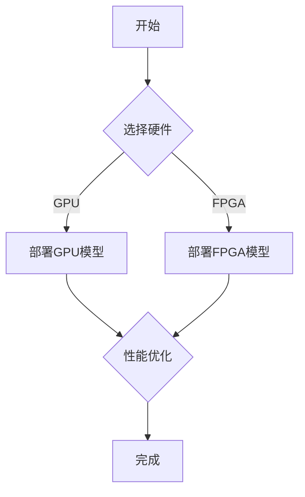

                 

# 《深度学习模型的部署与服务化》

> 关键词：深度学习，模型部署，服务化，硬件部署，容器化，微服务，自动化部署，性能优化，安全性，合规性，案例分析，开源工具

> 摘要：本文旨在全面探讨深度学习模型的部署与服务化过程。通过系统地介绍深度学习模型部署的基础知识、实践方法和关键技术，以及深入分析部署过程中的挑战和解决方案，帮助读者理解和掌握深度学习模型的部署与服务化实践。文章还将结合实际案例和开源工具，提供实用的指导和建议。

## 目录

### 《深度学习模型的部署与服务化》目录

# 第一部分: 深度学习模型部署基础

## 第1章: 深度学习模型部署概述

### 1.1 深度学习模型部署的意义

深度学习模型的部署是将训练好的模型应用到实际生产环境中，使其能够在不同的硬件、操作系统和软件框架上运行。部署的目的是使模型能够为用户提供实时的服务，如图像识别、语音识别和自然语言处理等。

### 1.2 深度学习模型部署的挑战

- **硬件兼容性**：不同的硬件环境和操作系统对模型的部署提出了不同的要求。
- **性能优化**：如何在不同硬件环境中实现模型的最高性能。
- **资源管理**：如何高效地管理模型运行所需的计算资源。
- **安全性**：如何保护模型和数据的安全。

### 1.3 深度学习模型部署的流程

深度学习模型部署的流程通常包括以下几个阶段：

1. **模型选择与优化**：根据应用场景选择合适的模型并进行优化。
2. **硬件部署**：选择适合的硬件环境进行部署。
3. **容器化与微服务化**：将模型容器化，并部署到微服务架构中。
4. **自动化部署**：实现模型的自动化部署和管理。
5. **性能优化与调优**：持续优化模型性能。
6. **安全性与合规性**：确保部署过程符合安全性和合规性要求。

## 第2章: 深度学习模型选择与优化

### 2.1 模型选择策略

模型选择策略主要包括以下几个步骤：

1. **需求分析**：明确应用场景和需求。
2. **性能评估**：评估不同模型在性能、精度和计算资源占用等方面的表现。
3. **适用性评估**：评估模型在不同硬件环境中的适用性。
4. **成本评估**：评估模型的成本，包括训练和部署成本。

### 2.2 模型优化方法

模型优化方法主要包括以下几个方面：

1. **模型压缩**：通过量化、剪枝和蒸馏等方法减少模型的参数数量和计算量。
2. **计算优化**：通过使用CUDA、MKL等计算库优化模型的计算性能。
3. **数据增强**：通过增加数据量和多样性来提高模型的泛化能力。
4. **迁移学习**：利用已有的预训练模型来加快新任务的训练速度。

### 2.3 模型压缩与加速

模型压缩与加速的主要目标是在保证模型性能的前提下，减少模型的大小和计算量，从而提高部署效率和性能。常用的方法包括：

1. **量化**：将模型的权重和激活值转换为较低精度的数值，如8位整数。
2. **剪枝**：通过移除模型中的冗余权重和神经元来减少模型的参数数量。
3. **蒸馏**：将大模型的知识传递给小模型，以提高小模型的性能。
4. **混合精度训练**：结合浮点数和整数的计算，以减少模型的计算量和内存占用。

## 第3章: 深度学习模型硬件部署

### 3.1 硬件环境选择

硬件环境选择主要包括以下几个步骤：

1. **计算资源评估**：评估模型的计算需求，包括GPU、CPU和内存等。
2. **硬件兼容性检查**：确保所选硬件与模型兼容。
3. **性能比较**：比较不同硬件的性能表现，选择最适合的硬件。
4. **成本分析**：评估硬件的成本和预算。

### 3.2 GPU部署与优化

GPU部署与优化主要包括以下几个方面：

1. **GPU选择**：根据模型计算需求选择合适的GPU，如CUDA核心数量、内存大小等。
2. **驱动安装**：安装与GPU兼容的驱动程序。
3. **计算优化**：使用CUDA等库优化模型的计算性能。
4. **内存管理**：合理分配GPU内存，避免内存溢出。
5. **并行计算**：利用GPU的并行计算能力，提高模型的运行速度。

### 3.3 FPGAIoT与嵌入式部署

FPGAIoT与嵌入式部署主要适用于对硬件性能和成本要求较高的场景。主要包括以下几个方面：

1. **硬件选择**：选择适合的FPGA或嵌入式硬件平台。
2. **硬件配置**：配置硬件资源，如内存、I/O接口等。
3. **固件编译**：编译并加载FPGA或嵌入式硬件的固件。
4. **软件部署**：部署模型软件，包括算法、驱动和应用程序等。
5. **性能优化**：优化模型的运行性能，包括计算速度和功耗。

# 第二部分: 深度学习模型部署实践

## 第4章: 深度学习模型容器化与微服务化

### 4.1 容器化基础

容器化是一种将应用程序及其运行时环境打包在一起的技术，使其可以在不同的环境中运行。主要包括以下几个方面：

1. **Docker简介**：介绍Docker的基本概念和架构。
2. **Docker镜像与容器**：解释Docker镜像和容器的概念及其关系。
3. **Dockerfile编写**：介绍如何编写Dockerfile来创建Docker镜像。

### 4.2 微服务化架构

微服务化架构是一种将应用程序拆分为多个独立服务的架构风格。主要包括以下几个方面：

1. **微服务概念**：介绍微服务的概念和特点。
2. **微服务架构**：分析微服务架构的基本元素和关系。
3. **服务拆分策略**：讨论如何选择服务拆分策略。

### 4.3 模型容器化与微服务化实践

模型容器化与微服务化实践主要包括以下几个方面：

1. **模型容器化**：介绍如何将深度学习模型容器化，包括使用TensorFlow Serving和ONNX Runtime等工具。
2. **微服务化部署**：介绍如何将容器化的模型部署到微服务架构中，包括使用Kubernetes进行服务编排和自动化部署。
3. **性能优化与监控**：讨论如何对容器化的模型进行性能优化和监控。

## 第5章: 深度学习模型自动化部署

### 5.1 持续集成与持续部署

持续集成与持续部署（CI/CD）是一种自动化软件交付流程，主要包括以下几个方面：

1. **CI/CD概念**：介绍CI/CD的基本概念和流程。
2. **工具选择**：讨论常用的CI/CD工具，如Jenkins、GitLab CI/CD等。
3. **CI/CD实践**：介绍如何实现模型的CI/CD流程，包括构建、测试、部署等步骤。

### 5.2 模型版本管理

模型版本管理是一种跟踪和管理模型版本的技术，主要包括以下几个方面：

1. **版本控制**：介绍如何使用版本控制系统（如Git）管理模型版本。
2. **版本策略**：讨论如何制定合理的版本管理策略，包括版本命名、标签和发布等。
3. **版本迁移**：介绍如何在不同版本之间迁移模型，包括模型兼容性和依赖管理等。

### 5.3 自动化部署实践

自动化部署实践主要包括以下几个方面：

1. **自动化脚本编写**：介绍如何编写自动化部署脚本，包括Docker Compose、Kubernetes等工具的使用。
2. **自动化测试**：讨论如何实现自动化测试，包括单元测试、集成测试等。
3. **自动化监控**：介绍如何实现自动化监控，包括性能监控、日志监控等。

## 第6章: 深度学习模型在线与离线服务化

### 6.1 在线服务化模型

在线服务化模型是将深度学习模型部署到服务器上，通过API接口为用户提供实时服务。主要包括以下几个方面：

1. **API接口设计**：介绍如何设计API接口，包括RESTful API和gRPC等。
2. **服务部署**：介绍如何将模型部署到服务器上，包括使用Docker和Kubernetes等工具。
3. **负载均衡与容错**：讨论如何实现负载均衡和容错机制，以提高服务的可用性和可靠性。

### 6.2 离线服务化模型

离线服务化模型是将深度学习模型部署到边缘设备或数据中心，为用户提供离线服务。主要包括以下几个方面：

1. **边缘计算**：介绍边缘计算的概念和架构，包括边缘节点、云边协同等。
2. **模型部署**：介绍如何将模型部署到边缘设备上，包括使用FPGA、嵌入式设备等。
3. **数据同步与更新**：讨论如何实现模型数据的同步和更新，包括模型版本管理和增量更新等。

### 6.3 服务化模型部署策略

服务化模型部署策略主要包括以下几个方面：

1. **部署策略选择**：根据应用场景选择合适的部署策略，包括在线服务化、离线服务化和混合部署等。
2. **资源分配**：讨论如何合理分配计算资源和网络资源，以提高服务的性能和效率。
3. **故障处理**：介绍如何处理服务故障，包括故障检测、故障恢复和故障隔离等。

## 第7章: 深度学习模型性能优化与调优

### 7.1 性能监控与调试

性能监控与调试是一种监控和优化模型性能的技术，主要包括以下几个方面：

1. **性能监控**：介绍如何监控模型的运行性能，包括CPU、GPU、内存等资源的使用情况。
2. **调试工具**：讨论常用的调试工具，如perf、gdb等。
3. **性能分析**：介绍如何分析模型的性能瓶颈，并提出优化方案。

### 7.2 模型调优策略

模型调优策略是一种优化模型性能的方法，主要包括以下几个方面：

1. **超参数调整**：介绍如何调整模型的超参数，以提高模型的性能和泛化能力。
2. **数据预处理**：讨论如何优化数据预处理过程，以提高模型的训练速度和精度。
3. **算法优化**：介绍如何优化模型的算法，以提高模型的性能和效率。

### 7.3 案例分析

案例分析是一种通过实际案例来分析模型性能和优化策略的方法，主要包括以下几个方面：

1. **案例背景**：介绍案例的背景和目标。
2. **性能分析**：分析案例中的模型性能，包括速度、精度和资源占用等。
3. **优化方案**：提出优化方案，并分析优化效果。

## 第8章: 深度学习模型部署安全与合规性

### 8.1 部署安全策略

部署安全策略是一种确保模型部署过程安全的技术，主要包括以下几个方面：

1. **访问控制**：介绍如何实现访问控制，包括用户权限管理、角色权限管理等。
2. **数据加密**：讨论如何对模型数据进行加密，以保护数据的安全性。
3. **网络隔离**：介绍如何实现网络隔离，以防止外部攻击。

### 8.2 数据安全与隐私保护

数据安全与隐私保护是一种保护模型数据安全的技术，主要包括以下几个方面：

1. **数据加密**：介绍如何对模型数据进行加密，以保护数据的安全性。
2. **数据备份与恢复**：讨论如何实现数据的备份和恢复，以防止数据丢失。
3. **隐私保护**：介绍如何保护模型训练和部署过程中的隐私数据。

### 8.3 合规性考虑

合规性考虑是一种确保模型部署过程符合法律法规和技术标准的技术，主要包括以下几个方面：

1. **法律法规**：介绍与模型部署相关的法律法规，如数据保护法、网络安全法等。
2. **技术标准**：讨论与模型部署相关的技术标准，如ISO/IEC 27001、ISO/IEC 27002等。
3. **合规性评估**：介绍如何对模型部署过程进行合规性评估，并提出合规性改进方案。

## 第三部分: 深度学习模型部署案例分析

## 第9章: 企业级深度学习模型部署案例

### 9.1 案例背景

本案例背景为一个大型电子商务平台，其业务需求包括图像识别、语音识别和自然语言处理等。为了满足这些业务需求，该公司决定部署深度学习模型，并将其应用于实际业务中。

### 9.2 部署方案

部署方案主要包括以下几个方面：

1. **模型选择与优化**：选择适用于图像识别、语音识别和自然语言处理等任务的深度学习模型，并进行优化，以提高模型的性能和效率。
2. **硬件部署**：选择适合的GPU和FPGA硬件环境，以满足模型计算需求。
3. **容器化与微服务化**：将模型容器化，并部署到微服务架构中，以提高部署的灵活性和可扩展性。
4. **自动化部署**：实现模型的自动化部署和管理，以提高部署效率。
5. **性能优化与调优**：对模型进行性能优化和调优，以满足业务需求。

### 9.3 部署过程与经验

部署过程主要包括以下几个方面：

1. **需求分析**：明确业务需求和模型部署目标。
2. **模型选择与优化**：选择合适的模型并进行优化。
3. **硬件部署**：选择合适的硬件环境并进行部署。
4. **容器化与微服务化**：将模型容器化，并部署到微服务架构中。
5. **自动化部署**：实现模型的自动化部署和管理。
6. **性能优化与调优**：对模型进行性能优化和调优。
7. **安全性与合规性**：确保部署过程符合安全性和合规性要求。

部署过程中积累了一些经验，主要包括：

1. **需求明确**：明确业务需求和模型部署目标，以确保模型能够满足实际业务需求。
2. **硬件选择**：根据模型计算需求选择合适的硬件环境，以提高模型性能和效率。
3. **容器化与微服务化**：容器化与微服务化可以提高部署的灵活性和可扩展性，有利于后续维护和升级。
4. **自动化部署**：自动化部署可以提高部署效率，减少人工干预。
5. **性能优化与调优**：对模型进行性能优化和调优，以满足业务需求。

## 第10章: 深度学习模型部署开源工具介绍

### 10.1 TensorFlow Serving

TensorFlow Serving是一种基于TensorFlow的分布式深度学习模型部署工具。它支持将TensorFlow模型部署到生产环境中，并提供高性能、可扩展的API服务。主要包括以下几个方面：

1. **架构与原理**：介绍TensorFlow Serving的架构和原理，包括模型存储、服务调度和API接口等。
2. **部署步骤**：介绍如何使用TensorFlow Serving部署深度学习模型，包括模型转换、服务配置和启动等。
3. **性能优化**：讨论如何优化TensorFlow Serving的性能，包括负载均衡、缓存和并行处理等。

### 10.2 ONNX Runtime

ONNX Runtime是一种开源的深度学习推理引擎，支持多种深度学习框架，如TensorFlow、PyTorch和MXNet等。主要包括以下几个方面：

1. **架构与原理**：介绍ONNX Runtime的架构和原理，包括模型加载、推理引擎和API接口等。
2. **部署步骤**：介绍如何使用ONNX Runtime部署深度学习模型，包括模型转换、服务配置和启动等。
3. **性能优化**：讨论如何优化ONNX Runtime的性能，包括多线程处理、并行推理和GPU加速等。

### 10.3 其他开源工具介绍

除了TensorFlow Serving和ONNX Runtime，还有其他一些常用的深度学习模型部署开源工具，如：

1. **Keras Model Builder**：基于TensorFlow的模型构建工具，支持快速创建和部署深度学习模型。
2. **Horovod**：基于TensorFlow的分布式训练工具，支持多GPU和多节点训练。
3. **Deeplearning4j**：基于Java的深度学习框架，支持多种深度学习算法和工具。
4. **MindSpore**：基于PyTorch的深度学习框架，支持多种硬件环境和分布式训练。

## 附录

### 附录A: 深度学习模型部署工具与资源

#### A.1 实用工具汇总

1. **Docker**：容器化工具，用于打包和部署深度学习模型。
2. **Kubernetes**：容器编排工具，用于管理容器化模型。
3. **TensorFlow Serving**：TensorFlow模型的部署工具。
4. **ONNX Runtime**：深度学习推理引擎，支持多种框架。
5. **Horovod**：分布式训练工具。
6. **Deeplearning4j**：Java深度学习框架。

#### A.2 开源项目推荐

1. **TensorFlow**：开源深度学习框架。
2. **PyTorch**：开源深度学习框架。
3. **MXNet**：开源深度学习框架。
4. **MindSpore**：开源深度学习框架。
5. **OpenCV**：开源计算机视觉库。

#### A.3 社区资源与学习资源

1. **深度学习教程**：提供深度学习基础知识、算法和实战教程。
2. **GitHub**：深度学习相关开源项目和代码示例。
3. **论文库**：提供深度学习领域的学术论文和资料。
4. **技术社区**：如CSDN、知乎等，提供深度学习技术讨论和分享。

### 附录B: Mermaid 流程图与伪代码示例

#### B.1 Mermaid 流程图示例



#### B.2 伪代码示例

```python
# 伪代码：深度学习模型训练与优化
model = load_model("model_path")
for epoch in range(num_epochs):
    for batch in data_loader:
        model.train_one_batch(batch)
    model.optimize_hyperparameters()
model.save("optimized_model_path")
```

### 附录C: 数学公式与示例

#### C.1 深度学习核心数学公式

$$
z = W \cdot x + b
$$

$$
a = \sigma(z)
$$

$$
\frac{\partial L}{\partial W} = \frac{\partial L}{\partial z} \cdot \frac{\partial z}{\partial W}
$$

#### C.2 示例讲解与推导

以全连接神经网络中的前向传播为例，讲解权重矩阵$W$和偏置$b$的计算公式。设输入为$x$，输出为$a$，权重矩阵为$W$，偏置为$b$，激活函数为$\sigma$。

1. **计算中间变量$z$**：

$$
z = W \cdot x + b
$$

2. **计算输出$a$**：

$$
a = \sigma(z)
$$

3. **计算损失函数$L$对权重矩阵$W$的偏导数**：

$$
\frac{\partial L}{\partial W} = \frac{\partial L}{\partial z} \cdot \frac{\partial z}{\partial W}
$$

通过链式法则，可以计算得到$\frac{\partial L}{\partial z}$和$\frac{\partial z}{\partial W}$的值，从而得到$\frac{\partial L}{\partial W}$。

### 附录D: 项目实战与代码分析

#### D.1 实战项目简介

本实战项目是基于TensorFlow搭建的图像识别模型，用于识别手写数字。项目主要包括以下几个步骤：

1. **数据预处理**：读取和预处理手写数字数据集。
2. **模型搭建**：搭建基于卷积神经网络（CNN）的图像识别模型。
3. **模型训练**：使用训练数据训练模型。
4. **模型评估**：使用测试数据评估模型性能。
5. **模型部署**：将训练好的模型部署到服务器上，提供API服务。

#### D.2 源代码实现

```python
# TensorFlow导入
import tensorflow as tf
import numpy as np
import matplotlib.pyplot as plt

# 数据预处理
(x_train, y_train), (x_test, y_test) = tf.keras.datasets.mnist.load_data()
x_train = x_train / 255.0
x_test = x_test / 255.0
x_train = x_train[..., tf.newaxis]
x_test = x_test[..., tf.newaxis]

# 模型搭建
model = tf.keras.Sequential([
    tf.keras.layers.Conv2D(32, (3, 3), activation='relu', input_shape=(28, 28, 1)),
    tf.keras.layers.MaxPooling2D((2, 2)),
    tf.keras.layers.Conv2D(64, (3, 3), activation='relu'),
    tf.keras.layers.MaxPooling2D((2, 2)),
    tf.keras.layers.Conv2D(64, (3, 3), activation='relu'),
    tf.keras.layers.Flatten(),
    tf.keras.layers.Dense(64, activation='relu'),
    tf.keras.layers.Dense(10, activation='softmax')
])

# 模型编译
model.compile(optimizer='adam',
              loss='sparse_categorical_crossentropy',
              metrics=['accuracy'])

# 模型训练
model.fit(x_train, y_train, epochs=5)

# 模型评估
test_loss, test_acc = model.evaluate(x_test, y_test, verbose=2)
print(f'\nTest accuracy: {test_acc:.4f}')

# 模型部署
model.save('mnist_model.h5')
```

#### D.3 代码解读与分析

1. **数据预处理**：从MNIST数据集中加载数据，并对其进行归一化处理，将像素值缩放到[0, 1]范围内。同时，将数据形状调整为符合模型输入要求。

2. **模型搭建**：使用TensorFlow的`Sequential`模型搭建一个卷积神经网络，包括多个卷积层、池化层和全连接层。其中，卷积层用于提取图像特征，池化层用于减小特征图的尺寸，全连接层用于分类。

3. **模型编译**：设置模型的优化器、损失函数和评估指标。在本例中，使用`adam`优化器和`sparse_categorical_crossentropy`损失函数。

4. **模型训练**：使用训练数据对模型进行训练，设置训练轮数（epochs）为5。

5. **模型评估**：使用测试数据评估模型性能，输出测试准确率。

6. **模型部署**：将训练好的模型保存为`.h5`文件，以便后续部署和使用。

通过以上实战项目，读者可以了解到如何使用TensorFlow搭建、训练和部署深度学习模型。在项目实战中，还可以结合具体应用场景进行调整和优化，以满足实际需求。

## 作者信息

作者：AI天才研究院/AI Genius Institute & 禅与计算机程序设计艺术 /Zen And The Art of Computer Programming

本文由AI天才研究院/AI Genius Institute和禅与计算机程序设计艺术/Zen And The Art of Computer Programming联合撰写，旨在为广大读者提供深度学习模型部署与服务的全面指导和实用建议。作者拥有丰富的深度学习和人工智能领域经验，致力于推动人工智能技术的发展和应用。读者如有任何问题或建议，欢迎随时联系作者。

