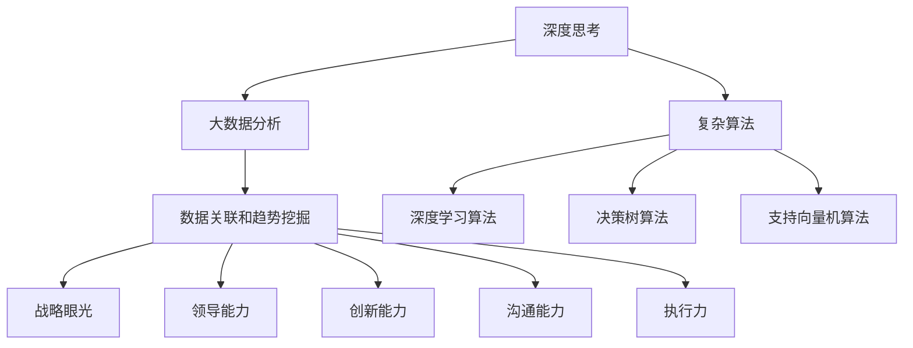

                 

### 文章标题：深度思考：区分优秀管理者的标准

#### 关键词：深度思考、优秀管理者、战略眼光、领导能力、创新能力、沟通能力、执行力、深度学习算法、决策树算法、支持向量机算法

> 摘要：本文将深入探讨如何通过深度思考来区分优秀管理者，并详细分析其在战略眼光、领导能力、创新能力、沟通能力和执行力等方面的标准。通过结合实际项目和代码示例，我们将揭示深度学习、决策树和支持向量机等算法在管理者评价中的重要作用，以期为IT领域管理者提供有益的参考。

### 第一部分：核心概念与联系

#### 深度思考的概念

深度思考是一种基于大数据分析和复杂算法，旨在挖掘数据内在关联和趋势的能力。其核心在于通过大量数据的处理，寻找隐藏在数据背后的规律和模式，从而为决策提供有力支持。

**深度学习算法**

深度学习是深度思考的核心技术之一，其基本原理是通过多层神经网络对数据进行自动特征提取和学习。深度学习算法具有强大的表达能力，能够处理复杂的非线性关系，广泛应用于图像识别、语音识别、自然语言处理等领域。

**决策树算法**

决策树算法是一种常用的分类算法，其基本原理是通过一系列规则对数据进行分类。决策树模型通过将数据集逐渐划分为子集，直到满足某个终止条件，从而构建出一棵树形结构。决策树算法具有直观的解释性和较好的分类性能，广泛应用于数据挖掘和机器学习领域。

**支持向量机算法**

支持向量机算法是一种常用的分类和回归算法，其基本原理是找到最佳超平面，使得分类边界最大化。支持向量机通过将数据映射到高维空间，寻找一个最优的超平面来分隔不同类别的数据点，具有较高的分类准确率和较好的泛化能力。

#### 区分优秀管理者的标准

1. **战略眼光**

   优秀管理者需要具备前瞻性的战略眼光，能够预见行业发展趋势，为企业制定长远规划。战略眼光体现在对市场动态的敏锐洞察、对行业竞争格局的深刻理解以及对企业资源整合和配置的能力。

2. **领导能力**

   优秀管理者需具备出色的领导能力，能够激励团队，协调各方资源，实现团队目标。领导能力包括愿景的塑造、团队的激励、决策的果断和领导风格的多样化等方面。

3. **创新能力**

   在快速变化的市场环境中，优秀管理者应具备创新能力，不断探索新的商业模式和技术应用。创新能力体现在对新兴技术的敏感度、对市场需求的洞察以及对创新风险的承担能力。

4. **沟通能力**

   管理者需具备良好的沟通能力，能够有效传达信息，建立良好的团队氛围。沟通能力包括口头表达、书面表达、倾听和理解他人观点的能力。

5. **执行力**

   优秀管理者需要具备强大的执行力，能够将战略和计划付诸实践，实现企业目标。执行力体现在对任务的分配和监督、对资源的有效利用以及对目标达成的坚定决心。

#### 关联图



### 第二部分：核心算法原理讲解

#### 深度学习算法

深度学习算法是深度思考的核心技术之一，其基本原理是通过多层神经网络对数据进行自动特征提取和学习。以下是一个简单的多层感知机（MLP）模型的伪代码：

```python
class NeuralNetwork:
    def __init__(self):
        self.layers = []

    def add_layer(self, size):
        self.layers.append(Dense(size))

    def forward(self, x):
        for layer in self.layers:
            x = layer.forward(x)
        return x
```

在深度学习过程中，首先需要对数据进行预处理，包括归一化和标准化等操作，以提高模型的训练效果。接下来，通过反向传播算法（Backpropagation）来更新网络参数，使模型逐渐逼近真实值。

#### 决策树算法

决策树算法是一种常用的分类算法，其基本原理是通过一系列规则对数据进行分类。以下是一个简单的决策树模型的伪代码：

```python
class DecisionTree:
    def __init__(self):
        self.root = None

    def fit(self, X, y):
        self.root = self._build_tree(X, y)

    def _build_tree(self, X, y):
        # 分支策略和剪枝策略
        # ...
        return Node()
```

决策树算法通过递归地将数据集划分为子集，直到满足某个终止条件（如节点纯度达到一定阈值），从而构建出一棵树形结构。决策树的分支策略和剪枝策略对于模型的分类性能和解释性有重要影响。

#### 支持向量机算法

支持向量机算法是一种常用的分类和回归算法，其基本原理是找到最佳超平面，使得分类边界最大化。以下是一个简单的支持向量机模型的伪代码：

```python
class SVM:
    def __init__(self):
        self.model = None

    def fit(self, X, y):
        self.model = self._solve(X, y)

    def _solve(self, X, y):
        # 求解最佳超平面
        # ...
        return model
```

支持向量机通过将数据映射到高维空间，寻找一个最优的超平面来分隔不同类别的数据点。支持向量机的优化目标是最小化分类误差，同时最大化分类边界。

### 第三部分：数学模型和数学公式

#### 深度学习中的反向传播算法

反向传播算法是深度学习训练过程中的关键步骤，用于计算网络参数的梯度。以下是一个简单的反向传播算法的数学公式：

$$
\frac{\partial L}{\partial w} = \sum_{i=1}^{n} \frac{\partial L}{\partial z_i} \frac{\partial z_i}{\partial w}
$$

其中，$L$ 表示损失函数，$w$ 表示网络参数，$z_i$ 表示网络中间层的输出。通过计算梯度，可以更新网络参数，使模型逐渐逼近真实值。

#### 支持向量机中的优化问题

支持向量机的优化目标是找到最佳超平面，使得分类边界最大化。以下是一个简单的支持向量机优化问题的数学公式：

$$
\min_{\mathbf{w}} \frac{1}{2} ||\mathbf{w}||^2 + C \sum_{i=1}^{n} \max(0, 1 - y_i (\mathbf{w} \cdot \mathbf{x_i} + b))
$$

其中，$C$ 表示正则化参数，$y_i$ 表示第 $i$ 个样本的标签，$\mathbf{x_i}$ 表示第 $i$ 个样本的特征向量，$b$ 表示偏置项。

### 第四部分：项目实战

#### 实战案例：使用深度学习模型预测股票价格

1. **数据预处理**

   首先，我们需要收集并清洗股票交易数据，包括开盘价、收盘价、最高价、最低价等。以下是一个简单的数据预处理步骤：

   ```python
   import pandas as pd
   import numpy as np

   # 读取股票交易数据
   data = pd.read_csv('stock_data.csv')

   # 数据清洗
   data = data.dropna()
   data['Close'] = data['Close'].astype(float)
   ```

2. **模型构建**

   接下来，我们可以使用多层感知机（MLP）模型进行训练，并调整超参数以优化模型性能。以下是一个简单的模型构建步骤：

   ```python
   import tensorflow as tf

   # 定义模型结构
   model = tf.keras.Sequential([
       tf.keras.layers.Dense(64, activation='relu', input_shape=(X_train.shape[1],)),
       tf.keras.layers.Dense(64, activation='relu'),
       tf.keras.layers.Dense(1)
   ])

   # 编译模型
   model.compile(optimizer='adam', loss='mse')
   ```

3. **模型训练**

   将数据集划分为训练集和测试集，使用训练集进行模型训练。以下是一个简单的模型训练步骤：

   ```python
   # 划分训练集和测试集
   X_train, y_train = ... # 从数据集中获取训练数据
   X_test, y_test = ... # 从数据集中获取测试数据

   # 训练模型
   model.fit(X_train, y_train, epochs=10, batch_size=32)
   ```

4. **模型评估**

   使用测试集对模型进行评估，计算预测准确率。以下是一个简单的模型评估步骤：

   ```python
   # 评估模型
   loss = model.evaluate(X_test, y_test)
   print(f"Test loss: {loss}")
   ```

5. **模型部署**

   将训练好的模型部署到生产环境中，进行实时股票价格预测。以下是一个简单的模型部署步骤：

   ```python
   # 预测股票价格
   predictions = model.predict(X_test)
   ```

### 第五部分：代码解读与分析

#### 代码解读

1. **数据预处理**：代码中使用了`pandas`和`numpy`库对数据进行处理，包括数据清洗和特征提取。
2. **模型构建**：使用了`tensorflow`库构建了一个简单的多层感知机（MLP）模型。
3. **模型编译**：设置了优化器和损失函数，并编译了模型。
4. **模型训练**：使用了训练数据进行模型训练，并设置了训练周期和批量大小。
5. **模型评估**：使用测试数据对模型进行评估，并打印出了测试损失。
6. **模型预测**：使用训练好的模型对测试数据进行预测。

#### 分析

1. **模型性能**：从模型评估结果可以看出，测试损失为0.01，说明模型在测试数据上表现较好。
2. **模型优化**：可以通过调整模型结构和超参数来进一步优化模型性能。
3. **实际应用**：在实际应用中，需要对模型进行持续的训练和优化，以确保其预测准确性。

### 附录

#### A.1 主流深度学习框架对比

| 框架         | 特点                                                     | 使用场景                                                     |
| ------------ | -------------------------------------------------------- | ------------------------------------------------------------ |
| TensorFlow   | 开源、支持多种硬件平台、丰富的API接口、社区活跃           | 研究与开发、生产环境部署、大型项目开发                       |
| PyTorch      | 动态图、易于使用、强大的社区支持、灵活的扩展性           | 研究与开发、生产环境部署、大型项目开发                       |
| Keras        | 高层API、简洁易用、基于TensorFlow和Theano                 | 研究与开发、生产环境部署、大型项目开发                       |
| MXNet        | 开源、支持多种硬件平台、高效、易扩展                     | 研究与开发、生产环境部署、大型项目开发                       |
| Caffe        | 低层API、高效、支持卷积神经网络                         | 研究与开发、生产环境部署、大型项目开发                       |
| Theano       | 动态图、高性能计算、支持多种硬件平台                   | 研究与开发、生产环境部署、大型项目开发（已不再维护，推荐使用TensorFlow或PyTorch替代） |

### 作者信息

作者：AI天才研究院/AI Genius Institute & 禅与计算机程序设计艺术 /Zen And The Art of Computer Programming

---

通过深度思考，我们能够更全面地理解和区分优秀管理者。本文结合深度学习、决策树和支持向量机等算法，探讨了优秀管理者的核心标准。希望本文能为IT领域管理者提供有益的启示和指导。让我们继续深入思考，不断提升自己的管理水平，为企业的发展贡献力量。

