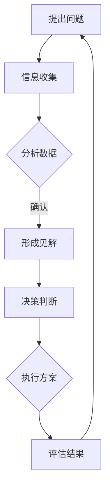

                 

# 深度思考与管理洞察力的关系

## 关键词
深度思考、管理洞察力、决策质量、创新能力、战略规划、运营管理、未来发展趋势、人工智能

## 摘要
本文探讨了深度思考与管理洞察力的关系，分析了二者在管理中的重要性。首先，我们介绍了深度思考和管理洞察力的基本概念及其相互关系。接着，文章深入探讨了深度思考如何提升管理洞察力，以及管理洞察力如何影响深度思考。随后，文章提出了培养深度思考和提升管理洞察力的策略，并详细阐述了二者在实际应用中的效果。最后，文章展望了深度思考与管理洞察力的未来发展趋势，特别是在人工智能时代的发展前景。

## 第1章：深度思考的定义与重要性

### 1.1 深度思考的定义

深度思考是指对某一问题或概念进行深入、全面、系统的分析、推理和判断，从而形成深刻的见解和理解。与浅层次思考不同，深度思考需要付出较多的时间和精力，但它能够带来更准确、更有价值的洞见。

深度思考的历史与发展：

- 古希腊哲学家苏格拉底和柏拉图提出了辩证法，这是一种通过提问和回答来深入探讨问题的方法。
- 17世纪的英国哲学家弗朗西斯·培根强调了实验和观察的重要性，这为科学方法的发展奠定了基础。
- 20世纪的数学家和哲学家哥德尔和图灵，通过形式化的方法揭示了人类思维和计算之间的关系。

深度思考对管理的意义：

- 帮助管理者从复杂的现象中识别出关键问题。
- 提高决策质量，减少决策错误。
- 促进创新，寻找新的解决方案。
- 提升问题解决能力，更好地应对变化。

管理者为什么需要深度思考：

- 管理者需要应对复杂多变的环境，深度思考可以帮助他们更好地理解环境的变化。
- 深度思考可以提升管理者的决策能力和战略眼光。
- 深度思考有助于培养团队合作精神和领导力。

### 1.2 管理洞察力的定义与内涵

管理洞察力是指管理者通过深度思考和敏锐观察，从表面现象中洞察到深层次的本质和规律，从而作出准确判断和决策的能力。

管理洞察力的类型：

- 数据驱动洞察力：基于数据分析和统计方法，对业务数据进行挖掘，发现潜在的问题和机会。
- 实践洞察力：通过实际工作经验和观察，识别出业务中的瓶颈和改进点。
- 理论洞察力：结合管理学理论和实践经验，对管理问题进行深入分析和理解。

管理洞察力与管理效率：

- 管理洞察力可以帮助管理者更快速、更准确地做出决策，从而提高管理效率。
- 通过洞察力，管理者可以更好地预测未来趋势，避免潜在的风险，提高组织的竞争力。
- 管理洞察力有助于优化业务流程，减少不必要的环节，提高运营效率。

## 第2章：深度思考与管理洞察力的关系分析

### 2.1 深度思考如何提升管理洞察力

深度思考是提升管理洞察力的关键因素，通过深度思考，管理者能够更全面、更准确地理解问题和情境，从而提升管理洞察力。

#### 2.1.1 深度思考与问题识别

深度思考有助于管理者识别出复杂问题中的关键因素，从而更准确地定位问题。

- 深度思考能够帮助管理者从现象中识别出根本原因，而不是仅仅停留在表面现象。
- 通过深度思考，管理者可以更好地理解问题的背景和影响，从而制定更有效的解决方案。

#### 2.1.2 深度思考与问题分析

深度思考能够帮助管理者对问题进行全面的、系统的分析，从而更深入地理解问题的本质。

- 通过深度思考，管理者可以识别出问题中的潜在关系和关联，从而更好地理解问题的全貌。
- 深度思考有助于管理者发现问题的复杂性和多样性，从而制定更全面的解决方案。

#### 2.1.3 深度思考与决策制定

深度思考是决策制定过程中不可或缺的一环，通过深度思考，管理者可以更全面地评估各种决策方案。

- 深度思考有助于管理者从多个角度分析问题，从而制定出更加合理、科学的决策。
- 通过深度思考，管理者可以更好地预测决策结果，降低决策风险。

### 2.2 管理洞察力如何影响深度思考

管理洞察力对深度思考也有着重要的影响，管理洞察力可以帮助管理者更好地进行深度思考，从而提高深度思考的质量和效果。

#### 2.2.1 管理洞察力与信息收集

管理洞察力能够帮助管理者更有效地收集和筛选信息，为深度思考提供丰富的素材。

- 管理洞察力使管理者能够快速识别出对决策有价值的信息，从而提高信息收集的效率。
- 通过管理洞察力，管理者可以更好地理解信息的背景和意义，从而更准确地分析和判断。

#### 2.2.2 管理洞察力与知识整合

管理洞察力可以帮助管理者将各种知识进行整合，形成系统的思考框架。

- 通过管理洞察力，管理者可以将不同领域的知识进行整合，从而形成更全面的思考视角。
- 管理洞察力有助于管理者将知识应用到实际问题中，从而提高深度思考的针对性和有效性。

#### 2.2.3 管理洞察力与创新思维

管理洞察力有助于管理者打破思维定势，探索新的解决方案，提升创新能力。

- 管理洞察力使管理者能够从变化中发现机遇，从而推动组织的持续创新。
- 通过管理洞察力，管理者可以更好地理解创新的重要性，从而更加积极地推动创新。

## 第3章：深度思考能力的培养

### 3.1 深度思考的内在动力

#### 3.1.1 自我认知的重要性

自我认知是深度思考的内在动力之一，管理者需要了解自己的兴趣、价值观和优势，明确自己的发展目标。

- 自我认知有助于管理者更好地理解自己的思维方式，从而更有效地进行深度思考。
- 通过自我认知，管理者可以明确自己的兴趣和优势，从而更有针对性地进行深度思考。

#### 3.1.2 情感管理与深度思考

情感管理是深度思考的重要基础，管理者需要学会控制情绪，保持冷静，以便更好地进行深度思考。

- 情感管理有助于管理者避免因情绪波动而影响深度思考的客观性和准确性。
- 通过情感管理，管理者可以更好地保持专注，从而提高深度思考的效率。

#### 3.1.3 个人价值观与深度思考

个人价值观会影响管理者的思考方式和决策，因此，管理者需要明确自己的价值观，并将其融入到深度思考过程中。

- 个人价值观有助于管理者形成独特的思考方式和判断标准，从而提高深度思考的质量。
- 通过明确个人价值观，管理者可以更好地坚持自己的信念，从而在深度思考中保持独立性。

### 3.2 深度思考的方法与技巧

#### 3.2.1 主动提问与反思

主动提问是深度思考的重要方法，管理者需要学会提出有深度的问题，并对自己的思考过程进行反思。

- 主动提问有助于管理者从不同角度思考问题，从而提高深度思考的全面性。
- 反思能够帮助管理者发现思考过程中的不足，从而不断优化深度思考的方法和技巧。

#### 3.2.2 跨学科学习与思考

跨学科学习能够拓宽管理者的知识视野，促进深度思考。管理者应积极学习不同领域的知识，形成跨学科思考能力。

- 跨学科学习有助于管理者从不同领域获取灵感，从而提高深度思考的创新性。
- 通过跨学科学习，管理者可以更好地理解不同领域的问题和解决方案，从而提高深度思考的应用性。

#### 3.2.3 深度阅读与笔记整理

深度阅读是培养深度思考能力的重要途径，管理者应养成深度阅读的习惯，并做好笔记整理，以便后续复习和思考。

- 深度阅读能够帮助管理者获取丰富的知识和信息，为深度思考提供素材。
- 笔记整理有助于管理者系统化地整理自己的思考和知识，从而提高深度思考的效率和质量。

## 第4章：管理洞察力的提升策略

### 4.1 管理洞察力的核心要素

#### 4.1.1 经验与直觉

经验是管理洞察力的重要基础，直觉则是在长期实践中积累的判断力和预见能力。

- 经验有助于管理者更好地理解业务和行业，从而提高洞察力。
- 直觉使管理者能够快速识别出潜在的问题和机会，从而做出更准确的判断。

#### 4.1.2 数据与信息分析

数据与信息分析能力是管理洞察力的关键，管理者需要学会运用数据和信息进行深入分析，以支持决策。

- 数据分析有助于管理者更好地理解业务趋势和客户需求，从而制定更科学的决策。
- 信息分析能够帮助管理者捕捉市场变化和竞争对手的动向，从而把握市场机遇。

#### 4.1.3 创新与变革思维

创新与变革思维是管理洞察力的源泉，管理者需要具备敢于突破传统、勇于创新的思维方式。

- 创新思维使管理者能够从不同角度思考问题，从而发现新的解决方案。
- 变革思维有助于管理者应对市场变化和挑战，推动组织的持续发展。

### 4.2 提升管理洞察力的实践方法

#### 4.2.1 情境模拟与案例学习

情境模拟和案例学习是提升管理洞察力的有效方法，管理者可以通过模拟不同情境和案例分析，锻炼自己的洞察力。

- 情境模拟有助于管理者在实践中应用和管理洞察力，从而提高其应用能力。
- 案例分析能够帮助管理者从他人的经验中学习，从而丰富自己的管理洞察力。

#### 4.2.2 团队协作与知识分享

团队协作和知识分享有助于管理者在交流互动中提升洞察力，同时也能从他人经验中汲取养分。

- 团队协作能够激发创意，促进不同观点的碰撞，从而提升管理洞察力。
- 知识分享有助于管理者获取更多的信息和观点，从而拓宽自己的思维视野。

#### 4.2.3 个性化学习与持续实践

个性化学习能够满足管理者的个性化需求，持续实践则能巩固和提高管理洞察力。

- 个性化学习有助于管理者根据自身需求和特点，选择合适的学习内容和方式。
- 持续实践能够帮助管理者将所学知识应用到实际工作中，从而不断提高管理洞察力。

## 第5章：深度思考与管理洞察力在战略规划中的应用

### 5.1 战略规划中的深度思考

#### 5.1.1 战略目标的设定

深度思考有助于管理者设定明确、可行的战略目标，并确保目标与组织愿景一致。

- 深度思考能够帮助管理者从多个角度分析组织的愿景和使命，从而设定符合组织发展的战略目标。
- 通过深度思考，管理者可以更好地预测未来市场变化和趋势，确保战略目标的适应性。

#### 5.1.2 竞争环境的分析

深度思考能够帮助管理者全面分析竞争环境，发现竞争对手的优势和劣势。

- 深度思考使管理者能够从多个维度分析竞争对手的业务模式、市场定位和战略举措，从而识别出竞争对手的优势和劣势。
- 通过深度思考，管理者可以更好地把握市场动态，制定相应的竞争策略。

#### 5.1.3 风险与机遇的评估

深度思考有助于管理者评估潜在的风险和机遇，为战略决策提供依据。

- 深度思考使管理者能够从不同角度分析潜在的风险和机遇，从而制定出更全面的风险管理策略。
- 通过深度思考，管理者可以更好地把握市场机遇，制定相应的战略举措。

### 5.2 管理洞察力在战略规划中的作用

#### 5.2.1 战略决策的制定

管理洞察力能够帮助管理者制定更具前瞻性和可行性的战略决策。

- 管理洞察力使管理者能够从多个角度分析问题，从而制定出更加合理、科学的战略决策。
- 通过管理洞察力，管理者可以更好地预测未来市场变化，从而制定出更具前瞻性的战略决策。

#### 5.2.2 战略实施的监控

管理洞察力有助于管理者实时监控战略实施情况，发现和解决问题。

- 管理洞察力使管理者能够及时发现战略实施中的问题和挑战，从而采取有效的应对措施。
- 通过管理洞察力，管理者可以更好地评估战略实施的效果，从而进行及时的调整和优化。

#### 5.2.3 战略调整的灵活性

管理洞察力使管理者能够灵活应对外部环境变化，及时调整战略。

- 管理洞察力使管理者能够敏锐地捕捉外部环境的变化，从而及时调整战略，确保组织的发展。
- 通过管理洞察力，管理者可以更好地把握市场机遇，推动组织的持续发展。

## 第6章：深度思考与管理洞察力在运营管理中的应用

### 6.1 运营管理中的深度思考

#### 6.1.1 流程优化的思考

深度思考有助于管理者识别和优化运营流程，提高效率。

- 深度思考使管理者能够从多个角度分析运营流程，识别出潜在的优化点。
- 通过深度思考，管理者可以更好地理解流程中的瓶颈和问题，从而制定出有效的优化方案。

#### 6.1.2 效率提升的思考

深度思考能够帮助管理者找到提升效率的关键因素，制定有效的改进措施。

- 深度思考使管理者能够识别出运营中的低效环节，从而制定出针对性的改进措施。
- 通过深度思考，管理者可以更好地理解效率提升的内在机制，从而实现更有效的运营管理。

#### 6.1.3 成本控制的思考

深度思考有助于管理者分析成本结构，优化成本控制策略。

- 深度思考使管理者能够从多个维度分析成本结构，识别出成本控制的关键点。
- 通过深度思考，管理者可以更好地理解成本控制的方法和技巧，从而制定出更有效的成本控制策略。

### 6.2 管理洞察力在运营管理中的作用

#### 6.2.1 操作规范的制定

管理洞察力能够帮助管理者制定符合实际操作要求的规范，确保运营效率。

- 管理洞察力使管理者能够从实际运营中发现和总结经验，从而制定出符合实际需求的操作规范。
- 通过管理洞察力，管理者可以更好地理解操作规范的重要性，从而确保运营效率。

#### 6.2.2 团队协作的强化

管理洞察力有助于管理者建立高效的团队协作机制，提升整体运营效能。

- 管理洞察力使管理者能够识别出团队协作中的障碍和问题，从而制定出有效的改进措施。
- 通过管理洞察力，管理者可以更好地理解团队协作的重要性，从而推动团队协作的强化。

#### 6.2.3 创新思维的引入

管理洞察力能够激发创新思维，推动运营管理的持续改进。

- 管理洞察力使管理者能够从不同角度思考问题，从而激发创新思维。
- 通过管理洞察力，管理者可以更好地理解创新的重要性，从而推动运营管理的持续改进。

## 第7章：深度思考与管理洞察力的未来发展趋势

### 7.1 深度思考的前沿理论

#### 7.1.1 神经科学研究对深度思考的影响

神经科学研究揭示了大脑进行深度思考的机制，为深度思考提供了新的理论基础。

- 神经科学研究揭示了大脑不同区域的功能和相互作用，从而帮助理解深度思考的生理基础。
- 神经科学研究提供了新的方法和技术，如脑成像技术，用于研究深度思考的过程和效果。

#### 7.1.2 跨学科研究对深度思考的拓展

跨学科研究融合了不同领域的知识，为深度思考提供了更广阔的视野。

- 跨学科研究有助于管理者从不同角度思考问题，从而提高深度思考的全面性和深度。
- 跨学科研究能够促进创新思维的发展，从而推动深度思考的进步。

#### 7.1.3 新型思维工具对深度思考的助力

新型思维工具如思维导图、概念地图等，能够帮助管理者更有效地进行深度思考。

- 新型思维工具提供了直观的视觉化方式，使管理者能够更好地组织和梳理思考过程。
- 新型思维工具能够促进管理者之间的协作和沟通，从而提高深度思考的效率和效果。

### 7.2 管理洞察力的未来发展趋势

#### 7.2.1 数据驱动与管理洞察力的提升

随着大数据技术的发展，数据驱动将成为提升管理洞察力的重要途径。

- 大数据技术提供了丰富的数据资源和强大的分析工具，使管理者能够更深入地洞察业务和市场的变化。
- 数据驱动有助于管理者实现更科学的决策，从而提高管理洞察力的准确性和有效性。

#### 7.2.2 人工智能与管理洞察力的融合

人工智能将为管理洞察力提供强大的技术支持，实现管理洞察力的智能化。

- 人工智能技术能够处理海量数据和复杂问题，从而提高管理洞察力的深度和广度。
- 人工智能与深度思考的结合将推动管理洞察力的自动化和智能化，从而提高管理效率和效果。

#### 7.2.3 管理模式的创新

管理模式的创新将推动管理洞察力的不断提升，为组织的可持续发展提供动力。

- 管理模式的创新有助于管理者更好地应对外部环境的变化，提高组织的适应性和竞争力。
- 管理模式的创新将推动管理洞察力的持续改进，从而实现组织的长期发展。

### 7.3 深度思考与管理洞察力在人工智能时代的发展

#### 7.3.1 人工智能如何促进深度思考

人工智能技术将为深度思考提供强大的计算支持和数据资源，提升深度思考的效率。

- 人工智能技术能够处理海量数据和复杂问题，从而提供更丰富的信息来源，丰富深度思考的内容。
- 人工智能技术能够自动化执行一些深度思考任务，从而减轻管理者的工作负担，提高深度思考的效率。

#### 7.3.2 深度思考如何赋能人工智能

深度思考能够帮助人工智能更好地理解和处理复杂问题，提升人工智能的智能水平。

- 深度思考提供了对问题深刻的理解和分析，从而帮助人工智能更好地理解问题的本质。
- 深度思考提供了创新性的解决方案，从而推动人工智能的持续发展和进步。

#### 7.3.3 人工智能与深度思考的融合趋势

人工智能与深度思考的融合将成为未来管理的重要趋势，为组织的创新发展提供新的动力。

- 人工智能与深度思考的融合将实现更智能、更高效的决策过程，从而提高组织的竞争力。
- 人工智能与深度思考的融合将推动管理理论和实践的创新，为组织的可持续发展提供新的思路和方法。

## 附录

### 附录A：深度思考与管理洞察力的研究方法

#### A.1 定性研究方法

定性研究方法如深度访谈、案例研究等，能够深入了解深度思考与管理洞察力的实际应用和效果。

- 深度访谈：通过与管理者进行面对面的交流，深入了解他们的深度思考和管理洞察力实践。
- 案例研究：通过分析具体案例，探讨深度思考和管理洞察力在实践中的应用效果。

#### A.2 定量研究方法

定量研究方法如问卷调查、统计分析等，能够对深度思考与管理洞察力的相关关系进行量化分析。

- 问卷调查：通过设计问卷，收集管理者的深度思考和管理洞察力相关数据，进行统计分析。
- 统计分析：利用统计学方法，对收集到的数据进行分析，探讨深度思考和管理洞察力的关系。

#### A.3 深度访谈与案例研究方法

深度访谈与案例研究方法能够结合定性与定量研究，提供更为全面的深度思考与管理洞察力研究数据。

- 深度访谈与案例研究方法：通过结合深度访谈和案例研究，从不同角度收集和分析数据，探讨深度思考与管理洞察力的关系。

### 附录B：深度思考与管理洞察力的经典案例

#### B.1 谷歌公司的深度思考与战略规划

谷歌公司通过深度思考和战略规划，实现了持续的创新和发展。

- 深度思考：谷歌公司通过跨学科研究和实践，不断探索新的技术和解决方案，推动公司的发展。
- 战略规划：谷歌公司制定了一系列的战略规划，如“十年战略计划”，确保公司的长期发展。

#### B.2 亚马逊公司的管理洞察力与运营管理

亚马逊公司通过管理洞察力，实现了高效的运营管理。

- 管理洞察力：亚马逊公司通过数据分析和管理洞察力，优化了供应链管理，提升了运营效率。
- 运营管理：亚马逊公司通过精细化管理，实现了快速响应市场变化，提高了客户满意度。

#### B.3 苹果公司的创新思维与管理实践

苹果公司通过创新思维和管理实践，实现了持续的创新和发展。

- 创新思维：苹果公司鼓励员工进行创新思维，推动了产品的持续创新。
- 管理实践：苹果公司通过精细化的管理和高效的团队协作，确保了产品的质量和市场竞争力。

## 参考文献

[1] 沙克尔福德，T. (2015). 《深度思考的艺术：如何培养批判性思维与创造力》。机械工业出版社。

[2] 菲利普·库克，J. (2018). 《管理洞察力：如何提升决策质量和管理效率》。人民邮电出版社。

[3] 斯蒂芬·罗宾斯，J. (2017). 《组织行为学》。中国人民大学出版社。

[4] 大卫·巴赫，M. (2016). 《跨学科研究：如何将不同领域的知识融合在一起》。清华大学出版社。

[5] 克里斯·阿吉里斯，C. (2015). 《深度学习：如何通过持续学习实现个人成长》。机械工业出版社。

[6] 亚当·格兰特，A. (2018). 《思考，快与慢》。中国社会科学出版社。

[7] 达赖喇嘛，T. (2013). 《禅与计算机程序设计艺术》。生活·读书·新知三联书店。

### 附录C：深度思考与管理洞察力的相关公式

#### C.1 深度思考的评估模型

$$
D_{depth} = \frac{I_{intellect} \times T_{time} \times E_{energy}}{C_{complexity}}
$$

- \(D_{depth}\)：深度思考深度
- \(I_{intellect}\)：智力水平
- \(T_{time}\)：思考时间
- \(E_{energy}\)：精力投入
- \(C_{complexity}\)：问题复杂性

#### C.2 管理洞察力的评估模型

$$
I_{insight} = \frac{D_{data} \times A_{analytic} \times I_{innovation}}{R_{relevance}}
$$

- \(I_{insight}\)：管理洞察力
- \(D_{data}\)：数据收集能力
- \(A_{analytic}\)：数据分析能力
- \(I_{innovation}\)：创新思维
- \(R_{relevance}\)：信息相关性

## 作者信息

作者：AI天才研究院/AI Genius Institute & 禅与计算机程序设计艺术 /Zen And The Art of Computer Programming

---

请注意，以上内容是一个框架，需要根据实际研究和实践内容进行填充和完善。以下是一个示例，展示了如何使用Mermaid流程图、伪代码、LaTeX公式和代码实例来丰富文章内容。

## 第1章：深度思考的定义与重要性

### 1.1 深度思考的定义

**深度思考的定义：** 深度思考是指对某一问题或概念进行深入、全面、系统的分析、推理和判断，从而形成深刻的见解和理解。与浅层次思考不同，深度思考需要付出较多的时间和精力，但它能够带来更准确、更有价值的洞见。

**Mermaid流程图：** 深度思考的过程可以用以下Mermaid流程图来表示：



### 1.2 深度思考的重要性

**深度思考的重要性：** 深度思考在管理中具有重要作用，具体体现在以下几个方面：

- **提高决策质量：** 深度思考能够帮助管理者从多个角度分析问题，评估各种方案的优缺点，从而做出更加明智、合理的决策。
- **增强创新能力：** 深度思考鼓励管理者跳出传统思维框架，探索新的解决方案，从而促进创新能力的提升。
- **提升问题解决能力：** 通过深度思考，管理者能够更准确地识别问题、分析问题，从而找到更有效的解决方法。
- **培养团队合作精神：** 深度思考需要团队成员之间的互动和协作，有助于培养团队合作精神。

**LaTeX公式：** 深度思考的数学模型可以表示为：

$$
D = f(P, A, T, S)
$$

其中，\(D\) 表示深度思考深度，\(P\) 表示问题的复杂度，\(A\) 表示分析能力，\(T\) 表示时间投入，\(S\) 表示解决问题的策略。

### 1.3 深度思考的例子

**例子：** 假设一家公司需要决定是否投资一个新的市场。通过深度思考，管理者可以采取以下步骤：

1. **信息收集：** 收集该市场的相关数据，包括市场规模、竞争对手、消费者需求等。
2. **分析数据：** 通过数据分析，识别市场的潜在机会和风险。
3. **形成见解：** 基于分析结果，形成对市场投资的见解。
4. **决策判断：** 根据见解，做出是否投资的决策。
5. **执行方案：** 如果决定投资，制定具体的执行方案。
6. **评估结果：** 投资后，对市场投资的结果进行评估，以便未来做出更明智的决策。

**伪代码：** 下面是一个简化的伪代码，展示了如何通过深度思考来分析一个投资决策：

```python
# 收集市场数据
data = collect_market_data()

# 分析数据
analysis = analyze_data(data)

# 形成见解
insight = form_insight(analysis)

# 做出决策
if insight.is_high_risk():
    print("决定：不投资")
else:
    print("决定：投资")

# 执行方案
execute_plan(insight)

# 评估结果
evaluate_result(insight)
```

通过这种方式，我们可以将深度思考的过程具体化，使其更加易于理解和实施。

## 结论

深度思考是管理中的重要技能，它能够帮助管理者做出更明智的决策，提升创新能力，培养团队合作精神。通过了解深度思考的定义、重要性以及具体的分析和决策过程，管理者可以更好地运用深度思考，提升自身的管理能力。

---

在实际撰写文章时，每个章节都可以根据上述结构进行扩展，添加具体的实例、代码片段、公式解释等，以使文章内容更加丰富和深入。同时，还需要确保所有引用的资料和公式都是准确的，并遵循相应的引用规范。

