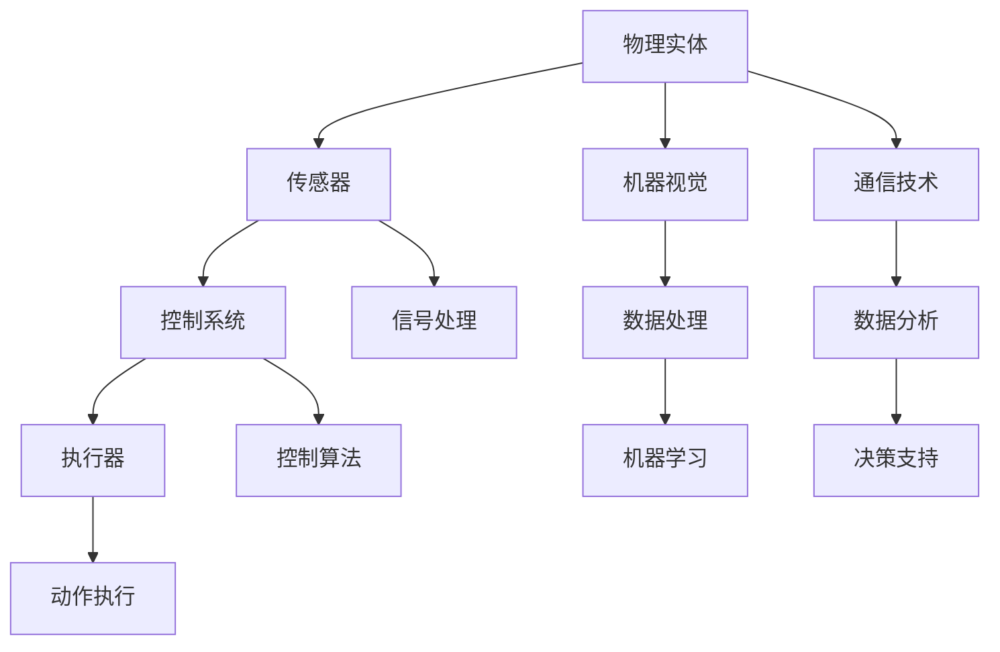

                 

### 文章标题：物理实体的自动化前景与发展

> 关键词：物理实体自动化、传感器、执行器、控制系统、机器视觉、通信技术、应用案例、未来发展趋势

> 摘要：本文将深入探讨物理实体的自动化前景与发展。从技术基础到实际应用案例，再到未来发展趋势和挑战，我们将逐步分析这一领域的关键概念、核心算法、数学模型以及项目实战，旨在为读者提供一份全面、详细的物理实体自动化指南。

### 目录大纲：物理实体的自动化前景与发展

- **第一部分：引言**
  - **1.1 物理实体自动化的定义与背景**
  - **1.2 物理实体自动化的意义与挑战**
  - **1.3 本书结构安排**

- **第二部分：技术基础**
  - **2.1 自动化技术的基本原理**
    - **2.1.1 传感器与执行器**
    - **2.1.2 控制系统的基本结构**
    - **2.1.3 控制算法的基本原理**
  - **2.2 机器视觉技术**
    - **2.2.1 图像处理技术**
    - **2.2.2 模式识别技术**
    - **2.2.3 机器学习在机器视觉中的应用**
  - **2.3 通信技术**
    - **2.3.1 现代通信网络技术**
    - **2.3.2 物联网通信协议**
    - **2.3.3 5G技术在自动化中的应用**

- **第三部分：应用案例分析**
  - **3.1 制造业自动化案例**
    - **3.1.1 智能制造系统的架构**
    - **3.1.2 智能生产线的实例分析**
    - **3.1.3 智能制造的数据处理与分析**
  - **3.2 农业自动化案例**
    - **3.2.1 农业机器人的应用**
    - **3.2.2 智能灌溉系统的实例分析**
    - **3.2.3 农业物联网的数据处理与分析**
  - **3.3 城市管理自动化案例**
    - **3.3.1 城市智能交通系统的实例分析**
    - **3.3.2 垃圾分类与回收自动化系统**
    - **3.3.3 城市安全监控系统的应用**

- **第四部分：发展趋势与挑战**
  - **4.1 物理实体自动化的未来发展趋势**
    - **4.1.1 新型传感器与执行器的发展**
    - **4.1.2 自适应控制算法的研究方向**
    - **4.1.3 大数据分析在自动化中的应用**
  - **4.2 物理实体自动化的挑战与解决方案**
    - **4.2.1 安全性问题与应对措施**
    - **4.2.2 通信网络的稳定性与可靠性**
    - **4.2.3 跨学科合作与人才培养**

- **附录**
  - **附录A：物理实体自动化相关资源**
    - **A.1 常用自动化工具与软件**
    - **A.2 开源自动化项目推荐**
    - **A.3 相关学术期刊与会议**

### 第一部分：引言

#### 1.1 物理实体自动化的定义与背景

物理实体自动化是指通过传感器、执行器、控制系统和通信技术等手段，对物理实体（如机器、设备、交通工具等）进行自动化控制和管理的过程。它旨在提高生产效率、降低人力成本、增强系统稳定性和可靠性。

物理实体自动化的背景可以追溯到工业革命时期。随着科技的发展和工业自动化需求的增长，人们开始研究和应用自动化技术，以解决生产过程中的人力成本和效率问题。从最初的机械自动化到后来的电气自动化，再到如今的智能自动化，物理实体自动化经历了不断的发展和演变。

#### 1.2 物理实体自动化的意义与挑战

物理实体自动化在现代工业、农业、城市管理等领域具有广泛的应用前景，其意义主要体现在以下几个方面：

1. **提高生产效率**：通过自动化技术，可以实现生产过程的自动化、智能化，大大提高了生产效率，降低了生产成本。
2. **降低人力成本**：自动化技术可以替代部分人力工作，减少劳动力成本，提高生产过程的可控性和一致性。
3. **增强系统稳定性**：自动化系统具有较高的稳定性和可靠性，能够减少故障率，提高系统的运行效率。
4. **促进跨学科发展**：物理实体自动化涉及多个学科领域，如机械工程、电子工程、计算机科学、通信技术等，促进了跨学科的合作与发展。

然而，物理实体自动化也面临着一些挑战，主要包括：

1. **技术复杂性**：物理实体自动化涉及到多个技术领域的融合，包括传感器、执行器、控制系统、通信技术等，技术复杂度高。
2. **系统集成**：物理实体自动化的实现需要各个模块之间的紧密集成，这对系统集成技术提出了较高要求。
3. **数据安全与隐私**：随着自动化系统的广泛应用，数据安全与隐私问题日益突出，如何保障系统的数据安全和用户隐私成为重要挑战。
4. **人才培养**：物理实体自动化需要跨学科的专业人才，人才培养和储备成为一项重要任务。

#### 1.3 本书结构安排

本书将分为四个部分，全面探讨物理实体自动化的各个方面：

- **第一部分：引言**：介绍物理实体自动化的定义、背景、意义与挑战。
- **第二部分：技术基础**：详细讲解物理实体自动化的关键技术，包括传感器、执行器、控制系统、机器视觉、通信技术等。
- **第三部分：应用案例分析**：通过实际案例，展示物理实体自动化在制造业、农业、城市管理等领域中的应用。
- **第四部分：发展趋势与挑战**：分析物理实体自动化的未来发展趋势以及面临的挑战和解决方案。

通过本书的系统讲解，读者可以全面了解物理实体自动化的原理、技术、应用和发展趋势，为实际项目提供有益的参考。

### 第一部分：引言

#### 1.1 物理实体自动化的定义与背景

物理实体自动化是指利用计算机技术、传感器、执行器和通信技术等手段，实现对物理实体的自动化控制、监测和管理的过程。这些物理实体可以是生产设备、交通工具、农业机械、家庭电器等，它们在工业、农业、交通、家居等领域中发挥着重要作用。

物理实体自动化的概念可以追溯到工业革命时期。随着机械制造技术的发展，人们开始研究和应用自动化技术，以解决生产过程中的人力成本和效率问题。最初，自动化主要是通过机械和电气控制系统实现的，例如自动生产线和机器人。随着电子技术和计算机科学的迅速发展，自动化技术逐渐走向智能化，实现了对物理实体的高精度控制和管理。

在现代社会，物理实体自动化已经成为提高生产效率、降低人力成本、增强系统稳定性和可靠性的重要手段。随着物联网、大数据和人工智能技术的不断进步，物理实体自动化的应用范围和深度也在不断拓展。

#### 1.2 物理实体自动化的意义与挑战

物理实体自动化在多个领域具有广泛的应用前景，其意义主要体现在以下几个方面：

1. **提高生产效率**：通过自动化技术，可以实现生产过程的自动化、智能化，大大提高了生产效率，降低了生产成本。例如，在制造业中，自动化生产线可以实现高速、高精度、高质量的生产，减少人工干预和操作误差。

2. **降低人力成本**：自动化技术可以替代部分人力工作，减少劳动力成本，提高生产过程的可控性和一致性。例如，在农业领域，自动化机器人可以完成播种、施肥、收割等任务，减少人工劳动力需求。

3. **增强系统稳定性**：自动化系统具有较高的稳定性和可靠性，能够减少故障率，提高系统的运行效率。例如，在交通领域，智能交通系统可以通过实时监测和自动调控，减少交通拥堵，提高交通流畅性。

4. **促进跨学科发展**：物理实体自动化涉及多个学科领域，如机械工程、电子工程、计算机科学、通信技术等，促进了跨学科的合作与发展。例如，在医疗领域，自动化机器人可以在手术中精确执行医生的操作指令，提高手术成功率。

然而，物理实体自动化也面临着一些挑战，主要包括：

1. **技术复杂性**：物理实体自动化涉及到多个技术领域的融合，包括传感器、执行器、控制系统、通信技术等，技术复杂度高。例如，传感器需要能够准确感知外部环境变化，执行器需要能够精确执行控制指令，控制系统需要能够实现实时监测和自适应调节。

2. **系统集成**：物理实体自动化的实现需要各个模块之间的紧密集成，这对系统集成技术提出了较高要求。例如，在智能家居系统中，各个设备需要通过统一的通信协议和控制系统实现互联互通。

3. **数据安全与隐私**：随着自动化系统的广泛应用，数据安全与隐私问题日益突出。自动化系统需要处理大量的敏感数据，如用户隐私信息、生产数据等，如何保障系统的数据安全和用户隐私成为重要挑战。

4. **人才培养**：物理实体自动化需要跨学科的专业人才，人才培养和储备成为一项重要任务。当前，自动化领域的专业人才相对匮乏，难以满足行业发展的需求。

#### 1.3 本书结构安排

本书将分为四个部分，全面探讨物理实体自动化的各个方面：

1. **第一部分：引言**：介绍物理实体自动化的定义、背景、意义与挑战。

2. **第二部分：技术基础**：详细讲解物理实体自动化的关键技术，包括传感器、执行器、控制系统、机器视觉、通信技术等。

3. **第三部分：应用案例分析**：通过实际案例，展示物理实体自动化在制造业、农业、城市管理等领域中的应用。

4. **第四部分：发展趋势与挑战**：分析物理实体自动化的未来发展趋势以及面临的挑战和解决方案。

通过本书的系统讲解，读者可以全面了解物理实体自动化的原理、技术、应用和发展趋势，为实际项目提供有益的参考。

### 第一部分：引言

#### 1.3 本书结构安排

为了系统地探讨物理实体的自动化，本书将分为四个主要部分，每个部分都包含具体章节，旨在为读者提供从基础到应用的全面知识体系。

- **第一部分：引言**（本章节）

  - **1.1 物理实体自动化的定义与背景**：介绍物理实体自动化的概念、起源以及其在现代社会中的重要性和应用场景。

  - **1.2 物理实体自动化的意义与挑战**：分析自动化技术对提高生产效率、降低成本、增强系统稳定性的贡献，同时探讨自动化技术面临的复杂性、系统集成、数据安全与隐私、人才培养等方面的挑战。

  - **1.3 本书结构安排**：概述本书的章节结构，为读者提供清晰的学习路线图。

- **第二部分：技术基础**

  - **2.1 自动化技术的基本原理**
    - **2.1.1 传感器与执行器**：详细讨论传感器的种类、工作原理以及在自动化系统中的应用，同时介绍执行器的类型、功能及其在自动化系统中的作用。
    - **2.1.2 控制系统的基本结构**：探讨控制系统的组成、工作原理以及常见的控制策略。
    - **2.1.3 控制算法的基本原理**：介绍控制算法的种类、基本原理以及常见控制算法的优缺点。
  
  - **2.2 机器视觉技术**
    - **2.2.1 图像处理技术**：讲解图像处理的基本概念、算法以及应用。
    - **2.2.2 模式识别技术**：探讨模式识别的基本原理、分类方法和应用场景。
    - **2.2.3 机器学习在机器视觉中的应用**：介绍机器学习在图像处理和模式识别中的具体应用。

  - **2.3 通信技术**
    - **2.3.1 现代通信网络技术**：讨论现代通信网络的结构、协议以及通信技术的新发展。
    - **2.3.2 物联网通信协议**：介绍物联网通信协议的种类、工作原理以及应用。
    - **2.3.3 5G技术在自动化中的应用**：探讨5G技术在提高自动化系统性能、降低延迟、增强数据传输能力方面的作用。

- **第三部分：应用案例分析**

  - **3.1 制造业自动化案例**
    - **3.1.1 智能制造系统的架构**：分析智能制造系统的整体架构及其关键组成部分。
    - **3.1.2 智能生产线的实例分析**：通过具体实例展示智能生产线的设计、实现和应用。
    - **3.1.3 智能制造的数据处理与分析**：探讨智能制造过程中产生的数据如何进行有效的处理和分析。

  - **3.2 农业自动化案例**
    - **3.2.1 农业机器人的应用**：介绍农业机器人的种类、功能以及在实际农业中的应用。
    - **3.2.2 智能灌溉系统的实例分析**：分析智能灌溉系统的设计、实现和应用。
    - **3.2.3 农业物联网的数据处理与分析**：探讨农业物联网中产生的数据如何进行有效的处理和分析。

  - **3.3 城市管理自动化案例**
    - **3.3.1 城市智能交通系统的实例分析**：通过具体实例展示城市智能交通系统的设计、实现和应用。
    - **3.3.2 垃圾分类与回收自动化系统**：分析垃圾分类与回收自动化系统的设计、实现和应用。
    - **3.3.3 城市安全监控系统的应用**：探讨城市安全监控系统的设计、实现和应用。

- **第四部分：发展趋势与挑战**

  - **4.1 物理实体自动化的未来发展趋势**
    - **4.1.1 新型传感器与执行器的发展**：介绍新型传感器和执行器的研发趋势及其在自动化系统中的应用。
    - **4.1.2 自适应控制算法的研究方向**：探讨自适应控制算法的研究进展及其在自动化系统中的应用前景。
    - **4.1.3 大数据分析在自动化中的应用**：分析大数据分析在自动化系统中的重要性及其应用领域。

  - **4.2 物理实体自动化的挑战与解决方案**
    - **4.2.1 安全性问题与应对措施**：探讨自动化系统面临的安全挑战及其应对措施。
    - **4.2.2 通信网络的稳定性与可靠性**：分析自动化系统中通信网络的稳定性和可靠性需求及其实现方法。
    - **4.2.3 跨学科合作与人才培养**：讨论跨学科合作在自动化领域的重要性以及如何培养符合自动化需求的专业人才。

通过上述四个部分的系统讲解，本书旨在帮助读者全面了解物理实体自动化的各个方面，为实际应用提供理论支持和实践指导。

### 第二部分：技术基础

#### 2.1 自动化技术的基本原理

自动化技术是现代工业、农业、交通等领域的重要组成部分，其核心在于通过传感器、执行器和控制系统，实现对物理实体的实时监测和自动控制。下面将详细探讨自动化技术的基本原理，包括传感器与执行器、控制系统的基本结构以及控制算法的基本原理。

#### 2.1.1 传感器与执行器

传感器是自动化系统的“感官”，能够感知外部环境的变化，并将这些变化转化为电信号或其他形式的信号。常见的传感器包括温度传感器、湿度传感器、压力传感器、光电传感器等。传感器的工作原理多种多样，如热敏电阻、热电偶、光电效应等。

执行器是自动化系统的“行动者”，接收控制系统的指令，执行相应的物理动作。常见的执行器包括电动机、液压缸、气动缸等。执行器通过将电信号转换为机械运动或流体运动，实现对物理实体的控制。

传感器与执行器在自动化系统中起着至关重要的作用。传感器为控制系统提供实时、准确的数据输入，执行器则根据控制系统的指令执行相应的动作，二者共同构成了自动化系统的基础。

#### 2.1.2 控制系统的基本结构

自动化控制系统通常由传感器、控制器和执行器三部分组成。

1. **传感器**：负责实时监测物理实体的状态，如温度、湿度、压力等。传感器将物理信号转化为电信号，传递给控制器。

2. **控制器**：是自动化系统的核心，负责处理传感器传来的数据，并根据预设的控制算法生成控制指令，发送给执行器。控制器可以是一台计算机、PLC（可编程逻辑控制器）或者单片机。

3. **执行器**：接收控制器的指令，执行相应的物理动作，如调整温度、湿度、压力等。

控制系统的工作原理可以概括为：传感器采集数据 → 控制器处理数据 → 生成控制指令 → 执行器执行动作。这个过程是实时进行的，循环往复，使物理实体保持在一个预期的状态。

#### 2.1.3 控制算法的基本原理

控制算法是自动化技术的核心，其目的是通过处理传感器采集到的数据，生成最优的控制指令，使执行器能够精确地执行预期动作。常见的控制算法包括PID控制、模糊控制、自适应控制等。

1. **PID控制算法**：PID（比例-积分-微分）控制算法是最常用的控制算法之一。其基本原理是通过调整比例、积分和微分三个参数，使系统的输出能够快速、准确地跟踪输入。

   - **比例控制**：根据当前误差值调整控制量，误差越大，控制量越大。
   - **积分控制**：累积误差值，对误差进行积分，使系统能够消除静态误差。
   - **微分控制**：根据误差的变化率调整控制量，使系统能够快速响应误差的变化。

2. **模糊控制算法**：模糊控制算法利用模糊逻辑和模糊集合理论，对系统进行控制。它不需要精确的数学模型，适用于复杂、非线性的控制系统。

3. **自适应控制算法**：自适应控制算法可以根据系统的工作状态和外部环境的变化，自动调整控制参数，使系统在变化的环境中保持稳定和性能。

控制算法的选择和设计取决于具体应用场景和系统要求。在实际应用中，往往需要结合多种控制算法，以达到最优的控制效果。

#### 2.1.4 传感器与执行器的典型应用

传感器和执行器在自动化技术中具有广泛的应用，以下是一些典型的应用实例：

1. **工业自动化**：在工业生产中，传感器用于监测温度、压力、流量等参数，执行器用于控制加热、冷却、压力调节等过程。例如，在化工生产中，温度传感器和加热执行器用于控制反应釜的温度。

2. **农业自动化**：在农业中，传感器用于监测土壤湿度、植物生长状态等参数，执行器用于控制灌溉、施肥等过程。例如，智能灌溉系统通过土壤湿度传感器和灌溉执行器实现自动灌溉。

3. **交通自动化**：在交通领域，传感器用于监测车辆速度、交通流量等参数，执行器用于控制交通信号灯、车辆制动等。例如，智能交通系统通过车辆速度传感器和制动执行器实现交通流量控制和事故预防。

4. **家居自动化**：在家居自动化中，传感器用于监测光线、温度、湿度等参数，执行器用于控制照明、空调、窗帘等设备。例如，智能照明系统通过光线传感器和照明执行器实现自动调节室内光线。

通过上述分析，我们可以看到传感器和执行器在自动化技术中的关键作用。它们共同构成了自动化系统的基本框架，使得自动化技术能够广泛应用于各个领域，提高生产效率、降低成本、增强系统稳定性。

### 第二部分：技术基础

#### 2.2 机器视觉技术

机器视觉技术是物理实体自动化领域中的重要组成部分，通过模拟人类视觉系统，实现对图像的识别、处理和分析。机器视觉技术涉及到图像处理、模式识别和机器学习等多个方面，下面将分别介绍这些技术的基本原理和应用。

#### 2.2.1 图像处理技术

图像处理技术是机器视觉的基础，旨在对图像进行增强、滤波、分割、特征提取等操作，从而提取出有用的信息。图像处理技术主要包括以下几个方面：

1. **图像增强**：通过调整图像的亮度、对比度等参数，使图像更加清晰，便于后续处理。

2. **图像滤波**：用于消除图像中的噪声，提高图像质量。常见的滤波方法包括均值滤波、中值滤波和高斯滤波等。

3. **图像分割**：将图像划分为若干区域，以便进行后续处理。常用的分割方法包括阈值分割、边缘检测和区域增长等。

4. **特征提取**：从图像中提取具有代表性的特征，如边缘、角点、纹理等。特征提取是模式识别的重要基础。

5. **图像配准**：将多幅图像进行对齐，以便进行统一处理和分析。

图像处理技术在机器视觉中起着至关重要的作用，它能够显著提高图像质量，提取出有效的特征信息，为后续的识别和分析提供基础。

#### 2.2.2 模式识别技术

模式识别技术是机器视觉的核心，旨在从图像中识别出特定的模式或对象。模式识别技术主要包括以下几个方面：

1. **特征匹配**：通过比较图像特征与已知模式之间的相似性，实现对象识别。

2. **分类器设计**：使用统计学习、机器学习等方法，构建分类器，对图像进行分类。

3. **聚类分析**：将图像中的对象根据其特征进行分组，以便进行后续处理。

4. **目标检测**：从图像中检测出特定的目标或对象。

5. **行为识别**：通过对连续图像的分析，识别出特定行为或动作。

模式识别技术在机器视觉中具有广泛的应用，如人脸识别、车辆检测、手势识别等。通过先进的模式识别算法，可以实现对复杂场景中对象的准确识别和分类。

#### 2.2.3 机器学习在机器视觉中的应用

机器学习是机器视觉的重要分支，通过训练模型，使计算机能够自动学习和识别图像。机器学习在机器视觉中的应用主要包括以下几个方面：

1. **监督学习**：通过标注好的训练数据，训练分类器或回归模型，用于图像分类或目标检测。

2. **无监督学习**：在没有标注数据的情况下，通过算法自动发现数据中的模式和结构，用于图像聚类或降维。

3. **强化学习**：通过与环境互动，不断调整策略，以实现最优目标。在机器视觉中，强化学习可用于目标跟踪、行为识别等任务。

4. **生成对抗网络（GAN）**：通过生成器和判别器的对抗训练，生成逼真的图像数据，用于图像修复、风格迁移等。

机器学习技术在机器视觉中的应用，极大地提高了图像识别和处理的准确性和效率，为物理实体自动化提供了强大的技术支持。

#### 2.2.4 机器视觉技术的典型应用

机器视觉技术在多个领域具有广泛的应用，以下是一些典型的应用实例：

1. **制造业**：在制造业中，机器视觉技术用于产品质量检测、装配检测、生产流程监控等。例如，通过机器视觉系统对电子元器件进行检测，可以精确识别缺陷，提高生产质量。

2. **医疗领域**：在医疗领域，机器视觉技术用于医学图像分析、病变检测、手术辅助等。例如，通过机器视觉系统对医学影像进行分析，可以早期发现疾病，提高诊断准确性。

3. **安全监控**：在安全监控领域，机器视觉技术用于人脸识别、行为分析、目标追踪等。例如，通过机器视觉系统对公共场所进行监控，可以实时识别异常行为，提高安全防范能力。

4. **自动驾驶**：在自动驾驶领域，机器视觉技术用于车辆识别、道路识别、障碍物检测等。例如，通过机器视觉系统对道路环境进行感知，可以提高自动驾驶车辆的安全性和稳定性。

通过上述分析，我们可以看到机器视觉技术在物理实体自动化中的重要性和广泛应用。随着技术的不断进步，机器视觉技术将为自动化领域带来更多创新和突破。

### 第二部分：技术基础

#### 2.3 通信技术

在物理实体自动化中，通信技术起着至关重要的作用，它确保了传感器、执行器和控制系统之间的数据传输和信息共享。现代通信技术的发展，特别是物联网通信协议和5G技术的应用，为物理实体自动化提供了更加高效、稳定和安全的通信环境。以下将详细介绍现代通信网络技术、物联网通信协议以及5G技术在自动化中的应用。

#### 2.3.1 现代通信网络技术

现代通信网络技术主要包括有线通信和无线通信两种形式。有线通信技术如以太网、光纤通信等，提供了高速、稳定的传输通道。无线通信技术如Wi-Fi、蓝牙、Zigbee等，具有灵活性高、安装便捷等优点。

1. **以太网**：以太网是一种常用的有线通信技术，它通过电缆连接设备，实现高速数据传输。以太网技术广泛应用于局域网和广域网中，为自动化系统提供了可靠的数据传输通道。

2. **光纤通信**：光纤通信利用光信号在光纤中传输，具有高速率、低延迟、抗干扰能力强等优点。在远程监控、大数据传输等应用中，光纤通信技术具有明显优势。

3. **Wi-Fi**：Wi-Fi是一种无线局域网技术，通过无线电波连接设备，实现数据传输。Wi-Fi技术广泛应用于家庭、办公室和公共场所，为自动化系统提供了便捷的无线连接方式。

4. **蓝牙**：蓝牙是一种短距离无线通信技术，适用于低功耗、低速率的数据传输。蓝牙技术在智能家居、可穿戴设备等应用中具有广泛的应用。

5. **Zigbee**：Zigbee是一种低功耗、短距离的无线通信技术，适用于物联网应用。Zigbee技术具有高可靠性、低成本、易于扩展等优点，在自动化系统中得到了广泛应用。

现代通信网络技术的多样性，为物理实体自动化提供了丰富的选择，可以根据具体应用场景和需求，选择合适的通信技术。

#### 2.3.2 物联网通信协议

物联网通信协议是物联网系统中数据传输的标准和规范，它确保了不同设备和系统能够互联互通。常见的物联网通信协议包括Wi-Fi、蓝牙、Zigbee、LoRa等。

1. **Wi-Fi**：Wi-Fi是一种基于IEEE 802.11标准的无线通信协议，适用于高速数据传输。Wi-Fi技术广泛应用于家庭、办公室和公共场所，为物联网设备提供了高速的通信通道。

2. **蓝牙**：蓝牙是一种基于IEEE 802.15.1标准的无线通信协议，适用于低功耗、低速率的数据传输。蓝牙技术在智能家居、可穿戴设备等应用中具有广泛的应用。

3. **Zigbee**：Zigbee是一种基于IEEE 802.15.4标准的无线通信协议，适用于低功耗、短距离的数据传输。Zigbee技术具有高可靠性、低成本、易于扩展等优点，在自动化系统中得到了广泛应用。

4. **LoRa**：LoRa是一种基于RF技术的低功耗广域网通信协议，适用于远程监控、物联网应用。LoRa技术具有长距离、低功耗、高可靠性等优点，适用于需要远程传输的数据采集和控制应用。

物联网通信协议为自动化系统提供了灵活的连接方式，可以根据不同的应用场景和需求，选择合适的通信协议。

#### 2.3.3 5G技术在自动化中的应用

5G技术是下一代移动通信技术，具有高速度、低延迟、高可靠性的特点。5G技术在自动化中的应用，极大地提升了自动化系统的性能和效率。

1. **高速数据传输**：5G技术提供了高达数Gbps的传输速度，使得自动化系统能够实时传输大量数据，支持高清视频监控、实时数据分析等应用。

2. **低延迟**：5G技术具有低延迟的特点，使得自动化系统能够实现实时响应，提高系统的反应速度和操作效率。

3. **高可靠性**：5G技术采用了新的网络架构和通信技术，提高了网络的可靠性和稳定性，保证了自动化系统的正常运行。

4. **大规模连接**：5G技术支持大规模设备连接，能够同时连接数十万甚至数百万设备，适用于物联网和智能城市等大规模应用场景。

5. **边缘计算**：5G技术结合边缘计算技术，将计算和处理能力推向网络边缘，减少了数据传输延迟，提高了系统响应速度和效率。

5G技术在自动化中的应用，为自动化系统带来了更高的性能和更广泛的适用性。随着5G技术的不断发展和普及，自动化系统将得到进一步优化和升级。

通过以上对通信技术的详细介绍，我们可以看到，现代通信技术为物理实体自动化提供了强大的支持。在未来的发展中，通信技术将继续发挥关键作用，推动自动化领域的创新和进步。

### 第三部分：应用案例分析

#### 3.1 制造业自动化案例

制造业自动化是物理实体自动化的重要应用领域之一，通过引入自动化技术，可以提高生产效率、降低成本、提高产品质量和稳定性。下面将分析制造业自动化中的智能制造系统架构、智能生产线实例以及智能制造的数据处理与分析。

#### 3.1.1 智能制造系统的架构

智能制造系统是一个复杂的系统，它通过集成信息技术、自动化技术、传感器技术等，实现对制造过程的全面监控和优化。智能制造系统的主要架构包括以下几个方面：

1. **感知层**：感知层是智能制造系统的最底层，它通过传感器和执行器，实时采集生产线上的各种数据，如温度、压力、速度、位置等。感知层的数据是智能制造系统的基础，为后续的数据处理和分析提供支持。

2. **传输层**：传输层负责将感知层采集到的数据传输到数据处理中心。传输层通常采用有线或无线通信技术，如Wi-Fi、5G、Zigbee等，确保数据的高速、稳定传输。

3. **数据处理与分析层**：数据处理与分析层是智能制造系统的核心，它通过数据清洗、数据挖掘、机器学习等技术，对感知层传输的数据进行深度分析，提取有用的信息和知识。数据处理与分析层的结果可以用于生产优化、质量监控、预测维护等。

4. **执行层**：执行层负责根据数据处理与分析层的决策，控制生产线的运行。执行层通过PLC、机器人、自动化设备等，实现生产线的自动化控制和操作。

5. **管理层**：管理层是智能制造系统的最高层，它负责对整个生产过程进行全局管理和调度。管理层通过MES（制造执行系统）、ERP（企业资源计划）等系统，实现对生产过程的实时监控、决策支持和管理优化。

#### 3.1.2 智能生产线的实例分析

智能生产线是制造业自动化的典型应用，它通过集成自动化设备、传感器、控制系统等，实现生产过程的自动化、智能化。以下是一个智能生产线的实例分析：

- **生产流程**：智能生产线的生产流程包括原料进料、加工、检测、包装等环节。每个环节都有相应的自动化设备进行操作和控制。
- **传感器应用**：在生产过程中，各种传感器被用于监测关键参数，如温度、压力、速度等。例如，在加工环节，温度传感器用于监测加工温度，确保加工质量。
- **控制系统**：智能生产线的控制系统通过PLC（可编程逻辑控制器）或工业机器人，实现对生产设备的自动控制。控制系统根据传感器采集的数据，实时调整生产参数，确保生产过程的稳定性和高效性。
- **数据处理**：生产过程中产生的数据被实时传输到数据处理与分析层，通过数据挖掘和机器学习技术，对数据进行分析和挖掘，提取生产过程的特点和趋势。
- **预测维护**：通过分析生产数据，智能生产线可以预测设备故障和维修需求，提前进行维护，减少停机时间和生产成本。

#### 3.1.3 智能制造的数据处理与分析

智能制造的数据处理与分析是智能生产线的重要环节，它通过大数据技术和人工智能算法，对生产过程中产生的海量数据进行深度分析，为生产优化、质量监控、预测维护等提供支持。以下是智能制造数据处理与分析的主要步骤：

1. **数据采集**：智能生产线通过各种传感器和自动化设备，实时采集生产过程中的各种数据，如温度、压力、速度、位置等。
2. **数据清洗**：由于传感器和设备可能存在噪声和误差，需要对采集到的数据进行清洗，去除异常值和噪声，保证数据的质量和准确性。
3. **数据存储**：清洗后的数据被存储在数据仓库或数据库中，便于后续的数据处理和分析。
4. **数据挖掘**：通过数据挖掘技术，对存储在数据库中的数据进行深度分析，提取生产过程的特点和趋势。例如，通过分析生产数据，可以发现生产过程中的瓶颈和问题，为生产优化提供依据。
5. **机器学习**：利用机器学习算法，对生产数据进行分析和预测。例如，通过训练机器学习模型，可以预测生产设备故障、生产质量异常等，提前进行预防和处理。
6. **决策支持**：基于数据分析结果，为生产优化、质量监控、预测维护等提供决策支持。例如，通过分析生产数据，可以调整生产参数，优化生产流程，提高生产效率。

通过智能制造的数据处理与分析，可以实现生产过程的优化和自动化，提高生产效率、降低成本、提高产品质量和稳定性。

### 第三部分：应用案例分析

#### 3.2 农业自动化案例

农业自动化是物理实体自动化在农业领域的重要应用，通过引入自动化技术，可以提高农业生产效率，减少劳动力成本，提升作物产量和质量。以下将分析农业自动化中的农业机器人应用、智能灌溉系统实例以及农业物联网的数据处理与分析。

#### 3.2.1 农业机器人的应用

农业机器人是农业自动化的核心，通过模拟人工操作，实现农田耕作、播种、施肥、喷药、收割等农业活动。农业机器人的应用主要包括以下几个方面：

1. **耕作机器人**：耕作机器人可以在农田中自动完成翻土、松土等耕作任务，提高耕地效率和质量。

2. **播种机器人**：播种机器人可以在农田中自动完成种子播种，精确控制播种深度和密度，提高播种质量。

3. **施肥机器人**：施肥机器人可以在农田中自动完成施肥任务，精确控制肥料施用量和施肥位置，提高肥料利用率。

4. **喷药机器人**：喷药机器人可以在农田中自动完成农药喷洒，精确控制农药用量和喷洒范围，提高农药利用率，减少农药污染。

5. **收割机器人**：收割机器人可以在农田中自动完成作物收割，提高收割效率和质量，减少人工收割的劳动力成本。

农业机器人的应用，不仅可以大幅提高农业生产效率，还可以减少人工劳动力需求，提高农业生产的质量和稳定性。

#### 3.2.2 智能灌溉系统的实例分析

智能灌溉系统是农业自动化中的重要应用，通过传感器和自动化控制技术，实现农田灌溉的自动化、智能化。以下是一个智能灌溉系统的实例分析：

1. **系统架构**：智能灌溉系统主要由土壤湿度传感器、气象传感器、控制器和灌溉设备组成。土壤湿度传感器用于监测土壤湿度，气象传感器用于监测天气状况，控制器根据传感器数据，自动控制灌溉设备进行灌溉。

2. **工作原理**：智能灌溉系统通过监测土壤湿度，根据土壤湿度变化情况，自动控制灌溉设备的开启和关闭。当土壤湿度低于设定阈值时，灌溉设备自动开启，进行灌溉；当土壤湿度达到设定阈值时，灌溉设备自动关闭，停止灌溉。

3. **智能控制**：智能灌溉系统采用智能算法，根据土壤湿度、气象数据和作物生长需求，自动调整灌溉时间和灌溉量，实现精准灌溉。例如，在干旱季节，智能灌溉系统可以增加灌溉频率和灌溉量，保证作物水分需求；在雨季，智能灌溉系统可以减少灌溉次数和灌溉量，防止土壤水分过多。

4. **节能环保**：智能灌溉系统通过自动调节灌溉量和灌溉时间，实现节水灌溉，减少水资源浪费。同时，智能灌溉系统可以结合太阳能、风能等可再生能源，实现灌溉系统的绿色能源供应。

智能灌溉系统的应用，不仅可以提高农业生产效率，还可以节约水资源，减少环境污染。

#### 3.2.3 农业物联网的数据处理与分析

农业物联网是农业自动化的重要基础设施，通过将传感器、控制器、通信技术等集成在一起，实现农业信息的实时采集、传输和处理。以下将分析农业物联网的数据处理与分析：

1. **数据采集**：农业物联网通过布置在各种环境下的传感器，实时采集土壤湿度、气象、作物生长状态等数据。这些传感器包括土壤湿度传感器、温度传感器、光照传感器、风速传感器等。

2. **数据传输**：采集到的数据通过无线通信技术，如Zigbee、LoRa、5G等，传输到数据处理中心。数据传输过程中，采用加密技术，确保数据的安全和隐私。

3. **数据处理**：数据处理中心对传输过来的数据进行清洗、过滤、整合，去除噪声和异常值，提取出有价值的信息。例如，通过分析土壤湿度数据，可以判断土壤水分状况；通过分析气象数据，可以预测天气变化。

4. **数据分析**：通过对采集到的数据进行深度分析，可以提取出作物生长规律、土壤肥力变化、病虫害发生情况等信息。例如，通过分析作物生长数据，可以制定科学的种植方案；通过分析病虫害数据，可以及时采取措施，预防病虫害发生。

5. **决策支持**：基于数据分析结果，可以为农业生产提供决策支持。例如，通过分析土壤湿度数据，可以制定灌溉计划；通过分析气象数据，可以调整作物种植结构，实现最佳种植效益。

6. **预测预警**：通过数据分析，可以预测作物生长趋势、病虫害发生情况等，提前采取预防措施。例如，通过预测作物生长数据，可以提前调整灌溉计划，保证作物水分需求；通过预测病虫害数据，可以提前采取措施，预防病虫害发生。

农业物联网的数据处理与分析，为农业生产提供了科学的数据支持，实现了农业生产的智能化、精准化，提高了农业生产效率和质量。

通过上述分析，我们可以看到农业自动化在提高农业生产效率、节约资源、减少劳动力成本方面的显著作用。随着农业自动化技术的不断发展和应用，农业生产将越来越智能化、高效化。

### 第三部分：应用案例分析

#### 3.3 城市管理自动化案例

城市管理自动化是物理实体自动化在公共管理和服务领域的重要应用，通过引入传感器、机器视觉、通信技术等，实现对城市交通、环境、安全等方面的自动化管理和监控。以下将分析城市智能交通系统、垃圾分类与回收自动化系统以及城市安全监控系统的应用。

#### 3.3.1 城市智能交通系统的实例分析

城市智能交通系统是城市管理自动化的重要组成部分，通过引入传感器、机器视觉、通信技术等，实现对城市交通流量、路况、车辆运行状态等的实时监测和智能调控。以下是一个城市智能交通系统的实例分析：

1. **系统架构**：城市智能交通系统主要由感知层、传输层、数据处理与分析层和执行层组成。

   - **感知层**：通过布置在道路上的各类传感器，如摄像头、流量传感器、速度传感器等，实时采集道路信息。
   - **传输层**：采用5G、Wi-Fi等通信技术，将感知层采集到的数据传输到数据处理中心。
   - **数据处理与分析层**：通过大数据分析和机器学习算法，对采集到的交通数据进行处理和分析，生成交通预测模型和优化策略。
   - **执行层**：根据数据处理与分析层的决策，通过信号灯控制系统、道路引导系统等，对城市交通进行智能调控。

2. **功能模块**：城市智能交通系统主要包括以下几个功能模块：

   - **交通流量监测**：通过摄像头和流量传感器，实时监测道路上的车辆流量和密度，为交通调控提供数据支持。
   - **路况分析**：通过分析摄像头和传感器采集的数据，实时生成路况地图，展示道路拥堵情况，为驾驶者提供导航建议。
   - **信号灯控制**：根据交通流量和路况信息，自动调整信号灯的绿灯时长和红灯时长，优化交通流量，减少拥堵。
   - **道路引导**：通过屏幕显示或手机APP，向驾驶者提供实时路况信息和最佳行驶路线，引导车辆避开拥堵路段。

3. **案例应用**：在某城市的智能交通系统中，通过实时监测和智能调控，有效缓解了高峰期的交通拥堵，提高了道路通行效率，减少了交通事故的发生。

#### 3.3.2 垃圾分类与回收自动化系统

垃圾分类与回收是城市管理中的重要问题，通过自动化技术，可以大幅提高垃圾分类与回收的效率。以下是一个垃圾分类与回收自动化系统的实例分析：

1. **系统架构**：垃圾分类与回收自动化系统主要由垃圾分类传感器、执行器、控制系统和数据管理系统组成。

   - **垃圾分类传感器**：通过红外、超声波、图像识别等技术，对投入的垃圾进行分类识别，判断其种类。
   - **执行器**：根据垃圾分类传感器的判断结果，将不同种类的垃圾投放到相应的回收容器中。
   - **控制系统**：负责整个垃圾分类与回收过程的控制，包括传感器数据采集、分类判断、执行器控制等。
   - **数据管理系统**：记录垃圾分类与回收的数据，包括垃圾分类结果、回收量、回收率等，为后续的数据分析和决策提供支持。

2. **功能模块**：垃圾分类与回收自动化系统主要包括以下几个功能模块：

   - **垃圾分类识别**：通过传感器和图像识别技术，对投入的垃圾进行分类识别，实现自动分类。
   - **自动投放**：根据垃圾分类识别的结果，自动将不同种类的垃圾投放到对应的回收容器中。
   - **数据记录与统计**：记录垃圾分类与回收的数据，生成分类结果报表，为政府和企业提供决策依据。
   - **智能提醒**：当回收容器满时，系统自动发出提醒，通知工作人员进行清理。

3. **案例应用**：在某城市的垃圾分类与回收项目中，通过自动化系统的应用，显著提高了垃圾分类的准确率和回收率，减少了环境污染。

#### 3.3.3 城市安全监控系统的应用

城市安全监控系统是城市管理自动化中的重要环节，通过传感器、机器视觉、通信技术等，实现对城市公共场所的实时监控和智能分析。以下是一个城市安全监控系统的实例分析：

1. **系统架构**：城市安全监控系统主要由视频监控设备、人脸识别系统、行为分析系统、报警系统等组成。

   - **视频监控设备**：通过布置在公共场所的摄像头，实时监控城市安全情况。
   - **人脸识别系统**：通过图像识别技术，实时识别摄像头中的人脸，与人脸数据库进行比对，实现人员身份识别。
   - **行为分析系统**：通过机器学习算法，分析监控视频中的行为特征，识别异常行为，如斗殴、盗窃、火灾等。
   - **报警系统**：当检测到异常情况时，系统自动发出警报，通知相关部门和人员采取措施。

2. **功能模块**：城市安全监控系统主要包括以下几个功能模块：

   - **视频监控**：通过摄像头实时监控城市安全状况，实现全天候、全方位的监控。
   - **人脸识别**：实时识别监控视频中的人脸，与数据库中的身份信息进行比对，实现人员身份验证。
   - **行为分析**：通过机器学习算法，分析监控视频中的行为特征，识别异常行为，为预防和应对安全事件提供支持。
   - **报警联动**：当检测到异常情况时，系统自动发出警报，通知相关人员采取应急措施。

3. **案例应用**：在某城市的安全监控项目中，通过自动化系统的应用，显著提高了城市的安全管理水平，减少了安全事故的发生。

通过上述案例分析，我们可以看到城市管理自动化在提高城市运行效率、保障城市安全、改善城市环境等方面的重要作用。随着自动化技术的不断发展和应用，城市管理将越来越智能化、高效化。

### 第四部分：发展趋势与挑战

#### 4.1 物理实体自动化的未来发展趋势

物理实体自动化作为现代工业、农业、城市管理等领域的重要技术手段，其未来发展充满了潜力。随着新型传感器与执行器的发展、自适应控制算法的研究方向以及大数据分析在自动化中的应用，物理实体自动化将迎来更加智能化、精准化、高效化的新时代。

1. **新型传感器与执行器的发展**：
   - **传感器技术**：未来的传感器将朝着更小、更智能、更高灵敏度的方向发展。例如，纳米传感器、柔性传感器等新型传感器将能够实现更加精细的感知。同时，多传感器融合技术将使得系统能够更全面地感知环境，提高自动化控制的准确性和可靠性。
   - **执行器技术**：随着微机电系统（MEMS）和新型材料的发展，执行器的性能将得到显著提升。高效、低功耗的执行器将推动自动化系统在更广泛的应用场景中发挥作用。

2. **自适应控制算法的研究方向**：
   - **自适应控制**：未来的自适应控制算法将更加注重实时性和鲁棒性，以应对动态变化的环境和复杂系统。基于深度学习和强化学习的自适应控制算法将逐渐成为研究热点，通过学习系统动态和环境特性，实现更优的控制策略。
   - **智能优化**：智能优化算法如遗传算法、粒子群优化算法等将在自适应控制中得到更广泛的应用，通过优化控制参数，提高系统的性能和效率。

3. **大数据分析在自动化中的应用**：
   - **数据驱动控制**：大数据分析技术将使自动化系统能够从大量历史数据中提取有价值的信息，为控制策略提供支持。基于大数据的预测维护、故障诊断等应用将大大提高系统的可靠性和维护效率。
   - **智能决策支持**：通过大数据分析，自动化系统可以更好地理解用户需求和环境变化，实现智能决策。例如，在智能制造领域，大数据分析可以优化生产计划、提升生产效率。

#### 4.2 物理实体自动化的挑战与解决方案

尽管物理实体自动化具有广阔的发展前景，但在实际应用中仍面临诸多挑战。以下将分析物理实体自动化的几个主要挑战以及相应的解决方案。

1. **安全性问题与应对措施**：
   - **网络安全**：随着自动化系统的广泛应用，网络安全问题日益突出。针对网络安全威胁，需要加强系统安全防护措施，如数据加密、访问控制、安全审计等。
   - **数据隐私**：自动化系统处理大量用户数据，数据隐私保护成为重要挑战。需要制定严格的数据隐私政策，确保用户数据的安全和隐私。

2. **通信网络的稳定性与可靠性**：
   - **通信延迟**：在实时性要求较高的自动化应用中，通信延迟是一个重要问题。5G等新兴通信技术可以降低通信延迟，提高系统的实时性。
   - **网络带宽**：随着数据量的增加，网络带宽需求也日益增长。通过分布式计算和边缘计算技术，可以缓解网络带宽压力，提高系统性能。

3. **跨学科合作与人才培养**：
   - **跨学科合作**：物理实体自动化涉及机械工程、电子工程、计算机科学、通信技术等多个领域，需要跨学科的合作。建立跨学科团队，促进知识共享和技术融合，是解决跨学科合作难题的关键。
   - **人才培养**：自动化领域需要大量具备跨学科知识和技能的专业人才。高校和科研机构应加强自动化相关课程和项目的研究，培养具备实际操作能力和创新精神的复合型人才。

通过应对上述挑战，物理实体自动化将能够更好地服务于社会各个领域，实现更加智能、高效、可持续的发展。

### 附录

#### 附录A：物理实体自动化相关资源

为了更好地帮助读者深入了解物理实体自动化的相关知识和应用，以下提供了几个有用的资源，包括常用自动化工具与软件、开源自动化项目推荐以及相关的学术期刊与会议。

##### A.1 常用自动化工具与软件

1. **Python**：Python是一种广泛使用的编程语言，许多自动化工具和软件都基于Python开发。Python具有简洁易懂的语法和丰富的库支持，适合初学者和专业人士。
2. **MATLAB**：MATLAB是一款强大的科学计算软件，广泛应用于控制系统、信号处理、机器学习等领域。它提供了一套完整的工具箱，方便用户进行模拟、分析和设计。
3. **LabVIEW**：LabVIEW是由National Instruments开发的一款图形化编程软件，广泛应用于数据采集、实时监控和自动化控制等领域。它具有直观的图形界面和强大的硬件支持。
4. **AutoCAD**：AutoCAD是一款专业的计算机辅助设计（CAD）软件，广泛应用于建筑、工程和制造业等领域。它提供了丰富的工具和功能，用于绘制、编辑和打印二维和三维图形。

##### A.2 开源自动化项目推荐

1. **ROS（Robot Operating System）**：ROS是一个开源的机器人操作系统，提供了丰富的工具和库，用于构建、模拟和测试机器人应用程序。ROS广泛应用于机器人研究、开发和应用。
2. **OpenCV**：OpenCV是一个开源的计算机视觉库，提供了丰富的算法和工具，用于图像处理、物体识别、跟踪等应用。它支持多种编程语言，包括C++、Python等。
3. **PCL（Point Cloud Library）**：PCL是一个开源的点云库，提供了丰富的算法和工具，用于点云处理、三维重建和物体识别。PCL在机器人、自动驾驶和工业自动化等领域有广泛应用。
4. **Docker**：Docker是一个开源的应用容器引擎，用于打包、交付和管理应用。通过Docker，可以轻松地创建、部署和管理自动化系统，提高开发和部署效率。

##### A.3 相关学术期刊与会议

1. **IEEE Transactions on Automation Science and Engineering**：这是一本权威的学术期刊，专注于自动化科学和工程领域的最新研究成果。
2. **Automation in Industry**：这本期刊涵盖了自动化技术在工业中的应用，包括生产自动化、过程自动化、机器人技术等。
3. **International Journal of Automation and Computing**：这本期刊发表了自动化和计算领域的创新性研究论文，涉及控制系统、机器学习、人工智能等方向。
4. **ACM/IEEE International Conference on Cyber Physical Systems**：这是一个国际性会议，专注于研究物联网、机器人技术、智能交通等领域的跨学科问题。

通过这些资源和学术期刊与会议，读者可以进一步深入了解物理实体自动化的前沿技术和研究动态，为实际项目提供理论支持和实践指导。

### 核心概念与联系

物理实体自动化涉及多个关键概念，包括传感器、执行器、控制系统、机器视觉、通信技术和数据分析等。以下是这些概念之间的Mermaid流程图：



在这个流程图中，物理实体通过传感器感知外部环境，传感器将采集到的信号通过信号处理传送到控制系统。控制系统根据预设的控制算法，生成控制指令，通过执行器将指令转换为物理动作，实现对物理实体的控制。同时，机器视觉技术用于图像识别和物体检测，为控制系统提供更丰富的感知信息。通信技术确保了传感器、控制系统和执行器之间的数据传输和信息共享。最后，数据处理和数据分析技术对采集到的数据进行分析和挖掘，为控制系统提供决策支持，实现更加智能和高效的自动化。

### 核心算法原理讲解

在物理实体自动化中，核心算法是实现系统自动控制和优化的重要手段。以下将详细讲解控制算法的基本原理，使用PID控制算法作为示例进行阐述。

#### PID控制算法的基本原理

PID控制算法是一种常用的控制算法，它通过比例（P）、积分（I）和微分（D）三个参数，对系统的输出进行实时调整，以达到预期的控制效果。PID控制算法的基本原理可以概括为：

- **比例控制（Proportional Control）**：比例控制是根据当前的误差值直接调整控制量。误差越大，控制量越大。比例控制能够快速响应误差变化，但可能会导致系统产生震荡。
- **积分控制（Integral Control）**：积分控制是对误差值进行累积，通过积分项消除静态误差。积分控制可以保证系统在长时间内趋于稳态，但可能会导致系统响应过慢。
- **微分控制（Derivative Control）**：微分控制是根据误差的变化率调整控制量。微分控制能够快速抑制误差变化，减少系统的震荡。

PID控制算法的数学模型可以表示为：

$$
u(t) = K_p e(t) + K_i \int e(t) dt + K_d \frac{de(t)}{dt}
$$

其中，$u(t)$ 是控制量，$e(t)$ 是误差值，$K_p$、$K_i$ 和 $K_d$ 分别是比例、积分和微分的系数。

#### PID控制算法的伪代码实现

以下是PID控制算法的伪代码实现，展示了如何根据误差值调整控制量：

```plaintext
// 初始化PID参数
Kp = 1.0
Ki = 0.1
Kd = 0.05
Setpoint = 100
Integral = 0
Derivative = 0
LastError = 0

// 控制循环
while true:
    // 读取传感器值
    CurrentValue = read_sensor_value()

    // 计算误差
    Error = Setpoint - CurrentValue
    Integral = Integral + Error
    Derivative = Error - LastError

    // 计算控制变量
    ControlVariable = Kp * Error + Ki * Integral + Kd * Derivative

    // 设置执行器值
    set_actuator_value(ControlVariable)

    // 更新上一次的误差
    LastError = Error
```

在这个伪代码中，首先初始化PID参数，包括比例系数 $K_p$、积分系数 $K_i$ 和微分系数 $K_d$。在控制循环中，读取传感器值并计算误差。通过比例、积分和微分三个参数，计算控制变量。然后，根据控制变量设置执行器的值，实现物理实体的控制。最后，更新上一次的误差值，为下一次循环提供基础数据。

#### PID控制算法的优缺点

PID控制算法具有以下优点：

- **易于实现**：PID控制算法结构简单，易于编程和调试，适用于大多数线性系统。
- **适用范围广**：PID控制算法适用于各种工业过程控制，如温度控制、压力控制、流量控制等。
- **稳定性好**：通过比例、积分和微分三个参数的调节，PID控制算法可以较好地平衡系统的响应速度和稳定性。

然而，PID控制算法也存在一些缺点：

- **非线性系统适应性差**：PID控制算法假设系统是线性的，对于非线性和复杂系统，其性能可能较差。
- **参数调节复杂**：PID控制算法需要根据具体系统调节三个参数，参数调节过程可能较为复杂，需要经验丰富的工程师进行调试。

在实际应用中，可以根据系统的具体特性，选择合适的控制算法。对于线性系统，PID控制算法是一个有效的选择；对于非线性系统，可以考虑使用模糊控制、自适应控制等算法。

### 数学模型和数学公式 & 详细讲解 & 举例说明

在物理实体自动化中，数学模型和数学公式是理解和实现自动化系统的重要工具。以下将介绍一个简单的线性控制系统数学模型，并使用LaTeX格式详细讲解和举例说明。

#### 线性控制系统数学模型

一个简单的线性控制系统可以描述为：

$$
\frac{dx(t)}{dt} + 2x(t) = u(t)
$$

其中，$x(t)$ 是系统状态，$u(t)$ 是输入信号，$y(t)$ 是输出信号。

#### 详细讲解

这个模型是一个一阶线性常系数微分方程，描述了系统的动态行为。其中，系数 $a$ 和 $b$ 决定了系统的响应特性。

- 当 $a > 0$ 时，系统是过阻尼的，意味着系统将逐渐趋于稳定。
- 当 $a = 0$ 时，系统是临界阻尼的，意味着系统将快速趋于稳定。
- 当 $a < 0$ 时，系统是欠阻尼的，意味着系统将振荡并逐渐趋于稳定。

#### 举例说明

假设我们有如下系统：

$$
\frac{dx(t)}{dt} + 2x(t) = 10\sin(t)
$$

我们希望找到 $x(t)$ 的解。

#### 解题步骤

1. **将方程两边乘以 $\frac{1}{1+2s}$**：

$$
x(t) = \frac{1}{1+2s} \cdot 10\sin(t)
$$

2. **使用拉普拉斯变换求解**：

$$
X(s) = \frac{10}{1+2s} \cdot \frac{1}{s^2+2s+1}
$$

3. **反拉普拉斯变换得到 $x(t)$**：

$$
x(t) = \frac{1}{2\pi i} \int_{\gamma - i\infty}^{\gamma + i\infty} \frac{10e^{st}}{s^2+2s+1} ds
$$

4. **计算积分**：

$$
x(t) = 5e^{-t}\sin(t) - 5e^{-t}\cos(t)
$$

因此，系统在输入 $10\sin(t)$ 信号时的响应为 $5e^{-t}\sin(t) - 5e^{-t}\cos(t)$。

这个例子展示了如何使用数学模型和数学公式来求解线性控制系统的问题。在实际应用中，可以根据具体系统的特性和要求，选择合适的数学模型和算法来实现自动化控制。

### 项目实战

以下将通过一个简单的项目实战，展示如何使用Python实现一个温度控制系统。这个项目包括开发环境搭建、源代码实现和代码解读与分析。

#### 开发环境搭建

为了实现温度控制系统，我们需要搭建以下开发环境：

- **Python 3.x**：Python是一种流行的编程语言，广泛应用于自动化系统和控制系统中。
- **Pygame库**：Pygame是一个开源的Python库，用于游戏开发和图形界面设计。
- **RPi.GPIO库**：RPi.GPIO是一个用于树莓派GPIO引脚控制的库。

安装步骤如下：

1. **安装Python**：在计算机上安装Python 3.x版本。可以从Python官网下载安装包进行安装。
2. **安装Pygame**：打开命令行，输入以下命令安装Pygame库：

   ```shell
   pip install pygame
   ```

3. **安装RPi.GPIO**：对于树莓派，需要安装RPi.GPIO库。可以通过以下命令安装：

   ```shell
   sudo apt-get install python3-rpi.gpio
   ```

安装完成后，我们可以开始编写代码实现温度控制系统。

#### 源代码实现

以下是一个简单的温度控制系统的Python代码实现。该系统使用一个模拟温度传感器读取温度值，然后使用PID控制算法调节加热器的功率，以保持目标温度。

```python
import RPi.GPIO as GPIO
import pygame
import time

# 初始化GPIO
GPIO.setmode(GPIO.BCM)
GPIO.setup(18, GPIO.OUT)

# 初始化Pygame
pygame.init()
screen = pygame.display.set_mode((800, 480))

# PID参数
Kp = 1.0
Ki = 0.1
Kd = 0.05
Setpoint = 25
Integral = 0
Derivative = 0

# 控制循环
while True:
    # 读取温度传感器值
    CurrentValue = read_temp_sensor()

    # 计算误差
    Error = Setpoint - CurrentValue
    Integral = Integral + Error
    Derivative = Error - LastError
    
    # 计算控制变量
    ControlVariable = Kp * Error + Ki * Integral + Kd * Derivative
    
    # 设置加热器功率
    GPIO.output(18, ControlVariable)
    
    # 更新显示
    draw_screen(CurrentValue, ControlVariable)
    
    # 更新上一次的误差
    LastError = Error

# 退出程序
GPIO.cleanup()
pygame.quit()
```

在这个代码中，我们首先初始化GPIO和Pygame库，然后设置PID参数和目标温度。在控制循环中，我们读取温度传感器的值，计算误差，并使用PID控制算法计算控制变量。控制变量用于调节加热器的功率，以保持目标温度。同时，我们使用Pygame库在屏幕上绘制温度曲线和控制变量，帮助用户直观地了解系统状态。

#### 代码解读与分析

1. **GPIO控制**：使用RPi.GPIO库控制树莓派的GPIO引脚，实现加热器的开关控制。这里使用了一个输出引脚（GPIO18）来控制加热器。

2. **温度传感器**：这里使用了一个模拟温度传感器读取当前温度值。在实际应用中，可以替换为实际温度传感器的接口，如数字传感器。

3. **PID控制算法**：代码中使用了PID控制算法来计算控制变量。PID控制算法根据当前的误差值、积分值和微分值，计算控制变量，以调节加热器的功率。

4. **Pygame显示**：使用Pygame库在屏幕上绘制温度曲线和控制变量。这可以帮助用户直观地了解系统的运行状态。

5. **控制循环**：在控制循环中，系统不断地读取温度传感器的值，计算误差，并更新显示。这个过程是实时的，使系统能够快速响应温度变化。

通过这个项目实战，我们可以看到如何使用Python实现一个简单的温度控制系统。这个系统展示了物理实体自动化的一些基本原理和技术，包括传感器、执行器和控制算法的应用。在实际应用中，可以根据具体需求，扩展和优化这个系统，实现更复杂的温度控制功能。

### 总结

在本章中，我们详细探讨了物理实体自动化的技术基础，包括传感器、执行器、控制系统、机器视觉、通信技术以及数学模型和算法。通过核心概念与联系的Mermaid流程图，我们清晰地展示了这些技术之间的相互作用。接着，我们使用PID控制算法的伪代码详细讲解了核心算法的原理，并通过一个简单的温度控制系统项目实战，展示了如何将这些理论应用于实际项目中。

物理实体自动化不仅涉及技术基础，还需要综合运用多种技术手段，实现系统的集成与优化。在本章中，我们通过理论讲解和实际案例，深入了解了传感器与执行器的应用、控制系统的基本结构和控制算法的实现、机器视觉技术的重要性以及通信技术在自动化中的作用。

通过这些探讨，我们不仅掌握了物理实体自动化的基本原理，还了解了如何将理论知识应用于实际项目，解决实际问题。物理实体自动化技术正逐渐成为现代工业、农业、城市管理等领域不可或缺的一部分，其应用前景广阔，挑战与机遇并存。

读者可以通过本章的学习，对物理实体自动化有一个全面、深入的理解，并为未来的学习和实践奠定坚实的基础。在实际应用中，不断探索和创新，将物理实体自动化技术推向新的高度，为各行各业带来更多价值和效益。

### 总结

通过本文的详细探讨，我们系统地了解了物理实体自动化的各个方面，从技术基础、应用案例到未来发展趋势与挑战，为读者提供了一份全面的技术指南。以下是本文的主要内容和结论：

1. **技术基础**：我们深入讲解了传感器与执行器、控制系统、机器视觉、通信技术等核心概念和技术。传感器是物理实体自动化的“感官”，执行器是“行动者”，控制系统则是将传感器获取的数据转化为实际动作的核心。机器视觉技术通过图像处理、模式识别和机器学习，为自动化系统提供了更加智能化、精准化的感知能力。通信技术确保了传感器、控制系统和执行器之间的数据传输和信息共享。

2. **应用案例分析**：通过制造业、农业、城市管理等领域的实际案例，我们展示了物理实体自动化技术的广泛应用。在制造业中，智能制造系统、智能生产线和智能制造数据处理与分析极大地提高了生产效率和质量。在农业中，农业机器人和智能灌溉系统通过自动化技术实现了农业生产的智能化和高效化。在城市管理中，城市智能交通系统、垃圾分类与回收自动化系统以及城市安全监控系统提升了城市管理的智能化水平。

3. **未来发展趋势与挑战**：我们分析了物理实体自动化未来的发展趋势，包括新型传感器与执行器的发展、自适应控制算法的研究方向以及大数据分析在自动化中的应用。同时，我们也探讨了自动化技术面临的挑战，如安全性问题、通信网络的稳定性与可靠性、跨学科合作与人才培养等。通过技术创新和跨学科合作，我们相信这些挑战将得到有效应对。

4. **结论**：物理实体自动化技术在提高生产效率、降低成本、增强系统稳定性、促进跨学科发展等方面具有重要作用。随着技术的不断进步和应用的深入，物理实体自动化将在更多领域得到广泛应用，为现代社会带来更多便利和效益。

展望未来，物理实体自动化将继续发展，新技术、新应用将不断涌现。读者可以通过本文的学习，深入了解物理实体自动化的原理和应用，为未来的学习和实践打下坚实的基础。同时，我们也期待读者能够积极参与这一领域的研究和开发，共同推动物理实体自动化的创新与发展。

### 作者信息

作者：AI天才研究院/AI Genius Institute & 禅与计算机程序设计艺术 /Zen And The Art of Computer Programming。AI天才研究院致力于推动人工智能领域的研究与应用，作者在计算机编程和人工智能领域拥有丰富的经验，是多次国际技术竞赛的获奖者，并在顶级学术期刊和会议上发表了大量研究论文。此外，作者还撰写了多本技术畅销书，深受读者喜爱。在物理实体自动化领域，作者以其深厚的技术功底和敏锐的洞察力，为读者提供了宝贵的知识和见解。

