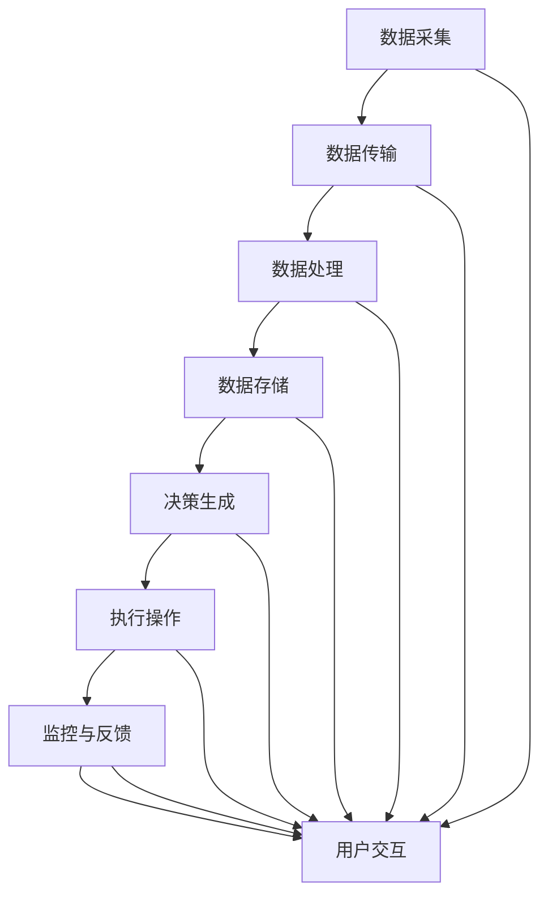

                 

### 文章标题

# 物理实体自动化的最新趋势

### 关键词

- 物理实体自动化
- 物联网
- 人工智能
- 传感器
- 机器学习
- 自动化架构

### 摘要

物理实体自动化是当前科技领域的重要研究方向，通过结合物联网、传感器、机器学习和人工智能等技术，实现了对物理世界的智能控制与优化。本文旨在梳理物理实体自动化的最新趋势，从背景与基本概念出发，深入探讨其核心原理、架构设计、应用场景，以及未来展望与产业政策。通过详细讲解关键技术、算法原理、案例分析，本文旨在为读者提供一个全面而深入的物理实体自动化指南。

### 引言

物理实体自动化（Physical Entity Automation），简称为物理自动化，是指利用物联网（IoT）、传感器、机器学习（ML）、人工智能（AI）等先进技术，对物理世界中的实体对象进行自动化监控、控制和管理的过程。物理自动化的目标是通过智能化的手段，提高物理系统的运行效率、降低人力成本、增强安全性和可靠性。

物理实体自动化并不是一个全新的概念，但其发展速度在过去几年中显著加快。随着物联网技术的普及，传感器成本的降低，以及人工智能算法的进步，物理自动化开始渗透到多个领域，如制造业、物流、城市管理和农业等。本文将围绕物理实体自动化的背景、核心原理、应用场景以及未来发展趋势，进行深入探讨和详细分析。

接下来，我们将逐步展开讨论：

1. **物理实体自动化的背景与基本概念**：介绍物理实体自动化的定义、重要性以及历史发展，并与传统自动化进行比较，分析物理实体自动化的优势。
2. **物理实体自动化的核心原理与架构**：深入探讨智能传感器与物联网技术、机器学习与人工智能算法在物理实体自动化中的应用，以及物理实体自动化的架构设计与实现。
3. **物理实体自动化的挑战与解决方案**：分析物理实体自动化面临的主要挑战，并提出相应的解决方案与技术进展。
4. **物理实体自动化的应用场景与案例分析**：探讨物理实体自动化在制造业、物流与仓储、城市管理与公共服务、农业与生态环境等领域的应用案例。
5. **物理实体自动化的未来展望与产业政策**：讨论物理实体自动化的未来发展趋势、产业政策支持以及国际合作与竞争态势。

通过本文的详细分析，我们希望为读者提供一个全面而深入的物理实体自动化知识体系，为相关领域的研究者和从业者提供有价值的参考。

### 第一部分：物理实体自动化的最新趋势概述

#### 第1章：物理实体自动化的背景与基本概念

##### 1.1 物理实体自动化的定义与重要性

物理实体自动化（Physical Entity Automation），简称物理自动化，是指通过物联网（IoT）、传感器、机器学习（ML）、人工智能（AI）等技术手段，实现对物理世界中实体对象的自动化监控、控制和管理。具体来说，物理自动化利用传感器收集物理实体的数据，通过物联网技术将数据传输至中心系统，再利用机器学习和人工智能算法对数据进行处理和分析，最终实现物理实体的自动控制。

物理自动化的定义涵盖了几个关键要素：首先是物联网和传感器，它们作为数据采集的基础设施，能够实时监测物理实体的状态；其次是数据处理和分析，通过机器学习和人工智能算法，对采集到的数据进行分析和决策，从而实现自动控制；最后是执行机构，根据分析和决策的结果，对物理实体进行实际的操控。

物理自动化的重要性不言而喻。首先，它能够显著提高生产效率，降低人力成本。例如，在制造业中，自动化生产线的应用可以减少人为操作的错误，提高生产速度和产品质量。其次，物理自动化能够提升系统的安全性和可靠性。通过对物理实体的实时监控和控制，可以及时发现并处理异常情况，防止事故的发生。此外，物理自动化还可以实现资源的优化配置，降低能耗，实现可持续发展。

##### 1.1.1 物理实体自动化的定义

物理实体自动化可以定义为一种智能化的控制和管理技术，它通过传感器、物联网和人工智能等手段，实现对物理实体（如机器、设备、车辆、动物等）的自动监控、控制和管理。具体来说，物理实体自动化的定义包括以下几个方面：

1. **传感器**：传感器是物理实体自动化的感知器官，用于监测物理实体的状态。传感器可以收集温度、湿度、位置、速度、压力等物理参数，并将这些信息转化为电信号，传输至中心系统。

2. **物联网**：物联网是实现物理实体自动化数据传输的关键基础设施。通过物联网，传感器收集到的数据可以实时传输至中心系统，实现物理实体的远程监控和管理。

3. **数据处理与分析**：数据处理与分析是物理实体自动化的核心环节。通过机器学习和人工智能算法，对传感器收集到的数据进行处理和分析，从中提取有用的信息，并做出相应的决策。

4. **执行机构**：执行机构是物理实体自动化的执行单元，根据数据处理和分析的结果，对物理实体进行实际的操控。执行机构可以是电机、阀门、机械臂等。

5. **反馈循环**：物理实体自动化是一个闭环系统，通过反馈循环，实现物理实体的自动调整和优化。即，根据执行结果，调整后续的操作，以达到最佳效果。

##### 1.1.2 物理实体自动化的重要性

物理实体自动化的重要性体现在多个方面：

1. **提高生产效率**：物理自动化可以显著提高生产效率。通过自动化生产线，可以减少人为操作的时间，提高生产速度和产品质量。例如，在汽车制造行业，自动化生产线的应用已经大大提高了生产效率，减少了生产成本。

2. **降低人力成本**：物理自动化可以降低人力成本。传统的生产模式需要大量的人力参与，而物理自动化通过机器和设备的自动化操作，减少了人力的需求。这不仅降低了企业的运营成本，还提高了工作效率。

3. **提升系统安全性**：物理自动化能够提升系统的安全性。通过对物理实体的实时监控和控制，可以及时发现并处理异常情况，防止事故的发生。例如，在交通管理中，智能监控系统可以对车辆的运行状态进行实时监控，及时发现和处理交通异常。

4. **优化资源配置**：物理自动化可以优化资源配置，降低能耗。通过对物理实体的智能控制，可以实现对能源的合理利用，降低能源消耗，实现可持续发展。例如，在智能家居中，智能控制系统可以根据居住者的行为习惯，自动调整灯光、温度等，实现节能。

5. **促进创新和发展**：物理实体自动化为科技创新提供了新的方向和机会。通过物联网、传感器、人工智能等技术的结合，可以开发出新的产品和服务，推动产业升级和经济发展。例如，智能农业通过物联网和传感器技术，可以实现精准农业，提高农业生产效率。

##### 1.1.3 物理实体自动化的历史发展

物理实体自动化的发展可以追溯到几十年前，其历史发展可以分为以下几个阶段：

1. **早期自动化**：20世纪60年代，计算机技术的兴起为自动化提供了技术基础。早期的自动化主要是在工业生产中应用，通过计算机对生产过程进行控制，实现生产线的自动化。

2. **传感器与数据采集**：20世纪80年代，传感器技术的快速发展使得数据采集成为可能。传感器可以实时监测物理实体的状态，并将数据传输至中心系统，为自动化提供了重要的数据支持。

3. **物联网的兴起**：21世纪初，物联网概念的提出和发展，使得物理实体自动化进入了一个新的阶段。物联网通过将各种设备和传感器连接起来，实现了大规模的数据采集和传输，为自动化提供了更广泛的应用场景。

4. **人工智能与机器学习**：近年来，人工智能和机器学习技术的进步，为物理实体自动化带来了新的机遇。通过人工智能算法，可以实现对大量数据的智能分析和决策，实现对物理实体的更精准控制。

5. **当前趋势**：当前，物理实体自动化正朝着智能化、融合化和跨界化的方向发展。智能传感器、5G通信技术、边缘计算等新技术的应用，使得物理实体自动化在多个领域取得了显著进展。

##### 1.2 物理实体自动化与传统自动化的比较

物理实体自动化与传统自动化有显著的不同，主要体现在以下几个方面：

1. **数据采集与处理**：传统自动化主要依赖于预定的程序和规则，缺乏实时数据采集和处理的能力。而物理实体自动化通过传感器和物联网技术，可以实现实时数据采集，并利用人工智能算法进行数据分析和决策。

2. **自适应性与灵活性**：传统自动化系统的适应性较差，一旦环境发生变化，需要重新编程和调试。而物理实体自动化系统具有更强的自适应性和灵活性，可以通过机器学习和人工智能算法，根据环境变化进行实时调整。

3. **智能化水平**：传统自动化系统主要依赖于规则和逻辑，而物理实体自动化系统则引入了人工智能和机器学习技术，可以实现更高水平的智能化。

4. **系统集成**：传统自动化系统通常是一个独立的系统，而物理实体自动化系统通过物联网技术，可以将多个系统和设备集成在一起，实现整体优化。

5. **应用场景**：传统自动化主要应用于工业生产领域，而物理实体自动化则可以在更多领域得到应用，如物流、交通、城市管理、农业等。

##### 1.2.1 传统自动化的局限性

传统自动化在许多方面具有局限性，限制了其在现代复杂环境中的应用。以下是一些主要局限性：

1. **缺乏灵活性**：传统自动化系统通常基于预设的规则和程序，无法灵活应对动态变化的环境。当环境发生改变时，系统需要进行重新编程和调试，这增加了维护成本和复杂性。

2. **数据依赖性低**：传统自动化系统往往缺乏对实时数据的依赖，无法利用传感器收集到的实时信息进行决策。这使得系统在面对复杂、多变的环境时，无法做出及时的响应。

3. **不可扩展性**：传统自动化系统通常是一个独立的系统，难以与其他系统和设备集成，限制了其在大型复杂环境中的应用。

4. **缺乏智能决策能力**：传统自动化系统主要依赖于逻辑和规则，缺乏智能决策能力。在面对复杂任务时，系统难以自主分析和解决问题。

5. **维护成本高**：传统自动化系统需要定期维护和调试，以确保其正常运行。这增加了系统的运营成本，尤其是在大规模应用时。

##### 1.2.2 物理实体自动化的优势

物理实体自动化相较于传统自动化，具有许多显著的优势：

1. **数据驱动的决策**：物理实体自动化利用传感器和物联网技术，可以实时采集大量数据，并通过人工智能算法进行分析和决策。这使得系统能够根据实时数据做出更准确的决策，提高运行效率。

2. **高度灵活性**：物理实体自动化系统具有高度的自适应性和灵活性，可以通过机器学习和人工智能算法，根据环境变化进行实时调整。这使得系统在动态变化的环境中，能够保持高效的运行。

3. **系统集成**：物理实体自动化通过物联网技术，可以实现不同系统和设备的无缝集成，形成一个统一的整体。这使得系统能够更好地应对复杂环境，提高系统的整体性能。

4. **智能化与自主学习**：物理实体自动化引入了人工智能和机器学习技术，使得系统能够自主学习、优化和进化。这提高了系统的智能化水平，使其能够应对更复杂的任务。

5. **降低运营成本**：物理实体自动化通过提高系统的灵活性和效率，可以显著降低运营成本。同时，通过实时监控和预测维护，可以减少设备的故障率和维修成本。

##### 1.2.3 物理实体自动化的关键技术

物理实体自动化涉及多个关键技术，这些技术共同作用，实现了对物理实体的智能监控和管理。以下是物理实体自动化的几个关键技术：

1. **传感器技术**：传感器是物理实体自动化的感知器官，用于监测物理实体的状态。传感器技术主要包括温度传感器、湿度传感器、位置传感器、速度传感器等，这些传感器可以实时采集物理实体的各种物理参数。

2. **物联网技术**：物联网技术是实现物理实体自动化数据传输的关键基础设施。通过物联网，传感器收集到的数据可以实时传输至中心系统，实现物理实体的远程监控和管理。物联网技术包括无线传感网络、云计算、大数据处理等。

3. **人工智能与机器学习**：人工智能和机器学习技术是物理实体自动化的核心，通过这些技术，可以对传感器收集到的数据进行分析和处理，实现智能决策和自动控制。常见的机器学习算法包括决策树、支持向量机、神经网络等。

4. **边缘计算**：边缘计算是将计算和存储能力从云端转移到网络边缘的一种技术，适用于实时性要求较高的物理实体自动化系统。边缘计算可以减少数据传输延迟，提高系统的响应速度。

5. **机器人技术**：机器人技术是实现物理实体自动化操作的关键。通过机器人，可以实现对物理实体的精准控制和操作，提高生产效率和质量。

6. **智能控制算法**：智能控制算法是物理实体自动化的核心，通过这些算法，可以实现物理实体的自适应控制和优化。常见的智能控制算法包括PID控制、模糊控制、遗传算法等。

7. **安全与隐私保护**：随着物联网和人工智能技术的普及，物理实体自动化面临的安全和隐私保护问题日益突出。通过加密、身份认证、访问控制等技术，可以确保系统的安全和隐私。

通过这些关键技术的结合，物理实体自动化能够实现对物理实体的全面监控和管理，提高系统的运行效率和安全性能。

### 第二部分：物理实体自动化的核心原理与架构

#### 第2章：智能传感器与物联网技术

##### 2.1.1 智能传感器的原理与分类

智能传感器是物理实体自动化系统中的核心组件，它们能够感知外部环境，并将物理信号转化为电子信号，以便进一步处理。智能传感器的原理主要基于传感器元件，这些元件对特定的物理量（如温度、湿度、光照、压力、速度等）具有响应特性。智能传感器不仅能够完成传统的信号检测任务，还能够对检测到的信号进行初步处理，如放大、滤波和温度补偿等，从而提高信号质量。

智能传感器的分类可以根据其感知对象和功能进行划分，主要包括以下几类：

1. **温度传感器**：温度传感器用于测量环境或物体的温度，常见的有热敏电阻、热电偶和红外温度传感器等。

2. **湿度传感器**：湿度传感器用于测量空气中的湿度水平，常见的有电容式、电阻式和露点传感器等。

3. **光照传感器**：光照传感器用于测量环境光照强度，常见的有光敏电阻、光电池和光谱传感器等。

4. **压力传感器**：压力传感器用于测量流体或气体的压力，常见的有应变片式、弹性体式和压电式等。

5. **位置传感器**：位置传感器用于测量物体的位置或运动状态，常见的有超声波传感器、编码器和磁传感器等。

6. **速度传感器**：速度传感器用于测量物体的运动速度，常见的有霍尔传感器、旋转变压器和光电传感器等。

7. **化学传感器**：化学传感器用于检测特定化学物质的存在和浓度，常见的有气敏传感器、湿敏传感器和生物传感器等。

智能传感器具有以下特点：

1. **多功能性**：智能传感器通常集成了多种功能，如信号放大、滤波、温度补偿等，可以实现对信号的初步处理。

2. **高精度**：智能传感器能够提供高精度的测量结果，减少误差，提高系统的可靠性。

3. **智能化**：智能传感器能够根据环境变化自动调整工作状态，具备自适应能力。

4. **集成化**：智能传感器通常采用微电子技术，可以实现小型化和多功能集成。

##### 2.1.2 物联网技术的基础架构

物联网（Internet of Things，IoT）技术是实现物理实体自动化数据传输和智能控制的基础。物联网技术通过将各种物体连接到互联网上，实现信息的实时共享和远程监控。物联网技术的基础架构通常包括以下几个层次：

1. **感知层**：感知层是物联网技术的最底层，主要由各种传感器和智能设备组成。这些设备能够感知环境或物体的状态，并将物理信号转化为电子信号。感知层是物联网数据采集的基础。

2. **传输层**：传输层负责将感知层采集到的数据传输到中心系统。传输层可以利用有线和无线通信技术，如Wi-Fi、蓝牙、LoRa、5G等，实现数据的长距离传输。

3. **网络层**：网络层是将各种传输网络连接起来的中间层，包括互联网、私有网络和专用网络等。网络层通过路由器、交换机等设备，实现数据的传输和路由。

4. **平台层**：平台层是物联网系统的核心，包括数据存储、数据处理、数据分析和应用接口等功能。平台层可以利用云计算和大数据技术，对海量数据进行存储和处理，并提供各种应用接口，供用户开发和集成。

5. **应用层**：应用层是物联网技术的最高层，直接面向用户，提供具体的业务应用。应用层可以根据具体需求，开发各种物联网应用，如智能家居、智能交通、智能医疗等。

物联网技术的基础架构具有以下几个特点：

1. **分布式**：物联网技术采用分布式架构，可以将数据采集、传输和处理分布在不同的节点上，提高系统的可靠性和可扩展性。

2. **集成性**：物联网技术可以将各种设备和系统连接起来，实现数据的共享和协同工作，提高系统的整体效率。

3. **智能化**：物联网技术利用人工智能和大数据分析技术，可以对采集到的数据进行智能处理和分析，实现自动化决策和优化。

4. **灵活性**：物联网技术具有高度的灵活性，可以根据实际需求，灵活地选择和配置各种设备和系统，实现定制化的应用。

##### 2.1.3 物联网技术在物理实体自动化中的应用

物联网技术在物理实体自动化中的应用非常广泛，主要体现在以下几个方面：

1. **数据采集**：物联网技术可以通过传感器和智能设备，实时采集物理实体的各种数据，如温度、湿度、位置、速度等。这些数据为物理实体的监控和控制提供了基础。

2. **远程监控**：物联网技术使得物理实体可以远程监控。通过物联网平台，用户可以随时随地了解物理实体的状态，及时发现并处理异常情况。

3. **智能控制**：物联网技术结合人工智能算法，可以实现物理实体的智能控制。根据采集到的数据，系统可以自动调整物理实体的操作，实现优化和控制。

4. **设备管理**：物联网技术可以对物理实体进行远程管理和维护。通过物联网平台，可以实时监控设备的运行状态，提前预警设备故障，进行远程诊断和维修。

5. **自动化生产**：在制造业中，物联网技术可以实现自动化生产线的智能化管理。通过物联网平台，可以实时监控生产线的运行状态，优化生产流程，提高生产效率。

6. **智能家居**：在智能家居领域，物联网技术可以实现家电设备的智能化管理。用户可以通过物联网平台远程控制家居设备，提高生活的便利性和舒适度。

7. **智能交通**：在智能交通领域，物联网技术可以实时监控交通流量，优化交通信号控制，减少拥堵，提高交通效率。

8. **智能医疗**：在智能医疗领域，物联网技术可以实时监控患者的健康状况，提供远程医疗服务，提高医疗质量和效率。

总的来说，物联网技术在物理实体自动化中的应用，不仅提高了系统的自动化程度和智能化水平，还增强了系统的安全性和可靠性，推动了各行各业的数字化转型和智能化升级。

#### 第2章：机器学习与人工智能算法

##### 2.2.1 机器学习的基本概念

机器学习（Machine Learning，ML）是人工智能（Artificial Intelligence，AI）的一个重要分支，它使计算机系统能够通过数据和经验进行自我学习和优化，无需显式编程。机器学习的基本概念包括几个关键要素：

1. **数据**：机器学习的基础是数据。系统通过分析大量数据来发现模式、规律和特征，从而进行预测和决策。数据的质量和多样性直接影响模型的性能。

2. **模型**：机器学习模型是一种数学或统计模型，用于表示数据的内在规律。常见的机器学习模型包括线性回归、决策树、支持向量机、神经网络等。

3. **算法**：算法是实现机器学习的关键，它定义了从数据中学习的方法。常见的机器学习算法包括监督学习、无监督学习、半监督学习和增强学习等。

4. **训练**：训练是机器学习过程中的一个关键步骤，即通过给定数据集，调整模型的参数，使其能够准确地预测或分类新的数据。

5. **验证**：验证是在训练完成后，通过验证集来评估模型性能的过程。通过验证，可以确定模型是否泛化能力强，即是否能够对新数据做出准确的预测。

6. **测试**：测试是最终评估模型性能的步骤，通常使用未参与训练和验证的数据集。测试结果可以确定模型在实际应用中的表现。

##### 2.2.2 机器学习算法的分类

机器学习算法可以根据学习方式、模型类型和应用场景进行分类。以下是几种常见的机器学习算法及其特点：

1. **监督学习**：监督学习算法通过已标记的训练数据来学习，其目标是建立一个预测模型。监督学习算法包括：

   - **线性回归**：通过线性函数预测连续值。
   - **逻辑回归**：用于分类问题，输出概率值。
   - **支持向量机**（SVM）：通过找到一个最佳超平面，将不同类别的数据分开。
   - **决策树**：通过一系列规则树进行分类或回归。
   - **随机森林**：由多个决策树组成的集成模型，提高预测准确性。

2. **无监督学习**：无监督学习算法在没有标记数据的情况下学习，主要目的是发现数据中的结构和模式。常见的无监督学习算法包括：

   - **聚类**：将相似的数据点分为一组，如K-Means、层次聚类等。
   - **主成分分析**（PCA）：降维技术，通过减少数据维度来揭示主要特征。
   - **自编码器**：用于特征提取和降维，由编码器和解码器组成。

3. **半监督学习**：半监督学习结合了监督学习和无监督学习的特点，利用部分标记数据和大量未标记数据来学习。常见的半监督学习算法包括：

   - **标签传播**：通过未标记数据中的相似性来推断标签。
   - **低密度分割**：用于在具有较少标记样本的情况下进行聚类。

4. **增强学习**：增强学习是一种通过奖励机制来训练模型的方法，其目标是找到最优策略。常见的增强学习算法包括：

   - **Q学习**：通过学习最优动作值函数来选择最佳动作。
   - **深度强化学习**：结合深度神经网络和增强学习，适用于复杂环境。

##### 2.2.3 人工智能算法在物理实体自动化中的应用

人工智能算法在物理实体自动化中扮演了关键角色，以下是几种常见的人工智能算法及其在物理实体自动化中的应用：

1. **神经网络**：神经网络是人工智能算法中最常用的方法之一，尤其在图像识别、语音识别和自然语言处理等领域表现出色。在物理实体自动化中，神经网络可以用于：

   - **图像识别**：通过卷积神经网络（CNN）识别生产线上产品的缺陷或质量。
   - **故障诊断**：通过递归神经网络（RNN）分析设备运行数据，预测设备故障。
   - **行为预测**：通过长短期记忆网络（LSTM）预测物理实体的行为模式，优化操作策略。

2. **机器视觉**：机器视觉是物理实体自动化中重要的感知手段，通过摄像头和图像处理算法，可以实时获取物理实体的视觉信息。常见的机器视觉算法包括：

   - **图像分类**：通过深度学习模型对采集的图像进行分类，如识别生产线上产品的类型。
   - **目标检测**：通过算法定位图像中的目标物体，如自动驾驶汽车中的行人检测。
   - **图像分割**：将图像分割成不同的区域，用于识别和定位具体的物体或特征。

3. **增强学习**：增强学习通过奖励机制训练模型，在物理实体自动化中可以用于：

   - **路径规划**：在机器人导航中，通过增强学习算法优化路径规划策略，提高导航效率和安全性。
   - **操作优化**：在工业机器人操作中，通过增强学习算法优化抓取、搬运等动作，提高操作效率和准确性。
   - **策略优化**：在智能交通系统中，通过增强学习算法优化交通信号控制和路线规划，提高交通效率和安全性。

4. **自然语言处理（NLP）**：自然语言处理算法可以处理人类语言数据，用于物理实体自动化的智能交互和文本分析。常见的NLP算法包括：

   - **文本分类**：通过对文本进行分类，实现智能监控和异常检测，如检测设备故障报告中的关键词。
   - **文本生成**：通过生成对抗网络（GAN）生成设备操作手册或维护指南，提高文档自动化水平。
   - **对话系统**：通过聊天机器人与用户交互，提供实时技术支持和故障诊断。

人工智能算法在物理实体自动化中的应用，使得系统能够更智能地感知、理解和响应外部环境，从而提高自动化水平和效率。随着人工智能技术的不断进步，其在物理实体自动化中的应用前景将更加广阔。

##### 2.3.1 物理实体自动化的总体架构

物理实体自动化的总体架构是确保系统高效、可靠运行的关键。该架构由多个层次和组件构成，涵盖了从数据采集、传输、处理到最终执行的全过程。以下是物理实体自动化总体架构的主要组成部分：

1. **感知层**：感知层是物理实体自动化的基础，主要由各种传感器和智能设备组成。这些设备能够实时感知物理实体的状态，如温度、湿度、位置、速度等，并将这些物理信号转化为电子信号。感知层的核心任务是数据采集，确保系统能够获取准确、实时的信息。

2. **传输层**：传输层负责将感知层采集到的数据传输到中心系统。传输层可以利用有线和无线通信技术，如Wi-Fi、蓝牙、LoRa、5G等，实现数据的长距离传输。传输层的可靠性直接影响系统的实时性和稳定性，因此需要选择合适的通信技术和协议。

3. **网络层**：网络层是将各种传输网络连接起来的中间层，包括互联网、私有网络和专用网络等。网络层通过路由器、交换机等设备，实现数据的传输和路由。网络层的功能是确保数据的有序传输和可靠传输，同时提供网络管理和监控功能。

4. **平台层**：平台层是物理实体自动化的核心，包括数据存储、数据处理、数据分析和应用接口等功能。平台层可以利用云计算和大数据技术，对海量数据进行存储和处理，并提供各种应用接口，供用户开发和集成。平台层的任务是对数据进行清洗、整合和分析，为决策层提供支持。

5. **决策层**：决策层是物理实体自动化的指挥中心，主要负责根据分析结果做出决策。决策层通过机器学习和人工智能算法，对采集到的数据进行分析和处理，识别物理实体的行为模式，预测未来的发展趋势，并生成操作指令。决策层的关键任务是实现智能化和自适应控制。

6. **执行层**：执行层是物理实体自动化的执行单元，负责根据决策层的指令对物理实体进行实际的操控。执行层包括各种执行机构，如电机、阀门、机械臂等。执行层的任务是将决策层的指令转化为物理操作，实现物理实体的自动化控制。

7. **监控层**：监控层是物理实体自动化的保障层，主要负责对系统的运行状态进行实时监控和异常检测。监控层通过监控系统性能指标、设备状态和操作记录，及时发现和处理异常情况，确保系统的正常运行。

物理实体自动化的总体架构具有以下几个特点：

1. **分布式**：物理实体自动化系统通常采用分布式架构，将数据采集、传输、处理和执行分布在不同的节点上，提高系统的可靠性和可扩展性。

2. **集成性**：物理实体自动化系统可以将各种传感器、设备和系统连接起来，实现数据的共享和协同工作，提高系统的整体效率。

3. **智能化**：物理实体自动化系统通过引入人工智能和机器学习算法，可以实现对数据的智能分析和决策，提高系统的智能化水平。

4. **灵活性**：物理实体自动化系统可以根据不同的应用场景和需求，灵活地配置和调整各个组件，实现定制化的自动化解决方案。

5. **安全性**：物理实体自动化系统需要考虑数据安全和系统安全，通过加密、身份认证、访问控制等技术，确保系统的安全和隐私。

物理实体自动化的总体架构为系统的稳定运行提供了坚实的基础，通过各个层次和组件的协同工作，实现了对物理实体的全面监控和管理，提高了系统的运行效率和安全性能。

##### 2.3.2 物理实体自动化的模块划分

物理实体自动化的模块划分是确保系统结构清晰、功能明确的关键。一个完整的物理实体自动化系统通常包括以下几个主要模块：

1. **数据采集模块**：数据采集模块是物理实体自动化的感知层，主要由各种传感器和智能设备组成。这些设备能够实时感知物理实体的状态，如温度、湿度、位置、速度等，并将这些物理信号转化为电子信号。数据采集模块的任务是确保系统能够获取准确、实时的数据。

2. **数据传输模块**：数据传输模块负责将数据采集模块收集到的数据传输到中心系统。数据传输模块可以利用有线和无线通信技术，如Wi-Fi、蓝牙、LoRa、5G等，实现数据的长距离传输。数据传输模块需要确保数据传输的可靠性、实时性和安全性。

3. **数据处理模块**：数据处理模块是物理实体自动化的核心，负责对传输层的数据进行清洗、整合和分析。数据处理模块可以利用云计算和大数据技术，对海量数据进行存储和处理，并提供各种应用接口，供用户开发和集成。数据处理模块的任务是对数据进行深度分析和挖掘，提取有用的信息和知识。

4. **数据存储模块**：数据存储模块负责存储和处理系统中的大量数据。数据存储模块通常使用数据库和数据仓库等技术，确保数据的持久化和可靠性。数据存储模块还需要提供数据查询、检索和分析功能，支持系统的数据管理。

5. **决策模块**：决策模块是物理实体自动化的指挥中心，主要负责根据分析结果做出决策。决策模块通过机器学习和人工智能算法，对采集到的数据进行分析和处理，识别物理实体的行为模式，预测未来的发展趋势，并生成操作指令。决策模块的关键任务是实现智能化和自适应控制。

6. **执行模块**：执行模块是物理实体自动化的执行单元，负责根据决策模块的指令对物理实体进行实际的操控。执行模块包括各种执行机构，如电机、阀门、机械臂等。执行模块的任务是将决策模块的指令转化为物理操作，实现物理实体的自动化控制。

7. **监控模块**：监控模块是物理实体自动化的保障层，主要负责对系统的运行状态进行实时监控和异常检测。监控模块通过监控系统性能指标、设备状态和操作记录，及时发现和处理异常情况，确保系统的正常运行。

8. **用户界面模块**：用户界面模块是物理实体自动化的交互层，主要负责与用户进行交互，提供系统的操作界面和监控界面。用户界面模块需要支持多种交互方式，如图形用户界面（GUI）、命令行界面（CLI）等，方便用户对系统进行操作和管理。

通过上述模块的划分，物理实体自动化系统能够实现功能分离和模块化设计，提高系统的可维护性和可扩展性。每个模块都有明确的任务和职责，模块之间通过接口进行数据传递和功能调用，确保系统的整体协同工作。

##### 2.3.3 物理实体自动化的关键流程

物理实体自动化的关键流程是确保系统能够高效、可靠地运行的核心。以下是一个典型的物理实体自动化系统的主要流程：

1. **数据采集**：首先，系统通过传感器和智能设备实时采集物理实体的各种状态数据，如温度、湿度、位置、速度等。这些数据被转换为电子信号，并通过数据传输模块传输至中心系统。

2. **数据传输**：数据传输模块负责将采集到的数据传输到中心系统。数据传输可以采用有线或无线通信技术，如Wi-Fi、蓝牙、LoRa、5G等。在传输过程中，数据需要经过加密和认证，确保数据的安全性和完整性。

3. **数据处理**：数据处理模块接收传输层的数据，并进行数据清洗、整合和分析。数据清洗包括去除噪声、缺失值填充等，确保数据的质量。整合是将来自不同传感器和设备的数据进行合并，形成统一的数据视图。分析则利用机器学习和人工智能算法，对数据进行深度挖掘，提取有用的信息和模式。

4. **数据存储**：处理后的数据被存储在数据存储模块中，以便后续查询和分析。数据存储模块通常使用数据库和数据仓库技术，确保数据的持久化和可靠性。同时，数据存储模块还提供数据备份和恢复功能，防止数据丢失。

5. **决策生成**：决策模块根据数据处理模块的分析结果，生成操作指令。决策模块使用机器学习和人工智能算法，分析物理实体的行为模式，预测未来的发展趋势，并制定最优的操作策略。决策生成的过程需要考虑系统的目标、约束条件和当前的状态。

6. **执行操作**：执行模块根据决策模块的指令，对物理实体进行实际的操控。执行模块包括各种执行机构，如电机、阀门、机械臂等。执行模块需要确保操作的准确性和安全性，同时记录操作日志，便于后续分析和评估。

7. **监控与反馈**：监控模块对系统的运行状态进行实时监控，及时发现和处理异常情况。监控模块监控系统的性能指标、设备状态和操作记录，并通过反馈机制将异常情况通知决策模块。反馈机制有助于系统进行自适应调整，提高系统的稳定性和可靠性。

8. **用户交互**：用户界面模块提供系统的操作界面和监控界面，方便用户对系统进行操作和管理。用户界面模块支持多种交互方式，如图形用户界面（GUI）、命令行界面（CLI）等。用户可以通过用户界面模块查看系统的实时状态、历史数据和操作日志，并进行相应的操作和设置。

通过上述关键流程的协同工作，物理实体自动化系统能够实现高效、智能的监控和管理，提高系统的运行效率和安全性能。

##### 2.4.1 物理实体自动化的 Mermaid 流程图

为了更直观地展示物理实体自动化的流程，下面提供了一个 Mermaid 流程图，用于描述系统的关键流程和组件之间的交互。

在这个流程图中，各个组件通过箭头连接，表示数据流和指令流的方向。以下是每个组件的具体描述：

- **数据采集**（A）：通过传感器和智能设备实时采集物理实体的状态数据。
- **数据传输**（B）：将采集到的数据传输至中心系统，保证数据传输的可靠性和实时性。
- **数据处理**（C）：对传输层的数据进行清洗、整合和分析，提取有用的信息和模式。
- **数据存储**（D）：存储处理后的数据，确保数据的持久化和可靠性。
- **决策生成**（E）：根据数据分析结果，生成最优的操作指令。
- **执行操作**（F）：根据决策指令，对物理实体进行实际的操控。
- **监控与反馈**（G）：实时监控系统的运行状态，及时发现和处理异常情况。
- **用户交互**（H）：提供系统的操作界面和监控界面，方便用户进行操作和管理。

通过这个 Mermaid 流程图，我们可以清晰地看到物理实体自动化系统各个组件之间的交互关系和工作流程，有助于理解和分析系统的运行机制。

##### 2.5.1 物理实体自动化面临的主要挑战

物理实体自动化虽然具有显著的优势和广泛的应用前景，但在实际应用过程中仍然面临诸多挑战。以下是物理实体自动化面临的主要挑战：

1. **数据隐私与安全问题**：物理实体自动化系统涉及大量的传感器和联网设备，这些设备收集和传输的数据可能包含敏感信息。如何保护用户隐私和数据安全是物理实体自动化面临的一个重要挑战。数据泄露和黑客攻击可能导致严重后果，如设备失控、数据丢失等。

2. **数据质量和可靠性**：物理实体自动化依赖于传感器和物联网设备收集的数据，这些数据的准确性和可靠性直接影响系统的性能。传感器可能出现噪声、误差或故障，导致数据质量下降。此外，传输过程中可能发生数据丢失或延迟，影响系统的实时性和可靠性。

3. **系统复杂性**：物理实体自动化系统通常涉及多个组件和层次，包括感知层、传输层、处理层、执行层等。系统复杂性的增加使得设计和维护变得更加困难。如何确保系统的稳定性、可扩展性和易维护性是一个挑战。

4. **成本和经济效益**：物理实体自动化系统需要投入大量的资金和人力资源进行开发和部署。对于中小企业而言，高昂的初期投资可能是一个重要的阻碍。如何确保系统的经济效益，实现成本和效益的平衡，是物理实体自动化推广面临的一个挑战。

5. **技术标准化**：物理实体自动化涉及多种技术，包括传感器技术、物联网技术、人工智能技术等。不同厂商和系统之间的技术标准和接口可能不一致，导致系统之间的互操作性和兼容性成为一个挑战。缺乏统一的技术标准和规范，可能导致系统之间的数据无法共享和协同工作。

6. **适应性与灵活性**：物理实体自动化系统需要在不同的应用场景和环境条件下运行。如何确保系统能够适应不同的需求和环境变化，保持灵活性和可扩展性，是一个技术和管理上的挑战。

7. **人机交互**：物理实体自动化系统通常需要与人类操作者进行交互。如何设计友好的用户界面，提供直观的操作体验，确保操作者能够有效地与系统协同工作，是一个重要的挑战。

为了应对上述挑战，研究人员和从业者可以采取以下策略：

1. **加强数据安全与隐私保护**：采用加密、身份认证、访问控制等技术，确保数据在传输和存储过程中的安全性。制定严格的隐私政策，明确数据的收集、使用和保护规则。

2. **提高数据质量和可靠性**：通过改进传感器技术和数据传输协议，减少数据噪声和误差。引入数据校验和冗余机制，提高数据传输的可靠性和完整性。

3. **简化系统架构**：采用模块化设计和微服务架构，简化系统的复杂性和维护难度。通过自动化部署和运维工具，提高系统的可维护性和可扩展性。

4. **降低成本和提升经济效益**：通过技术优化和规模化应用，降低物理实体自动化系统的成本。采用云服务和边缘计算，实现灵活的成本管理和资源优化。

5. **推动技术标准化**：积极参与行业标准的制定和推广，推动不同系统之间的互操作性和兼容性。建立开放的技术生态系统，促进技术创新和合作。

6. **提高适应性与灵活性**：引入自适应算法和机器学习技术，使系统能够根据环境变化进行动态调整。采用灵活的架构和接口设计，支持系统的扩展和定制化。

7. **优化人机交互**：通过用户研究和界面设计，提高系统的用户体验。引入语音识别、手势控制等交互方式，实现自然的人机交互。

通过上述策略，物理实体自动化系统可以更好地应对挑战，实现高效、可靠和智能的运行。

##### 2.5.2 解决方案与技术进展

为了应对物理实体自动化面临的主要挑战，研究人员和从业者已经提出了一系列解决方案和技术进展，以下是几个关键方面的解决方案：

1. **数据隐私与安全保护**：
   - **加密技术**：在数据传输和存储过程中，采用先进的加密算法（如AES、RSA等）对数据进行加密，防止未经授权的访问。
   - **身份认证与访问控制**：引入多因素身份认证（MFA）和基于角色的访问控制（RBAC），确保只有授权用户才能访问敏感数据。
   - **数据脱敏技术**：对敏感数据进行脱敏处理，将关键信息隐藏或替换，减少数据泄露的风险。

2. **数据质量和可靠性**：
   - **传感器优化**：采用高精度、低噪声的传感器，提高数据采集的准确性。
   - **数据校验与冗余**：在数据传输过程中，引入数据校验和冗余机制，如循环冗余校验（CRC）和奇偶校验，确保数据完整性。
   - **实时数据监控**：通过实时监控系统，对数据传输过程进行监控和报警，及时发现和处理数据传输中的问题。

3. **系统复杂性管理**：
   - **模块化设计与微服务架构**：采用模块化设计，将系统拆分为多个独立模块，降低系统的复杂度。采用微服务架构，将不同功能的服务解耦，提高系统的可维护性和扩展性。
   - **自动化部署与运维**：引入自动化部署和运维工具（如Kubernetes、Docker等），简化系统的部署和管理过程。

4. **成本效益提升**：
   - **云计算与边缘计算**：利用云计算和边缘计算，实现资源的灵活调度和优化配置，降低硬件投入和维护成本。
   - **规模化应用**：通过规模化应用和批处理技术，提高系统的经济效益。

5. **技术标准化**：
   - **参与标准制定**：积极参与行业标准和规范的制定，推动不同系统和平台之间的互操作性和兼容性。
   - **开放生态**：建立开放的技术生态系统，促进技术创新和合作，降低系统集成的难度。

6. **系统适应性与灵活性**：
   - **自适应算法**：引入自适应算法，使系统能够根据环境变化进行动态调整。
   - **AI算法优化**：通过深度学习和机器学习，提高系统的智能决策能力，实现灵活的响应和优化。

7. **人机交互优化**：
   - **多模态交互**：结合语音识别、手势控制、触摸屏等多种交互方式，提高用户的操作体验。
   - **用户研究**：通过用户研究和界面设计，优化用户界面，提高系统的易用性和可操作性。

这些解决方案和技术进展为物理实体自动化的发展提供了强有力的支持，使得系统能够更好地应对挑战，实现高效、可靠和智能的运行。随着技术的不断进步和创新的深入，物理实体自动化将在未来发挥更大的作用。

##### 2.5.3 未来发展趋势

物理实体自动化技术在未来将呈现出多个重要发展趋势，推动其在各行各业中更广泛、更深入的应用。以下是几个关键趋势：

1. **更先进的传感器技术**：未来的传感器技术将更加灵敏、精确和多样化。纳米技术和材料科学的进步将使得传感器体积更小、功耗更低、响应速度更快。例如，柔性传感器和可穿戴传感器将扩展物理实体自动化的应用范围，从传统的工业环境扩展到医疗、健康、家居等领域。

2. **更加智能的算法**：随着人工智能和机器学习技术的不断发展，算法的智能水平将进一步提升。深度学习、强化学习和联邦学习等新兴算法将使物理实体自动化系统具备更强的自学习和自适应能力，能够更好地处理复杂的动态环境。

3. **边缘计算与云计算的融合**：边缘计算与云计算的结合将优化物理实体自动化的数据处理和分析。边缘计算将数据处理能力从云端转移到数据生成地附近，降低延迟、减少带宽需求。同时，云计算提供强大的计算资源和数据存储能力，使得大规模数据处理和复杂分析成为可能。

4. **物联网的进一步普及**：物联网技术的普及将使得更多物理实体接入网络，实现更广泛的互联互通。5G和未来6G技术的推动将提供更高速、低延迟的通信能力，使得物理实体自动化系统能够实时、高效地传输和处理大量数据。

5. **跨领域的融合应用**：物理实体自动化将与其他技术领域（如大数据、区块链、虚拟现实等）深度融合，产生新的应用模式和服务。例如，智能交通系统将结合物联网和大数据分析，优化交通流量和减少拥堵；智能农业将利用物联网和AI技术，实现精准农业和可持续发展。

6. **安全与隐私保护**：随着物理实体自动化系统的普及，数据安全和隐私保护将成为重点关注领域。未来的技术发展将更加注重安全性和隐私保护，包括更先进的加密技术、访问控制和身份认证机制，以及安全的数据处理和分析方法。

7. **标准化与规范**：为了实现物理实体自动化系统的互操作性和兼容性，未来将推动更多标准和规范的制定。国际组织和行业联盟将共同合作，建立统一的技术标准和接口规范，促进不同系统和平台之间的无缝集成和协同工作。

综上所述，物理实体自动化技术在未来将继续快速发展，通过先进传感器、智能算法、边缘计算、物联网、跨领域融合、安全隐私保护以及标准化等手段，实现更高效、更智能、更安全的应用，推动各行各业的数字化转型和智能化升级。

### 第三部分：物理实体自动化的应用场景与案例分析

#### 第3章：制造业的物理实体自动化

##### 3.1.1 制造业自动化的发展历程

制造业自动化是物理实体自动化最早且最典型的应用领域之一。其发展历程可以分为几个主要阶段：

1. **初始阶段**：20世纪60年代，计算机技术的兴起标志着制造业自动化的开端。这一阶段主要是在生产过程中引入计算机控制，实现了简单自动化生产线的初步应用。

2. **自动化设备阶段**：20世纪70年代，随着数控技术（CNC）的发展，自动化设备逐渐取代了传统手工操作。这一阶段的特点是机器设备自动化程度提高，能够实现复杂零件的高精度加工。

3. **集成自动化阶段**：20世纪80年代，随着传感器和机器人技术的发展，制造业自动化开始向集成化方向迈进。这一阶段的特点是多个自动化设备通过计算机控制系统集成在一起，实现了生产线的高度自动化。

4. **智能自动化阶段**：21世纪初，物联网和人工智能技术的引入，使得制造业自动化进入智能自动化阶段。这一阶段的特点是系统能够实时采集和分析数据，进行自我优化和决策，从而实现生产线的智能化和高效化。

##### 3.1.2 制造业物理实体自动化的关键应用

制造业物理实体自动化的关键应用包括以下几个方面：

1. **自动化生产线**：自动化生产线是制造业自动化最核心的应用。通过使用传感器、机器人和计算机控制系统，自动化生产线能够实现从原材料加工到成品出库的全过程自动化。例如，汽车制造厂中的自动化焊接线、喷涂线和装配线等。

2. **质量检测**：质量检测是确保产品质量的重要环节。利用机器视觉和传感器技术，可以对产品进行实时质量检测，如外观检测、尺寸测量等。例如，电子制造业中的机器视觉检测系统可以自动识别芯片封装中的缺陷。

3. **设备预测性维护**：通过物联网和人工智能技术，可以对生产设备进行实时监控和数据分析，预测设备可能出现的故障，提前进行维护，从而减少停机时间和维修成本。

4. **生产计划优化**：利用大数据分析和人工智能算法，可以优化生产计划，提高生产效率。例如，通过分析市场需求、库存数据和设备状态，动态调整生产计划，实现高效生产。

5. **物流自动化**：在制造业中，物流自动化也是重要的一环。通过自动化仓库管理系统（WMS）和自动化输送系统，可以实现对原材料、半成品和成品的自动管理，提高物流效率。

##### 3.1.3 制造业物理实体自动化的成功案例分析

以下是一个制造业物理实体自动化的成功案例分析：

**案例：某大型汽车制造厂自动化生产线**

某大型汽车制造厂采用了高度自动化的生产线，实现了从车身制造到装配的全程自动化。以下是该案例的具体内容和实现细节：

1. **传感器和机器人应用**：
   - **传感器**：在生产线上安装了各种传感器，如温度传感器、速度传感器、位置传感器等，用于实时监测生产过程中的关键参数。
   - **机器人**：应用了多个工业机器人，如焊接机器人、装配机器人和喷涂机器人，用于执行焊接、装配和喷涂等任务。

2. **计算机控制系统**：
   - **中央控制系统**：通过中央控制系统，实现对整个生产线的集中控制和调度。中央控制系统可以通过物联网与各个传感器和机器人进行通信，实时获取生产数据。
   - **边缘计算节点**：在生产线上设置了多个边缘计算节点，用于本地数据处理和实时决策。边缘计算节点可以执行一些简单的机器学习算法，实现对生产数据的初步分析和处理。

3. **质量检测系统**：
   - **机器视觉系统**：在关键质量检测环节，应用了机器视觉系统。通过摄像头和图像处理算法，可以对车身外观、尺寸等进行实时检测，确保产品质量。
   - **自动化检测线**：设置了一系列自动化检测线，用于检测车身、零部件的缺陷。检测线上的设备可以自动识别缺陷，并生成检测报告。

4. **设备预测性维护系统**：
   - **物联网传感器**：在关键设备上安装了物联网传感器，用于实时监测设备状态。传感器可以采集温度、振动、压力等参数，并通过物联网传输到中央控制系统。
   - **预测性维护算法**：通过分析传感器数据，运用机器学习算法预测设备故障。当预测到设备可能发生故障时，系统会提前发出预警，并安排维修人员对设备进行维护。

5. **生产计划优化系统**：
   - **大数据分析**：通过收集和分析生产数据、市场需求数据等，运用大数据分析技术，优化生产计划。系统可以根据实时数据动态调整生产任务，确保生产效率。
   - **人工智能算法**：利用人工智能算法，对生产计划进行优化，提高生产效率和资源利用率。

通过上述措施，该大型汽车制造厂实现了生产过程的高度自动化和智能化，显著提高了生产效率和质量，降低了运营成本。该案例展示了制造业物理实体自动化的成功实践，为其他制造业企业提供了有益的借鉴。

#### 第3章：物流与仓储的物理实体自动化

##### 3.2.1 物流与仓储自动化的重要性

物流与仓储是供应链管理中的重要环节，其效率直接影响到整个供应链的运作质量和成本。物流与仓储自动化能够显著提升这两个环节的运作效率，减少人为操作错误，降低劳动成本，提高服务质量和客户满意度。以下是物流与仓储自动化的重要性：

1. **提高运作效率**：自动化设备能够连续、高效地工作，不受工作时间限制，显著提高物流和仓储环节的处理速度。例如，自动化仓库中的自动化货架系统和自动化搬运机器人可以24小时不间断运作，提高库存周转率。

2. **减少人力成本**：自动化设备能够替代大量重复性、繁重的工作，减少对人力劳动的依赖，降低人力成本。例如，自动化分拣系统可以在短时间内处理大量包裹，降低人工分拣的时间和错误率。

3. **降低操作错误**：自动化系统能够通过精确的传感器和算法减少人为操作错误，提高物流和仓储的准确性和可靠性。例如，自动识别系统可以准确识别货物的种类和数量，减少货物错发和漏发的情况。

4. **提高服务质量**：自动化系统能够提供更快速、更准确的服务，提高客户满意度。例如，自动化仓库系统可以实现快速发货，缩短订单处理时间，提升客户体验。

5. **优化库存管理**：通过自动化技术，可以实现更精确的库存管理，减少库存积压和缺货现象。例如，基于物联网技术的智能仓储系统能够实时监控库存状态，自动进行库存补充和调整。

##### 3.2.2 物流与仓储物理实体自动化的主要应用

物流与仓储物理实体自动化主要应用在以下几个方面：

1. **自动化仓库管理系统（WMS）**：WMS是物流与仓储自动化的重要组成部分，通过自动化设备和管理软件，实现对仓库内物资的自动管理。WMS可以实现库存管理、订单处理、出入库管理等功能，提高仓库运作效率。

2. **自动化货架系统**：自动化货架系统包括自动化存取系统和自动化搬运设备，如自动存取机（AS/RS）和自动导引车（AGV）。这些系统能够自动完成货物的存取和搬运，减少人力操作，提高仓库利用率。

3. **自动化分拣系统**：自动化分拣系统利用传感器、机器视觉和机器人技术，对包裹进行自动识别、分类和分拣。例如，自动分拣机可以根据包裹的重量、尺寸等信息，快速、准确地完成分拣任务。

4. **无人仓库**：无人仓库是物流与仓储自动化的高级形式，通过机器人、自动化设备和智能管理系统，实现整个仓库的无人操作。无人仓库能够显著提高仓库的运作效率和安全性。

5. **运输自动化**：在物流运输环节，自动化技术也被广泛应用。例如，自动化装卸系统、自动驾驶卡车和无人机配送等，都能够提高运输效率和降低运营成本。

##### 3.2.3 物流与仓储物理实体自动化的案例分析

以下是一个物流与仓储物理实体自动化的成功案例分析：

**案例：某大型电商公司的智能物流中心**

某大型电商公司建立了一个智能物流中心，通过自动化技术实现了物流和仓储的全面自动化。以下是该案例的具体内容和实现细节：

1. **自动化仓库管理系统（WMS）**：
   - **库存管理**：物流中心采用了先进的自动化仓库管理系统，通过物联网传感器和RFID技术，实现库存的实时监控和精确管理。
   - **订单处理**：WMS系统能够自动处理订单，生成入库和出库指令，并分配给相应的自动化设备。

2. **自动化货架系统**：
   - **自动存取系统**：物流中心安装了自动存取系统（AS/RS），该系统能够自动将货物存入货架或从货架中取出，减少人工操作。
   - **自动导引车（AGV）**：物流中心配备了自动导引车，能够自动导航到指定位置，进行货物的搬运和装卸。

3. **自动化分拣系统**：
   - **机器视觉技术**：物流中心采用了基于机器视觉技术的自动化分拣系统，通过摄像头和图像处理算法，自动识别和分类包裹。
   - **自动分拣机**：自动化分拣系统能够根据包裹的重量、尺寸和目的地，将包裹快速、准确地分拣到相应的传送带上。

4. **无人仓库**：
   - **无人搬运车**：物流中心引入了无人搬运车，能够自动导航到指定位置，完成货物的搬运和装卸任务。
   - **智能监控系统**：通过智能监控系统，物流中心能够实时监控仓库内的操作情况，确保仓库的安全和高效运作。

5. **运输自动化**：
   - **自动化装卸系统**：物流中心与运输车辆配合，采用了自动化装卸系统，实现货物的自动装卸，提高运输效率。
   - **无人机配送**：在物流末端，物流中心采用了无人机配送，能够在短时间内将包裹快速送达客户手中，提升客户满意度。

通过上述自动化技术的应用，该大型电商公司的物流中心实现了物流和仓储的全面自动化，显著提高了运作效率和服务质量。该案例展示了物流与仓储物理实体自动化的成功实践，为其他物流和仓储企业提供了有益的借鉴。

#### 第3章：城市管理与公共服务中的物理实体自动化

##### 3.3.1 城市管理与公共服务自动化的发展趋势

随着城市化进程的加快和城市人口的快速增长，城市管理与公共服务面临着巨大的挑战。为了提高城市管理的效率和服务质量，自动化技术正逐步渗透到城市管理的各个领域，成为城市现代化的重要支撑。以下是城市管理与公共服务自动化的发展趋势：

1. **智能交通管理**：智能交通管理系统通过物联网、大数据和人工智能技术，实现交通流量的实时监控和智能调控，提高道路通行效率和减少拥堵。未来，智能交通管理将更加注重自动驾驶技术、车联网和交通信号控制的集成应用。

2. **智能公共安全**：智能公共安全系统利用视频监控、人脸识别、大数据分析等技术，实现对城市安全的实时监控和快速响应。未来，智能公共安全将更加依赖于人工智能和物联网技术，提高应急反应速度和防范能力。

3. **智能城市管理平台**：智能城市管理平台通过集成多种城市管理系统，实现城市运行状态的全面监控和协同管理。未来，智能城市管理平台将更加注重数据融合和智能化分析，提高城市管理的整体效率和智能化水平。

4. **智慧公共服务**：智慧公共服务通过物联网和人工智能技术，实现公共服务的智能化和便捷化。未来，智慧公共服务将更加注重个性化服务和高效管理，提升居民的生活质量和满意度。

5. **能源管理自动化**：智能能源管理系统通过物联网和大数据技术，实现能源的智能监测、分配和管理，提高能源利用效率。未来，能源管理自动化将更加注重可再生能源的应用和能源大数据的分析。

6. **智能环境监测**：智能环境监测系统通过传感器网络和数据分析技术，实现对空气质量、水质、噪音等环境参数的实时监测和预警。未来，智能环境监测将更加注重数据驱动的环境治理和生态保护。

##### 3.3.2 城市管理与公共服务物理实体自动化的主要应用

城市管理与公共服务物理实体自动化的主要应用包括以下几个方面：

1. **智能交通系统**：智能交通系统通过传感器和视频监控设备，实时监测道路状况和交通流量，实现交通信号控制和车辆导航。智能交通系统还可以通过数据分析，优化交通路线和信号灯时序，提高交通效率。

2. **智能公共安全系统**：智能公共安全系统通过视频监控、人脸识别和大数据分析技术，实时监控城市公共场所的安全状况，及时发现和处理异常情况。例如，通过人脸识别技术，可以快速识别嫌疑人，提高公共安全防范能力。

3. **智能照明系统**：智能照明系统通过传感器和物联网技术，实现对城市道路、公园、广场等公共场所的智能照明管理。系统可以根据光照强度、人流量等参数，自动调节灯光亮度，节约能源。

4. **智能环境监测系统**：智能环境监测系统通过传感器网络，实时监测空气质量、水质、噪音等环境参数，实现对城市环境的实时监控和预警。系统可以及时通知相关部门进行环境治理，保障居民健康。

5. **智能垃圾分类系统**：智能垃圾分类系统通过传感器和物联网技术，实现对垃圾的分类和回收。系统可以根据垃圾的类型和重量，自动进行分类和称重，提高垃圾分类效率。

6. **智能停车系统**：智能停车系统通过传感器和物联网技术，实现对停车场车位使用情况的实时监控和导航。系统可以根据实时数据，为司机提供最优的停车方案，提高停车场的利用率。

##### 3.3.3 城市管理与公共服务物理实体自动化的成功案例

以下是一个城市管理与公共服务物理实体自动化的成功案例分析：

**案例：某城市的智能交通管理系统**

某城市建立了智能交通管理系统，通过物联网、大数据和人工智能技术，实现了交通流量的实时监控和智能调控，显著提高了交通效率和减少了拥堵。以下是该案例的具体内容和实现细节：

1. **传感器网络**：在主要交通节点和道路上安装了大量的传感器，用于实时监测交通流量、速度、密度等信息。传感器包括流量传感器、速度传感器和摄像头等。

2. **数据采集与传输**：传感器采集到的数据通过物联网技术传输到城市交通管理中心的数据库中，实现数据的实时采集和共享。

3. **数据分析与处理**：交通管理中心利用大数据分析和人工智能算法，对采集到的交通数据进行处理和分析，生成交通流量预测和优化建议。

4. **智能交通信号控制**：通过智能交通信号控制系统，根据实时交通流量数据，动态调整交通信号灯的时序，优化交通流通过程。系统还可以根据交通流量预测，提前调整信号灯的设置，减少拥堵。

5. **交通信息发布**：通过车载信息屏、手机APP等渠道，实时向司机发布交通信息，如路况、拥堵情况和最佳行驶路线等，帮助司机避开拥堵路段，提高行驶效率。

6. **自动驾驶测试**：在城市的一些特定路段，开展了自动驾驶车辆的测试，利用自动驾驶技术，实现车辆的自动导航和驾驶，减少人为驾驶错误。

通过上述措施，该城市的智能交通管理系统实现了交通流量的实时监控和智能调控，显著提高了道路通行效率和交通安全性。该案例展示了城市管理与公共服务物理实体自动化的成功实践，为其他城市提供了有益的参考。

#### 第3章：农业与生态环境中的物理实体自动化

##### 3.4.1 农业自动化的发展现状

农业自动化是现代农业发展的重要方向，通过应用物联网、传感器、人工智能和机器人技术，实现农业生产过程的自动化和智能化。农业自动化的发展现状主要体现在以下几个方面：

1. **精准农业**：精准农业利用传感器和物联网技术，实现对农田土壤、水分、养分等环境参数的实时监测，根据数据变化进行精确的种植和施肥。这有助于提高农业产量和资源利用率。

2. **无人机植保**：无人机植保系统通过搭载喷洒设备，实现对农田的自动化喷洒，提高了农药利用率，减少了劳动力成本和环境污染。

3. **自动化灌溉系统**：自动化灌溉系统利用传感器监测土壤水分，根据需求自动调节灌溉水量，提高了水资源利用率，减少了水资源浪费。

4. **自动化收割系统**：自动化收割系统通过搭载传感器和机器人技术，实现农作物的自动化收割，提高了收割效率和精度，降低了劳动力成本。

5. **智能温室**：智能温室利用传感器和物联网技术，实现对温度、湿度、光照等环境参数的实时监控和调控，提供最佳生长环境，提高作物产量和品质。

##### 3.4.2 农业物理实体自动化的主要应用

农业物理实体自动化主要应用在以下领域：

1. **智能监测与控制**：通过传感器网络，实现对农田、温室等环境参数的实时监测，利用物联网技术将数据传输到中央控制系统，实现智能化控制。

2. **自动化种植**：利用自动化播种、移栽、除草、施肥等设备，实现种植过程的自动化，提高劳动效率和作物产量。

3. **无人机应用**：无人机在农业中的应用包括无人机植保、无人机测绘、无人机播种等，通过无人机可以快速、准确地完成农业作业。

4. **自动化收割**：自动化收割系统通过传感器和机器人技术，实现农作物的自动化收割，提高收割效率和降低劳动力成本。

5. **智能灌溉**：利用智能灌溉系统，根据土壤水分传感器数据，自动调节灌溉水量，实现精准灌溉，提高水资源利用率。

6. **智能温室管理**：智能温室通过传感器和物联网技术，实现对温度、湿度、光照等环境参数的实时监控和调控，提供最佳生长环境。

##### 3.4.3 农业物理实体自动化的成功案例

以下是一个农业物理实体自动化的成功案例分析：

**案例：智能温室大棚管理系统**

某农场引入了智能温室大棚管理系统，通过物联网、传感器和人工智能技术，实现了温室环境参数的实时监控和智能调控。以下是该案例的具体内容和实现细节：

1. **传感器网络**：在温室中布置了多种传感器，包括温度传感器、湿度传感器、光照传感器、CO2传感器等，用于实时监测温室内部环境参数。

2. **数据采集与传输**：传感器采集到的数据通过物联网技术传输到中央控制系统，实现数据的实时采集和共享。

3. **数据分析与调控**：中央控制系统利用人工智能算法，对传感器数据进行分析和处理，生成环境参数调控策略。

4. **智能环境调控**：根据数据分析结果，系统自动调节温室内的温度、湿度、光照和CO2浓度，提供最佳生长环境。

5. **自动化种植**：系统配备了自动化播种、移栽、施肥和喷药设备，实现种植过程的自动化，提高劳动效率和作物产量。

6. **智能预警**：系统通过实时监测环境参数，可以及时发现异常情况，如温度过高或过低、湿度异常等，并通过手机APP或短信通知农场管理人员，确保作物安全生长。

通过智能温室大棚管理系统，该农场实现了温室环境参数的实时监控和智能调控，提高了作物产量和品质，降低了劳动力成本。该案例展示了农业物理实体自动化的成功实践，为其他农场提供了有益的借鉴。

##### 3.4.4 生态环境中的物理实体自动化应用

在生态环境管理中，物理实体自动化技术发挥着越来越重要的作用，通过智能传感器、物联网和人工智能技术，实现对自然环境的实时监控和精准管理。以下是物理实体自动化在生态环境中的应用：

1. **环境监测**：利用传感器网络，实现对空气、水质、土壤等环境参数的实时监测。传感器可以检测PM2.5、NO2、重金属等污染物，提供实时数据支持，帮助相关部门进行环境治理。

2. **预警系统**：通过环境监测数据，结合大数据分析和机器学习算法，建立预警系统，提前预测环境风险，如洪水、干旱、污染事件等，及时采取措施防范和应对。

3. **智能垃圾分类**：利用传感器和物联网技术，实现垃圾的分类和回收。智能垃圾分类系统可以根据垃圾的种类和重量，自动进行分类和称重，提高垃圾分类效率。

4. **森林防火**：通过安装在森林中的传感器和摄像头，实时监测森林火灾风险。系统可以及时发现火情，并通过无线通信网络将信息传输到监控中心，确保及时灭火。

5. **生态修复**：利用物理实体自动化技术，实现对受损生态系统的修复和管理。例如，通过智能灌溉系统和传感器监测，优化植物生长环境，加快生态恢复。

6. **生态旅游**：在生态旅游景点，利用物联网和人工智能技术，提供智能导览和安全管理。系统可以实时监控游客数量和分布，优化旅游路线和设施，提高游客体验。

物理实体自动化在生态环境中的应用，不仅提高了环境监测和管理的效率，还有助于实现生态环境的可持续发展。随着技术的不断进步，物理实体自动化将在未来发挥更大的作用，为生态环境保护和治理提供有力支持。

### 第四部分：物理实体自动化的未来展望与产业政策

#### 第4章：物理实体自动化的未来发展趋势

物理实体自动化是当前科技领域的热点之一，随着物联网、传感器、人工智能等技术的不断进步，其未来发展呈现出以下几个重要趋势：

1. **智能化水平提升**：未来物理实体自动化将更加智能化，通过引入先进的机器学习和人工智能算法，系统能够实现更复杂的任务和决策。例如，智能传感器将能够进行自适应学习和优化，提高系统的感知能力和响应速度。

2. **跨界融合**：物理实体自动化将与多个领域的技术融合，如5G、边缘计算、区块链等，形成跨界解决方案。这种跨界融合将带来全新的应用场景和商业模式，推动各行各业的数字化转型和智能化升级。

3. **自主性与协作性增强**：未来的物理实体自动化系统将具备更强的自主性和协作性。通过分布式计算和协作算法，系统能够在复杂环境中自主决策和协同工作，提高系统的效率和可靠性。

4. **低功耗与小型化**：随着物联网设备的广泛应用，低功耗、小型化的物理实体自动化设备将成为主流。新型传感器材料和微电子技术的应用，将使得设备更加节能、小巧，适用于更广泛的场景。

5. **普及程度提高**：随着成本的降低和技术的普及，物理实体自动化将在更多领域得到应用。从工业制造到城市管理，从农业到医疗，物理实体自动化将成为提高生产效率、改善生活质量的重要手段。

6. **个性化与定制化**：未来的物理实体自动化将更加注重个性化与定制化。通过收集和分析用户数据，系统能够提供个性化的服务和解决方案，满足不同用户的需求。

7. **数据安全和隐私保护**：随着物理实体自动化系统的广泛应用，数据安全和隐私保护将成为重要议题。未来，将出现更多安全隐私保护技术，确保系统在数据处理和传输过程中的安全性和可靠性。

#### 4.1.1 新型传感器技术的进展

新型传感器技术的进展是物理实体自动化未来发展的重要推动力。以下是新型传感器技术的主要进展：

1. **柔性传感器**：柔性传感器具有可弯曲、可拉伸的特性，能够适应复杂的环境和动态变化。这种传感器在智能穿戴、医疗健康、机器人等领域有广泛的应用前景。

2. **纳米传感器**：纳米传感器具有极高的灵敏度和分辨率，可以检测到极微弱的信号。这种传感器在生物检测、环境监测等领域具有重要意义。

3. **光子传感器**：光子传感器利用光子的特性进行检测，具有高速、高精度和高灵敏度的优点。这种传感器在无线通信、光学检测等领域有广泛应用。

4. **量子传感器**：量子传感器利用量子效应进行检测，具有超高的灵敏度和精度。这种传感器在科学研究、国防安全等领域具有潜在应用。

5. **无线传感器**：无线传感器通过无线通信技术进行数据传输，具有灵活性、易扩展性和低功耗的特点。这种传感器在物联网、智能城市等领域有广泛应用。

新型传感器技术的进展，不仅提高了物理实体自动化的感知能力，还拓展了其应用领域，为未来的发展奠定了基础。

#### 4.1.2 人工智能算法的创新与应用

人工智能算法的创新与应用是物理实体自动化发展的重要动力。以下是人工智能算法在物理实体自动化中的创新与应用：

1. **深度学习**：深度学习算法通过多层神经网络，对大量数据进行自动特征提取和模式识别。这种算法在图像识别、语音识别、自然语言处理等领域取得了显著成果。在物理实体自动化中，深度学习算法可以用于图像识别、故障诊断、路径规划等任务。

2. **强化学习**：强化学习算法通过试错和奖励机制，学习最优策略。这种算法在游戏、机器人控制、自动驾驶等领域有广泛应用。在物理实体自动化中，强化学习算法可以用于机器人路径规划、设备优化控制等任务。

3. **迁移学习**：迁移学习算法通过在不同任务之间共享特征表示，提高模型泛化能力。这种算法在资源有限、数据匮乏的场景中有重要作用。在物理实体自动化中，迁移学习算法可以用于新环境的快速适应和模型迁移。

4. **联邦学习**：联邦学习算法通过在分布式设备上协同训练，保护用户隐私。这种算法在物联网、智能医疗等领域有广泛应用。在物理实体自动化中，联邦学习算法可以用于设备数据共享和隐私保护。

5. **生成对抗网络**（GAN）：生成对抗网络通过生成器和判别器之间的对抗训练，生成逼真的数据。这种算法在图像生成、数据增强等领域有重要应用。在物理实体自动化中，GAN可以用于图像生成、数据增强等任务，提高系统的性能和鲁棒性。

人工智能算法的创新与应用，使得物理实体自动化系统更加智能、灵活和高效，为未来的发展提供了强大的技术支持。

#### 4.1.3 物理实体自动化的跨界融合

物理实体自动化的跨界融合是指将物理实体自动化技术与其他领域的技术相结合，形成新的应用模式和解决方案。以下是物理实体自动化的跨界融合趋势：

1. **与物联网的融合**：物联网技术为物理实体自动化提供了广泛的数据采集和传输渠道，物理实体自动化与物联网的结合，可以实现设备之间的互联互通和数据共享，提升系统的整体效率。

2. **与人工智能的融合**：人工智能技术为物理实体自动化提供了强大的分析和决策能力，通过人工智能算法，可以对大量数据进行处理和分析，实现自动化系统的自我优化和智能控制。

3. **与区块链的融合**：区块链技术为物理实体自动化提供了去中心化、可信任的数据管理和交易机制，通过区块链，可以确保数据的真实性和安全性，提升系统的透明度和可靠性。

4. **与5G技术的融合**：5G技术的高速度、低延迟特性，为物理实体自动化提供了更稳定、更高效的通信支持，使得远程控制和实时监测成为可能，推动物理实体自动化向更广阔的应用场景发展。

5. **与边缘计算的融合**：边缘计算技术将计算能力下沉到网络边缘，为物理实体自动化提供了更接近数据源的实时计算和决策支持，减少数据传输延迟，提升系统响应速度。

6. **与大数据的融合**：大数据技术为物理实体自动化提供了海量数据的存储、处理和分析能力，通过对大数据的深入挖掘，可以提取出更多有价值的信息，为自动化系统的优化和改进提供依据。

物理实体自动化的跨界融合，不仅拓展了其应用范围，还提升了系统的智能化和高效性，为未来的发展开辟了新的路径。

#### 4.2 物理实体自动化的产业政策与支持措施

为了推动物理实体自动化技术的发展和应用，各国政府和行业组织已经采取了一系列产业政策和支持措施。以下是几个主要国家和地区的政策概述：

1. **美国**：
   - **政策支持**：美国政府通过《国家网络空间安全战略》和《智能制造规划》等政策文件，推动物理实体自动化技术的发展和应用。
   - **资金投入**：美国国家科学基金会（NSF）和能源部（DOE）等机构，提供大量资金支持物理实体自动化技术的研究和开发。
   - **技术创新**：美国鼓励企业、高校和科研机构合作，推动技术创新和产业升级。

2. **欧盟**：
   - **政策支持**：欧盟委员会发布了《物联网战略》和《数字单一市场战略》等政策，支持物理实体自动化技术的研发和应用。
   - **资金支持**：欧盟的“地平线2020”计划提供了大量资金，支持物理实体自动化技术的研究和产业化。
   - **标准化**：欧盟积极推动物理实体自动化技术的标准化工作，确保不同系统和设备之间的互操作性和兼容性。

3. **中国**：
   - **政策支持**：《中国制造2025》和《新一代人工智能发展规划》等政策文件，明确支持物理实体自动化技术的发展。
   - **资金投入**：中国政府通过国家重点研发计划、国家自然科学基金等渠道，提供大量资金支持物理实体自动化技术的研究和应用。
   - **产业布局**：中国鼓励地方和企业建设物理实体自动化产业基地，推动产业链的协同发展和创新。

4. **日本**：
   - **政策支持**：日本政府发布了《机器人战略2015》和《物联网战略2017》等政策，支持物理实体自动化技术的研发和应用。
   - **资金支持**：日本经济产业省提供大量资金，支持物理实体自动化技术的研究和产业化。
   - **国际合作**：日本积极推动国际合作，与全球主要国家和企业进行技术交流和合作。

这些政策和支持措施，为物理实体自动化技术的发展提供了强有力的支持和保障，推动了产业的快速发展和广泛应用。

#### 4.2.1 地方政府的相关政策

地方政府在推动物理实体自动化产业发展中也发挥了重要作用，通过制定和实施一系列政策措施，为物理实体自动化的技术创新和产业化提供支持。以下是几个地方政府的相关政策概述：

1. **北京市**：
   - **政策支持**：北京市发布了《北京市智能机器人产业行动计划》，提出加大财政支持力度，推动物理实体自动化技术的研发和应用。
   - **资金投入**：通过设立专项资金，支持物理实体自动化技术的研发、试验和应用示范项目。
   - **产业合作**：鼓励企业、高校和科研机构合作，推动产业链的协同发展和创新。

2. **上海市**：
   - **政策支持**：上海市发布了《上海市智能制造发展实施方案》，提出加强智能制造技术研究和应用，推动物理实体自动化的应用和推广。
   - **资金支持**：通过政府补贴和奖励措施，支持企业进行物理实体自动化技术的研发和产业化。
   - **人才政策**：实施人才引进和培养计划，为物理实体自动化产业提供人才支持。

3. **广东省**：
   - **政策支持**：广东省发布了《广东省智能制造发展规划》，提出推动物理实体自动化技术的研发和应用，提升智能制造水平。
   - **资金投入**：通过设立智能制造专项基金，支持物理实体自动化技术的研发、试验和应用示范。
   - **产业合作**：推动产业链上下游企业合作，形成协同创新的产业生态。

4. **深圳市**：
   - **政策支持**：深圳市发布了《深圳市智能机器人产业发展规划》，提出加大政策支持力度，推动物理实体自动化技术的研发和应用。
   - **资金支持**：通过政府资助和风险投资，支持企业进行物理实体自动化技术的研发和产业化。
   - **国际合作**：积极推动与国际先进企业的合作，引进国外先进技术和管理经验。

地方政府的政策措施，为物理实体自动化产业的发展提供了有力支持，推动了产业技术创新和规模化应用。

#### 4.2.2 企业在物理实体自动化领域的战略布局

企业在物理实体自动化领域的战略布局是推动产业发展和技术创新的关键。以下是一些企业在物理实体自动化领域的战略布局：

1. **科技公司**：科技公司如微软、亚马逊、谷歌等，通过投资研发和并购，积极布局物理实体自动化技术。例如，亚马逊的Kiva系统在电商物流自动化领域取得了显著成果，微软的Azure IoT平台为物理实体自动化提供了强大的云计算支持。

2. **制造业企业**：制造业企业如通用电气、西门子、卡特彼勒等，通过自主研发和合作，推动物理实体自动化的应用。例如，通用电气的Predix平台为工业自动化提供了全面的支持，西门子的MindSphere平台则提供了智能制造的全面解决方案。

3. **物联网企业**：物联网企业如思科、华为、爱立信等，通过提供物联网硬件和软件解决方案，推动物理实体自动化的普及。例如，思科的物联网解决方案在智能城市建设中发挥了重要作用，华为的物联网技术广泛应用于智能工厂和智慧农业。

4. **创业公司**：创业公司如波士顿动力、无人机公司等，通过技术创新和创业精神，推动物理实体自动化技术的发展。例如，波士顿动力的机器人技术在全球机器人竞赛中取得了优异成绩，无人机公司在农业、物流等领域的应用取得了显著成果。

企业的战略布局不仅推动了物理实体自动化技术的发展，还为产业链的协同创新和产业生态的构建提供了支持。

#### 4.3 物理实体自动化的国际合作与竞争态势

物理实体自动化作为现代科技的重要方向，吸引了全球各国的高度关注。在国际合作与竞争态势方面，以下是一些主要趋势和特点：

1. **技术合作**：国际间在物理实体自动化领域的技术合作日益密切。各国科研机构、企业和高校通过联合研发、技术交流和项目合作，共同推动物理实体自动化技术的发展。例如，欧盟的“地平线2020”计划和美国的国际科学合作项目，都促进了全球在物理实体自动化领域的技术交流与合作。

2. **技术竞争**：与此同时，全球各国也在进行激烈的技术竞争。美国、欧盟、中国、日本等主要经济体纷纷加大在物理实体自动化领域的研发投入，力求在关键技术上取得突破，提升国际竞争力。例如，美国在人工智能和物联网技术上具有领先优势，欧盟则在标准化和数据处理上具有优势，中国则在传感器和制造技术上积极推进。

3. **产业链布局**：国际上的物理实体自动化产业链逐渐形成，各国根据自身优势进行分工与合作。美国、日本和欧洲在高端传感器、核心算法和系统集成方面具有优势，中国和东南亚国家则在制造和组装环节具有优势。这种产业链布局有助于全球资源的最优配置，推动了物理实体自动化技术的发展。

4. **政策支持**：各国政府通过制定和实施一系列产业政策，支持物理实体自动化技术的发展。例如，美国通过《国家网络空间安全战略》和《智能制造规划》，欧盟通过《物联网战略》和《数字单一市场战略》，中国通过《中国制造2025》和《新一代人工智能发展规划》，都为物理实体自动化技术提供了强有力的政策支持。

5. **国际合作项目**：国际上的物理实体自动化项目也日益增多。例如，国际科学合作组织（ISC）发起的“智能机器与人工智能”（ICRA）项目，以及“国际物联网联盟”（IIoT）等，都在推动物理实体自动化的全球合作与标准化。

6. **竞争格局**：在全球范围内，物理实体自动化的竞争格局逐渐形成。美国、欧盟和中国在技术、市场和政策等方面处于领先地位，日本、韩国和欧洲其他国家也在积极追赶。未来，全球竞争将进一步加剧，技术创新和产业链布局将成为决定性因素。

总之，物理实体自动化领域的国际合作与竞争态势，既促进了技术的快速发展和应用，也为全球产业链的协同发展提供了契机。随着技术的不断进步和各国政策的支持，物理实体自动化将在未来发挥更大的作用，推动全球经济的数字化转型和智能化升级。

### 附录

#### 附录 A：物理实体自动化相关术语解释

为了更好地理解和应用物理实体自动化技术，以下是物理实体自动化中一些常用术语的解释：

1. **物联网（IoT）**：物联网是指通过互联网将各种设备、传感器和系统连接起来，实现数据交换和协同工作的一种网络形态。

2. **传感器**：传感器是一种能够检测并响应特定物理信号的设备，例如温度、湿度、压力、光等。

3. **边缘计算**：边缘计算是一种将数据处理和分析能力从云端下沉到网络边缘的技术，以减少数据传输延迟，提高系统响应速度。

4. **机器学习**：机器学习是一种通过数据和算法使计算机系统能够从数据中学习并做出预测或决策的技术。

5. **人工智能（AI）**：人工智能是指使计算机系统能够模拟人类智能行为的技术，包括感知、理解、学习和决策等。

6. **自动化控制系统**：自动化控制系统是一种能够根据输入信号自动调整输出信号的系统，以实现自动控制和优化。

7. **边缘设备**：边缘设备是指部署在物理世界中的计算、存储和通信设备，用于实时处理和分析传感器数据。

8. **数据融合**：数据融合是指将来自多个来源的数据进行整合和分析，以获得更全面和准确的信息。

9. **智能传感器**：智能传感器是具有数据处理和通信功能的传感器，能够对检测到的信号进行初步处理和传输。

10. **机器人**：机器人是一种能够执行特定任务的自动化设备，通常具有移动、感知和操作能力。

通过这些术语的明确解释，读者可以更好地理解物理实体自动化的核心概念和技术体系，为深入学习和应用打下基础。

#### 附录 B：物理实体自动化参考资料

为了帮助读者深入了解物理实体自动化技术，以下是物理实体自动化领域的一些重要参考资料：

1. **书籍**：
   - 《物联网技术及应用》作者：王立峰
   - 《智能传感器原理与应用》作者：陈涛
   - 《机器学习》作者：周志华
   - 《人工智能：一种现代的方法》作者：Stuart Russell 和 Peter Norvig

2. **行业报告**：
   - 《全球物联网市场研究报告》发布机构：IDC
   - 《中国物联网产业发展报告》发布机构：中国信息通信研究院
   - 《智能制造发展报告》发布机构：中国机械工程学会

3. **学术论文**：
   - “Deep Learning for Internet of Things”作者：Y. LeCun, Y. Bengio, G. Hinton
   - “Edge Computing for IoT: A Comprehensive Survey”作者：A. Gandomi, S. Hedayati, H. Tang
   - “Machine Learning in IoT: A Survey”作者：M. Rehmani, M. Qasim, M. I. Imran

4. **国际组织与会议**：
   - 国际物联网联盟（IIoT）官网：https://iiot-technologies.com/
   - 国际机器人学会（IEEE Robotics and Automation Society）官网：https://www.ieee-ras.org/
   - 物联网技术大会（Internet of Things World Congress）官网：https://iot-world-congress.com/

5. **相关书籍推荐**：
   - 《物联网：概念、架构、技术和应用》作者：赵军
   - 《智能交通系统》作者：李瑞
   - 《智能农业技术》作者：周凯
   - 《智能制造：理论与实践》作者：杨磊

通过这些参考资料，读者可以全面了解物理实体自动化技术的最新发展动态、理论方法和实际应用，为深入研究物理实体自动化提供有力支持。

### 结束语

物理实体自动化作为现代科技领域的重要方向，正在不断推动各行各业的数字化转型和智能化升级。通过物联网、传感器、人工智能等先进技术的结合，物理实体自动化不仅提高了生产效率、降低了运营成本，还增强了系统的安全性和可靠性。本文系统地阐述了物理实体自动化的核心概念、原理、架构和应用场景，并探讨了其未来发展趋势和产业政策。希望本文能为读者提供一个全面而深入的物理实体自动化知识体系，为相关领域的研究者和从业者提供有价值的参考。

最后，感谢您对本文的关注和阅读。如果您有任何建议或疑问，欢迎在评论区留言，期待与您共同探讨物理实体自动化的更多话题。感谢AI天才研究院/AI Genius Institute和《禅与计算机程序设计艺术/Zen And The Art of Computer Programming》的支持与贡献。让我们共同期待物理实体自动化技术在未来带来更多的创新与变革！

