                 

# 物理实体自动化的未来前景

## 关键词
物理实体自动化，自动化控制系统，传感器技术，机器学习，工业制造，物流仓储，农业园林，建筑基础设施，技术创新，跨领域应用

## 摘要
物理实体自动化作为现代科技的前沿领域，正在不断推动各行各业的生产效率和服务水平的提升。本文旨在探讨物理实体自动化的未来前景，分析其核心技术、应用实例、社会影响以及面临的挑战。通过深入思考和分析，本文将为读者展现物理实体自动化的发展趋势和潜在机遇。

## 《物理实体自动化的未来前景》目录大纲

### 第一部分：物理实体自动化的基础

#### 第1章：物理实体自动化的基本概念

#### 1.1 物理实体自动化的定义
物理实体自动化是指通过使用各种技术手段，使物理实体（如设备、机器人、传感器等）能够自主完成特定任务，提高生产效率、降低成本、减少人力投入的过程。这一概念涵盖了自动化控制系统、传感器技术、机器人和机械自动化等多个方面。

#### 1.2 物理实体自动化的目标
物理实体自动化的目标包括提高生产效率、降低成本、减少人力投入、提高产品质量、提升安全性等。通过自动化，企业可以实现生产流程的优化，减少资源浪费，提高产品的稳定性和一致性。

#### 1.3 物理实体自动化的应用领域
物理实体自动化广泛应用于工业制造、物流仓储、农业园林、建筑基础设施等多个领域。每个领域都有其独特的自动化需求和解决方案。

### 第2章：物理实体自动化的核心技术和原理

#### 2.1 自动化控制系统概述
自动化控制系统是物理实体自动化的核心，包括传感器、控制器、执行器等组成部分，能够实现物理实体的自主控制和自动化。自动化控制系统的工作原理是通过传感器获取物理信号，控制器进行计算和分析，然后通过执行器实现动作。

#### 2.2 传感器技术和数据处理
传感器技术是物理实体自动化的基础，通过传感器的采集，可以将物理信号转换为电信号，然后通过数据处理技术进行进一步分析。数据处理技术包括信号滤波、特征提取和模式识别等。

#### 2.3 机器人和机械自动化
机器人和机械自动化是物理实体自动化的重要组成部分，通过机器人和机械的自动化控制，可以实现复杂、重复性、高风险的任务。机器人技术包括工业机器人、服务机器人和特种机器人等；机械自动化包括机械手、自动化机床和自动化生产线等。

### 第3章：物理实体自动化的关键问题与挑战

#### 3.1 物理实体自动化的系统设计与集成
系统集成与协同控制是物理实体自动化的关键问题，需要解决多个系统之间的兼容性和协调性问题。系统设计包括硬件选择、软件架构和系统集成等方面。

#### 3.2 物理实体自动化的安全与可靠性
物理实体自动化的安全性和可靠性至关重要，需要确保自动化系统的稳定运行和安全性。安全与可靠性问题包括硬件故障、软件缺陷和人为干预等。

#### 3.3 物理实体自动化的成本效益分析
物理实体自动化的成本效益分析是决定其应用前景的关键，需要综合考虑成本、效益、风险等因素。成本包括硬件成本、软件开发成本和运营成本等。

### 第二部分：物理实体自动化的应用实例

#### 第4章：工业制造中的物理实体自动化

#### 4.1 工业自动化生产线设计
工业自动化生产线设计是物理实体自动化在工业制造中的重要应用。本文将介绍自动化生产线的设计原则、系统架构和关键组件。

#### 4.2 工业机器人应用实例
工业机器人是工业自动化的重要组成部分。本文将介绍几种常见的工业机器人及其应用实例，包括焊接机器人、装配机器人和搬运机器人等。

#### 4.3 生产线智能化升级
随着技术的进步，生产线智能化升级成为趋势。本文将探讨智能化升级的关键技术、实施方案和预期效果。

### 第5章：物流和仓储中的物理实体自动化

#### 5.1 自动化仓储系统
自动化仓储系统是物流和仓储领域的核心，本文将介绍自动化仓储系统的设计原则、关键技术及其在实际应用中的效果。

#### 5.2 自动化物流配送系统
自动化物流配送系统是物流行业的重要创新，本文将介绍自动化物流配送系统的设计思路、技术和应用案例。

#### 5.3 智能物流技术应用
智能物流技术包括物联网、大数据和人工智能等，本文将探讨智能物流技术的应用前景和实际案例。

### 第6章：农业和园林中的物理实体自动化

#### 6.1 农业自动化设备应用
农业自动化设备是提高农业生产效率的重要手段，本文将介绍农业自动化设备的应用领域、技术特点和案例分析。

#### 6.2 园林自动化设备应用
园林自动化设备在园林维护和管理中发挥着重要作用，本文将介绍园林自动化设备的应用范围、技术特点和案例。

#### 6.3 农业智能化管理
农业智能化管理是现代农业发展的方向，本文将探讨农业智能化管理的关键技术、实施路径和成效。

### 第7章：建筑和基础设施中的物理实体自动化

#### 7.1 建筑自动化施工
建筑自动化施工是建筑行业的重要趋势，本文将介绍建筑自动化施工的关键技术、实施方案和案例分析。

#### 7.2 智能建筑与城市基础设施
智能建筑和城市基础设施是城市可持续发展的重要支撑，本文将探讨智能建筑和城市基础设施的自动化技术、应用案例和未来发展。

#### 7.3 物理实体自动化的未来发展趋势
本文将总结物理实体自动化的未来发展趋势，包括技术创新、跨领域应用和可持续发展等方面。

### 第三部分：物理实体自动化的未来前景与展望

#### 第8章：物理实体自动化对社会和经济的影响

#### 8.1 物理实体自动化对社会生活的影响
物理实体自动化将对社会生活带来深远影响，包括生产方式的变革、生活质量的提高和就业结构的调整等。

#### 8.2 物理实体自动化对经济的影响
物理实体自动化将对经济发展产生重要影响，包括提高生产效率、降低成本、推动产业升级和促进经济增长等。

#### 8.3 物理实体自动化政策与法规
物理实体自动化的健康发展需要政策与法规的支持，本文将探讨物理实体自动化的政策与法规环境。

### 第9章：物理实体自动化的技术创新与趋势

#### 9.1 新型传感器与控制技术
新型传感器和控制技术的研发是物理实体自动化的重要方向，本文将介绍新型传感器和控制技术的发展趋势和应用案例。

#### 9.2 人工智能与物理实体自动化
人工智能技术在物理实体自动化中的应用日益广泛，本文将探讨人工智能与物理实体自动化的结合方式和发展趋势。

#### 9.3 物理实体自动化的未来研究方向
本文将总结物理实体自动化的未来研究方向，包括技术创新、跨领域应用和可持续发展等方面。

### 第10章：物理实体自动化的跨领域应用与挑战

#### 10.1 跨领域物理实体自动化的挑战与机遇
跨领域物理实体自动化面临着技术和市场的双重挑战，同时也带来了巨大的机遇。本文将探讨跨领域物理实体自动化的挑战与机遇。

#### 10.2 物理实体自动化在新兴领域的应用
新兴领域如医疗、教育、金融服务等，物理实体自动化的应用前景广阔。本文将介绍物理实体自动化在新兴领域的应用案例和发展趋势。

#### 10.3 物理实体自动化的可持续发展与生态平衡
物理实体自动化的可持续发展是确保其长期健康发展的关键。本文将探讨物理实体自动化的可持续发展路径和生态平衡策略。

## 附录

### 附录 A：物理实体自动化资源与工具

#### A.1 常用自动化控制系统与设备
本文将列出常用的自动化控制系统和设备，包括控制器、传感器、执行器等，以及其应用场景和选型指南。

#### A.2 自动化技术相关书籍与论文
本文将推荐一些自动化技术相关的书籍和论文，帮助读者深入了解物理实体自动化的理论和技术。

#### A.3 物理实体自动化学习平台与资源
本文将介绍一些物理实体自动化的学习平台和资源，包括在线课程、研讨会、论坛等，为读者提供学习和交流的渠道。

### 附录 B：物理实体自动化项目实例

#### B.1 工业自动化生产线案例
本文将介绍一个工业自动化生产线的实际案例，包括系统设计、设备选型、软件编程等过程，以及项目的实施效果。

#### B.2 自动化物流系统案例
本文将介绍一个自动化物流系统的实际案例，包括系统设计、传感器选型、数据处理等过程，以及项目的实施效果。

#### B.3 农业自动化设备案例
本文将介绍一个农业自动化设备的实际案例，包括设备设计、技术特点、应用效果等，以及项目的实施经验。

#### B.4 建筑自动化施工案例
本文将介绍一个建筑自动化施工的实际案例，包括施工方案、技术特点、实施效果等，以及项目的实施经验。

---

### 第1章：物理实体自动化的基本概念

物理实体自动化（Physical Entity Automation）是现代科技发展的一个重要方向，它通过利用计算机技术、传感器技术、机器人技术等手段，实现物理实体的自主运行和操作，从而提高生产效率、降低成本、减少人力投入。本章将详细介绍物理实体自动化的基本概念，包括其定义、目标和应用领域。

#### 1.1 物理实体自动化的定义

物理实体自动化是指通过使用各种技术手段，使物理实体（如设备、机器人、传感器等）能够自主完成特定任务，提高生产效率、降低成本、减少人力投入的过程。这一概念涵盖了自动化控制系统、传感器技术、机器人和机械自动化等多个方面。

在物理实体自动化中，传感器用于检测和获取物理信号，控制器根据传感器信号进行分析和处理，然后通过执行器实现物理实体的动作。这种自主运行的系统可以广泛应用于工业制造、物流仓储、农业园林、建筑基础设施等多个领域。

#### 1.2 物理实体自动化的目标

物理实体自动化的主要目标包括：

- **提高生产效率**：通过自动化系统，可以优化生产流程，减少人工操作环节，提高生产效率和产品质量。
- **降低成本**：自动化系统可以减少人力投入，降低生产成本，提高企业的竞争力。
- **减少人力投入**：自动化系统可以替代部分繁琐、重复性的工作，减轻工人劳动强度，提高工作效率。
- **提高产品质量**：自动化系统可以精确控制生产过程，减少人为因素造成的误差，提高产品质量。
- **提升安全性**：自动化系统可以减少人员直接参与高风险操作，提高生产过程的安全性。

#### 1.3 物理实体自动化的应用领域

物理实体自动化在多个领域都有广泛应用，以下是其中几个主要领域：

- **工业制造**：自动化生产线、工业机器人、自动化机床等在工业制造中的应用，可以提高生产效率、降低成本、提高产品质量。
- **物流仓储**：自动化仓储系统、自动化物流配送系统等在物流仓储中的应用，可以提高仓储效率、减少人力投入、提高物流服务质量。
- **农业园林**：农业自动化设备、园林自动化设备等在农业和园林中的应用，可以提高农业生产效率、减轻工人劳动强度、提升园林管理水平。
- **建筑基础设施**：建筑自动化施工、智能建筑与城市基础设施等在建筑和基础设施中的应用，可以提高施工效率、降低成本、提升城市管理水平。

### 第2章：物理实体自动化的核心技术和原理

物理实体自动化涉及多个核心技术和原理，包括自动化控制系统、传感器技术、机器人和机械自动化等。本章将详细探讨这些核心技术，分析其原理和实现方法。

#### 2.1 自动化控制系统概述

自动化控制系统是物理实体自动化的核心，它通过传感器、控制器和执行器等组成部分，实现物理实体的自主控制和自动化。自动化控制系统的工作原理是：

1. **传感器**：传感器用于检测和获取物理信号，如温度、压力、速度等。传感器将物理信号转换为电信号，以便控制器进行处理。
2. **控制器**：控制器根据传感器信号进行分析和处理，然后发出指令给执行器。控制器可以是一个简单的电路，也可以是一个复杂的计算机系统。
3. **执行器**：执行器根据控制器的指令，执行具体的动作，如电机、气动阀等。执行器将控制信号转换为物理动作，实现对物理实体的控制。

自动化控制系统的基本组成可以用以下Mermaid流程图表示：

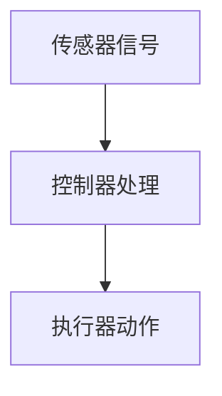

#### 2.2 传感器技术和数据处理

传感器技术是物理实体自动化的基础，通过传感器的采集，可以将物理信号转换为电信号，然后通过数据处理技术进行进一步分析。传感器可以分为以下几类：

1. **模拟传感器**：用于检测和获取连续变化的物理信号，如温度传感器、压力传感器等。
2. **数字传感器**：用于检测和获取离散的物理信号，如光电传感器、霍尔传感器等。

数据处理技术包括信号滤波、特征提取和模式识别等。信号滤波用于去除传感器信号中的噪声，特征提取用于从传感器信号中提取有用的特征信息，模式识别用于对传感器信号进行分析和分类。

以下是传感器数据处理的基本流程：

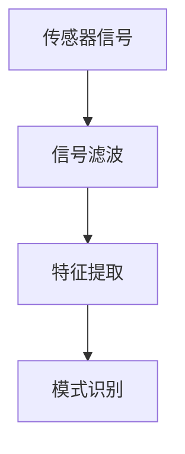

#### 2.3 机器人和机械自动化

机器人和机械自动化是物理实体自动化的重要组成部分，通过机器人和机械的自动化控制，可以实现复杂、重复性、高风险的任务。机器人技术包括工业机器人、服务机器人和特种机器人等；机械自动化包括机械手、自动化机床和自动化生产线等。

1. **工业机器人**：工业机器人用于工业生产中的自动化任务，如焊接、装配、搬运等。工业机器人的主要技术包括机械结构设计、驱动控制、传感技术等。

2. **服务机器人**：服务机器人用于家庭、医疗、服务等领域，如清洁机器人、医疗机器人等。服务机器人的主要技术包括自主导航、人机交互、智能控制等。

3. **特种机器人**：特种机器人用于特殊环境或任务，如矿难救援机器人、探测机器人等。特种机器人的主要技术包括环境感知、自主决策、高可靠性等。

4. **机械自动化**：机械自动化包括机械手、自动化机床和自动化生产线等。机械自动化技术可以大大提高生产效率、降低生产成本、提高产品质量。

以下是机器人和机械自动化的基本组成：

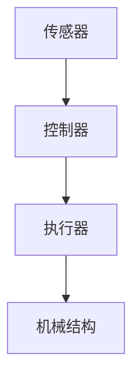

### 第3章：物理实体自动化的关键问题与挑战

物理实体自动化虽然在各个领域都有广泛应用，但在实际应用中仍然面临许多关键问题与挑战。本章将详细讨论物理实体自动化的系统设计与集成、安全与可靠性、成本效益分析等关键问题。

#### 3.1 物理实体自动化的系统设计与集成

物理实体自动化的系统设计与集成是一个复杂的过程，需要充分考虑硬件选择、软件架构和系统集成等方面。

1. **硬件选择**：在物理实体自动化系统中，硬件的选择至关重要。需要根据实际应用需求选择合适的传感器、控制器和执行器等硬件设备。例如，在选择传感器时，需要考虑传感器的精度、分辨率、响应速度等参数。

2. **软件架构**：物理实体自动化系统的软件架构设计需要充分考虑系统的可扩展性、可维护性和可移植性。常见的软件架构包括客户机/服务器架构、分布式架构和嵌入式架构等。

3. **系统集成**：系统集成是将各个硬件和软件组件整合在一起，实现系统协同工作的过程。系统集成需要解决多个系统之间的兼容性和协调性问题。例如，在工业制造领域，需要将自动化控制系统、质量检测系统、物流系统等集成在一起，实现生产流程的自动化和智能化。

以下是物理实体自动化系统设计与集成的Mermaid流程图：

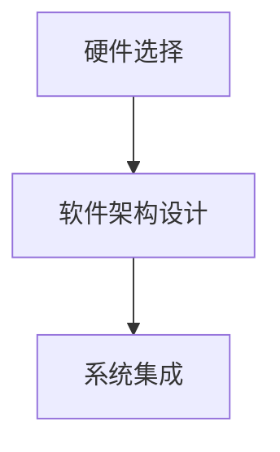

#### 3.2 物理实体自动化的安全与可靠性

物理实体自动化的安全与可靠性是确保系统正常运行的关键。在物理实体自动化系统中，可能面临以下安全与可靠性问题：

1. **硬件故障**：传感器、控制器和执行器等硬件设备可能出现故障，导致系统无法正常运行。因此，需要选择高质量的硬件设备，并定期进行维护和检修。

2. **软件缺陷**：软件系统可能出现缺陷或漏洞，导致系统无法正常运行或遭受攻击。因此，需要使用高质量的软件系统，并进行严格的测试和验证。

3. **人为干预**：在物理实体自动化系统中，可能需要人工干预，以处理突发情况或调整系统参数。因此，需要设计简单易用的用户界面，以便操作人员能够快速、准确地干预系统。

以下是物理实体自动化安全与可靠性保障的Mermaid流程图：

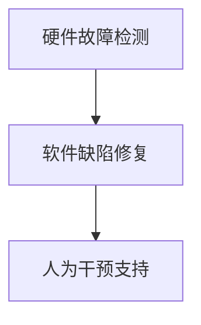

#### 3.3 物理实体自动化的成本效益分析

物理实体自动化的成本效益分析是决定其应用前景的关键。在成本效益分析中，需要综合考虑以下因素：

1. **硬件成本**：包括传感器、控制器、执行器等硬件设备的成本。
2. **软件开发成本**：包括软件系统的开发、测试、部署和维护等成本。
3. **运营成本**：包括系统的运行、维护、升级和扩展等成本。
4. **效益**：包括生产效率提升、成本降低、产品质量提高、安全性提升等带来的效益。

以下是物理实体自动化成本效益分析的Mermaid流程图：

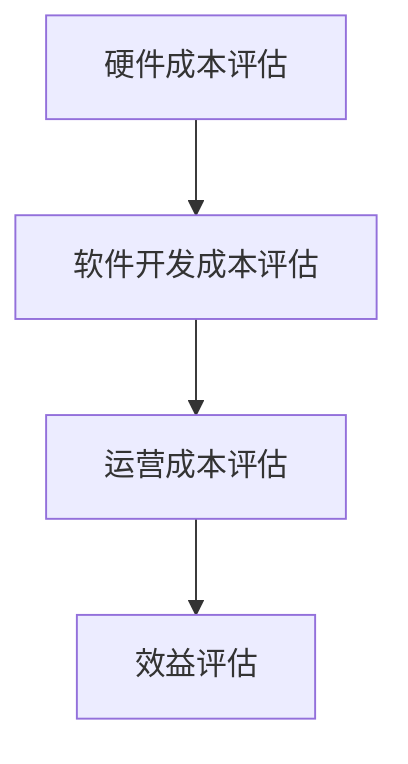

### 第4章：工业制造中的物理实体自动化

工业制造是物理实体自动化的重要应用领域。本章将介绍工业制造中的物理实体自动化，包括自动化生产线设计、工业机器人应用实例和生产线智能化升级。

#### 4.1 工业自动化生产线设计

工业自动化生产线设计是工业制造中的核心任务。一个典型的工业自动化生产线包括以下几个部分：

1. **传感器**：用于检测和获取生产线上的各种物理信号，如温度、压力、速度等。
2. **控制器**：根据传感器信号进行分析和处理，发出指令给执行器。
3. **执行器**：根据控制器的指令，执行具体的动作，如驱动电机、控制阀门等。
4. **通信网络**：用于实现传感器、控制器、执行器之间的数据交换和通信。

以下是工业自动化生产线设计的Mermaid流程图：

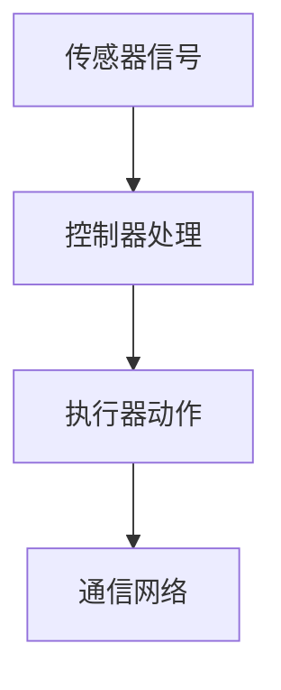

#### 4.2 工业机器人应用实例

工业机器人是工业制造中的关键设备，可以实现焊接、装配、搬运等任务。以下是几个工业机器人应用实例：

1. **焊接机器人**：焊接机器人用于焊接金属部件，可以实现高速、高质量的焊接。焊接机器人的主要技术包括机械结构设计、焊接参数控制和传感技术等。

2. **装配机器人**：装配机器人用于装配零部件，可以实现高速、高精度的装配。装配机器人的主要技术包括机械结构设计、传感器技术和控制算法等。

3. **搬运机器人**：搬运机器人用于搬运重物，可以实现高速、大范围的搬运。搬运机器人的主要技术包括自主导航、机械结构和控制算法等。

以下是工业机器人应用实例的Mermaid流程图：

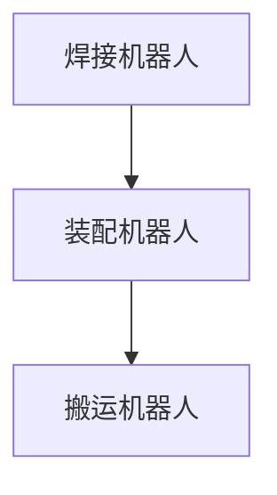

#### 4.3 生产线智能化升级

随着技术的发展，生产线智能化升级成为工业制造的重要趋势。生产线智能化升级包括以下几个方面：

1. **物联网技术**：通过物联网技术，可以实现生产线设备之间的互联互通，实现生产过程的实时监控和数据分析。
2. **大数据技术**：通过大数据技术，可以对生产过程中的数据进行收集、存储和分析，为生产决策提供支持。
3. **人工智能技术**：通过人工智能技术，可以实现生产线的自主决策和优化，提高生产效率和产品质量。

以下是生产线智能化升级的Mermaid流程图：

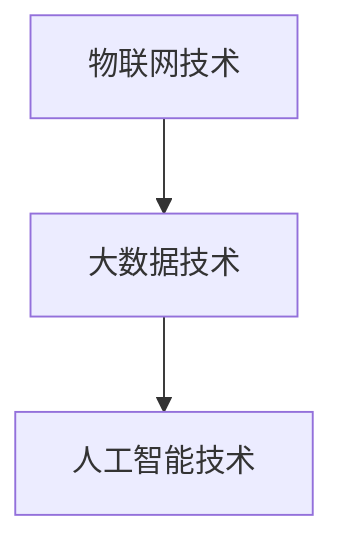

### 第5章：物流和仓储中的物理实体自动化

物流和仓储是物理实体自动化的另一个重要应用领域。本章将介绍物流和仓储中的物理实体自动化，包括自动化仓储系统、自动化物流配送系统和智能物流技术应用。

#### 5.1 自动化仓储系统

自动化仓储系统是物流和仓储领域的重要组成部分。一个典型的自动化仓储系统包括以下几个部分：

1. **入库系统**：用于将货物自动搬运到仓库中，通常包括自动导引车（AGV）或堆垛机等。
2. **存储系统**：用于存储货物，通常采用货架系统或自动化存储设备，如自动存储与检索系统（AS/RS）。
3. **出库系统**：用于将货物从仓库中自动搬运到配送中心或客户手中，同样包括AGV或堆垛机等。

以下是自动化仓储系统的Mermaid流程图：

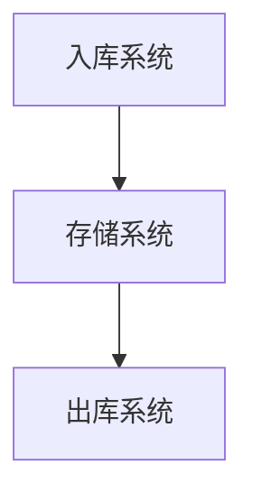

#### 5.2 自动化物流配送系统

自动化物流配送系统是物流行业的重要创新。一个典型的自动化物流配送系统包括以下几个部分：

1. **仓库管理系统**：用于管理仓库中的货物，包括入库、出库、库存管理等。
2. **运输管理系统**：用于管理运输过程中的货物，包括运输计划、路线规划、运输跟踪等。
3. **配送管理系统**：用于管理配送过程中的货物，包括配送计划、配送路径、配送确认等。

以下是自动化物流配送系统的Mermaid流程图：

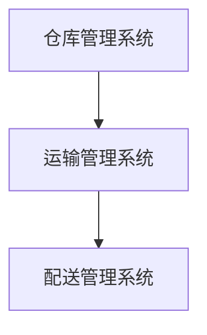

#### 5.3 智能物流技术应用

智能物流技术是物流和仓储领域的重要发展方向。智能物流技术包括以下几个方面：

1. **物联网技术**：通过物联网技术，可以实现物流设备之间的互联互通，实现货物的实时监控和追踪。
2. **大数据技术**：通过大数据技术，可以对物流过程中的数据进行收集、存储和分析，为物流决策提供支持。
3. **人工智能技术**：通过人工智能技术，可以实现物流过程的自主决策和优化，提高物流效率和降低成本。

以下是智能物流技术应用的Mermaid流程图：


### 第6章：农业和园林中的物理实体自动化

农业和园林是物理实体自动化的新兴应用领域。本章将介绍农业和园林中的物理实体自动化，包括农业自动化设备应用、园林自动化设备应用和农业智能化管理。

#### 6.1 农业自动化设备应用

农业自动化设备是提高农业生产效率的重要手段。农业自动化设备包括以下几个方面：

1. **播种机**：用于自动化播种，可以精确控制播种量和播种深度。
2. **喷灌系统**：用于自动化灌溉，可以根据土壤湿度自动调节灌溉量。
3. **收割机**：用于自动化收割，可以减少人力投入，提高收割效率。
4. **农药喷洒机**：用于自动化喷洒农药，可以精准控制农药使用量，减少环境污染。

以下是农业自动化设备应用的Mermaid流程图：

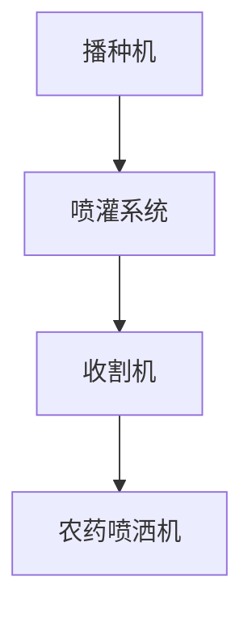

#### 6.2 园林自动化设备应用

园林自动化设备是园林维护和管理的重要工具。园林自动化设备包括以下几个方面：

1. **剪草机**：用于自动化剪草，可以节省人力，提高剪草效率。
2. **浇水系统**：用于自动化浇水，可以根据土壤湿度自动调节浇水时间。
3. **喷洒系统**：用于自动化喷洒农药和肥料，可以精准控制使用量。
4. **监控设备**：用于自动化监控，可以实时监控园林状况，及时发现问题。

以下是园林自动化设备应用的Mermaid流程图：

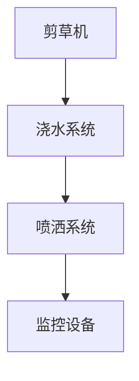

#### 6.3 农业智能化管理

农业智能化管理是现代农业的发展方向。农业智能化管理包括以下几个方面：

1. **传感器网络**：通过传感器网络实时监测农田土壤、气象、作物生长等数据。
2. **数据分析和决策支持**：通过对传感器数据进行分析，为农业生产提供决策支持，如灌溉时间、农药使用量等。
3. **自动化设备调度**：根据农业生产需求，自动化调度农业设备，实现生产过程的自动化和智能化。

以下是农业智能化管理的Mermaid流程图：

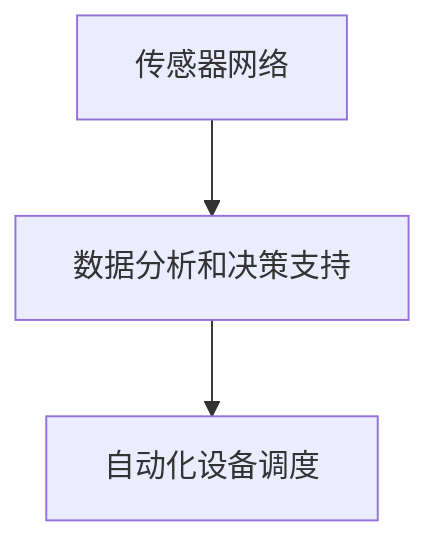

### 第7章：建筑和基础设施中的物理实体自动化

建筑和基础设施是物理实体自动化的重要应用领域。本章将介绍建筑和基础设施中的物理实体自动化，包括建筑自动化施工、智能建筑与城市基础设施和物理实体自动化的未来发展趋势。

#### 7.1 建筑自动化施工

建筑自动化施工是建筑行业的重要创新。建筑自动化施工包括以下几个方面：

1. **自动化施工设备**：如自动化挖掘机、自动化吊车、自动化混凝土泵车等，可以自动化完成建筑施工任务。
2. **自动化施工管理系统**：通过物联网技术、大数据技术和人工智能技术，实现施工过程的实时监控、数据分析和优化调度。
3. **自动化质量检测**：通过传感器技术和计算机视觉技术，自动化检测建筑质量，确保施工质量。

以下是建筑自动化施工的Mermaid流程图：

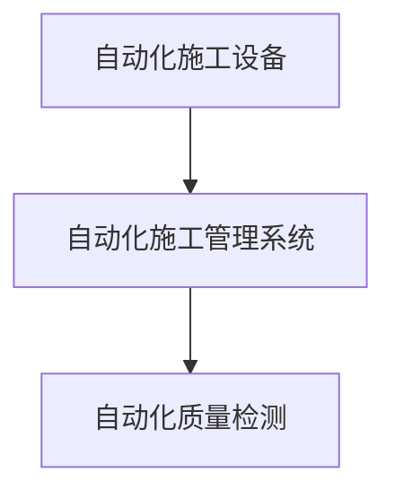

#### 7.2 智能建筑与城市基础设施

智能建筑与城市基础设施是建筑和基础设施领域的重要发展方向。智能建筑与城市基础设施包括以下几个方面：

1. **智能建筑控制系统**：通过物联网技术、传感器技术和云计算技术，实现建筑设备（如空调、照明、安防等）的自动化控制和智能管理。
2. **智能交通系统**：通过物联网技术、大数据技术和人工智能技术，实现交通流量监测、信号控制和智能调度，提高交通效率。
3. **城市基础设施管理**：通过物联网技术、大数据技术和人工智能技术，实现城市基础设施（如供水、供电、排水等）的智能管理和运维。

以下是智能建筑与城市基础设施的Mermaid流程图：

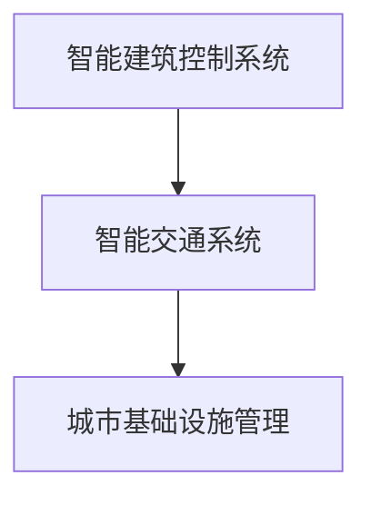

#### 7.3 物理实体自动化的未来发展趋势

物理实体自动化在建筑和基础设施领域的应用前景广阔，未来发展趋势包括以下几个方面：

1. **技术融合**：将物联网技术、大数据技术、人工智能技术、区块链技术等融合到物理实体自动化中，实现更智能、更高效、更安全的自动化系统。
2. **跨领域应用**：物理实体自动化将不断向更多领域扩展，如医疗、教育、金融服务等，实现更广泛的应用。
3. **可持续发展**：物理实体自动化将注重可持续发展，通过自动化技术降低能源消耗、减少环境污染，实现绿色、低碳、可持续的发展。

以下是物理实体自动化的未来发展趋势的Mermaid流程图：

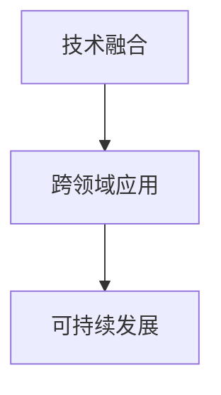

### 第8章：物理实体自动化对社会和经济的影响

物理实体自动化对社会和经济产生了深远的影响。本章将探讨物理实体自动化对社会生活的影响、对经济的影响以及物理实体自动化政策与法规。

#### 8.1 物理实体自动化对社会生活的影响

物理实体自动化对社会生活的影响主要体现在以下几个方面：

1. **生产方式的变革**：物理实体自动化改变了传统的生产方式，从人力密集型向自动化、智能化转变，提高了生产效率和质量。
2. **生活质量的提高**：物理实体自动化带来了更高效、更便捷的服务，如智能家居、智能交通等，提高了人们的生活质量。
3. **就业结构的调整**：物理实体自动化部分替代了传统的劳动力，导致就业结构发生变化，需要更多的技术人才和管理人才。

以下是物理实体自动化对社会生活影响的Mermaid流程图：

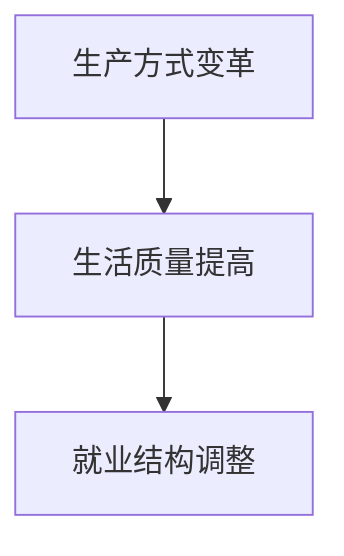

#### 8.2 物理实体自动化对经济的影响

物理实体自动化对经济产生了重要影响，主要体现在以下几个方面：

1. **提高生产效率**：物理实体自动化提高了生产效率，减少了生产成本，提高了企业的竞争力。
2. **降低成本**：物理实体自动化减少了人力投入，降低了生产成本，有利于企业降低价格，提高市场份额。
3. **促进产业升级**：物理实体自动化推动了传统产业的升级和转型，促进了新兴产业的快速发展。
4. **推动经济增长**：物理实体自动化促进了技术创新和产业升级，推动了经济的持续增长。

以下是物理实体自动化对经济影响的Mermaid流程图：

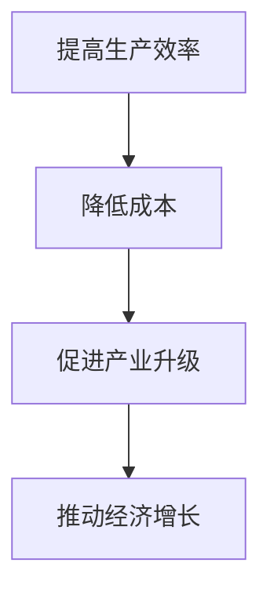

#### 8.3 物理实体自动化政策与法规

物理实体自动化的发展需要政策与法规的支持。政策与法规对物理实体自动化的影响主要体现在以下几个方面：

1. **技术研发支持**：政府通过资金支持、税收优惠等政策，鼓励企业进行物理实体自动化技术研发和应用。
2. **标准制定**：政府制定相关标准和规范，确保物理实体自动化系统的安全、可靠和互操作性。
3. **人才培养**：政府通过教育政策，培养更多的物理实体自动化专业人才，以满足产业发展需求。
4. **监管制度**：政府建立健全的监管制度，确保物理实体自动化系统的合规性和安全性。

以下是物理实体自动化政策与法规的Mermaid流程图：

```mermaid
graph TD
    A[技术研发支持] --> B[标准制定]
    B --> C[人才培养]
    C --> D[监管制度]
```

### 第9章：物理实体自动化的技术创新与趋势

物理实体自动化的发展离不开技术创新。本章将探讨物理实体自动化的技术创新、人工智能与物理实体自动化的结合以及物理实体自动化的未来研究方向。

#### 9.1 新型传感器与控制技术

新型传感器与控制技术是物理实体自动化的重要发展方向。新型传感器具有高精度、高灵敏度、高抗干扰能力等特点，可以更好地满足自动化系统的需求。控制技术也在不断进步，如自适应控制、模糊控制、神经网络控制等，提高了自动化系统的控制性能。

以下是新型传感器与控制技术的Mermaid流程图：

```mermaid
graph TD
    A[新型传感器技术] --> B[控制技术]
```

#### 9.2 人工智能与物理实体自动化

人工智能技术在物理实体自动化中的应用日益广泛。通过人工智能技术，可以实现自动化系统的智能决策、自适应学习和优化控制。人工智能与物理实体自动化的结合，将推动自动化系统的智能化、自主化发展。

以下是人工智能与物理实体自动化的Mermaid流程图：

```mermaid
graph TD
    A[人工智能技术] --> B[物理实体自动化]
```

#### 9.3 物理实体自动化的未来研究方向

物理实体自动化的未来研究方向包括以下几个方面：

1. **系统集成与协同控制**：如何更好地实现自动化系统的系统集成与协同控制，提高系统的整体性能。
2. **智能决策与优化**：如何通过人工智能技术实现自动化系统的智能决策和优化控制，提高系统的自主性和适应性。
3. **安全性保障**：如何确保自动化系统的安全性，防止系统故障和人为干预带来的风险。
4. **跨领域应用**：如何将物理实体自动化技术应用于更多领域，实现更广泛的应用。

以下是物理实体自动化的未来研究方向的Mermaid流程图：

```mermaid
graph TD
    A[系统集成与协同控制] --> B[智能决策与优化]
    B --> C[安全性保障]
    C --> D[跨领域应用]
```

### 第10章：物理实体自动化的跨领域应用与挑战

物理实体自动化的跨领域应用带来了巨大的机遇，同时也面临许多挑战。本章将探讨物理实体自动化的跨领域应用、面临的挑战以及可持续发展与生态平衡。

#### 10.1 跨领域物理实体自动化的挑战与机遇

物理实体自动化的跨领域应用包括医疗、教育、金融、能源等多个领域。跨领域应用带来了以下挑战与机遇：

1. **挑战**：
   - 技术融合与标准化：跨领域应用需要不同领域技术的融合和标准化，提高系统的兼容性和互操作性。
   - 数据安全与隐私保护：跨领域应用需要处理大量的敏感数据，如何确保数据安全和隐私保护是重要挑战。
   - 适应性与灵活性：不同领域的应用场景和需求差异较大，如何设计出适应性强、灵活性高的自动化系统是关键。

2. **机遇**：
   - 提高生产效率和服务质量：跨领域应用可以大大提高各领域的生产效率和服务质量，降低成本。
   - 创新与产业升级：跨领域应用可以推动技术创新和产业升级，促进新兴产业的快速发展。

以下是跨领域物理实体自动化的挑战与机遇的Mermaid流程图：

```mermaid
graph TD
    A[技术融合与标准化] --> B[数据安全与隐私保护]
    B --> C[适应性与灵活性]
    C --> D[提高生产效率和服务质量]
    D --> E[创新与产业升级]
```

#### 10.2 物理实体自动化在新兴领域的应用

物理实体自动化在新兴领域的应用前景广阔，以下是几个典型领域：

1. **医疗领域**：物理实体自动化在医疗领域有广泛应用，如手术机器人、医疗辅助机器人、自动化药房等。这些应用可以提高医疗质量、降低医疗成本、减少医生劳动强度。

2. **教育领域**：物理实体自动化在教育领域有广泛应用，如智能课堂、教育机器人、在线教育平台等。这些应用可以提升教育质量、降低教育成本、提高学生参与度。

3. **金融领域**：物理实体自动化在金融领域有广泛应用，如智能投顾、自动化交易、反欺诈系统等。这些应用可以提高金融效率、降低金融风险、提高客户满意度。

以下是物理实体自动化在新兴领域的应用的Mermaid流程图：

```mermaid
graph TD
    A[医疗领域] --> B[教育领域]
    B --> C[金融领域]
```

#### 10.3 物理实体自动化的可持续发展与生态平衡

物理实体自动化的可持续发展是确保其长期健康发展的关键。可持续发展与生态平衡包括以下几个方面：

1. **绿色制造**：通过物理实体自动化实现绿色制造，降低能源消耗、减少废弃物排放，实现环保和可持续发展。

2. **循环经济**：通过物理实体自动化实现循环经济，提高资源利用效率，降低资源消耗，实现可持续发展。

3. **生态平衡**：通过物理实体自动化实现生态平衡，保护生态环境，促进人与自然的和谐发展。

以下是物理实体自动化的可持续发展与生态平衡的Mermaid流程图：

```mermaid
graph TD
    A[绿色制造] --> B[循环经济]
    B --> C[生态平衡]
```

### 附录

#### 附录 A：物理实体自动化资源与工具

1. **常用自动化控制系统与设备**：介绍常用的自动化控制系统与设备，如PLC、机器人控制器、传感器等。
2. **自动化技术相关书籍与论文**：推荐一些自动化技术相关的书籍和论文，帮助读者深入了解物理实体自动化的理论和技术。
3. **物理实体自动化学习平台与资源**：介绍一些物理实体自动化的学习平台和资源，如在线课程、论坛、研讨会等。

#### 附录 B：物理实体自动化项目实例

1. **工业自动化生产线案例**：介绍一个工业自动化生产线的实际案例，包括系统设计、设备选型、软件编程等。
2. **自动化物流系统案例**：介绍一个自动化物流系统的实际案例，包括系统设计、传感器选型、数据处理等。
3. **农业自动化设备案例**：介绍一个农业自动化设备的实际案例，包括设备设计、技术特点、应用效果等。
4. **建筑自动化施工案例**：介绍一个建筑自动化施工的实际案例，包括施工方案、技术特点、实施效果等。

