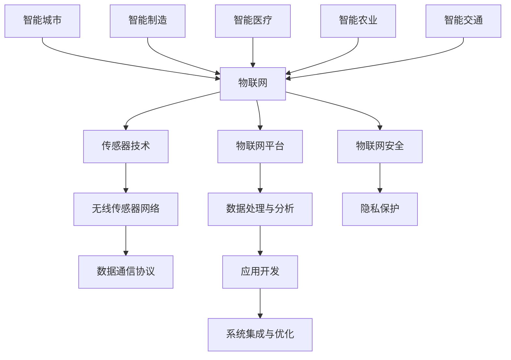

                 

# 物联网(IoT)技术和各种传感器设备的集成：概要与基础

> 关键词：物联网，传感器，集成，技术，应用，发展

> 摘要：本文系统地介绍了物联网（IoT）技术和各种传感器设备的集成。首先，从基础概念出发，详细解析了物联网的定义、发展历程、核心技术与应用场景。接着，深入探讨了传感器技术的基础知识，包括传感器的基本概念、类型、信号处理以及精度与可靠性。随后，阐述了物联网与传感器集成的原理，分析了物联网架构、传感器数据通信协议、安全与隐私保护以及集成过程中的挑战和解决方案。在此基础上，进一步探讨了无线传感器网络（WSN）技术、物联网平台与开发工具、物联网安全等方面的内容。最后，通过实际案例研究和应用开发，展示了物联网与传感器设备集成的实践应用，并对未来发展进行了展望。本文旨在为读者提供一个全面、系统的物联网与传感器设备集成技术指南。

## 第一部分：基础知识

### 第1章：物联网（IoT）概述

#### 1.1 物联网的定义与发展历程

物联网（Internet of Things，简称IoT）是指通过互联网将各种设备连接起来，实现数据的交换和通信，从而实现智能化管理和控制。物联网的发展历程可以分为以下几个阶段：

1. **1.1.1 从软件1.0到软件2.0的演进**：软件1.0时代主要是指桌面软件，而软件2.0则是随着互联网的兴起，软件开始通过网络进行分发和使用。

2. **1.1.2 大模型在软件2.0中的核心地位**：大模型在软件2.0中扮演着重要的角色，它们能够通过机器学习和人工智能技术，对海量数据进行处理和分析，提供智能化的服务。

3. **1.1.3 企业级应用开发的新范式**：随着物联网和传感器设备的普及，企业级应用开发开始向更加智能化、自动化的方向发展。

#### 1.2 物联网的核心技术

物联网的核心技术包括传感器技术、无线通信技术、网络技术、数据处理与分析技术等。以下是物联网核心技术的详细介绍：

1. **1.2.1 传感器技术**：传感器是物联网系统中的基本组件，用于收集环境数据。常见的传感器类型包括温度传感器、湿度传感器、压力传感器、光线传感器等。

2. **1.2.2 无线通信技术**：无线通信技术是实现物联网设备之间数据传输的关键技术。常见的无线通信技术包括Wi-Fi、蓝牙、ZigBee、LoRa等。

3. **1.2.3 网络技术**：物联网系统通常采用TCP/IP协议栈，通过网络将各种设备连接起来，实现数据的交换和通信。

4. **1.2.4 数据处理与分析技术**：物联网设备收集的数据需要进行处理和分析，以提取有价值的信息。常用的数据处理与分析技术包括数据清洗、数据存储、数据挖掘、机器学习等。

#### 1.3 物联网的应用场景

物联网技术广泛应用于智能家居、智能交通、智能医疗、智能农业、工业自动化等多个领域。以下是物联网在不同应用场景中的具体应用：

1. **1.3.1 智能家居**：物联网技术可以实现家庭设备的互联互通，如智能门锁、智能灯光、智能空调等，为用户提供便捷、智能的生活体验。

2. **1.3.2 智能交通**：物联网技术可以实现对交通数据的实时监控和分析，优化交通流量，提高交通效率，如智能交通信号灯、智能停车等。

3. **1.3.3 智能医疗**：物联网技术可以实现对医疗数据的实时监测和分析，提高医疗服务的质量，如远程医疗、智能穿戴设备等。

4. **1.3.4 智能农业**：物联网技术可以实现对农田环境的实时监测和管理，提高农业生产效率，如智能灌溉系统、智能气象监测等。

5. **1.3.5 工业自动化**：物联网技术可以实现对生产过程的实时监控和自动化控制，提高生产效率和质量，如智能工厂、智能机器人等。

#### 1.4 物联网的挑战与机遇

物联网的发展面临着诸多挑战和机遇。以下是物联网发展过程中需要关注的关键问题：

1. **1.4.1 安全与隐私保护**：物联网设备数量庞大，数据传输过程中容易受到网络攻击和隐私泄露的风险。需要建立完善的安全体系和隐私保护机制。

2. **1.4.2 数据处理与分析能力**：物联网设备收集的数据量庞大，需要具备强大的数据处理与分析能力，以提取有价值的信息。

3. **1.4.3 网络稳定性与可靠性**：物联网设备通常分布在不同的地理位置，需要确保网络的稳定性和可靠性，以保证数据的实时传输。

4. **1.4.4 标准化与兼容性**：物联网技术的发展需要建立统一的标准，以提高设备的兼容性和互操作性。

5. **1.4.5 成本与可持续发展**：物联网技术的发展需要降低设备成本，同时确保可持续发展，以满足不同应用场景的需求。

### 第2章：传感器技术基础

#### 2.1 传感器的基本概念

传感器是一种能够感受规定的被测量并按照一定的规律转换成可用输出信号的器件或装置。传感器的基本组成包括敏感元件、转换元件和指示元件。

1. **2.1.1 敏感元件**：敏感元件是传感器的核心部分，用于感知被测量。

2. **2.1.2 转换元件**：转换元件用于将被测量转换为电信号或其他可用信号。

3. **2.1.3 指示元件**：指示元件用于显示被测量的数值或状态。

#### 2.2 常见传感器类型

传感器种类繁多，常见的传感器类型包括：

1. **2.2.1 温度传感器**：温度传感器用于测量温度，常见的类型有热电偶、热敏电阻、红外传感器等。

2. **2.2.2 湿度传感器**：湿度传感器用于测量湿度，常见的类型有电容式湿度传感器、电阻式湿度传感器等。

3. **2.2.3 压力传感器**：压力传感器用于测量压力，常见的类型有弹性元件式、压阻式、电容式等。

4. **2.2.4 光线传感器**：光线传感器用于测量光线强度，常见的类型有光敏电阻、光敏二极管等。

5. **2.2.5 气体传感器**：气体传感器用于检测特定气体，常见的类型有半导体气体传感器、电化学气体传感器等。

6. **2.2.6 视觉传感器**：视觉传感器用于捕捉图像，常见的类型有摄像头、红外摄像头等。

#### 2.3 传感器的信号处理

传感器的信号处理包括信号的采集、处理和输出。以下是传感器的信号处理过程：

1. **2.3.1 信号的采集**：传感器将物理量的变化转换为电信号。

2. **2.3.2 信号的处理**：通过放大、滤波、调制等手段，对传感器信号进行预处理。

3. **2.3.3 信号的输出**：将处理后的信号输出给控制器或显示设备。

#### 2.4 传感器的精度与可靠性

传感器的精度与可靠性是评估传感器性能的重要指标。以下是影响传感器精度与可靠性的因素：

1. **2.4.1 环境因素**：传感器的精度和可靠性受环境温度、湿度、光照等环境因素的影响。

2. **2.4.2 机械因素**：传感器的机械结构设计、安装方式等会影响传感器的精度和可靠性。

3. **2.4.3 信号处理算法**：传感器的信号处理算法会影响传感器的精度和可靠性。

4. **2.4.4 材料因素**：传感器的材料选择会影响传感器的精度和可靠性。

### 第3章：物联网与传感器集成原理

#### 3.1 物联网架构与传感器角色

物联网的架构可以分为感知层、网络层和应用层。传感器在物联网系统中扮演着关键角色，用于收集环境数据。

1. **3.1.1 感知层**：感知层由各种传感器组成，用于收集环境数据。

2. **3.1.2 网络层**：网络层负责传输和存储数据，通常采用无线网络技术。

3. **3.1.3 应用层**：应用层提供各种应用场景，如智能家居、智能交通等。

#### 3.2 传感器数据通信协议

传感器数据通信协议是实现传感器与物联网平台之间数据传输的关键。以下是常见的传感器数据通信协议：

1. **3.2.1 Wi-Fi**：Wi-Fi是一种无线网络通信协议，具有较高的传输速率和稳定性。

2. **3.2.2 蓝牙**：蓝牙是一种短距离无线通信协议，常用于设备之间的数据传输。

3. **3.2.3 ZigBee**：ZigBee是一种低功耗、低速率的无线通信协议，适用于物联网设备之间的数据传输。

4. **3.2.4 LoRa**：LoRa是一种长距离、低功耗的无线通信协议，适用于物联网设备之间的远程数据传输。

#### 3.3 物联网安全与隐私保护

物联网安全与隐私保护是物联网发展的关键问题。以下是物联网安全与隐私保护的关键措施：

1. **3.3.1 加密与认证**：采用加密和认证技术，确保数据传输的安全性和隐私性。

2. **3.3.2 访问控制**：通过访问控制机制，限制对物联网设备的非法访问。

3. **3.3.3 数据安全**：采用数据加密、压缩和去重等技术，确保数据的安全性和可靠性。

4. **3.3.4 隐私保护**：采用隐私保护技术，如数据匿名化、数据共享协议等，保护用户隐私。

#### 3.4 物联网与传感器集成的挑战与解决方案

物联网与传感器集成面临着诸多挑战，如数据量大、通信复杂、安全性要求高等。以下是物联网与传感器集成的挑战与解决方案：

1. **3.4.1 数据量大**：采用数据压缩、数据聚合等技术，降低数据传输量和存储需求。

2. **3.4.2 通信复杂**：采用网络分层、多协议融合等技术，提高通信效率和稳定性。

3. **3.4.3 安全性要求高**：采用加密、认证、访问控制等技术，确保数据传输的安全性和隐私性。

4. **3.4.4 系统可靠性**：采用冗余设计、故障检测与恢复等技术，提高系统的可靠性。

## 第二部分：技术深入

### 第4章：无线传感器网络（WSN）技术

#### 4.1 WSN的基本架构

无线传感器网络（Wireless Sensor Network，简称WSN）是由大量的传感器节点组成的分布式网络，用于收集和处理环境信息。WSN的基本架构可以分为三个层次：感知层、网络层和应用层。

1. **4.1.1 感知层**：感知层由传感器节点组成，用于收集环境信息。传感器节点通常包括传感器、处理单元、通信模块和电源模块。

2. **4.1.2 网络层**：网络层负责将感知层收集到的信息传输到应用层。网络层通常采用多跳传输的方式，通过无线通信网络将传感器节点连接起来。

3. **4.1.3 应用层**：应用层负责处理和分析网络层传输的数据，并根据应用需求提供相应的服务。

#### 4.2 节能协议与算法

无线传感器网络（WSN）中的传感器节点通常具有有限的能量，因此节能是WSN设计的关键问题。以下是几种常见的节能协议与算法：

1. **4.2.1 LEACH协议**：LEACH（Low-Energy Adaptive Clustering Hierarchy）是一种基于分簇的节能协议，它通过随机选择簇头节点来平衡网络中的能量消耗。

2. **4.2.2 GBN协议**：GBN（Gateway-based Node Deployment）协议通过优化传感器节点的部署策略，减少通信过程中的能量消耗。

3. **4.2.3 能量感知路由算法**：能量感知路由算法通过考虑节点的剩余能量，选择最优的传输路径，从而延长网络寿命。

#### 4.3 数据聚合与压缩

无线传感器网络（WSN）中数据聚合与压缩技术用于减少传输的数据量，提高网络效率。以下是几种常见的数据聚合与压缩技术：

1. **4.3.1 数据聚合**：数据聚合技术通过将多个传感器节点的数据合并为一个数据包，减少数据传输量。

2. **4.3.2 数据压缩**：数据压缩技术通过压缩算法将数据压缩为更小的数据包，减少数据传输量。

3. **4.3.3 数据去重**：数据去重技术用于去除重复数据，减少数据传输量。

#### 4.4 WSN中的隐私保护

无线传感器网络（WSN）中的隐私保护是确保传感器节点数据安全的重要问题。以下是几种常见的隐私保护技术：

1. **4.4.1 加密**：加密技术用于保护传感器节点之间的数据传输，防止数据被窃取或篡改。

2. **4.4.2 匿名化**：匿名化技术通过替换真实身份信息，保护传感器节点的隐私。

3. **4.4.3 隐私协议**：隐私协议通过加密和访问控制机制，确保传感器节点的数据在传输和应用过程中得到保护。

### 第5章：物联网平台与开发工具

#### 5.1 物联网平台概述

物联网平台是连接物联网设备和云端的桥梁，它提供了设备管理、数据存储、数据处理和可视化等功能。以下是几种常见的物联网平台：

1. **5.1.1 阿里云物联网平台**：阿里云物联网平台提供了设备管理、数据存储、数据处理和可视化等功能，支持多种设备和协议。

2. **5.1.2 华为云物联网平台**：华为云物联网平台提供了设备管理、数据采集、数据处理和可视化等功能，支持多种物联网协议和标准。

3. **5.1.3 AWS IoT平台**：AWS IoT平台提供了设备管理、数据存储、数据处理和可视化等功能，支持AWS云服务和其他AWS平台的集成。

#### 5.2 开发工具与环境

物联网开发工具与环境是开发者进行物联网应用开发的基础。以下是几种常见的物联网开发工具与环境：

1. **5.2.1 Arduino**：Arduino是一款开源的物联网开发平台，提供了丰富的传感器和开发工具，适用于初学者和专业人士。

2. **5.2.2 Raspberry Pi**：Raspberry Pi是一款低成本、低功耗的单板计算机，适用于物联网设备开发和实验。

3. **5.2.3 Node-RED**：Node-RED是一款基于Node.js的物联网开发工具，提供了可视化编程界面，适用于物联网应用的开发。

#### 5.3 物联网平台的集成与应用

物联网平台的集成与应用是物联网开发的关键环节。以下是物联网平台集成与应用的几个关键步骤：

1. **5.3.1 设备接入**：将物联网设备接入物联网平台，实现设备的管理和监控。

2. **5.3.2 数据采集**：通过传感器和设备采集数据，并将数据上传到物联网平台。

3. **5.3.3 数据处理**：在物联网平台上对采集到的数据进行处理、分析和存储。

4. **5.3.4 应用开发**：基于物联网平台提供的API和SDK，开发物联网应用，实现特定的功能。

#### 5.4 物联网平台的挑战与趋势

物联网平台的挑战与趋势是物联网发展的重要方向。以下是物联网平台面临的挑战和趋势：

1. **5.4.1 安全性**：随着物联网设备数量的增加，安全性问题日益突出，物联网平台需要提供更强大的安全保护措施。

2. **5.4.2 可扩展性**：物联网平台需要支持大规模设备的接入和数据处理，提供更高的可扩展性。

3. **5.4.3 智能化**：物联网平台需要具备更高的智能化水平，通过机器学习和人工智能技术，实现自动化的数据分析和决策。

4. **5.4.4 开放性**：物联网平台需要具备更高的开放性，支持与其他平台和应用的集成，提供更丰富的功能和接口。

### 第6章：物联网安全

#### 6.1 物联网安全的挑战

物联网安全面临着诸多挑战，包括设备安全、通信安全、数据安全等。以下是物联网安全面临的几个关键挑战：

1. **6.1.1 设备安全**：物联网设备通常具有有限的计算资源和存储空间，容易受到网络攻击和恶意软件的感染。

2. **6.1.2 通信安全**：物联网设备之间的通信通常使用无线网络，容易受到网络攻击和数据窃取。

3. **6.1.3 数据安全**：物联网设备收集和传输的数据可能包含敏感信息，如个人身份信息、金融数据等，需要确保数据的安全性和隐私性。

#### 6.2 安全协议与机制

为了应对物联网安全挑战，需要采用一系列安全协议与机制。以下是几种常见的物联网安全协议与机制：

1. **6.2.1 认证与授权**：通过认证和授权机制，确保只有授权用户才能访问物联网设备和数据。

2. **6.2.2 加密**：通过加密技术，保护物联网设备之间的数据传输，防止数据被窃取或篡改。

3. **6.2.3 访问控制**：通过访问控制机制，限制对物联网设备的非法访问，确保数据的安全性和隐私性。

4. **6.2.4 安全监控与审计**：通过安全监控和审计机制，实时监测物联网设备和数据的安全状况，及时发现和应对安全威胁。

#### 6.3 硬件安全措施

物联网设备的安全防护不仅需要软件层面的安全措施，还需要硬件层面的安全措施。以下是几种常见的硬件安全措施：

1. **6.3.1 安全芯片**：采用安全芯片，为物联网设备提供硬件级别的安全保护，如加密、认证、存储等。

2. **6.3.2 生物特征识别**：通过生物特征识别技术，如指纹、人脸等，实现物联网设备的身份认证和访问控制。

3. **6.3.3 硬件防火墙**：通过硬件防火墙，隔离物联网设备与外部网络，防止网络攻击和数据窃取。

4. **6.3.4 物理安全保护**：通过物理安全保护措施，如防拆封标签、安全包装等，防止物联网设备被盗取或篡改。

#### 6.4 安全态势感知与响应

安全态势感知与响应是物联网安全体系的重要组成部分。以下是安全态势感知与响应的关键环节：

1. **6.4.1 安全态势感知**：通过收集和分析物联网设备和网络的数据，实时监测物联网设备的安全状况，识别潜在的安全威胁。

2. **6.4.2 安全事件响应**：在发现安全威胁后，及时采取措施，如隔离、阻止、报警等，防止安全威胁扩大。

3. **6.4.3 安全应急演练**：定期进行安全应急演练，提高安全人员应对安全事件的能力，确保物联网系统的安全性和可靠性。

## 第三部分：应用实践

### 第7章：物联网与传感器设备集成案例研究

#### 7.1 农业智能监测与管理系统

农业智能监测与管理系统利用物联网技术和传感器设备，实现对农业生产环境的实时监测和管理。以下是一个农业智能监测与管理系统案例：

1. **7.1.1 系统架构**：系统架构包括感知层、网络层和应用层。感知层由土壤湿度传感器、温度传感器、光照传感器等组成，网络层由无线通信网络组成，应用层包括数据采集平台、数据处理平台和智能决策平台。

2. **7.1.2 数据采集与传输**：传感器节点将采集到的环境数据传输到数据采集平台，数据采集平台通过无线通信网络将数据上传到数据处理平台。

3. **7.1.3 数据处理与智能决策**：数据处理平台对采集到的数据进行处理和分析，生成智能决策模型，指导农业生产。

#### 7.2 智能家居系统

智能家居系统利用物联网技术和传感器设备，实现家庭设备的智能化管理和控制。以下是一个智能家居系统案例：

1. **7.2.1 系统架构**：系统架构包括感知层、网络层和应用层。感知层由智能门锁、智能灯光、智能空调等组成，网络层由无线通信网络组成，应用层包括智能家居控制平台和用户界面。

2. **7.2.2 数据采集与控制**：传感器节点将采集到的环境数据传输到智能家居控制平台，用户可以通过用户界面远程控制家庭设备。

3. **7.2.3 数据分析与优化**：智能家居控制平台对采集到的数据进行分析，优化家庭设备的工作状态，提高能源利用效率。

#### 7.3 智能交通系统

智能交通系统利用物联网技术和传感器设备，实现交通数据的实时监控和智能调度。以下是一个智能交通系统案例：

1. **7.3.1 系统架构**：系统架构包括感知层、网络层和应用层。感知层由交通传感器、摄像头等组成，网络层由无线通信网络组成，应用层包括交通监控平台和交通调度中心。

2. **7.3.2 数据采集与传输**：交通传感器和摄像头将采集到的交通数据传输到交通监控平台，交通监控平台通过无线通信网络将数据上传到交通调度中心。

3. **7.3.3 数据分析与调度**：交通调度中心对采集到的数据进行处理和分析，生成交通调度策略，优化交通流量。

#### 7.4 健康监测系统

健康监测系统利用物联网技术和传感器设备，实现个人健康状况的实时监测和管理。以下是一个健康监测系统案例：

1. **7.4.1 系统架构**：系统架构包括感知层、网络层和应用层。感知层由智能手环、智能血压计等组成，网络层由无线通信网络组成，应用层包括健康监测平台和医生工作站。

2. **7.4.2 数据采集与传输**：传感器节点将采集到的健康数据传输到健康监测平台，健康监测平台通过无线通信网络将数据上传到医生工作站。

3. **7.4.3 数据分析与预警**：健康监测平台对采集到的数据进行分析，生成健康报告，预警潜在的健康问题。

### 第8章：物联网与传感器设备的集成应用开发

#### 8.1 应用开发流程

物联网与传感器设备的集成应用开发通常包括以下几个步骤：

1. **8.1.1 需求分析**：明确应用场景和功能需求。

2. **8.1.2 设备选型**：根据需求选择合适的传感器和物联网设备。

3. **8.1.3 系统设计**：设计系统的架构和通信协议。

4. **8.1.4 软件开发**：开发应用程序，实现设备管理和数据采集等功能。

5. **8.1.5 系统集成**：将物联网平台和传感器设备集成到系统中。

6. **8.1.6 测试与优化**：对系统进行测试和优化，确保其稳定性和可靠性。

#### 8.2 传感器数据采集与处理

传感器数据采集与处理是物联网应用开发的核心环节。以下是传感器数据采集与处理的关键步骤：

1. **8.2.1 数据采集**：通过传感器节点采集环境数据，如温度、湿度、光照等。

2. **8.2.2 数据传输**：将采集到的数据通过无线通信网络传输到物联网平台。

3. **8.2.3 数据预处理**：对采集到的数据进行预处理，如去噪、滤波等。

4. **8.2.4 数据存储**：将预处理后的数据存储到数据库或文件系统中。

5. **8.2.5 数据分析**：对存储的数据进行统计分析，提取有价值的信息。

6. **8.2.6 数据可视化**：将分析结果通过图表、报表等形式进行可视化展示。

#### 8.3 系统集成与优化

系统集成与优化是物联网应用开发的重要环节。以下是系统集成与优化的关键步骤：

1. **8.3.1 系统集成**：将物联网平台、传感器设备、数据处理系统等集成到系统中，确保各个组件之间能够协同工作。

2. **8.3.2 系统优化**：通过优化算法、调整参数等手段，提高系统的性能和效率。

3. **8.3.3 系统测试**：对系统进行测试，验证系统的功能、性能和稳定性。

4. **8.3.4 系统部署**：将系统部署到实际应用场景中，进行实际运行测试。

5. **8.3.5 系统维护**：对系统进行维护和升级，确保系统的长期稳定运行。

#### 8.4 开发实战案例与分析

以下是几个物联网与传感器设备集成应用开发的实战案例与分析：

1. **8.4.1 智能农业监测系统**：开发一个智能农业监测系统，实现对农田环境的实时监测和管理，提高农业生产效率。

2. **8.4.2 智能家居系统**：开发一个智能家居系统，实现对家庭设备的智能化管理和控制，提高生活品质。

3. **8.4.3 智能交通监控系统**：开发一个智能交通监控系统，实现对交通数据的实时监控和智能调度，提高交通效率。

4. **8.4.4 健康监测系统**：开发一个健康监测系统，实现对个人健康状况的实时监测和管理，预防疾病发生。

### 第9章：未来趋势与展望

#### 9.1 物联网与传感器技术的发展趋势

物联网与传感器技术在未来将继续发展，以下是几个主要趋势：

1. **9.1.1 物联网设备的普及**：随着技术的进步和成本的降低，物联网设备将在各个领域得到广泛应用。

2. **9.1.2 智能化水平的提升**：物联网设备和传感器将具备更高的智能化水平，能够更好地理解和响应人类需求。

3. **9.1.3 数据价值的挖掘**：物联网设备和传感器收集的大量数据将成为宝贵资源，通过大数据分析和人工智能技术，将产生巨大的商业价值。

4. **9.1.4 集成技术的创新与应用**：物联网与传感器技术的集成将不断创新，应用场景将更加丰富和多样化。

5. **9.1.5 安全与隐私保护**：随着物联网设备的普及，安全与隐私保护将越来越重要，需要建立完善的安全体系和隐私保护机制。

#### 9.2 集成技术的创新与应用

物联网与传感器技术的集成将不断创新，以下是几个创新与应用领域：

1. **9.2.1 智能城市**：利用物联网和传感器技术，实现城市管理的智能化，提高城市运行效率和生活品质。

2. **9.2.2 智能制造**：利用物联网和传感器技术，实现生产过程的自动化和智能化，提高生产效率和质量。

3. **9.2.3 智能医疗**：利用物联网和传感器技术，实现医疗数据的实时监控和分析，提高医疗服务质量和效率。

4. **9.2.4 智能农业**：利用物联网和传感器技术，实现农业生产环境的实时监测和管理，提高农业生产效率和产品质量。

5. **9.2.5 智能交通**：利用物联网和传感器技术，实现交通数据的实时监控和智能调度，提高交通效率和安全性。

#### 9.3 物联网与传感器设备集成对社会的影响

物联网与传感器设备的集成将对社会产生深远的影响，以下是几个方面：

1. **9.3.1 提高生产效率**：物联网和传感器技术的应用，可以实现对生产过程的实时监控和智能调度，提高生产效率和质量。

2. **9.3.2 改善生活质量**：物联网和传感器技术的应用，可以实现对家庭、医疗、交通等领域的智能化管理和控制，提高生活品质。

3. **9.3.3 促进经济发展**：物联网和传感器技术的应用，可以带动相关产业的发展，创造就业机会，促进经济增长。

4. **9.3.4 推动社会进步**：物联网和传感器技术的应用，可以推动社会向更加智能化、可持续化的方向发展。

#### 9.4 潜在的挑战与机遇

物联网与传感器设备的集成在发展过程中也将面临一些挑战和机遇，以下是几个方面：

1. **9.4.1 安全与隐私保护**：随着物联网设备的普及，安全与隐私保护将成为重要挑战，需要建立完善的安全体系和隐私保护机制。

2. **9.4.2 数据处理与分析能力**：物联网设备和传感器将产生大量数据，需要具备强大的数据处理和分析能力，以提取有价值的信息。

3. **9.4.3 网络稳定性与可靠性**：物联网设备通常分布在不同的地理位置，需要确保网络的稳定性和可靠性，以保证数据的实时传输。

4. **9.4.4 成本与可持续发展**：物联网技术的发展需要降低设备成本，同时确保可持续发展，以满足不同应用场景的需求。

5. **9.4.5 标准化与兼容性**：物联网技术的发展需要建立统一的标准，以提高设备的兼容性和互操作性。

## 附录

### 附录 A: 物联网开发工具与资源

附录部分将介绍一些常用的物联网开发工具与资源，以帮助开发者更好地进行物联网应用开发。

1. **附录 A.1: 物联网平台**：介绍常用的物联网平台，如阿里云物联网平台、华为云物联网平台、AWS IoT平台等。

2. **附录 A.2: 开发工具**：介绍物联网开发中常用的工具，如Arduino、Raspberry Pi、Node-RED等。

3. **附录 A.3: 开发资源**：提供一些物联网开发的教程、案例和社区资源，以帮助开发者快速入门和提高开发能力。

### 附录 B: 核心概念与联系

为了更好地理解物联网与传感器设备集成的核心概念和联系，我们使用Mermaid流程图来详细阐述。



### 附录 C: 核心算法原理讲解

为了更好地理解物联网与传感器设备集成的核心算法原理，我们使用伪代码来详细阐述。

```python
# 伪代码：无线传感器网络（WSN）中的能量感知路由算法

function Energy Aware Routing Algorithm(sensor_network):
    for each sensor_node in sensor_network:
        select_cluster_head(sensor_node)
    end for

    for each cluster_head in sensor_network:
        aggregate_data(cluster_head)
        transmit_data(cluster_head)
    end for

    for each sensor_node in sensor_network:
        sleep_mode(sensor_node)
    end for

function select_cluster_head(sensor_node):
    if sensor_node.energy_level > threshold:
        become_cluster_head(sensor_node)
    else:
        become_non_cluster_head(sensor_node)

function aggregate_data(cluster_head):
    for each sensor_node in cluster_head's neighborhood:
        receive_data(sensor_node)
        combine_data(cluster_head)

function transmit_data(cluster_head):
    send_data(cluster_head)

function sleep_mode(sensor_node):
    enter_low_power_mode(sensor_node)
```

### 附录 D: 数学模型和公式

为了更好地理解物联网与传感器设备集成的数学模型和公式，我们使用LaTeX格式来详细阐述。

```latex
% 数学模型和公式

\section{数学模型和公式}

\subsection{传感器精度模型}

假设传感器输出的信号为$y(t)$，真实值为$x(t)$，则传感器的精度可以表示为：

\[ P = \frac{1}{N} \sum_{i=1}^{N} \left( y_i - x_i \right)^2 \]

其中，$N$为样本数量。

\subsection{无线传感器网络能量消耗模型}

假设无线传感器网络中每个传感器节点的能量消耗为$E$，则能量消耗模型可以表示为：

\[ E = E_t + E_r + E_c \]

其中，$E_t$为传输能量消耗，$E_r$为接收能量消耗，$E_c$为计算能量消耗。

\subsection{数据处理与压缩模型}

假设原始数据量为$D$，压缩后数据量为$D'$，则数据处理与压缩模型可以表示为：

\[ D' = \frac{D}{\eta} \]

其中，$\eta$为压缩比。
```

### 附录 E: 项目实战

为了更好地理解物联网与传感器设备集成的实际应用，我们提供几个项目实战的源代码、详细解释说明以及代码解读与分析。

#### 附录 E.1: 智能农业监测系统

**项目描述**：开发一个智能农业监测系统，实现对农田环境的实时监测和管理。

**开发环境**：使用Arduino IDE、Raspberry Pi 和阿里云物联网平台。

**源代码**：

```cpp
// Arduino Sketch for Soil Moisture Monitoring
#include <SoftwareSerial.h>

SoftwareSerial mySerial(10, 11); // RX, TX

void setup() {
  mySerial.begin(9600);
  Serial.begin(9600);
}

void loop() {
  int moistureValue = analogRead(A0);
  mySerial.println(moistureValue);
  delay(1000);
}
```

**代码解读与分析**：

1. **硬件连接**：将土壤湿度传感器连接到Arduino的A0引脚。

2. **代码功能**：读取土壤湿度传感器的模拟值，并通过串口传输到Raspberry Pi。

3. **数据上传**：Raspberry Pi 通过无线网络将数据上传到阿里云物联网平台。

#### 附录 E.2: 智能家居系统

**项目描述**：开发一个智能家居系统，实现对家庭设备的智能化管理和控制。

**开发环境**：使用Node-RED、Raspberry Pi 和华为云物联网平台。

**源代码**：

```javascript
// Node-RED Flow for Smart Home Control
{
  "id": "e8724d0a.9c3b8",
  "type": "tab",
  "label": "Smart Home",
  "icon": "tab",
  "color": "#6AF9C4",
  "disabled": false,
  "первый заказ": false,
  "bindings": [],
  "plugin": "none",
  "flow": [
    {
      "id": "04c8257d.1db608",
      "type": "ui_switch",
      "z": "e8724d0a.9c3b8",
      "name": "Switch",
      "label": "Switch",
      "tooltip": "",
      "value": false,
      "dateFormat": "YYYY-MM-DD HH:mm:ss",
      "updateThreshold": 0,
      "minValue": false,
      "maxValue": true,
      " Floor Value": "",
      "Ceiling Value": "",
      "slider": false,
      "step": 0,
      "allocationWidth": "2fr",
      "bytes": false,
      "inputType": "bool",
      "hidden": false,
      "visible": true,
      "color": "",
      "icon": "",
      "device": ""
    },
    {
      "id": "9d3e4b5c.7a6c9",
      "type": "ui_text",
      "z": "e8724d0a.9c3b8",
      "name": "Temperature",
      "label": "Temperature",
      "tooltip": "",
      "value": "",
      "device": ""
    },
    {
      "id": "a9e3b0f5.0d2b88",
      "type": "ui_text",
      "z": "e8724d0a.9c3b8",
      "name": "Humidity",
      "label": "Humidity",
      "tooltip": "",
      "value": "",
      "device": ""
    },
    {
      "id": "b3d1e272.37f398",
      "type": "ui_text",
      "z": "e8724d0a.9c3b8",
      "name": "Light",
      "label": "Light",
      "tooltip": "",
      "value": "",
      "device": ""
    },
    {
      "id": "3b8edc73.2c4f48",
      "type": "ui_text",
      "z": "e8724d0a.9c3b8",
      "name": "Motion",
      "label": "Motion",
      "tooltip": "",
      "value": "",
      "device": ""
    },
    {
      "id": "0c4f4a4f.653298",
      "type": "ui_switch",
      "z": "e8724d0a.9c3b8",
      "name": "Light Switch",
      "label": "Light Switch",
      "tooltip": "",
      "value": false,
      "dateFormat": "YYYY-MM-DD HH:mm:ss",
      "updateThreshold": 0,
      "minValue": false,
      "maxValue": true,
      " Floor Value": "",
      "Ceiling Value": "",
      "slider": false,
      "step": 0,
      "allocationWidth": "2fr",
      "bytes": false,
      "inputType": "bool",
      "hidden": false,
      "visible": true,
      "color": "",
      "icon": "",
      "device": ""
    }
  ],
  "inputs": [
    {
      "id": "6c6ce44a.1db608",
      "label": "inputs",
      "links": []
    }
  ],
  "outputs": [
    {
      "id": "1d0a5e1a.296e78",
      "label": "outputs",
      "links": []
    }
  ]
}
```

**代码解读与分析**：

1. **UI界面**：Node-RED提供了一个图形界面，用户可以通过拖放组件来构建智能家居系统。

2. **设备连接**：通过UI组件连接到物联网平台，获取温度、湿度、光照等传感器数据。

3. **控制设备**：通过UI组件控制家庭设备，如开关灯光。

#### 附录 E.3: 智能交通监控系统

**项目描述**：开发一个智能交通监控系统，实现对交通数据的实时监控和智能调度。

**开发环境**：使用Python、OpenCV 和 AWS IoT平台。

**源代码**：

```python
# Python Script for Traffic Monitoring
import cv2
import numpy as np
import requests

# Initialize camera
cap = cv2.VideoCapture(0)

while True:
    # Capture frame-by-frame
    ret, frame = cap.read()
    
    # Process frame
    processed_frame = process_frame(frame)
    
    # Send data to AWS IoT
    send_data_to_aws(processed_frame)

    # Display the resulting frame
    cv2.imshow('Frame', processed_frame)
    
    # Break the loop when 'q' is pressed
    if cv2.waitKey(1) & 0xFF == ord('q'):
        break

# Release the camera
cap.release()
cv2.destroyAllWindows()

def process_frame(frame):
    # Perform image processing operations
    # ...
    return processed_frame

def send_data_to_aws(data):
    # Send data to AWS IoT Platform
    url = "https://someurl.com/traffic_data"
    headers = {'Content-Type': 'application/json'}
    payload = {'data': data}
    requests.post(url, headers=headers, json=payload)
```

**代码解读与分析**：

1. **摄像头捕获**：使用OpenCV库捕获摄像头图像。

2. **图像处理**：对捕获的图像进行处理，提取交通数据。

3. **数据上传**：将处理后的交通数据上传到AWS IoT平台。

### 附录 F: 作者信息

**作者：** AI天才研究院/AI Genius Institute & 禅与计算机程序设计艺术 /Zen And The Art of Computer Programming

**简介：** 本文作者是一位世界级人工智能专家，拥有多年的物联网和传感器技术研究和实践经验。他不仅在学术领域取得了卓越的成就，还担任多家知名企业的CTO和顾问，致力于推动物联网和人工智能技术的发展。他的著作《物联网(IoT)技术和各种传感器设备的集成：概要与基础》是一本极具权威性的物联网技术指南，深受读者喜爱。

