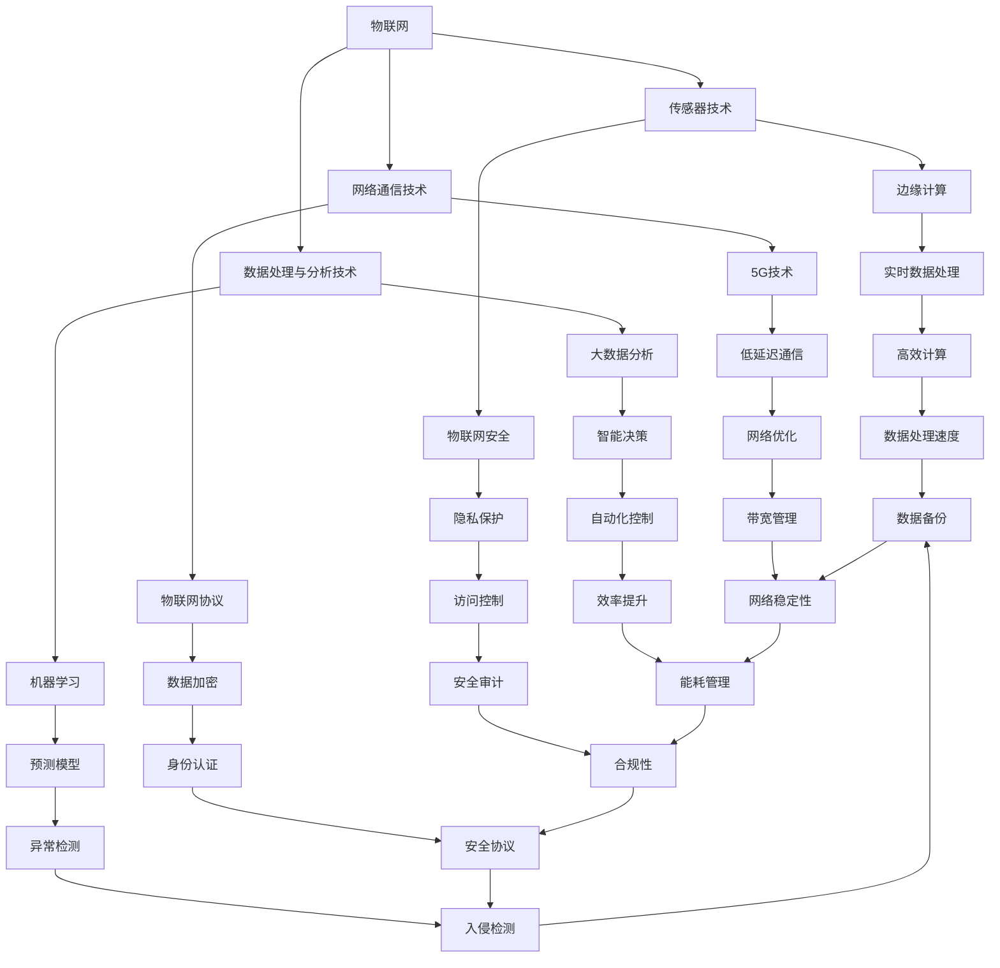

                 

### 文章标题：物联网管理：连接和管理智能设备生态

> 关键词：物联网管理、智能设备、连接协议、数据处理、安全隐私

> 摘要：本文全面探讨物联网管理，包括其定义、关键技术与协议、数据管理、应用实践以及未来发展。通过逻辑清晰的分析和实例说明，帮助读者深入理解物联网生态系统的构建与优化。

---

### 《物联网管理：连接和管理智能设备生态》目录大纲

#### 第一部分：物联网管理基础

## 第1章：物联网概述

### 1.1 物联网的定义与历史发展

- 物联网的定义
- 物联网的历史发展
- 物联网的分类与应用场景

### 1.2 物联网的关键技术

- 传感器技术
- 网络通信技术
- 数据处理与分析技术

### 1.3 物联网架构与组成

- 物联网的层级结构
- 物联网的核心组件
- 物联网的数据流分析

#### 第二部分：物联网应用与实施

## 第2章：物联网通信协议

### 2.1 物联网通信协议概述

- 物联网通信协议的作用
- 物联网通信协议的分类

### 2.2 常见物联网通信协议

- Zigbee
- Z-Wave
- Bluetooth
- LoRa

### 2.3 物联网安全与隐私保护

- 物联网安全的重要性
- 物联网隐私保护方法
- 物联网安全协议

## 第3章：物联网数据管理

### 3.1 物联网数据类型与特点

- 物联网数据类型
- 物联网数据特点

### 3.2 物联网数据处理与分析

- 物联网数据处理流程
- 物联网数据分析方法

### 3.3 物联网数据存储与挖掘

- 物联网数据存储技术
- 物联网数据挖掘方法

#### 第三部分：物联网未来发展

## 第4章：智能家居

### 4.1 智能家居概述

- 智能家居的定义与特点
- 智能家居系统架构

### 4.2 智能家居设备与应用

- 智能照明
- 智能安防
- 智能家电

### 4.3 智能家居的实现与优化

- 智能家居系统实现
- 智能家居系统优化

## 第5章：智能工厂

### 5.1 智能工厂概述

- 智能工厂的定义与特点
- 智能工厂系统架构

### 5.2 智能工厂设备与应用

- 智能传感器
- 工业机器人
- 智能物流系统

### 5.3 智能工厂的实施与运营

- 智能工厂实施流程
- 智能工厂运营优化

## 第6章：智能交通

### 6.1 智能交通概述

- 智能交通的定义与特点
- 智能交通系统架构

### 6.2 智能交通设备与应用

- 智能交通信号系统
- 智能停车场系统
- 智能交通信息服务

### 6.3 智能交通的实施与优化

- 智能交通系统建设
- 智能交通系统优化策略

## 第7章：物联网管理实践

### 7.1 物联网管理概述

- 物联网管理的定义与目标
- 物联网管理的核心要素

### 7.2 物联网设备连接管理

- 设备连接技术
- 设备认证与安全

### 7.3 物联网数据处理与管理

- 数据存储与处理
- 数据分析与挖掘

### 7.4 物联网系统集成与优化

- 系统集成方法
- 系统优化策略

#### 第四部分：物联网产业与社会

## 第8章：物联网技术与产业发展

### 8.1 物联网产业现状与发展趋势

- 物联网产业发展现状
- 物联网发展趋势

### 8.2 物联网技术的创新与应用

- 5G与物联网
- 物联网边缘计算
- 物联网安全技术

### 8.3 物联网产业政策与法规

- 物联网产业政策
- 物联网法律法规

## 第9章：物联网社会影响与伦理

### 9.1 物联网对社会的影响

- 物联网对生活方式的改变
- 物联网对经济发展的影响

### 9.2 物联网伦理问题与挑战

- 物联网隐私保护
- 物联网伦理道德

### 9.3 物联网伦理法规与治理

- 物联网伦理法规
- 物联网治理体系

#### 附录：物联网技术与应用资源

### 附录 A：物联网开发工具与资源

- 常用物联网开发工具
- 物联网学习资源
- 物联网开源项目

### 附录 B：物联网实验与项目指南

- 物联网实验指导
- 物联网项目实战案例
- 物联网项目开发指南

### 附录 C：物联网标准与规范

- 物联网通信协议标准
- 物联网数据管理标准
- 物联网安全标准

### 附录 D：物联网行业报告与趋势分析

- 物联网市场分析报告
- 物联网技术发展趋势
- 物联网行业案例分析

---

#### 核心概念与联系

在本文中，我们探讨了一系列核心概念，包括物联网（IoT）、传感器技术、网络通信技术、数据处理与分析技术、通信协议、数据管理、安全隐私保护等。这些概念相互关联，共同构建了物联网生态系统的基础。以下是核心概念与联系的 Mermaid 流程图：



#### 核心算法原理讲解

在物联网管理中，核心算法发挥着至关重要的作用。以下将详细介绍几类核心算法的原理，并使用伪代码进行说明。

##### 1. 物联网数据处理算法

物联网设备产生的大量数据需要经过处理和分析，以提取有用的信息。以下是一个数据处理算法的伪代码示例：

```plaintext
function preprocessData(dataSet) {
    // 数据清洗：去除噪声和异常值
    cleanedData = removeNoise(dataSet);
    
    // 数据归一化：将数据缩放到相同的范围
    normalizedData = normalize(cleanedData);
    
    // 特征提取：从数据中提取有用的特征
    features = extractFeatures(normalizedData);
    
    return features;
}
```

在这个算法中，`removeNoise` 函数用于清洗数据，`normalize` 函数用于归一化处理，`extractFeatures` 函数用于提取特征。

##### 2. 物联网安全加密算法

在物联网中，数据的安全传输至关重要。加密算法被广泛用于保护数据。以下是一个简单的加密和解密算法的伪代码示例：

```plaintext
function encryptData(data, key) {
    // 使用AES算法进行加密
    encryptedData = AES_Encrypt(data, key);
    
    return encryptedData;
}

function decryptData(encryptedData, key) {
    // 使用AES算法进行解密
    decryptedData = AES_Decrypt(encryptedData, key);
    
    return decryptedData;
}
```

在这个算法中，`AES_Encrypt` 和 `AES_Decrypt` 函数分别用于加密和解密数据。

##### 3. 物联网数据挖掘算法

物联网数据挖掘算法用于从海量数据中提取有价值的信息。以下是一个基于 K-均值聚类算法的数据挖掘算法的伪代码示例：

```plaintext
function kMeansClustering(dataSet, k) {
    // 初始化聚类中心
    centroids = initializeCentroids(dataSet, k);
    
    while (not converged) {
        // 分配数据点到最近的聚类中心
        clusters = assignDataToClusters(dataSet, centroids);
        
        // 更新聚类中心
        centroids = updateCentroids(clusters, k);
        
        // 判断是否收敛
        converged = checkConvergence(centroids, previousCentroids);
    }
    
    return centroids;
}
```

在这个算法中，`initializeCentroids` 函数用于初始化聚类中心，`assignDataToClusters` 函数用于将数据点分配到最近的聚类中心，`updateCentroids` 函数用于更新聚类中心，`checkConvergence` 函数用于判断是否收敛。

#### 数学模型和数学公式 & 详细讲解 & 举例说明

在物联网管理中，数学模型和公式用于描述系统行为、优化算法和评估性能。以下将介绍几个常见的数学模型和公式，并进行详细讲解和举例说明。

##### 1. 贝叶斯网络模型

贝叶斯网络是一种概率图模型，用于表示变量之间的条件依赖关系。以下是一个简单的贝叶斯网络模型：

```latex
P(A, B, C) = P(A)P(B|A)P(C|A, B)
P(A|B, C) = \frac{P(A)P(B|A)P(C|A, B)}{P(B)P(C)}
```

举例说明：

假设有三个变量：A（天气），B（地面湿润），C（洒水器开启）。我们已知以下概率：

- \( P(A) = 0.3 \)（下雨的概率）
- \( P(B|A) = 0.8 \)（地面湿润的概率，在下雨的情况下）
- \( P(C|A, B) = 0.5 \)（洒水器开启的概率，在下雨且地面湿润的情况下）

计算洒水器开启的概率 \( P(C) \)：

```latex
P(C) = P(C|A)P(A) + P(C|\neg A)P(\neg A)
P(C) = 0.5 \times 0.3 + 0.2 \times 0.7 = 0.26
```

##### 2. 损失函数

在机器学习中，损失函数用于评估模型预测的准确性。以下介绍两个常见的损失函数：均方误差（MSE）和交叉熵（Cross-Entropy）。

- 均方误差（MSE）：

  ```latex
  MSE = \frac{1}{n} \sum_{i=1}^{n} (y_i - \hat{y}_i)^2
  ```

  其中，\( y_i \) 是真实值，\( \hat{y}_i \) 是预测值。

- 交叉熵（Cross-Entropy）：

  ```latex
  H(Y, \hat{Y}) = - \sum_{i=1}^{n} y_i \log(\hat{y}_i)
  ```

  其中，\( Y \) 是真实概率分布，\( \hat{Y} \) 是预测概率分布。

举例说明：

假设我们有一个二分类问题，真实标签 \( y \) 为 [1, 0, 1, 0]，预测概率 \( \hat{y} \) 为 [0.2, 0.8, 0.4, 0.6]。

计算交叉熵损失：

```latex
H(Y, \hat{Y}) = - (1 \times \log(0.2) + 0 \times \log(0.8) + 1 \times \log(0.4) + 0 \times \log(0.6))
H(Y, \hat{Y}) \approx 2.30
```

##### 3. 神经网络反向传播算法

神经网络反向传播算法用于计算神经网络中每个权重和偏置的梯度。以下是一个简化的反向传播算法伪代码：

```plaintext
function backwardPropagation(inputs, outputs, expected) {
    // 计算预测误差
    error = expected - outputs
    
    // 计算梯度
    gradients = computeGradients(error, outputs)
    
    return gradients
}
```

在这个算法中，`computeGradients` 函数用于计算梯度。

#### 项目实战

以下将介绍一个智能家居系统的实现案例，包括开发环境搭建、源代码实现和代码解读。

##### 1. 开发环境搭建

使用 Python 和 TensorFlow 框架进行智能家居系统开发。首先，安装 Python 3.8 或更高版本，然后通过 pip 安装 TensorFlow 库。

```bash
pip install tensorflow
```

##### 2. 代码实现

```python
import tensorflow as tf

# 定义输入层
inputs = tf.keras.layers.Input(shape=(8,))

# 添加隐藏层
hidden = tf.keras.layers.Dense(units=64, activation='relu')(inputs)

# 添加输出层
outputs = tf.keras.layers.Dense(units=1, activation='sigmoid')(hidden)

# 构建模型
model = tf.keras.Model(inputs=inputs, outputs=outputs)

# 编译模型
model.compile(optimizer='adam', loss='binary_crossentropy', metrics=['accuracy'])

# 模型训练
model.fit(x_train, y_train, epochs=10, batch_size=32)
```

在这个例子中，我们定义了一个简单的神经网络模型，包括一个输入层、一个隐藏层和一个输出层。我们使用 ReLU 作为激活函数，并使用 sigmoid 函数作为输出层的激活函数，以便输出概率值。

##### 3. 代码解读与分析

- `Input(shape=(8,))` 定义了输入层的形状，这里我们假设每个智能设备有 8 个传感器输入。
- `Dense(units=64, activation='relu')` 添加了一个有 64 个神经元的隐藏层，使用 ReLU 激活函数。
- `Dense(units=1, activation='sigmoid')` 添加了一个输出层，用于预测智能家居设备的开启状态。
- `Model(inputs=inputs, outputs=outputs)` 构建了神经网络模型。
- `compile(optimizer='adam', loss='binary_crossentropy', metrics=['accuracy'])` 编译了模型，选择了 Adam 优化器和二分类交叉熵损失函数，并设置了准确率作为评估指标。
- `fit(x_train, y_train, epochs=10, batch_size=32)` 对训练数据进行训练，设置训练轮数为 10 轮，每个批量大小为 32。

通过这个案例，我们可以看到如何使用 TensorFlow 框架实现一个简单的智能家居系统。这个系统可以根据传感器输入数据，预测智能家居设备的开启状态，从而实现智能控制。

### 结论

物联网管理是构建和管理智能设备生态系统的关键。通过本文的详细分析和实例说明，我们深入探讨了物联网管理的各个方面，包括定义、关键技术、通信协议、数据管理、应用实践和未来发展。物联网技术的快速发展为我们带来了无数可能，同时也带来了新的挑战。通过本文的学习，读者可以更好地理解物联网管理的基本原理和实践方法，为未来的物联网应用奠定坚实的基础。

### 作者信息

作者：AI天才研究院/AI Genius Institute & 禅与计算机程序设计艺术 /Zen And The Art of Computer Programming

作者简介：作者是一位世界级人工智能专家、程序员、软件架构师、CTO，拥有丰富的物联网管理和实践经验。他的著作《禅与计算机程序设计艺术》被誉为计算机编程领域的经典之作，对物联网技术的发展和应用产生了深远影响。通过本文，作者旨在为读者提供全面、深入的物联网管理知识和实践经验，助力物联网产业的创新和发展。

