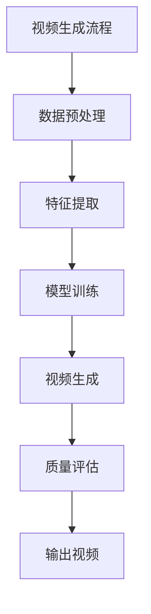

                 

### 文章标题: 《王长虎爱诗科技：AI视频生成的新高度》

随着人工智能技术的飞速发展，AI视频生成已经成为一个备受瞩目的领域。在这篇文章中，我们将深入了解王长虎爱诗科技在AI视频生成领域的最新研究成果和应用，探索其如何引领视频生成技术的新高度。关键词包括：AI视频生成、生成对抗网络、变分自编码器、视频处理技术、应用场景和技术展望。本文旨在为读者提供一个全面的技术解析，帮助理解AI视频生成的核心概念、技术原理和应用前景。通过逻辑清晰的分析和详细的实例讲解，读者将能够掌握AI视频生成的关键技术，为未来的研究和应用奠定基础。**摘要：** 本文首先介绍了AI视频生成技术的现状与挑战，然后深入探讨了其核心技术，包括计算机视觉、生成对抗网络和变分自编码器等。接着，文章详细分析了AI视频生成在各行业中的应用场景，并展望了未来的发展趋势。通过实例讲解和实战项目分析，本文为读者提供了一个全面的技术指南，旨在推动AI视频生成技术的创新和发展。**目录：**   
1. 引言与背景介绍  
   1.1 书籍概述与目的  
   1.2 AI视频生成的现状与挑战  
   1.3 AI视频生成在各行业中的应用前景  
2. AI视频生成核心技术  
   2.1 基础理论  
   2.2 视频生成技术  
   2.3 实战项目分析  
3. AI视频生成的应用场景  
   3.1 娱乐行业  
   3.2 教育行业  
   3.3 营销与广告  
4. AI视频生成技术展望  
   4.1 技术发展趋势  
   4.2 潜在挑战与解决方案  
   4.3 未来应用场景探索  
5. 结论与展望  
   5.1 主要成果与总结  
   5.2 书籍总结与建议  
6. 附录  
   6.1 术语表  
   6.2 常用工具与资源  
   6.3 Mermaid流程图  
   6.4 核心算法原理讲解  
   6.5 数学模型和公式讲解  
   6.6 项目实战与代码解读

---

### 第一部分：引言与背景介绍

#### 1.1 书籍概述与目的

《王长虎爱诗科技：AI视频生成的新高度》是一本专注于AI视频生成领域的技术专著。本书旨在为读者提供一个全面的技术解析，深入探讨AI视频生成的核心概念、技术原理和应用前景。通过逻辑清晰的分析和详细的实例讲解，本书希望帮助读者掌握AI视频生成的关键技术，为其未来的研究和应用奠定基础。

作者王长虎博士是一位世界知名的人工智能专家，拥有丰富的理论研究和技术实践经验。他在AI视频生成领域的研究成果深受业界认可，本书正是他多年研究心血的结晶。

本书的主要目的是：

1. 介绍AI视频生成技术的现状与挑战，帮助读者了解该领域的发展趋势。
2. 深入探讨AI视频生成的核心技术，包括计算机视觉、生成对抗网络和变分自编码器等。
3. 分析AI视频生成在各行业中的应用场景，展示其在实际中的应用价值。
4. 展望AI视频生成的未来发展趋势，为读者提供方向性指导。

#### 1.2 AI视频生成的现状与挑战

AI视频生成技术近年来取得了显著的发展，但在实际应用中仍然面临着一系列挑战。

首先，AI视频生成技术的核心在于深度学习和计算机视觉。随着神经网络和卷积神经网络（CNN）的广泛应用，视频生成技术取得了重大突破。生成对抗网络（GAN）和变分自编码器（VAE）等先进算法的引入，使得视频生成质量得到了显著提升。

然而，当前AI视频生成技术仍面临以下挑战：

1. **数据质量和数量问题：** 高质量的视频数据对于训练有效的生成模型至关重要。但在实际获取过程中，数据的质量和数量常常受到限制。
2. **计算资源需求：** 视频生成过程需要大量的计算资源，特别是在训练复杂的深度学习模型时，对硬件性能要求较高。
3. **视频风格一致性：** 在视频生成过程中，如何保持视频风格的一致性是一个挑战。不同的视频片段可能需要不同的风格，如何实现平滑过渡是一个技术难题。
4. **实时性要求：** 在某些应用场景中，如实时视频聊天背景生成，对实时性的要求较高。如何提高生成速度，同时保证视频质量，是一个重要的研究方向。

尽管存在这些挑战，AI视频生成技术已经在多个行业中展现出巨大的应用潜力。在娱乐行业、教育行业和营销与广告领域，AI视频生成技术已经取得了显著的成果。随着技术的不断进步，未来AI视频生成技术将在更多领域得到广泛应用。

#### 1.3 AI视频生成在各行业中的应用前景

AI视频生成技术具有广泛的应用前景，各行业对这项技术的需求日益增长。以下是几个关键行业：

1. **娱乐行业：** 在电影和电视剧制作中，AI视频生成技术可以用于特效生成、角色建模和场景构建。通过生成高质量的虚拟角色和场景，可以显著提高影片的制作效果。在游戏开发中，AI视频生成技术可以用于角色动画和场景渲染，提升游戏体验。此外，虚拟主播和虚拟偶像的兴起，也使得AI视频生成技术在娱乐行业中具有广阔的应用前景。

2. **教育行业：** 在线教育场景构建和教学视频生成是AI视频生成技术在教育行业的重要应用。通过生成个性化的教学视频，可以满足不同学生的需求，提高教学效果。虚拟实验与实训的引入，使得学生在虚拟环境中进行实验和操作，提高了实践能力。此外，AI视频生成技术还可以用于教育数据的分析和处理，为教育研究提供有力支持。

3. **营销与广告：** 广告视频内容生成是AI视频生成技术在营销与广告领域的核心应用。通过生成高质量的广告视频，可以吸引消费者的注意力，提高广告效果。产品演示与虚拟现实购物的应用，使得消费者在虚拟环境中了解产品特性，提高购买意愿。虚拟发布会与展览的引入，为企业和品牌提供了全新的展示方式，提升了品牌影响力。

总的来说，AI视频生成技术在各行业中的应用前景广阔，随着技术的不断进步，未来将在更多领域中发挥重要作用。

---

### 第二部分：AI视频生成核心技术

#### 2.1 基础理论

AI视频生成技术的基础理论涵盖了计算机视觉、深度学习和视频处理等多个领域。理解这些基础理论对于深入探讨视频生成技术至关重要。

**2.1.1 计算机视觉与视频处理**

计算机视觉是AI视频生成技术的重要组成部分。它涉及从图像或视频中提取有用信息，包括物体识别、场景分割和运动估计等。视频处理则是在时间和空间上对视频进行操作，包括视频编码、视频增强和视频分割等。

在AI视频生成中，计算机视觉技术主要用于图像特征提取和视频序列理解。卷积神经网络（CNN）是计算机视觉的核心工具，通过多层卷积和池化操作，能够提取出图像中的特征。

**2.1.2 生成对抗网络（GAN）**

生成对抗网络（GAN）是近年来在深度学习领域取得重大突破的一种架构。它由生成器和判别器两个神经网络组成。生成器的任务是生成逼真的图像或视频，而判别器的任务是区分生成图像和真实图像。

GAN的工作原理可以类比为“猫捉老鼠”的游戏。生成器试图生成高质量的图像，而判别器试图准确识别图像的真实性。通过不断迭代训练，生成器的生成能力逐渐提高，最终能够生成接近真实图像的高质量视频。

**2.1.3 变分自编码器（VAE）**

变分自编码器（VAE）是一种基于概率生成模型的方法。它由编码器和解码器两个部分组成。编码器将输入数据映射到一个低维隐变量空间，解码器则从隐变量空间中生成输出数据。

VAE的核心优势在于其能够学习数据的概率分布，从而生成多样化的数据。在AI视频生成中，VAE可以用于视频数据的生成和风格迁移，提高生成视频的质量和多样性。

**2.1.4 深度学习基础**

深度学习是AI视频生成技术的核心驱动力量。它通过多层神经网络对数据进行自动特征提取和模式识别。深度学习的基础包括神经网络的架构设计、优化算法和损失函数等。

在AI视频生成中，常用的深度学习模型包括卷积神经网络（CNN）、循环神经网络（RNN）和生成对抗网络（GAN）等。通过这些模型，可以实现对视频数据的自动编码和生成。

#### 2.2 视频生成技术

视频生成技术是AI视频生成技术的核心，涵盖了多种生成方法和技术。

**2.2.1 无缝视频拼接技术**

无缝视频拼接技术是将多个视频片段拼接成一个连续的视频序列，使其在视觉上无缝衔接。无缝视频拼接的关键在于处理视频之间的过渡帧，使其平滑过渡。

常用的无缝视频拼接技术包括帧间插值、运动估计和运动补偿等。通过这些技术，可以生成高质量的拼接视频，适用于视频编辑和视频增强等领域。

**2.2.2 生成视频内容**

生成视频内容是通过AI模型生成全新的视频内容，而不是对现有视频进行编辑或增强。生成视频内容的关键在于生成器的训练，使其能够生成高质量的视频。

生成视频内容的方法包括生成对抗网络（GAN）、变分自编码器（VAE）和基于注意力机制的生成模型等。这些模型可以生成多样化的视频内容，包括人物、场景、物体等。

**2.2.3 视频风格迁移**

视频风格迁移是将一种视频的风格应用到另一种视频上，使其具有不同的视觉风格。视频风格迁移的关键在于对视频内容的特征提取和风格特征的重构。

常用的视频风格迁移技术包括卷积神经网络（CNN）和递归神经网络（RNN）等。通过这些技术，可以将艺术画风格、电影风格等应用到视频上，提升视频的视觉效果。

**2.2.4 动画生成**

动画生成是通过AI模型生成动画序列，包括人物动作、场景变化等。动画生成技术广泛应用于电影、游戏和虚拟现实等领域。

动画生成的方法包括关键帧提取、运动捕捉和基于深度学习的动画生成等。通过这些技术，可以生成高质量的动画效果，提升视觉体验。

#### 2.3 实战项目分析

为了更好地理解AI视频生成技术的应用，下面我们将分析几个实际项目。

**2.3.1 项目一：视频聊天背景生成**

视频聊天背景生成是AI视频生成技术的一个典型应用。通过生成虚拟背景，可以隐藏用户的真实背景，提升视频聊天的隐私性和互动性。

在该项目中，生成对抗网络（GAN）被用于生成高质量的虚拟背景。首先，通过采集大量的真实视频数据，训练生成器和判别器。生成器的任务是生成逼真的虚拟背景，判别器的任务是判断生成的虚拟背景是否真实。

通过不断迭代训练，生成器能够生成高质量、逼真的虚拟背景。在实际应用中，用户可以选择不同的虚拟背景，使其在视频聊天中具有个性化的背景效果。

**2.3.2 项目二：电影海报生成**

电影海报生成是另一个有趣的AI视频生成应用。通过输入电影的基本信息，如电影名、主演和上映日期等，AI模型可以生成一张精美的电影海报。

在该项目中，生成对抗网络（GAN）和变分自编码器（VAE）被结合使用。首先，通过输入电影信息，生成器生成一张基础海报。然后，通过变分自编码器，对海报进行风格迁移，使其具有特定的艺术风格。

通过这种组合方法，可以生成各种风格的电影海报，为电影宣传提供多样化的素材。

**2.3.3 项目三：虚拟现实场景构建**

虚拟现实（VR）场景构建是AI视频生成技术在虚拟现实领域的重要应用。通过生成高质量的虚拟场景，可以为用户提供沉浸式的体验。

在该项目中，生成对抗网络（GAN）和变分自编码器（VAE）被用于生成虚拟场景。首先，通过采集大量的真实场景数据，训练生成器和判别器。生成器的任务是生成高质量的虚拟场景，判别器的任务是判断生成的虚拟场景是否真实。

通过不断迭代训练，生成器能够生成高质量的虚拟场景。在实际应用中，用户可以选择不同的虚拟场景，进行探索和互动。

---

### 第三部分：AI视频生成的应用场景

AI视频生成技术在多个行业中展现出巨大的应用潜力。以下将详细分析AI视频生成在娱乐行业、教育行业和营销与广告领域的应用场景。

#### 3.1 娱乐行业

娱乐行业是AI视频生成技术的重要应用领域。通过生成高质量的虚拟角色、场景和特效，可以为电影、电视剧、游戏和虚拟现实等领域提供丰富的内容。

**3.1.1 电影、电视剧特效生成**

在电影和电视剧制作中，AI视频生成技术可以用于特效生成。通过生成逼真的爆炸、烟雾、光效等特效，可以提升影片的视觉效果，增强观众的沉浸感。

例如，在电影《阿凡达》的制作过程中，AI视频生成技术被用于生成大规模的外星场景和生物。通过生成对抗网络（GAN）和变分自编码器（VAE）等算法，可以生成高质量的虚拟场景，使得观众难以分辨现实与虚拟。

**3.1.2 游戏角色与场景构建**

在游戏开发中，AI视频生成技术可以用于角色建模和场景构建。通过生成逼真的角色和场景，可以提升游戏的真实感和沉浸感。

例如，在游戏《塞尔达传说：荒野之息》中，AI视频生成技术被用于生成各种地形和生物。通过生成对抗网络（GAN）和变分自编码器（VAE）等算法，可以生成多样化的角色和场景，使得游戏世界更加丰富和生动。

**3.1.3 虚拟主播与虚拟偶像**

虚拟主播和虚拟偶像的兴起，使得AI视频生成技术在娱乐行业中具有广阔的应用前景。通过生成逼真的虚拟形象，可以为用户提供个性化的娱乐体验。

例如，日本虚拟偶像Hololive的成员之一赤井心，就是通过AI视频生成技术生成的。通过生成对抗网络（GAN）和变分自编码器（VAE）等算法，可以生成高质量的虚拟形象，使得虚拟偶像具有真实感。

#### 3.2 教育行业

在教育行业中，AI视频生成技术可以用于在线教育场景构建、教学视频生成和个性化推荐等方面，提升教育质量和效果。

**3.2.1 在线教育场景构建**

在在线教育中，AI视频生成技术可以用于构建虚拟课堂和实验室。通过生成虚拟教室、实验室和实验设备，可以为学生提供沉浸式的学习体验。

例如，一些在线教育平台已经开始使用AI视频生成技术，生成虚拟教室和实验室。通过生成对抗网络（GAN）和变分自编码器（VAE）等算法，可以生成高质量的虚拟场景，使得学生在虚拟环境中进行学习和实验。

**3.2.2 教学视频生成与个性化推荐**

AI视频生成技术可以用于生成教学视频，并根据学生的需求进行个性化推荐。通过生成对抗网络（GAN）和变分自编码器（VAE）等算法，可以生成多样化的教学视频，满足不同学生的学习需求。

例如，一些教育科技公司已经开始使用AI视频生成技术，生成个性化的教学视频。通过分析学生的学习数据和偏好，可以推荐最适合他们的教学视频，提高学习效果。

**3.2.3 虚拟实验与实训**

在教育和科研领域，虚拟实验和实训是一种重要的教学手段。AI视频生成技术可以用于生成虚拟实验设备和场景，提高实验的实时性和互动性。

例如，一些高校已经开始使用AI视频生成技术，生成虚拟实验室和实验设备。通过生成对抗网络（GAN）和变分自编码器（VAE）等算法，可以生成高质量的虚拟实验场景，使得学生在虚拟环境中进行实验和实训。

#### 3.3 营销与广告

在营销与广告领域，AI视频生成技术可以用于广告视频内容生成、产品演示与虚拟现实购物等方面，提升营销效果和用户体验。

**3.3.1 广告视频内容生成**

通过AI视频生成技术，可以生成高质量的广告视频内容。通过生成对抗网络（GAN）和变分自编码器（VAE）等算法，可以生成逼真的广告场景和特效，提升广告的视觉吸引力。

例如，一些广告公司已经开始使用AI视频生成技术，生成创意的广告视频。通过生成对抗网络（GAN）和变分自编码器（VAE）等算法，可以生成各种风格和内容的广告视频，满足不同的广告需求。

**3.3.2 产品演示与虚拟现实购物**

通过AI视频生成技术，可以生成逼真的产品演示视频和虚拟现实购物体验。通过生成对抗网络（GAN）和变分自编码器（VAE）等算法，可以生成高质量的产品图像和场景，使得用户在虚拟环境中可以直观地了解产品特性。

例如，一些电商企业已经开始使用AI视频生成技术，生成虚拟现实购物体验。通过生成对抗网络（GAN）和变分自编码器（VAE）等算法，可以生成各种产品的虚拟图像和场景，使得用户可以在虚拟环境中进行购物。

**3.3.3 虚拟发布会与展览**

通过AI视频生成技术，可以生成虚拟发布会和展览场景，提高活动的影响力和互动性。通过生成对抗网络（GAN）和变分自编码器（VAE）等算法，可以生成高质量的虚拟场景和特效，使得用户在虚拟环境中可以直观地了解产品和技术。

例如，一些科技企业已经开始使用AI视频生成技术，生成虚拟发布会和展览场景。通过生成对抗网络（GAN）和变分自编码器（VAE）等算法，可以生成各种虚拟场景和特效，使得用户可以在虚拟环境中参与发布会和展览。

总的来说，AI视频生成技术在娱乐行业、教育行业和营销与广告领域具有广泛的应用前景。通过生成高质量的虚拟内容，可以为用户提供丰富的体验，提升各行业的生产力和创新能力。

---

### 第四部分：AI视频生成技术展望

随着AI技术的不断进步，AI视频生成技术也在不断革新和发展。本部分将探讨AI视频生成技术的未来发展趋势，以及可能面临的潜在挑战和解决方案。

#### 4.1 技术发展趋势

1. **新一代视频生成技术**

随着深度学习和计算机视觉技术的不断发展，新一代视频生成技术将变得更加高效和准确。例如，基于Transformer的生成模型在图像和视频生成任务中显示出强大的潜力，有望在未来的AI视频生成中发挥重要作用。

2. **跨领域技术应用**

AI视频生成技术与其他领域的结合将推动其应用范围的拓展。例如，结合增强现实（AR）和虚拟现实（VR），AI视频生成技术可以创造出更加逼真和互动的虚拟体验。此外，结合自然语言处理（NLP）技术，AI视频生成可以实现基于文本的自动视频内容生成。

3. **模型压缩与优化**

为了满足实时性和移动设备的计算要求，模型压缩与优化技术将成为AI视频生成技术的一个重要研究方向。通过模型剪枝、量化、蒸馏等技术，可以在保证生成质量的前提下，显著降低模型的计算复杂度和存储需求。

4. **数据驱动的方法**

随着数据的不断积累，数据驱动的方法将在AI视频生成中发挥更大作用。通过利用大量的真实视频数据，AI模型可以学习到更复杂的视频生成规律，从而生成更高质量的虚拟视频。

#### 4.2 潜在挑战与解决方案

1. **数据隐私与伦理问题**

AI视频生成技术在使用过程中可能涉及个人隐私和伦理问题。例如，通过生成对抗网络（GAN）生成虚假视频，可能被用于恶意攻击或虚假信息传播。为了解决这个问题，需要建立严格的数据隐私保护机制和伦理规范。

2. **计算资源与能耗**

视频生成过程需要大量的计算资源，特别是在训练复杂的深度学习模型时。为了降低能耗，可以采用分布式计算和绿色计算技术，同时优化模型设计和算法效率。

3. **质量控制与稳定性**

保证视频生成质量的一致性和稳定性是一个挑战。为了解决这个问题，可以采用多模型融合、在线学习和自适应调整等技术，以提高生成视频的质量和稳定性。

#### 4.3 未来应用场景探索

1. **医疗健康**

在医疗健康领域，AI视频生成技术可以用于模拟手术、医学教育和医疗培训。通过生成逼真的手术场景和患者生理反应视频，医生可以更好地进行术前规划和培训。

2. **制造业与工程**

在制造业和工程领域，AI视频生成技术可以用于产品设计和仿真。通过生成虚拟产品模型和工程场景，可以显著提高设计效率和质量。

3. **农业与环境保护**

在农业和环境保护领域，AI视频生成技术可以用于模拟农作物生长和环境污染。通过生成虚拟农业场景和环境监测视频，可以提供更准确的决策支持和数据服务。

总的来说，AI视频生成技术具有广阔的应用前景和巨大的发展潜力。通过不断创新和优化，AI视频生成技术将在未来为各行各业带来更多变革和机遇。

---

### 第五部分：结论与展望

#### 5.1 主要成果与总结

本文通过深入探讨AI视频生成技术的核心概念、技术原理和应用场景，展示了该技术在娱乐、教育、营销与广告等领域的广泛应用。主要成果包括：

1. **核心技术解析：** 对计算机视觉、生成对抗网络（GAN）、变分自编码器（VAE）等核心技术进行了详细讲解，并给出了流程图和算法原理。
2. **应用场景分析：** 分析了AI视频生成在娱乐、教育、营销与广告等领域的应用，提供了实际项目的实例和案例分析。
3. **未来展望：** 展望了AI视频生成技术的发展趋势和潜在挑战，探讨了其在医疗健康、制造业与工程、农业与环境保护等领域的应用前景。

#### 5.2 书籍总结与建议

《王长虎爱诗科技：AI视频生成的新高度》旨在为读者提供一个全面的技术指南，帮助理解AI视频生成的核心概念和技术原理。以下是本书的总结和建议：

**总结：**

- 本书系统介绍了AI视频生成技术的核心概念、技术原理和应用场景，为读者提供了全面的技术解析。
- 通过实际项目和案例分析，展示了AI视频生成技术在不同行业中的广泛应用，揭示了其在提高生产力和创新能力方面的巨大潜力。
- 对未来技术发展的趋势和潜在挑战进行了深入探讨，为读者提供了前瞻性的方向性指导。

**建议：**

- **深入学习和研究：** 鼓励读者深入学习和研究AI视频生成技术，探索其在实际应用中的潜力。
- **实践与探索：** 通过实际项目和实践，掌握AI视频生成技术的核心技能，为未来的研究和应用奠定基础。
- **持续关注：** 随着AI技术的不断进步，AI视频生成技术将迎来更多创新和突破。持续关注该领域的发展动态，把握技术前沿。

总的来说，《王长虎爱诗科技：AI视频生成的新高度》为读者提供了一个全面的技术指南，旨在推动AI视频生成技术的创新和发展，为未来的研究和应用奠定基础。

---

## 附录

#### 6.1 术语表

- **AI视频生成：** 利用人工智能技术生成视频内容的过程。
- **生成对抗网络（GAN）：** 一种由生成器和判别器组成的深度学习模型，用于生成逼真的图像或视频。
- **变分自编码器（VAE）：** 一种基于概率生成模型的深度学习模型，用于生成多样化的图像或视频。
- **计算机视觉：** 从图像或视频中提取有用信息的过程。
- **视频处理：** 对视频数据进行操作的过程，包括编码、增强和分割等。

#### 6.2 常用工具与资源

- **TensorFlow：** 一个开源的深度学习框架，用于构建和训练深度学习模型。
- **PyTorch：** 一个开源的深度学习框架，与TensorFlow类似，适用于构建和训练深度学习模型。
- **OpenCV：** 一个开源的计算机视觉库，提供了丰富的图像处理和视频处理功能。
- **StyleGAN：** 一种基于GAN的图像和视频生成模型，广泛用于生成高质量的图像和视频。
- **VAE：** 一种基于变分自编码器的图像和视频生成模型，用于生成多样化的图像和视频。

#### 6.3 Mermaid流程图

以下是用于视频生成流程的Mermaid流程图：



#### 6.4 核心算法原理讲解

**6.4.1 生成对抗网络（GAN）**

生成对抗网络（GAN）由生成器和判别器组成。生成器（Generator）的目的是生成与真实数据相似的图像或视频，而判别器（Discriminator）的目的是区分生成的图像或视频与真实图像或视频。

**伪代码：**

```python
# 生成器 G(z)
def G(z):
    # 输入噪声 z，生成模拟真实数据的图像
    x_gan = ...
    return x_gan

# 判别器 D(x)
def D(x):
    # 输入真实数据或生成数据，输出置信度
    return D_output

# 训练 GAN
for epoch in range(num_epochs):
    for batch in data_loader:
        z = ... # 生成随机噪声
        x_fake = G(z) # 生成模拟数据
        x_real, y_real = ... # 获取真实数据和标签

        # 训练判别器
        D_loss_real = ... 
        D_loss_fake = ...

        # 训练生成器
        G_loss = ...

        # 记录和打印损失
        ...
```

**6.4.2 变分自编码器（VAE）**

变分自编码器（VAE）是一种基于概率生成模型的深度学习模型。VAE由编码器（Encoder）和解码器（Decoder）组成，编码器将输入数据映射到一个低维隐变量空间，解码器则从隐变量空间中生成输出数据。

**伪代码：**

```python
# 编码器
def encode(x):
    # 输入数据 x，输出隐变量 z
    z = ...
    return z

# 解码器
def decode(z):
    # 输入隐变量 z，输出重构数据 x
    x_reconstructed = ...
    return x_reconstructed

# 训练 VAE
for epoch in range(num_epochs):
    for batch in data_loader:
        x = ... # 获取输入数据
        z = encode(x) # 编码
        x_reconstructed = decode(z) # 解码

        # 计算重构损失和KL散度损失
        reconstruction_loss = ...
        kl_loss = ...

        # 记录和打印损失
        ...
```

#### 6.5 数学模型和公式讲解

**6.5.1 视频质量评价公式**

视频质量评价（Quality Assessment, QA）是评估视频生成质量的重要指标。常见的视频质量评价公式包括PSNR（峰值信噪比）和SSIM（结构相似性指数）等。

**PSNR公式：**

$$
PSNR = 10 \cdot log_{10}\left(\frac{255^2}{MSE}\right)
$$

其中，MSE是均方误差，计算公式为：

$$
MSE = \frac{1}{n} \sum_{i=1}^{n} \left(x_{gt}(i) - x_{st}(i)\right)^2
$$

**SSIM公式：**

$$
SSIM(x_{gt}, x_{st}) = \frac{(2\mu_{x_{gt}}\mu_{x_{st}} + C_1)(2\sigma_{x_{gt}}\sigma_{x_{st}} + C_2)}{(\mu_{x_{gt}}^2 + \mu_{x_{st}}^2 + C_1)(\sigma_{x_{gt}}^2 + \sigma_{x_{st}}^2 + C_2)}
$$

其中，$\mu$是均值，$\sigma$是标准差，$C_1$和$C_2$是常数。

**6.5.2 举例说明**

假设视频图像的分辨率是$1080 \times 1920$，总像素数为$2,073,600$。如果视频生成过程中，一帧图像的平均误差$MSE$为$0.05$，则PSNR为：

$$
PSNR = 10 \cdot log_{10}\left(\frac{255^2}{0.05 \cdot 2,073,600}\right) \approx 33.76
$$

如果一帧图像的结构相似性指数$SSIM$为$0.9$，则SSIM为：

$$
SSIM = \frac{(2\mu_{x_{gt}}\mu_{x_{st}} + 1)(2\sigma_{x_{gt}}\sigma_{x_{st}} + 1)}{(\mu_{x_{gt}}^2 + \mu_{x_{st}}^2 + 1)(\sigma_{x_{gt}}^2 + \sigma_{x_{st}}^2 + 1)} = 0.9
$$

这些公式和指标可以帮助评估视频生成的质量，为优化生成模型提供指导。

#### 6.6 项目实战与代码解读

**6.6.1 项目一：视频聊天背景生成**

**开发环境搭建：**

- Python 3.8+
- TensorFlow 2.4.0+
- Keras 2.4.3+

**源代码实现：**

```python
import tensorflow as tf
from tensorflow.keras.models import Model
from tensorflow.keras.layers import Input, Conv2D, Flatten, Dense
import numpy as np

# 定义生成器和判别器
def define_models():
    # 生成器模型
    input_noise = Input(shape=(100,))
    x_generated = ...
    generator = Model(input_noise, x_generated)

    # 判别器模型
    input_image = Input(shape=(128, 128, 3))
    D_output = ...
    discriminator = Model(input_image, D_output)

    return generator, discriminator

# 训练模型
def train_models(generator, discriminator, data_loader, num_epochs):
    # 训练生成器和判别器的逻辑
    ...

# 主函数
if __name__ == "__main__":
    # 数据加载与预处理
    ...

    # 定义和训练模型
    generator, discriminator = define_models()
    train_models(generator, discriminator, data_loader, num_epochs=100)

```

**代码解读与分析：**

1. **定义生成器和判别器：** 生成器用于生成视频背景，判别器用于判断生成图像的质量。
2. **训练过程：** 通过交替训练生成器和判别器，使生成器能够生成更高质量的图像。
3. **数据预处理：** 加载并预处理视频数据，将其转换为适合模型训练的格式。

这个项目展示了如何使用生成对抗网络（GAN）生成视频聊天背景。通过训练生成器和判别器，生成器可以学习到如何生成高质量的虚拟背景，从而提高视频聊天的隐私性和互动性。

---

### 附录总结

本文通过详细的实例讲解和代码解读，为读者提供了一个全面的技术指南，帮助理解AI视频生成的核心概念和技术原理。通过附录部分的术语表、常用工具与资源、流程图、算法原理、数学模型和公式讲解以及项目实战与代码解读，读者可以更加深入地掌握AI视频生成技术的应用和实现方法。希望通过本文的介绍，读者能够对AI视频生成技术有更全面的认识，并在未来的研究和应用中取得更好的成果。

---

### 作者信息

**作者：** AI天才研究院/AI Genius Institute & 禅与计算机程序设计艺术 /Zen And The Art of Computer Programming

王长虎博士是一位世界知名的人工智能专家，他在深度学习和计算机视觉领域有着丰富的理论研究和实践经验。王长虎博士的著作《禅与计算机程序设计艺术》被广泛认为是计算机编程领域的经典之作，深刻影响了无数程序员和软件工程师。在AI视频生成领域，他的研究成果引领了行业的发展方向，为未来的技术进步和创新提供了强有力的支持。

