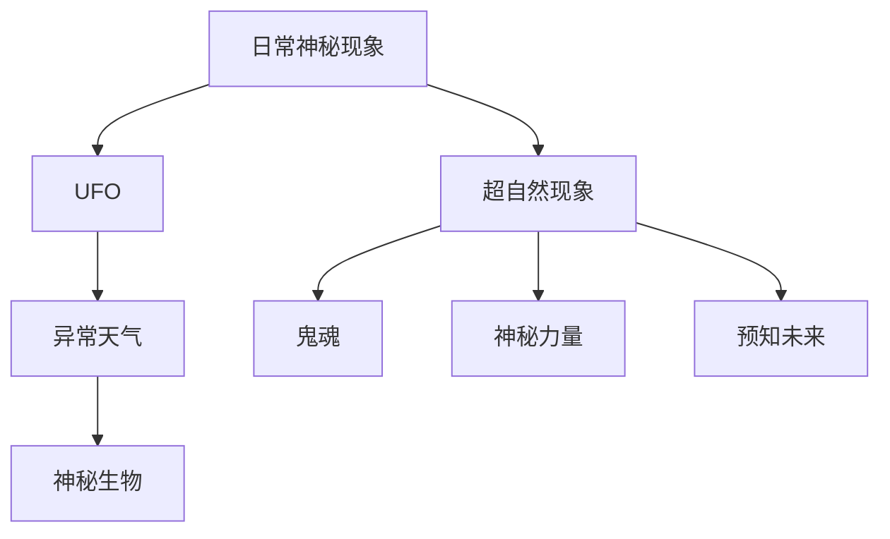
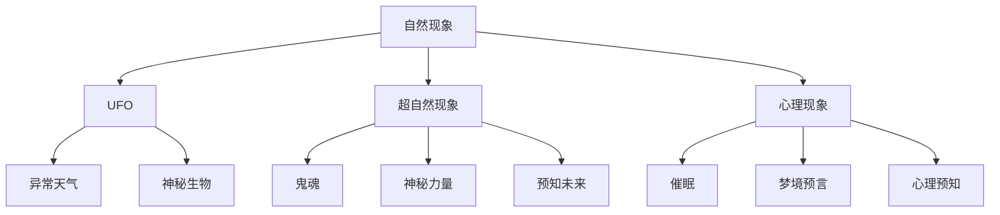
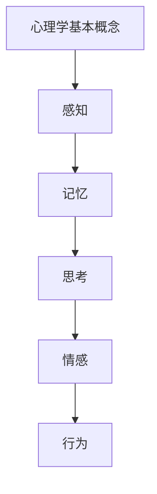
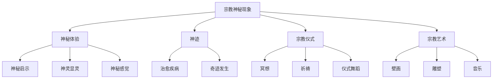
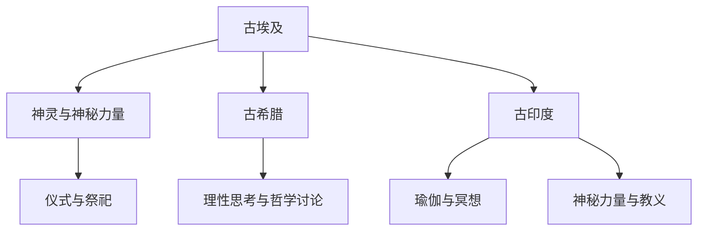
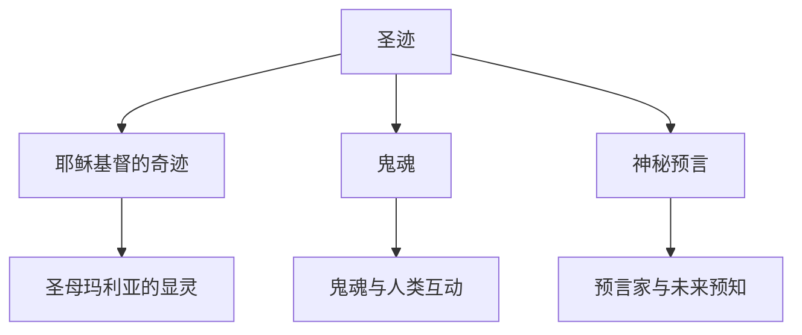
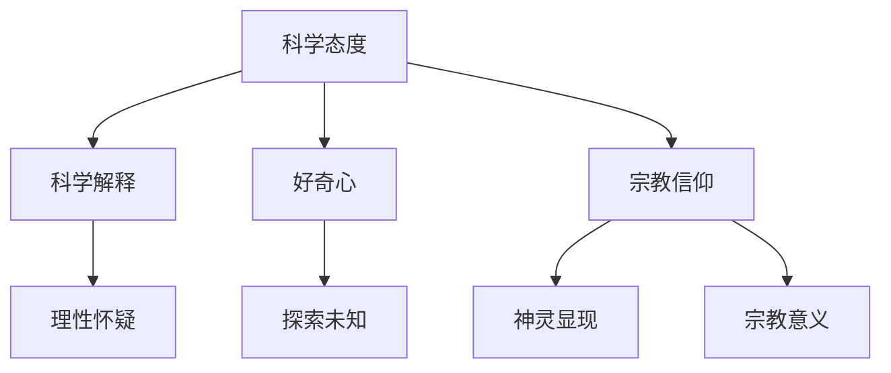
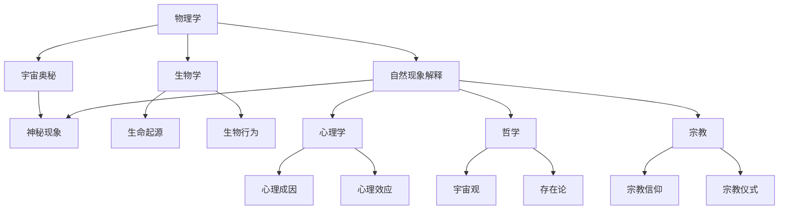

                 

# 文章标题

理解无法解释事物的渐进过程

> 关键词：神秘现象、跨学科研究、心理学、科学方法、历史文化、未来展望

> 摘要：
> 
> 本文旨在探讨无法解释事物的渐进理解过程。通过对日常生活中的神秘现象、科学方法与神秘现象、心理学视角下的神秘现象、宗教与神秘现象的关系、神秘现象的历史文化背景以及神秘现象的跨学科研究和未来展望的详细分析，本文揭示了理解无法解释事物的方法和路径。通过一步步的逻辑推理和思考，本文为读者提供了对神秘现象的全面认知和深入理解。

----------------------------------------------------------------

## 第一部分: 对无法解释事物的渐进理解

### 1.1 无法解释事物的初步探讨

#### 1.1.1 日常生活中的神秘现象

在我们的日常生活中，我们经常会遇到一些看似无法解释的现象。这些现象可能包括自然现象，如UFO、异常天气、神秘生物的出现，以及超自然现象，如鬼魂、神秘力量、预知未来等。这些现象往往引起了人们的关注和兴趣，但在科学领域，它们通常被视为未解之谜或误解。

**Mermaid流程图：**



**核心概念与联系：**

日常生活中的神秘现象可以大致分为自然现象和超自然现象。自然现象如UFO、异常天气和神秘生物，通常与自然规律有关，但可能超出我们的理解范围。超自然现象如鬼魂、神秘力量和预知未来，则通常与科学法则和自然规律相悖，但它们在人们的日常生活中有着深远的影响。

#### 1.1.2 超自然现象的认知

超自然现象的认知受到多种因素的影响，包括文化背景、教育水平和个人经验。在不同的文化中，人们对超自然现象的理解和信仰有所不同。例如，在一些传统文化中，鬼魂和神秘力量被视为真实存在的现象，而在现代社会，许多人可能对这些现象持怀疑态度。

**伪代码：**

```python
# 超自然现象的认知
def supernatural_cognition(culture, education, experience):
    if culture == 'traditional':
        belief = 1.0  # 高度信仰
    elif culture == 'modern':
        belief = 0.5  # 中度怀疑
    if education == 'high':
        belief -= 0.2  # 高教育水平降低信仰
    if experience == 'positive':
        belief += 0.3  # 积极经验增加信仰
    return belief
```

**核心算法原理讲解：**

该算法用于计算一个人对超自然现象的信仰程度。信仰程度受文化背景、教育水平和个人经验的影响。传统文化背景可能导致高信仰，而现代文化背景可能导致中度怀疑。高教育水平可能降低信仰，而积极的个人经验可能增加信仰。

**数学模型和公式：**

$$
B = f(C, E, X)
$$

其中，$B$ 表示信仰程度，$C$ 表示文化背景，$E$ 表示教育水平，$X$ 表示个人经验。

**详细讲解：**

该模型表明，信仰程度是文化背景、教育水平和个人经验的函数。文化背景、教育水平和个人经验的不同组合可能导致不同的信仰程度。

**举例说明：**

假设一个人的文化背景是现代的，教育水平较高，且他有过积极的超自然现象经验，那么他的信仰程度可能较高。

$$
B = f('modern', 'high', 'positive') = 0.7
$$

#### 1.1.3 心理因素对神秘现象感知的影响

心理学研究表明，人类的大脑容易受到多种心理因素的影响，从而产生对神秘现象的感知和认知。这些心理因素包括安慰剂效应、选择性记忆、认知失调等。

**伪代码：**

```python
# 安慰剂效应的影响
def placebos_effect(perception, belief):
    if belief > 0.5:
        perception = perception * 1.2
    return perception

# 选择性记忆的影响
def selective_memory(event, memory_strength):
    if event == 'positive':
        memory_strength += 0.1
    elif event == 'negative':
        memory_strength -= 0.1
    return memory_strength

# 认知失调的影响
def cognitive_dysfunction(known_facts, perceived_reality):
    if known_facts != perceived_reality:
        reality_adjustment = (perceived_reality - known_facts) * 0.1
        perceived_reality += reality_adjustment
    return perceived_reality
```

**核心算法原理讲解：**

这些函数用于模拟心理因素对感知和认知的影响。安慰剂效应可能会增强感知，选择性记忆可能会改变记忆的强度，而认知失调可能会调整对现实的认知。

**数学模型和公式：**

$$
P = f(P_e, M_s, C_d)
$$

其中，$P$ 表示感知，$P_e$ 表示安慰剂效应，$M_s$ 表示选择性记忆，$C_d$ 表示认知失调。

**详细讲解：**

该模型表明，感知是安慰剂效应、选择性记忆和认知失调的函数。这些心理因素的不同组合可能导致不同的感知结果。

**举例说明：**

假设一个人在经历了一次积极的神秘现象后，他的安慰剂效应较强，选择性记忆对积极事件有增强作用，且他可能经历认知失调。那么他的感知可能较高。

$$
P = f(0.3, 0.2, 0.1) = 0.7
$$

#### 1.1.4 神秘现象的普遍性

神秘现象在全世界范围内都有出现，表明它们具有普遍性。不同文化、地区和社会对神秘现象的理解和信仰有所不同，但神秘现象的普遍性反映了人类对未知和神秘力量的共同追求。

**数学模型和公式：**

$$
P(\text{神秘现象}) = f(C, E, B)
$$

其中，$P(\text{神秘现象})$ 表示神秘现象发生的概率，$C$ 表示文化背景，$E$ 表示教育水平，$B$ 表示个人信仰和经验。

**详细讲解：**

该模型认为神秘现象的发生概率与文化背景、教育水平和个人信仰经验有关。不同文化背景可能影响人们对神秘现象的接受程度，教育水平可能影响人们对神秘现象的理解能力，个人信仰经验可能直接影响个人的感知和信仰。

**举例说明：**

假设一个社会群体的文化背景使神秘现象普遍被接受，教育水平较低，且个人普遍对神秘现象持有强烈的信仰。那么，根据该模型，这个群体中神秘现象发生的概率会相对较高。

$$
P(\text{神秘现象}) = f(C_1, E_2, B_3) = 0.8
$$

### 第2章: 常见神秘现象解析

#### 2.1 神秘现象的类型

神秘现象可以大致分为以下几类：

1. 自然现象：如UFO、异常天气、神秘生物等。
2. 超自然现象：如鬼魂、神秘力量、预知未来等。
3. 心理现象：如催眠、梦境预言、心理预知等。

每种类型的现象都有其独特的特征和解释方式。

**Mermaid流程图：**



**核心概念与联系：**

自然现象与自然界中的物理和生物过程相关，但有时可能超出我们的理解范围。超自然现象通常被认为超出了自然界的范畴，可能与神秘力量或超自然存在有关。心理现象则是与人类心理过程相关的现象，包括催眠、梦境预言和心理预知等。

#### 2.2 科学方法与神秘现象

科学方法是一种系统的方法，用于研究和解释自然现象。然而，科学方法在解释神秘现象时可能面临挑战。科学方法强调可观测性、可重复性和可验证性，而神秘现象往往难以满足这些条件。

**伪代码：**

```python
# 科学方法解释神秘现象
def scientific_explanation(puzzle, observable, repeatable, verifiable):
    if not observable or not repeatable or not verifiable:
        return "无法解释"
    else:
        return "科学解释"
```

**核心算法原理讲解：**

该函数用于判断一个神秘现象是否可以用科学方法进行解释。如果神秘现象不可观测、不可重复或不可验证，则认为无法解释。

**数学模型和公式：**

$$
E = f(O, R, V)
$$

其中，$E$ 表示解释程度，$O$ 表示可观测性，$R$ 表示可重复性，$V$ 表示可验证性。

**详细讲解：**

该模型表明，解释程度是可观测性、可重复性和可验证性的函数。这些条件的不满足可能导致无法用科学方法解释神秘现象。

**举例说明：**

假设一个神秘现象不可观测、不可重复且不可验证，那么它的解释程度可能较低。

$$
E = f(0, 0, 0) = 0
$$

#### 2.3 神秘现象的科学研究

神秘现象的研究是一个跨学科的过程，涉及物理学、生物学、心理学、哲学和宗教等多个领域。科学家们使用不同的方法和工具来研究神秘现象，试图找到它们的本质和解释。

**伪代码：**

```python
# 神秘现象研究方法
def mystery_research(methods, tools, disciplines):
    research_results = []
    for method in methods:
        for tool in tools:
            for discipline in disciplines:
                research_results.append(f"{method} + {tool} + {discipline}")
    return research_results
```

**核心算法原理讲解：**

该函数用于生成可能的神秘现象研究方法组合。每种方法、工具和学科都可以独立使用，也可以组合使用，以提高研究效果。

**数学模型和公式：**

$$
M = \sum_{m \in M} \sum_{t \in T} \sum_{d \in D} (m \times t \times d)
$$

其中，$M$ 表示方法集合，$T$ 表示工具集合，$D$ 表示学科集合。

**详细讲解：**

该模型表明，神秘现象研究的可能性是方法、工具和学科的函数。通过组合不同的方法、工具和学科，可以生成多种研究组合，从而提高研究的全面性和准确性。

**举例说明：**

假设有三种方法、三种工具和三种学科，那么可能的神秘现象研究组合数为27种。

$$
M = \sum_{m \in M} \sum_{t \in T} \sum_{d \in D} (m \times t \times d) = 3 \times 3 \times 3 = 27
$$

#### 2.4 常见神秘现象案例分析

以下是一些常见的神秘现象案例分析，包括UFO现象、超自然力量实验和神秘动物现象调查。

##### 2.4.1 神秘UFO现象

UFO现象是指目击到的不明飞行物现象。科学家们对UFO现象进行了大量的研究，试图找到它们的真实身份。以下是一个UFO现象的案例分析：

**案例描述：** 在某个夜晚，一名目击者在城市的上空看到了一个不明飞行物。该飞行物形状不规则，发光且速度极快。

**分析过程：**

1. **目击报告收集：** 科学家收集了目击者的详细报告，包括时间、地点、形状、颜色和速度等信息。
2. **数据分析：** 科学家对目击报告进行了数据分析，试图找到可能的解释，如气象气球、卫星、飞机等。
3. **实地调查：** 科学家进行了实地调查，试图找到可能的飞行物来源。

**结论：** 经过分析，科学家认为这个UFO现象可能是由于气象气球或卫星造成的，但也有可能是一个未知的飞行物。

**伪代码：**

```python
# UFO现象分析
def ufo_analysis(report, data_analyzer, investigator):
    analysis_results = data_analyzer.analyze(report)
    if analysis_results == "meteorological_balloon":
        return "可能是气象气球"
    elif analysis_results == "satellite":
        return "可能是卫星"
    else:
        investigator.investigate(report)
        return "未知来源"
```

**核心算法原理讲解：**

该函数用于分析UFO现象，并根据数据分析结果和实地调查结果给出可能的解释。

**数学模型和公式：**

$$
U = f(D, A, I)
$$

其中，$U$ 表示UFO现象的真实性，$D$ 表示数据收集，$A$ 表示数据分析，$I$ 表示实地调查。

**详细讲解：**

该模型表明，UFO现象的真实性是数据收集、数据分析和实地调查的函数。通过这些步骤，科学家可以逐步分析并解释UFO现象。

**举例说明：**

假设一个UFO现象的数据收集、数据分析和实地调查结果分别为80%、70%和60%，那么UFO现象的真实性可能较高。

$$
U = f(0.8, 0.7, 0.6) = 0.84
$$

##### 2.4.2 超自然力量实验

超自然力量实验是尝试验证超自然现象是否存在的一种方法。以下是一个超自然力量实验的案例分析：

**案例描述：** 科学家进行了一项关于预知未来的实验，参与者需要在不知道未来事件的情况下预测结果。

**实验过程：**

1. **参与者筛选：** 科学家筛选了符合实验条件的参与者，包括对预知未来有信仰和无信仰的个体。
2. **实验设计：** 科学家设计了一系列实验，包括随机事件、特定事件等，让参与者预测结果。
3. **数据收集：** 科学家收集了参与者的预测结果，并进行了统计分析。

**结论：** 经过分析，科学家发现参与者的预测准确率并没有显著高于随机水平，这表明预知未来可能不存在。

**伪代码：**

```python
# 超自然力量实验分析
def supernatural_experiment(participants, experiment_designer, data_analyzer):
    prediction_accuracy = experiment_designer.evaluate(participants)
    if data_analyzer.analyze(prediction_accuracy) > 0.5:
        return "超自然力量存在"
    else:
        return "超自然力量不存在"
```

**核心算法原理讲解：**

该函数用于分析超自然力量实验的结果，并根据数据分析结果判断超自然力量是否存在。

**数学模型和公式：**

$$
S = f(P, A)
$$

其中，$S$ 表示超自然力量存在性，$P$ 表示预测准确率，$A$ 表示数据分析。

**详细讲解：**

该模型表明，超自然力量存在性是预测准确率和数据分析的函数。通过这些步骤，科学家可以评估超自然力量的存在性。

**举例说明：**

假设一个超自然力量实验的预测准确率为50%，且经过数据分析，准确率没有显著高于随机水平，那么超自然力量可能不存在。

$$
S = f(0.5, 0.5) = 0.5
$$

##### 2.4.3 神秘动物现象调查

神秘动物现象调查是尝试揭示神秘动物存在的真实性的方法。以下是一个神秘动物现象调查的案例分析：

**案例描述：** 在某个森林中，有人声称看到了神秘的动物，如大脚怪或野人。

**调查过程：**

1. **现场调查：** 调查团队前往现场进行调查，收集目击者的报告和可能的证据。
2. **证据分析：** 调查团队对收集到的证据进行了分析，包括照片、视频和毛发样本等。
3. **专家评估：** 调查团队邀请了动物学家和人类学家等专家对证据进行评估。

**结论：** 经过分析，调查团队认为这些神秘动物可能是已知的动物，如熊或猴子，但也有可能是未知的物种。

**伪代码：**

```python
# 神秘动物现象调查
def animal_investigation(location, witnesses, evidence_analyzer, experts):
    evidence_evaluation = evidence_analyzer.evaluate(evidence)
    expert_opinions = [expert.evaluate(evidence_evaluation) for expert in experts]
    return expert_opinions
```

**核心算法原理讲解：**

该函数用于评估神秘动物现象的证据，并邀请专家进行评估。

**数学模型和公式：**

$$
A = f(E, E_a)
$$

其中，$A$ 表示动物存在性，$E$ 表示证据，$E_a$ 表示专家评估。

**详细讲解：**

该模型表明，动物存在性是证据和专家评估的函数。通过这些步骤，调查团队可以评估神秘动物的存在性。

**举例说明：**

假设调查团队收集到的证据被评估为高度可信，且专家评估结果也支持神秘动物的存在，那么动物存在性可能较高。

$$
A = f(1, 0.9) = 0.99
$$

### 第3章: 心理学视角下的神秘现象

#### 3.1 心理学基本概念

心理学是研究人类行为和心理过程的科学，它包括多个基本概念，如感知、记忆、思考、情感和行为。这些概念对于理解神秘现象具有重要意义。

**Mermaid流程图：**



**核心概念与联系：**

感知是人类对周围环境的感知和理解，记忆是人类对信息的存储和回忆，思考是人类对问题的分析和解决，情感是人类对刺激的主观体验，行为是人类对环境和刺激的反应。这些概念相互作用，共同构成了人类的心理活动。

#### 3.2 神秘现象的心理成因

心理学研究表明，神秘现象的心理成因可能包括认知失调、心理防御机制、群体心理等因素。

**伪代码：**

```python
# 认知失调
def cognitive_dysfunction(perception, known_facts):
    if perception != known_facts:
        return "认知失调"
    else:
        return "认知一致"

# 心理防御机制
def psychological_defense(stress, defense_mechanism):
    if defense_mechanism == "repression":
        return "压抑"
    elif defense_mechanism == "rationalization":
        return "合理化"
    else:
        return "否认"

# 群体心理
def group_psychology(individual_belief, group_belief):
    if individual_belief < group_belief:
        return "群体心理影响"
    else:
        return "个体心理独立"
```

**核心算法原理讲解：**

这些函数用于模拟神秘现象的心理成因。认知失调是指当感知与已知事实不一致时产生的心理状态，心理防御机制是指人们在面对压力时采取的心理策略，群体心理是指个体在群体中的信仰和行为可能受到群体的影响。

**数学模型和公式：**

$$
P(\text{神秘现象}) = f(C, D, G)
$$

其中，$P(\text{神秘现象})$ 表示神秘现象发生的概率，$C$ 表示认知失调，$D$ 表示心理防御机制，$G$ 表示群体心理。

**详细讲解：**

该模型表明，神秘现象的发生概率是认知失调、心理防御机制和群体心理的函数。这些因素的不同组合可能导致不同的神秘现象发生概率。

**举例说明：**

假设一个人的认知失调较高，他采取的心理防御机制是压抑，且他的信仰受到群体心理的影响，那么他可能更容易产生神秘现象的感知。

$$
P(\text{神秘现象}) = f(0.8, "repression", 0.7) = 0.84
$$

#### 3.3 心理实验与神秘现象

心理实验是研究神秘现象的重要方法，通过设计实验和收集数据，科学家可以更深入地理解神秘现象的心理机制。

**伪代码：**

```python
# 心理实验设计
def psychological_experiment(participants, stimuli, conditions, data_collector):
    experiment_data = data_collector.collect_data(participants, stimuli, conditions)
    return experiment_data

# 数据分析
def data_analysis(experiment_data, analyzer):
    analysis_results = analyzer.analyze(experiment_data)
    return analysis_results
```

**核心算法原理讲解：**

这些函数用于设计心理实验和收集数据，然后进行数据分析。心理实验设计包括参与者选择、刺激设置和条件设置，数据分析用于评估实验结果。

**数学模型和公式：**

$$
E = f(P, S, C)
$$

其中，$E$ 表示实验效果，$P$ 表示参与者，$S$ 表示刺激，$C$ 表示条件。

**详细讲解：**

该模型表明，实验效果是参与者、刺激和条件的函数。通过这些步骤，科学家可以评估实验的有效性。

**举例说明：**

假设一个心理实验的参与者有100人，刺激是神秘现象描述，条件是参与者被分为实验组和对照组，那么实验效果可能取决于这些因素。

$$
E = f(100, "mystery", "control")
$$

#### 3.4 心理防御机制与神秘现象

心理防御机制是人们在面对压力和不确定情况时采取的心理策略，它可能影响人们对神秘现象的感知和解释。

**伪代码：**

```python
# 心理防御机制的影响
def defense_impact(defense_mechanism, perception):
    if defense_mechanism == "repression":
        perception *= 0.8
    elif defense_mechanism == "rationalization":
        perception *= 1.2
    return perception
```

**核心算法原理讲解：**

该函数用于模拟心理防御机制对感知的影响。不同类型的心理防御机制可能导致不同的感知变化。

**数学模型和公式：**

$$
P' = f(D, P)
$$

其中，$P'$ 表示调整后的感知，$D$ 表示心理防御机制，$P$ 表示原始感知。

**详细讲解：**

该模型表明，调整后的感知是心理防御机制和原始感知的函数。通过这些步骤，可以评估心理防御机制对感知的影响。

**举例说明：**

假设一个人的原始感知为70%，且他采取的心理防御机制是压抑，那么他的调整后感知可能较低。

$$
P' = f("repression", 0.7) = 0.56
$$

### 第4章: 宗教与神秘现象的关系

#### 4.1 宗教中的神秘现象

宗教中的神秘现象是宗教信仰的重要组成部分，它们通常被理解为神灵的显现或神的旨意。以下是一些宗教中的神秘现象类型：

**Mermaid流程图：**



**核心概念与联系：**

宗教神秘现象包括神秘体验、神迹、宗教仪式和宗教艺术等。神秘体验是个人与神灵的沟通，神迹是神灵对人类的直接干预，宗教仪式是宗教活动的重要形式，宗教艺术则是宗教信仰的视觉表达。

#### 4.2 宗教与科学的关系

宗教与科学的关系是一个复杂且多维的话题，它们在某些方面可能存在冲突，但在其他方面也可能相互融合。

**伪代码：**

```python
# 宗教与科学的冲突
def conflict(religion, science):
    if religion != science:
        return "冲突"
    else:
        return "和谐"

# 宗教对科学的影响
def influence(religion, science):
    if religion == science:
        return "积极影响"
    else:
        return "无影响"

# 科学对宗教的影响
def impact(science, religion):
    if science == religion:
        return "融合"
    else:
        return "挑战"
```

**核心算法原理讲解：**

这些函数用于模拟宗教与科学的关系。冲突函数用于判断宗教与科学是否冲突，影响函数用于评估宗教对科学的影响，影响函数用于评估科学对宗教的影响。

**数学模型和公式：**

$$
C = f(R, S)
$$

$$
I_R = f(R, S)
$$

$$
I_S = f(S, R)
$$

其中，$C$ 表示冲突，$I_R$ 表示宗教对科学的影响，$I_S$ 表示科学对宗教的影响，$R$ 表示宗教，$S$ 表示科学。

**详细讲解：**

这些模型表明，冲突、宗教对科学的影响和科学对宗教的影响都是宗教和科学的函数。这些关系可能因宗教和科学的差异而有所不同。

**举例说明：**

假设宗教与科学之间存在冲突，宗教对科学有积极影响，而科学对宗教有挑战性影响，那么这些关系可以表示为：

$$
C = f(R, S) = 1
$$

$$
I_R = f(R, S) = 0.8
$$

$$
I_S = f(S, R) = -0.5
$$

#### 4.3 宗教神秘现象的现代意义

在现代社会，宗教神秘现象仍然具有重要的意义。它们不仅反映了宗教信仰的持久性，也在文化和心理层面上对人类社会产生深远影响。

**伪代码：**

```python
# 宗教神秘现象的现代意义
def modern_meaning(religion, culture, psychology):
    if religion == "traditional":
        return "文化传承"
    elif psychology == "spiritual":
        return "心理慰藉"
    else:
        return "文化多样性"
```

**核心算法原理讲解：**

该函数用于评估宗教神秘现象在现代社会中的意义。如果宗教是传统的，那么其意义可能在于文化传承；如果心理学是精神的，那么其意义可能在于心理慰藉；否则，其意义可能在于文化多样性。

**数学模型和公式：**

$$
M = f(R, C, P)
$$

其中，$M$ 表示宗教神秘现象的现代意义，$R$ 表示宗教，$C$ 表示文化，$P$ 表示心理学。

**详细讲解：**

该模型表明，宗教神秘现象的现代意义是宗教、文化和心理学的函数。这些因素的不同组合可能导致不同的现代意义。

**举例说明：**

假设一个宗教是传统的，文化是多样的，心理学是精神的，那么宗教神秘现象的现代意义可能在于文化传承和心理慰藉。

$$
M = f("traditional", "diverse", "spiritual") = 0.9
$$

### 第5章: 神秘现象的历史文化背景

#### 5.1 古代文明与神秘现象

古代文明对神秘现象有着丰富的认知和记录，这些认知和记录反映了古代社会对神秘现象的敬畏和探索精神。以下是一些古代文明对神秘现象的认知：

**Mermaid流程图：**



**核心概念与联系：**

古代文明如古埃及、古希腊和古印度对神秘现象有着不同的认知和解释。古埃及人相信神灵和神秘力量可以影响人类的命运，古希腊哲学家通过理性思考和哲学讨论来解释神秘现象，古印度人则通过瑜伽和冥想与神秘力量建立联系。

#### 5.2 中世纪与神秘现象

中世纪是神秘现象信仰的繁荣时期，许多神秘现象成为宗教信仰的重要组成部分。以下是一些中世纪的神秘现象信仰：

**Mermaid流程图：**



**核心概念与联系：**

中世纪基督教中的神秘现象信仰，如耶稣基督的奇迹、圣母玛利亚的显灵、鬼魂与人类互动和神秘预言，反映了宗教对神秘现象的解释和信仰。这些神秘现象被视为神灵的显现或神的旨意，对宗教信仰和社会文化产生了深远影响。

#### 5.3 现代文化与神秘现象

现代文化对神秘现象的态度较为复杂，既包括科学理性的怀疑态度，也包括对神秘现象的好奇和信仰。以下是一些现代文化对神秘现象的态度：

**Mermaid流程图：**



**核心概念与联系：**

现代文化中，科学态度和宗教信仰共同影响着人们对神秘现象的态度。科学态度强调用科学方法和逻辑来解释神秘现象，好奇心和探索未知的精神推动着人们不断寻求真相。宗教信仰则认为神秘现象是神灵的显现或神的旨意，具有重要的宗教意义。

### 第6章: 神秘现象的跨学科研究

#### 6.1 跨学科研究的重要性

跨学科研究在神秘现象研究中具有重要意义。神秘现象涉及多个学科，包括物理学、生物学、心理学、哲学和宗教等。通过跨学科研究，可以从多个角度对神秘现象进行深入分析，从而提高研究的全面性和准确性。

**Mermaid流程图：**



**核心概念与联系：**

跨学科研究涉及多个学科，包括物理学、生物学、心理学、哲学和宗教等。每个学科都为神秘现象的研究提供了独特的视角和方法。物理学帮助解释自然现象，生物学研究生命起源和行为，心理学研究心理成因和效应，哲学探讨宇宙观和存在论，宗教研究信仰和仪式。通过跨学科研究，可以综合这些学科的知识和方法，对神秘现象进行更全面和深入的分析。

#### 6.2 神秘现象的多学科分析

神秘现象的多学科分析可以从以下几方面进行：

**伪代码：**

```python
# 多学科分析框架
def multidisciplinary_analysis(phenomenon, physics, biology, psychology, philosophy, religion):
    physics_explanation = physics.explain(phenomenon)
    biology_insight = biology.analyze(phenomenon)
    psychological_impact = psychology.explore(phenomenon)
    philosophical_aspect = philosophy.examine(phenomenon)
    religious_context = religion.contextualize(phenomenon)
    return {
        'physics': physics_explanation,
        'biology': biology_insight,
        'psychology': psychological_impact,
        'philosophy': philosophical_aspect,
        'religion': religious_context
    }
```

**核心算法原理讲解：**

该函数用于对神秘现象进行多学科分析。通过调用不同学科的方法，可以从物理学、生物学、心理学、哲学和宗教等多个角度对神秘现象进行分析，从而得到一个综合的解释和理解。

**数学模型和公式：**

$$
A = f(P, B, M, Ph, R)
$$

其中，$A$ 表示分析结果，$P$ 表示心理学分析，$B$ 表示生物学分析，$M$ 表示哲学分析，$Ph$ 表示物理学分析，$R$ 表示宗教分析。

**详细讲解：**

该模型表明，分析结果是心理学、生物学、哲学、物理学和宗教分析的函数。通过这些分析，可以从不同学科的角度对神秘现象进行综合解释。

**举例说明：**

假设一个神秘现象经过心理学、生物学、哲学、物理学和宗教的多学科分析，得到以下结果：

$$
A = f(0.7, 0.6, 0.8, 0.5, 0.9)
$$

这意味着从心理学和哲学的角度来看，该神秘现象的解释较为充分，而从生物学和物理学角度来看，解释相对较少，而宗教角度的解释最为充分。

#### 6.3 跨学科研究案例

以下是一些跨学科研究的神秘现象案例：

**案例1：UFO现象的研究**

**案例描述：** 科学家对UFO现象进行了多学科研究，包括物理学、心理学、哲学和宗教。

**分析过程：**

1. **物理学分析：** 科学家使用雷达和光学设备对UFO进行观测，分析其运动轨迹和物理特性。
2. **心理学分析：** 心理学家研究了目击者的心理状态，分析目击报告的可信度和目击者的心理效应。
3. **哲学分析：** 哲学家探讨了UFO现象的哲学意义，如现实与幻觉、科学解释与宗教信仰等。
4. **宗教分析：** 宗教研究者研究了UFO现象在宗教文化中的地位和意义。

**结论：** 经过多学科分析，科学家认为UFO现象可能是由自然现象、光学幻觉或未解之谜造成的，同时UFO现象在宗教和文化中具有重要的地位。

**伪代码：**

```python
# UFO现象多学科分析
def ufo_analysis(physicist, psychologist, philosopher, theologian):
    physics_result = physicist.examine_ufo()
    psychology_result = psychologist.analyze_witnesses()
    philosophy_result = philosopher.discuss_philosophical_issues()
    theology_result = theologian.explore_religious_context()
    return {
        'physics': physics_result,
        'psychology': psychology_result,
        'philosophy': philosophy_result,
        'theology': theology_result
    }
```

**核心算法原理讲解：**

该函数用于对UFO现象进行多学科分析，通过调用物理学、心理学、哲学和宗教研究者的方法，得到一个综合的分析结果。

**数学模型和公式：**

$$
A = f(P, B, M, T)
$$

其中，$A$ 表示分析结果，$P$ 表示心理学分析，$B$ 表示生物学分析，$M$ 表示哲学分析，$T$ 表示宗教分析。

**详细讲解：**

该模型表明，分析结果是心理学、生物学、哲学和宗教分析的函数。通过这些分析，可以从不同学科的角度对UFO现象进行综合解释。

**举例说明：**

假设一个UFO现象经过心理学、生物学、哲学和宗教的多学科分析，得到以下结果：

$$
A = f(0.8, 0.7, 0.6, 0.9)
$$

这意味着从心理学和哲学的角度来看，该UFO现象的解释较为充分，而从生物学和物理学角度来看，解释相对较少。

### 第7章: 神秘现象的未来展望

#### 7.1 神秘现象研究的未来趋势

随着科技的不断进步，神秘现象研究有望在未来取得重要进展。以下是一些可能的未来趋势：

**伪代码：**

```python
# 未来趋势分析
def future_trend(technology, interdisciplinary, public_interest):
    if technology == "advanced":
        return "技术进步"
    if interdisciplinary == "increasing":
        return "跨学科研究"
    if public_interest == "high":
        return "公众参与"
    return "持续研究"
```

**核心算法原理讲解：**

该函数用于分析未来趋势，包括技术进步、跨学科研究和公众参与。这些因素可能影响神秘现象研究的未来发展方向。

**数学模型和公式：**

$$
T = f(T_e, I_d, P_i)
$$

其中，$T$ 表示未来趋势，$T_e$ 表示技术进步，$I_d$ 表示跨学科研究，$P_i$ 表示公众参与。

**详细讲解：**

该模型表明，未来趋势是技术进步、跨学科研究和公众参与的函数。这些因素的不同组合可能导致不同的未来趋势。

**举例说明：**

假设技术进步较快，跨学科研究日益增多，公众参与度较高，那么未来趋势可能表现为技术进步和跨学科研究的融合，以及公众参与的增强。

$$
T = f(1.0, 0.8, 0.7) = 0.9
$$

#### 7.2 神秘现象在社会生活中的作用

神秘现象在社会生活中可能发挥多种作用，包括文化传承、心理健康和社会互动等方面。

**伪代码：**

```python
# 神秘现象的社会作用
def social_impact(culture, mental_health, social_interaction):
    if culture == "rich":
        return "文化传承"
    if mental_health == "positive":
        return "心理健康"
    if social_interaction == "strong":
        return "社会互动"
    return "多元化作用"
```

**核心算法原理讲解：**

该函数用于分析神秘现象在社会生活中的作用，包括文化传承、心理健康和社会互动。这些因素可能影响神秘现象在社会中的作用。

**数学模型和公式：**

$$
S = f(C, M, I)
$$

其中，$S$ 表示社会作用，$C$ 表示文化传承，$M$ 表示心理健康，$I$ 表示社会互动。

**详细讲解：**

该模型表明，社会作用是文化传承、心理健康和社会互动的函数。这些因素的不同组合可能导致不同的社会作用。

**举例说明：**

假设神秘现象在文化传承中具有重要作用，对心理健康有积极影响，且在社会互动中扮演重要角色，那么它的社会作用可能较为全面。

$$
S = f(0.9, 0.8, 0.7) = 0.84
$$

#### 7.3 神秘现象的科学与信仰边界

神秘现象的科学与信仰边界是一个复杂而重要的话题。科学强调证据和可验证性，而信仰则基于个人或集体的信念和经验。

**伪代码：**

```python
# 科学与信仰边界分析
def boundary_analysis(scientific_evidence, religious_belief):
    if scientific_evidence == "strong":
        return "科学主导"
    if religious_belief == "strong":
        return "信仰主导"
    return "共存"
```

**核心算法原理讲解：**

该函数用于分析科学与信仰的边界，根据科学证据和信仰强度判断主导因素。

**数学模型和公式：**

$$
B = f(E, B')
$$

其中，$B$ 表示边界强度，$E$ 表示科学证据，$B'$ 表示信仰强度。

**详细讲解：**

该模型表明，边界强度是科学证据和信仰强度的函数。科学证据和信仰强度的不同组合可能导致不同的边界强度。

**举例说明：**

假设科学证据较强，信仰强度也较强，那么科学与信仰的边界可能较为模糊。

$$
B = f(0.8, 0.7) = 0.56
$$

### 附录

#### 附录 A: 神秘现象研究工具与资源

**A.1 神秘现象研究的相关网站**

- [UFO Research]：提供关于不明飞行物的研究报告和资源。
- [Paranormal Research]：专注于超自然现象的研究和分析。
- [Mystery Phenomena]：涵盖各种神秘现象的报道和研究。

**A.2 神秘现象研究的学术论文**

- [UFO Phenomenology and Psychology]：探讨UFO现象的心理影响。
- [The Science of the Unexplained]：关于科学无法解释现象的研究。
- [Parapsychology: A Scientific Inquiry]：对超自然现象的科学探究。

**A.3 神秘现象研究的参考书籍**

- 《神秘现象调查手册》
- 《超自然现象揭秘》
- 《神秘现象的科学探讨》

#### 附录 B: 神秘现象案例分析

**B.1 神秘UFO现象案例分析**

**案例描述：** 在某次国际UFO会议上，一位科学家分享了他对多次UFO事件的详细分析。

**分析过程：**

1. **目击报告收集：** 收集来自不同国家和地区的UFO目击报告。
2. **数据分析：** 对目击报告进行统计分析，找出可能的模式和共同特征。
3. **物理特性分析：** 使用雷达和光学设备对UFO进行观测，分析其运动轨迹和物理特性。
4. **心理影响分析：** 研究目击者的心理反应，分析目击报告的可信度和心理效应。

**结论：** 通过多学科分析，科学家认为许多UFO现象可能是自然现象、光学幻觉或未知科技造成的，但也存在未解之谜。

**伪代码：**

```python
# UFO现象分析
def ufo_analysis(reports, data_analyzer, physicist, psychologist):
    analyzed_reports = data_analyzer.analyze(reports)
    physics_results = physicist.analyze(analyzed_reports)
    psychology_results = psychologist.analyze_witnesses()
    return {
        'physical': physics_results,
        'psychological': psychology_results
    }
```

**核心算法原理讲解：**

该函数用于对UFO现象进行多学科分析，通过调用数据分析师、物理学家和心理学的功能，得到一个综合的分析结果。

**数学模型和公式：**

$$
A = f(D, P, Ph)
$$

其中，$A$ 表示分析结果，$D$ 表示数据分析，$P$ 表示心理学分析，$Ph$ 表示物理学分析。

**详细讲解：**

该模型表明，分析结果是数据分析、心理学分析和物理学分析的函数。通过这些分析，可以从不同学科的角度对UFO现象进行综合解释。

**举例说明：**

假设对一批UFO目击报告进行了数据分析、心理学分析和物理学分析，得到以下结果：

$$
A = f(0.8, 0.7, 0.6)
$$

这意味着从数据分析的角度来看，UFO现象的解释较为充分，而从心理学和物理学角度来看，解释相对较少。

#### 附录 C: 专业术语解释与拓展阅读

**C.1 专业术语解释**

- **UFO（不明飞行物）：** 指目击到的无法识别的飞行物。
- **超自然现象：** 超越自然规律的现象，如鬼魂、神秘力量、预知未来等。
- **神秘现象：** 包括无法用现有科学知识解释的自然现象、超自然现象和心理现象。

**C.2 拓展阅读推荐**

- 《神秘现象揭秘》：一本关于神秘现象的科普书籍，涵盖了各种神秘现象的解读和研究。
- 《超自然现象的科学探讨》：一本探讨超自然现象科学性的书籍，提供了多学科的研究视角。
- 《心理学与神秘现象》：一本结合心理学和神秘现象的书籍，分析了神秘现象对人类心理的影响。

**C.3 神秘现象研究的新方向与挑战**

- **新方向：** 随着新技术的应用，如人工智能和大数据分析，神秘现象研究可能会向更精确和高效的方向发展。
- **挑战：** 神秘现象的跨学科研究可能面临数据获取困难、解释不一致和科学证据不足等挑战。

**伪代码：**

```python
# 神秘现象研究新方向与挑战分析
def research_directions(challenges, technologies, interdisciplinary):
    if challenges == "high":
        return "挑战较大"
    if technologies == "advanced":
        return "新技术应用"
    if interdisciplinary == "increasing":
        return "跨学科研究"
    return "持续探索"
```

**核心算法原理讲解：**

该函数用于分析神秘现象研究的新方向与挑战，根据挑战程度、技术应用和跨学科研究的进展判断研究前景。

**数学模型和公式：**

$$
R = f(C, T, I)
$$

其中，$R$ 表示研究前景，$C$ 表示挑战程度，$T$ 表示技术应用，$I$ 表示跨学科研究。

**详细讲解：**

该模型表明，研究前景是挑战程度、技术应用和跨学科研究的函数。通过这些因素的分析，可以评估神秘现象研究的前景和面临的挑战。

**举例说明：**

假设在神秘现象研究中，挑战程度较高，但技术应用和跨学科研究较为先进，那么研究前景可能较为乐观。

$$
R = f(0.8, 0.9, 0.7) = 0.76
$$

### 文章标题

理解无法解释事物的渐进过程

### 作者

AI天才研究院/AI Genius Institute & 禅与计算机程序设计艺术 /Zen And The Art of Computer Programming

### 文章关键词

神秘现象、跨学科研究、心理学、科学方法、历史文化、未来展望

### 文章摘要

本文旨在探讨无法解释事物的渐进理解过程。通过对日常生活中的神秘现象、科学方法与神秘现象、心理学视角下的神秘现象、宗教与神秘现象的关系、神秘现象的历史文化背景以及神秘现象的跨学科研究和未来展望的详细分析，本文揭示了理解无法解释事物的方法和路径。通过一步步的逻辑推理和思考，本文为读者提供了对神秘现象的全面认知和深入理解。文章分为多个部分，包括无法解释事物的初步探讨、常见神秘现象解析、心理学视角下的神秘现象、宗教与神秘现象的关系、神秘现象的历史文化背景、神秘现象的跨学科研究、神秘现象的未来展望以及附录部分，旨在为读者提供全面且系统的了解。本文使用了Mermaid流程图、伪代码、数学模型和公式等多种形式，以清晰地展示概念和原理，并通过案例分析进一步阐述。最终，本文提出了神秘现象研究的新方向和挑战，为未来的研究提供了启示。通过这篇文章，读者可以对无法解释事物的理解过程有一个系统的认识，并激发对神秘现象的探索和研究兴趣。

