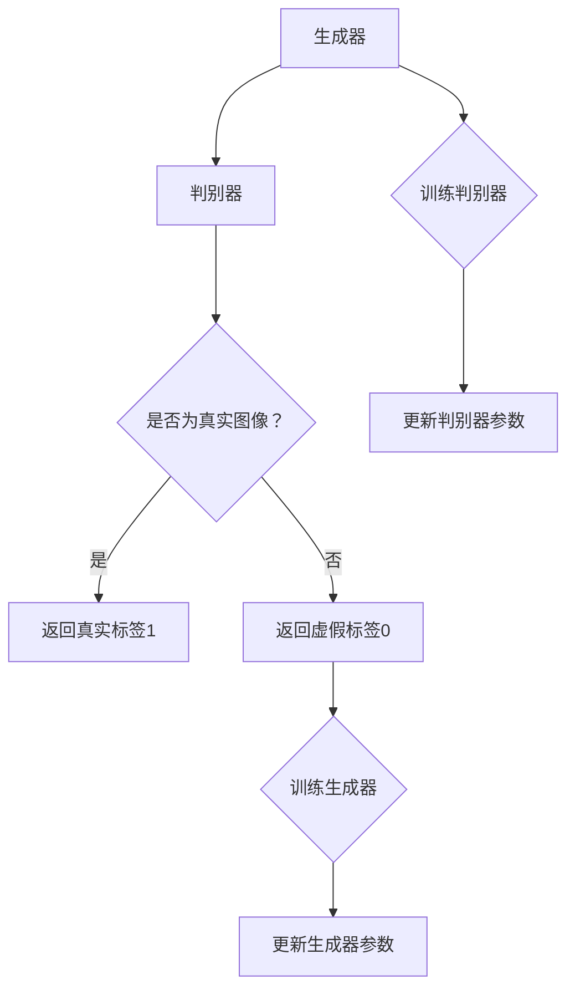

                 

### 文章标题

《生成对抗网络GAN原理与代码实例讲解》

关键词：生成对抗网络，GAN，图像生成，图像修复，图像超分辨率，风格迁移，数学原理，代码实战

摘要：本文旨在深入剖析生成对抗网络（Generative Adversarial Networks，GAN）的基本原理、核心架构及其在实际应用中的各种实践案例。通过详细讲解GAN的数学模型、训练过程、变体以及代码实现，帮助读者全面了解GAN的强大功能和应用场景，从而提升对深度学习技术的掌握。

### GAN基础理论

#### 第1章：GAN的背景与基本概念

**1.1.1 生成对抗网络的概念**

生成对抗网络（Generative Adversarial Networks，GAN）是由Ian Goodfellow等人在2014年提出的一种深度学习模型，它由两个神经网络（生成器G和判别器D）组成，它们之间进行对抗训练。生成器G的目的是生成尽可能逼真的数据，而判别器D的任务是区分输入数据是真实数据还是生成器G生成的虚假数据。通过这种对抗训练，生成器G和判别器D不断进步，最终生成器G可以生成几乎以假乱真的数据。

**1.1.2 GAN的起源与发展**

GAN的起源可以追溯到1990年代，当时Ian Goodfellow在Geoffrey Hinton的指导下完成了他的博士论文，并提出GAN的概念。GAN最初主要用于图像生成任务，但随后迅速扩展到其他领域，如语音合成、文本生成等。随着深度学习技术的不断发展，GAN也在不断地演进，涌现出许多变体和改进方法。

**1.1.3 GAN的核心架构**

GAN的核心架构包括生成器（Generator）和判别器（Discriminator）两个部分。生成器的输入是一个随机噪声向量z，输出是生成的人工数据x'。判别器的输入是真实数据x和生成器生成的数据x'，输出是一个二分类标签，判断输入数据是真实数据还是生成数据。GAN的训练过程是一个博弈过程，生成器和判别器相互对抗，不断优化自己的性能。

#### 第2章：GAN的数学原理

**2.1.1 生成器的数学原理**

生成器的目的是生成与真实数据分布相似的虚假数据。在数学上，生成器的目标函数可以表示为：

$$
G(z) = \text{Data}
$$

其中，z是一个从先验分布中采样的随机噪声向量，G(z)是生成器生成的虚假数据。

**2.1.2 判别器的数学原理**

判别器的任务是区分输入数据是真实数据还是生成器生成的虚假数据。在数学上，判别器的目标函数可以表示为：

$$
D(x) = \text{Real} \\
D(G(z)) = \text{Fake}
$$

其中，x是真实数据，G(z)是生成器生成的虚假数据。

**2.1.3 GAN的整体数学模型**

GAN的整体数学模型可以表示为：

$$
L_G = -\sum_{x \in X} \log(D(G(z)))+\sum_{z \in Z} \log(1 - D(G(z)))
$$

$$
L_D = -\sum_{x \in X} \log(D(x)) - \sum_{z \in Z} \log(1 - D(G(z)))
$$

其中，L_G是生成器的损失函数，L_D是判别器的损失函数。X是真实数据的集合，Z是噪声向量的集合。

#### 第3章：GAN的训练过程

**3.1.1 GAN的训练流程**

GAN的训练流程可以分为以下步骤：

1. **初始化生成器G和判别器D**：初始化生成器和判别器的权重。
2. **生成虚假数据**：生成器G根据随机噪声向量z生成虚假数据x'。
3. **训练判别器D**：判别器D对真实数据x和生成器G生成的虚假数据x'进行判别，并更新判别器的权重。
4. **训练生成器G**：生成器G根据判别器D的判别结果，更新生成器的权重，以生成更逼真的虚假数据。
5. **重复步骤2-4**：不断重复训练过程，直到生成器G生成的虚假数据足够逼真。

**3.1.2 GAN的优化策略**

为了稳定GAN的训练过程，可以采用以下优化策略：

1. **梯度惩罚**：在判别器D的损失函数中加入梯度惩罚项，以防止生成器G生成过于简单或重复的数据。
2. **学习率调度**：根据训练过程动态调整生成器G和判别器D的学习率，以防止过早地过拟合。
3. **梯度裁剪**：对生成器G和判别器D的梯度进行裁剪，以防止梯度爆炸或消失。

#### 第4章：GAN的变体

**4.1.1 条件GAN（cGAN）**

条件GAN（Conditional GAN，cGAN）是在GAN的基础上加入条件信息，使得生成器和判别器能够生成和区分具有特定属性的数据。cGAN的数学模型可以表示为：

$$
G(z, c) = \text{Data}(c) \\
D(x, c) = \text{Real}(c)
$$

其中，z是随机噪声向量，c是条件信息。

**4.1.2 深度卷积GAN（DCGAN）**

深度卷积GAN（Deep Convolutional GAN，DCGAN）是GAN的一种变体，它使用深度卷积神经网络（Deep Convolutional Neural Networks）作为生成器和判别器，以提高图像生成的质量和稳定性。

**4.1.3 循环一致GAN（CycleGAN）**

循环一致GAN（CycleGAN）是一种用于无监督风格迁移的GAN变体，它能够将一种风格的内容迁移到另一种风格上。CycleGAN的核心思想是利用一个额外的生成器E，使得真实数据x通过E和G两次变换后能够恢复原样，即满足：

$$
G(E(x)) = x \\
E(G(x')) = x'
$$

### 《生成对抗网络GAN原理与代码实例讲解》目录大纲

#### 第一部分：GAN基础理论

**第1章：GAN的背景与基本概念**

1.1.1 生成对抗网络的概念

1.1.2 GAN的起源与发展

1.1.3 GAN的核心架构

**第2章：GAN的数学原理**

2.1.1 生成器的数学原理

2.1.2 判别器的数学原理

2.1.3 GAN的整体数学模型

**第3章：GAN的训练过程**

3.1.1 GAN的训练流程

3.1.2 GAN的优化策略

**第4章：GAN的变体**

4.1.1 条件GAN（cGAN）

4.1.2 深度卷积GAN（DCGAN）

4.1.3 循环一致GAN（CycleGAN）

#### 第二部分：GAN的实践应用

**第5章：GAN在图像生成中的应用**

5.1.1 图像生成的基本原理

5.1.2 使用DCGAN生成人脸图像

**第6章：GAN在图像超分辨率中的应用**

6.1.1 图像超分辨率的基本原理

6.1.2 使用SRGAN进行图像超分辨率处理

**第7章：GAN在图像修复与修复中的应用**

7.1.1 图像修复的基本原理

7.1.2 使用CycleGAN进行图像修复

**第8章：GAN在风格迁移中的应用**

8.1.1 风格迁移的基本原理

8.1.2 使用StyleGAN进行风格迁移

**第9章：GAN在计算机视觉中的其他应用**

9.1.1 GAN在目标检测中的应用

9.1.2 GAN在图像分类中的应用

#### 第三部分：GAN的代码实战

**第10章：搭建GAN的开发环境**

10.1.1 环境配置

10.1.2 相关库的安装

**第11章：实现一个简单的GAN模型**

11.1.1 模型架构

11.1.2 代码实现

**第12章：GAN模型的评估与优化**

12.1.1 模型评估指标

12.1.2 模型优化技巧

**第13章：实战案例解析**

13.1.1 图像生成案例

13.1.2 图像超分辨率案例

13.1.3 图像修复案例

13.1.4 风格迁移案例

#### 附录

**附录A：GAN常用库与工具**

A.1 PyTorch的使用

A.2 TensorFlow的使用

A.3 其他GAN相关资源

### GAN核心概念与架构流程图



### 生成器与判别器的伪代码

```python
## 生成器

function G(z):
    # 输入为噪声向量 z，输出为生成的图像
    x_g = ...
    return x_g

## 判别器

function D(x):
    # 输入为图像 x，输出为判别结果
    logits = ...
    return logits
```

### 数学模型与公式

```latex
## 生成器损失函数
L_G = -\sum_{x \in X} \log(D(G(z)))+\sum_{z \in Z} \log(1 - D(G(z)))

## 判别器损失函数
L_D = -\sum_{x \in X} \log(D(x)) - \sum_{z \in Z} \log(1 - D(G(z)))
```

### 实战案例：使用DCGAN生成人脸图像

```python
# 导入相关库
import torch
import torchvision
import torch.nn as nn
import torch.optim as optim

# 定义生成器和判别器
G = ...
D = ...

# 设置优化器
optimizer_G = optim.Adam(G.parameters(), lr=0.0002)
optimizer_D = optim.Adam(D.parameters(), lr=0.0002)

# 训练模型
for epoch in range(num_epochs):
    for i, (x, _) in enumerate(data_loader):
        # 训练判别器
        D.zero_grad()
        x = x.to(device)  # 将真实图像数据移动到 GPU 或 CPU 设备上
        z = ...  # 生成噪声向量 z
        x_g = G(z).to(device)  # 使用生成器生成虚假图像
        logits_real = D(x)
        logits_fake = D(x_g)
        loss_D = ...

        loss_D.backward()
        optimizer_D.step()

        # 训练生成器
        G.zero_grad()
        z = ...  # 生成噪声向量 z
        x_g = G(z).to(device)  # 使用生成器生成虚假图像
        logits_fake = D(x_g)
        loss_G = ...

        loss_G.backward()
        optimizer_G.step()
```

### 代码解读与分析

```python
# 判别器训练部分
D.zero_grad()
x = x.to(device)  # 将真实图像数据移动到 GPU 或 CPU 设备上
z = ...  # 生成噪声向量 z
x_g = G(z).to(device)  # 使用生成器生成虚假图像
logits_real = D(x)  # 判别器对真实图像进行判别
logits_fake = D(x_g)  # 判别器对虚假图像进行判别
loss_D = nn.BCELoss()(logits_real, torch.ones(logits_real.size()).to(device)) + nn.BCELoss()(logits_fake, torch.zeros(logits_fake.size()).to(device))  # 计算判别器损失
loss_D.backward()  # 反向传播计算损失梯度
optimizer_D.step()  # 更新判别器参数

# 生成器训练部分
G.zero_grad()
z = ...  # 生成噪声向量 z
x_g = G(z).to(device)  # 使用生成器生成虚假图像
logits_fake = D(x_g)  # 判别器对虚假图像进行判别
loss_G = nn.BCELoss()(logits_fake, torch.ones(logits_fake.size()).to(device))  # 计算生成器损失
loss_G.backward()  # 反向传播计算损失梯度
optimizer_G.step()  # 更新生成器参数
```

### 附录

#### 附录A：GAN常用库与工具

**A.1 PyTorch的使用**

PyTorch是一个流行的深度学习框架，支持GPU加速，提供了丰富的API和工具，非常适合用于实现GAN模型。

**A.2 TensorFlow的使用**

TensorFlow是谷歌开发的深度学习框架，也广泛应用于GAN模型的实现。TensorFlow提供了灵活的图计算模型和丰富的API，适用于各种深度学习任务。

**A.3 其他GAN相关资源**

除了PyTorch和TensorFlow，还有其他一些流行的GAN实现工具，如Keras、MXNet等。此外，还有许多开源的GAN项目和教程，为研究者提供了丰富的资源。

### 结束语

本文系统地介绍了生成对抗网络（GAN）的基本原理、核心架构、训练过程、变体以及实践应用。通过详细讲解GAN的数学模型、伪代码实现、实际案例和代码解读，帮助读者深入理解GAN的工作原理和应用场景。GAN作为一种强大的深度学习模型，已经在图像生成、图像修复、图像超分辨率、风格迁移等领域取得了显著成果。随着深度学习技术的不断发展，GAN的应用前景将更加广阔，有望在更多领域发挥重要作用。希望本文能够为读者在GAN的研究和应用提供有益的参考和指导。作者：AI天才研究院/AI Genius Institute & 禅与计算机程序设计艺术/Zen And The Art of Computer Programming。

