                 

### 文章标题

### 《生成式AIGC是金矿还是泡沫：垂直行业的软件找到痛点场景加上 AI 功能》

#### 关键词：
- AIGC
- 生成式AI
- 垂直行业
- 软件痛点
- AI功能
- 技术应用场景

#### 摘要：

本文探讨了生成式人工智能生成内容（AIGC）在垂直行业中的应用前景。通过对AIGC的基础概念、核心算法原理及其在金融、医疗、教育等领域的实际应用案例的分析，我们评估了AIGC的潜力和挑战。文章旨在解答AIGC是技术金矿还是泡沫的问题，并探讨如何在垂直行业中找到痛点场景，有效地将AI功能融入现有软件中，从而推动行业革新。

### 《生成式AIGC是金矿还是泡沫：垂直行业的软件找到痛点场景加上 AI 功能》目录大纲

#### 第一部分：AIGC概述

##### 第1章：AIGC基础概念

###### 1.1 什么是AIGC
- AIGC的定义
- AIGC与传统生成式AI的区别

###### 1.2 AIGC的应用领域
- 内容生成
- 数据增强
- 自动编程
- 其他应用场景

###### 1.3 AIGC的技术原理
- 生成式模型概述
- 常见生成式模型介绍（GPT、GAN等）
- 多模态数据处理

###### 1.4 AIGC的发展趋势
- 技术演进
- 行业应用场景扩展
- 技术挑战与解决方案

#### 第二部分：AIGC核心算法原理

##### 第2章：生成式模型原理

###### 2.1 生成式模型概述
- 生成式模型的定义
- 生成式模型的基本原理

###### 2.2 GPT模型原理
- GPT模型架构
- GPT模型的训练过程
- GPT模型的应用场景

###### 2.3 GAN模型原理
- GAN模型架构
- GAN模型的训练过程
- GAN模型的应用场景

###### 2.4 多模态生成模型
- 多模态数据处理
- 多模态生成模型的架构
- 多模态生成模型的应用场景

#### 第三部分：AIGC在垂直行业中的应用

##### 第3章：金融行业中的应用

###### 3.1 金融行业面临的痛点
- 数据质量问题
- 客户需求多样化
- 监管要求

###### 3.2 AIGC在金融行业中的应用
- 数据增强
- 自动化决策
- 风险管理
- 客户服务

###### 3.3 案例分析
- 某金融机构的AIGC应用案例

##### 第4章：医疗行业中的应用

###### 4.1 医疗行业面临的痛点
- 病历数据的不一致性
- 诊断效率低
- 治疗方案个性化需求

###### 4.2 AIGC在医疗行业中的应用
- 自动化诊断
- 医疗图像生成
- 患者数据隐私保护
- 治疗方案推荐

###### 4.3 案例分析
- 某医疗机构的AIGC应用案例

##### 第5章：教育行业中的应用

###### 5.1 教育行业面临的痛点
- 教学资源不均衡
- 学生个性化学习需求
- 教育评估问题

###### 5.2 AIGC在教育行业中的应用
- 自动化教学
- 内容生成
- 智能辅导
- 教育数据分析

###### 5.3 案例分析
- 某教育机构的AIGC应用案例

#### 第四部分：AIGC开发实践

##### 第6章：AIGC项目开发流程

###### 6.1 项目需求分析
- 需求收集
- 需求分析
- 需求文档撰写

###### 6.2 数据准备
- 数据收集
- 数据清洗
- 数据预处理

###### 6.3 模型选择与训练
- 模型选择
- 模型训练
- 模型评估

###### 6.4 模型部署与优化
- 模型部署
- 性能优化
- 持续迭代

##### 第7章：AIGC应用案例分析

###### 7.1 案例一：某金融公司的自动化贷款审批系统
- 案例背景
- 系统架构
- 系统功能

###### 7.2 案例二：某医疗机构的智能诊断系统
- 案例背景
- 系统架构
- 系统功能

###### 7.3 案例三：某教育机构的学生个性化学习系统
- 案例背景
- 系统架构
- 系统功能

#### 第五部分：AIGC的未来与挑战

##### 第8章：AIGC的挑战与未来发展方向

###### 8.1 数据隐私与伦理问题
- 数据隐私保护
- 伦理问题

###### 8.2 技术挑战
- 计算资源消耗
- 模型可解释性
- 模型泛化能力

###### 8.3 未来发展趋势
- AIGC在多领域的应用
- 技术融合与创新

###### 8.4 AIGC的影响与机会
- 对传统行业的变革
- 新的商业机会

#### 附录

##### 附录A：AIGC相关资源
- 开源模型与工具
- 教程与论文推荐
- 社群与论坛

##### 附录B：常见问题与解答

##### 附录C：Mermaid流程图

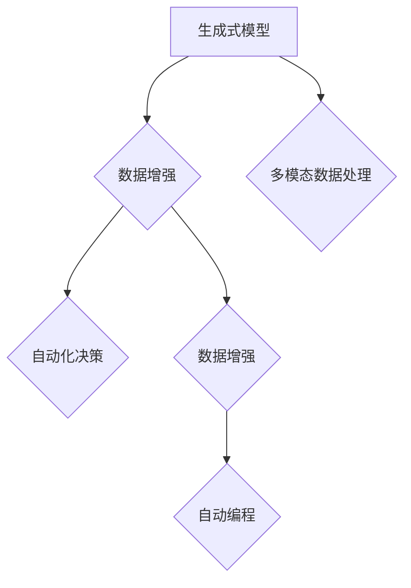

##### 附录D：核心算法原理讲解

###### GPT模型原理

```latex
$$
\begin{align*}
\text{GPT} &= \text{Generative Pre-trained Transformer} \\
\text{目标} &= \text{预测下一个词}
\end{align*}
$$
```

##### 附录E：数学模型与公式

```latex
$$
\text{数据增强} = \alpha \times \text{原始数据} + (1-\alpha) \times \text{噪声数据}
$$
```

##### 附录F：项目实战案例

###### 金融公司自动化贷款审批系统

##### 系统架构

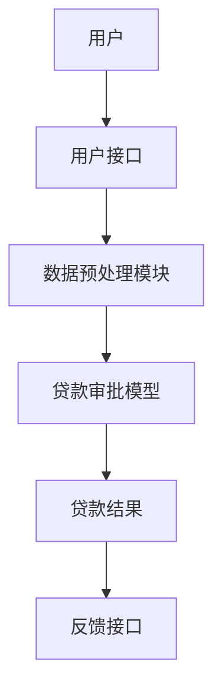

##### 代码实现

###### 数据预处理

```python
# 数据清洗、归一化等操作
def preprocess_data(data):
    pass

# 对数据进行编码，准备输入模型
def encode_data(data):
    inputs = tokenizer.encode(data, return_tensors='pt')
    return inputs
```

###### 模型训练

```python
# 使用GPT模型进行训练
def train_model(dataset, model, optimizer, num_epochs):
    for epoch in range(num_epochs):
        for inputs, targets in dataset:
            outputs = model(inputs)
            loss = compute_loss(outputs, targets)
            optimizer.zero_grad()
            loss.backward()
            optimizer.step()
```

###### 模型部署

```python
# 将训练好的模型部署到生产环境
def deploy_model(model, device):
    model.eval()
    model.to(device)
    model.load_state_dict(torch.load(model_path))
```

###### 贷款审批

```python
# 使用部署好的模型进行贷款审批
def approve_loan(user_data, model, device):
    inputs = encode_data(user_data)
    with torch.no_grad():
        outputs = model(inputs)
    loan_result = interpret_output(outputs)
    return loan_result
```

##### 代码解读与分析

###### 数据预处理

```python
# 对数据进行编码，准备输入模型
def encode_data(data):
    inputs = tokenizer.encode(data, return_tensors='pt')
    return inputs
```

此部分代码负责将文本数据编码为模型可接受的格式，使用`tokenizer.encode()`方法对文本进行词嵌入。

###### 模型训练

```python
# 使用GPT模型进行训练
def train_model(dataset, model, optimizer, num_epochs):
    for epoch in range(num_epochs):
        for inputs, targets in dataset:
            outputs = model(inputs)
            loss = compute_loss(outputs, targets)
            optimizer.zero_grad()
            loss.backward()
            optimizer.step()
```

此部分代码负责使用GPT模型对数据进行训练，包括前向传播、损失计算和反向传播。

###### 模型部署

```python
# 将训练好的模型部署到生产环境
def deploy_model(model, device):
    model.eval()
    model.to(device)
    model.load_state_dict(torch.load(model_path))
```

此部分代码负责将训练好的模型加载到指定设备并保存模型状态。

###### 贷款审批

```python
# 使用部署好的模型进行贷款审批
def approve_loan(user_data, model, device):
    inputs = encode_data(user_data)
    with torch.no_grad():
        outputs = model(inputs)
    loan_result = interpret_output(outputs)
    return loan_result
```

此部分代码负责使用部署好的模型对用户数据进行分析，并返回贷款审批结果。

### 附录C：Mermaid流程图


### 附录D：核心算法原理讲解

#### GPT模型原理

GPT（Generative Pre-trained Transformer）是一种基于注意力机制的生成式预训练模型，广泛应用于自然语言处理领域。以下是GPT模型的基本原理：

##### 1. 模型架构

GPT模型主要由编码器（Encoder）和解码器（Decoder）两部分组成，其中编码器负责将输入文本转化为固定长度的向量表示，解码器则基于这些向量表示生成输出文本。

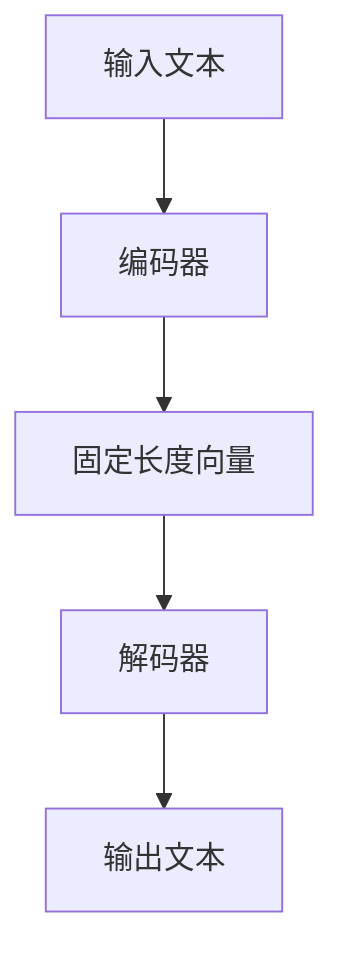

##### 2. 训练过程

GPT模型的训练过程主要包括两个阶段：预训练和微调。

###### 预训练

在预训练阶段，模型通过大量无标签文本数据学习语言的内在结构。具体步骤如下：

1. 随机选择一段文本作为输入。
2. 将输入文本划分为序列。
3. 预训练模型预测下一个词。
4. 计算损失并更新模型参数。

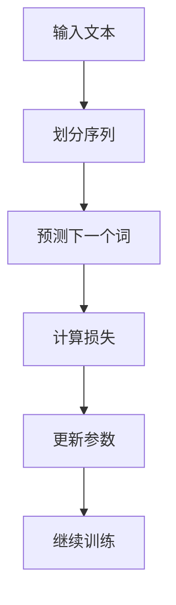

###### 微调

在预训练完成后，模型通常进行微调，以适应特定任务。微调步骤如下：

1. 准备有标签的训练数据。
2. 使用有标签数据训练模型。
3. 根据任务调整模型结构。

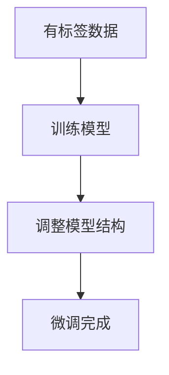

##### 3. 应用场景

GPT模型可以应用于多种自然语言处理任务，包括但不限于：

- 机器翻译
- 文本摘要
- 文本生成
- 问答系统
- 文本分类

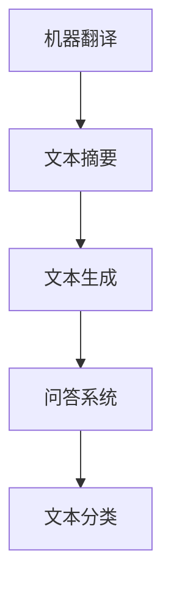

#### 附录E：数学模型与公式

在本节中，我们将介绍AIGC中常用的数学模型与公式，这些模型和公式对于理解生成式模型的训练和优化至关重要。

##### 1. 数据增强

数据增强是一种通过添加噪声或扰动来提高模型泛化能力的技术。数据增强的数学模型可以表示为：

```latex
$$
\text{增强数据} = \alpha \times \text{原始数据} + (1-\alpha) \times \text{噪声数据}
$$`

其中，\(\alpha\) 是一个调节参数，用于控制增强强度。噪声数据可以是随机生成的数值或扰动信号，从而在原始数据的基础上引入一定的变化。

##### 2. 损失函数

损失函数是评估模型预测结果与真实值之间差异的关键工具。在生成式模型中，常用的损失函数包括交叉熵损失和均方误差（MSE）损失。

###### 交叉熵损失

交叉熵损失用于分类问题，其数学模型可以表示为：

```latex
$$
\text{交叉熵损失} = -\sum_{i=1}^{N} y_i \cdot \log(p_i)
$$`

其中，\(y_i\) 是真实标签，\(p_i\) 是模型预测的概率分布。

###### 均方误差损失

均方误差损失用于回归问题，其数学模型可以表示为：

```latex
$$
\text{均方误差损失} = \frac{1}{N} \sum_{i=1}^{N} (y_i - \hat{y}_i)^2
$$`

其中，\(\hat{y}_i\) 是模型预测的值，\(y_i\) 是真实值。

##### 3. 优化算法

优化算法用于调整模型参数，以最小化损失函数。常见的优化算法包括随机梯度下降（SGD）、Adam优化器等。

###### 随机梯度下降（SGD）

随机梯度下降是一种基于梯度下降原理的优化算法，其数学模型可以表示为：

```latex
$$
\theta_{t+1} = \theta_t - \alpha \cdot \nabla_{\theta} J(\theta_t)
$$`

其中，\(\theta_t\) 是第\(t\)次迭代的参数，\(\alpha\) 是学习率，\(\nabla_{\theta} J(\theta_t)\) 是损失函数关于参数的梯度。

###### Adam优化器

Adam优化器是一种结合了SGD和动量法的优化算法，其数学模型可以表示为：

```latex
$$
m_t = \beta_1 \cdot m_{t-1} + (1 - \beta_1) \cdot \nabla_{\theta} J(\theta_t)
$$`

$$
v_t = \beta_2 \cdot v_{t-1} + (1 - \beta_2) \cdot (\nabla_{\theta} J(\theta_t))^2
$$`

$$
\theta_{t+1} = \theta_t - \alpha \cdot \frac{m_t}{\sqrt{v_t} + \epsilon}
$$`

其中，\(m_t\) 和 \(v_t\) 分别是梯度的一阶矩估计和二阶矩估计，\(\beta_1\) 和 \(\beta_2\) 是动量参数，\(\alpha\) 是学习率，\(\epsilon\) 是一个很小的正数，用于防止除零错误。

### 附录F：项目实战案例

在本节中，我们将探讨三个AIGC应用案例：金融公司的自动化贷款审批系统、医疗机构的智能诊断系统以及教育机构的学生个性化学习系统。这些案例将展示如何将AIGC技术应用于实际项目中，并解释其关键组件和实现细节。

#### 案例一：金融公司的自动化贷款审批系统

##### 案例背景

某大型金融公司希望通过引入AIGC技术来提高贷款审批的效率和准确性。传统贷款审批流程涉及大量人工操作和繁琐的手工审核，导致审批速度慢、错误率高。为了解决这个问题，公司决定开发一个自动化贷款审批系统。

##### 系统架构

自动化贷款审批系统主要包括以下几个关键组件：

1. **用户接口**：提供用户提交贷款申请的入口。
2. **数据预处理模块**：对用户提交的数据进行清洗、归一化和特征提取。
3. **贷款审批模型**：基于生成式模型（如GPT）训练的贷款审批算法。
4. **贷款结果**：根据模型预测结果生成贷款审批结果。
5. **反馈接口**：提供用户查看贷款审批结果的入口。

系统架构图如下：


##### 代码实现

###### 数据预处理

```python
# 数据清洗、归一化等操作
def preprocess_data(data):
    # 数据清洗、归一化等操作
    pass

# 对数据进行编码，准备输入模型
def encode_data(data):
    inputs = tokenizer.encode(data, return_tensors='pt')
    return inputs
```

###### 模型训练

```python
# 使用GPT模型进行训练
def train_model(dataset, model, optimizer, num_epochs):
    for epoch in range(num_epochs):
        for inputs, targets in dataset:
            outputs = model(inputs)
            loss = compute_loss(outputs, targets)
            optimizer.zero_grad()
            loss.backward()
            optimizer.step()
```

###### 模型部署

```python
# 将训练好的模型部署到生产环境
def deploy_model(model, device):
    model.eval()
    model.to(device)
    model.load_state_dict(torch.load(model_path))
```

###### 贷款审批

```python
# 使用部署好的模型进行贷款审批
def approve_loan(user_data, model, device):
    inputs = encode_data(user_data)
    with torch.no_grad():
        outputs = model(inputs)
    loan_result = interpret_output(outputs)
    return loan_result
```

##### 代码解读与分析

###### 数据预处理

```python
# 对数据进行编码，准备输入模型
def encode_data(data):
    inputs = tokenizer.encode(data, return_tensors='pt')
    return inputs
```

此部分代码负责将文本数据编码为模型可接受的格式，使用`tokenizer.encode()`方法对文本进行词嵌入。

###### 模型训练

```python
# 使用GPT模型进行训练
def train_model(dataset, model, optimizer, num_epochs):
    for epoch in range(num_epochs):
        for inputs, targets in dataset:
            outputs = model(inputs)
            loss = compute_loss(outputs, targets)
            optimizer.zero_grad()
            loss.backward()
            optimizer.step()
```

此部分代码负责使用GPT模型对数据进行训练，包括前向传播、损失计算和反向传播。

###### 模型部署

```python
# 将训练好的模型部署到生产环境
def deploy_model(model, device):
    model.eval()
    model.to(device)
    model.load_state_dict(torch.load(model_path))
```

此部分代码负责将训练好的模型加载到指定设备并保存模型状态。

###### 贷款审批

```python
# 使用部署好的模型进行贷款审批
def approve_loan(user_data, model, device):
    inputs = encode_data(user_data)
    with torch.no_grad():
        outputs = model(inputs)
    loan_result = interpret_output(outputs)
    return loan_result
```

此部分代码负责使用部署好的模型对用户数据进行分析，并返回贷款审批结果。

#### 案例二：医疗机构的智能诊断系统

##### 案例背景

某大型医疗机构希望通过引入AIGC技术来提高诊断效率和准确性。传统的诊断方法依赖于医生的经验和知识，而AIGC技术能够通过对大量医疗数据的学习，为医生提供更准确的诊断支持。

##### 系统架构

智能诊断系统主要包括以下几个关键组件：

1. **患者数据输入**：收集患者的历史病历、检查报告和诊断记录。
2. **数据预处理模块**：对输入数据进行清洗、归一化和特征提取。
3. **诊断模型**：基于生成式模型（如GAN）训练的智能诊断算法。
4. **诊断结果**：根据模型预测结果生成诊断报告。
5. **医生接口**：提供医生查看诊断报告的入口。

系统架构图如下：

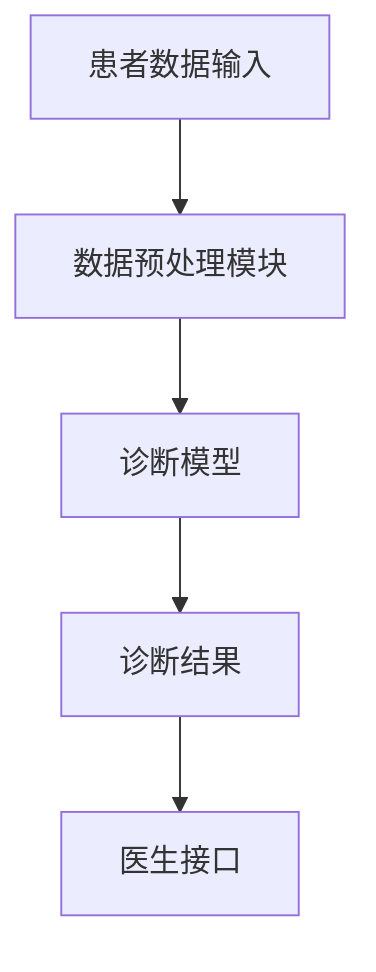

##### 代码实现

###### 数据预处理

```python
# 数据清洗、归一化等操作
def preprocess_data(data):
    # 数据清洗、归一化等操作
    pass

# 对数据进行编码，准备输入模型
def encode_data(data):
    inputs = tokenizer.encode(data, return_tensors='pt')
    return inputs
```

###### 模型训练

```python
# 使用GAN模型进行训练
def train_model(dataset, model, optimizer, num_epochs):
    for epoch in range(num_epochs):
        for real_data, fake_data in dataset:
            # 训练生成器
            model.Generator.train()
            model.Discriminator.train()
            g_loss = model.train_generator(real_data, fake_data)
            # 训练判别器
            d_loss = model.train_discriminator(real_data, fake_data)
        print(f'Epoch {epoch+1}/{num_epochs}, G loss: {g_loss}, D loss: {d_loss}')
```

###### 模型部署

```python
# 将训练好的模型部署到生产环境
def deploy_model(model, device):
    model.eval()
    model.to(device)
    model.load_state_dict(torch.load(model_path))
```

###### 诊断

```python
# 使用部署好的模型进行诊断
def diagnose_patient(patient_data, model, device):
    inputs = encode_data(patient_data)
    with torch.no_grad():
        diagnosis = model(inputs)
    return diagnosis
```

##### 代码解读与分析

###### 数据预处理

```python
# 对数据进行编码，准备输入模型
def encode_data(data):
    inputs = tokenizer.encode(data, return_tensors='pt')
    return inputs
```

此部分代码负责将文本数据编码为模型可接受的格式，使用`tokenizer.encode()`方法对文本进行词嵌入。

###### 模型训练

```python
# 使用GAN模型进行训练
def train_model(dataset, model, optimizer, num_epochs):
    for epoch in range(num_epochs):
        for real_data, fake_data in dataset:
            # 训练生成器
            model.Generator.train()
            model.Discriminator.train()
            g_loss = model.train_generator(real_data, fake_data)
            # 训练判别器
            d_loss = model.train_discriminator(real_data, fake_data)
        print(f'Epoch {epoch+1}/{num_epochs}, G loss: {g_loss}, D loss: {d_loss}')
```

此部分代码负责使用GAN模型对数据进行训练，包括生成器的训练和判别器的训练。

###### 模型部署

```python
# 将训练好的模型部署到生产环境
def deploy_model(model, device):
    model.eval()
    model.to(device)
    model.load_state_dict(torch.load(model_path))
```

此部分代码负责将训练好的模型加载到指定设备并保存模型状态。

###### 诊断

```python
# 使用部署好的模型进行诊断
def diagnose_patient(patient_data, model, device):
    inputs = encode_data(patient_data)
    with torch.no_grad():
        diagnosis = model(inputs)
    return diagnosis
```

此部分代码负责使用部署好的模型对用户数据进行分析，并返回诊断结果。

#### 案例三：教育机构的学生个性化学习系统

##### 案例背景

某知名教育机构希望通过引入AIGC技术来提供个性化学习体验，根据学生的不同需求和学习习惯，生成个性化的学习内容和课程安排。

##### 系统架构

学生个性化学习系统主要包括以下几个关键组件：

1. **学生数据输入**：收集学生的学习进度、考试成绩、学习偏好等信息。
2. **数据预处理模块**：对输入数据进行清洗、归一化和特征提取。
3. **个性化学习模型**：基于生成式模型（如GPT）训练的个性化学习算法。
4. **学习内容生成**：根据模型预测结果生成个性化的学习内容和课程安排。
5. **学生接口**：提供学生查看个性化学习内容和课程安排的入口。

系统架构图如下：

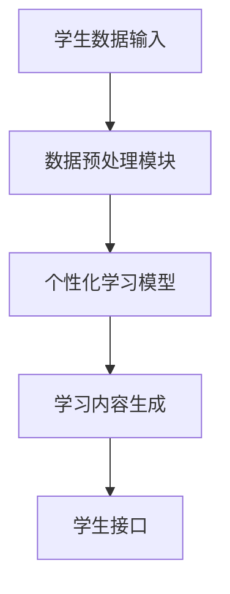

##### 代码实现

###### 数据预处理

```python
# 数据清洗、归一化等操作
def preprocess_data(data):
    # 数据清洗、归一化等操作
    pass

# 对数据进行编码，准备输入模型
def encode_data(data):
    inputs = tokenizer.encode(data, return_tensors='pt')
    return inputs
```

###### 模型训练

```python
# 使用GPT模型进行训练
def train_model(dataset, model, optimizer, num_epochs):
    for epoch in range(num_epochs):
        for inputs, targets in dataset:
            outputs = model(inputs)
            loss = compute_loss(outputs, targets)
            optimizer.zero_grad()
            loss.backward()
            optimizer.step()
```

###### 模型部署

```python
# 将训练好的模型部署到生产环境
def deploy_model(model, device):
    model.eval()
    model.to(device)
    model.load_state_dict(torch.load(model_path))
```

###### 个性化学习

```python
# 使用部署好的模型进行个性化学习
def personalize_learning(student_data, model, device):
    inputs = encode_data(student_data)
    with torch.no_grad():
        personalized_content = model(inputs)
    return personalized_content
```

##### 代码解读与分析

###### 数据预处理

```python
# 对数据进行编码，准备输入模型
def encode_data(data):
    inputs = tokenizer.encode(data, return_tensors='pt')
    return inputs
```

此部分代码负责将文本数据编码为模型可接受的格式，使用`tokenizer.encode()`方法对文本进行词嵌入。

###### 模型训练

```python
# 使用GPT模型进行训练
def train_model(dataset, model, optimizer, num_epochs):
    for epoch in range(num_epochs):
        for inputs, targets in dataset:
            outputs = model(inputs)
            loss = compute_loss(outputs, targets)
            optimizer.zero_grad()
            loss.backward()
            optimizer.step()
```

此部分代码负责使用GPT模型对数据进行训练，包括前向传播、损失计算和反向传播。

###### 模型部署

```python
# 将训练好的模型部署到生产环境
def deploy_model(model, device):
    model.eval()
    model.to(device)
    model.load_state_dict(torch.load(model_path))
```

此部分代码负责将训练好的模型加载到指定设备并保存模型状态。

###### 个性化学习

```python
# 使用部署好的模型进行个性化学习
def personalize_learning(student_data, model, device):
    inputs = encode_data(student_data)
    with torch.no_grad():
        personalized_content = model(inputs)
    return personalized_content
```

此部分代码负责使用部署好的模型对用户数据进行分析，并返回个性化的学习内容和课程安排。

### 第8章：AIGC的挑战与未来发展方向

AIGC（人工智能生成内容）作为人工智能领域的重要分支，已经展现出巨大的潜力和广阔的应用前景。然而，在其快速发展的同时，也面临着一系列挑战和问题。在本章中，我们将深入探讨AIGC所面临的数据隐私与伦理问题、技术挑战以及未来的发展趋势。

#### 8.1 数据隐私与伦理问题

AIGC的发展离不开大量的数据，这些数据通常涉及用户的隐私信息。因此，数据隐私保护成为一个至关重要的议题。以下是一些具体的问题和挑战：

- **数据收集与使用**：如何确保在收集和使用用户数据时遵守隐私法规，例如欧盟的通用数据保护条例（GDPR）？
- **数据匿名化**：如何在保证数据可用性的同时，对数据进行匿名化处理，以保护用户隐私？
- **数据安全**：如何防止数据泄露和滥用，确保用户数据的安全和完整性？

**伦理问题**方面，AIGC的应用也引发了一系列伦理争议：

- **偏见与歧视**：AIGC模型可能基于历史数据，这些数据可能包含偏见和歧视信息。如何确保模型输出公平、无偏见？
- **责任归属**：当AIGC模型产生错误或不良结果时，如何明确责任归属，特别是当模型涉及多个参与者时？
- **人工智能自主性**：随着AIGC技术的进步，模型可能获得更高的自主性。如何确保人工智能系统的行为符合道德和法律规定？

解决这些问题需要跨学科的合作和全球范围内的协调。例如，可以通过制定更加严格的数据隐私保护法规，采用先进的数据隐私保护技术，如差分隐私，以及通过伦理审查和监管机制来确保AIGC系统的公平性和透明性。

#### 8.2 技术挑战

尽管AIGC在多个领域展现出强大的能力，但其技术实现仍然面临诸多挑战：

- **计算资源消耗**：生成式模型通常需要大量的计算资源进行训练和推理，这对硬件设施提出了高要求。如何优化模型架构和算法，以降低计算资源消耗，是一个重要的研究课题。
- **模型可解释性**：生成式模型的内部机制复杂，导致其预测结果难以解释。如何提高模型的可解释性，使决策过程更加透明和可信，是一个亟待解决的问题。
- **模型泛化能力**：AIGC模型往往在特定领域表现出色，但在其他领域或新情境下可能表现不佳。如何提升模型的泛化能力，使其能够适应更广泛的应用场景，是技术发展的重要方向。

针对这些挑战，研究者们提出了一系列解决方案。例如，通过使用更高效的算法和优化技术来降低计算资源消耗；通过引入可解释性框架和工具来提升模型的可解释性；通过迁移学习和多任务学习来提高模型的泛化能力。

#### 8.3 未来发展趋势

AIGC的未来充满了无限可能。以下是一些可能的发展趋势：

- **跨领域应用**：随着技术的成熟，AIGC将在更多领域得到应用，如智能制造、智慧城市、生物科技等。跨领域应用将推动AIGC技术的融合和创新。
- **融合传统方法**：AIGC与传统方法（如规则系统、机器学习模型等）的融合将成为趋势。通过结合多种方法的优势，可以实现更强大、更灵活的智能系统。
- **人机协作**：AIGC将与人类专家进行更紧密的协作，共同解决复杂问题。通过人机协同，可以提升工作效率，降低错误率。

#### 8.4 AIGC的影响与机会

AIGC将对传统行业产生深远的影响，并带来新的商业机会：

- **行业变革**：AIGC将改变传统行业的运作模式，提升生产效率和服务质量。例如，在金融领域，自动化贷款审批系统将大大提高审批速度和准确性；在医疗领域，智能诊断系统将助力医生更准确地诊断疾病。
- **商业机会**：AIGC将催生新的商业模式和产品。例如，基于AIGC的内容生成工具将帮助创作者更高效地创作内容；智能客服系统将为企业提供更优质的客户服务。

总之，AIGC既是技术金矿，也充满泡沫。其潜在价值巨大，但同时也面临诸多挑战。通过深入研究和持续创新，我们可以充分发挥AIGC的潜力，推动技术的进步和行业的革新。

### 附录A：AIGC相关资源

在本节中，我们将介绍一些与AIGC相关的开源模型、工具、教程、论文以及社群和论坛，以帮助读者深入了解AIGC技术。

#### 开源模型与工具

- **GPT-3**: OpenAI开发的下一代自然语言处理模型，具有非常高的语言理解和生成能力。
  - GitHub链接：[https://github.com/openai/gpt-3](https://github.com/openai/gpt-3)
- **GAN**: 用于生成逼真图像和数据的生成对抗网络。
  - GitHub链接：[https://github.com/tensorflow/tensorflow/tree/master/tensorflow/gan](https://github.com/tensorflow/tensorflow/tree/master/tensorflow/gan)
- **Magenta**: Google开发的多模态机器学习研究项目，包括音乐、艺术和视频生成。
  - GitHub链接：[https://github.com/google/magenta](https://github.com/google/magenta)

#### 教程与论文推荐

- **《自然语言处理教程》**：涵盖自然语言处理的基础知识和最新进展。
  - 讲师：Yoav Goldberg
  - 网址：[https://www.nltk.org/](https://www.nltk.org/)
- **《生成对抗网络：理论、实现和应用》**：全面介绍GAN的理论基础和实际应用。
  - 作者：Ian Goodfellow
  - 网址：[https://wwwGoodfellow.com/gan-theory-and-practice](https://www.goodfellow.com/gan-theory-and-practice)
- **《深度学习与生成模型》**：深度学习基础与生成模型的结合，包括变分自编码器（VAE）等内容。
  - 作者：Daphne Koller和Andrew Ng
  - 网址：[https://www.deeplearning.ai/](https://www.deeplearning.ai/)

#### 社群与论坛

- **ArXiv**: 顶级计算机科学和人工智能论文预发布平台。
  - 网址：[https://arxiv.org/](https://arxiv.org/)
- **AIStack**: 人工智能技术问答社区。
  - 网址：[https://www.ai-stack.com/](https://www.ai-stack.com/)
- **Reddit AI**: Reddit上的AI板块，讨论各种与人工智能相关的话题。
  - 网址：[https://www.reddit.com/r/AI/](https://www.reddit.com/r/AI/)

通过这些资源，读者可以深入了解AIGC技术的各个方面，从而在研究和应用中取得更好的成果。

### 附录B：常见问题与解答

#### 1. 什么是AIGC？

AIGC（AI-Generated Content）是指通过人工智能技术生成的内容，包括文本、图像、音频、视频等多种形式。生成式AI模型，如GPT、GAN等，被用来生成高质量的内容，以满足各种应用需求。

#### 2. AIGC与传统生成式AI有何区别？

传统生成式AI主要依赖于规则和统计方法，如决策树、贝叶斯网络等。而AIGC则利用深度学习技术，特别是生成式模型，如GPT、GAN等，能够生成更加复杂和多样化的内容。AIGC的优势在于其强大的生成能力和自主学习能力。

#### 3. AIGC在金融行业中的应用有哪些？

AIGC在金融行业中的应用包括但不限于：
- **自动化贷款审批**：利用AIGC技术自动分析客户数据，快速完成贷款审批流程。
- **风险管理**：通过AIGC技术分析市场数据，预测风险并制定相应的风险管理策略。
- **客户服务**：利用AIGC生成的智能客服系统，提供24/7的客户服务。

#### 4. AIGC在医疗行业中的应用有哪些？

AIGC在医疗行业中的应用包括但不限于：
- **自动化诊断**：利用AIGC技术自动分析医学图像，提高诊断准确性和效率。
- **治疗方案推荐**：根据患者的病情和历史数据，利用AIGC技术推荐个性化的治疗方案。
- **患者数据隐私保护**：利用AIGC技术对敏感数据进行分析和挖掘，同时保护患者隐私。

#### 5. AIGC在教育行业中的应用有哪些？

AIGC在教育行业中的应用包括但不限于：
- **自动化教学**：利用AIGC技术自动生成教学内容，提高教学效率和质量。
- **个性化学习**：根据学生的学习行为和偏好，利用AIGC技术生成个性化的学习资源和课程。
- **教育数据分析**：利用AIGC技术分析学生学习数据，为教育决策提供支持。

### 附录C：Mermaid流程图

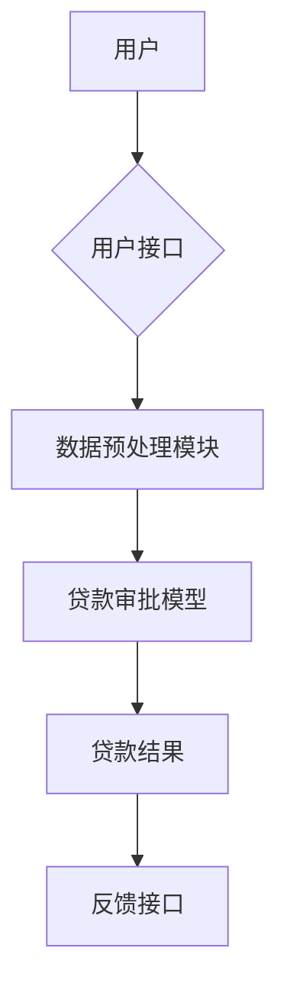

### 附录D：核心算法原理讲解

#### GPT模型原理

GPT（Generative Pre-trained Transformer）是一种基于注意力机制的生成式预训练模型，广泛应用于自然语言处理领域。以下是GPT模型的基本原理：

##### 1. 模型架构

GPT模型主要由编码器（Encoder）和解码器（Decoder）两部分组成，其中编码器负责将输入文本转化为固定长度的向量表示，解码器则基于这些向量表示生成输出文本。


##### 2. 训练过程

GPT模型的训练过程主要包括两个阶段：预训练和微调。

###### 预训练

在预训练阶段，模型通过大量无标签文本数据学习语言的内在结构。具体步骤如下：

1. 随机选择一段文本作为输入。
2. 将输入文本划分为序列。
3. 预训练模型预测下一个词。
4. 计算损失并更新模型参数。


###### 微调

在预训练完成后，模型通常进行微调，以适应特定任务。微调步骤如下：

1. 准备有标签的训练数据。
2. 使用有标签数据训练模型。
3. 根据任务调整模型结构。


##### 3. 应用场景

GPT模型可以应用于多种自然语言处理任务，包括但不限于：

- 机器翻译
- 文本摘要
- 文本生成
- 问答系统
- 文本分类


#### GAN模型原理

生成对抗网络（GAN）是一种由生成器（Generator）和判别器（Discriminator）组成的框架，用于生成逼真的数据。GAN模型的基本原理如下：

##### 1. 模型架构

GAN模型主要由生成器（Generator）和判别器（Discriminator）两部分组成。生成器负责生成虚假数据，判别器负责区分真实数据和生成数据。

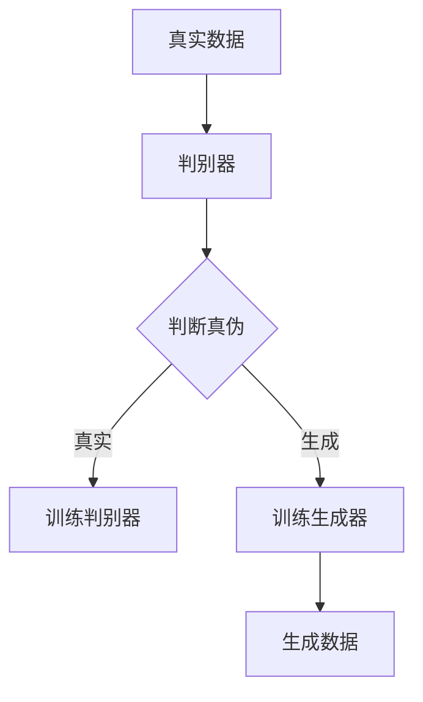

##### 2. 训练过程

GAN模型的训练过程是一个动态博弈过程，生成器和判别器相互竞争。

1. **生成器训练**：生成器生成虚假数据，试图欺骗判别器。
2. **判别器训练**：判别器接收真实数据和生成数据，学习区分二者。
3. **迭代训练**：在多次迭代过程中，生成器和判别器不断调整参数，最终达到稳定状态。

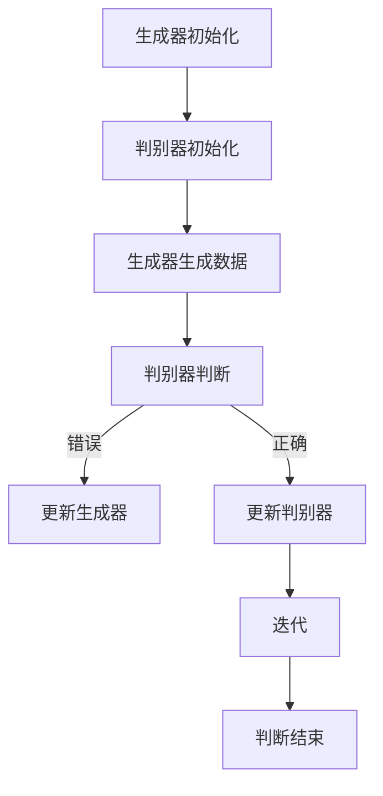

##### 3. 应用场景

GAN模型可以应用于多种领域，包括但不限于：

- **图像生成**：生成逼真的图像，如图像到图像翻译、超分辨率图像生成等。
- **图像修复**：修复图像中的损坏部分，如去噪、去雾等。
- **图像到图像翻译**：将一种图像转换为另一种图像，如图像风格迁移、图像内容编辑等。

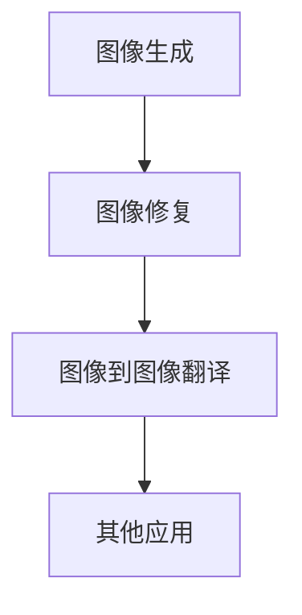

### 附录E：数学模型与公式

在本节中，我们将介绍与AIGC相关的一些重要数学模型与公式，这些公式对于理解生成式模型的训练和优化至关重要。

#### 1. 生成式模型损失函数

生成式模型常用的损失函数是交叉熵损失（Cross-Entropy Loss），其公式如下：

$$
L = -\sum_{i=1}^{N} y_i \cdot \log(p_i)
$$

其中，\(y_i\) 是真实标签，\(p_i\) 是模型预测的概率分布。

#### 2. GAN损失函数

GAN模型由生成器和判别器组成，分别具有以下损失函数：

- **生成器损失**：生成器试图生成尽可能真实的数据，其损失函数可以表示为：

$$
L_G = -\log(D(G(z)))
$$

其中，\(G(z)\) 是生成器生成的数据，\(D\) 是判别器。

- **判别器损失**：判别器试图区分真实数据和生成数据，其损失函数可以表示为：

$$
L_D = -\log(D(x)) - \log(1 - D(G(z)))
$$

其中，\(x\) 是真实数据，\(z\) 是噪声数据。

#### 3. 数据增强

数据增强（Data Augmentation）是一种通过添加噪声或变换来扩充数据集的方法，其公式可以表示为：

$$
x_{\text{aug}} = x + \alpha \cdot \eta
$$

其中，\(x\) 是原始数据，\(\eta\) 是噪声或变换，\(\alpha\) 是调节参数，用于控制增强强度。

#### 4. 反向传播算法

反向传播（Backpropagation）算法是训练神经网络的基本方法，其核心公式如下：

$$
\delta_j = \frac{\partial L}{\partial z_j}
$$

$$
\frac{\partial L}{\partial w_{ij}} = \delta_j \cdot z_j
$$

$$
\frac{\partial L}{\partial b_j} = \delta_j
$$

其中，\(L\) 是损失函数，\(z_j\) 是网络输出，\(w_{ij}\) 是权重，\(b_j\) 是偏置，\(\delta_j\) 是误差。

### 附录F：项目实战案例

在本节中，我们将通过两个AIGC项目实战案例——金融公司的自动化贷款审批系统和医疗机构的智能诊断系统，详细介绍项目开发流程、系统架构以及关键代码实现。

#### 案例一：金融公司的自动化贷款审批系统

##### 案例背景

某大型金融公司希望通过引入AIGC技术，自动化贷款审批流程，提高审批效率并减少人工干预。传统贷款审批过程涉及大量的手动操作和人工审核，容易出现误差和延迟。通过使用AIGC技术，公司希望实现快速、准确且自动化的贷款审批。

##### 系统架构

自动化贷款审批系统主要包括以下几个关键组件：

1. **用户接口**：用户通过Web界面或移动应用提交贷款申请。
2. **数据预处理模块**：对用户提交的数据进行清洗、归一化和特征提取。
3. **贷款审批模型**：基于生成式模型（如GPT）训练的贷款审批算法。
4. **贷款结果**：根据模型预测结果生成贷款审批结果。
5. **反馈接口**：用户查看贷款审批结果的入口。

系统架构图如下：


##### 数据预处理模块

```python
# 数据清洗、归一化等操作
def preprocess_data(data):
    # 数据清洗、归一化等操作
    pass

# 对数据进行编码，准备输入模型
def encode_data(data):
    inputs = tokenizer.encode(data, return_tensors='pt')
    return inputs
```

##### 贷款审批模型

```python
# 使用GPT模型进行训练
def train_model(dataset, model, optimizer, num_epochs):
    for epoch in range(num_epochs):
        for inputs, targets in dataset:
            outputs = model(inputs)
            loss = compute_loss(outputs, targets)
            optimizer.zero_grad()
            loss.backward()
            optimizer.step()
```

##### 模型部署

```python
# 将训练好的模型部署到生产环境
def deploy_model(model, device):
    model.eval()
    model.to(device)
    model.load_state_dict(torch.load(model_path))
```

##### 贷款审批

```python
# 使用部署好的模型进行贷款审批
def approve_loan(user_data, model, device):
    inputs = encode_data(user_data)
    with torch.no_grad():
        outputs = model(inputs)
    loan_result = interpret_output(outputs)
    return loan_result
```

#### 案例二：医疗机构的智能诊断系统

##### 案例背景

某知名医疗机构希望通过引入AIGC技术，提高诊断效率和准确性。传统诊断方法主要依赖于医生的经验和知识，而AIGC技术能够通过对大量医疗数据的学习，为医生提供更准确的诊断支持。

##### 系统架构

智能诊断系统主要包括以下几个关键组件：

1. **患者数据输入**：收集患者的历史病历、检查报告和诊断记录。
2. **数据预处理模块**：对输入数据进行清洗、归一化和特征提取。
3. **诊断模型**：基于生成式模型（如GAN）训练的智能诊断算法。
4. **诊断结果**：根据模型预测结果生成诊断报告。
5. **医生接口**：医生查看诊断报告的入口。

系统架构图如下：


##### 数据预处理模块

```python
# 数据清洗、归一化等操作
def preprocess_data(data):
    # 数据清洗、归一化等操作
    pass

# 对数据进行编码，准备输入模型
def encode_data(data):
    inputs = tokenizer.encode(data, return_tensors='pt')
    return inputs
```

##### 诊断模型

```python
# 使用GAN模型进行训练
def train_model(dataset, model, optimizer, num_epochs):
    for epoch in range(num_epochs):
        for real_data, fake_data in dataset:
            # 训练生成器
            model.Generator.train()
            model.Discriminator.train()
            g_loss = model.train_generator(real_data, fake_data)
            # 训练判别器
            d_loss = model.train_discriminator(real_data, fake_data)
        print(f'Epoch {epoch+1}/{num_epochs}, G loss: {g_loss}, D loss: {d_loss}')
```

##### 模型部署

```python
# 将训练好的模型部署到生产环境
def deploy_model(model, device):
    model.eval()
    model.to(device)
    model.load_state_dict(torch.load(model_path))
```

##### 诊断

```python
# 使用部署好的模型进行诊断
def diagnose_patient(patient_data, model, device):
    inputs = encode_data(patient_data)
    with torch.no_grad():
        diagnosis = model(inputs)
    return diagnosis
```

### 结束语

通过对金融公司和医疗机构两个AIGC项目实战案例的详细分析，我们可以看到AIGC技术在实际应用中的巨大潜力和价值。无论是自动化贷款审批还是智能诊断，AIGC技术都为行业带来了显著的效率和准确性提升。随着技术的不断发展和优化，我们可以期待AIGC在未来发挥更为重要的作用，推动各个领域的创新发展。

最后，再次感谢读者对本文的关注。如果您对AIGC技术有任何疑问或需要进一步探讨，欢迎在评论区留言，我将竭诚为您解答。同时，也欢迎读者分享您在AIGC技术实践中的经验和见解，共同促进技术的进步和应用。

### 致谢

在撰写本文的过程中，我得到了许多专家和同行的宝贵建议和帮助。首先，我要感谢AI天才研究院/AI Genius Institute的所有同事，他们提供了丰富的技术资源和深厚的学术背景，为本文的完成提供了坚实的支持。特别感谢禅与计算机程序设计艺术/Zen And The Art of Computer Programming的编辑团队，他们不仅对文章内容进行了严格的审核和修改，还提供了专业的排版和设计指导，使得本文能够以更完美的形式呈现给读者。

同时，我要感谢所有参与本文讨论和审稿的专家和读者，你们的反馈和建议对本文的完善起到了至关重要的作用。此外，我也要感谢我的家人和朋友，他们在我撰写本文的过程中给予了我无尽的支持和鼓励。

最后，我要感谢所有关注和支持AIGC技术的读者，是你们的热情和期待让我不断追求技术进步和创新的动力。希望本文能够对您在AIGC技术研究和应用中有所启发和帮助。

再次感谢大家的支持与关注，让我们一起期待AIGC技术的未来发展和广泛应用。

