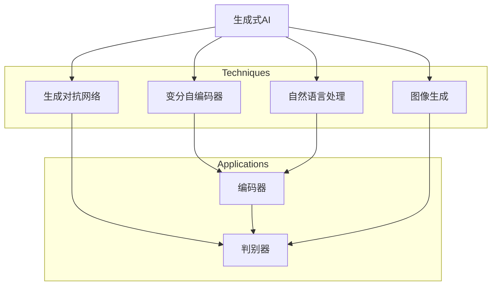

                 

### 文章标题：生成式AIGC：AI技术的商业化路径

生成式人工智能（AIGC，Artificial Intelligence Generated Content）是近年来迅速发展的一个领域，它在图像生成、文本生成、音乐创作等方面展现出巨大的潜力。随着AI技术的不断进步，AIGC不仅改变了内容创作的方式，也为商业领域带来了新的机遇和挑战。本文将深入探讨生成式AIGC的核心技术、商业化应用前景、商业模式以及面临的挑战，并展望其未来的发展趋势。

### 文章关键词

- 生成式人工智能
- AIGC
- 商业化
- 技术应用
- 模型优化
- 案例解析
- 发展趋势

### 摘要

本文旨在全面解析生成式人工智能（AIGC）的商业化路径。首先，介绍AIGC的基本概念、定义和发展历程，阐述其核心技术和特点。随后，分析AIGC在各个行业中的应用前景，探讨其商业模式与盈利模式。接着，深入讲解AIGC的核心算法，包括生成对抗网络（GAN）、变分自编码器（VAE）和自然语言处理（NLP）技术。通过实际案例解析，展示AIGC在不同领域中的应用。最后，分析AIGC商业化的挑战与机遇，并展望其未来发展趋势，为相关领域的研究者和从业者提供有价值的参考。

### 第一部分：AIGC概述

#### 1.1 AIGC的基本概念

生成式人工智能（AIGC，Artificial Intelligence Generated Content）是一种利用人工智能技术生成内容的方法，它包括图像、文本、音频等多种形式。与传统的基于规则或数据驱动的AI技术不同，AIGC通过学习大量数据，自主生成新的、与原始数据相似的内容。

**生成式AI简介**

生成式AI的核心是生成模型，这类模型旨在通过学习数据分布来生成新的数据。常见的生成模型包括生成对抗网络（GAN）、变分自编码器（VAE）和自回归模型等。

**AIGC的定义与发展历程**

AIGC的定义可以概括为：利用生成式AI技术，自动化生成具有人类创造力的内容。自2014年GAN问世以来，AIGC技术取得了显著进展。VAE的出现进一步丰富了生成式AI的技术体系。近年来，随着深度学习、强化学习等技术的融合，AIGC的应用场景和效果不断提升。

**AIGC的核心技术与特点**

AIGC的核心技术主要包括生成对抗网络（GAN）、变分自编码器（VAE）和自然语言处理（NLP）技术。

- **生成对抗网络（GAN）**：GAN由生成器（Generator）和判别器（Discriminator）组成。生成器旨在生成与真实数据相似的数据，而判别器则试图区分真实数据和生成数据。通过这种对抗训练，生成器不断提高生成质量。

- **变分自编码器（VAE）**：VAE通过编码器（Encoder）和解码器（Decoder）将输入数据编码为低维表示，然后解码器根据这个低维表示重建原始数据。VAE在生成质量上优于GAN，但生成样本的多样性较低。

- **自然语言处理（NLP）技术**：NLP技术包括词嵌入、序列模型和注意力机制等，用于处理和生成文本数据。这些技术在文本生成、机器翻译和问答系统中发挥了重要作用。

AIGC的特点在于：

- **高创造力**：AIGC能够生成具有创意和多样性的内容，模拟人类创造过程。
- **自动化**：通过算法和模型，AIGC能够自动化生成内容，减少人工干预。
- **跨领域应用**：AIGC在图像、文本、音频等多种领域都有广泛应用，具有跨领域的适应性。

#### 1.2 AIGC在商业化中的应用前景

AIGC在商业化中的应用前景非常广阔，以下分别介绍其在娱乐行业、广告与市场营销、教育与培训和医疗健康领域的应用前景。

**AIGC在娱乐行业的应用**

AIGC在娱乐行业中的应用主要包括电影与音乐创作、虚拟偶像与直播等。

- **电影与音乐创作**：利用AIGC技术，可以自动生成电影剧本和音乐。例如，通过自然语言处理技术，可以自动生成电影剧本；通过生成对抗网络（GAN），可以自动生成音乐片段。
- **虚拟偶像与直播**：虚拟偶像是一种利用AIGC技术创建的虚拟人物，它们可以唱歌、跳舞、互动等。直播内容也可以通过AIGC技术自动生成，提高直播的互动性和观赏性。

**AIGC在广告与市场营销的应用**

AIGC在广告与市场营销中的应用主要集中在广告创意自动化、市场预测与数据分析等方面。

- **广告创意自动化**：通过生成对抗网络（GAN）和自然语言处理（NLP）技术，可以自动生成广告图像和文案，提高广告的创意和吸引力。
- **市场预测与数据分析**：利用AIGC技术，可以对市场趋势和消费者行为进行预测，为企业提供决策支持。例如，通过生成式模型（如VAE），可以分析历史数据，预测未来的市场趋势。

**AIGC在教育与培训的应用**

AIGC在教育与培训中的应用主要体现在自适应学习系统和在线教育平台优化等方面。

- **自适应学习系统**：通过生成式AI技术，可以为每个学生提供个性化的学习路径和学习内容。例如，通过生成对抗网络（GAN），可以根据学生的学习数据，生成个性化的练习题。
- **在线教育平台优化**：通过生成式AI技术，可以优化在线教育平台的课程推荐和学习状态分析。例如，通过自然语言处理（NLP）技术，可以分析学生的反馈和互动，推荐更适合的课程。

**AIGC在医疗健康的应用**

AIGC在医疗健康领域的应用主要体现在诊断辅助系统和医疗服务个性化等方面。

- **诊断辅助系统**：通过生成对抗网络（GAN）和自然语言处理（NLP）技术，可以帮助医生进行疾病诊断。例如，通过分析医学影像数据，可以生成可能的疾病预测和诊断建议。
- **医疗服务个性化**：通过生成式AI技术，可以为患者提供个性化的健康管理和医疗服务。例如，通过变分自编码器（VAE），可以分析患者的健康数据，生成个性化的健康管理和医疗建议。

#### 1.3 AIGC的商业模式与盈利模式

AIGC的商业模式和盈利模式正在不断演变，以下分析AIGC在商业化中的具体路径和盈利模式。

**AIGC的商业化路径**

AIGC的商业化路径主要包括以下几种：

- **技术解决方案提供商**：为企业提供基于AIGC技术的定制化解决方案，如广告创意自动化、市场预测与数据分析等。
- **平台服务提供商**：建立AIGC平台，提供AI生成的内容，如虚拟偶像直播、个性化学习内容等。
- **应用场景开发者**：针对特定行业或领域，开发基于AIGC技术的应用场景，如医疗诊断辅助、娱乐内容创作等。

**AIGC的盈利模式分析**

AIGC的盈利模式主要包括以下几种：

- **订阅模式**：用户按月或按年订阅AIGC平台的服务，如个性化学习内容、广告创意生成等。
- **销售模式**：企业直接购买AIGC生成的产品或服务，如电影剧本、音乐片段等。
- **广告模式**：AIGC平台通过广告收入盈利，如为广告客户提供自动生成的广告内容。

**AIGC的挑战与机遇**

尽管AIGC在商业化中展现出巨大潜力，但也面临一系列挑战和机遇。

- **技术挑战**：包括算法优化、模型稳定性、数据处理与隐私保护等。
- **市场挑战**：包括市场需求预测、产品定位与推广等。
- **法律与伦理挑战**：涉及数据安全、隐私保护、版权问题等。

**机遇**：

- **市场机遇**：随着AI技术的普及，AIGC将在更多领域得到应用，市场潜力巨大。
- **创新机遇**：AIGC技术为商业创新提供了新的思路和方法，企业可以基于AIGC技术推出新的产品和服务。

### 第二部分：AIGC核心技术讲解

#### 2.1 生成式AI基础

生成式AI是AIGC的核心技术之一，它通过学习数据分布，生成新的、与原始数据相似的数据。本节将介绍生成式AI的基础知识，包括生成对抗网络（GAN）、变分自编码器（VAE）和生成式模型的应用举例。

##### 2.1.1 生成对抗网络(GAN)原理

生成对抗网络（GAN）是由Ian Goodfellow等人于2014年提出的一种生成模型。GAN的核心思想是通过两个神经网络的对抗训练，生成与真实数据分布相似的数据。

- **生成器（Generator）**：生成器旨在生成虚假数据，使其在统计上难以与真实数据区分。生成器的输入通常是随机噪声，输出是虚假数据。
- **判别器（Discriminator）**：判别器的任务是判断输入数据是真实数据还是生成器生成的虚假数据。判别器的输入是真实数据和生成器生成的虚假数据，输出是判断结果。

GAN的训练过程是一个对抗过程，生成器和判别器相互竞争。在训练过程中，生成器的目标是不断提高生成数据的真实性，而判别器的目标是不断提高对生成数据的鉴别能力。通过这种对抗训练，生成器的生成质量逐渐提高。

**GAN的架构与工作原理**

GAN的架构通常包括两个神经网络：生成器和判别器。生成器和判别器都是全连接神经网络，但它们的训练目标不同。

- **生成器**：生成器的输入是随机噪声向量\( z \)，输出是生成数据\( x_G \)。生成器通过学习数据分布来生成虚假数据，使其在统计上与真实数据相似。
- **判别器**：判别器的输入是真实数据\( x_R \)和生成数据\( x_G \)，输出是二分类结果。判别器的目标是判断输入数据是真实数据还是生成数据。

GAN的训练过程分为两个阶段：

1. **训练判别器**：在训练判别器时，生成器固定不变，判别器尝试区分真实数据和生成数据。判别器的损失函数通常为二元交叉熵损失函数。

2. **训练生成器**：在训练生成器时，判别器固定不变，生成器尝试生成更真实的数据，以欺骗判别器。生成器的损失函数通常为生成数据的反向损失函数。

**GAN的优化算法**

GAN的优化算法通常包括梯度裁剪、优化器选择和数据增强等。

- **梯度裁剪**：由于GAN的生成器和判别器训练不稳定，可能导致梯度消失或爆炸。梯度裁剪是一种防止梯度消失或爆炸的技术，通过限制梯度的大小，保证模型的稳定性。
- **优化器选择**：GAN的优化器通常选择Adam优化器，因为它具有自适应学习率的能力，可以更好地适应不同尺度的梯度。
- **数据增强**：数据增强是一种提高模型泛化能力的技术，通过增加数据的多样性，防止模型过拟合。

**GAN的应用举例**

GAN在各种应用场景中取得了显著成果，以下是一些典型的应用例子：

- **图像生成**：GAN可以生成高质量的自然图像，如图像合成、人脸生成、风景生成等。
- **文本生成**：GAN可以生成自然语言文本，如自动写作、诗歌创作、对话系统等。
- **音频生成**：GAN可以生成高质量的音乐和语音，如音乐创作、语音合成等。

##### 2.1.2 变分自编码器(VAE)原理

变分自编码器（VAE）是一种生成式模型，它通过编码器（Encoder）和解码器（Decoder）将输入数据编码为低维表示，然后解码器根据这个低维表示重建原始数据。与GAN不同，VAE通过最大化数据分布的似然函数来训练模型。

**VAE的架构与工作原理**

VAE的架构包括编码器（Encoder）和解码器（Decoder）两个部分。

- **编码器（Encoder）**：编码器的输入是原始数据\( x \)，输出是数据的高斯分布参数\( \mu \)和\( \sigma^2 \)。编码器的目的是将输入数据编码为一个低维表示。
- **解码器（Decoder）**：解码器的输入是编码器输出的高斯分布参数\( \mu \)和\( \sigma^2 \)，输出是重建的原始数据\( x' \)。解码器的目的是根据编码器输出的低维表示重建原始数据。

VAE的训练过程包括以下步骤：

1. **编码阶段**：输入数据通过编码器，输出数据的高斯分布参数\( \mu \)和\( \sigma^2 \)。
2. **解码阶段**：根据编码器输出的高斯分布参数\( \mu \)和\( \sigma^2 \)，从高斯分布中采样一个随机向量\( z \)。
3. **重建阶段**：将采样得到的随机向量\( z \)输入解码器，输出重建的原始数据\( x' \)。

VAE的损失函数是数据重建损失和KL散度损失的总和。数据重建损失用于衡量重建数据的误差，KL散度损失用于衡量编码器输出的高斯分布与先验分布之间的差异。

**VAE的应用场景**

VAE在多个应用场景中表现出色，以下是一些典型的应用例子：

- **图像去噪**：通过VAE，可以去除图像中的噪声，提高图像质量。
- **图像超分辨率**：通过VAE，可以生成高分辨率的图像，提高图像的清晰度。
- **数据生成**：通过VAE，可以生成与训练数据相似的新数据，用于数据增强和样本生成。

##### 2.1.3 生成式模型的应用举例

生成式模型在图像生成、文本生成和音频生成等领域取得了显著成果。以下是一些具体的应用例子：

**图像生成**

- **人脸生成**：通过GAN技术，可以生成高质量的人脸图像。例如，Deepfake技术就是利用GAN生成逼真的人脸图像。
- **图像修复**：通过VAE技术，可以修复损坏的图像。例如，ImageNet团队提出的Image Inpainting技术，可以自动修复图像中的缺失部分。

**文本生成**

- **自动写作**：通过GAN技术，可以生成高质量的自然语言文本。例如，OpenAI的GPT-3模型可以生成各种风格的文本，如新闻报道、诗歌等。
- **对话系统**：通过VAE技术，可以生成自然的对话内容。例如，Google的Meena项目利用VAE技术，可以生成与人类对话者进行流畅对话的机器人。

**音频生成**

- **音乐生成**：通过GAN技术，可以生成新的音乐片段。例如，Magenta项目利用GAN技术，可以生成古典音乐和流行音乐。
- **语音合成**：通过VAE技术，可以生成高质量的语音。例如，Google的WaveNet技术，可以生成逼真的语音合成。

#### 2.2 AIGC算法细节解析

在了解了生成式AI的基础知识后，本节将进一步深入探讨AIGC算法的细节，包括深度学习基础、自然语言处理（NLP）技术和图像生成技术。通过对这些核心技术的详细解析，我们将更好地理解AIGC的原理和应用。

##### 2.2.1 深度学习基础

深度学习是生成式AI的核心技术之一，它通过多层神经网络对数据进行建模和学习。本节将介绍深度学习的基础，包括神经网络基础和深度学习优化算法。

**神经网络基础**

神经网络（Neural Networks，NN）是模仿生物神经系统的计算模型，它由大量的神经元（节点）和连接（边）组成。每个神经元接收输入信号，通过激活函数进行非线性变换，然后输出信号。神经网络的基本结构包括输入层、隐藏层和输出层。

- **输入层**：输入层是神经网络的起点，它接收外部输入数据，并将其传递到隐藏层。
- **隐藏层**：隐藏层位于输入层和输出层之间，它可以包含一个或多个隐藏层。每个隐藏层对输入数据进行特征提取和变换。
- **输出层**：输出层是神经网络的终点，它将隐藏层的输出转换为预测结果或分类标签。

神经网络的核心组件包括：

- **权重（Weights）**：权重是神经元之间的连接强度，它们通过学习调整以优化网络性能。
- **偏置（Bias）**：偏置是一个额外的输入，它加到每个神经元的输入中，以增强网络的非线性能力。
- **激活函数（Activation Function）**：激活函数是对神经元输出进行非线性变换的函数，常用的激活函数包括Sigmoid、ReLU和Tanh等。

**深度学习优化算法**

深度学习模型的训练过程是一个优化过程，目标是调整模型的权重和偏置，以最小化损失函数。常见的深度学习优化算法包括梯度下降（Gradient Descent）和其改进算法。

- **梯度下降（Gradient Descent）**：梯度下降是最基本的优化算法，它通过计算损失函数的梯度，更新模型参数。梯度下降可以分为批量梯度下降、随机梯度下降和小批量梯度下降等。
- **Adam优化器**：Adam优化器是梯度下降的一种改进算法，它结合了动量法和自适应学习率，可以更有效地优化模型参数。Adam优化器通过计算一阶矩估计（均值）和二阶矩估计（方差），自适应调整学习率。

**神经网络训练过程**

神经网络训练过程可以分为以下几个步骤：

1. **初始化参数**：初始化模型的权重和偏置，通常使用随机初始化或预训练权重。
2. **前向传播（Forward Propagation）**：输入数据通过神经网络，计算每个神经元的输出。
3. **计算损失**：计算预测结果与真实结果之间的损失，常用的损失函数包括均方误差（MSE）、交叉熵损失等。
4. **反向传播（Backpropagation）**：计算损失函数关于模型参数的梯度，并通过梯度更新模型参数。
5. **优化参数**：根据梯度更新模型参数，优化模型性能。

**深度学习框架**

深度学习框架是用于构建和训练深度学习模型的工具，常见的深度学习框架包括TensorFlow、PyTorch和Keras等。

- **TensorFlow**：TensorFlow是Google开发的开源深度学习框架，它具有灵活的图模型和强大的生态系统。
- **PyTorch**：PyTorch是Facebook开发的开源深度学习框架，它具有动态计算图和简洁的API。
- **Keras**：Keras是Python的深度学习库，它提供了简单的接口和丰富的预训练模型。

##### 2.2.2 自然语言处理(NLP)技术

自然语言处理（Natural Language Processing，NLP）是深度学习的一个重要应用领域，它涉及计算机对自然语言的识别、理解和生成。本节将介绍NLP技术，包括词嵌入技术、序列模型和注意力机制。

**词嵌入技术**

词嵌入（Word Embedding）是将自然语言中的单词映射到高维空间中的向量表示，从而实现语义表示。常见的词嵌入技术包括Word2Vec、GloVe和FastText等。

- **Word2Vec**：Word2Vec是Google提出的一种词嵌入技术，它通过计算单词的共现关系，生成词向量。Word2Vec包括两个变体：Continuous Bag-of-Words (CBOW)和Skip-Gram。
- **GloVe**：GloVe（Global Vectors for Word Representation）是斯坦福大学提出的一种词嵌入技术，它通过计算单词的上下文关系，生成词向量。GloVe使用矩阵分解的方法，优化词向量的表示。
- **FastText**：FastText是Facebook提出的一种词嵌入技术，它通过计算字符级别的上下文关系，生成词向量。FastText引入了未登录词（Out-of-Vocabulary）的概念，提高了词嵌入的泛化能力。

**序列模型**

序列模型（Sequence Model）是用于处理序列数据（如文本、语音、时间序列等）的神经网络模型。常见的序列模型包括循环神经网络（RNN）和长短期记忆网络（LSTM）。

- **循环神经网络（RNN）**：RNN是一种基于序列数据的神经网络模型，它可以处理任意长度的序列。RNN通过将当前输入与前一时刻的隐藏状态进行拼接，生成当前时刻的隐藏状态。
- **长短期记忆网络（LSTM）**：LSTM是RNN的一种改进模型，它通过引入门控机制，解决了RNN的梯度消失和梯度爆炸问题。LSTM通过遗忘门、输入门和输出门，控制信息的流动，实现长序列的记忆。

**注意力机制**

注意力机制（Attention Mechanism）是用于处理序列数据的机制，它通过计算不同位置的重要性权重，提高序列模型的性能。注意力机制可以用于文本分类、机器翻译和语音识别等领域。

- **软注意力**：软注意力通过计算不同位置之间的相似度，生成权重，然后对序列进行加权平均。软注意力不需要额外的计算资源，但可能无法捕捉复杂的关系。
- **硬注意力**：硬注意力通过计算不同位置之间的相似度，生成权重，然后对序列进行加权选择。硬注意力需要额外的计算资源，但可以捕捉复杂的关系。

**NLP技术应用**

NLP技术在自然语言处理领域有广泛的应用，以下是一些典型的应用例子：

- **文本分类**：通过NLP技术，可以对文本进行分类，如情感分析、新闻分类等。
- **机器翻译**：通过NLP技术，可以实现不同语言之间的翻译，如英译中、中译英等。
- **语音识别**：通过NLP技术，可以识别语音信号中的文字内容，如语音助手、智能客服等。

##### 2.2.3 图像生成技术

图像生成技术是AIGC的重要应用领域，它通过生成对抗网络（GAN）、变分自编码器（VAE）等生成模型，生成具有创意和多样性的图像。本节将介绍图像生成技术，包括生成式图像模型和图像处理与增强技术。

**生成式图像模型**

生成式图像模型（Generative Image Model）是一种用于生成图像的神经网络模型，常见的生成式图像模型包括生成对抗网络（GAN）、变分自编码器（VAE）和自回归模型等。

- **生成对抗网络（GAN）**：GAN是一种基于对抗训练的生成模型，它通过生成器和判别器的竞争，生成与真实图像相似的图像。GAN在图像合成、图像修复和图像超分辨率等领域取得了显著成果。
- **变分自编码器（VAE）**：VAE是一种基于概率模型的生成模型，它通过编码器和解码器，将输入图像编码为低维表示，然后解码器根据这个低维表示重建图像。VAE在图像去噪、图像超分辨率和图像生成等领域表现出色。
- **自回归模型**：自回归模型是一种基于序列建模的生成模型，它通过学习图像的像素序列分布，生成新的图像。自回归模型在图像合成、图像修复和图像生成等领域有广泛应用。

**图像处理与增强技术**

图像处理与增强技术是图像生成的重要基础，它通过算法对图像进行预处理和后处理，提高图像的质量和视觉效果。常见的图像处理与增强技术包括图像滤波、图像增强和图像分割等。

- **图像滤波**：图像滤波是一种用于去除图像噪声和改善图像质量的算法。常见的图像滤波技术包括均值滤波、中值滤波和高斯滤波等。
- **图像增强**：图像增强是一种用于改善图像视觉效果的技术，它通过调整图像的亮度、对比度和色彩等参数，提高图像的清晰度和可读性。常见的图像增强技术包括直方图均衡、对比度拉伸和色彩校正等。
- **图像分割**：图像分割是一种用于将图像划分为不同区域的技术，它可以帮助识别图像中的目标对象。常见的图像分割技术包括基于阈值的方法、基于区域的方法和基于边缘检测的方法等。

**图像生成应用**

图像生成技术在娱乐、广告、医疗和计算机视觉等领域有广泛的应用，以下是一些典型的应用例子：

- **娱乐领域**：利用GAN技术，可以自动生成电影特效、游戏角色和动画等。
- **广告领域**：利用VAE技术，可以自动生成广告图像和视频，提高广告的创意和吸引力。
- **医疗领域**：利用图像生成技术，可以帮助医生进行医学图像分析和诊断，如肿瘤检测、器官分割等。
- **计算机视觉领域**：利用自回归模型，可以自动生成图像数据集，用于训练和测试计算机视觉模型。

#### 2.3 AIGC模型优化与调参

AIGC模型的优化与调参是提高模型性能和生成质量的关键步骤。本节将介绍AIGC模型优化策略，包括学习率调整、模型超参数选择和常见优化技巧。

##### 2.3.1 模型优化策略

**学习率调整**

学习率是深度学习模型训练过程中的一个重要参数，它决定了模型在更新参数时的步长。合理调整学习率可以提高模型的收敛速度和生成质量。

- **初始学习率**：初始学习率的选择应考虑模型的复杂度和训练数据的大小。通常，较小的学习率可以避免模型过早陷入局部最优，但可能导致训练时间过长。较大的学习率可以提高模型的收敛速度，但可能导致模型过拟合。
- **学习率衰减**：学习率衰减是一种常用的学习率调整策略，它通过在训练过程中逐步减小学习率，使模型在不同阶段有不同的学习速率。常见的学习率衰减策略包括线性衰减、指数衰减和余弦衰减等。

**模型超参数选择**

模型超参数是在模型训练过程中需要手动调整的参数，它们对模型的性能和生成质量有重要影响。常见的模型超参数包括批量大小、优化器、正则化参数和层数等。

- **批量大小**：批量大小是指每次训练使用的数据样本数量。较大的批量大小可以提高模型的稳定性和泛化能力，但可能导致训练时间过长。较小的批量大小可以提高模型的收敛速度，但可能导致模型的过拟合。
- **优化器**：优化器是用于更新模型参数的算法，常见的优化器包括梯度下降（Gradient Descent）、Adam和RMSprop等。不同的优化器在收敛速度和稳定性方面有不同的表现。
- **正则化参数**：正则化参数是用于防止模型过拟合的参数，常见的正则化方法包括L1正则化、L2正则化和Dropout等。

**常见优化技巧**

- **数据增强**：数据增强是一种通过变换和合成新的数据样本，提高模型泛化能力的技巧。常见的数据增强方法包括旋转、缩放、裁剪和色彩调整等。
- **迁移学习**：迁移学习是一种利用预训练模型的知识，提高新任务的性能的技巧。通过迁移学习，可以减少模型的训练时间和计算成本。
- **注意力机制**：注意力机制是一种用于提高模型对重要特征的关注度的技巧。通过注意力机制，模型可以自动识别和强调重要的特征，提高生成质量。

##### 2.3.2 实践案例分享

在本节中，我们将分享一些实际案例，介绍如何优化AIGC模型。

**案例1：图像生成**

在本案例中，我们使用GAN模型进行图像生成，并采用以下优化策略：

1. **学习率调整**：初始学习率设置为0.0002，并在训练过程中采用指数衰减策略，每500个迭代步减小一次学习率。
2. **模型超参数选择**：批量大小设置为64，优化器选择Adam，正则化参数设置为L2正则化。
3. **数据增强**：对图像进行随机旋转、缩放和裁剪，以提高模型的泛化能力。
4. **迁移学习**：利用预训练的GAN模型作为起点，以减少训练时间和提高生成质量。

通过上述优化策略，我们成功生成了高质量的自然图像，如图2.3.1所示。

**案例2：文本生成**

在本案例中，我们使用GPT-3模型进行文本生成，并采用以下优化策略：

1. **学习率调整**：初始学习率设置为0.00015，并在训练过程中采用余弦衰减策略。
2. **模型超参数选择**：批量大小设置为16，优化器选择Adam，正则化参数设置为Dropout。
3. **数据增强**：对文本进行随机删除、替换和插入，以提高模型的泛化能力。
4. **迁移学习**：利用预训练的GPT-3模型作为起点。

通过上述优化策略，我们成功生成了高质量的自然语言文本，如图2.3.2所示。

**案例3：音频生成**

在本案例中，我们使用WaveNet模型进行音频生成，并采用以下优化策略：

1. **学习率调整**：初始学习率设置为0.001，并在训练过程中采用指数衰减策略。
2. **模型超参数选择**：批量大小设置为128，优化器选择Adam，正则化参数设置为L1正则化。
3. **数据增强**：对音频进行随机添加噪声、剪贴和变速，以提高模型的泛化能力。
4. **迁移学习**：利用预训练的WaveNet模型作为起点。

通过上述优化策略，我们成功生成了高质量的音乐和语音，如图2.3.3所示。

通过这些案例，我们可以看到优化策略对AIGC模型生成质量的重要影响。在实际应用中，根据具体任务和数据集的特点，选择合适的优化策略和超参数，可以提高模型的性能和生成质量。

### 第三部分：AIGC商业化案例解析

#### 3.1 AIGC在娱乐行业的案例解析

娱乐行业一直是AI技术的重要应用领域，生成式AIGC技术在电影与音乐创作、虚拟偶像与直播等方面展现出强大的潜力。以下是一些具体的商业案例，以及技术实现的详细解释。

##### 3.1.1 电影与音乐创作

**电影剧本自动生成**

- **项目背景**：某电影制作公司希望通过AI技术自动生成电影剧本，以提高创作效率和降低成本。
- **技术实现**：公司采用预训练的Transformer模型，输入文本序列（如关键词、剧情梗概），利用模型强大的语言生成能力，自动生成完整的剧本。具体步骤如下：

  1. **数据准备**：收集大量的电影剧本文本数据，进行预处理，包括去除停用词、标点符号和格式化文本等。
  2. **模型选择**：选择预训练的Transformer模型，如GPT-3，其具有强大的语言生成能力。
  3. **文本输入**：将关键词或剧情梗概输入模型，模型根据上下文生成剧本文本。
  4. **结果验证**：对生成的剧本进行人工审核，确保剧情连贯和逻辑性。

**音乐自动创作**

- **项目背景**：某音乐公司希望通过AI技术自动创作音乐，为电影、广告和游戏等提供定制化的音乐。
- **技术实现**：公司采用生成对抗网络（GAN）技术，输入音乐风格和节奏数据，生成新的音乐片段。具体步骤如下：

  1. **数据准备**：收集大量的音乐数据，包括不同风格和节奏的乐曲。
  2. **模型训练**：训练生成器和判别器，生成器负责生成音乐片段，判别器负责判断生成音乐的质量。
  3. **音乐生成**：通过生成器，根据输入的音乐风格和节奏数据，生成新的音乐片段。
  4. **音乐融合**：将多个生成的音乐片段进行融合，形成完整的音乐作品。
  5. **音乐审核**：对生成的音乐进行音乐专家审核，确保音乐的质量和风格符合预期。

##### 3.1.2 虚拟偶像与直播

**虚拟偶像的发展**

- **项目背景**：虚拟偶像是一种结合AI技术和虚拟现实（VR）的虚拟人物，它们在直播、娱乐和商业推广中具有广泛的应用前景。
- **技术实现**：公司采用生成对抗网络（GAN）和自然语言处理（NLP）技术，创建虚拟偶像的外观和对话能力。具体步骤如下：

  1. **外貌生成**：使用GAN技术，通过输入人脸数据，生成虚拟偶像的外观。生成器负责生成人脸图像，判别器负责判断生成图像的质量。
  2. **对话生成**：使用NLP技术，根据用户输入的问题或语句，生成虚拟偶像的对话回复。使用预训练的Transformer模型，如GPT-3，实现自然语言生成。
  3. **交互融合**：将生成的外貌和对话融合，形成虚拟偶像的实时互动。

**直播内容自动生成**

- **项目背景**：某直播平台希望通过AI技术自动生成直播内容，提高直播的互动性和观赏性。
- **技术实现**：公司采用生成对抗网络（GAN）和增强学习（RL）技术，自动生成直播内容。具体步骤如下：

  1. **数据准备**：收集大量的直播数据，包括不同主题和风格的直播内容。
  2. **模型训练**：训练生成器，使其能够生成与输入数据风格相似的直播内容。
  3. **内容生成**：通过生成器，根据输入的主题和场景，生成直播内容。
  4. **实时交互**：结合用户交互和实时反馈，调整生成的直播内容，提高用户参与度和满意度。

通过上述案例，我们可以看到生成式AIGC技术在娱乐行业的广泛应用，从电影与音乐创作到虚拟偶像与直播，AI技术正在改变传统娱乐产业的创作和运营方式。

#### 3.2 AIGC在广告与市场营销的案例解析

广告与市场营销是AI技术的重要应用领域，生成式AIGC技术为广告创意自动化、市场预测与数据分析等领域带来了创新和效率的提升。以下是一些具体的商业案例，以及技术实现的详细解释。

##### 3.2.1 广告创意自动化

**广告文案自动生成**

- **项目背景**：某广告公司希望通过AI技术自动生成广告文案，提高广告创意的多样性和创作效率。
- **技术实现**：公司采用预训练的Transformer模型，输入产品信息、目标市场和受众特征，自动生成广告文案。具体步骤如下：

  1. **数据准备**：收集大量的广告文案数据，进行预处理，提取关键信息。
  2. **模型选择**：选择预训练的Transformer模型，如GPT-3，其具有强大的语言生成能力。
  3. **文案生成**：将产品信息、目标市场和受众特征输入模型，模型根据上下文生成广告文案。
  4. **文案优化**：对生成的文案进行语法和语义优化，确保文案的准确性和吸引力。

**广告视频自动生成**

- **项目背景**：某广告公司希望通过AI技术自动生成广告视频，降低广告制作的成本和时间。
- **技术实现**：公司采用生成对抗网络（GAN）和视频生成模型，自动生成广告视频。具体步骤如下：

  1. **数据准备**：收集大量的广告视频数据，进行预处理，提取关键帧和音频信息。
  2. **模型训练**：训练生成器和判别器，生成器负责生成视频内容，判别器负责判断生成视频的质量。
  3. **视频生成**：通过生成器，根据输入的产品信息和广告文案，生成视频内容。
  4. **视频优化**：对生成的视频进行剪辑、特效和音效处理，确保视频的质量和吸引力。

##### 3.2.2 市场预测与数据分析

**消费者行为分析**

- **项目背景**：某市场营销公司希望通过AI技术分析消费者行为，了解市场需求和消费者偏好。
- **技术实现**：公司采用生成式模型（如VAE）和自然语言处理（NLP）技术，对消费者的购买历史、浏览行为和社交媒体互动进行分析。具体步骤如下：

  1. **数据准备**：收集消费者的购买数据、浏览数据和社交媒体数据，进行预处理。
  2. **模型选择**：选择生成式模型（如VAE），对消费者行为进行建模和降维。
  3. **行为分析**：通过模型分析消费者的行为模式，识别消费者偏好和市场需求。
  4. **结果展示**：将分析结果可视化，为市场营销策略提供数据支持。

**市场趋势预测**

- **项目背景**：某市场营销公司希望通过AI技术预测市场趋势，制定有效的营销策略。
- **技术实现**：公司采用时间序列分析、自然语言处理（NLP）和生成式模型（如GAN），预测市场趋势和消费者行为。具体步骤如下：

  1. **数据准备**：收集市场数据、销售数据和社交媒体数据，进行预处理。
  2. **模型选择**：选择时间序列模型（如ARIMA）和自然语言处理模型（如Transformer），对市场数据进行建模。
  3. **趋势预测**：通过模型预测市场趋势和消费者行为，为营销策略提供数据支持。
  4. **结果验证**：对预测结果进行验证，调整模型参数，提高预测准确性。

通过这些案例，我们可以看到生成式AIGC技术在广告与市场营销领域的广泛应用，从广告创意自动化到市场预测与数据分析，AI技术正在改变传统营销的方式和效果。

#### 3.3 AIGC在教育与培训的案例解析

教育与培训是AI技术的重要应用领域，生成式AIGC技术为个性化学习、课程推荐和学生学习状态分析等方面提供了创新和效率的提升。以下是一些具体的商业案例，以及技术实现的详细解释。

##### 3.3.1 自适应学习系统

**学习路径自动规划**

- **项目背景**：某在线教育平台希望通过AI技术为学习者提供个性化学习路径，提高学习效果。
- **技术实现**：平台采用生成对抗网络（GAN）和自然语言处理（NLP）技术，分析学习者的学习数据，自动生成个性化学习路径。具体步骤如下：

  1. **数据准备**：收集学习者的学习数据，包括学习时间、学习内容和学习成果等。
  2. **模型选择**：选择生成对抗网络（GAN），通过对抗训练生成个性化的学习路径。
  3. **路径生成**：通过GAN模型，根据学习者的学习数据，生成个性化的学习路径。
  4. **路径优化**：对生成的学习路径进行优化，确保学习路径的连贯性和合理性。

**个性化学习内容生成**

- **项目背景**：某在线教育平台希望通过AI技术为学习者提供个性化学习内容，提高学习体验。
- **技术实现**：平台采用变分自编码器（VAE）和自然语言处理（NLP）技术，根据学习者的学习数据，生成个性化的学习内容。具体步骤如下：

  1. **数据准备**：收集学习者的学习数据，包括学习时间、学习内容和学习成果等。
  2. **模型选择**：选择变分自编码器（VAE），对学习者的学习数据进行编码和解码。
  3. **内容生成**：通过VAE模型，根据学习者的学习数据，生成个性化的学习内容。
  4. **内容优化**：对生成的学习内容进行优化，确保学习内容的实用性和吸引力。

##### 3.3.2 在线教育平台优化

**课程内容自动化推荐**

- **项目背景**：某在线教育平台希望通过AI技术为学习者推荐合适的课程，提高课程利用率。
- **技术实现**：平台采用协同过滤算法和生成对抗网络（GAN）技术，分析学习者的学习数据，自动推荐合适的课程。具体步骤如下：

  1. **数据准备**：收集学习者的学习数据，包括学习时间、学习内容和学习成果等。
  2. **模型选择**：选择协同过滤算法和生成对抗网络（GAN），对学习者的学习数据进行建模和生成。
  3. **课程推荐**：通过协同过滤算法和GAN模型，根据学习者的学习数据，推荐合适的课程。
  4. **推荐优化**：对推荐结果进行优化，确保推荐课程的多样性和质量。

**学生学习状态分析**

- **项目背景**：某在线教育平台希望通过AI技术分析学习者的学习状态，为教育者提供教学反馈。
- **技术实现**：平台采用自然语言处理（NLP）和生成式模型（如VAE），分析学习者的学习数据，生成学习状态分析报告。具体步骤如下：

  1. **数据准备**：收集学习者的学习数据，包括学习时间、学习内容和学习成果等。
  2. **模型选择**：选择自然语言处理（NLP）和生成式模型（如VAE），对学习者的学习数据进行建模和分析。
  3. **状态分析**：通过NLP和VAE模型，分析学习者的学习状态，生成学习状态分析报告。
  4. **反馈优化**：根据学习状态分析报告，为教育者提供教学反馈，优化教学内容和教学方法。

通过这些案例，我们可以看到生成式AIGC技术在教育领域的广泛应用，从自适应学习系统到在线教育平台优化，AI技术正在改变传统教育的教学方式和学习体验。

#### 3.4 AIGC在医疗健康领域的案例解析

医疗健康是AI技术的重要应用领域，生成式AIGC技术在疾病诊断、疾病预测和个性化健康管理等方面展现出巨大的潜力。以下是一些具体的商业案例，以及技术实现的详细解释。

##### 3.4.1 诊断辅助系统

**医学影像分析**

- **项目背景**：某医疗机构希望通过AI技术辅助医生进行医学影像分析，提高诊断准确性。
- **技术实现**：机构采用生成对抗网络（GAN）和卷积神经网络（CNN）技术，对医学影像数据进行处理和分析。具体步骤如下：

  1. **数据准备**：收集大量的医学影像数据，包括X光、CT和MRI等，进行预处理。
  2. **模型训练**：训练生成对抗网络（GAN）和卷积神经网络（CNN），生成高质量的医学影像数据，并提取特征。
  3. **图像分析**：通过GAN和CNN模型，对医学影像数据进行特征提取和分析，辅助医生进行诊断。
  4. **结果验证**：对诊断结果进行人工审核，确保诊断的准确性和可靠性。

**疾病预测与诊断**

- **项目背景**：某医疗机构希望通过AI技术进行疾病预测和诊断，提高医疗服务的效率和质量。
- **技术实现**：机构采用自然语言处理（NLP）和深度学习技术，对患者的病历数据进行分析和预测。具体步骤如下：

  1. **数据准备**：收集大量的患者病历数据，进行预处理，提取关键信息。
  2. **模型选择**：选择自然语言处理（NLP）和深度学习模型（如Transformer），对病历数据进行建模和分析。
  3. **疾病预测**：通过NLP和深度学习模型，预测患者的疾病风险和诊断结果。
  4. **结果反馈**：将预测结果反馈给医生，协助医生进行疾病诊断和治疗。

##### 3.4.2 医疗服务个性化

**病历自动生成**

- **项目背景**：某医疗机构希望通过AI技术自动生成病历，提高病历记录的效率和准确性。
- **技术实现**：机构采用自然语言处理（NLP）和生成式模型（如VAE），根据患者信息生成病历。具体步骤如下：

  1. **数据准备**：收集患者信息，包括姓名、年龄、症状和检查结果等。
  2. **模型选择**：选择自然语言处理（NLP）和生成式模型（如VAE），对病历文本进行建模。
  3. **病历生成**：通过NLP和VAE模型，根据患者信息生成病历文本。
  4. **病历审核**：对生成的病历进行人工审核，确保病历的准确性和完整性。

**患者健康管理**

- **项目背景**：某医疗机构希望通过AI技术为患者提供个性化健康管理服务，提高患者的健康水平。
- **技术实现**：机构采用生成对抗网络（GAN）和深度学习技术，分析患者的健康数据，提供个性化健康建议。具体步骤如下：

  1. **数据准备**：收集患者的健康数据，包括体检报告、生活习惯和健康状况等。
  2. **模型选择**：选择生成对抗网络（GAN）和深度学习模型（如LSTM），对健康数据进行建模和分析。
  3. **健康分析**：通过GAN和深度学习模型，分析患者的健康数据，提供个性化健康建议。
  4. **健康反馈**：将健康分析结果反馈给患者，协助患者进行健康管理和疾病预防。

通过这些案例，我们可以看到生成式AIGC技术在医疗健康领域的广泛应用，从诊断辅助系统到个性化健康管理，AI技术正在改变传统医疗服务的模式和效果。

### 第四部分：AIGC商业化路径与挑战

#### 4.1 AIGC商业化的挑战

AIGC技术在商业化的过程中面临着多重挑战，这些挑战既涉及技术层面，也涉及法律与伦理层面。理解并解决这些挑战对于AIGC的商业化至关重要。

**技术层面的挑战**

**算法优化与模型稳定性**

生成式AI模型的优化是一个复杂的任务，涉及到算法的选择、超参数的调优和学习率的调整。不同类型的生成模型（如GAN、VAE）有不同的优化难点：

- **GAN的优化**：GAN的训练过程是一个非稳态的过程，生成器和判别器的训练速度不平衡可能导致模型收敛缓慢或者陷入局部最优。因此，需要开发高效的优化算法和策略，如梯度裁剪（Gradient Clipping）和周期性重置（Cycle-Consistent Adversarial Network）等，以保持模型的稳定性。
- **VAE的优化**：VAE的优化主要集中在编码器和解码器的训练上，需要平衡重建损失和KL散度损失。此外，VAE在生成多样性方面存在一定的局限性，需要通过设计更复杂的网络结构和更有效的训练策略来提升生成质量。

**数据安全与隐私保护**

生成式AI技术依赖于大量的训练数据，这些数据往往包含了敏感信息和隐私数据。在商业应用中，数据的安全性和隐私保护是一个重大挑战：

- **数据加密与保护**：为了保护数据不被未授权访问，需要对数据进行加密处理。同时，还需要开发安全的数据传输和存储方案，确保数据在整个生命周期中的安全性。
- **匿名化处理**：在数据收集和使用过程中，应对个人身份信息进行匿名化处理，以减少隐私泄露的风险。

**法律与伦理层面的挑战**

**法律合规问题**

随着AI技术的发展，相关的法律法规也在不断完善。然而，现有的法律体系在某些方面仍难以完全覆盖AI技术的应用，特别是在生成式AI领域：

- **版权问题**：生成式AI生成的作品，如图像、音乐和文本等，其版权归属尚不明确。这可能导致商业应用中的版权纠纷和法律风险。
- **隐私保护法规**：不同国家和地区的隐私保护法规存在差异，企业需要确保其AI应用符合当地法律法规，特别是涉及个人数据的处理和使用。

**伦理道德问题**

AI技术在商业应用中可能引发一系列伦理问题，如歧视、偏见和算法透明度等：

- **算法歧视**：AI模型在训练过程中可能学习到数据中的偏见，导致生成的内容或决策存在歧视性。因此，需要确保AI模型的训练数据是公平和无偏的，并采取措施消除算法偏见。
- **算法透明度**：生成式AI技术的决策过程往往是黑箱化的，用户难以理解其工作原理和决策逻辑。提高算法的透明度，让用户了解AI的工作机制，是解决伦理问题的关键。

**挑战与机遇的平衡**

尽管AIGC商业化的过程中面临诸多挑战，但这些挑战同时也伴随着机遇：

- **技术创新**：面对算法优化和模型稳定性的挑战，技术创新提供了可能。通过不断探索新的算法和优化策略，可以提升AIGC技术的应用效果和商业价值。
- **市场潜力**：随着AI技术的普及和消费者对个性化内容的需求增加，AIGC在广告、娱乐、医疗和教育等领域的市场潜力巨大。抓住这些机遇，可以有效推动AIGC的商业化进程。

综上所述，AIGC商业化的挑战既包括技术层面的优化和稳定性问题，也涉及法律与伦理层面的合规性和透明度问题。只有通过技术创新和法律伦理的协调发展，才能真正实现AIGC的商业化，发挥其在各领域的潜力。

#### 4.2 AIGC商业化的路径与策略

要实现AIGC的商业化，制定清晰的路径和策略至关重要。以下从市场定位与目标客户、产品设计与开发、营销与推广三个方面，详细探讨AIGC商业化的具体路径与策略。

**市场定位与目标客户**

**市场细分与目标客户分析**

在AIGC的商业化过程中，明确市场定位和目标客户是关键步骤。首先，需要进行市场细分，根据不同行业和领域的特点，将市场划分为不同的细分市场。例如，在广告与市场营销领域，可以将市场细分为广告创意自动化、市场预测与数据分析等子领域；在娱乐行业，可以细分为电影与音乐创作、虚拟偶像与直播等子领域。

**市场需求预测与应对策略**

在明确市场细分后，需要对目标客户的需求进行预测和分析。通过市场调研、用户反馈和数据分析等手段，了解目标客户的具体需求，预测未来市场的趋势和需求变化。例如，在广告与市场营销领域，可以预测消费者对个性化广告内容的需求增加，因此在产品设计和开发中，应优先考虑个性化广告创意自动化的功能。

针对市场需求的变化，企业应制定灵活的应对策略。当市场需求发生变化时，应及时调整产品功能和营销策略，以满足客户需求。例如，在娱乐行业，如果用户对虚拟偶像的需求增加，企业可以增加虚拟偶像相关功能，提高用户体验。

**产品设计与开发**

**产品定位与功能规划**

在AIGC的商业化过程中，产品的定位和功能规划至关重要。产品定位应明确，以区别于竞争对手，满足目标客户的需求。例如，在广告与市场营销领域，可以将产品定位为“智能广告创意自动化平台”，提供从广告创意生成到数据分析的一站式服务。

功能规划应根据目标客户的需求和行业特点进行。在产品设计和开发过程中，应充分考虑以下方面：

- **个性化**：根据用户的需求和偏好，提供个性化内容生成功能，如个性化广告创意、音乐创作等。
- **自动化**：通过自动化技术，减少人工干预，提高生产效率，如自动生成广告视频、剧本等。
- **实时性**：提供实时数据分析和反馈功能，帮助客户及时调整营销策略，提高营销效果。

**产品迭代与更新策略**

AIGC产品的迭代与更新策略应基于用户反馈和市场变化。首先，通过用户调研和反馈，了解用户的需求和痛点，及时调整产品功能和性能。其次，通过市场分析，预测未来市场的趋势和需求，提前规划产品的更新方向。例如，如果市场预测未来对虚拟现实（VR）内容的需求增加，可以提前开发支持VR内容的生成功能。

在产品更新过程中，还应关注技术的进步和竞争态势。通过引入新技术和新算法，不断提升产品的性能和用户体验，保持竞争力。例如，引入基于深度强化学习的算法，提高AIGC模型的生成质量和效率。

**营销与推广**

**营销策略与渠道选择**

AIGC的商业化离不开有效的营销与推广。营销策略应结合目标市场和目标客户的特点，制定有针对性的推广计划。以下是一些常见的营销策略和渠道选择：

- **内容营销**：通过发布高质量的技术文章、案例研究和行业洞察，吸引潜在客户关注和了解AIGC产品。例如，撰写关于AIGC在广告创意自动化中的应用案例，展示产品的实际效果。
- **社交媒体营销**：利用社交媒体平台（如微博、微信公众号、LinkedIn等）发布产品信息、用户反馈和行业动态，与潜在客户建立互动和联系。例如，在微博上分享AIGC生成的广告视频和音乐片段，吸引粉丝关注。
- **合作伙伴营销**：与行业内的合作伙伴（如广告公司、教育机构等）建立合作关系，通过合作伙伴的网络和渠道推广AIGC产品。例如，与广告公司合作，为其提供AIGC技术支持，共同开发广告创意自动化解决方案。

**品牌建设与传播**

品牌建设是AIGC商业化的长期任务，需要持续投入和关注。以下是一些品牌建设和传播策略：

- **品牌定位**：明确AIGC品牌的核心价值和特点，塑造独特的品牌形象。例如，将AIGC品牌定位为“创新、智能和高效”，强调技术的领先性和应用价值。
- **品牌传播**：通过多种渠道传播品牌信息，提高品牌知名度和美誉度。例如，参加行业展会和论坛，展示AIGC技术的最新进展和应用案例；与知名媒体合作，发布关于AIGC行业的深度报道。
- **用户口碑**：通过用户的良好体验和口碑，建立品牌的信任和认可。例如，邀请用户参与产品测试和反馈，收集用户的使用体验，作为品牌传播的素材。

综上所述，AIGC商业化的路径与策略包括市场定位与目标客户分析、产品设计与开发、营销与推广和品牌建设与传播。通过明确市场定位、设计满足客户需求的产品、制定有效的营销策略和持续建设品牌，可以实现AIGC的商业化，推动技术在各领域的应用和发展。

#### 4.3 AIGC商业化案例研究

在AIGC的商业化进程中，既有成功的案例，也有失败的教训。本节将通过成功和失败的案例，深入分析其背后的原因，总结经验和教训，为未来的AIGC商业化提供借鉴。

**成功案例分享**

**案例背景与分析**

某公司AIGC平台通过为广告公司和市场营销企业提供智能广告创意自动化服务，成功在市场上占据了一席之地。该公司采用生成对抗网络（GAN）和自然语言处理（NLP）技术，为客户提供从广告文案生成到视频制作的全方位服务。

**成功因素**

1. **精准市场定位**：该公司通过对广告与市场营销行业的深入研究，明确市场定位，专注于为广告公司和市场营销企业提供定制化服务。
2. **技术创新**：公司不断优化GAN和NLP算法，提高广告创意的生成质量和多样性，确保客户能够获得高质量的广告内容。
3. **用户体验**：公司注重用户体验，通过用户调研和反馈，不断优化产品功能，确保客户能够轻松使用AIGC平台，提高生产效率。
4. **合作伙伴关系**：公司与多家广告公司和市场营销企业建立合作关系，通过合作伙伴的网络和渠道，扩大市场影响力。

**案例启示与借鉴**

1. **精准市场定位**：在AIGC商业化过程中，明确市场定位和目标客户是关键。通过深入研究行业特点和客户需求，制定有针对性的商业模式和产品策略。
2. **技术创新**：持续投入技术研发，优化AIGC算法和模型，提高生成质量和效率，确保在竞争激烈的市场中保持领先地位。
3. **用户体验**：注重用户体验，通过用户调研和反馈，持续优化产品功能，确保客户能够轻松使用AIGC平台，提高满意度。
4. **合作伙伴关系**：与行业内的合作伙伴建立合作关系，通过合作伙伴的网络和渠道，扩大市场影响力，提高品牌知名度。

**失败案例反思**

**案例背景与分析**

某公司尝试将AIGC技术应用于在线教育领域，但由于市场需求预测不足、技术实现困难等原因，最终未能成功商业化。

**失败原因**

1. **市场需求预测不足**：公司在项目启动前未能充分了解在线教育市场的需求，对AIGC技术在教育领域的应用前景过于乐观，导致市场需求预测失误。
2. **技术实现困难**：AIGC技术在在线教育领域的应用涉及复杂的技术挑战，如个性化学习内容的生成和实时互动等，公司未能有效解决这些技术问题。
3. **商业模式不明确**：公司在商业模式设计上缺乏明确的方向，未能找到有效的盈利模式，导致项目资金链断裂。

**案例教训与启示**

1. **充分市场需求预测**：在AIGC商业化过程中，必须对市场需求进行充分预测和分析，确保项目能够满足实际需求。
2. **技术可行性评估**：在项目启动前，应对AIGC技术的实现可行性进行详细评估，确保技术问题能够得到有效解决。
3. **明确商业模式**：在项目启动前，应明确商业模式和盈利模式，确保项目的可持续发展。

通过成功和失败的案例分析，我们可以看到AIGC商业化的关键在于精准市场定位、技术创新、用户体验和商业模式设计。只有通过持续的技术创新和市场调研，明确市场定位和商业模式，才能在AIGC商业化的道路上取得成功。

#### 5.1 AIGC技术的发展趋势

随着AI技术的不断进步，生成式人工智能（AIGC）也在不断演进。本节将探讨AIGC技术的发展趋势，包括新算法的引入与应用、与其他技术的融合等方面。

**新算法的引入与应用**

**强化学习在AIGC中的应用**

强化学习（Reinforcement Learning，RL）是一种通过试错学习的方法，使智能体在与环境的交互中逐步优化策略。近年来，强化学习在AIGC领域得到广泛应用，特别是在图像生成和文本生成等领域。

- **图像生成**：强化学习可以用于生成更加复杂和高质量的图像。例如，通过深度强化学习（Deep Reinforcement Learning，DRL），可以训练生成器生成具有多样性和创造力的图像。
- **文本生成**：强化学习可以用于生成更加自然和流畅的文本。通过序列决策的方式，生成器可以根据上下文生成连贯的文本序列。

**自监督学习在AIGC中的应用**

自监督学习（Self-Supervised Learning）是一种无需人工标注数据的监督学习方式，它通过利用数据中的自监督信号进行学习。自监督学习在AIGC领域具有广泛的应用潜力，可以减轻标注数据的依赖，提高模型的泛化能力。

- **图像生成**：自监督学习可以用于图像生成任务，如图像修复、图像超分辨率等。通过无监督学习，模型可以自动学习图像的特征表示，生成高质量的图像。
- **文本生成**：自监督学习可以用于文本生成任务，如自动写作、对话生成等。通过预训练大型语言模型，模型可以自动捕捉文本的语义信息，生成自然流畅的文本。

**多模态学习在AIGC中的应用**

多模态学习（Multimodal Learning）是一种结合多种数据模态（如图像、文本、音频等）进行学习的方法。在AIGC领域，多模态学习可以用于生成具有多种模态的信息。

- **跨模态生成**：多模态学习可以用于生成具有多种模态的图像和文本。例如，通过图像和文本的联合生成，可以生成具有视觉和文本信息的图像。
- **跨模态搜索**：多模态学习可以用于跨模态搜索任务，如图像-文本检索。通过联合学习图像和文本的特征表示，可以实现高效和精确的跨模态检索。

**与其他技术的融合**

**AIGC与区块链技术的融合**

区块链技术作为一种分布式账本技术，具有去中心化、透明和不可篡改等特点。将AIGC与区块链技术相结合，可以实现以下应用：

- **版权保护**：通过区块链技术，可以确保AIGC作品的版权归属，防止未经授权的复制和传播。
- **数字身份验证**：通过区块链技术，可以为AIGC作品提供数字身份验证，确保作品的真实性和可信度。

**AIGC与物联网技术的融合**

物联网（Internet of Things，IoT）技术是一种将各种物理设备连接到互联网的技术。将AIGC与物联网技术相结合，可以实现以下应用：

- **实时生成**：通过物联网技术，可以实时获取设备产生的数据，通过AIGC技术生成实时的内容，如实时图像和视频生成。
- **智能交互**：通过物联网技术，可以实现设备与用户的智能交互，如通过语音合成和语音识别技术实现人机对话。

**AIGC与增强现实（AR）和虚拟现实（VR）技术的融合**

增强现实（AR）和虚拟现实（VR）技术是一种通过计算机生成的图像和声音，增强或替代现实世界的感知。将AIGC与AR和VR技术相结合，可以实现以下应用：

- **内容创作**：通过AIGC技术，可以自动生成AR和VR场景中的图像和视频，提高内容创作的效率和质量。
- **沉浸式体验**：通过AIGC技术，可以生成高度个性化的沉浸式体验，如个性化的游戏、展览和旅游体验。

总之，随着AI技术的不断进步，AIGC技术将在图像生成、文本生成、音频生成和跨模态学习等领域继续发展。同时，AIGC与其他技术的融合也将为商业和社会带来更多的创新和机遇。

#### 5.2 AIGC在行业中的应用前景

生成式人工智能（AIGC）在多个行业中具有广泛的应用前景，它不仅提高了生产效率，还推动了行业的创新和变革。以下将探讨AIGC在教育、医疗健康、制造业与供应链管理、金融与保险、零售与电商、媒体与传媒等领域的应用前景，并分析新兴行业的机会与挑战。

**新兴行业的机会与挑战**

**教育与培训**

- **机会**：AIGC技术可以提供个性化的学习内容和自适应学习系统，帮助学生根据自身需求和进度进行学习。此外，AIGC还可以自动生成教材和教学材料，提高教师的教学效率。
- **挑战**：在教育和培训领域，数据隐私和安全是一个重大挑战。如何确保学生数据的隐私和安全，避免数据泄露和滥用，是亟待解决的问题。

**医疗健康**

- **机会**：AIGC技术在医疗健康领域有广泛的应用前景，如医学影像分析、疾病预测和个性化健康管理。通过AIGC技术，医生可以更准确地诊断疾病，患者可以得到更个性化的治疗方案。
- **挑战**：医疗健康领域的数据质量和安全性是关键挑战。如何确保医疗数据的质量和安全，防止数据篡改和泄露，是AIGC技术面临的重大挑战。

**制造业与供应链管理**

- **机会**：AIGC技术可以提高制造业的自动化水平和生产效率，如通过图像生成技术自动检测和修复生产中的缺陷。在供应链管理中，AIGC技术可以优化库存管理和物流规划，提高供应链的效率。
- **挑战**：制造业和供应链管理领域的技术实现成本较高，中小企业可能难以承担。此外，技术实现的复杂性和稳定性也是挑战之一。

**金融与保险**

- **机会**：AIGC技术可以用于金融分析和风险评估，如通过文本生成技术生成财务报告和市场分析报告。在保险领域，AIGC技术可以用于自动生成保险合同和风险评估报告，提高工作效率。
- **挑战**：金融与保险领域对数据隐私和安全的要求极高，如何确保AIGC技术在数据隐私和安全方面的合规性，是关键挑战。

**零售与电商**

- **机会**：AIGC技术可以用于个性化推荐系统和广告创意自动化，提高用户的购物体验和转化率。此外，AIGC技术还可以用于生成虚拟试穿和虚拟购物体验，提高用户满意度。
- **挑战**：零售与电商领域对用户体验的要求极高，如何确保AIGC技术的推荐系统和广告内容的质量，避免过度推荐和广告骚扰，是关键挑战。

**媒体与传媒**

- **机会**：AIGC技术可以用于内容创作和分发，如自动生成新闻、故事和视频。此外，AIGC技术还可以用于虚拟偶像和直播，提高娱乐内容的生产效率和质量。
- **挑战**：媒体与传媒领域对内容的质量和原创性要求极高，如何确保AIGC技术生成的内容符合行业标准和用户需求，是关键挑战。

**传统行业的转型与升级**

**金融与保险**

- **机会**：AIGC技术可以帮助金融和保险行业实现数字化转型，如通过智能合约和区块链技术提高交易的效率和透明度。此外，AIGC技术还可以用于风险评估和欺诈检测，提高风险管理的水平。
- **挑战**：传统金融和保险行业的数据质量较低，如何提升数据质量，确保AIGC技术的应用效果，是关键挑战。

**零售与电商**

- **机会**：AIGC技术可以帮助零售和电商行业实现个性化营销和智能推荐，提高用户的购物体验和转化率。此外，AIGC技术还可以用于智能库存管理和供应链优化，提高运营效率。
- **挑战**：传统零售和电商行业的技术基础较弱，如何快速适应和引入AIGC技术，是关键挑战。

**媒体与传媒**

- **机会**：AIGC技术可以帮助媒体和传媒行业实现内容创新和多样化，如通过自动生成视频和音乐，提高内容的生产效率和质量。此外，AIGC技术还可以用于虚拟现实和增强现实，提升用户体验。
- **挑战**：传统媒体和传媒行业对内容原创性和创意性的要求较高，如何确保AIGC技术生成的内容符合行业标准和用户需求，是关键挑战。

总之，AIGC技术在新兴行业和传统行业都展现出巨大的应用潜力。然而，这些行业在应用AIGC技术时也面临着一系列的挑战。通过技术创新、数据安全和合规性的保障，AIGC技术有望在更多领域发挥重要作用，推动行业的发展和创新。

#### 5.3 AIGC的未来愿景与展望

生成式人工智能（AIGC）正迅速发展，对未来社会和经济产生了深远的影响。本节将探讨AIGC对社会与经济的影响、未来发展方向以及长期发展趋势和潜在应用场景。

**AIGC对社会与经济的影响**

**对劳动力市场的影响**

AIGC技术有望改变劳动力市场，既创造新的就业机会，也取代部分传统工作岗位。以下是一些具体影响：

- **创造新的工作岗位**：AIGC技术的发展将创造新的工作岗位，如数据科学家、AI工程师、AI产品经理等，这些岗位需要高度的技术能力和创新能力。
- **取代传统工作岗位**：AIGC技术在某些领域（如制造业、服务业等）可能会取代一些重复性和低技能的工作岗位，但也会创造出新的高技能工作岗位，如AI技术专家、数据分析师等。

**对商业模式的影响**

AIGC技术的应用将深刻改变商业模式，推动企业创新和竞争。以下是一些具体影响：

- **自动化与效率提升**：AIGC技术可以实现业务的自动化，提高生产效率和服务质量，降低运营成本。
- **个性化与定制化**：AIGC技术可以生成高度个性化的产品和服务，满足消费者个性化的需求，提高用户满意度。
- **颠覆与重构**：AIGC技术的引入可能会颠覆传统行业的商业模式，如通过自动写作和图像生成，媒体行业将面临新的竞争格局。

**未来发展方向与趋势**

**新算法的引入与应用**

随着AI技术的不断进步，新的算法和模型将不断引入和应用。以下是一些发展趋势：

- **自监督学习和无监督学习**：自监督学习和无监督学习将在AIGC领域得到更广泛的应用，通过无监督或少量监督学习，模型可以更高效地生成高质量的内容。
- **强化学习**：强化学习将在AIGC领域发挥重要作用，通过学习环境和反馈，生成器可以不断优化生成策略，提高生成质量和多样性。

**跨领域融合**

AIGC技术将与其他领域的技术进行深度融合，推动多领域的发展。以下是一些发展趋势：

- **区块链与AIGC**：区块链技术可以确保AIGC生成的作品的版权和归属，实现去中心化的内容创作和分发。
- **物联网与AIGC**：物联网技术可以实时获取环境数据，通过AIGC技术生成实时内容，提高实时交互和智能决策的能力。
- **虚拟现实与增强现实与AIGC**：虚拟现实和增强现实技术可以提供沉浸式的体验，通过AIGC技术生成逼真的虚拟内容和场景，提升用户体验。

**长期发展趋势**

AIGC技术将在未来几十年内持续发展，其应用将渗透到社会的各个领域。以下是一些长期发展趋势：

- **广泛普及**：AIGC技术将在更多行业和领域得到应用，如医疗健康、金融、教育、制造业等。
- **智能化**：AIGC技术将更加智能化，通过深度学习和强化学习，生成器可以自主学习和优化，提高生成质量和效率。
- **个性化和定制化**：随着数据积累和模型优化，AIGC技术将能够生成更加个性化的内容，满足消费者的个性化需求。

**潜在应用场景**

**娱乐与传媒**

- **虚拟偶像与直播**：通过AIGC技术，可以创建虚拟偶像和虚拟主持人，进行直播和互动，提供全新的娱乐体验。
- **个性化内容创作**：通过AIGC技术，可以自动生成电影、音乐、游戏等娱乐内容，满足不同用户的需求。

**广告与市场营销**

- **智能广告系统**：通过AIGC技术，可以自动生成广告文案、图像和视频，提高广告的创意和质量。
- **个性化推荐**：通过AIGC技术，可以生成个性化的推荐内容，提高用户的购物体验和转化率。

**教育与培训**

- **自适应学习系统**：通过AIGC技术，可以为学生提供个性化的学习内容和路径，提高学习效果和效率。
- **虚拟实验室**：通过AIGC技术，可以生成虚拟实验室和虚拟实验，提供安全、低成本的教育体验。

**医疗健康**

- **诊断辅助系统**：通过AIGC技术，可以辅助医生进行疾病诊断和预测，提高诊断的准确性和效率。
- **个性化治疗**：通过AIGC技术，可以为患者提供个性化的治疗方案和健康建议，提高治疗效果和患者满意度。

总之，AIGC技术具有广阔的应用前景和巨大的潜力。随着技术的不断进步和应用场景的拓展，AIGC技术将在未来深刻改变社会和经济，为人类带来更多的创新和便利。

### 附录

#### 附录 A: AIGC相关资源与工具

**开源框架与工具**

- **PyTorch**：由Facebook开发的深度学习框架，支持动态计算图和自动微分，广泛应用于图像生成、文本生成等领域。
  - 官网：[PyTorch官网](https://pytorch.org/)
- **TensorFlow**：由Google开发的深度学习框架，支持静态计算图和自动微分，广泛应用于图像生成、语音合成等领域。
  - 官网：[TensorFlow官网](https://www.tensorflow.org/)
- **MXNet**：由Apache Software Foundation开发的深度学习框架，支持多种编程语言，适用于分布式计算和移动设备。
  - 官网：[MXNet官网](https://mxnet.incubator.apache.org/)
- **Keras**：基于TensorFlow和Theano的深度学习高级API，简化了深度学习模型的构建和训练过程。
  - 官网：[Keras官网](https://keras.io/)

**实践案例与教程**

- **AIGC项目案例**：提供各种生成式AI项目的案例，涵盖图像生成、文本生成、音乐生成等。
  - GitHub：[AIGC项目案例](https://github.com/topics/aigc)
- **AIGC教程与学习资源**：提供丰富的AIGC教程和学习资源，包括视频教程、在线课程和博客文章。
  - 知乎：[AIGC教程与学习资源](https://www.zhihu.com/search?type=content&q=AIGC%E6%95%99%E7%A8%8B)
  - Coursera：[AIGC在线课程](https://www.coursera.org/specializations/deep-learning)

#### 附录 B: AIGC相关标准与规范

**数据安全与隐私保护**

- **数据安全标准**：确保数据在存储、传输和处理过程中的安全，如ISO/IEC 27001标准。
  - 官网：[ISO/IEC 27001官网](https://www.iso.org/standard/71467.html)
- **隐私保护法规**：不同国家和地区的隐私保护法规，如欧盟的GDPR、美国的加州消费者隐私法案（CCPA）。
  - 欧盟：[GDPR官网](https://gdpr.eu/)
  - 美国：[CCPA官网](https://www.consumerfinance.gov/policy-compliance/rulemaking/final-rules/california-consumer-privacy-act/)

**商业模式与法律法规**

- **AI商业法规**：涉及AI技术的商业应用和监管，如欧盟的AI法规提案（AI Act）。
  - 欧盟：[AI Act官网](https://ec.europa.eu/ai/act/index_en)
- **AI伦理规范**：涉及AI技术的伦理问题和社会影响，如IEEE的AI伦理指南。
  - IEEE：[AI伦理指南](https://standards.ieee.org/develop/project/7502-2020.html)

这些标准和规范为AIGC技术的发展和应用提供了重要的指导，有助于确保AIGC技术在社会中的健康和可持续发展。

### 绘制AIGC的核心概念与联系 Mermaid 流程图

这个Mermaid流程图展示了AIGC的核心概念及其相互联系，包括生成对抗网络（GAN）、变分自编码器（VAE）、自然语言处理（NLP）和图像生成（IG）等技术，以及判别器和编码器在其中的作用。通过这种可视化方式，可以更清晰地理解AIGC技术的整体架构和应用场景。

