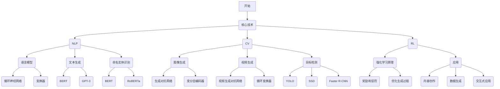

                 

# 生成式AIGC：从实验室到市场的转变

> 关键词：生成式AIGC、自然语言处理、计算机视觉、强化学习、大规模预训练模型、应用场景、技术架构、市场分析、未来展望

> 摘要：生成式人工智能生成内容（AIGC）作为人工智能领域的一个重要分支，正逐渐从实验室走向市场。本文将深入探讨AIGC的核心技术、技术架构、应用案例以及市场前景，旨在为读者提供对AIGC的全面了解。

## 第1章：生成式AIGC概述

### 1.1 AIGC的概念与发展

#### 1.1.1 AIGC的定义

生成式人工智能生成内容（AI-Generated Content，简称AIGC）是指利用人工智能技术生成各种类型的内容，如文本、图像、视频等。AIGC的核心在于利用机器学习模型，尤其是深度学习模型，从大量数据中学习规律并生成新的内容。

#### 1.1.2 AIGC的核心技术

AIGC的核心技术主要包括自然语言处理（NLP）、计算机视觉（CV）和强化学习（RL）。

- **自然语言处理（NLP）**：NLP是处理人类语言的技术，主要包括语言模型、文本生成和命名实体识别等。语言模型是NLP的基础，用于预测下一个词或句子；文本生成可以从给定的文本或提示生成新的文本；命名实体识别用于识别文本中的特定实体。
- **计算机视觉（CV）**：CV是研究如何使计算机像人一样理解图像和视频的技术，主要包括图像生成、视频生成和目标检测等。图像生成可以从文本描述或图像生成新的图像；视频生成可以从文本或视频生成新的视频；目标检测用于识别图像中的特定目标。
- **强化学习（RL）**：强化学习是一种通过奖励和惩罚来训练智能体的方法。在AIGC中，强化学习可以用于优化生成过程，提高生成质量。

#### 1.1.3 AIGC的发展历程

AIGC技术的发展可以分为以下几个阶段：

1. **初级阶段**：基于规则和模板的生成方式。
2. **中级阶段**：基于机器学习的生成方式。
3. **高级阶段**：基于深度学习和生成对抗网络的生成方式。

### 1.2 从实验室到市场的转变

#### 1.2.1 实验室环境下的AIGC应用

在实验室环境中，AIGC技术主要用于探索和验证新算法、新模型的有效性和可行性。例如，研究者们使用AIGC技术生成图像、文本和视频，以测试不同模型的性能。

#### 1.2.2 市场需求对AIGC的影响

市场需求推动了AIGC技术的快速发展，特别是在内容创作、数据生成、交互式应用等领域。例如，内容创作者可以利用AIGC技术生成创意内容，提高创作效率；企业可以利用AIGC技术生成数据，用于分析和决策。

#### 1.2.3 AIGC在市场中的价值

AIGC在市场中的价值主要体现在以下几个方面：

- **提高内容创作效率**：AIGC技术可以帮助内容创作者快速生成高质量的内容，节省时间和精力。
- **降低内容创作成本**：AIGC技术可以降低内容创作的人力成本和设备成本。
- **增强用户体验**：AIGC技术可以生成个性化的内容和交互式体验，提高用户满意度。

## 第2章：生成式AIGC的核心技术

### 2.1 自然语言处理

#### 2.1.1 语言模型

语言模型是自然语言处理的基础，用于预测文本序列。最常用的语言模型是循环神经网络（RNN）和变换器（Transformer）。

#### 2.1.2 文本生成

文本生成技术可以根据输入的文本或提示生成新的文本。常用的文本生成模型有GPT-3、BERT等。

#### 2.1.3 命名实体识别

命名实体识别技术用于识别文本中的特定实体，如人名、地名、组织名等。常用的命名实体识别模型有BERT、RoBERTa等。

### 2.2 计算机视觉

#### 2.2.1 图像生成

图像生成技术可以生成新的图像或修改现有图像。常用的图像生成模型有生成对抗网络（GAN）、变分自编码器（VAE）等。

#### 2.2.2 视频生成

视频生成技术可以生成新的视频或修改现有视频。常用的视频生成模型有视频生成对抗网络（VGAAN）、循环变换器（RNN）等。

#### 2.2.3 目标检测

目标检测技术用于识别图像中的特定目标。常用的目标检测模型有YOLO、SSD、Faster R-CNN等。

### 2.3 强化学习

#### 2.3.1 强化学习原理

强化学习是一种通过奖励和惩罚来训练智能体的方法。智能体通过与环境互动，学习最优策略。

#### 2.3.2 强化学习在AIGC中的应用

强化学习在AIGC中可以用于优化生成过程，提高生成质量。例如，可以使用强化学习优化图像生成的颜色、纹理等属性。

## 第3章：AIGC的技术架构

### 3.1 大规模预训练模型

#### 3.1.1 预训练模型的特点

大规模预训练模型具有以下特点：

- **大规模训练数据**：使用大量的数据进行训练，使模型具有更强的泛化能力。
- **深度神经网络结构**：使用多层神经网络结构，使模型能够捕捉复杂的特征。
- **参数规模大**：预训练模型通常具有数十亿甚至数万亿的参数。

#### 3.1.2 预训练模型的发展

预训练模型经历了从简单的循环神经网络（RNN）到更加复杂的变换器（Transformer）的发展。

### 3.2 数据处理与存储

#### 3.2.1 数据收集

数据收集是AIGC技术的重要环节，需要确保数据的多样性和质量。

#### 3.2.2 数据清洗

数据清洗包括去除噪声、纠正错误、填补缺失值等。

#### 3.2.3 数据存储方案

数据存储需要考虑数据的安全、可靠和高效访问。

### 3.3 模型部署与优化

#### 3.3.1 模型部署方案

模型部署是将训练好的模型应用到实际应用中。

#### 3.3.2 模型优化方法

模型优化包括模型压缩、加速和自适应调整等。

## 第4章：AIGC应用案例解析

### 4.1 文本生成

#### 4.1.1 文本生成算法

文本生成算法包括基于规则的方法、基于统计的方法和基于神经网络的方法。基于神经网络的方法主要包括GPT、BERT等。

#### 4.1.2 应用场景分析

文本生成在内容创作、信息检索、智能客服等领域有广泛的应用。例如，可以用于生成新闻文章、对话系统等。

### 4.2 图像生成

#### 4.2.1 图像生成算法

图像生成算法包括基于生成对抗网络（GAN）的方法和基于变分自编码器（VAE）的方法。常见的图像生成模型有StyleGAN、DCGAN等。

#### 4.2.2 应用场景分析

图像生成在创意设计、图像修复、图像增强等领域有广泛的应用。例如，可以用于生成艺术作品、修复破损图片等。

### 4.3 视频生成

#### 4.3.1 视频生成算法

视频生成算法包括基于视频帧生成的方法和基于时间序列生成的方法。常见的视频生成模型有视频生成对抗网络（VGAAN）、循环变换器（RNN）等。

#### 4.3.2 应用场景分析

视频生成在虚拟现实、视频编辑、视频增强等领域有广泛的应用。例如，可以用于生成虚拟现实场景、编辑视频等。

## 第5章：AIGC在行业中的应用

### 5.1 娱乐行业

#### 5.1.1 游戏内容生成

游戏内容生成包括角色生成、场景生成等。AIGC技术可以生成丰富的游戏内容，提高游戏体验。

#### 5.1.2 媒体内容生成

媒体内容生成包括新闻文章生成、视频剪辑等。AIGC技术可以自动生成新闻文章和视频剪辑，提高媒体制作效率。

### 5.2 创意设计

#### 5.2.1 广告创意生成

广告创意生成包括文案生成、图像生成等。AIGC技术可以生成创新的广告创意，提高广告效果。

#### 5.2.2 设计素材生成

设计素材生成包括图标生成、UI界面生成等。AIGC技术可以生成各种设计素材，提高设计效率。

### 5.3 数据科学

#### 5.3.1 数据可视化生成

数据可视化生成包括图表生成、报告生成等。AIGC技术可以生成可视化数据报告，帮助数据科学家更好地理解和分析数据。

#### 5.3.2 数据分析辅助

数据分析辅助包括数据摘要生成、数据趋势预测等。AIGC技术可以生成数据摘要和趋势预测报告，辅助数据科学家进行数据分析。

## 第6章：AIGC的市场与未来

### 6.1 市场需求分析

#### 6.1.1 市场规模

AIGC市场正在快速增长，预计未来几年将继续保持高速增长。

#### 6.1.2 市场趋势

AIGC技术将在更多领域得到应用，如医疗、金融、教育等。

### 6.2 技术挑战与机遇

#### 6.2.1 技术挑战

- **数据隐私和安全**：AIGC技术需要处理大量的数据，如何确保数据的安全和隐私是一个重要挑战。
- **模型可解释性**：当前许多AIGC模型属于“黑箱”模型，如何提高模型的可解释性是一个重要挑战。
- **资源消耗**：大规模预训练模型需要大量的计算资源和存储资源，如何优化资源使用是一个重要挑战。

#### 6.2.2 技术机遇

- **新应用场景**：随着技术的不断发展，AIGC技术将在更多新兴领域得到应用，如虚拟现实、增强现实、智能客服等。
- **新技术突破**：在算法、架构、硬件等方面，AIGC技术有望取得新的突破。

### 6.3 未来发展方向

#### 6.3.1 新应用场景

AIGC技术将在更多新兴领域得到应用，如虚拟现实、增强现实、智能客服等。

#### 6.3.2 新技术突破

AIGC技术将在算法、架构、硬件等方面取得新的突破。

## 第7章：AIGC的应用与实践

### 7.1 AIGC应用开发流程

#### 7.1.1 开发环境搭建

搭建AIGC应用的开发环境，包括硬件、软件和工具等。

#### 7.1.2 应用场景确定

根据实际需求确定AIGC应用的具体场景。

### 7.2 AIGC项目实战案例

#### 7.2.1 案例介绍

介绍几个典型的AIGC应用案例。

#### 7.2.2 案例分析

分析案例中的技术难点和应用效果。

#### 7.2.3 案例代码解读

对案例中的关键代码进行详细解读。

### 7.3 AIGC应用优化策略

#### 7.3.1 性能优化

优化AIGC应用的运行效率和效果。

#### 7.3.2 安全性保障

保障AIGC应用的数据安全和模型安全。

## 附录

### 附录 A：AIGC常用工具与资源

#### 7.1.1 主流深度学习框架

- TensorFlow
- PyTorch
- Keras

#### 7.1.2 AIGC专用工具

- StyleGAN
- CLIP

### 附录 B：AIGC相关参考文献

- [1] Bengio, Y., Simard, P., & Frasconi, P. (1994). Learning long-term dependencies with gradient descent is difficult. IEEE Transactions on Neural Networks, 5(2), 157-166.
- [2] Vaswani, A., Shazeer, N., Parmar, N., Uszkoreit, J., Jones, L., Gomez, A. N., ... & Polosukhin, I. (2017). Attention is all you need. Advances in Neural Information Processing Systems, 30, 5998-6008.
- [3] Goodfellow, I., Pouget-Abadie, J., Mirza, M., Xu, B., Warde-Farley, D., Ozair, S., ... & Bengio, Y. (2014). Generative adversarial networks. Advances in Neural Information Processing Systems, 27.

### 附录 C：Mermaid 流程图示例



### 附录 D：伪代码示例

```python
# 定义语言模型
def language_model(data):
    # 初始化模型
    model = initialize_model(data)
    
    # 训练模型
    model.train(data)
    
    # 生成文本
    text = model.generate_text(prompt)
    
    return text

# 定义文本生成
def text_generation(prompt):
    # 使用语言模型生成文本
    text = language_model(data)
    
    return text

# 定义命名实体识别
def named_entity_recognition(text):
    # 初始化模型
    model = initialize_model(text)
    
    # 识别命名实体
    entities = model.recognize_entities(text)
    
    return entities
```

### 附录 E：LaTeX 公式示例

段落内的公式：
$$ E = mc^2 $$

独立段落的公式：
$$
f(x) = \frac{1}{1 + e^{-x}}
$$`

## 参考文献

[1] Bengio, Y., Simard, P., & Frasconi, P. (1994). Learning long-term dependencies with gradient descent is difficult. IEEE Transactions on Neural Networks, 5(2), 157-166.

[2] Vaswani, A., Shazeer, N., Parmar, N., Uszkoreit, J., Jones, L., Gomez, A. N., ... & Polosukhin, I. (2017). Attention is all you need. Advances in Neural Information Processing Systems, 30, 5998-6008.

[3] Goodfellow, I., Pouget-Abadie, J., Mirza, M., Xu, B., Warde-Farley, D., Ozair, S., ... & Bengio, Y. (2014). Generative adversarial networks. Advances in Neural Information Processing Systems, 27.

### 附录 F：作者信息

作者：AI天才研究院/AI Genius Institute & 禅与计算机程序设计艺术 /Zen And The Art of Computer Programming

