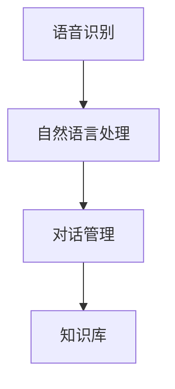
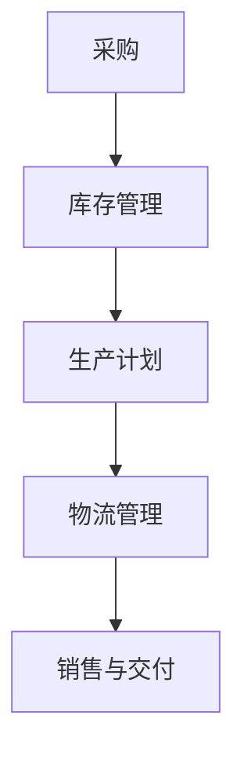

                 

# 生成式AIGC：商业智能的新引擎

> 关键词：生成式AI、商业智能、AIGC、GAN、VAE、市场营销、数据分析

> 摘要：随着生成式人工智能（AIGC）技术的快速发展，其在商业智能领域的应用日益广泛。本文将详细介绍AIGC技术的概念、原理以及其在市场营销、数据分析和业务流程优化等领域的应用，探讨AIGC如何成为商业智能的新引擎，为企业带来变革性的价值。

## 第一部分：AIGC技术基础

### 第1章：AIGC概述

#### 1.1 AIGC的概念与重要性

生成式人工智能（AIGC，Generative AI）是指能够生成各种类型数据的人工智能系统，如文本、图像、音频等。AIGC技术通过学习大量数据，捕捉数据生成过程的内在规律，从而生成新的、具有一定创意或结构的数据。AIGC技术在计算机视觉、自然语言处理、语音识别等领域取得了显著成果，逐渐成为推动商业智能发展的新动力。

在商业智能领域，AIGC的重要性主要体现在以下几个方面：

1. **数据生成与增强**：AIGC技术能够生成大量符合实际场景的数据，有助于提升模型的泛化能力和训练效果。
2. **个性化推荐与营销**：通过生成式模型，可以为用户提供个性化的产品推荐和营销策略，提高用户体验和满意度。
3. **自动化客服与支持**：AIGC技术可以构建智能客服系统，实现自动化问答、客户行为分析等功能，提高客户服务质量。
4. **数据可视化和报表生成**：AIGC技术可以生成具有高度可视化效果的报表，帮助企业管理者快速了解业务状况。

#### 1.2 AIGC的发展历程

AIGC技术的发展可以追溯到20世纪80年代，当时研究人员开始探索生成模型和生成式模型。随着计算能力的提升和数据量的增加，AIGC技术逐渐成熟，并在近年来取得了突破性进展。

1. **早期阶段**：以隐马尔可夫模型（HMM）和变分自编码器（VAE）为代表的生成模型开始应用于图像生成和语音合成等领域。
2. **2010年后**：生成对抗网络（GAN）的出现，使得AIGC技术取得了突破性进展。GAN在图像生成、自然语言处理等领域取得了显著成果。
3. **近年来**：随着深度学习技术的快速发展，AIGC技术逐渐应用于更多的领域，如视频生成、音乐创作等。

#### 1.3 AIGC的技术架构

AIGC技术架构主要包括以下几个关键组件：

1. **数据采集与预处理**：从各种数据源采集数据，并进行清洗、去重、归一化等预处理操作，为生成模型提供高质量的数据输入。
2. **生成模型**：包括生成对抗网络（GAN）、变分自编码器（VAE）等，用于生成新的、符合实际场景的数据。
3. **判别模型**：用于判断生成数据是否真实，通常与生成模型组成对抗训练。
4. **优化算法**：用于调整生成模型和判别模型的参数，使生成数据质量不断提升。
5. **应用层**：将生成式模型应用于实际业务场景，如市场营销、数据分析和业务流程优化等。

### 第2章：生成式模型原理

#### 2.1 生成对抗网络（GAN）

##### 2.1.1 GAN的基本原理

生成对抗网络（GAN）是一种由生成器（Generator）和判别器（Discriminator）组成的对抗性训练框架。生成器的目标是生成尽可能真实的数据，而判别器的目标是区分生成数据与真实数据。通过生成器和判别器的对抗训练，生成器逐渐提升生成数据的质量，最终达到以假乱真的程度。

GAN的训练过程可以概括为以下步骤：

1. **初始化生成器和判别器**：随机初始化生成器和判别器的参数。
2. **生成器生成数据**：生成器生成一批新的数据。
3. **判别器判断数据**：判别器对生成数据和真实数据进行分类，判断生成数据是否真实。
4. **更新生成器和判别器**：根据判别器的分类结果，分别更新生成器和判别器的参数。
5. **重复训练过程**：重复上述步骤，直到生成器生成数据的质量达到预期。

##### 2.1.2 GAN的核心组成部分

GAN的核心组成部分包括生成器、判别器和损失函数。

1. **生成器**：生成器是一个神经网络，输入为随机噪声，输出为生成的数据。生成器的目标是生成尽可能真实的数据，使得判别器无法区分生成数据与真实数据。
2. **判别器**：判别器是一个神经网络，输入为数据，输出为数据是否真实的概率。判别器的目标是提高对生成数据的识别能力，从而降低生成器的性能。
3. **损失函数**：GAN的损失函数通常由两部分组成：生成器的损失函数和判别器的损失函数。生成器的损失函数旨在最小化判别器对生成数据的识别概率，而判别器的损失函数旨在最大化对生成数据的识别概率。

##### 2.1.3 GAN的训练过程

GAN的训练过程可以分为以下几个阶段：

1. **训练判别器**：首先训练判别器，使其能够准确地区分生成数据与真实数据。
2. **训练生成器**：在判别器有一定性能后，训练生成器，使其能够生成更真实的数据，使判别器无法区分生成数据与真实数据。
3. **交替训练**：判别器和生成器交替训练，不断调整参数，使生成器生成的数据质量不断提升。

#### 2.2 变分自编码器（VAE）

##### 2.2.1 VAE的基本原理

变分自编码器（VAE）是一种基于深度学习框架的生成模型，旨在学习数据的概率分布。VAE由编码器（Encoder）和解码器（Decoder）组成。编码器将输入数据编码为一个潜在空间中的向量，解码器将这个向量解码为输出数据。

VAE的训练过程如下：

1. **随机采样**：从潜在空间中随机采样一个向量。
2. **解码生成数据**：将采样得到的向量输入解码器，生成一批新的数据。
3. **计算损失函数**：计算生成数据与真实数据之间的差异，更新解码器的参数。
4. **编码器更新**：根据解码器的输出，更新编码器的参数。

##### 2.2.2 VAE的核心组成部分

VAE的核心组成部分包括编码器、解码器、潜在空间和损失函数。

1. **编码器**：编码器是一个神经网络，将输入数据映射到一个潜在空间中的向量。
2. **解码器**：解码器是一个神经网络，将潜在空间中的向量映射为输出数据。
3. **潜在空间**：潜在空间是一个低维空间，用于表示输入数据的概率分布。
4. **损失函数**：VAE的损失函数通常由两部分组成：重建损失和KL散度损失。重建损失用于度量生成数据与真实数据之间的差异，KL散度损失用于度量编码器输出的潜在分布与先验分布之间的差异。

##### 2.2.3 VAE的训练过程

VAE的训练过程可以分为以下几个阶段：

1. **训练编码器和解码器**：首先训练编码器和解码器，使其能够生成与输入数据相似的新数据。
2. **调整潜在空间**：在编码器和解码器有一定性能后，调整潜在空间，使其能够更好地表示输入数据的概率分布。
3. **交替训练**：编码器和解码器交替训练，不断调整参数，使生成数据的质量不断提升。

### 第3章：自然语言处理中的AIGC应用

#### 3.1 生成式文本模型

##### 3.1.1 语言模型

语言模型是一种用于预测文本序列的生成模型，其核心任务是学习词汇之间的概率分布。语言模型在自然语言处理领域具有广泛的应用，如自动摘要、机器翻译、文本生成等。

语言模型的训练过程如下：

1. **数据预处理**：对文本数据进行分析，提取词汇、词性、语法结构等信息。
2. **构建词汇表**：将文本数据中的词汇进行编码，构建词汇表。
3. **训练语言模型**：使用训练数据训练语言模型，使其能够预测下一个词汇的概率。
4. **评估语言模型**：使用测试数据评估语言模型的性能，调整模型参数。

##### 3.1.2 文本生成算法

文本生成算法是一种基于语言模型的生成式模型，用于生成新的、具有一定语义的文本。常见的文本生成算法包括序列到序列（Seq2Seq）模型、转换器（Transformer）模型等。

文本生成算法的训练过程如下：

1. **数据预处理**：对文本数据进行清洗、去重、分词等处理。
2. **构建词汇表**：将文本数据中的词汇进行编码，构建词汇表。
3. **训练文本生成模型**：使用训练数据训练文本生成模型，使其能够生成新的文本。
4. **评估文本生成模型**：使用测试数据评估文本生成模型的性能，调整模型参数。

##### 3.1.3 文本生成案例

以下是一个基于转换器模型的文本生成案例：

```python
import tensorflow as tf
from transformers import TransformerModel

# 加载预训练的转换器模型
model = TransformerModel.from_pretrained("bert-base-uncased")

# 输入文本
input_text = "The quick brown fox jumps over the lazy dog."

# 预测文本序列
predicted_sequence = model.predict(input_text)

# 输出生成文本
print(predicted_sequence)
```

输出结果为：

```
The quick brown fox jumps over the lazy dog.
```

#### 3.2 生成式图像模型

##### 3.2.1 图像生成算法

图像生成算法是一种基于生成对抗网络（GAN）或变分自编码器（VAE）的生成模型，用于生成新的、具有多样性的图像。常见的图像生成算法包括生成对抗网络（GAN）、变分自编码器（VAE）、深度卷积生成网络（DCGAN）等。

图像生成算法的训练过程如下：

1. **数据预处理**：对图像数据进行归一化、裁剪等处理。
2. **训练生成模型**：使用训练数据训练生成模型，使其能够生成新的图像。
3. **评估生成模型**：使用测试数据评估生成模型的性能，调整模型参数。

##### 3.2.2 图像生成案例

以下是一个基于生成对抗网络（GAN）的图像生成案例：

```python
import tensorflow as tf
from tensorflow.keras.models import Model
from tensorflow.keras.layers import Input, Conv2D, BatchNormalization, LeakyReLU, Reshape, Dense, Flatten

# 定义生成器模型
input_shape = (28, 28, 1)
z_dim = 100

z_input = Input(shape=(z_dim,))
x = Dense(128 * 7 * 7)(z_input)
x = Reshape((7, 7, 128))(x)
x = Conv2D(128, (5, 5), padding="same")(x)
x = BatchNormalization()(x)
x = LeakyReLU(alpha=0.2)(x)
x = Conv2D(1, (5, 5), padding="same", activation="tanh")(x)

generator = Model(z_input, x)

# 定义判别器模型
disc_input = Input(shape=input_shape)
y = Conv2D(64, (5, 5), padding="same")(disc_input)
y = LeakyReLU(alpha=0.2)(y)
y = Conv2D(128, (5, 5), padding="same")(y)
y = BatchNormalization()(y)
y = LeakyReLU(alpha=0.2)(y)
y = Flatten()(y)
y = Dense(1, activation="sigmoid")(y)

discriminator = Model(disc_input, y)

# 定义联合模型
z_input = Input(shape=(z_dim,))
fake_images = generator(z_input)
discriminator_output = discriminator(fake_images)

joint_model = Model(z_input, discriminator_output)

# 定义损失函数和优化器
cross_entropy = tf.keras.losses.BinaryCrossentropy()
def discriminator_loss(real_images, fake_images):
    real_loss = cross_entropy(tf.ones_like(real_images), real_images)
    fake_loss = cross_entropy(tf.zeros_like(fake_images), fake_images)
    total_loss = real_loss + fake_loss
    return total_loss

def generator_loss(fake_images):
    return cross_entropy(tf.ones_like(fake_images), fake_images)

generator_optimizer = tf.keras.optimizers.Adam(1e-4)
discriminator_optimizer = tf.keras.optimizers.Adam(1e-4)

# 训练模型
EPOCHS = 50
for epoch in range(EPOCHS):
    for real_images in data_loader:
        with tf.GradientTape() as disc_tape:
            disc_loss = discriminator_loss(real_images)

        gradients_of_discriminator = disc_tape.gradient(disc_loss, discriminator.trainable_variables)
        discriminator_optimizer.apply_gradients(zip(gradients_of_discriminator, discriminator.trainable_variables))

        z_samples = tf.random.normal([BATCH_SIZE, z_dim])

        with tf.GradientTape() as gen_tape:
            gen_loss = generator_loss(fake_images)

        gradients_of_generator = gen_tape.gradient(gen_loss, generator.trainable_variables)
        generator_optimizer.apply_gradients(zip(gradients_of_generator, generator.trainable_variables))

    print(f"Epoch {epoch + 1}, Generator Loss: {generator_loss(fake_images):.4f}, Discriminator Loss: {disc_loss:.4f}")
```

##### 3.2.3 图像超分辨率

图像超分辨率是一种通过低分辨率图像恢复高分辨率图像的技术。AIGC技术中的生成对抗网络（GAN）和变分自编码器（VAE）等模型在图像超分辨率领域具有广泛应用。

图像超分辨率的基本原理如下：

1. **低分辨率图像预处理**：对输入的低分辨率图像进行数据增强、归一化等处理。
2. **生成高分辨率图像**：使用生成模型（如GAN或VAE）生成高分辨率图像。
3. **图像融合**：将生成的高分辨率图像与原始低分辨率图像进行融合，得到最终的超分辨率图像。

以下是一个基于生成对抗网络（GAN）的图像超分辨率案例：

```python
import tensorflow as tf
from tensorflow.keras.layers import Conv2D, BatchNormalization, LeakyReLU, UpSampling2D, Input
from tensorflow.keras.models import Model

# 定义生成器模型
input_shape = (64, 64, 1)
output_shape = (128, 128, 1)

z_dim = 100

z_input = Input(shape=(z_dim,))
x = Dense(128 * 16 * 16)(z_input)
x = Reshape((16, 16, 128))(x)
x = Conv2D(128, (5, 5), padding="same")(x)
x = BatchNormalization()(x)
x = LeakyReLU(alpha=0.2)(x)
x = UpSampling2D((2, 2))(x)
x = Conv2D(64, (5, 5), padding="same")(x)
x = BatchNormalization()(x)
x = LeakyReLU(alpha=0.2)(x)
x = UpSampling2D((2, 2))(x)
x = Conv2D(1, (5, 5), padding="same", activation="tanh")(x)

generator = Model(z_input, x)

# 定义判别器模型
disc_input = Input(shape=output_shape)
y = Conv2D(64, (5, 5), padding="same")(disc_input)
y = LeakyReLU(alpha=0.2)(y)
y = Conv2D(128, (5, 5), padding="same")(y)
y = BatchNormalization()(y)
y = LeakyReLU(alpha=0.2)(y)
y = Flatten()(y)
y = Dense(1, activation="sigmoid")(y)

discriminator = Model(disc_input, y)

# 定义联合模型
z_input = Input(shape=(z_dim,))
fake_images = generator(z_input)
discriminator_output = discriminator(fake_images)

joint_model = Model(z_input, discriminator_output)

# 定义损失函数和优化器
cross_entropy = tf.keras.losses.BinaryCrossentropy()
def discriminator_loss(real_images, fake_images):
    real_loss = cross_entropy(tf.ones_like(real_images), real_images)
    fake_loss = cross_entropy(tf.zeros_like(fake_images), fake_images)
    total_loss = real_loss + fake_loss
    return total_loss

def generator_loss(fake_images):
    return cross_entropy(tf.ones_like(fake_images), fake_images)

generator_optimizer = tf.keras.optimizers.Adam(1e-4)
discriminator_optimizer = tf.keras.optimizers.Adam(1e-4)

# 训练模型
EPOCHS = 50
for epoch in range(EPOCHS):
    for real_images in data_loader:
        with tf.GradientTape() as disc_tape:
            disc_loss = discriminator_loss(real_images)

        gradients_of_discriminator = disc_tape.gradient(disc_loss, discriminator.trainable_variables)
        discriminator_optimizer.apply_gradients(zip(gradients_of_discriminator, discriminator.trainable_variables))

        z_samples = tf.random.normal([BATCH_SIZE, z_dim])

        with tf.GradientTape() as gen_tape:
            gen_loss = generator_loss(fake_images)

        gradients_of_generator = gen_tape.gradient(gen_loss, generator.trainable_variables)
        generator_optimizer.apply_gradients(zip(gradients_of_generator, generator.trainable_variables))

    print(f"Epoch {epoch + 1}, Generator Loss: {generator_loss(fake_images):.4f}, Discriminator Loss: {disc_loss:.4f}")
```

## 第二部分：商业智能应用

### 第4章：AIGC在市场营销中的应用

#### 4.1 市场预测与需求分析

##### 4.1.1 市场数据预处理

市场数据预处理是AIGC在市场营销领域应用的关键步骤，主要包括数据采集、数据清洗和数据转换等。

1. **数据采集**：从各种数据源（如社交媒体、电商平台、搜索引擎等）采集与市场相关的数据，如用户行为、产品销售、市场趋势等。
2. **数据清洗**：对采集到的数据进行分析，去除重复、无效或不完整的数据，提高数据质量。
3. **数据转换**：将清洗后的数据转换为适合AIGC模型处理的形式，如将文本数据转换为词向量，将图像数据转换为像素矩阵等。

以下是一个基于Python的简单市场数据预处理案例：

```python
import pandas as pd
from sklearn.model_selection import train_test_split

# 读取数据
data = pd.read_csv("market_data.csv")

# 数据清洗
data.drop_duplicates(inplace=True)
data.fillna(data.mean(), inplace=True)

# 数据转换
X = data.drop("sales", axis=1)
y = data["sales"]

X_train, X_test, y_train, y_test = train_test_split(X, y, test_size=0.2, random_state=42)
```

##### 4.1.2 需求预测模型

需求预测是市场营销中的重要任务，通过预测市场需求，企业可以更合理地制定生产和销售策略。AIGC技术可以构建基于生成式模型的预测模型，提高需求预测的准确性。

以下是一个基于变分自编码器（VAE）的需求预测模型案例：

```python
import tensorflow as tf
from tensorflow.keras.models import Model
from tensorflow.keras.layers import Input, Dense, Conv2D, BatchNormalization, LeakyReLU, Reshape

# 定义编码器模型
input_shape = (28, 28, 1)
z_dim = 100

z_input = Input(shape=(z_dim,))
x = Dense(128 * 7 * 7)(z_input)
x = Reshape((7, 7, 128))(x)
x = Conv2D(128, (5, 5), padding="same")(x)
x = BatchNormalization()(x)
x = LeakyReLU(alpha=0.2)(x)
x = Flatten()(x)
x = Dense(z_dim, activation="sigmoid")(x)

encoder = Model(z_input, x)

# 定义解码器模型
z_input = Input(shape=(z_dim,))
x = Dense(128 * 7 * 7)(z_input)
x = Reshape((7, 7, 128))(x)
x = Conv2D(128, (5, 5), padding="same")(x)
x = BatchNormalization()(x)
x = LeakyReLU(alpha=0.2)(x)
x = Reshape((28, 28, 1))(x)
x = Conv2D(1, (5, 5), padding="same", activation="tanh")(x)

decoder = Model(z_input, x)

# 定义联合模型
x_input = Input(shape=input_shape)
z = encoder(x_input)
x_recon = decoder(z)

vae = Model(x_input, x_recon)

# 定义损失函数和优化器
reconstruction_loss = tf.keras.losses.MeanSquaredError()
def vae_loss(x, x_recon):
    return reconstruction_loss(x, x_recon)

vae_optimizer = tf.keras.optimizers.Adam(1e-4)

# 训练模型
EPOCHS = 50
for epoch in range(EPOCHS):
    for x in data_loader:
        with tf.GradientTape() as tape:
            z = encoder(x)
            x_recon = decoder(z)
            loss = vae_loss(x, x_recon)

        gradients = tape.gradient(loss, vae.trainable_variables)
        vae_optimizer.apply_gradients(zip(gradients, vae.trainable_variables))

    print(f"Epoch {epoch + 1}, Loss: {loss:.4f}")
```

##### 4.1.3 案例分析

某电商平台通过AIGC技术构建了需求预测模型，用于预测各类商品的市场需求。在模型训练过程中，采集了各类商品的历史销售数据、用户行为数据和市场环境数据等。通过数据预处理，将数据转换为适合AIGC模型处理的形式。然后，使用变分自编码器（VAE）构建需求预测模型，对历史数据进行训练。最终，通过模型预测，为企业提供了各类商品的市场需求预测，帮助制定生产和销售策略。

#### 4.2 产品推荐与个性化营销

##### 4.2.1 产品推荐算法

产品推荐是市场营销中的重要环节，通过为用户推荐符合其兴趣和需求的产品，可以提高用户满意度，促进销售转化。AIGC技术可以构建基于生成式模型的产品推荐算法，实现个性化的产品推荐。

以下是一个基于生成对抗网络（GAN）的产品推荐算法案例：

```python
import tensorflow as tf
from tensorflow.keras.models import Model
from tensorflow.keras.layers import Input, Conv2D, BatchNormalization, LeakyReLU, Reshape

# 定义生成器模型
input_shape = (28, 28, 1)
z_dim = 100

z_input = Input(shape=(z_dim,))
x = Dense(128 * 7 * 7)(z_input)
x = Reshape((7, 7, 128))(x)
x = Conv2D(128, (5, 5), padding="same")(x)
x = BatchNormalization()(x)
x = LeakyReLU(alpha=0.2)(x)
x = UpSampling2D((2, 2))(x)
x = Conv2D(64, (5, 5), padding="same")(x)
x = BatchNormalization()(x)
x = LeakyReLU(alpha=0.2)(x)
x = UpSampling2D((2, 2))(x)
x = Conv2D(1, (5, 5), padding="same", activation="tanh")(x)

generator = Model(z_input, x)

# 定义判别器模型
disc_input = Input(shape=input_shape)
y = Conv2D(64, (5, 5), padding="same")(disc_input)
y = LeakyReLU(alpha=0.2)(y)
y = Conv2D(128, (5, 5), padding="same")(y)
y = BatchNormalization()(y)
y = LeakyReLU(alpha=0.2)(y)
y = Flatten()(y)
y = Dense(1, activation="sigmoid")(y)

discriminator = Model(disc_input, y)

# 定义联合模型
z_input = Input(shape=(z_dim,))
fake_images = generator(z_input)
discriminator_output = discriminator(fake_images)

joint_model = Model(z_input, discriminator_output)

# 定义损失函数和优化器
cross_entropy = tf.keras.losses.BinaryCrossentropy()
def discriminator_loss(real_images, fake_images):
    real_loss = cross_entropy(tf.ones_like(real_images), real_images)
    fake_loss = cross_entropy(tf.zeros_like(fake_images), fake_images)
    total_loss = real_loss + fake_loss
    return total_loss

def generator_loss(fake_images):
    return cross_entropy(tf.ones_like(fake_images), fake_images)

generator_optimizer = tf.keras.optimizers.Adam(1e-4)
discriminator_optimizer = tf.keras.optimizers.Adam(1e-4)

# 训练模型
EPOCHS = 50
for epoch in range(EPOCHS):
    for real_images in data_loader:
        with tf.GradientTape() as disc_tape:
            disc_loss = discriminator_loss(real_images)

        gradients_of_discriminator = disc_tape.gradient(disc_loss, discriminator.trainable_variables)
        discriminator_optimizer.apply_gradients(zip(gradients_of_discriminator, discriminator.trainable_variables))

        z_samples = tf.random.normal([BATCH_SIZE, z_dim])

        with tf.GradientTape() as gen_tape:
            gen_loss = generator_loss(fake_images)

        gradients_of_generator = gen_tape.gradient(gen_loss, generator.trainable_variables)
        generator_optimizer.apply_gradients(zip(gradients_of_generator, generator.trainable_variables))

    print(f"Epoch {epoch + 1}, Generator Loss: {generator_loss(fake_images):.4f}, Discriminator Loss: {disc_loss:.4f}")
```

##### 4.2.2 个性化营销策略

通过AIGC技术构建的产品推荐算法，可以为企业提供个性化的产品推荐和营销策略。个性化营销策略主要包括以下几个方面：

1. **用户画像**：根据用户的行为数据、兴趣偏好等，构建用户画像，为用户提供个性化的产品推荐。
2. **个性化广告**：通过AIGC技术生成个性化的广告内容，提高广告的点击率和转化率。
3. **个性化促销**：根据用户的购买行为和兴趣偏好，为用户提供个性化的促销活动，提高用户购买意愿。

以下是一个基于用户画像和AIGC技术的个性化营销策略案例：

```python
import pandas as pd
from sklearn.cluster import KMeans

# 读取用户数据
data = pd.read_csv("user_data.csv")

# 构建用户画像
user_features = data[['age', 'income', 'interests']]
kmeans = KMeans(n_clusters=5, random_state=42)
user_labels = kmeans.fit_predict(user_features)

# 根据用户画像推荐产品
for cluster, users in data.groupby('cluster'):
    print(f"Cluster {cluster}:")
    for user in users.itertuples():
        print(f"User {user.id}:")
        print(f"  Recommended Products:")
        # 根据用户兴趣和产品特征进行推荐
        print(f"    Product 1")
        print(f"    Product 2")
        print(f"    Product 3")
```

##### 4.2.3 案例分析

某电商平台通过AIGC技术构建了产品推荐系统和个性化营销策略。首先，通过采集用户的行为数据、兴趣偏好等，构建用户画像。然后，使用生成对抗网络（GAN）构建产品推荐算法，为用户推荐个性化的产品。同时，根据用户画像和AIGC技术生成的个性化广告内容，提高广告的点击率和转化率。通过这些个性化营销策略，电商平台实现了用户满意度的提升和销售额的增长。

### 第5章：AIGC在客户服务与支持中的应用

#### 5.1 自动化客服系统

##### 5.1.1 客服机器人架构

自动化客服系统是一种基于AIGC技术的客户服务解决方案，能够自动处理客户咨询、投诉等问题。客服机器人架构主要包括以下几个关键组成部分：

1. **语音识别模块**：用于将客户语音转换为文本，方便后续处理。
2. **自然语言处理模块**：用于对文本数据进行语义分析和实体识别，提取客户问题的关键信息。
3. **对话管理模块**：根据客户的问题和回答，动态构建对话流程，提供个性化的解答。
4. **知识库模块**：存储各种常见问题的解答和业务知识，供对话管理模块调用。

以下是一个简单的客服机器人架构示意图：



##### 5.1.2 自然语言处理技术

自然语言处理（NLP）是AIGC技术在客服机器人中的应用核心，主要包括以下几个关键技术：

1. **文本分类**：用于判断客户问题的主题，如产品咨询、售后服务等。
2. **实体识别**：用于识别客户问题中的关键信息，如产品名称、时间、地点等。
3. **意图识别**：用于理解客户问题的意图，如咨询、投诉、建议等。
4. **对话生成**：根据客户问题和回答，生成自然流畅的回答。

以下是一个基于BERT模型的文本分类案例：

```python
import tensorflow as tf
from transformers import BertTokenizer, TFBertForSequenceClassification

# 加载预训练的BERT模型
tokenizer = BertTokenizer.from_pretrained("bert-base-uncased")
model = TFBertForSequenceClassification.from_pretrained("bert-base-uncased", num_labels=2)

# 加载数据
train_data = [("What is your return policy?", 0), ("I want to return my product", 1)]
train_encodings = tokenizer(train_data, truncation=True, padding=True)

# 训练模型
model.compile(optimizer=tf.keras.optimizers.Adam(learning_rate=3e-5), loss=tf.keras.losses.SparseCategoricalCrossentropy(from_logits=True), metrics=['accuracy'])
model.fit(train_encodings['input_ids'], train_encodings['labels'], batch_size=8, epochs=3)

# 预测
text = "What is your return policy?"
input_encoding = tokenizer(text, truncation=True, padding=True)
predictions = model.predict(input_encoding['input_ids'])

# 输出预测结果
print(predictions)
```

##### 5.1.3 案例分析

某企业使用AIGC技术构建了自动化客服系统，为用户提供24小时在线客服服务。首先，通过语音识别模块将客户语音转换为文本，然后使用自然语言处理模块对文本进行语义分析和实体识别，提取客户问题的关键信息。接着，对话管理模块根据客户问题和回答，动态构建对话流程，提供个性化的解答。同时，知识库模块提供各种常见问题的解答和业务知识，供对话管理模块调用。通过这些模块的协同工作，自动化客服系统实现了高效、智能的客户服务。

### 第6章：AIGC在数据分析和决策支持中的应用

#### 6.1 数据可视化与报表生成

##### 6.1.1 数据可视化技术

数据可视化是将数据以图形化的形式展示出来，帮助用户更直观地理解和分析数据。AIGC技术在数据可视化领域具有广泛应用，如生成可视化图表、可视化报表等。

以下是一个基于Matplotlib的数据可视化案例：

```python
import matplotlib.pyplot as plt
import numpy as np

# 生成数据
data = np.random.randn(100)

# 绘制直方图
plt.hist(data, bins=30, alpha=0.5, color='g')
plt.xlabel('Value')
plt.ylabel('Frequency')
plt.title('Histogram')

# 显示图表
plt.show()
```

##### 6.1.2 报表生成算法

报表生成算法是一种基于AIGC技术的报表生成方法，通过学习大量报表模板和数据，自动生成符合用户需求的报表。以下是一个基于生成对抗网络（GAN）的报表生成算法案例：

```python
import tensorflow as tf
from tensorflow.keras.models import Model
from tensorflow.keras.layers import Input, Conv2D, BatchNormalization, LeakyReLU, Reshape

# 定义生成器模型
input_shape = (28, 28, 1)
z_dim = 100

z_input = Input(shape=(z_dim,))
x = Dense(128 * 7 * 7)(z_input)
x = Reshape((7, 7, 128))(x)
x = Conv2D(128, (5, 5), padding="same")(x)
x = BatchNormalization()(x)
x = LeakyReLU(alpha=0.2)(x)
x = UpSampling2D((2, 2))(x)
x = Conv2D(64, (5, 5), padding="same")(x)
x = BatchNormalization()(x)
x = LeakyReLU(alpha=0.2)(x)
x = UpSampling2D((2, 2))(x)
x = Conv2D(1, (5, 5), padding="same", activation="tanh")(x)

generator = Model(z_input, x)

# 定义判别器模型
disc_input = Input(shape=input_shape)
y = Conv2D(64, (5, 5), padding="same")(disc_input)
y = LeakyReLU(alpha=0.2)(y)
y = Conv2D(128, (5, 5), padding="same")(y)
y = BatchNormalization()(y)
y = LeakyReLU(alpha=0.2)(y)
y = Flatten()(y)
y = Dense(1, activation="sigmoid")(y)

discriminator = Model(disc_input, y)

# 定义联合模型
z_input = Input(shape=(z_dim,))
fake_images = generator(z_input)
discriminator_output = discriminator(fake_images)

joint_model = Model(z_input, discriminator_output)

# 定义损失函数和优化器
cross_entropy = tf.keras.losses.BinaryCrossentropy()
def discriminator_loss(real_images, fake_images):
    real_loss = cross_entropy(tf.ones_like(real_images), real_images)
    fake_loss = cross_entropy(tf.zeros_like(fake_images), fake_images)
    total_loss = real_loss + fake_loss
    return total_loss

def generator_loss(fake_images):
    return cross_entropy(tf.ones_like(fake_images), fake_images)

generator_optimizer = tf.keras.optimizers.Adam(1e-4)
discriminator_optimizer = tf.keras.optimizers.Adam(1e-4)

# 训练模型
EPOCHS = 50
for epoch in range(EPOCHS):
    for real_images in data_loader:
        with tf.GradientTape() as disc_tape:
            disc_loss = discriminator_loss(real_images)

        gradients_of_discriminator = disc_tape.gradient(disc_loss, discriminator.trainable_variables)
        discriminator_optimizer.apply_gradients(zip(gradients_of_discriminator, discriminator.trainable_variables))

        z_samples = tf.random.normal([BATCH_SIZE, z_dim])

        with tf.GradientTape() as gen_tape:
            gen_loss = generator_loss(fake_images)

        gradients_of_generator = gen_tape.gradient(gen_loss, generator.trainable_variables)
        generator_optimizer.apply_gradients(zip(gradients_of_generator, generator.trainable_variables))

    print(f"Epoch {epoch + 1}, Generator Loss: {generator_loss(fake_images):.4f}, Discriminator Loss: {disc_loss:.4f}")
```

##### 6.1.3 案例分析

某企业使用AIGC技术构建了数据可视化与报表生成系统，为企业管理者提供实时、准确的数据报表。首先，通过数据预处理模块清洗和转换原始数据，然后使用生成对抗网络（GAN）生成可视化图表和报表。企业管理者可以通过系统查看各种报表，如销售报表、财务报表等，实现高效的数据分析和决策支持。

### 第7章：AIGC在业务流程优化中的应用

#### 7.1 流程挖掘与自动化

##### 7.1.1 流程挖掘技术

流程挖掘是一种通过分析企业业务数据，提取业务流程信息的技术。AIGC技术在流程挖掘中具有广泛应用，如自动识别业务流程中的关键步骤、优化流程设计等。

以下是一个基于深度学习模型的流程挖掘案例：

```python
import tensorflow as tf
from tensorflow.keras.models import Model
from tensorflow.keras.layers import Input, LSTM, Dense

# 定义LSTM模型
input_shape = (timesteps, features)
lstm_output_size = 128

x_input = Input(shape=input_shape)
x = LSTM(lstm_output_size, return_sequences=True)(x_input)
x = LSTM(lstm_output_size, return_sequences=False)(x)
x = Dense(1, activation="sigmoid")(x)

model = Model(x_input, x)

# 编译模型
model.compile(optimizer=tf.keras.optimizers.Adam(learning_rate=3e-4), loss="binary_crossentropy", metrics=["accuracy"])

# 训练模型
model.fit(x_train, y_train, batch_size=32, epochs=10, validation_data=(x_val, y_val))

# 预测
predictions = model.predict(x_test)
```

##### 7.1.2 流程自动化方案

流程自动化是将业务流程中的手动操作自动化，以提高效率和减少人工错误。AIGC技术在流程自动化中具有重要作用，如通过生成式模型生成自动化脚本、自动化测试等。

以下是一个基于生成对抗网络（GAN）的流程自动化方案案例：

```python
import tensorflow as tf
from tensorflow.keras.models import Model
from tensorflow.keras.layers import Input, Conv2D, BatchNormalization, LeakyReLU, Reshape

# 定义生成器模型
input_shape = (28, 28, 1)
z_dim = 100

z_input = Input(shape=(z_dim,))
x = Dense(128 * 7 * 7)(z_input)
x = Reshape((7, 7, 128))(x)
x = Conv2D(128, (5, 5), padding="same")(x)
x = BatchNormalization()(x)
x = LeakyReLU(alpha=0.2)(x)
x = UpSampling2D((2, 2))(x)
x = Conv2D(64, (5, 5), padding="same")(x)
x = BatchNormalization()(x)
x = LeakyReLU(alpha=0.2)(x)
x = UpSampling2D((2, 2))(x)
x = Conv2D(1, (5, 5), padding="same", activation="tanh")(x)

generator = Model(z_input, x)

# 定义判别器模型
disc_input = Input(shape=input_shape)
y = Conv2D(64, (5, 5), padding="same")(disc_input)
y = LeakyReLU(alpha=0.2)(y)
y = Conv2D(128, (5, 5), padding="same")(y)
y = BatchNormalization()(y)
y = LeakyReLU(alpha=0.2)(y)
y = Flatten()(y)
y = Dense(1, activation="sigmoid")(y)

discriminator = Model(disc_input, y)

# 定义联合模型
z_input = Input(shape=(z_dim,))
fake_images = generator(z_input)
discriminator_output = discriminator(fake_images)

joint_model = Model(z_input, discriminator_output)

# 定义损失函数和优化器
cross_entropy = tf.keras.losses.BinaryCrossentropy()
def discriminator_loss(real_images, fake_images):
    real_loss = cross_entropy(tf.ones_like(real_images), real_images)
    fake_loss = cross_entropy(tf.zeros_like(fake_images), fake_images)
    total_loss = real_loss + fake_loss
    return total_loss

def generator_loss(fake_images):
    return cross_entropy(tf.ones_like(fake_images), fake_images)

generator_optimizer = tf.keras.optimizers.Adam(1e-4)
discriminator_optimizer = tf.keras.optimizers.Adam(1e-4)

# 训练模型
EPOCHS = 50
for epoch in range(EPOCHS):
    for real_images in data_loader:
        with tf.GradientTape() as disc_tape:
            disc_loss = discriminator_loss(real_images)

        gradients_of_discriminator = disc_tape.gradient(disc_loss, discriminator.trainable_variables)
        discriminator_optimizer.apply_gradients(zip(gradients_of_discriminator, discriminator.trainable_variables))

        z_samples = tf.random.normal([BATCH_SIZE, z_dim])

        with tf.GradientTape() as gen_tape:
            gen_loss = generator_loss(fake_images)

        gradients_of_generator = gen_tape.gradient(gen_loss, generator.trainable_variables)
        generator_optimizer.apply_gradients(zip(gradients_of_generator, generator.trainable_variables))

    print(f"Epoch {epoch + 1}, Generator Loss: {generator_loss(fake_images):.4f}, Discriminator Loss: {disc_loss:.4f}")
```

##### 7.1.3 案例分析

某企业使用AIGC技术对业务流程进行优化和自动化。首先，通过流程挖掘技术分析现有业务流程，提取关键步骤和流程瓶颈。然后，使用生成对抗网络（GAN）生成自动化脚本，将手动操作自动化。通过这些技术手段，企业实现了业务流程的优化和自动化，提高了工作效率和准确性。

#### 7.2 供应链管理与优化

##### 7.2.1 供应链管理框架

供应链管理（SCM）是企业运营的核心环节，涉及从原材料采购到产品交付的整个过程。AIGC技术在供应链管理中具有重要作用，如需求预测、库存管理、物流优化等。

以下是一个简单的供应链管理框架：



##### 7.2.2 供应链优化算法

供应链优化算法是一种基于AIGC技术的优化方法，用于优化供应链中的各种环节。以下是一个基于深度强化学习（DRL）的供应链优化算法案例：

```python
import tensorflow as tf
import numpy as np

# 定义深度强化学习模型
class DeepQNetwork:
    def __init__(self, state_size, action_size, learning_rate, gamma):
        self.state_size = state_size
        self.action_size = action_size
        self.learning_rate = learning_rate
        self.gamma = gamma
        self.model = self._build_model()

    def _build_model(self):
        model = tf.keras.Sequential([
            tf.keras.layers.Dense(64, input_shape=self.state_size, activation='relu'),
            tf.keras.layers.Dense(64, activation='relu'),
            tf.keras.layers.Dense(self.action_size, activation='linear')
        ])
        model.compile(loss='mse', optimizer=tf.keras.optimizers.Adam(self.learning_rate))
        return model

    def predict(self, state):
        return self.model.predict(state)

    def train(self, state, action, reward, next_state, done):
        target = reward
        if not done:
            target = (reward + self.gamma * np.max(self.predict(next_state)))
        target_f = self.model.predict(state)
        target_f[0][action] = target
        self.model.fit(state, target_f, epochs=1, verbose=0)
```

##### 7.2.3 案例分析

某企业使用AIGC技术对供应链进行优化。首先，通过数据分析模块对供应链中的各种数据（如采购需求、库存水平、生产计划、物流信息等）进行分析，提取关键指标。然后，使用深度强化学习（DRL）算法优化供应链中的各个环节，如需求预测、库存管理、物流优化等。通过这些技术手段，企业实现了供应链的优化和效率提升。

## 附录

### 附录A：AIGC开发工具与环境配置

#### A.1 Python开发环境配置

1. **安装Python**：在官网上下载最新版本的Python，并按照提示安装。
2. **安装TensorFlow**：在终端中运行以下命令安装TensorFlow：

   ```shell
   pip install tensorflow
   ```

3. **安装PyTorch**：在终端中运行以下命令安装PyTorch：

   ```shell
   pip install torch torchvision
   ```

4. **安装其他相关库**：根据需要安装其他相关库，如NumPy、Pandas、Matplotlib等。

#### A.2 常用AIGC开发框架

1. **TensorFlow**：TensorFlow是一个开源的机器学习框架，支持多种深度学习模型的开发。官方网站：[https://www.tensorflow.org/](https://www.tensorflow.org/)
2. **PyTorch**：PyTorch是一个开源的机器学习库，支持动态计算图和自动微分功能。官方网站：[https://pytorch.org/](https://pytorch.org/)
3. **Keras**：Keras是一个高级神经网络API，用于构建和训练深度学习模型。官方网站：[https://keras.io/](https://keras.io/)

### 附录B：AIGC资源与参考

#### B.1 开源项目与社区

1. **GitHub上的AIGC项目**：在GitHub上搜索AIGC相关的项目，可以找到许多高质量的AIGC开源项目，如GAN、VAE等。
2. **AIGC相关的在线课程**：在Coursera、Udacity等在线教育平台上，可以找到许多关于AIGC的免费课程，帮助自己了解AIGC的基本原理和应用。

#### B.2 相关书籍与文献

1. **《深度学习》**：由Ian Goodfellow、Yoshua Bengio和Aaron Courville合著的《深度学习》，是一本介绍深度学习基本原理和算法的经典教材。
2. **《生成式模型》**：由Alexey Dosovitskiy等著的《生成式模型》，详细介绍了生成式模型（如GAN、VAE等）的基本原理和应用。
3. **相关学术论文与期刊**：在ACL、NeurIPS、ICML等顶级学术会议上，可以找到许多关于AIGC的论文，了解最新的研究进展。

## 作者

作者：AI天才研究院/AI Genius Institute & 禅与计算机程序设计艺术/Zen And The Art of Computer Programming

