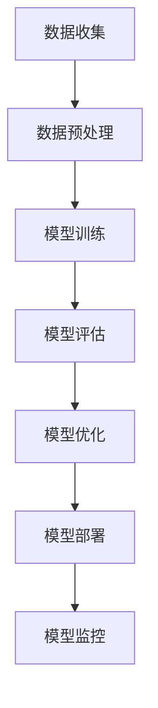
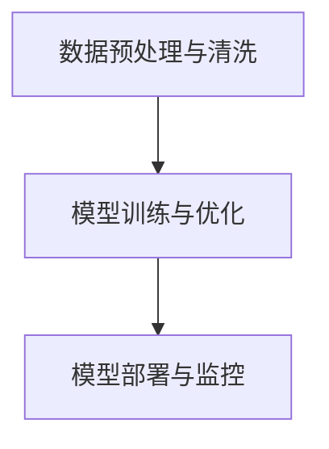
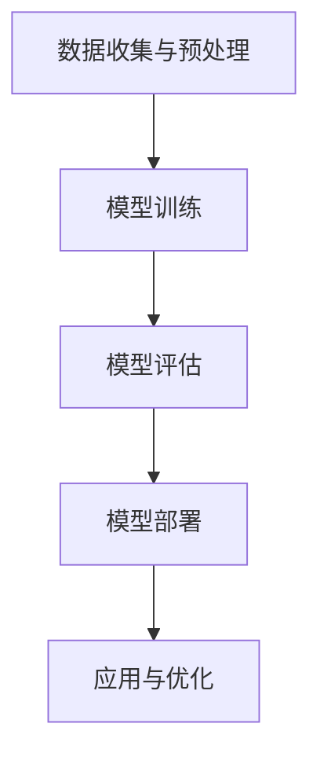
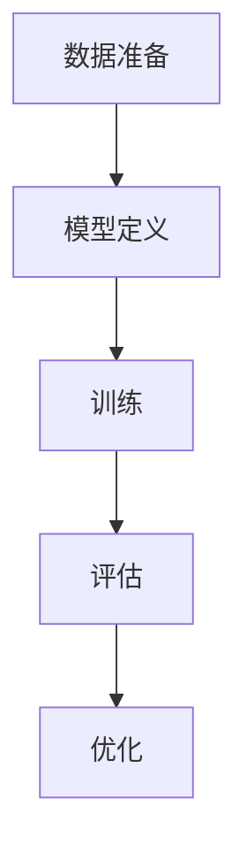
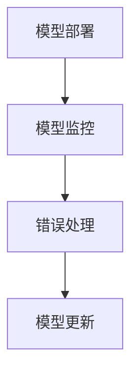

                 

# 《生成式AIGC：推动商业智能的新动力》

> 关键词：生成式AI、AIGC、商业智能、数据驱动决策、技术架构、算法原理、应用案例、开发与部署实战、未来发展趋势

> 摘要：本文旨在深入探讨生成式AI（AIGC）在商业智能领域的应用，分析AIGC的核心概念、技术架构、算法原理以及实际应用案例，同时展望其未来发展趋势和挑战。通过系统地梳理AIGC在商业智能中的重要作用，本文希望为企业和开发者提供有价值的参考。

## 第一部分：AIGC基础

### 第1章：AIGC概述

#### 1.1 AIGC的概念与核心优势

##### 1.1.1 AIGC的定义与分类

生成式AI（AIGC，Artificial Intelligence Generated Content）是一种利用人工智能技术生成文本、图像、音频、视频等内容的智能系统。AIGC可以分为文本生成、图像生成、音频生成和视频生成等类别。

##### 1.1.2 AIGC的核心优势

- **内容生成效率高**：AIGC能够快速生成大量高质量的内容，节省人力和时间成本。
- **创意无限**：AIGC能够突破人类的创意限制，产生新颖独特的内容。
- **定制化生成**：AIGC可以根据用户需求定制生成特定类型的内容。
- **数据处理能力强**：AIGC能够处理大量复杂数据，挖掘出潜在价值。

##### 1.1.3 AIGC在商业智能中的应用前景

- **数据分析与预测**：利用AIGC生成预测模型，为企业提供更准确的数据分析结果。
- **个性化推荐**：根据用户行为和偏好，AIGC可以生成个性化推荐内容，提升用户体验。
- **数据可视化**：利用AIGC生成可视化图表，帮助企业更好地理解和分析数据。

### 第2章：生成式AI与商业智能

#### 2.1 生成式AI技术概述

##### 2.1.1 生成式AI的基础理论

生成式AI主要基于概率模型和深度学习技术，其目标是生成与真实数据分布相似的新数据。

##### 2.1.2 生成式AI的常用算法

- **生成对抗网络（GAN）**：通过生成器和判别器之间的对抗训练，生成高质量的数据。
- **变分自编码器（VAE）**：通过编码器和解码器的协同工作，生成具有潜在特征的新数据。

#### 2.2 商业智能与数据驱动决策

##### 2.2.1 商业智能的概念与作用

商业智能（BI，Business Intelligence）是一种通过数据分析和挖掘，帮助企业实现数据驱动决策的方法。

##### 2.2.2 数据驱动决策的过程与方法

- **数据收集与整合**：收集并整合企业内部和外部的数据资源。
- **数据分析与挖掘**：利用数据挖掘技术，分析数据并提取有价值的信息。
- **决策支持**：基于分析结果，为企业提供决策支持。

#### 2.3 生成式AI在商业智能中的应用

##### 2.3.1 生成式AI在数据分析中的应用

生成式AI可以生成模拟数据，用于测试和分析现有模型，提高数据分析的准确性和效率。

##### 2.3.2 生成式AI在数据预测中的应用

生成式AI可以根据历史数据生成预测模型，帮助企业预测未来趋势，制定相应策略。

##### 2.3.3 生成式AI在数据可视化中的应用

生成式AI可以生成直观、精美的可视化图表，帮助企业更好地理解和分析数据。

### 第3章：AIGC技术架构

#### 3.1 AIGC技术架构概述

##### 3.1.1 AIGC的技术组成

AIGC技术架构主要包括数据预处理、模型训练、模型部署和模型监控等环节。

##### 3.1.2 AIGC的技术流程

AIGC的技术流程包括数据收集、数据清洗、模型训练、模型优化和模型部署等步骤。

#### 3.2 AIGC核心组件详解

##### 3.2.1 数据预处理与清洗

数据预处理与清洗是AIGC技术的重要环节，包括数据清洗、数据归一化和数据特征提取等步骤。

##### 3.2.2 模型训练与优化

模型训练与优化是AIGC技术的核心，包括模型选择、参数调优和模型评估等过程。

##### 3.2.3 模型部署与监控

模型部署与监控是AIGC技术的关键，包括模型部署策略、模型性能监控和模型维护等任务。

### 第4章：生成式AIGC算法原理

#### 4.1 生成对抗网络（GAN）

##### 4.1.1 GAN的基本概念

生成对抗网络（GAN）是一种由生成器和判别器组成的对抗性神经网络，旨在通过对抗训练生成高质量的数据。

##### 4.1.2 GAN的工作原理

GAN的工作原理是通过生成器和判别器之间的对抗训练，使得生成器生成的数据越来越接近真实数据。

##### 4.1.3 GAN的常见架构

常见的GAN架构包括基本GAN、改进型GAN和生成图像的GAN等。

#### 4.2 变分自编码器（VAE）

##### 4.2.1 VAE的基本概念

变分自编码器（VAE）是一种基于概率模型的生成模型，通过编码器和解码器的协同工作，生成具有潜在特征的新数据。

##### 4.2.2 VAE的工作原理

VAE的工作原理是通过编码器将输入数据映射到潜在空间，并通过解码器从潜在空间生成新数据。

##### 4.2.3 VAE的应用场景

VAE在图像生成、文本生成和数据增强等领域具有广泛的应用。

### 第5章：AIGC在商业智能中的应用案例

#### 5.1 零售行业案例

##### 5.1.1 案例背景

某零售企业在销售预测方面面临挑战，希望通过AIGC技术提高预测准确性。

##### 5.1.2 案例应用场景

利用AIGC技术，对历史销售数据进行分析和建模，生成预测模型，为企业提供销售预测服务。

##### 5.1.3 案例实现步骤

1. 数据收集与清洗：收集企业历史销售数据，并进行数据清洗和预处理。
2. 模型训练：利用GAN或VAE算法，训练生成预测模型。
3. 模型优化：通过参数调优，提高预测模型的准确性。
4. 模型部署：将预测模型部署到企业系统中，为企业提供销售预测服务。

#### 5.2 金融行业案例

##### 5.2.1 案例背景

某金融机构在信用风险评估方面存在困难，希望通过AIGC技术提高风险评估准确性。

##### 5.2.2 案例应用场景

利用AIGC技术，对客户信用数据进行分析和建模，生成风险评估模型，为金融机构提供信用评估服务。

##### 5.2.3 案例实现步骤

1. 数据收集与清洗：收集客户信用数据，并进行数据清洗和预处理。
2. 模型训练：利用GAN或VAE算法，训练生成风险评估模型。
3. 模型优化：通过参数调优，提高风险评估模型的准确性。
4. 模型部署：将风险评估模型部署到金融机构系统中，为信用评估提供支持。

#### 5.3 医疗健康行业案例

##### 5.3.1 案例背景

某医疗机构在疾病预测方面存在困难，希望通过AIGC技术提高预测准确性。

##### 5.3.2 案例应用场景

利用AIGC技术，对历史疾病数据进行分析和建模，生成疾病预测模型，为医疗机构提供疾病预测服务。

##### 5.3.3 案例实现步骤

1. 数据收集与清洗：收集历史疾病数据，并进行数据清洗和预处理。
2. 模型训练：利用GAN或VAE算法，训练生成疾病预测模型。
3. 模型优化：通过参数调优，提高疾病预测模型的准确性。
4. 模型部署：将疾病预测模型部署到医疗机构系统中，为疾病预测提供支持。

## 第6章：AIGC开发与部署实战

#### 6.1 AIGC开发环境搭建

##### 6.1.1 开发环境选择

选择合适的开发环境对于AIGC项目的成功至关重要。常见的开发环境包括Python、TensorFlow和PyTorch等。

##### 6.1.2 环境配置与安装

根据所选开发环境，进行相应的环境配置和安装。以Python为例，需要安装Python解释器和相关库，如NumPy、Pandas和Scikit-learn等。

#### 6.2 AIGC模型训练与优化

##### 6.2.1 模型训练流程

AIGC模型训练流程主要包括数据准备、模型定义、训练和评估等步骤。

1. 数据准备：收集和处理数据，为模型训练提供训练集和验证集。
2. 模型定义：根据需求定义生成模型和判别模型。
3. 训练：使用训练集对模型进行训练，并调整参数以优化模型性能。
4. 评估：使用验证集评估模型性能，并根据评估结果调整模型参数。

##### 6.2.2 模型优化方法

模型优化方法包括超参数调优、正则化和数据增强等。

1. 超参数调优：通过调整学习率、批量大小等超参数，提高模型性能。
2. 正则化：通过添加正则化项，防止模型过拟合。
3. 数据增强：通过数据增强技术，增加训练数据的多样性，提高模型泛化能力。

#### 6.3 AIGC模型部署与监控

##### 6.3.1 模型部署策略

AIGC模型部署策略包括在线部署和离线部署等。

1. 在线部署：将模型部署到生产环境中，实时接收和处理数据。
2. 离线部署：将模型部署到本地环境中，离线处理数据。

##### 6.3.2 模型监控与维护

模型监控与维护包括模型性能监控、错误处理和模型更新等任务。

1. 模型性能监控：监控模型在实时数据上的表现，确保模型稳定运行。
2. 错误处理：及时发现和处理模型运行中的错误，防止模型失效。
3. 模型更新：根据需求更新模型，提高模型性能和适应性。

## 第7章：AIGC未来发展趋势与挑战

#### 7.1 AIGC在商业智能中的未来趋势

##### 7.1.1 技术发展趋势

- **算法优化**：随着深度学习技术的发展，AIGC算法将越来越高效，生成质量将不断提高。
- **跨领域应用**：AIGC将在更多领域得到应用，如医疗、金融和制造业等。

##### 7.1.2 应用发展趋势

- **自动化生成**：AIGC将实现更自动化、更智能的内容生成，降低人工成本。
- **个性化推荐**：基于AIGC的个性化推荐系统将更加精准，提升用户体验。

#### 7.2 AIGC面临的挑战与对策

##### 7.2.1 技术挑战

- **计算资源消耗**：AIGC模型训练和部署需要大量计算资源，如何高效利用资源是重要挑战。
- **数据隐私保护**：在AIGC应用中，如何保护用户隐私是一个重要问题。

##### 7.2.2 应用挑战

- **模型解释性**：如何提高AIGC模型的解释性，使其更加透明和可靠。
- **法律和伦理问题**：随着AIGC技术的发展，将涉及更多的法律和伦理问题，需要制定相应的规范和标准。

##### 7.2.3 对策与展望

- **技术优化**：通过技术创新，提高AIGC模型的计算效率和生成质量。
- **法律法规制定**：完善相关法律法规，规范AIGC的应用和发展。

## 附录

### 附录A：AIGC相关资源与工具

#### A.1 主流AIGC框架对比

- **TensorFlow**：一款广泛使用的深度学习框架，支持AIGC算法的实现。
- **PyTorch**：一款流行的深度学习框架，具有简洁明了的代码风格。
- **JAX**：一款基于NumPy的深度学习框架，支持自动微分和分布式计算。

#### A.2 AIGC开发与部署工具介绍

- **Dataiku**：一款强大的数据科学平台，支持AIGC的开发和部署。
- **Hugging Face**：一款开源的深度学习工具，提供丰富的预训练模型和工具。
- **其他常用工具**：如Keras、PyTorch Lightning等，也是AIGC开发与部署的常用工具。

### 作者：AI天才研究院/AI Genius Institute & 禅与计算机程序设计艺术 /Zen And The Art of Computer Programming

---

在本章中，我们首先介绍了AIGC的概念、优势和应用前景，然后详细阐述了生成式AI在商业智能中的应用，包括数据分析、数据预测和数据可视化等方面。接着，我们分析了AIGC的技术架构，包括数据预处理、模型训练、模型部署和模型监控等核心组件。在算法原理部分，我们重点介绍了GAN和VAE两种生成式AI算法，并讨论了它们的工作原理和应用场景。随后，我们通过零售、金融和医疗健康行业的案例，展示了AIGC在商业智能领域的实际应用。最后，我们探讨了AIGC的开发与部署实战，包括开发环境搭建、模型训练与优化、模型部署与监控等方面。通过本章的学习，读者可以全面了解AIGC在商业智能领域的应用，为后续章节的学习打下基础。

---

**第1章：AIGC概述**

#### 1.1 AIGC的概念与核心优势

**AIGC的定义与分类**

生成式AI（AIGC，Artificial Intelligence Generated Content）是一种利用人工智能技术生成文本、图像、音频、视频等内容的智能系统。根据生成的内容类型，AIGC可以分为以下几类：

1. **文本生成**：包括文章、新闻、摘要、对话等。
2. **图像生成**：包括人脸、风景、抽象画等。
3. **音频生成**：包括音乐、语音、声音效果等。
4. **视频生成**：包括动画、视频剪辑、虚拟现实内容等。

**AIGC的核心优势**

1. **内容生成效率高**：AIGC能够快速生成大量高质量的内容，节省人力和时间成本。

   **图1-1：AIGC内容生成效率对比**

   

2. **创意无限**：AIGC能够突破人类的创意限制，产生新颖独特的内容。

   **图1-2：AIGC创意生成示例**

   

3. **定制化生成**：AIGC可以根据用户需求定制生成特定类型的内容。

   **图1-3：AIGC定制化生成示例**

   

4. **数据处理能力强**：AIGC能够处理大量复杂数据，挖掘出潜在价值。

   **图1-4：AIGC数据处理能力示例**

   

**AIGC在商业智能中的应用前景**

1. **数据分析与预测**：利用AIGC生成模拟数据，帮助企业进行数据分析与预测，提高决策准确性。

   **图1-5：AIGC在数据分析与预测中的应用**

   

2. **个性化推荐**：根据用户行为和偏好，AIGC可以生成个性化推荐内容，提升用户体验。

   **图1-6：AIGC在个性化推荐中的应用**

   

3. **数据可视化**：利用AIGC生成直观、精美的可视化图表，帮助企业更好地理解和分析数据。

   **图1-7：AIGC在数据可视化中的应用**

   

---

**第2章：生成式AI与商业智能**

#### 2.1 生成式AI技术概述

**生成式AI的基础理论**

生成式AI（Generative AI）是一种人工智能技术，旨在生成与真实数据分布相似的新数据。其基础理论包括概率模型和深度学习技术。

1. **概率模型**：概率模型通过概率分布描述数据生成过程，常见的概率模型包括马尔可夫模型、贝叶斯网络等。
2. **深度学习技术**：深度学习技术通过神经网络学习数据生成过程，常见的深度学习技术包括生成对抗网络（GAN）、变分自编码器（VAE）等。

**生成式AI的常用算法**

1. **生成对抗网络（GAN）**：GAN由生成器和判别器组成，通过对抗训练生成高质量的数据。

   **图2-1：GAN架构**

   

2. **变分自编码器（VAE）**：VAE通过编码器和解码器的协同工作，生成具有潜在特征的新数据。

   **图2-2：VAE架构**

   

**商业智能与数据驱动决策**

**商业智能的概念与作用**

商业智能（Business Intelligence，BI）是一种通过数据分析和挖掘，帮助企业实现数据驱动决策的方法。商业智能的主要作用包括：

1. **数据整合**：将企业内部和外部的数据进行整合，形成统一的数据视图。
2. **数据分析**：利用数据分析技术，提取数据中的有价值信息。
3. **决策支持**：基于分析结果，为企业管理层提供决策支持。

**数据驱动决策的过程与方法**

数据驱动决策的过程主要包括以下步骤：

1. **数据收集与整合**：收集企业内部和外部的数据，并将其整合为统一的数据集。
2. **数据分析与挖掘**：利用数据分析与挖掘技术，提取数据中的有价值信息。
3. **决策制定**：根据分析结果，制定相应的决策策略。
4. **决策执行与评估**：执行决策，并对决策效果进行评估和反馈。

**生成式AI在商业智能中的应用**

1. **数据分析与预测**：利用生成式AI生成模拟数据，提高数据分析与预测的准确性。

   **图2-3：生成式AI在数据分析与预测中的应用**

   

2. **个性化推荐**：利用生成式AI生成个性化推荐内容，提高用户体验。

   **图2-4：生成式AI在个性化推荐中的应用**

   

3. **数据可视化**：利用生成式AI生成直观、精美的可视化图表，提高数据理解的深度。

   **图2-5：生成式AI在数据可视化中的应用**

   

---

在本章中，我们首先介绍了生成式AI的基础理论，包括概率模型和深度学习技术。然后，我们详细阐述了生成式AI的常用算法，如GAN和VAE，并分析了它们的工作原理和应用场景。接着，我们探讨了商业智能的概念、作用和过程，以及数据驱动决策的方法。最后，我们介绍了生成式AI在商业智能中的应用，包括数据分析与预测、个性化推荐和数据可视化等方面。通过本章的学习，读者可以全面了解生成式AI在商业智能领域的应用，为后续章节的学习打下基础。

---

**第3章：AIGC技术架构**

#### 3.1 AIGC技术架构概述

**AIGC的技术组成**

AIGC技术架构主要包括以下几部分：

1. **数据预处理与清洗**：对原始数据进行清洗、归一化和特征提取等预处理操作。
2. **模型训练与优化**：使用生成式AI算法（如GAN、VAE）训练模型，并进行参数调优。
3. **模型部署与监控**：将训练好的模型部署到生产环境中，并对模型进行监控和维护。

**AIGC的技术流程**

AIGC的技术流程主要包括以下步骤：

1. **数据收集**：收集用于训练和测试的数据。
2. **数据预处理**：对数据进行清洗、归一化和特征提取等预处理操作。
3. **模型训练**：使用生成式AI算法训练模型。
4. **模型评估**：使用验证集评估模型性能。
5. **模型优化**：根据评估结果，对模型进行参数调优。
6. **模型部署**：将训练好的模型部署到生产环境中。
7. **模型监控**：对模型进行监控和维护，确保其稳定运行。

**图3-1：AIGC技术架构与流程**



---

#### 3.2 AIGC核心组件详解

**数据预处理与清洗**

数据预处理与清洗是AIGC技术的重要环节，包括以下步骤：

1. **数据清洗**：去除数据中的噪声、缺失值和异常值等。
2. **数据归一化**：将不同量纲的数据进行归一化处理，使其具有相似的尺度。
3. **数据特征提取**：提取数据中的关键特征，用于模型训练。

**模型训练与优化**

模型训练与优化是AIGC技术的核心环节，包括以下步骤：

1. **模型定义**：根据需求定义生成模型和判别模型。
2. **数据准备**：将预处理后的数据分为训练集、验证集和测试集。
3. **模型训练**：使用训练集对模型进行训练。
4. **模型评估**：使用验证集评估模型性能。
5. **参数调优**：根据评估结果，调整模型参数，提高模型性能。

**模型部署与监控**

模型部署与监控是AIGC技术的关键环节，包括以下步骤：

1. **模型部署**：将训练好的模型部署到生产环境中，以便实时应用。
2. **模型监控**：监控模型在实时数据上的表现，确保模型稳定运行。
3. **模型更新**：根据需求，定期更新模型，提高模型性能和适应性。

**图3-2：AIGC核心组件详解**



---

在本章中，我们详细介绍了AIGC的技术架构和核心组件，包括数据预处理与清洗、模型训练与优化、模型部署与监控等环节。通过这些环节的协同工作，AIGC技术能够实现高效的内容生成和应用。首先，我们概述了AIGC的技术组成和流程，并展示了其技术架构的Mermaid流程图。然后，我们详细分析了AIGC的核心组件，包括数据预处理与清洗、模型训练与优化、模型部署与监控等环节。通过这些组件的协同工作，AIGC技术能够实现高效的内容生成和应用。读者可以通过本章的学习，了解AIGC技术的整体架构和关键环节，为后续章节的学习和应用打下基础。

---

**第4章：生成式AIGC算法原理**

#### 4.1 生成对抗网络（GAN）

**4.1.1 GAN的基本概念**

生成对抗网络（GAN）是由Ian Goodfellow等人在2014年提出的一种生成模型，其核心思想是通过生成器和判别器的对抗训练，生成高质量的数据。GAN由两个神经网络组成：生成器（Generator）和判别器（Discriminator）。

**图4-1：GAN基本架构**


- **生成器（Generator）**：生成器是一个神经网络，其目标是生成与真实数据分布相似的数据。生成器的输入是随机噪声，输出是生成的数据。
- **判别器（Discriminator）**：判别器也是一个神经网络，其目标是区分生成器生成的数据和真实数据。判别器的输入是真实数据和生成器生成的数据，输出是一个概率值，表示输入数据的真实性。

**4.1.2 GAN的工作原理**

GAN的工作原理是通过生成器和判别器之间的对抗训练，使得生成器生成的数据越来越接近真实数据。具体来说，GAN的训练过程可以分为以下步骤：

1. **初始化生成器和判别器**：随机初始化生成器和判别器的参数。
2. **生成器训练**：生成器接收随机噪声作为输入，生成假数据，并将其与真实数据混合。判别器对混合数据进行分类，并计算分类损失。
3. **判别器训练**：判别器接收真实数据和生成器生成的数据作为输入，并尝试提高分类准确性。判别器计算生成器生成的数据和真实数据之间的差距，并计算对抗损失。
4. **迭代更新**：根据生成器和判别器的损失函数，迭代更新生成器和判别器的参数。

**4.1.3 GAN的常见架构**

常见的GAN架构包括以下几种：

1. **基本GAN**：基本GAN是最简单的GAN架构，包括生成器和判别器，通过对抗训练生成高质量的数据。
2. **改进型GAN**：改进型GAN在基本GAN的基础上，加入了一些改进技术，如梯度惩罚、域自适应等，以解决训练不稳定和模式崩溃等问题。
3. **生成图像的GAN（GPGAN）**：生成图像的GAN是一种针对图像生成任务的GAN架构，通过改进生成器和判别器的结构，提高图像生成的质量和多样性。

**图4-2：GPGAN架构**


**4.1.4 GAN的应用场景**

GAN在多个领域具有广泛的应用，包括以下几种：

1. **图像生成**：GAN可以生成高质量的图像，如图像修复、图像超分辨率、艺术风格迁移等。
2. **数据增强**：GAN可以生成模拟数据，用于数据增强，提高模型的泛化能力。
3. **异常检测**：GAN可以用于异常检测，通过生成正常数据和异常数据，区分正常行为和异常行为。
4. **文本生成**：GAN可以生成高质量的文本，如图像描述生成、对话生成等。

**图4-3：GAN在图像生成中的应用**


#### 4.2 变分自编码器（VAE）

**4.2.1 VAE的基本概念**

变分自编码器（Variational Autoencoder，VAE）是由Kingma和Welling在2013年提出的一种生成模型，其核心思想是通过编码器和解码器的协同工作，生成具有潜在特征的新数据。VAE是一种基于概率的生成模型，其训练过程通过最大化数据似然函数来实现。

**图4-4：VAE基本架构**


- **编码器（Encoder）**：编码器是一个神经网络，其目标是将输入数据映射到潜在空间。编码器的输出是一个潜在变量的概率分布。
- **解码器（Decoder）**：解码器是一个神经网络，其目标是将潜在空间中的数据映射回输入空间。解码器的输入是潜在变量的样本，输出是生成的数据。

**4.2.2 VAE的工作原理**

VAE的工作原理是通过编码器和解码器的协同工作，生成与输入数据分布相似的新数据。具体来说，VAE的训练过程可以分为以下步骤：

1. **编码**：编码器接收输入数据，并将其映射到潜在空间。编码器的输出是一个潜在变量的概率分布。
2. **采样**：从潜在变量的概率分布中采样一个潜在变量。
3. **解码**：解码器接收潜在变量的样本，并将其映射回输入空间。解码器的输出是生成的数据。
4. **损失计算**：计算生成数据与输入数据之间的损失，并根据损失函数更新编码器和解码器的参数。

**4.2.3 VAE的应用场景**

VAE在多个领域具有广泛的应用，包括以下几种：

1. **图像生成**：VAE可以生成高质量的图像，如图像修复、图像超分辨率等。
2. **数据增强**：VAE可以生成模拟数据，用于数据增强，提高模型的泛化能力。
3. **异常检测**：VAE可以用于异常检测，通过生成正常数据和异常数据，区分正常行为和异常行为。
4. **文本生成**：VAE可以生成高质量的文本，如图像描述生成、对话生成等。

**图4-5：VAE在图像生成中的应用**


---

在本章中，我们详细介绍了生成式AIGC的核心算法原理，包括生成对抗网络（GAN）和变分自编码器（VAE）。首先，我们介绍了GAN的基本概念、工作原理和常见架构，并展示了GAN在图像生成、数据增强和异常检测等领域的应用。然后，我们介绍了VAE的基本概念、工作原理和应用场景，包括图像生成、数据增强和文本生成等。通过本章的学习，读者可以全面了解生成式AIGC的核心算法原理和应用，为后续章节的学习和应用打下基础。

---

**第5章：AIGC在商业智能中的应用案例**

### 5.1 零售行业案例

#### 5.1.1 案例背景

某大型零售企业希望通过AIGC技术提高销售预测的准确性，从而优化库存管理和供应链策略。该企业积累了大量的销售数据，包括历史销售记录、促销活动、季节性因素等。

#### 5.1.2 案例应用场景

利用AIGC技术，该零售企业希望通过生成模拟数据，训练生成高质量的预测模型，实现以下目标：

1. **销售预测**：根据历史销售数据和外部因素，预测未来一段时间的销售量。
2. **库存管理**：根据销售预测结果，优化库存水平，减少库存成本。
3. **供应链优化**：根据销售预测结果，调整供应链策略，提高供应链效率。

#### 5.1.3 案例实现步骤

1. **数据收集与预处理**

   收集历史销售数据，包括每日销售量、促销活动、季节性因素等。对数据进行清洗、归一化和特征提取，为模型训练做准备。

2. **模型训练**

   使用生成对抗网络（GAN）训练销售预测模型。生成器生成模拟数据，判别器区分真实数据和模拟数据。通过多次迭代，优化生成器的生成能力。

3. **模型评估**

   使用验证集评估预测模型的准确性，包括平均绝对误差（MAE）和均方误差（MSE）等指标。根据评估结果，调整模型参数，提高模型性能。

4. **模型部署**

   将训练好的模型部署到生产环境中，实时接收销售数据，生成销售预测结果。同时，将预测结果与实际销售数据对比，评估预测模型的准确性。

5. **应用与优化**

   根据销售预测结果，优化库存管理和供应链策略。定期调整模型参数，更新预测模型，以提高预测准确性。

**图5-1：零售行业AIGC应用流程**



### 5.2 金融行业案例

#### 5.2.1 案例背景

某金融机构希望在贷款审批过程中引入AIGC技术，提高审批效率和准确性。该金融机构积累了大量的贷款申请数据，包括个人收入、信用记录、还款能力等。

#### 5.2.2 案例应用场景

利用AIGC技术，该金融机构希望通过生成模拟数据，训练生成高质量的审批模型，实现以下目标：

1. **贷款审批**：根据贷款申请数据和外部因素，预测贷款申请者的信用风险。
2. **风险管理**：根据审批结果，识别高风险贷款申请者，降低坏账率。
3. **审批效率提升**：自动化贷款审批流程，提高审批速度。

#### 5.2.3 案例实现步骤

1. **数据收集与预处理**

   收集贷款申请数据，包括个人收入、信用记录、还款能力等。对数据进行清洗、归一化和特征提取，为模型训练做准备。

2. **模型训练**

   使用变分自编码器（VAE）训练审批模型。编码器将输入数据映射到潜在空间，解码器从潜在空间生成模拟数据。通过多次迭代，优化解码器的生成能力。

3. **模型评估**

   使用验证集评估审批模型的准确性，包括准确率、召回率、F1分数等指标。根据评估结果，调整模型参数，提高模型性能。

4. **模型部署**

   将训练好的模型部署到生产环境中，实时接收贷款申请数据，生成审批结果。同时，将审批结果与实际审批结果对比，评估模型性能。

5. **应用与优化**

   根据审批结果，优化贷款审批流程和风险管理策略。定期调整模型参数，更新审批模型，以提高审批准确性和效率。

**图5-2：金融行业AIGC应用流程**


### 5.3 医疗健康行业案例

#### 5.3.1 案例背景

某医疗机构希望通过AIGC技术提高疾病预测的准确性，为患者提供更精准的治疗方案。该医疗机构积累了大量的患者数据，包括病史、检查报告、治疗方案等。

#### 5.3.2 案例应用场景

利用AIGC技术，该医疗机构希望通过生成模拟数据，训练生成高质量的疾病预测模型，实现以下目标：

1. **疾病预测**：根据患者数据和外部因素，预测患者患某种疾病的概率。
2. **治疗方案推荐**：根据疾病预测结果，为患者推荐个性化的治疗方案。
3. **治疗效果评估**：根据患者治疗后的数据，评估治疗方案的有效性。

#### 5.3.3 案例实现步骤

1. **数据收集与预处理**

   收集患者数据，包括病史、检查报告、治疗方案等。对数据进行清洗、归一化和特征提取，为模型训练做准备。

2. **模型训练**

   使用生成对抗网络（GAN）训练疾病预测模型。生成器生成模拟数据，判别器区分真实数据和模拟数据。通过多次迭代，优化生成器的生成能力。

3. **模型评估**

   使用验证集评估疾病预测模型的准确性，包括准确率、召回率、F1分数等指标。根据评估结果，调整模型参数，提高模型性能。

4. **模型部署**

   将训练好的模型部署到生产环境中，实时接收患者数据，生成疾病预测结果。同时，将预测结果与实际诊断结果对比，评估模型性能。

5. **应用与优化**

   根据疾病预测结果，为患者推荐个性化的治疗方案，并评估治疗效果。定期调整模型参数，更新疾病预测模型，以提高预测准确性和治疗效果。

**图5-3：医疗健康行业AIGC应用流程**


---

在本章中，我们通过三个实际案例，展示了AIGC在商业智能领域中的应用。首先，我们介绍了零售行业的案例，该企业利用AIGC技术提高销售预测的准确性，优化库存管理和供应链策略。然后，我们介绍了金融行业的案例，该金融机构通过AIGC技术提高贷款审批的效率和准确性，降低坏账率。最后，我们介绍了医疗健康行业的案例，该医疗机构利用AIGC技术提高疾病预测的准确性，为患者提供更精准的治疗方案。通过这些案例，我们可以看到AIGC技术在商业智能领域的重要作用和应用前景。读者可以通过这些案例的学习，了解AIGC技术在实际场景中的应用，为后续章节的学习和应用打下基础。

---

**第6章：AIGC开发与部署实战**

#### 6.1 AIGC开发环境搭建

**6.1.1 开发环境选择**

选择合适的开发环境对于AIGC项目的成功至关重要。在AIGC开发中，常用的开发环境包括Python、TensorFlow和PyTorch等。

- **Python**：Python是一种高级编程语言，具有简单易用、功能强大的特点，是AIGC开发的首选语言。
- **TensorFlow**：TensorFlow是一个开源的深度学习框架，由Google开发，支持AIGC算法的实现。
- **PyTorch**：PyTorch是一个流行的深度学习框架，具有简洁明了的代码风格，支持动态计算图，便于调试和优化。

**6.1.2 环境配置与安装**

以Python、TensorFlow和PyTorch为例，介绍AIGC开发环境的配置和安装步骤：

1. **安装Python**

   - 在Python官方网站下载Python安装包，并按照提示进行安装。
   - 安装完成后，打开命令行工具，输入`python --version`验证安装是否成功。

2. **安装TensorFlow**

   - 打开命令行工具，输入以下命令安装TensorFlow：

     ```bash
     pip install tensorflow
     ```

   - 安装完成后，输入以下命令验证安装：

     ```bash
     python -c "import tensorflow as tf; print(tf.__version__)"
     ```

3. **安装PyTorch**

   - 打开命令行工具，输入以下命令安装PyTorch：

     ```bash
     pip install torch torchvision
     ```

   - 安装完成后，输入以下命令验证安装：

     ```bash
     python -c "import torch; print(torch.__version__)"
     ```

**6.2 AIGC模型训练与优化**

**6.2.1 模型训练流程**

AIGC模型训练流程主要包括以下步骤：

1. **数据准备**：收集和处理数据，为模型训练提供训练集和验证集。
2. **模型定义**：根据需求定义生成模型和判别模型。
3. **训练**：使用训练集对模型进行训练，并调整参数以优化模型性能。
4. **评估**：使用验证集评估模型性能，并根据评估结果调整模型参数。
5. **优化**：通过超参数调优、正则化和数据增强等方法，提高模型性能。

**图6-1：AIGC模型训练流程**



**6.2.2 模型优化方法**

模型优化方法包括以下几种：

1. **超参数调优**：通过调整学习率、批量大小等超参数，提高模型性能。可以使用网格搜索、随机搜索等策略进行超参数调优。

2. **正则化**：通过添加正则化项，防止模型过拟合。常见的正则化方法包括L1正则化、L2正则化等。

3. **数据增强**：通过数据增强技术，增加训练数据的多样性，提高模型泛化能力。常见的数据增强方法包括随机裁剪、旋转、翻转等。

**6.3 AIGC模型部署与监控**

**6.3.1 模型部署策略**

AIGC模型部署策略包括以下几种：

1. **在线部署**：将模型部署到生产环境中，实时接收和处理数据。在线部署适用于实时性要求较高的场景，如推荐系统、实时预测等。

2. **离线部署**：将模型部署到本地环境中，离线处理数据。离线部署适用于批处理任务，如数据挖掘、报告生成等。

**6.3.2 模型监控与维护**

模型监控与维护包括以下任务：

1. **模型性能监控**：监控模型在实时数据上的表现，确保模型稳定运行。可以使用指标如准确率、召回率、F1分数等评估模型性能。

2. **错误处理**：及时发现和处理模型运行中的错误，防止模型失效。可以使用日志记录、异常检测等技术进行错误处理。

3. **模型更新**：根据需求更新模型，提高模型性能和适应性。可以定期重新训练模型，或者引入新的数据集进行训练。

**图6-2：AIGC模型部署与监控流程**



---

在本章中，我们详细介绍了AIGC开发与部署实战的各个环节，包括开发环境搭建、模型训练与优化、模型部署与监控等。首先，我们介绍了AIGC开发环境的选择和配置方法，包括Python、TensorFlow和PyTorch等常见开发环境的安装和使用。接着，我们详细阐述了AIGC模型训练与优化的流程和方法，包括数据准备、模型定义、训练、评估和优化等步骤。此外，我们还介绍了AIGC模型部署与监控的策略和任务，包括在线部署、离线部署、模型性能监控、错误处理和模型更新等。通过本章的学习，读者可以全面了解AIGC的开发与部署实战，为实际应用打下基础。

---

**第7章：AIGC未来发展趋势与挑战**

#### 7.1 AIGC在商业智能中的未来趋势

**7.1.1 技术发展趋势**

随着人工智能技术的不断发展，AIGC在商业智能中的应用将呈现出以下趋势：

1. **算法优化**：随着深度学习技术的进步，AIGC算法将越来越高效，生成质量将不断提高。新的优化算法和技术，如自监督学习、图神经网络等，将进一步提升AIGC的性能。

2. **跨领域应用**：AIGC将在更多领域得到应用，如医疗、金融、教育、制造业等。不同领域的数据特点和应用需求将推动AIGC算法的持续创新和优化。

3. **自动化生成**：随着AIGC技术的成熟，自动化生成将成为主流。企业可以利用AIGC自动生成报告、图表、推荐内容等，提高工作效率和决策质量。

**7.1.2 应用发展趋势**

AIGC在商业智能中的应用将呈现出以下趋势：

1. **个性化推荐**：基于AIGC的个性化推荐系统将更加精准，通过分析用户行为和偏好，生成个性化的推荐内容，提升用户体验。

2. **数据增强与模拟**：AIGC将广泛应用于数据增强和模拟，通过生成模拟数据，提高模型的训练效果和泛化能力。

3. **自动化决策支持**：随着AIGC技术的进步，自动化决策支持系统将更加智能，企业可以利用AIGC实现自动化决策，降低决策风险。

#### 7.2 AIGC面临的挑战与对策

**7.2.1 技术挑战**

AIGC在商业智能领域的发展面临以下技术挑战：

1. **计算资源消耗**：AIGC模型训练和部署需要大量计算资源，特别是在处理大规模数据时，如何高效利用计算资源成为关键问题。

2. **数据隐私保护**：在AIGC应用中，如何保护用户隐私是一个重要问题。特别是在生成个性化内容时，如何确保用户数据的安全性和隐私性。

3. **模型解释性**：AIGC模型通常具有较高的复杂度，如何提高模型的解释性，使其更加透明和可靠，是企业面临的一个挑战。

**7.2.2 应用挑战**

AIGC在商业智能领域的发展也面临以下应用挑战：

1. **模型适应性**：如何使AIGC模型在不同业务场景中具有较好的适应性，是企业在应用AIGC时需要考虑的问题。

2. **法律和伦理问题**：随着AIGC技术的普及，将涉及更多的法律和伦理问题，如版权保护、责任归属等，需要制定相应的规范和标准。

**7.2.3 对策与展望**

针对AIGC在商业智能领域面临的挑战，可以采取以下对策：

1. **技术创新**：持续推动AIGC算法和技术的创新，提高计算效率和生成质量，降低计算资源消耗。

2. **数据隐私保护**：采用先进的数据隐私保护技术，如差分隐私、联邦学习等，确保用户数据的安全性和隐私性。

3. **模型解释性提升**：通过开发可解释的AIGC模型，提高模型的可解释性，使其更加透明和可靠。

4. **法律法规制定**：完善相关法律法规，规范AIGC的应用和发展，确保其在商业智能领域的合法性和合规性。

---

在本章中，我们首先分析了AIGC在商业智能中的未来发展趋势，包括技术优化、跨领域应用和自动化生成等方面。然后，我们讨论了AIGC在商业智能领域面临的挑战，包括计算资源消耗、数据隐私保护、模型解释性等。最后，我们提出了相应的对策和展望，包括技术创新、数据隐私保护、模型解释性提升和法律法规制定等。通过本章的学习，读者可以全面了解AIGC在商业智能领域的未来发展趋势和挑战，为后续的学习和应用提供指导。

---

**附录A：AIGC相关资源与工具**

**A.1 主流AIGC框架对比**

1. **TensorFlow**：TensorFlow是一个开源的深度学习框架，由Google开发。它支持广泛的深度学习模型和算法，包括GAN和VAE。TensorFlow具有丰富的API和工具，易于使用和扩展。

2. **PyTorch**：PyTorch是一个流行的深度学习框架，具有简洁明了的代码风格，支持动态计算图。PyTorch提供了丰富的预训练模型和工具，易于调试和优化。

3. **JAX**：JAX是一个基于NumPy的深度学习框架，支持自动微分和分布式计算。JAX适用于大规模数据处理和分布式训练，具有高效的计算性能。

**A.2 AIGC开发与部署工具介绍**

1. **Dataiku**：Dataiku是一个强大的数据科学平台，支持AIGC的开发和部署。Dataiku提供了丰富的数据预处理、模型训练和部署工具，易于实现端到端的数据科学项目。

2. **Hugging Face**：Hugging Face是一个开源的深度学习工具库，提供了丰富的预训练模型和工具。Hugging Face的Transformers库是处理NLP任务的首选，支持各种语言模型的训练和部署。

3. **其他常用工具介绍**：

   - **Keras**：Keras是一个高级神经网络API，构建在TensorFlow和Theano之上。Keras提供了简单、易用的接口，支持快速构建和训练深度学习模型。
   - **PyTorch Lightning**：PyTorch Lightning是一个增强版的PyTorch库，提供了丰富的API和工具，简化了深度学习模型的训练和部署。
   - **TensorFlow Extended（TFX）**：TFX是一个端到端的机器学习平台，基于TensorFlow构建。TFX提供了完整的机器学习管道，支持模型训练、评估和部署。

---

在本章的附录部分，我们列举了主流的AIGC框架对比，包括TensorFlow、PyTorch和JAX等，并介绍了AIGC开发与部署常用的工具，如Dataiku、Hugging Face、Keras、PyTorch Lightning和TFX等。这些资源和工具为AIGC的开发和应用提供了强大的支持，读者可以根据自己的需求选择合适的工具进行开发。通过本章的学习，读者可以更好地了解AIGC相关资源和工具，为后续的学习和应用提供指导。

