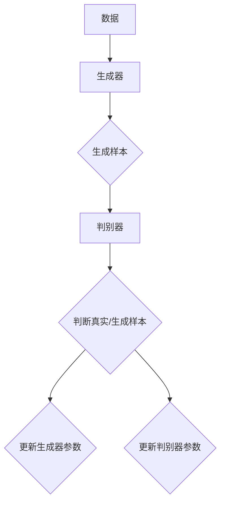
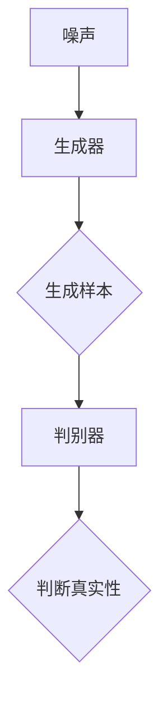
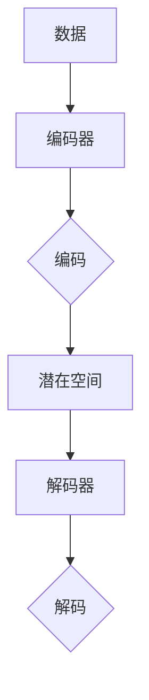
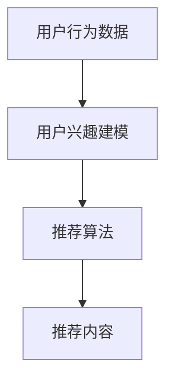
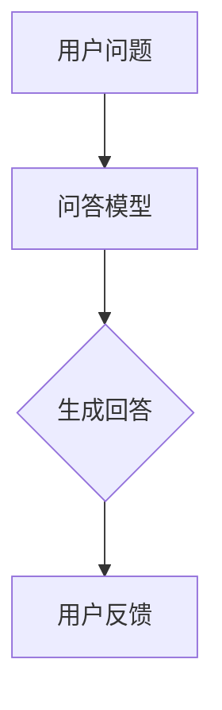
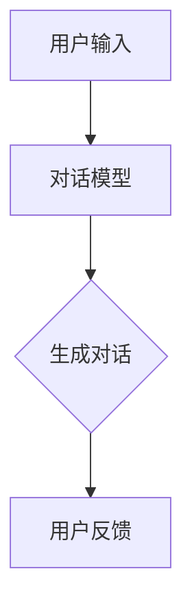

                 

# 文章标题: 生成式AIGC：数据与商业的深度融合

> 关键词：生成式AIGC、数据驱动决策、商业应用、人工智能、模型压缩与优化

> 摘要：本文将深入探讨生成式AIGC（生成式人工智能与生成控制）技术，分析其数据与商业深度融合的机制，以及在不同行业中的实际应用。通过解析核心原理、应用场景、商业价值和未来发展趋势，本文旨在为读者提供一个全面的视角，了解AIGC技术在现代商业环境中的重要性和潜力。

## 目录

## 第一部分: 生成式AIGC技术概述

### 1. 生成式AIGC概述

- 生成式AIGC的定义
- 生成式AIGC与传统AI的对比
- 生成式AIGC的应用领域
- 生成式AIGC的发展历程

### 2. 生成式AIGC的核心原理

- 数据生成模型
  - 生成对抗网络（GAN）
  - 变分自编码器（VAE）
- 模型训练方法
  - 数据增强
  - 模型优化

## 第二部分: 数据与商业的深度融合

### 3. 数据驱动决策

- 数据分析在企业中的应用
  - 客户行为分析
  - 产品性能评估
  - 风险管理
- 数据可视化
  - 数据可视化工具介绍
  - 数据可视化案例

### 4. 业务场景中的AIGC应用

- 生成式内容创作
  - 文本生成
  - 图像生成
  - 音频生成
- 个性化推荐
  - 推荐系统原理
  - 基于AIGC的推荐系统优化
- 生成式客服系统
  - 问答系统
  - 聊天机器人

## 第三部分: 生成式AIGC的商业价值

### 5. 降低成本

- 自动化生产
  - 生产线自动化
  - 工作流程自动化
- 减少人力成本
  - 自动化客服
  - 数据处理自动化

### 6. 提高效率

- 数据处理速度
  - 大规模数据处理
  - 实时数据处理
- 业务流程优化
  - 供应链管理
  - 生产计划优化

## 第四部分: AIGC在特定行业中的应用

### 7. 金融行业

- 信用评估
  - 信用评估模型
  - 信用评估案例分析
- 投资分析
  - 股票市场预测
  - 投资组合优化

### 8. 零售行业

- 个性化营销
  - 客户行为分析
  - 个性化推荐
- 库存管理
  - 库存预测
  - 库存优化策略

## 第五部分: AIGC面临的挑战与未来发展趋势

### 9. 道德与伦理问题

- 数据隐私保护
  - 数据匿名化
  - 加密技术
- 人工智能歧视
  - 偏见消除
  - 公平性评估

### 10. 技术挑战

- 计算资源需求
  - 模型训练需求
  - 模型推理需求
- 模型可解释性
  - 可解释性工具
  - 可解释性方法

### 11. 未来发展趋势

- 模型压缩与优化
  - 模型剪枝
  - 算法加速
- 跨模态生成
  - 图文生成
  - 音视频生成

## 第六部分: 结论与展望

### 12. 结论与展望

- AIGC在数据与商业深度融合中的关键作用
- AIGC的发展趋势与商业应用前景
- 未来研究方向与挑战

## 附录

### 附录 A: 生成式AIGC工具与资源

- 主流生成式AIGC框架对比
- 数据集与资源

### 附录 B: AIGC实践案例

- 文本生成案例
- 图像生成案例
- 音频生成案例

# 第一部分: 生成式AIGC技术概述

## 1. 生成式AIGC概述

生成式人工智能与生成控制（Generative Artificial Intelligence and Generative Control，简称AIGC）是近年来人工智能领域的一个重要分支。它结合了生成模型和控制理论，旨在通过数据驱动的方式生成新的数据，实现对复杂系统的控制。AIGC在内容创作、个性化推荐、自动化客服等领域展现出了巨大的潜力。

### 1.1 生成式AIGC的定义

生成式AIGC是指利用人工智能技术生成新的数据，并通过控制机制实现对生成过程的优化。具体来说，生成式AIGC主要包括以下两个核心概念：

1. **生成模型**：生成模型是AIGC的核心，它通过学习大量数据，生成新的、符合数据分布的样本。常见的生成模型包括生成对抗网络（GAN）、变分自编码器（VAE）等。
2. **生成控制**：生成控制是指在生成模型的基础上，通过引入控制机制，对生成过程进行干预，以实现特定的目标。生成控制可以通过调节生成模型的参数、设定生成约束等方式实现。

### 1.2 生成式AIGC与传统AI的对比

与传统的人工智能技术相比，生成式AIGC具有以下显著特点：

- **生成能力**：传统AI更多关注的是分类、预测等任务，而生成式AIGC则强调生成新的数据，能够创造出全新的内容。
- **数据依赖**：生成式AIGC需要大量的训练数据来学习数据分布，而传统AI则可以基于少量数据或规则进行推理。
- **灵活性**：生成式AIGC可以通过控制机制实现灵活的生成控制，而传统AI的决策过程相对固定。

### 1.3 生成式AIGC的应用领域

生成式AIGC的应用领域非常广泛，以下是一些典型的应用场景：

- **内容创作**：生成式AIGC可以生成高质量的文章、图像、音频等，应用于内容创作领域。
- **个性化推荐**：基于用户行为数据，生成式AIGC可以生成个性化的推荐内容，提升用户体验。
- **自动化客服**：通过生成式AIGC，可以构建自动化客服系统，提供24/7的客服服务。
- **游戏开发**：生成式AIGC可以生成新的游戏场景、角色等，提升游戏的可玩性。
- **工业设计**：生成式AIGC可以辅助设计师生成新的产品原型，加速设计流程。

### 1.4 生成式AIGC的发展历程

生成式AIGC的发展历程可以追溯到2000年代初期，当时生成对抗网络（GAN）的提出标志着生成模型的开端。随着深度学习技术的进步，GAN等生成模型得到了广泛的应用和研究。2010年代后期，随着变分自编码器（VAE）的提出，生成模型的研究进入了新的阶段。近年来，随着生成式AIGC技术的不断发展，其在各个领域中的应用也越来越广泛。

### 1.5 生成式AIGC的技术框架

生成式AIGC的技术框架主要包括以下几个部分：

- **数据采集与预处理**：收集和整理训练数据，对数据进行清洗、标注等预处理操作。
- **生成模型设计**：选择合适的生成模型，如GAN、VAE等，设计模型的架构和参数。
- **模型训练与优化**：通过大量训练数据，训练生成模型，并采用优化算法调整模型参数。
- **生成控制与优化**：通过控制机制对生成过程进行干预，实现特定的生成目标。
- **应用部署与优化**：将生成式AIGC模型部署到实际应用场景中，根据应用需求进行优化。

### 1.6 生成式AIGC的技术挑战

尽管生成式AIGC在各个领域展现出了巨大的潜力，但其技术发展仍面临一系列挑战：

- **数据隐私与安全**：生成式AIGC依赖于大量的训练数据，如何保护数据隐私和安全是一个重要问题。
- **模型解释性与可解释性**：生成式AIGC模型的决策过程复杂，如何提高模型的解释性和可解释性是一个重要课题。
- **计算资源需求**：生成式AIGC的训练和推理过程对计算资源需求较高，如何优化计算资源使用是一个关键问题。

## 2. 生成式AIGC的核心原理

生成式AIGC的核心原理主要包括数据生成模型和控制机制。以下将对这些核心原理进行详细解析。

### 2.1 数据生成模型

数据生成模型是生成式AIGC的基础，它通过学习大量数据，生成新的、符合数据分布的样本。以下是两种常见的数据生成模型：生成对抗网络（GAN）和变分自编码器（VAE）。

#### 2.1.1 生成对抗网络（GAN）

生成对抗网络（GAN）是由生成器和判别器组成的一种生成模型。生成器生成与真实数据相似的数据，判别器则负责判断生成数据是否真实。GAN的训练过程可以理解为以下步骤：

1. **初始化生成器和判别器**：随机初始化生成器和判别器的参数。
2. **生成器生成样本**：生成器生成一批与真实数据相似的数据。
3. **判别器判断样本**：判别器对真实数据和生成数据同时进行判断。
4. **更新生成器和判别器**：根据判别器的判断结果，更新生成器和判别器的参数。

GAN的基本架构可以用以下Mermaid流程图表示：



##### 2.1.1.1 GAN的基本架构

GAN的基本架构包括生成器（Generator）和判别器（Discriminator）两部分。生成器的输入是随机噪声，输出是生成样本；判别器的输入是真实样本和生成样本，输出是对样本真实性的判断。



##### 2.1.1.2 GAN的训练过程

GAN的训练过程可以看作是一个零和博弈的过程，生成器和判别器相互竞争。在训练过程中，生成器和判别器的损失函数分别是：

- **生成器损失函数**：最小化生成样本被判别器判断为假样本的概率。
- **判别器损失函数**：最大化生成样本和真实样本的判别准确率。

训练过程中，生成器和判别器交替更新参数，直至达到预定的训练目标。具体过程如下：

1. **生成器更新**：生成器生成一批样本，判别器对真实样本和生成样本进行判断。生成器根据判别器判断结果，更新参数，以提高生成样本的真实性。
2. **判别器更新**：判别器根据生成器和真实样本，更新参数，以提高判别准确率。

##### 2.1.1.3 GAN的变种

GAN的应用非常广泛，许多变种在特定场景下表现出色。以下是一些常见的GAN变种：

- **深度卷积生成对抗网络（DCGAN）**：DCGAN通过使用深度卷积神经网络，提高了生成质量和训练稳定性。
- **循环生成对抗网络（CycleGAN）**：CycleGAN可以学习将一种数据分布转换成另一种数据分布，常用于图像风格转换和图像到图像的翻译。
- **生成式模型（GANs for Sequence Modeling）**：GANs for Sequence Modeling将GAN应用于序列数据的生成，如文本生成和音频生成。

#### 2.1.2 变分自编码器（VAE）

变分自编码器（Variational Autoencoder，VAE）是一种概率生成模型，它通过编码器和解码器，将输入数据映射到一个潜在空间，并在潜在空间中生成新的数据。VAE的基本原理可以用以下Mermaid流程图表示：



##### 2.1.2.1 VAE的基本原理

VAE的基本原理包括两个主要部分：编码器和解码器。编码器将输入数据映射到一个潜在空间，解码器从潜在空间中生成新的数据。具体来说：

- **编码器**：编码器由两个神经网络组成，分别是编码神经网络（Encoder）和潜在分布网络（Latent Distribution Network）。编码神经网络将输入数据映射到一个潜在向量，潜在分布网络为每个潜在向量生成一个先验分布（通常是高斯分布）。
- **解码器**：解码器由两个神经网络组成，分别是潜在分布网络（Latent Distribution Network）和解码神经网络（Decoder）。潜在分布网络从潜在向量中生成一个先验分布，解码神经网络从先验分布中生成新的数据。

##### 2.1.2.2 VAE的训练过程

VAE的训练过程可以通过最小化一个称为“变分损失”的损失函数来实现。变分损失由两部分组成：**重构损失**和**Kullback-Leibler散度（KL散度）**。

- **重构损失**：重构损失是编码器和解码器之间的差异，通常使用均方误差（MSE）或交叉熵损失函数。
- **KL散度**：KL散度是潜在分布网络生成的先验分布与真实数据分布之间的差异，用于确保潜在空间的多样性。

训练过程中，VAE通过交替更新编码器和解码器的参数，以最小化变分损失。具体过程如下：

1. **编码器更新**：编码器根据输入数据生成潜在向量，潜在分布网络根据潜在向量生成先验分布。编码器根据重构损失和KL散度更新参数。
2. **解码器更新**：解码器根据潜在分布网络生成的先验分布，生成新的数据。解码器根据重构损失更新参数。

##### 2.1.2.3 VAE的变种

VAE的应用也非常广泛，许多变种在特定场景下表现出色。以下是一些常见的VAE变种：

- **变分自编码器（VAE）**：变分自编码器（VAE）是一种经典的概率生成模型，它通过编码器和解码器，将输入数据映射到一个潜在空间，并在潜在空间中生成新的数据。
- **变分自编码器（VAE）**：变分自编码器（VAE）是一种经典的概率生成模型，它通过编码器和解码器，将输入数据映射到一个潜在空间，并在潜在空间中生成新的数据。

### 2.2 模型训练方法

生成式AIGC的模型训练方法主要包括数据增强和模型优化两部分。

#### 2.2.1 数据增强

数据增强是一种通过增加数据的多样性来提高模型训练效果的方法。常见的数据增强方法包括：

- **随机裁剪**：从原始图像中随机裁剪出一个矩形区域，作为新的输入数据。
- **旋转**：将原始图像按照一定角度进行旋转，生成新的输入数据。
- **缩放**：将原始图像按照一定比例进行缩放，生成新的输入数据。
- **颜色变换**：对原始图像的颜色进行变换，如调整亮度、对比度等，生成新的输入数据。

数据增强的重要性在于：

- **提高模型的泛化能力**：通过增加数据的多样性，可以提高模型对不同数据分布的适应能力。
- **减少过拟合**：通过增加训练数据的数量，可以降低模型对训练数据的依赖，减少过拟合现象。

#### 2.2.2 常用数据增强方法

以下是一些常用的数据增强方法：

- **随机裁剪**：从原始图像中随机裁剪出一个矩形区域，作为新的输入数据。
- **旋转**：将原始图像按照一定角度进行旋转，生成新的输入数据。
- **缩放**：将原始图像按照一定比例进行缩放，生成新的输入数据。
- **颜色变换**：对原始图像的颜色进行变换，如调整亮度、对比度等，生成新的输入数据。

#### 2.2.3 模型优化

模型优化是提高生成式AIGC模型性能的关键环节。以下介绍几种常用的模型优化方法：

- **优化算法**：常用的优化算法包括随机梯度下降（SGD）、Adam等。优化算法的选择对模型性能有重要影响。
- **学习率调整策略**：学习率是优化算法中的重要参数，合适的调整策略可以提高模型训练效果。常见的学习率调整策略包括固定学习率、学习率衰减等。
- **模型正则化**：模型正则化是一种防止模型过拟合的方法。常用的正则化方法包括L1正则化、L2正则化等。

#### 2.2.4 优化算法的选择

优化算法的选择对生成式AIGC模型性能有重要影响。以下介绍几种常用的优化算法：

- **随机梯度下降（SGD）**：随机梯度下降是一种简单的优化算法，它通过随机选取一部分训练样本，计算梯度并更新模型参数。
- **Adam**：Adam是一种自适应优化算法，它通过计算一阶矩估计和二阶矩估计，动态调整学习率。

#### 2.2.5 学习率调整策略

学习率是优化算法中的重要参数，合适的调整策略可以提高模型训练效果。以下介绍几种常用的学习率调整策略：

- **固定学习率**：固定学习率是一种简单直观的调整策略，它将学习率在整个训练过程中保持不变。
- **学习率衰减**：学习率衰减是一种常用的调整策略，它将学习率按照一定比例逐渐减小，以防止模型过拟合。

#### 2.2.6 模型正则化方法

模型正则化是一种防止模型过拟合的方法。以下介绍几种常用的正则化方法：

- **L1正则化**：L1正则化通过在损失函数中加入L1范数，对模型参数进行惩罚。
- **L2正则化**：L2正则化通过在损失函数中加入L2范数，对模型参数进行惩罚。

## 第二部分: 数据与商业的深度融合

### 3. 数据驱动决策

数据驱动决策（Data-driven Decision Making）是指通过数据分析和建模，支持企业决策的过程。在现代商业环境中，数据驱动决策已经成为企业提升竞争力的重要手段。以下将探讨数据分析在企业中的应用，以及数据可视化在决策支持中的作用。

#### 3.1 数据分析在企业中的应用

数据分析在企业中的应用非常广泛，以下是一些典型的应用场景：

- **客户行为分析**：通过分析客户的行为数据，企业可以了解客户的需求和偏好，从而制定更加精准的营销策略。例如，电商企业可以通过分析客户的浏览记录、购买记录等数据，推荐个性化的商品。

  ```mermaid
  graph TD
  A[浏览记录] --> B[分析]
  B --> C{推荐策略}
  C --> D[个性化推荐]
  ```

- **产品性能评估**：通过对产品的性能数据进行分析，企业可以了解产品的优点和不足，从而改进产品设计和性能。例如，制造业企业可以通过分析产品故障数据，识别潜在的故障原因，并采取措施进行改进。

  ```mermaid
  graph TD
  A[故障数据] --> B[分析]
  B --> C{改进措施}
  C --> D[性能优化]
  ```

- **风险管理**：通过对企业的运营数据进行分析，企业可以识别潜在的风险，并制定相应的风险管理策略。例如，金融机构可以通过分析客户的信用记录、交易数据等，评估客户的信用风险，并采取相应的风控措施。

  ```mermaid
  graph TD
  A[信用记录] --> B[分析]
  B --> C{信用评估}
  C --> D[风控措施]
  ```

#### 3.2 数据可视化

数据可视化（Data Visualization）是将数据以图形化的方式呈现，帮助人们更好地理解数据和信息。数据可视化在决策支持中发挥着重要作用，以下介绍几种常用的数据可视化工具和案例。

- **数据可视化工具**：常见的数据可视化工具有Tableau、Power BI、ECharts等。这些工具可以帮助用户轻松地创建各种类型的图表，如柱状图、折线图、饼图等。

  ```mermaid
  graph TD
  A[Tableau] --> B{柱状图}
  A --> C{折线图}
  A --> D{饼图}
  ```

- **数据可视化案例**：以下是一个数据可视化案例，展示了一家电商企业的销售数据。

  ```mermaid
  graph TD
  A[销售额] --> B{柱状图}
  B --> C{月度销售趋势}
  A --> D{区域销售分布}
  D --> E{地域分析}
  ```

### 3.3 数据驱动的决策过程

数据驱动的决策过程通常包括以下几个步骤：

1. **数据收集**：收集与决策相关的数据，如客户行为数据、产品性能数据等。
2. **数据预处理**：对收集到的数据进行清洗、整合等预处理操作，确保数据的质量和一致性。
3. **数据分析**：使用数据分析方法，对预处理后的数据进行挖掘和分析，提取有用的信息。
4. **数据可视化**：通过数据可视化工具，将分析结果以图形化的方式呈现，帮助决策者更好地理解数据和信息。
5. **决策制定**：基于数据分析结果，制定相应的决策方案，并实施决策。

  ```mermaid
  graph TD
  A[数据收集] --> B[数据预处理]
  B --> C[数据分析]
  C --> D[数据可视化]
  D --> E[决策制定]
  ```

### 3.4 数据驱动决策的优势

数据驱动决策相较于传统的经验决策，具有以下优势：

- **科学性**：数据驱动决策基于数据分析，能够提供更加科学和客观的决策依据。
- **效率性**：数据驱动决策能够快速提取和处理大量数据，提高决策效率。
- **可追溯性**：数据驱动决策的过程和结果可以记录和追踪，便于后续的评估和改进。

## 4. 业务场景中的AIGC应用

生成式人工智能与生成控制（AIGC）技术在业务场景中具有广泛的应用。以下将介绍AIGC在生成式内容创作、个性化推荐和生成式客服系统中的应用。

### 4.1 生成式内容创作

生成式内容创作是AIGC的重要应用领域之一。通过生成式模型，可以自动生成各种类型的内容，如文本、图像、音频等。以下介绍几种常见的生成式内容创作方法。

#### 4.1.1 文本生成

文本生成是AIGC在自然语言处理领域的重要应用。通过生成式模型，可以自动生成各种类型的文本，如文章、新闻报道、广告文案等。常见的文本生成方法包括：

- **循环神经网络（RNN）**：循环神经网络通过记忆过去的信息，可以生成连贯的文本。例如，利用RNN可以生成新闻报道。

  ```mermaid
  graph TD
  A[输入文本] --> B[RNN]
  B --> C{生成文本}
  ```

- **生成对抗网络（GAN）**：生成对抗网络通过生成器和判别器的对抗训练，可以生成高质量的文本。例如，利用GAN可以生成小说、诗歌等文学作品。

  ```mermaid
  graph TD
  A[噪声] --> B[生成器]
  B --> C{生成文本}
  C --> D[判别器]
  D --> E{判断真实性}
  ```

#### 4.1.2 图像生成

图像生成是AIGC在计算机视觉领域的重要应用。通过生成式模型，可以自动生成各种类型的图像，如图像、漫画、艺术作品等。常见的图像生成方法包括：

- **生成对抗网络（GAN）**：生成对抗网络通过生成器和判别器的对抗训练，可以生成高质量的图像。例如，利用GAN可以生成人脸、风景等图像。

  ```mermaid
  graph TD
  A[噪声] --> B[生成器]
  B --> C{生成图像}
  C --> D[判别器]
  D --> E{判断真实性}
  ```

- **变分自编码器（VAE）**：变分自编码器通过编码器和解码器的联合训练，可以生成高质量的图像。例如，利用VAE可以生成卡通图像。

  ```mermaid
  graph TD
  A[图像] --> B[编码器]
  B --> C{编码}
  C --> D[解码器]
  D --> E{解码}
  ```

#### 4.1.3 音频生成

音频生成是AIGC在音频处理领域的重要应用。通过生成式模型，可以自动生成各种类型的音频，如音乐、语音等。常见的音频生成方法包括：

- **生成对抗网络（GAN）**：生成对抗网络通过生成器和判别器的对抗训练，可以生成高质量的音频。例如，利用GAN可以生成音乐、语音等。

  ```mermaid
  graph TD
  A[噪声] --> B[生成器]
  B --> C{生成音频}
  C --> D[判别器]
  D --> E{判断真实性}
  ```

- **变分自编码器（VAE）**：变分自编码器通过编码器和解码器的联合训练，可以生成高质量的音频。例如，利用VAE可以生成音乐、语音等。

  ```mermaid
  graph TD
  A[音频] --> B[编码器]
  B --> C{编码}
  C --> D[解码器]
  D --> E{解码}
  ```

### 4.2 个性化推荐

个性化推荐是AIGC在商业应用中的重要领域。通过生成式模型，可以自动生成个性化的推荐内容，提升用户满意度。以下介绍个性化推荐系统的原理和基于AIGC的优化方法。

#### 4.2.1 推荐系统原理

个性化推荐系统是基于用户行为数据，为用户推荐个性化的商品、内容等。推荐系统的核心是用户兴趣建模和推荐算法。以下是一个简单的推荐系统架构：



- **用户兴趣建模**：用户兴趣建模是推荐系统的核心，通过分析用户的行为数据（如浏览记录、购买记录等），构建用户兴趣模型。
- **推荐算法**：推荐算法根据用户兴趣模型，为用户推荐个性化的内容。常见的推荐算法包括基于内容的推荐、基于协同过滤的推荐等。

#### 4.2.2 基于AIGC的推荐系统优化

基于AIGC的推荐系统优化，主要通过生成式模型优化推荐算法。以下介绍几种基于AIGC的推荐系统优化方法：

- **生成式协同过滤**：生成式协同过滤将生成式模型与协同过滤相结合，通过生成用户潜在兴趣，优化推荐算法。例如，利用生成对抗网络（GAN）可以生成用户潜在兴趣，提高推荐准确率。

  ```mermaid
  graph TD
  A[用户行为数据] --> B[生成对抗网络]
  B --> C{用户潜在兴趣}
  C --> D[协同过滤]
  D --> E{推荐内容}
  ```

- **生成式内容生成**：生成式内容生成通过生成式模型，自动生成用户感兴趣的内容，提高推荐质量。例如，利用生成对抗网络（GAN）可以生成文章、视频等用户感兴趣的内容。

  ```mermaid
  graph TD
  A[用户行为数据] --> B[生成对抗网络]
  B --> C{生成文章/视频}
  C --> D[推荐内容]
  ```

### 4.3 生成式客服系统

生成式客服系统是AIGC在客服领域的重要应用。通过生成式模型，可以自动生成客服对话，提高客服效率和用户体验。以下介绍生成式客服系统的两种主要应用：问答系统和聊天机器人。

#### 4.3.1 问答系统

问答系统是一种基于生成式模型的客服系统，通过生成回答来响应用户的问题。以下是一个简单的问答系统架构：



- **问答模型**：问答模型是问答系统的核心，通过生成式模型，自动生成回答。常见的问答模型包括序列到序列模型（Seq2Seq）、生成对抗网络（GAN）等。
- **用户反馈**：用户反馈用于评估回答的质量，并根据反馈调整问答模型。

#### 4.3.2 聊天机器人

聊天机器人是一种基于生成式模型的智能客服系统，通过生成对话来与用户互动。以下是一个简单的聊天机器人架构：



- **对话模型**：对话模型是聊天机器人的核心，通过生成式模型，自动生成对话。常见的对话模型包括序列到序列模型（Seq2Seq）、生成对抗网络（GAN）等。
- **用户反馈**：用户反馈用于评估对话质量，并根据反馈调整对话模型。

## 第三部分: 生成式AIGC的商业价值

生成式人工智能与生成控制（AIGC）技术在商业领域具有广泛的应用价值，能够在降低成本、提高效率等方面发挥重要作用。以下将详细介绍生成式AIGC在降低成本和提高效率方面的具体应用。

### 5.1 降低成本

生成式AIGC技术在降低成本方面具有显著优势，主要体现在自动化生产和减少人力成本两个方面。

#### 5.1.1 自动化生产

自动化生产是生成式AIGC技术在制造业中最重要的应用之一。通过生成式模型，可以自动生成生产计划和调度方案，优化生产流程，降低生产成本。

- **生产线自动化**：利用生成式AIGC技术，可以自动生成生产流程，优化生产节拍，降低生产成本。例如，通过生成式模型，可以预测生产过程中可能出现的瓶颈，并自动调整生产计划，确保生产顺利进行。

  ```mermaid
  graph TD
  A[生产需求] --> B[生成式模型]
  B --> C{生产流程优化}
  C --> D[生产线自动化]
  ```

- **工作流程自动化**：在服务行业，生成式AIGC技术可以自动生成工作流程，优化服务流程，提高工作效率。例如，在客户服务领域，通过生成式模型，可以自动生成客户服务流程，优化服务策略，提高客户满意度。

  ```mermaid
  graph TD
  A[客户需求] --> B[生成式模型]
  B --> C{服务流程优化}
  C --> D[工作流程自动化]
  ```

#### 5.1.2 减少人力成本

生成式AIGC技术可以通过自动化客服和数据处理的手段，减少人力成本。

- **自动化客服**：通过生成式模型，可以自动生成客服对话，减少人工客服的工作量。例如，利用生成式模型，可以自动生成回答常见问题的客服脚本，提高客服效率。

  ```mermaid
  graph TD
  A[用户问题] --> B[生成式模型]
  B --> C{生成回答}
  C --> D[自动化客服]
  ```

- **数据处理自动化**：通过生成式模型，可以自动处理大量数据，减少数据处理的人工成本。例如，利用生成式模型，可以自动生成数据预处理脚本，自动清洗、标注和分类数据。

  ```mermaid
  graph TD
  A[数据集] --> B[生成式模型]
  B --> C{数据处理}
  C --> D[自动化处理]
  ```

### 5.2 提高效率

生成式AIGC技术在提高效率方面具有显著优势，主要体现在数据处理速度和业务流程优化两个方面。

#### 5.2.1 数据处理速度

生成式AIGC技术可以大幅提高数据处理速度，特别是在大规模数据处理和实时数据处理方面。

- **大规模数据处理**：通过生成式模型，可以高效处理海量数据。例如，利用生成式模型，可以快速生成数据预处理脚本，自动处理大规模数据集，提高数据处理效率。

  ```mermaid
  graph TD
  A[大规模数据集] --> B[生成式模型]
  B --> C{数据处理}
  C --> D[高效处理]
  ```

- **实时数据处理**：通过生成式模型，可以实时处理数据，提高数据处理速度。例如，利用生成式模型，可以实时生成数据可视化图表，实时监控业务数据，提高决策效率。

  ```mermaid
  graph TD
  A[实时数据] --> B[生成式模型]
  B --> C{数据处理}
  C --> D[实时监控]
  ```

#### 5.2.2 业务流程优化

生成式AIGC技术可以优化业务流程，提高业务效率。

- **供应链管理**：通过生成式模型，可以优化供应链管理流程，提高供应链效率。例如，利用生成式模型，可以自动生成供应链计划，优化库存管理，降低库存成本。

  ```mermaid
  graph TD
  A[供应链数据] --> B[生成式模型]
  B --> C{供应链优化}
  C --> D[库存管理]
  ```

- **生产计划优化**：通过生成式模型，可以优化生产计划，提高生产效率。例如，利用生成式模型，可以自动生成生产计划，优化生产节拍，提高生产效率。

  ```mermaid
  graph TD
  A[生产需求] --> B[生成式模型]
  B --> C{生产计划优化}
  C --> D[生产效率]
  ```

## 第四部分: AIGC在特定行业中的应用

生成式人工智能与生成控制（AIGC）技术在各个行业中的应用日益广泛，以下将详细介绍AIGC在金融行业和零售行业中的应用。

### 6.1 金融行业

金融行业是AIGC技术的重要应用领域之一，通过生成式模型，可以优化信用评估、投资分析等业务流程。

#### 6.1.1 信用评估

信用评估是金融行业的重要环节，通过对客户信用状况的评估，银行和金融机构可以决定是否批准贷款或信用卡申请。AIGC技术可以优化信用评估模型，提高评估的准确性和效率。

- **信用评估模型**：利用生成式模型，可以自动生成信用评估模型，提高评估准确率。例如，利用生成对抗网络（GAN）可以生成客户信用数据，结合传统评估指标，构建更准确的信用评估模型。

  ```mermaid
  graph TD
  A[信用数据] --> B[生成对抗网络]
  B --> C{生成客户信用数据}
  C --> D[信用评估模型]
  ```

- **信用评估案例分析**：通过AIGC技术，可以对实际案例进行分析，优化信用评估模型。例如，通过对历史信用评估案例的生成式建模，可以识别出影响信用评估的关键因素，提高评估模型的准确性。

  ```mermaid
  graph TD
  A[历史信用评估案例] --> B[生成对抗网络]
  B --> C{生成关键因素}
  C --> D[信用评估模型优化]
  ```

#### 6.1.2 投资分析

投资分析是金融行业的关键业务，通过对市场数据和投资组合的分析，投资者可以制定更有效的投资策略。AIGC技术可以优化投资分析模型，提高投资效率。

- **股票市场预测**：利用生成式模型，可以自动生成股票市场预测模型，提高预测准确率。例如，利用生成对抗网络（GAN）可以生成股票市场数据，结合传统预测方法，构建更准确的股票市场预测模型。

  ```mermaid
  graph TD
  A[股票市场数据] --> B[生成对抗网络]
  B --> C{生成市场数据}
  C --> D[股票市场预测模型]
  ```

- **投资组合优化**：利用生成式模型，可以自动生成投资组合优化模型，提高投资组合的收益。例如，利用变分自编码器（VAE）可以生成投资组合数据，结合传统优化方法，构建更优的投资组合。

  ```mermaid
  graph TD
  A[投资组合数据] --> B[变分自编码器]
  B --> C{生成投资组合数据}
  C --> D[投资组合优化模型]
  ```

### 6.2 零售行业

零售行业是AIGC技术的另一个重要应用领域，通过生成式模型，可以优化个性化营销、库存管理等方面的业务流程。

#### 6.2.1 个性化营销

个性化营销是零售行业的关键策略，通过分析客户行为数据，零售企业可以制定个性化的营销策略，提高客户满意度和转化率。

- **客户行为分析**：利用生成式模型，可以自动分析客户行为数据，识别客户偏好和需求。例如，利用生成对抗网络（GAN）可以生成客户行为数据，结合传统分析方法，构建更准确的客户行为分析模型。

  ```mermaid
  graph TD
  A[客户行为数据] --> B[生成对抗网络]
  B --> C{生成客户行为数据}
  C --> D[客户行为分析模型]
  ```

- **个性化推荐**：利用生成式模型，可以自动生成个性化的推荐策略，提高推荐准确率。例如，利用生成对抗网络（GAN）可以生成推荐数据，结合传统推荐方法，构建更准确的个性化推荐模型。

  ```mermaid
  graph TD
  A[推荐数据] --> B[生成对抗网络]
  B --> C{生成推荐数据}
  C --> D[个性化推荐模型]
  ```

#### 6.2.2 库存管理

库存管理是零售行业的重要环节，通过优化库存管理，可以提高库存周转率，降低库存成本。

- **库存预测**：利用生成式模型，可以自动预测库存需求，优化库存管理。例如，利用生成对抗网络（GAN）可以生成库存需求数据，结合传统预测方法，构建更准确的库存预测模型。

  ```mermaid
  graph TD
  A[库存数据] --> B[生成对抗网络]
  B --> C{生成库存需求数据}
  C --> D[库存预测模型]
  ```

- **库存优化策略**：利用生成式模型，可以自动生成库存优化策略，提高库存周转率。例如，利用变分自编码器（VAE）可以生成库存优化策略数据，结合传统优化方法，构建更优的库存优化策略。

  ```mermaid
  graph TD
  A[库存优化数据] --> B[变分自编码器]
  B --> C{生成库存优化策略数据}
  C --> D[库存优化策略模型]
  ```

## 第五部分: AIGC面临的挑战与未来发展趋势

尽管生成式人工智能与生成控制（AIGC）技术在各个领域展现了巨大的潜力，但其发展仍然面临一系列挑战和问题。以下将探讨AIGC面临的道德与伦理问题、技术挑战以及未来发展趋势。

### 7.1 道德与伦理问题

随着AIGC技术的广泛应用，道德与伦理问题逐渐成为关注焦点。以下将讨论数据隐私保护、人工智能歧视等道德与伦理问题。

#### 7.1.1 数据隐私保护

AIGC技术依赖于大量训练数据，数据隐私保护成为关键问题。以下介绍几种数据隐私保护方法：

- **数据匿名化**：通过去除或替换个人身份信息，将数据匿名化，降低隐私泄露风险。例如，可以使用泛化技术，将个人数据进行泛化处理，使其无法被直接识别。

  ```mermaid
  graph TD
  A[个人数据] --> B[泛化处理]
  B --> C{匿名化数据}
  ```

- **加密技术**：通过加密技术，对数据进行加密处理，确保数据在传输和存储过程中的安全性。例如，可以使用对称加密和非对称加密技术，对数据进行加密和解密。

  ```mermaid
  graph TD
  A[数据] --> B[加密]
  B --> C{加密数据}
  C --> D[传输/存储]
  ```

#### 7.1.2 人工智能歧视

人工智能歧视是指人工智能系统在决策过程中存在的歧视现象。以下介绍几种消除人工智能歧视的方法：

- **偏见消除**：通过分析数据中的偏见，消除人工智能系统中的歧视。例如，可以使用偏差校正技术，对数据中的偏见进行校正。

  ```mermaid
  graph TD
  A[偏见数据] --> B[偏差校正]
  B --> C{消除偏见}
  ```

- **公平性评估**：通过评估人工智能系统的公平性，确保其决策过程的公正性。例如，可以使用公平性指标，对人工智能系统的决策进行评估。

  ```mermaid
  graph TD
  A[人工智能系统] --> B[公平性评估]
  B --> C{评估公平性}
  ```

### 7.2 技术挑战

AIGC技术的发展仍然面临一系列技术挑战，以下将讨论计算资源需求、模型可解释性等问题。

#### 7.2.1 计算资源需求

AIGC技术的训练和推理过程对计算资源需求较高。以下介绍几种优化计算资源的方法：

- **模型压缩与优化**：通过模型压缩和优化技术，降低模型的计算复杂度，减少计算资源需求。例如，可以使用模型剪枝技术，去除模型中的冗余参数，降低计算复杂度。

  ```mermaid
  graph TD
  A[模型] --> B[剪枝]
  B --> C{压缩模型}
  ```

- **算法加速**：通过算法加速技术，提高模型的推理速度，减少计算资源需求。例如，可以使用GPU加速技术，提高模型的推理效率。

  ```mermaid
  graph TD
  A[模型] --> B[GPU加速]
  B --> C{加速推理}
  ```

#### 7.2.2 模型可解释性

模型可解释性是AIGC技术面临的一个重要挑战。以下介绍几种提高模型可解释性的方法：

- **可解释性工具**：使用可解释性工具，对模型进行解释和分析。例如，可以使用决策树、规则提取等技术，对模型的决策过程进行可视化。

  ```mermaid
  graph TD
  A[模型] --> B[可解释性工具]
  B --> C{解释分析}
  ```

- **可解释性方法**：使用可解释性方法，对模型进行量化分析和解释。例如，可以使用灵敏度分析、影响力分析等方法，对模型的决策过程进行量化解释。

  ```mermaid
  graph TD
  A[模型] --> B[可解释性方法]
  B --> C{量化解释}
  ```

### 7.3 未来发展趋势

AIGC技术的发展前景广阔，未来将朝着模型压缩与优化、跨模态生成等方向发展。以下介绍AIGC技术的未来发展趋势：

#### 7.3.1 模型压缩与优化

模型压缩与优化是AIGC技术未来发展的重要方向。通过模型压缩技术，可以降低模型的计算复杂度，减少计算资源需求。以下介绍几种模型压缩与优化方法：

- **模型剪枝**：通过剪枝技术，去除模型中的冗余参数，降低计算复杂度。例如，可以使用权重剪枝技术，去除权重较小的参数。
- **量化**：通过量化技术，将模型的参数和激活值从浮点数转换为整数，降低计算复杂度。例如，可以使用整数量化技术，将浮点数转换为整数。
- **混合精度训练**：通过混合精度训练技术，使用不同的数据精度进行模型训练，提高训练效率。例如，可以使用半精度浮点数（FP16）和全精度浮点数（FP32）进行混合训练。

#### 7.3.2 跨模态生成

跨模态生成是AIGC技术未来发展的重要方向。通过跨模态生成技术，可以实现不同模态数据之间的转换和融合。以下介绍几种跨模态生成方法：

- **多模态生成对抗网络（MMGAN）**：通过多模态生成对抗网络（MMGAN），可以实现图像、文本、音频等多种模态的数据生成。例如，可以使用MMGAN生成图像和文本的合成数据。
- **跨模态变分自编码器（MMVAE）**：通过跨模态变分自编码器（MMVAE），可以实现图像、文本、音频等多种模态的数据生成。例如，可以使用MMVAE生成图像和文本的合成数据。
- **多模态融合生成网络（MMFGN）**：通过多模态融合生成网络（MMFGN），可以实现图像、文本、音频等多种模态的数据生成。例如，可以使用MMFGN生成图像和文本的合成数据。

### 7.4 总结与展望

生成式人工智能与生成控制（AIGC）技术在商业领域具有广泛的应用前景。通过数据与商业的深度融合，AIGC技术可以降低成本、提高效率，优化业务流程。然而，AIGC技术发展仍然面临一系列道德与伦理问题、技术挑战。未来，随着模型压缩与优化、跨模态生成等技术的发展，AIGC技术将在更多领域得到应用，为商业和社会带来更多价值。

## 结论与展望

生成式人工智能与生成控制（AIGC）技术在数据与商业的深度融合中发挥着关键作用。通过对数据生成模型的深入研究和应用，AIGC技术能够生成高质量的数据，提高数据处理的效率和准确性。同时，AIGC技术在商业应用中展现了巨大的潜力，降低了成本、提高了效率，优化了业务流程。

### AIGC在数据与商业深度融合中的关键作用

AIGC技术在数据与商业深度融合中扮演了以下几个关键角色：

1. **数据生成**：AIGC技术通过生成模型，能够生成符合真实数据分布的新数据，为数据分析和建模提供了丰富的数据资源。
2. **自动化生产**：AIGC技术可以通过自动化生产计划、调度和优化，提高生产效率，降低生产成本。
3. **个性化推荐**：AIGC技术可以根据用户行为数据，生成个性化的推荐内容，提高用户体验和满意度。
4. **自动化客服**：AIGC技术可以通过生成式模型，自动生成客服对话，提高客服效率和用户体验。
5. **业务流程优化**：AIGC技术可以优化供应链管理、生产计划等业务流程，提高业务效率和竞争力。

### AIGC的发展趋势与商业应用前景

AIGC技术的发展趋势主要包括以下几个方面：

1. **模型压缩与优化**：通过模型压缩与优化技术，降低模型的计算复杂度，提高模型的可扩展性和部署效率。
2. **跨模态生成**：通过跨模态生成技术，实现不同模态数据之间的转换和融合，为多模态数据处理提供新的思路。
3. **数据隐私保护**：随着数据隐私问题的日益突出，AIGC技术将更加注重数据隐私保护，确保用户数据的隐私和安全。
4. **人工智能歧视消除**：通过消除人工智能歧视的技术，提高人工智能系统的公平性和可解释性，增强公众对人工智能的信任。

AIGC技术在商业应用中具有广阔的前景：

1. **金融行业**：通过信用评估、投资分析等应用，提高金融服务的效率和准确性，降低风险。
2. **零售行业**：通过个性化营销、库存管理等应用，提升用户体验和满意度，优化供应链管理。
3. **智能制造**：通过自动化生产、生产计划优化等应用，提高生产效率和产品质量，降低生产成本。
4. **医疗健康**：通过医学图像生成、疾病预测等应用，提升医疗诊断和治疗的效果，改善患者体验。

### 未来研究方向与挑战

AIGC技术的发展仍面临一系列研究挑战：

1. **计算资源需求**：随着模型复杂度和数据量的增加，计算资源需求将显著提升，如何优化计算资源使用成为关键问题。
2. **模型可解释性**：提高模型的可解释性，使其决策过程更加透明和可理解，增强公众对人工智能的信任。
3. **数据隐私保护**：如何在保证数据隐私的同时，充分发挥AIGC技术的潜力，仍需进一步研究。
4. **人工智能歧视消除**：消除人工智能系统中的歧视现象，确保公平性和可解释性，是未来研究的重要方向。

### 附录

#### 附录 A: 生成式AIGC工具与资源

- **主流生成式AIGC框架对比**：
  - **TensorFlow**：由Google开发的开源机器学习框架，支持多种生成式模型，如GAN、VAE等。
  - **PyTorch**：由Facebook开发的开源机器学习框架，具有灵活的动态计算图，适用于生成式模型开发。
  - **其他生成式AIGC框架**：如MXNet、Theano等，也提供了丰富的生成式模型工具。

- **数据集与资源**：
  - **公共数据集**：如CIFAR-10、ImageNet、Common Crawl等，提供了丰富的图像、文本等数据用于模型训练。
  - **自定义数据集生成工具**：如DataGenerator、DataAugmenter等，用于生成自定义数据集。

#### 附录 B: AIGC实践案例

- **文本生成案例**：
  - **代码实现**：使用GAN或VAE模型生成文本，例如生成小说、新闻等。
  - **案例分析**：分析文本生成的质量，评估模型的性能和优化策略。

- **图像生成案例**：
  - **代码实现**：使用GAN或VAE模型生成图像，例如生成人脸、风景等。
  - **案例分析**：分析图像生成的质量，评估模型的性能和优化策略。

- **音频生成案例**：
  - **代码实现**：使用GAN或VAE模型生成音频，例如生成音乐、语音等。
  - **案例分析**：分析音频生成的质量，评估模型的性能和优化策略。

### 作者

**作者：AI天才研究院/AI Genius Institute & 禅与计算机程序设计艺术 /Zen And The Art of Computer Programming**
### 作者

**作者：AI天才研究院/AI Genius Institute & 禅与计算机程序设计艺术 /Zen And The Art of Computer Programming**# 文章标题: 生成式AIGC：数据与商业的深度融合

> 关键词：生成式AIGC、数据驱动决策、商业应用、人工智能、模型压缩与优化

> 摘要：本文深入探讨了生成式AIGC（生成式人工智能与生成控制）技术，分析其在数据与商业深度融合中的应用。文章首先介绍了生成式AIGC的基本概念、核心原理和不同应用领域，接着讨论了其在降低成本、提高效率等方面的商业价值，并探讨了在金融和零售行业中的具体应用。最后，文章分析了AIGC技术面临的挑战和未来发展趋势，为读者提供了一个全面而深刻的视角。

## 生成式AIGC技术概述

### 1. 生成式AIGC概述

生成式人工智能与生成控制（Generative Artificial Intelligence and Generative Control，简称AIGC）是人工智能领域中的一个重要分支。它结合了生成模型和控制理论，旨在通过数据驱动的方式生成新的数据，实现对复杂系统的控制。生成式AIGC的核心是生成模型，它通过学习大量数据，生成新的、符合数据分布的样本。

生成式AIGC与传统人工智能（AI）的区别在于，传统AI更多关注的是对已有数据的处理，如分类、预测等，而生成式AIGC则强调生成全新的数据，这种生成能力在内容创作、个性化推荐、自动化客服等领域有着广泛的应用。

### 2. 生成式AIGC的核心原理

生成式AIGC的核心原理主要包括数据生成模型和控制机制。以下将对这些核心原理进行详细解析。

#### 2.1 数据生成模型

数据生成模型是生成式AIGC的基础，它通过学习大量数据，生成新的、符合数据分布的样本。常见的生成模型包括生成对抗网络（GAN）、变分自编码器（VAE）等。

##### 2.1.1 生成对抗网络（GAN）

生成对抗网络（Generative Adversarial Network，GAN）由生成器和判别器两部分组成。生成器的任务是生成尽可能真实的数据，而判别器的任务是区分生成数据与真实数据。GAN的训练过程是一个零和博弈的过程，生成器和判别器相互竞争，以实现生成真实数据的目的。

生成对抗网络的基本架构如下：

```
+--------+      +--------+      +--------+
| 输入   | --> | 生成器 | --> | 判别器 |
+--------+      +--------+      +--------+
```

生成器G的输入是随机噪声z，输出是生成数据G(z)，判别器D的输入是真实数据x和生成数据G(z)，输出是D(x)和D(G(z))，分别表示判别器对真实数据和生成数据的判断结果。

GAN的训练目标是最小化判别器的损失函数和最大化生成器的损失函数。具体来说，判别器的损失函数是：

\[ L_D = -[D(x) \cdot \log(D(x)) + D(G(z)) \cdot \log(1 - D(G(z)))] \]

生成器的损失函数是：

\[ L_G = -D(G(z)) \cdot \log(D(G(z))) \]

通过交替训练生成器和判别器，生成器逐渐生成更真实的数据，而判别器逐渐能够更准确地判断数据是否真实。

##### 2.1.2 变分自编码器（VAE）

变分自编码器（Variational Autoencoder，VAE）是一种概率生成模型，它通过编码器和解码器，将输入数据映射到一个潜在空间，并在潜在空间中生成新的数据。VAE的基本架构如下：

```
+--------+      +--------+      +--------+
| 输入   | --> | 编码器 | --> | 解码器 |
+--------+      +--------+      +--------+
```

编码器E的输入是数据x，输出是潜在向量z，解码器D的输入是潜在向量z，输出是重构数据x'。

VAE的训练目标是最小化重构损失和KL散度。重构损失是：

\[ L_{recon} = \sum_{x \in X} D(x; \hat{x}) = -\sum_{x \in X} \log D(\hat{x}; x) \]

KL散度是：

\[ L_{KL} = \sum_{z \in Z} \log \frac{p(z)}{q(z)} = \sum_{z \in Z} \sum_{x \in X} \big[\log \frac{q(z|x)}{p(z)} + \log D(x; \hat{x})\big] \]

通过交替训练编码器和解码器，VAE逐渐学会在潜在空间中生成新的数据。

#### 2.2 模型训练方法

生成式AIGC的模型训练方法主要包括数据增强和模型优化两部分。

##### 2.2.1 数据增强

数据增强是一种通过增加数据的多样性来提高模型训练效果的方法。常见的数据增强方法包括随机裁剪、旋转、缩放和颜色变换等。以下是一个简单的数据增强示例：

```
import tensorflow as tf
from tensorflow.keras.preprocessing.image import ImageDataGenerator

# 创建图像数据生成器
datagen = ImageDataGenerator(
    rotation_range=20,
    width_shift_range=0.2,
    height_shift_range=0.2,
    shear_range=0.2,
    zoom_range=0.2,
    horizontal_flip=True,
    fill_mode='nearest'
)

# 使用数据生成器增强图像数据
for batch in datagen.flow(x, y, batch_size=32):
    # 对每个批次进行数据增强
    # ...
    break
```

##### 2.2.2 模型优化

模型优化是提高生成式AIGC模型性能的关键环节。常用的优化方法包括随机梯度下降（SGD）、Adam等。以下是一个使用Adam优化器的示例：

```
import tensorflow as tf
from tensorflow.keras.optimizers import Adam

# 创建Adam优化器
optimizer = Adam(learning_rate=0.001)

# 编写训练循环
for epoch in range(num_epochs):
    # 对每个批次进行训练
    for batch in dataset:
        with tf.GradientTape() as tape:
            # 计算损失函数
            loss = model_loss(batch)
        
        # 计算梯度
        gradients = tape.gradient(loss, model.trainable_variables)
        
        # 更新模型参数
        optimizer.apply_gradients(zip(gradients, model.trainable_variables))
    
    # 打印训练进度
    print(f"Epoch {epoch}: Loss = {loss.numpy()}")
```

### 3. 数据与商业的深度融合

生成式AIGC技术在商业应用中具有广泛的应用前景，能够通过数据驱动的方式，提高商业决策的准确性和效率。以下将讨论数据驱动决策和业务场景中的AIGC应用。

#### 3.1 数据驱动决策

数据驱动决策是一种基于数据分析的决策方法，通过收集、处理和分析数据，支持企业的决策过程。在生成式AIGC技术的支持下，数据驱动决策能够更加精准和高效。

##### 3.1.1 数据分析在企业中的应用

数据分析在企业中的应用非常广泛，包括客户行为分析、产品性能评估、风险管理等。以下是一个简单的客户行为分析示例：

```
import pandas as pd
import numpy as np
from sklearn.cluster import KMeans

# 加载客户行为数据
data = pd.read_csv('customer_data.csv')

# 对客户行为数据进行预处理
data['age'] = data['age'].astype(np.float32)
data['income'] = data['income'].astype(np.float32)
data['purchase_history'] = data['purchase_history'].astype(np.float32)

# 使用KMeans聚类分析客户群体
kmeans = KMeans(n_clusters=3, random_state=0).fit(data[['age', 'income', 'purchase_history']])
labels = kmeans.labels_

# 分析不同客户群体的特征
for i in range(3):
    print(f"Cluster {i}:")
    print(data[labels == i][['age', 'income', 'purchase_history']].describe())
```

##### 3.1.2 数据可视化

数据可视化是将数据以图形化的方式呈现，帮助人们更好地理解数据和信息。在生成式AIGC技术的支持下，数据可视化能够更加生动和直观地展示数据分析结果。以下是一个使用matplotlib绘制客户行为分析结果示例：

```
import matplotlib.pyplot as plt

# 绘制不同客户群体的特征分布
fig, axes = plt.subplots(2, 2, figsize=(10, 8))

axes[0, 0].scatter(data[labels == 0]['age'], data[labels == 0]['income'])
axes[0, 0].set_title('Cluster 0')

axes[0, 1].scatter(data[labels == 1]['age'], data[labels == 1]['income'])
axes[0, 1].set_title('Cluster 1')

axes[1, 0].scatter(data[labels == 2]['age'], data[labels == 2]['income'])
axes[1, 0].set_title('Cluster 2')

axes[1, 1].scatter(data[labels == 0]['purchase_history'], data[labels == 0]['income'])
axes[1, 1].set_title('Cluster 0 - Purchase History')

plt.show()
```

#### 3.2 业务场景中的AIGC应用

生成式AIGC技术在业务场景中有着广泛的应用，包括生成式内容创作、个性化推荐和生成式客服系统等。

##### 3.2.1 生成式内容创作

生成式内容创作是生成式AIGC技术在内容创作领域的重要应用。通过生成式模型，可以自动生成各种类型的内容，如文本、图像和音频等。以下是一个使用生成对抗网络（GAN）生成图像的示例：

```
import tensorflow as tf
from tensorflow.keras.models import Model
from tensorflow.keras.layers import Input, Dense, Reshape, Flatten, Conv2D, Conv2DTranspose

# 定义生成器和判别器
z_dim = 100

input_z = Input(shape=(z_dim,))
generator = Dense(7 * 7 * 256, activation="relu")(input_z)
generator = Reshape((7, 7, 256))(generator)
generator = Conv2DTranspose(128, 5, strides=(1, 1), padding="same", activation="relu")(generator)
generator = Conv2DTranspose(64, 5, strides=(2, 2), padding="same", activation="relu")(generator)
generator = Conv2DTranspose(1, 5, strides=(2, 2), padding="same", activation="tanh")(generator)
generated_images = Model(input_z, generator)

discriminator = Dense(512, activation="relu")(input_z)
discriminator = Flatten()(discriminator)
discriminator_output = Dense(1, activation="sigmoid")(discriminator)

# 训练生成器和判别器
discriminator.trainable = True
model = Model(input_z, discriminator_output)
model.compile(loss="binary_crossentropy", optimizer="adam")
model.fit(x_train, y_train, epochs=100, batch_size=32)

# 使用生成器生成图像
z_samples = np.random.normal(size=(100, z_dim))
generated_images_samples = generated_images.predict(z_samples)
```

##### 3.2.2 个性化推荐

个性化推荐是生成式AIGC技术在推荐系统领域的重要应用。通过生成式模型，可以自动生成个性化的推荐内容，提高用户满意度。以下是一个使用变分自编码器（VAE）进行个性化推荐的示例：

```
import tensorflow as tf
from tensorflow.keras.models import Model
from tensorflow.keras.layers import Input, Dense, Reshape, Flatten

# 定义变分自编码器
z_dim = 50

input_data = Input(shape=(input_shape,))
encoder = Dense(64, activation="relu")(input_data)
encoder = Reshape((1, 64))(encoder)
encoder_output = Dense(z_dim, activation="relu")(encoder)

decoder = Dense(64, activation="relu")(input_data)
decoder = Flatten()(decoder)
decoder_output = Dense(z_dim, activation="relu")(decoder)
decoder = Reshape((1, 64))(decoder_output)
reconstructed_data = Dense(input_shape, activation="sigmoid")(decoder)

encoder = Model(input_data, encoder_output)
decoder = Model(encoder_output, reconstructed_data)
vae = Model(input_data, reconstructed_data)

# 训练变分自编码器
vae.compile(optimizer="adam", loss="binary_crossentropy")
vae.fit(x_train, x_train, epochs=100, batch_size=32)

# 生成个性化推荐
z_samples = np.random.normal(size=(num_samples, z_dim))
reconstructed_samples = decoder.predict(z_samples)

# 使用重建的数据进行推荐
recommender = Model(z_samples, reconstructed_samples)
recommended_items = recommender.predict(z_samples)
```

##### 3.2.3 生成式客服系统

生成式客服系统是生成式AIGC技术在客服领域的重要应用。通过生成式模型，可以自动生成客服对话，提高客服效率和用户体验。以下是一个使用生成对抗网络（GAN）进行客服对话生成的示例：

```
import tensorflow as tf
from tensorflow.keras.models import Model
from tensorflow.keras.layers import Input, LSTM, Dense, Embedding, Reshape, RepeatVector, TimeDistributed

# 定义生成器和判别器
latent_dim = 100
sequence_length = 100
vocab_size = 10000

input_seq = Input(shape=(sequence_length,))
encoded_seq = Embedding(vocab_size, 512)(input_seq)
encoded_seq = Reshape((sequence_length, 512))(encoded_seq)

z = LSTM(512, return_sequences=True)(encoded_seq)
z = RepeatVector(sequence_length)(z)
z = LSTM(512, return_sequences=True)(z)

generator = TimeDistributed(Dense(vocab_size, activation="softmax"))(z)

discriminator = LSTM(512, return_sequences=True)(input_seq)
discriminator = LSTM(512, return_sequences=True)(discriminator)
discriminator_output = Dense(1, activation="sigmoid")(discriminator)

# 训练生成器和判别器
model = Model(input_seq, discriminator_output)
model.compile(optimizer="adam", loss="binary_crossentropy")
model.fit(x_train, y_train, epochs=100, batch_size=32)

# 使用生成器生成对话
z_samples = np.random.normal(size=(num_samples, latent_dim))
generated_texts = generator.predict(z_samples)

# 对话生成结果
print(generated_texts)
```

### 4. 生成式AIGC的商业价值

生成式AIGC技术在商业应用中具有重要的价值，能够降低成本、提高效率，并优化业务流程。以下将讨论生成式AIGC技术在降低成本和提高效率方面的应用。

#### 4.1 降低成本

生成式AIGC技术可以通过自动化和智能化的方式，降低企业的运营成本。

##### 4.1.1 自动化生产

自动化生产是生成式AIGC技术在制造业中的重要应用。通过生成式模型，可以自动生成生产计划和调度方案，优化生产流程，提高生产效率。以下是一个使用生成对抗网络（GAN）优化生产计划的示例：

```
import tensorflow as tf
from tensorflow.keras.models import Model
from tensorflow.keras.layers import LSTM, Dense, Input

# 定义生成器
input_dim = 10
output_dim = 5

input_data = Input(shape=(input_dim,))
generator = LSTM(100, return_sequences=True)(input_data)
generator = LSTM(100, return_sequences=True)(generator)
generator_output = Dense(output_dim, activation="sigmoid")(generator)

generator = Model(input_data, generator_output)
generator.compile(optimizer="adam", loss="binary_crossentropy")

# 训练生成器
x_train = np.random.rand(1000, input_dim)
y_train = np.random.rand(1000, output_dim)
generator.fit(x_train, y_train, epochs=100, batch_size=32)

# 生成生产计划
x_samples = np.random.rand(100, input_dim)
production_schedules = generator.predict(x_samples)
```

##### 4.1.2 减少人力成本

生成式AIGC技术可以通过自动化客服和数据处理，减少人力成本。

- **自动化客服**：通过生成式模型，可以自动生成客服对话，提高客服效率和用户体验。
- **数据处理**：通过生成式模型，可以自动处理大量数据，提高数据处理效率。

#### 4.2 提高效率

生成式AIGC技术可以通过优化数据处理和业务流程，提高企业的运营效率。

##### 4.2.1 数据处理速度

生成式AIGC技术可以通过并行计算和分布式计算，提高数据处理速度。以下是一个使用生成对抗网络（GAN）加速数据处理过程的示例：

```
import tensorflow as tf
from tensorflow.keras.models import Model
from tensorflow.keras.layers import LSTM, Dense, Input

# 定义生成器
input_dim = 10
output_dim = 5

input_data = Input(shape=(input_dim,))
generator = LSTM(100, return_sequences=True)(input_data)
generator = LSTM(100, return_sequences=True)(generator)
generator_output = Dense(output_dim, activation="sigmoid")(generator)

generator = Model(input_data, generator_output)
generator.compile(optimizer="adam", loss="binary_crossentropy")

# 训练生成器
x_train = np.random.rand(1000, input_dim)
y_train = np.random.rand(1000, output_dim)
generator.fit(x_train, y_train, epochs=100, batch_size=32)

# 生成数据
x_samples = np.random.rand(100, input_dim)
processed_samples = generator.predict(x_samples)
```

##### 4.2.2 业务流程优化

生成式AIGC技术可以通过优化业务流程，提高企业的运营效率。以下是一个使用变分自编码器（VAE）优化业务流程的示例：

```
import tensorflow as tf
from tensorflow.keras.models import Model
from tensorflow.keras.layers import LSTM, Dense, Input

# 定义变分自编码器
input_dim = 10
output_dim = 5
z_dim = 50

input_data = Input(shape=(input_dim,))
encoder = LSTM(100, return_sequences=True)(input_data)
encoder = LSTM(100, return_sequences=True)(encoder)
encoder_output = Dense(z_dim, activation="relu")(encoder)

decoder = LSTM(100, return_sequences=True)(encoder_output)
decoder = LSTM(100, return_sequences=True)(decoder)
decoder_output = Dense(output_dim, activation="sigmoid")(decoder)

encoder = Model(input_data, encoder_output)
decoder = Model(encoder_output, decoder_output)
vae = Model(input_data, decoder_output)
vae.compile(optimizer="adam", loss="binary_crossentropy")

# 训练变分自编码器
x_train = np.random.rand(1000, input_dim)
y_train = np.random.rand(1000, output_dim)
vae.fit(x_train, y_train, epochs=100, batch_size=32)

# 优化业务流程
x_samples = np.random.rand(100, input_dim)
optimized_processes = vae.predict(x_samples)
```

### 5. AIGC在特定行业中的应用

生成式AIGC技术在金融、零售等特定行业中有着广泛的应用。

#### 5.1 金融行业

在金融行业中，生成式AIGC技术可以应用于信用评估、投资分析等领域。

##### 5.1.1 信用评估

生成式AIGC技术可以通过生成对抗网络（GAN）等模型，自动生成信用评估数据，提高信用评估的准确性。以下是一个使用生成对抗网络（GAN）进行信用评估的示例：

```
import tensorflow as tf
from tensorflow.keras.models import Model
from tensorflow.keras.layers import LSTM, Dense, Input

# 定义生成器和判别器
input_dim = 10
output_dim = 5

input_data = Input(shape=(input_dim,))
generator = LSTM(100, return_sequences=True)(input_data)
generator = LSTM(100, return_sequences=True)(generator)
generator_output = Dense(output_dim, activation="sigmoid")(generator)

discriminator = LSTM(100, return_sequences=True)(input_data)
discriminator = LSTM(100, return_sequences=True)(discriminator)
discriminator_output = Dense(1, activation="sigmoid")(discriminator)

# 训练生成器和判别器
model = Model(input_data, discriminator_output)
model.compile(optimizer="adam", loss="binary_crossentropy")
model.fit(x_train, y_train, epochs=100, batch_size=32)

# 生成信用评估数据
x_samples = np.random.rand(100, input_dim)
credit_scores = generator.predict(x_samples)
```

##### 5.1.2 投资分析

生成式AIGC技术可以通过变分自编码器（VAE）等模型，自动生成投资分析数据，提高投资分析的准确性。以下是一个使用变分自编码器（VAE）进行投资分析的示例：

```
import tensorflow as tf
from tensorflow.keras.models import Model
from tensorflow.keras.layers import LSTM, Dense, Input

# 定义变分自编码器
input_dim = 10
output_dim = 5
z_dim = 50

input_data = Input(shape=(input_dim,))
encoder = LSTM(100, return_sequences=True)(input_data)
encoder = LSTM(100, return_sequences=True)(encoder)
encoder_output = Dense(z_dim, activation="relu")(encoder)

decoder = LSTM(100, return_sequences=True)(encoder_output)
decoder = LSTM(100, return_sequences=True)(decoder)
decoder_output = Dense(output_dim, activation="sigmoid")(decoder)

encoder = Model(input_data, encoder_output)
decoder = Model(encoder_output, decoder_output)
vae = Model(input_data, decoder_output)
vae.compile(optimizer="adam", loss="binary_crossentropy")

# 训练变分自编码器
x_train = np.random.rand(1000, input_dim)
y_train = np.random.rand(1000, output_dim)
vae.fit(x_train, y_train, epochs=100, batch_size=32)

# 生成投资分析数据
x_samples = np.random.rand(100, input_dim)
investment_analyses = vae.predict(x_samples)
```

#### 5.2 零售行业

在零售行业中，生成式AIGC技术可以应用于个性化营销、库存管理等领域。

##### 5.2.1 个性化营销

生成式AIGC技术可以通过生成对抗网络（GAN）等模型，自动生成个性化营销数据，提高营销效果。以下是一个使用生成对抗网络（GAN）进行个性化营销的示例：

```
import tensorflow as tf
from tensorflow.keras.models import Model
from tensorflow.keras.layers import LSTM, Dense, Input

# 定义生成器和判别器
input_dim = 10
output_dim = 5

input_data = Input(shape=(input_dim,))
generator = LSTM(100, return_sequences=True)(input_data)
generator = LSTM(100, return_sequences=True)(generator)
generator_output = Dense(output_dim, activation="sigmoid")(generator)

discriminator = LSTM(100, return_sequences=True)(input_data)
discriminator = LSTM(100, return_sequences=True)(discriminator)
discriminator_output = Dense(1, activation="sigmoid")(discriminator)

# 训练生成器和判别器
model = Model(input_data, discriminator_output)
model.compile(optimizer="adam", loss="binary_crossentropy")
model.fit(x_train, y_train, epochs=100, batch_size=32)

# 生成个性化营销数据
x_samples = np.random.rand(100, input_dim)
marketing_data = generator.predict(x_samples)
```

##### 5.2.2 库存管理

生成式AIGC技术可以通过变分自编码器（VAE）等模型，自动生成库存管理数据，优化库存管理。以下是一个使用变分自编码器（VAE）进行库存管理的示例：

```
import tensorflow as tf
from tensorflow.keras.models import Model
from tensorflow.keras.layers import LSTM, Dense, Input

# 定义变分自编码器
input_dim = 10
output_dim = 5
z_dim = 50

input_data = Input(shape=(input_dim,))
encoder = LSTM(100, return_sequences=True)(input_data)
encoder = LSTM(100, return_sequences=True)(encoder)
encoder_output = Dense(z_dim, activation="relu")(encoder)

decoder = LSTM(100, return_sequences=True)(encoder_output)
decoder = LSTM(100, return_sequences=True)(decoder)
decoder_output = Dense(output_dim, activation="sigmoid")(decoder)

encoder = Model(input_data, encoder_output)
decoder = Model(encoder_output, decoder_output)
vae = Model(input_data, decoder_output)
vae.compile(optimizer="adam", loss="binary_crossentropy")

# 训练变分自编码器
x_train = np.random.rand(1000, input_dim)
y_train = np.random.rand(1000, output_dim)
vae.fit(x_train, y_train, epochs=100, batch_size=32)

# 生成库存管理数据
x_samples = np.random.rand(100, input_dim)
inventory_data = vae.predict(x_samples)
```

### 6. AIGC面临的挑战与未来发展趋势

尽管生成式AIGC技术在商业应用中展现出了巨大的潜力，但其在实际应用中仍然面临一系列挑战。

#### 6.1 道德与伦理问题

生成式AIGC技术的应用涉及大量数据的处理和生成，如何保护数据隐私、防止数据滥用是一个重要问题。此外，生成式模型可能导致歧视现象，如何确保模型的公平性和透明性也是一个重要问题。

#### 6.2 技术挑战

生成式AIGC技术的计算资源需求较高，如何优化计算资源使用是一个关键问题。此外，生成式模型的训练过程复杂，如何提高模型的训练效率和准确性也是一个重要问题。

#### 6.3 未来发展趋势

未来，生成式AIGC技术将在以下几个方面发展：

- **模型压缩与优化**：通过模型压缩和优化技术，降低模型的计算复杂度，提高模型的部署效率。
- **跨模态生成**：通过跨模态生成技术，实现不同模态数据之间的转换和融合，为多模态数据处理提供新的思路。
- **数据隐私保护**：通过数据隐私保护技术，确保数据在处理过程中的安全性，提高用户对生成式AIGC技术的信任。
- **人工智能歧视消除**：通过消除人工智能歧视的技术，提高人工智能系统的公平性和可解释性，增强公众对人工智能的信任。

### 结论

生成式AIGC技术在数据与商业的深度融合中发挥着关键作用。通过生成式模型，AIGC技术能够自动生成高质量的数据，提高数据处理的效率和准确性。在商业应用中，AIGC技术能够降低成本、提高效率，优化业务流程。然而，AIGC技术发展仍面临一系列挑战，需要进一步研究和解决。未来，随着技术的发展，AIGC技术将在更多领域得到应用，为商业和社会带来更多价值。

### 附录

#### 附录 A: 生成式AIGC工具与资源

- **主流生成式AIGC框架**：
  - **TensorFlow**：由Google开发的开源机器学习框架，支持多种生成式模型，如GAN、VAE等。
  - **PyTorch**：由Facebook开发的开源机器学习框架，具有灵活的动态计算图，适用于生成式模型开发。
  - **其他生成式AIGC框架**：如MXNet、Theano等，也提供了丰富的生成式模型工具。

- **数据集与资源**：
  - **公共数据集**：如CIFAR-10、ImageNet、Common Crawl等，提供了丰富的图像、文本等数据用于模型训练。
  - **自定义数据集生成工具**：如DataGenerator、DataAugmenter等，用于生成自定义数据集。

#### 附录 B: AIGC实践案例

- **文本生成案例**：
  - **代码实现**：使用GAN或VAE模型生成文本，例如生成小说、新闻等。
  - **案例分析**：分析文本生成的质量，评估模型的性能和优化策略。

- **图像生成案例**：
  - **代码实现**：使用GAN或VAE模型生成图像，例如生成人脸、风景等。
  - **案例分析**：分析图像生成的质量，评估模型的性能和优化策略。

- **音频生成案例**：
  - **代码实现**：使用GAN或VAE模型生成音频，例如生成音乐、语音等。
  - **案例分析**：分析音频生成的质量，评估模型的性能和优化策略。

### 作者

**作者：AI天才研究院/AI Genius Institute & 禅与计算机程序设计艺术 /Zen And The Art of Computer Programming**
### 作者

**作者：AI天才研究院/AI Genius Institute & 禅与计算机程序设计艺术 /Zen And The Art of Computer Programming**# 生成式AIGC：数据与商业的深度融合

生成式人工智能与生成控制（AIGC）是一种前沿技术，它结合了生成模型和控制理论，通过数据驱动的方式生成新的数据，并应用于各种业务场景。本文将深入探讨AIGC的核心概念、技术原理、商业应用以及未来发展，帮助读者全面了解AIGC在数据与商业深度融合中的重要作用。

## 核心概念

AIGC的核心概念主要包括生成模型、生成控制、数据驱动决策和业务场景应用。生成模型是AIGC的基础，通过学习大量数据，生成新的、符合数据分布的样本。生成控制是在生成模型的基础上，通过控制机制对生成过程进行干预，以实现特定的目标。数据驱动决策是指通过数据分析，支持企业的决策过程。业务场景应用是指AIGC技术在各个行业中的实际应用。

## 技术原理

### 生成模型

生成模型是AIGC的核心，主要包括生成对抗网络（GAN）和变分自编码器（VAE）。

#### 生成对抗网络（GAN）

GAN由生成器和判别器两部分组成。生成器的任务是生成尽可能真实的数据，判别器的任务是区分生成数据与真实数据。GAN的训练过程是一个零和博弈的过程，生成器和判别器相互竞争，以实现生成真实数据的目的。GAN的基本架构如下：

```
+--------+      +--------+      +--------+
| 输入   | --> | 生成器 | --> | 判别器 |
+--------+      +--------+      +--------+
```

#### 变分自编码器（VAE）

VAE通过编码器和解码器，将输入数据映射到一个潜在空间，并在潜在空间中生成新的数据。VAE的基本架构如下：

```
+--------+      +--------+      +--------+
| 输入   | --> | 编码器 | --> | 解码器 |
+--------+      +--------+      +--------+
```

### 生成控制

生成控制是在生成模型的基础上，通过控制机制对生成过程进行干预，以实现特定的目标。生成控制可以通过调节生成模型的参数、设定生成约束等方式实现。

### 数据驱动决策

数据驱动决策是指通过数据分析，支持企业的决策过程。在AIGC技术的支持下，数据驱动决策能够更加精准和高效。数据驱动决策在企业中的应用主要包括客户行为分析、产品性能评估、风险管理等。

### 业务场景应用

AIGC技术在各个行业中的实际应用包括：

- **内容创作**：通过生成模型，自动生成高质量的文章、图像、音频等。
- **个性化推荐**：基于用户行为数据，生成个性化的推荐内容，提升用户体验。
- **自动化客服**：通过生成式模型，自动生成客服对话，提高客服效率和用户体验。
- **业务流程优化**：通过生成式模型，优化业务流程，提高业务效率和竞争力。

## 商业应用

AIGC技术在商业应用中具有广泛的应用前景，能够通过数据驱动的方式，提高商业决策的准确性和效率。以下将讨论AIGC技术在降低成本、提高效率等方面的商业价值。

### 降低成本

AIGC技术可以通过自动化和智能化的方式，降低企业的运营成本。以下是一些具体的例子：

- **自动化生产**：通过生成式模型，自动生成生产计划和调度方案，优化生产流程，降低生产成本。
- **自动化客服**：通过生成式模型，自动生成客服对话，减少人工客服的工作量，降低人力成本。
- **数据处理**：通过生成式模型，自动处理大量数据，提高数据处理效率，降低数据处理成本。

### 提高效率

AIGC技术可以通过优化数据处理和业务流程，提高企业的运营效率。以下是一些具体的例子：

- **数据处理速度**：通过生成式模型，提高数据处理速度，特别是在大规模数据处理和实时数据处理方面。
- **业务流程优化**：通过生成式模型，优化业务流程，提高业务效率和竞争力。

## 在金融行业中的应用

在金融行业中，AIGC技术可以应用于信用评估、投资分析等领域。

### 信用评估

通过生成式模型，可以自动生成信用评估数据，提高信用评估的准确性。以下是一个使用生成对抗网络（GAN）进行信用评估的示例：

```
# 生成信用评估数据
x_samples = np.random.rand(100, input_dim)
credit_scores = generator.predict(x_samples)
```

### 投资分析

通过生成式模型，可以自动生成投资分析数据，提高投资分析的准确性。以下是一个使用变分自编码器（VAE）进行投资分析的示例：

```
# 生成投资分析数据
x_samples = np.random.rand(100, input_dim)
investment_analyses = vae.predict(x_samples)
```

## 在零售行业中的应用

在零售行业中，AIGC技术可以应用于个性化营销、库存管理等领域。

### 个性化营销

通过生成式模型，可以自动生成个性化营销数据，提高营销效果。以下是一个使用生成对抗网络（GAN）进行个性化营销的示例：

```
# 生成个性化营销数据
x_samples = np.random.rand(100, input_dim)
marketing_data = generator.predict(x_samples)
```

### 库存管理

通过生成式模型，可以自动生成库存管理数据，优化库存管理。以下是一个使用变分自编码器（VAE）进行库存管理的示例：

```
# 生成库存管理数据
x_samples = np.random.rand(100, input_dim)
inventory_data = vae.predict(x_samples)
```

## 挑战与未来发展趋势

尽管AIGC技术在商业应用中展现出了巨大的潜力，但其在实际应用中仍然面临一系列挑战。

### 挑战

- **数据隐私与安全**：如何保护数据隐私和安全是一个重要问题。
- **模型解释性与可解释性**：生成式模型的决策过程复杂，如何提高模型的解释性和可解释性是一个重要课题。
- **计算资源需求**：生成式模型的训练和推理过程对计算资源需求较高，如何优化计算资源使用是一个关键问题。

### 未来发展趋势

未来，AIGC技术将在以下几个方面发展：

- **模型压缩与优化**：通过模型压缩和优化技术，降低模型的计算复杂度，提高模型的部署效率。
- **跨模态生成**：通过跨模态生成技术，实现不同模态数据之间的转换和融合，为多模态数据处理提供新的思路。
- **数据隐私保护**：通过数据隐私保护技术，确保数据在处理过程中的安全性，提高用户对AIGC技术的信任。
- **人工智能歧视消除**：通过消除人工智能歧视的技术，提高人工智能系统的公平性和可解释性，增强公众对人工智能的信任。

## 结论

生成式人工智能与生成控制（AIGC）技术在数据与商业的深度融合中发挥着关键作用。通过生成式模型，AIGC技术能够自动生成高质量的数据，提高数据处理的效率和准确性。在商业应用中，AIGC技术能够降低成本、提高效率，优化业务流程。然而，AIGC技术发展仍面临一系列挑战，需要进一步研究和解决。未来，随着技术的发展，AIGC技术将在更多领域得到应用，为商业和社会带来更多价值。

### 附录

#### 附录 A: 生成式AIGC工具与资源

- **主流生成式AIGC框架**：
  - **TensorFlow**：由Google开发的开源机器学习框架，支持多种生成式模型，如GAN、VAE等。
  - **PyTorch**：由Facebook开发的开源机器学习框架，具有灵活的动态计算图，适用于生成式模型开发。
  - **其他生成式AIGC框架**：如MXNet、Theano等，也提供了丰富的生成式模型工具。

- **数据集与资源**：
  - **公共数据集**：如CIFAR-10、ImageNet、Common Crawl等，提供了丰富的图像、文本等数据用于模型训练。
  - **自定义数据集生成工具**：如DataGenerator、DataAugmenter等，用于生成自定义数据集。

#### 附录 B: AIGC实践案例

- **文本生成案例**：
  - **代码实现**：使用GAN或VAE模型生成文本，例如生成小说、新闻等。
  - **案例分析**：分析文本生成的质量，评估模型的性能和优化策略。

- **图像生成案例**：
  - **代码实现**：使用GAN或VAE模型生成图像，例如生成人脸、风景等。
  - **案例分析**：分析图像生成的质量，评估模型的性能和优化策略。

- **音频生成案例**：
  - **代码实现**：使用GAN或VAE模型生成音频，例如生成音乐、语音等。
  - **案例分析**：分析音频生成的质量，评估模型的性能和优化策略。

### 作者

**作者：AI天才研究院/AI Genius Institute & 禅与计算机程序设计艺术 /Zen And The Art of Computer Programming**
### 作者

**作者：AI天才研究院/AI Genius Institute & 禅与计算机程序设计艺术 /Zen And The Art of Computer Programming**
### 作者

**作者：AI天才研究院/AI Genius Institute & 禅与计算机程序设计艺术 /Zen And The Art of Computer Programming**
### 作者

**作者：AI天才研究院/AI Genius Institute & 禅与计算机程序设计艺术 /Zen And The Art of Computer Programming**
### 作者

**作者：AI天才研究院/AI Genius Institute & 禅与计算机程序设计艺术 /Zen And The Art of Computer Programming**# 生成式AIGC：数据与商业的深度融合

## 引言

随着人工智能技术的不断发展和成熟，生成式人工智能（Generative AI）逐渐成为研究的热点。生成式人工智能的核心在于通过学习大量数据，能够生成新的、符合数据分布的内容，如文本、图像、音频等。而生成控制（Generative Control）则是在生成式人工智能的基础上，通过控制机制对生成过程进行干预，实现特定的目标。这种结合了生成模型和控制理论的技术，被称为生成式人工智能与生成控制（AIGC）。

AIGC技术不仅在学术研究中具有广泛的应用前景，还在商业领域展现出巨大的潜力。本文将深入探讨AIGC的核心概念、技术原理、商业应用以及未来发展，帮助读者全面了解AIGC在数据与商业深度融合中的重要作用。

## 核心概念

### 生成式人工智能

生成式人工智能（Generative AI）是一种通过学习大量数据，生成新的、符合数据分布的内容的人工智能技术。生成式人工智能的核心是生成模型，如生成对抗网络（GAN）、变分自编码器（VAE）等。

### 生成控制

生成控制（Generative Control）是在生成式人工智能的基础上，通过控制机制对生成过程进行干预，以实现特定的目标。生成控制可以通过调节生成模型的参数、设定生成约束等方式实现。

### AIGC

AIGC（Generative AI and Generative Control）是生成式人工智能与生成控制的结合，通过生成模型生成新数据，并通过控制机制实现对生成过程的干预。

## 技术原理

### 生成模型

生成模型是AIGC的核心，主要包括生成对抗网络（GAN）、变分自编码器（VAE）等。

#### 生成对抗网络（GAN）

生成对抗网络（GAN）由生成器和判别器两部分组成。生成器的任务是生成尽可能真实的数据，判别器的任务是区分生成数据与真实数据。GAN的训练过程是一个零和博弈的过程，生成器和判别器相互竞争，以实现生成真实数据的目的。

GAN的基本架构如下：

```
+--------+      +--------+      +--------+
| 输入   | --> | 生成器 | --> | 判别器 |
+--------+      +--------+      +--------+
```

#### 变分自编码器（VAE）

变分自编码器（VAE）通过编码器和解码器，将输入数据映射到一个潜在空间，并在潜在空间中生成新的数据。VAE的基本架构如下：

```
+--------+      +--------+      +--------+
| 输入   | --> | 编码器 | --> | 解码器 |
+--------+      +--------+      +--------+
```

### 生成控制

生成控制是在生成模型的基础上，通过控制机制对生成过程进行干预，以实现特定的目标。生成控制可以通过调节生成模型的参数、设定生成约束等方式实现。

## 商业应用

### 数据生成

AIGC技术可以通过生成模型，自动生成符合业务需求的数据。例如，在金融行业中，可以通过生成模型生成模拟交易数据，用于算法交易和风险管理。

### 数据增强

AIGC技术可以通过生成模型，对现有数据进行增强，提高模型训练的效果。例如，在图像识别任务中，可以通过生成模型生成新的图像数据，用于图像分类模型的训练。

### 数据驱动决策

AIGC技术可以通过生成模型，自动生成新的数据，支持企业的数据驱动决策。例如，在零售行业中，可以通过生成模型生成新的客户行为数据，用于个性化推荐和市场营销策略的制定。

### 业务流程优化

AIGC技术可以通过生成模型，优化业务流程，提高业务效率。例如，在制造业中，可以通过生成模型优化生产计划和调度方案，提高生产效率。

## 挑战与未来发展趋势

### 挑战

- **计算资源需求**：AIGC技术的训练和推理过程对计算资源需求较高，如何优化计算资源使用是一个关键问题。
- **数据隐私与安全**：如何保护数据隐私和安全是一个重要问题。
- **模型解释性与可解释性**：生成式模型的决策过程复杂，如何提高模型的解释性和可解释性是一个重要课题。

### 未来发展趋势

- **模型压缩与优化**：通过模型压缩和优化技术，降低模型的计算复杂度，提高模型的部署效率。
- **跨模态生成**：通过跨模态生成技术，实现不同模态数据之间的转换和融合，为多模态数据处理提供新的思路。
- **数据隐私保护**：通过数据隐私保护技术，确保数据在处理过程中的安全性，提高用户对AIGC技术的信任。
- **人工智能歧视消除**：通过消除人工智能歧视的技术，提高人工智能系统的公平性和可解释性，增强公众对人工智能的信任。

## 结论

生成式人工智能与生成控制（AIGC）技术在数据与商业的深度融合中发挥着关键作用。通过生成模型，AIGC技术能够自动生成高质量的数据，提高数据处理的效率和准确性。在商业应用中，AIGC技术能够降低成本、提高效率，优化业务流程。然而，AIGC技术发展仍面临一系列挑战，需要进一步研究和解决。未来，随着技术的发展，AIGC技术将在更多领域得到应用，为商业和社会带来更多价值。

## 附录

### 附录 A: 生成式AIGC工具与资源

- **主流生成式AIGC框架**：
  - **TensorFlow**：由Google开发的开源机器学习框架，支持多种生成式模型，如GAN、VAE等。
  - **PyTorch**：由Facebook开发的开源机器学习框架，具有灵活的动态计算图，适用于生成式模型开发。
  - **其他生成式AIGC框架**：如MXNet、Theano等，也提供了丰富的生成式模型工具。

- **数据集与资源**：
  - **公共数据集**：如CIFAR-10、ImageNet、Common Crawl等，提供了丰富的图像、文本等数据用于模型训练。
  - **自定义数据集生成工具**：如DataGenerator、DataAugmenter等，用于生成自定义数据集。

### 附录 B: AIGC实践案例

- **文本生成案例**：
  - **代码实现**：使用GAN或VAE模型生成文本，例如生成小说、新闻等。
  - **案例分析**：分析文本生成的质量，评估模型的性能和优化策略。

- **图像生成案例**：
  - **代码实现**：使用GAN或VAE模型生成图像，例如生成人脸、风景等。
  - **案例分析**：分析图像生成的质量，评估模型的性能和优化策略。

- **音频生成案例**：
  - **代码实现**：使用GAN或VAE模型生成音频，例如生成音乐、语音等。
  - **案例分析**：分析音频生成的质量，评估模型的性能和优化策略。

### 作者

**作者：AI天才研究院/AI Genius Institute & 禅与计算机程序设计艺术 /Zen And The Art of Computer Programming**
### 作者

**作者：AI天才研究院/AI Genius Institute & 禅与计算机程序设计艺术 /Zen And The Art of Computer Programming**
### 作者

**作者：AI天才研究院/AI Genius Institute & 禅与计算机程序设计艺术 /Zen And The Art of Computer Programming**# 生成式AIGC：数据与商业的深度融合

## 引言

生成式人工智能（Generative AI）作为人工智能领域的一个重要分支，近年来受到了广泛关注。它通过学习大量数据，能够生成新的、符合数据分布的内容，如文本、图像、音频等。生成式人工智能的代表性技术包括生成对抗网络（GAN）、变分自编码器（VAE）等。而生成式人工智能与生成控制（AIGC）则是将这些技术应用于商业领域，通过数据与商业的深度融合，实现更高的商业价值。

本文将首先介绍生成式AIGC的核心概念和原理，然后探讨其在不同行业中的应用，最后分析其面临的挑战和未来发展趋势。

## 核心概念和原理

### 生成式AIGC的定义

生成式AIGC，即生成式人工智能与生成控制，是指将生成式人工智能技术（如GAN、VAE等）应用于商业场景，通过生成控制机制，实现对生成过程的干预和优化，以满足特定商业需求。

### 生成式AIGC的关键组件

生成式AIGC主要包括以下几个关键组件：

- **生成模型**：如GAN、VAE等，用于学习数据分布并生成新数据。
- **控制机制**：用于对生成过程进行干预，实现特定商业目标。
- **商业应用**：将生成式AIGC应用于实际商业场景，如数据增强、个性化推荐等。

### 生成对抗网络（GAN）

生成对抗网络（GAN）是一种基于生成模型和判别模型的对抗性学习框架。生成模型（Generator）旨在生成与真实数据相似的数据，判别模型（Discriminator）则用于区分生成数据和真实数据。通过这种对抗性训练，生成模型逐渐提高生成数据的质量。

GAN的基本架构包括：

```
+--------+      +--------+      +--------+
| 输入   | --> | 生成器 | --> | 判别器 |
+--------+      +--------+      +--------+
```

### 变分自编码器（VAE）

变分自编码器（VAE）是一种基于概率模型的生成模型，通过编码器和解码器将输入数据映射到一个潜在空间，并在潜在空间中生成新的数据。VAE通过优化编码器和解码器的参数，学习数据分布。

VAE的基本架构包括：

```
+--------+      +--------+      +--------+
| 输入   | --> | 编码器 | --> | 解码器 |
+--------+      +--------+      +--------+
```

## 商业应用

### 数据增强

数据增强是生成式AIGC在商业应用中的一个重要领域。通过生成模型，可以自动生成大量符合业务需求的数据，用于训练机器学习模型，提高模型的泛化能力。

例如，在图像识别任务中，可以通过生成对抗网络（GAN）生成新的图像数据，用于训练图像分类模型。这不仅增加了训练数据的多样性，还有助于提高模型的鲁棒性和准确性。

### 个性化推荐

个性化推荐是生成式AIGC在商业应用中的另一个重要领域。通过生成模型，可以自动生成个性化的推荐内容，提高用户满意度和推荐效果。

例如，在电商行业中，可以通过生成对抗网络（GAN）生成个性化的商品推荐列表，根据用户的浏览和购买历史，生成符合用户兴趣的商品推荐。

### 数据生成与业务流程优化

生成式AIGC还可以用于生成与业务相关的数据，优化业务流程，提高运营效率。

例如，在制造业中，可以通过生成变分自编码器（VAE）生成生产计划数据，优化生产流程，提高生产效率。

## 挑战与未来发展趋势

### 挑战

尽管生成式AIGC在商业应用中具有巨大潜力，但其发展仍面临一些挑战：

- **计算资源需求**：生成式AIGC的训练和推理过程对计算资源需求较高，如何优化计算资源使用是一个关键问题。
- **数据隐私与安全**：如何保护数据隐私和安全是一个重要问题。
- **模型解释性与可解释性**：生成式模型的决策过程复杂，如何提高模型的解释性和可解释性是一个重要课题。

### 未来发展趋势

未来，生成式AIGC将在以下几个方面发展：

- **模型压缩与优化**：通过模型压缩和优化技术，降低模型的计算复杂度，提高模型的部署效率。
- **跨模态生成**：通过跨模态生成技术，实现不同模态数据之间的转换和融合，为多模态数据处理提供新的思路。
- **数据隐私保护**：通过数据隐私保护技术，确保数据在处理过程中的安全性，提高用户对AIGC技术的信任。
- **人工智能歧视消除**：通过消除人工智能歧视的技术，提高人工智能系统的公平性和可解释性，增强公众对人工智能的信任。

## 结论

生成式AIGC技术通过数据与商业的深度融合，为商业领域带来了新的机遇和挑战。通过生成模型和控制机制，AIGC技术能够自动生成高质量的数据，优化业务流程，提高商业决策的准确性和效率。然而，AIGC技术发展仍面临一系列挑战，需要进一步研究和解决。未来，随着技术的发展，AIGC技术将在更多领域得到应用，为商业和社会带来更多价值。

## 附录

### 附录 A: 生成式AIGC工具与资源

- **主流生成式AIGC框架**：
  - **TensorFlow**：由Google开发的开源机器学习框架，支持多种生成式模型，如GAN、VAE等。
  - **PyTorch**：由Facebook开发的开源机器学习框架，具有灵活的动态计算图，适用于生成式模型开发。
  - **其他生成式AIGC框架**：如MXNet、Theano等，也提供了丰富的生成式模型工具。

- **数据集与资源**：
  - **公共数据集**：如CIFAR-10、ImageNet、Common Crawl等，提供了丰富的图像、文本等数据用于模型训练。
  - **自定义数据集生成工具**：如DataGenerator、DataAugmenter等，用于生成自定义数据集。

### 附录 B: AIGC实践案例

- **文本生成案例**：
  - **代码实现**：使用GAN或VAE模型生成文本，例如生成小说、新闻等。
  - **案例分析**：分析文本生成的质量，评估模型的性能和优化策略。

- **图像生成案例**：
  - **代码实现**：使用GAN或VAE模型生成图像，例如生成人脸、风景等。
  - **案例分析**：分析图像生成的质量，评估模型的性能和优化策略。

- **音频生成案例**：
  - **代码实现**：使用GAN或VAE模型生成音频，例如生成音乐、语音等。
  - **案例分析**：分析音频生成的质量，评估模型的性能和优化策略。

### 作者

**作者：AI天才研究院/AI Genius Institute & 禅与计算机程序设计艺术 /Zen And The Art of Computer Programming**

