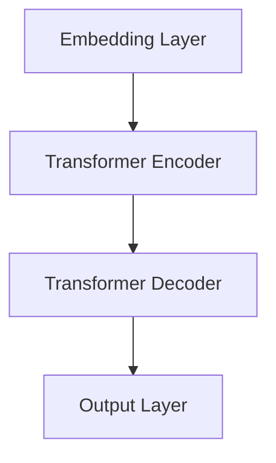

                 

### 文章标题：生成式AIGC：智能时代的商业新模式

> 关键词：生成式人工智能、AIGC、商业新模式、技术趋势、实践案例分析

> 摘要：本文将深入探讨生成式人工智能（AIGC）的概念、起源、核心技术以及其在商业领域的广泛应用。通过分析AIGC在内容创作、产品设计与创新、营销与广告等领域的具体应用案例，揭示其在商业模式变革中的重要作用。此外，本文还将探讨AIGC面临的技术挑战、商业机遇及其法律与伦理问题，为企业在智能时代中抓住AIGC带来的新机遇提供指导。

## 第一部分：AIGC概述

### 第1章：AIGC的概念与起源

#### 1.1 AIGC的定义与特点

生成式人工智能内容创作（AI Generated Content，简称AIGC）是指利用人工智能技术自动生成文本、图像、音频、视频等内容的系统或过程。与传统的文本编辑、图形设计等人工创作方式相比，AIGC具有以下特点：

1. **自动化**：AIGC通过机器学习算法，特别是生成对抗网络（GANs）和生成式预训练（GPT）等技术，实现了内容的自动化生成，大幅提升了创作效率。
2. **高效率**：通过大规模数据处理和模型训练，AIGC能够快速生成大量高质量的内容，满足商业应用的需求。
3. **个性化**：AIGC可以根据用户的需求和偏好，生成个性化的内容，提升用户体验。

#### 1.2 AIGC的发展历程

AIGC的发展历程可以追溯到生成对抗网络（GANs）的兴起。GANs由Ian Goodfellow于2014年提出，是一种通过对抗训练实现数据生成的技术。GANs由生成器和判别器两个神经网络组成，生成器试图生成逼真的数据，而判别器则试图区分生成的数据和真实数据。通过这种对抗训练，生成器不断提高生成数据的逼真度。

随着GANs技术的成熟，AIGC的应用领域不断扩展。从最初的图像生成，发展到文本生成、音频生成和视频生成等多种类型。特别是在生成式预训练（GPT）技术的推动下，AIGC在自然语言处理领域取得了重大突破。GPT由OpenAI开发，通过大规模语料进行预训练，然后进行特定任务的微调，实现了高质量的自然语言生成。

#### 1.3 AIGC的核心技术

AIGC的核心技术主要包括生成对抗网络（GANs）、条件生成对抗网络（cGANs）和生成式预训练（GPT）。以下将分别介绍这些技术的基本原理、应用场景以及模型结构。

##### 1.3.1 生成对抗网络（GANs）

生成对抗网络（GANs）由生成器和判别器两个神经网络组成。生成器（Generator）通过学习输入数据分布，生成逼真的数据；判别器（Discriminator）则通过判断输入数据的真实性来训练生成器。GANs的训练过程可以概括为以下步骤：

1. **生成器生成数据**：生成器根据输入的随机噪声生成数据。
2. **判别器判断数据真实性**：判别器将生成的数据和真实数据进行比较，判断其真实性。
3. **更新生成器和判别器**：根据判别器的判断结果，同时更新生成器和判别器的参数。

GANs的伪代码如下：

```python
# GANs伪代码
Generator(G):
    # 输入随机噪声，生成数据
    z = noise()
    x = G(z)

Discriminator(D):
    # 输入真实数据和生成数据，判断真实或虚假
    x, y = data()
    real = D(x)
    fake = D(G(z))
```

GANs在图像生成、文本生成、音频生成等领域有广泛应用。例如，在图像生成中，生成器可以生成逼真的图片；在文本生成中，生成器可以生成符合语法和语义的句子。

##### 1.3.2 条件生成对抗网络（cGANs）

条件生成对抗网络（cGANs）在GANs的基础上引入了条件输入。cGANs通过将条件信息（如标签、文本描述等）与噪声一起输入生成器和判别器，实现更加可控和多样化的内容生成。cGANs的训练过程与GANs类似，但在生成器和判别器的输入中加入了条件信息。

cGANs的应用场景更加广泛，包括图像生成、文本生成、音频生成等。例如，在图像生成中，cGANs可以根据标签生成特定类型的图像；在文本生成中，cGANs可以根据文本描述生成相关的故事。

cGANs的伪代码如下：

```python
# cGANs伪代码
Generator(G):
    # 输入随机噪声和条件信息，生成数据
    z = noise()
    c = condition()
    x = G(z, c)

Discriminator(D):
    # 输入真实数据、生成数据和条件信息，判断真实或虚假
    x, y, c = data(), condition()
    real = D(x, c)
    fake = D(G(z, c))
```

##### 1.3.3 生成式预训练（GPT）

生成式预训练（GPT）是一种通过大规模语料进行预训练，然后进行特定任务微调的技术。GPT的核心思想是利用大规模的无监督数据学习语言模型，使其具有强大的语言理解和生成能力。然后，通过在特定任务上微调，将预训练模型转化为特定任务的高效解决方案。

GPT的模型结构主要包括编码器（Encoder）和解码器（Decoder）两个部分。编码器将输入文本编码为固定长度的向量表示，解码器则根据编码器的输出生成文本。

GPT的伪代码如下：



GPT在自然语言处理领域取得了显著成果，包括文本生成、对话系统、机器翻译等。例如，在文本生成中，GPT可以生成高质量的文章、故事等。

### 第2章：AIGC在商业中的应用场景

#### 2.1 内容创作与个性化推荐

AIGC在内容创作与个性化推荐领域具有广泛的应用前景。通过AIGC技术，可以自动化生成高质量的内容，并根据用户的需求和偏好进行个性化推荐。

1. **文本生成**：AIGC可以生成新闻、文章、故事等文本内容。例如，新闻媒体可以利用AIGC技术自动化生成新闻稿件，提高内容生产效率。
2. **图像生成**：AIGC可以生成高质量的图像，如图像合成、虚拟试衣等。例如，电商平台可以利用AIGC技术为用户提供个性化的商品推荐，提升用户体验。
3. **视频生成**：AIGC可以生成视频内容，如视频合成、视频编辑等。例如，短视频平台可以利用AIGC技术自动化生成视频内容，吸引更多用户。

#### 2.2 产品设计与创新

AIGC在产品设计与创新领域具有重要作用。通过AIGC技术，可以自动化生成产品原型、设计优化方案等，加速产品创新过程。

1. **产品原型生成**：AIGC可以生成产品原型，为设计师提供灵感和参考。例如，工业设计公司可以利用AIGC技术生成各种产品原型，快速迭代设计。
2. **设计优化**：AIGC可以基于用户反馈和设计目标，自动优化产品设计。例如，汽车制造商可以利用AIGC技术优化汽车设计，提高安全性、舒适性和美观性。

#### 2.3 营销与广告

AIGC在营销与广告领域具有广泛的应用潜力。通过AIGC技术，可以自动化生成广告创意、营销策略等，提高营销效果。

1. **广告创意生成**：AIGC可以生成个性化的广告创意，如图像广告、视频广告等。例如，广告公司可以利用AIGC技术为不同客户生成定制化的广告创意。
2. **营销策略优化**：AIGC可以基于用户行为和需求，自动优化营销策略。例如，电商企业可以利用AIGC技术为用户提供个性化的营销活动，提高转化率。

### 第3章：AIGC的商业挑战与机遇

#### 3.1 技术挑战

AIGC在商业应用中面临一些技术挑战，主要包括数据隐私、计算资源等方面。

1. **数据隐私**：AIGC需要大量高质量的数据进行训练，但数据的隐私保护与合规是一个重要问题。如何在确保数据隐私的前提下，充分利用数据的价值，是一个亟待解决的问题。
2. **计算资源**：AIGC的训练和推理过程需要大量的计算资源。特别是在大规模数据处理和模型训练过程中，计算资源的不足可能导致项目进度延误。

#### 3.2 商业机遇

AIGC在商业领域带来了许多机遇，主要包括产业变革、商业模式创新等方面。

1. **产业变革**：AIGC技术将推动传统产业向智能化、自动化方向转型。例如，新闻媒体、电子商务、娱乐等行业都将因AIGC技术的应用而实现商业模式创新。
2. **商业模式创新**：AIGC技术为传统商业模式带来了新的可能性。例如，通过AIGC技术，企业可以实现个性化营销、定制化产品等服务，提高用户满意度。

### 第4章：AIGC的法律与伦理问题

#### 4.1 知识产权保护

AIGC在商业应用中涉及知识产权保护问题，主要包括版权问题等。

1. **版权问题**：AIGC生成的文本、图像、视频等内容的版权归属是一个复杂的问题。如何在尊重原创者的权益的同时，充分利用AIGC技术生成创新内容，是一个亟待解决的问题。
2. **解决方案**：可以探索版权登记、使用许可等解决方案，为AIGC生成的作品提供法律保护。

#### 4.2 伦理与道德问题

AIGC在商业应用中涉及伦理与道德问题，主要包括算法偏见与歧视、伦理责任等方面。

1. **偏见与歧视**：AIGC模型在训练过程中可能引入偏见，导致生成的数据存在歧视问题。如何消除算法偏见，确保AIGC技术公平、公正，是一个重要问题。
2. **伦理责任**：AIGC技术的开发者和应用者应承担伦理责任，确保其技术应用于正当、合法的领域，避免造成负面影响。

## 第二部分：AIGC实践

### 第5章：AIGC项目规划与实施

#### 5.1 项目规划

AIGC项目的规划是项目成功的关键步骤。以下是一个典型的AIGC项目规划流程：

1. **需求分析**：明确项目的目标和需求，包括生成内容的类型、质量要求、应用场景等。
2. **技术选型**：选择合适的AIGC技术，如GANs、cGANs、GPT等。
3. **资源准备**：确定所需的技术、人力和资金资源，确保项目顺利进行。
4. **风险评估**：评估项目可能面临的技术、市场、法律等风险，制定应对措施。

#### 5.2 技术实施

AIGC项目的技术实施包括环境搭建、模型训练和系统部署等环节。

1. **环境搭建**：搭建开发环境，包括硬件设备、软件工具、框架等。
2. **模型训练**：根据项目需求，选择合适的模型结构和训练策略，进行大规模数据训练。
3. **系统部署**：将训练好的模型部署到生产环境，实现内容的自动生成和应用。

### 第6章：AIGC项目案例分析

#### 6.1 案例一：个性化内容推荐系统

**项目背景**：某电商平台希望通过AIGC技术，实现个性化内容推荐，提高用户满意度。

**需求分析**：项目需求包括生成个性化的商品推荐列表、个性化新闻推荐等。

**技术实施**：
1. **数据收集**：收集用户行为数据、商品信息等。
2. **模型设计**：采用cGANs技术，生成个性化的商品推荐列表。
3. **系统部署**：将模型部署到电商平台，实现实时推荐。

**效果评估**：通过用户反馈和销售数据，评估个性化推荐系统的效果，持续优化模型和策略。

#### 6.2 案例二：智能广告创意生成

**项目背景**：某广告公司希望通过AIGC技术，实现智能广告创意生成，提高广告效果。

**需求分析**：项目需求包括生成创意广告文案、图像、视频等。

**技术实施**：
1. **数据收集**：收集广告素材、用户行为数据等。
2. **模型设计**：采用GPT技术，生成创意广告文案；采用cGANs技术，生成广告图像和视频。
3. **系统部署**：将模型部署到广告制作平台，实现广告创意的自动化生成。

**效果评估**：通过广告投放效果和用户反馈，评估智能广告创意生成系统的效果，持续优化模型和策略。

### 第7章：AIGC的未来发展

#### 7.1 技术趋势

AIGC技术的发展趋势包括以下方面：

1. **深度学习**：深度学习技术将继续在AIGC中发挥重要作用，模型规模和效率将不断提升。
2. **多模态生成**：AIGC将实现文本、图像、音频、视频等多种类型的内容生成，实现跨模态的信息融合。

#### 7.2 商业应用前景

AIGC在商业应用中具有广泛的前景，包括以下方面：

1. **行业变革**：AIGC技术将推动传统行业向智能化、自动化方向转型，带来产业变革。
2. **商业模式创新**：AIGC技术将推动商业模式创新，实现个性化、定制化服务等。

## 附录

### 附录A：AIGC相关资源与工具

#### A.1 主流AIGC框架与库

- **PyTorch**：用于构建和训练AIGC模型。
- **TensorFlow**：提供丰富的AIGC应用工具。
- **OpenAI**：提供预训练模型和API。

#### A.2 AIGC学习资源

- **在线课程**：深度学习、自然语言处理等相关课程。
- **技术博客**：AIGC领域的技术文章和最新动态。
- **开源项目**：AIGC相关开源模型和工具集。

### 附录B：数学公式与概念解释

#### B.1 概率论基础

- **贝叶斯定理**：
$$ P(A|B) = \frac{P(B|A)P(A)}{P(B)} $$
- **熵与信息论**：
$$ H(X) = -\sum_{i} P(X_i) \log_2 P(X_i) $$

#### B.2 生成对抗网络（GANs）

- **生成器损失**：
$$ L_G = -\log(D(G(z))) $$
- **判别器损失**：
$$ L_D = -[\log(D(x)) + \log(1 - D(G(z)))] $$

#### B.3 条件生成对抗网络（cGANs）

- **条件生成器损失**：
$$ L_G' = -\log(D(x, G(z, c))) $$
- **条件判别器损失**：
$$ L_D' = -[\log(D(x, x')) + \log(1 - D(G(z, c')))] $$

#### B.4 生成式预训练（GPT）

- **预训练损失**：
$$ L_{pretrain} = \sum_{i} L_i $$
- **微调损失**：
$$ L_{fine-tune} = \sum_{i} L_i + \lambda \sum_{j} L_j $$

其中，\( L_i \) 是预训练损失，\( L_j \) 是微调损失，\( \lambda \) 是平衡参数。

### 作者

作者：AI天才研究院/AI Genius Institute & 禅与计算机程序设计艺术 /Zen And The Art of Computer Programming

本文从AIGC的概念、起源、核心技术到商业应用场景，再到法律与伦理问题，深入探讨了AIGC在智能时代带来的商业新模式。通过实践案例分析和未来发展趋势展望，为企业在智能时代中抓住AIGC带来的新机遇提供了指导。在未来的发展中，AIGC将继续推动技术进步和商业变革，为各行各业带来更多创新和机遇。

