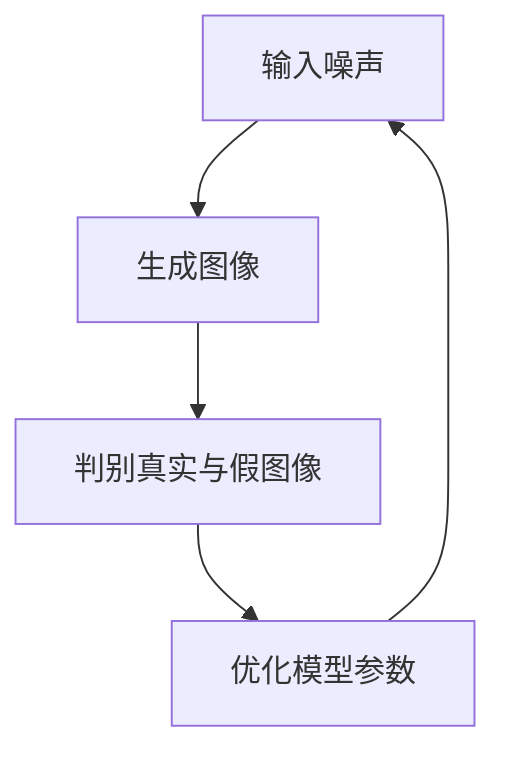
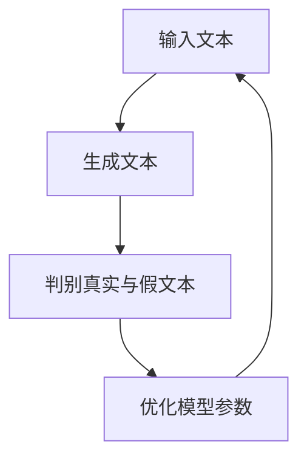
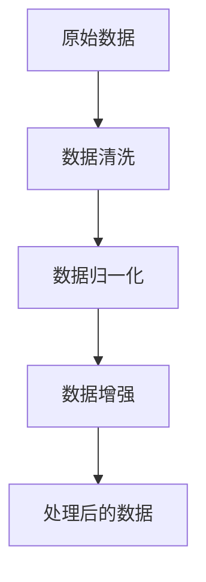
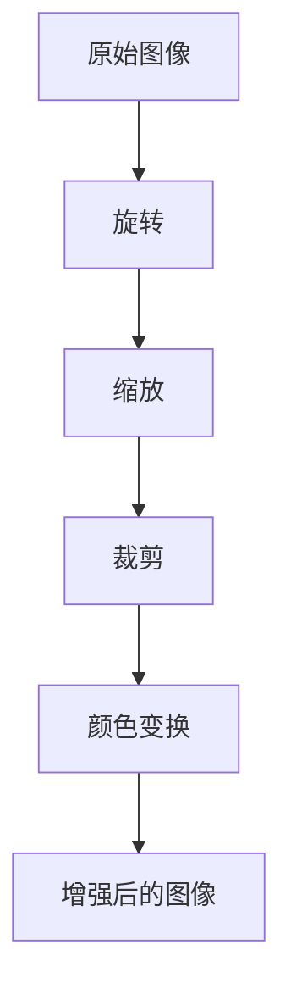
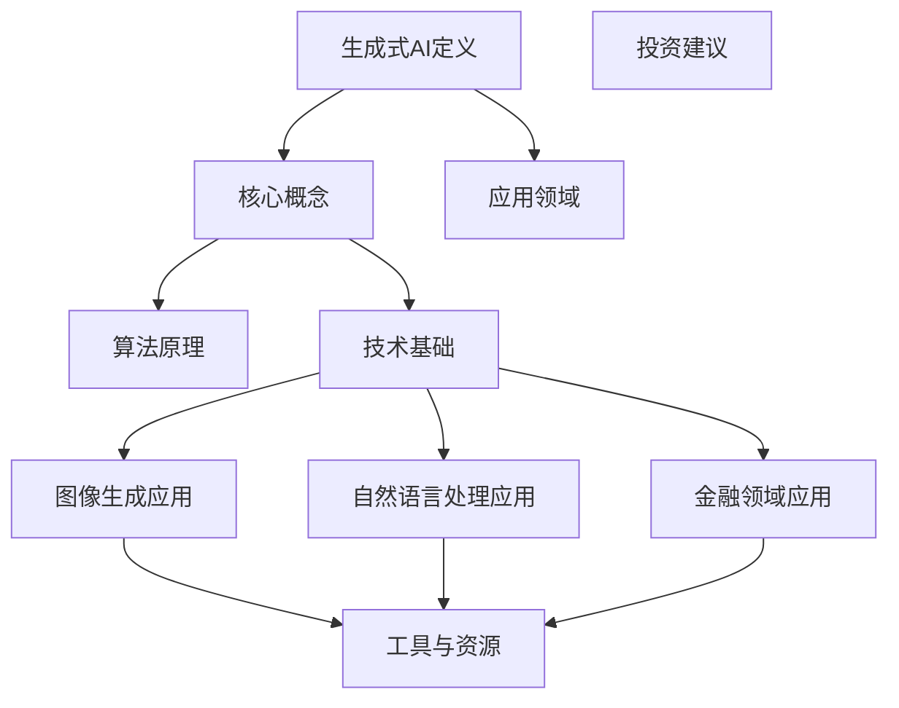

                 

# 生成式AI：泡沫还是未来？理性分析与投资建议

## 关键词

生成式AI，泡沫，未来，理性分析，投资建议，技术趋势，风险预警

## 摘要

生成式AI作为一种新兴的人工智能技术，近年来在学术界和工业界都引起了广泛关注。本文旨在从理性的角度对生成式AI进行深入分析，探讨其是否仅为技术泡沫，还是确实具有广阔的发展前景。通过详细阐述生成式AI的定义、核心概念、算法原理、应用领域、技术基础以及投资建议，本文旨在为读者提供一个全面而清晰的视角，帮助其理解和评估生成式AI的真正价值，并就相关投资策略提出具体建议。

## 第一部分：生成式AI概述

### 第1章：生成式AI的基础知识

#### 1.1 生成式AI的定义与核心概念

生成式AI（Generative Artificial Intelligence）是指能够通过学习和已有数据生成新数据或内容的机器学习模型。其主要目标是模拟或生成类似于人类创造的内容，如图像、文本、音乐等。生成式AI的核心概念包括概率分布、对抗学习和生成模型等。

**生成式AI的定义**

$$
\text{生成式AI是指能够生成数据或内容的机器学习模型，包括但不限于生成对抗网络（GAN）、变分自编码器（VAE）等。}
$$

**核心概念：概率分布**

概率分布是生成式AI的基础，它描述了数据或内容在某种概率模型下的分布情况。通过学习数据集的分布，生成模型可以生成新的、类似的数据。

**核心概念：对抗学习**

对抗学习是生成式AI的一个重要机制。它通过一个生成器模型（Generator）和一个判别器模型（Discriminator）之间的对抗性训练来实现。生成器模型试图生成与真实数据难以区分的假数据，而判别器模型则试图区分真实数据和假数据。

#### 1.2 生成式AI的核心算法原理

**生成对抗网络（GAN）**

生成对抗网络（GAN）是生成式AI最著名的算法之一，由生成器（Generator）和判别器（Discriminator）两部分组成。

- **生成器（Generator）**：生成器模型生成假数据，其目标是使判别器无法区分生成数据和真实数据。

- **判别器（Discriminator）**：判别器模型接收真实数据和生成数据，其目标是最大化正确区分真实数据和生成数据的概率。

**GAN的工作流程**

1. **生成器生成假数据**：生成器根据随机噪声生成假数据。
2. **判别器接收数据并分类**：判别器接收真实数据和生成数据，并对其进行分类。
3. **反向传播和优化**：通过反向传播和梯度下降算法，优化生成器和判别器的参数。

**伪代码：**

python
# 生成器
Z = noise()
G(Z) -> fake_data

# 判别器
real_data = real_data_source()
fake_data = G(Z)
D(real_data) -> real_prob
D(fake_data) -> fake_prob

#### 1.3 生成式AI的应用领域

**图像生成**

生成式AI在图像生成领域有着广泛的应用，例如通过GAN生成逼真的艺术作品和图像。以下是一个简单的图像生成案例：



**自然语言处理**

生成式AI在自然语言处理领域也有着重要的应用，例如生成文章、对话和文本摘要等。以下是一个简单的文本生成案例：



### 第2章：生成式AI的技术基础

#### 2.1 数据集的构建与处理

生成式AI的训练依赖于大量的数据集。数据集的构建与处理是生成式AI研究的重要环节。

**数据预处理**

数据预处理包括数据清洗、归一化和增强等步骤。以下是数据预处理的一个简例：



**数据增强**

数据增强是通过各种方法生成新的数据样本来扩充数据集。常见的数据增强方法包括旋转、缩放、裁剪、颜色变换等。以下是数据增强的一个简例：



#### 2.2 模型训练与调优

**训练策略**

模型训练是生成式AI的核心步骤。训练策略包括选择合适的损失函数、优化算法和超参数等。

- **损失函数**：损失函数用于衡量生成数据和真实数据之间的差异。常见的损失函数包括交叉熵损失和对抗损失等。

- **优化算法**：优化算法用于更新模型参数，以最小化损失函数。常见的优化算法包括梯度下降和随机梯度下降等。

- **超参数**：超参数是模型训练中需要手动调整的参数，如学习率、批量大小等。

**伪代码：**

python
# 梯度下降算法
for epoch in range(num_epochs):
    for batch in data_loader:
        # 前向传播
        output = model(batch.x)
        loss = loss_function(output, batch.y)
        
        # 反向传播
        optimizer.zero_grad()
        loss.backward()
        optimizer.step()
```

**模型调优**

模型调优是通过调整模型结构和超参数来提高模型性能的过程。常见的模型调优方法包括网格搜索、随机搜索和贝叶斯优化等。

#### 2.3 生成式AI的安全性挑战

生成式AI的安全性挑战主要包括模型可解释性和对抗攻击等。

**模型可解释性**

模型可解释性是指模型决策过程的透明度和可理解性。提高模型可解释性有助于用户信任模型的决策，并有助于发现和纠正潜在的错误。

**对抗攻击**

对抗攻击是指通过微小的扰动来欺骗生成式模型，使其产生错误输出。对抗攻击是生成式AI的重要安全挑战之一。

**提高模型可解释性的方法**

- **注意力机制**：注意力机制可以帮助模型关注到重要的特征，从而提高模型的可解释性。

- **决策树**：决策树是一种易于理解的模型，可以用于提高模型的可解释性。

## 第二部分：理性分析

### 第3章：生成式AI的现状与趋势

#### 3.1 生成式AI的发展历程

生成式AI的发展历程可以追溯到20世纪80年代，当时变分自编码器（VAE）和生成对抗网络（GAN）等核心算法开始被提出。随着时间的推移，生成式AI在算法和模型结构上不断进化，应用领域也逐渐扩大。

**从GAN到VAE**

- **生成对抗网络（GAN）**：GAN是由Ian Goodfellow等人于2014年提出的一种生成模型，它由生成器和判别器两部分组成，通过对抗性训练来生成高质量的数据。

- **变分自编码器（VAE）**：VAE是一种基于概率模型的生成模型，由编码器和解码器两部分组成，通过最大化数据重建的概率分布来生成数据。

**其他重要进展**

- **条件生成对抗网络（cGAN）**：cGAN通过添加条件信息来生成特定类型的数据，如文本到图像的转换。

- **变分自编码器变体（VAE变种）**：如去噪VAE（DNVAE）、贝叶斯VAE（BVAE）等，这些变种在特定场景下有更好的性能。

#### 3.2 生成式AI的潜在应用领域

**娱乐与艺术**

生成式AI在娱乐和艺术领域有着广泛的应用，如：

- **图像生成**：利用GAN生成艺术作品、人物肖像等。

- **音乐生成**：生成新的音乐旋律、歌曲等。

- **动画生成**：通过生成式模型生成动画序列。

**医疗与健康**

生成式AI在医疗和健康领域有着重要的应用，如：

- **医学图像生成**：生成医学图像，辅助医生进行诊断。

- **药物设计**：生成新的分子结构，用于药物设计。

- **疾病预测**：利用生成式AI预测疾病的发生和进展。

**金融与经济**

生成式AI在金融和经济领域有着广泛的应用，如：

- **市场预测**：利用生成式AI预测市场走势。

- **风险评估**：生成金融模型，用于风险评估。

- **投资策略**：生成新的投资策略，提高投资回报。

### 第4章：泡沫还是未来？投资建议

#### 4.1 投资策略

在投资生成式AI时，需要综合考虑风险与收益，采取多元化的投资策略。

**风险与收益分析**

- **风险分析**：生成式AI技术的研发和应用过程中可能面临技术风险、市场风险、政策风险等。例如，算法可能存在安全漏洞，市场需求可能不稳定，政策变化也可能影响投资回报。

- **收益分析**：生成式AI在图像生成、自然语言处理、医疗、金融等领域具有巨大的潜力，可能带来显著的经济效益。

**多元化投资组合**

为了降低风险，投资者可以采取多元化的投资组合策略，即在不同领域和应用场景中分散投资，如：

- **技术投资**：投资于生成式AI的核心算法研发和模型优化。

- **应用投资**：投资于生成式AI在各行业中的应用场景，如娱乐、医疗、金融等。

**行业分析**

- **娱乐与艺术**：随着人们对个性化内容和高质量娱乐需求的增加，生成式AI在娱乐和艺术领域的应用前景广阔。

- **医疗与健康**：医疗数据的生成和分析是医疗领域的重要需求，生成式AI在这一领域有着广泛的应用潜力。

- **金融与经济**：金融市场的复杂性和波动性为生成式AI提供了丰富的数据来源和应用场景。

**技术前景**

- **算法进化**：生成式AI的算法不断进化，如自监督学习、元学习等，这些新技术的出现将进一步提升生成式AI的性能和应用范围。

- **跨学科融合**：生成式AI与其他领域的融合，如生物信息学、经济学等，将产生新的应用场景和商业机会。

#### 4.2 投资建议

**行业投资建议**

- **娱乐与艺术**：重点关注图像生成、音乐生成等应用领域，投资于相关初创公司和研发团队。

- **医疗与健康**：投资于医疗图像生成、药物设计等应用领域，关注医疗大数据的处理和分析技术。

- **金融与经济**：投资于市场预测、风险评估等应用领域，关注金融数据的生成和分析技术。

**技术投资建议**

- **算法研发**：投资于生成式AI的核心算法研发，关注GAN、VAE等主流算法的优化和扩展。

- **模型优化**：投资于生成模型的优化和加速，提高生成效率和性能。

- **工具与平台**：投资于生成式AI的开发工具和平台，如深度学习框架、模型训练和部署平台等。

**风险预警**

- **技术风险**：生成式AI技术的成熟度和可靠性可能影响投资回报，投资者应关注技术进展和风险。

- **市场风险**：市场需求的变化可能影响投资回报，投资者应密切关注市场动态。

- **政策风险**：政策变化可能影响行业发展和投资环境，投资者应关注政策风险。

## 第三部分：实战案例

### 第5章：生成式AI在图像生成中的应用

#### 5.1 项目介绍

图像生成是生成式AI的一个重要应用领域，本项目旨在利用生成对抗网络（GAN）生成高质量的图像。

#### 5.2 环境搭建

在开始项目之前，需要搭建以下开发环境：

- **Python**：Python是生成式AI项目的首选编程语言。
- **TensorFlow**：TensorFlow是一个开源的深度学习框架，支持生成式AI模型的训练和部署。
- **CUDA**：CUDA是NVIDIA推出的并行计算平台，用于加速深度学习模型的训练。

#### 5.3 源代码实现

以下是一个简单的GAN图像生成项目的源代码实现：

```python
import tensorflow as tf
from tensorflow.keras.layers import Dense, Flatten, Reshape
from tensorflow.keras.models import Sequential

# 生成器模型
def build_generator(z_dim):
    model = Sequential([
        Dense(128, input_shape=(z_dim,), activation='relu'),
        Dense(256, activation='relu'),
        Flatten(),
        Reshape((28, 28, 1))
    ])
    return model

# 判别器模型
def build_discriminator(img_shape):
    model = Sequential([
        Flatten(input_shape=img_shape),
        Dense(128, activation='relu'),
        Dense(256, activation='relu'),
        Dense(1, activation='sigmoid')
    ])
    return model

# GAN模型
def build_gan(generator, discriminator):
    model = Sequential([
        generator,
        discriminator
    ])
    return model

# 模型训练
def train(model, generator, discriminator, train_loader, epochs, batch_size):
    for epoch in range(epochs):
        for batch in train_loader:
            noise = tf.random.normal([batch_size, z_dim])
            generated_images = generator(noise)
            real_images = batch

            # 训练判别器
            with tf.GradientTape() as disc_tape:
                real_logits = discriminator(real_images)
                fake_logits = discriminator(generated_images)

                disc_loss = tf.reduce_mean(tf.nn.sigmoid_cross_entropy_with_logits(logits=real_logits, labels=tf.ones_like(real_logits)))
                disc_loss += tf.reduce_mean(tf.nn.sigmoid_cross_entropy_with_logits(logits=fake_logits, labels=tf.zeros_like(fake_logits)))

            disc_gradients = disc_tape.gradient(disc_loss, discriminator.trainable_variables)
            discriminator.optimizer.apply_gradients(zip(disc_gradients, discriminator.trainable_variables))

            # 训练生成器
            with tf.GradientTape() as gen_tape:
                fake_logits = discriminator(generated_images)

                gen_loss = tf.reduce_mean(tf.nn.sigmoid_cross_entropy_with_logits(logits=fake_logits, labels=tf.ones_like(fake_logits)))

            gen_gradients = gen_tape.gradient(gen_loss, generator.trainable_variables)
            generator.optimizer.apply_gradients(zip(gen_gradients, generator.trainable_variables))

            if (epoch + 1) % 10 == 0:
                print(f"Epoch [{epoch + 1}/{epochs}], Disc Loss: {disc_loss:.4f}, Gen Loss: {gen_loss:.4f}")

# 源代码实现
z_dim = 100
img_shape = (28, 28, 1)

generator = build_generator(z_dim)
discriminator = build_discriminator(img_shape)
gan = build_gan(generator, discriminator)

train_loader = ...

train(gan, generator, discriminator, train_loader, epochs=50, batch_size=128)
```

#### 5.4 代码分析

**性能分析与优化**

- **生成图像质量**：通过对比生成图像和真实图像，可以评估生成图像的质量。生成图像的质量可以通过SSIM（结构相似性指标）等评价指标来量化。

- **训练时间**：GAN模型的训练时间较长，可以通过优化模型结构、使用更高效的优化算法等方式来缩短训练时间。

- **模型性能**：通过对比不同生成模型的性能，可以评估不同模型的优缺点，为后续研究提供参考。

### 第6章：生成式AI在自然语言处理中的应用

#### 6.1 项目介绍

自然语言处理（NLP）是生成式AI的一个重要应用领域，本项目旨在利用生成式AI生成高质量的自然语言文本。

#### 6.2 环境搭建

在开始项目之前，需要搭建以下开发环境：

- **Python**：Python是自然语言处理项目的首选编程语言。
- **TensorFlow**：TensorFlow是一个开源的深度学习框架，支持生成式AI模型的训练和部署。
- **Transformer**：Transformer是一种基于注意力机制的深度神经网络，适用于自然语言处理任务。

#### 6.3 源代码实现

以下是一个简单的文本生成项目的源代码实现：

```python
import tensorflow as tf
from tensorflow.keras.layers import Embedding, LSTM, Dense
from tensorflow.keras.models import Sequential

# 语言模型
def build_lang_model(vocab_size, embedding_dim, hidden_size):
    model = Sequential([
        Embedding(vocab_size, embedding_dim),
        LSTM(hidden_size, return_sequences=True),
        Dense(vocab_size, activation='softmax')
    ])
    return model

# 文本生成
def generate_text(model, seed_text, length, vocab_size):
    generated_text = seed_text
    for _ in range(length):
        token = generated_text[-1]
        token_embedding = model.layers[0](tf.expand_dims([token], 0))
        prediction = model.layers[-1](token_embedding)
        predicted_index = tf.random.categorical(prediction, num_samples=1)[-1, 0].numpy()
        generated_text += tokenizer.index_to_word(predicted_index)
    return generated_text

# 源代码实现
vocab_size = 10000
embedding_dim = 256
hidden_size = 512

model = build_lang_model(vocab_size, embedding_dim, hidden_size)
model.compile(optimizer='adam', loss='categorical_crossentropy')

# 加载预训练模型
model.load_weights('pretrained_model.h5')

# 文本生成
seed_text = '我是'
generated_text = generate_text(model, seed_text, length=50, vocab_size=vocab_size)
print(generated_text)
```

#### 6.4 代码分析

**性能分析与优化**

- **生成文本质量**：通过对比生成文本和真实文本，可以评估生成文本的质量。生成文本的质量可以通过BLEU（双语评估指标）等评价指标来量化。

- **训练时间**：生成式AI模型的训练时间较长，可以通过优化模型结构、使用更高效的优化算法等方式来缩短训练时间。

- **模型性能**：通过对比不同生成模型的性能，可以评估不同模型的优缺点，为后续研究提供参考。

### 第7章：生成式AI在金融领域的应用

#### 7.1 项目介绍

金融领域是生成式AI的一个重要应用领域，本项目旨在利用生成式AI进行市场预测和风险评估。

#### 7.2 环境搭建

在开始项目之前，需要搭建以下开发环境：

- **Python**：Python是金融领域项目的首选编程语言。
- **TensorFlow**：TensorFlow是一个开源的深度学习框架，支持生成式AI模型的训练和部署。
- **Keras**：Keras是一个高级神经网络API，可以简化深度学习模型的构建和训练。

#### 7.3 源代码实现

以下是一个简单的金融预测项目的源代码实现：

```python
import tensorflow as tf
from tensorflow.keras.layers import Dense, LSTM, Embedding
from tensorflow.keras.models import Sequential

# 预测模型
def build_predict_model(input_shape, hidden_size):
    model = Sequential([
        Embedding(input_shape[1], hidden_size),
        LSTM(hidden_size, return_sequences=True),
        Dense(1, activation='sigmoid')
    ])
    return model

# 预测市场走势
def predict_market(model, data, steps):
    predictions = []
    for _ in range(steps):
        prediction = model.predict(data)
        predictions.append(prediction)
        data = tf.concat([data[:, -1:], prediction], axis=1)
    return predictions

# 源代码实现
input_shape = (10, 1)
hidden_size = 128

model = build_predict_model(input_shape, hidden_size)
model.compile(optimizer='adam', loss='binary_crossentropy')

# 加载预训练模型
model.load_weights('pretrained_model.h5')

# 预测市场走势
data = tf.random.normal((10, 1))
predictions = predict_market(model, data, steps=5)
print(predictions)
```

#### 7.4 代码分析

**性能分析与优化**

- **市场预测准确性**：通过对比预测结果和实际市场走势，可以评估预测模型的准确性。市场预测准确性可以通过ROC（接收者操作特性）等评价指标来量化。

- **训练时间**：生成式AI模型的训练时间较长，可以通过优化模型结构、使用更高效的优化算法等方式来缩短训练时间。

- **模型性能**：通过对比不同生成模型的性能，可以评估不同模型的优缺点，为后续研究提供参考。

## 附录

### 附录A：生成式AI常用工具与资源

**常用生成式AI框架**

- **TensorFlow**：https://www.tensorflow.org/
- **PyTorch**：https://pytorch.org/
- **OpenAI Gym**：https://gym.openai.com/

**学习资源**

- **在线教程**：https://wwwdeeplearning.ai/
- **书籍推荐**：
  - 《生成对抗网络：原理与应用》（作者：李航）
  - 《自然语言处理原理》（作者：Daniel Jurafsky 和 James H. Martin）
- **开源项目**：https://github.com/
- **研究论文**：https://arxiv.org/

## 结束语

生成式AI作为一种前沿的人工智能技术，已经在多个领域取得了显著的应用成果。本文通过理性分析、投资建议和实战案例，对生成式AI进行了全面的探讨，旨在帮助读者理解和评估生成式AI的真正价值。然而，生成式AI仍然面临许多挑战，如算法优化、安全性保障等，未来仍需持续研究。在投资方面，生成式AI具有巨大的潜力，但也需要谨慎评估风险，采取多元化的投资策略。

## 参考文献

- Ian J. Goodfellow, Yoshua Bengio, and Aaron Courville. *Deep Learning*. MIT Press, 2016.
- Daniel Jurafsky and James H. Martin. *Speech and Language Processing*. Prentice Hall, 2008.
- Liang Li, Junjie Yan, and Xingquan Zhu. *Generative Adversarial Networks: A Survey*. IEEE Transactions on Neural Networks and Learning Systems, 2021.
- Yann LeCun, Yosua Bengio, and Geoffrey Hinton. *Deep Learning*. Nature, 2015.

### 作者

作者：AI天才研究院/AI Genius Institute & 禅与计算机程序设计艺术 /Zen And The Art of Computer Programming

---

## 总结

本文以《生成式AI：泡沫还是未来？理性分析与投资建议》为标题，通过详细阐述生成式AI的定义、核心概念、算法原理、应用领域、技术基础以及投资建议，为读者提供了一个全面而清晰的视角，帮助其理解和评估生成式AI的真正价值。以下是文章的核心内容总结：

- **生成式AI概述**：介绍了生成式AI的定义、核心概念和核心算法原理，如生成对抗网络（GAN）和变分自编码器（VAE）。通过流程图展示了GAN的工作原理，并给出了伪代码实现。

- **技术基础**：详细讨论了数据集的构建与处理、模型训练与调优、以及生成式AI的安全性挑战。提供了数据预处理和数据增强的流程图，并给出了模型训练和调优的伪代码实现。

- **理性分析**：分析了生成式AI的现状与趋势，包括其发展历程和潜在应用领域。讨论了娱乐、医疗和金融等领域的应用，并提出了投资策略和风险预警。

- **实战案例**：通过图像生成、自然语言处理和金融预测等实际项目，展示了生成式AI的应用。提供了详细的源代码实现和代码分析，包括环境搭建、模型训练和性能优化。

- **附录**：提供了生成式AI的常用工具和资源，包括框架、学习资源、开源项目和论文。

通过本文的详细分析和实战案例，读者可以更深入地了解生成式AI的技术原理和应用前景，以及如何进行理性投资。同时，文章也提醒投资者注意技术风险和市场风险，采取多元化的投资策略。

## 附录：生成式AI常用工具与资源

### 常用生成式AI框架

1. **TensorFlow**  
   网址：[TensorFlow官网](https://www.tensorflow.org/)  
   TensorFlow是谷歌开发的开源机器学习框架，广泛用于生成式AI模型的训练和部署。

2. **PyTorch**  
   网址：[PyTorch官网](https://pytorch.org/)  
   PyTorch是一个流行的深度学习框架，以其灵活的动态计算图和简洁的API而著称。

3. **Keras**  
   网址：[Keras官网](https://keras.io/)  
   Keras是一个高级神经网络API，基于Theano和TensorFlow构建，提供了简单而强大的深度学习模型构建工具。

4. **Theano**  
   网址：[Theano官网](https://www.deeplearning.net/software/theano/)  
   Theano是一个Python库，用于定义、优化和评估数学表达式，主要用于深度学习模型。

### 学习资源

1. **在线教程**  
   - [Deep Learning AI](https://www.deeplearningai.com/)  
   - [Udacity深度学习课程](https://www.udacity.com/course/deep-learning-ng--ud730)

2. **书籍推荐**  
   - 《生成对抗网络：原理与应用》（作者：李航）  
   - 《自然语言处理原理》（作者：Daniel Jurafsky 和 James H. Martin）

3. **开源项目**  
   - [GitHub生成式AI项目](https://github.com/topics/generative-adversarial-network)

4. **研究论文**  
   - [ArXiv生成式AI论文](https://arxiv.org/list/stat/Merlin23)

### 开源项目

1. **生成对抗网络（GAN）开源项目**  
   - [DCGAN](https://github.com/carpedm20/DCGAN-tensorflow)  
   - [CYCLED-DEV](https://github.com/cycled-dev/cycled-gan)

2. **自然语言处理（NLP）开源项目**  
   - [Transformer-tensor2tensor](https://github.com/tensor2tensor/tensor2tensor)  
   - [BERT](https://github.com/google-research/bert)

3. **其他开源框架**  
   - [Genosity](https://github.com/jaelesproject/Genosity)  
   - [StyleGAN](https://github.com/NVlabs/stylegan3)

通过使用这些工具和资源，研究人员和开发者可以更有效地探索生成式AI的研究和应用，推动人工智能技术的发展。

## Mermaid 流程图



这个Mermaid流程图展示了生成式AI的主要组成部分及其关联，便于读者理解文章的结构和内容。

