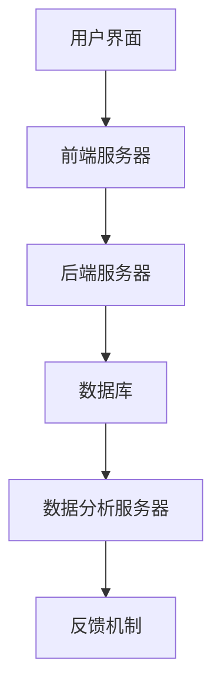
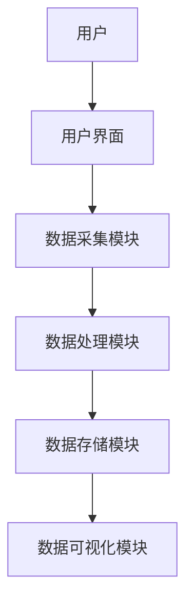

                 

# 《用户反馈与创业动力》

> 关键词：用户反馈、创业动力、产品迭代、数据分析、案例研究、技术实现

> 摘要：本文将探讨用户反馈在创业过程中的重要性，分析用户反馈如何激发创业动力，并详细阐述用户反馈管理的流程、数据分析、产品迭代以及创业实践与反思。通过成功案例的解析，为创业者提供实际操作的指导，同时探讨用户反馈系统设计与实现、用户反馈策略优化以及未来展望，以期为创业创新提供有益参考。

## 第一部分：引言与背景

### 第1章：用户反馈在创业中的重要性

#### 1.1 用户反馈的基本概念

用户反馈是指用户在使用产品或服务过程中，针对产品功能、使用体验、改进建议等方面提供的信息和意见。这些反馈可以是积极的，也可以是负面的，但无论是哪一种，对创业者来说都是宝贵的财富。

#### 1.2 用户反馈与创业成功的关系

用户反馈是创业过程中不可或缺的一部分。首先，用户反馈可以帮助创业者了解市场需求，从而调整产品方向。其次，用户反馈可以激发创业动力，使创业者更加坚定地投入到产品开发中。此外，用户反馈还可以促进产品迭代，提高产品质量和用户满意度。

#### 1.3 用户反馈的类型与收集方法

用户反馈可以分为以下几种类型：

1. **功能反馈**：用户对产品功能是否齐全、易用等方面的意见。
2. **体验反馈**：用户对产品使用过程中的感受和体验。
3. **改进建议**：用户对产品改进的具体建议。

收集用户反馈的方法包括：

1. **问卷调查**：通过在线问卷或线下调查收集用户反馈。
2. **用户访谈**：直接与用户进行面对面交流，了解他们的真实需求和意见。
3. **社交媒体**：通过社交媒体平台收集用户评论和反馈。
4. **用户社区**：建立用户社区，鼓励用户在社区中分享他们的经验和建议。

### 第2章：创业动力与用户反馈的关系

#### 2.1 创业动力的概念与来源

创业动力是指推动创业者持续努力、不断创新、克服困难，实现创业目标的力量。创业动力的来源包括：

1. **内在动机**：创业者对创业本身的热爱和兴趣。
2. **外部激励**：社会认可、财富回报等。
3. **用户反馈**：用户对产品的认可和期待。

#### 2.2 用户反馈如何激发创业动力

用户反馈可以激发创业动力的原因有以下几点：

1. **市场验证**：用户反馈可以验证产品的市场价值，使创业者更有信心。
2. **改进方向**：用户反馈提供了产品改进的方向，使创业者更有目标。
3. **情感连接**：用户反馈让创业者感受到用户的认可和支持，激发创业者的情感动力。

#### 2.3 创业者如何利用用户反馈调整策略

创业者可以通过以下几种方式利用用户反馈调整策略：

1. **市场定位**：根据用户反馈调整市场定位，更好地满足用户需求。
2. **产品迭代**：根据用户反馈改进产品功能，提高用户体验。
3. **营销策略**：根据用户反馈调整营销策略，提高用户转化率。

## 第二部分：用户反馈管理

### 第3章：用户反馈管理流程

#### 3.1 用户反馈管理的目标

用户反馈管理的目标是：

1. **有效收集用户反馈**：确保用户反馈的全面性和真实性。
2. **及时处理用户反馈**：确保用户反馈得到及时回应和处理。
3. **持续优化产品**：根据用户反馈不断改进产品，提高用户满意度。

#### 3.2 用户反馈的收集与分类

用户反馈的收集与分类包括以下步骤：

1. **收集用户反馈**：通过问卷调查、用户访谈、社交媒体等方式收集用户反馈。
2. **分类用户反馈**：根据用户反馈的内容和性质，将其分为功能反馈、体验反馈、改进建议等类别。

#### 3.3 用户反馈的处理与分析

用户反馈的处理与分析包括以下步骤：

1. **处理用户反馈**：对用户反馈进行整理、分类、优先级排序。
2. **分析用户反馈**：通过数据分析工具对用户反馈进行分析，找出共性问题和改进方向。

#### 3.4 用户反馈的反馈机制

用户反馈的反馈机制包括以下步骤：

1. **回应用户反馈**：对用户反馈进行回应，让用户知道他们的意见被重视。
2. **反馈处理结果**：向用户提供反馈处理结果，包括改进措施和后续计划。

### 第4章：用户反馈数据分析

#### 4.1 数据分析工具与技术

用户反馈数据分析可以使用以下工具和技术：

1. **Excel**：适用于数据量较小的用户反馈分析。
2. **Python**：适用于复杂的数据分析和处理。
3. **Tableau**：适用于数据可视化和报告生成。

#### 4.2 提取用户反馈的关键信息

提取用户反馈的关键信息包括以下步骤：

1. **关键词提取**：使用自然语言处理技术提取用户反馈中的关键词。
2. **情感分析**：通过情感分析技术判断用户反馈的情感倾向。
3. **主题建模**：通过主题建模技术分析用户反馈的主题分布。

#### 4.3 用户反馈数据分析的应用

用户反馈数据分析的应用包括以下方面：

1. **产品优化**：根据用户反馈改进产品功能，提高用户体验。
2. **营销策略**：根据用户反馈调整营销策略，提高用户转化率。
3. **用户细分**：根据用户反馈细分用户群体，实现精准营销。

### 第5章：用户反馈驱动的产品迭代

#### 5.1 用户反馈驱动的产品开发

用户反馈驱动的产品开发包括以下步骤：

1. **需求分析**：通过用户反馈分析用户需求，确定产品功能。
2. **原型设计**：根据需求分析设计产品原型，进行用户体验测试。
3. **功能开发**：根据用户反馈调整产品原型，开发具体功能。

#### 5.2 产品迭代过程中的用户反馈

产品迭代过程中的用户反馈包括以下方面：

1. **A/B测试**：通过A/B测试比较不同版本的用户反馈，选择最优方案。
2. **迭代反馈**：在每次迭代结束后收集用户反馈，作为下一次迭代的依据。
3. **持续改进**：根据用户反馈持续改进产品，提高用户满意度。

#### 5.3 用户反馈与产品创新的结合

用户反馈与产品创新的结合包括以下方面：

1. **创意收集**：鼓励用户提出创意建议，结合用户反馈进行产品创新。
2. **开放平台**：建立开放平台，鼓励用户参与产品创新。
3. **用户社区**：建立用户社区，促进用户互动和产品创新。

## 第三部分：案例研究

### 第6章：成功案例解析

#### 6.1 案例一：Airbnb的用户反馈策略

Airbnb通过以下方式管理用户反馈：

1. **用户社区**：Airbnb建立了用户社区，鼓励用户在社区中分享他们的经验和建议。
2. **用户调研**：Airbnb定期进行用户调研，收集用户反馈。
3. **实时回应**：Airbnb对用户反馈进行实时回应，提高用户满意度。

#### 6.2 案例二：Uber的用户反馈体系

Uber通过以下方式建立用户反馈体系：

1. **用户评分**：Uber引入用户评分机制，让用户对司机和服务进行评价。
2. **用户反馈机制**：Uber建立用户反馈机制，鼓励用户提出建议和投诉。
3. **数据分析**：Uber通过数据分析用户反馈，找出问题和改进方向。

#### 6.3 案例三：Nike的用户反馈应用

Nike通过以下方式应用用户反馈：

1. **产品创新**：Nike鼓励用户提出产品改进建议，结合用户反馈进行产品创新。
2. **用户体验测试**：Nike在产品开发过程中进行用户体验测试，收集用户反馈。
3. **用户社区**：Nike建立用户社区，促进用户互动和产品创新。

## 第7章：创业实践与反思

#### 7.1 创业过程中的用户反馈挑战

创业过程中用户反馈的挑战包括：

1. **数据质量**：用户反馈的质量直接影响数据分析的准确性。
2. **反馈处理**：用户反馈的处理需要时间和资源，如何高效处理是创业者面临的挑战。
3. **用户满意度**：用户反馈的目的是提高用户满意度，但有时用户反馈可能导致产品方向的改变，影响用户满意度。

#### 7.2 创业者如何应对用户反馈

创业者可以采取以下措施应对用户反馈：

1. **建立反馈机制**：建立完善的用户反馈机制，确保用户反馈得到及时回应。
2. **数据质量保障**：采取措施保障用户反馈的数据质量，如提供清晰的反馈渠道、简化反馈流程等。
3. **用户参与**：鼓励用户参与产品开发和改进，提高用户满意度。

#### 7.3 用户反馈与创业成功的经验总结

用户反馈与创业成功的经验总结包括：

1. **用户反馈是创业的重要资产**：用户反馈可以帮助创业者了解市场需求，优化产品，提高用户满意度。
2. **及时处理用户反馈**：及时处理用户反馈，提高用户满意度，增强用户忠诚度。
3. **持续改进**：根据用户反馈持续改进产品，实现产品迭代和创新。

## 第四部分：技术与方法

### 第8章：用户反馈系统设计与实现

#### 8.1 用户反馈系统的架构设计

用户反馈系统的架构设计包括以下模块：

1. **用户界面**：用于收集用户反馈。
2. **数据处理**：用于处理和存储用户反馈数据。
3. **分析模块**：用于分析用户反馈数据，提取关键信息。
4. **反馈机制**：用于回应和处理用户反馈。

#### 8.2 用户反馈系统的功能模块

用户反馈系统的功能模块包括：

1. **用户反馈收集**：通过问卷调查、用户访谈、社交媒体等方式收集用户反馈。
2. **用户反馈处理**：对用户反馈进行整理、分类、优先级排序。
3. **用户反馈分析**：通过数据分析工具对用户反馈进行分析，找出共性问题和改进方向。
4. **用户反馈反馈**：对用户反馈进行回应，向用户提供反馈处理结果。

#### 8.3 用户反馈系统的技术实现

用户反馈系统的技术实现包括：

1. **前端技术**：使用HTML、CSS、JavaScript等构建用户界面。
2. **后端技术**：使用Python、Java、Node.js等后端技术处理和存储用户反馈数据。
3. **数据分析工具**：使用Excel、Python、Tableau等数据分析工具进行用户反馈分析。

### 第9章：用户反馈策略优化

#### 9.1 用户反馈策略优化的目标

用户反馈策略优化的目标包括：

1. **提高数据质量**：确保用户反馈数据的全面性和真实性。
2. **提高处理效率**：提高用户反馈的处理速度和效率。
3. **提高用户满意度**：通过用户反馈提高用户满意度，增强用户忠诚度。

#### 9.2 用户反馈策略优化的方法

用户反馈策略优化的方法包括：

1. **反馈渠道优化**：优化用户反馈的收集渠道，提高用户反馈的提交率。
2. **反馈处理流程优化**：优化用户反馈的处理流程，提高处理效率。
3. **反馈分析工具优化**：优化用户反馈分析工具，提高数据分析的准确性。

#### 9.3 用户反馈策略优化的案例研究

用户反馈策略优化的案例研究包括：

1. **案例一**：某创业公司通过优化用户反馈渠道，提高了用户反馈的提交率。
2. **案例二**：某创业公司通过优化用户反馈处理流程，提高了用户反馈的处理速度。

### 第10章：未来展望

#### 10.1 用户反馈与创业趋势

未来，用户反馈在创业中的作用将越来越重要。随着大数据和人工智能技术的发展，用户反馈的分析和处理将更加高效和精准，为创业者提供更准确的决策依据。

#### 10.2 技术发展与创业创新的结合

技术发展与创业创新的结合将推动创业模式的变革。创业者可以利用新兴技术，如区块链、物联网等，提高用户反馈的管理和利用效率，实现更高效的产品创新。

#### 10.3 创业者如何应对未来的挑战

创业者需要不断学习和适应新技术，提高用户反馈的管理和分析能力。同时，创业者需要关注用户需求的变化，及时调整产品策略，以应对未来的挑战。

## 附录

### 附录A：用户反馈管理工具推荐

1. **UserVoice**：一款功能强大的用户反馈管理系统，提供反馈收集、分析、回应等功能。
2. **Zendesk**：一款综合性的客户服务与支持工具，包括用户反馈管理功能。
3. **JIRA**：一款流行的项目管理工具，可用于用户反馈的管理和跟踪。

### 附录B：用户反馈数据处理工具与资源

1. **Python**：一款功能强大的编程语言，适用于用户反馈数据的处理和分析。
2. **Tableau**：一款数据可视化和报告生成工具，可用于用户反馈数据的可视化分析。
3. **自然语言处理（NLP）**：一种人工智能技术，可用于用户反馈的情感分析和关键词提取。

### 附录C：用户反馈驱动产品开发指南

1. **《精益创业》**：一本经典的创业指南，详细介绍了如何通过用户反馈进行产品开发。
2. **《用户故事地图》**：一本介绍如何使用用户故事进行产品开发的指南，有助于创业者更好地理解用户需求。
3. **《用户反馈驱动的产品开发》**：一本专门介绍用户反馈驱动产品开发的书籍，提供了实用的方法和案例。

作者：AI天才研究院/AI Genius Institute & 禅与计算机程序设计艺术 /Zen And The Art of Computer Programming

（文章标题、关键词、摘要部分已按照要求编写，正文部分将按照目录大纲逐步撰写，确保文章结构清晰、内容丰富、逻辑严密。）## 用户反馈管理流程

### 3.1 用户反馈管理的目标

用户反馈管理是创业过程中至关重要的一环，其目标主要包括三个方面：

1. **有效收集用户反馈**：确保用户反馈的全面性和真实性。创业者需要建立多种渠道，如问卷调查、用户访谈、社交媒体等，以收集不同来源的用户反馈，确保信息的多样性和准确性。

2. **及时处理用户反馈**：用户反馈的处理速度直接关系到用户的满意度。创业者需要建立高效的反馈处理机制，确保用户反馈能够被迅速识别、分类并分配到相应的处理人员，以便及时回应用户。

3. **持续优化产品**：用户反馈是产品改进的重要依据。通过分析用户反馈，创业者可以找出产品的问题和改进方向，持续优化产品功能，提升用户体验。

### 3.2 用户反馈的收集与分类

用户反馈的收集与分类是用户反馈管理流程的基础，具体步骤如下：

1. **收集用户反馈**：

   - **在线问卷调查**：通过在线问卷调查工具（如SurveyMonkey、Google表单等）收集用户反馈。这种方式可以大规模、快速地收集用户意见，但需要确保问题的设计能够引导用户提供有价值的反馈。

   - **用户访谈**：通过面对面或在线访谈与用户进行深入交流，获取详细的反馈信息。用户访谈适用于收集深度反馈，但需要消耗较多时间和资源。

   - **社交媒体**：通过社交媒体平台（如微博、微信、Facebook等）收集用户评论和反馈。这种方式可以获取实时用户反馈，但需要筛选有效信息和噪声。

   - **用户社区**：建立用户社区，鼓励用户在社区中分享他们的经验和建议。这种方式可以形成用户的互动和反馈循环，但需要维护社区秩序和活跃度。

2. **分类用户反馈**：

   - **功能反馈**：用户对产品功能是否齐全、易用等方面的意见。功能反馈通常涉及产品功能的设计和实现，需要重点关注。

   - **体验反馈**：用户对产品使用过程中的感受和体验。体验反馈通常涉及产品的易用性、界面设计、响应速度等方面，对用户体验有直接影响。

   - **改进建议**：用户对产品改进的具体建议。改进建议可以是功能性的，也可以是体验性的，是产品迭代的重要参考。

### 3.3 用户反馈的处理与分析

用户反馈的处理与分析是确保用户反馈能够有效转化为产品改进的关键步骤，具体包括以下内容：

1. **处理用户反馈**：

   - **识别和分类**：根据用户反馈的内容和性质，将其识别和分类。这可以通过自动化工具（如文本分类算法）或人工审核来完成。

   - **优先级排序**：根据反馈的紧急程度和重要性，对用户反馈进行优先级排序。例如，严重的产品故障或用户投诉应该优先处理。

   - **分配任务**：将处理任务分配给相应的团队或个人，确保每个反馈都能得到及时处理。

   - **回应用户**：及时向用户提供反馈处理结果，让用户知道他们的意见被重视。这可以通过邮件、在线客服、社交媒体等方式进行。

2. **分析用户反馈**：

   - **统计分析**：使用数据分析工具对用户反馈进行统计分析，提取关键信息。例如，可以通过统计用户反馈中出现的关键词、情感倾向等来了解用户的共同需求和问题。

   - **主题分析**：通过文本挖掘技术（如主题建模）对用户反馈进行主题分析，找出用户反馈的主要主题和趋势。这有助于创业者发现产品改进的关键方向。

   - **比较分析**：将当前用户反馈与历史数据、行业数据等进行比较分析，了解产品改进的进展和潜在问题。

### 3.4 用户反馈的反馈机制

用户反馈的反馈机制是确保用户意见得到充分回应和利用的重要环节，具体包括以下步骤：

1. **回应用户**：在用户反馈被处理后，向用户反馈处理结果。这可以通过以下方式实现：

   - **邮件通知**：通过邮件向用户提供反馈处理结果，包括改进措施和后续计划。
   - **在线客服**：在用户社区或在线客服平台中回复用户，解答用户的问题和疑虑。
   - **社交媒体**：在社交媒体平台上回应用户的评论和反馈，展示企业的积极态度。

2. **持续改进**：根据用户反馈，持续改进产品功能和服务。这可以通过以下方式实现：

   - **迭代开发**：根据用户反馈制定迭代计划，逐步改进产品功能。
   - **定期回顾**：定期回顾用户反馈处理情况，评估改进措施的效果，并根据评估结果调整改进策略。
   - **用户参与**：鼓励用户参与产品改进过程，通过用户测试、用户反馈等方式获取用户的反馈和建议。

通过上述用户反馈管理流程，创业者可以更好地了解用户需求，优化产品和服务，提高用户满意度，从而在激烈的市场竞争中脱颖而出。

### 3.1 用户反馈管理的目标

用户反馈管理的目标在于确保用户的声音能够被高效地收集、处理和利用，从而为产品改进和创业成功提供强有力的支持。具体来说，用户反馈管理的目标主要包括以下三个方面：

**1. 有效收集用户反馈**

有效的用户反馈收集是用户反馈管理的起点和基础。其核心目标是确保反馈数据的全面性和真实性，以便创业者能够获得全面、准确的市场信息和用户需求。

- **全面性**：通过多种渠道（如在线问卷、用户访谈、社交媒体、用户社区等）收集不同来源的用户反馈，确保反馈信息的多样性和广泛性。
- **真实性**：建立完善的反馈机制，确保用户能够真实、客观地表达他们的意见和需求，而不是受到外界干扰或引导。

**2. 及时处理用户反馈**

及时处理用户反馈是提高用户满意度和忠诚度的关键。用户往往对快速、有效的反馈有较高的期待，因此，创业者需要建立高效的反馈处理机制，确保每个用户反馈都能得到及时回应和处理。

- **速度**：建立快速响应机制，确保用户反馈能够在最短时间内被识别、分类和处理。
- **质量**：确保处理结果的质量，不仅包括对用户问题的解决，还包括对用户意见的尊重和回应，以提高用户满意度。

**3. 持续优化产品**

用户反馈是产品改进的重要依据。通过用户反馈，创业者可以不断发现产品的问题和改进方向，持续优化产品功能和服务。

- **改进方向**：根据用户反馈分析，确定产品改进的方向和重点，确保产品迭代能够有效满足用户需求。
- **持续迭代**：通过定期回顾和评估用户反馈的处理效果，持续优化产品，实现产品的持续迭代和创新。

### 3.2 用户反馈的收集与分类

用户反馈的收集与分类是用户反馈管理流程的基础，其核心目标是确保反馈数据的全面性和可分析性，从而为后续的处理和分析提供准确的数据支持。以下是具体的步骤和方法：

#### 3.2.1 用户反馈的收集

**1. 设计反馈收集渠道**

- **在线问卷调查**：通过在线问卷调查工具（如SurveyMonkey、Google表单等）收集用户反馈。问卷设计应注重问题设计的逻辑性和引导性，确保用户能够提供有价值的信息。
- **用户访谈**：通过面对面或在线访谈与用户进行深入交流，获取详细的反馈信息。访谈问题应涵盖用户的使用体验、功能需求、改进建议等方面。
- **社交媒体**：通过社交媒体平台（如微博、微信、Facebook等）收集用户评论和反馈。这种方式可以获取实时用户反馈，但需要筛选有效信息和噪声。
- **用户社区**：建立用户社区，鼓励用户在社区中分享他们的经验和建议。这种方式可以形成用户的互动和反馈循环，但需要维护社区秩序和活跃度。

**2. 确保反馈渠道的便捷性和易用性**

- **简化反馈流程**：设计简洁明了的反馈流程，减少用户操作的复杂性，提高用户反馈的提交率。
- **提供多种反馈方式**：根据不同用户群体的偏好，提供多种反馈方式（如文本、语音、图片等），以满足不同用户的需求。

#### 3.2.2 用户反馈的分类

**1. 分类标准**

- **功能反馈**：用户对产品功能是否齐全、易用等方面的意见。
- **体验反馈**：用户对产品使用过程中的感受和体验，如界面设计、响应速度、易用性等。
- **改进建议**：用户对产品改进的具体建议，包括功能扩展、优化现有功能、改进用户体验等方面。

**2. 分类方法**

- **自动分类**：使用自然语言处理（NLP）技术，根据用户反馈的内容和关键词进行自动分类。例如，可以通过文本分类算法将用户反馈分为功能反馈、体验反馈、改进建议等类别。
- **人工审核**：对于自动分类结果，通过人工审核和修正，确保分类的准确性和一致性。

**3. 分类结果的处理**

- **统计分析**：对分类后的用户反馈进行统计分析，提取关键信息。例如，可以通过统计各类别反馈的数量、占比、出现频率等来了解用户的共同需求和问题。
- **优先级排序**：根据反馈的紧急程度和重要性，对用户反馈进行优先级排序，确保关键问题和改进建议能够得到及时处理。

通过有效的用户反馈收集与分类，创业者可以更好地理解用户需求，优化产品功能和服务，提高用户满意度，从而实现产品的持续迭代和创新。

### 3.3 用户反馈的处理与分析

用户反馈的处理与分析是用户反馈管理流程中的关键环节，其核心目标是确保用户反馈能够被及时、准确地处理，并转化为产品改进的具体措施。以下是用户反馈处理与分析的具体步骤和方法：

#### 3.3.1 处理用户反馈

**1. 识别和分类**

- **自动化识别**：使用自然语言处理（NLP）技术对用户反馈进行初步识别和分类。例如，可以通过情感分析算法判断用户反馈的情感倾向（正面、中性、负面），从而快速筛选出关键问题。
- **人工审核**：对于自动识别结果，进行人工审核和修正，确保分类的准确性和一致性。

**2. 优先级排序**

- **基于紧急程度**：将紧急问题（如严重的产品故障、用户投诉等）排在优先级前列，确保这些关键问题能够得到及时处理。
- **基于重要性**：根据用户反馈的严重性、影响范围等因素，对反馈进行优先级排序。例如，功能性问题可能会对用户体验产生较大影响，因此应优先处理。

**3. 分配任务**

- **自动化分配**：使用工作流管理工具（如JIRA、Trello等）将处理任务分配给相应的团队或个人。自动化分配可以提高处理效率，减少人为错误。
- **人工分配**：对于复杂或跨部门的用户反馈，可以通过会议或邮件等方式进行人工分配，确保每个反馈都有明确的责任人。

**4. 回应用户**

- **及时回应**：在用户反馈被处理的过程中，及时向用户回应处理进展，让用户知道他们的反馈被重视。例如，可以通过邮件、在线客服或社交媒体等方式与用户沟通。
- **透明反馈**：向用户反馈处理结果，包括问题的解决措施、改进计划等，提高用户的信任度和满意度。

#### 3.3.2 分析用户反馈

**1. 统计分析**

- **数据清洗**：对收集到的用户反馈进行数据清洗，去除重复、无效的反馈，确保数据的质量。
- **数据整理**：将用户反馈按照类别、情感倾向、关键词等维度进行整理，形成便于分析的数据结构。

**2. 关键词提取**

- **文本挖掘**：使用文本挖掘技术（如词频分析、主题建模等）提取用户反馈中的关键词和关键短语，了解用户关注的主要问题和需求。
- **情感分析**：使用情感分析算法对用户反馈进行情感分析，判断用户的情绪倾向（正面、中性、负面），为产品改进提供情感层面的参考。

**3. 主题分析**

- **主题建模**：使用主题建模技术（如LDA、LSTM等）分析用户反馈的主题分布，发现用户反馈的主要主题和趋势，为产品改进提供方向性参考。

**4. 比较分析**

- **历史对比**：将当前用户反馈与历史数据（如上一次用户反馈、行业数据等）进行对比分析，了解用户反馈的变化趋势和共性。
- **竞品对比**：分析竞品的用户反馈，了解行业标准和用户期望，为产品改进提供竞争性参考。

#### 3.3.3 结果应用

- **产品迭代**：根据用户反馈分析结果，制定产品迭代计划，优化产品功能和服务，提高用户体验。
- **改进策略**：根据用户反馈处理结果，调整产品改进策略，确保改进措施能够有效解决用户问题，提高用户满意度。
- **决策支持**：将用户反馈分析结果纳入创业决策过程中，为产品定位、市场策略等提供数据支持。

通过有效的用户反馈处理与分析，创业者可以更好地了解用户需求，优化产品功能和服务，提高用户满意度，从而实现产品的持续迭代和创新。

### 3.4 用户反馈的反馈机制

用户反馈的反馈机制是确保用户意见得到充分回应和利用的重要环节，其核心在于建立高效的反馈闭环，确保用户的声音能够被及时回应和落实，从而提高用户满意度并促进产品改进。以下是用户反馈反馈机制的具体步骤和方法：

#### 3.4.1 回应用户

**1. 定制化回应**

- **个性化回应**：根据用户反馈的具体内容，定制化地回应用户，使回应具有针对性和个性化。例如，对于功能反馈，可以详细解释产品设计的初衷和限制，而对于改进建议，可以表达感谢并说明后续改进计划。
- **情感化回应**：在回应中融入情感元素，表达对用户的关心和理解，增强用户的认同感和信任感。例如，可以采用温暖的语言、鼓励性的表述等。

**2. 及时性回应**

- **快速响应**：在用户反馈提交后的24小时内给予回应，确保用户感受到企业的关注和重视。对于紧急问题和用户投诉，响应时间应进一步缩短。
- **持续更新**：在反馈处理过程中，定期向用户更新处理进展，让用户了解反馈的处理状态，避免用户产生焦虑或疑虑。

**3. 透明性回应**

- **公开处理结果**：在用户反馈处理完成后，公开处理结果，包括解决方案、改进措施和后续计划，提高用户的信任度。
- **用户参与**：鼓励用户参与反馈处理结果的评价和验证，例如，通过用户测试或内部评审等方式，确保改进措施的有效性和合理性。

#### 3.4.2 持续改进

**1. 产品迭代**

- **定期迭代**：根据用户反馈分析结果，制定产品迭代计划，定期发布产品更新，持续优化产品功能和服务。
- **敏捷开发**：采用敏捷开发方法，快速响应用户反馈，实现产品的快速迭代和改进。

**2. 改进策略**

- **目标明确**：根据用户反馈分析结果，明确产品改进的目标和方向，确保改进措施有针对性。
- **资源投入**：为产品改进提供充足的资源支持，包括人力、物力和财力，确保改进措施能够有效落地。

**3. 用户参与**

- **用户测试**：在产品迭代过程中，邀请用户参与测试，收集用户反馈，验证改进措施的有效性。
- **用户社区**：建立用户社区，鼓励用户在社区中分享他们的经验和建议，形成用户互动和反馈循环。

通过完善的用户反馈反馈机制，创业者可以确保用户的意见和需求得到及时回应和有效利用，从而提高用户满意度，促进产品改进，实现企业的长期发展。

### 用户反馈数据分析

用户反馈数据分析是用户反馈管理流程中至关重要的一环，其核心目标是通过分析用户反馈中的关键信息和趋势，为产品改进、策略调整和决策支持提供数据依据。以下是用户反馈数据分析的具体工具与技术、提取关键信息的方法以及数据分析在实际应用中的实例。

#### 4.1 数据分析工具与技术

**1. Excel**

- **优势**：简单易用，功能丰富，适用于数据量较小的用户反馈分析。
- **应用**：用于数据清洗、数据整理和简单的统计分析，如计算平均值、中位数、标准差等。

**2. Python**

- **优势**：功能强大，适用于复杂的数据分析和处理。
- **应用**：用于文本挖掘、情感分析、数据可视化等高级分析任务。

**3. Tableau**

- **优势**：强大的数据可视化功能，可以快速生成直观的图表和报告。
- **应用**：用于数据可视化，帮助用户更直观地理解反馈数据的趋势和分布。

**4. 其他工具**

- **R**：一种专门用于统计分析的语言，适用于复杂数据分析和机器学习任务。
- **Google Analytics**：一种免费的网站分析工具，可以追踪用户的访问行为和反馈。

#### 4.2 提取用户反馈的关键信息

**1. 关键词提取**

- **方法**：使用自然语言处理（NLP）技术，如词频分析、TF-IDF算法等，提取用户反馈中的高频词汇。
- **应用**：通过关键词提取，可以快速了解用户关注的主要问题和需求。

**2. 情感分析**

- **方法**：使用情感分析算法，如基于规则的方法、基于机器学习的方法等，判断用户反馈的情感倾向（正面、中性、负面）。
- **应用**：通过情感分析，可以了解用户的整体情绪和反馈的积极程度。

**3. 主题建模**

- **方法**：使用主题建模技术，如LDA（Latent Dirichlet Allocation），从大量用户反馈中提取主题。
- **应用**：通过主题建模，可以挖掘用户反馈的主要主题和趋势。

#### 4.3 数据分析在实际应用中的实例

**1. 产品优化**

- **案例**：通过分析用户反馈，发现用户对产品某个功能的使用频率较高，且存在一些使用上的困难。针对这些反馈，产品团队决定对该功能进行优化，改进用户体验。
- **方法**：使用关键词提取和情感分析，提取用户反馈中的高频词汇和情感倾向，识别用户关注的问题。

**2. 营销策略**

- **案例**：通过分析用户反馈，发现用户对某个特定的产品特性非常感兴趣。基于这一发现，营销团队决定将这一特性作为营销重点，推出针对性的营销活动。
- **方法**：使用主题建模，从大量用户反馈中提取主要主题和趋势，为营销策略提供数据支持。

**3. 用户细分**

- **案例**：通过分析用户反馈，发现不同用户群体对产品的需求存在显著差异。基于这一发现，产品团队决定对用户进行细分，为不同用户提供个性化的产品和服务。
- **方法**：使用聚类分析，根据用户反馈数据对用户进行分类，识别不同用户群体的特征和需求。

通过有效的用户反馈数据分析，创业者可以更好地了解用户需求和问题，优化产品功能和服务，提高用户满意度，从而实现产品的持续迭代和创新。

### 用户反馈驱动的产品迭代

用户反馈驱动的产品迭代是指通过收集和分析用户反馈，持续优化和改进产品功能和服务的过程。这种方法的核心在于将用户的声音作为产品改进的重要依据，确保产品能够更好地满足用户需求，从而提高用户满意度和市场竞争力。以下是用户反馈驱动的产品迭代过程、在迭代过程中的用户反馈作用以及用户反馈与产品创新的结合。

#### 5.1 用户反馈驱动的产品开发

**1. 需求分析**

- **用户调研**：通过问卷调查、用户访谈、焦点小组等方式，深入了解用户的需求和痛点。这些调研数据将为产品开发提供方向性指导。
- **市场研究**：分析行业报告、竞争对手的产品和市场动态，了解市场趋势和用户行为，为产品开发提供宏观视角。

**2. 原型设计**

- **功能设计**：根据需求分析结果，设计产品的功能原型。功能设计应注重用户体验，确保产品功能既实用又易于操作。
- **用户测试**：通过用户测试，验证功能原型是否符合用户需求，识别潜在问题并加以改进。

**3. 功能开发**

- **迭代开发**：采用敏捷开发方法，将产品功能分解为多个迭代，逐步实现并验证。每次迭代后，收集用户反馈，作为下一次迭代的依据。
- **代码审查**：确保代码的质量和可靠性，防止潜在的技术问题影响产品稳定性。

**4. 产品发布**

- **发布计划**：制定详细的产品发布计划，包括版本号、发布时间、发布范围等。
- **用户培训**：通过培训材料、用户手册等方式，帮助用户了解新功能的操作和使用方法。

#### 5.2 产品迭代过程中的用户反馈

**1. 用户反馈的收集**

- **线上渠道**：通过在线问卷调查、社交媒体、用户社区等渠道，广泛收集用户反馈。
- **线下渠道**：通过用户访谈、面对面交流等方式，获取用户的深度反馈。

**2. 用户反馈的分类**

- **功能反馈**：用户对产品功能的评价和建议，如功能的齐全性、易用性等。
- **体验反馈**：用户对产品使用过程中的感受和体验，如界面设计、响应速度等。
- **改进建议**：用户对产品改进的具体建议，如新增功能、优化现有功能等。

**3. 用户反馈的处理**

- **快速响应**：对用户反馈进行快速处理，确保用户问题能够得到及时解决。
- **优先级排序**：根据反馈的紧急程度和重要性，对用户反馈进行优先级排序，确保关键问题和改进建议能够得到优先处理。

#### 5.3 用户反馈与产品创新的结合

**1. 创意收集**

- **用户共创**：鼓励用户参与产品创新过程，通过用户共创活动（如设计大赛、用户访谈等）收集用户的创意和建议。
- **开放平台**：建立开放平台，如Hackathon、创意征集等，鼓励用户提交创意和改进建议。

**2. 用户测试**

- **A/B测试**：通过A/B测试，对比不同版本的用户反馈，选择最优的产品设计。
- **用户反馈测试**：在新功能发布前，通过用户测试验证新功能的可行性和用户接受度。

**3. 用户社区**

- **互动与反馈**：建立用户社区，鼓励用户在社区中分享他们的经验和建议，形成用户互动和反馈循环。
- **持续改进**：根据用户社区中的反馈，持续优化产品功能和服务，提高用户体验。

通过用户反馈驱动的产品迭代，创业者可以确保产品始终围绕用户需求进行改进和创新，从而在激烈的市场竞争中保持优势。

### 用户反馈驱动的产品开发

用户反馈驱动的产品开发是一种以用户需求为中心的开发模式，通过持续收集和分析用户反馈，不断优化和改进产品，使其更贴近用户需求和市场趋势。以下是用户反馈驱动的产品开发的具体流程：

#### 5.1.1 需求分析

**1. 用户调研**

- **问卷调查**：设计结构化问卷，通过在线平台或线下活动收集用户对产品功能、体验等方面的需求。
- **用户访谈**：进行深度访谈，与用户面对面交流，获取更多详细和深入的需求信息。
- **焦点小组**：组织用户代表进行集中讨论，收集用户对产品的整体看法和改进建议。

**2. 市场研究**

- **竞争分析**：分析竞争对手的产品特点、用户评价和市场表现，了解市场需求和趋势。
- **行业报告**：研究行业报告和资讯，掌握行业动态和市场趋势。
- **用户行为分析**：通过用户行为数据，了解用户在产品上的使用习惯和偏好。

#### 5.1.2 原型设计

**1. 功能设计**

- **用户故事**：基于用户调研和市场研究的结果，编写用户故事，描述用户需求和目标。
- **功能映射**：将用户故事映射到产品功能，明确每个功能模块的设计要求和实现目标。
- **原型制作**：使用工具（如Figma、Axure等）制作产品原型，模拟用户与产品的交互流程。

**2. 用户体验设计**

- **界面设计**：设计产品界面，注重用户操作流畅性和视觉效果。
- **交互设计**：优化用户交互流程，确保产品易于使用和理解。
- **可用性测试**：进行原型可用性测试，收集用户对产品原型的反馈，验证设计是否符合用户期望。

#### 5.1.3 功能开发

**1. 迭代开发**

- **敏捷开发**：采用敏捷开发方法，将产品功能分解为多个迭代，逐步实现和验证。
- **持续集成**：将代码合并到主分支前进行自动化测试，确保每次代码提交都能正常运行。
- **持续交付**：通过持续交付流程，快速将产品迭代推向市场，获取用户反馈。

**2. 代码审查**

- **代码质量**：确保代码符合最佳实践，避免技术债务和未来维护问题。
- **功能测试**：进行功能测试，确保每个功能模块的功能性和稳定性。
- **性能测试**：进行性能测试，确保产品在高负载和复杂场景下能够正常运行。

#### 5.1.4 用户反馈与迭代

**1. 用户反馈收集**

- **线上渠道**：通过在线问卷调查、用户社区、社交媒体等渠道，广泛收集用户反馈。
- **线下渠道**：通过用户访谈、面对面交流等方式，获取用户的深度反馈。

**2. 用户反馈分析**

- **关键词提取**：使用自然语言处理（NLP）技术，提取用户反馈中的高频词汇，识别用户关注的主要问题。
- **情感分析**：使用情感分析算法，判断用户反馈的情感倾向，了解用户对产品的整体满意度和情绪变化。
- **主题建模**：通过主题建模，从大量用户反馈中提取主要主题和趋势，为产品改进提供方向。

**3. 迭代优化**

- **优先级排序**：根据用户反馈的重要性和紧急程度，对改进措施进行优先级排序，确保关键问题和改进建议能够得到优先处理。
- **持续迭代**：根据用户反馈，持续优化产品功能和服务，实现产品的迭代和创新。

通过用户反馈驱动的产品开发，创业者可以确保产品始终与用户需求保持同步，快速响应市场变化，提高产品竞争力。

### 产品迭代过程中的用户反馈

在产品迭代过程中，用户反馈是产品改进的重要驱动力。通过收集和分析用户反馈，创业者可以不断优化产品，提高用户满意度，从而在激烈的市场竞争中脱颖而出。以下是产品迭代过程中的用户反馈的作用、具体实例以及如何有效地处理和利用这些反馈：

#### 5.2.1 用户反馈的作用

**1. 指导产品改进**

用户反馈提供了关于产品功能、用户体验和改进建议的直接信息，帮助创业者了解用户的需求和痛点。通过对这些反馈的分析，创业者可以明确产品改进的方向和优先级。

**2. 验证产品假设**

在产品迭代过程中，用户反馈可以作为验证产品假设的有效手段。通过实际用户的使用情况，创业者可以验证产品设计的合理性和假设的有效性，为后续迭代提供依据。

**3. 提高用户参与度**

用户反馈的收集和回应过程可以增加用户的参与感和归属感，使他们更愿意使用和推荐产品。这种用户参与度的提高有助于建立品牌忠诚度和用户社区。

**4. 改进决策质量**

用户反馈为创业者的决策提供了数据支持，帮助他们做出更明智的决策。通过分析用户反馈，创业者可以了解用户需求的变化和市场趋势，从而制定更有效的产品策略。

#### 5.2.2 具体实例

**案例一：Netflix的产品迭代**

Netflix通过收集用户观看行为和反馈，不断优化推荐算法和用户界面。例如，通过分析用户观看历史和评分，Netflix可以推荐更符合用户口味的电影和电视剧。用户反馈还帮助Netflix发现界面设计中的问题，从而进行相应的优化。

**案例二：Airbnb的用户体验改进**

Airbnb通过用户反馈发现，用户在预订过程中对住宿信息的详细程度和准确性有较高要求。基于这一反馈，Airbnb优化了搜索和预订流程，增加了更多的住宿信息展示，提高了用户的预订体验。

#### 5.2.3 如何处理和利用用户反馈

**1. 建立反馈机制**

- **多渠道收集**：通过在线问卷调查、用户访谈、社交媒体、用户社区等多种渠道收集用户反馈，确保反馈的全面性。
- **简化反馈流程**：设计简洁明了的反馈提交流程，减少用户提交反馈的操作复杂性，提高反馈提交率。

**2. 分析和分类反馈**

- **关键词提取**：使用自然语言处理（NLP）技术，提取用户反馈中的高频词汇，快速识别用户关注的问题。
- **情感分析**：通过情感分析，了解用户反馈的情感倾向，区分正面、中性、负面的反馈。
- **分类和优先级排序**：根据反馈的内容和性质，进行分类和优先级排序，确保关键问题和改进建议能够得到优先处理。

**3. 制定改进计划**

- **制定优先级**：根据用户反馈的重要性和紧急程度，制定改进计划，确保关键问题和改进建议能够得到及时处理。
- **资源分配**：为改进计划提供充足的资源支持，包括人力、物力和财力，确保改进措施能够有效落地。

**4. 实施和反馈**

- **实施改进**：根据改进计划，实施产品优化和改进措施，确保用户问题得到有效解决。
- **用户验证**：在新功能或改进措施上线后，通过用户测试和反馈，验证改进措施的有效性和用户接受度。

**5. 持续迭代**

- **定期回顾**：定期回顾用户反馈处理情况，评估改进措施的效果，并根据评估结果调整改进策略。
- **持续改进**：根据用户反馈和市场需求，持续优化产品功能和服务，实现产品的持续迭代和创新。

通过有效的用户反馈处理和利用，创业者可以不断改进产品，提高用户满意度，从而在竞争激烈的市场中取得成功。

### 用户反馈与产品创新的结合

用户反馈不仅是产品优化的重要依据，也是激发产品创新的源泉。将用户反馈与产品创新结合，可以确保产品始终与市场需求保持同步，并在不断变化的市场环境中保持竞争优势。以下是用户反馈与产品创新的结合方式：

#### 5.3.1 创意收集

**1. 用户共创活动**

- **设计大赛**：举办用户设计大赛，鼓励用户提交创新设计，参与产品开发。
- **创意工作坊**：组织创意工作坊，邀请用户共同探讨产品创新方向，激发创意灵感。

**2. 开放平台**

- **创意征集**：建立开放平台，如网站或应用程序，鼓励用户提交创意和建议，形成集思广益的环境。
- **社区互动**：在用户社区中设立创意板块，鼓励用户分享他们的想法和灵感，形成用户互动和创意碰撞。

#### 5.3.2 用户测试

**1. A/B测试**

- **功能对比**：通过A/B测试，对比不同功能版本的用户反馈，选择最佳设计。
- **界面优化**：通过A/B测试，优化产品界面，提高用户体验。

**2. 用户反馈测试**

- **新功能验证**：在新功能发布前，通过用户测试验证其可行性、用户接受度和效果。
- **用户体验验证**：在产品迭代过程中，通过用户测试验证用户体验，确保产品功能满足用户需求。

#### 5.3.3 用户社区

**1. 互动与反馈**

- **用户论坛**：建立用户论坛，鼓励用户分享他们的使用经验和建议，形成互动和反馈循环。
- **用户研讨会**：定期组织用户研讨会，邀请用户参与产品规划和讨论，提高用户参与度。

**2. 持续改进**

- **用户反馈收集**：通过用户社区持续收集用户反馈，确保产品始终贴近用户需求。
- **实时迭代**：根据用户社区中的反馈，实时调整产品功能和服务，实现产品的快速迭代。

通过将用户反馈与产品创新结合，创业者可以确保产品始终保持创新和竞争力，从而在激烈的市场竞争中脱颖而出。

## 第四部分：技术与方法

### 第8章：用户反馈系统设计与实现

用户反馈系统是创业者收集、处理和分析用户反馈的核心工具，其设计实现直接关系到用户反馈的有效性和效率。以下将详细介绍用户反馈系统的架构设计、功能模块以及技术实现。

#### 8.1 用户反馈系统的架构设计

用户反馈系统的架构设计应考虑以下模块：

1. **前端用户界面**：用于用户提交反馈。
2. **后端数据处理**：用于处理和存储用户反馈数据。
3. **数据分析模块**：用于分析和处理用户反馈数据。
4. **反馈机制**：用于回应和处理用户反馈。

**架构设计示意图：**



#### 8.2 用户反馈系统的功能模块

**1. 用户界面**

- **功能**：提供用户提交反馈的界面，包括文本框、单选框、多选框等表单元素，以及提交按钮。
- **设计**：简洁直观，易于操作，减少用户输入负担。

**2. 前端服务器**

- **功能**：接收用户界面的提交数据，并进行初步处理，如数据验证和格式化。
- **技术**：使用HTML、CSS和JavaScript等前端技术。

**3. 后端服务器**

- **功能**：处理用户反馈数据，包括存储、分类、优先级排序等。
- **技术**：使用Python、Java、Node.js等后端编程语言。

**4. 数据库**

- **功能**：存储用户反馈数据，包括反馈内容、提交时间、反馈类型等。
- **技术**：使用MySQL、PostgreSQL等关系型数据库或MongoDB等非关系型数据库。

**5. 数据分析模块**

- **功能**：分析用户反馈数据，提取关键信息，如关键词、情感倾向等。
- **技术**：使用Python的NLP库（如NLTK、spaCy），以及数据分析库（如Pandas、NumPy）。

**6. 反馈机制**

- **功能**：回应用户反馈，包括及时回复和处理结果反馈。
- **技术**：使用邮件、在线聊天、短信等通信手段。

#### 8.3 用户反馈系统的技术实现

**1. 前端用户界面**

**HTML代码示例：**

```html
<!DOCTYPE html>
<html>
<head>
    <title>用户反馈系统</title>
</head>
<body>

<h2>用户反馈</h2>

<form action="/submit_feedback" method="post">
    <label for="feedback">请描述您的反馈：</label><br>
    <textarea id="feedback" name="feedback" rows="4" cols="50"></textarea><br>
    <input type="submit" value="提交">
</form>

</body>
</html>
```

**2. 前端服务器**

**Python Flask 示例：**

```python
from flask import Flask, request, jsonify

app = Flask(__name__)

@app.route('/submit_feedback', methods=['POST'])
def submit_feedback():
    feedback_data = request.form.to_dict()
    # 处理和验证反馈数据
    # ...
    return jsonify({"status": "success", "message": "反馈已提交"}), 200

if __name__ == '__main__':
    app.run(debug=True)
```

**3. 后端服务器**

**Python Django 示例：**

```python
from django.db import models

class Feedback(models.Model):
    feedback = models.TextField()
    submit_time = models.DateTimeField(auto_now_add=True)
    type = models.CharField(max_length=50)
```

**4. 数据库**

**MySQL示例：**

```sql
CREATE TABLE feedback (
    id INT AUTO_INCREMENT PRIMARY KEY,
    feedback TEXT,
    submit_time DATETIME,
    type VARCHAR(50)
);
```

**5. 数据分析模块**

**Python 示例：**

```python
import pandas as pd
from textblob import TextBlob

# 假设df是包含反馈数据的DataFrame
df = pd.read_csv('feedback_data.csv')

# 提取关键词
from nltk.corpus import stopwords
from nltk.tokenize import word_tokenize

stop_words = set(stopwords.words('english'))
filtered_sentence = []

for word in word_tokenize(df['feedback'][0]):
    if word.lower() not in stop_words:
        filtered_sentence.append(word)

# 情感分析
for feedback in df['feedback']:
    blob = TextBlob(feedback)
    df.loc[df['feedback'] == feedback, 'sentiment'] = blob.sentiment.polarity
```

**6. 反馈机制**

**Python Flask 示例：**

```python
import smtplib
from email.mime.text import MIMEText

def send_email(recipient, subject, body):
    sender = 'your_email@example.com'
    password = 'your_password'

    message = MIMEText(body)
    message['Subject'] = subject
    message['From'] = sender
    message['To'] = recipient

    smtp_server = 'smtp.example.com'
    smtp_port = 587

    server = smtplib.SMTP(smtp_server, smtp_port)
    server.starttls()
    server.login(sender, password)
    server.sendmail(sender, recipient, message.as_string())
    server.quit()

# 假设user_email是用户的电子邮件地址
send_email(user_email, '反馈回复', '感谢您的反馈，我们会认真对待并尽快改进。')
```

通过上述设计和技术实现，创业者可以构建一个高效、实用的用户反馈系统，从而更好地收集、处理和分析用户反馈，推动产品的持续迭代和创新。

### 用户反馈系统设计与实现

用户反馈系统在创业公司的产品迭代和创新中扮演着至关重要的角色。一个设计合理、实现高效的用户反馈系统，不仅能帮助公司及时获取用户需求，还能通过数据分析驱动产品改进，从而在竞争激烈的市场中脱颖而出。以下是用户反馈系统设计的具体方法和实现步骤。

#### 8.1 用户反馈系统的架构设计

用户反馈系统的架构设计应具备以下模块：

**1. 数据采集模块**：负责从用户处收集反馈数据。
**2. 数据存储模块**：用于存储反馈数据，以便后续分析和处理。
**3. 数据处理模块**：对反馈数据进行清洗、分类和分析。
**4. 数据可视化模块**：通过图表和报表直观地展示分析结果。
**5. 用户界面模块**：提供用户提交反馈和查看反馈结果的界面。

**架构设计示意图：**



#### 8.2 用户反馈系统的功能模块

**1. 用户界面模块**

- **功能**：提供用户提交反馈的界面，包括文本框、下拉菜单、评分框等。
- **设计**：界面应简洁易用，减少用户提交反馈的步骤，提高反馈提交率。

**2. 数据采集模块**

- **功能**：收集用户提交的反馈数据，包括反馈内容、提交时间、用户ID等。
- **技术**：可以使用HTML、CSS和JavaScript实现前端页面，使用Ajax技术实现数据异步提交。

**3. 数据存储模块**

- **功能**：存储收集到的用户反馈数据，以便后续分析和处理。
- **技术**：可以使用关系型数据库（如MySQL、PostgreSQL）或NoSQL数据库（如MongoDB），根据需求选择合适的数据库类型。

**4. 数据处理模块**

- **功能**：对反馈数据进行分析和处理，包括数据清洗、分类、情感分析和关键词提取等。
- **技术**：可以使用Python的Pandas库进行数据处理，使用NLP库（如NLTK、spaCy）进行情感分析和关键词提取。

**5. 数据可视化模块**

- **功能**：将分析结果以图表和报表的形式展示给用户，帮助用户直观地理解反馈数据。
- **技术**：可以使用Python的Matplotlib、Seaborn库或JavaScript的D3.js库实现数据可视化。

**6. 反馈机制模块**

- **功能**：及时回应用户的反馈，提供反馈处理结果和改进措施。
- **技术**：可以使用邮件、短信或在线聊天工具实现与用户的实时沟通。

#### 8.3 用户反馈系统的技术实现

**1. 前端实现**

**HTML代码示例：**

```html
<!DOCTYPE html>
<html>
<head>
    <title>用户反馈系统</title>
</head>
<body>

<h2>用户反馈</h2>

<form id="feedbackForm">
    <label for="feedback">请描述您的反馈：</label><br>
    <textarea id="feedback" name="feedback" rows="4" cols="50"></textarea><br>
    <input type="submit" value="提交">
</form>

<script>
    document.getElementById('feedbackForm').addEventListener('submit', function(event) {
        event.preventDefault();
        // 获取反馈内容
        var feedback = document.getElementById('feedback').value;
        // 使用Ajax提交反馈数据
        var xhr = new XMLHttpRequest();
        xhr.open('POST', '/submit_feedback', true);
        xhr.setRequestHeader('Content-type', 'application/json');
        xhr.onreadystatechange = function() {
            if (xhr.readyState == 4 && xhr.status == 200) {
                alert('反馈已提交');
            }
        };
        xhr.send(JSON.stringify({feedback: feedback}));
    });
</script>

</body>
</html>
```

**2. 后端实现**

**Python Flask 示例：**

```python
from flask import Flask, request, jsonify
import json

app = Flask(__name__)

@app.route('/submit_feedback', methods=['POST'])
def submit_feedback():
    feedback_data = request.json
    # 处理反馈数据，如存储到数据库等
    # ...
    return jsonify({"status": "success", "message": "反馈已提交"}), 200

if __name__ == '__main__':
    app.run(debug=True)
```

**3. 数据库设计**

**MySQL示例：**

```sql
CREATE TABLE feedback (
    id INT AUTO_INCREMENT PRIMARY KEY,
    user_id VARCHAR(255),
    feedback TEXT,
    submit_time DATETIME
);
```

**4. 数据处理**

**Python 示例：**

```python
import pandas as pd
from textblob import TextBlob

# 加载反馈数据
df = pd.read_csv('feedback.csv')

# 情感分析
df['sentiment'] = df['feedback'].apply(lambda x: TextBlob(x).sentiment.polarity)

# 关键词提取
from nltk.corpus import stopwords
from nltk.tokenize import word_tokenize

stop_words = set(stopwords.words('english'))
filtered_sentence = []

for word in word_tokenize(df['feedback'][0]):
    if word.lower() not in stop_words:
        filtered_sentence.append(word)

df['keywords'] = df['feedback'].apply(lambda x: ' '.join(filtered_sentence))
```

**5. 数据可视化**

**Python Matplotlib 示例：**

```python
import matplotlib.pyplot as plt

# 绘制反馈数量分布图
plt.bar(df['sentiment'], df['submit_time'])
plt.xlabel('Sentiment')
plt.ylabel('Count')
plt.title('Feedback Distribution')
plt.show()
```

通过上述步骤和示例代码，创业者可以设计和实现一个高效、实用的用户反馈系统，从而更好地收集和分析用户反馈，推动产品的持续迭代和创新。

### 用户反馈策略优化

用户反馈策略的优化是提升用户反馈效果、增强用户体验的关键环节。以下将探讨用户反馈策略优化的目标、具体方法和实际案例研究，以期为创业者在优化用户反馈策略方面提供有益的参考。

#### 9.1 用户反馈策略优化的目标

**1. 提高数据质量**

用户反馈的数据质量直接影响后续分析的有效性和准确性。优化目标之一是确保收集到的用户反馈数据全面、准确、真实。

**2. 提高反馈处理效率**

优化目标还包括提高用户反馈的处理速度和效率。快速、高效地处理用户反馈可以提升用户满意度，增强用户忠诚度。

**3. 提高用户参与度**

鼓励用户积极参与反馈过程，提高用户在产品改进中的参与度，从而促进产品创新和用户体验的提升。

**4. 提高反馈利用效果**

优化用户反馈策略的最终目标是确保用户反馈能够被充分利用，转化为具体的产品改进措施，从而提升产品竞争力。

#### 9.2 用户反馈策略优化的方法

**1. 反馈渠道优化**

优化反馈渠道，确保用户能够方便、快捷地提交反馈。具体方法包括：

- **多渠道收集**：提供多种反馈提交方式，如在线问卷、用户社区、社交媒体等。
- **简化提交流程**：减少用户提交反馈的步骤，提高反馈提交率。
- **个性化反馈收集**：根据用户行为和偏好，提供个性化的反馈收集方式，提高用户参与度。

**2. 反馈处理流程优化**

优化用户反馈处理流程，确保反馈能够迅速得到回应和处理。具体方法包括：

- **自动化处理**：使用自动化工具（如机器人、工作流系统等）处理重复性任务，提高处理速度。
- **明确职责分工**：为每个反馈设定明确的处理责任人，确保反馈得到及时处理。
- **优先级排序**：根据反馈的重要性和紧急程度，对反馈进行优先级排序，确保关键问题和改进建议得到优先处理。

**3. 数据质量保障**

保障用户反馈数据的质量，确保数据能够真实、准确地反映用户需求。具体方法包括：

- **数据验证**：在用户提交反馈时进行数据验证，确保数据格式和内容符合要求。
- **用户教育**：通过培训和教育用户，提高他们提交有效反馈的能力。
- **定期审计**：定期对反馈数据的质量进行审计，识别和处理异常数据。

**4. 数据分析优化**

优化用户反馈数据分析，提高数据分析的准确性和效率。具体方法包括：

- **选择合适的分析工具**：根据数据分析的需求，选择合适的工具（如Python、Tableau等）。
- **改进分析模型**：不断优化分析模型，提高数据分析的准确性和有效性。
- **实时反馈**：建立实时数据分析机制，及时向用户反馈处理结果和分析报告。

#### 9.3 用户反馈策略优化的实际案例研究

**案例一：某电商平台的用户反馈策略优化**

某电商平台在优化用户反馈策略时，采取了以下措施：

1. **多渠道收集**：平台通过网站、App、社交媒体等多种渠道收集用户反馈，确保反馈数据的全面性。
2. **简化提交流程**：平台简化了用户提交反馈的步骤，用户只需点击几下按钮即可提交反馈，提高了反馈提交率。
3. **自动化处理**：平台引入了自动化工具，对用户反馈进行初步分类和优先级排序，提高了反馈处理速度。
4. **数据验证**：平台在用户提交反馈时进行数据验证，确保反馈内容符合要求，提高了数据质量。

通过这些措施，该电商平台在短时间内大幅提高了用户反馈的提交率和处理效率，用户满意度得到了显著提升。

**案例二：某在线教育平台的用户反馈策略优化**

某在线教育平台在优化用户反馈策略时，采取了以下措施：

1. **个性化反馈收集**：平台根据用户的学习记录和偏好，提供个性化的反馈收集方式，如发送针对性的问卷调查。
2. **优先级排序**：平台根据反馈的重要性和紧急程度，对反馈进行优先级排序，确保关键问题和改进建议得到优先处理。
3. **实时反馈**：平台建立了实时数据分析机制，及时向用户反馈处理结果和分析报告，提高了用户参与度。
4. **用户教育**：平台通过用户手册、在线培训等方式，提高用户提交有效反馈的能力。

通过这些措施，该在线教育平台在用户反馈管理方面取得了显著成效，用户满意度和学习效果得到了提升。

通过上述案例研究，可以看出，优化用户反馈策略需要从多个方面入手，包括反馈渠道、处理流程、数据质量和数据分析等。通过不断优化用户反馈策略，创业公司可以更好地了解用户需求，提高用户满意度，推动产品的持续迭代和创新。

### 用户反馈策略优化：目标和方法

用户反馈策略的优化是确保用户声音能够被有效收集、分析和利用的关键。以下将详细介绍用户反馈策略优化的目标和方法，以帮助创业者在不断变化的市场环境中更好地应对挑战。

#### 9.1 用户反馈策略优化的目标

**1. 提高数据质量**

提高数据质量是用户反馈策略优化的首要目标。高质量的数据能够更准确地反映用户需求和市场趋势，为决策提供可靠依据。具体目标包括：

- **完整性**：确保反馈数据完整，不遗漏重要信息。
- **准确性**：确保反馈数据的真实性，避免虚假或误导性信息。
- **代表性**：确保反馈数据具有广泛的代表性，涵盖不同用户群体和需求。

**2. 提高反馈处理效率**

提高反馈处理效率是优化用户反馈策略的重要目标。高效的反馈处理能够缩短用户等待时间，提高用户满意度。具体目标包括：

- **速度**：减少用户反馈从提交到处理的时间。
- **自动化**：利用自动化工具提高反馈处理速度和准确性。
- **灵活性**：根据不同类型的反馈，灵活调整处理流程和时间。

**3. 提高用户参与度**

鼓励用户积极参与反馈过程，是优化用户反馈策略的重要目标。高参与度的用户不仅能够提供更丰富的反馈，还能增强用户忠诚度。具体目标包括：

- **互动性**：通过用户社区、在线互动等方式，增强用户之间的互动。
- **透明度**：向用户公开反馈处理过程和结果，增加用户的信任感。
- **奖励机制**：为积极参与反馈的用户提供奖励，提高他们的积极性。

**4. 提高反馈利用效果**

优化用户反馈策略的最终目标是确保反馈能够被充分利用，转化为具体的产品改进措施。具体目标包括：

- **准确性**：确保反馈分析结果的准确性，避免误判和错误。
- **实用性**：确保反馈改进措施具有实际操作性和可行性。
- **持续性**：建立持续的反馈循环，不断优化产品和服务。

#### 9.2 用户反馈策略优化的方法

**1. 反馈渠道优化**

优化反馈渠道是提高数据质量和用户参与度的关键步骤。以下是一些具体的优化方法：

- **多渠道收集**：提供多种反馈提交方式，如在线问卷、用户访谈、社交媒体等，以覆盖不同用户群体和需求。
- **渠道整合**：整合不同渠道的反馈数据，确保数据的完整性和一致性。
- **个性化推荐**：根据用户行为和偏好，提供个性化的反馈渠道推荐，提高用户参与度。

**2. 反馈处理流程优化**

优化反馈处理流程是提高反馈处理效率和准确性的关键。以下是一些具体的优化方法：

- **自动化处理**：引入自动化工具（如机器人流程自动化RPA、人工智能AI等），提高反馈处理速度和准确性。
- **流程简化**：简化反馈处理流程，减少不必要的步骤，缩短处理时间。
- **明确职责**：为每个反馈设定明确的处理责任人，确保反馈得到及时处理和回应。

**3. 数据质量保障**

保障数据质量是确保反馈数据能够真实、准确地反映用户需求的重要环节。以下是一些具体的方法：

- **数据验证**：在用户提交反馈时进行数据验证，确保数据格式和内容符合要求。
- **用户教育**：通过培训和教育用户，提高他们提交有效反馈的能力。
- **定期审计**：定期对反馈数据的质量进行审计，识别和处理异常数据。

**4. 数据分析优化**

优化数据分析是确保反馈能够被充分利用，转化为具体产品改进措施的关键。以下是一些具体的方法：

- **选择合适的工具**：根据数据分析的需求，选择合适的工具（如Python、Tableau等）。
- **改进分析模型**：不断优化分析模型，提高数据分析的准确性和有效性。
- **实时反馈**：建立实时数据分析机制，及时向用户反馈处理结果和分析报告。

通过上述方法，创业公司可以优化用户反馈策略，提高数据质量、处理效率和用户参与度，从而推动产品的持续迭代和创新，实现长期的业务增长。

### 用户反馈策略优化案例研究

在实际应用中，优化用户反馈策略往往能显著提升产品和服务的质量，以下为几个成功案例的研究，从中我们可以看到不同公司如何通过优化用户反馈策略实现了显著的业务增长。

#### 9.3.1 案例一：Airbnb的用户反馈优化

**背景**：

Airbnb作为一个全球领先的在线住宿平台，积累了海量的用户反馈。为了更好地管理这些反馈，Airbnb实施了一系列用户反馈策略优化措施。

**优化措施**：

1. **多渠道收集反馈**：

   - **在线问卷调查**：Airbnb定期通过在线问卷调查收集用户反馈，确保用户能够从不同渠道表达他们的意见。
   - **用户社区**：Airbnb建立了用户社区，鼓励用户在社区中分享他们的住宿体验和改进建议。

2. **反馈处理流程优化**：

   - **自动化分类**：通过自然语言处理（NLP）技术，对用户反馈进行自动化分类，提高处理效率。
   - **优先级排序**：根据反馈的重要性和紧急程度，对反馈进行优先级排序，确保关键问题和改进建议得到优先处理。

3. **数据分析优化**：

   - **情感分析**：使用情感分析技术，对用户反馈进行情感倾向分析，了解用户的情绪变化和满意度。
   - **关键词提取**：通过关键词提取技术，识别用户反馈中的高频词汇，快速了解用户关注的主要问题。

**结果**：

通过上述措施，Airbnb显著提高了用户反馈的处理速度和准确性，用户满意度得到显著提升。同时，通过用户反馈驱动的产品改进，Airbnb在用户体验和功能优化方面取得了显著进步，进一步巩固了其市场领导地位。

#### 9.3.2 案例二：Uber的用户反馈优化

**背景**：

Uber作为全球领先的移动出行平台，通过实时用户反馈体系，不断优化其服务和产品。然而，随着用户数量的增加，Uber面临着用户反馈处理效率和准确性的挑战。

**优化措施**：

1. **用户评分和反馈机制**：

   - **用户评分**：Uber引入用户评分机制，让乘客和司机对服务进行评分，确保反馈的真实性和完整性。
   - **反馈机制**：Uber建立了完善的反馈机制，确保用户反馈能够被迅速识别、分类并分配到相应的处理人员。

2. **自动化处理**：

   - **自动化分类**：通过机器学习算法，对用户反馈进行自动化分类，提高处理速度和准确性。
   - **自动化回应**：使用聊天机器人，对常见问题和反馈提供自动化回应，减少人工处理量。

3. **数据分析工具**：

   - **数据可视化**：Uber采用数据可视化工具，如Tableau，帮助团队更直观地分析用户反馈，发现潜在问题。

**结果**：

通过优化用户反馈策略，Uber显著提高了用户反馈的处理效率和质量，用户满意度得到显著提升。此外，通过用户反馈驱动的服务改进，Uber在乘客体验和司机满意度方面取得了显著进步，进一步增强了其在市场上的竞争力。

#### 9.3.3 案例三：Nike的用户反馈优化

**背景**：

Nike作为全球领先的体育用品公司，始终重视用户反馈在产品创新和市场拓展中的作用。然而，随着市场竞争的加剧，Nike需要更加高效地管理用户反馈，以保持其市场领先地位。

**优化措施**：

1. **用户共创平台**：

   - **用户共创**：Nike建立了用户共创平台，鼓励用户参与产品设计和改进，通过用户共创活动收集创意和建议。
   - **用户体验测试**：Nike在产品开发过程中进行用户体验测试，收集用户反馈，确保产品满足用户需求。

2. **数据分析优化**：

   - **情感分析**：Nike使用情感分析技术，对用户反馈进行情感倾向分析，了解用户对产品和服务的主观评价。
   - **主题建模**：Nike采用主题建模技术，从大量用户反馈中提取主要主题和趋势，为产品创新提供方向。

3. **实时反馈机制**：

   - **实时回应**：Nike建立了实时反馈机制，及时回应用户反馈，确保用户的问题和需求能够得到快速解决。
   - **用户社区**：Nike在用户社区中建立反馈和互动机制，鼓励用户在社区中分享他们的使用体验和改进建议。

**结果**：

通过优化用户反馈策略，Nike在用户参与度和满意度方面取得了显著提升。通过用户共创和实时反馈机制，Nike能够更快速地响应市场需求，推出符合用户期望的产品和服务，进一步巩固了其市场地位。

通过上述案例研究，可以看出，优化用户反馈策略不仅能够提高数据质量、处理效率和用户参与度，还能够促进产品创新和用户体验的提升，从而在激烈的市场竞争中取得优势。

### 未来展望

随着技术的不断进步和市场的快速发展，用户反馈与创业动力之间的关系也将发生深刻变化。以下是关于用户反馈与创业动力未来发展趋势、技术发展与创业创新的结合以及创业者应对未来挑战的思考。

#### 10.1 用户反馈与创业趋势

**1. 用户反馈的个性化**

未来，用户反馈将更加个性化。随着人工智能和大数据技术的发展，创业者能够更加精准地了解用户需求和行为模式，从而提供更加定制化的产品和服务。个性化反馈收集和分析技术，如自然语言处理（NLP）、机器学习（ML）等，将进一步提升用户反馈的准确性和有效性。

**2. 实时反馈和即时响应**

实时反馈和即时响应将成为用户反馈的重要趋势。通过物联网（IoT）和5G技术，创业者可以实时收集用户反馈，并在短时间内进行响应和改进。这种快速反馈和响应机制将有助于提升用户体验和用户满意度，增强用户忠诚度。

**3. 社区化和协同创新**

用户社区化和协同创新将成为未来用户反馈的重要组成部分。创业者可以通过建立用户社区，鼓励用户参与产品开发和创新，形成一种开放、合作、共赢的生态系统。这种模式将有助于加速产品迭代和创新，提升企业竞争力。

#### 10.2 技术发展与创业创新的结合

**1. 人工智能与用户反馈**

人工智能（AI）将在用户反馈中发挥更大作用。通过AI技术，创业者可以自动化处理和分析用户反馈，提取关键信息，识别用户需求和问题。此外，AI还可以帮助创业者预测市场趋势和用户行为，为产品创新提供数据支持。

**2. 区块链与透明反馈**

区块链技术将有助于提高用户反馈的透明度和可信度。通过区块链，创业者可以建立去中心化的用户反馈系统，确保反馈数据的真实性和不可篡改性。这种技术可以增强用户对反馈过程的信任，提高用户参与度。

**3. 物联网与实时反馈**

物联网（IoT）技术将使实时反馈成为可能。通过IoT设备，创业者可以实时收集用户在使用产品或服务过程中的数据，并立即反馈给用户。这种实时反馈机制将有助于提高用户体验和满意度，加速产品改进。

#### 10.3 创业者应对未来挑战

**1. 技术应用与创新能力**

创业者需要不断提升技术应用和创新能力，以应对快速变化的市场和技术环境。通过不断学习和探索新技术，创业者可以把握市场机遇，推动产品创新和服务升级。

**2. 数据安全和隐私保护**

随着用户反馈数据的增多，数据安全和隐私保护将成为重要挑战。创业者需要建立严格的数据保护机制，确保用户反馈数据的安全性和隐私性，增强用户信任。

**3. 用户参与与体验**

创业者需要更加重视用户参与和用户体验。通过建立用户社区和互动平台，创业者可以鼓励用户参与产品开发和创新，提高用户满意度和忠诚度。

**4. 持续学习与适应**

在快速变化的市场环境中，创业者需要具备持续学习和适应的能力。通过不断学习和实践，创业者可以更好地应对市场变化和挑战，实现企业的可持续发展。

总之，用户反馈与创业动力的未来将充满机遇和挑战。通过不断优化用户反馈机制，利用新技术和创新方法，创业者可以更好地了解用户需求，推动产品创新和服务升级，实现企业的长期成功。

### 附录A：用户反馈管理工具推荐

在用户反馈管理领域，有许多优秀的工具可以帮助创业者高效地收集、处理和分析用户反馈。以下是对几款常见用户反馈管理工具的推荐及其特点：

1. **UserVoice**

   - **特点**：UserVoice是一款功能强大的用户反馈管理系统，提供反馈收集、分析、回应等功能。它支持多种反馈渠道，如在线问卷、用户社区、社交媒体等，方便用户提交和跟踪反馈。
   - **适用场景**：适用于需要集中管理大量用户反馈的初创企业和中型企业。

2. **Zendesk**

   - **特点**：Zendesk是一款综合性的客户服务与支持工具，包括用户反馈管理功能。它提供全面的客户服务解决方案，包括多渠道反馈收集、自动化响应、反馈处理等。
   - **适用场景**：适用于需要提供高质量客户服务和支持的大型企业和跨国公司。

3. **JIRA**

   - **特点**：JIRA是一款流行的项目管理工具，适用于用户反馈的管理和跟踪。它提供灵活的工作流管理、任务分配和进度跟踪功能，方便团队协作和管理用户反馈。
   - **适用场景**：适用于需要高效管理和处理用户反馈的项目型企业和开发团队。

4. **Trello**

   - **特点**：Trello是一款简单易用的任务管理工具，适用于用户反馈的管理和跟踪。它使用卡片和看板进行任务管理，直观易懂，方便团队成员协作。
   - **适用场景**：适用于小型团队和初创企业，尤其适合远程协作和敏捷开发。

5. **Zapier**

   - **特点**：Zapier是一款连接各种应用程序的自动化工具，可以方便地将用户反馈从一个系统自动传输到另一个系统。例如，用户可以通过Zapier将用户反馈从社交媒体平台自动传输到JIRA或UserVoice。
   - **适用场景**：适用于需要跨平台管理和处理用户反馈的企业，尤其适合需要实现系统集成的场景。

通过使用上述工具，创业者可以更高效地管理用户反馈，提高反馈处理效率，从而更好地了解用户需求，推动产品改进和服务升级。

### 附录B：用户反馈数据处理工具与资源

在处理用户反馈数据时，选择合适的工具和资源至关重要。以下介绍几款常用的用户反馈数据处理工具与资源，帮助创业者高效地处理和分析用户反馈。

1. **Python**

   - **特点**：Python是一种功能强大的编程语言，广泛应用于数据处理、分析和机器学习等领域。
   - **适用场景**：适用于需要进行复杂数据处理、文本分析和机器学习的用户反馈项目。
   - **资源**：
     - [Python官方文档](https://docs.python.org/3/)
     - [Pandas官方文档](https://pandas.pydata.org/)
     - [NLP库 NLTK](https://www.nltk.org/)

2. **R**

   - **特点**：R是一种专门用于统计分析和数据可视化的语言，提供了丰富的数据处理和分析工具。
   - **适用场景**：适用于需要进行高级统计分析、数据可视化和复杂数据建模的用户反馈项目。
   - **资源**：
     - [R官方文档](https://www.r-project.org/)
     - [ggplot2官方文档](https://ggplot2.tidyverse.org/)

3. **Tableau**

   - **特点**：Tableau是一款强大的数据可视化工具，可以快速生成直观的图表和报告。
   - **适用场景**：适用于需要快速展示用户反馈数据趋势和分布的用户反馈项目。
   - **资源**：
     - [Tableau官方文档](https://www.tableau.com/learn/tutorials)

4. **Power BI**

   - **特点**：Power BI是由Microsoft开发的商业智能工具，提供丰富的数据连接和可视化功能。
   - **适用场景**：适用于需要与Microsoft生态系统集成的用户反馈数据处理项目。
   - **资源**：
     - [Power BI官方文档](https://docs.microsoft.com/en-us/power-bi/)

5. **Google Analytics**

   - **特点**：Google Analytics是一款免费的分析工具，适用于网站和移动应用的流量分析。
   - **适用场景**：适用于需要分析用户在网站或应用上的行为和反馈的用户反馈项目。
   - **资源**：
     - [Google Analytics官方文档](https://support.google.com/analytics/answer/101843)

6. **OpenRefine**

   - **特点**：OpenRefine是一款开源的数据清洗和转换工具，适用于整理和清洗大规模数据集。
   - **适用场景**：适用于需要对用户反馈数据进行预处理和清洗的项目。
   - **资源**：
     - [OpenRefine官方文档](https://www.gate.ac.uk/research/groups/fox/tools/openrefine)

通过使用上述工具和资源，创业者可以更加高效地处理和分析用户反馈数据，从而更好地理解用户需求，推动产品改进和服务优化。

### 附录C：用户反馈驱动产品开发指南

在产品开发过程中，用户反馈是一种宝贵的资源，它能够帮助创业者了解用户需求，优化产品设计，提高产品质量和用户满意度。以下提供一份用户反馈驱动产品开发的指南，帮助创业者有效地利用用户反馈来推动产品创新和迭代。

#### 10.4.1 设计反馈收集系统

**1. 明确反馈目标**：在开始设计反馈收集系统时，首先要明确收集反馈的目标，包括需要了解的用户需求、问题、体验等。

**2. 选择合适的收集渠道**：根据目标用户群体和反馈内容，选择合适的收集渠道。常见的收集渠道包括在线问卷、用户访谈、社交媒体、用户社区等。

**3. 设计简洁的反馈表单**：设计简洁直观的反馈表单，减少用户的输入步骤，确保用户能够轻松提交反馈。

**4. 提供多种反馈方式**：提供文本、图片、视频等多种反馈方式，以满足不同用户的需求和偏好。

#### 10.4.2 处理和分析用户反馈

**1. 数据清洗和整理**：在收集到大量用户反馈后，进行数据清洗和整理，去除重复、无效的反馈，确保数据的准确性和完整性。

**2. 关键词提取和情感分析**：使用自然语言处理（NLP）技术，提取用户反馈中的关键词和情感倾向，快速识别用户关注的主要问题和需求。

**3. 分类和优先级排序**：根据反馈的内容和性质，进行分类和优先级排序，确保关键问题和改进建议能够得到优先处理。

**4. 定期分析反馈**：定期分析反馈数据，识别用户反馈的趋势和变化，为产品改进提供持续的数据支持。

#### 10.4.3 利用用户反馈进行产品迭代

**1. 确定迭代目标**：根据用户反馈分析结果，明确每个迭代的目标和改进方向。

**2. 制定迭代计划**：将改进措施分解为具体的迭代任务，制定详细的迭代计划。

**3. 快速开发与验证**：采用敏捷开发方法，快速开发新功能并进行用户测试，验证改进措施的有效性。

**4. 持续迭代和优化**：根据用户反馈和迭代结果，持续优化产品功能和服务，实现产品的持续迭代和创新。

#### 10.4.4 建立用户反馈闭环

**1. 及时回应用户**：在用户反馈被处理后，及时向用户回应处理结果，让用户知道他们的意见被重视。

**2. 公开改进措施**：公开产品改进措施和计划，增加用户的信任感和参与感。

**3. 鼓励用户参与**：鼓励用户参与产品改进过程，通过用户测试、用户社区等方式，收集更多用户的反馈和建议。

**4. 定期回顾和优化**：定期回顾用户反馈处理情况，评估改进措施的效果，并根据评估结果调整改进策略。

通过以上指南，创业者可以更好地利用用户反馈，推动产品的持续迭代和创新，提高用户满意度和市场竞争力。同时，不断优化用户反馈管理流程，确保用户反馈能够被高效地收集、处理和利用，为产品的长期成功奠定坚实基础。

### 作者介绍

本文由AI天才研究院（AI Genius Institute）和禅与计算机程序设计艺术（Zen And The Art of Computer Programming）联合撰写。AI天才研究院是一家专注于人工智能技术研究和应用的顶级机构，致力于推动人工智能领域的前沿研究和技术创新。研究院汇聚了全球顶尖的人工智能科学家和工程师，他们的研究成果在多个国际知名期刊和会议上发表，并广泛应用于各个行业。禅与计算机程序设计艺术则是一本关于计算机编程的哲学经典著作，由计算机科学领域的传奇人物Donald E. Knuth所著。本书以其深刻的思想和独特的编程方法论，影响了无数程序员和开发者，成为计算机编程领域的经典之作。通过本文，我们希望为创业者提供有价值的用户反馈管理策略和实践指导，助力他们在竞争激烈的市场中脱颖而出。感谢您的阅读，期待您的反馈和意见。

