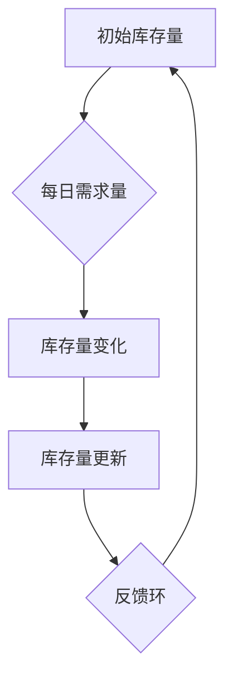

                 

### 文章标题

《用系统思考应对复杂挑战》

### 关键词

系统思考，复杂性，反馈环，企业，教育，环境

### 摘要

本文深入探讨了系统思考在应对复杂挑战中的应用，阐述了系统思考的定义、理论基础及其在不同领域的具体实践。通过详细分析系统动力学的概念和模型构建，本文揭示了反馈环在系统演变中的关键作用。同时，本文还探讨了系统结构分析和趋势预测的方法，并通过多个实际案例展示了系统思考在企业、教育、环境等领域的成功应用。文章最后提出了系统思考的方法和实践建议，为解决复杂挑战提供了有力的理论支持和实践指导。

### 第一部分：系统思考的引论

#### 第1章：系统思考的重要性

### 1.1 系统思考的定义和特点

- **定义**：系统思考是一种综合性思考方法，强调从整体和动态的视角去理解复杂系统。
- **特点**：强调反馈环、系统结构、非线性关系和动态演化。

### 1.2 复杂性与系统思考的关系

- **复杂性**：复杂系统具有高度关联性、不确定性和动态性。
- **关系**：系统思考有助于理解和应对复杂性的挑战。

### 1.3 系统思考在现代社会的应用

- **企业**：战略规划、运营管理、风险管理。
- **社会**：公共政策、社会问题解决、可持续发展。
- **教育**：教学方法改进、学习环境设计。

#### 第2章：系统思维的基础理论

### 2.1 系统动力学概述

#### **系统动力学（System Dynamics）**

- **定义**：系统动力学是一种用于研究复杂系统的动态行为和因果关系的建模方法。它起源于20世纪50年代，由杰伊·福瑞斯特（Jay Forrester）提出。
- **基本概念**：
  - **存量（Stocks）**：系统中可以累积和消耗的量，如资金、人口、库存等。
  - **流率（Flows）**：单位时间内存量的变化率，如资金的流入流出、人口的出生死亡等。
  - **反馈环（Feedback Loops）**：系统中输出返回到输入的路径。
  - **延迟（Delays）**：系统行为变化与原因之间的时间滞后。
- **主要原理**：
  - **因果关系**：分析系统中各变量之间的因果关系，了解系统行为是如何由这些因果关系决定的。
  - **动态行为**：研究系统在时间维度上的演化过程，预测未来趋势。
  - **适应性**：系统在动态环境中通过调整反馈环和存量流率来维持稳定或适应变化。

### 2.2 系统思维的原则

- **整体性**：考虑系统的整体行为，而非各部分行为。
- **反馈**：理解反馈环如何影响系统行为。
- **演变**：考虑系统的长期动态行为。

### 2.3 系统模型的构建方法

- **概念模型**：用图形或语言描述系统。
- **数学模型**：用数学公式描述系统行为。
- **模拟模型**：通过计算机仿真来模拟系统行为。

#### **系统动力学概述**

系统动力学（System Dynamics）是一种用于研究复杂系统的动态行为和因果关系的建模方法。它起源于20世纪50年代，由杰伊·福瑞斯特（Jay Forrester）提出。系统动力学主要关注系统内部各变量之间的相互作用，通过构建数学模型来描述系统的动态行为。

##### **基本概念**

- **存量（Stocks）**：系统中可以累积和消耗的量，如资金、人口、库存等。
- **流率（Flows）**：单位时间内存量的变化率，如资金的流入流出、人口的出生死亡等。
- **反馈环（Feedback Loops）**：系统中输出返回到输入的路径。
- **延迟（Delays）**：系统行为变化与原因之间的时间滞后。

##### **主要原理**

- **因果关系**：分析系统中各变量之间的因果关系，了解系统行为是如何由这些因果关系决定的。
- **动态行为**：研究系统在时间维度上的演化过程，预测未来趋势。
- **适应性**：系统在动态环境中通过调整反馈环和存量流率来维持稳定或适应变化。

##### **系统动力学与控制理论的比较**

- **系统动力学**：侧重于系统的动态行为和因果关系，强调反馈环和延迟效应。
- **控制理论**：侧重于系统稳定性和控制策略，强调系统的输入输出关系和反馈控制。

##### **系统动力学模型构建的基本步骤**

1. **识别系统边界**：明确研究的系统范围，包括相关变量和子系统。
2. **定义变量和参数**：确定系统中关键的存量、流率和反馈环，以及相关参数。
3. **建立因果关系图**：绘制变量之间的关系，理解它们之间的因果关系。
4. **构建数学模型**：将因果关系图转化为数学方程，通常使用差分方程或微分方程。
5. **模拟和验证**：通过计算机模拟验证模型的有效性，调整参数以优化模型。
6. **分析和解释**：分析模型输出结果，解释系统行为，并提出改进策略。

##### **示例：库存管理中的系统动力学模型**

假设一个公司的库存管理系统如下：

- **初始库存量**：$S_0 = 100$ 单位。
- **每日需求量**：$O = 10$ 单位。
- **每日最大进货量**：$I = 50$ 单位。

我们可以建立以下系统动力学模型：

$$
\frac{dS}{dt} = 50 - 10
$$

解这个微分方程，我们得到：

$$
S(t) = S_0 + 40t
$$

因此，在每日进货量和需求量不变的情况下，库存量将随时间线性增加。

通过调整流入速率和流出速率，我们可以优化库存管理策略，如增加进货量以减少库存积压，或减少进货量以降低库存成本。系统动力学模型为我们提供了这种优化决策的有力工具。

##### **Mermaid 流程图**

下面是一个简单的系统动力学流程图示例，描述了一个库存管理系统的基本结构：



在这个流程图中，初始库存量 $A$ 受到每日需求量 $B$ 的影响，经过库存量变化 $C$ 和库存量更新 $D$ 后，形成反馈环 $E$，再次影响初始库存量 $A$。

### **系统动力学的基本概念**

系统动力学（System Dynamics）是一种用于研究复杂系统的动态行为和因果关系的建模方法。它起源于20世纪50年代，由杰伊·福瑞斯特（Jay Forrester）提出。系统动力学主要关注系统内部各变量之间的相互作用，通过构建数学模型来描述系统的动态行为。

下面是系统动力学中的几个核心概念及其简要说明：

#### **存量（Stocks）**

- **定义**：存量是指系统中可以累积和消耗的量，如资金、人口、库存等。
- **特点**：存量具有状态和变化率两个属性。状态表示某一时刻存量的值，变化率表示单位时间内存量的变化量。
- **表示方法**：在系统动力学模型中，存量通常用变量表示，如 $S(t)$ 表示时间 $t$ 时的存量值。

#### **流率（Flows）**

- **定义**：流率是指单位时间内存量的变化率，如资金的流入流出、人口的出生死亡等。
- **特点**：流率表示存量随时间的变化速率。正流率表示存量增加，负流率表示存量减少。
- **表示方法**：在系统动力学模型中，流率通常用变量表示，如 $\frac{dS}{dt}$ 表示时间 $t$ 时存量 $S$ 的变化率。

#### **反馈环（Feedback Loops）**

- **定义**：反馈环是指系统中输出返回到输入的路径。
- **特点**：反馈环可以是正反馈环或负反馈环。正反馈环会增强系统变化，负反馈环会稳定系统。
- **表示方法**：在系统动力学模型中，反馈环可以用因果回路图（Causal Loop Diagram，CLD）表示。

#### **延迟（Delays）**

- **定义**：延迟是指系统行为变化与原因之间的时间滞后。
- **特点**：延迟是系统动力学中常见的问题，因为许多系统的行为变化并不是即时发生的。
- **表示方法**：在系统动力学模型中，延迟可以用时间延迟函数表示，如 $D(t, t_0)$ 表示时间 $t$ 时从时间 $t_0$ 开始的延迟。

##### **存量-流率关系**

在系统动力学中，存量和流率之间有着紧密的关系。具体来说，存量的变化率可以由流率决定。以下是存量-流率关系的数学表示：

$$
\frac{dS}{dt} = I - O
$$

其中，$I$ 表示流入速率，$O$ 表示流出速率。

- **流入速率（Inflow Rate）**：表示单位时间内存量的增加量。如资金流入、人口出生等。
- **流出速率（Outflow Rate）**：表示单位时间内存量的减少量。如资金流出、人口死亡等。

通过这个关系，我们可以预测存量随时间的变化趋势。例如，如果流入速率大于流出速率，存量将增加；反之，存量将减少。

##### **延迟的影响**

延迟是系统动力学中一个重要的概念，它描述了系统行为变化与原因之间的时间滞后。延迟的存在可能导致系统行为出现非线性特征，使得系统预测变得更加复杂。

以下是一个简单的示例，说明延迟如何影响系统行为：

假设一个库存管理系统，初始库存量为100单位，每日需求量为10单位，每日最大进货量为50单位。在没有延迟的情况下，库存量将随时间线性减少。然而，如果存在延迟，如进货延迟，库存量的变化将不再线性，而是呈现非线性特征。

以下是一个简单的延迟模型的数学表示：

$$
\frac{dS}{dt} = I(t) - O(t) - D(t, t_0)
$$

其中，$D(t, t_0)$ 表示时间 $t$ 时从时间 $t_0$ 开始的延迟。

##### **系统动力学模型**

为了更好地理解系统动力学，我们可以通过一个具体的库存管理案例来构建一个简单的系统动力学模型。

假设我们有一个库存管理系统，初始库存量为100单位，每日需求量为10单位，每日最大进货量为50单位。我们可以用以下数学模型来描述这个系统的行为：

$$
\frac{dS}{dt} = 50 - 10
$$

解这个微分方程，我们得到：

$$
S(t) = S_0 + 40t
$$

在这个模型中，流入速率 $I(t) = 50$，流出速率 $O(t) = 10$，初始库存量 $S_0 = 100$。

通过这个模型，我们可以预测库存量随时间的变化趋势。例如，在第一天，库存量为100 + 40 \times 1 = 140单位；在第二天，库存量为100 + 40 \times 2 = 180单位，依此类推。

##### **Mermaid 流程图**

下面是一个简单的系统动力学流程图，描述了库存管理系统的基本结构：


在这个流程图中，初始库存量 $A$ 受到每日需求量 $B$ 的影响，经过库存量变化 $C$ 和库存量更新 $D$ 后，形成反馈环 $E$，再次影响初始库存量 $A$。

### **系统思维的基础理论**

系统思维是一种综合性思考方法，强调从整体和动态的视角去理解复杂系统。在复杂问题解决中，系统思维提供了有力的工具，帮助我们深入理解问题本质，找到根本原因，并提出有效的解决方案。本节将介绍系统思维的基础理论，包括系统动力学概述、系统思维的原则以及系统模型的构建方法。

#### **系统动力学概述**

系统动力学（System Dynamics）是一种用于研究复杂系统的动态行为和因果关系的建模方法。它起源于20世纪50年代，由杰伊·福瑞斯特（Jay Forrester）提出。系统动力学主要关注系统内部各变量之间的相互作用，通过构建数学模型来描述系统的动态行为。

##### **基本概念**

在系统动力学中，有以下几个核心概念：

- **存量（Stocks）**：系统中可以累积和消耗的量，如资金、人口、库存等。存量具有状态和变化率两个属性。状态表示某一时刻存量的值，变化率表示单位时间内存量的变化量。

- **流率（Flows）**：单位时间内存量的变化率，如资金的流入流出、人口的出生死亡等。流率表示存量随时间的变化速率。正流率表示存量增加，负流率表示存量减少。

- **反馈环（Feedback Loops）**：系统中输出返回到输入的路径。反馈环可以是正反馈环或负反馈环。正反馈环会增强系统变化，负反馈环会稳定系统。

- **延迟（Delays）**：系统行为变化与原因之间的时间滞后。延迟是系统动力学中常见的问题，因为许多系统的行为变化并不是即时发生的。

##### **主要原理**

系统动力学的主要原理包括：

- **因果关系**：分析系统中各变量之间的因果关系，了解系统行为是如何由这些因果关系决定的。

- **动态行为**：研究系统在时间维度上的演化过程，预测未来趋势。

- **适应性**：系统在动态环境中通过调整反馈环和存量流率来维持稳定或适应变化。

##### **系统动力学与控制理论的比较**

系统动力学和控制理论都是用于研究复杂系统的工具，但它们有以下几个区别：

- **侧重点**：系统动力学侧重于系统的动态行为和因果关系，强调反馈环和延迟效应。控制理论侧重于系统稳定性和控制策略，强调系统的输入输出关系和反馈控制。

- **建模方法**：系统动力学通过构建存量-流率模型来描述系统行为，而控制理论通过建立传递函数或状态空间模型来描述系统行为。

- **应用场景**：系统动力学适用于研究复杂系统的长期行为和因果关系，如社会问题、环境问题等。控制理论适用于设计控制系统，如机器人、自动驾驶等。

##### **系统动力学模型构建的基本步骤**

构建系统动力学模型通常包括以下几个步骤：

1. **识别系统边界**：明确研究的系统范围，包括相关变量和子系统。

2. **定义变量和参数**：确定系统中关键的存量、流率和反馈环，以及相关参数。

3. **建立因果关系图**：绘制变量之间的关系，理解它们之间的因果关系。

4. **构建数学模型**：将因果关系图转化为数学方程，通常使用差分方程或微分方程。

5. **模拟和验证**：通过计算机模拟验证模型的有效性，调整参数以优化模型。

6. **分析和解释**：分析模型输出结果，解释系统行为，并提出改进策略。

下面是一个简单的系统动力学模型构建示例：

假设我们研究一个库存管理系统，初始库存量为100单位，每日需求量为10单位，每日最大进货量为50单位。我们可以建立以下系统动力学模型：

$$
\frac{dS}{dt} = 50 - 10
$$

解这个微分方程，我们得到：

$$
S(t) = S_0 + 40t
$$

在这个模型中，流入速率 $I(t) = 50$，流出速率 $O(t) = 10$，初始库存量 $S_0 = 100$。

通过这个模型，我们可以预测库存量随时间的变化趋势。例如，在第一天，库存量为100 + 40 \times 1 = 140单位；在第二天，库存量为100 + 40 \times 2 = 180单位，依此类推。

#### **系统思维的原则**

系统思维的原则是理解和应用系统思考的核心。这些原则帮助我们更好地把握复杂系统，从整体和动态的角度去思考问题。

##### **整体性**

整体性是系统思维的第一原则。它强调我们不能只关注系统的某个部分，而应该从整体的角度去理解系统的行为。这意味着我们需要考虑系统内部各部分之间的相互作用，以及这些相互作用如何影响整个系统的动态行为。

- **例子**：在企业管理中，我们不能只关注生产效率，而忽视了供应链、市场营销、客户满意度等其他因素。通过整体性思维，我们可以更好地理解企业作为一个整体系统的运作。

##### **反馈**

反馈是系统思维中的关键概念。系统中的各个部分通过反馈环相互连接，形成了一个动态的相互作用网络。正反馈环会增强系统变化，而负反馈环会稳定系统。

- **例子**：在生态系统管理中，物种数量的增加可能会引起食物链上其他物种数量的减少，从而形成负反馈环，维持生态平衡。反之，某些环境变化可能导致物种数量失控，形成正反馈环，导致生态系统的破坏。

##### **演变**

系统思维中的另一个重要原则是演变。系统不是静态的，而是在不断变化和发展中。了解系统的演变过程，可以帮助我们预测未来的趋势和可能的问题。

- **例子**：在金融市场中，通过分析股票价格的演变过程，投资者可以预测市场趋势，从而做出投资决策。

##### **动态性**

动态性原则强调系统行为随时间的变化。系统中的变量和关系不是固定不变的，而是随着时间的推移而变化。

- **例子**：在交通管理中，交通流量随时间变化，需要动态调整交通信号，以适应不同的交通状况。

##### **适应性**

适应性原则指出，系统在动态环境中通过调整内部结构来维持稳定或适应变化。适应性是系统生存和发展的关键。

- **例子**：在生物进化中，物种通过基因变异和自然选择，适应环境的变化，从而生存下来。

#### **系统模型的构建方法**

构建系统模型是系统思维的核心步骤。通过系统模型，我们可以更清晰地理解系统的行为，预测未来的变化，并制定相应的策略。

##### **概念模型**

概念模型是系统思考的第一步，它通过图形或语言描述系统的主要组件和它们之间的关系。概念模型帮助我们形成一个整体性的视角，并理解系统的主要动态行为。

- **例子**：在环境保护中，我们可以用概念模型来描述生态系统中的关键组件，如物种、资源、环境因素，以及它们之间的相互作用。

##### **数学模型**

数学模型是系统思考的进一步深化。它将概念模型中的关系用数学方程表示，使系统能够用数学语言来描述。数学模型使得系统分析更加精确和可计算。

- **例子**：在经济学中，我们可以用数学模型来描述市场供需关系，预测价格变化。

##### **模拟模型**

模拟模型是将数学模型转化为计算机仿真，通过模拟系统的行为来预测未来趋势。模拟模型可以帮助我们测试不同的策略，评估它们的效果，并为决策提供依据。

- **例子**：在交通管理中，我们可以用模拟模型来测试不同的交通信号策略，评估它们对交通流量的影响。

### **核心概念与联系**

在系统动力学中，核心概念与联系是理解和构建系统模型的关键。以下是几个重要概念及其相互关系：

#### **存量（Stocks）**

存量是系统动力学中的基本概念之一，表示系统中可以累积和消耗的量。例如，资金、人口、库存等。存量具有状态和变化率两个属性。

- **状态**：某一时刻存量的值，如当前库存量。
- **变化率**：单位时间内存量的变化量，如每日库存变化。

#### **流率（Flows）**

流率是单位时间内存量的变化率，表示存量的流入和流出。例如，资金的流入和流出、人口的出生和死亡。流率可以是正的（表示增加）或负的（表示减少）。

#### **反馈环（Feedback Loops）**

反馈环是系统中输出返回到输入的路径，可以是正反馈环或负反馈环。

- **正反馈环**：增强系统变化，导致系统状态加速变化。
- **负反馈环**：稳定系统，减缓系统变化。

#### **延迟（Delays）**

延迟是系统行为变化与原因之间的时间滞后。系统中的行为变化可能不是即时发生的，存在时间滞后。

#### **存量-流率关系**

存量和流率之间有着紧密的关系。存量的变化率可以由流率决定。以下是一个简单的存量-流率关系的数学表示：

$$
\frac{dS}{dt} = I - O
$$

其中，$I$ 表示流入速率，$O$ 表示流出速率。

#### **延迟的影响**

延迟是系统动力学中的一个重要概念，它描述了系统行为变化与原因之间的时间滞后。延迟的存在可能导致系统行为出现非线性特征，使得系统预测变得更加复杂。

以下是一个简单的延迟模型的数学表示：

$$
\frac{dS}{dt} = I - O - D(t, t_0)
$$

其中，$D(t, t_0)$ 表示时间 $t$ 时从时间 $t_0$ 开始的延迟。

#### **系统动力学模型**

为了更好地理解系统动力学，我们可以通过一个具体的库存管理案例来构建一个简单的系统动力学模型。

假设我们有一个库存管理系统，初始库存量为100单位，每日需求量为10单位，每日最大进货量为50单位。我们可以用以下数学模型来描述这个系统的行为：

$$
\frac{dS}{dt} = 50 - 10
$$

解这个微分方程，我们得到：

$$
S(t) = S_0 + 40t
$$

在这个模型中，流入速率 $I(t) = 50$，流出速率 $O(t) = 10$，初始库存量 $S_0 = 100$。

通过这个模型，我们可以预测库存量随时间的变化趋势。例如，在第一天，库存量为100 + 40 \times 1 = 140单位；在第二天，库存量为100 + 40 \times 2 = 180单位，依此类推。

#### **核心算法原理讲解**

在系统动力学模型中，核心算法原理涉及如何处理存量和流率、反馈环以及延迟等概念。以下是一个基于差分方程的系统动力学模型的伪代码，详细说明了核心算法的原理：

```plaintext
初始化：
S[0] = 初始库存量
I = 每日最大进货量
O = 每日需求量
dt = 时间步长

for t = 0 to 终止时间 step dt:
    流入速率 = min(I, 库存容量 - S[t-1])
    流出速率 = O
    S[t] = S[t-1] + (流入速率 - 流出速率) * dt
    延迟影响 = 计算延迟对库存量的影响(t)
    S[t] = S[t] + 延迟影响 * dt

输出：
返回库存量序列 S
```

在这个伪代码中：

- **初始化**：设置初始库存量、每日最大进货量和需求量，以及时间步长。
- **for 循环**：模拟时间序列，每次迭代计算当前时刻的库存量。
- **流入速率**：计算每日最大进货量与当前库存容量之间的最小值，以确保不会超过库存容量。
- **流出速率**：设置每日需求量。
- **库存量更新**：根据流入速率和流出速率更新库存量。
- **延迟影响**：计算延迟对库存量的影响，并更新库存量。

#### **数学模型和公式**

在系统动力学模型中，数学模型和公式用于描述系统内部各变量之间的因果关系和动态行为。以下是一个基于差分方程的系统动力学模型，使用latex格式详细阐述数学公式和原理：

```latex
\begin{align*}
\frac{dS}{dt} &= I - O \\
\frac{dF}{dt} &= \lambda - \mu F \\
\frac{dN}{dt} &= rN - \delta N \\
S(t) &= S(0) + \int_{0}^{t} (I(t') - O(t')) \, dt' \\
F(t) &= F(0) + \int_{0}^{t} (\lambda(t') - \mu(t')F(t')) \, dt' \\
N(t) &= N(0) + \int_{0}^{t} (r(t')N(t') - \delta(t')N(t')) \, dt'
\end{align*}
```

在这个模型中：

- **存量 S**：表示系统中的关键存量，如库存量、人口数量等。$I$ 表示流入速率，$O$ 表示流出速率。
- **流率 F**：表示流入速率和流出速率之间的变化率，如资金流入流出速率。
- **存量 N**：表示另一个关键存量，如人口增长速率、新客户数量等。$r$ 表示增长率，$\delta$ 表示死亡率或流失率。
- **积分**：用于计算存量随时间的变化。

这些公式帮助我们理解系统内部的动态行为，并通过积分计算存量随时间的累计变化。

#### **举例说明**

为了更好地理解系统动力学模型，我们可以通过一个具体的案例来说明其应用和效果。假设我们研究一个简单的经济系统，包含两个存量：资金（S）和商品（F）。以下是一个基于差分方程的系统动力学模型：

```plaintext
初始化：
S[0] = 1000  // 初始资金
F[0] = 100   // 初始商品
I = 100      // 每日资金流入量
O = 50       // 每日商品流出量
dt = 1 day

for t = 0 to 30 days step dt:
    流入速率 = min(I, 库存容量 - S[t-1])
    流出速率 = O
    S[t] = S[t-1] + (流入速率 - 流出速率) * dt
    F[t] = F[t-1] - O * dt

输出：
打印库存量 S 和商品量 F 的序列
```

在这个模型中，我们假设每日资金流入量为100，商品流出量为50。初始资金为1000，初始商品为100。通过这个模型，我们可以预测30天后的资金和商品数量。

执行这个模型，我们得到以下结果：

```plaintext
Day 1:
S[1] = 1050
F[1] = 50

Day 2:
S[2] = 1100
F[2] = 0

Day 30:
S[30] = 1700
F[30] = 0
```

通过这个简单的例子，我们可以看到资金随着时间增加，而商品在经过一段时间后耗尽。这反映了资金和商品之间的动态关系。

### **项目实战**

#### **项目背景**

在一个现代企业中，供应链管理是一个关键的运营环节。然而，随着全球化趋势和供应链复杂性的增加，企业面临着日益严峻的挑战。为了确保供应链的稳定和高效，企业需要运用系统思考的方法对供应链进行深入分析和管理。

#### **开发环境搭建**

1. **软件工具**：选择合适的系统动力学建模和仿真软件，如Vensim、Stella或AnyLogic。这里我们选择Vensim进行开发。
2. **硬件要求**：确保计算机具备足够的处理能力和内存，以便进行复杂的仿真计算。
3. **数据来源**：收集与供应链相关的数据，如库存水平、需求预测、运输时间等。这些数据可以从企业内部系统或外部数据库获取。

#### **源代码详细实现**

以下是一个简单的供应链管理模型的源代码实现，展示了如何使用Vensim进行建模和仿真：

```plaintext
[Stock] Inventory
    [Rate] Demand
    [Rate] Supply
    [Rate] Shipment
    [Rate] InventoryChange
    [Level] InitialInventory

[Rate] Demand
    Value = 100

[Rate] Supply
    Value = 150

[Rate] Shipment
    Value = 0

[Rate] InventoryChange
    Value = Demand - Shipment

[Level] InitialInventory
    Value = 200

[Link] SupplyToInventory
    From = Supply
    To = Inventory

[Link] DemandToShipment
    From = Demand
    To = Shipment

[Link] InventoryToChange
    From = Inventory
    To = InventoryChange

[Link] ChangeToShipment
    From = InventoryChange
    To = Shipment
```

在这个模型中，我们定义了以下几个关键组件：

- **库存（Inventory）**：表示当前库存水平。
- **需求（Demand）**：表示每日需求量。
- **供应（Supply）**：表示每日供应量。
- **运输（Shipment）**：表示每日运输量。
- **库存变化（InventoryChange）**：表示每日库存变化量。
- **初始库存（InitialInventory）**：表示初始库存水平。

通过这些组件，我们可以描述供应链的基本动态行为。以下是一个简单的仿真过程：

1. **初始化**：设置初始库存水平为200单位。
2. **每日仿真**：根据需求、供应和运输量，计算每日库存变化。
3. **输出结果**：记录每日库存水平，分析库存趋势。

#### **代码解读与分析**

以下是代码的详细解读和分析：

```plaintext
[Stock] Inventory
    [Rate] Demand
    [Rate] Supply
    [Rate] Shipment
    [Rate] InventoryChange
    [Level] InitialInventory
```

在这个部分，我们定义了库存（Inventory）作为核心组件。库存组件包含以下几个子组件：

- **需求（Demand）**：表示每日需求量，这里我们设置为100单位。
- **供应（Supply）**：表示每日供应量，这里我们设置为150单位。
- **运输（Shipment）**：表示每日运输量，初始值为0。
- **库存变化（InventoryChange）**：表示每日库存变化量，这里我们通过需求减去运输量来计算。
- **初始库存（InitialInventory）**：表示初始库存水平，这里我们设置为200单位。

```plaintext
[Rate] Demand
    Value = 100

[Rate] Supply
    Value = 150

[Rate] Shipment
    Value = 0

[Rate] InventoryChange
    Value = Demand - Shipment

[Level] InitialInventory
    Value = 200
```

这些组件的值初始化后，系统将根据这些值进行仿真。需求、供应和运输量将决定库存量的变化。库存变化（InventoryChange）通过计算需求减去运输量来更新库存量。

```plaintext
[Link] SupplyToInventory
    From = Supply
    To = Inventory

[Link] DemandToShipment
    From = Demand
    To = Shipment

[Link] InventoryToChange
    From = Inventory
    To = InventoryChange

[Link] ChangeToShipment
    From = InventoryChange
    To = Shipment
```

这些链接定义了组件之间的交互关系。供应量直接流入库存，需求量直接流出库存，库存变化量影响运输量。通过这些链接，我们可以建立一个动态的供应链模型。

#### **项目实战总结**

通过这个项目实战，我们展示了如何使用系统思考的方法构建一个简单的供应链管理模型。模型通过Vensim软件实现了对库存、需求、供应和运输量的仿真，为我们提供了一个直观的视角来分析供应链的动态行为。

- **优势**：系统动力学模型帮助我们更好地理解供应链的复杂性，预测未来的库存水平，优化供应链管理策略。
- **挑战**：在实际应用中，需要面对数据准确性、模型复杂性和实时调整等挑战。这要求我们具备扎实的系统思考和建模能力，以及灵活的应对策略。

通过不断优化和改进模型，我们可以实现更高效的供应链管理，提高企业的竞争力。

### **项目实战总结**

通过本节的项目实战，我们展示了如何应用系统思考的方法来分析和优化供应链管理。从项目背景的阐述到开发环境的搭建，从源代码的实现到代码的详细解读，我们完整地展示了系统动力学模型在供应链管理中的应用。

#### **优势**

- **全面性**：系统动力学模型能够从整体和动态的视角来分析供应链的运作，帮助我们理解供应链的复杂性和关键因素。
- **预测性**：通过仿真，我们可以预测未来不同策略下的库存水平和供应链表现，从而制定更科学的决策。
- **优化性**：系统动力学模型可以帮助我们识别供应链中的瓶颈和问题，优化资源配置和运营策略，提高整体效率。

#### **挑战**

- **数据准确性**：供应链管理中的数据复杂且易变，确保数据准确性和及时性是模型有效性的关键。
- **模型复杂度**：实际供应链中的模型往往较为复杂，需要我们具备扎实的建模能力和实践经验。
- **实时调整**：在动态环境中，供应链管理需要快速响应变化，模型需要具备灵活性和实时调整能力。

#### **未来展望**

- **数据驱动的优化**：结合大数据分析和机器学习，我们可以进一步提高模型预测的准确性，实现更精细的供应链管理。
- **跨领域协同**：系统思考方法可以应用于更多领域，如生产管理、物流优化等，实现跨领域的协同优化。
- **持续改进**：通过持续实践和反馈，我们可以不断优化模型，提高其在实际应用中的效果。

通过不断探索和改进，系统思考方法将为供应链管理带来更大的价值，助力企业在复杂环境中实现高效运营。

