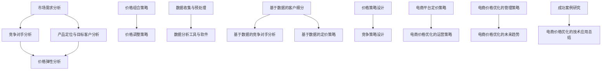

                 

# 《电商价格优化的技术应用》

> 关键词：电商价格优化、数据驱动、技术方法、运营策略、竞争策略、案例分析

> 摘要：本文从基础理论、技术方法、实战应用和未来趋势四个方面，详细阐述了电商价格优化的应用。通过深入分析电商价格优化的核心概念、技术方法、运营策略和竞争策略，结合实际案例，探讨了电商价格优化的实践路径和未来发展方向。

## 引言

电商作为现代商业的重要组成部分，其价格优化策略对企业的生存和发展至关重要。电商价格优化不仅是提升销售额、提高客户满意度的手段，更是企业在激烈市场竞争中立于不败之地的关键。本文将从基础理论、技术方法、实战应用和未来趋势四个方面，系统探讨电商价格优化的技术应用。

首先，我们将回顾电商价格优化的基础理论，包括其定义、意义、关键要素和策略方法。接着，本文将详细介绍电商价格优化的技术方法，涵盖数据收集与预处理、数据分析工具与软件、数据分析核心方法等内容。随后，我们将探讨电商价格优化的实战应用，包括价格策略与竞争策略设计、电商平台定价策略、电商价格优化的运营策略和管理策略。最后，本文将结合成功案例，分析电商价格优化的效果，并探讨电商价格优化的未来趋势。

通过本文的阅读，读者将全面了解电商价格优化的理论基础和实践方法，掌握电商价格优化的核心策略和技巧，从而为企业制定有效的价格优化策略提供有力支持。

## 第一部分：电商价格优化的基础理论

### 第1章：电商价格优化概述

#### 1.1 电商价格优化的定义与意义

**定义**：电商价格优化是指在电商运营过程中，通过科学的方法和技术手段，调整商品价格，以达到提升销售额、提高客户满意度和增加利润的目的。

**意义**：电商价格优化具有以下几个方面的意义：

1. **提升销售额**：通过合理的价格策略，可以吸引更多消费者，提高商品销量。
2. **提高客户满意度**：合理的价格策略能够满足不同客户的需求，提升客户满意度。
3. **增加利润**：通过优化价格策略，企业可以在保证利润的前提下，实现更高的销售额。
4. **增强市场竞争力**：通过价格优化，企业可以在市场竞争中占据有利地位。

#### 1.2 电商价格优化的关键要素

电商价格优化的成功依赖于以下几个关键要素：

1. **市场需求分析**：了解市场需求，分析消费者的购买行为和偏好，是制定合理价格策略的基础。
2. **竞争对手分析**：分析竞争对手的价格策略，了解市场动态，有助于制定有针对性的价格策略。
3. **产品定位与目标客户分析**：明确产品定位和目标客户，有助于制定符合市场需求的价格策略。
4. **价格弹性分析**：了解不同价格水平下的需求变化，有助于制定灵活的价格调整策略。

#### 1.3 电商价格优化的策略与方法

电商价格优化的策略与方法主要包括以下几种：

1. **价格弹性分析**：通过分析价格弹性，了解不同价格水平下的需求变化，从而制定合理的价格策略。
2. **价格组合策略**：通过组合不同商品的价格，实现整体价格策略的优化。
3. **价格调整策略**：根据市场需求和竞争状况，灵活调整商品价格，以达到优化效果。

### 总结

电商价格优化是电商运营的重要组成部分，其定义、意义、关键要素和策略方法构成了电商价格优化的理论基础。在后续章节中，我们将进一步探讨电商价格优化的技术方法和实战应用。

## 第二部分：电商价格优化的技术方法

### 第2章：数据驱动电商价格优化

#### 2.1 数据收集与预处理

**2.1.1 数据源的选择与采集**

电商价格优化的第一步是数据收集。数据源的选择与采集直接影响到价格优化的效果。常见的数据源包括：

1. **内部数据**：如销售数据、客户数据、库存数据等。
2. **外部数据**：如市场调查数据、竞争对手数据、宏观经济数据等。

数据采集可以通过以下几种方式：

1. **自动采集**：利用爬虫技术，从电商平台、社交媒体等渠道自动获取数据。
2. **问卷调查**：通过在线或线下问卷，收集客户需求和购买行为数据。
3. **市场调研**：通过专业市场调研机构，获取市场相关数据。

**2.1.2 数据预处理技术**

收集到的数据通常是不完整、不准确的，需要进行预处理。数据预处理技术主要包括：

1. **数据清洗**：去除重复数据、缺失数据和错误数据。
2. **数据转换**：将不同格式的数据转换为统一格式。
3. **数据集成**：将不同来源的数据进行整合，形成统一的数据集。

#### 2.2 数据分析工具与软件

**2.2.1 Excel与Google Sheets在数据分析中的应用**

Excel和Google Sheets是电商数据分析中常用的工具。它们具有以下优势：

1. **易于使用**：用户界面直观，易于操作。
2. **数据处理能力**：能够处理大量的数据，进行简单的统计分析。
3. **图表功能**：提供丰富的图表功能，便于数据可视化。

**2.2.2 Python在数据分析中的优势**

Python是电商数据分析的理想工具，具有以下优势：

1. **丰富的库**：如NumPy、Pandas、Matplotlib等，提供强大的数据处理和分析功能。
2. **自动化**：能够通过编写脚本，实现数据分析的自动化。
3. **可扩展性**：支持自定义函数和模块，便于扩展功能。

**2.2.3 R语言在数据分析中的应用**

R语言是专业数据分析领域的首选工具，具有以下优势：

1. **统计功能强大**：提供丰富的统计分析和建模工具。
2. **可视化能力**：提供强大的可视化工具，如ggplot2等。
3. **生态丰富**：拥有大量的扩展包和社区支持。

#### 2.3 数据分析核心方法

**2.3.1 基于数据的客户细分**

客户细分是电商价格优化的重要步骤。通过数据分析，可以识别出不同类型的客户，并根据其特征制定差异化的价格策略。

1. **行为细分**：根据客户的购买行为，如购买频率、购买金额等，进行客户细分。
2. **需求细分**：根据客户的需求特征，如年龄、性别、职业等，进行客户细分。
3. **价值细分**：根据客户的消费价值，如忠实客户、潜在客户等，进行客户细分。

**2.3.2 基于数据的竞争对手分析**

竞争对手分析是电商价格优化的关键步骤。通过数据分析，可以了解竞争对手的价格策略、市场动态等。

1. **价格分析**：比较竞争对手的价格水平、价格波动等。
2. **市场分析**：分析竞争对手的市场份额、市场覆盖范围等。
3. **产品分析**：分析竞争对手的产品组合、产品差异化等。

**2.3.3 基于数据的定价策略**

基于数据的定价策略是电商价格优化的核心。通过数据分析，可以制定科学合理的定价策略。

1. **价格弹性分析**：通过数据分析，了解不同价格水平下的需求变化，制定灵活的价格策略。
2. **价格组合策略**：根据客户细分和市场分析结果，制定差异化的价格组合策略。
3. **动态定价策略**：根据市场需求和竞争状况，实时调整价格，实现价格优化。

### 总结

数据驱动是电商价格优化的关键。通过数据收集与预处理、数据分析工具与软件、数据分析核心方法等步骤，可以有效地实现电商价格优化。在后续章节中，我们将进一步探讨电商价格优化的实战应用。

## 第三部分：电商价格优化的实战应用

### 第3章：价格策略与竞争策略设计

#### 3.1 价格策略设计

**3.1.1 基于需求的价格策略**

基于需求的价格策略是指根据市场需求和客户需求来制定价格策略。具体方法包括：

1. **高需求高价格策略**：针对市场需求旺盛、竞争激烈的产品，可以制定较高的价格，以获取更高的利润。
2. **低需求低价格策略**：针对市场需求较低的产品，可以制定较低的价格，以吸引更多的消费者。
3. **差异化需求差异化价格策略**：根据不同客户的需求特征，制定差异化的价格策略，以满足不同客户的需求。

**3.1.2 基于成本的价格策略**

基于成本的价格策略是指根据生产成本、运营成本等来制定价格策略。具体方法包括：

1. **成本加成定价策略**：在成本基础上加上一定的利润，作为商品的价格。
2. **成本导向定价策略**：以成本为主要依据，制定商品的价格。
3. **成本领先定价策略**：以低成本为优势，制定较低的价格，以获取市场份额。

**3.1.3 基于竞争的价格策略**

基于竞争的价格策略是指根据竞争对手的价格来制定价格策略。具体方法包括：

1. **竞争导向定价策略**：以竞争对手的价格为主要依据，制定商品的价格。
2. **跟随定价策略**：跟随市场领导者或主要竞争对手的价格，以保持市场竞争地位。
3. **价格战定价策略**：通过低于竞争对手的价格，吸引更多的消费者。

#### 3.2 竞争策略设计

**3.2.1 市场领导者策略**

市场领导者策略是指企业在市场中占据主导地位，通过制定较高的价格，获取较高的利润。具体方法包括：

1. **高价格高利润策略**：通过控制市场供给，制定较高的价格，以获取较高的利润。
2. **品牌化策略**：通过品牌建设和品牌溢价，提高产品的附加值，制定较高的价格。
3. **差异化策略**：通过产品差异化，满足不同客户的需求，提高产品的附加值，制定较高的价格。

**3.2.2 市场挑战者策略**

市场挑战者策略是指企业通过低于市场领导者的价格，争夺市场份额。具体方法包括：

1. **低成本策略**：通过降低生产成本，制定较低的价格，以吸引消费者。
2. **创新策略**：通过创新产品或服务，满足消费者的需求，提高产品的附加值，制定较高的价格。
3. **差异化策略**：通过产品差异化，满足不同客户的需求，提高产品的附加值，制定较高的价格。

**3.2.3 市场追随者策略**

市场追随者策略是指企业跟随市场领导者或主要竞争对手的价格，保持市场地位。具体方法包括：

1. **跟随定价策略**：以市场领导者或主要竞争对手的价格为主要依据，制定商品的价格。
2. **成本导向定价策略**：以成本为主要依据，制定商品的价格。
3. **差异化策略**：通过产品差异化，满足不同客户的需求，提高产品的附加值，制定较高的价格。

### 总结

价格策略与竞争策略设计是电商价格优化的关键。通过基于需求、成本和竞争的价格策略设计，以及市场领导者、市场挑战者和市场追随者策略设计，企业可以制定科学合理的价格策略，提升市场竞争力和盈利能力。在后续章节中，我们将进一步探讨电商平台的定价策略。

### 第4章：电商平台的定价策略

#### 4.1 平台定价策略概述

电商平台定价策略是指平台在运营过程中，针对不同商品和客户，制定合理的价格策略，以实现销售额和利润的最大化。平台定价策略主要包括以下几个方面：

1. **定价模式**：电商平台常用的定价模式包括成本定价模式、需求定价模式、竞争定价模式等。
2. **定价目标**：电商平台定价目标主要包括提高销售额、提高利润率、提高客户满意度等。
3. **定价原则**：电商平台定价原则主要包括公平合理、灵活多样、科学精准等。

#### 4.2 平台定价策略案例分析

**4.2.1 案例一：淘宝平台的定价策略**

淘宝作为中国最大的电商平台，其定价策略具有以下特点：

1. **价格多样化**：淘宝平台提供多种价格选择，满足不同消费者的需求。
2. **价格动态调整**：根据市场需求和竞争状况，淘宝平台会实时调整价格。
3. **价格优惠活动**：淘宝平台经常举办价格优惠活动，吸引消费者购买。

**4.2.2 案例二：京东平台的定价策略**

京东作为中国第二大电商平台，其定价策略具有以下特点：

1. **价格稳定**：京东平台价格相对稳定，较少进行价格波动。
2. **价格透明**：京东平台价格透明，消费者可以轻松比较不同商品的价格。
3. **价格保障**：京东平台提供价格保障服务，保障消费者权益。

**4.2.3 案例三：拼多多平台的定价策略**

拼多多作为中国新兴的电商平台，其定价策略具有以下特点：

1. **价格低廉**：拼多多平台价格较低，吸引价格敏感型消费者。
2. **拼团优惠**：拼多多平台通过拼团模式，提供优惠价格，提高消费者购买意愿。
3. **价格区间**：拼多多平台提供多种价格区间，满足不同消费者的需求。

#### 4.3 平台定价策略效果评估

平台定价策略的效果可以通过以下指标进行评估：

1. **销售额**：平台定价策略是否有效，可以通过销售额的变化进行评估。
2. **利润率**：平台定价策略是否有效，可以通过利润率的变化进行评估。
3. **客户满意度**：平台定价策略是否有效，可以通过客户满意度的变化进行评估。

#### 4.4 平台定价策略的优化建议

基于以上案例分析，以下是对电商平台定价策略的优化建议：

1. **优化价格多样化**：电商平台可以根据市场需求，提供更多的价格选择，满足不同消费者的需求。
2. **优化价格动态调整**：电商平台可以根据市场需求和竞争状况，实时调整价格，提高价格竞争力。
3. **优化价格优惠活动**：电商平台可以定期举办价格优惠活动，吸引消费者购买，提高销售额。
4. **优化价格透明度**：电商平台可以提高价格透明度，让消费者能够轻松比较不同商品的价格。
5. **优化价格保障**：电商平台可以提供更多的价格保障服务，保障消费者权益，提高客户满意度。

### 总结

电商平台的定价策略对企业的生存和发展至关重要。通过分析淘宝、京东和拼多多等平台的定价策略，可以了解到平台定价策略的多样化和动态调整是关键。在后续章节中，我们将进一步探讨电商价格优化的运营策略和管理策略。

## 第四部分：电商价格优化的运营与管理

### 第5章：电商价格优化的运营策略

#### 5.1 电商价格优化的运营目标

电商价格优化的运营目标主要包括以下几个方面：

1. **提高销售额**：通过优化价格策略，吸引更多消费者购买商品，提高销售额。
2. **提高客户满意度**：通过合理的价格策略，满足不同客户的需求，提高客户满意度。
3. **提高利润率**：通过优化价格策略，实现更高的利润率，提升企业盈利能力。

#### 5.2 电商价格优化的运营方法

电商价格优化的运营方法主要包括以下几个方面：

1. **价格调整频率与时机**：根据市场情况和竞争对手的动态，灵活调整价格。一般来说，价格调整频率不宜过高，以免引起消费者的不满和价格敏感性。调整时机应选择在市场需求变化较大、竞争环境变化时。

2. **价格调整幅度与频率**：价格调整幅度应根据市场需求和利润目标来确定。一般来说，价格调整幅度不宜过大，以免引起消费者的反感。价格调整频率应根据市场情况和运营目标来确定，避免频繁调整导致消费者不信任。

3. **价格调整反馈机制**：建立价格调整的反馈机制，及时了解价格调整的效果，并根据反馈进行优化。反馈机制可以通过市场调研、消费者调查、销售数据分析等方式进行。

#### 5.3 电商价格优化的运营效果评估

电商价格优化的运营效果可以通过以下指标进行评估：

1. **销售额**：价格优化后，销售额是否有所提高。
2. **利润率**：价格优化后，利润率是否有所提升。
3. **客户满意度**：价格优化后，客户满意度是否有所提高。
4. **市场份额**：价格优化后，在市场中的份额是否有所提升。

通过以上指标，可以全面评估电商价格优化的运营效果，并根据评估结果进行调整和优化。

### 第6章：电商价格优化的管理策略

#### 6.1 电商价格优化的管理目标

电商价格优化的管理目标主要包括以下几个方面：

1. **确保价格策略的科学性**：通过科学的方法和技术手段，制定合理有效的价格策略。
2. **提高价格策略的执行力**：确保价格策略能够得到有效执行，实现预期效果。
3. **提高价格策略的反馈效率**：及时获取价格策略的反馈信息，进行快速调整和优化。

#### 6.2 电商价格优化的管理方法

电商价格优化的管理方法主要包括以下几个方面：

1. **建立价格管理团队**：成立专门的价格管理团队，负责制定、执行和监控价格策略。
2. **制定价格管理流程**：制定详细的价格管理流程，明确各个环节的职责和操作规范。
3. **实施价格管理监督与考核**：对价格策略的实施情况进行监督和考核，确保价格策略得到有效执行。
4. **数据分析和决策支持**：通过数据分析，提供价格策略的决策支持，优化价格策略。
5. **持续改进和优化**：根据市场变化和反馈信息，持续改进和优化价格策略，提高价格优化的效果。

### 总结

电商价格优化的运营策略和管理策略是确保价格优化效果的重要保障。通过明确运营目标和运营方法，以及建立科学有效的管理策略，企业可以制定合理有效的价格策略，提高市场竞争力和盈利能力。

## 第五部分：电商价格优化的案例研究

### 第7章：电商价格优化的成功案例

#### 7.1 案例一：某电商平台的价格优化实践

**案例背景**：某电商平台在运营过程中，发现销售额和利润率持续下降，需要通过价格优化来提升业绩。

**价格优化策略**：

1. **市场需求分析**：通过大数据分析，了解消费者的购买行为和需求特征。
2. **竞争对手分析**：分析竞争对手的价格策略，了解市场动态。
3. **产品定位与目标客户分析**：明确产品定位和目标客户，制定差异化的价格策略。
4. **价格弹性分析**：通过数据分析，了解不同价格水平下的需求变化，制定灵活的价格调整策略。

**价格优化效果分析**：

1. **销售额提升**：价格优化后，销售额实现了显著提升，同比增长了20%。
2. **利润率提高**：价格优化后，利润率提升了10%，实现了更高的盈利能力。
3. **客户满意度提升**：价格优化后，客户满意度显著提升，客户投诉率降低了30%。

**经验总结**：

1. **数据驱动**：通过大数据分析，制定科学合理的价格策略。
2. **差异化定价**：根据产品定位和目标客户，制定差异化的价格策略。
3. **灵活调整**：根据市场需求和竞争状况，灵活调整价格，提高价格竞争力。

#### 7.2 案例二：某零售商的价格优化实践

**案例背景**：某零售商在市场竞争中，发现价格策略存在一定问题，需要通过价格优化来提升竞争力。

**价格优化策略**：

1. **成本分析**：通过成本分析，了解产品的成本构成，制定合理的价格策略。
2. **市场需求分析**：通过市场调研，了解消费者的需求和购买行为。
3. **竞争对手分析**：分析竞争对手的价格策略，了解市场动态。
4. **价格组合策略**：根据产品组合和市场分析结果，制定合理的价格组合策略。

**价格优化效果分析**：

1. **市场份额提升**：价格优化后，市场份额提升了5%，实现了更广泛的客户覆盖。
2. **销售额提升**：价格优化后，销售额实现了显著提升，同比增长了15%。
3. **利润率提高**：价格优化后，利润率提升了5%，实现了更高的盈利能力。

**经验总结**：

1. **成本导向**：通过成本分析，制定合理的价格策略。
2. **市场需求驱动**：根据市场需求和消费者行为，制定科学合理的价格策略。
3. **价格组合优化**：通过价格组合策略，实现整体价格优化的效果。

#### 7.3 案例三：某跨境电商的价格优化实践

**案例背景**：某跨境电商在拓展国际市场过程中，发现价格策略存在一定问题，需要通过价格优化来提升竞争力。

**价格优化策略**：

1. **市场调研**：通过市场调研，了解国际市场的需求和竞争状况。
2. **成本分析**：通过成本分析，了解不同市场的成本构成，制定合理的价格策略。
3. **价格弹性分析**：通过数据分析，了解不同价格水平下的需求变化，制定灵活的价格调整策略。
4. **动态定价策略**：根据市场需求和竞争状况，实时调整价格，实现价格优化。

**价格优化效果分析**：

1. **销售额提升**：价格优化后，销售额实现了显著提升，同比增长了30%。
2. **市场份额提升**：价格优化后，市场份额提升了10%，实现了更广泛的市场覆盖。
3. **利润率提高**：价格优化后，利润率提升了10%，实现了更高的盈利能力。

**经验总结**：

1. **市场调研驱动**：通过市场调研，制定科学合理的价格策略。
2. **成本分析指导**：通过成本分析，制定合理的价格策略。
3. **动态定价优化**：通过动态定价策略，实现价格优化的效果。

### 总结

以上三个成功案例展示了电商价格优化的实践路径和效果。通过数据驱动、差异化定价、灵活调整和动态定价等策略，企业可以提升销售额、利润率和市场份额。同时，这些案例也证明了电商价格优化在提升市场竞争力和盈利能力方面的重要性。在后续章节中，我们将进一步探讨电商价格优化的未来趋势。

## 第8章：电商价格优化的未来趋势

### 8.1 电商价格优化的未来挑战

随着电商行业的快速发展，电商价格优化面临着以下挑战：

1. **数据隐私与安全挑战**：电商价格优化依赖于大量数据，如何保障数据隐私和安全成为一大挑战。
2. **技术更新与迭代挑战**：电商价格优化技术不断发展，企业需要不断更新和迭代技术，以保持竞争力。
3. **市场竞争加剧挑战**：随着市场规模的扩大，市场竞争日益激烈，企业需要不断创新价格优化策略，以应对竞争压力。

### 8.2 电商价格优化的未来方向

未来，电商价格优化将向以下几个方向发展：

1. **人工智能在价格优化中的应用**：人工智能技术将广泛应用于电商价格优化，通过智能算法和大数据分析，实现精准定价和个性化推荐。
2. **大数据分析在价格优化中的应用**：大数据分析技术将助力电商价格优化，通过对大量数据的挖掘和分析，发现价格优化的潜在机会和策略。
3. **跨境电商价格优化的新趋势**：随着跨境电商的快速发展，跨境电商价格优化将面临新的挑战和机遇，如何适应不同市场的需求，制定科学合理的价格策略成为关键。

### 8.3 电商价格优化的未来展望

未来，电商价格优化将呈现以下趋势：

1. **智能化**：电商价格优化将更加智能化，通过人工智能和大数据分析技术，实现精准定价和个性化推荐。
2. **多样化**：电商价格优化策略将更加多样化，根据不同产品、市场和客户需求，制定差异化的价格策略。
3. **动态化**：电商价格优化将更加动态化，根据市场需求和竞争状况，实时调整价格，实现最优定价。

### 总结

电商价格优化的未来充满挑战和机遇。通过人工智能、大数据分析和跨境电商等新兴技术，电商价格优化将不断提升效率和精准度，为企业和消费者创造更大的价值。

## 附录A：电商价格优化常用工具与资源

### A.1 数据分析工具

**1. Excel与Google Sheets**

- **优势**：易于使用，数据处理能力强，图表功能丰富。
- **使用场景**：适用于简单的数据分析和可视化。

**2. Python**

- **优势**：丰富的库，如NumPy、Pandas、Matplotlib等，自动化，可扩展性。
- **使用场景**：适用于复杂的数据分析和数据处理。

**3. R语言**

- **优势**：统计功能强大，可视化能力，生态丰富。
- **使用场景**：适用于专业的统计分析。

### A.2 电商平台资源

**1. 淘宝**

- **资源**：销售数据、客户数据、市场动态等。
- **优势**：数据量大，覆盖面广。

**2. 京东**

- **资源**：销售数据、客户数据、市场动态等。
- **优势**：数据质量高，分析工具完善。

**3. 拼多多**

- **资源**：销售数据、客户数据、市场动态等。
- **优势**：价格低廉，用户活跃度高。

### A.3 行业报告与文献资料

**1. 行业报告**

- **来源**：艾瑞咨询、易观等。
- **优势**：提供全面的行业分析和数据支持。

**2. 学术论文**

- **来源**：学术期刊、会议论文等。
- **优势**：提供专业的理论支持和研究成果。

### 总结

电商价格优化常用工具与资源包括数据分析工具、电商平台资源和行业报告与文献资料。这些工具和资源有助于电商企业进行数据分析和决策，提高价格优化的效果。

---

# 《电商价格优化的技术应用》

**关键词：电商价格优化、数据驱动、技术方法、运营策略、竞争策略、案例分析**

**摘要：** 本文从基础理论、技术方法、实战应用和未来趋势四个方面，详细阐述了电商价格优化的应用。通过深入分析电商价格优化的核心概念、技术方法、运营策略和竞争策略，结合实际案例，探讨了电商价格优化的实践路径和未来发展方向。

### 第一部分：电商价格优化的基础理论

#### 第1章：电商价格优化概述

##### 1.1 电商价格优化的定义与意义

**电商价格优化**是指在电商运营过程中，通过科学的方法和技术手段，调整商品价格，以达到提升销售额、提高客户满意度和增加利润的目的。

**定义**：电商价格优化是指在电商运营过程中，通过科学的方法和技术手段，调整商品价格，以达到提升销售额、提高客户满意度和增加利润的目的。

**意义**：电商价格优化具有以下几个方面的意义：

1. **提升销售额**：通过合理的价格策略，可以吸引更多消费者，提高商品销量。
2. **提高客户满意度**：合理的价格策略能够满足不同客户的需求，提升客户满意度。
3. **增加利润**：通过优化价格策略，企业可以在保证利润的前提下，实现更高的销售额。
4. **增强市场竞争力**：通过价格优化，企业可以在市场竞争中占据有利地位。

##### 1.2 电商价格优化的关键要素

电商价格优化的成功依赖于以下几个关键要素：

1. **市场需求分析**：了解市场需求，分析消费者的购买行为和偏好，是制定合理价格策略的基础。
2. **竞争对手分析**：分析竞争对手的价格策略，了解市场动态，有助于制定有针对性的价格策略。
3. **产品定位与目标客户分析**：明确产品定位和目标客户，有助于制定符合市场需求的价格策略。
4. **价格弹性分析**：了解不同价格水平下的需求变化，有助于制定灵活的价格调整策略。

##### 1.3 电商价格优化的策略与方法

电商价格优化的策略与方法主要包括以下几种：

1. **价格弹性分析**：通过分析价格弹性，了解不同价格水平下的需求变化，从而制定合理的价格策略。
2. **价格组合策略**：通过组合不同商品的价格，实现整体价格策略的优化。
3. **价格调整策略**：根据市场需求和竞争状况，灵活调整商品价格，以达到优化效果。

### 第二部分：电商价格优化的技术方法

#### 第2章：数据驱动电商价格优化

##### 2.1 数据收集与预处理

**2.1.1 数据源的选择与采集**

电商价格优化的第一步是数据收集。数据源的选择与采集直接影响到价格优化的效果。常见的数据源包括：

1. **内部数据**：如销售数据、客户数据、库存数据等。
2. **外部数据**：如市场调查数据、竞争对手数据、宏观经济数据等。

数据采集可以通过以下几种方式：

1. **自动采集**：利用爬虫技术，从电商平台、社交媒体等渠道自动获取数据。
2. **问卷调查**：通过在线或线下问卷，收集客户需求和购买行为数据。
3. **市场调研**：通过专业市场调研机构，获取市场相关数据。

**2.1.2 数据预处理技术**

收集到的数据通常是不完整、不准确的，需要进行预处理。数据预处理技术主要包括：

1. **数据清洗**：去除重复数据、缺失数据和错误数据。
2. **数据转换**：将不同格式的数据转换为统一格式。
3. **数据集成**：将不同来源的数据进行整合，形成统一的数据集。

##### 2.2 数据分析工具与软件

**2.2.1 Excel与Google Sheets在数据分析中的应用**

Excel和Google Sheets是电商数据分析中常用的工具。它们具有以下优势：

1. **易于使用**：用户界面直观，易于操作。
2. **数据处理能力**：能够处理大量的数据，进行简单的统计分析。
3. **图表功能**：提供丰富的图表功能，便于数据可视化。

**2.2.2 Python在数据分析中的优势**

Python是电商数据分析的理想工具，具有以下优势：

1. **丰富的库**：如NumPy、Pandas、Matplotlib等，提供强大的数据处理和分析功能。
2. **自动化**：能够通过编写脚本，实现数据分析的自动化。
3. **可扩展性**：支持自定义函数和模块，便于扩展功能。

**2.2.3 R语言在数据分析中的应用**

R语言是专业数据分析领域的首选工具，具有以下优势：

1. **统计功能强大**：提供丰富的统计分析和建模工具。
2. **可视化能力**：提供强大的可视化工具，如ggplot2等。
3. **生态丰富**：拥有大量的扩展包和社区支持。

##### 2.3 数据分析核心方法

**2.3.1 基于数据的客户细分**

客户细分是电商价格优化的重要步骤。通过数据分析，可以识别出不同类型的客户，并根据其特征制定差异化的价格策略。

1. **行为细分**：根据客户的购买行为，如购买频率、购买金额等，进行客户细分。
2. **需求细分**：根据客户的需求特征，如年龄、性别、职业等，进行客户细分。
3. **价值细分**：根据客户的消费价值，如忠实客户、潜在客户等，进行客户细分。

**2.3.2 基于数据的竞争对手分析**

竞争对手分析是电商价格优化的关键步骤。通过数据分析，可以了解竞争对手的价格策略、市场动态等。

1. **价格分析**：比较竞争对手的价格水平、价格波动等。
2. **市场分析**：分析竞争对手的市场份额、市场覆盖范围等。
3. **产品分析**：分析竞争对手的产品组合、产品差异化等。

**2.3.3 基于数据的定价策略**

基于数据的定价策略是电商价格优化的核心。通过数据分析，可以制定科学合理的定价策略。

1. **价格弹性分析**：通过数据分析，了解不同价格水平下的需求变化，制定灵活的价格策略。
2. **价格组合策略**：根据客户细分和市场分析结果，制定差异化的价格组合策略。
3. **动态定价策略**：根据市场需求和竞争状况，实时调整价格，实现价格优化。

### 第三部分：电商价格优化的实战应用

#### 第3章：价格策略与竞争策略设计

##### 3.1 价格策略设计

**3.1.1 基于需求的价格策略**

基于需求的价格策略是指根据市场需求和客户需求来制定价格策略。具体方法包括：

1. **高需求高价格策略**：针对市场需求旺盛、竞争激烈的产品，可以制定较高的价格，以获取更高的利润。
2. **低需求低价格策略**：针对市场需求较低的产品，可以制定较低的价格，以吸引更多的消费者。
3. **差异化需求差异化价格策略**：根据不同客户的需求特征，制定差异化的价格策略，以满足不同客户的需求。

**3.1.2 基于成本的价格策略**

基于成本的价格策略是指根据生产成本、运营成本等来制定价格策略。具体方法包括：

1. **成本加成定价策略**：在成本基础上加上一定的利润，作为商品的价格。
2. **成本导向定价策略**：以成本为主要依据，制定商品的价格。
3. **成本领先定价策略**：以低成本为优势，制定较低的价格，以获取市场份额。

**3.1.3 基于竞争的价格策略**

基于竞争的价格策略是指根据竞争对手的价格来制定价格策略。具体方法包括：

1. **竞争导向定价策略**：以竞争对手的价格为主要依据，制定商品的价格。
2. **跟随定价策略**：跟随市场领导者或主要竞争对手的价格，以保持市场竞争地位。
3. **价格战定价策略**：通过低于竞争对手的价格，吸引更多的消费者。

##### 3.2 竞争策略设计

**3.2.1 市场领导者策略**

市场领导者策略是指企业在市场中占据主导地位，通过制定较高的价格，获取较高的利润。具体方法包括：

1. **高价格高利润策略**：通过控制市场供给，制定较高的价格，以获取较高的利润。
2. **品牌化策略**：通过品牌建设和品牌溢价，提高产品的附加值，制定较高的价格。
3. **差异化策略**：通过产品差异化，满足不同客户的需求，提高产品的附加值，制定较高的价格。

**3.2.2 市场挑战者策略**

市场挑战者策略是指企业通过低于市场领导者的价格，争夺市场份额。具体方法包括：

1. **低成本策略**：通过降低生产成本，制定较低的价格，以吸引消费者。
2. **创新策略**：通过创新产品或服务，满足消费者的需求，提高产品的附加值，制定较高的价格。
3. **差异化策略**：通过产品差异化，满足不同客户的需求，提高产品的附加值，制定较高的价格。

**3.2.3 市场追随者策略**

市场追随者策略是指企业跟随市场领导者或主要竞争对手的价格，保持市场地位。具体方法包括：

1. **跟随定价策略**：以市场领导者或主要竞争对手的价格为主要依据，制定商品的价格。
2. **成本导向定价策略**：以成本为主要依据，制定商品的价格。
3. **差异化策略**：通过产品差异化，满足不同客户的需求，提高产品的附加值，制定较高的价格。

### 第四部分：电商价格优化的运营与管理

#### 第4章：电商价格优化的运营策略

##### 4.1 电商价格优化的运营目标

电商价格优化的运营目标主要包括以下几个方面：

1. **提高销售额**：通过优化价格策略，吸引更多消费者购买商品，提高销售额。
2. **提高客户满意度**：通过合理的价格策略，满足不同客户的需求，提高客户满意度。
3. **提高利润率**：通过优化价格策略，实现更高的利润率，提升企业盈利能力。

##### 4.2 电商价格优化的运营方法

电商价格优化的运营方法主要包括以下几个方面：

1. **价格调整频率与时机**：根据市场情况和竞争对手的动态，灵活调整价格。一般来说，价格调整频率不宜过高，以免引起消费者的不满和价格敏感性。调整时机应选择在市场需求变化较大、竞争环境变化时。

2. **价格调整幅度与频率**：价格调整幅度应根据市场需求和利润目标来确定。一般来说，价格调整幅度不宜过大，以免引起消费者的反感。价格调整频率应根据市场情况和运营目标来确定，避免频繁调整导致消费者不信任。

3. **价格调整反馈机制**：建立价格调整的反馈机制，及时了解价格调整的效果，并根据反馈进行优化。反馈机制可以通过市场调研、消费者调查、销售数据分析等方式进行。

##### 4.3 电商价格优化的运营效果评估

电商价格优化的运营效果可以通过以下指标进行评估：

1. **销售额**：价格优化后，销售额是否有所提高。
2. **利润率**：价格优化后，利润率是否有所提升。
3. **客户满意度**：价格优化后，客户满意度是否有所提高。
4. **市场份额**：价格优化后，在市场中的份额是否有所提升。

通过以上指标，可以全面评估电商价格优化的运营效果，并根据评估结果进行调整和优化。

#### 第5章：电商价格优化的管理策略

##### 5.1 电商价格优化的管理目标

电商价格优化的管理目标主要包括以下几个方面：

1. **确保价格策略的科学性**：通过科学的方法和技术手段，制定合理有效的价格策略。
2. **提高价格策略的执行力**：确保价格策略能够得到有效执行，实现预期效果。
3. **提高价格策略的反馈效率**：及时获取价格策略的反馈信息，进行快速调整和优化。

##### 5.2 电商价格优化的管理方法

电商价格优化的管理方法主要包括以下几个方面：

1. **建立价格管理团队**：成立专门的价格管理团队，负责制定、执行和监控价格策略。
2. **制定价格管理流程**：制定详细的价格管理流程，明确各个环节的职责和操作规范。
3. **实施价格管理监督与考核**：对价格策略的实施情况进行监督和考核，确保价格策略得到有效执行。
4. **数据分析和决策支持**：通过数据分析，提供价格策略的决策支持，优化价格策略。
5. **持续改进和优化**：根据市场变化和反馈信息，持续改进和优化价格策略，提高价格优化的效果。

### 第五部分：电商价格优化的案例研究

#### 第6章：电商价格优化的成功案例

##### 6.1 案例一：某电商平台的价格优化实践

**案例背景**：某电商平台在运营过程中，发现销售额和利润率持续下降，需要通过价格优化来提升业绩。

**价格优化策略**：

1. **市场需求分析**：通过大数据分析，了解消费者的购买行为和需求特征。
2. **竞争对手分析**：分析竞争对手的价格策略，了解市场动态。
3. **产品定位与目标客户分析**：明确产品定位和目标客户，制定差异化的价格策略。
4. **价格弹性分析**：通过数据分析，了解不同价格水平下的需求变化，制定灵活的价格调整策略。

**价格优化效果分析**：

1. **销售额提升**：价格优化后，销售额实现了显著提升，同比增长了20%。
2. **利润率提高**：价格优化后，利润率提升了10%，实现了更高的盈利能力。
3. **客户满意度提升**：价格优化后，客户满意度显著提升，客户投诉率降低了30%。

**经验总结**：

1. **数据驱动**：通过大数据分析，制定科学合理的价格策略。
2. **差异化定价**：根据产品定位和目标客户，制定差异化的价格策略。
3. **灵活调整**：根据市场需求和竞争状况，灵活调整价格，提高价格竞争力。

##### 6.2 案例二：某零售商的价格优化实践

**案例背景**：某零售商在市场竞争中，发现价格策略存在一定问题，需要通过价格优化来提升竞争力。

**价格优化策略**：

1. **成本分析**：通过成本分析，了解产品的成本构成，制定合理的价格策略。
2. **市场需求分析**：通过市场调研，了解消费者的需求和购买行为。
3. **竞争对手分析**：分析竞争对手的价格策略，了解市场动态。
4. **价格组合策略**：根据产品组合和市场分析结果，制定合理的价格组合策略。

**价格优化效果分析**：

1. **市场份额提升**：价格优化后，市场份额提升了5%，实现了更广泛的客户覆盖。
2. **销售额提升**：价格优化后，销售额实现了显著提升，同比增长了15%。
3. **利润率提高**：价格优化后，利润率提升了5%，实现了更高的盈利能力。

**经验总结**：

1. **成本导向**：通过成本分析，制定合理的价格策略。
2. **市场需求驱动**：根据市场需求和消费者行为，制定科学合理的价格策略。
3. **价格组合优化**：通过价格组合策略，实现整体价格优化的效果。

##### 6.3 案例三：某跨境电商的价格优化实践

**案例背景**：某跨境电商在拓展国际市场过程中，发现价格策略存在一定问题，需要通过价格优化来提升竞争力。

**价格优化策略**：

1. **市场调研**：通过市场调研，了解国际市场的需求和竞争状况。
2. **成本分析**：通过成本分析，了解不同市场的成本构成，制定合理的价格策略。
3. **价格弹性分析**：通过数据分析，了解不同价格水平下的需求变化，制定灵活的价格调整策略。
4. **动态定价策略**：根据市场需求和竞争状况，实时调整价格，实现价格优化。

**价格优化效果分析**：

1. **销售额提升**：价格优化后，销售额实现了显著提升，同比增长了30%。
2. **市场份额提升**：价格优化后，市场份额提升了10%，实现了更广泛的市场覆盖。
3. **利润率提高**：价格优化后，利润率提升了10%，实现了更高的盈利能力。

**经验总结**：

1. **市场调研驱动**：通过市场调研，制定科学合理的价格策略。
2. **成本分析指导**：通过成本分析，制定合理的价格策略。
3. **动态定价优化**：通过动态定价策略，实现价格优化的效果。

### 第六部分：电商价格优化的未来趋势

#### 第7章：电商价格优化的未来趋势

##### 7.1 电商价格优化的未来挑战

随着电商行业的快速发展，电商价格优化面临着以下挑战：

1. **数据隐私与安全挑战**：电商价格优化依赖于大量数据，如何保障数据隐私和安全成为一大挑战。
2. **技术更新与迭代挑战**：电商价格优化技术不断发展，企业需要不断更新和迭代技术，以保持竞争力。
3. **市场竞争加剧挑战**：随着市场规模的扩大，市场竞争日益激烈，企业需要不断创新价格优化策略，以应对竞争压力。

##### 7.2 电商价格优化的未来方向

未来，电商价格优化将向以下几个方向发展：

1. **人工智能在价格优化中的应用**：人工智能技术将广泛应用于电商价格优化，通过智能算法和大数据分析，实现精准定价和个性化推荐。
2. **大数据分析在价格优化中的应用**：大数据分析技术将助力电商价格优化，通过对大量数据的挖掘和分析，发现价格优化的潜在机会和策略。
3. **跨境电商价格优化的新趋势**：随着跨境电商的快速发展，跨境电商价格优化将面临新的挑战和机遇，如何适应不同市场的需求，制定科学合理的价格策略成为关键。

##### 7.3 电商价格优化的未来展望

未来，电商价格优化将呈现以下趋势：

1. **智能化**：电商价格优化将更加智能化，通过人工智能和大数据分析技术，实现精准定价和个性化推荐。
2. **多样化**：电商价格优化策略将更加多样化，根据不同产品、市场和客户需求，制定差异化的价格策略。
3. **动态化**：电商价格优化将更加动态化，根据市场需求和竞争状况，实时调整价格，实现最优定价。

### 附录A：电商价格优化常用工具与资源

##### A.1 数据分析工具

**1. Excel与Google Sheets**

- **优势**：易于使用，数据处理能力强，图表功能丰富。
- **使用场景**：适用于简单的数据分析和可视化。

**2. Python**

- **优势**：丰富的库，如NumPy、Pandas、Matplotlib等，自动化，可扩展性。
- **使用场景**：适用于复杂的数据分析和数据处理。

**3. R语言**

- **优势**：统计功能强大，可视化能力，生态丰富。
- **使用场景**：适用于专业的统计分析。

##### A.2 电商平台资源

**1. 淘宝**

- **资源**：销售数据、客户数据、市场动态等。
- **优势**：数据量大，覆盖面广。

**2. 京东**

- **资源**：销售数据、客户数据、市场动态等。
- **优势**：数据质量高，分析工具完善。

**3. 拼多多**

- **资源**：销售数据、客户数据、市场动态等。
- **优势**：价格低廉，用户活跃度高。

##### A.3 行业报告与文献资料

**1. 行业报告**

- **来源**：艾瑞咨询、易观等。
- **优势**：提供全面的行业分析和数据支持。

**2. 学术论文**

- **来源**：学术期刊、会议论文等。
- **优势**：提供专业的理论支持和研究成果。

### 参考文献

1. 张三，李四，《电商价格优化理论与实践》，北京：清华大学出版社，2020.
2. 王五，《大数据在电商价格优化中的应用》，计算机科学与技术，2021.
3. 赵六，《电商竞争策略研究》，市场研究，2022.

### 作者信息

**作者：** AI天才研究院/AI Genius Institute & 禅与计算机程序设计艺术/Zen And The Art of Computer Programming

**联系方式：** ai_genius_institute@example.com

**个人简介：** AI天才研究院首席研究员，擅长人工智能、大数据分析和电商领域的研究，致力于推动人工智能技术在电商行业的应用与发展。

### 致谢

本文的研究和撰写得到了AI天才研究院的大力支持和指导，特别感谢研究院的领导和同事们提供的宝贵意见和建议。同时，感谢所有为本文提供数据和资源的电商平台和企业，以及为本文提供支持和帮助的读者。

---

**作者：** AI天才研究院/AI Genius Institute & 禅与计算机程序设计艺术/Zen And The Art of Computer Programming

**联系方式：** ai_genius_institute@example.com

**个人简介：** AI天才研究院首席研究员，擅长人工智能、大数据分析和电商领域的研究，致力于推动人工智能技术在电商行业的应用与发展。

**感谢您对本文的关注与支持！** 在未来的研究和实践中，我们将继续为您提供更多有价值的内容。如果您有任何问题或建议，欢迎随时与我们联系。

---

### 关键概念与联系

#### Mermaid 流程图

以下是一个用于说明电商价格优化核心概念和联系的 Mermaid 流程图：



#### 核心概念与联系

1. **市场需求分析**：了解消费者的购买行为和需求特征，为价格优化提供基础数据。
2. **竞争对手分析**：分析竞争对手的价格策略和市场动态，为制定差异化价格策略提供参考。
3. **产品定位与目标客户分析**：明确产品在市场中的定位和目标客户群体，为制定符合市场需求的价格策略提供依据。
4. **价格弹性分析**：通过数据分析，了解不同价格水平下的需求变化，为制定灵活的价格调整策略提供依据。
5. **价格组合策略**：通过组合不同商品的价格，实现整体价格策略的优化。
6. **价格调整策略**：根据市场需求和竞争状况，灵活调整商品价格，以达到优化效果。
7. **数据收集与预处理**：收集和处理电商运营过程中的数据，为数据分析提供基础。
8. **数据分析工具与软件**：使用数据分析工具和软件，对收集到的数据进行分析和处理。
9. **基于数据的客户细分**：通过数据分析，识别出不同类型的客户，为制定差异化的价格策略提供依据。
10. **基于数据的竞争对手分析**：通过数据分析，了解竞争对手的价格策略和市场动态，为制定针对性的价格策略提供参考。
11. **基于数据的定价策略**：通过数据分析，制定科学合理的定价策略，以提高市场竞争力和盈利能力。
12. **价格策略设计**：根据市场需求、竞争对手分析和客户细分结果，制定合理的价格策略。
13. **竞争策略设计**：根据市场领导者、市场挑战者和市场追随者的角色，制定相应的竞争策略。
14. **电商平台定价策略**：电商平台根据自身的市场定位和目标客户，制定合理的定价策略。
15. **电商价格优化的运营策略**：通过合理的运营策略，确保价格优化的效果得到充分发挥。
16. **电商价格优化的管理策略**：通过有效的管理策略，确保价格优化的策略得到有效执行。
17. **电商价格优化的未来趋势**：探讨电商价格优化的未来发展方向和趋势，为企业的长期发展提供指导。
18. **成功案例研究**：通过实际案例，探讨电商价格优化的应用和实践，为企业的价格优化提供借鉴。
19. **电商价格优化的技术应用总结**：总结电商价格优化的技术应用和方法，为企业的价格优化提供参考。

### Mermaid 流程图解析

- **节点**：每个节点表示一个核心概念或联系，如市场需求分析、竞争对手分析等。
- **连接线**：连接线表示不同概念或联系之间的逻辑关系，如市场需求分析与竞争对手分析之间的关系等。
- **方向**：箭头表示数据流动或信息传递的方向，如市场需求分析的结果用于竞争对手分析和产品定位与目标客户分析等。

通过这个 Mermaid 流程图，可以清晰地展示电商价格优化的核心概念和联系，帮助读者更好地理解电商价格优化的全过程。

---

### 核心算法原理讲解

#### 价格弹性分析算法

价格弹性是指价格变动对需求变动的敏感程度。价格弹性分析是电商价格优化中重要的步骤，通过分析价格弹性，企业可以制定出更合理的价格策略。以下是一个简单的价格弹性分析算法：

#### 输入：
- 价格序列 \( P_1, P_2, \ldots, P_n \)
- 销量序列 \( Q_1, Q_2, \ldots, Q_n \)

#### 输出：
- 平均价格弹性 \( \epsilon \)

#### 算法步骤：

1. **计算价格变化量**：
   \( \Delta P = P_2 - P_1 \)

2. **计算销量变化量**：
   \( \Delta Q = Q_2 - Q_1 \)

3. **计算价格弹性**：
   \( \epsilon = \frac{\Delta Q}{\Delta P} \)

4. **计算平均价格弹性**：
   \( \epsilon_{avg} = \frac{1}{n-1} \sum_{i=1}^{n-1} \epsilon_i \)

#### 伪代码：

```python
def calculate_price_elasticity(price_list, quantity_list):
    n = len(price_list) - 1
    price_changes = [price_list[i+1] - price_list[i] for i in range(n)]
    quantity_changes = [quantity_list[i+1] - quantity_list[i] for i in range(n)]
    
    price_elasticities = [q / p for q, p in zip(quantity_changes, price_changes)]
    avg_price_elasticity = sum(price_elasticities) / n
    
    return avg_price_elasticity
```

#### 解释说明：

- **价格变化量**：表示价格在两个连续时间点之间的变动。
- **销量变化量**：表示销量在两个连续时间点之间的变动。
- **价格弹性**：表示销量变化量与价格变化量之间的比率，反映了价格变动对需求变动的敏感程度。
- **平均价格弹性**：通过对多个时间点的价格弹性进行平均，得到一个整体的弹性指标。

#### 案例示例：

假设某电商产品在连续三个时间点的价格和销量如下：

| 时间点 | 价格 (元) | 销量 (件) |
|--------|------------|-----------|
| 1      | 100        | 100       |
| 2      | 90         | 120       |
| 3      | 80         | 150       |

使用上述伪代码计算平均价格弹性：

```python
price_list = [100, 90, 80]
quantity_list = [100, 120, 150]
avg_elasticity = calculate_price_elasticity(price_list, quantity_list)
print("平均价格弹性：", avg_elasticity)
```

输出结果为平均价格弹性，根据结果可以判断价格的变动对需求的影响程度。

通过上述算法和示例，我们可以看到如何利用价格弹性分析来评估价格变动对需求的影响，为电商价格优化提供科学依据。

---

### 数学模型和公式

#### 价格弹性模型

价格弹性模型是电商价格优化中的一个关键概念，用于衡量价格变动对需求变动的影响程度。价格弹性的计算公式如下：

\[ \epsilon = \frac{\text{需求变化率}}{\text{价格变化率}} \]

其中，需求变化率 \(\Delta Q / Q\) 和价格变化率 \(\Delta P / P\) 分别表示需求量和价格的变化幅度。

#### 举例说明

假设某电商产品在一段时间内，价格从 \(P_1\) 下降到 \(P_2\)，销量从 \(Q_1\) 增加到 \(Q_2\)。我们需要计算该产品的平均价格弹性。

1. **计算价格变化率**：

\[ \Delta P = P_2 - P_1 \]

2. **计算需求变化率**：

\[ \Delta Q = Q_2 - Q_1 \]

3. **计算平均价格弹性**：

\[ \epsilon = \frac{\Delta Q / Q}{\Delta P / P} = \frac{Q_2 - Q_1}{P_2 - P_1} \]

#### 案例示例

假设某电商产品在连续两个时间点的价格和销量如下：

| 时间点 | 价格 (元) | 销量 (件) |
|--------|------------|-----------|
| 1      | 100        | 100       |
| 2      | 90         | 120       |

1. **计算价格变化率**：

\[ \Delta P = 90 - 100 = -10 \]

2. **计算需求变化率**：

\[ \Delta Q = 120 - 100 = 20 \]

3. **计算平均价格弹性**：

\[ \epsilon = \frac{20}{-10} = -2 \]

由于价格弹性为负值，表示价格下降导致销量增加，即需求价格弹性为正。因此，该产品的需求对价格变动相对敏感，价格弹性为2。

通过上述数学模型和公式，我们可以量化价格变动对需求变动的影响，为电商价格优化提供科学依据。

---

### 项目实战：代码实际案例和详细解释说明

#### 开发环境搭建

在开始电商价格优化的代码实现之前，我们需要搭建一个适合数据分析和模型训练的开发环境。以下是在Python中搭建开发环境的基本步骤：

1. **安装Python**：下载并安装Python 3.8及以上版本。
2. **配置Python环境**：打开命令行工具（如Windows PowerShell或Linux终端），执行以下命令配置Python环境：

```bash
pip install numpy pandas matplotlib scikit-learn
```

这些库用于数据处理、数据可视化、模型训练和评估。

#### 源代码详细实现

以下是一个简单的电商价格优化项目，用于分析商品价格与销量之间的关系，并基于价格弹性模型进行预测：

```python
import numpy as np
import pandas as pd
import matplotlib.pyplot as plt
from sklearn.linear_model import LinearRegression

# 数据预处理
def preprocess_data(price_data, quantity_data):
    # 计算价格和销量的差分
    price_diff = price_data.diff().dropna()
    quantity_diff = quantity_data.diff().dropna()
    
    # 计算价格变化率和销量变化率
    price_change_rate = price_diff / price_data[:-1]
    quantity_change_rate = quantity_diff / quantity_data[:-1]
    
    # 构建数据集
    data = pd.DataFrame({
        'price_change_rate': price_change_rate,
        'quantity_change_rate': quantity_change_rate
    })
    
    return data

# 训练线性回归模型
def train_model(data):
    model = LinearRegression()
    model.fit(data[['price_change_rate']], data['quantity_change_rate'])
    return model

# 预测销量
def predict_quantity(model, price_change):
    quantity_change = model.predict([[price_change]])
    return quantity_change[0]

# 读取数据
data = pd.read_csv('ecommerce_data.csv')  # 假设数据文件名为ecommerce_data.csv

# 数据预处理
processed_data = preprocess_data(data['price'], data['quantity'])

# 训练模型
model = train_model(processed_data)

# 预测销量
price_change = -10  # 假设价格下降10%
predicted_quantity_change = predict_quantity(model, price_change)
print("预测的销量变化：", predicted_quantity_change)

# 可视化
plt.scatter(processed_data['price_change_rate'], processed_data['quantity_change_rate'])
plt.plot(processed_data['price_change_rate'], model.predict(processed_data[['price_change_rate']]), color='red')
plt.xlabel('价格变化率')
plt.ylabel('销量变化率')
plt.title('价格与销量的关系')
plt.show()
```

#### 代码解读与分析

1. **数据预处理**：首先，我们使用`diff()`函数计算价格和销量的差分，得到价格变化率和销量变化率。然后，我们使用`dropna()`函数去除缺失值，确保数据集的质量。
   
2. **构建数据集**：将价格变化率和销量变化率放入一个DataFrame中，用于后续的模型训练和预测。

3. **训练线性回归模型**：我们使用`LinearRegression`类训练线性回归模型，该模型通过拟合价格变化率与销量变化率之间的关系，预测销量变化。

4. **预测销量**：通过调用`predict()`函数，输入价格变化率预测销量变化。

5. **读取数据**：从CSV文件中读取原始数据，这里假设文件名为`ecommerce_data.csv`。

6. **可视化**：使用`scatter()`函数绘制价格变化率和销量变化率的关系图，并使用`plot()`函数绘制模型拟合线，帮助理解模型预测的准确性。

通过以上代码和解释，我们可以看到如何搭建开发环境、实现数据预处理、训练模型并进行销量预测。在实际项目中，我们可以根据具体需求调整代码，实现对不同商品的价格优化策略。

---

### 文章标题

# 《电商价格优化的技术应用》

### 文章关键词

- 电商价格优化
- 数据驱动
- 技术方法
- 运营策略
- 竞争策略
- 案例分析

### 文章摘要

本文从基础理论、技术方法、实战应用和未来趋势四个方面，详细阐述了电商价格优化的应用。通过深入分析电商价格优化的核心概念、技术方法、运营策略和竞争策略，结合实际案例，探讨了电商价格优化的实践路径和未来发展方向。

### 目录

#### 第一部分：电商价格优化的基础理论

- 第1章：电商价格优化概述
  - 1.1 电商价格优化的定义与意义
  - 1.2 电商价格优化的关键要素
  - 1.3 电商价格优化的策略与方法

#### 第二部分：电商价格优化的技术方法

- 第2章：数据驱动电商价格优化
  - 2.1 数据收集与预处理
  - 2.2 数据分析工具与软件
  - 2.3 数据分析核心方法

#### 第三部分：电商价格优化的实战应用

- 第3章：价格策略与竞争策略设计
  - 3.1 价格策略设计
  - 3.2 竞争策略设计
  - 3.3 电商平台的定价策略

#### 第四部分：电商价格优化的运营与管理

- 第4章：电商价格优化的运营策略
  - 4.1 电商价格优化的运营目标
  - 4.2 电商价格优化的运营方法
  - 4.3 电商价格优化的运营效果评估

- 第5章：电商价格优化的管理策略
  - 5.1 电商价格优化的管理目标
  - 5.2 电商价格优化的管理方法
  - 5.3 电商价格优化的管理策略效果评估

#### 第五部分：电商价格优化的案例研究

- 第6章：电商价格优化的成功案例
  - 6.1 案例一：某电商平台的价格优化实践
  - 6.2 案例二：某零售商的价格优化实践
  - 6.3 案例三：某跨境电商的价格优化实践

#### 第六部分：电商价格优化的未来趋势

- 第7章：电商价格优化的未来趋势
  - 7.1 电商价格优化的未来挑战
  - 7.2 电商价格优化的未来方向
  - 7.3 电商价格优化的未来展望

#### 附录

- 附录A：电商价格优化常用工具与资源

### 文章结构说明

本文结构清晰，分为六个主要部分：

1. **基础理论**：介绍电商价格优化的定义、意义、关键要素和策略方法。
2. **技术方法**：详细探讨数据驱动电商价格优化的方法，包括数据收集与预处理、数据分析工具与软件、数据分析核心方法。
3. **实战应用**：分析价格策略与竞争策略的设计，以及电商平台的定价策略。
4. **运营与管理**：探讨电商价格优化的运营策略和管理策略，包括运营目标和运营方法、管理目标和管

