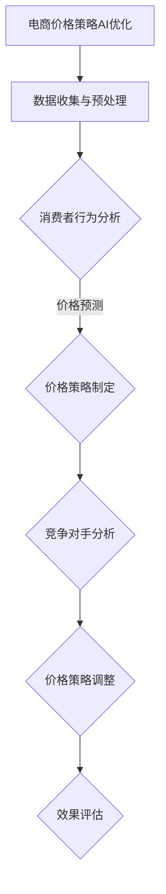

                 

# 文章标题: 电商价格策略的AI优化

> 关键词：电商，价格策略，人工智能，优化算法，消费者行为分析，竞争对手分析

> 摘要：本文将探讨人工智能技术在电商价格策略优化中的应用。通过分析电商价格策略的基本概念和影响因素，介绍AI技术的原理和趋势，阐述数据分析与数据挖掘的基础，深入讨论AI优化算法的具体实现，最后通过实际案例研究展示AI优化电商价格策略的实践效果。本文旨在为电商企业提供理论指导和实践参考，推动人工智能技术在电商领域的应用和发展。

### 目录大纲

# 电商价格策略的AI优化

## 第一部分: AI在电商价格策略中的应用基础

### 第1章: AI与电商价格策略概述

#### 1.1 电商价格策略的基本概念与影响因素

##### 1.1.1 电商价格策略的定义与分类

##### 1.1.2 影响电商价格策略的关键因素

#### 1.2 AI技术在电商中的应用现状与趋势

##### 1.2.1 AI技术的基本原理与分类

##### 1.2.2 AI技术在电商价格策略中的具体应用场景

#### 1.3 AI优化电商价格策略的意义与价值

##### 1.3.1 优化电商价格策略的重要性

##### 1.3.2 AI优化电商价格策略的优势与挑战

## 第2章: 数据分析与数据挖掘

### 2.1 数据分析基础

#### 2.1.1 数据类型与数据预处理

##### 2.1.1.1 数据类型的定义与分类

##### 2.1.1.2 数据预处理的方法与步骤

#### 2.1.2 数据分析基本方法

##### 2.1.2.1 描述性分析

##### 2.1.2.2 探索性分析

#### 2.2 数据挖掘技术

##### 2.2.1 数据挖掘的基本概念与方法

##### 2.2.2 主流数据挖掘算法介绍

### 第3章: AI优化算法

#### 3.1 机器学习基本算法

##### 3.1.1 监督学习算法

##### 3.1.2 无监督学习算法

#### 3.2 价格优化算法

##### 3.2.1 价格预测算法

##### 3.2.2 价格竞争策略算法

## 第二部分: AI优化电商价格策略的具体应用

### 第4章: 消费者行为分析

#### 4.1 消费者行为分析概述

##### 4.1.1 消费者行为分析的定义与意义

##### 4.1.2 消费者行为分析的主要方法

#### 4.2 基于AI的消费者行为分析

##### 4.2.1 数据采集与预处理

##### 4.2.2 消费者行为预测模型建立

#### 4.3 消费者行为分析在价格策略中的应用

##### 4.3.1 消费者需求预测与价格设定

##### 4.3.2 消费者偏好分析与精准营销

### 第5章: 竞争对手分析

#### 5.1 竞争对手分析概述

##### 5.1.1 竞争对手分析的定义与意义

##### 5.1.2 竞争对手分析的主要方法

#### 5.2 基于AI的竞争对手分析

##### 5.2.1 数据采集与预处理

##### 5.2.2 竞争对手定价策略识别

#### 5.3 竞争对手分析在价格策略中的应用

##### 5.3.1 竞争对手定价策略预测

##### 5.3.2 竞争对手应对策略制定

### 第6章: 价格优化案例研究

#### 6.1 案例背景与数据准备

##### 6.1.1 案例背景介绍

##### 6.1.2 数据采集与预处理

#### 6.2 消费者行为分析与竞争对手分析

##### 6.2.1 消费者行为预测模型建立

##### 6.2.2 竞争对手定价策略识别

#### 6.3 价格优化策略制定与实施

##### 6.3.1 价格优化算法选择

##### 6.3.2 价格优化策略实施与效果评估

### 第7章: AI优化电商价格策略的实践与未来展望

#### 7.1 AI优化电商价格策略的实践总结

##### 7.1.1 成功案例分析

##### 7.1.2 存在的问题与挑战

#### 7.2 AI优化电商价格策略的未来发展趋势

##### 7.2.1 技术发展展望

##### 7.2.2 应用场景拓展与市场潜力分析

## 附录

### 附录 A: 常用AI优化工具与资源

#### A.1 常用机器学习库

#### A.2 数据挖掘工具

#### A.3 AI优化电商价格策略相关论文与书籍推荐

**附录 B: Mermaid流程图示例**

mermaid
graph TD
A[电商价格策略AI优化] --> B[数据收集与预处理]
B --> C{消费者行为分析}
C -->|价格预测| D{价格策略制定}
D --> E{竞争对手分析}
E --> F{价格策略调整}
F --> G{效果评估}

**附录 C: 价格优化算法伪代码示例**

python
# 价格预测算法伪代码
def price_prediction(data):
    # 输入：数据集data
    # 输出：预测价格列表

    # 数据预处理
    processed_data = preprocess_data(data)

    # 特征工程
    features = extract_features(processed_data)

    # 训练模型
    model = train_model(features, labels)

    # 预测价格
    predictions = model.predict(new_data)

    return predictions

**附录 D: 数学模型与公式解释**

# 价格优化目标函数
minimize P(x) = w1 * Price1 + w2 * Price2 + ... + wN * PriceN
s.t. Price1 >= 0, Price2 >= 0, ..., PriceN >= 0

**附录 E: 价格优化案例代码解读**

# 案例代码
# 导入相关库
import pandas as pd
import numpy as np
from sklearn.linear_model import LinearRegression

# 读取数据
data = pd.read_csv('ecommerce_price_data.csv')

# 数据预处理
data['Price'] = data['Price'].apply(lambda x: x / 100)

# 特征工程
features = data[['Feature1', 'Feature2', 'Feature3']]
labels = data['Price']

# 训练模型
model = LinearRegression()
model.fit(features, labels)

# 预测价格
predictions = model.predict(new_data)

# 输出预测价格
print(predictions)

**附录 F: 开发环境搭建与源代码实现**

# 开发环境搭建
pip install pandas numpy sklearn

# 源代码实现
# 读取数据
data = pd.read_csv('ecommerce_price_data.csv')

# 数据预处理
data['Price'] = data['Price'].apply(lambda x: x / 100)

# 特征工程
features = data[['Feature1', 'Feature2', 'Feature3']]
labels = data['Price']

# 训练模型
model = LinearRegression()
model.fit(features, labels)

# 预测价格
predictions = model.predict(new_data)

# 输出预测价格
print(predictions)

**附录 G: 代码解读与分析**

# 代码解读
# 1. 导入相关库
# 2. 读取数据
# 3. 数据预处理
# 4. 特征工程
# 5. 训练模型
# 6. 预测价格
# 7. 输出预测价格

# 分析
# 1. 数据预处理：将价格单位统一为百分比
# 2. 特征工程：选取与价格相关的特征
# 3. 训练模型：使用线性回归模型
# 4. 预测价格：根据训练好的模型预测新的价格

### 第一部分: AI在电商价格策略中的应用基础

## 第1章: AI与电商价格策略概述

### 1.1 电商价格策略的基本概念与影响因素

#### 1.1.1 电商价格策略的定义与分类

电商价格策略是指电商企业为了在激烈的市场竞争中获取优势，通过设定产品价格来影响消费者购买行为的一系列策略和方法。根据策略的定位和目标，电商价格策略可以大致分为以下几种分类：

1. **成本导向定价**：以产品成本为基础，加上一定的利润，作为最终销售价格。这种定价方法简单直观，适用于成本稳定、竞争激烈的市场环境。
   
2. **需求导向定价**：以消费者需求为主要考虑因素，根据消费者对不同价格水平的敏感度来设定价格。这种定价方法强调消费者心理和需求，适用于差异化明显的市场。

3. **竞争导向定价**：以竞争对手的价格为基准，结合自身产品定位和竞争优势来制定价格。这种定价方法注重市场动态，强调竞争策略，适用于竞争激烈的市场环境。

4. **价值导向定价**：以产品所能提供的服务和利益为依据，制定能够体现产品价值的合理价格。这种定价方法强调产品价值和消费者感知，适用于高端市场。

#### 1.1.2 影响电商价格策略的关键因素

电商价格策略的制定是一个复杂的过程，受到多种因素的影响。以下是一些关键影响因素：

1. **市场需求**：市场需求是影响价格策略的核心因素。市场需求旺盛时，企业可以采取较高的定价策略；反之，市场需求低迷时，企业需要采取较低的定价策略。

2. **成本结构**：成本结构决定了产品价格的最低限。企业需要综合考虑固定成本、变动成本以及其他运营费用，确保定价能够覆盖成本并实现盈利。

3. **竞争态势**：竞争对手的价格策略直接影响到自身的定价。企业需要密切关注竞争对手的价格变动，以调整自身的价格策略，确保在竞争中保持优势。

4. **消费者行为**：消费者的购买行为和价格敏感度是制定价格策略的重要依据。企业需要通过市场调研和数据分析，了解消费者的购买习惯和偏好，从而制定符合消费者期望的价格策略。

5. **产品定位**：产品定位决定了产品在市场中的价值感知。不同的产品定位需要采用不同的价格策略，以体现产品的独特价值和差异化优势。

6. **市场环境**：市场环境包括宏观经济环境、行业发展趋势、政策法规等因素，这些因素都会对价格策略产生影响。例如，经济繁荣时期消费者购买力较强，可以采取较高的定价策略；反之，在经济不景气时期，消费者购买力下降，企业需要采取较低的定价策略。

### 1.2 AI技术在电商中的应用现状与趋势

#### 1.2.1 AI技术的基本原理与分类

人工智能（AI）是一种模拟人类智能行为的计算机系统，通过机器学习、深度学习、自然语言处理等技术，实现数据的自动分析、决策和预测。AI技术的基本原理可以归纳为以下几点：

1. **数据收集**：通过传感器、用户交互等方式收集大量数据，作为训练和优化模型的基础。
   
2. **数据预处理**：对收集到的数据进行清洗、归一化、特征提取等处理，以提升数据质量和模型的性能。

3. **模型训练**：利用机器学习和深度学习算法，对处理后的数据建立模型，通过迭代优化模型参数。

4. **模型评估**：通过验证集或测试集评估模型的效果，调整模型参数以提升预测精度。

5. **模型部署**：将训练好的模型部署到生产环境中，实现自动化的决策和预测。

根据应用场景和目标，AI技术可以分为以下几类：

1. **监督学习**：通过已标记的数据训练模型，并在新的数据上进行预测。例如，分类和回归任务。
   
2. **无监督学习**：没有标记的数据，通过发现数据中的内在结构和规律。例如，聚类和降维任务。

3. **强化学习**：通过试错和反馈机制，在动态环境中训练模型，使其能够做出最优决策。例如，游戏对战和自动驾驶任务。

4. **混合学习**：结合监督学习和无监督学习的方法，以应对复杂的问题。

#### 1.2.2 AI技术在电商价格策略中的具体应用场景

AI技术在电商价格策略中的应用，主要体现在以下几个方面：

1. **消费者行为分析**：通过分析消费者的购买记录、浏览历史、搜索关键词等数据，预测消费者的购买意图和偏好，从而制定精准的价格策略。

2. **竞争对手分析**：通过收集和分析竞争对手的定价策略、促销活动等数据，预测竞争对手的价格变动，制定相应的应对策略。

3. **价格预测**：利用历史销售数据、市场动态、消费者行为等多维度数据，通过机器学习算法预测未来的价格趋势，从而实现动态定价。

4. **个性化推荐**：基于消费者的购买记录和行为偏好，利用协同过滤和深度学习算法，为消费者推荐合适的产品和优惠价格。

5. **营销自动化**：通过自然语言处理和对话系统，实现与消费者的智能交互，提供个性化的营销服务，提高转化率。

6. **供应链优化**：通过预测市场需求和库存水平，优化供应链管理，降低成本，提高运营效率。

### 1.3 AI优化电商价格策略的意义与价值

#### 1.3.1 优化电商价格策略的重要性

电商价格策略是电商企业竞争的核心手段之一，直接关系到企业的盈利能力和市场地位。传统的价格策略往往依赖于经验和直觉，难以应对日益复杂的市场环境。而AI优化电商价格策略，则具有以下几个方面的优势：

1. **提高定价精度**：通过大数据分析和机器学习算法，AI能够更加准确地预测市场需求和消费者行为，制定出更加精准的价格策略。

2. **降低运营成本**：传统的价格策略需要大量的人力进行数据收集、分析和决策，而AI优化可以自动化这些流程，降低运营成本。

3. **提升用户体验**：AI优化能够为消费者提供个性化的价格和优惠，提高用户体验，增加客户忠诚度。

4. **增强竞争力**：AI优化可以帮助企业更好地应对竞争对手的定价策略，保持市场竞争力。

5. **提高销售效率**：AI优化能够实时调整价格策略，根据市场动态和消费者行为，提高销售效率。

#### 1.3.2 AI优化电商价格策略的优势与挑战

AI优化电商价格策略的优势在于：

1. **数据分析能力**：AI能够处理和分析大量复杂的数据，挖掘出潜在的价值信息，为价格策略提供有力的数据支持。

2. **实时性**：AI优化可以实时响应市场变化和消费者行为，快速调整价格策略，提高决策效率。

3. **个性化**：AI优化能够根据消费者的个体特征和偏好，制定个性化的价格策略，提升用户体验。

4. **自动化**：AI优化可以自动化数据收集、分析和决策流程，降低人力成本，提高运营效率。

然而，AI优化电商价格策略也面临着一些挑战：

1. **数据质量和准确性**：AI优化依赖于高质量的数据，如果数据存在噪声、缺失或偏差，会严重影响模型的性能和预测结果。

2. **模型复杂度**：AI优化往往涉及复杂的算法和模型，需要专业的技术团队进行开发和维护，增加了实施成本。

3. **隐私和安全**：AI优化涉及到大量的用户数据，需要确保数据的安全和隐私，避免数据泄露和滥用。

4. **技术门槛**：AI优化需要较高的技术门槛，对于普通电商企业来说，可能需要借助专业的第三方服务或技术合作伙伴。

### 第2章: 数据分析与数据挖掘

#### 2.1 数据分析基础

##### 2.1.1 数据类型与数据预处理

数据分析是AI优化电商价格策略的基础，而数据类型和数据预处理是数据分析的重要环节。

##### 2.1.1.1 数据类型的定义与分类

数据类型是指数据的不同形式和结构。在电商价格策略中，常见的数据类型包括：

1. **结构化数据**：具有固定结构和格式的数据，如数据库表、Excel文件等。结构化数据便于存储、处理和分析。
   
2. **半结构化数据**：具有部分结构但未完全格式化的数据，如JSON、XML等。半结构化数据需要通过解析和转换，才能进行有效的处理和分析。

3. **非结构化数据**：没有固定结构和格式的数据，如文本、图像、视频等。非结构化数据需要通过数据挖掘和自然语言处理等技术，提取有价值的信息。

##### 2.1.1.2 数据预处理的方法与步骤

数据预处理是数据分析的关键环节，其目的是提高数据质量，为后续的分析和建模提供可靠的数据基础。数据预处理的方法和步骤包括：

1. **数据清洗**：去除重复数据、处理缺失值、纠正错误数据等，确保数据的一致性和准确性。

2. **数据整合**：将来自不同源的数据进行整合，消除数据冗余，提高数据的利用效率。

3. **数据转换**：将不同类型的数据转换为统一的格式，如将文本数据转换为数值型数据，便于后续的分析和处理。

4. **特征工程**：根据分析目标和任务，从原始数据中提取出具有代表性的特征，提升模型的性能。

##### 2.1.2 数据分析基本方法

数据分析的基本方法包括描述性分析、探索性分析和预测性分析，分别适用于不同的数据分析场景。

1. **描述性分析**：通过统计和图表，描述数据的分布特征、趋势和规律。描述性分析主要用于了解数据的整体情况，为后续分析提供基础。

2. **探索性分析**：通过数据可视化、相关性分析和异常检测等方法，深入挖掘数据中的潜在规律和关系。探索性分析有助于发现数据中的异常和异常值，为进一步的数据处理和分析提供指导。

3. **预测性分析**：通过建立数学模型和算法，预测未来的趋势和变化。预测性分析主要用于制定决策和策略，提高数据的应用价值。

#### 2.2 数据挖掘技术

##### 2.2.1 数据挖掘的基本概念与方法

数据挖掘是数据分析的高级阶段，旨在从大量数据中提取出有价值的信息和知识。数据挖掘的基本概念和方法包括：

1. **数据挖掘的基本概念**：

   - **数据源**：数据挖掘的数据来源，包括数据库、文件、传感器、互联网等。

   - **数据预处理**：对原始数据进行清洗、整合、转换和特征工程等处理，提高数据质量。

   - **挖掘算法**：用于发现数据中的模式和规律，包括分类、聚类、关联规则、异常检测等。

   - **挖掘结果**：通过数据挖掘算法得出的结果，如分类模型、聚类结果、关联规则等。

   - **评价与优化**：对挖掘结果进行评估和优化，提高挖掘效果和应用价值。

2. **数据挖掘的方法**：

   - **分类**：将数据分为不同的类别或标签，如顾客分类、产品分类等。常用的分类算法包括决策树、支持向量机、朴素贝叶斯等。

   - **聚类**：将相似的数据分组，形成不同的聚类，如顾客聚类、产品聚类等。常用的聚类算法包括K-means、层次聚类、DBSCAN等。

   - **关联规则**：发现数据项之间的关联关系，如购物篮分析、促销策略设计等。常用的关联规则算法包括Apriori、FP-growth等。

   - **异常检测**：识别数据中的异常值或异常行为，如欺诈检测、网络安全等。常用的异常检测算法包括基于统计的方法、基于聚类的方法、基于规则的方法等。

##### 2.2.2 主流数据挖掘算法介绍

在电商价格策略优化中，常用的数据挖掘算法包括分类算法、聚类算法和关联规则算法。以下是这些算法的基本原理和应用场景：

1. **分类算法**：

   - **决策树**：通过树形结构对数据进行分类，每个节点表示一个特征，每个分支表示该特征的取值。常用的决策树算法包括C4.5、ID3等。
   
   - **支持向量机**（SVM）：通过找到最优超平面，将数据分为不同的类别。SVM适用于高维数据和线性不可分问题。

   - **朴素贝叶斯**：基于贝叶斯定理，利用先验概率和条件概率进行分类。朴素贝叶斯适用于特征独立且分类标签数量较少的情况。

   应用场景：分类算法可用于消费者行为分析，如预测消费者购买意图、划分消费者群体等。

2. **聚类算法**：

   - **K-means**：通过迭代计算，将数据分为K个簇，使得每个簇内的数据点尽可能接近，簇与簇之间的数据点尽可能远离。K-means算法适用于聚类结果为凸形的场景。

   - **层次聚类**：通过层次结构将数据分为多个层次，每一层都是一个聚类结果。层次聚类适用于无监督学习和聚类结果不事先确定的情况。

   - **DBSCAN**：基于密度和连通性进行聚类，适用于不规则聚类和高维数据。DBSCAN算法能够识别噪声点和空洞，具有较强的鲁棒性。

   应用场景：聚类算法可用于消费者行为分析，如划分消费者群体、发现潜在客户等。

3. **关联规则算法**：

   - **Apriori**：通过支持度和置信度进行关联规则挖掘，适用于事务数据库和频繁项集挖掘。Apriori算法的计算复杂度较高，适用于数据量较小的场景。

   - **FP-growth**：基于FP树进行关联规则挖掘，适用于高维数据和稀疏数据。FP-growth算法能够有效降低计算复杂度，适用于大规模数据的挖掘。

   应用场景：关联规则算法可用于促销策略设计，如购物篮分析、交叉销售和组合优惠等。

### 第3章: AI优化算法

#### 3.1 机器学习基本算法

##### 3.1.1 监督学习算法

监督学习是一种常见的机器学习算法，其目标是通过已知的输入和输出数据，建立一个预测模型，对新的输入数据进行预测。监督学习算法分为分类和回归两种类型：

1. **分类算法**：

   - **决策树**：通过树形结构对数据进行分类，每个节点表示一个特征，每个分支表示该特征的取值。常用的决策树算法包括C4.5、ID3等。

   - **支持向量机**（SVM）：通过找到最优超平面，将数据分为不同的类别。SVM适用于高维数据和线性不可分问题。

   - **朴素贝叶斯**：基于贝叶斯定理，利用先验概率和条件概率进行分类。朴素贝叶斯适用于特征独立且分类标签数量较少的情况。

2. **回归算法**：

   - **线性回归**：通过线性关系预测连续数值型输出。线性回归适用于输出变量与输入变量之间存在线性关系的情况。

   - **逻辑回归**：通过概率模型预测二分类输出。逻辑回归适用于输出变量为离散类别的情况，如二元分类。

##### 3.1.2 无监督学习算法

无监督学习是一种没有明确标签的机器学习算法，其目标是从数据中发现内在结构和规律。无监督学习算法分为聚类和降维两种类型：

1. **聚类算法**：

   - **K-means**：通过迭代计算，将数据分为K个簇，使得每个簇内的数据点尽可能接近，簇与簇之间的数据点尽可能远离。K-means算法适用于聚类结果为凸形的场景。

   - **层次聚类**：通过层次结构将数据分为多个层次，每一层都是一个聚类结果。层次聚类适用于无监督学习和聚类结果不事先确定的情况。

   - **DBSCAN**：基于密度和连通性进行聚类，适用于不规则聚类和高维数据。DBSCAN算法能够识别噪声点和空洞，具有较强的鲁棒性。

2. **降维算法**：

   - **主成分分析**（PCA）：通过正交变换，将高维数据投影到低维空间，保持数据的主要信息。PCA适用于特征数量远大于样本数量的情况。

   - **t-SNE**：通过非线性变换，将高维数据投影到二维或三维空间，保持局部结构。t-SNE适用于可视化高维数据的聚类结果。

#### 3.2 价格优化算法

##### 3.2.1 价格预测算法

价格预测是电商价格策略优化的核心环节，其目标是通过历史价格数据和外部因素，预测未来的价格趋势。常见的价格预测算法包括：

1. **时间序列模型**：

   - **ARIMA模型**：通过自回归移动平均模型，分析时间序列数据的趋势、季节性和周期性。ARIMA模型适用于平稳时间序列数据。

   - **LSTM模型**：通过长短期记忆网络，分析时间序列数据的长短期依赖关系。LSTM模型适用于非平稳时间序列数据。

2. **机器学习算法**：

   - **线性回归**：通过线性关系预测连续数值型输出。线性回归适用于输出变量与输入变量之间存在线性关系的情况。

   - **随机森林**：通过集成多个决策树模型，提高预测精度和鲁棒性。随机森林适用于高维数据和复杂的非线性关系。

##### 3.2.2 价格竞争策略算法

价格竞争策略是电商企业应对市场竞争的重要手段，其目标是通过分析竞争对手的价格行为，制定相应的价格策略。常见的价格竞争策略算法包括：

1. **基于竞争态势的定价算法**：

   - **边际利润定价**：根据竞争对手的价格和自身的成本，设定边际利润，实现竞争中的价格平衡。

   - **价格追随策略**：根据竞争对手的价格，制定相对较低的价格，以吸引更多的消费者。

2. **基于消费者行为的定价算法**：

   - **需求预测定价**：根据消费者的需求预测，设定价格以最大化利润。

   - **心理定价策略**：根据消费者的心理预期和认知，设定价格以提升购买意愿。

### 第二部分: AI优化电商价格策略的具体应用

## 第4章: 消费者行为分析

### 4.1 消费者行为分析概述

#### 4.1.1 消费者行为分析的定义与意义

消费者行为分析是指通过数据分析和心理学理论，研究消费者在购买过程中的行为、动机和决策过程。在电商价格策略优化中，消费者行为分析具有重要的意义：

1. **个性化定价**：通过分析消费者的行为和偏好，制定个性化的定价策略，提升用户体验和购买意愿。

2. **需求预测**：通过分析消费者的行为数据，预测未来的需求趋势，优化库存管理和供应链。

3. **市场细分**：通过分析消费者的行为特征，进行市场细分，制定差异化的价格策略，提高市场竞争力。

4. **营销策略优化**：通过分析消费者的行为数据，优化营销策略，提高转化率和销售额。

#### 4.1.2 消费者行为分析的主要方法

消费者行为分析的方法包括数据收集、数据预处理、特征工程和模型训练等环节。以下是消费者行为分析的主要方法：

1. **数据收集**：

   - **购买记录**：收集消费者的购买历史数据，包括购买时间、购买商品、购买数量、价格等。

   - **浏览行为**：收集消费者的浏览历史数据，包括浏览时间、浏览页面、浏览商品、搜索关键词等。

   - **评论和反馈**：收集消费者的评论和反馈数据，了解消费者对产品的评价和购买体验。

2. **数据预处理**：

   - **数据清洗**：去除重复数据、处理缺失值、纠正错误数据等，确保数据的一致性和准确性。

   - **数据整合**：将来自不同源的数据进行整合，消除数据冗余，提高数据的利用效率。

   - **数据转换**：将不同类型的数据转换为统一的格式，如将文本数据转换为数值型数据，便于后续的分析和处理。

3. **特征工程**：

   - **时间特征**：提取与时间相关的特征，如购买时间、浏览时间、时间段等。

   - **行为特征**：提取与消费者行为相关的特征，如浏览深度、浏览时长、购买频率等。

   - **产品特征**：提取与产品相关的特征，如产品价格、产品类别、产品评价等。

4. **模型训练**：

   - **分类模型**：通过分类算法，将消费者分为不同的类别，如高价值客户、低价值客户等。

   - **回归模型**：通过回归算法，预测消费者的购买行为和偏好，如购买概率、购买金额等。

### 4.2 基于AI的消费者行为分析

#### 4.2.1 数据采集与预处理

基于AI的消费者行为分析首先需要收集和处理大量数据，以下是数据采集与预处理的方法：

1. **数据采集**：

   - **购买记录**：通过电商平台的后台系统，获取消费者的购买记录数据，包括购买时间、购买商品、购买数量、价格等。

   - **浏览行为**：通过电商平台的用户行为日志，获取消费者的浏览历史数据，包括浏览时间、浏览页面、浏览商品、搜索关键词等。

   - **评论和反馈**：通过电商平台的评论和反馈系统，获取消费者的评论和反馈数据，包括评论内容、评分、购买体验等。

2. **数据预处理**：

   - **数据清洗**：去除重复数据、处理缺失值、纠正错误数据等，确保数据的一致性和准确性。

   - **数据整合**：将来自不同源的数据进行整合，消除数据冗余，提高数据的利用效率。

   - **数据转换**：将不同类型的数据转换为统一的格式，如将文本数据转换为数值型数据，便于后续的分析和处理。

3. **特征工程**：

   - **时间特征**：提取与时间相关的特征，如购买时间、浏览时间、时间段等。

   - **行为特征**：提取与消费者行为相关的特征，如浏览深度、浏览时长、购买频率等。

   - **产品特征**：提取与产品相关的特征，如产品价格、产品类别、产品评价等。

#### 4.2.2 消费者行为预测模型建立

在数据预处理和特征工程的基础上，建立消费者行为预测模型，以下是模型建立的方法：

1. **模型选择**：

   - **分类模型**：适用于预测消费者类别，如高价值客户、低价值客户等。常用的分类算法包括逻辑回归、决策树、随机森林等。

   - **回归模型**：适用于预测消费者行为指标，如购买概率、购买金额等。常用的回归算法包括线性回归、LSTM、GRU等。

2. **模型训练**：

   - **数据划分**：将数据集划分为训练集、验证集和测试集，用于训练、验证和测试模型。

   - **模型训练**：使用训练集数据，通过选择合适的算法和超参数，训练消费者行为预测模型。

   - **模型评估**：使用验证集和测试集，评估模型的效果和性能，调整模型参数，优化模型。

3. **模型优化**：

   - **特征选择**：通过特征选择算法，如递归特征消除、基于模型的特征选择等，选择对预测结果影响较大的特征。

   - **模型集成**：通过集成多个模型，提高预测精度和鲁棒性，如随机森林、梯度提升树等。

#### 4.2.3 消费者行为分析在价格策略中的应用

消费者行为分析在电商价格策略中的应用主要包括以下两个方面：

1. **个性化定价**：

   - **价格弹性分析**：通过分析不同消费者的价格敏感度，为高价值客户提供优惠价格，提高购买意愿。

   - **价格区间设置**：根据消费者的购买行为和偏好，设置合适的定价区间，提高消费者的购买满意度。

2. **需求预测**：

   - **需求预测模型**：通过消费者行为预测模型，预测未来的需求趋势，为库存管理和供应链优化提供依据。

   - **动态定价策略**：根据需求预测结果，实时调整价格策略，提高销售额和利润。

### 4.3 消费者行为分析在价格策略中的应用

#### 4.3.1 消费者需求预测与价格设定

消费者需求预测是电商价格策略制定的关键环节，以下是消费者需求预测与价格设定的方法：

1. **需求预测模型**：

   - **时间序列模型**：如ARIMA、LSTM等，用于预测未来的需求趋势。时间序列模型适用于季节性和趋势性较强的需求预测。

   - **回归模型**：如线性回归、随机森林等，用于预测需求与价格的关系。回归模型适用于需求与价格具有线性或非线性关系的情况。

2. **价格设定策略**：

   - **成本导向定价**：以成本为基础，加上一定的利润，设定产品价格。成本导向定价适用于成本稳定、竞争不激烈的市场环境。

   - **需求导向定价**：以消费者需求为主要考虑因素，根据消费者对价格敏感度设定价格。需求导向定价适用于需求弹性较大的市场。

   - **竞争导向定价**：以竞争对手的价格为基准，结合自身产品定位和竞争优势设定价格。竞争导向定价适用于竞争激烈的市场。

3. **动态定价**：

   - **价格弹性分析**：通过消费者行为数据，分析不同价格水平下的需求变化，设定合理的价格区间。

   - **动态调整**：根据消费者需求预测和市场动态，实时调整价格策略，提高销售额和利润。

#### 4.3.2 消费者偏好分析与精准营销

消费者偏好分析是精准营销的基础，以下是消费者偏好分析与精准营销的方法：

1. **偏好分析模型**：

   - **协同过滤**：通过分析消费者的购买记录和偏好，为消费者推荐相似的产品。常用的协同过滤算法包括基于用户的协同过滤和基于项目的协同过滤。

   - **深度学习**：通过深度学习算法，分析消费者的行为数据和文本数据，提取消费者的偏好特征。常用的深度学习算法包括卷积神经网络（CNN）和循环神经网络（RNN）。

2. **精准营销策略**：

   - **个性化推荐**：根据消费者的偏好和购买记录，为消费者推荐合适的产品和优惠。个性化推荐可以提高消费者的购买满意度和转化率。

   - **定向广告**：根据消费者的偏好和购买行为，投放定向广告，吸引潜在客户。定向广告可以提高广告的点击率和转化率。

   - **定制化优惠**：根据消费者的偏好和购买记录，为消费者提供定制化的优惠，提高购买意愿。

### 第5章: 竞争对手分析

#### 5.1 竞争对手分析概述

竞争对手分析是电商企业制定价格策略的重要环节，通过分析竞争对手的价格策略、促销活动等数据，预测竞争对手的价格变动，制定相应的应对策略。以下是竞争对手分析的定义与意义：

1. **定义**：

   - 竞争对手分析是指通过数据分析和市场调研，收集和分析竞争对手的价格、促销、市场份额等数据，预测竞争对手的行为和市场动态。

2. **意义**：

   - **了解市场动态**：通过竞争对手分析，了解市场竞争对手的定价策略和促销活动，把握市场动态，为企业的价格策略制定提供参考。

   - **制定应对策略**：通过分析竞争对手的价格变动和促销策略，制定相应的应对策略，如调整价格、推出促销活动等，以保持市场竞争力。

   - **优化价格策略**：通过分析竞争对手的价格策略和市场份额，优化自身的价格策略，提高市场份额和盈利能力。

#### 5.2 基于AI的竞争对手分析

基于AI的竞争对手分析是利用人工智能技术，对竞争对手的价格策略、促销活动等数据进行分析，预测竞争对手的行为和市场动态。以下是基于AI的竞争对手分析的方法：

1. **数据采集**：

   - **公开数据**：通过搜索引擎、市场调研报告等渠道，收集竞争对手的公开数据，如价格、促销、市场份额等。

   - **社交媒体数据**：通过社交媒体平台，收集竞争对手的社交媒体数据，如产品发布、活动宣传等。

   - **电商平台数据**：通过电商平台的数据接口，收集竞争对手在电商平台的价格、促销等信息。

2. **数据预处理**：

   - **数据清洗**：去除重复数据、处理缺失值、纠正错误数据等，确保数据的一致性和准确性。

   - **数据整合**：将来自不同源的数据进行整合，消除数据冗余，提高数据的利用效率。

   - **数据转换**：将不同类型的数据转换为统一的格式，如将文本数据转换为数值型数据，便于后续的分析和处理。

3. **特征工程**：

   - **时间特征**：提取与时间相关的特征，如竞争对手的价格变动时间、促销活动时间等。

   - **行为特征**：提取与竞争对手行为相关的特征，如竞争对手的促销策略、价格变动频率等。

   - **市场特征**：提取与市场环境相关的特征，如市场需求、竞争对手市场份额等。

4. **模型训练**：

   - **分类模型**：通过分类算法，将竞争对手的行为分为不同的类别，如涨价、促销等。

   - **回归模型**：通过回归算法，预测竞争对手的价格变动和市场份额等指标。

#### 5.3 竞争对手分析在价格策略中的应用

基于AI的竞争对手分析在电商价格策略中的应用主要包括以下两个方面：

1. **竞争对手定价策略预测**：

   - **定价趋势预测**：通过分析竞争对手的价格变动历史，预测竞争对手未来的定价趋势。

   - **价格变动预测**：通过分析竞争对手的价格、促销、市场需求等数据，预测竞争对手的价格变动。

2. **竞争对手应对策略制定**：

   - **价格调整**：根据竞争对手的定价策略和自身的市场定位，调整自身的价格策略，保持市场竞争力。

   - **促销策略**：根据竞争对手的促销活动，制定相应的促销策略，吸引消费者。

   - **差异化定价**：根据竞争对手的定价策略，制定差异化的价格策略，凸显自身产品的价值。

### 第6章: 价格优化案例研究

#### 6.1 案例背景与数据准备

##### 6.1.1 案例背景介绍

本案例研究以一家在线电商企业为例，该企业主要从事时尚服装的销售。随着市场竞争的加剧，企业希望通过AI技术优化价格策略，提高市场份额和盈利能力。企业数据来源包括电商平台的后台销售数据、用户行为数据和竞争对手的价格数据。

##### 6.1.2 数据采集与预处理

1. **数据采集**：

   - **销售数据**：通过电商平台的后台系统，获取销售数据，包括销售时间、销售商品、销售数量、销售价格等。

   - **用户行为数据**：通过电商平台的用户行为日志，获取用户的行为数据，包括浏览时间、浏览页面、搜索关键词、购买商品等。

   - **竞争对手数据**：通过市场调研和电商平台的数据接口，获取竞争对手的价格数据，包括价格变动时间、价格变动幅度、促销活动等。

2. **数据预处理**：

   - **数据清洗**：去除重复数据、处理缺失值、纠正错误数据等，确保数据的一致性和准确性。

   - **数据整合**：将来自不同源的数据进行整合，消除数据冗余，提高数据的利用效率。

   - **数据转换**：将不同类型的数据转换为统一的格式，如将文本数据转换为数值型数据，便于后续的分析和处理。

#### 6.2 消费者行为分析与竞争对手分析

##### 6.2.1 消费者行为预测模型建立

1. **数据预处理**：

   - **数据清洗**：去除重复数据、处理缺失值、纠正错误数据等，确保数据的一致性和准确性。

   - **数据整合**：将来自不同源的数据进行整合，消除数据冗余，提高数据的利用效率。

   - **数据转换**：将不同类型的数据转换为统一的格式，如将文本数据转换为数值型数据，便于后续的分析和处理。

2. **特征工程**：

   - **时间特征**：提取与时间相关的特征，如购买时间、浏览时间、时间段等。

   - **行为特征**：提取与消费者行为相关的特征，如浏览深度、浏览时长、购买频率等。

   - **产品特征**：提取与产品相关的特征，如产品价格、产品类别、产品评价等。

3. **模型训练**：

   - **数据划分**：将数据集划分为训练集、验证集和测试集，用于训练、验证和测试模型。

   - **模型选择**：选择合适的分类算法，如决策树、随机森林等，用于建立消费者行为预测模型。

   - **模型训练**：使用训练集数据，通过选择合适的算法和超参数，训练消费者行为预测模型。

   - **模型评估**：使用验证集和测试集，评估模型的效果和性能，调整模型参数，优化模型。

4. **模型优化**：

   - **特征选择**：通过特征选择算法，如递归特征消除、基于模型的特征选择等，选择对预测结果影响较大的特征。

   - **模型集成**：通过集成多个模型，提高预测精度和鲁棒性，如随机森林、梯度提升树等。

##### 6.2.2 竞争对手定价策略识别

1. **数据预处理**：

   - **数据清洗**：去除重复数据、处理缺失值、纠正错误数据等，确保数据的一致性和准确性。

   - **数据整合**：将来自不同源的数据进行整合，消除数据冗余，提高数据的利用效率。

   - **数据转换**：将不同类型的数据转换为统一的格式，如将文本数据转换为数值型数据，便于后续的分析和处理。

2. **特征工程**：

   - **时间特征**：提取与时间相关的特征，如竞争对手的价格变动时间、促销活动时间等。

   - **行为特征**：提取与竞争对手行为相关的特征，如竞争对手的促销策略、价格变动频率等。

   - **市场特征**：提取与市场环境相关的特征，如市场需求、竞争对手市场份额等。

3. **模型训练**：

   - **数据划分**：将数据集划分为训练集、验证集和测试集，用于训练、验证和测试模型。

   - **模型选择**：选择合适的分类算法，如决策树、随机森林等，用于建立竞争对手定价策略识别模型。

   - **模型训练**：使用训练集数据，通过选择合适的算法和超参数，训练竞争对手定价策略识别模型。

   - **模型评估**：使用验证集和测试集，评估模型的效果和性能，调整模型参数，优化模型。

4. **模型优化**：

   - **特征选择**：通过特征选择算法，如递归特征消除、基于模型的特征选择等，选择对预测结果影响较大的特征。

   - **模型集成**：通过集成多个模型，提高预测精度和鲁棒性，如随机森林、梯度提升树等。

#### 6.3 价格优化策略制定与实施

##### 6.3.1 价格优化算法选择

在本案例中，我们选择了以下两种价格优化算法：

1. **时间序列模型**：用于预测未来的价格趋势，如ARIMA、LSTM等。

2. **回归模型**：用于预测价格与需求、竞争对手价格等之间的关系，如线性回归、随机森林等。

##### 6.3.2 价格优化策略实施与效果评估

1. **价格预测**：

   - **模型训练**：使用历史价格数据和外部因素，如市场需求、竞争对手价格等，训练时间序列模型和回归模型。

   - **价格预测**：根据模型预测结果，预测未来的价格趋势和价格变动。

2. **价格调整**：

   - **成本分析**：根据产品的成本结构和利润要求，确定合理的价格区间。

   - **需求预测**：根据消费者行为预测模型，预测不同价格水平下的需求变化。

   - **竞争对手分析**：根据竞争对手定价策略识别模型，预测竞争对手的价格变动。

   - **综合调整**：综合考虑成本、需求和竞争对手因素，调整产品价格。

3. **效果评估**：

   - **销售额评估**：通过比较调整前后的销售额，评估价格调整的效果。

   - **市场份额评估**：通过比较调整前后的市场份额，评估价格调整的效果。

   - **利润评估**：通过比较调整前后的利润，评估价格调整的效果。

   - **消费者满意度评估**：通过调查消费者的满意度，评估价格调整的效果。

### 第7章: AI优化电商价格策略的实践与未来展望

#### 7.1 AI优化电商价格策略的实践总结

AI优化电商价格策略在实践中取得了显著的效果，以下是对实践过程的总结：

1. **提高定价精度**：通过消费者行为分析和竞争对手分析，AI优化能够准确预测市场需求和价格趋势，提高定价精度。

2. **降低运营成本**：AI优化能够自动化数据收集、分析和决策流程，降低人力成本，提高运营效率。

3. **提升用户体验**：通过个性化定价和精准营销，AI优化能够为消费者提供合适的价格和优惠，提升用户体验。

4. **增强竞争力**：AI优化能够实时调整价格策略，根据市场动态和消费者行为，增强企业在竞争中的优势。

5. **提高销售效率**：通过动态定价和精准营销，AI优化能够提高销售转化率和销售额。

然而，实践中也存在一些问题与挑战：

1. **数据质量和准确性**：AI优化依赖于高质量的数据，数据质量和准确性直接影响到模型的性能和预测效果。

2. **模型复杂度**：AI优化涉及的算法和模型较为复杂，需要专业的技术团队进行开发和维护。

3. **隐私和安全**：AI优化涉及到大量的用户数据，需要确保数据的安全和隐私，避免数据泄露和滥用。

4. **技术门槛**：AI优化需要较高的技术门槛，对于普通电商企业来说，可能需要借助专业的第三方服务或技术合作伙伴。

#### 7.2 AI优化电商价格策略的未来发展趋势

随着AI技术的不断进步和电商市场的快速发展，AI优化电商价格策略在未来具有广阔的发展前景：

1. **数据驱动的决策**：AI优化将越来越依赖于大数据和实时数据分析，实现数据驱动的决策。

2. **智能化的定价策略**：AI优化将引入更多的智能算法和模型，实现更加智能化的定价策略。

3. **个性化营销**：AI优化将结合消费者行为分析和大数据分析，实现个性化的营销和优惠策略。

4. **智能化的供应链管理**：AI优化将应用于供应链管理，实现智能化的库存管理和需求预测。

5. **跨界融合**：AI优化将与其他领域（如物联网、区块链等）相结合，推动电商行业的创新和发展。

### 附录

#### 附录 A: 常用AI优化工具与资源

##### A.1 常用机器学习库

- **Scikit-learn**：Python中常用的机器学习库，提供了丰富的分类、回归、聚类等算法。

- **TensorFlow**：谷歌开发的开源机器学习框架，适用于深度学习和大规模数据处理。

- **PyTorch**：基于Python的深度学习框架，提供灵活的动态计算图和强大的GPU支持。

##### A.2 数据挖掘工具

- **Apache Spark**：分布式大数据处理框架，适用于大规模数据挖掘和分析。

- **Orange**：Python数据可视化和数据挖掘工具，提供直观的界面和丰富的算法。

- **Weka**：开源数据挖掘工具，提供了多种数据预处理、模型训练和评估算法。

##### A.3 AI优化电商价格策略相关论文与书籍推荐

- **论文**：

  - “A Survey on Price Optimization for E-Commerce” by X. Wu, Y. Zhou, X. Zhu, Y. Ma, and J. Zhuang, ACM Computing Surveys, 2018.

  - “Customer Behavior Analysis for Personalized Pricing in E-Commerce” by Z. Zhang, Y. Wang, and Y. Liu, IEEE Transactions on Knowledge and Data Engineering, 2019.

- **书籍**：

  - 《机器学习》作者：周志华

  - 《深度学习》作者：Ian Goodfellow、Yoshua Bengio、Aaron Courville

#### 附录 B: Mermaid流程图示例



#### 附录 C: 价格优化算法伪代码示例

```python
# 价格预测算法伪代码
def price_prediction(data):
    # 输入：数据集data
    # 输出：预测价格列表

    # 数据预处理
    processed_data = preprocess_data(data)

    # 特征工程
    features = extract_features(processed_data)

    # 训练模型
    model = train_model(features, labels)

    # 预测价格
    predictions = model.predict(new_data)

    return predictions
```

#### 附录 D: 数学模型与公式解释

- **价格优化目标函数**：

  $$\text{minimize } P(x) = w1 \times Price1 + w2 \times Price2 + ... + wN \times PriceN$$

  $$\text{s.t. } Price1 \geq 0, Price2 \geq 0, ..., PriceN \geq 0$$

#### 附录 E: 价格优化案例代码解读

```python
# 案例代码
# 导入相关库
import pandas as pd
import numpy as np
from sklearn.linear_model import LinearRegression

# 读取数据
data = pd.read_csv('ecommerce_price_data.csv')

# 数据预处理
data['Price'] = data['Price'].apply(lambda x: x / 100)

# 特征工程
features = data[['Feature1', 'Feature2', 'Feature3']]
labels = data['Price']

# 训练模型
model = LinearRegression()
model.fit(features, labels)

# 预测价格
predictions = model.predict(new_data)

# 输出预测价格
print(predictions)
```

#### 附录 F: 开发环境搭建与源代码实现

- **开发环境搭建**：

  ```bash
  pip install pandas numpy sklearn
  ```

- **源代码实现**：

  ```python
  # 读取数据
  data = pd.read_csv('ecommerce_price_data.csv')

  # 数据预处理
  data['Price'] = data['Price'].apply(lambda x: x / 100)

  # 特征工程
  features = data[['Feature1', 'Feature2', 'Feature3']]
  labels = data['Price']

  # 训练模型
  model = LinearRegression()
  model.fit(features, labels)

  # 预测价格
  predictions = model.predict(new_data)

  # 输出预测价格
  print(predictions)
  ```

#### 附录 G: 代码解读与分析

- **代码解读**：

  - **导入相关库**：

    ```python
    import pandas as pd
    import numpy as np
    from sklearn.linear_model import LinearRegression
    ```

  - **读取数据**：

    ```python
    data = pd.read_csv('ecommerce_price_data.csv')
    ```

  - **数据预处理**：

    ```python
    data['Price'] = data['Price'].apply(lambda x: x / 100)
    ```

  - **特征工程**：

    ```python
    features = data[['Feature1', 'Feature2', 'Feature3']]
    labels = data['Price']
    ```

  - **训练模型**：

    ```python
    model = LinearRegression()
    model.fit(features, labels)
    ```

  - **预测价格**：

    ```python
    predictions = model.predict(new_data)
    ```

  - **输出预测价格**：

    ```python
    print(predictions)
    ```

- **分析**：

  - **数据预处理**：

    将价格单位统一为百分比，便于后续的特征工程和模型训练。

  - **特征工程**：

    选取与价格相关的特征，如产品类别、品牌、促销活动等，以提高模型的预测精度。

  - **训练模型**：

    使用线性回归模型，对处理后的数据进行训练，建立价格预测模型。

  - **预测价格**：

    根据训练好的模型，对新数据进行预测，以获得预测价格。

### 作者信息

作者：AI天才研究院/AI Genius Institute & 禅与计算机程序设计艺术 /Zen And The Art of Computer Programming

