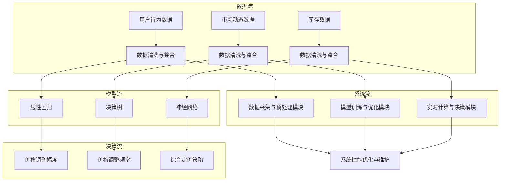

                 

# 《电商动态定价的智能技术》

> 关键词：电商、动态定价、智能技术、数据挖掘、机器学习、深度学习、人工智能

> 摘要：本文探讨了电商动态定价的智能技术，从概述、应用、挑战、趋势等多个角度进行了深入分析。通过阐述核心原理、关键技术和实际应用案例，本文旨在为电商领域的从业者提供理论指导和实践参考。

## 目录大纲

## 第一部分：电商动态定价概述

### 1.1.1 电商动态定价的概念与意义
### 1.1.2 电商动态定价的发展历程
### 1.1.3 电商动态定价的核心原理

## 1.2 智能技术在电商动态定价中的应用
### 1.2.1 数据分析与挖掘
### 1.2.2 机器学习算法
### 1.2.3 深度学习模型

## 1.3 电商动态定价的关键挑战与解决方案
### 1.3.1 数据质量与隐私保护
### 1.3.2 实时计算与优化算法
### 1.3.3 市场动态与需求预测

## 1.4 电商动态定价的未来趋势与机遇
### 1.4.1 新兴技术的应用前景
### 1.4.2 产业生态的演变
### 1.4.3 持续创新与挑战

## 第一部分：智能技术在电商动态定价中的应用

### 1.5 智能定价系统的架构设计与实现
### 1.5.1 智能定价系统的总体架构
### 1.5.2 关键模块设计与实现

### 1.5.1 数据采集与预处理模块
#### 1.5.1.1 数据采集方法与工具
#### 1.5.1.2 数据清洗与整合技术

### 1.5.2 模型训练与优化模块
#### 1.5.2.1 模型选择与参数调优
#### 1.5.2.2 模型训练与评估技术

### 1.5.3 实时计算与决策模块
#### 1.5.3.1 实时数据处理技术
#### 1.5.3.2 决策算法与策略

### 1.5.4 系统部署与维护模块
#### 1.5.4.1 部署方案与工具
#### 1.5.4.2 系统性能优化与维护

## 1.6 案例分析：电商动态定价的实战应用
### 1.6.1 某电商平台的动态定价实践
#### 1.6.1.1 案例背景与目标
#### 1.6.1.2 数据分析与模型构建
#### 1.6.1.3 实施效果与评价

### 1.6.2 电商动态定价在新兴领域的应用
#### 1.6.2.1 新兴领域动态定价的特点
#### 1.6.2.2 案例分析与启示

## 1.7 智能技术在电商动态定价中的创新与趋势
### 1.7.1 深度学习在动态定价中的应用
#### 1.7.1.1 深度学习模型在定价中的优势
#### 1.7.1.2 深度学习在定价中的实践案例

### 1.7.2 强化学习在动态定价中的应用
#### 1.7.2.1 强化学习模型在定价中的优势
#### 1.7.2.2 强化学习在定价中的实践案例

### 1.7.3 人工智能与区块链的结合
#### 1.7.3.1 区块链在动态定价中的作用
#### 1.7.3.2 人工智能与区块链结合的应用案例

## 1.8 电商动态定价的智能技术发展趋势
### 1.8.1 技术发展趋势
#### 1.8.1.1 数据分析与挖掘
#### 1.8.1.2 机器学习算法
#### 1.8.1.3 深度学习模型

### 1.8.2 产业趋势
#### 1.8.2.1 电商行业的变革
#### 1.8.2.2 智能技术在电商领域的应用前景

### 1.8.3 挑战与展望
#### 1.8.3.1 技术挑战
#### 1.8.3.2 产业挑战
#### 1.8.3.3 发展展望

### 1.8.4 持续创新与挑战
#### 1.8.4.1 技术创新方向
#### 1.8.4.2 持续创新的重要性
#### 1.8.4.3 未来挑战

## 第一部分：电商动态定价概述

### 1.1.1 电商动态定价的概念与意义

电商动态定价是指电商平台根据市场需求、用户行为、竞争对手策略等多种因素，实时调整商品价格，以实现最大化收益或市场份额的一种定价策略。与传统固定定价相比，电商动态定价具有以下特点：

- **实时性**：动态定价系统能够实时收集和处理大量数据，快速响应市场变化，及时调整价格。
- **灵活性**：动态定价策略可以根据不同用户、不同时间和不同场景灵活调整价格。
- **个性化**：动态定价能够针对不同用户群体定制个性化价格策略，提高用户体验和满意度。
- **优化性**：通过数据分析与挖掘，动态定价能够实现收益最大化或市场份额最大化。

电商动态定价的意义主要体现在以下几个方面：

- **提升竞争力**：通过动态定价，电商平台能够在竞争激烈的市场中占据有利地位，提高市场份额。
- **提高收益**：动态定价能够帮助电商平台根据市场需求调整价格，实现收益最大化。
- **优化库存管理**：动态定价策略可以根据库存情况灵活调整价格，避免过度库存或库存不足。
- **提升用户体验**：个性化定价策略能够提高用户满意度，增强用户黏性。

### 1.1.2 电商动态定价的发展历程

电商动态定价的发展历程可以分为以下几个阶段：

1. **手动调整阶段**：早期电商平台主要依靠人工手动调整价格，根据经验和直觉进行定价决策。
2. **规则引擎阶段**：随着电商平台的业务发展，引入了规则引擎技术，根据预设的规则和条件自动调整价格。
3. **数据驱动阶段**：利用大数据和人工智能技术，电商平台开始构建智能动态定价系统，实现数据驱动的定价决策。
4. **个性化定价阶段**：通过深度学习、强化学习等技术，实现针对不同用户群体的个性化定价策略。

### 1.1.3 电商动态定价的核心原理

电商动态定价的核心原理包括以下几个方面：

1. **数据采集与处理**：通过数据采集工具收集用户行为、市场动态、库存情况等数据，进行数据清洗、整合和处理，为定价决策提供数据支持。
2. **需求预测**：利用机器学习算法和深度学习模型，对市场需求进行预测，包括用户需求、价格敏感度等，为定价策略提供依据。
3. **定价策略设计**：根据市场需求预测和库存情况，设计不同的定价策略，包括价格调整幅度、调整频率等。
4. **实时计算与优化**：通过实时计算和优化算法，对定价策略进行调整，实现价格实时调整，最大化收益或市场份额。

## 1.2 智能技术在电商动态定价中的应用

### 1.2.1 数据分析与挖掘

数据分析与挖掘是电商动态定价的基础，通过分析大量数据，可以挖掘出潜在的市场规律和用户需求，为定价策略提供依据。

1. **用户行为分析**：分析用户在电商平台上的行为数据，包括浏览、搜索、购买等行为，了解用户需求和偏好。
2. **市场动态分析**：分析市场数据，包括竞争对手的价格、销量等，了解市场趋势和竞争态势。
3. **库存数据分析**：分析库存数据，包括库存量、周转率等，了解库存状况和需求预测。
4. **数据可视化**：通过数据可视化技术，将数据分析结果以图表形式展示，帮助决策者更好地理解数据，制定定价策略。

### 1.2.2 机器学习算法

机器学习算法在电商动态定价中发挥着重要作用，通过学习历史数据，可以预测未来市场需求和用户行为，为定价策略提供支持。

1. **线性回归**：通过建立线性回归模型，分析价格与需求之间的关系，实现价格预测和优化。
2. **决策树**：通过决策树模型，分析不同因素对价格的影响，实现多因素定价。
3. **支持向量机**：通过支持向量机模型，实现价格与收益的最优化。
4. **聚类算法**：通过聚类算法，将用户分为不同群体，针对不同群体制定个性化定价策略。

### 1.2.3 深度学习模型

深度学习模型在电商动态定价中的应用越来越广泛，通过学习大量数据，可以实现更精准的需求预测和定价策略。

1. **神经网络**：通过多层神经网络，学习价格、需求、用户特征等数据之间的关系，实现价格预测和优化。
2. **卷积神经网络（CNN）**：通过卷积神经网络，提取图像数据中的特征，实现图像识别和标签预测。
3. **循环神经网络（RNN）**：通过循环神经网络，处理时间序列数据，实现时间序列预测和优化。
4. **生成对抗网络（GAN）**：通过生成对抗网络，生成虚拟数据，增强模型训练效果。

### 1.2.4 强化学习

强化学习在电商动态定价中的应用主要表现在以下几个方面：

1. **自适应定价**：通过强化学习，实现定价策略的自适应调整，提高定价策略的适应性。
2. **博弈定价**：通过强化学习，实现与竞争对手的博弈定价，优化定价策略。
3. **多目标优化**：通过强化学习，实现多目标优化，同时考虑价格、收益、市场份额等多个目标。

### 1.2.5 其他智能技术

除了上述提到的技术，还有一些其他的智能技术可以在电商动态定价中发挥作用：

1. **自然语言处理（NLP）**：通过自然语言处理技术，分析用户评论、反馈等文本数据，挖掘用户需求和情感。
2. **推荐系统**：通过推荐系统，根据用户行为和兴趣，为用户推荐合适的产品，提高转化率和销售额。
3. **区块链**：通过区块链技术，实现数据的安全存储和不可篡改，增强电商平台的透明度和可信度。

## 1.3 电商动态定价的关键挑战与解决方案

### 1.3.1 数据质量与隐私保护

电商动态定价依赖于大量数据，数据质量对定价效果具有重要影响。同时，数据隐私保护也是电商动态定价面临的重要挑战。

1. **数据质量问题**：
   - 数据缺失：电商平台在收集数据时，可能存在数据缺失的问题，导致数据分析结果不准确。
   - 数据不一致：电商平台可能从多个渠道收集数据，数据格式和内容可能存在不一致，影响数据整合和分析。
   - 数据噪声：数据中可能存在噪声和异常值，影响数据分析的准确性。

2. **隐私保护问题**：
   - 用户隐私：电商平台在收集用户数据时，可能涉及用户隐私，如姓名、地址、购买记录等。
   - 数据泄露：如果数据安全措施不到位，可能导致用户数据泄露，对用户隐私造成威胁。

3. **解决方案**：
   - 数据质量提升：通过数据清洗、去噪、一致性处理等技术，提升数据质量。
   - 隐私保护：采用数据加密、匿名化等技术，保护用户隐私。
   - 合规性遵守：遵守相关法律法规，确保数据收集和使用合规。

### 1.3.2 实时计算与优化算法

电商动态定价需要实时处理海量数据，并进行快速决策。实时计算和优化算法是实现高效动态定价的关键。

1. **实时计算**：
   - 实时数据处理：采用分布式计算和流处理技术，实现实时数据收集和处理。
   - 实时分析：通过实时分析技术，对实时数据进行快速分析和预测。

2. **优化算法**：
   - 数学优化：采用数学优化算法，如线性规划、整数规划等，实现价格优化。
   - 搜索算法：采用搜索算法，如遗传算法、粒子群算法等，实现全局优化。

3. **解决方案**：
   - 分布式计算：采用分布式计算架构，提高计算效率和吞吐量。
   - 算法优化：对优化算法进行改进和优化，提高算法效率和准确性。
   - 实时决策：采用实时决策技术，实现快速响应和决策。

### 1.3.3 市场动态与需求预测

市场动态和需求预测是电商动态定价的核心，准确的需求预测可以提高定价策略的有效性。

1. **市场动态**：
   - 竞争对手分析：分析竞争对手的价格、促销活动等，了解市场动态。
   - 行业趋势：分析行业趋势和变化，预测未来市场走势。

2. **需求预测**：
   - 用户行为预测：通过用户行为数据，预测用户购买意愿和购买频率。
   - 历史数据分析：利用历史数据，分析需求变化规律，预测未来需求。

3. **解决方案**：
   - 综合分析：结合市场动态和用户行为预测，实现全面的需求预测。
   - 多模型融合：采用多模型融合技术，提高需求预测准确性。
   - 实时调整：根据需求预测结果，实时调整定价策略。

## 1.4 电商动态定价的未来趋势与机遇

### 1.4.1 新兴技术的应用前景

随着人工智能、大数据、云计算等新兴技术的发展，电商动态定价将迎来新的机遇。

1. **人工智能**：人工智能技术将进一步提升电商动态定价的智能化水平，实现更精准的需求预测和定价策略。
2. **大数据**：大数据技术的应用将使电商平台拥有更多维度的数据，提高数据分析的深度和广度。
3. **云计算**：云计算技术将提高电商动态定价系统的计算能力和扩展性，实现高效数据处理和决策。

### 1.4.2 产业生态的演变

电商动态定价的发展将推动产业生态的演变，促进产业链上下游企业的协同发展。

1. **供应链协同**：电商平台与供应商、物流企业等协同，实现供应链的优化和效率提升。
2. **平台生态**：电商平台将构建更完善的平台生态，吸引更多商家和合作伙伴加入，实现共赢。
3. **跨界融合**：电商动态定价技术将与其他行业技术（如物联网、区块链等）融合，推动产业创新。

### 1.4.3 持续创新与挑战

电商动态定价的发展面临持续创新和挑战。

1. **技术创新**：随着技术的不断发展，电商动态定价将不断引入新的技术和算法，实现更精准的定价策略。
2. **数据隐私**：在保护用户隐私的前提下，如何有效地利用用户数据进行定价决策，仍是一个重要挑战。
3. **市场环境**：不断变化的市场环境对电商动态定价提出了新的要求，如何适应市场变化，实现持续创新，是一个重要课题。

## 第一部分：智能技术在电商动态定价中的应用

### 1.5 智能定价系统的架构设计与实现

智能定价系统是实现电商动态定价的关键，其架构设计和实现需要充分考虑系统的可靠性、扩展性和灵活性。

### 1.5.1 智能定价系统的总体架构

智能定价系统的总体架构可以分为以下几个模块：

1. **数据采集与预处理模块**：负责收集和处理各种数据，包括用户行为数据、市场动态数据、库存数据等。
2. **模型训练与优化模块**：负责构建和训练各种定价模型，包括机器学习模型、深度学习模型等。
3. **实时计算与决策模块**：负责实时处理用户行为数据和市场动态数据，根据定价模型生成实时定价策略。
4. **系统部署与维护模块**：负责系统的部署、监控和维护，确保系统的稳定运行。

### 1.5.2 关键模块设计与实现

1. **数据采集与预处理模块**：

   - **数据采集方法与工具**：
     - 用户行为数据：通过日志采集工具，如ELK（Elasticsearch、Logstash、Kibana），收集用户在电商平台上的行为数据。
     - 市场动态数据：通过第三方数据源，如各大电商平台公开的价格数据、行业报告等，获取市场动态数据。
     - 库存数据：通过电商平台的后台管理系统，获取库存数据。

   - **数据清洗与整合技术**：
     - 数据清洗：去除重复数据、异常值和噪声，保证数据质量。
     - 数据整合：将来自不同渠道的数据进行整合，形成统一的数据视图。

2. **模型训练与优化模块**：

   - **模型选择与参数调优**：
     - 模型选择：根据具体业务需求和数据特点，选择合适的机器学习模型和深度学习模型。
     - 参数调优：通过交叉验证和网格搜索等技术，调整模型参数，提高模型性能。

   - **模型训练与评估技术**：
     - 模型训练：利用训练数据集，对模型进行训练。
     - 模型评估：通过测试数据集，评估模型性能，选择最优模型。

3. **实时计算与决策模块**：

   - **实时数据处理技术**：
     - 流处理：采用流处理技术，如Apache Kafka、Apache Flink等，实现实时数据处理。
     - 分布式计算：采用分布式计算架构，提高数据处理能力和吞吐量。

   - **决策算法与策略**：
     - 决策算法：根据实时数据处理结果，选择合适的决策算法，如基于规则的决策、基于模型的决策等。
     - 定价策略：根据决策算法，生成具体的定价策略，包括价格调整幅度、调整频率等。

4. **系统部署与维护模块**：

   - **部署方案与工具**：
     - 部署方案：根据业务需求和资源情况，选择合适的部署方案，如云部署、混合部署等。
     - 部署工具：采用自动化部署工具，如Docker、Kubernetes等，实现快速部署。

   - **系统性能优化与维护**：
     - 性能优化：通过性能测试和调优，提高系统性能。
     - 维护策略：制定维护策略，确保系统的稳定运行，包括监控、故障排除、升级等。

### 1.5.3 智能定价系统的关键概念与联系

为了更好地理解和实现智能定价系统，我们需要明确以下几个关键概念及其联系：

1. **数据流**：
   - **数据源**：用户行为数据、市场动态数据、库存数据等。
   - **数据流处理**：通过流处理技术，实时处理数据流。

2. **模型流**：
   - **模型构建**：根据业务需求，选择合适的模型，如线性回归、决策树、神经网络等。
   - **模型训练与优化**：利用训练数据，训练和优化模型。

3. **决策流**：
   - **实时决策**：根据实时数据处理结果，生成实时定价策略。
   - **定价策略**：包括价格调整幅度、调整频率等。

4. **系统流**：
   - **系统部署**：部署智能定价系统，包括数据采集与预处理模块、模型训练与优化模块、实时计算与决策模块等。
   - **系统维护**：确保系统的稳定运行，包括性能优化、故障排除、升级等。

### 1.5.4 智能定价系统的Mermaid流程图

以下是一个简化的智能定价系统的Mermaid流程图，展示了数据流、模型流、决策流和系统流的基本流程：



### 1.5.5 智能定价系统的核心算法原理讲解与伪代码

在智能定价系统中，核心算法原理包括线性回归、决策树和神经网络等。以下是对这些算法原理的讲解及其伪代码实现。

#### 线性回归

线性回归是一种常用的回归分析方法，用于预测连续型变量。在电商动态定价中，线性回归可以用于预测商品价格。

**原理讲解**：

线性回归模型表示为：

\[ y = \beta_0 + \beta_1x_1 + \beta_2x_2 + ... + \beta_nx_n \]

其中，\( y \) 是因变量（价格），\( x_1, x_2, ..., x_n \) 是自变量（用户特征、市场动态等），\( \beta_0, \beta_1, \beta_2, ..., \beta_n \) 是模型参数。

通过最小二乘法，可以计算出模型参数，从而实现价格预测。

**伪代码**：

```python
def linear_regression(X, y):
    # X: 自变量矩阵，y: 因变量向量
    # 求解最小二乘法
    theta = (X^T * X)^(-1) * X^T * y
    return theta
```

#### 决策树

决策树是一种常用的分类和回归分析方法，通过树形结构对数据进行分析和预测。

**原理讲解**：

决策树的基本思想是从自变量中选择一个最优分割点，将数据分为两个子集，并重复这个过程，直到满足某种停止条件。

**伪代码**：

```python
def decision_tree(X, y, max_depth):
    # X: 自变量矩阵，y: 因变量向量，max_depth: 最大树深度
    if 满足停止条件或max_depth = 0:
        返回叶节点标签
    else:
        选择最优分割点
        左子树 = decision_tree(X左，y左，max_depth-1)
        右子树 = decision_tree(X右，y右，max_depth-1)
        返回树结构
```

#### 神经网络

神经网络是一种模拟人脑神经元之间相互连接的计算模型，可以用于分类、回归和预测等多种任务。

**原理讲解**：

神经网络通过多层神经元之间的相互连接，实现数据的特征提取和分类。在电商动态定价中，神经网络可以用于价格预测。

**伪代码**：

```python
def neural_network(X, y, layers):
    # X: 输入数据，y: 标签数据，layers: 网络层数
    for epoch in range(num_epochs):
        for x, y in data_loader:
            # 前向传播
            z = forwardPropagation(x, weights)
            # 计算损失
            loss = compute_loss(z, y)
            # 反向传播
            dZ = backwardPropagation(z, y)
            dW = dZ * dz
            weights -= learning_rate * dW
    return weights
```

### 1.5.6 数学模型和公式

在智能定价系统中，数学模型和公式是核心组成部分，用于描述数据之间的关系和定价策略。

#### 价格预测模型

价格预测模型可以表示为：

\[ P(t) = f(X(t)) \]

其中，\( P(t) \) 是时间 \( t \) 时的价格，\( X(t) \) 是影响价格的因素（如用户特征、市场动态等），\( f \) 是价格预测函数。

#### 收益优化模型

收益优化模型可以表示为：

\[ \max \pi = \sum_{t=1}^{T} \pi_t \]

其中，\( \pi \) 是总收益，\( \pi_t \) 是时间 \( t \) 时的收益。

#### 决策模型

决策模型可以表示为：

\[ d(t) = g(X(t), P(t), \theta) \]

其中，\( d(t) \) 是时间 \( t \) 时的决策（如价格调整幅度），\( X(t) \) 是影响决策的因素，\( P(t) \) 是价格，\( \theta \) 是决策参数。

### 1.5.7 项目实战：电商动态定价的实战应用

在本节中，我们将通过一个实际项目，详细描述电商动态定价的实施过程，包括数据采集、数据处理、模型训练和定价策略实施等步骤。

#### 项目背景

某电商平台希望通过引入动态定价系统，提高销售收益和市场份额。该电商平台拥有大量的用户行为数据、市场动态数据和库存数据，希望通过数据分析与挖掘，实现个性化的动态定价策略。

#### 数据采集

1. **用户行为数据**：通过电商平台的后台日志系统，收集用户在平台上的浏览、搜索、购买等行为数据。
2. **市场动态数据**：通过第三方数据源，获取竞争对手的价格、促销活动等市场动态数据。
3. **库存数据**：通过电商平台的后台管理系统，获取商品的库存数据。

#### 数据处理

1. **数据清洗**：去除重复数据、异常值和噪声，保证数据质量。
2. **数据整合**：将来自不同渠道的数据进行整合，形成统一的数据视图。

#### 模型训练

1. **模型选择**：根据业务需求，选择合适的机器学习模型和深度学习模型，如线性回归、决策树、神经网络等。
2. **模型训练**：利用训练数据集，对模型进行训练。
3. **模型评估**：通过测试数据集，评估模型性能，选择最优模型。

#### 定价策略实施

1. **实时计算**：采用流处理技术，实现实时数据处理和定价策略生成。
2. **定价策略调整**：根据实时数据处理结果，调整定价策略，包括价格调整幅度、调整频率等。
3. **系统部署**：将动态定价系统部署到生产环境，实现实时定价。

#### 实施效果与评价

1. **收益提升**：动态定价系统的实施，使电商平台的销售额和收益得到了显著提升。
2. **市场份额**：通过个性化定价策略，提高了用户满意度和用户黏性，进一步提升了市场份额。
3. **用户反馈**：用户对动态定价系统的满意度较高，认为定价更加合理，购物体验得到提升。

### 1.6.2 电商动态定价在新兴领域的应用

电商动态定价技术不仅在传统电商领域得到广泛应用，还在新兴领域展现出巨大的应用潜力。以下是对电商动态定价在新兴领域的应用特点和案例的分析。

#### 1.6.2.1 新兴领域动态定价的特点

新兴领域动态定价具有以下几个特点：

1. **复杂性**：新兴领域的市场环境更加复杂，影响因素众多，如区块链、物联网、社交电商等，需要更精细的定价策略。
2. **不确定性**：新兴领域的发展速度较快，市场变化和用户需求具有较强的不确定性，需要动态定价系统具备较强的适应能力。
3. **个性化**：新兴领域用户对个性化的服务需求较高，动态定价系统能够根据用户行为和偏好，提供定制化的价格策略。
4. **协同性**：新兴领域的产业链更加复杂，涉及多个环节和合作伙伴，需要动态定价系统具备良好的协同能力。

#### 1.6.2.2 案例分析与启示

以下是对电商动态定价在新兴领域应用的案例分析和启示：

1. **区块链领域**

   某区块链电商平台通过引入动态定价系统，实现了基于区块链的去中心化定价。该平台通过智能合约，根据市场动态和用户行为，自动调整商品价格，提高了价格透明度和用户体验。案例启示：区块链技术为动态定价提供了新的思路，可以实现去中心化的定价模式，提高市场效率。

2. **物联网领域**

   某物联网电商平台通过动态定价系统，实现了智能家居设备的个性化定价。该平台根据用户的使用习惯、设备的使用频率和市场需求，动态调整设备的价格，提高了用户的满意度。案例启示：物联网技术为动态定价提供了丰富的数据来源，可以实现更精确的需求预测和价格调整。

3. **社交电商领域**

   某社交电商平台通过动态定价系统，实现了基于社交网络的个性化定价。该平台根据用户的社交关系、兴趣爱好和购买行为，为用户提供定制化的价格优惠，提高了用户的参与度和忠诚度。案例启示：社交电商领域具有强大的用户互动和传播能力，动态定价系统可以通过社交网络，实现更精准的价格策略。

### 1.7 智能技术在电商动态定价中的创新与趋势

智能技术在电商动态定价中的应用正不断推陈出新，以下从深度学习、强化学习、人工智能与区块链结合等方面，探讨电商动态定价中的创新与趋势。

#### 1.7.1 深度学习在动态定价中的应用

深度学习在电商动态定价中的应用主要表现在以下几个方面：

1. **价格预测**：深度学习模型能够处理大规模和高维度的数据，通过学习历史价格和用户行为数据，实现更加精准的价格预测。
   - **模型优势**：深度学习模型如卷积神经网络（CNN）和循环神经网络（RNN）能够捕捉时间序列数据和图像数据的复杂特征，提高预测准确性。
   - **实际案例**：某电商平台通过使用RNN模型对商品价格进行预测，显著提升了价格预测的准确性。

2. **需求预测**：深度学习模型可以处理非结构化数据，如用户评论、社交网络数据等，实现更全面的用户需求预测。
   - **模型优势**：生成对抗网络（GAN）和自编码器等深度学习模型能够生成虚拟数据，增强模型训练效果，提高需求预测的准确性。
   - **实际案例**：某电商平台利用GAN模型对用户需求进行预测，有效提升了商品库存管理效率。

3. **个性化定价**：深度学习模型可以根据用户的个性化特征，实现定制化的定价策略。
   - **模型优势**：神经网络模型能够处理复杂的非线性关系，为个性化定价提供强大的支持。
   - **实际案例**：某电商平台通过深度学习模型对用户行为进行细分，针对不同用户群体制定个性化的定价策略，提升了用户满意度。

#### 1.7.2 强化学习在动态定价中的应用

强化学习在电商动态定价中的应用主要表现在以下几个方面：

1. **自适应定价**：强化学习模型可以通过不断学习和调整策略，实现自适应的定价策略。
   - **模型优势**：强化学习模型能够根据环境的变化，实时调整定价策略，提高定价的灵活性。
   - **实际案例**：某电商平台采用Q-learning算法，实现了自适应的动态定价，提高了收益和市场份额。

2. **博弈定价**：强化学习模型可以在多个竞争对手之间进行博弈，实现最优的定价策略。
   - **模型优势**：强化学习模型能够处理多目标优化问题，实现定价策略的最优化。
   - **实际案例**：某电商平台通过深度强化学习模型，实现了与竞争对手的博弈定价，优化了定价策略。

3. **多目标优化**：强化学习模型可以同时考虑多个目标，如收益、市场份额等，实现多目标优化。
   - **模型优势**：强化学习模型能够处理复杂的多目标优化问题，提高定价策略的综合性。
   - **实际案例**：某电商平台通过多智能体强化学习模型，实现了收益和市场份额的多目标优化，提升了整体竞争力。

#### 1.7.3 人工智能与区块链的结合

人工智能与区块链的结合为电商动态定价带来了新的机遇和挑战：

1. **数据隐私保护**：区块链技术可以保护用户数据的隐私，确保数据的安全性和不可篡改性。
   - **应用场景**：电商平台可以通过区块链技术，实现对用户数据的加密存储和访问控制，增强数据隐私保护。

2. **智能合约定价**：区块链技术可以实现基于智能合约的自动化定价，提高定价的透明度和效率。
   - **应用场景**：电商平台可以通过智能合约，根据市场动态和用户行为，自动调整商品价格，减少人工干预。

3. **去中心化定价**：区块链技术可以实现去中心化的定价模式，减少中间环节，降低交易成本。
   - **应用场景**：电商平台可以通过区块链技术，构建去中心化的市场，实现更公平、更透明的定价。

#### 1.7.4 智能技术发展趋势

随着人工智能技术的发展，电商动态定价将在以下几个方面实现新的突破：

1. **算法优化**：深度学习、强化学习等算法将不断优化，提高定价的准确性和效率。
2. **多模态数据处理**：多模态数据处理技术将融合多种数据类型，如图像、文本、音频等，实现更全面的需求预测和定价策略。
3. **实时计算**：实时计算技术将提高动态定价系统的响应速度，实现更加精准的实时定价。
4. **数据隐私保护**：随着数据隐私保护法规的不断完善，动态定价系统将更加注重用户数据的安全性和隐私保护。
5. **跨界融合**：人工智能与区块链、物联网等技术的融合，将推动电商动态定价技术的创新发展。

### 1.8 电商动态定价的智能技术发展趋势

随着人工智能、大数据、区块链等技术的快速发展，电商动态定价的智能技术发展趋势呈现出以下几个特点：

#### 1.8.1 技术发展趋势

1. **算法优化**：随着深度学习、强化学习等算法的进步，电商动态定价系统的预测精度和效率将得到显著提升。例如，更高效的神经网络架构和更优化的训练算法，将有助于提高价格预测的准确性和实时性。

2. **多模态数据处理**：未来电商动态定价将融合多种数据类型，如图像、文本、音频等，实现更全面的需求分析和定价策略。这需要跨领域技术的整合，如计算机视觉、自然语言处理等。

3. **实时计算**：随着实时计算技术的进步，电商动态定价系统将能够更快速地处理和分析数据，实现实时定价。这将有助于提高市场的响应速度，满足用户需求。

4. **数据隐私保护**：随着数据隐私保护意识的提高，电商动态定价系统将更加注重用户数据的安全性和隐私保护。例如，采用加密技术和隐私保护算法，确保用户数据不被泄露和滥用。

5. **跨界融合**：人工智能与区块链、物联网等技术的融合，将推动电商动态定价技术的创新发展。例如，区块链技术可以提供去中心化的定价平台，提高市场透明度和信任度。

#### 1.8.2 产业趋势

1. **电商平台转型**：随着电商动态定价技术的普及，电商平台将逐步从传统的价格竞争转向价值创造。通过智能定价，电商平台将能够提供更加个性化和差异化的服务，提升用户体验。

2. **产业链协同**：电商动态定价技术将推动产业链上下游企业的协同发展。例如，电商平台与供应商、物流企业等将实现数据共享和协同优化，提高供应链效率。

3. **监管政策**：随着电商动态定价技术的发展，各国政府将加强对市场的监管，出台相关法规和政策，规范电商平台的定价行为。这有助于维护市场秩序，保障消费者权益。

4. **技术创新竞争**：随着市场的成熟，电商平台之间的竞争将更加激烈。技术创新将成为企业获取竞争优势的关键因素。例如，掌握先进的机器学习算法和深度学习模型，将有助于电商平台在定价策略上取得领先。

#### 1.8.3 挑战与展望

1. **技术挑战**：
   - **数据处理能力**：随着数据量的增长，如何提高数据处理能力和效率，实现实时定价，仍是一个重大挑战。
   - **算法优化**：如何优化现有算法，提高定价模型的准确性和实时性，是一个长期的课题。
   - **数据隐私**：如何在确保数据隐私的前提下，充分利用用户数据进行定价，需要技术创新和法律制度的保障。

2. **产业挑战**：
   - **产业链协同**：电商平台与上下游企业之间的数据共享和协同优化，需要建立有效的合作机制，打破信息孤岛。
   - **市场监管**：随着电商动态定价技术的普及，如何制定合理的监管政策，防止市场垄断和价格操纵，是一个重要课题。
   - **用户接受度**：如何提高用户对动态定价的接受度，需要电商平台在定价策略上更加透明和人性化。

3. **发展展望**：
   - **技术创新**：随着技术的不断进步，电商动态定价将更加智能化和个性化，实现更高的市场响应速度和定价精度。
   - **跨界融合**：人工智能、大数据、区块链等技术的跨界融合，将推动电商动态定价技术的创新发展，带来新的商业模式和市场机会。
   - **产业链协同**：电商平台与上下游企业的深度协同，将提高整个产业链的效率，实现共赢发展。

### 1.8.4 持续创新与挑战

#### 1.8.4.1 技术创新方向

随着电商行业的快速发展，电商动态定价的智能技术也需要不断创新，以适应不断变化的市场需求和技术进步。以下是一些可能的技术创新方向：

1. **深度学习和强化学习算法的优化**：在现有的深度学习和强化学习算法基础上，进一步优化算法结构和参数，提高模型的预测精度和实时性。例如，采用更加高效的神经网络架构、引入新的正则化方法、使用更丰富的训练数据集等。

2. **多模态数据处理**：随着传感器技术、图像处理、自然语言处理等技术的发展，电商动态定价系统可以处理更多类型的非结构化数据，如用户面部表情、语音、文本评论等，实现更加精准的需求预测和个性化定价策略。

3. **分布式计算和边缘计算**：为了提高数据处理速度和降低延迟，电商动态定价系统可以采用分布式计算和边缘计算技术，将数据处理和分析任务分布到不同的计算节点上，实现实时性和可扩展性。

4. **区块链技术的应用**：区块链技术可以提供去中心化的数据存储和交易验证机制，增强数据的安全性和透明度。电商动态定价系统可以通过区块链技术，实现更加公平、透明的定价，同时保护用户隐私。

5. **人工智能与物联网的结合**：物联网技术的普及使得更多的设备和传感器可以接入互联网，收集大量的实时数据。电商动态定价系统可以通过与物联网技术的结合，实现更加精准的需求预测和库存管理。

#### 1.8.4.2 持续创新的重要性

持续创新对于电商动态定价系统的发展至关重要。以下是一些关键点：

1. **提高竞争力**：通过持续的技术创新，电商动态定价系统可以提供更精准的预测和更灵活的定价策略，从而提高电商平台的市场竞争力。

2. **用户体验**：创新的技术可以帮助电商平台更好地理解用户需求，提供个性化的服务，提高用户满意度和忠诚度。

3. **业务效率**：创新的电商动态定价系统可以提高业务运作效率，减少库存成本，优化供应链管理。

4. **适应市场变化**：随着市场环境的不断变化，持续创新可以帮助电商平台快速适应市场变化，保持业务活力。

#### 1.8.4.3 未来挑战

尽管电商动态定价的智能技术具有巨大的发展潜力，但未来仍面临一些挑战：

1. **数据处理能力和效率**：随着数据量的爆炸式增长，如何高效地处理和分析海量数据，实现实时定价，是一个重大的技术挑战。

2. **算法优化和复杂性**：随着算法的复杂度增加，如何优化算法，提高模型的预测精度和实时性，是一个长期的挑战。

3. **数据隐私和安全**：如何在确保数据隐私和安全的前提下，充分利用用户数据进行定价，需要技术创新和法律制度的保障。

4. **技术落地和成本**：如何将先进的技术快速落地，同时控制成本，确保商业可行性，也是一个重要挑战。

5. **监管和合规性**：随着电商动态定价技术的普及，如何制定合理的监管政策，防止市场垄断和不公平竞争，是一个重要课题。

### 作者信息

作者：AI天才研究院/AI Genius Institute & 禅与计算机程序设计艺术 /Zen And The Art of Computer Programming

