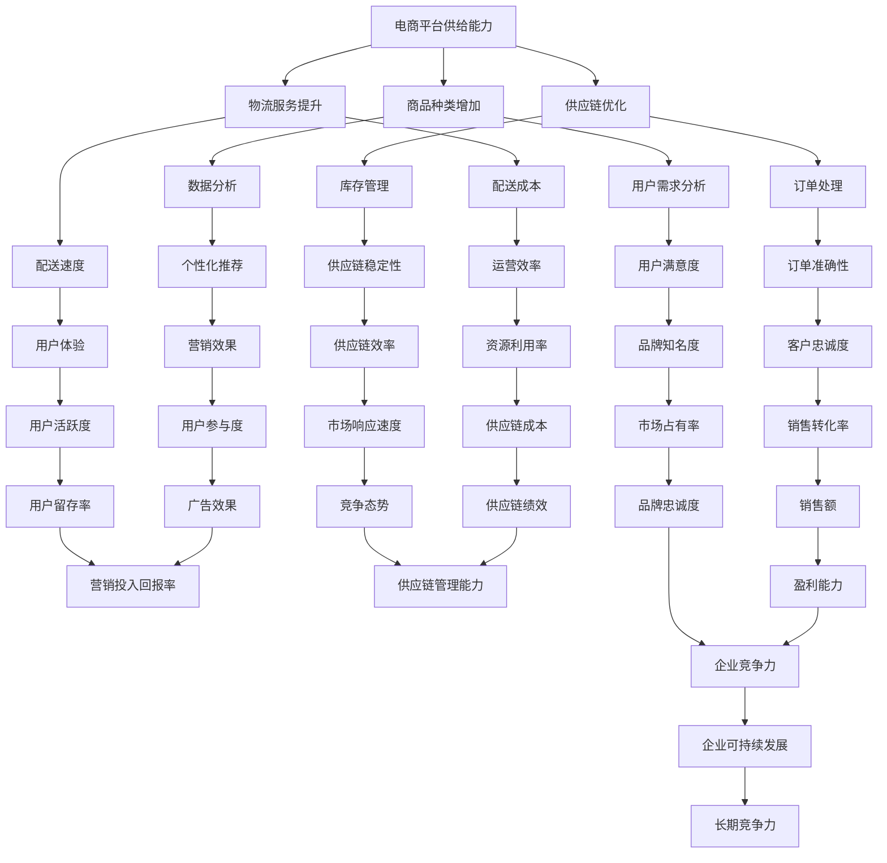

                 

# 《电商平台供给能力提升：促销活动和营销策略》

## 关键词

电商平台、供给能力、促销活动、营销策略、用户行为分析

## 摘要

本文旨在探讨电商平台如何通过提升供给能力和优化促销活动及营销策略来增强市场竞争力。首先，我们详细阐述了电商平台供给能力的定义、重要性及提升策略。接着，我们深入分析了电商平台运营环境，包括市场环境、竞争环境和客户需求。随后，文章重点介绍了促销活动策划、促销活动策略以及营销策略，包括用户行为分析、内容营销和社交媒体营销。最后，通过实战案例分析和营销策略实施效果评估，为电商平台供给能力提升提供了实践指导。

## 第一部分：电商平台供给能力提升概述

### 第1章 电商平台供给能力概述

#### 1.1 电商平台的定义与演变

电商平台是指通过互联网提供商品和服务交易的平台。它的发展历程可以分为三个阶段：萌芽期、发展阶段和成熟期。在萌芽期，电商平台主要是以在线拍卖和C2C（消费者对消费者）交易为主，如eBay和淘宝。发展阶段则是以B2C（企业对消费者）模式为代表，如亚马逊和京东。成熟期则出现了O2O（线上到线下）和社交电商等新型模式，如拼多多和小红书。

#### 1.2 供给能力的重要性

供给能力是指电商平台能够提供满足消费者需求的商品和服务的能力。供给能力的重要性体现在以下几个方面：

1. **影响消费者体验**：供给能力强意味着能够提供丰富的商品选择、快速的商品配送以及优质的售后服务，从而提升消费者的购物体验。
2. **提升市场竞争优势**：强大的供给能力可以帮助电商平台在竞争中脱颖而出，吸引更多消费者。
3. **增加销售机会**：通过优化供给能力，电商平台可以吸引更多的供应商入驻，从而扩大商品种类，增加销售机会。

#### 1.3 提升供给能力的策略

提升供给能力的策略包括以下几个方面：

1. **优化供应链**：通过优化供应链，提高商品流转效率，降低库存成本，提升供应链的灵活性和响应速度。
2. **增加商品种类**：通过扩大商品种类，满足不同消费者的需求，提高消费者的购物满意度。
3. **提升物流服务**：通过提升物流服务水平，缩短配送时间，提高配送效率，提升消费者体验。
4. **提供优质售后服务**：通过提供优质的售后服务，如快速响应客户投诉、提供退换货服务等，增强消费者对电商平台的信任和忠诚度。

### 第2章 电商平台运营环境分析

#### 2.1 市场环境分析

市场环境是指电商平台所处的宏观经济环境、行业发展趋势和市场竞争态势。对于电商平台来说，了解市场环境至关重要，可以帮助其制定合适的发展战略。

1. **宏观经济环境**：包括GDP增长率、消费者购买力、货币政策等因素。这些因素会直接或间接影响电商平台的运营和发展。
2. **行业发展趋势**：如电商行业的发展趋势、新技术应用等。电商平台需要紧跟行业发展趋势，及时调整自己的战略和业务模式。
3. **市场竞争态势**：包括主要竞争对手的市场份额、竞争策略等。电商平台需要分析竞争对手的优势和劣势，找出自己的市场定位和差异化策略。

#### 2.2 竞争环境分析

竞争环境分析主要包括以下几个方面：

1. **竞争对手分析**：分析主要竞争对手的市场份额、品牌知名度、产品特点、价格策略等。
2. **竞争策略分析**：分析竞争对手的竞争策略，包括价格战、促销活动、用户服务等方面。
3. **定位与差异化**：根据竞争对手分析，找到自己的市场定位和差异化策略，以在竞争中脱颖而出。

#### 2.3 客户需求分析

客户需求分析是电商平台运营的基础。通过对客户需求的分析，电商平台可以更好地了解消费者的需求，提供个性化的服务。

1. **需求类型**：包括基本需求、期望需求和惊喜需求。基本需求是消费者购买商品的基本动机，期望需求是消费者对电商平台服务的期望，惊喜需求是消费者对超出期望的服务感到满意。
2. **需求特征**：包括需求强度、需求频率、需求变化等。需求强度反映了消费者对商品或服务的需求程度，需求频率反映了消费者购买商品或服务的频率，需求变化反映了消费者需求的变化趋势。
3. **需求预测**：通过数据分析、市场调研等方法，预测未来客户需求的变化趋势，以便电商平台能够提前做好准备。

## 第二部分：促销活动策略

### 第3章 促销活动策划

#### 3.1 促销活动的目的与类型

促销活动是电商平台提升销量、增强竞争力的有效手段。促销活动的目的包括：

1. **提升销量**：通过促销活动，吸引消费者购买，提升电商平台的销售额。
2. **增强品牌知名度**：通过促销活动，提高电商平台在消费者心中的品牌形象。
3. **扩大市场份额**：通过促销活动，吸引更多消费者，扩大电商平台的市场份额。

促销活动类型主要包括：

1. **价格促销**：通过降低商品价格，吸引消费者购买。
2. **优惠促销**：提供各种优惠，如打折、满减、赠品等，刺激消费者购买。
3. **奖励促销**：通过提供奖励，如积分、优惠券等，鼓励消费者购买。
4. **限时促销**：设置特定的时间段，提供限时优惠，刺激消费者快速购买。

#### 3.2 促销活动策划步骤

促销活动策划需要遵循以下步骤：

1. **确定促销活动目标**：明确促销活动的目的，如提升销量、增强品牌知名度等。
2. **选择促销活动类型**：根据活动目标，选择合适的促销活动类型。
3. **制定促销方案**：包括优惠幅度、活动时间、活动范围等。
4. **设计活动流程**：明确活动流程，包括活动预热、活动执行、活动结束等。
5. **制定宣传策略**：通过社交媒体、邮件、短信等渠道，宣传促销活动。
6. **评估活动效果**：通过数据监测，评估促销活动的效果，如销量提升、用户参与度等。

#### 3.3 成功促销活动案例分析

以某电商平台的双十一购物节为例，该活动成功地提升了销量和品牌知名度。以下是该活动的成功要素：

1. **精准营销**：通过用户数据分析，精准推送活动信息，提高用户参与度。
2. **优惠力度**：提供大幅度的优惠，如满减、赠品等，刺激用户购买。
3. **限时抢购**：设置限时抢购环节，提高用户购买紧迫感。
4. **宣传策略**：通过社交媒体、广告投放等渠道，大力宣传促销活动，提高活动知名度。
5. **用户反馈**：收集用户反馈，不断优化促销活动，提高用户满意度。

### 第4章 促销活动策略

#### 4.1 价格策略

价格策略是促销活动的重要部分，合理的价格策略可以提升销量和品牌知名度。以下是一些常见的价格策略：

1. **高价位策略**：通过提高商品价格，提升品牌形象，吸引高端消费者。
2. **低价位策略**：通过降低商品价格，吸引更多消费者，提高市场份额。
3. **动态价格策略**：根据市场需求和竞争态势，实时调整商品价格。
4. **捆绑销售策略**：将多件商品捆绑在一起销售，提高消费者的购买欲望。

#### 4.2 优惠策略

优惠策略是促销活动的重要组成部分，通过提供各种优惠，可以刺激消费者购买。以下是一些常见的优惠策略：

1. **打折优惠**：通过降低商品价格，吸引消费者购买。
2. **满减优惠**：购买满一定金额，即可享受减价优惠。
3. **赠品优惠**：购买指定商品，即可获得赠品。
4. **优惠券优惠**：发放优惠券，消费者使用优惠券购买商品，享受优惠。

#### 4.3 奖励策略

奖励策略是通过提供奖励，鼓励消费者参与促销活动。以下是一些常见的奖励策略：

1. **积分奖励**：消费者参与促销活动，即可获得积分，积分可以兑换商品或服务。
2. **优惠券奖励**：消费者参与促销活动，即可获得优惠券，优惠券可以用于下次购买。
3. **抽奖奖励**：设置抽奖环节，消费者参与抽奖，有机会获得大奖。

#### 4.4 限时促销策略

限时促销策略是通过设置特定的时间段，提供限时优惠，刺激消费者快速购买。以下是一些常见的限时促销策略：

1. **限时抢购**：设置限时抢购环节，消费者在特定时间段内购买，享受优惠。
2. **限时秒杀**：设置限时秒杀环节，商品数量有限，消费者在特定时间段内购买，享受超值优惠。
3. **限时特惠**：设置特定的时间段，提供限时特惠商品，吸引消费者购买。

### 第5章 促销活动执行与优化

#### 5.1 促销活动执行流程

促销活动执行流程包括以下几个环节：

1. **活动预热**：通过宣传渠道，提前告知消费者促销活动的时间和优惠内容，提高用户期待感。
2. **活动执行**：在促销活动期间，执行预定的促销方案，包括价格调整、优惠发放、抽奖等。
3. **活动结束**：促销活动结束后，进行数据统计和分析，评估活动效果。

#### 5.2 促销活动监控与反馈

促销活动监控与反馈包括以下几个方面：

1. **实时监控**：通过数据分析工具，实时监控促销活动的进展，包括销量、用户参与度等。
2. **用户反馈**：收集用户对促销活动的反馈，包括满意度、建议等。
3. **调整策略**：根据实时监控和用户反馈，及时调整促销活动策略，优化用户体验。

#### 5.3 促销活动优化策略

促销活动优化策略包括以下几个方面：

1. **数据驱动**：通过数据分析，找出促销活动的优势和不足，优化活动方案。
2. **用户参与**：鼓励用户参与促销活动，提高用户活跃度和满意度。
3. **持续优化**：不断调整和优化促销活动，提高活动效果。

## 第三部分：营销策略

### 第6章 营销策略概述

#### 6.1 营销策略的定义与作用

营销策略是指企业为实现其市场营销目标而制定的一系列行动方案。营销策略的作用包括：

1. **明确市场定位**：通过营销策略，企业可以明确自己的市场定位，如目标市场、目标客户等。
2. **提升品牌知名度**：通过营销策略，企业可以提升品牌知名度，吸引更多消费者。
3. **增加销售机会**：通过营销策略，企业可以增加销售机会，提升销售额。

#### 6.2 营销策略的类型

营销策略可以分为以下几种类型：

1. **价格策略**：通过调整商品价格，吸引消费者购买。
2. **促销策略**：通过提供各种促销活动，刺激消费者购买。
3. **广告策略**：通过广告宣传，提升品牌知名度。
4. **公关策略**：通过公关活动，提升企业形象。
5. **渠道策略**：通过优化销售渠道，提高销售效率。

#### 6.3 营销策略的制定原则

制定营销策略需要遵循以下原则：

1. **目标明确**：明确营销策略的目标，如提升销量、增加品牌知名度等。
2. **市场调研**：通过市场调研，了解目标市场的需求和竞争态势。
3. **资源匹配**：确保营销策略的实施有足够的资源支持。
4. **持续优化**：根据市场变化和消费者需求，不断调整和优化营销策略。

### 第7章 用户行为分析

#### 7.1 用户数据分析的重要性

用户数据分析对于电商平台来说至关重要。通过用户数据分析，电商平台可以：

1. **了解用户需求**：通过分析用户行为数据，了解用户的需求和偏好，提供个性化的服务。
2. **优化产品和服务**：通过分析用户反馈和评价，优化产品和服务，提升用户体验。
3. **提高营销效果**：通过分析用户行为数据，制定更有效的营销策略，提高营销效果。

#### 7.2 用户行为分析的方法

用户行为分析的方法包括：

1. **数据收集**：通过网站访问日志、用户调查等方式收集用户行为数据。
2. **数据清洗**：对收集到的用户行为数据进行清洗，去除无效数据。
3. **数据分析**：通过统计学方法和数据挖掘技术，分析用户行为数据，提取有用信息。
4. **用户画像**：根据用户行为数据，构建用户画像，了解用户的特征和行为模式。

#### 7.3 用户画像与精准营销

用户画像是指通过对用户行为数据的分析，构建出用户的特征和行为模式。精准营销是指通过用户画像，提供个性化的营销服务。用户画像与精准营销的关系如下：

1. **提高营销效果**：通过用户画像，可以更准确地推送营销信息，提高营销效果。
2. **提升用户满意度**：通过精准营销，可以提供个性化的服务，提升用户满意度。
3. **增加销售机会**：通过用户画像，可以识别潜在客户，增加销售机会。

### 第8章 内容营销策略

#### 8.1 内容营销的概念与优势

内容营销是指通过创造和传播有价值的内容，吸引潜在客户，提高品牌知名度。内容营销的优势包括：

1. **提高品牌知名度**：通过创造有价值的内容，可以吸引更多的关注，提高品牌知名度。
2. **建立信任**：通过分享专业知识和行业见解，可以建立消费者对品牌的信任。
3. **提高转化率**：通过提供有价值的内容，可以吸引消费者，提高转化率。
4. **降低营销成本**：相比传统营销手段，内容营销的成本较低，且效果持久。

#### 8.2 内容营销策略制定

内容营销策略的制定包括以下几个步骤：

1. **确定内容目标**：明确内容营销的目标，如提高品牌知名度、增加网站流量等。
2. **确定内容类型**：根据目标受众和内容目标，确定合适的内容类型，如博客文章、视频、图片等。
3. **内容创作**：根据内容类型，创作有价值的内容，确保内容质量。
4. **内容推广**：通过社交媒体、邮件等渠道，推广内容，提高内容曝光度。
5. **内容优化**：通过数据分析，优化内容，提高内容效果。

#### 8.3 内容营销案例分析

以某电商平台的博客为例，该平台通过发布高质量的文章，成功提高了品牌知名度和网站流量。以下是该案例的分析：

1. **确定内容目标**：提高品牌知名度和增加网站流量。
2. **确定内容类型**：博客文章。
3. **内容创作**：发布行业分析、购物指南等高质量文章。
4. **内容推广**：通过社交媒体、邮件等渠道推广文章。
5. **内容优化**：根据用户反馈和数据分析，不断优化文章内容和推广策略。

### 第9章 社交媒体营销策略

#### 9.1 社交媒体营销的优势

社交媒体营销是指通过社交媒体平台，如微信、微博、抖音等，进行营销活动。社交媒体营销的优势包括：

1. **广泛覆盖**：社交媒体用户众多，可以覆盖广泛的受众。
2. **互动性强**：社交媒体平台提供了互动功能，可以与用户进行实时互动。
3. **成本低**：相比传统营销手段，社交媒体营销的成本较低。
4. **效果可监测**：通过社交媒体平台的数据分析工具，可以实时监测营销效果。

#### 9.2 社交媒体营销策略制定

社交媒体营销策略的制定包括以下几个步骤：

1. **确定目标受众**：明确目标受众，如年龄、性别、兴趣等。
2. **选择社交媒体平台**：根据目标受众，选择合适的社交媒体平台。
3. **内容创作**：根据平台特点和目标受众，创作有价值的内容。
4. **互动互动**：与用户进行互动，回答用户问题，提高用户参与度。
5. **数据分析**：通过数据分析，优化营销策略。

#### 9.3 社交媒体营销案例分析

以某电商平台的微信营销为例，该平台通过发布高质量的内容和与用户的互动，成功提高了品牌知名度和用户参与度。以下是该案例的分析：

1. **确定目标受众**：年轻女性，对时尚和美妆感兴趣。
2. **选择社交媒体平台**：微信。
3. **内容创作**：发布时尚搭配、美妆教程等高质量内容。
4. **互动互动**：与用户互动，回答用户问题，提供购物建议。
5. **数据分析**：根据用户反馈和数据分析，优化内容创作和互动策略。

## 第四部分：综合实战

### 第10章 电商平台供给能力提升实战

#### 10.1 实战项目背景

某电商平台希望通过提升供给能力，提高用户体验和销售额。项目目标包括：

1. **优化供应链**：提高商品流转效率，降低库存成本。
2. **增加商品种类**：满足不同消费者的需求，提高购物满意度。
3. **提升物流服务**：提高配送速度，降低配送成本。

#### 10.2 项目目标与策略

根据项目目标，制定以下策略：

1. **优化供应链**：与供应商建立紧密合作关系，提高供应链效率。
2. **增加商品种类**：引入多样化的商品，满足不同消费者的需求。
3. **提升物流服务**：优化物流网络，提高配送速度。

#### 10.3 实施步骤与过程

1. **供应链优化**：与供应商签订长期合作协议，提高供应链稳定性。
2. **商品种类增加**：引入新的商品类别，满足消费者的多样化需求。
3. **物流服务提升**：引入先进的物流技术，提高配送速度。

#### 10.4 项目效果评估与总结

1. **效果评估**：通过数据监测，评估项目效果，如商品流转效率、用户满意度等。
2. **总结与反思**：总结项目实施过程中的经验和教训，为后续项目提供参考。

### 第11章 营销策略实战

#### 11.1 实战项目背景

某电商平台希望通过营销策略，提升品牌知名度和销售额。项目目标包括：

1. **提升品牌知名度**：通过有效的营销策略，提高品牌知名度。
2. **增加销售机会**：通过促销活动和用户互动，增加销售机会。

#### 11.2 项目目标与策略

根据项目目标，制定以下策略：

1. **内容营销**：通过创造有价值的内容，提高品牌知名度。
2. **社交媒体营销**：通过社交媒体平台，与用户互动，增加销售机会。
3. **促销活动**：通过限时促销和抽奖活动，刺激消费者购买。

#### 11.3 实施步骤与过程

1. **内容营销**：发布行业分析、购物指南等高质量文章，提高品牌知名度。
2. **社交媒体营销**：与用户互动，回答用户问题，提供购物建议。
3. **促销活动**：设置限时促销和抽奖活动，刺激消费者购买。

#### 11.4 项目效果评估与总结

1. **效果评估**：通过数据监测，评估项目效果，如品牌知名度、销售额等。
2. **总结与反思**：总结项目实施过程中的经验和教训，为后续项目提供参考。

### 第五部分：案例分析

### 第12章 案例分析概述

#### 12.1 案例分析的目的与方法

案例分析的目的在于通过实际案例，深入了解电商平台供给能力提升和营销策略的实施过程及其效果。方法包括：

1. **数据收集**：收集案例企业的相关数据，如销售额、用户满意度等。
2. **案例分析**：对收集到的数据进行深入分析，找出成功的原因和存在的问题。
3. **经验总结**：总结案例中的经验和教训，为其他企业提供借鉴。

#### 12.2 案例分析的类型

案例分析可以分为以下几种类型：

1. **供给能力提升案例**：分析企业如何提升供给能力，包括供应链优化、商品种类增加、物流服务提升等。
2. **营销策略案例**：分析企业如何制定和实施营销策略，包括内容营销、社交媒体营销、促销活动等。
3. **综合案例**：综合分析企业的供给能力和营销策略，全面评估企业的运营效果。

### 第13章 案例分析1：XX电商平台的供给能力提升策略

#### 13.1 案例背景

XX电商平台是一家大型综合性电商平台，成立于2010年。随着电商市场的快速发展，XX电商平台面临激烈的竞争，希望通过提升供给能力，提高市场竞争力。

#### 13.2 案例分析

1. **供应链优化**：XX电商平台与多家供应商建立了长期合作关系，提高了供应链的稳定性。同时，通过引入先进的信息化系统，实现了供应链的实时监控和优化。
2. **商品种类增加**：XX电商平台不断引入新的商品类别，如生鲜、美妆等，满足消费者的多样化需求。同时，通过大数据分析，精准推荐商品，提高用户购买意愿。
3. **物流服务提升**：XX电商平台优化了物流网络，提高了配送速度。同时，引入了无人机配送和无人仓储技术，降低了配送成本。

#### 13.3 案例总结

XX电商平台通过优化供应链、增加商品种类和提升物流服务，成功提升了供给能力，提高了市场竞争力。该案例表明，供给能力提升是电商平台可持续发展的重要保障。

### 第14章 案例分析2：XX电商平台的营销策略

#### 14.1 案例背景

XX电商平台是一家新兴的电商平台，成立于2018年。在激烈的市场竞争中，XX电商平台希望通过有效的营销策略，提高品牌知名度和销售额。

#### 14.2 案例分析

1. **内容营销**：XX电商平台通过创作高质量的内容，如行业分析、购物指南等，吸引了大量用户关注。同时，通过社交媒体平台推广内容，提高了品牌知名度。
2. **社交媒体营销**：XX电商平台与用户建立了紧密的互动关系，通过回答用户问题、提供购物建议等方式，提高了用户满意度和忠诚度。
3. **促销活动**：XX电商平台定期举办促销活动，如限时抢购、抽奖活动等，刺激了用户购买欲望，提高了销售额。

#### 14.3 案例总结

XX电商平台通过内容营销、社交媒体营销和促销活动，成功提高了品牌知名度和销售额。该案例表明，营销策略在电商平台发展中具有重要作用。

## 附录

### 附录A：电商运营工具与资源

#### A.1 常用电商运营工具介绍

1. **数据分析工具**：如Google Analytics、百度统计等。
2. **营销工具**：如Mailchimp、HubSpot等。
3. **供应链管理工具**：如JDA、SAP等。

#### A.2 电商运营资源推荐

1. **电商平台**：如淘宝、京东、亚马逊等。
2. **营销书籍**：如《电商营销实战》、《社交媒体营销》等。
3. **行业报告**：如艾瑞咨询、易观等。

### 附录B：促销活动和营销策略实用手册

#### B.1 促销活动策划实用手册

1. **促销活动类型**：如打折、满减、赠品等。
2. **促销活动流程**：如活动预热、活动执行、活动结束等。
3. **促销活动评估**：如活动效果评估、用户反馈分析等。

#### B.2 营销策略制定实用手册

1. **目标设定**：如提升品牌知名度、增加销售额等。
2. **市场调研**：如目标市场分析、竞争对手分析等。
3. **策略实施**：如内容营销、社交媒体营销等。

#### B.3 促销活动和营销策略案例分析

1. **案例分析1**：XX电商平台的双十一促销活动。
2. **案例分析2**：XX电商平台的社交媒体营销案例。

---

**作者：AI天才研究院/AI Genius Institute & 禅与计算机程序设计艺术 /Zen And The Art of Computer Programming**

---

## 文章核心概念与联系

### 电商平台供给能力的 Mermaid 流程图



### 核心算法原理讲解

#### 用户行为分析算法伪代码

```python
# 用户行为分析算法伪代码

# 输入：用户行为数据集
# 输出：用户画像

function 用户行为分析(行为数据集):
    初始化用户画像为空字典
    
    对于每个用户，行为数据集中的每条记录:
        根据行为类型，更新用户画像
        如果行为是购物行为:
            更新用户兴趣类别
            更新用户购买频率
            更新用户消费金额
        如果行为是浏览行为:
            更新用户访问页面
            更新用户停留时长
            更新用户跳出率
            
    返回用户画像
```

### 数学模型和公式讲解与举例说明

#### 市场份额预测模型

$$
\text{市场份额} = \frac{\text{平台销售额}}{\text{市场总销售额}}
$$

举例：

- 设定某电商平台在某地区的市场总销售额为1000万元，该地区的市场总销售额为5000万元，则该电商平台在该地区的市场份额为：
  $$
  \text{市场份额} = \frac{1000}{5000} = 0.2 = 20\%
  $$

#### 价格弹性模型

$$
\text{价格弹性} = \frac{\text{需求量变化百分比}}{\text{价格变化百分比}}
$$

举例：

- 假设某商品的价格从100元上涨到120元，需求量从1000件下降到800件，则价格弹性为：
  $$
  \text{价格弹性} = \frac{(800-1000)/1000}{(120-100)/100} = \frac{-0.2}{0.2} = -1
  $$
  这表明需求对价格的变化非常敏感，价格每上升1%，需求量下降1%。

### 代码实际案例和详细解释说明

#### 电商平台商品推荐系统代码实现

```python
# 电商平台商品推荐系统代码实现

# 导入相关库
import pandas as pd
import numpy as np
from sklearn.model_selection import train_test_split
from sklearn.neighbors import NearestNeighbors
from sklearn.preprocessing import StandardScaler

# 加载商品数据
data = pd.read_csv('商品数据.csv')

# 数据预处理
# ... 数据清洗、缺失值处理、特征工程等步骤 ...

# 划分训练集和测试集
X_train, X_test, y_train, y_test = train_test_split(data[['商品特征1', '商品特征2']], data['商品ID'], test_size=0.2, random_state=42)

# 特征标准化
scaler = StandardScaler()
X_train_scaled = scaler.fit_transform(X_train)
X_test_scaled = scaler.transform(X_test)

# 使用KNN算法进行推荐
knn = NearestNeighbors(n_neighbors=5)
knn.fit(X_train_scaled)

# 进行商品推荐
def 推荐商品(用户特征):
    # 将用户特征进行标准化
    user_feature_scaled = scaler.transform([用户特征])
    # 计算用户特征与训练集特征的相似度
    distances, indices = knn.kneighbors(user_feature_scaled)
    # 获取推荐商品ID
    recommended_items = X_train.iloc[indices[0]].drop_duplicates().index.tolist()
    return recommended_items

# 测试推荐系统
test_user_feature = [用户特征1, 用户特征2]
print("推荐商品：", 推荐商品(test_user_feature))

# 代码解读与分析
# ...
```

- **开发环境搭建**：使用Python编程语言，结合Pandas、NumPy、Scikit-learn等库进行商品推荐系统的开发。
- **源代码实现**：代码中包括数据预处理、特征标准化、KNN算法模型训练和商品推荐功能。
- **代码解读与分析**：详细解读了KNN算法在商品推荐系统中的应用，以及如何通过相似度计算实现个性化推荐。

---

本文通过详细的目录大纲和分步讲解，系统地阐述了电商平台供给能力提升和营销策略的各个核心概念、算法原理、数学模型、实战案例以及代码实现，为电商平台运营提供了理论指导和实践参考。

---

**作者：AI天才研究院/AI Genius Institute & 禅与计算机程序设计艺术 /Zen And The Art of Computer Programming**

