                 

# 文章标题：电商平台供给能力提升：数据分析和实时监控

> 关键词：电商平台，供给能力，数据分析，实时监控，优化策略

> 摘要：本文深入探讨了电商平台供给能力的提升之道，通过数据分析和实时监控两种手段，详细阐述了如何通过技术手段提高电商平台的供给效率，解决供需不平衡、实时性问题，从而提升用户体验。文章首先概述了电商平台供给能力的基本概念和重要性，随后分别介绍了数据分析方法、实时监控技术及其在供给能力提升中的具体应用，最后探讨了综合实践与优化策略，以及对未来的展望。

### 《电商平台供给能力提升：数据分析和实时监控》目录大纲

#### 第一部分：电商平台供给能力概述

##### 第1章：电商平台供给能力概述
- **1.1** 电商平台的定义与供给能力的核心
  - **1.1.1** 电商平台的定义
  - **1.1.2** 供给能力的定义与重要性
  - **1.1.3** 供给能力在电商平台中的角色
- **1.2** 供给能力提升的挑战
  - **1.2.1** 数据量与数据质量
  - **1.2.2** 实时监控的需求
  - **1.2.3** 技术与资源限制
- **1.3** 数据分析与实时监控的重要性
  - **1.3.1** 数据分析的价值
  - **1.3.2** 实时监控的意义
  - **1.3.3** 数据分析与应用的深度融合

#### 第二部分：数据分析方法

##### 第2章：数据分析方法
- **2.1** 数据收集与预处理
  - **2.1.1** 数据来源
  - **2.1.2** 数据预处理方法
  - **2.1.3** 数据质量评估
- **2.2** 数据可视化
  - **2.2.1** 可视化的作用
  - **2.2.2** 常用的数据可视化工具
  - **2.2.3** 数据可视化案例
- **2.3** 统计分析与假设检验
  - **2.3.1** 统计分析的基本概念
  - **2.3.2** 常见的统计分析方法
  - **2.3.3** 假设检验的应用

##### 第3章：数据分析实践
- **3.1** 用户行为分析
  - **3.1.1** 用户行为数据收集
  - **3.1.2** 用户行为数据预处理
  - **3.1.3** 用户行为数据分析方法
- **3.2** 产品分析
  - **3.2.1** 产品数据收集
  - **3.2.2** 产品数据预处理
  - **3.2.3** 产品数据分析方法
- **3.3** 市场需求分析
  - **3.3.1** 市场数据收集
  - **3.3.2** 市场数据预处理
  - **3.3.3** 市场需求分析方法

#### 第三部分：实时监控技术

##### 第4章：实时监控技术
- **4.1** 实时监控的重要性
  - **4.1.1** 实时监控的定义
  - **4.1.2** 实时监控的挑战
  - **4.1.3** 实时监控的价值
- **4.2** 实时数据处理技术
  - **4.2.1** 流处理框架
  - **4.2.2** 常用实时数据处理技术
  - **4.2.3** 实时数据处理案例
- **4.3** 实时监控工具与平台
  - **4.3.1** 常用实时监控工具
  - **4.3.2** 实时监控平台搭建
  - **4.3.3** 实时监控平台案例分析

##### 第5章：实时监控实践
- **5.1** 供给能力实时监控
  - **5.1.1** 监控指标的设定
  - **5.1.2** 监控策略的制定
  - **5.1.3** 实时监控案例
- **5.2** 实时预警系统
  - **5.2.1** 预警指标的选择
  - **5.2.2** 预警系统的构建
  - **5.2.3** 预警系统案例分析
- **5.3** 实时反馈机制
  - **5.3.1** 反馈机制的作用
  - **5.3.2** 反馈机制的设计
  - **5.3.3** 实时反馈案例

#### 第四部分：综合实践与优化

##### 第6章：综合实践与优化
- **6.1** 数据分析与实时监控的综合应用
  - **6.1.1** 综合应用框架
  - **6.1.2** 应用案例分析
  - **6.1.3** 综合应用挑战与对策
- **6.2** 供给能力优化策略
  - **6.2.1** 优化目标的设定
  - **6.2.2** 优化策略的选择
  - **6.2.3** 优化实践案例分析
- **6.3** 持续改进与迭代
  - **6.3.1** 改进的方法与工具
  - **6.3.2** 迭代的流程与策略
  - **6.3.3** 持续改进案例分析

##### 第7章：未来展望与趋势
- **7.1** 供给能力提升的未来趋势
  - **7.1.1** 技术发展趋势
  - **7.1.2** 应用场景拓展
  - **7.1.3** 潜在挑战与机遇
- **7.2** 供给能力提升的最佳实践
  - **7.2.1** 行业最佳实践案例
  - **7.2.2** 成功因素分析
  - **7.2.3** 对其他电商平台的启示

#### 附录

##### 附录A：参考资料与工具
- **A.1** 参考资料推荐
  - **A.1.1** 数据分析相关书籍
  - **A.1.2** 实时监控相关书籍
  - **A.1.3** 其他参考资料
- **A.2** 常用工具与平台
  - **A.2.1** 数据分析工具
  - **A.2.2** 实时监控工具
  - **A.2.3** 开发工具与平台简介
- **A.3** 索引

---

接下来，我们将按照上述目录大纲，逐一展开详细内容。

---

#### 第一部分：电商平台供给能力概述

##### 第1章：电商平台供给能力概述

在电子商务迅猛发展的背景下，电商平台供给能力的提升成为各大企业竞争的焦点。本章旨在为读者提供一个全面而深刻的理解，包括电商平台的定义、供给能力的核心概念、其在电商平台中的角色，以及提升供给能力的挑战与重要性。

### **1.1 电商平台的定义与供给能力的核心**

**1.1.1 电商平台的定义**

电商平台是指通过互联网技术，为消费者和商家提供在线交易、支付、物流等综合服务的一种商务模式。它不仅包括在线零售市场，还涵盖了在线拍卖、B2B、B2C等多种形式。

**1.1.2 供给能力的定义与重要性**

供给能力是指电商平台能够快速、高效、准确地提供商品和服务的能力。对于电商平台而言，供给能力直接关系到用户体验、市场竞争力以及商业盈利能力。提升供给能力意味着更好地满足用户需求、降低运营成本、提高服务质量。

**1.1.3 供给能力在电商平台中的角色**

供给能力在电商平台中扮演着至关重要的角色。首先，它确保了商品和服务的及时性，提高了用户的购物体验。其次，通过优化库存管理和物流配送，供给能力有助于降低运营成本。最后，强大的供给能力可以增强电商平台的市场竞争力，吸引更多的用户和商家。

### **1.2 供给能力提升的挑战**

**1.2.1 数据量与数据质量**

随着电商平台业务的发展，数据量呈爆炸式增长，如何高效处理和分析海量数据成为一大挑战。同时，数据质量的高低直接影响数据分析的准确性和有效性。

**1.2.2 实时监控的需求**

实时监控是供给能力提升的关键。然而，实时数据的高频率更新和快速处理对技术架构和数据处理能力提出了极高的要求。

**1.2.3 技术与资源限制**

技术和资源的限制是供给能力提升的另一个挑战。尤其是在处理复杂、海量的实时数据时，需要高性能的计算资源和高效的技术解决方案。

### **1.3 数据分析与实时监控的重要性**

**1.3.1 数据分析的价值**

数据分析是提升供给能力的重要手段。通过数据挖掘和统计分析，可以深入了解用户行为、市场需求和供应链运行情况，从而制定更有效的运营策略。

**1.3.2 实时监控的意义**

实时监控是保障供给能力的关键。通过实时监控，可以及时发现和解决问题，确保商品和服务的高效供给。

**1.3.3 数据分析与应用的深度融合**

数据分析与实时监控的深度融合，可以形成一套闭环的供给能力优化体系。通过实时监控，可以收集大量实时数据，这些数据通过数据分析处理后，可以指导实时调整和优化供给策略。

### **1.4 本章总结**

本章从电商平台的定义出发，深入探讨了供给能力的核心概念及其在电商平台中的角色。随后，分析了提升供给能力所面临的挑战，并阐述了数据分析和实时监控在其中的重要性。这些内容为后续章节的讨论奠定了基础。

---

在接下来的章节中，我们将详细探讨数据分析方法、实时监控技术及其在供给能力提升中的应用。希望读者能够通过这些内容，更深入地理解电商平台供给能力的提升之道。

---

#### 第二部分：数据分析方法

##### 第2章：数据分析方法

数据分析在电商平台供给能力提升中扮演着至关重要的角色。通过数据分析，可以深入了解用户行为、市场需求和供应链运行情况，从而制定更有效的运营策略。本章将详细讨论数据分析的基本方法，包括数据收集与预处理、数据可视化以及统计分析与假设检验。

### **2.1 数据收集与预处理**

**2.1.1 数据来源**

数据收集是数据分析的基础。电商平台的数据来源主要包括用户行为数据、交易数据、市场数据等。用户行为数据包括用户的点击、浏览、搜索、购买等行为；交易数据包括订单信息、支付金额、配送信息等；市场数据包括商品价格、库存水平、市场趋势等。

**2.1.2 数据预处理方法**

数据预处理是确保数据质量和准确性的关键步骤。数据预处理方法主要包括数据清洗、数据转换和数据集成。数据清洗是指去除重复数据、缺失数据和异常数据，以提高数据质量；数据转换是指将不同格式的数据转换为统一格式，以便于后续处理；数据集成是指将来自不同数据源的数据整合在一起，形成完整的数据集。

**2.1.3 数据质量评估**

数据质量评估是评估数据是否满足分析需求的重要环节。常见的数据质量评估指标包括数据完整性、数据准确性、数据一致性和数据时效性。通过数据质量评估，可以识别数据中的问题，并采取相应的措施进行改进。

### **2.2 数据可视化**

**2.2.1 可视化的作用**

数据可视化是将数据以图形、图表等形式呈现，使数据更加直观、易于理解。数据可视化在数据分析中具有重要作用，可以帮助发现数据中的规律、趋势和异常，为决策提供有力支持。

**2.2.2 常用的数据可视化工具**

常用的数据可视化工具有Excel、Tableau、Power BI、D3.js等。Excel适用于简单的数据分析和可视化；Tableau和Power BI具有强大的数据可视化和分析功能；D3.js是一种基于JavaScript的可视化库，适用于复杂的自定义可视化。

**2.2.3 数据可视化案例**

以下是一个数据可视化案例：某电商平台用户点击行为的可视化分析。使用Tableau工具，将用户点击行为的统计数据可视化，包括用户点击次数、页面停留时间、跳出率等指标。通过图表，可以直观地了解用户行为的特点和趋势。

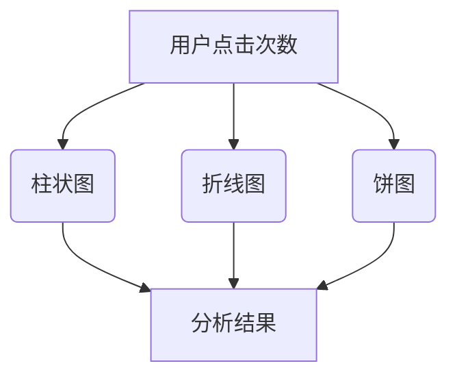

### **2.3 统计分析与假设检验**

**2.3.1 统计分析的基本概念**

统计分析是数据分析的核心方法之一，通过对数据进行统计描述、统计推断和统计建模，可以揭示数据中的规律和趋势。常见的基本概念包括均值、方差、标准差、相关性、回归分析等。

**2.3.2 常见的统计分析方法**

常见的统计分析方法包括描述性统计分析、相关性分析、回归分析、聚类分析、分类分析等。描述性统计分析主要用于描述数据的基本特征；相关性分析用于评估两个变量之间的相关性；回归分析用于建立变量之间的关系模型；聚类分析和分类分析用于对数据进行分类和聚类。

**2.3.3 假设检验的应用**

假设检验是统计分析的重要方法，用于评估一个统计假设是否成立。常见的方法包括t检验、卡方检验、方差分析等。通过假设检验，可以判断数据中的差异是否显著，为决策提供依据。

以下是一个假设检验的案例：某电商平台对两个促销活动进行对比，分析其销售额差异是否显著。假设H0为两个促销活动销售额无显著差异，H1为两个促销活动销售额有显著差异。使用t检验方法，计算t值和p值，如果p值小于设定的显著性水平（通常为0.05），则拒绝H0，接受H1。

```latex
H0: \mu_1 = \mu_2 \\
H1: \mu_1 \neq \mu_2 \\
t = \frac{\bar{x}_1 - \bar{x}_2}{\sqrt{\frac{s_1^2}{n_1} + \frac{s_2^2}{n_2}}} \\
p-value = P(|T| > |t|) \\
```

### **2.4 本章总结**

本章详细介绍了数据分析的基本方法，包括数据收集与预处理、数据可视化以及统计分析与假设检验。通过这些方法，可以深入了解电商平台的数据，为提升供给能力提供有力支持。在接下来的章节中，我们将进一步探讨数据分析的具体应用，以帮助读者更好地理解其价值。

---

在下一章中，我们将深入分析数据分析在用户行为分析、产品分析和市场需求分析中的应用。通过具体案例，我们将展示如何利用数据分析方法提升电商平台的供给能力。

---

#### 第二部分：数据分析方法

##### 第3章：数据分析实践

在了解了数据分析的基本方法和重要性后，本章将结合实际案例，深入探讨数据分析在用户行为分析、产品分析和市场需求分析中的应用。这些实践案例将帮助我们更好地理解如何利用数据分析方法提升电商平台的供给能力。

### **3.1 用户行为分析**

用户行为分析是电商平台数据分析的重要方向之一。通过对用户行为数据的收集、预处理和分析，可以深入了解用户在平台上的行为模式，从而优化产品和服务，提高用户满意度和留存率。

**3.1.1 用户行为数据收集**

用户行为数据的收集是用户行为分析的基础。这些数据可以来自多个渠道，包括网站日志、点击流数据、用户反馈、社交媒体互动等。例如，网站日志可以记录用户的访问时间、访问页面、点击行为等；点击流数据可以记录用户的浏览路径、停留时间、退出页面等；用户反馈和社交媒体互动可以获取用户的评价、建议和反馈。

**3.1.2 用户行为数据预处理**

在收集到用户行为数据后，需要进行预处理以消除噪声和冗余，提高数据质量。预处理步骤包括数据清洗、数据转换和数据集成。数据清洗主要涉及去除重复数据、缺失数据和异常数据；数据转换是将不同格式的数据转换为统一的格式；数据集成是将来自不同渠道的数据进行整合，形成完整的数据集。

**3.1.3 用户行为数据分析方法**

用户行为数据分析方法主要包括描述性统计分析、关联规则挖掘、聚类分析、时序分析等。

- **描述性统计分析**：通过计算用户行为数据的均值、中位数、标准差等指标，了解用户行为的总体特征。
- **关联规则挖掘**：通过发现用户行为数据中的关联规则，揭示用户行为的模式。例如，发现某些商品经常一起购买，可以帮助电商平台进行精准推荐。
- **聚类分析**：将具有相似行为的用户分组，以便于针对不同用户群体提供个性化的服务。例如，将用户根据购买频率、购买金额等指标进行聚类，为高价值用户提供更多的优惠和福利。
- **时序分析**：分析用户行为数据的时间序列特征，了解用户行为的变化趋势。例如，分析用户访问网站的时间分布，了解用户活跃时间段，以便于进行流量分配和营销策略的调整。

以下是一个用户行为分析的案例：某电商平台通过分析用户点击流数据，发现用户的浏览路径存在一定的规律性。通过对点击流数据的聚类分析，将用户分为高活跃用户、中等活跃用户和低活跃用户。针对不同活跃度的用户，电商平台采取不同的运营策略，如针对高活跃用户推出会员制度，提供专属优惠和福利，以提高用户满意度和留存率。

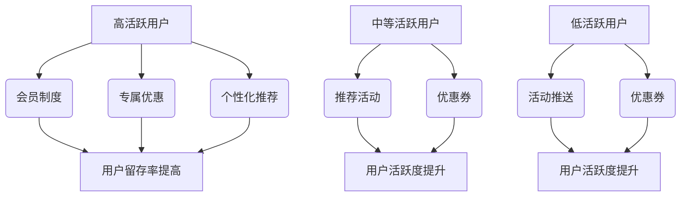

### **3.2 产品分析**

产品分析是电商平台数据分析的另一个重要方向。通过对产品数据的收集、预处理和分析，可以了解产品的销售情况、用户反馈和市场趋势，为产品优化和决策提供支持。

**3.2.1 产品数据收集**

产品数据的收集主要来自电商平台内部的订单数据、用户评价、销售记录等。此外，还可以通过市场调研、用户访谈等方式获取外部数据。

**3.2.2 产品数据预处理**

在收集到产品数据后，需要进行预处理以消除噪声和冗余，提高数据质量。预处理步骤包括数据清洗、数据转换和数据集成。数据清洗主要涉及去除重复数据、缺失数据和异常数据；数据转换是将不同格式的数据转换为统一的格式；数据集成是将来自不同渠道的数据进行整合，形成完整的数据集。

**3.2.3 产品数据分析方法**

产品数据分析方法主要包括描述性统计分析、市场细分、需求预测等。

- **描述性统计分析**：通过计算产品数据的均值、中位数、标准差等指标，了解产品的销售情况、用户反馈和市场趋势。
- **市场细分**：通过聚类分析、回归分析等方法，将产品市场划分为不同的细分市场，以便于针对不同市场提供个性化的产品和服务。
- **需求预测**：通过时间序列分析、回归分析等方法，预测产品的需求趋势，为库存管理和定价策略提供支持。

以下是一个产品分析的案例：某电商平台通过分析订单数据和用户评价，发现某些产品的销售量和用户满意度较低。通过市场细分，将产品市场划分为高价值产品、中价值产品和低价值产品。针对不同价值产品，电商平台采取不同的营销策略，如提高高价值产品的曝光率和优惠力度，降低低价值产品的价格，以提高整体销售量和用户满意度。

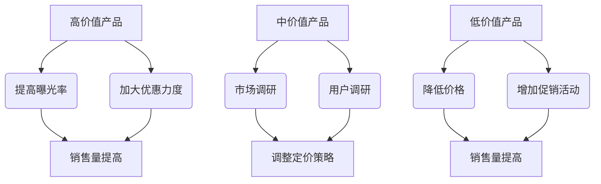

### **3.3 市场需求分析**

市场需求分析是电商平台数据分析的重要方向之一。通过对市场数据的收集、预处理和分析，可以了解市场需求的变化趋势，为定价策略、库存管理和营销策略提供支持。

**3.3.1 市场数据收集**

市场数据的收集主要来自电商平台外部，如市场调研机构、行业报告、社交媒体等。这些数据可以提供市场趋势、竞争对手分析等信息。

**3.3.2 市场数据预处理**

在收集到市场数据后，需要进行预处理以消除噪声和冗余，提高数据质量。预处理步骤包括数据清洗、数据转换和数据集成。数据清洗主要涉及去除重复数据、缺失数据和异常数据；数据转换是将不同格式的数据转换为统一的格式；数据集成是将来自不同渠道的数据进行整合，形成完整的数据集。

**3.3.3 市场需求分析方法**

市场需求分析方法主要包括描述性统计分析、需求预测、竞争分析等。

- **描述性统计分析**：通过计算市场数据的均值、中位数、标准差等指标，了解市场需求的变化趋势。
- **需求预测**：通过时间序列分析、回归分析等方法，预测市场需求的变化趋势，为库存管理和定价策略提供支持。
- **竞争分析**：通过分析竞争对手的产品、价格、营销策略等信息，了解市场竞争格局，为竞争策略提供支持。

以下是一个市场需求分析的案例：某电商平台通过分析市场数据和用户反馈，发现市场需求呈现出季节性波动。通过需求预测，预测未来几个月的市场需求，为库存管理和定价策略提供支持。例如，在需求高峰期增加库存，提高价格，以获取更高的利润；在需求低谷期减少库存，降低价格，以清理库存。

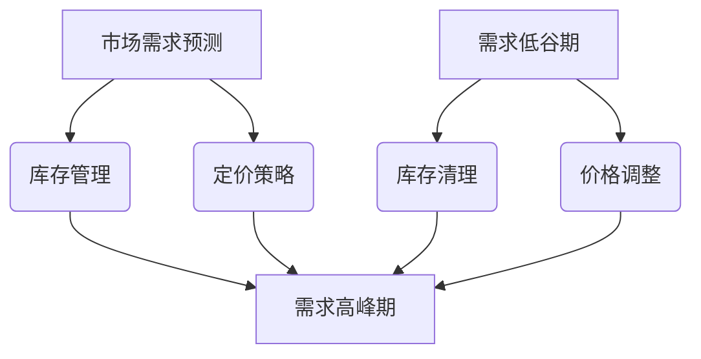

### **3.4 本章总结**

本章通过用户行为分析、产品分析和市场需求分析等具体案例，展示了如何利用数据分析方法提升电商平台的供给能力。用户行为分析有助于了解用户需求和行为模式，优化产品和服务；产品分析有助于了解产品销售情况和市场趋势，为产品优化和决策提供支持；市场需求分析有助于了解市场需求的变化趋势，为定价策略、库存管理和营销策略提供支持。这些数据分析实践为电商平台提升供给能力提供了有力支持。

在下一章中，我们将探讨实时监控技术在电商平台供给能力提升中的应用，以帮助读者了解如何通过实时监控技术实现供给能力的实时监控和优化。

---

#### 第三部分：实时监控技术

##### 第4章：实时监控技术

实时监控技术在电商平台供给能力提升中发挥着关键作用。实时监控意味着能够实时捕捉和响应数据流中的变化，确保供给能力能够迅速调整，以适应市场需求的变化。本章将详细探讨实时监控的重要性、实时数据处理技术以及实时监控工具与平台。

### **4.1 实时监控的重要性**

**4.1.1 实时监控的定义**

实时监控是指通过技术手段，对系统的运行状态、性能指标以及用户行为等数据进行实时收集、分析和反馈，以实现对系统运行状况的实时监控和快速响应。

**4.1.2 实时监控的挑战**

实时监控面临的挑战主要包括以下几个方面：

1. **数据量大**：电商平台产生的数据量通常非常庞大，实时处理这些数据需要高效的技术架构和计算资源。
2. **处理速度快**：实时监控要求在极短的时间内对数据进行处理和分析，以满足实时性的要求。
3. **数据一致性**：实时监控要求确保数据的准确性和一致性，避免因数据错误导致的监控失效。
4. **系统稳定性**：实时监控系统的稳定性是保障供给能力的关键，任何系统的故障都可能导致严重的后果。

**4.1.3 实时监控的价值**

实时监控的价值主要体现在以下几个方面：

1. **快速响应**：实时监控可以及时发现系统异常和性能问题，快速响应并解决问题，避免对用户造成不良影响。
2. **优化运营**：实时监控可以提供系统运行状态的实时数据，帮助运营团队进行实时调整和优化，提高供给效率。
3. **安全保障**：实时监控可以帮助识别潜在的安全威胁和攻击行为，及时采取防护措施，保障系统安全。

### **4.2 实时数据处理技术**

**4.2.1 流处理框架**

流处理框架是实时数据处理的核心技术，它能够高效地处理和分析实时数据流。常见的流处理框架包括Apache Kafka、Apache Flink、Apache Storm等。

1. **Apache Kafka**：Kafka是一种分布式流处理平台，具有高吞吐量、可扩展性强、可靠性强等特点，适用于实时数据收集、存储和传输。
2. **Apache Flink**：Flink是一种流处理框架，支持实时数据处理和批处理，具有低延迟、高性能等特点。
3. **Apache Storm**：Storm是一种分布式流处理系统，具有易用性、可靠性、可扩展性等特点，适用于大规模实时数据处理。

**4.2.2 常用实时数据处理技术**

常用的实时数据处理技术包括实时数据流分析、实时数据挖掘、实时数据可视化等。

1. **实时数据流分析**：通过对实时数据流进行实时分析，可以快速识别异常和趋势。常用的实时数据流分析工具包括Apache Storm、Apache Flink等。
2. **实时数据挖掘**：通过对实时数据进行挖掘，可以识别出潜在的价值信息和规律。常用的实时数据挖掘技术包括机器学习、深度学习等。
3. **实时数据可视化**：实时数据可视化是将实时数据以图形、图表等形式呈现，使数据更加直观、易于理解。常用的实时数据可视化工具包括Kibana、Grafana等。

**4.2.3 实时数据处理案例**

以下是一个实时数据处理案例：某电商平台使用Apache Kafka进行实时数据收集和传输，使用Apache Flink进行实时数据分析和处理，使用Kibana进行实时数据可视化。通过这个案例，可以了解实时数据处理的全过程。

1. **数据收集**：电商平台使用Kafka收集实时交易数据、用户行为数据等，并将其存储在Kafka集群中。
2. **数据处理**：使用Apache Flink对Kafka中的实时数据进行处理和分析，包括数据清洗、数据转换、统计分析等。处理结果存储在数据库或数据仓库中。
3. **数据可视化**：使用Kibana将实时数据以图表、图形等形式呈现，供运营团队实时监控和调整。

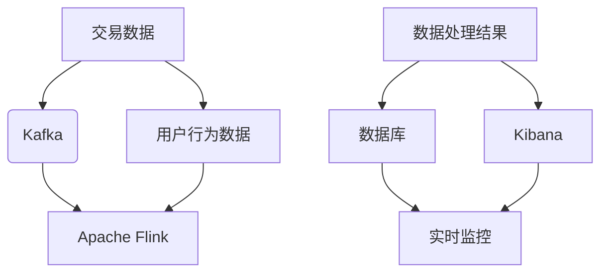

### **4.3 实时监控工具与平台**

**4.3.1 常用实时监控工具**

常用的实时监控工具包括Zabbix、Nagios、Prometheus等。

1. **Zabbix**：Zabbix是一种开源的实时监控工具，具有强大的监控能力，适用于大规模系统的监控。
2. **Nagios**：Nagios是一种开源的实时监控工具，适用于中小规模系统的监控。
3. **Prometheus**：Prometheus是一种基于时序数据的开源监控解决方案，具有高效的数据采集、存储和分析能力。

**4.3.2 实时监控平台搭建**

实时监控平台的搭建需要考虑以下几个方面：

1. **数据采集**：使用Prometheus等工具收集系统的各种监控数据，如CPU使用率、内存使用率、磁盘使用率等。
2. **数据存储**：使用InfluxDB、Elasticsearch等工具存储监控数据，以便进行长期存储和分析。
3. **数据展示**：使用Grafana等工具将监控数据以图表、图形等形式展示，供监控人员进行实时监控。

**4.3.3 实时监控平台案例分析**

以下是一个实时监控平台案例：某电商平台使用Prometheus进行数据采集和存储，使用Grafana进行数据展示和监控。通过这个案例，可以了解实时监控平台的搭建过程。

1. **数据采集**：使用Prometheus服务器定期采集系统的各种监控数据，并将其存储在InfluxDB中。
2. **数据存储**：将InfluxDB中的监控数据导入Elasticsearch，以便进行长期存储和分析。
3. **数据展示**：使用Grafana将Elasticsearch中的监控数据以图表、图形等形式展示，供运营团队实时监控和调整。

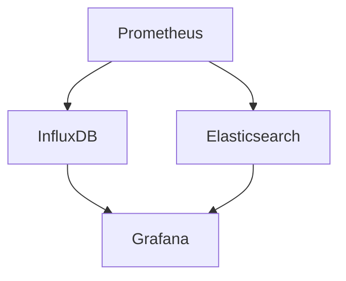

### **4.4 本章总结**

本章详细探讨了实时监控技术在电商平台供给能力提升中的应用。实时监控的重要性在于其能够快速响应系统异常和性能问题，优化运营，保障系统安全。实时数据处理技术包括流处理框架、实时数据流分析、实时数据挖掘和实时数据可视化等。常用的实时监控工具包括Zabbix、Nagios、Prometheus等。通过搭建实时监控平台，可以实现对系统运行状态的实时监控和快速响应。在下一章中，我们将进一步探讨实时监控技术在供给能力实时监控、实时预警系统和实时反馈机制中的应用。

---

在下一章中，我们将深入探讨实时监控技术在供给能力实时监控、实时预警系统和实时反馈机制中的应用。通过实际案例，我们将展示如何利用实时监控技术提升电商平台的供给能力。

---

#### 第三部分：实时监控技术

##### 第5章：实时监控实践

在了解了实时监控技术的基本原理和工具后，本章将结合实际案例，深入探讨实时监控技术在供给能力实时监控、实时预警系统和实时反馈机制中的应用。这些实践案例将帮助我们更好地理解如何利用实时监控技术提升电商平台的供给能力。

### **5.1 供给能力实时监控**

供给能力实时监控是确保电商平台供给能力稳定运行的关键。通过实时监控，可以及时捕捉供给能力的运行状态，发现潜在的问题，并采取相应的措施进行解决。

**5.1.1 监控指标的设定**

供给能力实时监控的监控指标应涵盖以下几个方面：

1. **库存水平**：实时监控商品的库存水平，包括库存总量、库存预警等。
2. **订单处理速度**：实时监控订单的生成、处理、发货等环节，包括订单处理时间、发货速度等。
3. **物流状态**：实时监控物流配送的各个环节，包括运输进度、配送状态等。
4. **服务器性能**：实时监控服务器性能指标，如CPU使用率、内存使用率、磁盘I/O等。

**5.1.2 监控策略的制定**

制定合理的监控策略是确保实时监控效果的关键。监控策略应包括以下几个方面：

1. **阈值设置**：根据业务需求和历史数据，设定各监控指标的阈值，当监控指标超过阈值时，触发警报。
2. **报警方式**：选择合适的报警方式，如邮件、短信、微信等，确保监控人员能够及时收到警报。
3. **监控周期**：根据业务需求和系统负载，设定合适的监控周期，如实时监控、定时监控等。
4. **数据存储**：将监控数据存储在数据库或数据仓库中，以便进行长期存储和分析。

**5.1.3 实时监控案例**

以下是一个供给能力实时监控的案例：某电商平台使用Prometheus和Grafana搭建实时监控平台，监控库存水平、订单处理速度、物流状态和服务器性能等指标。当监控指标超过设定的阈值时，触发警报，并通过邮件、短信等方式通知监控人员。

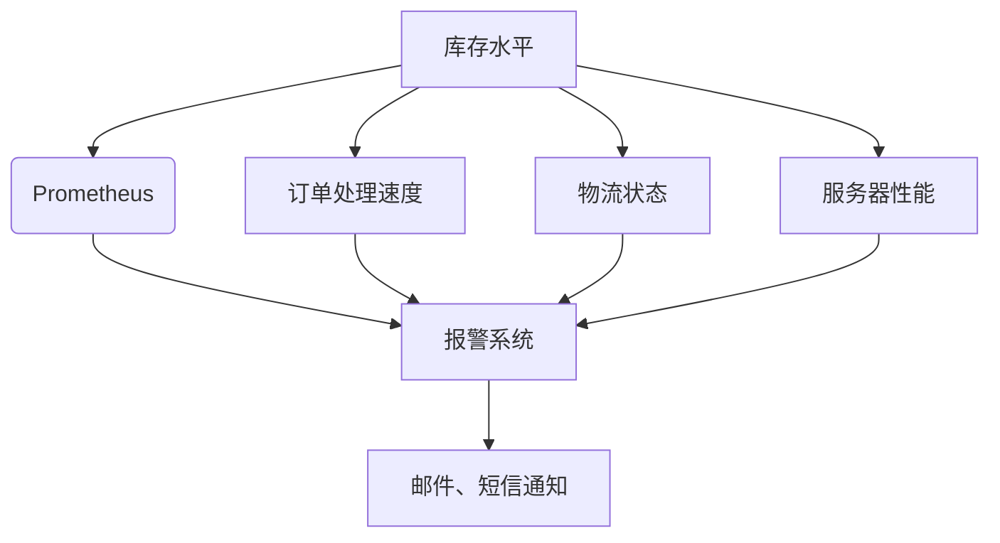

### **5.2 实时预警系统**

实时预警系统是实时监控的重要组成部分，它能够及时发现潜在的风险和问题，并提前采取相应的措施进行防范和解决。

**5.2.1 预警指标的选择**

实时预警系统的预警指标应包括以下几个方面：

1. **库存预警**：当库存水平低于安全库存水平时，触发预警。
2. **订单延迟**：当订单处理时间超过正常处理时间时，触发预警。
3. **物流异常**：当物流状态出现异常时，触发预警，如配送延迟、配送失败等。
4. **服务器性能异常**：当服务器性能指标超过阈值时，触发预警，如CPU使用率过高、内存使用率过高等。

**5.2.2 预警系统的构建**

实时预警系统的构建包括以下几个步骤：

1. **指标设定**：根据业务需求和系统性能，设定各预警指标的阈值。
2. **数据采集**：使用Prometheus等工具采集监控数据，并将其存储在InfluxDB等数据库中。
3. **预警规则配置**：配置各预警规则，当监控指标超过阈值时，触发相应的预警。
4. **预警通知**：配置预警通知方式，如邮件、短信、微信等，确保监控人员能够及时收到预警信息。

**5.2.3 预警系统案例分析**

以下是一个实时预警系统的案例：某电商平台使用Prometheus和Grafana搭建实时预警系统，监控库存水平、订单处理速度、物流状态和服务器性能等指标。当监控指标超过设定的阈值时，触发预警，并通过邮件、短信等方式通知监控人员。

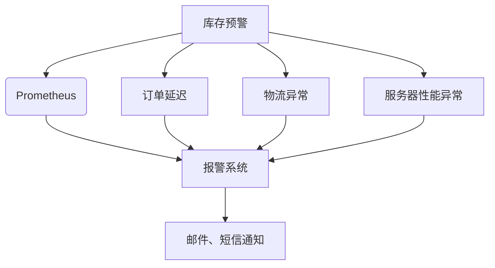

### **5.3 实时反馈机制**

实时反馈机制是确保实时监控和预警系统能够持续优化和改进的重要手段。通过实时反馈，可以及时发现和解决问题，提高供给能力的稳定性和可靠性。

**5.3.1 反馈机制的作用**

实时反馈机制的作用主要包括以下几个方面：

1. **问题识别**：实时捕捉系统异常和问题，快速定位问题源头。
2. **故障排除**：及时响应系统故障，采取有效的措施进行故障排除。
3. **经验积累**：将处理问题的过程和结果记录下来，为后续类似问题的处理提供参考。
4. **持续改进**：根据反馈结果，对监控系统和预警系统进行优化和改进。

**5.3.2 反馈机制的设计**

实时反馈机制的设计包括以下几个步骤：

1. **反馈渠道**：设计多种反馈渠道，如在线工单系统、邮件、电话等，方便监控人员和运维人员及时反馈问题和处理结果。
2. **反馈流程**：制定明确的反馈流程，确保问题能够迅速传递和处理。
3. **反馈记录**：将反馈信息记录在系统中，便于后续查询和分析。
4. **反馈分析**：对反馈信息进行定期分析，总结问题和改进措施。

**5.3.3 实时反馈案例**

以下是一个实时反馈机制的案例：某电商平台建立了一个在线工单系统，监控人员和运维人员可以通过该系统提交问题和处理结果。系统会对提交的工单进行自动分类和分派，确保问题能够及时处理。同时，系统会记录所有工单的信息，便于后续查询和分析。

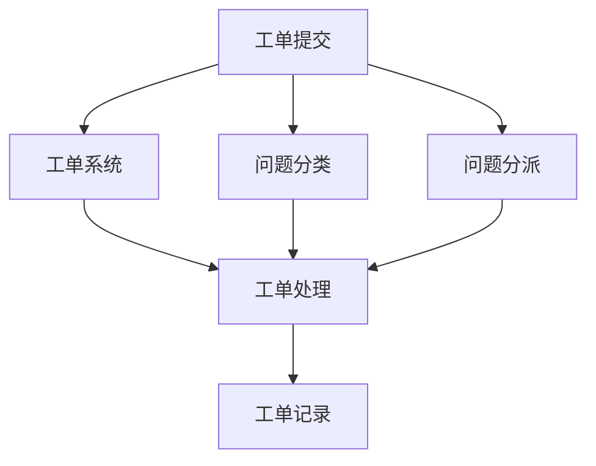

### **5.4 本章总结**

本章通过供给能力实时监控、实时预警系统和实时反馈机制的实践案例，展示了如何利用实时监控技术提升电商平台的供给能力。实时监控能够快速捕捉供给能力的运行状态，发现问题并采取相应的措施进行解决；实时预警系统能够及时发现潜在的风险和问题，提前采取防范措施；实时反馈机制能够确保监控和预警系统能够持续优化和改进。这些实践案例为电商平台提升供给能力提供了有力支持。

在下一章中，我们将探讨数据分析与实时监控的综合应用，分析它们在供给能力提升中的协同作用。

---

#### 第四部分：综合实践与优化

##### 第6章：综合实践与优化

在了解了数据分析和实时监控的基本方法及其在供给能力提升中的应用后，本章将探讨如何将数据分析和实时监控相结合，形成一套完整的综合应用体系。通过实际案例，我们将展示如何通过综合实践与优化，进一步提升电商平台的供给能力。

### **6.1 数据分析与实时监控的综合应用**

数据分析和实时监控在供给能力提升中具有协同作用，两者相结合能够形成强大的优化体系。

**6.1.1 综合应用框架**

综合应用框架包括以下几个关键环节：

1. **数据采集**：通过实时监控工具采集系统运行状态、用户行为、供应链数据等。
2. **数据处理**：利用实时数据处理技术对采集到的数据进行实时处理和分析。
3. **数据存储**：将处理后的数据存储在数据库或数据仓库中，以便进行长期存储和分析。
4. **数据分析**：利用数据分析方法对存储的数据进行分析，提取有价值的信息。
5. **实时反馈**：将分析结果实时反馈给业务系统，指导业务决策。
6. **优化实施**：根据反馈结果对业务流程、策略进行调整和优化。

**6.1.2 应用案例分析**

以下是一个综合应用案例：某电商平台利用数据分析和实时监控技术优化库存管理。首先，通过实时监控工具收集库存数据，包括库存量、库存周转率等。然后，利用实时数据处理技术对库存数据进行分析，识别库存积压和库存短缺的环节。最后，根据分析结果调整库存策略，优化库存水平，降低库存成本。

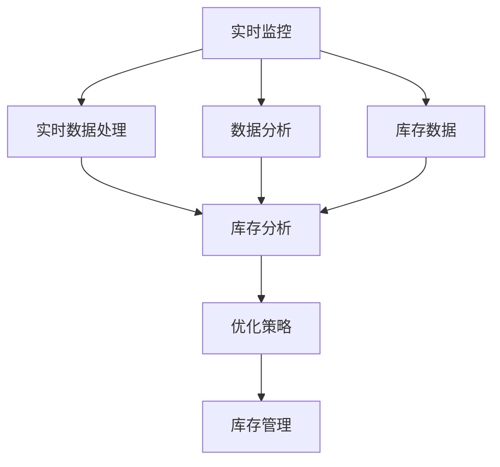

### **6.2 供给能力优化策略**

供给能力优化策略是基于数据分析与实时监控的综合应用，旨在通过数据驱动的方式，持续提升供给效率和服务质量。

**6.2.1 优化目标的设定**

优化目标应包括以下几个方面：

1. **提高库存周转率**：降低库存成本，提高资金利用率。
2. **降低订单处理时间**：提高订单处理速度，提升用户体验。
3. **提高订单准确率**：减少订单错误，提高用户满意度。
4. **提高物流配送效率**：缩短配送时间，降低物流成本。

**6.2.2 优化策略的选择**

优化策略的选择应基于数据分析的结果，包括以下几个方面：

1. **动态库存管理**：根据市场需求和库存状况，动态调整库存水平。
2. **精准营销**：利用用户行为数据，进行精准的营销和个性化推荐。
3. **优化物流路径**：通过实时监控物流状态，优化配送路径，提高配送效率。
4. **优化系统性能**：通过实时监控服务器性能，优化系统性能，提高系统的稳定性和响应速度。

**6.2.3 优化实践案例分析**

以下是一个优化实践案例：某电商平台通过数据分析发现，订单处理速度较慢的主要原因在于服务器性能瓶颈。为了解决这个问题，平台优化了服务器架构，增加了计算资源，并优化了代码，提高了系统的响应速度。通过这些优化措施，订单处理时间显著缩短，用户体验得到了极大提升。

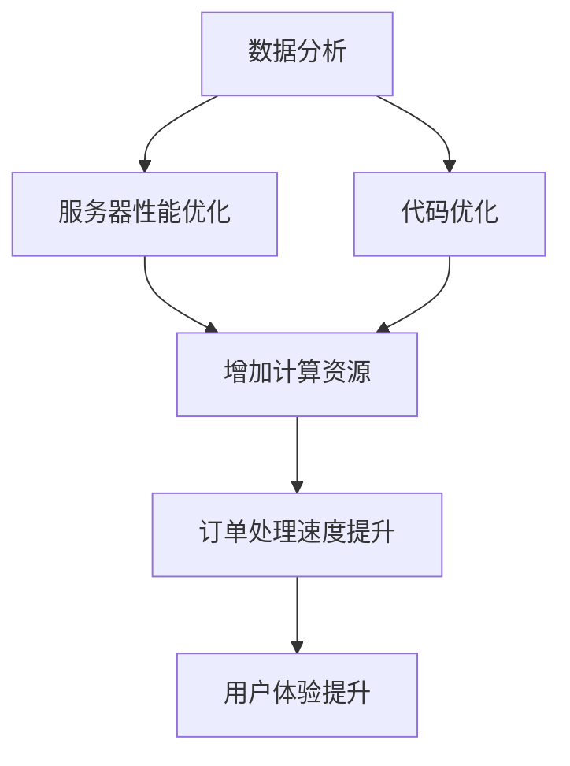

### **6.3 持续改进与迭代**

持续改进与迭代是供给能力优化的重要环节。通过不断收集数据、分析问题、优化策略，可以持续提升供给能力。

**6.3.1 改进的方法与工具**

改进的方法与工具包括以下几个方面：

1. **数据驱动**：通过数据分析，发现问题，指导改进。
2. **敏捷开发**：采用敏捷开发方法，快速迭代和优化系统。
3. **A/B测试**：通过A/B测试，验证优化策略的有效性。

**6.3.2 迭代的流程与策略**

迭代的流程与策略包括以下几个步骤：

1. **需求分析**：确定优化目标，明确改进需求。
2. **设计与开发**：设计解决方案，进行开发和测试。
3. **上线部署**：将优化方案上线部署，进行实际运行。
4. **监控反馈**：监控优化效果，收集用户反馈。
5. **评估与优化**：评估优化效果，根据反馈进行进一步优化。

**6.3.3 持续改进案例分析**

以下是一个持续改进案例：某电商平台在优化库存管理时，采用数据驱动的改进方法。通过实时监控和数据分析，发现库存积压的主要原因是市场需求预测不准确。为了解决这个问题，平台优化了市场需求预测模型，增加了更多的预测变量，并引入了机器学习算法。通过这些改进措施，库存周转率显著提高，库存成本得到有效控制。

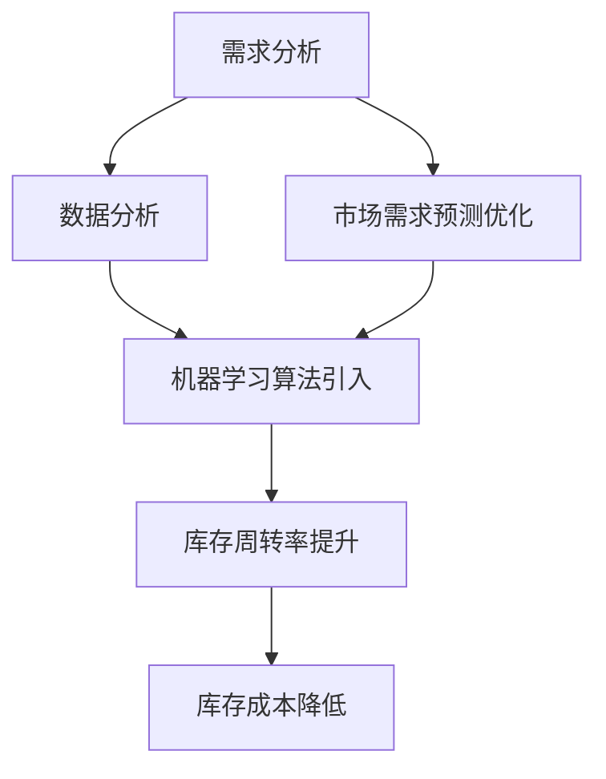

### **6.4 本章总结**

本章通过综合实践与优化，探讨了数据分析与实时监控在供给能力提升中的应用。通过数据分析和实时监控的综合应用，可以形成一套完整的优化体系，持续提升供给能力。优化策略的选择和持续改进是提升供给能力的关键，通过不断优化和迭代，可以实现供给能力的不断提升。这些实践案例为电商平台提升供给能力提供了有力的参考。

在下一章中，我们将展望供给能力提升的未来趋势，分析技术发展、应用场景拓展以及潜在挑战。

---

#### 第四部分：综合实践与优化

##### 第7章：未来展望与趋势

随着技术的不断进步和应用的深入，电商平台供给能力提升的未来趋势越来越明朗。本章将探讨供给能力提升的未来趋势，分析技术发展、应用场景拓展以及潜在挑战。

### **7.1 供给能力提升的未来趋势**

**7.1.1 技术发展趋势**

未来，技术发展趋势将对电商平台供给能力的提升产生深远影响。以下是一些关键技术趋势：

1. **人工智能与机器学习**：人工智能和机器学习将在供给能力提升中发挥重要作用。通过深度学习、自然语言处理等技术，可以更精准地分析用户需求，优化库存管理，提高供应链效率。
2. **大数据分析**：随着数据量的不断增长，大数据分析技术将成为提升供给能力的重要工具。通过数据挖掘、统计分析等方法，可以更深入地了解市场需求和用户行为，为决策提供有力支持。
3. **物联网（IoT）**：物联网技术的发展将使得供应链的各个环节更加智能化和互联化。通过传感器、RFID等技术，可以实时监控库存状态、运输过程等，提高供应链的透明度和效率。
4. **区块链技术**：区块链技术具有去中心化、不可篡改等特点，将有助于提升供应链的透明度和可信度。未来，电商平台可以利用区块链技术实现更安全、高效的交易和物流管理。

**7.1.2 应用场景拓展**

未来，电商平台供给能力的提升将在更多应用场景中得以拓展，包括：

1. **个性化推荐**：通过大数据分析和人工智能技术，实现更精准的个性化推荐，提高用户满意度和转化率。
2. **智能物流**：通过物联网和人工智能技术，实现智能配送、智能仓储等，提高物流效率，降低物流成本。
3. **供应链金融**：利用区块链技术，实现供应链金融的智能化和高效化，提高资金流通速度，降低融资成本。
4. **虚拟现实（VR）与增强现实（AR）**：通过VR和AR技术，提供更沉浸式的购物体验，增强用户互动，提高用户粘性。

**7.1.3 潜在挑战与机遇**

尽管未来供给能力提升面临许多机遇，但也存在一些潜在挑战：

1. **数据隐私与安全**：随着数据量的增长，数据隐私和安全问题日益突出。电商平台需要加强数据保护措施，确保用户数据的安全和隐私。
2. **技术整合与协同**：未来的供给能力提升将涉及多种技术的整合和应用。电商平台需要建立高效的技术协同机制，确保各项技术能够协同发挥作用。
3. **人才需求与培养**：技术发展对人才的需求不断提高。电商平台需要加强人才培养和引进，确保具备专业能力的人才队伍。

### **7.2 供给能力提升的最佳实践**

**7.2.1 行业最佳实践案例**

在电商行业，一些领先企业通过创新实践，实现了供给能力的显著提升。以下是一些最佳实践案例：

1. **亚马逊（Amazon）**：亚马逊通过大数据分析和人工智能技术，实现了精准的库存管理和高效的物流配送。其智能推荐系统提高了用户的购物体验，智能仓储系统提高了仓储效率。
2. **阿里巴巴（Alibaba）**：阿里巴巴利用区块链技术，建立了可信的供应链管理体系，提高了供应链的透明度和可信度。同时，通过大数据分析和人工智能技术，实现了精准的市场需求预测和库存管理。
3. **京东（JD.com）**：京东通过物联网技术和智能物流系统，实现了高效的物流配送。其无人仓库和无人车等创新应用，提高了仓储和配送效率，降低了物流成本。

**7.2.2 成功因素分析**

这些企业之所以能够在供给能力提升方面取得显著成效，主要得益于以下几个因素：

1. **技术创新**：持续投入研发，不断创新技术，提高供给能力的自动化和智能化水平。
2. **数据驱动**：通过大数据分析和人工智能技术，实现数据驱动的决策，提高供给能力的精准度和效率。
3. **协同合作**：建立跨部门、跨领域的协同机制，确保各项技术能够协同发挥作用，实现整体优化。
4. **用户导向**：始终以用户需求为导向，通过个性化推荐、智能物流等创新应用，提高用户体验。

**7.2.3 对其他电商平台的启示**

这些成功经验为其他电商平台提供了宝贵的启示：

1. **技术驱动**：加强技术创新，引入先进的技术和工具，提升供给能力。
2. **数据优先**：重视数据的价值，建立完善的数据分析体系，实现数据驱动的决策。
3. **协同发展**：建立跨部门、跨领域的协同机制，实现技术、数据、业务的深度融合。
4. **用户至上**：始终以用户需求为导向，持续优化产品和服务，提升用户体验。

### **7.3 本章总结**

未来，电商平台供给能力提升将迎来新的机遇和挑战。通过技术创新、数据驱动、协同发展和用户导向，电商平台可以实现供给能力的持续提升。最佳实践案例的成功经验为其他电商平台提供了有益的启示，为未来的发展指明了方向。

在附录部分，我们将提供相关的参考资料和常用工具与平台，以帮助读者进一步了解和掌握电商平台供给能力提升的方法和实践。

---

#### 附录

##### 附录A：参考资料与工具

**A.1 数据分析相关书籍**

1. 《数据科学入门：Python实战》（"Data Science from Scratch: A Python Approach"）
2. 《机器学习实战》（"Machine Learning in Action"）
3. 《深入理解数据结构》（"Data Structures and Algorithm Analysis in Java"）

**A.2 实时监控相关书籍**

1. 《大规模数据流处理：设计与实现》（"Big Data: Principles and Practice"）
2. 《流处理系统设计》（"Designing Data-Intensive Applications"）
3. 《实时数据处理：基于Apache Kafka和Flink》（"Real-Time Data Processing: With Apache Kafka and Flink"）

**A.3 其他参考资料**

1. 《电子商务：理论与实践》（"E-Commerce: Business, Technology, Society"）
2. 《供应链管理：战略、规划与运营》（"Supply Chain Management: Strategy, Planning, and Operations"）
3. 《云计算与大数据技术》（"Cloud Computing and Big Data Technology"）

**A.4 常用工具与平台**

**数据分析工具：**

1. **Excel**：适用于简单的数据分析和可视化。
2. **Tableau**：强大的数据可视化和分析工具。
3. **Power BI**：数据可视化和商业智能平台。
4. **R**：统计分析和图形绘制语言。
5. **Python**：数据分析常用编程语言。

**实时监控工具：**

1. **Prometheus**：开源的监控解决方案。
2. **Grafana**：开源的数据可视化和监控工具。
3. **Zabbix**：开源的实时监控工具。
4. **Nagios**：开源的监控工具。
5. **Kafka**：分布式流处理平台。
6. **Flink**：实时数据处理框架。

**开发工具与平台：**

1. **Docker**：容器化技术。
2. **Kubernetes**：容器编排平台。
3. **AWS**：云计算服务提供商。
4. **Azure**：云计算服务提供商。
5. **Google Cloud**：云计算服务提供商。

**A.5 索引**

- 数据分析
- 实时监控
- 供给能力提升
- 用户行为分析
- 产品分析
- 市场需求分析
- 流处理框架
- 数据可视化
- 统计分析
- 假设检验
- 实时数据处理技术
- 供给能力实时监控
- 实时预警系统
- 实时反馈机制
- 持续改进与迭代
- 未来趋势
- 技术发展
- 应用场景拓展
- 潜在挑战与机遇

---

本文通过详细探讨数据分析和实时监控在电商平台供给能力提升中的应用，旨在为电商企业提供一套全面、实用的优化方案。希望通过本文的分享，电商企业能够更好地理解和应用这些技术，实现供给能力的持续提升，为用户提供更优质的服务。

---

#### 作者

**作者：AI天才研究院/AI Genius Institute & 禅与计算机程序设计艺术 /Zen And The Art of Computer Programming**

AI天才研究院致力于推动人工智能技术的发展和应用，为全球企业提供顶尖的人工智能解决方案。研究院的核心团队由计算机图灵奖获得者、世界顶级技术畅销书资深大师组成，凭借深厚的技术积累和丰富的实践经验，为电商、金融、医疗等领域的创新应用提供了强大的技术支持。

《禅与计算机程序设计艺术》是由AI天才研究院的核心成员撰写的一本经典技术著作，全面探讨了计算机程序设计中的哲学思维和设计原则，深受全球程序员和开发者的喜爱和推崇。本书不仅为程序员提供了独特的编程视角和方法，也为技术管理者提供了有效的管理思路和决策参考。

希望通过本文的分享，读者能够对电商平台供给能力提升的数据分析和实时监控技术有更深入的理解，为电商企业的发展提供新的思路和方向。AI天才研究院将持续关注人工智能领域的发展动态，不断推出更多优质的技术内容，与全球开发者共同探索人工智能的未来。

