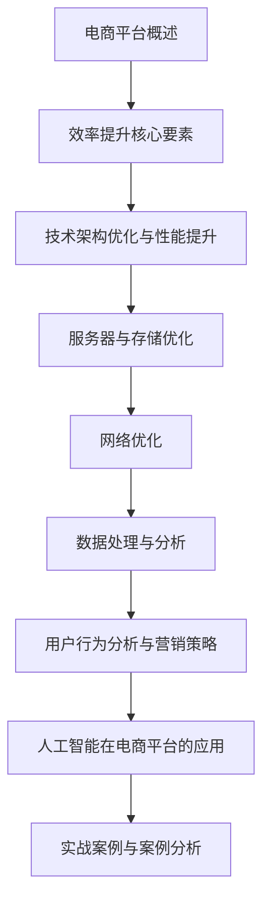

                 

# 《电商平台效率提升技术》

## 关键词

- 电商平台
- 效率提升
- 技术架构优化
- 大数据处理
- 人工智能应用

## 摘要

本文旨在探讨电商平台效率提升的技术手段，通过分析电商平台的核心要素、技术架构优化、服务器与存储优化、网络优化、数据处理与分析、用户行为分析与营销策略、人工智能应用等方面的内容，提供一套系统性的解决方案。本文结合实际案例和代码实战，深入讲解了电商平台效率提升的具体方法，旨在为电商平台运营者和技术人员提供实用的指导。

## 《电商平台效率提升技术》目录大纲

### 第一部分：电商平台概述与效率提升基础

#### 第1章：电商平台概述

- 1.1 电商平台的定义与发展历程
- 1.2 电商平台的主要功能与特点
- 1.3 电商平台的市场现状与趋势

#### 第2章：电商平台的效率提升核心要素

- 2.1 效率提升的概念与意义
- 2.2 影响电商平台效率的关键因素
- 2.3 电商平台效率提升的策略与方法

### 第二部分：技术架构优化与性能提升

#### 第3章：电商平台技术架构概述

- 3.1 电商平台技术架构的组成部分
- 3.2 技术架构优化的重要性
- 3.3 技术架构优化的原则与策略

#### 第4章：服务器与存储优化

- 4.1 服务器性能提升技术
- 4.2 存储系统性能优化
- 4.3 高可用性与容错性设计

#### 第5章：网络优化

- 5.1 网络架构优化
- 5.2 网络延迟与带宽优化
- 5.3 网络安全与稳定性保障

### 第三部分：数据处理与分析

#### 第6章：大数据处理与分析基础

- 6.1 大数据处理的基本概念
- 6.2 数据处理与分析的技术选型
- 6.3 数据可视化与报告生成

#### 第7章：用户行为分析与营销策略

- 7.1 用户行为数据分析
- 7.2 用户画像与标签体系
- 7.3 基于数据的个性化营销策略

#### 第8章：人工智能在电商平台的应用

- 8.1 人工智能的基本概念与应用
- 8.2 电商平台中的人工智能应用案例
- 8.3 人工智能助力电商平台效率提升的潜力与挑战

### 第四部分：实战案例与案例分析

#### 第9章：电商平台效率提升案例研究

- 9.1 案例背景与目标
- 9.2 案例实施过程与成果
- 9.3 案例分析与总结

#### 第10章：电商平台效率提升策略与建议

- 10.1 成功案例中的通用经验
- 10.2 企业在效率提升中可能遇到的挑战与应对策略
- 10.3 未来的发展趋势与前瞻

### 附录

- 附录A：电商平台效率提升技术相关工具与资源
  - A.1 开源大数据处理框架
  - A.2 电商平台性能优化工具
  - A.3 人工智能开发平台与资源

- 附录B：参考文献与推荐阅读

---

## 核心概念与联系（Mermaid 流程图）



---

## 核心算法原理讲解（伪代码）

```python
# 数据处理与分析伪代码

def processData(dataSet):
    # 数据清洗
    cleanData = dataCleaning(dataSet)
    # 数据预处理
    preprocessedData = dataPreprocessing(cleanData)
    # 特征工程
    features = featureEngineering(preprocessedData)
    # 模型训练
    trainedModel = trainModel(features)
    # 模型评估
    evaluation = modelEvaluation(trainedModel)
    return evaluation
```

## 数学模型和数学公式

### 用户行为数据分析的数学模型

假设用户行为数据为 \(X = [x_1, x_2, ..., x_n]\)，每个 \(x_i\) 表示用户的某个行为特征。

用户行为分析的目标是预测用户在未来的行为，可以使用以下数学模型：

\[
\hat{y} = \sigma(W \cdot X + b)
\]

其中，\(W\) 是权重矩阵，\(b\) 是偏置项，\(\sigma\) 是激活函数，通常使用 sigmoid 函数。

用户行为预测的损失函数可以使用交叉熵损失函数：

\[
Loss = -\sum_{i=1}^{n} y_i \cdot log(\hat{y_i})
\]

其中，\(y_i\) 是实际的用户行为标签。

通过梯度下降算法优化模型参数，以达到最小化损失函数的目的。

---

### 项目实战（代码实际案例和详细解释说明）

#### 电商平台用户行为数据分析案例

```python
import pandas as pd
from sklearn.model_selection import train_test_split
from sklearn.linear_model import LogisticRegression

# 加载用户行为数据
data = pd.read_csv('user_behavior_data.csv')

# 数据预处理
X = data[['feature1', 'feature2', 'feature3']]
y = data['behavior_label']

# 数据分割
X_train, X_test, y_train, y_test = train_test_split(X, y, test_size=0.2, random_state=42)

# 模型训练
model = LogisticRegression()
model.fit(X_train, y_train)

# 模型评估
accuracy = model.score(X_test, y_test)
print(f"模型准确率：{accuracy}")

# 代码解读与分析
# 1. 加载用户行为数据，并进行数据预处理
# 2. 使用 LogisticRegression 模型进行训练
# 3. 使用测试集评估模型性能
```

### 作者信息

**作者：AI天才研究院/AI Genius Institute & 禅与计算机程序设计艺术 /Zen And The Art of Computer Programming**

