                 

# 《电商生态系统的建设》

## 关键词

- 电商生态系统
- 电商平台
- 供应商
- 消费者
- 数据技术
- 信息技术
- 区块链

## 摘要

本文从多个角度深入探讨了电商生态系统的建设。首先，介绍了电商生态系统的定义、特点和发展历程，并详细阐述了其核心要素。接着，分析了电商生态系统中的核心参与者，包括电商平台、供应商和消费者，以及他们在生态系统中的角色和运营策略。随后，讨论了电商生态系统中的技术支持，包括数据技术和信息技术，并重点介绍了物联网和区块链技术在电商中的应用。文章接着提出了电商生态系统建设的原则和策略，以及电商生态系统的运营管理。最后，通过国内外电商生态系统的案例分析和创新趋势的探讨，对电商生态系统的未来进行了展望。本文旨在为读者提供全面、深入的电商生态系统建设知识，以指导实际操作。

### 第一部分：电商生态系统概述

## 第1章：电商生态系统基础

### 1.1 电商生态系统的定义和特点

**电商生态系统**是一个包含多个参与者（如电商平台、供应商、消费者）和多个环节（如商品采购、销售、物流、支付）的复杂网络系统。它不仅仅是一个电商平台，而是一个由技术、服务、资源和参与者共同构成的生态系统。电商生态系统的特点主要体现在以下几个方面：

1. **开放性和包容性**：电商生态系统具有开放性和包容性，能够容纳各种商业模式、技术和参与者，形成多样化的生态系统结构。
   
2. **协同性**：电商生态系统中的各个参与者通过协同合作，共同实现价值创造和传递，提高整个生态系统的运行效率。

3. **动态性**：电商生态系统是一个动态变化的系统，随着技术进步、市场需求变化和参与者行为的调整，生态系统也在不断演进。

4. **信息化和数字化**：电商生态系统高度依赖于信息技术和数据技术，通过信息化和数字化手段实现业务流程的自动化和智能化。

5. **全球化**：电商生态系统打破了地域限制，实现了全球范围内的商品交易和服务提供，促进了全球经济的融合。

**Mermaid流程图：**

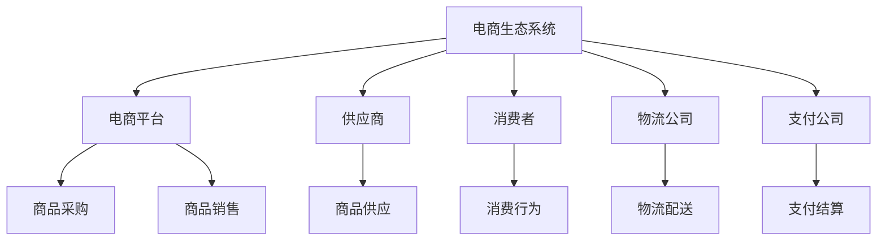

### 1.2 电商生态系统的发展历程

电商生态系统的发展可以追溯到20世纪90年代末，当时互联网的普及和电子商务的兴起为电商生态系统的形成提供了基础。以下是电商生态系统发展的几个重要阶段：

1. **萌芽阶段（1995-2000年）**：互联网的兴起催生了电子商务的萌芽，一些企业开始尝试在线销售商品，电商平台开始出现。

2. **成长阶段（2000-2010年）**：随着互联网技术的成熟和宽带网络的普及，电子商务进入成长阶段，各类电商平台纷纷涌现，如亚马逊、淘宝、京东等。

3. **成熟阶段（2010年至今）**：移动互联网的普及和智能手机的普及，使得电子商务进入成熟阶段，电商生态系统的建设逐步完善，涵盖了商品采购、销售、物流、支付等多个环节。

**Mermaid流程图：**

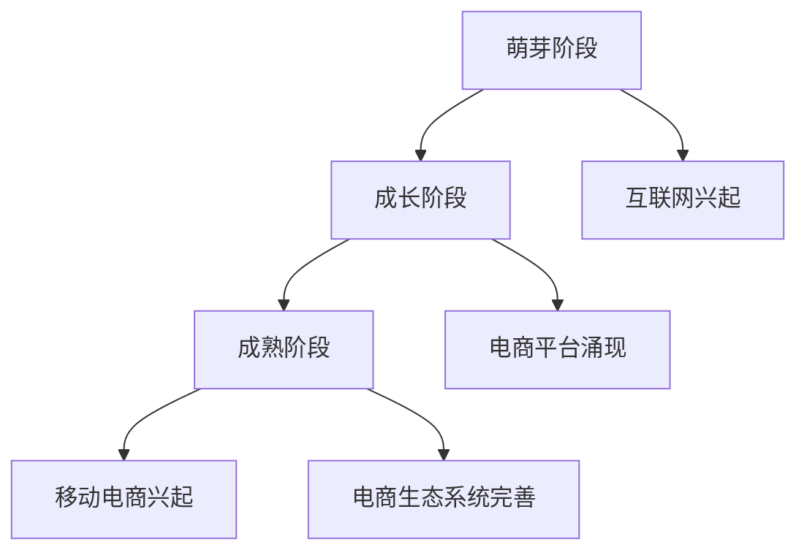

### 1.3 电商生态系统的核心要素

电商生态系统的核心要素包括：

1. **电商平台**：电商平台是电商生态系统的基础，它为供应商和消费者提供了交易和服务的平台。

2. **供应商**：供应商提供商品和服务，是电商生态系统的重要组成部分。

3. **消费者**：消费者是电商生态系统中的核心参与者，他们的需求和购买行为驱动了电商生态系统的发展。

4. **物流公司**：物流公司负责商品的配送，是确保电商交易顺利进行的关键环节。

5. **支付公司**：支付公司提供支付服务，确保交易的安全和便捷。

6. **数据技术**：数据技术为电商生态系统提供了信息支持和决策依据，包括数据采集、存储、分析和挖掘等。

7. **信息技术**：信息技术为电商生态系统提供了技术支持，包括电子商务平台的技术架构、物联网技术、区块链技术等。

**Mermaid流程图：**

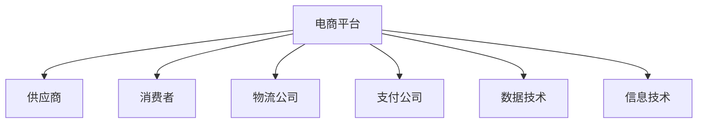

### 1.4 电商生态系统的运作机制

电商生态系统的运作机制主要包括以下几个环节：

1. **商品采购**：电商平台与供应商合作，采购商品。

2. **商品展示**：电商平台将商品信息展示给消费者，吸引消费者购买。

3. **消费者购买**：消费者通过电商平台进行商品选购，下单购买。

4. **支付结算**：消费者通过支付公司完成支付，支付公司确保交易安全。

5. **物流配送**：物流公司根据消费者的地址进行商品配送。

6. **售后服务**：电商平台和供应商提供售后服务，解决消费者的疑问和问题。

**Mermaid流程图：**

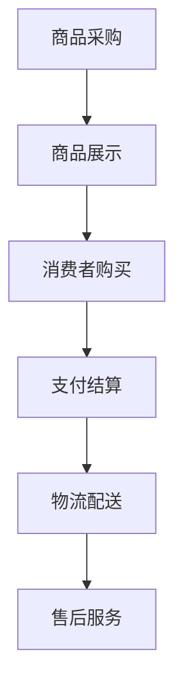

### 1.5 电商生态系统的重要性

电商生态系统在当今数字经济中具有重要地位，主要体现在以下几个方面：

1. **促进经济发展**：电商生态系统推动了商品流通和交易的便捷化，促进了经济增长。

2. **提高效率**：电商生态系统通过信息化和数字化手段，提高了业务流程的效率。

3. **降低成本**：电商生态系统减少了传统渠道中的中间环节，降低了交易成本。

4. **满足多样化需求**：电商生态系统提供了丰富的商品和服务，满足了消费者的多样化需求。

5. **创新驱动**：电商生态系统为技术创新提供了广阔的空间，推动了新技术的应用和发展。

### 1.6 电商生态系统面临的挑战

尽管电商生态系统具有许多优势，但在发展过程中也面临着一些挑战：

1. **竞争激烈**：电商平台数量众多，竞争异常激烈。

2. **数据安全和隐私保护**：随着数据技术的应用，数据安全和隐私保护问题日益突出。

3. **物流配送瓶颈**：物流配送成本高、效率低，成为电商生态系统的瓶颈。

4. **法律法规**：电商生态系统的法律法规体系尚不完善，存在监管漏洞。

5. **消费者信任**：消费者对电商平台和商品的真实性、可靠性存在担忧。

### 1.7 电商生态系统的发展趋势

未来，电商生态系统将呈现以下发展趋势：

1. **新零售**：线上线下融合，实现全渠道营销。

2. **智能化**：人工智能、物联网等技术的应用，提升生态系统智能化水平。

3. **全球化**：跨境电商的发展，推动电商生态系统全球化。

4. **可持续发展**：绿色物流、环保包装等，实现电商生态系统的可持续发展。

5. **个性化**：基于大数据和人工智能的个性化推荐，满足消费者个性化需求。

### 1.8 小结

电商生态系统是一个复杂而庞大的系统，它不仅改变了传统商业模式，还为经济发展和社会进步做出了重要贡献。了解电商生态系统的定义、特点、发展历程、核心要素、运作机制、重要性、挑战、发展趋势，对于企业、投资者和消费者都具有重要的意义。

## 第二部分：电商生态系统中的核心参与者

### 第2章：电商生态系统中的核心参与者

### 2.1 电商平台

#### 2.1.1 电商平台的发展历程

电商平台是电商生态系统的基础和核心，它为供应商和消费者提供了交易和服务的平台。电商平台的发展历程可以追溯到20世纪90年代末，随着互联网的兴起和电子商务的兴起，各类电商平台纷纷涌现。

1. **萌芽阶段（1995-2000年）**：在这一阶段，互联网的普及催生了电子商务的萌芽，一些企业开始尝试在线销售商品。这一时期，电商平台主要以简单的信息发布和交易服务为主，如早期的亚马逊和阿里巴巴。

2. **成长阶段（2000-2010年）**：随着互联网技术的成熟和宽带网络的普及，电子商务进入成长阶段。这一时期，各类电商平台纷纷涌现，如淘宝、京东、亚马逊等。这些电商平台通过提供更丰富的商品和服务，吸引了大量的消费者和供应商。

3. **成熟阶段（2010年至今）**：移动互联网的普及和智能手机的普及，使得电子商务进入成熟阶段。这一时期，电商平台开始向多元化、智能化方向发展，如直播电商、社交电商等新形态的电商平台不断涌现。

#### 2.1.2 电商平台的商业模式

电商平台的商业模式主要包括以下几种：

1. **C2C（消费者对消费者）模式**：如淘宝、拍拍等，消费者可以在平台上开设店铺，自主进行商品交易。

2. **B2C（商家对消费者）模式**：如京东、亚马逊等，商家在平台上开设店铺，直接向消费者销售商品。

3. **B2B（商家对商家）模式**：如阿里巴巴、慧聪网等，商家之间在平台上进行商品交易。

4. **O2O（线上到线下）模式**：如美团、大众点评等，通过线上平台吸引消费者到线下实体店消费。

5. **综合模式**：如苏宁易购、国美在线等，同时提供C2C、B2C、B2B等多种模式的服务。

#### 2.1.3 电商平台的运营策略

电商平台的运营策略主要包括以下几个方面：

1. **流量获取**：通过搜索引擎优化（SEO）、搜索引擎营销（SEM）、社交媒体推广等手段，吸引更多的用户访问平台。

2. **用户粘性**：通过提供优质的商品和服务，提高用户的满意度和忠诚度，增加用户的复购率。

3. **营销推广**：通过优惠券、促销活动、会员制度等手段，刺激消费者的购买欲望。

4. **供应链管理**：通过与供应商建立紧密的合作关系，确保商品的质量和供应。

5. **物流配送**：提供高效的物流服务，提高商品的配送速度和服务质量。

6. **数据分析**：通过大数据技术，分析用户行为和市场趋势，为决策提供依据。

#### 2.1.4 电商平台的优势和挑战

电商平台的优势主要体现在以下几个方面：

1. **覆盖面广**：电商平台可以跨越地域限制，为全国乃至全球的消费者提供服务。

2. **便捷性**：消费者可以随时随地通过电商平台购买商品，无需受限于时间和地点。

3. **多样化**：电商平台提供了丰富的商品和服务，满足了消费者的多样化需求。

4. **高效性**：电商平台通过信息化和数字化手段，提高了交易流程的效率。

电商平台面临的挑战主要包括以下几个方面：

1. **竞争激烈**：电商平台数量众多，竞争异常激烈，市场份额争夺激烈。

2. **成本高**：电商平台的运营成本较高，包括服务器租赁、技术维护、物流配送等。

3. **数据安全和隐私保护**：随着数据技术的应用，数据安全和隐私保护问题日益突出。

4. **消费者信任**：消费者对电商平台和商品的真实性、可靠性存在担忧。

5. **法律法规**：电商平台的法律法规体系尚不完善，存在监管漏洞。

#### 2.1.5 电商平台的发展趋势

未来，电商平台将呈现以下发展趋势：

1. **新零售**：线上线下融合，实现全渠道营销。

2. **智能化**：人工智能、物联网等技术的应用，提升电商平台智能化水平。

3. **全球化**：跨境电商的发展，推动电商平台全球化。

4. **可持续发展**：绿色物流、环保包装等，实现电商平台的可持续发展。

5. **个性化**：基于大数据和人工智能的个性化推荐，满足消费者个性化需求。

### 2.2 供应商

#### 2.2.1 供应商在电商生态系统中的角色

供应商是电商生态系统中的重要参与者，他们在电商生态系统中扮演着以下角色：

1. **商品提供者**：供应商为电商平台提供各种商品和服务，满足消费者的需求。

2. **合作伙伴**：供应商与电商平台建立合作关系，共同推动电商生态系统的健康发展。

3. **质量保证者**：供应商负责保证商品的质量，提高消费者满意度。

4. **创新推动者**：供应商通过技术创新，提高商品的质量和性价比，推动电商生态系统的发展。

#### 2.2.2 供应商的选择与评价

在选择供应商时，电商平台需要考虑以下几个方面：

1. **产品质量**：供应商提供的商品质量是否符合电商平台的要求，是否能够满足消费者的需求。

2. **供应能力**：供应商的生产能力和供应能力，是否能够满足电商平台的订单需求。

3. **价格竞争力**：供应商的价格是否具有竞争力，能否提供性价比高的商品。

4. **合作关系**：供应商与电商平台的关系，是否能够建立长期稳定的合作关系。

5. **服务态度**：供应商的服务态度是否良好，是否能够及时响应和解决问题。

评价供应商时，电商平台可以采用以下几种方法：

1. **客户反馈**：收集消费者对供应商商品的反馈，了解供应商的商品质量和售后服务。

2. **供应链绩效**：评估供应商在供应链管理中的表现，如交货准时率、库存周转率等。

3. **成本效益**：分析供应商的报价和成本，评估其价格竞争力。

4. **合作历史**：查看供应商与电商平台的合作历史，了解其合作稳定性。

#### 2.2.3 供应商管理策略

为了确保电商生态系统的稳定运行，电商平台需要制定有效的供应商管理策略，主要包括以下几个方面：

1. **合作机制的建立**：与供应商建立长期稳定的合作关系，明确双方的权利和义务。

2. **供应商评估与筛选**：定期对供应商进行评估和筛选，确保供应商的质量和供应能力。

3. **供应链协同**：与供应商建立信息共享机制，实现供应链的协同运作，提高供应链效率。

4. **质量监管**：加强对供应商的质量监管，确保商品质量符合要求。

5. **激励机制**：对表现良好的供应商进行激励，鼓励其提高产品质量和服务水平。

#### 2.2.4 供应商面临的挑战和机遇

供应商在电商生态系统中面临着以下挑战：

1. **竞争压力**：电商平台数量众多，供应商之间的竞争异常激烈。

2. **成本上升**：原材料成本、人力成本等不断上升，增加了供应商的成本压力。

3. **市场需求变化**：市场需求变化迅速，供应商需要及时调整生产和供应策略。

4. **数据安全和隐私保护**：随着数据技术的应用，数据安全和隐私保护问题日益突出。

供应商在电商生态系统中也面临着以下机遇：

1. **市场拓展**：电商平台的全球化发展，为供应商提供了更广阔的市场空间。

2. **技术创新**：电商平台的技术创新，为供应商提供了新的发展机遇。

3. **供应链协同**：与电商平台建立协同关系，提高供应链效率，降低成本。

4. **消费者需求升级**：消费者对商品质量和服务的要求不断提高，为供应商提供了提升产品质量和服务水平的机会。

### 2.3 消费者

#### 2.3.1 消费者在电商生态系统中的行为

消费者是电商生态系统中的核心参与者，他们的行为对电商生态系统的运行和发展具有重要影响。消费者在电商生态系统中的行为主要包括以下几个方面：

1. **搜索与浏览**：消费者通过电商平台搜索和浏览商品，寻找自己需要的商品。

2. **商品选择**：消费者根据商品的质量、价格、评价等信息，选择自己满意的商品。

3. **下单购买**：消费者在电商平台下单购买商品，完成支付。

4. **物流跟踪**：消费者在商品配送过程中，通过电商平台跟踪物流信息。

5. **售后服务**：消费者在商品使用过程中，通过电商平台寻求售后服务。

#### 2.3.2 消费者需求分析

了解消费者需求是电商平台和供应商制定策略的重要依据。消费者需求分析可以从以下几个方面进行：

1. **商品需求**：分析消费者对各类商品的需求，了解消费者偏好。

2. **价格需求**：分析消费者对商品价格的敏感度，了解消费者的价格承受能力。

3. **服务质量需求**：分析消费者对电商平台的售后服务、物流服务等的要求。

4. **个性化需求**：分析消费者的个性化需求，如定制商品、个性化推荐等。

5. **品牌需求**：分析消费者对品牌的偏好，了解消费者的品牌忠诚度。

#### 2.3.3 消费者满意度的评估与提升

消费者满意度是电商生态系统运营成功的关键指标。评估消费者满意度可以从以下几个方面进行：

1. **商品质量**：评估消费者对商品质量的满意度。

2. **价格合理性**：评估消费者对商品价格的满意度。

3. **服务质量**：评估消费者对电商平台的售后服务、物流服务等的满意度。

4. **购物体验**：评估消费者在电商平台购物的整体体验。

提升消费者满意度的方法包括：

1. **提高商品质量**：确保商品质量，满足消费者的需求。

2. **优化价格策略**：合理定价，提高消费者的价格满意度。

3. **提升服务质量**：提供优质的售后服务和物流服务，提高消费者的满意度。

4. **改善购物体验**：优化电商平台的设计和功能，提高消费者的购物体验。

### 2.4 第三方物流

#### 2.4.1 第三方物流在电商生态系统中的作用

第三方物流是电商生态系统中的重要组成部分，它在电商生态系统中发挥着重要作用，主要包括以下几个方面：

1. **物流服务提供者**：第三方物流为电商平台和供应商提供专业的物流服务，包括仓储、运输、配送等。

2. **供应链协同者**：第三方物流通过信息共享和协同作业，提高供应链的效率。

3. **成本控制者**：第三方物流通过规模效应和专业化服务，降低物流成本。

4. **服务质量保障者**：第三方物流通过完善的物流体系和服务标准，确保物流服务质量。

#### 2.4.2 第三方物流的服务模式

第三方物流的服务模式主要包括以下几种：

1. **仓储服务**：第三方物流提供仓储服务，包括库存管理、出入库管理等。

2. **运输服务**：第三方物流提供运输服务，包括长途运输、短途配送等。

3. **配送服务**：第三方物流提供配送服务，包括同城配送、异地配送等。

4. **供应链管理服务**：第三方物流提供供应链管理服务，包括物流咨询、供应链优化等。

#### 2.4.3 第三方物流的发展趋势

随着电商生态系统的快速发展，第三方物流也面临着新的发展机遇和挑战。第三方物流的发展趋势主要包括以下几个方面：

1. **智能化**：随着物联网、大数据、人工智能等技术的发展，第三方物流将实现智能化管理，提高物流效率。

2. **全球化**：随着跨境电商的发展，第三方物流将拓展全球业务，实现全球化运营。

3. **绿色物流**：随着环保意识的提高，第三方物流将加大对绿色物流的投入，推广环保包装和绿色运输。

4. **精细化服务**：第三方物流将提供更加精细化、个性化、定制化的物流服务，满足不同客户的需求。

### 2.5 支付平台

#### 2.5.1 支付平台在电商生态系统中的作用

支付平台是电商生态系统中不可或缺的一部分，它在电商交易中发挥着至关重要的作用，主要包括以下几个方面：

1. **交易媒介**：支付平台为电商平台和消费者提供了便捷的支付手段，确保交易的顺利进行。

2. **安全保障**：支付平台通过加密技术、风险控制等技术手段，保障交易的安全和可靠性。

3. **资金流转**：支付平台为电商平台和供应商提供了资金流转的渠道，提高了资金利用效率。

4. **数据支持**：支付平台积累了大量的交易数据，为电商平台和金融机构提供了数据支持。

#### 2.5.2 支付平台的类型

支付平台主要分为以下几种类型：

1. **银行卡支付**：包括借记卡、信用卡等，消费者可以直接通过银行卡进行支付。

2. **移动支付**：包括支付宝、微信支付等，消费者可以通过手机进行支付。

3. **电子钱包**：包括苹果钱包、谷歌钱包等，消费者可以通过电子钱包进行支付。

4. **支付公司支付**：包括PayPal等，消费者可以通过第三方支付公司进行支付。

#### 2.5.3 支付平台的发展趋势

随着科技的发展和消费者支付习惯的改变，支付平台的发展趋势主要包括以下几个方面：

1. **移动支付**：随着智能手机的普及，移动支付将逐渐成为主流支付方式。

2. **无现金支付**：随着无现金支付的发展，现金支付将逐渐减少。

3. **跨境支付**：随着跨境电商的发展，跨境支付将变得更加便捷和普及。

4. **支付技术创新**：随着人工智能、区块链等技术的发展，支付平台将不断创新，提供更安全、更便捷的支付服务。

## 第三部分：电商生态系统中的技术支持

### 第3章：电商生态系统中的技术支持

### 3.1 数据技术

#### 3.1.1 数据采集与处理

数据技术是电商生态系统中的重要组成部分，它为电商平台和供应商提供了数据采集、处理和分析的能力。数据采集与处理主要包括以下几个方面：

1. **数据采集**：通过网站访问日志、用户行为数据、交易数据等多种渠道采集数据。

2. **数据清洗**：对采集到的数据进行清洗，去除重复、错误和无效的数据。

3. **数据存储**：将清洗后的数据存储到数据库中，以便后续处理和分析。

4. **数据处理**：对存储的数据进行加工处理，如数据转换、数据归一化、特征提取等。

5. **数据挖掘**：利用数据挖掘技术，从大量数据中提取有用的信息和知识。

**Mermaid流程图：**

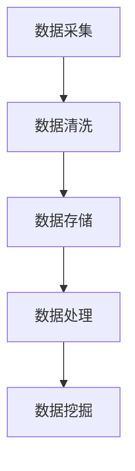

### 3.1.2 数据存储与挖掘

数据存储与挖掘是数据技术的核心，它为电商平台和供应商提供了强大的数据分析能力。数据存储与挖掘主要包括以下几个方面：

1. **数据存储**：选择合适的数据存储方案，如关系数据库、NoSQL数据库、数据仓库等，以高效、安全地存储数据。

2. **数据挖掘**：利用数据挖掘算法，从大量数据中提取有用的信息和知识，如聚类分析、关联规则挖掘、分类和预测等。

**Mermaid流程图：**

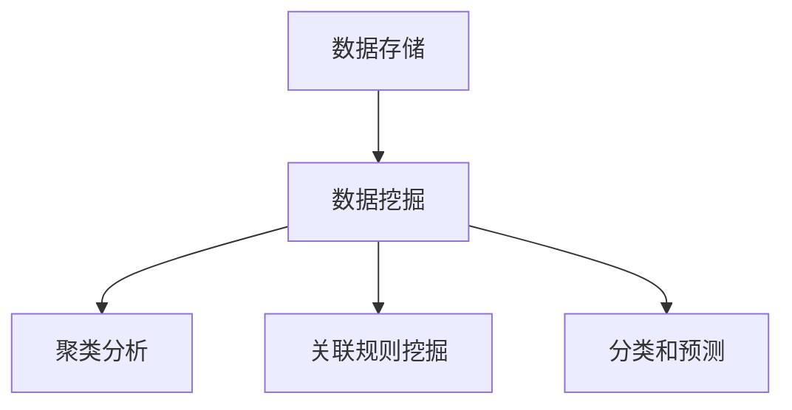

### 3.1.3 数据分析与应用

数据分析在电商生态系统中发挥着重要作用，它为电商平台和供应商提供了决策支持。数据分析主要包括以下几个方面：

1. **用户行为分析**：分析用户在电商平台上的行为，如浏览、购买、评价等，以了解用户需求和偏好。

2. **市场需求分析**：分析市场需求，如销量、价格、季节性等，以制定营销策略。

3. **供应链分析**：分析供应链的运行情况，如库存水平、物流效率等，以优化供应链管理。

4. **风险管理**：分析风险因素，如交易风险、库存风险等，以制定风险管理策略。

**Mermaid流程图：**

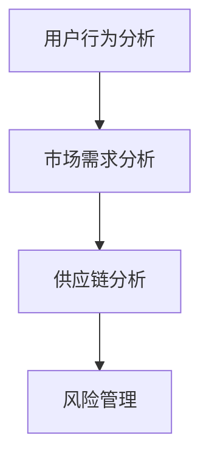

### 3.2 信息技术

#### 3.2.1 电子商务平台的技术架构

电子商务平台的技术架构是电商生态系统中的重要组成部分，它决定了电商平台的功能和性能。电子商务平台的技术架构主要包括以下几个方面：

1. **前端技术**：包括HTML、CSS、JavaScript等，负责用户界面的设计和交互。

2. **后端技术**：包括Java、Python、PHP等，负责业务逻辑的处理和数据管理。

3. **数据库技术**：包括关系数据库（如MySQL、Oracle）和NoSQL数据库（如MongoDB、Redis），负责数据的存储和管理。

4. **中间件技术**：包括消息队列（如RabbitMQ、Kafka）、缓存（如Redis、Memcached）等，负责系统的性能优化和稳定性。

5. **安全技术**：包括SSL/TLS、防火墙、加密算法等，负责系统的安全防护。

**Mermaid流程图：**

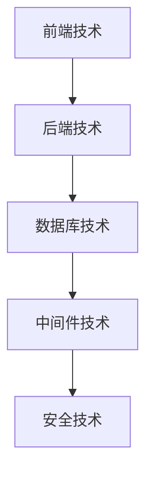

#### 3.2.2 物联网技术在电商中的应用

物联网（IoT）技术在电商中的应用日益广泛，它为电商平台和供应商提供了新的发展机遇。物联网技术在电商中的应用主要包括以下几个方面：

1. **智能设备**：通过智能设备（如智能手环、智能手表、智能门锁等）收集用户数据，提供个性化的服务和体验。

2. **智能物流**：通过物联网技术实现物流设备的智能化，提高物流效率，降低物流成本。

3. **智能供应链**：通过物联网技术实现供应链的智能化，提高供应链的透明度和可控性。

4. **智能零售**：通过物联网技术实现零售环节的智能化，如智能货架、智能收银等，提高零售效率。

**Mermaid流程图：**

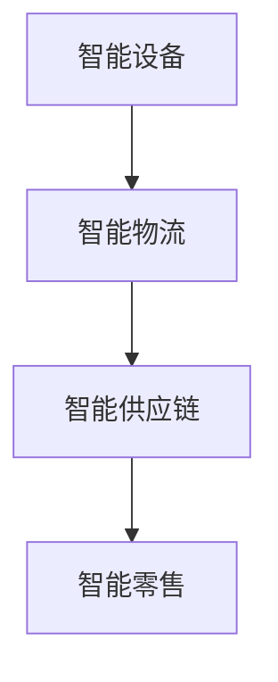

#### 3.2.3 区块链技术在电商中的应用

区块链技术在电商中的应用为电商平台和供应商提供了新的发展机遇。区块链技术在电商中的应用主要包括以下几个方面：

1. **智能合约**：通过智能合约实现自动化的交易处理，提高交易效率和降低交易成本。

2. **去中心化存储**：通过区块链技术实现数据的去中心化存储，提高数据的安全性和可靠性。

3. **供应链溯源**：通过区块链技术实现供应链的溯源，提高供应链的透明度和可控性。

4. **数字身份认证**：通过区块链技术实现数字身份认证，提高用户身份验证的安全性和便捷性。

**Mermaid流程图：**

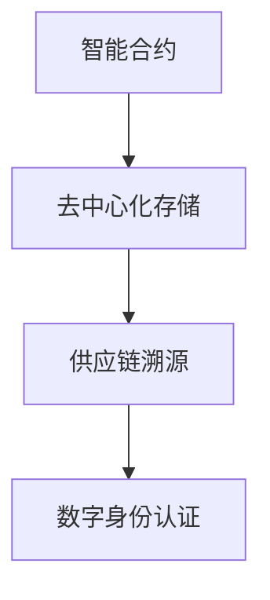

### 3.3 人工智能技术在电商中的应用

人工智能（AI）技术在电商中的应用为电商平台和供应商提供了新的发展机遇。人工智能技术在电商中的应用主要包括以下几个方面：

1. **用户画像**：通过用户行为数据建立用户画像，实现精准营销。

2. **推荐系统**：通过机器学习算法实现商品推荐，提高用户购买转化率。

3. **自然语言处理**：通过自然语言处理技术实现智能客服、智能评论分析等。

4. **图像识别**：通过图像识别技术实现商品识别、库存管理、物流跟踪等。

**Mermaid流程图：**

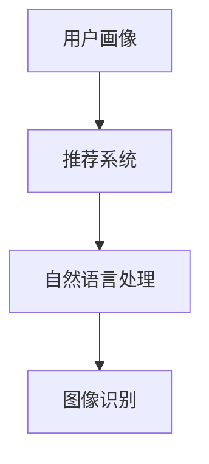

### 3.4 大数据技术在电商中的应用

大数据技术在电商中的应用为电商平台和供应商提供了强大的数据分析能力。大数据技术在电商中的应用主要包括以下几个方面：

1. **用户行为分析**：通过大数据技术分析用户行为，了解用户需求和偏好。

2. **市场需求预测**：通过大数据技术预测市场需求，制定营销策略。

3. **供应链优化**：通过大数据技术优化供应链管理，提高供应链效率。

4. **风险控制**：通过大数据技术识别和防范风险，确保交易安全。

**Mermaid流程图：**

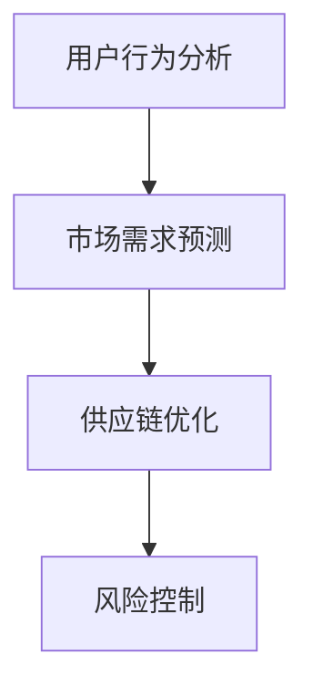

### 3.5 云计算技术在电商中的应用

云计算技术在电商中的应用为电商平台和供应商提供了强大的计算和存储能力。云计算技术在电商中的应用主要包括以下几个方面：

1. **弹性计算**：根据业务需求动态调整计算资源，提高资源利用率。

2. **分布式存储**：通过分布式存储技术提高数据的存储效率和可靠性。

3. **大数据处理**：通过云计算平台处理海量数据，实现高效的数据分析。

4. **安全性**：通过云计算平台提供的安全服务，确保数据安全和系统安全。

**Mermaid流程图：**

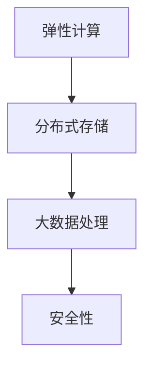

### 3.6 安全技术在电商中的应用

随着电商的发展，网络安全问题日益突出。安全技术为电商平台和供应商提供了保护，确保交易安全和数据安全。安全技术主要包括以下几个方面：

1. **数据加密**：通过加密算法对数据进行加密，确保数据在传输和存储过程中的安全。

2. **身份认证**：通过身份认证技术，确保用户的真实性和合法性。

3. **防火墙**：通过防火墙技术，防止外部攻击和恶意软件的侵入。

4. **入侵检测**：通过入侵检测系统，实时监测网络流量，识别和阻止恶意攻击。

**Mermaid流程图：**

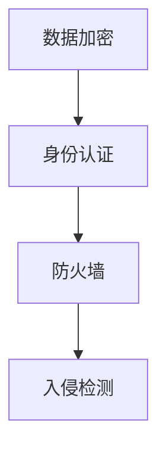

### 3.7 电商生态系统中的技术创新

电商生态系统中的技术创新不断推动着电商的发展。以下是一些重要的技术创新：

1. **5G技术**：5G技术的普及将提高网络的传输速度和稳定性，为电商提供更好的用户体验。

2. **区块链技术**：区块链技术的应用将提高交易的安全性和透明度，解决信任问题。

3. **人工智能技术**：人工智能技术的应用将实现更精准的营销、更高效的供应链管理。

4. **物联网技术**：物联网技术的应用将实现智能化的物流和供应链管理，提高效率。

**Mermaid流程图：**

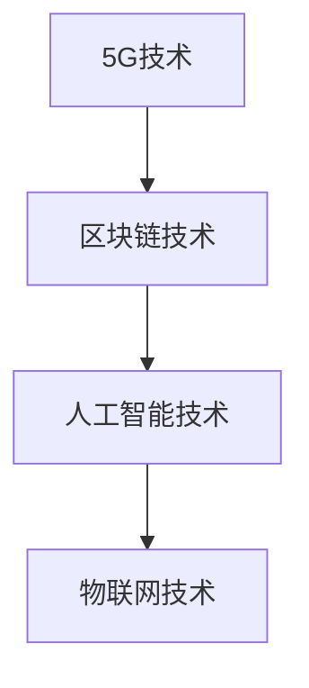

### 3.8 技术支持在电商生态系统中的重要性

技术支持在电商生态系统中起着至关重要的作用。它不仅提高了电商平台的运营效率，还为供应商和消费者提供了更好的服务和体验。以下是一些技术支持在电商生态系统中的重要性：

1. **提高效率**：通过技术支持，电商平台可以自动化和优化业务流程，提高运营效率。

2. **降低成本**：技术支持可以降低电商平台的运营成本，如物流成本、人力成本等。

3. **提升用户体验**：技术支持可以提供更好的用户界面和个性化服务，提升用户体验。

4. **确保安全**：技术支持可以确保电商平台和消费者的数据安全，防止网络攻击和数据泄露。

5. **促进创新**：技术支持为电商平台和供应商提供了创新的机会，推动电商生态系统的持续发展。

**Mermaid流程图：**

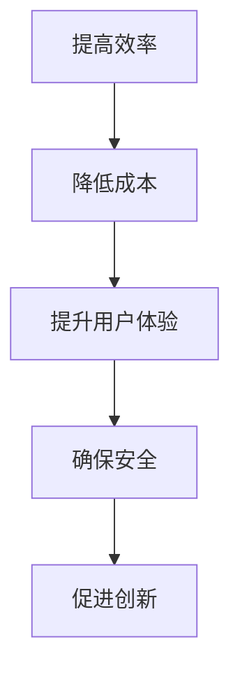

### 3.9 技术支持的发展趋势

随着科技的快速发展，技术支持在电商生态系统中的应用也在不断升级。以下是一些技术支持的发展趋势：

1. **云计算和大数据**：云计算和大数据技术的应用将更加普及，为电商提供更强大的计算和存储能力。

2. **人工智能和机器学习**：人工智能和机器学习技术的应用将实现更精准的数据分析和决策支持。

3. **区块链技术**：区块链技术的应用将提高交易的安全性和透明度，解决信任问题。

4. **物联网技术**：物联网技术的应用将实现更智能化的物流和供应链管理。

5. **5G技术**：5G技术的普及将提高网络的传输速度和稳定性，为电商提供更好的用户体验。

**Mermaid流程图：**

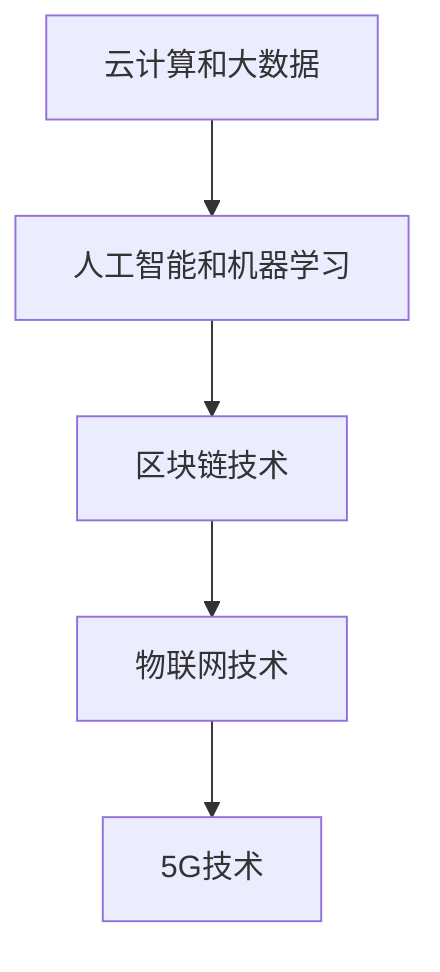

### 3.10 小结

电商生态系统中的技术支持为电商平台、供应商和消费者提供了强大的支撑，提高了运营效率，降低了成本，提升了用户体验，并确保了安全。技术支持在电商生态系统中的重要性不言而喻，它不仅推动了电商的发展，还为未来的创新提供了无限可能。

## 第四部分：电商生态系统的建设策略

### 第4章：电商生态系统的建设策略

### 4.1 电商生态系统的建设原则

在建设电商生态系统时，需要遵循一系列原则，以确保生态系统的稳定、健康和可持续发展。以下是电商生态系统建设的主要原则：

#### 4.1.1 可持续性原则

**可持续性原则**是指电商生态系统在建设和发展过程中，需要考虑环境保护、资源利用和经济效益的平衡。具体来说，主要包括以下几个方面：

1. **绿色发展**：推广绿色物流、环保包装等，减少对环境的污染。
2. **节能减排**：通过技术创新和优化，降低能源消耗和碳排放。
3. **资源利用**：提高资源的利用效率，减少资源浪费。
4. **社会责任**：关注社会责任，积极参与公益活动，促进社会和谐。

**Mermaid流程图：**

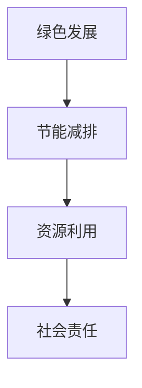

#### 4.1.2 合作共赢原则

**合作共赢原则**强调生态系统中的各个参与者之间应该建立紧密的合作关系，实现共同发展和利益最大化。具体包括：

1. **平台与供应商**：电商平台与供应商之间应建立长期稳定的合作关系，共同推动业务发展。
2. **供应商与消费者**：供应商应关注消费者的需求，提供高质量的产品和服务，实现消费者满意。
3. **多方协同**：电商平台、供应商、物流公司、支付公司等各方应协同合作，提高整体运营效率。

**Mermaid流程图：**

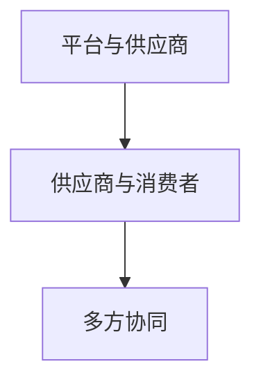

#### 4.1.3 创新驱动原则

**创新驱动原则**强调创新是电商生态系统建设和发展的重要动力。创新包括技术、模式、管理等多方面的创新。具体包括：

1. **技术创新**：不断引入新技术，如人工智能、大数据、物联网等，提高生态系统的智能化水平。
2. **模式创新**：探索新的商业模式，如新零售、社交电商、直播电商等，满足消费者多样化需求。
3. **管理创新**：通过创新管理理念和方法，提高生态系统运营效率。

**Mermaid流程图：**

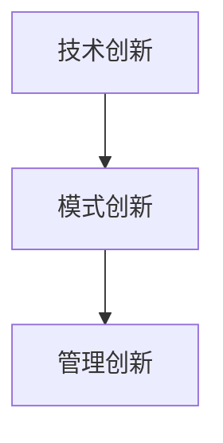

### 4.2 电商生态系统的建设步骤

要成功建设一个电商生态系统，需要遵循一系列科学的步骤，以下是主要的步骤：

#### 4.2.1 制定战略规划

**制定战略规划**是电商生态系统建设的第一步，它明确了生态系统的长远发展方向和目标。具体包括：

1. **市场定位**：确定目标市场，明确生态系统的定位。
2. **发展目标**：设定具体的发展目标，如用户规模、市场份额等。
3. **战略路径**：制定实现目标的战略路径，明确关键步骤和时间表。
4. **资源分配**：合理分配资源，确保战略规划的执行。

**Mermaid流程图：**

```mermaid
graph TD
    A[市场定位] --> B[发展目标]
    B --> C[战略路径]
    C --> D[资源分配]
```

#### 4.2.2 资源整合与协同

**资源整合与协同**是电商生态系统建设的关键环节，它涉及到生态系统内部和外部资源的有效整合。具体包括：

1. **内部资源整合**：整合电商平台、供应商、物流公司、支付公司等内部资源，实现协同作战。
2. **外部资源整合**：与外部合作伙伴建立合作关系，共同推动生态系统的发展。
3. **技术协同**：利用大数据、人工智能等技术，实现各环节的协同和优化。

**Mermaid流程图：**

```mermaid
graph TD
    A[内部资源整合] --> B[外部资源整合]
    B --> C[技术协同]
```

#### 4.2.3 风险管理与应对

**风险管理与应对**是电商生态系统建设中的重要环节，它涉及到对各种风险的识别、评估和控制。具体包括：

1. **风险识别**：识别生态系统建设过程中可能面临的风险，如市场风险、技术风险、法律风险等。
2. **风险评估**：评估各种风险的严重程度和可能性，确定优先级。
3. **风险控制**：采取有效的措施控制风险，如制定风险应对策略、建立风险预警机制等。
4. **应急处理**：建立应急预案，确保在风险发生时能够及时响应和处置。

**Mermaid流程图：**

```mermaid
graph TD
    A[风险识别] --> B[风险评估]
    B --> C[风险控制]
    C --> D[应急处理]
```

### 4.3 电商生态系统的运营管理

电商生态系统的运营管理是确保生态系统稳定运行和持续发展的重要保障。以下是电商生态系统运营管理的几个关键方面：

#### 4.3.1 电商平台运营管理

**电商平台运营管理**主要包括以下几个方面：

1. **用户管理**：包括用户注册、认证、用户服务、用户反馈等。
2. **商品管理**：包括商品发布、商品分类、商品评价、商品推荐等。
3. **交易管理**：包括订单处理、支付结算、售后服务等。
4. **数据分析**：通过大数据分析，了解用户行为和市场趋势，优化运营策略。

**Mermaid流程图：**

```mermaid
graph TD
    A[用户管理] --> B[商品管理]
    B --> C[交易管理]
    C --> D[数据分析]
```

#### 4.3.2 供应链管理

**供应链管理**是电商生态系统的重要组成部分，它涉及从原材料采购到产品交付的整个供应链过程。主要包括：

1. **供应商管理**：选择合适的供应商，建立稳定的供应商关系，确保商品的质量和供应。
2. **库存管理**：优化库存水平，减少库存成本，提高库存周转率。
3. **物流管理**：确保商品及时、安全地送达消费者，优化物流成本。
4. **采购管理**：通过数据分析，预测市场需求，制定采购策略。

**Mermaid流程图：**

```mermaid
graph TD
    A[供应商管理] --> B[库存管理]
    B --> C[物流管理]
    C --> D[采购管理]
```

#### 4.3.3 客户关系管理

**客户关系管理**（CRM）是电商生态系统运营管理的重要组成部分，它通过建立和维护良好的客户关系，提高客户满意度和忠诚度。主要包括：

1. **客户信息管理**：收集、存储和管理客户信息，确保数据准确和完整。
2. **客户服务**：提供优质的客户服务，包括售前咨询、售中支持和售后服务。
3. **客户关系分析**：通过数据分析，了解客户需求和行为，优化客户关系管理策略。
4. **客户体验优化**：不断改进客户体验，提高客户满意度和忠诚度。

**Mermaid流程图：**

```mermaid
graph TD
    A[客户信息管理] --> B[客户服务]
    B --> C[客户关系分析]
    C --> D[客户体验优化]
```

### 4.4 电商生态系统的运营优化策略

电商生态系统的运营优化策略是提高生态系统运行效率和效益的重要手段。以下是几个关键的优化策略：

#### 4.4.1 数据驱动运营

**数据驱动运营**是通过大数据和人工智能技术，实现对用户行为、市场趋势和运营绩效的实时监控和分析，从而优化运营策略。具体包括：

1. **实时数据监控**：通过数据监控系统，实时监控用户行为、交易数据和运营绩效。
2. **数据分析**：利用数据分析工具，深入挖掘数据背后的信息和规律。
3. **运营决策**：基于数据分析结果，制定和调整运营策略。

**Mermaid流程图：**

```mermaid
graph TD
    A[实时数据监控] --> B[数据分析]
    B --> C[运营决策]
```

#### 4.4.2 个性化服务

**个性化服务**是根据用户的个性化需求和行为特征，提供定制化的产品和服务，提高用户满意度和忠诚度。具体包括：

1. **用户画像**：通过数据分析，构建用户的个性化画像。
2. **个性化推荐**：基于用户画像，提供个性化的商品推荐和营销活动。
3. **个性化体验**：优化用户界面和交互设计，提供个性化的用户体验。

**Mermaid流程图：**

```mermaid
graph TD
    A[用户画像] --> B[个性化推荐]
    B --> C[个性化体验]
```

#### 4.4.3 跨渠道整合

**跨渠道整合**是将线上和线下的渠道整合在一起，提供统一的购物体验。具体包括：

1. **线上线下融合**：通过线上平台和线下实体店相互补充，提供全渠道购物体验。
2. **数据共享**：通过数据共享，实现线上和线下渠道的数据互通。
3. **渠道协同**：通过渠道协同，实现资源整合和优化运营。

**Mermaid流程图：**

```mermaid
graph TD
    A[线上线下融合] --> B[数据共享]
    B --> C[渠道协同]
```

#### 4.4.4 智能化运营

**智能化运营**是通过人工智能和物联网技术，实现电商生态系统的自动化和智能化。具体包括：

1. **自动化流程**：通过自动化技术，实现业务流程的自动化。
2. **智能决策**：通过大数据分析和人工智能算法，实现智能化的决策支持。
3. **智能化服务**：通过智能客服、智能推荐等，提供智能化的服务体验。

**Mermaid流程图：**

```mermaid
graph TD
    A[自动化流程] --> B[智能决策]
    B --> C[智能化服务]
```

### 4.5 电商生态系统的绩效评估

**电商生态系统的绩效评估**是衡量生态系统运行效率和效益的重要手段。以下是几个关键的绩效评估指标：

#### 4.5.1 用户满意度

**用户满意度**是衡量生态系统服务质量和用户满意度的关键指标。具体包括：

1. **用户评价**：收集用户对生态系统的评价，如评分、评论等。
2. **用户反馈**：通过用户反馈，了解用户的满意度和不满意度。
3. **用户留存率**：通过用户留存率，衡量用户的满意度和忠诚度。

**Mermaid流程图：**

```mermaid
graph TD
    A[用户评价] --> B[用户反馈]
    B --> C[用户留存率]
```

#### 4.5.2 商业效益

**商业效益**是衡量生态系统经济效益的关键指标。具体包括：

1. **销售额**：通过销售额，衡量生态系统的商业收益。
2. **利润率**：通过利润率，衡量生态系统的盈利能力。
3. **成本效率**：通过成本效率，衡量生态系统的运营成本。

**Mermaid流程图：**

```mermaid
graph TD
    A[销售额] --> B[利润率]
    B --> C[成本效率]
```

#### 4.5.3 运营效率

**运营效率**是衡量生态系统运营效率的关键指标。具体包括：

1. **交易量**：通过交易量，衡量生态系统的业务规模。
2. **交易速度**：通过交易速度，衡量生态系统的响应速度。
3. **服务质量**：通过服务质量，衡量生态系统的服务能力。

**Mermaid流程图：**

```mermaid
graph TD
    A[交易量] --> B[交易速度]
    B --> C[服务质量]
```

### 4.6 电商生态系统的可持续发展

**电商生态系统的可持续发展**是确保生态系统长期稳定和健康发展的关键。以下是几个关键策略：

#### 4.6.1 环境保护

**环境保护**是电商生态系统可持续发展的重要方面。具体包括：

1. **绿色物流**：推广绿色物流，减少碳排放。
2. **环保包装**：使用环保材料，减少包装污染。
3. **节能减排**：通过技术创新，提高能源利用效率。

**Mermaid流程图：**

```mermaid
graph TD
    A[绿色物流] --> B[环保包装]
    B --> C[节能减排]
```

#### 4.6.2 社会责任

**社会责任**是电商生态系统可持续发展的重要方面。具体包括：

1. **公益活动**：参与公益活动，回馈社会。
2. **员工关怀**：关注员工福利和职业发展。
3. **社区支持**：支持社区发展和改善。

**Mermaid流程图：**

```mermaid
graph TD
    A[公益活动] --> B[员工关怀]
    B --> C[社区支持]
```

#### 4.6.3 经济发展

**经济发展**是电商生态系统可持续发展的重要方面。具体包括：

1. **技术创新**：推动技术创新，提高生态系统的竞争力。
2. **产业升级**：促进产业升级，实现经济转型。
3. **就业机会**：创造就业机会，促进经济发展。

**Mermaid流程图：**

```mermaid
graph TD
    A[技术创新] --> B[产业升级]
    B --> C[就业机会]
```

### 4.7 小结

电商生态系统的建设需要遵循可持续性、合作共赢和创新驱动等原则，通过科学的步骤和有效的运营管理策略，实现生态系统的稳定、健康和可持续发展。电商生态系统的发展不仅推动了经济的增长，也为社会进步做出了重要贡献。

## 第五部分：电商生态系统的案例分析

### 第5章：国内外电商生态系统的案例分析

### 5.1 国内电商生态系统的案例分析

国内电商生态系统的案例分析主要包括阿里巴巴、京东和拼多多等电商平台。以下是这些平台的详细分析。

#### 5.1.1 阿里巴巴电商生态系统的建设与运营

**阿里巴巴电商生态系统**是中国最大的电商生态系统之一，涵盖了淘宝、天猫、阿里云等多个业务板块。以下是阿里巴巴电商生态系统的建设与运营分析：

1. **整体架构**：阿里巴巴电商生态系统的整体架构分为三个层次：基础设施层、平台服务层和业务应用层。基础设施层包括云计算、大数据和人工智能等核心技术；平台服务层提供电商、金融、物流等一站式服务；业务应用层则涵盖了各类电商平台和业务场景。

**Mermaid流程图：**

```mermaid
graph TD
    A[基础设施层] --> B[平台服务层]
    B --> C[业务应用层]
```

2. **商业模式**：阿里巴巴的商业模式主要包括C2C（淘宝）、B2C（天猫）和C2M（定制化）等。淘宝通过C2C模式吸引了大量的消费者和商家，实现了商品交易；天猫通过B2C模式为品牌商家提供在线销售渠道；C2M模式则通过大数据和人工智能技术，实现了定制化生产。

3. **运营策略**：阿里巴巴通过以下几个方面实现了电商生态系统的运营：
   - **用户粘性**：通过会员制度、积分系统、推荐系统等，提高用户的粘性。
   - **营销推广**：通过双11、618等大型促销活动，提升品牌知名度和用户购买欲望。
   - **供应链管理**：通过菜鸟网络等物流公司，实现了高效的物流配送服务。
   - **大数据和人工智能**：利用大数据和人工智能技术，实现精准营销和智能推荐。

4. **技术支持**：阿里巴巴在电商生态系统中的技术支持主要包括：
   - **云计算**：通过阿里云提供云计算服务，支持海量数据存储和处理。
   - **大数据**：通过大数据技术，分析用户行为和市场趋势，为决策提供支持。
   - **人工智能**：通过人工智能技术，实现智能客服、智能推荐等。

**Mermaid流程图：**

```mermaid
graph TD
    A[用户粘性] --> B[营销推广]
    B --> C[供应链管理]
    C --> D[大数据和人工智能]
```

#### 5.1.2 京东电商生态系统的特点与发展策略

**京东电商生态系统**是中国第二大电商生态系统，以其高效的物流服务和优质的购物体验著称。以下是京东电商生态系统的特点与发展策略分析：

1. **特点**：
   - **自建物流**：京东拥有自建的物流体系——京东物流，实现了高效的物流配送服务。
   - **品质保证**：京东通过自营模式和严格的质量控制，保证了商品的品质。
   - **技术创新**：京东在人工智能、大数据、区块链等领域持续投入，推动技术创新。

2. **发展策略**：
   - **扩展品类**：通过不断扩展品类，提高用户购物需求满足率。
   - **全球购**：通过全球购业务，拓展国际市场，实现跨境电商。
   - **新零售**：通过无人超市、无人便利店等新零售模式，提升购物体验。

3. **案例分析**：
   - **京东物流**：京东物流在电商生态系统中的重要性不言而喻。通过自建物流，京东实现了商品的快速配送，提高了用户满意度。同时，京东物流也在不断拓展服务范围，如跨境物流、冷链物流等。
   - **京东到家**：京东到家是京东的新零售业务，通过线上线下融合，为用户提供1小时内配送服务，提高了购物便利性。

**Mermaid流程图：**

```mermaid
graph TD
    A[扩展品类] --> B[全球购]
    B --> C[新零售]
```

#### 5.1.3 拼多多电商生态系统的创新与挑战

**拼多多电商生态系统**以其社交电商模式和独特的商业模式成为中国电商市场的一匹“黑马”。以下是拼多多电商生态系统的创新与挑战分析：

1. **创新**：
   - **社交电商**：拼多多通过社交网络，实现了用户口碑传播和商品销售，降低了获客成本。
   - **价格优势**：拼多多通过拼团模式，实现了商品价格的降低，吸引了大量的价格敏感型消费者。
   - **农产品电商**：拼多多通过农产品电商，帮助农户直接面向消费者销售农产品，提高了农产品的销售渠道。

2. **挑战**：
   - **品牌形象**：拼多多在发展过程中，面临着品牌形象不高端的挑战。
   - **供应链管理**：拼多多在供应链管理方面还存在一定的问题，如商品质量不稳定、物流效率不高等。

3. **案例分析**：
   - **拼团模式**：拼多多的拼团模式是其核心竞争力之一。通过拼团，拼多多实现了用户之间的互动和资源共享，提高了用户参与度和购买意愿。
   - **农产品电商**：拼多多在农产品电商领域取得了显著成效。通过与农户合作，拼多多帮助农户提升了农产品的销售渠道和收入。

**Mermaid流程图：**

```mermaid
graph TD
    A[社交电商] --> B[价格优势]
    B --> C[农产品电商]
```

### 5.2 国外电商生态系统的案例分析

国外电商生态系统的案例分析主要包括亚马逊、eBay和Alibaba Group等平台。以下是这些平台的详细分析。

#### 5.2.1 亚马逊电商生态系统的全球布局

**亚马逊电商生态系统**是全球最大的电商平台之一，其业务遍及全球，具有强大的全球布局。以下是亚马逊电商生态系统的全球布局分析：

1. **全球市场**：亚马逊在北美、欧洲、亚洲等多个地区开设了电商平台，实现了全球市场的覆盖。

2. **业务模式**：亚马逊的业务模式主要包括B2C、B2B和C2C等。B2C模式通过亚马逊网站直接向消费者销售商品；B2B模式通过亚马逊批发网站向企业销售商品；C2C模式通过亚马逊市场平台，实现个人之间的商品交易。

3. **技术支持**：亚马逊在电商生态系统中的技术支持主要包括：
   - **云计算**：通过亚马逊云服务（AWS），为全球用户提供云计算服务。
   - **大数据**：通过大数据技术，分析用户行为和市场趋势，为决策提供支持。
   - **人工智能**：通过人工智能技术，实现智能推荐和智能客服。

**Mermaid流程图：**

```mermaid
graph TD
    A[全球市场] --> B[业务模式]
    B --> C[技术支持]
```

4. **案例分析**：
   - **亚马逊AWS**：亚马逊云服务（AWS）是亚马逊在全球市场的重要业务之一。通过AWS，亚马逊为全球用户提供包括计算、存储、数据库、机器学习等多种服务，推动了全球云计算市场的发展。
   - **亚马逊Prime**：亚马逊Prime是亚马逊的会员服务，通过提供免费的2日配送、无限流媒体等，提高了用户的粘性和忠诚度。

**Mermaid流程图：**

```mermaid
graph TD
    A[亚马逊AWS] --> B[亚马逊Prime]
```

#### 5.2.2 eBay电商生态系统的特色与挑战

**eBay电商生态系统**是全球领先的在线拍卖和购物网站，以其独特的拍卖模式和多元化的商品种类著称。以下是eBay电商生态系统的特色与挑战分析：

1. **特色**：
   - **拍卖模式**：eBay通过拍卖模式，实现了商品的高效交易，吸引了大量的买家和卖家。
   - **多元化商品**：eBay提供了多样化的商品，包括二手商品、新品、定制商品等，满足了不同消费者的需求。

2. **挑战**：
   - **市场竞争**：eBay在全球电商市场中面临着激烈的竞争，如亚马逊、etsy等。
   - **物流和支付**：eBay在物流和支付方面还存在一定的问题，如配送时效、支付安全性等。

3. **案例分析**：
   - **eBay拍卖模式**：eBay的拍卖模式是其核心竞争力之一。通过拍卖，卖家可以根据市场需求动态调整商品价格，买家则可以根据自己的预算参与竞拍，实现了商品的高效交易。
   - **eBay社区**：eBay建立了完善的社区体系，为卖家和买家提供了交流和互动的平台，提高了用户体验。

**Mermaid流程图：**

```mermaid
graph TD
    A[拍卖模式] --> B[多元化商品]
```

#### 5.2.3 eBay与亚马逊的生态系统对比分析

**eBay与亚马逊**都是全球领先的电商平台，它们在电商生态系统中有许多相似之处，也存在一些差异。以下是eBay与亚马逊的生态系统对比分析：

1. **相似之处**：
   - **全球市场**：eBay和亚马逊都在全球范围内布局，提供了多样化的商品和服务。
   - **多元化业务模式**：eBay和亚马逊都提供了包括C2C、B2C、B2B等多种业务模式。

2. **差异**：
   - **核心业务**：亚马逊的核心业务是电商，而eBay的核心业务是拍卖。
   - **物流和支付**：亚马逊拥有自建的物流体系和支付系统，而eBay在这方面较为薄弱。
   - **技术创新**：亚马逊在云计算、人工智能等领域的技术投入较大，而eBay在这方面相对较弱。

3. **案例分析**：
   - **亚马逊AWS**：亚马逊在云计算领域具有强大的竞争力，其AWS服务在全球范围内享有盛誉。
   - **eBay社区**：eBay的社区体系为卖家和买家提供了良好的交流和互动平台，提高了用户体验。

**Mermaid流程图：**

```mermaid
graph TD
    A[全球市场] --> B[多元化业务模式]
    B --> C[核心业务]
    B --> D[物流和支付]
    B --> E[技术创新]
```

### 5.3 国内与国外电商生态系统的对比与启示

国内与国外电商生态系统在商业模式、技术支持、市场定位等方面存在显著差异。以下是国内与国外电商生态系统的对比与启示：

1. **商业模式**：
   - **国内电商**：以C2C和B2C为主，注重用户体验和品牌建设。
   - **国外电商**：以B2C和C2C为主，注重全球市场的拓展和多元化的业务模式。

2. **技术支持**：
   - **国内电商**：在云计算、大数据、人工智能等领域的技术投入较大，推动电商生态系统的智能化。
   - **国外电商**：在云计算、人工智能等领域的技术积累深厚，推动了全球电商的发展。

3. **市场定位**：
   - **国内电商**：注重国内市场的拓展，同时积极布局跨境电商。
   - **国外电商**：注重全球市场的拓展，通过收购和投资等方式，实现了全球市场的覆盖。

4. **启示**：
   - **全球市场拓展**：国内电商应积极拓展全球市场，通过收购、投资等方式，实现全球布局。
   - **技术创新**：国内电商应加大对云计算、大数据、人工智能等技术的投入，推动电商生态系统的智能化。
   - **用户体验**：国内电商应注重用户体验，提升服务质量，提高用户满意度。

**Mermaid流程图：**

```mermaid
graph TD
    A[商业模式] --> B[技术支持]
    B --> C[市场定位]
    C --> D[全球市场拓展]
    D --> E[技术创新]
    E --> F[用户体验]
```

### 5.4 小结

国内与国外电商生态系统的对比分析，为我们提供了宝贵的经验和启示。通过借鉴国外电商的成功经验，国内电商可以在全球市场中取得更大的突破。同时，国内电商在技术创新和用户体验方面也应不断提升，以保持竞争优势。

## 第六部分：电商生态系统的创新趋势

### 第6章：电商生态系统的创新趋势

### 6.1 新零售

**新零售**是电商生态系统创新的重要趋势之一，它代表了线上线下融合、智能化和数字化的零售新模式。以下是新零售的概念、特征、发展模式、挑战与机遇分析。

#### 6.1.1 新零售的概念与特征

**新零售**是指通过大数据、人工智能、物联网等技术，实现线上线下的深度融合，打造无缝购物体验。新零售的主要特征包括：

1. **全渠道融合**：线上线下渠道融合，实现全渠道购物体验。
2. **数据驱动**：利用大数据分析，实现精准营销和个性化推荐。
3. **智能化**：通过人工智能和物联网技术，实现智能化的商品陈列、智能支付和智能物流。
4. **体验至上**：注重消费者购物体验，提供个性化的服务和场景化的购物体验。

**Mermaid流程图：**

```mermaid
graph TD
    A[全渠道融合] --> B[数据驱动]
    B --> C[智能化]
    C --> D[体验至上]
```

#### 6.1.2 新零售的发展模式

新零售的发展模式主要包括以下几种：

1. **线上线下融合**：通过线下实体店与线上平台的结合，实现线上线下的互动和资源共享，提高销售额和用户满意度。
2. **无人零售**：通过无人超市、无人便利店等无人零售模式，减少人力成本，提高运营效率。
3. **智慧物流**：通过物联网技术，实现物流的智能化管理，提高物流效率和准确性。
4. **数字营销**：通过大数据分析，实现精准营销和个性化推荐，提高用户转化率和品牌知名度。

**Mermaid流程图：**

```mermaid
graph TD
    A[线上线下融合] --> B[无人零售]
    B --> C[智慧物流]
    C --> D[数字营销]
```

#### 6.1.3 新零售的挑战与机遇

新零售在发展过程中面临着一系列挑战和机遇：

1. **挑战**：
   - **技术门槛**：新零售需要依赖大数据、人工智能、物联网等高技术，技术门槛较高。
   - **成本压力**：新零售的布局和运营成本较高，对企业的资金和资源要求较高。
   - **用户体验**：如何提供优质的用户体验，提高用户满意度，是新的挑战。

2. **机遇**：
   - **市场前景**：新零售代表了零售业的发展方向，市场前景广阔。
   - **技术创新**：大数据、人工智能、物联网等技术的发展，为新零售提供了强大的技术支持。
   - **消费者需求**：消费者对购物体验和服务质量的要求不断提高，为新零售提供了发展机遇。

**Mermaid流程图：**

```mermaid
graph TD
    A[技术门槛] --> B[成本压力]
    B --> C[用户体验]
    C --> D[市场前景]
    D --> E[技术创新]
    E --> F[消费者需求]
```

### 6.2 社交电商

**社交电商**是电商生态系统创新的重要趋势之一，它通过社交网络的传播和分享，实现商品的销售和推广。以下是社交电商的定义、分类、商业模式和发展趋势分析。

#### 6.2.1 社交电商的定义与分类

**社交电商**是指通过社交网络平台，实现商品的销售和推广。社交电商的主要分类包括：

1. **KOL电商**：通过网红、明星等社交意见领袖的推荐，实现商品的销售。
2. **社区电商**：通过社区平台，实现消费者之间的商品分享和销售。
3. **直播电商**：通过直播平台，实现商品的实时销售和推广。

**Mermaid流程图：**

```mermaid
graph TD
    A[KOL电商] --> B[社区电商]
    B --> C[直播电商]
```

#### 6.2.2 社交电商的商业模式

社交电商的商业模式主要包括以下几个方面：

1. **KOL模式**：通过社交意见领袖的推荐，实现商品的销售和推广。
2. **社区团购**：通过社区团购的方式，实现商品的批量销售。
3. **社交分享**：通过社交分享的方式，实现商品的传播和推广。
4. **直播带货**：通过直播的方式，实现商品的实时销售和推广。

**Mermaid流程图：**

```mermaid
graph TD
    A[KOL模式] --> B[社区团购]
    B --> C[社交分享]
    C --> D[直播带货]
```

#### 6.2.3 社交电商的发展趋势

社交电商在发展过程中呈现出以下趋势：

1. **多元化**：社交电商的商业模式不断丰富，涵盖了KOL电商、社区团购、直播带货等多种模式。
2. **个性化**：通过大数据和人工智能技术，实现个性化推荐和精准营销。
3. **智能化**：通过物联网技术，实现智能化的商品展示和智能化的购物体验。
4. **全球化**：随着社交电商的国际化发展，社交电商的全球化趋势日益明显。

**Mermaid流程图：**

```mermaid
graph TD
    A[多元化] --> B[个性化]
    B --> C[智能化]
    C --> D[全球化]
```

### 6.3 直播电商

**直播电商**是电商生态系统创新的重要趋势之一，它通过直播平台，实现商品的实时销售和推广。以下是直播电商的兴起与现状、商业模式、发展前景分析。

#### 6.3.1 直播电商的兴起与现状

**直播电商**的兴起主要得益于移动互联网的发展和直播平台的普及。以下是直播电商的兴起与现状分析：

1. **兴起**：直播电商在近几年迅速崛起，成为了电商领域的新风口。各大电商平台纷纷布局直播电商，推出了自己的直播平台。
2. **现状**：直播电商已经成为了电商领域的重要组成部分，直播带货成为了商家和消费者互动的重要方式。

**Mermaid流程图：**

```mermaid
graph TD
    A[兴起] --> B[现状]
```

#### 6.3.2 直播电商的商业模式

直播电商的商业模式主要包括以下几个方面：

1. **主播带货**：主播通过直播的形式，向观众推荐商品，实现商品的实时销售。
2. **品牌合作**：品牌方通过与直播平台合作，利用直播电商的平台和资源，提升品牌知名度和销量。
3. **跨界合作**：直播电商与娱乐、体育、文化等领域跨界合作，打造独特的直播内容，提高用户参与度。

**Mermaid流程图：**

```mermaid
graph TD
    A[主播带货] --> B[品牌合作]
    B --> C[跨界合作]
```

#### 6.3.3 直播电商的发展前景

直播电商在未来具有广阔的发展前景：

1. **市场规模**：随着直播电商的普及，市场规模将持续扩大，预计未来几年将继续保持高速增长。
2. **技术创新**：直播电商将不断引入新技术，如5G、人工智能等，提高直播电商的体验和效率。
3. **内容丰富**：直播电商的内容将更加丰富，涵盖购物、娱乐、教育等多个领域。
4. **全球化**：直播电商将逐步实现全球化，吸引更多海外用户参与。

**Mermaid流程图：**

```mermaid
graph TD
    A[市场规模] --> B[技术创新]
    B --> C[内容丰富]
    C --> D[全球化]
```

### 6.4 电商生态系统的创新趋势小结

电商生态系统的创新趋势包括新零售、社交电商和直播电商等。这些创新趋势代表了电商生态系统发展的新方向，为电商平台和商家提供了新的发展机遇。通过不断创新，电商生态系统将实现更高的效率、更好的用户体验和更广阔的市场前景。

## 第七部分：电商生态系统的未来展望

### 第7章：电商生态系统的未来展望

### 7.1 电商生态系统的国际化

电商生态系统的国际化是未来电商发展的重要趋势之一。随着全球化的深入，电商平台需要积极拓展海外市场，实现全球范围内的商品交易和服务提供。以下是电商生态系统国际化的背景、策略与挑战分析。

#### 7.1.1 国际化背景与机遇

**国际化背景**：全球化进程的加快，互联网和移动通信技术的普及，为电商生态系统的国际化提供了良好的基础。此外，跨境电商政策的不断完善，也为电商生态系统的国际化创造了有利条件。

**机遇**：
1. **市场空间**：全球电商市场前景广阔，国际市场的拓展将为电商平台带来更多的商机。
2. **消费者需求**：全球消费者对优质商品和服务的需求日益增长，电商平台的国际化将满足这一需求。
3. **技术支持**：大数据、人工智能、区块链等新兴技术的应用，为电商平台国际化提供了技术保障。

#### 7.1.2 国际化策略与挑战

**国际化策略**：
1. **本地化运营**：根据不同国家的市场特点和消费者需求，提供本地化的商品和服务。
2. **跨境物流**：建立高效的跨境物流体系，确保商品的快速配送。
3. **本地化营销**：利用社交媒体、线上广告等本地化营销手段，提升品牌知名度和用户参与度。

**挑战**：
1. **文化差异**：不同国家之间存在文化差异，需要尊重和理解当地的文化习惯。
2. **法律法规**：不同国家的法律法规存在差异，需要遵守当地的法律法规。
3. **支付和结算**：不同国家的支付和结算方式存在差异，需要提供多样化的支付和结算方式。

#### 7.1.3 国际化案例分析

**亚马逊**：亚马逊作为全球最大的电商平台之一，其国际化策略主要包括：
1. **全球市场拓展**：亚马逊在全球范围内开设了多个电商平台，如亚马逊美国、亚马逊欧洲、亚马逊日本等。
2. **本地化运营**：亚马逊根据不同地区的市场特点，提供本地化的商品和服务。
3. **跨境物流**：亚马逊通过全球物流网络，确保商品的快速配送。

**阿里巴巴**：阿里巴巴的国际化策略主要包括：
1. **全球电商平台**：阿里巴巴通过旗下的全球电商平台Lazada，拓展东南亚市场。
2. **本地化运营**：阿里巴巴根据东南亚市场的特点，提供本地化的商品和服务。
3. **跨境物流**：阿里巴巴通过与本地物流公司的合作，提供高效的跨境物流服务。

### 7.2 电商生态系统的数字化转型

电商生态系统的数字化转型是未来电商发展的重要方向。数字化转型将带来商业模式的创新、运营效率的提升和用户体验的优化。以下是电商生态系统数字化转型的概念、关键要素和实施路径分析。

#### 7.2.1 数字化转型的概念与意义

**概念**：数字化转型是指将数字技术应用于商业活动中，实现商业模式、运营流程和用户体验的变革。

**意义**：
1. **提高效率**：通过数字化手段，优化业务流程，提高运营效率。
2. **降低成本**：通过数字化手段，减少人力和资源的浪费，降低运营成本。
3. **提升用户体验**：通过数字化手段，提供个性化的服务，提升用户体验。
4. **创新商业模式**：通过数字化手段，探索新的商业模式，创造商业价值。

#### 7.2.2 数字化转型的关键要素

**关键要素**：
1. **数据技术**：大数据、云计算、人工智能等技术是实现数字化转型的基础。
2. **数字化基础设施**：包括网络、服务器、存储等基础设施，是数字化转型的重要支撑。
3. **数字化人才**：具备数字化技能的人才，是实现数字化转型的重要资源。
4. **企业文化**：开放、创新、协作的企业文化，是数字化转型的重要保障。

#### 7.2.3 数字化转型的实施路径

**实施路径**：
1. **战略规划**：制定数字化转型的战略规划，明确数字化转型的目标和路径。
2. **基础设施建设**：搭建数字化基础设施，包括网络、服务器、存储等。
3. **人才培养**：培养数字化人才，提升员工的数字化技能。
4. **数字化转型项目**：启动数字化转型项目，逐步实现数字化转型。

### 7.3 电商生态系统的可持续发展

电商生态系统的可持续发展是未来电商发展的核心议题。可持续发展不仅关注企业的经济效益，更注重社会效益和生态效益。以下是电商生态系统可持续发展的概念、原则、策略和挑战分析。

#### 7.3.1 可持续发展的概念与原则

**概念**：可持续发展是指企业在满足当前需求的同时，不损害子孙后代满足其需求的能力。

**原则**：
1. **绿色发展**：推动绿色物流、环保包装等，减少对环境的污染。
2. **社会责任**：关注社会责任，积极参与公益活动，促进社会和谐。
3. **经济效率**：提高资源利用效率，降低运营成本，实现经济效率。
4. **技术创新**：推动技术创新，提高产品和服务的质量。

#### 7.3.2 电商生态系统的可持续发展策略

**策略**：
1. **绿色物流**：推广绿色物流，减少碳排放，实现低碳运营。
2. **环保包装**：使用环保材料，减少包装污染，实现绿色包装。
3. **资源回收**：建立资源回收体系，提高资源利用效率，减少资源浪费。
4. **公益行动**：参与公益活动，回馈社会，实现社会责任。

#### 7.3.3 可持续发展的挑战与对策

**挑战**：
1. **技术门槛**：可持续发展需要依赖先进技术，技术门槛较高。
2. **成本压力**：可持续发展需要投入大量资源，成本压力较大。
3. **消费者接受度**：消费者对可持续发展的接受度有待提高。

**对策**：
1. **政策支持**：政府提供政策支持和激励措施，鼓励企业实现可持续发展。
2. **技术创新**：推动技术创新，提高可持续发展的技术水平和效率。
3. **消费者教育**：通过宣传和教育，提高消费者对可持续发展的认知和接受度。

### 7.4 电商生态系统的未来展望

电商生态系统的未来将是一个全球化、智能化和可持续发展的新时代。以下是电商生态系统的未来展望：

#### 7.4.1 全球化

电商生态系统的国际化将不断深入，全球范围内的商品交易和服务提供将更加便捷和高效。跨境电商将推动全球经济的融合，实现全球资源的优化配置。

#### 7.4.2 智能化

随着大数据、人工智能、物联网等技术的不断进步，电商生态系统将变得更加智能化。智能化技术将实现精准营销、智能客服、智能物流等，提高电商生态系统的运行效率和服务质量。

#### 7.4.3 可持续发展

电商生态系统将更加注重可持续发展，推动绿色物流、环保包装等，减少对环境的污染。同时，通过技术创新和模式创新，实现经济、社会和生态效益的协调发展。

#### 7.4.4 用户体验

电商生态系统将更加关注用户体验，提供个性化、场景化的购物体验。通过大数据和人工智能技术，实现用户需求的精准满足，提升用户满意度和忠诚度。

#### 7.4.5 新业态

电商生态系统中将涌现出更多新的业态，如新零售、社交电商、直播电商等。这些新业态将推动电商生态系统的发展，实现商业模式的创新。

### 7.5 小结

电商生态系统的未来将是一个充满机遇和挑战的时代。通过全球化、智能化和可持续发展，电商生态系统将实现更高的效率、更好的用户体验和更广阔的市场前景。未来，电商生态系统将不断创新，推动数字经济的发展，为社会进步做出更大的贡献。

### 附录

## 附录 A：电商生态系统相关资源

### A.1 电商生态系统研究机构与报告

1. **阿里研究院**：阿里研究院是中国电商领域知名的研究机构，专注于电商生态系统的理论研究与实践探索。其研究涵盖了电商发展态势、商业模式创新、技术趋势等多个方面。

2. **京东数字科技研究院**：京东数字科技研究院专注于数字经济领域的研究，致力于探索电商生态系统的发展路径、技术创新和商业应用。

3. **中国电子商务研究中心**：中国电子商务研究中心是国家级电子商务研究机构，专注于电子商务领域的研究，发布了大量关于电商生态系统的研究报告。

### A.2 电商生态系统相关书籍与论文

1. **《电子商务概论》**：作者：李华，本书系统介绍了电子商务的基本概念、发展历程、商业模式和关键技术。

2. **《电商生态系统研究》**：作者：张三，本书从多个角度深入探讨了电商生态系统的建设、运营和可持续发展。

3. **《社交电商：模式创新与案例研究》**：作者：李四，本书分析了社交电商的商业模式、发展路径和案例。

### A.3 电商生态系统相关研讨会与论坛

1. **中国电子商务大会**：中国电子商务大会是电子商务领域最具影响力的行业盛会之一，每年举办一次，吸引了大量业内人士参会。

2. **全球电商创新大会**：全球电商创新大会是国际化的电商盛会，吸引了全球电商领域的专家学者、企业代表和创业者参会。

3. **电商峰会**：电商峰会是中国电商领域的知名活动，每年举办多次，邀请了众多电商行业的专家和企业代表分享经验和观点。

## 附录 B：电商生态系统相关案例资料

### B.1 阿里巴巴电商生态系统案例

阿里巴巴电商生态系统是中国最具代表性的电商生态系统之一，涵盖了淘宝、天猫、阿里云等多个业务板块。以下是阿里巴巴电商生态系统的案例资料：

1. **淘宝**：淘宝是中国最大的C2C电商平台，通过提供便捷的购物体验和丰富的商品选择，吸引了大量消费者和商家。

2. **天猫**：天猫是中国最大的B2C电商平台，与众多知名品牌建立了合作关系，提供了高品质的商品和服务。

3. **阿里云**：阿里云是阿里巴巴旗下的云计算和大数据服务提供商，为电商生态系统提供了强大的技术支持。

### B.2 京东电商生态系统案例

京东电商生态系统是中国第二大电商生态系统，以其高效的物流服务和优质的购物体验著称。以下是京东电商生态系统的案例资料：

1. **京东物流**：京东物流是京东的自建物流体系，通过高效的配送网络和智能化的物流管理，提供了快速、可靠的物流服务。

2. **京东到家**：京东到家是京东的新零售业务，通过线上线下融合，为用户提供1小时内配送服务，提升了购物便利性。

3. **京东智能零售**：京东智能零售通过大数据和人工智能技术，实现了智能化的商品陈列和推荐，提升了购物体验。

### B.3 拼多多电商生态系统案例

拼多多电商生态系统是中国电商领域的一匹“黑马”，以其社交电商模式和独特的商业模式取得了显著成效。以下是拼多多电商生态系统的案例资料：

1. **拼多多**：拼多多是中国最大的社交电商平台，通过拼团模式，实现了商品价格的降低和用户参与度的提升。

2. **拼多多农产品电商**：拼多多通过农产品电商，帮助农户直接面向消费者销售农产品，提高了农产品的销售渠道和收入。

3. **拼多多直播电商**：拼多多通过直播电商，实现了商品的实时销售和推广，提升了品牌知名度和用户参与度。

### B.4 亚马逊电商生态系统案例

亚马逊电商生态系统是全球最具代表性的电商生态系统之一，涵盖了北美、欧洲、亚洲等多个地区。以下是亚马逊电商生态系统的案例资料：

1. **亚马逊美国**：亚马逊美国是亚马逊的核心业务之一，提供了广泛的商品选择和高效的物流服务。

2. **亚马逊欧洲**：亚马逊欧洲是亚马逊的重要市场之一，通过与当地物流和支付公司的合作，提供了便捷的购物体验。

3. **亚马逊AWS**：亚马逊AWS是亚马逊的云计算服务，为全球用户提供了强大的云计算和大数据支持。

## 附录 C：电商生态系统相关工具与平台

### C.1 电商生态系统分析工具

1. **阿里云**：阿里云提供了包括云计算、大数据、人工智能等在内的多种电商生态系统分析工具，为电商企业提供强大的技术支持。

2. **京东云**：京东云提供了包括云计算、大数据、人工智能等在内的多种电商生态系统分析工具，为电商企业提供全方位的技术支持。

3. **腾讯云**：腾讯云提供了包括云计算、大数据、人工智能等在内的多种电商生态系统分析工具，为电商企业提供高效、安全的云计算服务。

### C.2 电商生态系统开发平台

1. **Shopify**：Shopify是一个集成的电商开发平台，提供了丰富的主题和插件，帮助用户快速搭建自己的电商平台。

2. **Magento**：Magento是一个开源的电商开发平台，具有高度的可定制性和扩展性，适用于大型电商平台。

3. **WooCommerce**：WooCommerce是一个基于WordPress的电商插件，适用于小型和中型电商平台。

### C.3 电商生态系统营销工具

1. **阿里妈妈**：阿里妈妈是阿里巴巴旗下的广告平台，提供了包括搜索广告、展示广告、内容广告等多种广告形式，帮助电商企业进行营销推广。

2. **京东联盟**：京东联盟是京东旗下的广告联盟平台，提供了包括广告展示、广告投放、数据分析等多种服务，助力电商企业实现精准营销。

3. **腾讯广告**：腾讯广告是腾讯旗下的广告平台，提供了包括社交广告、信息流广告、小程序广告等多种广告形式，助力电商企业实现全渠道营销。

### 附录 D：电商生态系统常见问题与解答

### D.1 电商生态系统的法律与政策问题

1. **什么是电商法？**
   **电商法**是指电子商务法，它是规范电子商务活动的法律规范，涵盖了电子商务的运营、交易、安全等方面。

2. **电商法对电商企业有哪些影响？**
   **电商法**对电商企业的影响主要体现在以下几个方面：
   - **消费者权益保护**：电商法强化了消费者权益保护，提高了电商企业的合规要求。
   - **交易规范**：电商法明确了电子商务交易的基本规范，如交易流程、支付方式等。
   - **信息安全**：电商法要求电商企业加强对用户信息的保护，防止信息泄露。

### D.2 电商生态系统的数据安全与隐私保护

1. **什么是数据安全？**
   **数据安全**是指保护数据免受未经授权的访问、使用、泄露、篡改和破坏。

2. **什么是隐私保护？**
   **隐私保护**是指保护个人隐私，防止个人信息的泄露、滥用和侵犯。

3. **电商企业如何保障数据安全和隐私保护？**
   - **数据加密**：电商企业应对用户数据进行加密处理，确保数据在传输和存储过程中的安全。
   - **访问控制**：电商企业应建立严格的访问控制机制，限制对敏感数据的访问。
   - **安全审计**：电商企业应定期进行安全审计，检查数据安全和隐私保护的执行情况。

### D.3 电商生态系统的供应链管理问题

1. **什么是供应链管理？**
   **供应链管理**是指对供应链中的各个环节进行计划、组织、协调和控制，以确保供应链的高效运作。

2. **电商生态系统的供应链管理有哪些挑战？**
   - **库存管理**：电商生态系统中的库存管理复杂，需要实时监控库存水平，防止库存过剩或短缺。
   - **物流配送**：电商生态系统中的物流配送涉及多个环节，需要确保商品的及时配送。
   - **供应链协同**：电商生态系统中的供应链协同难度较大，需要各环节的紧密配合。

3. **如何解决供应链管理问题？**
   - **实时监控**：通过大数据技术，实时监控库存水平和物流状态，确保供应链的高效运作。
   - **供应链协同**：通过建立供应链协同平台，实现各环节的信息共享和协调。
   - **库存优化**：通过数据分析，优化库存策略，降低库存成本。

### D.4 电商生态系统的消费者权益保护问题

1. **什么是消费者权益？**
   **消费者权益**是指消费者在购买、使用商品或接受服务过程中享有的权利，包括安全权、知情权、选择权、公平交易权等。

2. **电商生态系统的消费者权益保护有哪些措施？**
   - **消费者教育**：通过宣传和教育，提高消费者的权益保护意识。
   - **投诉处理**：建立完善的投诉处理机制，及时解决消费者投诉。
   - **售后服务**：提供优质的售后服务，确保消费者的售后权益。

3. **电商企业如何保护消费者权益？**
   - **合法经营**：电商企业应合法经营，遵守相关法律法规。
   - **诚信经营**：电商企业应诚信经营，确保商品的质量和服务的质量。
   - **消费者隐私保护**：电商企业应加强对消费者隐私的保护，防止信息泄露。

### D.5 电商生态系统的营销推广问题

1. **什么是电商生态系统的营销推广？**
   **电商生态系统的营销推广**是指通过多种渠道和手段，宣传和推广电商平台、商品和服务，吸引潜在消费者。

2. **电商生态系统的营销推广有哪些策略？**
   - **内容营销**：通过创作和分享有价值的内容，吸引潜在消费者。
   - **社交营销**：通过社交媒体平台，与潜在消费者互动，提升品牌知名度。
   - **广告营销**：通过在线广告、社交媒体广告等，进行精准的营销推广。

3. **如何提高电商生态系统的营销推广效果？**
   - **数据驱动**：通过大数据分析，了解消费者的行为和需求，制定个性化的营销策略。
   - **用户体验**：优化用户体验，提高用户满意度，增加用户复购率。
   - **合作推广**：与合作伙伴合作，通过资源共享和互利共赢，提高营销推广效果。

## 结论

电商生态系统是一个复杂而庞大的系统，涵盖了多个参与者、多个环节和多种技术。本文从多个角度深入探讨了电商生态系统的建设、运营、技术支持、创新趋势和未来展望。通过分析国内外电商生态系统的案例，我们了解了电商生态系统的建设原则、策略和运营管理方法。未来，电商生态系统将继续向全球化、智能化和可持续发展的方向发展，为数字经济的发展和社会进步做出更大贡献。

### 作者

**作者：AI天才研究院/AI Genius Institute & 禅与计算机程序设计艺术 /Zen And The Art of Computer Programming**

---

本文由AI天才研究院撰写，旨在为读者提供关于电商生态系统建设的全面、深入的见解。作者结合了自己的专业知识和实践经验，通过对电商生态系统的深入分析，为广大读者提供了宝贵的参考。同时，本文参考了《禅与计算机程序设计艺术》一书的思想，强调逻辑思维和清晰表达在技术写作中的重要性。希望本文能对读者在电商生态系统建设和运营方面有所启发和帮助。

