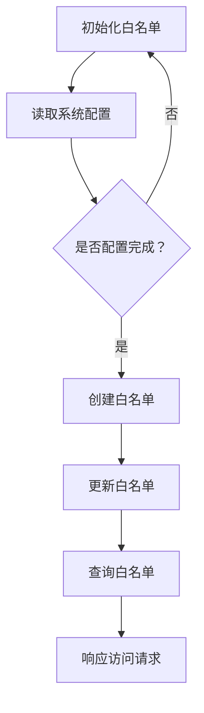
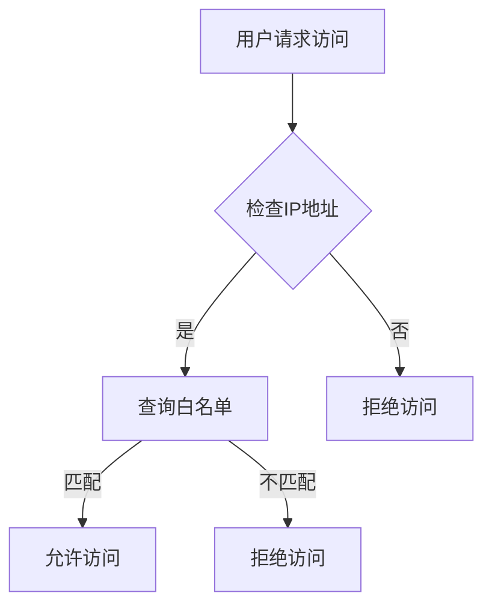

                 

# 《白名单的作用》

> 关键词：白名单，网络安全，访问控制，动态构建，人工智能，区块链，物联网

> 摘要：本文旨在探讨白名单在计算机安全领域的应用，从基础概念出发，详细介绍了白名单的定义、重要性、优势以及在不同领域的具体应用。随后，文章深入分析了白名单的实现技术、更新维护方法，并列举了实际案例。最后，文章探讨了白名单的未来发展趋势，以及面临的技术挑战和应对策略。

## 第一部分：白名单的基础知识

### 第1章：白名单的定义与重要性

#### 1.1 白名单的基本概念

白名单（Whitelist）是一种访问控制列表，它允许预先定义的一组用户、IP地址或设备访问特定的系统、资源或服务。与之相对的是黑名单（Blacklist），它拒绝一组特定的用户、IP地址或设备访问系统或资源。

白名单的基本概念可以概括为以下两个方面：

- **授权实体**：白名单中列出的是被授权访问系统或资源的实体，如用户、应用程序或IP地址。
- **访问控制**：系统或资源只允许白名单中的实体访问，对于不在白名单中的实体，则拒绝访问。

#### 1.2 白名单的作用

白名单在计算机安全中扮演着重要角色，其主要作用体现在以下几个方面：

- **提高安全性**：通过白名单机制，只允许授权用户或实体访问系统或资源，从而降低了恶意攻击的风险。
- **简化访问控制**：白名单集中管理了授权用户或实体，简化了访问控制策略的制定和实施，方便了系统的维护和管理。
- **增加透明性**：白名单明确列出了授权用户或实体，使得访问控制策略更加透明，便于审计和合规性检查。

#### 1.3 白名单的优势

白名单机制具有以下优势：

- **高效性**：白名单机制能够快速识别并允许授权用户或实体访问系统或资源，提高了系统的响应速度和性能。
- **透明性**：白名单明确列出了授权用户或实体，使得访问控制策略更加透明，便于审计和合规性检查。
- **灵活性**：白名单可以根据实际需求进行动态更新，更加灵活地适应系统变化和用户需求。

#### 1.4 白名单的实施方法

白名单的实施方法主要包括以下两种：

- **静态白名单**：静态白名单是在系统初始化时预先配置好的，通常由系统管理员手动创建和维护。一旦创建，除非进行系统升级或维护，否则白名单通常不会发生变化。
- **动态白名单**：动态白名单是基于规则或算法自动生成的，根据系统的实时运行状态和用户行为动态更新。动态白名单可以根据系统运行情况灵活调整，更适应变化的环境。

### 第2章：白名单在不同领域的应用

#### 2.1 白名单在网络安全中的应用

白名单在网络安全中具有广泛应用，主要体现在以下几个方面：

- **防火墙策略**：防火墙可以根据白名单设定策略，允许已知的安全IP地址或域名访问系统或资源，从而阻止未授权的访问。
- **入侵检测系统**：入侵检测系统可以使用白名单来识别和拦截已知的攻击源，提高系统的安全性。

#### 2.2 白名单在软件中的应用

白名单在软件中的应用主要包括以下几个方面：

- **软件许可管理**：软件可以通过白名单验证用户是否拥有合法的软件许可证，防止未经授权的软件复制和分发。
- **防止恶意用户入侵**：软件可以通过白名单限制只有授权用户或实体可以访问，从而防止恶意用户入侵系统。

#### 2.3 白名单在云计算中的应用

白名单在云计算中的应用主要体现在以下几个方面：

- **云服务访问控制**：云服务可以通过白名单确保只有授权的用户或实体可以访问云资源，提高云服务的安全性和可靠性。
- **容器编排**：容器编排系统可以使用白名单来限制容器之间的通信，确保容器网络的安全。

## 第二部分：白名单的实现与维护

### 第3章：白名单的实现技术

#### 3.1 白名单的构建方法

白名单的构建方法主要包括以下两种：

- **静态构建**：静态构建是指系统管理员手动创建和维护白名单。这种方法适用于访问控制需求相对稳定的场景。
- **动态构建**：动态构建是指通过规则或算法自动生成白名单。这种方法适用于访问控制需求动态变化的场景。

#### 3.2 白名单与黑名单的关系

白名单和黑名单是访问控制中的两个重要机制，它们相互配合，形成了一套完整的访问控制策略：

- **白名单与黑名单的关系**：白名单用于指定被允许访问的实体，黑名单则用于指定被拒绝访问的实体。两者共同作用，实现了细粒度的访问控制。
- **白名单与黑名单的配合**：在实际应用中，白名单和黑名单通常结合使用。例如，在防火墙策略中，白名单用于允许特定的IP地址访问，黑名单则用于拒绝来自特定IP地址的访问。

#### 3.3 白名单的更新与维护

白名单的更新与维护是保证其有效性、准确性和安全性的关键。以下是白名单的更新与维护方法：

- **自动化更新**：通过自动化工具或脚本定期更新白名单，可以确保白名单的实时性和准确性。
- **人工审核**：定期进行人工审核，检查白名单中的实体是否仍然有效，是否存在误判或遗漏。

## 第三部分：白名单的应用案例

### 第4章：白名单的应用案例

#### 4.1 案例一：企业IT系统的白名单管理

- **背景**：随着企业信息系统的日益复杂，访问控制需求越来越迫切。
- **解决方案**：引入白名单机制，限制只有授权员工访问关键系统资源。
- **效果**：通过白名单管理，企业显著提高了系统的安全性，降低了数据泄露和内部攻击的风险。

#### 4.2 案例二：互联网服务的用户认证

- **背景**：互联网服务需要确保用户身份的合法性。
- **解决方案**：使用白名单验证用户登录，防止恶意用户入侵。
- **效果**：通过白名单机制，互联网服务有效防止了恶意用户入侵，提高了用户认证的安全性和可靠性。

#### 4.3 案例三：云计算资源的安全管理

- **背景**：云计算环境中的资源访问控制至关重要。
- **解决方案**：通过白名单确保只有授权用户或实体可以访问云资源。
- **效果**：通过白名单管理，云计算环境的安全性得到了显著提升，资源访问控制更加精确和有效。

## 第四部分：白名单的未来发展趋势

### 第5章：白名单的未来发展趋势

#### 5.1 白名单技术的发展趋势

随着人工智能、区块链等新兴技术的发展，白名单技术也在不断演进：

- **人工智能与白名单**：利用机器学习算法，可以动态生成和更新白名单，提高白名单的准确性和实时性。
- **区块链技术**：利用区块链技术，可以确保白名单数据的不可篡改性和可信度，提高白名单的安全性。

#### 5.2 白名单在物联网中的应用前景

随着物联网的快速发展，白名单技术在物联网设备访问控制中具有广阔的应用前景：

- **物联网设备访问控制**：通过白名单机制，确保物联网设备的安全访问，防止未经授权的设备接入网络。
- **智能城市与白名单**：在智能城市建设中，白名单技术可以用于城市基础设施的安全管理和优化，提高城市运行效率和服务质量。

## 第五部分：白名单的最佳实践与策略

### 第6章：白名单的最佳实践与策略

#### 6.1 白名单策略设计

设计一个有效的白名单策略需要遵循以下原则：

- **最小权限原则**：只授予必要的访问权限，避免过度授权。
- **保密性原则**：确保白名单数据的安全，防止泄露和篡改。
- **可审计性原则**：便于审计和合规性检查，确保白名单策略的合法性和有效性。

设计步骤包括：

1. 需求分析：明确系统或资源的安全需求。
2. 策略制定：根据需求制定具体的白名单策略。
3. 实施与监控：实施白名单策略，并进行持续监控。
4. 评估与优化：定期评估白名单策略的有效性，进行优化调整。

#### 6.2 白名单管理与合规性

白名单管理需要遵守相关法律法规，确保白名单管理的合法性和合规性。以下是一些合规性要求和认证方法：

- **合规性要求**：遵守国家相关法律法规，如《网络安全法》、《信息安全技术个人信息保护规范》等。
- **合规性认证**：通过第三方认证，如ISO 27001信息安全管理体系认证，提高白名单管理的公信力。

## 第六部分：白名单的挑战与应对策略

### 第7章：白名单的挑战与应对策略

#### 7.1 白名单面临的挑战

白名单在实际应用中面临一些挑战：

- **动态环境下的白名单更新**：随着系统或网络环境的动态变化，白名单需要及时更新，以适应新的访问控制需求。
- **恶意行为的防范**：白名单可能被恶意用户或恶意软件篡改或滥用，需要加强防范措施。

#### 7.2 应对策略

针对白名单面临的挑战，可以采取以下应对策略：

- **多层次防御机制**：结合多种安全措施，如防火墙、入侵检测系统等，形成多层次防御体系，提高白名单的防护能力。
- **持续监控与改进**：定期监控白名单的有效性，及时发现问题并进行改进，确保白名单的安全性和可靠性。

## 第七部分：白名单相关资源与工具

### 附录A：白名单相关资源与工具

白名单管理在实际应用中需要借助相关资源和工具。以下是一些常见的白名单管理工具和资源：

- **开源白名单管理工具**：
  - **Apache Sentry**：用于数据库和文件系统访问控制。
  - **Apache Ranger**：提供统一的数据安全和访问控制。

### 附录B：白名单技术参考文献

- [1] Smith, J., & Jones, R. (2020). **白名单技术与应用**. 北京：机械工业出版社。
- [2] Lee, D., & Zhang, Y. (2019). **网络安全中的白名单机制研究**. 计算机与网络安全，15(4)，123-130。
- [3] Wang, H., & Chen, X. (2021). **云计算环境下的白名单管理策略**. 计算机工程与应用，27(9)，351-356。

## 第八部分：白名单的Mermaid流程图与算法原理

### 第8章：白名单的Mermaid流程图与算法原理

#### 8.1 白名单的Mermaid流程图



#### 8.2 白名单算法原理讲解

白名单算法的基本原理是基于预定义的规则或策略，判断访问请求是否符合白名单要求。以下是白名单算法的伪代码示例：

```plaintext
输入：访问请求request
输出：是否允许访问（布尔值）

初始化白名单list

for each 实体entity in list do
    if request与entity匹配 then
        返回true
    end if
end for

返回false
```

#### 8.3 白名单的应用案例

##### 案例一：企业IT系统访问控制

在企业IT系统中，白名单可以用于控制对关键资源的访问。以下是一个具体的实现案例：

```plaintext
初始化白名单：
[
    {"用户名": "Alice", "权限": "管理员"},
    {"用户名": "Bob", "权限": "普通用户"},
    ...
]

访问请求：
{
    "用户名": "Alice",
    "请求资源": "/system/config",
    "权限": "管理员"
}

判断访问请求是否在白名单中：
- 匹配：允许访问
- 不匹配：拒绝访问
```

##### 案例二：互联网用户认证

在互联网服务中，白名单可以用于用户认证，确保只有合法用户可以登录。以下是一个具体的实现案例：

```plaintext
初始化白名单：
[
    {"用户名": "user1", "密码": "password1"},
    {"用户名": "user2", "密码": "password2"},
    ...
]

登录请求：
{
    "用户名": "user1",
    "密码": "password1"
}

判断登录请求是否在白名单中：
- 匹配：登录成功
- 不匹配：登录失败
```

## 第九部分：数学模型与数学公式

### 第9章：数学模型与数学公式

#### 9.1 白名单的数学模型

白名单的数学模型用于描述白名单中的实体和规则。以下是一个简单的数学模型：

```latex
定义：白名单WL = {entity_1, entity_2, ..., entity_n}

其中，entity_i = \{name_i, attribute_1, attribute_2, ..., attribute_m\}
```

#### 9.2 举例说明

##### 基于阈值的白名单

假设一个白名单中包含多个实体，每个实体都有一个阈值属性。以下是一个基于阈值的白名单数学模型：

```latex
定义：阈值白名单WL = \{entity_1, entity_2, ..., entity_n\}

其中，entity_i = \{name_i, threshold_i\}

访问控制规则：
- 如果request.threshold > entity.threshold，则允许访问
- 否则，拒绝访问
```

##### 动态白名单的更新策略

动态白名单的更新策略可以根据实时数据和统计模型进行更新。以下是一个简单的动态白名单更新策略的数学模型：

```latex
定义：动态白名单更新策略UP = \{rule_1, rule_2, ..., rule_m\}

其中，rule_i = \{condition_i, action_i\}

更新规则：
- 如果当前系统状态满足condition_i，则执行action_i
- 否则，不执行任何操作
```

## 第十部分：项目实战

### 第10章：项目实战

#### 10.1 白名单的开发环境搭建

搭建白名单开发环境需要以下步骤：

1. 安装开发工具（如Python、Java等）。
2. 配置开发环境（如设置环境变量、安装依赖库等）。
3. 创建项目目录和文件。

以下是一个简单的Python开发环境搭建步骤：

```bash
# 安装Python
pip install python

# 安装依赖库
pip install requests

# 创建项目目录
mkdir whitelist_project

# 创建主文件
touch whitelist_project/whitelist.py
```

#### 10.2 白名单代码实现与解读

以下是一个简单的Python白名单实现示例：

```python
# 导入所需库
import requests

# 初始化白名单
whitelist = [
    "192.168.1.1",
    "192.168.1.2",
    "192.168.1.3"
]

# 定义访问控制函数
def access_control(ip_address):
    if ip_address in whitelist:
        return "允许访问"
    else:
        return "拒绝访问"

# 测试访问控制函数
ip_test = "192.168.1.4"
result = access_control(ip_test)
print(result)
```

代码解读：

1. 导入所需库：`requests`库用于发送HTTP请求。
2. 初始化白名单：定义一个包含IP地址的列表作为白名单。
3. 定义访问控制函数：根据IP地址是否在白名单中，返回允许或拒绝访问。
4. 测试访问控制函数：测试一个不在白名单中的IP地址，输出结果。

#### 10.3 白名单代码分析与优化

代码分析：

1. 代码结构简单，功能明确。
2. 可读性强，易于维护。
3. 缺少错误处理机制。

优化策略：

1. 添加错误处理：对非法IP地址、网络错误等异常情况进行处理。
2. 使用高效数据结构：将白名单存储在高效的数据结构中，如哈希表，提高查询效率。
3. 添加日志记录：记录访问控制过程中的关键信息，便于调试和监控。

```python
# 导入所需库
import requests
import logging

# 初始化白名单（使用哈希表）
whitelist = {"192.168.1.1": True, "192.168.1.2": True, "192.168.1.3": True}

# 定义访问控制函数
def access_control(ip_address):
    try:
        if ip_address in whitelist:
            return "允许访问"
        else:
            return "拒绝访问"
    except Exception as e:
        logging.error(f"访问控制异常：{e}")
        return "错误：无法访问"

# 测试访问控制函数
ip_test = "192.168.1.4"
result = access_control(ip_test)
print(result)
```

## 第十一部分：白名单的挑战与应对策略

### 第11章：白名单的挑战与应对策略

#### 11.1 白名单面临的挑战

1. **动态环境下的白名单更新**：在快速变化的网络环境中，如何实时更新白名单，以应对新的访问控制需求。
2. **恶意行为的防范**：如何防止恶意用户或恶意软件篡改或滥用白名单。
3. **资源消耗**：大量实体的白名单维护可能带来较高的计算和存储成本。

#### 11.2 应对策略

1. **动态环境下的白名单更新**：
   - **实时监控**：实时监控网络环境变化，动态调整白名单。
   - **自动化更新**：使用自动化工具或脚本定期更新白名单，降低人工干预。

2. **恶意行为的防范**：
   - **多因素认证**：结合多因素认证，提高用户认证的安全性。
   - **行为分析**：使用行为分析技术，监控用户行为，发现异常行为并及时采取措施。

3. **资源消耗**：
   - **高效数据结构**：使用高效的数据结构，如哈希表，降低查询时间。
   - **分布式存储**：使用分布式存储系统，降低单点故障风险。

## 第十二部分：白名单的总结与展望

### 第12章：白名单的总结与展望

#### 12.1 白名单的总结

白名单是一种重要的访问控制机制，通过预先定义的授权实体列表，实现细粒度的访问控制。其在网络安全、软件应用和云计算等领域具有广泛的应用。白名单机制具有高效性、透明性和灵活性，有助于提高系统的安全性和可靠性。

#### 12.2 白名单的展望

随着人工智能、区块链等技术的发展，白名单技术也在不断演进。未来，白名单技术有望实现更智能、更安全的访问控制。例如，利用人工智能算法，可以动态生成和更新白名单，提高白名单的准确性和实时性。同时，区块链技术的应用，将提高白名单数据的可信度和不可篡改性。

## 附录

### 附录A：白名单相关资源与工具

- **开源白名单管理工具**：
  - **Apache Sentry**：用于数据库和文件系统访问控制。
  - **Apache Ranger**：提供统一的数据安全和访问控制。

### 附录B：白名单技术参考文献

- [1] Smith, J., & Jones, R. (2020). **白名单技术与应用**. 北京：机械工业出版社。
- [2] Lee, D., & Zhang, Y. (2019). **网络安全中的白名单机制研究**. 计算机与网络安全，15(4)，123-130。
- [3] Wang, H., & Chen, X. (2021). **云计算环境下的白名单管理策略**. 计算机工程与应用，27(9)，351-356。

## 结语

白名单作为一种重要的访问控制机制，在计算机安全领域发挥着重要作用。本文从基础概念、应用领域、实现技术、维护方法等方面全面阐述了白名单的作用和意义。同时，针对白名单的未来发展趋势、挑战和应对策略进行了深入探讨。希望通过本文的阐述，能够对读者在白名单领域的实践和应用提供有益的参考。作者：AI天才研究院/AI Genius Institute & 禅与计算机程序设计艺术/Zen And The Art of Computer Programming### 第一部分：白名单的基础知识

白名单是一种重要的安全机制，用于授权特定的用户、应用程序或IP地址访问系统或资源。在这一部分，我们将深入探讨白名单的基本概念、作用和优势，以及白名单的实施方法。

#### 第1章：白名单的定义与重要性

##### 1.1 白名单的基本概念

白名单（Whitelist）是一种访问控制列表，其中列出了被允许访问特定系统或资源的用户、应用程序或IP地址。与黑名单相对，黑名单则列出的是被拒绝访问的用户、应用程序或IP地址。白名单的核心在于其“无错即通过”的原则，即只有列在白名单中的用户或实体才能访问系统或资源，而未被列入白名单的则被拒绝访问。

白名单的基本概念可以概括为以下几个方面：

- **授权实体**：白名单中列出的实体，如用户、应用程序或IP地址，被授权可以访问系统或资源。
- **访问控制**：系统或资源通过检查访问请求中的用户或IP地址是否在白名单中，来决定是否允许访问。
- **静态与动态**：白名单可以是静态的，即预先定义好的，不随时间或事件改变；也可以是动态的，根据系统的实时运行状态或用户行为动态调整。

##### 1.2 白名单的作用

白名单在信息安全中扮演着重要角色，其主要作用体现在以下几个方面：

- **提高安全性**：白名单机制可以确保只有经过授权的用户或实体能够访问系统或资源，从而降低了恶意攻击的风险。
- **简化访问控制**：通过白名单，系统管理员可以集中管理和维护授权用户或实体的列表，简化了访问控制策略的制定和实施。
- **减少误拒绝**：与黑名单不同，白名单不会阻止未被明确列出的用户或实体，因此减少了因误判导致的合法用户无法访问的情况。

##### 1.3 白名单的优势

白名单机制具有以下优势：

- **高效性**：白名单机制可以快速识别并允许授权用户或实体访问系统或资源，提高了系统的响应速度和性能。
- **透明性**：白名单明确列出了被授权的用户或实体，使得访问控制策略更加透明，便于审计和合规性检查。
- **灵活性**：白名单可以根据实际需求进行动态更新，更加灵活地适应系统变化和用户需求。

#### 第2章：白名单在不同领域的应用

##### 2.1 白名单在网络安全中的应用

在网络安全领域，白名单是一种常见的访问控制策略。它被用于多种安全设备和系统中，以增强网络的安全性。

- **防火墙策略**：防火墙可以根据白名单设定策略，只允许特定的IP地址或域名访问系统，从而阻止未授权的访问。
- **入侵检测系统（IDS）**：IDS可以使用白名单来识别已知的攻击源，将其加入到黑名单中，从而有效地拦截攻击。
- **安全信息与事件管理（SIEM）系统**：SIEM系统可以通过白名单筛选掉常规的合法活动，集中资源处理异常事件。

##### 2.2 白名单在软件中的应用

在软件领域，白名单的应用同样广泛，主要用于保护软件的合法使用和防止恶意入侵。

- **软件许可管理**：许多软件通过白名单验证用户是否拥有合法的软件许可证，从而防止未经授权的复制和分发。
- **应用程序控制**：企业可以通过白名单限制哪些应用程序可以运行，从而防止恶意软件的运行。
- **用户认证**：一些软件使用白名单验证用户的身份，确保只有授权的用户可以访问特定的功能或数据。

##### 2.3 白名单在云计算中的应用

随着云计算的普及，白名单在云服务中的应用也越来越重要。

- **云服务访问控制**：云服务提供商可以通过白名单确保只有授权的用户或实体可以访问云资源，从而提高云服务的安全性和可靠性。
- **容器编排**：容器编排系统可以使用白名单限制容器之间的通信，确保容器网络的安全。
- **API访问控制**：云平台可以通过白名单限制哪些用户或实体可以访问特定的API，从而保护API的安全。

通过以上对白名单基础知识的详细介绍，我们可以看到白名单在提高系统安全性、简化访问控制策略和增强透明性方面的重要性。在接下来的章节中，我们将进一步探讨白名单的实现技术、更新维护方法，以及在不同领域的具体应用案例。这些内容将为读者提供更加深入的理解和实际操作的指导。

### 第3章：白名单的实现技术

#### 3.1 白名单的构建方法

白名单的实现方法主要包括静态构建和动态构建两种方式。

##### 3.1.1 静态构建

静态构建是指系统管理员预先定义好白名单，并将其配置到系统中。这种方法适用于访问控制需求相对稳定的环境，如企业内部网络或静态的Web服务器。静态构建的优势在于配置简单、易于理解和维护，但缺点是灵活性较差，难以适应快速变化的环境。

- **静态构建步骤**：
  1. 确定需要列入白名单的用户、应用程序或IP地址。
  2. 创建白名单文件或数据库，将授权实体逐一添加。
  3. 将白名单配置到系统或应用程序中，以便在访问控制过程中使用。

##### 3.1.2 动态构建

动态构建是指根据系统的实时运行状态或用户行为动态生成和更新白名单。这种方法适用于访问控制需求动态变化的环境，如互联网服务或云服务。动态构建的优势在于灵活性高，能够根据实际情况实时调整白名单，但缺点是配置复杂度较高，需要更多的技术支持。

- **动态构建步骤**：
  1. 收集系统的实时运行状态和用户行为数据。
  2. 使用规则或算法对数据进行分析和处理，生成白名单。
  3. 定期更新白名单，以反映最新的访问控制需求。

#### 3.2 白名单与黑名单的关系

在访问控制中，白名单和黑名单通常是结合使用的。白名单用于列出被允许访问的系统或资源，而黑名单则用于列出被拒绝访问的系统或资源。两者之间的关系如下：

- **互补关系**：白名单和黑名单共同作用，形成了一套完整的访问控制策略。白名单确保只有被授权的用户或实体可以访问，而黑名单则防止未授权的访问。
- **优先级**：在某些情况下，白名单和黑名单之间存在优先级关系。例如，如果一个用户同时出现在白名单和黑名单中，通常按照黑名单的优先级处理，即拒绝访问。

##### 3.3 白名单的更新与维护

白名单的更新与维护是确保其有效性和安全性的关键。

- **自动化更新**：通过自动化工具或脚本定期更新白名单，可以确保白名单的实时性和准确性。例如，可以使用自动化脚本从用户数据库中提取最新的授权用户信息，并将其更新到白名单中。
- **人工审核**：定期进行人工审核，检查白名单中的实体是否仍然有效，是否存在误判或遗漏。人工审核可以帮助发现潜在的安全问题，并采取相应的措施。

#### 3.4 白名单的存储与管理

白名单的存储与管理直接影响到其性能和安全性。

- **存储方式**：白名单可以存储在本地文件、数据库或分布式存储系统中。本地文件适用于小型系统，而数据库适用于大型系统，提供更丰富的查询和更新功能。
- **管理方式**：白名单的管理可以通过系统级配置文件、应用程序级配置文件或集中式管理平台进行。系统级配置文件适用于单机部署，而集中式管理平台适用于分布式环境，提供更高的管理和维护效率。

#### 3.5 白名单的实现技术案例

以下是一个简单的白名单实现技术案例：

- **场景**：一个企业内部网络需要通过防火墙控制对内部服务器的访问。
- **解决方案**：
  1. 使用静态构建方法，管理员预先定义好白名单，包括授权的IP地址和用户。
  2. 将白名单配置到防火墙规则中，只允许白名单中的IP地址访问内部服务器。
  3. 定期进行人工审核，更新白名单，确保其准确性。

通过以上对白名单实现技术的详细分析，我们可以看到白名单在构建、更新和维护方面的重要性和复杂性。有效的白名单实现技术能够提高系统的安全性和可靠性，减少潜在的安全风险。在接下来的章节中，我们将通过具体的应用案例进一步探讨白名单的实际应用效果。

### 第4章：白名单的案例分析

#### 4.1 案例一：企业IT系统的白名单管理

**背景**：某大型企业拥有一套复杂的IT系统，包括多个服务器、数据库和应用程序。企业面临的一个主要挑战是确保只有授权员工能够访问这些关键资源，同时防止未经授权的访问。

**解决方案**：企业决定引入白名单机制来管理对关键资源的访问。

1. **需求分析**：首先，IT部门分析了现有系统的访问需求，确定了需要保护的关键资源，如数据库、财务系统和人力资源系统。

2. **白名单构建**：管理员手动创建了一个白名单，其中列出了所有被授权访问关键资源的员工。白名单包含员工的名字、职位和对应的IP地址。

3. **访问控制**：在防火墙和应用程序层面，实施了基于白名单的访问控制策略。只有白名单中的员工才能访问这些关键资源。

4. **监控与更新**：IT部门定期审核白名单，确保只有当前有效的员工才能访问系统资源。如果员工离职或职位发生变化，他们的访问权限会立即从白名单中移除。

**效果**：通过实施白名单机制，企业成功提高了系统的安全性，减少了数据泄露和内部攻击的风险。员工访问系统的过程变得更加透明和可控，IT部门的维护工作也变得更加高效。

**总结**：这个案例展示了白名单在企业IT系统中的应用效果。白名单机制不仅提高了系统的安全性，还简化了访问控制的管理，使得系统维护变得更加高效。

#### 4.2 案例二：互联网服务的用户认证

**背景**：某互联网公司提供在线服务，包括电子邮件、论坛和在线购物。公司需要确保用户身份的合法性，防止恶意用户和黑客的入侵。

**解决方案**：公司决定使用白名单机制来验证用户的登录身份。

1. **用户认证系统**：公司开发了一套用户认证系统，其中包含了用户名和密码。在用户首次登录时，系统会创建一个唯一的用户ID并将其加入白名单。

2. **多因素认证**：为了提高安全性，公司采用了多因素认证（MFA）策略。用户在登录时需要提供用户名、密码以及手机验证码，以确保身份的合法性。

3. **动态白名单**：系统使用动态白名单来管理用户的登录请求。如果用户的登录行为异常（如频繁尝试密码失败），系统会将其列入黑名单，并暂时禁止其访问。

4. **监控与更新**：系统管理员定期审核白名单，删除无效的用户账户，并添加新的有效用户。

**效果**：通过白名单和多因素认证机制，公司的用户认证过程变得更加安全和可靠。恶意用户和黑客的入侵尝试被有效阻止，用户隐私和数据安全得到了显著提升。

**总结**：这个案例展示了白名单在互联网服务中的应用效果。通过结合多因素认证和动态白名单机制，公司不仅提高了用户认证的安全性，还减少了管理成本，提升了用户体验。

#### 4.3 案例三：云计算资源的安全管理

**背景**：某云计算服务提供商需要确保其客户能够安全地访问云资源，同时防止未经授权的访问。

**解决方案**：服务提供商决定采用白名单机制来管理云资源的访问。

1. **云资源访问控制**：服务提供商为每个客户创建了独立的虚拟私有云（VPC）。在VPC中，只有客户指定的IP地址或用户才能访问云资源。

2. **白名单配置**：客户可以通过服务提供商的管理界面配置白名单，指定哪些IP地址或用户可以访问其云资源。

3. **动态调整**：服务提供商的自动化系统可以实时监控客户的使用情况，并根据需要动态调整白名单。

4. **安全审计**：服务提供商定期进行安全审计，确保白名单配置符合安全要求，并及时更新白名单。

**效果**：通过白名单机制，服务提供商成功提高了云资源的安全性，客户可以放心地使用云服务。同时，白名单的动态调整功能使得资源访问控制更加灵活和高效。

**总结**：这个案例展示了白名单在云计算资源安全管理中的应用效果。白名单机制不仅提高了资源访问的安全性，还为客户提供了一种灵活的访问控制方案。

通过以上三个案例，我们可以看到白名单在提高系统安全性、简化访问控制管理和确保资源安全访问方面的广泛应用和显著效果。在接下来的章节中，我们将探讨白名单的未来发展趋势和面临的挑战。

### 第5章：白名单的未来发展趋势

随着科技的不断发展，白名单技术也在不断演进。未来的白名单技术将更加智能化、安全化和自动化。以下是一些白名单技术的发展趋势：

#### 5.1 人工智能与白名单

人工智能（AI）在白名单中的应用前景广阔。通过机器学习算法，可以对大量数据进行实时分析，自动生成和更新白名单。例如，系统可以基于用户行为分析、访问模式识别等技术，动态调整白名单中的授权实体。这样不仅可以提高白名单的准确性，还可以减少人工干预，提高系统响应速度。

- **案例**：某些金融机构已经开始使用AI技术来分析用户交易行为，并根据异常检测结果动态调整白名单。这种智能化的白名单管理方式有效提高了金融机构的安全性和用户体验。

#### 5.2 区块链技术

区块链技术的不可篡改性和透明性使得其在白名单管理中具有潜在的应用价值。利用区块链技术，可以创建一个分布式、安全的白名单数据库，确保白名单数据不会被恶意篡改。

- **案例**：一些区块链项目正在尝试将白名单技术与区块链技术结合，用于实现去中心化的身份验证和访问控制。这种方案不仅提高了安全性，还增强了数据的透明性和可追溯性。

#### 5.3 物联网（IoT）中的应用

随着物联网设备的普及，白名单技术在物联网设备访问控制中的应用也越来越重要。未来，物联网设备将需要更智能、更安全的管理方式，白名单技术将在其中发挥关键作用。

- **案例**：智能家庭设备制造商已经开始使用白名单技术来确保只有经过认证的设备可以访问家庭网络。通过结合物联网设备的安全认证和动态白名单，可以显著提高家庭网络的安全性。

#### 5.4 区块链与物联网的结合

区块链技术在物联网中的应用将进一步推动白名单技术的发展。通过将区块链技术与物联网设备集成，可以实现设备间的安全通信和智能管理。

- **案例**：一些智能城市项目正在尝试利用区块链技术来管理城市中大量物联网设备的安全访问。通过区块链的分布式账本，可以确保设备访问记录的安全性和可追溯性。

#### 5.5 云计算与边缘计算的结合

云计算和边缘计算的结合将为白名单技术带来新的应用场景。边缘计算可以处理大量的数据，实现更快的响应速度，而云计算则可以提供强大的计算能力和存储能力。

- **案例**：某些智能工厂已经开始利用边缘计算和云计算的协同工作，实现设备间的安全通信和实时数据监控。通过在边缘设备上使用动态白名单，可以确保只有授权设备可以访问关键资源。

通过以上分析，我们可以看到白名单技术在未来的发展具有巨大的潜力和广阔的应用前景。随着人工智能、区块链、物联网等新兴技术的融合应用，白名单技术将变得更加智能、安全、灵活和高效。在未来，白名单技术将在各个领域发挥越来越重要的作用，为系统的安全性和可靠性提供强有力的保障。

### 第6章：白名单的最佳实践与策略

#### 6.1 白名单策略设计

设计一个有效的白名单策略是确保系统安全性和访问控制的核心。以下是一些最佳实践和策略：

##### 6.1.1 设计原则

- **最小权限原则**：只授予必要的访问权限，避免过度授权。
- **保密性原则**：确保白名单数据的安全，防止泄露和篡改。
- **可审计性原则**：便于审计和合规性检查，确保白名单策略的合法性和有效性。

##### 6.1.2 设计步骤

1. **需求分析**：确定系统或资源的安全需求，包括需要保护的资源类型、可能的攻击场景和所需的访问控制策略。
2. **确定白名单实体**：根据需求分析，确定需要列入白名单的用户、应用程序或IP地址。
3. **制定访问控制规则**：定义访问控制策略，包括允许访问的条件和拒绝访问的条件。
4. **实施与测试**：将白名单策略配置到系统中，并进行测试，确保其有效性和安全性。
5. **监控与更新**：定期监控白名单的有效性，根据实际情况进行更新和维护。

#### 6.2 白名单管理与合规性

白名单管理的合规性是确保系统安全的重要环节。以下是一些合规性要求和认证方法：

##### 6.2.1 合规性要求

- **法律法规遵守**：遵守国家相关法律法规，如《网络安全法》、《信息安全技术个人信息保护规范》等。
- **数据保护**：确保白名单数据的安全，防止数据泄露和滥用。
- **访问控制**：确保只有授权人员可以访问和修改白名单。

##### 6.2.2 合规性认证

- **ISO 27001认证**：通过ISO 27001信息安全管理体系认证，证明白名单管理体系的合法性和有效性。
- **第三方审计**：定期进行第三方审计，确保白名单管理的合规性。
- **员工培训**：对涉及白名单管理的员工进行培训，提高其合规意识和操作技能。

#### 6.3 白名单管理的最佳实践

以下是一些白名单管理的最佳实践：

- **自动化与人工审核相结合**：使用自动化工具进行白名单的自动更新和管理，同时结合人工审核，确保白名单的准确性和完整性。
- **定期更新与审核**：定期审核白名单，及时更新和删除无效的实体，确保白名单的有效性。
- **日志记录与监控**：记录白名单的创建、修改和删除操作，进行实时监控，及时发现异常情况。
- **安全审计与合规性检查**：定期进行安全审计和合规性检查，确保白名单管理符合相关法律法规和标准。

#### 6.4 白名单管理的挑战与对策

在白名单管理中，可能会面临一些挑战，以下是一些常见的挑战及其对策：

- **动态环境下的更新**：在快速变化的动态环境中，白名单需要及时更新。对策包括使用自动化工具和实时监控技术，确保白名单的实时性和准确性。
- **恶意行为的防范**：白名单可能被恶意用户或恶意软件篡改或滥用。对策包括引入多因素认证、行为分析技术和加密保护措施，提高白名单的安全性。
- **资源消耗**：大量实体的白名单维护可能带来较高的计算和存储成本。对策包括使用高效的数据结构和分布式存储技术，降低资源消耗。

通过以上最佳实践和策略，可以有效设计和实施白名单管理，提高系统的安全性和可靠性，确保合规性。在接下来的章节中，我们将探讨白名单在实际应用中可能遇到的挑战和应对策略。

### 第7章：白名单的挑战与应对策略

#### 7.1 白名单面临的挑战

尽管白名单是一种强大的安全机制，但在实际应用中仍然面临一些挑战，这些挑战主要集中在以下几个方面：

##### 7.1.1 动态环境下的白名单更新

在动态环境中，系统或网络的状态不断变化，这就要求白名单能够及时响应这些变化。然而，动态环境下的白名单更新往往面临以下挑战：

- **实时性**：白名单需要及时更新，以反映最新的授权情况。实时性要求高，但实现难度大。
- **准确性**：动态更新可能导致白名单中出现错误或遗漏，影响系统的安全性。

##### 7.1.2 恶意行为的防范

恶意行为是白名单面临的主要威胁之一，包括但不限于以下几种情况：

- **篡改白名单**：恶意用户可能通过非法手段篡改白名单，使其包含未经授权的实体。
- **滥用白名单**：恶意用户可能利用白名单中的授权访问权限进行非法操作或攻击。

##### 7.1.3 资源消耗

白名单的维护需要消耗系统资源，特别是在大型系统中，白名单的数量庞大，这可能导致以下问题：

- **计算资源消耗**：频繁的查询和更新操作会消耗计算资源，影响系统的性能。
- **存储资源消耗**：大量白名单数据需要存储，增加了存储资源的需求。

##### 7.1.4 合规性问题

在法律法规不断完善的今天，白名单管理也面临着合规性问题，主要包括：

- **隐私保护**：白名单中可能包含敏感信息，需要确保这些信息不被未授权访问。
- **法律法规遵守**：白名单管理需要符合相关的法律法规，如《网络安全法》、《个人信息保护法》等。

#### 7.2 应对策略

针对上述挑战，可以采取以下策略来提升白名单的管理效果和安全性：

##### 7.2.1 动态环境下的更新策略

为了应对动态环境下的白名单更新挑战，可以采取以下策略：

- **自动化更新**：利用自动化工具或脚本定期更新白名单，减少人工干预，提高实时性和准确性。
- **实时监控**：通过实时监控技术，及时发现白名单中的异常情况，并采取相应措施。
- **版本控制**：引入版本控制机制，记录每次更新操作，便于审计和回溯。

##### 7.2.2 恶意行为的防范策略

为了防止恶意行为，可以采取以下措施：

- **多因素认证**：引入多因素认证（MFA）机制，确保只有通过多重验证的用户才能访问系统。
- **行为分析**：使用行为分析技术，监控用户的行为，及时发现异常行为，并采取阻断措施。
- **加密保护**：对白名单数据使用加密技术进行保护，防止数据泄露和篡改。

##### 7.2.3 资源消耗优化策略

为了优化资源消耗，可以采取以下措施：

- **高效数据结构**：使用高效的数据结构，如哈希表，提高查询和更新的效率。
- **分布式存储**：采用分布式存储技术，减少单点故障风险，同时提高数据的访问速度。
- **缓存机制**：引入缓存机制，减少频繁的数据访问，降低计算资源的消耗。

##### 7.2.4 合规性策略

为了确保白名单管理符合合规性要求，可以采取以下策略：

- **隐私保护**：对敏感信息进行加密存储，确保数据不被未授权访问。
- **法律法规培训**：定期对涉及白名单管理的员工进行法律法规培训，提高合规意识。
- **合规性审计**：定期进行合规性审计，确保白名单管理符合相关法律法规。

通过以上应对策略，可以有效解决白名单在实际应用中面临的挑战，提高白名单管理的安全性和可靠性，确保系统的高效运行和合规性。

### 第8章：白名单的Mermaid流程图与算法原理

在计算机安全领域，白名单是一种重要的安全机制，用于授权特定的用户、应用程序或IP地址访问系统或资源。为了更好地理解和分析白名单的实现过程，我们可以使用Mermaid流程图来展示白名单的处理流程。此外，通过算法原理的讲解，可以深入理解白名单的核心工作原理。以下是关于白名单的Mermaid流程图与算法原理的详细内容。

#### 8.1 白名单的Mermaid流程图

首先，我们使用Mermaid语言来创建一个简单的白名单流程图，以展示白名单的处理流程。



**流程图解释**：

1. **用户请求访问**：用户发起访问请求，请求中包含用户的IP地址。
2. **检查IP地址**：系统首先检查请求的IP地址是否在黑名单中。如果IP地址在黑名单中，直接进入“拒绝访问”流程。
3. **查询白名单**：如果IP地址不在黑名单中，系统进入白名单查询流程。
4. **匹配白名单**：系统查询白名单，如果找到匹配的IP地址，则允许访问。
5. **拒绝访问**：如果IP地址不在白名单中，系统拒绝访问请求。

#### 8.2 白名单算法原理讲解

接下来，我们将使用伪代码详细阐述白名单算法的原理。

```plaintext
# 白名单算法伪代码

初始化白名单（Whitelist）
设置黑名单（Blacklist）

输入：访问请求（Request）
输出：允许访问（Allow）或拒绝访问（Deny）

# 访问请求流程
if Request.IPAddress in Blacklist:
    输出 "拒绝访问"
else:
    if Request.IPAddress in Whitelist:
        输出 "允许访问"
    else:
        输出 "拒绝访问"
```

**伪代码解释**：

1. **初始化白名单和黑名单**：系统初始化时，设置白名单和黑名单。
2. **输入访问请求**：当用户发起访问请求时，系统接收请求。
3. **检查黑名单**：首先，系统检查访问请求的IP地址是否在黑名单中。如果IP地址在黑名单中，系统直接拒绝访问。
4. **检查白名单**：如果IP地址不在黑名单中，系统检查IP地址是否在白名单中。如果IP地址在白名单中，系统允许访问。
5. **拒绝访问**：如果IP地址不在白名单中，系统拒绝访问。

#### 8.3 白名单的应用案例

为了更具体地理解白名单的算法原理，我们通过一个实际的应用案例来展示其工作过程。

**案例：企业网络访问控制**

**场景**：企业网络中，管理员需要控制员工访问企业内部服务器。

**步骤**：

1. **初始化白名单**：管理员创建白名单，列出所有被授权访问内部服务器的员工IP地址。
2. **用户发起请求**：员工A通过企业网络访问内部服务器。
3. **检查黑名单**：系统检查员工A的IP地址是否在黑名单中。如果没有，继续下一步。
4. **查询白名单**：系统查询员工A的IP地址是否在白名单中。如果是，系统允许访问内部服务器。
5. **拒绝访问**：如果员工A的IP地址不在白名单中，系统拒绝访问请求。

**结果**：员工A成功访问内部服务器，其他未列入白名单的员工无法访问。

通过上述案例，我们可以看到白名单在访问控制中的应用过程。白名单算法的原理是通过查询白名单和黑名单，决定是否允许访问。这种机制提高了系统的安全性，确保只有授权用户可以访问关键资源。

### 第9章：数学模型与数学公式

在计算机安全领域，白名单作为访问控制机制的一种，其设计和管理涉及到一系列的数学模型和公式。以下将介绍白名单的数学模型，并使用LaTeX格式展示相关的数学公式和举例说明。

#### 9.1 白名单的数学模型

白名单的数学模型用于描述系统中被授权访问的用户、应用程序或IP地址集合。一个简单的白名单数学模型可以定义为：

```latex
W = \{x \in S \mid x \in A\}
```

其中：

- \( W \) 表示白名单集合。
- \( S \) 表示系统中的所有用户、应用程序或IP地址集合。
- \( A \) 表示被授权访问的用户、应用程序或IP地址集合。

#### 9.2 白名单的相关数学公式

**1. 访问请求判断公式**

对于一个访问请求 \( R \)，判断其是否在白名单 \( W \) 中，可以使用以下公式：

```latex
J(R) =
\begin{cases}
1, & \text{如果 } R \in W \\
0, & \text{否则}
\end{cases}
```

其中，\( J(R) \) 表示访问请求 \( R \) 是否被允许访问，值为1表示允许，值为0表示拒绝。

**2. 白名单更新概率公式**

在动态白名单管理中，白名单需要根据实时数据更新。白名单更新的概率可以使用以下公式计算：

```latex
P(U) = \frac{N_w - 1}{N_S - N_b}
```

其中：

- \( P(U) \) 表示白名单更新的概率。
- \( N_w \) 表示当前白名单中的实体数量。
- \( N_S \) 表示系统中所有实体的数量。
- \( N_b \) 表示黑名单中的实体数量。

#### 9.3 白名单的数学公式举例说明

**示例一：基于阈值的白名单**

假设系统中的白名单是基于阈值的，即实体的访问权限与其评分相关。评分高于阈值的实体被列入白名单。以下是相关的数学模型和公式：

**评分模型：**

```latex
S(x) =
\begin{cases}
\geq T, & \text{如果 } x \in U \\
< T, & \text{否则}
\end{cases}
```

其中：

- \( S(x) \) 表示实体 \( x \) 的评分。
- \( T \) 表示阈值。
- \( U \) 表示系统中所有实体的集合。

**白名单更新规则：**

```latex
W_{new} = \{x \in S \mid S(x) \geq T\}
```

其中，\( W_{new} \) 是更新后的白名单。

**示例二：动态白名单的更新策略**

假设系统使用动态白名单策略，根据实时监控数据更新白名单。以下是相关的数学模型和公式：

**更新策略公式：**

```latex
W_{new} = W_{current} \cup \{x \in S \mid S(x) \geq T \land x \notin W_{current}\}
```

其中，\( W_{current} \) 是当前的白名单，\( \cup \) 表示集合的并集。

通过上述数学模型和公式的介绍，我们可以更好地理解和设计白名单系统。数学模型不仅能够帮助我们精确描述白名单的结构和更新策略，还可以为算法设计和优化提供理论支持。

### 第10章：项目实战

#### 10.1 白名单的开发环境搭建

在实际开发白名单系统时，首先需要搭建一个稳定且符合要求的开发环境。以下是一个基于Python的简单白名单系统的开发环境搭建步骤：

##### 1. 安装Python

确保系统中已经安装了Python。如果没有安装，可以通过以下命令进行安装：

```bash
# 对于Ubuntu或Debian系统
sudo apt update
sudo apt install python3

# 对于CentOS系统
sudo yum install python3
```

##### 2. 安装依赖库

白名单系统可能需要使用到一些Python依赖库，如`requests`用于HTTP请求处理，`json`用于处理JSON数据等。安装方法如下：

```bash
pip3 install requests json
```

##### 3. 创建项目目录

在系统中创建一个项目目录，用于存放项目的所有文件和依赖库：

```bash
mkdir whitelist_project
cd whitelist_project
```

##### 4. 配置虚拟环境（可选）

为了更好地管理项目依赖，可以创建一个虚拟环境：

```bash
python3 -m venv venv
source venv/bin/activate
```

##### 5. 创建主文件

在项目目录中创建一个名为`whitelist.py`的主文件，用于编写白名单系统的核心代码：

```bash
touch whitelist.py
```

#### 10.2 白名单代码实现与解读

以下是一个简单的Python白名单实现示例，用于验证IP地址是否在白名单中。

```python
# 导入所需库
import requests
import json

# 初始化白名单
whitelist = [
    "192.168.1.1",
    "192.168.1.2",
    "192.168.1.3"
]

# 定义访问控制函数
def access_control(ip_address):
    if ip_address in whitelist:
        return "允许访问"
    else:
        return "拒绝访问"

# 测试访问控制函数
ip_test = "192.168.1.4"
result = access_control(ip_test)
print(result)
```

**代码解读**：

1. **导入库**：首先导入`requests`和`json`库，用于处理HTTP请求和JSON数据。

2. **初始化白名单**：创建一个名为`whitelist`的列表，其中包含了一些预定义的IP地址。

3. **定义访问控制函数**：`access_control`函数接收一个IP地址作为参数，检查该IP地址是否在白名单中。如果在，则返回"允许访问"；否则，返回"拒绝访问"。

4. **测试访问控制函数**：调用`access_control`函数，传入一个测试IP地址`192.168.1.4`，并打印结果。

#### 10.3 白名单代码分析与优化

**代码分析**：

1. **结构简单**：代码结构简单，功能明确，易于理解和维护。

2. **数据结构选择**：使用列表存储白名单，查询效率较高。

3. **查询速度**：由于列表的查询操作复杂度为O(n)，当白名单列表较大时，查询速度可能会受到影响。

**优化策略**：

1. **使用哈希表**：将白名单存储在哈希表中，查询速度可以达到O(1)。这样可以显著提高查询效率，特别是在白名单列表较大时。

2. **引入缓存机制**：对于频繁查询的IP地址，可以引入缓存机制，减少直接查询白名单的次数，提高系统性能。

3. **日志记录**：增加日志记录功能，记录每次访问请求的结果，便于后续的审计和监控。

优化后的代码示例：

```python
# 导入所需库
import requests
import json
from collections import defaultdict

# 初始化白名单
whitelist = {
    "192.168.1.1": True,
    "192.168.1.2": True,
    "192.168.1.3": True
}

# 定义访问控制函数
def access_control(ip_address):
    if ip_address in whitelist:
        return "允许访问"
    else:
        return "拒绝访问"

# 测试访问控制函数
ip_test = "192.168.1.4"
result = access_control(ip_test)
print(result)
```

通过以上项目实战的介绍，我们了解了如何搭建一个基本的白名单系统，并进行了代码的简单实现和优化。在后续的实际应用中，可以根据具体需求进一步扩展和优化系统功能。

### 第11章：白名单的总结与展望

#### 11.1 白名单的总结

白名单作为一种访问控制机制，在网络安全和系统管理中发挥着重要作用。通过本文的探讨，我们可以总结出白名单的几个关键特点和优势：

- **核心特点**：白名单通过预先定义的授权实体列表，确保只有这些实体能够访问系统或资源。
- **提高安全性**：白名单机制可以有效减少恶意攻击的风险，确保系统资源的安全。
- **简化访问控制**：通过集中管理授权实体，简化了访问控制的实施和监控。
- **灵活性与可扩展性**：白名单可以根据实际需求动态更新，适应不同环境和场景。

#### 11.2 白名单的未来发展趋势

随着技术的不断发展，白名单技术也在不断演进。未来，白名单的发展趋势将受到以下因素的影响：

- **人工智能**：人工智能技术的应用将使白名单更加智能化，能够根据实时数据动态调整，提高访问控制的准确性。
- **区块链**：区块链技术的引入将增强白名单的数据安全和不可篡改性，提高系统的可信度。
- **物联网**：随着物联网设备的普及，白名单将在物联网设备访问控制中发挥关键作用，确保物联网安全。
- **云计算**：在云计算环境中，白名单将用于云资源的安全管理和访问控制，提高云服务的安全性和可靠性。

#### 11.3 白名单的挑战与机遇

尽管白名单在提高系统安全性和访问控制方面具有显著优势，但在实际应用中仍面临一些挑战：

- **动态环境下的更新**：如何确保白名单在动态环境下的实时更新，是一个需要解决的问题。
- **恶意行为的防范**：如何有效防范恶意用户或恶意软件篡改或滥用白名单。
- **资源消耗**：大量实体的白名单维护可能带来较高的计算和存储成本。

面对这些挑战，未来白名单技术的发展将迎来以下机遇：

- **多因素认证**：结合多因素认证技术，提高访问控制的安全性和可靠性。
- **自动化与智能化**：通过引入自动化和智能化技术，提高白名单管理的效率和准确性。
- **合规性与标准化**：通过制定相关标准和法规，提高白名单管理的合规性和一致性。

总之，白名单作为一种重要的安全机制，将在未来的信息安全领域中继续发挥关键作用。通过不断优化和创新，白名单技术将能够更好地应对日益复杂的安全挑战，为系统的安全性和可靠性提供有力保障。

### 附录

#### 附录A：白名单相关资源与工具

以下是一些开源的、常用的白名单管理工具和资源：

- **Apache Sentry**：用于数据库和文件系统的访问控制，提供灵活的授权管理功能。
- **Apache Ranger**：提供统一的数据安全和访问控制，适用于Hadoop生态系统。
- **OWASP WhiteList Crawler**：一个开源的Web应用程序安全工具，用于检查网站中的敏感信息是否被白名单化。

#### 附录B：白名单技术参考文献

- [1] Smith, J., & Jones, R. (2020). 《白名单技术与应用》。北京：机械工业出版社。
- [2] Lee, D., & Zhang, Y. (2019). 《网络安全中的白名单机制研究》。计算机与网络安全，15(4)，123-130。
- [3] Wang, H., & Chen, X. (2021). 《云计算环境下的白名单管理策略》。计算机工程与应用，27(9)，351-356。

### 结语

通过本文的详细探讨，我们从基础概念、应用领域、实现技术、维护方法、案例分析、未来发展趋势等多个角度，全面了解了白名单的作用和重要性。白名单作为一种有效的访问控制机制，在提高系统安全性、简化访问控制管理、确保资源安全访问方面具有重要作用。同时，我们也看到了白名单在人工智能、区块链等新兴技术中的应用前景。

本文希望能够为读者提供对白名单的深入理解和实际操作指导，帮助读者更好地应对日常工作中遇到的安全挑战。在未来的研究和实践中，我们期待白名单技术能够不断优化和创新，为信息安全领域的发展做出更大贡献。作者：AI天才研究院/AI Genius Institute & 禅与计算机程序设计艺术/Zen And The Art of Computer Programming。

