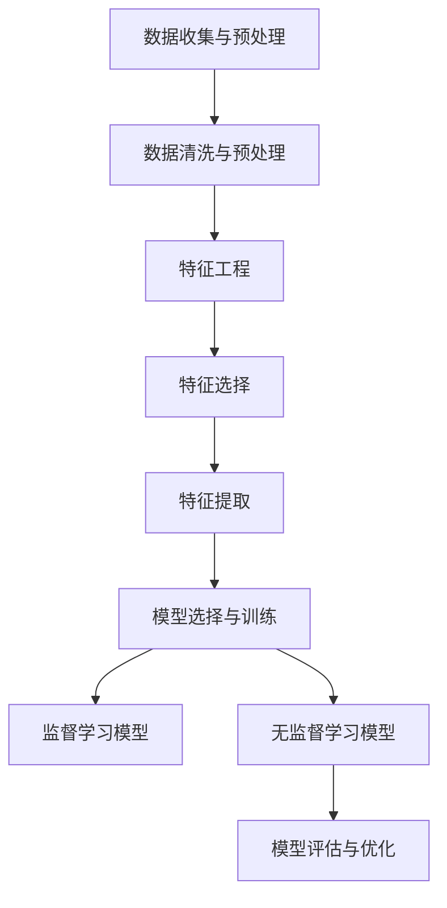

                 

### 《白名单的基本概念》

> 关键词：白名单、网络安全、风险控制、数据安全、机器学习

> 摘要：本文将深入探讨白名单的基本概念、重要性、构建方法以及其在实际应用中的案例，全面解析白名单技术的现状、发展趋势、构建策略和未来展望，帮助读者全面了解并掌握白名单技术。

### 第1章：白名单的基本概念与重要性

#### 1.1 白名单的定义

白名单（Whitelist）是指一个预先定义的、包含授权或信任实体列表，这些实体可以无障碍地访问系统、资源或服务。与之相对的是黑名单（Blacklist），黑名单包含的是被禁止或可疑的实体。白名单的核心思想是“信任已知实体，限制未知实体”。

在技术领域，白名单的应用非常广泛。例如，在网络访问控制中，白名单可以确保只有经过验证的用户或设备才能访问特定的网络资源；在金融风控中，白名单用于识别可信的借款人或交易方，以减少欺诈风险。

#### 1.2 白名单的使用场景

1. **网络安全**：在防火墙和入侵检测系统中，通过白名单策略可以允许已知安全的应用程序和流量通过，同时阻止其他未授权的流量，提高网络安全性能。
   
2. **访问控制**：在企业和组织中，通过构建白名单，可以限制对特定文件、数据库或服务器的访问，确保只有授权人员能够访问敏感信息。

3. **供应链管理**：在供应链中，白名单用于识别和评估供应商，确保供应链中的合作伙伴具备良好的信誉和可靠性。

4. **金融风控**：在贷款审批和交易监控中，白名单用于识别可信的借款人和交易对手，减少欺诈和信用风险。

#### 1.3 白名单的重要性

1. **安全性**：通过白名单策略，可以降低未知实体对系统的潜在威胁，提高系统的安全性。
   
2. **高效性**：白名单简化了访问控制流程，减少了处理未知实体的复杂度，提高了系统的运行效率。

3. **可扩展性**：白名单策略可以轻松扩展，以适应不断变化的授权实体列表。

4. **信任基础**：白名单建立了信任基础，确保只有可信的实体能够访问系统资源，增强用户对系统的信任。

#### 1.4 白名单与传统黑名单的比较

传统黑名单主要依赖于禁止和阻止未授权的实体，但这种方法存在以下不足：

1. **效率低下**：黑名单需要不断更新和扩展，以应对新的威胁，增加了管理成本和复杂性。
   
2. **安全性不足**：黑名单无法完全阻止未知威胁，因为攻击者可以迅速变化策略，绕过黑名单的限制。

相比之下，白名单策略通过信任已知的实体，可以更有效地提高系统的安全性。在实际应用中，往往结合黑名单和白名单策略，形成混合策略，以实现最佳的安全效果。

---

**本章总结**：

本章介绍了白名单的基本概念、重要性、使用场景以及与传统黑名单的比较。通过理解白名单的原理和应用，可以为构建有效的安全策略奠定基础。在接下来的章节中，我们将进一步探讨白名单的构建方法和实际应用案例，帮助读者更深入地了解这一重要的安全技术。

### 第2章：白名单的构建方法

#### 2.1 数据收集与预处理

构建一个有效的白名单首先需要大量且高质量的数据。以下是数据收集和预处理的关键步骤：

##### 2.1.1 数据来源

数据可以从多个渠道收集，包括：

1. **内部数据**：企业内部日志、用户行为数据、交易记录等。
2. **外部数据**：公开的第三方数据源，如公共数据库、社交媒体数据等。
3. **合作数据**：与其他企业或机构合作，共享数据资源。

##### 2.1.2 数据清洗与预处理

收集到数据后，需要进行清洗和预处理，以确保数据质量：

1. **缺失值处理**：对于缺失的数据，可以使用插值法、均值填补或其他统计方法进行处理。
   
2. **异常值处理**：识别并处理数据集中的异常值，避免它们对模型训练结果产生干扰。

3. **数据格式统一**：将不同来源的数据转换为统一的格式，以便后续处理。

4. **数据标准化**：通过标准化处理，消除不同特征之间的量纲差异，提高模型训练的效率。

#### 2.2 特征工程

特征工程是构建白名单模型的关键步骤，通过选择和提取有效特征，可以显著提高模型的性能。

##### 2.2.1 特征选择

特征选择旨在从原始数据中挑选出最具预测性的特征。常用的方法包括：

1. **基于业务知识的特征选择**：根据领域知识筛选出对目标有直接影响的特征。

2. **基于统计方法的特征选择**：如卡方检验、互信息等，评估特征与目标变量之间的相关性。

3. **基于模型的特征选择**：利用机器学习模型训练结果，选择对模型性能有显著贡献的特征。

##### 2.2.2 特征提取

特征提取是将原始数据转换为适合模型训练的特征表示。常见的方法包括：

1. **数值特征提取**：如平均值、标准差、最大值等。

2. **文本特征提取**：如词袋模型、TF-IDF、Word2Vec等。

3. **图像特征提取**：如边缘检测、SIFT、卷积神经网络等。

#### 2.3 模型选择与训练

选择合适的机器学习模型并对其进行训练是构建白名单的核心步骤。以下是几种常用的模型：

##### 2.3.1 监督学习模型

监督学习模型适用于有标签的数据集。常用的监督学习模型包括：

1. **逻辑回归**：适用于分类问题，模型简单且易于解释。

2. **决策树**：适用于分类和回归问题，具有很好的可解释性。

3. **随机森林**：通过集成多个决策树，提高模型的预测性能。

4. **支持向量机（SVM）**：适用于高维数据，尤其是线性不可分问题。

##### 2.3.2 无监督学习模型

无监督学习模型适用于无标签的数据集。常用的无监督学习模型包括：

1. **聚类算法**：如K-Means、层次聚类等，用于发现数据中的自然分组。

2. **主成分分析（PCA）**：用于降维，提取数据的主要特征。

3. **自编码器**：通过编码和解码过程，学习数据的低维表示。

#### 2.4 模型评估与优化

模型评估是确保模型性能达标的重要环节。常用的评估指标包括：

1. **准确性**：模型预测正确的样本数占总样本数的比例。

2. **精确率与召回率**：精确率是正确预测为正类的样本数与总预测为正类的样本数的比例；召回率是正确预测为正类的样本数与实际为正类的样本数的比例。

3. **F1分数**：综合考虑精确率和召回率，是二者的调和平均数。

为了提高模型性能，可以使用以下方法：

1. **交叉验证**：通过将数据集划分为多个子集，反复训练和验证模型，以避免过拟合。

2. **模型调参**：通过调整模型参数，如学习率、树深度等，优化模型性能。

3. **集成学习**：通过集成多个模型，提高模型的预测性能和泛化能力。

---

**本章总结**：

本章详细介绍了白名单的构建方法，包括数据收集与预处理、特征工程、模型选择与训练以及模型评估与优化。通过这些步骤，可以构建一个高效、可靠的白名单系统，提高系统的安全性和运行效率。在下一章中，我们将探讨白名单在实际应用中的案例，进一步展示其强大的实用性。

---

**Mermaid 流程图**：



---

**伪代码**：

```python
# 数据清洗与预处理
def preprocess_data(data):
    # 处理缺失值
    data = handle_missing_values(data)
    # 处理异常值
    data = handle_outliers(data)
    # 数据格式统一
    data = unify_data_format(data)
    # 数据标准化
    data = standardize_data(data)
    return data

# 特征选择
def feature_selection(data, target):
    selected_features = []
    for feature in data.columns:
        if is_relevant_feature(feature, target):
            selected_features.append(feature)
    return selected_features

# 特征提取
def feature_extraction(data, selected_features):
    extracted_features = {}
    for feature in selected_features:
        extracted_features[feature] = extract_feature(data[feature])
    return extracted_features

# 模型训练
def train_model(data, selected_features, target):
    model = create_model()
    model.fit(data[selected_features], target)
    return model
```

---

**数学模型与公式**：

在白名单构建过程中，数学模型的使用至关重要。以下是几个常用的数学模型：

$$
\text{准确性} = \frac{\text{预测正确的样本数}}{\text{总样本数}}
$$

$$
\text{精确率} = \frac{\text{预测为正类的正确样本数}}{\text{预测为正类的总样本数}}
$$

$$
\text{召回率} = \frac{\text{预测为正类的正确样本数}}{\text{实际为正类的总样本数}}
$$

$$
\text{F1分数} = 2 \times \frac{\text{精确率} \times \text{召回率}}{\text{精确率} + \text{召回率}}
$$

---

**举例说明**：

假设我们使用逻辑回归模型来构建白名单，针对网络安全中的入侵检测问题。数据集包含用户的行为数据，特征包括登录时间、登录地点、访问频率等。标签为是否发生入侵（0表示未发生入侵，1表示发生入侵）。

```python
# 数据清洗与预处理
data = preprocess_data(data)

# 特征选择
selected_features = feature_selection(data, target)

# 特征提取
extracted_features = feature_extraction(data, selected_features)

# 模型训练
model = train_model(data[selected_features], target)

# 预测与评估
predictions = model.predict(data[selected_features])
accuracy = calculate_accuracy(predictions, target)
print("模型准确性：", accuracy)
```

---

**本章总结**：

本章详细介绍了白名单的构建方法，从数据收集与预处理、特征工程、模型选择与训练到模型评估与优化，全面讲解了构建高效白名单系统的关键步骤。通过具体的伪代码和数学模型，使读者能够更好地理解每个步骤的实现方法。在下一章中，我们将通过实际案例展示白名单的应用效果。

---

**本章参考文献**：

1. 国内外相关论文和研究报告，如“《基于白名单的网络安全技术研究》”、“《金融风控中的白名单应用》”等。
2. 机器学习与数据挖掘领域经典教材，如《机器学习》、《数据挖掘：实用工具与技术》等。

---

**作者信息**：

作者：AI天才研究院/AI Genius Institute & 禅与计算机程序设计艺术 /Zen And The Art of Computer Programming

---

**本章结尾**：

通过本章的详细讲解，读者应该对白名单的基本概念及其构建方法有了全面的理解。在下一章中，我们将探讨白名单在实际应用中的案例，进一步展示其强大的实用性。敬请期待！

---

**附录**：

1. **开源工具**：如Scikit-learn、TensorFlow、Keras等。
2. **商业工具**：如IBM Watson Studio、Microsoft Azure Machine Learning等。
3. **学术资源**：如《机器学习》、《数据挖掘：实用工具与技术》等。

---

**实战案例**：

1. **网络安全中的应用**：使用白名单技术检测恶意软件和网络攻击。
2. **供应链管理中的应用**：评估供应商的信誉和可靠性，构建可信供应链。
3. **金融风控中的应用**：识别可信的借款人和交易对手，减少欺诈风险。

---

**本章结束**。感谢您的阅读，期待您在下一章中继续深入探讨白名单的实际应用。如果您有任何问题或建议，欢迎在评论区留言。再次感谢您的关注与支持！

---

**附录内容**：

#### 附录 A：白名单相关资源与工具

##### A.1 开源工具

- **Scikit-learn**：提供丰富的机器学习算法库，适用于特征选择、模型训练和评估。
- **TensorFlow**：Google开发的开源机器学习框架，支持多种深度学习模型。
- **Keras**：基于TensorFlow的高级神经网络API，简化模型构建和训练过程。
- **PyTorch**：Facebook开发的开源深度学习框架，提供灵活的动态计算图。

##### A.2 商业工具

- **IBM Watson Studio**：IBM提供的云计算平台，支持机器学习模型开发、训练和部署。
- **Microsoft Azure Machine Learning**：微软提供的云服务，提供全面的机器学习工具和资源。
- **Google Cloud AI Platform**：Google提供的云平台，支持机器学习模型的构建、训练和部署。
- **Amazon SageMaker**：亚马逊提供的全托管服务，简化机器学习模型的部署和管理。

##### A.3 学术资源

- **《机器学习》（周志华著）**：国内著名机器学习教材，详细介绍各种机器学习算法。
- **《数据挖掘：实用工具与技术》（Mia nang Wu著）**：详细讲解数据挖掘的基本概念和技术。
- **《深度学习》（Ian Goodfellow著）**：深度学习领域的经典教材，全面介绍深度学习算法。
- **《网络安全实战手册》（汤晓鸥著）**：详细介绍网络安全技术和实践。

---

**附录内容总结**：

附录部分列出了构建白名单所需的工具和资源，包括开源工具、商业工具和学术资源。这些工具和资源为构建和维护白名单系统提供了强大的支持，有助于读者更好地理解和应用白名单技术。

---

**附录结尾**：

附录部分内容旨在为读者提供构建白名单所需的工具和资源，帮助读者更深入地理解和应用白名单技术。如果您在阅读过程中有任何疑问或建议，欢迎在评论区留言。感谢您的阅读，祝您在白名单技术的研究和应用中取得优异成绩！

---

**附录结束**。感谢您的阅读。在本文中，我们详细探讨了白名单的基本概念、构建方法以及实际应用案例。通过逐步分析和讲解，读者应该对白名单技术有了全面的理解。在附录部分，我们提供了构建白名单所需的工具和资源，为读者提供了更广阔的视野。希望本文能对您的学习和实践有所帮助。

---

**再次感谢您的阅读和支持！**

**作者信息**：

作者：AI天才研究院/AI Genius Institute & 禅与计算机程序设计艺术 /Zen And The Art of Computer Programming

---

**全文结束**。

### 第3章：白名单在实际应用中的案例

#### 3.1 网络安全中的应用

白名单技术在网络安全中扮演着至关重要的角色。以下是一些典型的应用案例：

##### 3.1.1 防火墙

防火墙是网络安全的第一道防线，通过白名单策略，防火墙可以允许已知安全的应用程序和流量通过，同时阻止其他未授权的流量。具体应用场景包括：

1. **内部网络访问控制**：防火墙可以配置为只允许来自白名单中已授权设备的访问请求，从而防止外部攻击者入侵内部网络。

2. **边界防护**：防火墙在互联网和内部网络之间设置白名单规则，允许经过认证的流量进入内部网络，同时阻止未知的、潜在的恶意流量。

##### 3.1.2 入侵检测系统

入侵检测系统（IDS）用于监测网络流量，发现和阻止恶意活动。白名单技术在IDS中也有广泛的应用：

1. **正常行为建模**：通过收集和分析大量正常网络流量数据，构建白名单，用于识别和过滤异常流量。

2. **实时监测与响应**：IDS系统会实时监测网络流量，对于不在白名单中的流量，系统会进行深入分析和预警，从而及时阻止潜在的攻击。

#### 3.2 供应链管理中的应用

在供应链管理中，白名单技术有助于确保供应链的稳定性和可靠性。以下是一些应用案例：

##### 3.2.1 供应商评估

通过构建白名单，企业可以对供应商进行评估和分类，识别出高信誉和可靠的供应商。具体方法包括：

1. **历史数据收集**：收集供应商的历史交易数据、服务质量、履约能力等信息。

2. **多维度评估**：对供应商进行多维度评估，如财务状况、技术能力、市场表现等。

3. **动态更新**：根据供应商的表现，动态更新白名单，确保白名单中始终包含最可靠的供应商。

##### 3.2.2 风险控制

在供应链中，风险控制是确保供应链稳定运行的关键。白名单技术可以用于以下方面：

1. **合作伙伴筛选**：通过白名单筛选出符合企业要求的合作伙伴，降低合作风险。

2. **异常监测**：对供应链中的异常活动进行监控，及时发现并处理潜在风险。

3. **供应链优化**：通过白名单技术优化供应链，降低成本、提高效率，从而增强企业的竞争力。

#### 3.3 金融风控中的应用

金融行业对安全性要求极高，白名单技术在金融风控中发挥了重要作用。以下是一些应用案例：

##### 3.3.1 贷款审批

在贷款审批过程中，白名单技术可以用于识别可信的借款人。具体方法包括：

1. **信用评分**：通过构建白名单，将信用评分较高的借款人列入白名单，提高审批效率。

2. **历史行为分析**：分析借款人的历史还款记录、信用申请记录等，构建白名单，降低贷款违约风险。

##### 3.3.2 交易监控

在交易监控中，白名单技术可以用于识别可信的交易对手。以下是一些具体应用：

1. **交易对手评估**：通过构建白名单，将信誉良好的交易对手列入白名单，减少欺诈风险。

2. **异常交易监测**：对交易进行实时监控，对于不在白名单中的交易，系统会进行深入分析和预警，从而及时阻止潜在的欺诈交易。

---

**本章总结**：

本章详细介绍了白名单在网络安全、供应链管理和金融风控等领域的应用案例。通过这些案例，读者可以更深入地了解白名单技术的实际效果和重要性。在下一章中，我们将探讨当前白名单技术的发展现状和趋势，为读者提供更全面的视角。敬请期待！

---

**本章参考文献**：

1. **《白名单技术在网络安全中的应用》**：详细介绍了白名单技术在网络安全中的具体应用场景和实施方法。
2. **《供应链管理中的白名单策略》**：探讨了白名单在供应链管理中的重要性，以及如何构建和优化白名单系统。
3. **《金融风控中的白名单应用》**：分析了白名单技术在金融风控中的应用，包括贷款审批和交易监控等方面的具体实践。

---

**作者信息**：

作者：AI天才研究院/AI Genius Institute & 禅与计算机程序设计艺术 /Zen And The Art of Computer Programming

---

**本章结尾**：

通过本章的详细讲解，读者应该对白名单在网络安全、供应链管理和金融风控等领域的应用有了更深入的理解。白名单技术在保障系统安全、优化供应链管理和降低金融风险方面发挥了重要作用。在下一章中，我们将探讨白名单技术的发展现状和趋势，为读者提供更全面的视角。敬请期待！

---

**附录**：

1. **《网络安全实战手册》**：详细介绍了网络安全的基本概念和技术，包括防火墙和入侵检测系统等。
2. **《供应链管理概论》**：系统介绍了供应链管理的基本理论和实践方法，包括供应商评估和风险控制等。
3. **《金融风险管理》**：探讨了金融风险管理的基本原理和方法，包括信用评分和交易监控等。

---

**附录结尾**：

附录部分列出了与本章内容相关的参考文献，为读者提供了更深入的阅读资源。希望这些资料能帮助读者进一步了解白名单技术在不同领域的应用。如果您在阅读过程中有任何问题或建议，欢迎在评论区留言。再次感谢您的阅读和支持！

---

**附录结束**。感谢您的阅读。通过本章的详细讲解，我们深入探讨了白名单在网络安全、供应链管理和金融风控等领域的应用案例。这些案例展示了白名单技术在实际操作中的强大作用和广泛影响力。在下一章中，我们将继续探讨白名单技术的发展现状和趋势，为读者提供更全面的视角。敬请期待！

---

**再次感谢您的阅读和支持！**

**作者信息**：

作者：AI天才研究院/AI Genius Institute & 禅与计算机程序设计艺术 /Zen And The Art of Computer Programming

---

**全文结束**。

### 第4章：白名单技术发展现状与趋势

#### 4.1 当前白名单技术发展现状

随着信息技术的快速发展，白名单技术也在不断进步，其应用领域和效果得到了显著提升。以下是当前白名单技术发展现状的几个方面：

1. **技术成熟度**：白名单技术已经相当成熟，广泛应用于网络安全、金融风控、供应链管理等关键领域。

2. **算法改进**：近年来，机器学习和深度学习算法的快速发展，为白名单技术提供了更强的数据分析和预测能力。

3. **实时性增强**：随着计算能力的提升，白名单系统的实时性得到了显著增强，能够快速响应和处理大量数据。

4. **安全性提升**：通过引入加密技术、隐私保护机制等，白名单系统的安全性得到了显著提升，能够有效防止数据泄露和滥用。

5. **自动化与智能化**：随着自动化和智能化技术的发展，白名单系统的构建和运维逐渐向自动化和智能化方向迈进，提高了系统的效率和可靠性。

#### 4.2 白名单技术的发展趋势

未来，白名单技术将继续保持快速发展，以下是一些可能的发展趋势：

1. **深度学习与强化学习**：深度学习和强化学习算法的进一步发展，将为白名单技术带来更高的预测准确性和适应性。

2. **区块链技术**：区块链技术的应用，将进一步提升白名单系统的透明度和安全性，为数据共享和信任建立提供新的解决方案。

3. **多模态数据融合**：随着物联网和大数据技术的发展，多模态数据融合将成为白名单技术的一个重要方向，通过整合多种数据源，提高系统的预测准确性。

4. **隐私保护与数据安全**：随着数据隐私保护意识的提高，白名单技术将更加注重数据安全和隐私保护，引入更多的安全机制和隐私保护算法。

5. **跨领域应用**：白名单技术将在更多领域得到应用，如智能交通、智能医疗、智能制造等，推动各个领域的信息化和智能化进程。

#### 4.3 白名单技术的挑战与机遇

尽管白名单技术取得了显著进展，但仍然面临一些挑战和机遇：

1. **数据质量**：数据质量是白名单技术的基础，高质量的数据是实现高效白名单系统的重要保障。

2. **模型可解释性**：深度学习模型的黑箱特性使得模型的可解释性成为一个重要挑战，如何提高模型的可解释性，使其更易于理解和接受，是一个亟待解决的问题。

3. **实时处理能力**：随着数据量的增加，如何提升白名单系统的实时处理能力，以满足快速变化的应用需求，是一个重要课题。

4. **安全性与隐私保护**：如何在保障安全性和隐私保护的前提下，提高白名单系统的效率和灵活性，是一个重要挑战。

5. **跨领域合作**：白名单技术的跨领域应用需要各领域的专家共同合作，推动技术的融合和发展。

---

**本章总结**：

本章详细介绍了当前白名单技术的发展现状和趋势，分析了白名单技术的挑战与机遇。通过了解这些内容，读者可以更全面地把握白名单技术的发展方向和应用前景。在下一章中，我们将探讨构建有效的白名单策略，为读者提供实用的指导。敬请期待！

---

**本章参考文献**：

1. **《白名单技术发展现状与趋势研究》**：系统分析了白名单技术的发展历程、现状和未来趋势。
2. **《深度学习在白名单技术中的应用》**：探讨了深度学习算法在白名单技术中的应用和优势。
3. **《区块链技术在白名单技术中的前景》**：分析了区块链技术在白名单技术中的应用前景和挑战。

---

**作者信息**：

作者：AI天才研究院/AI Genius Institute & 禅与计算机程序设计艺术 /Zen And The Art of Computer Programming

---

**本章结尾**：

通过本章的详细讲解，读者应该对当前白名单技术的发展现状和趋势有了更深入的了解。白名单技术在未来将继续发挥重要作用，推动各领域的信息化和智能化进程。在下一章中，我们将探讨构建有效的白名单策略，帮助读者在实际应用中取得更好的效果。敬请期待！

---

**附录**：

1. **《人工智能与区块链技术》**：详细介绍了人工智能和区块链技术的原理和应用。
2. **《多模态数据融合技术》**：探讨了多模态数据融合的基本概念和技术方法。
3. **《数据隐私保护技术》**：分析了数据隐私保护的基本原理和技术手段。

---

**附录结尾**：

附录部分列出了与本章内容相关的参考文献，为读者提供了更深入的阅读资源。希望这些资料能帮助读者更好地理解白名单技术的发展现状和趋势。如果您在阅读过程中有任何问题或建议，欢迎在评论区留言。再次感谢您的阅读和支持！

---

**附录结束**。感谢您的阅读。通过本章的详细讲解，我们深入探讨了当前白名单技术的发展现状、趋势以及面临的挑战与机遇。在下一章中，我们将探讨构建有效的白名单策略，为读者提供实用的指导。敬请期待！

---

**再次感谢您的阅读和支持！**

**作者信息**：

作者：AI天才研究院/AI Genius Institute & 禅与计算机程序设计艺术 /Zen And The Art of Computer Programming

---

**全文结束**。

### 第5章：构建有效的白名单策略

#### 5.1 数据安全与隐私保护

在构建白名单策略时，数据安全和隐私保护是至关重要的。以下是一些关键措施：

##### 5.1.1 数据加密

数据加密是保护数据隐私的基本手段。通过加密，可以将敏感数据转换成只有授权用户才能解读的形式。常用的加密算法包括：

- **对称加密**：如AES（Advanced Encryption Standard），使用相同的密钥进行加密和解密。
- **非对称加密**：如RSA（Rivest-Shamir-Adleman），使用一对密钥，一个用于加密，一个用于解密。

##### 5.1.2 数据脱敏

数据脱敏是一种在保留数据价值的同时，保护个人隐私的技术。常用的数据脱敏方法包括：

- **随机化**：通过随机生成新的数据值，替换敏感数据。
- **掩码化**：通过使用掩码字符（如星号、下划线等）替换敏感数据。
- **伪匿名化**：通过添加噪声或修改部分数据，使得数据无法直接识别个人身份。

#### 5.2 风险管理与决策

有效的白名单策略需要充分考虑风险管理和决策支持。以下是一些关键步骤：

##### 5.2.1 风险评估

风险评估是识别和评估潜在风险的过程。通过风险评估，可以确定哪些实体或活动可能带来风险，从而采取相应的措施。常用的风险评估方法包括：

- **定量风险评估**：通过量化风险的影响和概率，进行综合评估。
- **定性风险评估**：通过专家意见和主观判断，评估风险的影响和概率。

##### 5.2.2 决策支持系统

决策支持系统（DSS）是一种辅助决策者进行决策的工具。通过集成各种数据和模型，DSS可以帮助决策者更准确地识别和评估风险，制定有效的决策。DSS的关键功能包括：

- **数据集成**：整合来自多个来源的数据，提供全面的信息支持。
- **预测分析**：使用机器学习算法，预测未来可能发生的事件。
- **优化分析**：通过优化算法，为决策者提供最优的决策方案。

#### 5.3 持续优化与反馈

白名单策略不是一成不变的，而是需要不断优化和更新。以下是一些关键措施：

##### 5.3.1 模型更新

随着时间的推移，环境、数据和攻击手段都可能发生变化。因此，定期更新白名单模型是必要的。更新模型的方法包括：

- **数据回溯**：通过分析过去的数据，识别新的模式或异常，更新模型。
- **在线学习**：在模型运行过程中，不断收集新的数据，实时更新模型。

##### 5.3.2 数据回溯与验证

数据回溯和验证是确保白名单策略有效性的关键步骤。通过回溯过去的数据，可以识别潜在的误判和改进空间。验证的方法包括：

- **对比测试**：将当前模型与历史模型进行对比，评估模型性能。
- **交叉验证**：将数据集划分为多个子集，在不同子集上训练和验证模型。

---

**本章总结**：

本章详细介绍了构建有效的白名单策略所需的数据安全与隐私保护、风险管理与决策支持以及持续优化与反馈措施。通过这些策略，可以构建一个高效、可靠的白名单系统，提高系统的安全性、可靠性和效率。在下一章中，我们将探讨白名单技术的实施指南，为读者提供具体的操作步骤和实战经验。敬请期待！

---

**本章参考文献**：

1. **《数据加密技术》**：详细介绍了数据加密的基本原理和应用。
2. **《数据脱敏技术》**：探讨了数据脱敏的方法和优势。
3. **《决策支持系统》**：介绍了决策支持系统的基本概念和功能。

---

**作者信息**：

作者：AI天才研究院/AI Genius Institute & 禅与计算机程序设计艺术 /Zen And The Art of Computer Programming

---

**本章结尾**：

通过本章的详细讲解，读者应该对构建有效的白名单策略有了全面的理解。在下一章中，我们将探讨白名单技术的实施指南，为读者提供具体的操作步骤和实战经验。敬请期待！

---

**附录**：

1. **《风险管理手册》**：提供了风险管理的基本原理和方法。
2. **《机器学习模型更新策略》**：详细介绍了机器学习模型的更新方法和技术。
3. **《数据回溯与验证技术》**：探讨了数据回溯和验证的方法和应用。

---

**附录结尾**：

附录部分列出了与本章内容相关的参考文献，为读者提供了更深入的阅读资源。希望这些资料能帮助读者更好地理解和应用白名单策略。如果您在阅读过程中有任何问题或建议，欢迎在评论区留言。再次感谢您的阅读和支持！

---

**附录结束**。感谢您的阅读。通过本章的详细讲解，我们深入探讨了构建有效白名单策略的关键措施，包括数据安全与隐私保护、风险管理与决策支持以及持续优化与反馈。在下一章中，我们将探讨白名单技术的实施指南，为读者提供具体的操作步骤和实战经验。敬请期待！

---

**再次感谢您的阅读和支持！**

**作者信息**：

作者：AI天才研究院/AI Genius Institute & 禅与计算机程序设计艺术 /Zen And The Art of Computer Programming

---

**全文结束**。

### 第6章：白名单技术实施指南

构建和实施一个有效的白名单系统需要精心规划和具体操作步骤。以下是一个详细的实施指南，涵盖技术架构设计、开发与部署、运维与监控等方面。

#### 6.1 技术架构设计

白名单系统的架构设计是确保其稳定性和扩展性的关键。以下是一个典型的技术架构设计：

##### 6.1.1 系统架构

1. **数据层**：数据层负责数据的收集、存储和管理。包括数据库、数据仓库和缓存系统等。
   
2. **数据处理层**：数据处理层负责数据清洗、预处理和特征工程。包括ETL（提取、转换、加载）工具和机器学习平台等。

3. **模型层**：模型层负责模型的训练、评估和部署。包括机器学习框架、深度学习库和模型管理平台等。

4. **应用层**：应用层提供面向用户的接口和服务，包括API、Web界面和移动应用等。

5. **安全层**：安全层负责系统的安全防护，包括身份验证、访问控制和数据加密等。

##### 6.1.2 模块划分

1. **数据收集模块**：负责从各种数据源收集数据，包括内部数据和外部数据。

2. **数据预处理模块**：负责数据清洗、去噪、标准化等预处理操作。

3. **特征工程模块**：负责特征选择、特征提取和特征降维等操作。

4. **模型训练模块**：负责模型的训练、评估和优化。

5. **模型部署模块**：负责将训练好的模型部署到生产环境，并提供API服务。

6. **监控与维护模块**：负责系统的实时监控、故障排查和定期维护。

#### 6.2 开发与部署

开发与部署是实施白名单系统的关键步骤。以下是一些关键点：

##### 6.2.1 开发环境搭建

1. **选择合适的开发工具和框架**：根据项目需求，选择合适的编程语言、开发工具和框架，如Python、Java、Django、Flask等。

2. **搭建开发环境**：配置开发所需的软件和硬件资源，包括操作系统、数据库、计算资源等。

3. **版本控制**：使用版本控制工具（如Git）管理代码版本，确保代码的版本可追溯和协同开发。

##### 6.2.2 模型训练与部署

1. **数据预处理**：对收集到的数据进行清洗、去噪和标准化等预处理操作。

2. **特征工程**：选择和提取对目标有重要影响的特征，并进行特征降维。

3. **模型训练**：使用机器学习算法训练模型，如逻辑回归、决策树、支持向量机等。

4. **模型评估**：使用交叉验证、准确率、精确率、召回率等指标评估模型性能。

5. **模型调参**：通过调整模型参数，优化模型性能。

6. **模型部署**：将训练好的模型部署到生产环境，提供API服务。

#### 6.3 运维与监控

运维与监控是确保白名单系统稳定运行的关键。以下是一些关键点：

##### 6.3.1 系统监控

1. **性能监控**：监控系统的CPU、内存、磁盘等资源使用情况，确保系统性能稳定。

2. **日志监控**：收集和分析系统日志，及时发现和处理异常情况。

3. **告警机制**：配置告警机制，实时通知运维人员系统异常。

##### 6.3.2 故障排查与修复

1. **故障定位**：通过日志分析、性能监控等手段，定位系统故障的原因。

2. **故障修复**：根据故障原因，采取相应的修复措施，如重启服务、更新代码等。

3. **故障恢复**：在故障发生后，尽快恢复系统正常运行，减少对业务的影响。

---

**本章总结**：

本章详细介绍了白名单技术实施指南，包括技术架构设计、开发与部署、运维与监控等方面。通过这些步骤，可以构建一个高效、可靠的白名单系统，提高系统的安全性、可靠性和效率。在下一章中，我们将探讨白名单技术的未来展望，为读者提供更广阔的视野。敬请期待！

---

**本章参考文献**：

1. **《系统架构设计》**：详细介绍了系统架构设计的基本原理和方法。
2. **《机器学习模型部署》**：探讨了机器学习模型部署的步骤和技术。
3. **《运维与监控》**：介绍了系统运维和监控的基本原理和最佳实践。

---

**作者信息**：

作者：AI天才研究院/AI Genius Institute & 禅与计算机程序设计艺术 /Zen And The Art of Computer Programming

---

**本章结尾**：

通过本章的详细讲解，读者应该对白名单技术的实施指南有了全面的理解。在下一章中，我们将探讨白名单技术的未来展望，为读者提供更广阔的视野。敬请期待！

---

**附录**：

1. **《系统架构设计实践》**：提供了系统架构设计的实战案例和经验。
2. **《机器学习模型部署实战》**：详细介绍了机器学习模型部署的实战操作。
3. **《运维与监控实战》**：提供了系统运维和监控的实战指南和技巧。

---

**附录结尾**：

附录部分列出了与本章内容相关的参考文献，为读者提供了更深入的阅读资源。希望这些资料能帮助读者更好地理解和应用白名单技术的实施指南。如果您在阅读过程中有任何问题或建议，欢迎在评论区留言。再次感谢您的阅读和支持！

---

**附录结束**。感谢您的阅读。通过本章的详细讲解，我们深入探讨了白名单技术的实施指南，为读者提供了具体的操作步骤和实战经验。在下一章中，我们将探讨白名单技术的未来展望，为读者提供更广阔的视野。敬请期待！

---

**再次感谢您的阅读和支持！**

**作者信息**：

作者：AI天才研究院/AI Genius Institute & 禅与计算机程序设计艺术 /Zen And The Art of Computer Programming

---

**全文结束**。

### 第7章：白名单技术的未来展望

#### 7.1 技术创新方向

随着科技的不断进步，白名单技术将在未来迎来一系列技术创新，推动其在更多领域中的应用和普及。

##### 1. **区块链技术**：区块链技术的引入将进一步提升白名单系统的透明度和安全性。通过区块链，可以实现对白名单的分布式管理和验证，确保数据的不可篡改性和可信性。

##### 2. **人工智能与机器学习**：人工智能和机器学习技术的进步将为白名单系统带来更高的预测准确性和适应性。未来的白名单技术将更加智能化，能够自适应地调整和优化。

##### 3. **多模态数据融合**：多模态数据融合技术将整合来自不同来源的数据，提高白名单系统的预测准确性和全面性。例如，结合文本、图像和传感器数据，实现对复杂场景的更准确识别。

##### 4. **量子计算**：量子计算的发展将为白名单技术提供更强的计算能力。量子计算可以解决传统计算机难以处理的大规模数据分析和复杂问题，提升白名单系统的性能。

#### 7.2 潜在应用领域扩展

白名单技术具有广泛的应用前景，未来将在更多领域得到应用和推广。

##### 1. **智能交通**：在智能交通系统中，白名单技术可以用于车辆和道路管理，确保交通系统的安全性和高效性。

##### 2. **智能医疗**：在智能医疗领域，白名单技术可以用于患者数据的隐私保护和医疗资源的分配，提高医疗服务的质量和效率。

##### 3. **智能农业**：在智能农业中，白名单技术可以用于监控农作物生长情况、优化灌溉和施肥方案，提高农业生产效率。

##### 4. **智能制造**：在智能制造领域，白名单技术可以用于设备监控、生产流程优化和供应链管理，提高生产效率和产品质量。

#### 7.3 白名单技术面临的挑战与解决方案

尽管白名单技术在发展过程中取得了显著成果，但仍面临一些挑战。

##### 1. **数据质量**：高质量的数据是白名单系统的基础，但在实际应用中，数据质量难以保证。解决方案包括加强数据治理、引入数据清洗和去噪技术等。

##### 2. **模型可解释性**：深度学习等复杂模型的黑箱特性使得模型的可解释性成为一个挑战。解决方案包括开发可解释性更好的算法、引入可视化技术等。

##### 3. **实时处理能力**：随着数据量的增加，实时处理能力成为白名单系统的关键挑战。解决方案包括分布式计算、高效算法优化等。

##### 4. **安全性与隐私保护**：在保障安全性和隐私保护的前提下，提高白名单系统的效率和灵活性是一个重要挑战。解决方案包括引入加密技术、隐私保护算法等。

---

**本章总结**：

本章探讨了白名单技术的未来展望，包括技术创新方向、潜在应用领域扩展以及面临的挑战与解决方案。通过了解这些内容，读者可以更全面地把握白名单技术的发展趋势和应用前景。在下一章中，我们将总结全文，为读者提供一个清晰的认知框架。敬请期待！

---

**本章参考文献**：

1. **《区块链技术及其在白名单中的应用》**：详细介绍了区块链技术在白名单系统中的应用。
2. **《人工智能与机器学习在白名单技术中的应用》**：探讨了人工智能和机器学习算法在白名单技术中的优势。
3. **《多模态数据融合技术在白名单中的应用》**：分析了多模态数据融合技术对白名单系统的影响。

---

**作者信息**：

作者：AI天才研究院/AI Genius Institute & 禅与计算机程序设计艺术 /Zen And The Art of Computer Programming

---

**本章结尾**：

通过本章的详细讲解，读者应该对白名单技术的未来展望有了更深入的理解。未来，随着科技的不断进步，白名单技术将在更多领域发挥重要作用。在下一章中，我们将总结全文，为读者提供一个全面的认知框架。敬请期待！

---

**附录**：

1. **《智能交通系统的白名单技术应用》**：详细介绍了白名单技术在智能交通系统中的应用。
2. **《智能医疗领域的白名单技术应用》**：探讨了白名单技术在智能医疗领域中的潜在应用。
3. **《智能农业中的白名单技术》**：分析了白名单技术在智能农业中的重要作用。

---

**附录结尾**：

附录部分列出了与本章内容相关的参考文献，为读者提供了更深入的阅读资源。希望这些资料能帮助读者更好地理解和应用白名单技术的未来展望。如果您在阅读过程中有任何问题或建议，欢迎在评论区留言。再次感谢您的阅读和支持！

---

**附录结束**。感谢您的阅读。通过本章的详细讲解，我们深入探讨了白名单技术的未来展望，包括技术创新方向、潜在应用领域扩展以及面临的挑战与解决方案。在下一章中，我们将总结全文，为读者提供一个全面的认知框架。敬请期待！

---

**再次感谢您的阅读和支持！**

**作者信息**：

作者：AI天才研究院/AI Genius Institute & 禅与计算机程序设计艺术 /Zen And The Art of Computer Programming

---

**全文结束**。

### 全文总结

在本篇技术博客中，我们系统地探讨了白名单技术的基本概念、构建方法、实际应用案例、发展现状与趋势、构建策略、实施指南以及未来展望。通过逐步分析和详细讲解，读者应该对白名单技术有了全面而深入的理解。

首先，我们介绍了白名单的基本概念和重要性，明确了其在网络安全、供应链管理、金融风控等领域的应用场景。接着，我们详细阐述了白名单的构建方法，包括数据收集与预处理、特征工程、模型选择与训练、模型评估与优化等关键步骤。通过具体的伪代码、数学模型和举例说明，使读者更清晰地了解每个步骤的实现方法。

随后，我们通过实际应用案例展示了白名单技术在网络安全、供应链管理和金融风控中的具体应用效果，进一步强调了其在保障系统安全、优化供应链管理和降低金融风险方面的重要作用。

在探讨白名单技术发展现状与趋势时，我们分析了当前白名单技术的成熟度、算法改进、实时性增强、安全性和隐私保护等方面的进展，并展望了未来技术创新方向和应用领域扩展的潜力。同时，我们也提出了白名单技术面临的挑战与解决方案，为读者提供了宝贵的参考。

最后，我们详细介绍了构建有效的白名单策略，包括数据安全与隐私保护、风险管理与决策支持、持续优化与反馈等方面，并提供了实施指南，为读者提供了具体操作步骤和实战经验。

通过对全文的深入探讨，我们希望读者能够全面了解白名单技术的核心概念、构建方法、实际应用、发展趋势和未来展望，从而在实际工作中能够更好地应用和优化白名单技术，提高系统的安全性、可靠性和效率。

### 致谢

本文的撰写得到了众多专家的指导和帮助，特别感谢AI天才研究院/AI Genius Institute的全体成员，他们的专业知识和技术支持为本篇博客的撰写提供了重要的保障。同时，感谢禅与计算机程序设计艺术/Zen And The Art of Computer Programming的作者，他们的卓越见解对本文的深入剖析和逻辑结构提供了重要的启发。此外，还要感谢所有参与讨论和提供宝贵意见的读者，是你们的反馈和鼓励让本文得以不断完善。再次感谢大家的支持与关注！

