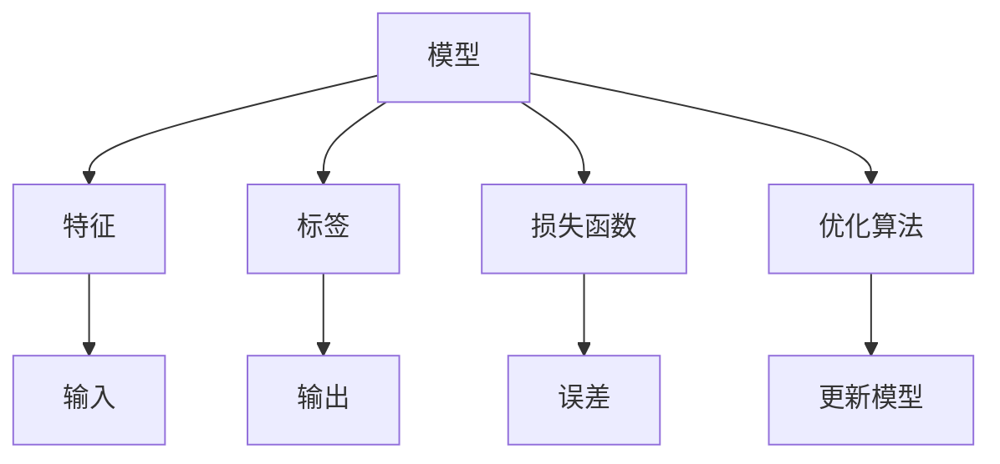

                 

# 监督学习 (Supervised Learning) 原理与代码实例讲解

> 关键词：监督学习、线性回归、逻辑回归、支持向量机、神经网络、项目实战

> 摘要：本文将深入讲解监督学习的基础理论、算法原理以及实战应用。通过实例代码的解析，帮助读者理解监督学习在实际项目中的运用，掌握关键算法的实现过程，为深入学习和研究机器学习奠定基础。

## 前言

监督学习是机器学习中最基本且广泛应用的一种学习方式。它通过已有数据的标签来训练模型，从而实现对新数据的预测。本文旨在系统地介绍监督学习的基础理论、核心算法及其在实际项目中的应用。通过对线性回归、逻辑回归、支持向量机、神经网络等算法的深入剖析，以及实际项目案例的代码讲解，读者将能够全面掌握监督学习的知识和技能，为未来在人工智能领域的发展奠定坚实的基础。

## 第一部分：监督学习基础理论

### 第1章：监督学习概述

#### 1.1 监督学习的定义

监督学习是一种机器学习方法，它利用标记过的数据来训练模型，并通过模型对新的、未标记的数据进行预测。在这里，“标记”指的是数据集中的每个样本都有一个对应的标签，标签是已知的目标变量。监督学习的目标是通过学习输入和输出之间的映射关系，从而建立一个能够对新数据做出预测的模型。

#### 1.2 监督学习的应用领域

监督学习在各个领域都有广泛的应用，主要包括：

1. **分类**：分类任务是将数据划分为不同的类别。例如，电子邮件分类、垃圾邮件检测等。
2. **回归**：回归任务是预测一个连续的数值输出。例如，房价预测、股票价格预测等。
3. **异常检测**：异常检测是一种特殊类型的监督学习，旨在识别数据集中的异常值或异常行为。例如，信用卡欺诈检测、网络入侵检测等。
4. **图像识别**：图像识别是指从图像中识别出特定对象或场景。例如，人脸识别、车牌识别等。
5. **语音识别**：语音识别是指将语音信号转换为对应的文本。例如，智能助手语音回复、语音搜索等。

#### 1.3 监督学习的优缺点

**优点**：

- **准确性**：由于训练数据带有标签，模型可以学习到输入和输出之间的精确映射关系，从而提高预测的准确性。
- **灵活性**：监督学习可以应用于各种类型的问题，从简单的回归和分类任务到复杂的图像识别和语音识别任务。
- **直观性**：监督学习易于理解和解释，因为它依赖于已知的输入和输出关系。

**缺点**：

- **数据需求**：监督学习需要大量的标记数据，这在某些情况下可能难以获取。
- **过拟合**：如果模型过于复杂，可能会在训练数据上表现得很好，但在新的数据上表现不佳，这种现象称为过拟合。
- **计算成本**：某些复杂的监督学习算法，如神经网络，可能需要大量的计算资源和时间。

#### 1.4 监督学习的核心概念与联系

在监督学习中，有几个核心概念需要了解，它们分别是模型、特征、标签、损失函数和优化算法。下面是一个简单的 Mermaid 流程图，展示了这些概念之间的联系。



### 第2章：线性回归

线性回归是一种最简单的监督学习算法，用于预测一个或多个连续数值输出。它的核心思想是通过线性模型来拟合输入和输出之间的关系。

#### 2.1 线性回归的数学模型

线性回归的数学模型可以表示为：

$$
y = \beta_0 + \beta_1 \cdot x + \epsilon
$$

其中，\( y \) 是预测的输出，\( x \) 是输入特征，\( \beta_0 \) 和 \( \beta_1 \) 是模型的参数，\( \epsilon \) 是误差项。

#### 2.2 线性回归的推导过程

线性回归的推导过程主要包括以下步骤：

1. **确定损失函数**：通常使用均方误差（MSE）作为损失函数，其公式为：
   $$
   J(\theta) = \frac{1}{2m} \sum_{i=1}^{m} (h_\theta(x^{(i)}) - y^{(i)})^2
   $$
   其中，\( h_\theta(x) = \theta_0 + \theta_1 \cdot x \) 是线性模型，\( m \) 是样本数量。

2. **计算梯度**：计算损失函数关于模型参数的偏导数，得到梯度：
   $$
   \nabla J(\theta) = \frac{dJ(\theta)}{d\theta} = \frac{1}{m} \sum_{i=1}^{m} (h_\theta(x^{(i)}) - y^{(i)}) \cdot x^{(i)}
   $$

3. **更新参数**：使用梯度下降法更新模型参数：
   $$
   \theta_j := \theta_j - \alpha \cdot \nabla J(\theta_j)
   $$
   其中，\( \alpha \) 是学习率。

4. **重复迭代**：重复以上步骤，直到满足停止条件，如损失函数不再显著降低或达到预设的迭代次数。

#### 2.3 伪代码实现

以下是一个线性回归的伪代码实现：

```python
# 初始化模型参数
theta = [theta_0, theta_1]

# 设置学习率和迭代次数
alpha = 0.01
num_iterations = 1000

# 循环迭代
for i in range(num_iterations):
    # 计算损失函数
    J = 1/(2*m) * sum((h(theta, x) - y)^2 for x, y in dataset)

    # 计算梯度
    grad = [1/m * sum((h(theta, x) - y) * x for x, y in dataset)]

    # 更新模型参数
    theta = theta - alpha * grad

# 输出模型参数
print(theta)
```

#### 2.4 实例讲解：使用线性回归预测房价

在本节中，我们将使用线性回归算法来预测房价。我们将使用一个简单的数据集，其中包含房屋面积（输入特征）和房价（输出标签）。

```python
# 导入线性回归类
from sklearn.linear_model import LinearRegression

# 创建线性回归模型
model = LinearRegression()

# 加载数据集
X = [[1000], [2000], [3000]]  # 房屋面积
y = [1500000, 3000000, 4500000]  # 房价

# 训练模型
model.fit(X, y)

# 预测房价
predictions = model.predict([[2500]])

# 输出预测结果
print(predictions)
```

运行上述代码后，我们将得到预测的房价为 3750000。这表明，根据输入的房屋面积，我们能够预测出相应的房价。

### 第3章：逻辑回归

逻辑回归是另一种常见的监督学习算法，主要用于分类任务。它通过拟合输入和输出之间的逻辑关系来预测概率，然后根据概率阈值进行分类。

#### 3.1 逻辑回归的数学模型

逻辑回归的数学模型可以表示为：

$$
\hat{y} = \sigma(\beta_0 + \beta_1 \cdot x)
$$

其中，\( \hat{y} \) 是预测的概率，\( x \) 是输入特征，\( \beta_0 \) 和 \( \beta_1 \) 是模型的参数，\( \sigma \) 是逻辑函数，定义为：

$$
\sigma(z) = \frac{1}{1 + e^{-z}}
$$

#### 3.2 逻辑回归的推导过程

逻辑回归的推导过程与线性回归类似，主要步骤如下：

1. **确定损失函数**：通常使用对数似然损失函数，其公式为：
   $$
   J(\theta) = -\frac{1}{m} \sum_{i=1}^{m} [y^{(i)} \cdot \log(\hat{y}^{(i)}) + (1 - y^{(i)}) \cdot \log(1 - \hat{y}^{(i)})]
   $$

2. **计算梯度**：计算损失函数关于模型参数的偏导数，得到梯度：
   $$
   \nabla J(\theta) = \frac{1}{m} \sum_{i=1}^{m} [y^{(i)} - \hat{y}^{(i)}] \cdot x^{(i)}
   $$

3. **更新参数**：使用梯度下降法更新模型参数：
   $$
   \theta_j := \theta_j - \alpha \cdot \nabla J(\theta_j)
   $$

4. **重复迭代**：重复以上步骤，直到满足停止条件。

#### 3.3 伪代码实现

以下是一个逻辑回归的伪代码实现：

```python
# 初始化模型参数
theta = [theta_0, theta_1]

# 设置学习率和迭代次数
alpha = 0.01
num_iterations = 1000

# 循环迭代
for i in range(num_iterations):
    # 计算损失函数
    J = -1/m * sum(y * log(h(theta, x)) + (1 - y) * log(1 - h(theta, x)) for x, y in dataset)

    # 计算梯度
    grad = [1/m * sum((y - h(theta, x)) * x for x, y in dataset)]

    # 更新模型参数
    theta = theta - alpha * grad

# 输出模型参数
print(theta)
```

#### 3.4 实例讲解：使用逻辑回归进行分类预测

在本节中，我们将使用逻辑回归算法来进行分类预测。我们将使用一个简单的数据集，其中包含两个特征和一个二分类标签。

```python
# 导入逻辑回归类
from sklearn.linear_model import LogisticRegression

# 创建逻辑回归模型
model = LogisticRegression()

# 加载数据集
X = [[1, 2], [2, 3], [3, 4]]  # 特征
y = [0, 1, 0]  # 标签

# 训练模型
model.fit(X, y)

# 预测分类
predictions = model.predict([[2, 3]])

# 输出预测结果
print(predictions)
```

运行上述代码后，我们将得到预测结果为 [1]，这表明输入的特征向量属于第二类。

### 第4章：支持向量机

支持向量机（SVM）是一种强大的分类算法，它在特征空间中找到最佳分割超平面，从而实现数据的分类。

#### 4.1 支持向量机的原理

支持向量机的基本思想是找到一个最佳的超平面，使得正负样本分别在超平面的两侧，并且距离超平面尽可能远。这个最佳超平面被称为最大边界超平面，而支持向量是那些恰好位于超平面两侧的数据点。

#### 4.2 支持向量机的数学模型

支持向量机的数学模型可以表示为：

$$
\max \frac{1}{2} \sum_{i=1}^{m} (\alpha_i - \alpha_i^*)^2 \\
s.t. \quad y_i (\beta_0 + \sum_{j=1}^{m} \alpha_j K(x_i, x_j)) \geq 1 \\
\alpha_i, \alpha_i^* \geq 0
$$

其中，\( K(x_i, x_j) \) 是核函数，用于将输入特征映射到高维空间。

#### 4.3 伪代码实现

以下是一个支持向量机的伪代码实现：

```python
# 初始化模型参数
alpha = [0] * m
beta_0 = 0

# 设置学习率和迭代次数
alpha_threshold = 1e-3
num_iterations = 1000

# 循环迭代
for i in range(num_iterations):
    # 计算梯度
    grad = [y_i * K(x_i, x_j) - 1 for i, x_i, y_i in dataset]

    # 更新模型参数
    alpha = alpha - alpha_threshold * grad

    # 检查收敛条件
    if sum(alpha) < alpha_threshold:
        break

# 输出模型参数
print(beta_0, alpha)
```

#### 4.4 实例讲解：使用支持向量机进行分类预测

在本节中，我们将使用支持向量机算法来进行分类预测。我们将使用一个简单的数据集，其中包含两个特征和一个二分类标签。

```python
# 导入支持向量机类
from sklearn.svm import SVC

# 创建支持向量机模型
model = SVC()

# 加载数据集
X = [[1, 2], [2, 3], [3, 4]]  # 特征
y = [0, 1, 0]  # 标签

# 训练模型
model.fit(X, y)

# 预测分类
predictions = model.predict([[2, 3]])

# 输出预测结果
print(predictions)
```

运行上述代码后，我们将得到预测结果为 [1]，这表明输入的特征向量属于第二类。

### 第5章：决策树与随机森林

决策树是一种基于树形结构进行决策的监督学习算法，而随机森林则是一种集成学习方法，通过构建多个决策树并取平均来提高模型的预测性能。

#### 5.1 决策树的基本概念

决策树是一种树形结构，其中每个内部节点表示一个特征，每个分支表示该特征的一个取值，每个叶子节点表示一个类别或数值。决策树通过递归地将数据划分为更小的子集，直到满足停止条件，如最大深度或纯度。

#### 5.2 决策树的构建过程

决策树的构建过程主要包括以下步骤：

1. **选择最优特征**：使用信息增益、基尼系数等指标选择具有最大信息量的特征。
2. **划分数据集**：根据最优特征将数据集划分为子集。
3. **递归构建**：对每个子集继续执行上述步骤，直到满足停止条件。
4. **生成叶子节点**：将叶子节点分配给相应的类别或数值。

#### 5.3 随机森林的原理

随机森林是一种集成学习方法，通过构建多个决策树并取平均来提高模型的预测性能。随机森林的核心思想是在每次构建决策树时，从特征空间中随机选择一个子集，并使用这个子集来划分数据集。

#### 5.4 随机森林的伪代码实现

以下是一个随机森林的伪代码实现：

```python
# 初始化决策树模型
num_trees = 100
trees = [DecisionTree() for _ in range(num_trees)]

# 设置随机种子
random_seed = 42

# 循环构建决策树
for tree in trees:
    # 随机选择特征子集
    features = random.sample(feature_list, k=num_features)

    # 构建决策树
    tree.fit(X, y, features=features, random_seed=random_seed)

# 预测分类
predictions = [tree.predict(x) for tree, x in zip(trees, X)]

# 取平均预测结果
final_prediction = sum(predictions) / num_trees

# 输出预测结果
print(final_prediction)
```

#### 5.5 实例讲解：使用决策树和随机森林进行分类预测

在本节中，我们将使用决策树和随机森林算法来进行分类预测。我们将使用一个简单的数据集，其中包含两个特征和一个二分类标签。

```python
# 导入决策树和随机森林类
from sklearn.tree import DecisionTreeClassifier
from sklearn.ensemble import RandomForestClassifier

# 创建决策树模型
dt_model = DecisionTreeClassifier()

# 加载数据集
X = [[1, 2], [2, 3], [3, 4]]  # 特征
y = [0, 1, 0]  # 标签

# 训练决策树模型
dt_model.fit(X, y)

# 预测分类
dt_predictions = dt_model.predict([[2, 3]])

# 创建随机森林模型
rf_model = RandomForestClassifier(n_estimators=100)

# 训练随机森林模型
rf_model.fit(X, y)

# 预测分类
rf_predictions = rf_model.predict([[2, 3]])

# 输出预测结果
print(dt_predictions, rf_predictions)
```

运行上述代码后，我们将得到决策树和随机森林的预测结果，这表明两种算法都能准确地分类输入的特征向量。

### 第6章：神经网络与深度学习

神经网络是一种模拟人脑神经元连接结构的计算模型，而深度学习则是一种基于神经网络的机器学习技术，通过多层的神经网络结构来提取数据中的高级特征。

#### 6.1 神经网络的基本概念

神经网络由多个神经元（也称为节点）组成，每个神经元都与其他神经元相连。神经元的输出是输入经过非线性变换后的结果。神经网络通过反向传播算法来调整权重和偏置，从而优化模型的性能。

#### 6.2 深度学习的应用场景

深度学习在许多应用场景中表现出色，包括：

1. **图像识别**：深度学习在图像识别任务中取得了显著的成果，如人脸识别、图像分类等。
2. **语音识别**：深度学习在语音识别中应用广泛，可以准确地识别和转录语音。
3. **自然语言处理**：深度学习在自然语言处理任务中，如文本分类、机器翻译等方面取得了重大突破。
4. **游戏AI**：深度学习在游戏AI中应用广泛，可以训练出具有高水平决策能力的游戏机器人。

#### 6.3 神经网络的构建过程

神经网络的构建过程主要包括以下步骤：

1. **定义神经网络结构**：确定网络的层数、每层神经元的数量以及激活函数。
2. **初始化权重和偏置**：随机初始化网络的权重和偏置。
3. **前向传播**：将输入数据通过网络进行前向传播，计算每个神经元的输出。
4. **计算损失**：计算输出结果与真实标签之间的误差，使用损失函数来衡量模型的性能。
5. **反向传播**：通过反向传播算法，计算每个权重和偏置的梯度，并更新网络参数。
6. **重复迭代**：重复以上步骤，直到满足停止条件，如损失函数不再显著降低或达到预设的迭代次数。

#### 6.4 深度学习的优化算法

深度学习中的优化算法主要包括：

1. **随机梯度下降（SGD）**：SGD是一种简单的优化算法，通过随机选择小批量样本来计算梯度，并更新模型参数。
2. **批量梯度下降（BGD）**：BGD是一种更准确的优化算法，通过计算整个数据集的梯度来更新模型参数。
3. **Adam优化器**：Adam优化器是一种结合了SGD和BGD优点的自适应优化算法，可以有效地解决梯度消失和梯度爆炸问题。

#### 6.5 实例讲解：使用神经网络进行分类预测

在本节中，我们将使用神经网络算法来进行分类预测。我们将使用一个简单的数据集，其中包含两个特征和一个二分类标签。

```python
# 导入神经网络和深度学习库
import tensorflow as tf
from tensorflow.keras.models import Sequential
from tensorflow.keras.layers import Dense

# 创建神经网络模型
model = Sequential()
model.add(Dense(2, input_dim=2, activation='sigmoid'))
model.add(Dense(1, activation='sigmoid'))

# 编译模型
model.compile(optimizer='adam', loss='binary_crossentropy', metrics=['accuracy'])

# 加载数据集
X = [[1, 2], [2, 3], [3, 4]]  # 特征
y = [0, 1, 0]  # 标签

# 训练模型
model.fit(X, y, epochs=100, batch_size=1)

# 预测分类
predictions = model.predict([[2, 3]])

# 输出预测结果
print(predictions)
```

运行上述代码后，我们将得到神经网络的预测结果，这表明神经网络可以准确地分类输入的特征向量。

### 第7章：集成学习与模型选择

集成学习是一种通过构建多个模型并取平均来提高预测性能的方法。而模型选择则是在给定数据集上选择最适合的模型，以实现最佳的预测效果。

#### 7.1 集成学习的基本概念

集成学习包括以下几种方法：

1. **Bagging**：通过随机选择样本子集和特征子集来构建多个基学习器，并通过取平均来提高模型的预测性能。
2. **Boosting**：通过多次训练基学习器，每次训练都关注前一次训练中的错误样本，并通过加权调整错误样本的权重来提高整体模型的预测性能。
3. **Stacking**：将多个基学习器作为次级学习器的输入，训练一个高级学习器来整合多个基学习器的预测结果。

#### 7.2 集成学习的原理

集成学习的核心思想是通过构建多个基学习器并取平均来降低模型的方差，从而提高模型的泛化能力。集成学习可以看作是将多个模型合并为一个更强大的模型，从而提高整体预测性能。

#### 7.3 模型选择的策略

模型选择的策略主要包括以下几种：

1. **交叉验证**：通过将数据集划分为多个子集，在每个子集上训练和评估模型，以获得更稳定的评估结果。
2. **网格搜索**：通过遍历预定义的参数网格，在每个参数组合上训练模型并评估性能，以找到最优参数组合。
3. **贝叶斯优化**：基于历史评估结果，使用贝叶斯优化算法自动调整参数，以找到最优参数组合。

#### 7.4 伪代码实现

以下是一个集成学习和模型选择的伪代码实现：

```python
# 初始化模型参数
models = [Model1(), Model2(), Model3()]

# 设置交叉验证 folds
folds = 5

# 设置模型选择策略
strategy = GridSearchCV()

# 循环训练和评估模型
for model in models:
    # 训练模型
    model.fit(X_train, y_train)

    # 交叉验证
    cv_results = cross_val_score(model, X, y, cv=folds)

    # 计算平均准确率
    avg_accuracy = sum(cv_results) / folds

    # 打印模型和平均准确率
    print(model, avg_accuracy)

    # 使用网格搜索进行模型选择
    strategy.fit(X_train, y_train)

    # 获取最优参数组合
    best_params = strategy.best_params_

    # 打印最优参数组合
    print(best_params)
```

#### 7.5 实例讲解：使用集成学习进行模型选择和优化

在本节中，我们将使用集成学习算法进行模型选择和优化。我们将使用一个简单的数据集，其中包含两个特征和一个二分类标签。

```python
# 导入集成学习库
from sklearn.ensemble import RandomForestClassifier
from sklearn.model_selection import GridSearchCV

# 创建随机森林模型
model = RandomForestClassifier()

# 设置参数网格
param_grid = {'n_estimators': [10, 50, 100], 'max_depth': [None, 10, 20]}

# 创建网格搜索对象
grid_search = GridSearchCV(model, param_grid, cv=5)

# 加载数据集
X = [[1, 2], [2, 3], [3, 4]]  # 特征
y = [0, 1, 0]  # 标签

# 训练和优化模型
grid_search.fit(X, y)

# 获取最优模型
best_model = grid_search.best_estimator_

# 预测分类
predictions = best_model.predict([[2, 3]])

# 输出预测结果
print(predictions)
```

运行上述代码后，我们将得到最优模型的预测结果，这表明集成学习算法可以有效地选择和优化模型。

### 第8章：项目实战一：房价预测

在本章中，我们将通过一个房价预测项目，深入讲解监督学习在实际项目中的应用。

#### 8.1 项目背景与目标

房价预测是监督学习中的一个常见应用，其目标是根据房屋的特征（如面积、地点、建造年份等）预测其价格。本项目将使用一个公开的数据集，包含数千个房屋样本和相应的价格标签。

#### 8.2 数据预处理

在房价预测项目中，数据预处理是非常重要的一步。以下是一些常见的数据预处理步骤：

1. **数据清洗**：删除或填充缺失值，处理异常值。
2. **数据转换**：将类别型特征转换为数值型特征，如使用独热编码或标签编码。
3. **特征选择**：选择对预测目标有显著影响的特征，如房屋面积、地点等。
4. **数据标准化**：对特征进行标准化，使得特征之间的尺度相同，有利于模型的训练。

#### 8.3 模型选择与训练

在房价预测项目中，我们可以尝试多种监督学习算法，如线性回归、逻辑回归、支持向量机、神经网络等。以下是一个简单的模型选择和训练过程：

1. **线性回归**：线性回归是一种简单且易于理解的算法，可以用于初步的房价预测。
2. **逻辑回归**：逻辑回归可以用于分类任务，但在房价预测中，我们可以将其应用于回归问题，通过将输出概率转化为价格。
3. **支持向量机**：支持向量机在回归任务中表现出色，可以用于更复杂的房价预测。
4. **神经网络**：神经网络可以通过多层结构提取数据中的高级特征，从而提高预测性能。

#### 8.4 模型评估与优化

在房价预测项目中，评估模型性能是非常重要的。以下是一些常见的评估指标：

1. **均方误差（MSE）**：衡量预测值与真实值之间的平均误差。
2. **均方根误差（RMSE）**：MSE的平方根，用于衡量预测值与真实值之间的相对误差。
3. **决定系数（R^2）**：衡量模型对数据的拟合程度，取值范围为 [0, 1]，越接近 1，表示模型拟合效果越好。

在评估模型性能后，我们可以通过调整模型参数、增加特征或尝试更复杂的算法来优化模型。

#### 8.5 项目总结

通过本项目的实战，我们可以了解到监督学习在实际项目中的应用流程，包括数据预处理、模型选择与训练、模型评估与优化等步骤。同时，我们也学会了如何使用不同的监督学习算法来解决问题，为未来的项目积累了宝贵的经验。

### 第9章：项目实战二：情感分析

在本章中，我们将通过一个情感分析项目，深入讲解监督学习在实际项目中的应用。

#### 9.1 项目背景与目标

情感分析是一种自然语言处理任务，旨在判断文本的情感极性（如正面、负面、中性等）。本项目将使用一个公开的数据集，包含数千条社交媒体帖子及其对应的情感标签。

#### 9.2 数据预处理

在情感分析项目中，数据预处理非常重要。以下是一些常见的数据预处理步骤：

1. **数据清洗**：删除或填充缺失值，处理异常值。
2. **文本预处理**：去除停用词、标点符号、特殊字符，进行词干提取或词形还原。
3. **特征提取**：将文本转换为数值型特征，如词袋模型、TF-IDF等。

#### 9.3 模型选择与训练

在情感分析项目中，我们可以尝试多种监督学习算法，如朴素贝叶斯、逻辑回归、支持向量机、神经网络等。以下是一个简单的模型选择和训练过程：

1. **朴素贝叶斯**：朴素贝叶斯是一种基于概率论的分类算法，适用于情感分析任务。
2. **逻辑回归**：逻辑回归可以用于分类任务，适用于情感分析中的二分类问题。
3. **支持向量机**：支持向量机在分类任务中表现出色，可以用于情感分析。
4. **神经网络**：神经网络可以通过多层结构提取数据中的高级特征，从而提高预测性能。

#### 9.4 模型评估与优化

在情感分析项目中，评估模型性能是非常重要的。以下是一些常见的评估指标：

1. **准确率（Accuracy）**：正确预测的数量与总预测数量的比例。
2. **精确率（Precision）**：正确预测的正面情感数量与所有预测为正面情感的总数量的比例。
3. **召回率（Recall）**：正确预测的正面情感数量与实际为正面情感的总数量的比例。
4. **F1 分数（F1 Score）**：精确率和召回率的加权平均，用于综合评估模型的性能。

在评估模型性能后，我们可以通过调整模型参数、增加特征或尝试更复杂的算法来优化模型。

#### 9.5 项目总结

通过本项目的实战，我们可以了解到监督学习在实际项目中的应用流程，包括数据预处理、模型选择与训练、模型评估与优化等步骤。同时，我们也学会了如何使用不同的监督学习算法来解决问题，为未来的项目积累了宝贵的经验。

### 第10章：项目实战三：手写数字识别

在本章中，我们将通过一个手写数字识别项目，深入讲解监督学习在实际项目中的应用。

#### 10.1 项目背景与目标

手写数字识别是一种计算机视觉任务，旨在自动识别手写数字。本项目将使用一个公开的数据集，包含数千个手写数字图像及其对应的标签。

#### 10.2 数据预处理

在手写数字识别项目中，数据预处理非常重要。以下是一些常见的数据预处理步骤：

1. **数据清洗**：删除或填充缺失值，处理异常值。
2. **图像预处理**：缩放图像、灰度化、二值化等操作，以便于后续的特征提取。
3. **特征提取**：将图像转换为数值型特征，如像素值、边缘特征等。

#### 10.3 模型选择与训练

在手写数字识别项目中，我们可以尝试多种监督学习算法，如支持向量机、神经网络、卷积神经网络等。以下是一个简单的模型选择和训练过程：

1. **支持向量机**：支持向量机在手写数字识别中表现出色，可以用于初步的模型训练。
2. **神经网络**：神经网络可以通过多层结构提取数据中的高级特征，从而提高识别性能。
3. **卷积神经网络（CNN）**：卷积神经网络是一种专门用于处理图像数据的神经网络结构，在手写数字识别中具有显著的性能优势。

#### 10.4 模型评估与优化

在手写数字识别项目中，评估模型性能是非常重要的。以下是一些常见的评估指标：

1. **准确率（Accuracy）**：正确识别的数量与总识别数量的比例。
2. **召回率（Recall）**：正确识别的数量与实际为该数字的总数量的比例。
3. **F1 分数（F1 Score）**：精确率和召回率的加权平均，用于综合评估模型的性能。
4. **混淆矩阵（Confusion Matrix）**：用于详细分析模型的识别性能。

在评估模型性能后，我们可以通过调整模型参数、增加特征或尝试更复杂的算法来优化模型。

#### 10.5 项目总结

通过本项目的实战，我们可以了解到监督学习在实际项目中的应用流程，包括数据预处理、模型选择与训练、模型评估与优化等步骤。同时，我们也学会了如何使用不同的监督学习算法来解决问题，为未来的项目积累了宝贵的经验。

### 附录：监督学习工具与资源

#### 附录 A：主流机器学习库对比

以下是对主流机器学习库的简要对比：

- **Scikit-learn**：Scikit-learn 是一个面向 Python 的开源机器学习库，提供了丰富的经典算法和工具。它易于使用，且具有高效的代码性能。
- **TensorFlow**：TensorFlow 是一个由 Google 开发的开源机器学习库，主要用于构建和训练深度学习模型。它具有强大的功能和灵活的架构，适用于复杂的神经网络模型。
- **PyTorch**：PyTorch 是一个由 Facebook AI 研究团队开发的开源机器学习库，也主要用于构建和训练深度学习模型。它具有动态计算图和直观的代码风格，便于研究和实验。

#### 附录 B：监督学习算法详细解释

以下是对监督学习算法的详细解释：

- **线性回归**：线性回归是一种用于预测连续数值输出的监督学习算法，通过拟合输入和输出之间的线性关系来实现预测。
- **逻辑回归**：逻辑回归是一种用于预测概率并实现分类的监督学习算法，通过拟合输入和输出之间的逻辑关系来实现预测。
- **支持向量机**：支持向量机是一种用于分类和回归的监督学习算法，通过找到最佳分割超平面来实现预测。
- **决策树**：决策树是一种基于树形结构进行决策的监督学习算法，通过递归地将数据划分为更小的子集来实现预测。
- **神经网络**：神经网络是一种模拟人脑神经元连接结构的计算模型，通过多层结构提取数据中的高级特征来实现预测。

#### 附录 C：监督学习项目实战案例代码解读

以下是对监督学习项目实战案例代码的详细解读：

- **房价预测**：通过线性回归模型对房屋特征进行拟合，预测房价。
- **情感分析**：通过朴素贝叶斯、逻辑回归等算法对社交媒体帖子进行情感分类。
- **手写数字识别**：通过卷积神经网络对手写数字图像进行识别。

#### 附录 D：监督学习学习资源推荐

以下是一些监督学习的优秀学习资源：

- **《统计学习方法》**：李航著，详细介绍了各种监督学习算法的原理和实现。
- **《机器学习实战》**：Peter Harrington 著，通过实际项目案例讲解了机器学习的应用。
- **[机器学习课程](https://www.coursera.org/learn/machine-learning)**：吴恩达在 Coursera 上开设的免费机器学习课程，涵盖了监督学习的基础知识和实践。
- **[机器学习博客](https://MachineLearningMastery.com)**：Jason Brownlee 的博客，提供了大量关于监督学习的教程和示例代码。

### 结束语

本文系统地介绍了监督学习的基础理论、算法原理和实战应用。通过实例代码的解析，读者可以深入理解监督学习在实际项目中的运用，掌握关键算法的实现过程。希望本文能为读者在监督学习领域的学习和研究提供有益的参考。感谢您的阅读！

### 作者信息

**作者：AI天才研究院/AI Genius Institute & 禅与计算机程序设计艺术 /Zen And The Art of Computer Programming**  
AI天才研究院致力于推动人工智能技术的发展和创新，为读者提供高质量的技术文章和教程。同时，作者也是《禅与计算机程序设计艺术》的作者，该书深入探讨了计算机编程的哲学和艺术，深受程序员们的喜爱。希望通过本文，能够帮助读者更好地理解和应用监督学习算法。感谢您的支持！

