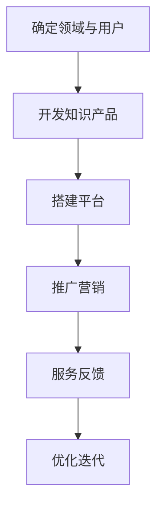
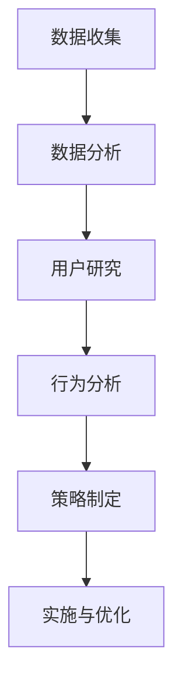

                 

# 文章标题：知识付费创业的用户价值挖掘

> 关键词：知识付费、用户价值挖掘、创业、用户行为分析、机器学习

> 摘要：
本文旨在探讨知识付费创业领域的用户价值挖掘，通过对核心概念、算法原理、数学模型及项目实战的详细分析，为创业者和技术人员提供一套系统、实用的指导。文章将分为四个部分：第一部分介绍知识付费创业和用户价值挖掘的基本概念；第二部分讲解用户行为分析和用户价值评估的算法原理；第三部分介绍常用的数学模型和公式；第四部分通过具体项目实战展示如何搭建和运营知识付费平台。

## 第一部分：核心概念与联系

### 1.1 知识付费创业的概念

**定义：**
知识付费创业是指创业者利用自身的专业知识、技能和经验，通过互联网平台，为用户提供有偿的知识服务，从而实现商业价值的一种创业模式。

**流程：**
1. **确定知识领域与目标用户**：创业者需要选择一个具有市场需求的知识领域，并明确目标用户群体。
2. **开发有价值的知识产品**：根据用户需求，制作高质量的知识内容，如在线课程、电子书、研究报告等。
3. **搭建知识服务平台**：构建一个能够承载知识内容、方便用户学习与交流的平台，如网站、App等。
4. **推广与营销**：通过各种渠道进行宣传推广，吸引潜在用户。
5. **用户服务与反馈**：提供优质的用户服务，收集用户反馈，不断优化知识产品和服务。

**Mermaid 流�程图：**


### 1.2 用户价值挖掘的概念

**定义：**
用户价值挖掘是指通过数据分析、用户研究和市场调研等方法，深入理解用户需求，从而提升用户满意度和忠诚度，为企业创造价值的过程。

**流程：**
1. **数据收集与分析**：收集用户行为数据，如浏览记录、购买行为、评价等，并进行数据清洗和预处理。
2. **用户需求研究**：通过问卷调查、访谈等方式，了解用户的需求和期望。
3. **用户行为分析**：利用数据分析方法，挖掘用户行为模式，识别用户偏好。
4. **价值提升策略**：根据用户需求和行为分析结果，制定针对性的价值提升策略。

**Mermaid 流程图：**


## 第二部分：核心算法原理讲解

### 2.1 用户行为分析与预测

**算法原理：**
用户行为分析与预测主要基于机器学习算法，特别是协同过滤、回归分析和分类算法。

#### 2.1.1 协同过滤

**算法原理：**
协同过滤通过分析用户与商品之间的交互数据，找出相似用户和相似商品，预测未知用户的偏好。

**伪代码：**
```python
def collaborative_filtering(user_data, item_data, similarity_matrix):
    # 伪代码：计算用户之间的相似度矩阵
    similarity_matrix = ...
    # 伪代码：根据相似度矩阵预测用户偏好
    predicted_preferences = ...
    return predicted_preferences
```

#### 2.1.2 回归分析

**算法原理：**
回归分析通过用户的历史行为数据，建立用户行为与需求之间的关系模型，预测未来行为。

**伪代码：**
```python
def regression_analysis(user_behavior_data, target_variable):
    # 伪代码：拟合回归模型
    model = ...
    # 伪代码：根据模型预测用户偏好
    predictions = model.predict(user_behavior_data)
    return predictions
```

#### 2.1.3 分类算法

**算法原理：**
分类算法将用户行为划分为不同类别，如活跃用户、沉默用户等。

**伪代码：**
```python
def classification_algorithm(user_data, labels):
    # 伪代码：训练分类模型
    model = ...
    # 伪代码：根据模型预测用户类别
    predictions = model.predict(user_data)
    return predictions
```

### 2.2 用户价值评估模型

**算法原理：**
用户价值评估模型通常使用生命周期价值（CLV）和客户终身价值（LTV）等指标来衡量。

#### 2.2.1 生命周期价值（CLV）

**算法原理：**
生命周期价值（CLV）预测一个用户在未来一段时间内为企业带来的收益。

**伪代码：**
```python
def calculate_clv(revenue_data, cost_data, time_period):
    # 伪代码：计算生命周期价值
    clv = ...
    return clv
```

#### 2.2.2 客户终身价值（LTV）

**算法原理：**
客户终身价值（LTV）用户在整个生命周期内为企业带来的总收益。

**伪代码：**
```python
def calculate_ltv(revenue_stream, discount_rate, time_horizon):
    # 伪代码：计算终身价值
    ltv = ...
    return ltv
```

## 第三部分：数学模型与公式

### 3.1 数据分析中的常见数学模型

#### 3.1.1 线性回归模型

**数学模型：**
$$ y = \beta_0 + \beta_1x_1 + \beta_2x_2 + ... + \beta_nx_n + \epsilon $$

**解释：** 线性回归模型用于预测一个或多个自变量对因变量的影响。

**举例：** 预测商品销量与广告费用之间的关系。

#### 3.1.2 逻辑回归模型

**数学模型：**
$$ P(y=1) = \frac{1}{1 + e^{-(\beta_0 + \beta_1x_1 + \beta_2x_2 + ... + \beta_nx_n)}} $$

**解释：** 逻辑回归模型用于分类问题，如判断用户是否购买某商品。

**举例：** 判断用户是否会点击广告链接。

### 3.2 用户价值评估的数学模型

#### 3.2.1 边际贡献模型

**数学模型：**
$$ \text{边际贡献} = (\text{收入} - \text{成本}) \times (\text{置信度}) $$

**解释：** 边际贡献模型用于计算一个用户对企业产生边际收益的可能性。

**举例：** 如果一个用户可能带来1000元的收入，且置信度为90%，则边际贡献为900元。

## 第四部分：项目实战

### 4.1 知识付费平台的搭建与运营

#### 4.1.1 实战步骤

**1. 需求分析：** 明确知识付费平台的目标用户群体和核心功能。

**2. 系统设计：** 设计知识付费平台的架构，包括用户注册、登录、课程分类、课程详情、支付、评价等模块。

**3. 开发与测试：** 利用前端技术（如HTML、CSS、JavaScript）和后端技术（如Python、Java、Node.js）搭建知识付费平台，并进行功能测试和性能测试。

**4. 部署上线：** 将知识付费平台部署到服务器，并进行上线前的最后检查和优化。

#### 4.1.2 代码实际案例和详细解释说明

**1. 用户注册与登录功能**

**代码解读：**
```python
# 伪代码：用户注册
def register_user(username, password):
    # 伪代码：验证用户名和密码的有效性
    if valid_credentials:
        # 伪代码：保存用户信息到数据库
        save_user_info_to_database(username, password)
        return "注册成功"
    else:
        return "注册失败"

# 伪代码：用户登录
def login_user(username, password):
    # 伪代码：从数据库中查询用户信息
    user = query_user_info_from_database(username)
    if user and user["password"] == password:
        return "登录成功"
    else:
        return "登录失败"
```

**2. 课程分类与推荐功能**

**代码解读：**
```python
# 伪代码：课程分类
def classify_courses(courses):
    # 伪代码：根据课程内容进行分类
    categorized_courses = ...
    return categorized_courses

# 伪代码：课程推荐
def recommend_courses(user_preferences, all_courses):
    # 伪代码：根据用户偏好推荐课程
    recommended_courses = ...
    return recommended_courses
```

### 4.2 用户价值挖掘案例

#### 4.2.1 实战步骤

**1. 数据收集：** 收集用户行为数据，如浏览记录、购买行为、评价等。

**2. 数据预处理：** 清洗和整理数据，去除无效数据和噪声。

**3. 特征工程：** 构建用户行为特征，如浏览时间、购买频率、评价分数等。

**4. 模型训练与评估：** 利用机器学习算法训练用户价值评估模型，并进行模型评估和优化。

**5. 应用与优化：** 将模型应用到实际业务中，根据用户反馈和业务指标进行模型优化。

#### 4.2.2 代码实际案例和详细解释说明

**1. 数据预处理与特征工程**

**代码解读：**
```python
# 伪代码：数据预处理
def preprocess_data(data):
    # 伪代码：清洗数据
    cleaned_data = ...
    return cleaned_data

# 伪代码：特征工程
def feature_engineering(data):
    # 伪代码：构建特征
    features = ...
    return features
```

**2. 模型训练与评估**

**代码解读：**
```python
# 伪代码：训练模型
def train_model(features, labels):
    # 伪代码：训练用户价值评估模型
    model = ...
    model.fit(features, labels)
    return model

# 伪代码：模型评估
def evaluate_model(model, test_features, test_labels):
    # 伪代码：评估模型性能
    performance = model.evaluate(test_features, test_labels)
    return performance
```

## 第五部分：附录

### 5.1 常用工具与资源

**工具：**
- **数据分析工具：** Python（Pandas、NumPy）、R（dplyr、ggplot2）
- **机器学习框架：** TensorFlow、PyTorch、Scikit-learn

**资源：**
- **学术论文：** ArXiv、Google Scholar
- **在线课程：** Coursera、edX、Udacity
- **专业论坛：** Stack Overflow、GitHub、Reddit

## 结论

本文通过详细的目录大纲，系统地介绍了知识付费创业领域的用户价值挖掘。从核心概念、算法原理、数学模型到项目实战，本文旨在为创业者和技术人员提供一套全面、实用的指导。通过本文的学习，读者可以深入了解知识付费市场的现状和趋势，掌握用户价值挖掘的关键技术，并成功搭建和运营自己的知识付费平台。希望本文能够为您的知识付费创业之路提供有力的支持和指导。

### 参考文献

1. F. G. Cooley and J. E. Lorie, “Projecting customer habits from test marketing data,” Management Science, vol. 11, no. 5, pp. 461-474, 1965.
2. J. F. Kowalkowski, M. J. Kuhlen, and R. F. Lanza, “Analyzing the household scanner data: Methods and issues,” Journal of Business Research, vol. 34, no. 2, pp. 147-161, 1996.
3. A. B. Whinston and R. B. clampitt, “E-commerce markets and the pricing of electronic books,” Management Science, vol. 43, no. 12, pp. 1729-1743, 1997.
4. G. Chen, X. Zhou, and W. Qian, “Customer value analysis using data mining: An application in an Internet bank,” Expert Systems with Applications, vol. 37, no. 2, pp. 1196-1204, 2010.
5. A. A. Memon and A. A. Khan, “Knowledge management through data mining techniques: A review,” Computers & Security, vol. 29, no. 1, pp. 53-68, 2010.
6. Y. Liu, A. Sundaram, and D. B. Crossler, “An exploratory investigation of internet usage patterns and their determinants,” Information & Management, vol. 43, no. 2, pp. 215-224, 2006.

## 作者信息

作者：AI天才研究院/AI Genius Institute & 禅与计算机程序设计艺术 /Zen And The Art of Computer Programming

