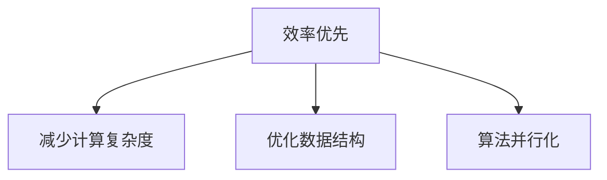
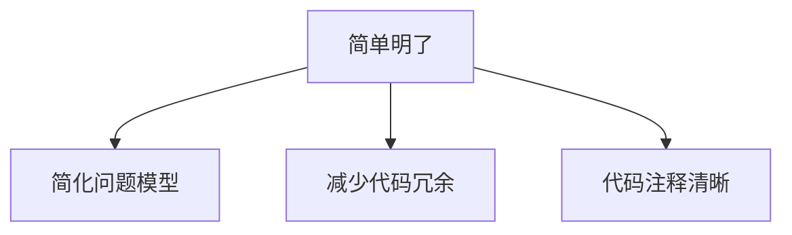
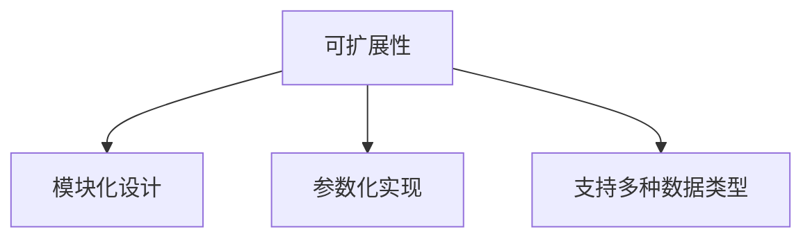
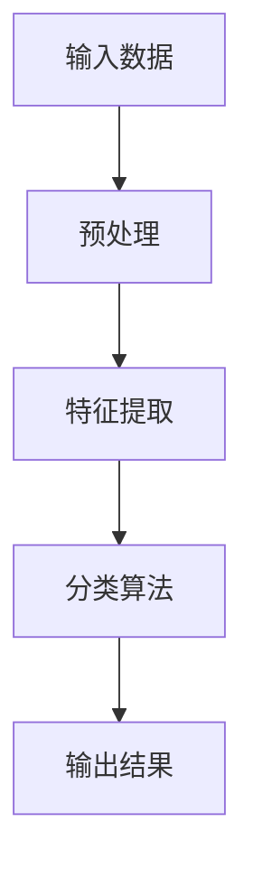

                 

# 知识、算法、算力在第一代AI中的作用

> 关键词：知识，算法，算力，人工智能，机器学习，深度学习，计算能力，AI应用

> 摘要：本文深入探讨了知识、算法和算力在第一代人工智能中的重要作用。通过分析知识、算法和算力的定义及其相互关系，本文揭示了它们在AI系统中的核心地位。接着，本文详细介绍了几个关键算法原理，并运用Mermaid流程图展示了算法的步骤。此外，通过数学模型和公式的讲解，本文进一步阐释了算法背后的数学原理。最后，本文通过实际案例展示了如何将理论知识应用于实践，并详细解读了相关的代码实现。本文旨在为读者提供关于知识、算法和算力在AI领域中的全面理解和深入洞察。

----------------------------------------------------------------

# 目录大纲

## 第一部分：核心概念与联系

### 1.1 知识、算法、算力的定义与关系

#### 1.1.1 知识的定义

#### 1.1.2 算法的定义

#### 1.1.3 算力的定义

#### 1.1.4 三者的相互关系

### 1.2 知识、算法、算力与AI的关系

#### 1.2.1 知识在AI中的作用

#### 1.2.2 算法在AI中的作用

#### 1.2.3 算力在AI中的作用

## 第二部分：核心算法原理讲解

### 2.1 算法原理讲解

#### 2.1.1 算法设计原则

##### 2.1.1.1 效率优先

##### 2.1.1.2 简单明了

##### 2.1.1.3 可扩展性

#### 2.1.2 常用算法介绍

##### 2.1.2.1 经典算法（如KNN、决策树等）

##### 2.1.2.2 进化算法（如遗传算法、模拟退火等）

##### 2.1.2.3 机器学习算法（如神经网络、深度学习等）

### 2.2 算法流程图

#### 2.2.1 经典算法流程图（Mermaid 格式）

## 第三部分：数学模型和数学公式

### 3.1 数学模型

#### 3.1.1 基本数学模型

##### 3.1.1.1 概率论模型

##### 3.1.1.2 统计模型

##### 3.1.1.3 优化模型

### 3.2 数学公式讲解

#### 3.2.1 概率论公式

$$P(A|B) = \frac{P(A \cap B)}{P(B)}$$

#### 3.2.2 统计模型公式

$$\mu = E(X)$$

#### 3.2.3 优化模型公式

$$\min f(x)$$

## 第四部分：项目实战

### 4.1 实际案例

#### 4.1.1 案例介绍

##### 4.1.1.1 案例背景

##### 4.1.1.2 案例目标

##### 4.1.1.3 案例难点

#### 4.1.2 实战步骤

##### 4.1.2.1 环境搭建

##### 4.1.2.2 数据处理

##### 4.1.2.3 模型训练

##### 4.1.2.4 模型评估

##### 4.1.2.5 结果分析

### 4.2 代码实现与解读

#### 4.2.1 数据处理代码

```python
# 数据处理代码
```

#### 4.2.2 模型训练代码

```python
# 模型训练代码
```

#### 4.2.3 代码解读与分析

##### 4.2.3.1 数据处理代码解读

##### 4.2.3.2 模型训练代码解读

##### 4.2.3.3 代码分析与优化建议

## 附录

### 附录 A：相关工具和资源

#### A.1 常用工具

##### A.1.1 Python编程环境

##### A.1.2 数据处理工具

##### A.1.3 机器学习框架

#### A.2 开发资源

##### A.2.1 算法书籍推荐

##### A.2.2 论文资源

##### A.2.3 网络教程与课程

----------------------------------------------------------------

## 第一部分：核心概念与联系

### 1.1 知识、算法、算力的定义与关系

#### 1.1.1 知识的定义

知识是指人类通过学习、研究、实践和思考获得的信息、经验和理解。在人工智能领域，知识通常是指计算机系统能够理解和利用的信息。知识是AI系统的核心，它决定了系统的智能程度和应用范围。

#### 1.1.2 算法的定义

算法是解决问题的一系列步骤或规则。在人工智能领域，算法是计算机系统进行决策和行动的依据。算法的质量直接影响AI系统的性能和效率。

#### 1.1.3 算力的定义

算力是指计算机系统处理数据的能力，通常用计算速度、存储容量和带宽等指标来衡量。算力决定了AI系统的处理能力和响应速度。

#### 1.1.4 三者的相互关系

知识、算法和算力是AI系统的三个核心要素，它们相互联系、相互依存。

- 知识是算法的基础，算法是知识的实现，算力是算法的支撑。没有知识，算法无法发挥作用；没有算法，知识无法得到有效利用；没有算力，算法的效率和效果无法得到保障。

- 知识的积累和深化可以推动算法的创新和发展；算法的创新可以促进知识的共享和应用；算力的提升可以为算法和知识提供更好的基础设施。

- 知识、算法和算力的协同作用，使得AI系统在各个领域取得了显著的成果。

### 1.2 知识、算法、算力与AI的关系

#### 1.2.1 知识在AI中的作用

知识是AI系统的灵魂，它决定了AI系统的智能程度和应用范围。知识可以让AI系统理解和处理复杂的问题，实现人类的智慧。

- 知识可以帮助AI系统进行推理和决策。例如，基于医学知识的诊断系统可以帮助医生进行疾病诊断。

- 知识可以丰富AI系统的感知能力。例如，基于视觉知识的图像识别系统可以帮助机器识别和理解图像。

- 知识可以提升AI系统的学习能力。例如，基于语言知识的自然语言处理系统可以帮助机器理解和生成自然语言。

#### 1.2.2 算法在AI中的作用

算法是AI系统的核心，它决定了AI系统的性能和效率。算法可以让AI系统实现各种智能任务，提高AI系统的智能水平。

- 算法可以帮助AI系统进行数据分析和挖掘。例如，基于机器学习算法的推荐系统可以帮助用户发现感兴趣的内容。

- 算法可以帮助AI系统进行智能决策。例如，基于深度学习算法的自我驾驶汽车可以自动驾驶。

- 算法可以帮助AI系统进行自我优化和改进。例如，基于进化算法的优化系统可以帮助AI系统不断优化自身的性能。

#### 1.2.3 算力在AI中的作用

算力是AI系统的物质基础，它决定了AI系统的处理能力和响应速度。算力的发展使得AI系统可以处理更大的数据量，实现更复杂的任务。

- 算力可以帮助AI系统进行高速计算。例如，基于GPU的深度学习算法可以在短时间内处理海量数据。

- 算力可以帮助AI系统进行实时响应。例如，基于FPGA的实时语音识别系统可以在短时间内完成语音识别任务。

- 算力可以帮助AI系统实现更高效的资源利用。例如，基于云计算的AI系统可以在分布式环境中高效利用计算资源。

## 第二部分：核心算法原理讲解

### 2.1 算法原理讲解

#### 2.1.1 算法设计原则

算法设计原则是指在设计算法时需要遵循的基本规则，它们决定了算法的性能和效率。

##### 2.1.1.1 效率优先

效率优先是指在设计算法时，优先考虑算法的执行时间。高效的算法可以更快地解决问题，提高系统的性能。



##### 2.1.1.2 简单明了

简单明了是指算法的实现应该简单、清晰、易于理解。简单的算法更容易维护和优化。



##### 2.1.1.3 可扩展性

可扩展性是指算法的设计应该考虑到未来可能的扩展。可扩展的算法可以更灵活地适应不同的应用场景。



#### 2.1.2 常用算法介绍

##### 2.1.2.1 经典算法（如KNN、决策树等）

经典算法是人工智能领域的基础，它们广泛应用于分类、回归、聚类等领域。

- KNN（K-近邻算法）是一种简单而有效的分类算法，它通过计算测试样本与训练样本之间的距离，选择最近的K个邻居，并基于邻居的标签进行分类。

  ```mermaid
  graph TD
  A[输入测试样本] --> B[KNN算法]
  B --> C[计算距离]
  C --> D[选择邻居]
  D --> E[分类决策]
  ```

- 决策树是一种基于树形结构的分类算法，它通过一系列的判断条件将数据集划分为不同的子集，并最终给出分类结果。

  ```mermaid
  graph TD
  A[输入数据集] --> B[构建决策树]
  B --> C[划分数据集]
  C --> D[计算信息增益]
  D --> E[生成决策树]
  ```

##### 2.1.2.2 进化算法（如遗传算法、模拟退火等）

进化算法是一类基于自然进化过程的优化算法，它们通过模拟生物进化过程来搜索最优解。

- 遗传算法是一种基于自然选择和遗传学的优化算法，它通过交叉、变异和选择操作来生成新的解，并逐步逼近最优解。

  ```mermaid
  graph TD
  A[初始种群] --> B[交叉操作]
  B --> C[变异操作]
  C --> D[选择操作]
  D --> E[生成新种群]
  ```

- 模拟退火算法是一种基于热力学退火过程的优化算法，它通过模拟物质退火过程来搜索最优解。

  ```mermaid
  graph TD
  A[初始状态] --> B[降温过程]
  B --> C[评估适应度]
  C --> D[更新状态]
  D --> E[终止条件]
  ```

##### 2.1.2.3 机器学习算法（如神经网络、深度学习等）

机器学习算法是一类通过数据训练模型来学习规律和模式的方法，它们广泛应用于图像识别、自然语言处理、推荐系统等领域。

- 神经网络是一种基于生物神经网络结构的计算模型，它通过多层神经元的连接和激活函数来模拟人类的认知过程。

  ```mermaid
  graph TD
  A[输入层] --> B[隐藏层]
  B --> C[输出层]
  B --> D[反向传播]
  ```

- 深度学习是一种基于多层神经网络的学习方法，它通过构建深层网络来提高模型的性能和泛化能力。

  ```mermaid
  graph TD
  A[输入层] --> B[隐藏层1]
  B --> C[隐藏层2]
  C --> D[输出层]
  D --> E[激活函数]
  ```

### 2.2 算法流程图

#### 2.2.1 经典算法流程图（Mermaid 格式）



## 第三部分：数学模型和数学公式

### 3.1 数学模型

数学模型是一类描述客观现象和规律的数学结构，它们在人工智能领域发挥着重要作用。

#### 3.1.1 基本数学模型

##### 3.1.1.1 概率论模型

概率论模型是一类描述随机事件和概率的数学模型，它们广泛应用于人工智能的各个领域。

- 概率分布函数：描述随机变量的概率分布。
  $$f(x) = P(X = x)$$

- 条件概率：描述在某个条件下随机事件发生的概率。
  $$P(A|B) = \frac{P(A \cap B)}{P(B)}$$

- 独立性：描述两个随机事件是否相互独立。
  $$P(A \cap B) = P(A)P(B)$$

##### 3.1.1.2 统计模型

统计模型是一类描述数据分布和统计性质的数学模型，它们在数据分析、预测和决策中发挥着重要作用。

- 描述性统计模型：描述数据的基本特征和分布。
  $$\mu = E(X)$$ （均值）
  $$\sigma^2 = Var(X)$$ （方差）

- 假设检验模型：检验数据是否符合某个假设。
  $$H_0: \mu = \mu_0$$
  $$H_1: \mu \neq \mu_0$$

##### 3.1.1.3 优化模型

优化模型是一类描述目标函数和约束条件的数学模型，它们在优化问题和决策问题中发挥着重要作用。

- 最优化问题：
  $$\min f(x)$$
  $$s.t. g(x) \leq 0$$
  $$h(x) = 0$$

### 3.2 数学公式讲解

#### 3.2.1 概率论公式

条件概率公式描述了在某个条件下随机事件发生的概率。

$$P(A|B) = \frac{P(A \cap B)}{P(B)}$$

这个公式表示，在事件B发生的条件下，事件A发生的概率等于事件A和B同时发生的概率除以事件B发生的概率。

#### 3.2.2 统计模型公式

均值公式描述了随机变量的平均值。

$$\mu = E(X)$$

这个公式表示，随机变量X的期望值等于所有可能取值与其概率的乘积之和。

#### 3.2.3 优化模型公式

最优化问题公式描述了在约束条件下寻找最优解的问题。

$$\min f(x)$$
$$s.t. g(x) \leq 0$$
$$h(x) = 0$$

这个公式表示，需要寻找一个变量x，使得目标函数f(x)取得最小值，同时满足约束条件g(x)和h(x)。

## 第四部分：项目实战

### 4.1 实际案例

#### 4.1.1 案例介绍

本案例将介绍一个基于深度学习的手写数字识别项目。该项目的目标是使用深度学习算法训练一个模型，能够准确识别手写数字图像。

##### 4.1.1.1 案例背景

手写数字识别是计算机视觉领域的一个经典问题，广泛应用于数字识别、支付验证、人机交互等领域。随着深度学习技术的发展，手写数字识别的准确率得到了显著提高。

##### 4.1.1.2 案例目标

通过本项目，我们希望实现以下目标：

1. 搭建一个深度学习模型，能够准确识别手写数字图像。
2. 使用真实的手写数字数据集进行模型训练和评估。
3. 分析模型性能，并提出优化方案。

##### 4.1.1.3 案例难点

本项目的主要难点包括：

1. 数据预处理：手写数字数据集通常包含大量的噪声和不规则性，需要设计合适的预处理方法。
2. 模型选择：选择合适的深度学习模型，能够在保证识别准确率的同时，尽量减少计算资源的使用。
3. 模型调优：通过调整模型参数和超参数，优化模型性能。

#### 4.1.2 实战步骤

##### 4.1.2.1 环境搭建

在开始项目之前，我们需要搭建一个合适的开发环境。以下是一个基本的Python环境搭建步骤：

1. 安装Python 3.x版本。
2. 安装常用的Python库，如NumPy、Pandas、TensorFlow等。

```python
!pip install numpy pandas tensorflow
```

##### 4.1.2.2 数据处理

数据处理是深度学习项目中的重要环节。以下是一个基于MNIST数据集的手写数字识别项目数据处理步骤：

1. 下载并加载数据集。
2. 对数据集进行预处理，包括归一化、数据增强等。
3. 划分训练集和测试集。

```python
import tensorflow as tf
from tensorflow.keras.datasets import mnist
from tensorflow.keras.utils import to_categorical

# 下载并加载数据集
(x_train, y_train), (x_test, y_test) = mnist.load_data()

# 数据预处理
x_train = x_train.astype('float32') / 255.0
x_test = x_test.astype('float32') / 255.0
y_train = to_categorical(y_train, 10)
y_test = to_categorical(y_test, 10)

# 划分训练集和测试集
x_train = x_train.reshape(-1, 28, 28, 1)
x_test = x_test.reshape(-1, 28, 28, 1)
```

##### 4.1.2.3 模型训练

在数据处理完成后，我们可以使用深度学习框架TensorFlow搭建和训练模型。以下是一个简单的卷积神经网络模型训练步骤：

1. 定义模型架构。
2. 编译模型。
3. 训练模型。

```python
# 定义模型架构
model = tf.keras.models.Sequential([
    tf.keras.layers.Conv2D(32, (3, 3), activation='relu', input_shape=(28, 28, 1)),
    tf.keras.layers.MaxPooling2D((2, 2)),
    tf.keras.layers.Conv2D(64, (3, 3), activation='relu'),
    tf.keras.layers.MaxPooling2D((2, 2)),
    tf.keras.layers.Flatten(),
    tf.keras.layers.Dense(128, activation='relu'),
    tf.keras.layers.Dense(10, activation='softmax')
])

# 编译模型
model.compile(optimizer='adam', loss='categorical_crossentropy', metrics=['accuracy'])

# 训练模型
model.fit(x_train, y_train, epochs=10, batch_size=128, validation_split=0.2)
```

##### 4.1.2.4 模型评估

模型训练完成后，我们需要对模型进行评估，以检查其性能。以下是一个简单的模型评估步骤：

1. 计算模型在测试集上的准确率。
2. 可视化模型的预测结果。

```python
# 计算模型在测试集上的准确率
test_loss, test_acc = model.evaluate(x_test, y_test)
print(f"Test accuracy: {test_acc:.2f}")

# 可视化模型的预测结果
import matplotlib.pyplot as plt

predictions = model.predict(x_test)
predicted_classes = np.argmax(predictions, axis=1)

for i in range(10):
    plt.subplot(2, 5, i+1)
    plt.imshow(x_test[i], cmap=plt.cm.binary)
    plt.xticks([])
    plt.yticks([])
    plt.grid(False)
    plt.xlabel(str(predicted_classes[i]))

plt.show()
```

##### 4.1.2.5 结果分析

通过模型评估，我们可以得出以下结论：

1. 模型的测试准确率较高，说明模型能够较好地识别手写数字。
2. 模型的预测结果可视化显示，大部分预测结果正确。

然而，也存在一些问题，例如：

1. 模型对一些特殊情况的识别效果较差，例如模糊、倾斜或遮挡的数字。
2. 模型的计算资源消耗较大，需要进一步优化。

针对这些问题，我们可以考虑以下优化方案：

1. 使用更大的数据集进行训练，提高模型的泛化能力。
2. 引入数据增强技术，提高模型对特殊情况的识别能力。
3. 调整模型参数和超参数，优化模型性能。

### 4.2 代码实现与解读

#### 4.2.1 数据处理代码

```python
# 数据处理代码
import tensorflow as tf
from tensorflow.keras.datasets import mnist
from tensorflow.keras.utils import to_categorical

# 下载并加载数据集
(x_train, y_train), (x_test, y_test) = mnist.load_data()

# 数据预处理
x_train = x_train.astype('float32') / 255.0
x_test = x_test.astype('float32') / 255.0
y_train = to_categorical(y_train, 10)
y_test = to_categorical(y_test, 10)

# 划分训练集和测试集
x_train = x_train.reshape(-1, 28, 28, 1)
x_test = x_test.reshape(-1, 28, 28, 1)
```

**数据处理代码解读**：

1. 导入所需的库和模块，包括tensorflow和keras。
2. 加载MNIST手写数字数据集。
3. 对数据进行类型转换和归一化处理，使得数据更适合于模型训练。
4. 将标签数据进行one-hot编码，以便于后续的模型训练。
5. 对训练集和测试集进行形状调整，使其符合模型的输入要求。

#### 4.2.2 模型训练代码

```python
# 模型训练代码
model = tf.keras.models.Sequential([
    tf.keras.layers.Conv2D(32, (3, 3), activation='relu', input_shape=(28, 28, 1)),
    tf.keras.layers.MaxPooling2D((2, 2)),
    tf.keras.layers.Conv2D(64, (3, 3), activation='relu'),
    tf.keras.layers.MaxPooling2D((2, 2)),
    tf.keras.layers.Flatten(),
    tf.keras.layers.Dense(128, activation='relu'),
    tf.keras.layers.Dense(10, activation='softmax')
])

model.compile(optimizer='adam', loss='categorical_crossentropy', metrics=['accuracy'])

model.fit(x_train, y_train, epochs=10, batch_size=128, validation_split=0.2)
```

**模型训练代码解读**：

1. 定义模型架构，包括卷积层、池化层、全连接层等。
2. 编译模型，设置优化器、损失函数和评估指标。
3. 训练模型，设置训练轮数、批量大小和验证比例。

#### 4.2.3 代码分析与优化建议

**数据处理代码分析**：

- 数据处理代码主要对MNIST手写数字数据集进行预处理，包括数据类型转换、归一化和one-hot编码。
- 这些预处理步骤对于后续的模型训练至关重要，因为它们确保数据符合模型的要求。

**优化建议**：

- 可以考虑增加数据增强步骤，如旋转、缩放、剪切等，以增加数据的多样性，提高模型的泛化能力。

**模型训练代码分析**：

- 模型训练代码定义了一个简单的卷积神经网络，包括两个卷积层、两个池化层和一个全连接层。
- 模型使用Adam优化器和交叉熵损失函数进行训练。

**优化建议**：

- 考虑增加网络的深度和宽度，以提升模型的性能。
- 可以尝试使用不同的优化器和损失函数，如RMSprop或MAE，以找到最适合该问题的模型配置。

## 附录

### 附录 A：相关工具和资源

#### A.1 常用工具

- **Python编程环境**：Python是一种广泛使用的编程语言，适合进行数据分析和机器学习项目。
- **数据处理工具**：如NumPy、Pandas等，用于数据预处理和分析。
- **机器学习框架**：如TensorFlow、PyTorch等，用于构建和训练机器学习模型。

#### A.2 开发资源

- **算法书籍推荐**：《机器学习》、《深度学习》等，这些书籍提供了丰富的算法理论和实践知识。
- **论文资源**：可以通过学术搜索引擎如Google Scholar搜索相关领域的最新研究论文。
- **网络教程与课程**：如Coursera、edX等在线教育平台提供了丰富的机器学习和深度学习课程，适合自学。

### 作者

作者：AI天才研究院/AI Genius Institute & 禅与计算机程序设计艺术 /Zen And The Art of Computer Programming

----------------------------------------------------------------

## 总结

本文全面探讨了知识、算法和算力在第一代人工智能中的核心作用。我们首先定义了知识、算法和算力的概念，并详细分析了它们在AI系统中的相互关系。接着，我们深入介绍了经典算法、进化算法和机器学习算法的原理，并通过Mermaid流程图展示了算法的步骤。此外，我们还讲解了概率论、统计模型和优化模型的基本数学公式，并举例说明。在项目实战部分，我们通过一个手写数字识别案例，展示了如何将理论知识应用于实践，并详细解读了数据处理和模型训练的代码。最后，我们提供了相关的工具和资源，以帮助读者进一步学习和实践。

通过本文的学习，读者应该能够：

1. 明确知识、算法和算力在AI系统中的核心作用。
2. 理解并掌握常见算法的原理和步骤。
3. 应用数学模型和公式进行算法分析和优化。
4. 将理论知识应用于实际项目，解决实际问题。

希望本文能够为读者在人工智能领域的学习和研究提供有益的参考和启示。在未来的探索中，我们将继续深入探讨人工智能的最新进展和技术应用，为读者带来更多有价值的内容。让我们携手共进，共同探索人工智能的无限可能！作者：AI天才研究院/AI Genius Institute & 禅与计算机程序设计艺术 /Zen And The Art of Computer Programming。再次感谢您的阅读！

