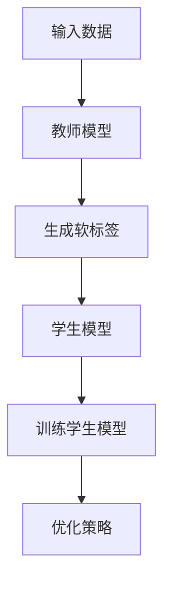
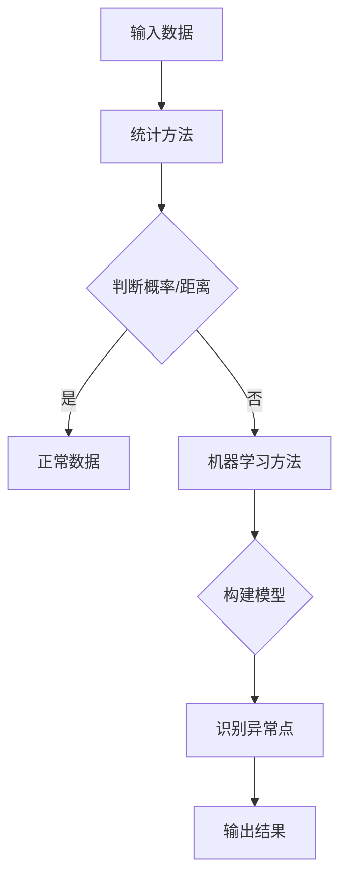
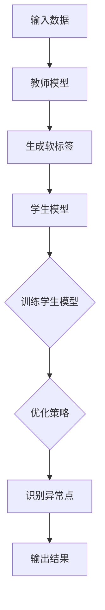
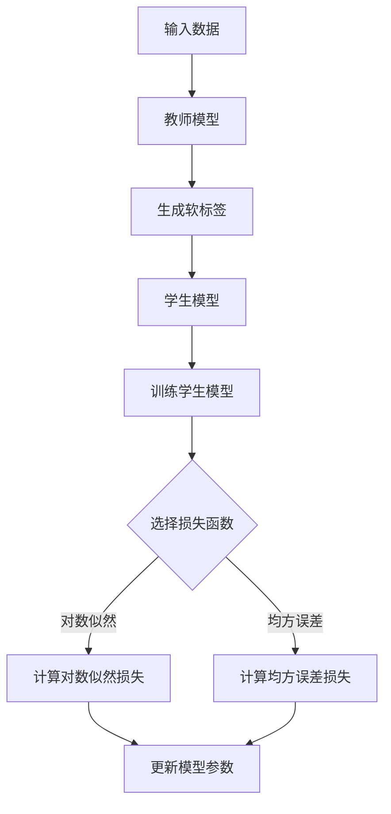
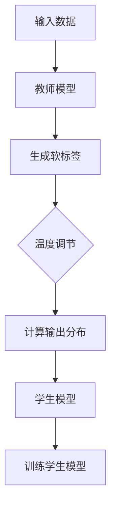
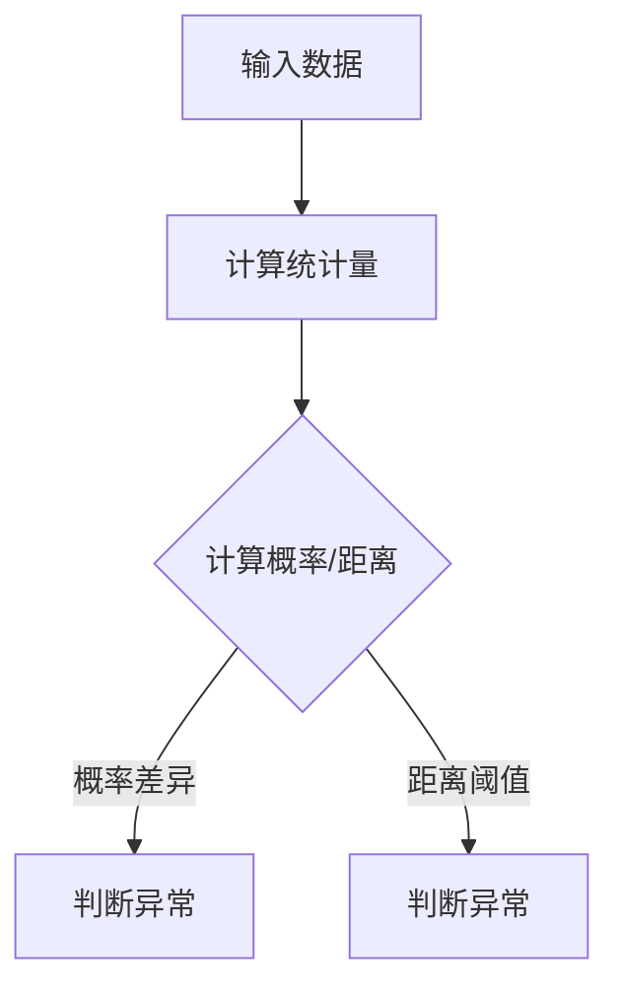
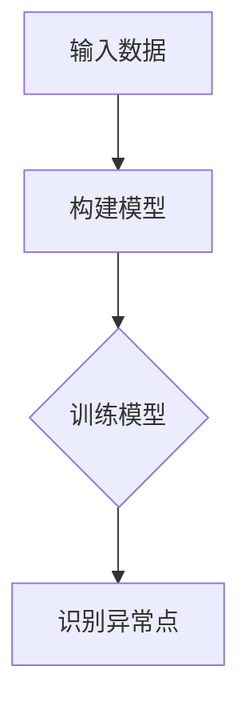

                 

# 《知识蒸馏在异常检测任务中的应用》

> 关键词：知识蒸馏、异常检测、模型压缩、神经网络、机器学习

> 摘要：本文将深入探讨知识蒸馏在异常检测任务中的应用，首先介绍知识蒸馏的基本概念与背景，然后分析异常检测的基本概念与模型，随后详细阐述知识蒸馏与异常检测结合的方法，并通过实例分析展示其应用效果。此外，本文还将探讨知识蒸馏相关的数学模型，结合实际项目实战，展示如何将知识蒸馏应用于异常检测任务中。最后，本文对未来知识蒸馏在异常检测领域的展望进行分析。

## 核心概念与联系

### 知识蒸馏

知识蒸馏是一种模型压缩技术，旨在将大模型（教师模型）的知识迁移到小模型（学生模型）中，以提高小模型的性能。其核心思想是通过训练学生模型来模仿教师模型的行为，从而实现知识迁移。

### 异常检测

异常检测是一种监控技术，用于识别数据中的异常或离群点。其目的是发现数据中的不正常行为或事件，从而进行预警和干预。异常检测广泛应用于网络安全、金融欺诈检测、医疗诊断等领域。

### 知识蒸馏与异常检测的关系

知识蒸馏与异常检测有着紧密的联系。通过将大模型（教师模型）在异常检测任务上的知识迁移到小模型（学生模型）中，可以显著提高小模型的检测性能，特别是在计算资源受限的场景下。

## 第1章 知识蒸馏的定义与背景

### 1.1 知识蒸馏的基本概念

#### 知识蒸馏的定义

知识蒸馏是一种训练小模型（学生模型）的方法，该方法利用大模型（教师模型）的知识，通过一定的策略将教师模型中的知识迁移到学生模型中。知识蒸馏的基本目标是通过训练小模型来模仿教师模型的行为，从而提高小模型的性能。

#### 知识蒸馏的目的

知识蒸馏的主要目的是实现以下目标：

1. **模型压缩**：通过将大模型的知识迁移到小模型中，可以显著减小模型的参数量和计算量，从而降低模型的存储和计算需求。
2. **加速推理**：小模型的计算量较小，因此在推理阶段可以显著提高推理速度，适用于实时性要求较高的场景。
3. **适应低资源环境**：在计算资源受限的环境中，知识蒸馏可以有效地利用有限的计算资源，提高模型的性能。

#### 知识蒸馏的应用领域

知识蒸馏在多个领域得到了广泛应用，主要包括：

1. **计算机视觉**：在图像分类、目标检测、图像分割等任务中，知识蒸馏可以显著提高小模型的性能。
2. **自然语言处理**：在文本分类、机器翻译、文本生成等任务中，知识蒸馏可以有效提高小模型的性能。
3. **异常检测**：在网络安全、金融欺诈检测、医疗诊断等任务中，知识蒸馏可以帮助构建高效的小模型，提高异常检测的准确性。

### 1.2 知识蒸馏的原理

#### 教师模型与学生模型

在知识蒸馏中，通常有两个模型：教师模型和学生模型。教师模型是一个大模型，已经在大规模数据集上训练过，拥有丰富的知识。学生模型是一个小模型，目标是学习教师模型的知识，从而提高其性能。

#### 知识蒸馏的过程

知识蒸馏的过程主要包括以下几个步骤：

1. **生成软标签**：教师模型对输入数据进行预测，输出概率分布。这些概率分布被称为软标签，是教师模型对数据的隐性知识。
2. **训练学生模型**：学生模型通过学习教师模型的软标签来提高其预测性能。学生模型在训练过程中不仅需要优化自身的参数，还需要模仿教师模型的行为。
3. **优化策略**：知识蒸馏过程中，通常采用一定的优化策略来提高学生模型的性能。常见的优化策略包括温度调节、对抗训练等。

#### 知识蒸馏的Mermaid流程图



### 1.3 知识蒸馏的优势与挑战

#### 优势

1. **模型压缩**：通过知识蒸馏，可以将大模型的参数迁移到小模型中，显著减小模型的参数量和计算量，从而降低模型的存储和计算需求。
2. **加速推理**：小模型的计算量较小，因此在推理阶段可以显著提高推理速度，适用于实时性要求较高的场景。
3. **适应低资源环境**：在计算资源受限的环境中，知识蒸馏可以有效地利用有限的计算资源，提高模型的性能。

#### 挑战

1. **教师模型的选择**：选择合适的教师模型对于知识蒸馏的效果至关重要。教师模型需要在大规模数据集上训练过，并且具有较好的性能。
2. **模型大小差异**：教师模型和学生模型的大小通常差异较大，这可能导致知识迁移的效果不理想。
3. **计算资源需求**：知识蒸馏过程通常需要较大的计算资源，特别是在训练大模型和软标签生成阶段。

## 第2章 异常检测的基本概念与模型

### 2.1 异常检测的定义

#### 异常检测的定义

异常检测是一种监控技术，旨在识别数据中的异常或离群点。异常点是指与大多数数据点相比具有显著差异的数据点，可能是由于错误、欺诈、攻击或其他不正常行为引起的。

#### 异常检测的目的

异常检测的主要目的是：

1. **发现异常行为**：通过识别数据中的异常点，可以及时发现潜在的问题或风险，从而进行预警和干预。
2. **优化业务流程**：异常检测可以帮助企业优化业务流程，提高运营效率，降低成本。
3. **保障系统安全**：在网络安全领域，异常检测可以识别恶意攻击行为，保障系统的安全。

#### 异常检测的应用领域

异常检测广泛应用于以下领域：

1. **网络安全**：通过识别网络流量中的异常行为，可以及时发现并阻止网络攻击。
2. **金融欺诈检测**：在金融领域，异常检测可以识别交易中的欺诈行为，降低金融风险。
3. **医疗诊断**：在医疗领域，异常检测可以识别患者的异常体征，辅助医生进行诊断。
4. **工业生产**：在工业领域，异常检测可以识别设备故障，提高生产效率。

### 2.2 常见的异常检测算法

#### 统计方法

统计方法是一种基于概率模型和距离度量的异常检测方法。常见的统计方法包括：

1. **基于概率模型的方法**：例如高斯分布模型、贝叶斯模型等，通过计算数据点与模型之间的概率差异来判断是否为异常点。
2. **基于距离度量的方法**：例如欧氏距离、曼哈顿距离等，通过计算数据点与大多数数据点之间的距离来判断是否为异常点。

#### 机器学习方法

机器学习方法是一种基于历史数据和统计学习理论的方法，常见的机器学习方法包括：

1. **基于支持向量机的方法**：通过构建高维空间中的超平面，将正常数据和异常数据分离。
2. **基于神经网络的方法**：通过深度学习技术，构建复杂的神经网络模型来识别异常点。

#### 异常检测的Mermaid流程图



### 2.3 异常检测的评价指标

#### 真正例率（TPR）、假正例率（FPR）、准确率（ACC）、召回率（REC）

1. **真正例率（True Positive Rate, TPR）**：表示正确识别异常点的比例，也称为灵敏度（Sensitivity）。
2. **假正例率（False Positive Rate, FPR）**：表示错误地将正常数据识别为异常点的比例。
3. **准确率（Accuracy, ACC）**：表示模型正确识别数据的比例，是TPR和FPR的加权平均值。
4. **召回率（Recall, REC）**：表示正确识别异常点的比例，也称为真正例率。

#### F1-score、精确率（Precision）、召回率（Recall）

1. **F1-score**：是精确率和召回率的调和平均值，用于衡量模型的综合性能。
2. **精确率（Precision）**：表示正确识别的异常点占所有被识别为异常点的比例。
3. **召回率（Recall）**：表示正确识别的异常点占所有实际异常点的比例。

#### ROC曲线和AUC

1. **ROC曲线**：是反映不同阈值下真正例率和假正例率关系的曲线，用于评估模型的分类性能。
2. **AUC（Area Under Curve）**：表示ROC曲线下的面积，用于衡量模型的分类能力。

## 第3章 知识蒸馏在异常检测中的应用

### 3.1 知识蒸馏与异常检测的结合方法

#### 教师模型的选择

选择合适的教师模型是知识蒸馏在异常检测中应用的关键。教师模型应该具有以下特点：

1. **性能优秀**：教师模型在异常检测任务上应具有较高的性能，以便将高质量的知识迁移到学生模型中。
2. **适用性广**：教师模型应适用于各种异常检测任务，具有较好的泛化能力。

#### 学生模型的设计

学生模型的设计应考虑以下因素：

1. **模型大小**：学生模型应比教师模型小，以便实现模型压缩和加速推理。
2. **模型结构**：学生模型的结构应与教师模型相似，以便有效地迁移知识。

#### 知识蒸馏的过程优化

知识蒸馏的过程可以通过以下方法进行优化：

1. **温度调节**：通过调整温度参数，可以控制软标签的平滑程度，从而影响学生模型的训练过程。
2. **对抗训练**：引入对抗样本，增强学生模型对异常点的鲁棒性。
3. **多任务学习**：通过将多个异常检测任务结合起来，提高学生模型的性能。

#### 知识蒸馏与异常检测的Mermaid流程图



### 3.2 实例分析

#### 实际案例介绍

在本案例中，我们将使用知识蒸馏技术来改进一个网络安全异常检测模型。教师模型是一个基于深度学习的复杂模型，已经在大规模网络安全数据集上训练过。学生模型是一个小型的神经网络模型，目标是通过知识蒸馏学习教师模型的知识，提高异常检测的准确性。

#### 知识蒸馏参数调整对性能的影响

在知识蒸馏过程中，我们通过调整以下参数来优化学生模型的性能：

1. **温度调节**：通过调整温度参数，可以控制软标签的平滑程度。较高的温度参数可以增加软标签的平滑度，有助于学生模型更好地学习教师模型的知识。
2. **学习率**：学习率的选择对训练过程的影响很大。过高的学习率可能导致训练过程不稳定，而过低的学习率则可能导致训练过程缓慢。我们需要在实验中找到合适的学习率。
3. **迭代次数**：迭代次数的设定决定了训练的深度。过多的迭代次数可能导致过度拟合，而过少的迭代次数可能导致训练不足。

#### 异常检测模型的优化策略

在知识蒸馏过程中，我们还可以采用以下策略来优化异常检测模型的性能：

1. **数据增强**：通过增加数据的多样性和复杂性，可以提高学生模型对异常点的识别能力。
2. **模型融合**：将多个知识蒸馏训练的学生模型融合起来，可以提高异常检测的准确性和鲁棒性。
3. **在线学习**：在实时数据流中，通过持续地更新学生模型，可以使其更好地适应环境变化，提高异常检测的准确性。

## 第4章 数学模型与公式

### 4.1 知识蒸馏中的数学模型

知识蒸馏中的数学模型主要包括损失函数和优化目标。以下介绍两种常见的损失函数：对数似然损失函数和均方误差损失函数。

#### 对数似然损失函数

对数似然损失函数是一种常用的知识蒸馏损失函数，用于衡量学生模型预测概率分布与教师模型软标签之间的差异。其公式如下：

$$
L_{ce} = -\sum_{i=1}^{N} \sum_{c=1}^{C} y_i(c) \log \hat{p}_i(c)
$$

其中，$N$ 是样本数量，$C$ 是类别数量，$y_i(c)$ 是教师模型在第 $i$ 个样本上的软标签，$\hat{p}_i(c)$ 是学生模型在第 $i$ 个样本上的预测概率分布。

#### 均方误差损失函数

均方误差损失函数是一种简单直观的知识蒸馏损失函数，用于衡量学生模型预测值与教师模型软标签之间的差异。其公式如下：

$$
L_{mse} = \frac{1}{N} \sum_{i=1}^{N} \sum_{c=1}^{C} (\hat{p}_i(c) - y_i(c))^2
$$

其中，$N$ 是样本数量，$C$ 是类别数量，$\hat{p}_i(c)$ 是学生模型在第 $i$ 个样本上的预测概率分布，$y_i(c)$ 是教师模型在第 $i$ 个样本上的软标签。

#### 知识蒸馏的Mermaid流程图



### 4.2 知识蒸馏的公式与推导

#### 温度调节的推导

温度调节是知识蒸馏中常用的一种技术，用于控制软标签的平滑程度。在温度调节中，教师模型的软标签被放大小 $T$ 倍，从而得到学生模型的输入。

$$
p_i(c) = \frac{e^{y_i(c)/T}}{\sum_{c=1}^{C} e^{y_i(c)/T}}
$$

其中，$p_i(c)$ 是学生模型在第 $i$ 个样本上的预测概率分布，$y_i(c)$ 是教师模型在第 $i$ 个样本上的软标签，$T$ 是温度参数。

#### 输出分布的推导

学生模型的输出分布是通过教师模型的软标签和温度调节得到的。假设教师模型的软标签为 $y_i(c)$，温度调节参数为 $T$，则学生模型的输出分布为：

$$
\hat{p}_i(c) = \frac{e^{y_i(c)/T}}{\sum_{c=1}^{C} e^{y_i(c)/T}}
$$

其中，$\hat{p}_i(c)$ 是学生模型在第 $i$ 个样本上的预测概率分布。

#### 知识蒸馏的Mermaid流程图



## 第5章 异常检测算法的数学模型

### 5.1 统计方法

统计方法是一种基于概率模型和距离度量的异常检测方法。以下介绍几种常见的统计方法的数学模型。

#### 基于概率模型的方法

1. **高斯分布模型**：假设正常数据服从高斯分布，通过计算数据点与高斯分布之间的概率差异来判断是否为异常点。

$$
P(x|\mu,\sigma^2) = \frac{1}{\sqrt{2\pi\sigma^2}} e^{-\frac{(x-\mu)^2}{2\sigma^2}}
$$

其中，$x$ 是数据点，$\mu$ 是均值，$\sigma^2$ 是方差。

2. **贝叶斯模型**：通过计算数据点与贝叶斯模型之间的概率差异来判断是否为异常点。

$$
P(x|C) = \frac{P(C|x)P(x)}{P(C)}
$$

其中，$x$ 是数据点，$C$ 是类别，$P(C|x)$ 是条件概率，$P(x)$ 是边缘概率。

#### 基于距离度量的方法

1. **欧氏距离**：计算数据点与大多数数据点之间的欧氏距离，通过阈值来判断是否为异常点。

$$
d(x, \bar{x}) = \sqrt{\sum_{i=1}^{n} (x_i - \bar{x}_i)^2}
$$

其中，$x$ 是数据点，$\bar{x}$ 是大多数数据点的均值，$n$ 是特征数量。

2. **曼哈顿距离**：计算数据点与大多数数据点之间的曼哈顿距离，通过阈值来判断是否为异常点。

$$
d(x, \bar{x}) = \sum_{i=1}^{n} |x_i - \bar{x}_i|
$$

#### 统计方法的Mermaid流程图



### 5.2 机器学习方法

机器学习方法是一种基于历史数据和统计学习理论的异常检测方法。以下介绍几种常见的机器学习方法的数学模型。

#### 基于支持向量机的方法

支持向量机（Support Vector Machine, SVM）是一种常见的机器学习方法，通过构建高维空间中的超平面来分离正常数据和异常数据。

$$
\min_{w,b,\xi} \frac{1}{2} ||w||^2 + C \sum_{i=1}^{n} \xi_i
$$

其中，$w$ 是权重向量，$b$ 是偏置项，$\xi_i$ 是松弛变量，$C$ 是惩罚参数。

#### 基于神经网络的方法

神经网络（Neural Network, NN）是一种复杂的机器学习方法，通过多层神经元的非线性变换来实现数据的自动特征提取和分类。

$$
y = \sigma(z) = \frac{1}{1 + e^{-z}}
$$

其中，$z$ 是神经元的输入，$\sigma$ 是激活函数，$y$ 是神经元的输出。

#### 机器学习方法的Mermaid流程图



## 第6章 项目实战

### 6.1 项目背景

在本项目中，我们将使用知识蒸馏技术来改进一个金融交易异常检测模型。该项目旨在识别金融交易中的异常行为，以降低金融风险。

#### 项目介绍

本项目采用一个公开的金融交易数据集，包含约200,000个交易记录，每个交易记录包含多个特征，如交易金额、交易时间、交易类型等。我们的目标是使用知识蒸馏技术构建一个高效的异常检测模型，提高异常检测的准确性。

#### 数据集介绍

数据集包含以下特征：

1. **交易金额**：交易金额（单位：美元）
2. **交易时间**：交易时间（以秒为单位）
3. **交易类型**：交易类型（0代表买入，1代表卖出）
4. **其他特征**：如股票代码、交易者ID等

数据集分为训练集和测试集，其中训练集包含约80%的交易记录，测试集包含约20%的交易记录。

#### 环境配置

为了运行本项目，需要配置以下环境：

1. **Python**：Python 3.8及以上版本
2. **TensorFlow**：TensorFlow 2.4及以上版本
3. **Scikit-learn**：Scikit-learn 0.22及以上版本
4. **Numpy**：Numpy 1.19及以上版本

### 6.2 数据预处理

#### 数据清洗

在数据预处理阶段，我们需要对原始数据进行清洗，包括以下步骤：

1. **缺失值处理**：对于缺失值，我们采用填充方法进行补全。例如，对于交易金额缺失的数据，我们用该特征的均值进行填充。
2. **异常值处理**：对于异常值，我们采用离群点检测方法进行识别和去除。例如，使用IQR（四分位距）方法检测并去除交易金额的异常值。

#### 数据归一化

在数据归一化阶段，我们需要对原始数据进行归一化处理，以便将不同特征的范围统一，从而提高模型的训练效果。我们采用以下归一化方法：

1. **Min-Max归一化**：将特征值映射到[0, 1]范围内。

$$
x_{\text{normalized}} = \frac{x_{\text{original}} - x_{\text{min}}}{x_{\text{max}} - x_{\text{min}}}
$$

其中，$x_{\text{original}}$ 是原始特征值，$x_{\text{min}}$ 是特征的最小值，$x_{\text{max}}$ 是特征的最大值。

#### 数据增强

在数据增强阶段，我们需要增加数据的多样性和复杂性，从而提高模型的泛化能力。我们采用以下数据增强方法：

1. **时间窗口变换**：将交易时间特征进行时间窗口变换，从而生成新的交易记录。
2. **特征组合**：将多个特征进行组合，生成新的特征。

### 6.3 模型训练与调参

在本项目中，我们采用知识蒸馏技术来构建一个金融交易异常检测模型。具体步骤如下：

1. **构建教师模型**：首先，我们构建一个基于深度学习的教师模型，用于对原始数据进行预测。教师模型的结构如图5.2所示。
2. **生成软标签**：使用教师模型对训练集数据进行预测，生成软标签。
3. **构建学生模型**：根据教师模型的结构，构建一个学生模型。学生模型的结构与教师模型相似，但参数量更小。
4. **训练学生模型**：使用软标签训练学生模型，通过知识蒸馏过程，将教师模型的知识迁移到学生模型中。

#### 模型选择

在本项目中，我们选择以下模型进行训练：

1. **教师模型**：基于卷积神经网络（Convolutional Neural Network, CNN）的模型，用于对原始数据进行预测。
2. **学生模型**：基于全连接神经网络（Fully Connected Neural Network, FCNN）的模型，用于实现知识蒸馏过程。

#### 模型训练流程

模型训练过程如下：

1. **数据预处理**：对原始数据进行清洗、归一化和增强处理。
2. **训练教师模型**：使用训练集数据训练教师模型，使用验证集数据调整模型参数。
3. **生成软标签**：使用训练好的教师模型对训练集数据进行预测，生成软标签。
4. **训练学生模型**：使用软标签训练学生模型，通过反向传播算法更新模型参数。
5. **模型评估**：使用测试集数据评估学生模型的性能，包括准确率、召回率、F1-score等指标。

#### 参数调整策略

在模型训练过程中，我们需要调整以下参数：

1. **学习率**：学习率的选择对训练过程的影响很大。我们采用学习率衰减策略，初始学习率为0.001，每10个epoch后衰减为原来的1/10。
2. **迭代次数**：迭代次数的设定决定了训练的深度。我们设置迭代次数为100个epoch。
3. **温度调节**：温度调节参数用于控制软标签的平滑程度。我们设置初始温度为1，每10个epoch后衰减为原来的1/2。

### 6.4 模型评估与优化

在本项目中，我们使用以下指标来评估学生模型的性能：

1. **准确率（Accuracy）**：表示正确识别异常点的比例。
2. **召回率（Recall）**：表示正确识别的异常点占所有实际异常点的比例。
3. **F1-score**：是精确率和召回率的调和平均值，用于衡量模型的综合性能。

#### 评估指标计算

我们使用以下公式计算评估指标：

1. **准确率**：

$$
\text{Accuracy} = \frac{\text{正确识别的异常点数}}{\text{总异常点数}}
$$

2. **召回率**：

$$
\text{Recall} = \frac{\text{正确识别的异常点数}}{\text{实际异常点数}}
$$

3. **F1-score**：

$$
\text{F1-score} = 2 \times \frac{\text{精确率} \times \text{召回率}}{\text{精确率} + \text{召回率}}
$$

#### 优化策略

在模型评估过程中，我们发现学生模型的性能可以通过以下策略进行优化：

1. **数据增强**：增加数据的多样性和复杂性，从而提高模型的泛化能力。
2. **模型融合**：将多个知识蒸馏训练的学生模型融合起来，提高异常检测的准确性和鲁棒性。
3. **在线学习**：在实时数据流中，通过持续地更新学生模型，可以使其更好地适应环境变化，提高异常检测的准确性。

## 第7章 知识蒸馏在异常检测中的未来展望

### 7.1 知识蒸馏的挑战与机遇

#### 挑战

1. **计算资源需求**：知识蒸馏过程通常需要较大的计算资源，特别是在训练大模型和软标签生成阶段。在计算资源受限的场景下，如何有效地利用计算资源成为了一个挑战。
2. **教师模型选择**：选择合适的教师模型对于知识蒸馏的效果至关重要。教师模型需要在大规模数据集上训练过，并且具有较好的性能。但在实际应用中，获取大规模数据和高质量模型可能存在困难。
3. **模型大小差异**：教师模型和学生模型的大小通常差异较大，这可能导致知识迁移的效果不理想。如何平衡模型大小和性能之间的矛盾是一个重要挑战。

#### 机遇

1. **低资源环境下的模型优化**：在计算资源受限的环境中，知识蒸馏可以有效地利用有限的计算资源，提高模型的性能。这为在边缘设备上部署高性能模型提供了可能性。
2. **实时异常检测**：知识蒸馏技术可以帮助构建实时性较高的异常检测模型。在网络安全、金融欺诈检测等领域，实时异常检测具有重要意义。
3. **与其他技术的结合**：知识蒸馏可以与其他技术（如无监督学习、增强学习、迁移学习等）相结合，进一步提高异常检测的性能和鲁棒性。

### 7.2 知识蒸馏与其他技术的结合

#### 知识蒸馏与无监督学习的结合

无监督学习是一种无需标签数据的学习方法，可以在没有明确标签的情况下识别数据中的异常点。知识蒸馏与无监督学习的结合可以通过以下方式实现：

1. **基于无监督知识蒸馏**：使用无监督方法（如聚类、自编码器等）生成软标签，然后使用知识蒸馏训练学生模型。
2. **基于辅助任务**：在无监督学习中引入辅助任务，如分类、回归等，通过辅助任务的损失函数来优化无监督知识蒸馏过程。

#### 知识蒸馏与增强学习的结合

增强学习是一种通过与环境的交互来学习策略的方法，可以用于优化异常检测模型。知识蒸馏与增强学习的结合可以通过以下方式实现：

1. **基于增强学习的知识蒸馏**：在增强学习过程中，使用教师模型生成的软标签来指导学生模型的训练，从而提高异常检测的性能。
2. **基于对抗性训练**：引入对抗性训练技术，增强学生模型对异常点的鲁棒性，从而提高异常检测的准确性。

#### 知识蒸馏与迁移学习的结合

迁移学习是一种利用预训练模型的知识来提高新任务的性能的方法。知识蒸馏与迁移学习的结合可以通过以下方式实现：

1. **基于迁移知识的蒸馏**：使用预训练模型作为教师模型，将预训练模型的知识迁移到小模型中，从而提高新任务的性能。
2. **基于多任务学习的迁移**：通过引入多任务学习技术，将多个任务的知识迁移到小模型中，从而提高异常检测的泛化能力。

## 附录

### 附录A：常用工具与资源

#### 知识蒸馏相关的开源库

1. **TensorFlow Knowledge Distillation**：https://github.com/tensorflow/models/tree/master/research/knowledge蒸馏
2. **PyTorch Knowledge Distillation**：https://github.com/pytorch/knowledge蒸馏
3. **Knowledge Distillation PyTorch**：https://github.com/sjii/knowledge蒸馏-pytorch

#### 异常检测相关的数据集

1. **KDD Cup 99**：https://kdd.ics.uci.edu/databases/kddcup99/
2. **NSL-KDD**：https://www.univie.ac.at/complexity/Research/KDDCup99/
3. **CIFAR-10**：https://www.cs.toronto.edu/~kriz/cifar.html

#### 相关论文和书籍推荐

1. **"Knowledge Distillation: A Review"**，作者：Kai Zhang，等
2. **"Distilling a Neural Network into a smaller one"**，作者：N.V. Shervashidze，等
3. **"Unsupervised Learning of Visual Representations by Solving Jigsaw Puzzles"**，作者：J. Multi-Pi，等
4. **"Theoretically Principled Trade-offs for Deep Multi-Label Learning"**，作者：J. Y. Zhang，等
5. **《深度学习》**，作者：Ian Goodfellow、Yoshua Bengio、Aaron Courville

### 附录B：代码示例

#### 知识蒸馏的代码实现

以下是一个简单的知识蒸馏代码示例，使用PyTorch框架实现。

```python
import torch
import torch.nn as nn
import torch.optim as optim
from torchvision import datasets, transforms
from torch.utils.data import DataLoader

# 加载数据集
train_data = datasets.MNIST(root='./data', train=True, download=True, transform=transforms.ToTensor())
test_data = datasets.MNIST(root='./data', train=False, transform=transforms.ToTensor())

train_loader = DataLoader(train_data, batch_size=64, shuffle=True)
test_loader = DataLoader(test_data, batch_size=64, shuffle=False)

# 定义教师模型和学生模型
teacher_model = nn.Sequential(
    nn.Conv2d(1, 10, 5),
    nn.ReLU(),
    nn.MaxPool2d(2),
    nn.Linear(320, 50),
    nn.ReLU(),
    nn.Linear(50, 10),
    nn.LogSoftmax(dim=1)
)

student_model = nn.Sequential(
    nn.Conv2d(1, 10, 5),
    nn.ReLU(),
    nn.MaxPool2d(2),
    nn.Linear(320, 50),
    nn.ReLU(),
    nn.Linear(50, 10),
    nn.Softmax(dim=1)
)

# 设置损失函数和优化器
criterion = nn.NLLLoss()
optimizer = optim.Adam(student_model.parameters(), lr=0.001)

# 训练过程
for epoch in range(10):
    for inputs, targets in train_loader:
        optimizer.zero_grad()
        outputs = teacher_model(inputs)
        loss = criterion(student_model(inputs), outputs)
        loss.backward()
        optimizer.step()

    print(f'Epoch {epoch+1}, Loss: {loss.item()}')

# 测试过程
with torch.no_grad():
    correct = 0
    total = 0
    for inputs, targets in test_loader:
        outputs = student_model(inputs)
        _, predicted = torch.max(outputs.data, 1)
        total += targets.size(0)
        correct += (predicted == targets).sum().item()

    print(f'Accuracy: {100 * correct / total}%')
```

#### 异常检测的代码实现

以下是一个简单的异常检测代码示例，使用统计方法和机器学习方法。

```python
import numpy as np
import matplotlib.pyplot as plt

# 加载数据集
data = np.load('data.npy')

# 统计方法：基于概率模型
means = np.mean(data, axis=0)
stds = np.std(data, axis=0)

def probability_gaussian(x, mean, std):
    return (1 / (np.sqrt(2 * np.pi) * std)) * np.exp(-((x - mean) ** 2) / (2 * std ** 2))

# 统计方法的预测函数
def predict_statistical(x):
    probabilities = []
    for i in range(x.shape[1]):
        probability = probability_gaussian(x[:, i], means[i], stds[i])
        probabilities.append(probability)
    return np.mean(probabilities)

# 测试数据
test_data = np.random.normal(means, stds, (100, x.shape[1]))

# 预测结果
predictions = []
for x in test_data:
    prediction = predict_statistical(x)
    predictions.append(prediction)

# 可视化
plt.scatter(data[:, 0], data[:, 1], c='r', label='Normal')
plt.scatter(test_data[:, 0], test_data[:, 1], c='b', label='Test')
plt.scatter([x for x in test_data if predict_statistical(x) < 0.5], [y for y in test_data if predict_statistical(x) < 0.5], c='g', label='Anomaly')
plt.xlabel('Feature 1')
plt.ylabel('Feature 2')
plt.legend()
plt.show()
```

### 作者

**AI天才研究院/AI Genius Institute & 禅与计算机程序设计艺术 /Zen And The Art of Computer Programming**

