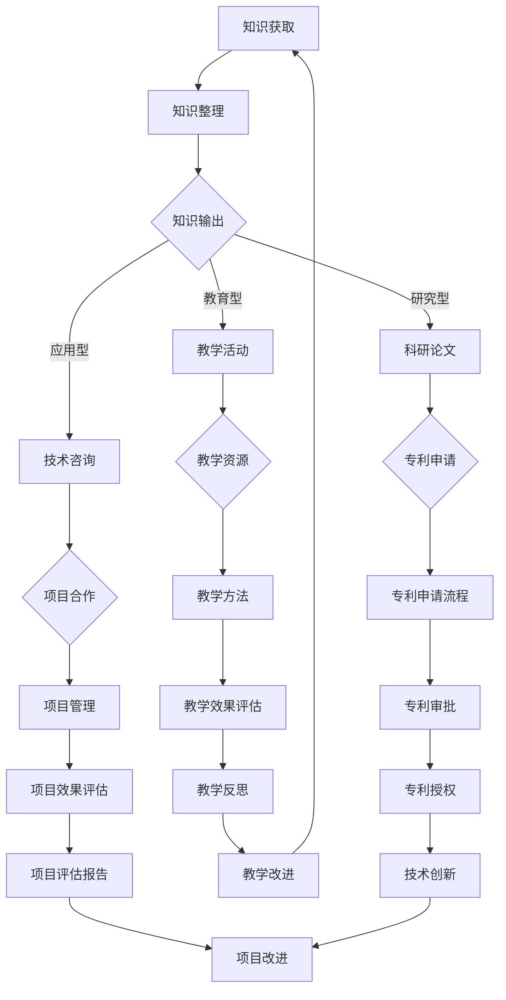

                 

### 文章标题

#### 知识输出的多种方式及其效果

> **关键词**：知识输出、教育型输出、研究型输出、应用型输出、效果评估、未来趋势、案例研究

> **摘要**：本文深入探讨了知识输出的概念、类型及其效果评估方法。通过分析教育型、研究型和应用型知识输出的具体方式，本文总结了各类知识输出在实际应用中的效果，并展望了知识输出在数字化、智能化和全球化趋势下的未来发展。结合实际案例，本文为知识输出提供了实践指导和启示。

---

### 第一部分：知识输出的基本概念

#### 第1章：知识输出的定义与重要性

##### 1.1 知识输出的基本概念

知识输出是一个涉及知识传播和知识应用的过程。它不仅涉及个人或组织内部的知识分享，还涉及外部环境的知识传递和应用。

###### 1.1.1 知识输出的定义

知识输出的定义可以概括为：

$$
知识输出 = 知识传播 + 知识应用
$$

其中，知识传播是指知识从源头传递到接受者的过程，而知识应用是指知识在实际情境中的使用和转化。

###### 1.1.2 知识输出的重要性

知识输出对于个人和组织的成长具有重要意义：

1. **促进知识传播和共享**：知识输出使得知识可以跨越时间和空间的限制，实现更广泛的传播和共享。
2. **提高个人和组织的竞争力**：通过知识输出，个人和组织可以积累更多的知识和经验，提高自身的竞争力和创新能力。
3. **增强知识创新和转化**：知识输出激发了知识的创新和应用，促进了知识从理论到实践的转化。

##### 1.2 知识输出的类型

知识输出可以分为教育型输出、研究型输出和应用型输出三种类型。

###### 1.2.1 教育型输出

教育型输出主要通过教学活动、学术讲座和教学视频等方式进行。它有助于知识的传授和普及，提高公众的知识水平。

1. **教学活动**：包括课堂教学、在线教育、实训课程等，旨在培养学生和从业者的专业知识和技能。
2. **学术讲座**：专家学者通过讲座形式分享最新的研究成果和学术观点，促进学术交流和知识传播。
3. **教学视频**：通过视频课程的形式，将知识以直观、生动的形式传递给学习者。

###### 1.2.2 研究型输出

研究型输出主要通过科研论文、专利申请和科技报告等方式进行。它有助于推动科学技术的进步和创新。

1. **科研论文**：学术研究人员通过撰写论文，记录和分享研究过程和成果，促进学术交流和知识积累。
2. **专利申请**：企业或个人通过申请专利，保护自己的创新成果，推动技术转化和应用。
3. **科技报告**：科技工作者通过撰写报告，总结科研成果和技术应用，为政策制定和技术创新提供参考。

###### 1.2.3 应用型输出

应用型输出主要通过技术咨询、项目合作和产品开发等方式进行。它有助于将知识应用于实际生产和生活中，创造经济和社会价值。

1. **技术咨询**：专家为企业提供技术解决方案和咨询服务，帮助企业解决实际问题，提高生产效率和产品质量。
2. **项目合作**：企业或研究机构通过合作，共同开展技术开发和项目实施，实现知识共享和资源优化。
3. **产品开发**：企业或个人通过开发新技术、新产品，将知识转化为实际应用，推动产业升级和经济发展。

### 第二部分：知识输出的效果评估

#### 第2章：知识输出的效果评估方法

##### 2.1 效果评估的意义

知识输出的效果评估是确保知识输出质量和效率的重要手段。它具有以下意义：

1. **提高知识输出的质量**：通过效果评估，可以及时发现知识输出的不足，优化输出策略，提高知识输出的质量和影响力。
2. **优化知识输出的策略**：效果评估为知识输出提供了反馈信息，有助于组织和个人调整知识输出的方式和方法，实现知识输出的最佳效果。

##### 2.2 效果评估的指标

知识输出的效果评估可以从影响力指标、价值指标和质量指标三个方面进行。

###### 2.2.1 影响力指标

影响力指标主要用于衡量知识输出的传播效果和受众接受程度。常见的指标包括：

1. **引用次数**：知识输出被其他文献引用的次数，反映了知识输出在学术界的传播和影响力。
2. **被引用率**：知识输出被引用的频率，反映了知识输出在特定领域的权威性和影响力。
3. **社交媒体关注度**：知识输出在社交媒体上的关注度和互动情况，反映了知识输出在社会层面的传播效果。

###### 2.2.2 价值指标

价值指标主要用于衡量知识输出所带来的经济和社会效益。常见的指标包括：

1. **经济效益**：知识输出为企业或组织带来的直接经济效益，如销售收入、利润增长等。
2. **社会效益**：知识输出为社会带来的间接效益，如提高公众素质、促进技术创新等。
3. **个人成长**：知识输出为个人带来的成长和发展机会，如提升专业技能、拓展视野等。

###### 2.2.3 质量指标

质量指标主要用于衡量知识输出的创新性、实用性和可行性。常见的指标包括：

1. **创新性**：知识输出在理论或实践方面的创新程度，反映了知识输出的前瞻性和价值。
2. **实用性**：知识输出在实际应用中的可行性和效果，反映了知识输出的实用价值。
3. **可行性**：知识输出在实施过程中所需的技术、资源和条件，反映了知识输出的实施难度和可行性。

### 第三部分：知识输出的多种方式

#### 第3章：教育型知识输出

##### 3.1 教学活动

教学活动是教育型知识输出的主要形式。有效的教学活动需要注重教学方法、教学资源和教学效果的评价。

###### 3.1.1 教学方法的选择

选择合适的教学方法对于提高教学效果至关重要。常见的教学方法包括：

1. **讲授法**：教师通过口头讲解，向学生传授知识。
2. **讨论法**：教师引导学生进行课堂讨论，促进学生思考和交流。
3. **实验法**：教师组织学生进行实验活动，培养学生的实践能力和创新能力。
4. **案例教学法**：教师通过案例分析，引导学生分析和解决实际问题。

###### 3.1.2 教学资源的准备

教学资源的准备是教学活动的重要环节。教学资源包括教材、多媒体资料、实验设备等。教师需要根据教学内容和教学目标，合理选择和准备教学资源。

###### 3.1.3 教学效果的评价

教学效果的评价是教学活动的重要环节。通过教学效果的评价，可以了解教学活动的成效，发现不足之处，并及时进行调整。教学效果的评价可以从以下几个方面进行：

1. **学生成绩**：通过考试、作业等评估学生的知识掌握程度。
2. **学生反馈**：通过问卷调查、访谈等方式了解学生对教学活动的满意度。
3. **教学反思**：教师根据教学实践，反思教学方法和教学资源的选择，总结教学经验，不断提升教学水平。

##### 3.2 学术讲座

学术讲座是教育型知识输出的一种重要形式。学术讲座有助于促进学术交流，提高公众的科学素养。

###### 3.2.1 讲座主题的选择

讲座主题的选择应结合当前的热点问题和学术前沿，具有一定的学术价值和实践意义。

###### 3.2.2 讲座内容的准备

讲座内容的准备应充分考虑听众的背景和需求，确保讲座内容既具有理论深度，又具有实践价值。

###### 3.2.3 讲座效果的评估

讲座效果的评估可以从以下几个方面进行：

1. **听众反馈**：通过问卷调查、访谈等方式了解听众对讲座的满意度。
2. **媒体报道**：通过媒体报道和引用次数等指标，评估讲座的社会影响力。
3. **后续研究**：通过后续研究论文的发表和研究项目的立项等，评估讲座对学术界的贡献。

##### 3.3 教学视频

教学视频是教育型知识输出的一种新兴形式。教学视频具有广泛的受众群体，有利于知识的普及和传播。

###### 3.3.1 视频内容的创作

教学视频的内容创作应注重知识的讲解、实例的分析和实践的引导。教学视频应具有逻辑性、系统性和可操作性。

###### 3.3.2 视频的传播与推广

教学视频的传播与推广需要借助社交媒体、在线教育平台等渠道，扩大受众群体，提高视频的传播效果。

###### 3.3.3 视频教学的效果评估

视频教学的效果评估可以从以下几个方面进行：

1. **观众反馈**：通过评论区、问卷调查等方式了解观众的满意度和学习效果。
2. **视频播放量**：通过视频的播放量、观看时长等指标，评估视频的传播效果。
3. **学习成果**：通过考试、作业等评估学生的学习成果。

### 第四部分：知识输出的效果与应用

#### 第4章：研究型知识输出

##### 4.1 科研论文的撰写

科研论文是研究型知识输出的一种重要形式。科研论文的撰写需要遵循学术规范，确保论文的学术质量和可读性。

###### 4.1.1 论文主题的选择

论文主题的选择应结合自身的研究方向和学科前沿，具有一定的创新性和应用价值。

###### 4.1.2 论文结构的安排

论文结构一般包括摘要、引言、文献综述、方法、结果与讨论、结论等部分。每个部分的内容安排应合理，逻辑清晰。

###### 4.1.3 论文质量的提升

提升论文质量的方法包括：

1. **深入研究**：对研究问题进行深入探讨，确保论文的理论深度和实证力度。
2. **数据准确性**：确保数据的准确性和可靠性，提高论文的可信度。
3. **语言表达**：使用规范、简练、准确的学术语言，提高论文的可读性。

##### 4.2 专利申请的流程

专利申请是研究型知识输出的一种形式。专利申请有助于保护创新成果，推动技术转化和应用。

###### 4.2.1 专利申请的主题选择

专利申请的主题应结合自身的研究方向和产业需求，具有一定的创新性和实用性。

###### 4.2.2 专利申请的撰写

专利申请的撰写应包括技术描述、权利要求、说明书等部分。撰写时应确保专利申请的完整性和准确性。

###### 4.2.3 专利申请的审批

专利申请的审批流程包括初步审查、实质审查、授权等环节。申请人在专利申请过程中需要与专利审查员进行沟通，确保专利申请的顺利进行。

##### 4.3 科技报告的编写

科技报告是研究型知识输出的另一种形式。科技报告有助于总结科研成果和技术应用，为后续研究和产业发展提供参考。

###### 4.3.1 报告主题的确定

报告主题应结合研究成果和应用需求，具有一定的创新性和实践意义。

###### 4.3.2 报告内容的组织

报告内容应包括研究背景、研究目标、研究方法、研究结果与讨论、结论与建议等部分。内容的组织应结构清晰、逻辑严谨。

###### 4.3.3 报告的提交与反馈

报告的提交应按照相关要求和格式进行。提交后，应积极与评审专家进行沟通，根据反馈意见进行修改和完善。

### 第五部分：知识输出在实际中的应用

#### 第5章：应用型知识输出

##### 5.1 技术咨询

技术咨询是应用型知识输出的一种形式。技术咨询有助于企业解决实际问题，提高生产效率和产品质量。

###### 5.1.1 技术咨询的内容和形式

技术咨询的内容包括技术诊断、技术方案设计、技术培训等。形式可以包括现场咨询、远程咨询、项目合作等。

###### 5.1.2 技术咨询的服务流程

技术咨询的服务流程一般包括需求分析、方案设计、实施指导、效果评估等环节。

1. **需求分析**：了解企业存在的问题和需求，确定技术咨询的方向和目标。
2. **方案设计**：根据需求分析，设计针对性的技术解决方案。
3. **实施指导**：协助企业实施技术解决方案，提供技术支持和培训。
4. **效果评估**：评估技术咨询的效果，为企业提供改进建议。

###### 5.1.3 技术咨询的效果评估

技术咨询的效果评估可以从以下几个方面进行：

1. **企业满意度**：通过问卷调查、访谈等方式了解企业对技术咨询的满意度。
2. **技术效果**：评估技术咨询带来的技术改进和效益。
3. **持续改进**：根据评估结果，对技术咨询方案进行优化和改进。

##### 5.2 项目合作

项目合作是应用型知识输出的另一种形式。项目合作有助于企业或研究机构共同开展技术开发和项目实施。

###### 5.2.1 项目合作的形式和策略

项目合作的形式可以包括技术研发合作、项目承包、战略联盟等。策略包括资源整合、优势互补、风险共担等。

###### 5.2.2 项目合作的管理和执行

项目合作的管理和执行需要注重以下几个方面：

1. **项目规划**：明确项目目标、任务分工、时间安排等。
2. **沟通协调**：确保各方沟通顺畅，协调解决问题。
3. **质量控制**：确保项目质量和进度，降低风险。
4. **评估反馈**：对项目进行定期评估，根据反馈进行调整和改进。

###### 5.2.3 项目合作的效果评估

项目合作的效果评估可以从以下几个方面进行：

1. **项目效益**：评估项目对企业或研究机构的效益，如经济效益、社会效益等。
2. **合作满意度**：通过问卷调查、访谈等方式了解各方对项目合作的满意度。
3. **合作经验**：总结项目合作的经验和教训，为后续合作提供参考。

##### 5.3 产品开发

产品开发是应用型知识输出的重要形式。产品开发有助于企业将知识转化为实际产品，推动产业升级和经济发展。

###### 5.3.1 产品开发的流程

产品开发的流程一般包括市场调研、产品规划、产品设计、生产制造、市场营销等环节。

1. **市场调研**：了解市场需求和竞争情况，确定产品方向。
2. **产品规划**：明确产品定位、功能、规格等。
3. **产品设计**：进行产品设计和验证。
4. **生产制造**：组织生产制造，确保产品质量。
5. **市场营销**：开展市场推广活动，提高产品知名度。

###### 5.3.2 产品开发的策略

产品开发的策略包括创新驱动、市场需求导向、技术创新等。创新驱动策略注重产品技术的创新和突破，市场需求导向策略注重满足市场需求，技术创新策略注重技术创新和提升产品竞争力。

###### 5.3.3 产品开发的效果评估

产品开发的效果评估可以从以下几个方面进行：

1. **产品性能**：评估产品的性能指标，如功能、质量、可靠性等。
2. **市场表现**：评估产品的市场销量、市场份额等。
3. **经济效益**：评估产品的经济效益，如销售收入、利润等。
4. **客户满意度**：通过问卷调查、访谈等方式了解客户对产品的满意度。

### 第六部分：知识输出的未来趋势与发展

#### 第6章：知识输出的未来趋势

##### 6.1 知识输出的数字化发展

知识输出的数字化发展是未来知识输出的重要趋势。数字化知识输出具有传播速度快、覆盖面广、互动性强等优点。

###### 6.1.1 数字化知识输出的优势

1. **传播速度快**：数字化知识输出可以实时传播，实现知识快速传递。
2. **覆盖面广**：数字化知识输出不受地域限制，可以覆盖全球受众。
3. **互动性强**：数字化知识输出支持用户互动，提高知识传播效果。

###### 6.1.2 数字化知识输出的挑战

1. **信息过载**：数字化知识输出可能导致信息过载，用户难以筛选有效信息。
2. **数据安全**：数字化知识输出涉及大量数据，数据安全成为重要挑战。

###### 6.1.3 数字化知识输出的未来趋势

1. **知识图谱**：通过知识图谱技术，实现知识的结构化和关联，提高知识输出的效率。
2. **人工智能**：人工智能技术在知识输出中的应用，提高知识输出的智能化水平。
3. **虚拟现实**：虚拟现实技术应用于知识输出，实现沉浸式学习体验。

##### 6.2 知识输出的智能化发展

知识输出的智能化发展是未来知识输出的重要方向。智能化知识输出通过人工智能技术，提高知识输出的效率和效果。

###### 6.2.1 智能化知识输出的定义

智能化知识输出是指利用人工智能技术，实现知识的自动生成、推荐、传播和反馈。

###### 6.2.2 智能化知识输出的形式

1. **自动内容生成**：通过自然语言处理技术，自动生成文章、报告、演讲稿等。
2. **智能推荐系统**：通过机器学习算法，为用户推荐感兴趣的知识内容。
3. **智能问答系统**：通过自然语言处理技术，实现智能问答，提供知识服务。

###### 6.2.3 智能化知识输出的应用场景

1. **在线教育**：智能教育平台通过个性化推荐，提高学习效果。
2. **企业培训**：企业通过智能培训系统，提高员工培训效率。
3. **智能客服**：智能客服系统通过自然语言处理技术，提供24小时知识服务。

##### 6.3 知识输出的全球化发展

知识输出的全球化发展是未来知识输出的重要趋势。全球化知识输出有助于推动知识共享和交流，促进全球经济发展。

###### 6.3.1 全球化知识输出的意义

1. **知识共享**：全球化知识输出有助于实现知识的全球共享，提高知识利用效率。
2. **技术创新**：全球化知识输出促进跨国合作和知识交流，推动技术创新。
3. **经济发展**：全球化知识输出有助于推动全球经济发展，提升各国竞争力。

###### 6.3.2 全球化知识输出的挑战

1. **语言障碍**：全球化知识输出面临语言障碍，影响知识传播效果。
2. **文化差异**：全球化知识输出需要考虑文化差异，确保知识内容的适用性。
3. **政策法规**：全球化知识输出需要遵循各国政策法规，确保合法合规。

###### 6.3.3 全球化知识输出的未来发展

1. **跨国合作**：加强跨国合作，实现知识共享和交流。
2. **数字化平台**：利用数字化平台，提高知识输出的效率。
3. **国际标准**：制定国际标准，推动全球化知识输出的规范化和标准化。

### 第七部分：知识输出的案例研究与启示

#### 第7章：知识输出案例研究

##### 7.1 案例一：某大学的知识输出实践

###### 7.1.1 案例背景

某大学在知识输出方面进行了积极探索和实践，通过多种形式的知识输出，提高了学术声誉和社会影响力。

###### 7.1.2 案例实施过程

某大学实施了以下知识输出活动：

1. **学术讲座**：邀请国内外知名学者进行学术讲座，分享最新研究成果和学术观点。
2. **科研论文**：鼓励教师和学生撰写科研论文，发表在国内外学术期刊上。
3. **在线教育**：建立在线教育平台，提供优质课程和教学资源。
4. **科技成果转化**：推动科研成果转化为实际应用，为企业提供技术支持和咨询服务。

###### 7.1.3 案例效果评估

通过以上知识输出活动，某大学取得了以下效果：

1. **学术影响力提升**：学术讲座和科研论文的发表提高了学校的学术声誉，吸引了更多优秀学者和学生。
2. **社会服务能力增强**：科技成果转化活动提升了学校的社会服务能力，为企业提供了技术支持和咨询服务，促进了产业发展。
3. **在线教育推广**：在线教育平台的建立和运营，提高了教育教学的效率和覆盖面，推动了教育的普及和发展。

##### 7.2 案例二：某企业的知识输出策略

###### 7.2.1 案例背景

某企业在知识输出方面采取了多种策略，通过知识共享和交流，提高了企业的创新能力和市场竞争力。

###### 7.2.2 案例实施过程

某企业实施了以下知识输出活动：

1. **内部培训**：定期开展内部培训，提高员工的专业技能和创新能力。
2. **技术交流**：组织技术交流活动，促进员工之间的知识共享和交流。
3. **公开课**：邀请行业专家进行公开课，分享行业前沿知识和实践经验。
4. **技术输出**：通过技术转让、技术服务等方式，将企业技术输出给其他企业或研究机构。

###### 7.2.3 案例效果评估

通过以上知识输出活动，某企业取得了以下效果：

1. **创新能力提升**：内部培训和交流促进了员工的知识更新和创新能力的提升，提高了企业的研发水平。
2. **市场竞争力增强**：公开课和技术输出活动提升了企业的技术声誉和市场竞争力，扩大了市场份额。
3. **知识共享和交流**：内部培训和交流机制促进了企业内部的知识共享和交流，提高了整体工作效率和团队协作能力。

##### 7.3 案例三：某研究机构的科研成果转化

###### 7.3.1 案例背景

某研究机构在科研成果转化方面取得了显著成效，通过多种形式的知识输出，推动了科研成果的转化和应用。

###### 7.3.2 案例实施过程

某研究机构实施了以下科研成果转化活动：

1. **专利申请**：对具有商业潜力的科研成果进行专利申请，保护知识产权。
2. **技术合作**：与企业和研究机构合作，共同开展技术开发和项目实施。
3. **技术咨询**：为企业提供技术咨询和服务，推动技术转化和应用。
4. **成果展示**：定期举办科研成果展示活动，提高科研成果的曝光度和转化率。

###### 7.3.3 案例效果评估

通过以上科研成果转化活动，某研究机构取得了以下效果：

1. **科技成果转化率提高**：通过专利申请和技术合作，促进了科研成果的转化和应用，提高了科技成果的转化率。
2. **经济效益提升**：成果转化活动为企业提供了技术支持和咨询服务，提高了企业的生产效率和产品质量，创造了经济效益。
3. **社会影响力增强**：科研成果的转化和应用提高了研究机构的社会影响力，吸引了更多的研究项目和人才。

### 结论与启示

知识输出是知识传播和应用的重要途径，对于个人、组织和整个社会的进步具有重要意义。本文从知识输出的基本概念、效果评估方法、多种方式以及未来趋势等方面进行了深入探讨。

1. **知识输出的重要性**：知识输出不仅促进了知识的传播和共享，提高了个人和组织的竞争力，还推动了知识创新和转化。
2. **效果评估方法**：效果评估是确保知识输出质量和效率的重要手段，可以从影响力指标、价值指标和质量指标三个方面进行评估。
3. **知识输出的多种方式**：教育型、研究型和应用型知识输出各有特点，适用于不同的情境和需求。
4. **未来趋势**：知识输出的数字化、智能化和全球化发展是未来知识输出的重要趋势，需要加强技术创新和策略优化。

结合案例研究，本文得出以下启示：

1. **加强学术交流**：学术讲座、科研论文发表和在线教育等形式的知识输出有助于提高学术声誉和社会影响力。
2. **推动技术转化**：专利申请、技术合作和成果展示等形式的知识输出有助于促进科技成果的转化和应用，创造经济效益。
3. **注重效果评估**：通过效果评估，可以优化知识输出的策略，提高知识输出的质量和效率。

总之，知识输出是一项复杂而重要的任务，需要各方共同努力，不断探索和创新。通过有效的知识输出，可以推动知识传播和应用，促进个人、组织和整个社会的发展。

### 附录

#### 附录A：知识输出相关的工具与资源

**A.1 知识输出工具**

- **教学工具**：如Microsoft Office、Adobe Creative Suite、Google Classroom等。
- **研究工具**：如EndNote、Zotero、Mendeley等。
- **应用工具**：如GitHub、GitLab、Jira等。

**A.2 知识输出资源**

- **学术资源**：如CNKI、Web of Science、IEEE Xplore等。
- **工具资源**：如GitHub、Stack Overflow、Codecademy等。
- **研究报告**：如NIST、IDC、Gartner等。

#### 附录B：知识输出效果评估方法详解

**B.1 影响力评估方法**

- **引用次数**：通过统计论文、专利等知识输出的引用次数，评估其在学术界的传播和影响力。
- **社交媒体关注度**：通过统计知识输出在社交媒体上的关注度和互动情况，评估其在社会层面的传播效果。

**B.2 价值评估方法**

- **经济效益**：通过统计知识输出为企业或组织带来的直接经济效益，如销售收入、利润增长等。
- **社会效益**：通过统计知识输出为社会带来的间接效益，如提高公众素质、促进技术创新等。
- **个人成长**：通过统计知识输出为个人带来的成长和发展机会，如提升专业技能、拓展视野等。

**B.3 质量评估方法**

- **创新性**：通过评估知识输出的创新程度，如论文的原创性、专利的创新点等。
- **实用性**：通过评估知识输出在实际应用中的可行性和效果，如技术的实用性、产品的市场表现等。
- **可行性**：通过评估知识输出实施过程中所需的技术、资源和条件，如项目的可行性、专利的授权情况等。

#### 附录C：知识输出案例研究资料

**C.1 案例一研究资料**

- **案例背景**：某大学在知识输出方面的实践。
- **实施过程**：学术讲座、科研论文发表、在线教育、科技成果转化等。
- **效果评估**：学术影响力提升、社会服务能力增强、在线教育推广等。

**C.2 案例二研究资料**

- **案例背景**：某企业在知识输出方面的策略。
- **实施过程**：内部培训、技术交流、公开课、技术输出等。
- **效果评估**：创新能力提升、市场竞争力增强、知识共享和交流等。

**C.3 案例三研究资料**

- **案例背景**：某研究机构的科研成果转化。
- **实施过程**：专利申请、技术合作、技术咨询、成果展示等。
- **效果评估**：科技成果转化率提高、经济效益提升、社会影响力增强等。

**Mermaid 流程图：知识输出的流程图**



**深度学习算法的伪代码**

```python
# 输入：特征数据X，标签数据Y
# 输出：训练好的模型参数θ

初始化模型参数θ
对于每个epoch：
    对于每个样本：
        计算预测值y' = σ(θ^T X)
        计算损失函数L(θ)
        计算梯度∇θL(θ)
        更新模型参数θ = θ - α∇θL(θ)
    结束
返回训练好的模型参数θ
```

**数学模型与公式**

- **线性回归模型**：

$$
y = \theta_0 + \theta_1x
$$

- **损失函数**：

$$
L(\theta) = \frac{1}{2}\sum_{i=1}^{n}(y_i - \theta_0 - \theta_1x_i)^2
$$

**举例说明**

- **线性回归模型**应用实例：

  - 特征数据：身高（x）和体重（y）
  - 预测目标：预测一个人的体重

**项目实战案例**

- **教学视频制作**：

  - 开发环境：Adobe Premiere Pro
  - 源代码实现：视频剪辑、特效添加、字幕制作等步骤
  - 代码解读与分析：每个步骤的具体操作方法和技巧

```python
# 示例：使用Adobe Premiere Pro制作教学视频的伪代码

初始化项目
导入视频素材
剪辑视频素材
添加字幕
添加特效
导出视频
分析视频质量
优化视频参数
输出最终视频
```

**总结**

本文从知识输出的基本概念、效果评估方法、多种方式、未来趋势以及案例研究等方面进行了全面探讨，为知识输出的实践提供了理论和实践指导。随着数字化、智能化和全球化的发展，知识输出将越来越重要，需要我们不断探索和创新，以实现知识的最大化利用和价值创造。

