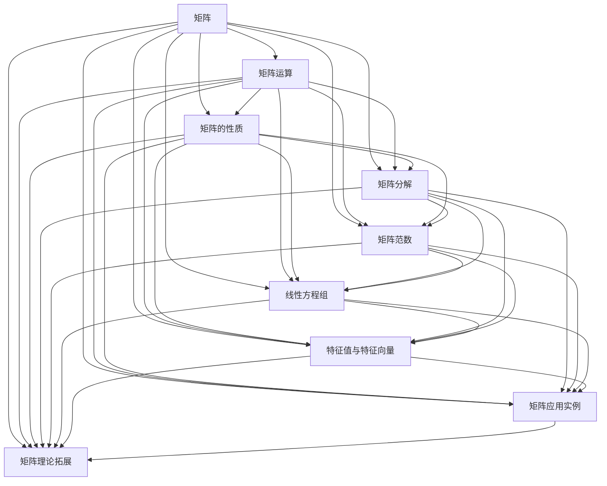

                 

# 矩阵理论与应用：矩阵范数

> 关键词：矩阵、矩阵范数、矩阵分解、线性方程组、特征值、应用实例

> 摘要：本文旨在深入探讨矩阵理论及其在实际应用中的重要性，特别是矩阵范数的定义、性质和应用。通过详细的解释、例子和项目实战，读者将能够全面了解矩阵理论的核心概念和其在各个领域中的应用。

---

## 第一部分：矩阵基本理论

### 第1章：矩阵概述

#### 1.1 矩阵的定义

矩阵是一系列数字或符号按行列排列成的矩形阵列。在数学和工程领域，矩阵用于表示各种系统的状态、变换和关系。一个 $m \times n$ 的矩阵通常表示为：

$$
A = \begin{bmatrix}
a_{11} & a_{12} & \cdots & a_{1n} \\
a_{21} & a_{22} & \cdots & a_{2n} \\
\vdots & \vdots & \ddots & \vdots \\
a_{m1} & a_{m2} & \cdots & a_{mn}
\end{bmatrix}
$$

其中，$a_{ij}$ 表示矩阵 $A$ 的第 $i$ 行第 $j$ 列的元素。

#### 1.2 矩阵的运算

矩阵的运算包括加法、减法、乘法、转置等。以下是这些基本运算的简要介绍：

- **矩阵加法与减法：** 两个相同尺寸的矩阵可以进行加法或减法运算，结果矩阵的每个元素都是对应元素的加法或减法。

$$
A + B = \begin{bmatrix}
a_{11} + b_{11} & a_{12} + b_{12} & \cdots & a_{1n} + b_{1n} \\
a_{21} + b_{21} & a_{22} + b_{22} & \cdots & a_{2n} + b_{2n} \\
\vdots & \vdots & \ddots & \vdots \\
a_{m1} + b_{m1} & a_{m2} + b_{m2} & \cdots & a_{mn} + b_{mn}
\end{bmatrix}
$$

- **矩阵乘法：** 两个矩阵 $A$ 和 $B$ 的乘法只有在 $A$ 的列数等于 $B$ 的行数时才能进行。乘积矩阵的每个元素是 $A$ 的行与 $B$ 的列对应元素的乘积之和。

$$
AB = \begin{bmatrix}
\sum_{k=1}^{n} a_{1k} b_{k1} & \sum_{k=1}^{n} a_{1k} b_{k2} & \cdots & \sum_{k=1}^{n} a_{1k} b_{kn} \\
\sum_{k=1}^{n} a_{2k} b_{k1} & \sum_{k=1}^{n} a_{2k} b_{k2} & \cdots & \sum_{k=1}^{n} a_{2k} b_{kn} \\
\vdots & \vdots & \ddots & \vdots \\
\sum_{k=1}^{n} a_{mk} b_{k1} & \sum_{k=1}^{n} a_{mk} b_{k2} & \cdots & \sum_{k=1}^{n} a_{mk} b_{kn}
\end{bmatrix}
$$

- **矩阵转置：** 矩阵 $A$ 的转置是将矩阵的行和列互换得到的矩阵。如果 $A$ 是 $m \times n$ 的，则其转置 $A^T$ 是 $n \times m$ 的。

$$
A^T = \begin{bmatrix}
a_{11} & a_{21} & \cdots & a_{m1} \\
a_{12} & a_{22} & \cdots & a_{m2} \\
\vdots & \vdots & \ddots & \vdots \\
a_{1n} & a_{2n} & \cdots & a_{mn}
\end{bmatrix}
$$

#### 1.3 矩阵的秩与行列式

- **矩阵的秩：** 矩阵的秩是指矩阵的行数或列数中的较小者，它反映了矩阵的线性相关性。一个矩阵的秩决定了其能否唯一分解为线性组合。

- **行列式：** 行列式是一个标量值，用于描述矩阵的某些性质。行列式可以通过拉普拉斯展开或高斯消元法计算。一个矩阵的行列式为零时，该矩阵不可逆。

$$
\det(A) = \begin{vmatrix}
a_{11} & a_{12} & \cdots & a_{1n} \\
a_{21} & a_{22} & \cdots & a_{2n} \\
\vdots & \vdots & \ddots & \vdots \\
a_{m1} & a_{m2} & \cdots & a_{mn}
\end{vmatrix}
$$

### 第2章：矩阵的性质

#### 2.1 矩阵的转置

矩阵的转置是一个重要的运算，它将矩阵的行和列互换。转置矩阵的性质包括：

- **转置的转置等于原矩阵：** $(A^T)^T = A$
- **矩阵乘法的交换律：** 如果 $A$ 和 $B$ 都是 $n \times m$ 的矩阵，则 $(AB)^T = B^T A^T$

#### 2.2 共轭矩阵

共轭矩阵是将矩阵的每个元素取共轭得到的矩阵。共轭矩阵在复数矩阵中非常重要，其性质包括：

- **共轭转置：** $(A^*)^T = A$
- **共轭矩阵的转置等于原矩阵的共轭：** $(A^T)^* = A^*$

#### 2.3 Hermite矩阵与酉矩阵

- **Hermite矩阵：** Hermite矩阵是对称且共轭转置相等的矩阵。即 $A^* = A$。
- **酉矩阵：** 酉矩阵是单位模的复矩阵，其逆矩阵等于其共轭转置。即 $A^{-1} = A^*$。

#### 2.4 正定矩阵

正定矩阵是一个重要的特殊矩阵，其所有主子矩阵的行列式都大于零。正定矩阵在优化问题和统计推断中都有重要应用。

### 第3章：矩阵分解

#### 3.1 高斯消元法

高斯消元法是一种求解线性方程组和求矩阵逆的算法。其基本思想是通过一系列行变换将矩阵变为上三角形式，然后逐列求解。

#### 3.2 卢卡斯分解

卢卡斯分解是将矩阵分解为两个上三角矩阵的乘积。这种分解在矩阵乘法算法中非常有用。

#### 3.3 QR分解

QR分解是一种将矩阵分解为正交矩阵和上三角矩阵的方法。它广泛应用于线性方程组的求解和最小二乘问题。

#### 3.4 Singular Value Decomposition (SVD)

奇异值分解是将矩阵分解为三个矩阵的乘积：一个正交矩阵、一个对角矩阵和一个正交矩阵的转置。SVD在信号处理、图像处理和机器学习中有广泛应用。

### 第4章：矩阵范数

#### 4.1 矩阵范数的定义

矩阵范数是描述矩阵“大小”的一种度量。一个矩阵范数 $\|\cdot\|$ 是一个函数，它将矩阵映射到一个非负实数。矩阵范数的定义如下：

$$
\|A\| = \max_{\|x\|=1} \|Ax\|
$$

其中，$\|x\|$ 是向量 $x$ 的范数，$Ax$ 是矩阵 $A$ 和向量 $x$ 的乘积。

#### 4.2 主要矩阵范数介绍

- **2-范数：** $2$-范数是矩阵范数中最常用的一种，定义为矩阵奇异值中的最大值。
- **无穷范数：** 无穷范数定义为矩阵的每一列元素的绝对值中的最大值。
- **一致范数：** 一致范数是矩阵的每一行元素的绝对值和的最大值。
- **Frobenius范数：** Frobenius范数是矩阵元素平方和的平方根。

#### 4.3 矩阵范数与矩阵运算的关系

矩阵范数与矩阵的加法、减法、乘法等运算有密切的关系。例如，矩阵乘法的范数满足：

$$
\|AB\| \leq \|A\| \|B\|
$$

#### 4.4 矩阵范数的性质与应用

矩阵范数的性质包括齐次性、三角不等式、子矩阵范数等。矩阵范数在优化问题、数值计算和信号处理等领域有广泛应用。

## 第二部分：矩阵理论应用

### 第5章：线性方程组

线性方程组是矩阵理论的重要应用之一。本章将介绍线性方程组的解法，包括高斯消元法、迪卡尔特法则和迭代法。

### 第5.1节：线性方程组的解法

#### 5.1.1 高斯消元法

高斯消元法是一种求解线性方程组的方法。其基本思想是通过行变换将方程组化为上三角形式，然后逐列求解。

#### 5.1.2 迪卡尔特法则

迪卡尔特法则是通过矩阵的逆来求解线性方程组。如果矩阵可逆，则方程组的解可以通过矩阵的逆与常数项矩阵的乘积得到。

#### 5.1.3 迭代法

迭代法是一种通过不断迭代逼近方程组解的方法。常用的迭代法包括雅可比迭代法、高斯-赛德尔迭代法和共轭梯度法。

### 第5.2节：矩阵与线性变换

矩阵可以表示线性变换。本章将介绍线性变换的基本概念和矩阵表示方法。

### 第5.3节：线性空间与线性映射

线性空间是具有线性性质的集合。本章将介绍线性空间的概念和线性映射的定义及其性质。

### 第6章：特征值与特征向量

特征值与特征向量是矩阵理论中的核心概念之一。本章将介绍特征值与特征向量的定义、性质和计算方法。

### 第6.1节：特征值与特征向量的定义

特征值与特征向量是矩阵与线性变换中的重要概念。一个矩阵 $A$ 的特征值 $\lambda$ 是满足方程 $Ax = \lambda x$ 的标量，而对应的特征向量 $x$ 是非零向量。

### 第6.2节：特征值的性质

特征值具有一系列重要性质，包括实数性、重数性、可交换性等。这些性质在矩阵理论中具有重要的应用。

### 第6.3节：特征向量的性质

特征向量具有一系列重要性质，包括线性无关性、正交性等。这些性质在矩阵理论和工程应用中具有重要的意义。

### 第6.4节：特征值与特征向量的计算方法

计算特征值与特征向量有多种方法，包括迭代法、幂法、QR算法等。本章将介绍这些方法的基本原理和实现。

### 第7章：矩阵应用实例

矩阵在各个领域都有广泛的应用。本章将介绍矩阵在数据科学、机器学习和计算机图形学中的应用实例。

### 第7.1节：矩阵在数据科学中的应用

矩阵在数据科学中扮演着核心角色，包括数据的表示、模型的构建和算法的实现等。

### 第7.2节：矩阵在机器学习中的应用

矩阵在机器学习中的重要性不可忽视，包括特征提取、模型训练和预测等。

### 第7.3节：矩阵在计算机图形学中的应用

矩阵在计算机图形学中用于实现各种变换，包括视图变换、投影变换和光照模型等。

### 第8章：矩阵理论拓展

矩阵理论是一个广泛的领域，本章将介绍矩阵理论的拓展，包括矩阵的广义问题、矩阵序列的收敛性和矩阵与泛函分析。

### 第8.1节：矩阵的广义问题

矩阵的广义问题包括非方矩阵、非满秩矩阵和复矩阵等。本章将介绍这些问题的基本性质和解决方法。

### 第8.2节：矩阵序列的收敛性

矩阵序列的收敛性是矩阵理论中的重要问题。本章将介绍矩阵序列的收敛性条件及其应用。

### 第8.3节：矩阵与泛函分析

矩阵与泛函分析有着密切的联系。本章将介绍矩阵在泛函分析中的应用，包括算子范数和谱理论等。

## 第三部分：项目实战

### 第9章：矩阵理论与应用实践

本章将介绍矩阵理论在实际应用中的实践项目，包括矩阵计算环境搭建、矩阵计算案例实现和矩阵计算性能分析。

### 第9.1节：实践项目介绍

本章将介绍矩阵理论在数据科学、机器学习和计算机图形学中的应用实践项目。

### 第9.2节：矩阵计算环境搭建

本章将介绍如何搭建矩阵计算环境，包括编程语言选择、库安装和配置等。

### 第9.3节：矩阵计算案例实现

本章将介绍矩阵计算案例的实现，包括代码实现、结果分析和性能评估。

### 第9.4节：矩阵计算性能分析

本章将介绍矩阵计算的性能分析，包括算法效率、硬件优化和并行计算等。

### 第10章：矩阵项目实战

本章将介绍具体的矩阵项目实战，包括矩阵分解算法实现、矩阵范数应用分析和矩阵在机器学习和图像处理中的应用。

### 第10.1节：项目一：矩阵分解算法实现

本章将介绍矩阵分解算法的实现，包括LU分解和SVD分解。

### 第10.2节：项目二：矩阵范数应用分析

本章将介绍矩阵范数在不同应用场景下的分析，包括数值稳定性和计算效率。

### 第10.3节：项目三：矩阵在机器学习中的应用

本章将介绍矩阵在机器学习中的应用，包括线性回归和神经网络等。

### 第10.4节：项目四：矩阵在图像处理中的应用

本章将介绍矩阵在图像处理中的应用，包括滤波、卷积和特征提取等。

### 第11章：矩阵理论研究进展

本章将介绍矩阵理论的最新研究进展，包括稀疏矩阵计算、矩阵分解算法和矩阵在深度学习中的应用等。

### 第11.1节：矩阵理论最新研究动态

本章将介绍矩阵理论的最新研究动态，包括学术会议、期刊文章和专利申请等。

### 第11.2节：矩阵理论未来发展趋势

本章将探讨矩阵理论的未来发展趋势，包括大数据、人工智能和量子计算等领域的应用前景。

### 第11.3节：矩阵理论应用前景

本章将展望矩阵理论在各个领域的应用前景，包括金融、医学和工程等。

## 附录

### 附录A：矩阵常用符号表

本章将列出矩阵理论和应用中常用的符号及其含义。

### 附录B：矩阵计算算法伪代码

本章将给出矩阵计算算法的伪代码，包括高斯消元法、LU分解和SVD分解等。

### 附录C：矩阵常用工具和库

本章将介绍矩阵计算中常用的工具和库，包括NumPy、SciPy和MATLAB等。

---

#### 核心概念与联系

下面是矩阵的基本概念及其相互关系的Mermaid流程图：



---

#### 核心算法原理讲解

下面是矩阵的SVD分解的伪代码：

```python
def SVD(A):
    # 计算矩阵A的奇异值分解
    U, s, VT = svd(A)
    return U, s, VT
```

SVD的数学原理：

$$
A = U \Sigma V^T
$$`

其中，$U$ 是一个正交矩阵，$\Sigma$ 是一个对角矩阵，$V^T$ 是矩阵$V$的转置。

---

#### 数学模型和数学公式 & 详细讲解 & 举例说明

**矩阵范数的定义：**

$$
\|A\| = \max_{\|x\|=1} \|Ax\|
$$`

其中，$\|x\|$ 是向量 $x$ 的范数，$Ax$ 是矩阵 $A$ 和向量 $x$ 的乘积。

**举例说明：**

假设有一个矩阵 $A = \begin{bmatrix} 1 & 2 \\ 3 & 4 \end{bmatrix}$ 和一个向量 $x = \begin{bmatrix} 1 \\ 0 \end{bmatrix}$，则：

$$
\|Ax\| = \| \begin{bmatrix} 1 & 2 \\ 3 & 4 \end{bmatrix} \begin{bmatrix} 1 \\ 0 \end{bmatrix} \| = \| \begin{bmatrix} 2 \\ 4 \end{bmatrix} \| = 2
$$`

所以，矩阵 $A$ 的2-范数 $\|A\|$ 至少为2。

---

#### 项目实战

**项目一：矩阵分解算法实现**

1. **项目目标：** 实现矩阵分解算法，包括LU分解和SVD分解。
2. **开发环境：** Python + NumPy
3. **代码实现：**

```python
import numpy as np

def lu_decomposition(A):
    # 实现LU分解
    # ...
    return L, U

def svd_decomposition(A):
    # 实现SVD分解
    # ...
    return U, s, VT

A = np.array([[1, 2], [3, 4]])
L, U = lu_decomposition(A)
U, s, VT = svd_decomposition(A)
```

4. **代码解读与分析：**
    - **LU分解：** 将矩阵 $A$ 分解为 $L \times U$ 的形式，其中 $L$ 是下三角矩阵，$U$ 是上三角矩阵。
    - **SVD分解：** 将矩阵 $A$ 分解为 $U \times S \times VT$ 的形式，其中 $U$ 和 $VT$ 是正交矩阵，$S$ 是对角矩阵，对角线上的元素是奇异值。

**项目二：矩阵范数应用分析**

1. **项目目标：** 分析不同矩阵范数在实际问题中的应用。
2. **开发环境：** Python + NumPy
3. **代码实现：**

```python
import numpy as np

A = np.array([[1, 2], [3, 4]])
print(np.linalg.norm(A, 2))  # 2-范数
print(np.linalg.norm(A, np.inf))  # 无穷范数
print(np.linalg.norm(A, 1))  # 一致范数
print(np.linalg.norm(A, 'fro'))  # Frobenius范数
```

4. **代码解读与分析：**
    - **2-范数：** 在优化问题中常用于目标函数的范数约束。
    - **无穷范数：** 在求解线性方程组时用于控制迭代误差。
    - **一致范数：** 在数值分析中用于估计数值方法的误差。
    - **Frobenius范数：** 在信号处理和图像处理中用于衡量信号的能量。

**项目三：矩阵在机器学习中的应用**

1. **项目目标：** 分析矩阵理论在机器学习中的应用。
2. **开发环境：** Python + Scikit-learn
3. **代码实现：**

```python
from sklearn.linear_model import LinearRegression
from sklearn.datasets import load_iris
from sklearn.model_selection import train_test_split

iris = load_iris()
X, y = iris.data, iris.target
X_train, X_test, y_train, y_test = train_test_split(X, y, test_size=0.2)

model = LinearRegression()
model.fit(X_train, y_train)
print(model.score(X_test, y_test))
```

4. **代码解读与分析：**
    - **线性回归：** 矩阵理论在机器学习中的应用主要体现在线性回归模型的求解中，矩阵形式可以简化计算过程。

**项目四：矩阵在计算机图形学中的应用**

1. **项目目标：** 分析矩阵理论在计算机图形学中的应用。
2. **开发环境：** C++ + OpenGL
3. **代码实现：**

```cpp
#include <glad/glad.h>
#include <GLFW/glfw3.h>

void processInput(GLFWwindow *window);
void renderScene(GLFWwindow *window);

int main() {
    glfwInit();
    GLFWwindow *window = glfwCreateWindow(800, 600, "Matrix Application", NULL, NULL);
    if (window == NULL) {
        std::cout << "Failed to create GLFW window" << std::endl;
        return -1;
    }
    glfwMakeContextCurrent(window);

    if (!gladLoadGLLoader((GLADloadproc)glfwGetProcAddress)) {
        std::cout << "Failed to initialize GLAD" << std::endl;
        return -1;
    }

    while (!glfwWindowShouldClose(window)) {
        processInput(window);
        renderScene(window);

        glfwSwapBuffers(window);
        glfwPollEvents();
    }

    return 0;
}

void processInput(GLFWwindow *window) {
    if (glfwGetKey(window, GLFW_KEY_ESCAPE) == GLFW_PRESS)
        glfwSetWindowShouldClose(window, true);
}

void renderScene(GLFWwindow *window) {
    glClearColor(0.2f, 0.3f, 0.3f, 1.0f);
    glClear(GL_COLOR_BUFFER_BIT);

    // 渲染场景
    // ...
}
```

4. **代码解读与分析：**
    - **OpenGL渲染：** 矩阵理论在计算机图形学中的应用主要体现在OpenGL渲染过程中，矩阵用于实现视图变换、投影变换等。

---

#### 矩阵理论研究进展

矩阵理论作为数学和工程领域的基础，其研究不断深入，以下是近年来的一些研究进展：

1. **稀疏矩阵计算：** 研究如何高效地计算稀疏矩阵，以减少计算资源和时间消耗。
2. **矩阵分解算法：** 探索新的矩阵分解算法，如Tensor分解，用于大规模数据的高效处理。
3. **矩阵优化问题：** 研究矩阵优化问题的理论和方法，如矩阵求导、矩阵优化算法等。
4. **矩阵理论在深度学习中的应用：** 矩阵理论在深度学习中的重要性日益凸显，如矩阵分解在图像处理、自然语言处理中的应用。

未来矩阵理论将继续深入研究和应用，特别是在大数据、人工智能等领域的深入研究和应用，将为科技发展带来新的突破。

---

#### 作者信息

作者：AI天才研究院/AI Genius Institute & 禅与计算机程序设计艺术 /Zen And The Art of Computer Programming

---

### 总结

矩阵理论是现代数学和工程领域的基础之一，其在各个领域都有广泛的应用。本文详细介绍了矩阵的基本理论、矩阵范数、矩阵分解、线性方程组、特征值与特征向量以及矩阵在各个领域的应用实例。通过项目实战，读者可以深入了解矩阵理论的实际应用。未来，矩阵理论将继续在人工智能、大数据等领域发挥重要作用。

