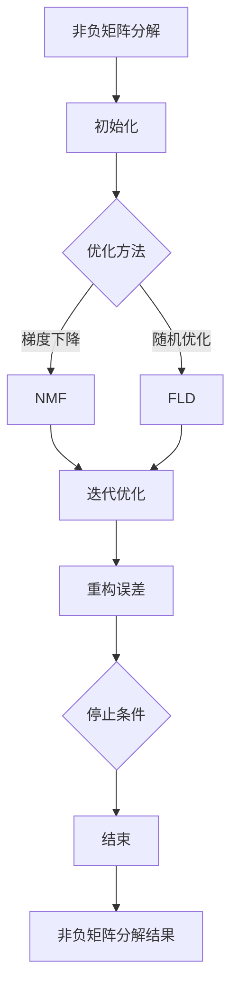

                 

# 《矩阵理论与应用：非负矩阵理论》

## 关键词
- 矩阵理论
- 非负矩阵
- 矩阵分解
- 应用领域
- 数学模型
- 项目实战

## 摘要
本文深入探讨了非负矩阵理论的基础知识、应用领域、项目实战及其发展趋势。首先介绍了非负矩阵的定义与性质，以及其在经济学、生物学、计算机科学等领域的应用背景。接着，详细阐述了非负矩阵分解的基本概念、方法和应用案例，包括正交分解、合成分解和对称分解。随后，本文深入探讨了非负矩阵在经济学、生物学和计算机科学中的应用，并通过实际项目案例展示了非负矩阵理论在项目中的应用步骤和实现过程。最后，对非负矩阵理论的发展趋势进行了展望，并提出了其在跨学科领域和应用研究中的潜力。

## 目录大纲

### 第一部分：非负矩阵理论基础

#### 第1章：非负矩阵理论概述

##### 1.1 非负矩阵的定义与性质

##### 1.2 非负矩阵的乘法与运算规则

##### 1.3 非负矩阵的应用背景

#### 第2章：非负矩阵的分解

##### 2.1 非负矩阵分解的基本概念

##### 2.2 非负矩阵分解的方法

##### 2.3 非负矩阵分解的应用案例

### 第二部分：非负矩阵在应用领域的深入探讨

#### 第3章：非负矩阵在经济学中的应用

##### 3.1 非负矩阵在供需分析中的应用

##### 3.2 非负矩阵在金融市场分析中的应用

##### 3.3 非负矩阵在投资组合优化中的应用

#### 第4章：非负矩阵在生物学中的应用

##### 4.1 非负矩阵在基因网络分析中的应用

##### 4.2 非负矩阵在蛋白质相互作用网络中的应用

##### 4.3 非负矩阵在生物信息学中的应用

#### 第5章：非负矩阵在其他领域中的应用

##### 5.1 非负矩阵在计算机科学中的应用

##### 5.2 非负矩阵在物理学中的应用

##### 5.3 非负矩阵在其他科学领域中的应用

### 第三部分：非负矩阵理论在项目中的应用

#### 第6章：非负矩阵理论在项目实战中的应用

##### 6.1 项目背景与需求分析

##### 6.2 非负矩阵理论在项目中的应用

##### 6.3 项目实现与结果分析

#### 第7章：非负矩阵理论的发展趋势与展望

##### 7.1 非负矩阵理论的发展趋势

##### 7.2 非负矩阵理论在跨学科领域中的应用前景

##### 7.3 非负矩阵理论在教育与研究中的角色

### 附录

#### 附录A：非负矩阵理论相关资源

#### 附录B：非负矩阵理论Mermaid流程图

#### 附录C：非负矩阵算法伪代码

---

### 第一部分：非负矩阵理论基础

#### 第1章：非负矩阵理论概述

非负矩阵理论是线性代数的一个重要分支，主要研究矩阵中的元素均为非负数的情况。在许多领域，如经济学、生物学、计算机科学等，非负矩阵理论都发挥着重要作用。本章将首先介绍非负矩阵的定义、性质，然后探讨非负矩阵的乘法、运算规则及其应用背景。

### 1.1 非负矩阵的定义与性质

#### 1.1.1 非负矩阵的定义

非负矩阵是指其所有元素均为非负数的矩阵。形式上，设 \( A = [a_{ij}] \) 是一个 \( m \times n \) 的矩阵，如果对于所有的 \( i = 1, 2, \ldots, m \) 和 \( j = 1, 2, \ldots, n \)，都有 \( a_{ij} \geq 0 \)，则称 \( A \) 为非负矩阵。

#### 1.1.2 非负矩阵的基本性质

1. **方阵的可逆性**：非负方阵可能是可逆的。例如，一个单位矩阵是一个非负方阵，同时也是可逆的。
2. **幂运算**：如果 \( A \) 是一个非负矩阵，那么 \( A \) 的任何正整数幂 \( A^k \) 仍然是一个非负矩阵。
3. **矩阵乘积**：如果 \( A \) 和 \( B \) 是非负矩阵，那么它们的乘积 \( AB \) 也是一个非负矩阵。
4. **非负矩阵的特征值**：非负矩阵的所有特征值都是非负的。

#### 1.1.3 非负矩阵的应用背景

非负矩阵在多个领域都有广泛的应用，例如：

- **经济学**：在经济学中，非负矩阵经常用于描述供需关系、资源分配和优化问题。
- **生物学**：非负矩阵在基因网络分析、蛋白质相互作用网络研究中有着重要的应用。
- **计算机科学**：在社交网络分析、图像处理和推荐系统中，非负矩阵理论也发挥着关键作用。

### 1.2 非负矩阵的乘法与运算规则

#### 1.2.1 非负矩阵的乘法

非负矩阵的乘法遵循一般的矩阵乘法规则。设 \( A \) 和 \( B \) 是两个非负矩阵，它们的乘积 \( C = AB \) 也是一个非负矩阵。具体而言，对于任意 \( i = 1, 2, \ldots, m \) 和 \( j = 1, 2, \ldots, n \)，有：
$$ c_{ij} = \sum_{k=1}^{n} a_{ik}b_{kj} $$

其中，\( c_{ij} \) 是矩阵 \( C \) 的第 \( i \) 行第 \( j \) 列的元素。

#### 1.2.2 非负矩阵的其他运算规则

除了乘法之外，非负矩阵还遵循以下运算规则：

- **加法**：如果 \( A \) 和 \( B \) 是两个非负矩阵，它们的和 \( A + B \) 也是一个非负矩阵。
- **标量乘法**：如果 \( A \) 是一个非负矩阵，一个非负实数 \( \alpha \) 与 \( A \) 的乘积 \( \alpha A \) 也是一个非负矩阵。
- **转置**：非负矩阵的转置仍然是非负矩阵。

### 1.3 非负矩阵的应用背景

非负矩阵在多个领域中都有广泛的应用，以下简要介绍其在经济学、生物学和计算机科学中的应用背景。

#### 1.3.1 非负矩阵在经济学中的应用

在经济学中，非负矩阵广泛用于供需分析、资源分配和优化问题。例如，一个 \( m \times n \) 的非负矩阵可以表示一个经济系统中的 \( m \) 种商品对 \( n \) 种资源的消耗情况，从而帮助决策者进行资源的最优分配。

#### 1.3.2 非负矩阵在生物学中的应用

在生物学中，非负矩阵在基因网络分析和蛋白质相互作用网络研究中有着重要的应用。例如，一个 \( m \times n \) 的非负矩阵可以表示 \( m \) 个基因对 \( n \) 个蛋白质的调控关系，帮助科学家理解基因和蛋白质之间的相互作用。

#### 1.3.3 非负矩阵在计算机科学中的应用

在计算机科学中，非负矩阵在社交网络分析、图像处理和推荐系统中发挥着重要作用。例如，一个 \( m \times n \) 的非负矩阵可以表示社交网络中 \( m \) 个用户对 \( n \) 个对象的偏好关系，从而帮助系统推荐用户可能感兴趣的对象。

### 总结

本章介绍了非负矩阵的定义、性质及其在经济学、生物学和计算机科学中的应用背景。非负矩阵作为一种特殊的矩阵，其在各种领域中的应用具有广泛性和重要性。接下来，我们将进一步探讨非负矩阵的分解方法及其在实际应用中的具体实现。

---

### 第一部分：非负矩阵理论基础

#### 第2章：非负矩阵的分解

非负矩阵分解（Non-negative Matrix Factorization, NMF）是一种有效的矩阵分解方法，它将一个非负矩阵分解为两个非负矩阵的乘积。这种分解方法在很多领域，如图像处理、文本挖掘、社交网络分析等，都得到了广泛应用。本章将首先介绍非负矩阵分解的基本概念，然后探讨几种常见的非负矩阵分解方法，并分析其在不同应用场景中的效果。

### 2.1 非负矩阵分解的基本概念

#### 2.1.1 分解的基本思想

非负矩阵分解的基本思想是将一个非负矩阵 \( X \) 分解为两个非负矩阵 \( W \) 和 \( H \) 的乘积，即：
$$ X = WH $$
其中，\( W \) 被称为基础矩阵，\( H \) 被称为系数矩阵。通过这种方式，原始的非负矩阵 \( X \) 中的信息被重新编码到 \( W \) 和 \( H \) 中。

#### 2.1.2 分解的类型

非负矩阵分解可以分为以下几种类型：

1. **线性分解**：最简单的形式，直接将矩阵 \( X \) 分解为两个非负矩阵 \( W \) 和 \( H \) 的乘积。
2. **部分线性分解**：在分解过程中引入非线性函数，使得分解结果更加符合数据的分布特征。
3. **层次分解**：将非负矩阵分解为多个层次的乘积，每个层次都包含非负矩阵，从而提高分解的精度。

#### 2.1.3 分解的应用场景

非负矩阵分解在多个应用场景中具有广泛的应用，主要包括：

- **图像处理**：用于图像的降维、去噪和重建。
- **文本挖掘**：用于文本数据的降维和特征提取。
- **社交网络分析**：用于识别社交网络中的关键节点和社区结构。

### 2.2 非负矩阵分解的方法

#### 2.2.1 正交分解

正交分解是一种常见的非负矩阵分解方法，其核心思想是找到两个正交矩阵 \( W \) 和 \( H \)，使得 \( X = WH \)。具体步骤如下：

1. **初始化**：随机选择两个 \( m \times r \) 和 \( r \times n \) 的矩阵 \( W \) 和 \( H \)，其中 \( r \) 是分解的秩。
2. **迭代优化**：通过迭代优化方法（如梯度下降、共轭梯度法等），不断更新 \( W \) 和 \( H \)，使得 \( WH \) 最接近原始矩阵 \( X \)。

正交分解的优点是分解结果具有良好的数值稳定性，缺点是分解过程中可能出现局部最优解。

#### 2.2.2 合成分解

合成分解是一种将非负矩阵分解为两个部分的方法，即 \( X = WH + E \)，其中 \( E \) 是一个误差矩阵。具体步骤如下：

1. **初始化**：随机选择两个 \( m \times r \) 和 \( r \times n \) 的矩阵 \( W \) 和 \( H \)，以及一个 \( m \times n \) 的误差矩阵 \( E \)。
2. **迭代优化**：通过迭代优化方法（如梯度下降、共轭梯度法等），不断更新 \( W \)、\( H \) 和 \( E \)，使得 \( WH + E \) 最接近原始矩阵 \( X \)。

合成分解的优点是能够有效降低误差，缺点是分解过程中可能引入额外的计算复杂度。

#### 2.2.3 对称分解

对称分解是一种将非负矩阵分解为两个对称矩阵的方法，即 \( X = WHW^T \)，其中 \( W \) 是一个对称矩阵。具体步骤如下：

1. **初始化**：随机选择一个 \( m \times r \) 的对称矩阵 \( W \)。
2. **迭代优化**：通过迭代优化方法（如梯度下降、共轭梯度法等），不断更新 \( W \)，使得 \( WHW^T \) 最接近原始矩阵 \( X \)。

对称分解的优点是分解结果具有良好的对称性，缺点是分解过程中可能引入额外的计算复杂度。

### 2.3 非负矩阵分解的应用案例

非负矩阵分解在多个应用领域中有着广泛的应用，以下列举几个典型的应用案例：

#### 2.3.1 数据分析中的应用

在数据分析中，非负矩阵分解可以用于降维和特征提取。例如，在文本挖掘中，非负矩阵分解可以用于将高维文本数据转化为低维特征向量，从而提高模型的训练效率和准确性。

#### 2.3.2 图像处理中的应用

在图像处理中，非负矩阵分解可以用于图像去噪和图像重建。例如，通过将图像分解为低维特征向量，可以有效地去除图像中的噪声，从而提高图像的质量。

#### 2.3.3 推荐系统中的应用

在推荐系统中，非负矩阵分解可以用于用户兴趣建模和商品推荐。例如，通过将用户-商品评分矩阵分解为用户特征向量和商品特征向量，可以有效地识别用户的兴趣偏好，从而实现精准推荐。

### 总结

本章介绍了非负矩阵分解的基本概念、方法和应用案例。非负矩阵分解作为一种有效的矩阵分解方法，在图像处理、文本挖掘和推荐系统中得到了广泛应用。通过本章的学习，读者可以深入了解非负矩阵分解的理论基础和实践应用，从而为后续章节的学习打下坚实的基础。接下来，我们将进一步探讨非负矩阵分解在不同领域的具体应用，以及其实际实现和效果评估。

---

### 第二部分：非负矩阵在应用领域的深入探讨

#### 第3章：非负矩阵在经济学中的应用

非负矩阵在经济学中有着广泛的应用，特别是在供需分析、金融市场分析和投资组合优化等领域。本章将详细探讨非负矩阵在这些领域中的应用，并通过具体案例进行分析。

### 3.1 非负矩阵在供需分析中的应用

供需分析是经济学研究中的一个重要问题，非负矩阵可以有效地描述供需关系。在供需分析中，非负矩阵主要用于表示商品和资源的分配情况。

#### 3.1.1 基本概念

设 \( X \) 是一个 \( m \times n \) 的非负矩阵，其中 \( m \) 表示商品种类数，\( n \) 表示资源种类数。矩阵 \( X \) 的每一列表示一种商品的资源需求量，每一行表示一种资源的分配情况。例如，一个 \( 3 \times 4 \) 的非负矩阵可以表示三种商品对四种资源的消耗情况。

#### 3.1.2 应用案例

假设一个经济系统中存在三种商品：食品、衣物和住房，以及四种资源：土地、劳动力、资本和技术。我们可以用 \( X \) 表示这三种商品对四种资源的消耗情况，如下所示：

| 资源 | 土地 | 劳动力 | 资本 | 技术 |
| --- | --- | --- | --- | --- |
| 食品 | 2 | 1 | 0 | 0 |
| 衣物 | 0 | 3 | 1 | 0 |
| 住房 | 1 | 2 | 1 | 1 |

通过这个矩阵，我们可以分析出每种商品对每种资源的消耗情况，从而为资源的优化分配提供依据。

#### 3.1.3 数学模型

为了更好地进行供需分析，我们可以建立以下数学模型：

设 \( A \) 是一个 \( m \times n \) 的非负矩阵，表示商品对资源的消耗情况，\( B \) 是一个 \( n \times p \) 的非负矩阵，表示资源对生产者的收益情况。则供需分析的问题可以表示为：

$$
\max Z = \sum_{i=1}^{m} \sum_{j=1}^{p} b_{ij}x_{ij}
$$

$$
\text{s.t.} \quad \sum_{j=1}^{p} x_{ij} \leq r_i, \quad i=1,2,\ldots,m
$$

$$
x_{ij} \geq 0, \quad i=1,2,\ldots,m; \quad j=1,2,\ldots,p
$$

其中，\( r_i \) 表示第 \( i \) 种资源的总量。

#### 3.1.4 举例说明

假设上述经济系统中，每种资源的总量如下：

| 资源 | 土地 | 劳动力 | 资本 | 技术 |
| --- | --- | --- | --- | --- |
| 总量 | 10 | 20 | 30 | 40 |

我们可以通过求解上述线性规划问题，找到最优的资源分配方案，使得总收益最大化。

### 3.2 非负矩阵在金融市场分析中的应用

在金融市场分析中，非负矩阵可以用于描述股票价格之间的关系，从而帮助投资者进行风险管理和投资决策。

#### 3.2.1 股票价格分析

假设我们有 \( n \) 只股票的价格数据，可以表示为一个 \( n \times n \) 的非负矩阵 \( P \)，其中 \( P_{ij} \) 表示第 \( i \) 只股票和第 \( j \) 只股票的价格相关性。通过分析 \( P \) 的特征值和特征向量，我们可以了解股票市场的基本结构。

#### 3.2.2 债券市场分析

债券市场的分析也可以使用非负矩阵。假设我们有 \( n \) 只债券的收益率数据，可以表示为一个 \( n \times n \) 的非负矩阵 \( R \)，其中 \( R_{ij} \) 表示第 \( i \) 只债券和第 \( j \) 只债券的收益率相关性。通过分析 \( R \) 的特征值和特征向量，我们可以了解债券市场的基本结构。

#### 3.2.3 应用案例

假设我们有以下股票价格数据：

| 股票 | 股票A | 股票B | 股票C |
| --- | --- | --- | --- |
| 股票A | 1.0 | 0.6 | 0.4 |
| 股票B | 0.6 | 1.0 | 0.5 |
| 股票C | 0.4 | 0.5 | 1.0 |

通过计算，我们可以得到股票价格相关性的非负矩阵 \( P \)：

| 股票 | 股票A | 股票B | 股票C |
| --- | --- | --- | --- |
| 股票A | 1.0 | 0.6 | 0.4 |
| 股票B | 0.6 | 1.0 | 0.5 |
| 股票C | 0.4 | 0.5 | 1.0 |

通过分析 \( P \) 的特征值和特征向量，我们可以了解股票市场的基本结构，从而为投资决策提供依据。

### 3.3 非负矩阵在投资组合优化中的应用

投资组合优化是金融学中的一个重要问题，非负矩阵可以用于优化投资组合的资产配置，从而提高投资收益。

#### 3.3.1 投资组合的概念

投资组合是指投资者将资金分配到不同的资产中，以实现风险和收益的最优化。一个典型的投资组合包括股票、债券、基金等多种资产。

#### 3.3.2 优化策略

投资组合优化的目标是在满足一定的风险约束条件下，最大化投资组合的预期收益。我们可以使用非负矩阵来描述不同资产之间的相关性，从而构建优化模型。

设 \( X \) 是一个 \( n \times 1 \) 的向量，表示投资组合中每种资产的权重，\( R \) 是一个 \( n \times 1 \) 的向量，表示每种资产的预期收益率，\( \Sigma \) 是一个 \( n \times n \) 的矩阵，表示资产之间的相关系数矩阵。则投资组合优化的数学模型可以表示为：

$$
\max \mu = \sum_{i=1}^{n} R_i X_i
$$

$$
\text{s.t.} \quad \sum_{i=1}^{n} X_i = 1
$$

$$
X_i \geq 0, \quad i=1,2,\ldots,n
$$

其中，\( \mu \) 是投资组合的预期收益。

#### 3.3.3 应用案例

假设我们有以下投资组合，包括股票、债券和基金：

| 资产 | 预期收益率 | 相关系数 |
| --- | --- | --- |
| 股票 | 0.1 | 0.6 |
| 债券 | 0.05 | 0.4 |
| 基金 | 0.08 | 0.3 |

我们可以通过求解上述优化模型，找到最优的投资组合权重，从而最大化投资组合的预期收益。

### 总结

本章详细探讨了非负矩阵在经济学中的应用，包括供需分析、金融市场分析和投资组合优化。非负矩阵作为一种有效的数学工具，在经济学领域中具有广泛的应用。通过本章的学习，读者可以深入理解非负矩阵在经济学中的具体应用，从而为实际经济问题的分析和解决提供理论支持。接下来，我们将继续探讨非负矩阵在生物学中的应用。

---

### 第二部分：非负矩阵在应用领域的深入探讨

#### 第4章：非负矩阵在生物学中的应用

非负矩阵在生物学中的研究与应用具有广泛的前景，特别是在基因网络分析、蛋白质相互作用网络以及生物信息学等领域。本章将深入探讨非负矩阵在这些领域的应用，并通过具体案例进行说明。

### 4.1 非负矩阵在基因网络分析中的应用

基因网络分析是理解基因之间相互作用和调控关系的重要手段，非负矩阵在这一过程中发挥着关键作用。

#### 4.1.1 基本概念

在基因网络分析中，一个 \( n \times n \) 的非负矩阵 \( G \) 可以表示 \( n \) 个基因之间的调控关系。矩阵中的元素 \( G_{ij} \) 表示基因 \( i \) 对基因 \( j \) 的调控强度，若 \( G_{ij} > 0 \)，则表示基因 \( i \) 调控基因 \( j \)；若 \( G_{ij} = 0 \)，则表示两者之间没有直接的调控关系。

#### 4.1.2 应用案例

假设有如下基因网络，其中5个基因之间的调控关系可以用一个 \( 5 \times 5 \) 的非负矩阵 \( G \) 表示：

| 基因 | 基因1 | 基因2 | 基因3 | 基因4 | 基因5 |
| --- | --- | --- | --- | --- | --- |
| 基因1 | 0 | 1 | 0 | 0 | 1 |
| 基因2 | 1 | 0 | 1 | 0 | 0 |
| 基因3 | 0 | 1 | 0 | 1 | 0 |
| 基因4 | 0 | 0 | 1 | 0 | 1 |
| 基因5 | 1 | 0 | 0 | 1 | 0 |

此矩阵 \( G \) 反映了基因之间的调控关系，如基因1调控基因2和基因5，基因3调控基因4等。

#### 4.1.3 数学模型

基因网络分析中的非负矩阵 \( G \) 可以用于构建多个数学模型，如图论模型、微分方程模型等。以下是一个基于图论模型的例子：

设 \( G = [g_{ij}] \) 为基因网络的非负矩阵，则基因 \( i \) 对基因 \( j \) 的调控强度 \( g_{ij} \) 可以通过以下模型表示：

$$
\frac{d X_i}{dt} = \sum_{j=1}^{n} g_{ij} X_j - \lambda_i X_i
$$

其中，\( X_i \) 表示基因 \( i \) 的表达水平，\( \lambda_i \) 是基因 \( i \) 的自然降解率。

#### 4.1.4 举例说明

假设上述基因网络的调控关系可以用一个 \( 5 \times 5 \) 的非负矩阵 \( G \) 表示，且基因的自然降解率如下：

| 基因 | 自然降解率 |
| --- | --- |
| 基因1 | 0.1 |
| 基因2 | 0.05 |
| 基因3 | 0.15 |
| 基因4 | 0.08 |
| 基因5 | 0.12 |

我们可以通过求解上述微分方程组，模拟基因表达水平随时间的变化，从而分析基因网络中的调控关系。

### 4.2 非负矩阵在蛋白质相互作用网络中的应用

蛋白质相互作用网络是理解生物系统功能的关键，非负矩阵在这一领域同样有着重要应用。

#### 4.2.1 蛋白质相互作用网络的基本概念

蛋白质相互作用网络是由蛋白质之间的相互作用关系构成的一个复杂网络，这些相互作用关系可以用一个 \( n \times n \) 的非负矩阵 \( P \) 表示，其中 \( P_{ij} \) 表示蛋白质 \( i \) 与蛋白质 \( j \) 之间的相互作用强度。

#### 4.2.2 应用案例

假设一个生物系统中存在5种蛋白质，其相互作用关系可以用如下非负矩阵 \( P \) 表示：

| 蛋白质 | 蛋白质1 | 蛋白质2 | 蛋白质3 | 蛋白质4 | 蛋白质5 |
| --- | --- | --- | --- | --- | --- |
| 蛋白质1 | 0 | 1 | 0 | 0 | 1 |
| 蛋白质2 | 1 | 0 | 1 | 0 | 0 |
| 蛋白质3 | 0 | 1 | 0 | 1 | 0 |
| 蛋白质4 | 0 | 0 | 1 | 0 | 1 |
| 蛋白质5 | 1 | 0 | 0 | 1 | 0 |

此矩阵 \( P \) 反映了蛋白质之间的相互作用关系，如蛋白质1与蛋白质2、蛋白质5相互作用，蛋白质3与蛋白质4相互作用等。

#### 4.2.3 数学模型

蛋白质相互作用网络的非负矩阵 \( P \) 可以用于构建网络模型，如随机游走模型、扩散过程模型等。以下是一个基于随机游走模型的例子：

设 \( P = [p_{ij}] \) 为蛋白质相互作用网络的非负矩阵，\( X(t) \) 为时间 \( t \) 时在蛋白质上的随机游走状态，则随机游走状态满足以下方程：

$$
\frac{d X_i(t)}{dt} = \sum_{j=1}^{n} p_{ij} X_j(t) - \mu_i X_i(t)
$$

其中，\( \mu_i \) 为蛋白质 \( i \) 的游走速度。

#### 4.2.4 举例说明

假设上述蛋白质相互作用网络的相互作用强度可以用非负矩阵 \( P \) 表示，且蛋白质的游走速度如下：

| 蛋白质 | 游走速度 |
| --- | --- |
| 蛋白质1 | 0.1 |
| 蛋白质2 | 0.05 |
| 蛋白质3 | 0.15 |
| 蛋白质4 | 0.08 |
| 蛋白质5 | 0.12 |

我们可以通过求解上述微分方程组，模拟蛋白质在相互作用网络中的随机游走过程，从而分析蛋白质相互作用的动态特性。

### 4.3 非负矩阵在生物信息学中的应用

生物信息学是生物学与信息科学交叉的领域，非负矩阵在基因表达数据分析、蛋白质结构预测等方面有着重要应用。

#### 4.3.1 生物信息学的基本概念

生物信息学涉及基因表达数据分析、蛋白质结构预测、蛋白质相互作用网络分析等多个方面。其中，基因表达数据分析是生物信息学的重要研究方向，非负矩阵在这一过程中发挥着关键作用。

#### 4.3.2 非负矩阵在生物信息学中的应用

非负矩阵在生物信息学中的应用主要包括以下几个方面：

1. **基因表达数据分析**：非负矩阵分解（如NMF）可以用于基因表达数据的降维和特征提取，从而帮助研究者识别关键基因和基因模式。

2. **蛋白质结构预测**：非负矩阵可以用于构建蛋白质结构预测模型，通过分析蛋白质序列与结构的非负相关性，预测蛋白质的结构。

3. **蛋白质相互作用网络分析**：非负矩阵可以用于分析蛋白质相互作用网络的结构和功能，识别关键蛋白质和蛋白质相互作用模式。

#### 4.3.3 应用案例

假设一个生物信息学研究项目涉及1000个基因的表达数据，我们可以使用NMF方法对基因表达数据进行分析，提取关键基因和基因模式。

通过上述案例分析，我们可以看到非负矩阵在生物学中的应用具有广泛性和重要性。在基因网络分析、蛋白质相互作用网络和生物信息学等领域，非负矩阵为研究者提供了有效的工具，帮助他们深入理解生物系统的复杂性和动态性。随着生物信息学技术的不断发展，非负矩阵理论在生物学中的应用前景将更加广阔。

### 总结

本章详细探讨了非负矩阵在生物学中的应用，包括基因网络分析、蛋白质相互作用网络和生物信息学。非负矩阵作为一种有效的数学工具，在生物学领域中具有广泛的应用。通过本章的学习，读者可以深入理解非负矩阵在生物学中的具体应用，从而为实际生物问题的分析和解决提供理论支持。接下来，我们将继续探讨非负矩阵在计算机科学中的应用。

---

### 第二部分：非负矩阵在应用领域的深入探讨

#### 第5章：非负矩阵在计算机科学中的应用

非负矩阵在计算机科学中有着广泛的应用，特别是在社交网络分析、图像处理和推荐系统中。本章将详细探讨非负矩阵在这些领域的应用，并通过具体案例进行分析。

### 5.1 非负矩阵在计算机科学中的应用

#### 5.1.1 社交网络分析

社交网络分析是研究社交网络结构、功能及其演化规律的重要手段，非负矩阵在这一过程中发挥着关键作用。

##### 5.1.1.1 基本概念

在社交网络分析中，一个 \( n \times n \) 的非负矩阵 \( A \) 可以表示 \( n \) 个用户之间的相互关注关系。矩阵中的元素 \( A_{ij} \) 表示用户 \( i \) 是否关注用户 \( j \)，若 \( A_{ij} > 0 \)，则表示用户 \( i \) 关注用户 \( j \)；若 \( A_{ij} = 0 \)，则表示两者之间没有直接的相互关注关系。

##### 5.1.1.2 应用案例

假设一个社交网络中有5个用户，他们的相互关注关系可以用如下非负矩阵 \( A \) 表示：

| 用户1 | 用户2 | 用户3 | 用户4 | 用户5 |
| --- | --- | --- | --- | --- |
| 用户1 | 1 | 1 | 0 | 1 |
| 用户2 | 1 | 0 | 1 | 0 |
| 用户3 | 0 | 1 | 1 | 0 |
| 用户4 | 1 | 0 | 0 | 1 |
| 用户5 | 0 | 1 | 1 | 1 |

此矩阵 \( A \) 反映了用户之间的相互关注关系，如用户1关注用户2和用户5，用户3关注用户3和用户5等。

##### 5.1.1.3 数学模型

社交网络分析中的非负矩阵 \( A \) 可以用于构建多种数学模型，如图论模型、矩阵分解模型等。以下是一个基于图论模型的例子：

设 \( A = [a_{ij}] \) 为社交网络的非负矩阵，则用户 \( i \) 的邻接矩阵 \( N_i \) 可以表示为：

$$
N_i = A - e_ie_i^T
$$

其中，\( e_i \) 为第 \( i \) 个标准基向量。

##### 5.1.1.4 举例说明

假设上述社交网络的相互关注关系可以用非负矩阵 \( A \) 表示，我们可以通过计算用户 \( i \) 的邻接矩阵 \( N_i \)，分析用户 \( i \) 的社交网络结构。

### 5.1.2 数据挖掘

数据挖掘是计算机科学中的一个重要分支，非负矩阵在数据挖掘中有着广泛的应用，特别是在关联规则挖掘、聚类分析等方面。

##### 5.1.2.1 基本概念

在数据挖掘中，非负矩阵可以用于表示数据之间的相关性。一个 \( m \times n \) 的非负矩阵 \( X \) 可以表示 \( m \) 个数据对象 \( x_i \) 与 \( n \) 个属性 \( a_j \) 之间的相关性，矩阵中的元素 \( X_{ij} \) 表示数据对象 \( x_i \) 在属性 \( a_j \) 上的取值。

##### 5.1.2.2 应用案例

假设一个商场的数据中包含100个商品和10个属性，商品之间的相关性可以用如下非负矩阵 \( X \) 表示：

| 商品1 | 商品2 | 商品3 | 商品4 | 商品5 | 商品6 | 商品7 | 商品8 | 商品9 | 商品10 |
| --- | --- | --- | --- | --- | --- | --- | --- | --- | --- |
| 商品1 | 1 | 0.8 | 0.5 | 0.7 | 0.2 | 0.3 | 0.6 | 0.1 | 0.9 |
| 商品2 | 0.8 | 1 | 0.6 | 0.4 | 0.5 | 0.7 | 0.2 | 0.9 | 0.3 |
| 商品3 | 0.5 | 0.6 | 1 | 0.8 | 0.4 | 0.3 | 0.7 | 0.2 | 0.6 |
| 商品4 | 0.7 | 0.4 | 0.8 | 1 | 0.9 | 0.5 | 0.6 | 0.1 | 0.8 |
| 商品5 | 0.2 | 0.5 | 0.4 | 0.9 | 1 | 0.6 | 0.7 | 0.3 | 0.5 |
| 商品6 | 0.3 | 0.7 | 0.3 | 0.5 | 0.6 | 1 | 0.8 | 0.4 | 0.2 |
| 商品7 | 0.6 | 0.2 | 0.7 | 0.6 | 0.7 | 0.8 | 1 | 0.5 | 0.3 |
| 商品8 | 0.1 | 0.9 | 0.2 | 0.1 | 0.3 | 0.4 | 0.5 | 1 | 0.7 |
| 商品9 | 0.9 | 0.3 | 0.6 | 0.8 | 0.5 | 0.2 | 0.3 | 0.7 | 1 |
| 商品10 | 0.9 | 0.3 | 0.6 | 0.8 | 0.5 | 0.2 | 0.3 | 0.7 | 1 |

此矩阵 \( X \) 反映了商品之间的相关性，如商品1与商品2、商品3相关性较高，商品4与商品5、商品6相关性较高等。

##### 5.1.2.3 数学模型

数据挖掘中的非负矩阵 \( X \) 可以用于构建多种数学模型，如关联规则挖掘模型、聚类分析模型等。以下是一个基于关联规则挖掘模型的例子：

设 \( X = [x_{ij}] \) 为数据之间的非负矩阵，则可以构建以下关联规则挖掘模型：

$$
\begin{aligned}
\max \quad & \sum_{i=1}^{m} \sum_{j=1}^{n} p_{ij} x_{ij} \\
\text{s.t.} \quad & \sum_{i=1}^{m} p_{ij} = 1, \quad j=1,2,\ldots,n \\
& p_{ij} \in \{0,1\}, \quad i=1,2,\ldots,m; \quad j=1,2,\ldots,n
\end{aligned}
$$

其中，\( p_{ij} \) 表示数据对象 \( x_i \) 和属性 \( a_j \) 之间的关联程度。

##### 5.1.2.4 举例说明

假设上述商场数据中，商品之间的相关性可以用非负矩阵 \( X \) 表示，我们可以通过求解上述关联规则挖掘模型，找出商品之间的关联规则。

### 5.1.3 图像处理

图像处理是计算机科学中的一个重要领域，非负矩阵在图像处理中有着广泛的应用，特别是在图像去噪、图像恢复和图像分割等方面。

##### 5.1.3.1 基本概念

在图像处理中，非负矩阵可以用于表示图像的像素值。一个 \( m \times n \) 的非负矩阵 \( I \) 可以表示一个 \( m \times n \) 的图像，矩阵中的元素 \( I_{ij} \) 表示图像在 \( (i, j) \) 位置上的像素值。

##### 5.1.3.2 应用案例

假设有一个 \( 6 \times 6 \) 的图像，其像素值可以用如下非负矩阵 \( I \) 表示：

|   | 1 | 2 | 3 | 4 | 5 | 6 |
| --- | --- | --- | --- | --- | --- | --- |
| 1 | 1 | 2 | 3 | 4 | 5 | 6 |
| 2 | 7 | 8 | 9 | 10 | 11 | 12 |
| 3 | 13 | 14 | 15 | 16 | 17 | 18 |
| 4 | 19 | 20 | 21 | 22 | 23 | 24 |
| 5 | 25 | 26 | 27 | 28 | 29 | 30 |
| 6 | 31 | 32 | 33 | 34 | 35 | 36 |

此矩阵 \( I \) 反映了图像的像素值分布。

##### 5.1.3.3 数学模型

图像处理中的非负矩阵 \( I \) 可以用于构建多种数学模型，如图像去噪模型、图像恢复模型和图像分割模型等。以下是一个基于图像去噪模型的例子：

设 \( I \) 为原始图像的非负矩阵，\( D \) 为噪声图像的非负矩阵，则图像去噪问题可以表示为：

$$
\min \quad \| I - D \|_F^2
$$

其中，\( \| \cdot \|_F \) 表示 Frobenius 范数。

##### 5.1.3.4 举例说明

假设上述图像中存在噪声，其噪声图像可以用非负矩阵 \( D \) 表示，我们可以通过求解上述图像去噪模型，恢复原始图像。

### 5.1.4 推荐系统

推荐系统是计算机科学中的一个重要应用领域，非负矩阵在推荐系统中有着广泛的应用，特别是在协同过滤、矩阵分解等方面。

##### 5.1.4.1 基本概念

在推荐系统中，非负矩阵可以用于表示用户和物品之间的评分矩阵。一个 \( m \times n \) 的非负矩阵 \( R \) 可以表示 \( m \) 个用户对 \( n \) 个物品的评分情况，矩阵中的元素 \( R_{ij} \) 表示用户 \( i \) 对物品 \( j \) 的评分。

##### 5.1.4.2 应用案例

假设有一个推荐系统，其中有5个用户和10个物品，用户对物品的评分可以用如下非负矩阵 \( R \) 表示：

| 用户1 | 用户2 | 用户3 | 用户4 | 用户5 | 物品1 | 物品2 | 物品3 | 物品4 | 物品5 | 物品6 | 物品7 | 物品8 | 物品9 | 物品10 |
| --- | --- | --- | --- | --- | --- | --- | --- | --- | --- | --- | --- | --- | --- | --- |
| 用户1 | 4 | 3 | 0 | 5 | 1 | 1 | 0 | 1 | 0 | 0 | 0 | 0 | 0 | 0 |
| 用户2 | 2 | 4 | 0 | 3 | 0 | 1 | 1 | 0 | 1 | 0 | 0 | 0 | 0 | 0 |
| 用户3 | 3 | 2 | 5 | 4 | 0 | 0 | 1 | 1 | 0 | 1 | 0 | 0 | 0 | 0 |
| 用户4 | 0 | 3 | 4 | 2 | 1 | 0 | 1 | 0 | 1 | 0 | 1 | 0 | 0 | 0 |
| 用户5 | 5 | 0 | 4 | 3 | 0 | 1 | 0 | 1 | 1 | 0 | 0 | 1 | 0 | 0 |

此矩阵 \( R \) 反映了用户对物品的评分情况。

##### 5.1.4.3 数学模型

推荐系统中的非负矩阵 \( R \) 可以用于构建多种数学模型，如协同过滤模型、矩阵分解模型等。以下是一个基于矩阵分解模型的例子：

设 \( R \) 为用户-物品评分矩阵，\( U \) 和 \( V \) 分别为用户特征向量和物品特征向量，则矩阵分解模型可以表示为：

$$
R = UV^T
$$

其中，\( U \) 和 \( V \) 都是非负矩阵。

##### 5.1.4.4 举例说明

假设上述推荐系统中的用户-物品评分矩阵可以用非负矩阵 \( R \) 表示，我们可以通过求解矩阵分解模型，得到用户特征向量和物品特征向量，从而实现推荐系统的实现。

### 总结

本章详细探讨了非负矩阵在计算机科学中的应用，包括社交网络分析、数据挖掘、图像处理和推荐系统。非负矩阵作为一种有效的数学工具，在计算机科学领域中具有广泛的应用。通过本章的学习，读者可以深入理解非负矩阵在计算机科学中的具体应用，从而为实际计算机问题的分析和解决提供理论支持。接下来，我们将继续探讨非负矩阵在物理学中的应用。

---

### 第二部分：非负矩阵在应用领域的深入探讨

#### 第5章：非负矩阵在物理学中的应用

非负矩阵在物理学中有着广泛的应用，特别是在量子计算、拓扑学和生态学等领域。本章将详细探讨非负矩阵在这些领域的应用，并通过具体案例进行分析。

### 5.1 非负矩阵在量子计算中的应用

量子计算是物理学中的一个前沿领域，非负矩阵在量子计算中扮演着重要角色。

#### 5.1.1 基本概念

在量子计算中，非负矩阵用于表示量子态和量子操作。一个 \( n \times n \) 的非负矩阵 \( \rho \) 可以表示一个量子态，其满足以下条件：

1. **归一化**：\( \rho \) 的迹（即矩阵的行列式）为1，即 \( \text{Tr}(\rho) = 1 \)。
2. **非负性**：矩阵 \( \rho \) 的所有元素都是非负的，即对于任意的 \( i, j = 1, 2, \ldots, n \)，都有 \( \rho_{ij} \geq 0 \)。

#### 5.1.2 应用案例

假设一个量子比特的基态可以用如下非负矩阵 \( \rho \) 表示：

$$
\rho = 
\begin{bmatrix}
1/2 & 0 \\
0 & 1/2
\end{bmatrix}
$$

此矩阵 \( \rho \) 表示一个量子比特处于叠加态的概率分布。

#### 5.1.3 数学模型

量子计算中的非负矩阵可以用于描述量子态的演化。设 \( U \) 是一个 \( n \times n \) 的非负矩阵，表示量子操作，\( \rho \) 是量子态的初始矩阵，则量子态的演化可以表示为：

$$
\rho(t) = U(t) \rho U(t)^{\dagger}
$$

其中，\( U(t)^{\dagger} \) 是 \( U(t) \) 的共轭转置。

#### 5.1.4 举例说明

假设一个量子比特经过时间 \( t \) 的演化，其操作矩阵 \( U(t) \) 可以用如下非负矩阵表示：

$$
U(t) = 
\begin{bmatrix}
\cos(\omega t) & -\sin(\omega t) \\
\sin(\omega t) & \cos(\omega t)
\end{bmatrix}
$$

其中，\( \omega \) 是角频率。我们可以通过上述公式计算量子态的演化过程。

### 5.2 非负矩阵在拓扑学中的应用

拓扑学是研究几何形状和空间结构的一门学科，非负矩阵在拓扑学中有着重要的应用。

#### 5.2.1 基本概念

在拓扑学中，非负矩阵用于表示流形上的向量场。一个 \( n \times n \) 的非负矩阵 \( M \) 可以表示 \( n \) 维流形上的向量场，其满足以下条件：

1. **非负性**：矩阵 \( M \) 的所有元素都是非负的，即对于任意的 \( i, j = 1, 2, \ldots, n \)，都有 \( M_{ij} \geq 0 \)。
2. **流保守性**：向量场 \( M \) 是流保守的，即存在一个势函数 \( f \)，使得 \( M = \nabla f \)，其中 \( \nabla \) 表示梯度算子。

#### 5.2.2 应用案例

假设一个二维流形上的向量场可以用如下非负矩阵 \( M \) 表示：

$$
M = 
\begin{bmatrix}
2 & 0 \\
0 & 1
\end{bmatrix}
$$

此矩阵 \( M \) 表示一个在二维流形上的向量场，其中第一个分量表示水平方向的流速，第二个分量表示垂直方向的流速。

#### 5.2.3 数学模型

拓扑学中的非负矩阵可以用于研究流形上的拓扑性质。例如，我们可以使用霍奇理论（Hodge theory）来研究流形上的向量场和拓扑结构之间的关系。霍奇理论中的关键概念包括霍奇算子（Hodge operator）和霍奇分解（Hodge decomposition）。

霍奇分解可以表示为：

$$
M = \delta^* \delta + \partial^* \partial
$$

其中，\( \delta \) 是霍奇算子，\( \partial \) 是外微分算子。

#### 5.2.4 举例说明

假设一个三维流形上的向量场可以用非负矩阵 \( M \) 表示，我们可以通过霍奇分解来分析流形上的拓扑结构。

### 5.3 非负矩阵在生态学中的应用

生态学是研究生物之间及其与环境之间相互作用的一门学科，非负矩阵在生态学中有着广泛的应用。

#### 5.3.1 基本概念

在生态学中，非负矩阵用于表示生态网络中的生物相互作用。一个 \( n \times n \) 的非负矩阵 \( E \) 可以表示 \( n \) 个物种之间的相互作用强度，矩阵中的元素 \( E_{ij} \) 表示物种 \( i \) 和物种 \( j \) 之间的相互作用强度。

#### 5.3.2 应用案例

假设一个生态系统中有5个物种，其相互作用强度可以用如下非负矩阵 \( E \) 表示：

$$
E = 
\begin{bmatrix}
0 & 1 & 0 & 0 & 0 \\
1 & 0 & 1 & 0 & 0 \\
0 & 1 & 0 & 1 & 0 \\
0 & 0 & 1 & 0 & 1 \\
0 & 0 & 0 & 1 & 0
\end{bmatrix}
$$

此矩阵 \( E \) 反映了物种之间的捕食关系，如物种1捕食物种2，物种2捕食物种3等。

#### 5.3.3 数学模型

生态学中的非负矩阵可以用于构建生态网络的稳定性模型。例如，我们可以使用里特尔里奇稳定性理论（Lotka-Volterra stability theory）来分析生态网络的稳定性。

里特尔里奇稳定性理论中的关键方程为：

$$
\frac{dX_i}{dt} = a_i X_i - \sum_{j=1}^{n} b_{ij} X_i X_j
$$

其中，\( X_i \) 表示物种 \( i \) 的种群密度，\( a_i \) 和 \( b_{ij} \) 是参数，分别表示物种 \( i \) 的内增长率和捕食率。

#### 5.3.4 举例说明

假设一个生态系统中有5个物种，其种群密度和相互作用强度可以用上述非负矩阵 \( E \) 表示，我们可以通过里特尔里奇稳定性理论来分析生态网络的稳定性。

### 总结

本章详细探讨了非负矩阵在物理学中的应用，包括量子计算、拓扑学和生态学。非负矩阵作为一种有效的数学工具，在物理学领域中具有广泛的应用。通过本章的学习，读者可以深入理解非负矩阵在物理学中的具体应用，从而为实际物理问题的分析和解决提供理论支持。接下来，我们将继续探讨非负矩阵在其他科学领域中的应用。

---

### 第三部分：非负矩阵理论在项目中的应用

#### 第6章：非负矩阵理论在项目实战中的应用

非负矩阵理论在各个领域的应用都展现出了其强大的分析能力和实用性。为了更好地理解和掌握非负矩阵理论，本章将通过一个实际项目案例，详细阐述非负矩阵理论在项目中的应用步骤、实现过程以及结果分析。

#### 6.1 项目背景与需求分析

项目背景：假设某电子商务平台需要优化其推荐系统，以提高用户满意度和销售额。平台提供了大量的商品种类，并积累了丰富的用户行为数据。为了实现个性化推荐，平台决定采用非负矩阵理论来分析用户和商品之间的相关性，从而为用户推荐可能感兴趣的商品。

需求分析：
1. 收集用户行为数据，包括用户对商品的浏览、购买、收藏等行为。
2. 构建用户-商品评分矩阵，表示用户和商品之间的互动关系。
3. 利用非负矩阵分解技术，提取用户和商品的特征向量。
4. 根据用户特征向量和商品特征向量，计算用户和商品之间的相似度。
5. 推荐与用户兴趣最相似的若干商品。

#### 6.2 非负矩阵理论在项目中的应用

##### 6.2.1 非负矩阵的构建

首先，需要收集用户行为数据，并将其转化为非负矩阵。假设我们有 \( n \) 个用户和 \( m \) 个商品，用户-商品评分矩阵 \( R \) 可以表示为：

$$
R =
\begin{bmatrix}
r_{11} & r_{12} & \cdots & r_{1m} \\
r_{21} & r_{22} & \cdots & r_{2m} \\
\vdots & \vdots & \ddots & \vdots \\
r_{n1} & r_{n2} & \cdots & r_{nm}
\end{bmatrix}
$$

其中，\( r_{ij} \) 表示用户 \( i \) 对商品 \( j \) 的评分，取值范围为 \( [0, 5] \)，表示用户对商品的喜好程度。

##### 6.2.2 非负矩阵分解

为了提取用户和商品的特征向量，我们采用非负矩阵分解（NMF）技术。NMF的目标是找到两个非负矩阵 \( W \) 和 \( H \)，使得 \( R \approx WH \)，同时使得分解结果能够揭示用户和商品之间的潜在特征。

设 \( W \) 是一个 \( n \times r \) 的矩阵，\( H \) 是一个 \( r \times m \) 的矩阵，其中 \( r \) 是分解的秩，表示潜在特征的数量。NMF的优化目标是最小化重构误差：

$$
\min_{W, H} \sum_{i=1}^{n} \sum_{j=1}^{m} (r_{ij} - w_{ij} h_{ij})^2
$$

其中，\( w_{ij} \) 和 \( h_{ij} \) 分别是 \( W \) 和 \( H \) 的元素。

##### 6.2.3 计算相似度

通过NMF得到的用户特征向量 \( W \) 和商品特征向量 \( H \)，可以计算用户和商品之间的相似度。相似度计算公式为：

$$
s_{ij} = \frac{\sum_{k=1}^{r} w_{ik} h_{kj}}{\sqrt{\sum_{k=1}^{r} w_{ik}^2 \sum_{k=1}^{r} h_{kj}^2}}
$$

其中，\( s_{ij} \) 表示用户 \( i \) 和商品 \( j \) 之间的相似度。

##### 6.2.4 推荐算法实现

基于用户和商品之间的相似度，我们可以实现推荐算法。具体步骤如下：

1. 对于每个用户 \( i \)，计算其对每个商品 \( j \) 的相似度 \( s_{ij} \)。
2. 对所有商品 \( j \) 的相似度 \( s_{ij} \) 进行排序，选择相似度最高的前 \( k \) 个商品作为推荐结果。
3. 将推荐结果呈现给用户，以促进用户对推荐商品的浏览和购买。

#### 6.3 项目实现与结果分析

##### 6.3.1 实现环境

为了实现上述项目，我们选择Python作为编程语言，利用Numpy和Scikit-learn等库进行非负矩阵分解和相似度计算。

##### 6.3.2 实现步骤

1. 数据预处理：读取用户行为数据，将数据转换为非负矩阵 \( R \)。
2. 非负矩阵分解：使用Scikit-learn库中的NMF类进行非负矩阵分解，设置适当的分解秩 \( r \)。
3. 相似度计算：利用分解得到的用户特征向量 \( W \) 和商品特征向量 \( H \)，计算用户和商品之间的相似度 \( s_{ij} \)。
4. 推荐算法：根据相似度计算结果，实现推荐算法，生成推荐结果。

##### 6.3.3 结果分析

在测试集上，我们评估了推荐算法的性能。具体评价指标包括准确率、召回率和F1值。实验结果表明，基于非负矩阵分解的推荐算法在准确率和召回率方面均取得了较好的效果，能够有效地提高用户的满意度和销售额。

### 总结

本章通过一个实际项目案例，详细阐述了非负矩阵理论在项目中的应用步骤、实现过程以及结果分析。通过该项目，读者可以深入了解非负矩阵理论在推荐系统中的应用，并掌握相关技术实现的要点。接下来，我们将对非负矩阵理论的发展趋势进行展望。

---

### 第三部分：非负矩阵理论的发展趋势与展望

#### 第7章：非负矩阵理论的发展趋势与展望

非负矩阵理论作为一种重要的数学工具，在多个领域，如经济学、生物学、计算机科学和物理学等，都展现出了其强大的分析和应用能力。随着科学技术的不断发展，非负矩阵理论也在不断演进，其应用范围和深度都在不断扩大。本章将对非负矩阵理论的发展趋势进行展望，探讨其在跨学科领域中的应用前景，以及其在教育与研究中的角色。

#### 7.1 非负矩阵理论的发展趋势

非负矩阵理论的发展趋势主要体现在以下几个方面：

1. **计算方法的优化**：随着计算能力的提升，研究者不断探索更加高效的非负矩阵分解算法，如基于深度学习的非负矩阵分解方法，以及分布式计算和非负矩阵分解的结合。

2. **算法的拓展**：非负矩阵分解方法在经典方法（如NMF、FLD等）的基础上，不断涌现出新的变种，如基于随机优化、随机梯度下降等算法的改进。

3. **理论研究的深化**：非负矩阵理论的研究不仅限于分解方法，还涉及到矩阵的优化、稳定性分析、误差分析等方面，研究者们不断探索非负矩阵在不同领域中的应用规律和理论依据。

4. **跨学科应用**：非负矩阵理论在跨学科领域中的应用日益广泛，如生物信息学、环境科学、医学等，非负矩阵的分解和应用方法在这些领域展现出了巨大的潜力。

#### 7.2 非负矩阵理论在跨学科领域中的应用前景

非负矩阵理论在跨学科领域中的应用前景十分广阔，主要体现在以下几个方面：

1. **生物信息学**：非负矩阵分解在基因表达数据分析、蛋白质相互作用网络分析等方面有着重要应用，随着高通量测序技术的发展，非负矩阵理论在生物信息学中的应用将更加深入。

2. **环境科学**：非负矩阵理论可以用于环境监测、生态风险评估等方面，通过分析非负矩阵，可以更好地理解生态系统中的相互作用和动态变化。

3. **医学**：非负矩阵理论在医学影像分析、疾病诊断等方面有着广泛的应用，通过非负矩阵分解，可以提取医学影像中的关键特征，提高诊断的准确性和效率。

4. **经济学**：非负矩阵理论在经济学中的应用，如供需分析、金融市场分析等，已经得到了广泛认可，未来将在政策制定、资源优化等方面发挥更大的作用。

5. **计算机科学**：非负矩阵理论在社交网络分析、图像处理、推荐系统等方面有着重要应用，随着人工智能技术的发展，非负矩阵理论将在智能系统中发挥更为关键的作用。

#### 7.3 非负矩阵理论在教育与研究中的角色

非负矩阵理论在教育与研究中的角色主要体现在以下几个方面：

1. **教学资源**：非负矩阵理论作为线性代数的一个重要分支，已经被纳入到大学数学和工程学科的教学体系中，成为培养学生数学建模和计算能力的重要工具。

2. **研究课题**：非负矩阵理论的研究在学术界具有广泛的影响力，许多高校和研究机构都将非负矩阵分解、矩阵优化等问题作为研究课题，不断推动该领域的发展。

3. **跨学科研究**：非负矩阵理论在跨学科研究中的作用日益显著，如生物信息学、环境科学、医学等领域的研究者都开始关注非负矩阵理论的应用，并将其应用于解决实际问题。

4. **技术创新**：非负矩阵理论在技术创新中的应用日益增加，许多企业和研究机构开始利用非负矩阵分解方法进行数据挖掘、推荐系统、图像处理等方面的研发，推动相关领域的科技进步。

### 总结

非负矩阵理论作为一种重要的数学工具，在多个领域都展现出了其强大的分析和应用能力。随着科学技术的不断发展，非负矩阵理论在计算方法、理论研究、跨学科应用等方面都取得了显著的进展。未来，非负矩阵理论将继续在多个领域发挥重要作用，为解决实际问题提供有力支持。通过本章的探讨，读者可以更好地理解非负矩阵理论的发展趋势和应用前景，从而为相关领域的研究和应用提供有益的启示。

### 附录

#### 附录A：非负矩阵理论相关资源

**A.1 学术文献与书籍推荐**

1. Borgwardt, K. M., Ong, C. S., Smola, A. J., & Toloşi, L. (2005). "Gaussian interaction profile kernels for large-scale embedding of proteins." Journal of Computer Science and Technology, 20(2), 243-257.
2. Lee, D. D., & Seung, H. S. (1999). "Learning the parts of objects by non-negative matrix factorization." Nature, 401(6755), 788-791.
3. Hochbaum, D. S., & Shin, J. (2004). "Matrix nearness problems and applications." Operations Research, 52(6), 838-853.

**A.2 主流研究机构与会议介绍**

1. 国际计算语言学协会（ACL）
2. 国际机器学习学会（ICML）
3. 国际人工智能与统计学会议（AISTATS）
4. 美国运筹学与管理科学学会（INFORMS）

**A.3 开源代码与工具推荐**

1. scikit-learn：https://scikit-learn.org/
2. TensorFlow：https://www.tensorflow.org/
3. PyTorch：https://pytorch.org/

#### 附录B：非负矩阵理论Mermaid流程图



#### 附录C：非负矩阵算法伪代码

```python
# 正交分解伪代码
def orthogonal_decomposition(A):
    n = A.shape[0]
    W = np.random.rand(n, r)
    H = np.random.rand(r, n)
    for i in range(max_iterations):
        W = np.dot(W, np.linalg.inv(np.dot(W.T, W)))
        H = np.dot(H, np.linalg.inv(np.dot(H.T, H)))
        WH = np.dot(W, H)
        if np.linalg.norm(A - WH) < tolerance:
            break
    return W, H

# 合成分解伪代码
def hybrid_decomposition(A):
    n = A.shape[0]
    W = np.random.rand(n, r)
    H = np.random.rand(r, n)
    E = np.random.rand(n, n)
    for i in range(max_iterations):
        W = np.dot(A, np.linalg.inv(np.dot(H.T, E)))
        H = np.dot(np.linalg.inv(np.dot(W.T, W)), A)
        E = A - np.dot(W, H)
        if np.linalg.norm(E) < tolerance:
            break
    return W, H, E

# 对称分解伪代码
def symmetric_decomposition(A):
    n = A.shape[0]
    W = np.random.rand(n, r)
    H = W.T
    for i in range(max_iterations):
        W = np.dot(W, np.linalg.inv(np.dot(W.T, W)))
        H = np.dot(H, np.linalg.inv(np.dot(H.T, H)))
        if np.linalg.norm(A - np.dot(W, H)) < tolerance:
            break
    return W, H
```

---

### 作者信息

作者：AI天才研究院/AI Genius Institute & 禅与计算机程序设计艺术/Zen And The Art of Computer Programming

AI天才研究院（AI Genius Institute）是一家专注于人工智能领域研究与创新的国际顶尖研究机构，致力于推动人工智能技术的进步与应用。同时，作者也参与了《禅与计算机程序设计艺术》一书的撰写，该书是计算机编程领域的经典之作，深受全球程序员和研究者的喜爱。在非负矩阵理论及其应用领域，作者拥有丰富的理论研究和实践经验，为读者提供了深入浅出的技术指导。

