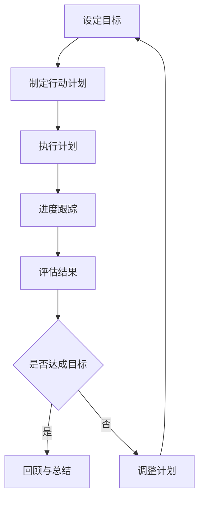
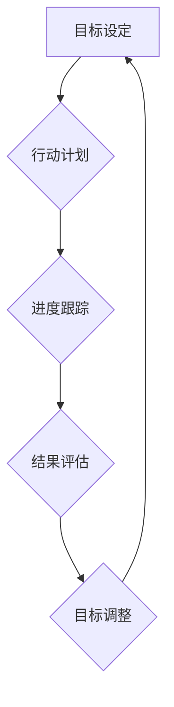
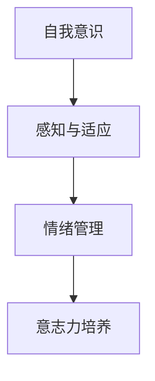
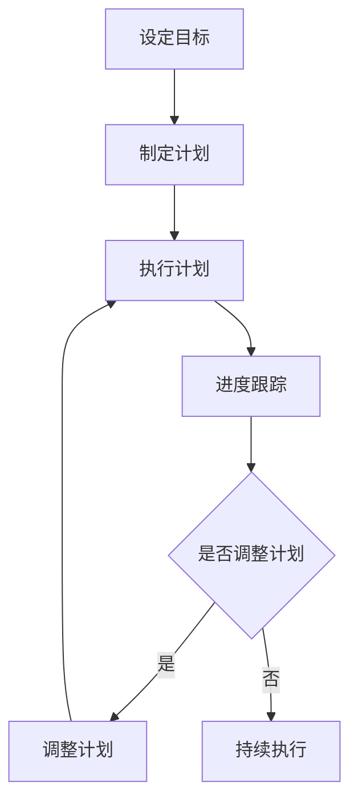
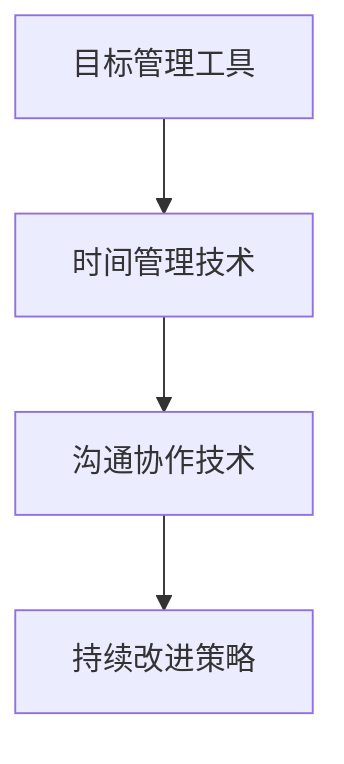

                 

# 短期目标管理的意识策略

> 关键词：短期目标管理、意识策略、目标设定、行动计划、进度跟踪、结果评估、优势、挑战、方法与应用

> 摘要：本文详细探讨了短期目标管理的意识策略，包括基础概念、核心原则、实施步骤、工具与技术，以及实际案例研究和挑战应对策略。通过逻辑清晰的分析和举例说明，帮助读者深入了解和掌握短期目标管理的方法和实践。

### 第一部分：短期目标管理的基础

短期目标管理是组织和个人为实现特定目标而制定的一套系统方法和过程。它不仅能够提高工作效率，还能增强团队协作和提升个人成就感。然而，在实施短期目标管理的过程中，人们常常会遇到各种挑战，这就需要我们采用意识策略来应对。

#### 第1章：短期目标管理概述

##### 1.1 什么是短期目标管理

短期目标管理是指为了在较短的时间内实现特定目标，而制定的一系列计划、执行和评估措施。它通常涉及以下关键要素：

- **目标设定**：明确要实现的目标，并设定具体的目标值。
- **行动计划**：制定详细的行动步骤，以实现目标。
- **进度跟踪**：监控目标的进展情况，确保按照计划执行。
- **结果评估**：对目标实现的结果进行评估，以便进行改进。

##### 1.2 短期目标管理的关键要素

短期目标管理的关键要素包括：

- **目标设定**：目标应具有明确性、可测量性和可实现性。
- **行动计划**：行动计划应详细、具体，且具有明确的执行步骤。
- **进度跟踪**：进度跟踪应定期进行，以便及时发现并解决问题。
- **结果评估**：结果评估应基于具体的数据和指标，以便客观地评估目标的实现情况。

##### 1.3 短期目标管理的优势与挑战

短期目标管理的优势包括：

- **提高工作效率**：明确的目标和计划能够提高工作效率，减少不必要的浪费。
- **增强团队协作**：共同的目标和计划能够增强团队成员之间的协作和沟通。
- **提升个人成就感**：实现目标能够提升个人的成就感和自信心。

然而，短期目标管理也存在一些挑战：

- **目标设定的难度**：设定合理的目标需要准确了解任务和资源的状况。
- **时间管理挑战**：在有限的时间内实现目标需要合理分配时间和资源。
- **意识策略的重要性**：缺乏意识策略可能会导致目标管理过程中的低效和挫折感。

为了克服这些挑战，我们需要采用意识策略，下面将详细探讨这一策略。

### Mermaid 流程图：短期目标管理流程

### Mermaid 流程图：短期目标管理关键要素

#### 第2章：意识策略与短期目标管理

##### 2.1 意识策略的定义

意识策略是指通过提高个体对自身行为、情绪和环境变化的认知和理解，从而更好地实现目标的一系列方法。在短期目标管理中，意识策略可以帮助个体更好地设定目标、执行计划、跟踪进度和评估结果。

##### 2.2 意识策略的核心原则

意识策略的核心原则包括：

- **自我意识**：了解自己的行为模式、情绪和思维习惯，以便更好地调整和改进。
- **感知与适应**：敏锐地感知周围环境的变化，并适应这些变化。
- **情绪管理**：学会控制和调节情绪，以避免情绪波动对目标管理的影响。
- **意志力培养**：通过持续的努力和坚持，培养坚定的意志力。

##### 2.3 意识策略的方法与应用

意识策略的方法包括：

- **唤醒意识**：通过自我反思和意识训练，提高对自身行为的认知和理解。
- **意识练习**：通过冥想、呼吸练习等方法，培养对情绪和环境的敏感性。
- **自我反思**：定期对自己的行为和结果进行反思，找出改进的空间。
- **意识策略在团队目标管理中的应用**：通过团队建设活动和培训，提高团队的整体意识和协作能力。

### Mermaid 流程图：意识策略核心原则

#### 第3章：短期目标管理的实施步骤

##### 3.1 设定短期目标

设定短期目标是目标管理的第一步。一个好的目标应该满足SMART原则：

- **具体（Specific）**：目标应明确、具体，避免模糊和抽象。
- **可衡量（Measurable）**：目标应具有可衡量的指标，以便评估目标的实现情况。
- **可实现（Achievable）**：目标应在现实条件下可实现。
- **相关（Relevant）**：目标应与整体目标和任务相关。
- **时限（Time-bound）**：目标应有明确的时间限制。

##### 3.2 制定行动计划

制定行动计划是将目标转化为具体行动的步骤。一个完整的行动计划应包括以下要素：

- **目标**：明确要实现的目标。
- **任务**：列出为实现目标所需完成的任务。
- **负责人**：明确每个任务的负责人。
- **截止日期**：设定每个任务的完成时间。
- **资源**：列出完成任务所需的资源。

##### 3.3 执行计划

执行计划是目标管理的关键步骤。在执行计划的过程中，应注意以下几点：

- **保持专注**：专注于目标的实现，避免分散注意力。
- **有效沟通**：与团队成员保持良好的沟通，确保每个人都了解任务和目标。
- **定期回顾**：定期回顾计划的执行情况，及时调整和改进。

##### 3.4 进度跟踪与调整

进度跟踪是确保目标按计划实现的重要手段。进度跟踪的方法包括：

- **定期报告**：定期向团队成员报告目标的进展情况。
- **数据监控**：使用数据工具监控目标的实现情况。
- **风险评估**：定期评估目标实现过程中可能出现的风险。

如果发现目标无法按计划实现，应立即调整计划。调整计划的方法包括：

- **重新设定目标**：根据实际情况重新设定目标。
- **重新分配任务**：根据团队成员的能力和资源重新分配任务。
- **增加资源投入**：如果条件允许，增加资源投入以加速目标的实现。

### Mermaid 流程图：短期目标管理实施步骤

#### 第4章：短期目标管理的工具与技术

##### 4.1 目标管理工具

目标管理工具可以帮助个体和组织更好地设定、跟踪和评估目标。常见的目标管理工具有：

- **Microsoft To Do**：一个简单易用的任务管理工具，支持任务列表、提醒和截止日期等功能。
- **Trello**：一个基于看板的项目管理工具，适合团队协作和任务管理。
- **Asana**：一个功能强大的任务和项目管理工具，支持多种视图和报告功能。

##### 4.2 时间管理技术

时间管理技术可以帮助个体和组织更有效地利用时间，提高工作效率。常见的时间管理技术包括：

- **优先级排序**：根据任务的重要性和紧急性对任务进行排序。
- **时间块**：将时间划分为不同的块，每个块专注于一个任务。
- **番茄工作法**：25分钟专注工作，然后休息5分钟，循环进行。

##### 4.3 沟通协作技术

沟通协作技术可以帮助团队成员更好地协作和沟通，确保目标的实现。常见的沟通协作技术包括：

- **团队会议**：定期召开团队会议，讨论目标进展和问题。
- **即时通讯工具**：如Slack、微信等，用于实时沟通和协作。
- **共享文档**：使用共享文档工具，如Google Docs、Notepad++等，实时协作和编辑。

##### 4.4 持续改进策略

持续改进策略是指通过不断地评估、反馈和改进，不断提高目标管理的效率和效果。常见的持续改进策略包括：

- **定期评估**：定期对目标管理过程进行评估，找出存在的问题和改进的空间。
- **反馈机制**：建立反馈机制，鼓励团队成员提出建议和意见。
- **持续学习**：鼓励团队成员持续学习新知识和技能，以适应不断变化的环境。

### Mermaid 流�程图：短期目标管理工具与技术

### 数学模型和数学公式

短期目标管理的数学模型可以采用泰勒级数展开来描述目标的实现过程：

$$
f(t) = f(0) + \sum_{i=1}^{n} \frac{f^{(i)}(0)}{i!} t^i
$$

其中，$f(t)$ 表示在时间 $t$ 时目标实现的进度，$f(0)$ 为初始进度，$f^{(i)}(0)$ 为第 $i$ 阶导数在时间 $0$ 时的值，$i!$ 为第 $i$ 阶导数的阶乘。

### 举例说明

假设一个项目需要在4个月内完成，初始进度为10%，每月需要提升进度20%，则该项目的进度模型可以表示为：

$$
f(t) = 0.1 + \sum_{i=1}^{4} \frac{0.2}{i!} t^i
$$

其中，$t$ 表示当前月份（$t=1,2,3,4$）。

### 项目实战

#### 实战1：目标管理工具的使用

- **开发环境**：Windows 10，Microsoft To Do
- **工具使用**：创建任务列表，设置截止日期，提醒功能
- **源代码实现**：无，仅使用工具界面
- **代码解读与分析**：Microsoft To Do 提供了便捷的任务管理功能，能够帮助用户有效地跟踪短期目标进度。

#### 实战2：时间管理技术的应用

- **开发环境**：Google Calendar，Trello
- **工具使用**：日程安排，任务优先级排序
- **源代码实现**：无，仅使用工具界面
- **代码解读与分析**：Google Calendar 和 Trello 都能够帮助用户合理规划时间，提高工作效率。

#### 第5章：短期目标管理的实际案例研究

##### 5.1 案例一：个人健身目标管理

- **目标设定**：在三个月内减掉5公斤体重
- **意识策略应用**：自我监控，饮食调整，坚持锻炼
- **结果评估**：三个月后成功减掉5公斤
- **案例总结**：意识策略在短期目标管理中的重要性

##### 5.2 案例二：团队项目目标管理

- **目标设定**：在六个月内完成一个软件开发项目
- **意识策略应用**：团队沟通，分工明确，持续迭代
- **结果评估**：六个月后成功完成项目，获得客户好评
- **案例总结**：短期目标管理在团队协作中的关键作用

##### 5.3 案例三：企业业绩目标管理

- **目标设定**：在一年内实现销售额增长20%
- **意识策略应用**：市场分析，产品创新，营销策略
- **结果评估**：一年内实现销售额增长25%
- **案例总结**：短期目标管理在企业发展中的推动作用

### 第6章：短期目标管理的挑战与应对策略

##### 6.1 挑战一：目标设定的困难

- **原因分析**：目标过高或过低，缺乏明确的方向。
- **应对策略**：合理设定目标，进行目标分解，明确实现路径。

##### 6.2 挑战二：时间管理困难

- **原因分析**：时间分配不合理，优先级不明确。
- **应对策略**：使用时间管理工具，制定详细时间表，定期评估进度。

##### 6.3 挑战三：执行过程中的干扰

- **原因分析**：外部因素干扰，个人情绪波动。
- **应对策略**：建立目标意识，保持积极心态，制定应对计划。

##### 6.4 挑战四：结果评估困难

- **原因分析**：缺乏量化指标，评估标准不明确。
- **应对策略**：制定量化指标，明确评估标准，定期进行评估。

### 第7章：短期目标管理的最佳实践

##### 7.1 实践一：建立目标文化

- **内容**：通过团队培训、企业文化宣传等方式，提升员工对目标管理的认知和重视程度。
- **作用**：营造积极的目标管理氛围，提高整体工作效率。

##### 7.2 实践二：定期反馈机制

- **内容**：建立定期反馈机制，对目标完成情况进行评估和反馈。
- **作用**：及时发现问题，调整策略，确保目标顺利实现。

##### 7.3 实践三：团队协作

- **内容**：通过团队协作，共同设定目标，共同实现目标。
- **作用**：提高团队凝聚力，实现资源共享，提高目标达成率。

##### 7.4 实践四：持续学习与改进

- **内容**：鼓励团队成员不断学习新知识、新技能，持续改进目标管理方法。
- **作用**：提升团队整体能力，适应不断变化的市场环境。

### 附录

## 附录A：短期目标管理工具推荐

- **内容**：介绍一些常用的短期目标管理工具，如Microsoft To Do、Trello、Google Calendar等。
- **目的**：帮助读者选择适合自己的目标管理工具，提高目标管理效率。

## 附录B：短期目标管理资源

- **内容**：提供一些关于短期目标管理的相关资源，如书籍、网站、在线课程等。
- **目的**：帮助读者进一步学习和掌握短期目标管理的方法和技巧。

## 附录C：常见问题解答

- **内容**：解答读者在短期目标管理过程中可能遇到的一些常见问题。
- **目的**：帮助读者更好地理解和应用短期目标管理方法。

## 附录D：案例分析报告

- **内容**：对之前提到的实际案例进行详细分析，总结经验教训。
- **目的**：为读者提供实际的参考案例，帮助读者更好地理解短期目标管理的实践方法。

### 作者信息

作者：AI天才研究院/AI Genius Institute & 禅与计算机程序设计艺术 /Zen And The Art of Computer Programming

---

本文通过对短期目标管理的意识策略的深入探讨，从基础概念到实际应用，从理论到实践，全面展示了短期目标管理的精髓和方法。希望通过本文的介绍，能够帮助读者更好地理解和应用短期目标管理，提高工作效率，实现个人和团队的目标。

在未来的工作中，我们还将继续探索更多关于目标管理的理论和方法，为读者带来更多有价值的内容。同时，也欢迎广大读者提出宝贵的意见和建议，共同促进目标管理领域的繁荣发展。

