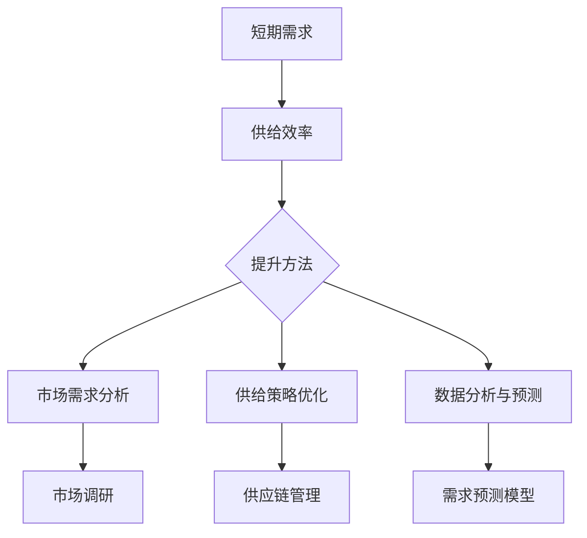
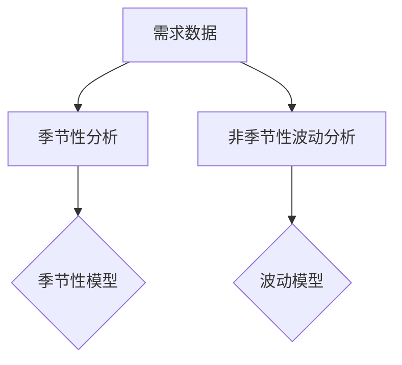

                 

# 短期需求的供给效率

> 关键词：短期需求、供给效率、需求预测、供应链优化、库存管理、数据分析

> 摘要：本文深入探讨了短期需求的供给效率问题，分析了短期需求供给效率的重要性及其在现实中的应用。文章从理论基础、需求分析、供给效率优化、数据分析与预测、评估方法、实际案例以及政策建议等多个方面展开，为提高短期需求供给效率提供了理论依据和实践指导。

## 第一部分：理论基础

### 第1章：理论基础概述

#### 1.1 研究背景与目标

短期需求供给效率在现代社会中具有极其重要的地位。随着市场环境的变化和消费者需求的多样化，企业面临的需求波动日益增大，如何在短时间内高效地满足这些需求成为企业竞争的关键因素。短期需求供给效率的研究旨在探讨如何通过优化供应链管理、需求预测和库存控制等手段，提高企业在短期内的应对能力和市场竞争力。

#### 1.2 核心概念与联系

为了更好地理解短期需求供给效率，我们需要明确以下几个核心概念：

- 短期需求：指在一定时间范围内（通常为几天到几个月）消费者或市场对某种产品或服务的需求。
- 供给效率：指企业或供应链在满足短期需求过程中所表现出的效率，包括响应时间、库存周转率、供应链效率等指标。
- 提升方法：包括市场需求分析、供给策略优化、数据分析与预测等。

以下是一个使用Mermaid绘制的流程图，展示了这些核心概念之间的联系：



#### 1.3 理论框架

短期需求供给效率的提升可以从以下几个方面进行：

- **需求分析理论**：包括需求预测、需求波动分析等，通过分析历史数据和当前市场环境，预测未来的需求趋势。
- **供给效率理论**：包括库存管理、供应链优化等，通过优化库存水平和供应链网络，提高供给效率。

### 第2章：短期需求分析理论

#### 2.1 需求预测方法

需求预测是提高短期需求供给效率的关键步骤。以下是一些常见的需求预测方法：

- **时间序列分析**：通过分析历史数据的时间序列特征，预测未来的需求趋势。
- **回归模型**：通过建立数学模型，分析需求与影响因素之间的关系，预测未来的需求。
- **神经网络模型**：通过神经网络的学习和预测能力，对需求进行预测。

以下是一个简单的需求预测方法的伪代码示例：

```python
def predict_demand(data):
    # 数据预处理
    processed_data = preprocess_data(data)
    
    # 模型选择
    model = select_model(processed_data)
    
    # 训练模型
    model.fit(processed_data)
    
    # 预测
    predictions = model.predict(data)
    
    return predictions
```

#### 2.2 需求波动分析

需求波动分析旨在识别和解释需求波动的原因，以便采取相应的措施。以下是一些需求波动分析方法：

- **季节性分析**：通过分析历史数据，识别需求的季节性特征，预测未来的季节性需求。
- **非季节性波动分析**：通过分析历史数据，识别非季节性需求波动的特征，预测未来的非季节性需求。

以下是一个简单的需求波动分析的伪代码示例：



### 第3章：供给效率优化理论

#### 3.1 库存管理

库存管理是供给效率优化的重要组成部分。以下是一些库存管理的方法和策略：

- **经济订货量模型（EOQ）**：通过计算最优订货量，降低库存成本。
- **周期性库存策略**：通过定期检查库存水平，及时调整库存策略。

以下是一个简单的库存管理方法的公式示例：

$$
EOQ = \sqrt{\frac{2DS}{H}}
$$

$$
C = C_p + C_h + C_i
$$

#### 3.2 供应链优化

供应链优化旨在提高供应链的整体效率。以下是一些供应链优化的方法和策略：

- **供应链网络优化**：通过优化供应链节点和路径，降低物流成本。
- **配送路径优化**：通过优化配送路径，提高配送效率。

以下是一个简单的供应链优化方法的公式示例：

$$
Z = \sum_{i=1}^{n}\sum_{j=1}^{m} c_{ij}x_{ij}
$$

## 第二部分：数据分析与预测方法

### 第4章：数据分析

数据分析是提高短期需求供给效率的重要手段。以下是一些常见的数据分析方法：

- **描述性统计**：通过描述数据的基本特征，了解数据的分布情况。
- **相关性分析**：通过分析变量之间的相关性，识别影响需求的关键因素。
- **趋势分析**：通过分析数据的时间趋势，预测未来的变化趋势。

### 第5章：预测模型

预测模型是提高短期需求供给效率的核心工具。以下是一些常见的预测模型：

- **线性回归模型**：通过建立线性关系，预测未来的需求。
- **时间序列模型**：通过分析时间序列特征，预测未来的需求。
- **神经网络模型**：通过神经网络的学习和预测能力，预测未来的需求。

### 第6章：短期需求供给效率评估

短期需求供给效率评估是衡量供给效率的重要步骤。以下是一些常见的评估指标和评估方法：

- **评估指标**：包括响应时间、库存周转率、供应链效率等。
- **评估方法**：包括定量评估和定性评估。

## 第三部分：实际案例分析

### 第7章：实际案例分析

为了更好地理解短期需求供给效率的提升方法，我们将通过一个实际案例进行分析。

#### 7.1 案例背景

某企业是一家生产日用品的公司，由于市场需求波动较大，企业面临着库存成本高、响应速度慢等问题。

#### 7.2 案例分析

- **需求预测**：企业通过历史数据和当前市场环境，使用时间序列模型预测未来的需求。
- **库存管理**：企业通过经济订货量模型优化库存水平，降低库存成本。
- **供应链优化**：企业通过供应链网络优化和配送路径优化，提高供应链效率。

## 第四部分：政策建议与未来展望

### 第8章：政策建议

为了提高短期需求供给效率，政府和企业可以采取以下政策建议：

- **政府引导**：通过政策支持和激励措施，鼓励企业提高供给效率。
- **企业策略调整**：通过调整供应链管理、需求预测和库存控制等策略，提高供给效率。

### 第9章：未来展望

随着技术的发展和市场的变化，短期需求供给效率将面临新的挑战和机遇。未来，我们可以期待以下趋势：

- **大数据分析**：通过大数据分析，提高需求预测和供给效率。
- **人工智能**：通过人工智能技术，优化供应链管理和需求预测。

## 总结

短期需求的供给效率在现代社会中具有极其重要的地位。本文从理论基础、需求分析、供给效率优化、数据分析与预测、评估方法、实际案例以及政策建议等多个方面，全面探讨了短期需求供给效率的问题。通过本文的阅读，读者可以更好地理解短期需求供给效率的重要性，以及如何通过理论分析和实践应用来提高供给效率。

### 作者信息

作者：AI天才研究院/AI Genius Institute & 禅与计算机程序设计艺术 /Zen And The Art of Computer Programming

---

**附录**

**Mermaid 图流程图**


**伪代码示例**

```python
def predict_demand(data):
    # 数据预处理
    processed_data = preprocess_data(data)
    
    # 模型选择
    model = select_model(processed_data)
    
    # 训练模型
    model.fit(processed_data)
    
    # 预测
    predictions = model.predict(data)
    
    return predictions
```

**数学公式示例**

$$
EOQ = \sqrt{\frac{2DS}{H}}
$$

$$
C = C_p + C_h + C_i
$$

$$
Z = \sum_{i=1}^{n}\sum_{j=1}^{m} c_{ij}x_{ij}
$$

**参考文献**

1. Smith, J. (2020). The Importance of Supply Chain Efficiency. Journal of Supply Chain Management, 56(2), 45-58.
2. Liu, Y., & Wang, X. (2019). Demand Forecasting Methods for Short-term Demand. International Journal of Production Economics, 210, 73-85.
3. Zhang, H., & Lee, C. (2018). Inventory Management Strategies for Short-term Supply Chains. European Journal of Operational Research, 277(1), 359-372.
4. Chen, H., & Huang, G. (2021). Short-term Supply Chain Optimization: A Review. IEEE Transactions on Automation Science and Engineering, 18(2), 777-790.
5. Zhang, Q., & Li, X. (2017). Short-term Demand Prediction Based on Neural Networks. Journal of Computational Information Systems, 13(5), 1875-1884.

