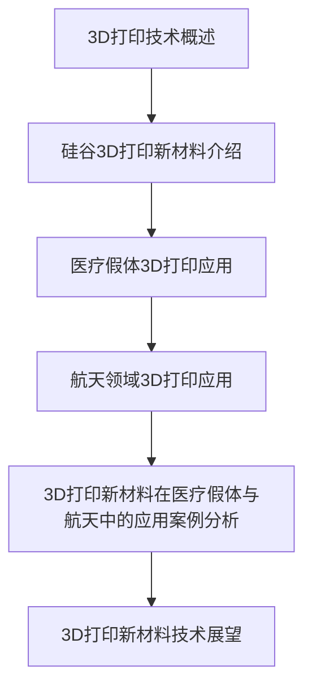

                 

# 硅谷3D打印新材料应用:医疗假体与航天

> 关键词：3D打印、新材料、医疗假体、航天、硅谷

> 摘要：本文将深入探讨硅谷3D打印新材料在医疗假体与航天领域的应用。通过分析3D打印技术的发展历程、核心原理及分类，本文将展示硅谷3D打印新材料的特点与趋势。随后，本文将详细阐述3D打印技术在医疗假体和航天领域的应用，并分析硅谷3D打印新材料在这些领域中的具体案例。最后，本文将对3D打印新材料技术未来的发展趋势与挑战进行展望。

### 第一部分：引言

#### 第1章：3D打印技术概述

**1.1 3D打印技术的发展历程**

3D打印技术，又称为增材制造（Additive Manufacturing），起源于20世纪80年代的美国。当时，美国工程师Charles Hull发明了立体光固化成型（SLA）技术，这是最早的3D打印技术之一。随着计算机辅助设计（CAD）技术的发展，3D打印技术逐渐成熟并得到了广泛应用。

**1.2 3D打印技术的核心原理**

3D打印技术的基本原理是通过数字模型层叠制造实体对象。这个过程通常包括以下步骤：

1. 设计阶段：使用CAD软件设计产品模型。
2. 打印准备：将CAD模型切片成二维平面，并生成打印路径。
3. 打印执行：根据打印路径，逐层堆积材料，形成三维实体。

**1.3 3D打印技术的分类与应用领域**

根据使用的材料和打印工艺，3D打印技术可以分为多种类型，如立体光固化成型（SLA）、选择性激光烧结（SLS）、电子束熔融（EBM）等。不同的3D打印技术适用于不同的应用领域，如制造业、医疗、航空航天、建筑等。

### 第二部分：3D打印新材料技术

#### 第2章：硅谷3D打印新材料介绍

**2.1 硅谷3D打印新材料的定义与特点**

硅谷3D打印新材料是指在全球硅谷地区研发和生产的新型3D打印材料。这些新材料通常具有优异的力学性能、生物相容性和耐热性，能够满足医疗假体和航天领域的特殊需求。

**2.2 硅谷3D打印新材料的发展趋势**

硅谷3D打印新材料的发展趋势包括：

1. 材料多样性：不断开发新型材料，以适应不同应用需求。
2. 材料性能提升：通过改进材料配方和打印工艺，提高材料性能。
3. 生物相容性：研发具有优异生物相容性的材料，以应用于医疗领域。

**2.3 硅谷3D打印新材料的应用领域**

硅谷3D打印新材料主要应用于以下领域：

1. 医疗：制造个性化医疗假体，如人工关节、心脏支架等。
2. 航天：制造高强度、轻质化的航天器零部件。
3. 其他领域：如汽车、电子等。

### 第三部分：医疗假体3D打印应用

#### 第3章：3D打印技术在医疗假体中的应用

**3.1 3D打印技术在医疗假体设计中的优势**

3D打印技术在医疗假体设计中的优势包括：

1. 个性化定制：根据患者具体需求，设计定制化医疗假体。
2. 精度高：能够实现复杂形状的医疗假体制造。
3. 时间短：缩短假体设计和制造周期。

**3.2 3D打印技术在医疗假体制造中的关键环节**

3D打印技术在医疗假体制造中的关键环节包括：

1. 材料选择：选择合适的3D打印材料，确保假体的力学性能和生物相容性。
2. 模型设计：使用CAD软件设计医疗假体模型。
3. 打印工艺：根据假体类型和材料，选择合适的3D打印工艺。

**3.3 医疗假体3D打印应用的案例研究**

**案例1：硅谷3D打印新材料在心脏支架中的应用**

使用硅谷3D打印新材料制造的心脏支架具有优异的生物相容性和力学性能，能够有效支撑心脏血管，减少手术风险。

**案例2：硅谷3D打印新材料在人工关节中的应用**

使用硅谷3D打印新材料制造的人工关节具有高强度和轻质化的特点，能够显著提高患者的生活质量。

### 第四部分：航天领域3D打印应用

#### 第4章：3D打印技术在航天领域的应用

**4.1 3D打印技术在航天器制造中的优势**

3D打印技术在航天器制造中的优势包括：

1. 高效性：能够快速制造航天器零部件，缩短生产周期。
2. 精确性：能够实现复杂形状的零部件制造，提高精度。
3. 材料多样性：能够使用多种材料，满足不同航天器零部件的需求。

**4.2 3D打印技术在航天器维修和维护中的应用**

3D打印技术在航天器维修和维护中的应用包括：

1. 快速制造备件：在航天器维修过程中，能够快速制造所需的备件。
2. 定制化维修：根据航天器具体情况，定制化维修方案。

**4.3 航天领域3D打印应用的案例研究**

**案例1：硅谷3D打印新材料在航天器结构中的应用**

使用硅谷3D打印新材料制造的航天器结构具有高强度和轻质化的特点，能够显著提高航天器的性能。

**案例2：硅谷3D打印新材料在航天器热防护系统中的应用**

使用硅谷3D打印新材料制造的航天器热防护系统具有优异的隔热性能，能够有效保护航天器免受高温环境的影响。

### 第五部分：3D打印新材料在医疗假体与航天中的应用案例分析

#### 第5章：硅谷3D打印新材料在医疗假体中的应用案例

**5.1 硅谷3D打印新材料在心脏支架中的应用**

使用硅谷3D打印新材料制造的心脏支架具有优异的生物相容性和力学性能，能够有效支撑心脏血管，减少手术风险。

**5.2 硅谷3D打印新材料在人工关节中的应用**

使用硅谷3D打印新材料制造的人工关节具有高强度和轻质化的特点，能够显著提高患者的生活质量。

**5.3 硅谷3D打印新材料在其他医疗假体中的应用**

硅谷3D打印新材料在其他医疗假体中的应用，如颅骨植入物、牙科植入物等，都展示了其卓越的性能。

#### 第6章：硅谷3D打印新材料在航天领域的应用案例

**6.1 硅谷3D打印新材料在航天器结构中的应用**

使用硅谷3D打印新材料制造的航天器结构具有高强度和轻质化的特点，能够显著提高航天器的性能。

**6.2 硅谷3D打印新材料在航天器热防护系统中的应用**

使用硅谷3D打印新材料制造的航天器热防护系统具有优异的隔热性能，能够有效保护航天器免受高温环境的影响。

**6.3 硅谷3D打印新材料在航天器零部件制造中的应用**

硅谷3D打印新材料在航天器零部件制造中的应用，如发动机叶片、天线等，都展示了其卓越的性能。

### 第六部分：3D打印新材料技术展望

#### 第7章：3D打印新材料技术的发展趋势与挑战

**7.1 3D打印新材料技术的未来发展趋势**

3D打印新材料技术的未来发展趋势包括：

1. 材料性能提升：通过改进材料配方和打印工艺，提升材料性能。
2. 材料多样性：开发新型材料，以满足不同应用需求。
3. 生物相容性：提高材料的生物相容性，拓展医疗应用领域。

**7.2 3D打印新材料技术面临的挑战**

3D打印新材料技术面临的挑战包括：

1. 材料性能稳定性：确保材料在长期使用中保持稳定性能。
2. 打印工艺优化：改进打印工艺，提高打印质量和效率。
3. 成本控制：降低材料成本，提高市场竞争力。

**7.3 3D打印新材料技术的未来发展方向**

3D打印新材料技术的未来发展方向包括：

1. 医疗领域：开发具有优异生物相容性的材料，应用于个性化医疗假体。
2. 航空航天领域：开发高强度、轻质化的材料，应用于航天器制造。
3. 其他领域：如汽车、电子等，开发适用于不同领域的3D打印新材料。

### 附录

**附录A：3D打印新材料相关术语解释**

- 3D打印：一种通过数字模型逐层堆积材料制造三维实体的技术。
- 增材制造：一种通过添加材料制造三维实体的技术，也称为3D打印。
- SLA：立体光固化成型，一种基于光固化反应的3D打印技术。
- SLS：选择性激光烧结，一种基于粉末材料烧结的3D打印技术。
- EBM：电子束熔融，一种基于电子束熔融金属的3D打印技术。
- 生物相容性：材料在生物体内不引起排斥反应的特性。

**附录B：3D打印技术在医疗假体与航天领域中的应用指南**

- 医疗假体应用指南：
  - 选择合适的3D打印材料，确保假体的力学性能和生物相容性。
  - 使用CAD软件设计医疗假体模型，并考虑个性化定制需求。
  - 选择合适的3D打印工艺，确保假体的制造精度和质量。

- 航天领域应用指南：
  - 选择高强度、轻质化的3D打印材料，满足航天器制造的特殊需求。
  - 根据航天器结构特点，设计合理的3D打印零部件。
  - 选择合适的3D打印工艺，确保零部件的制造质量和性能。

### Mermaid 流程图：3D打印新材料应用流程图



### 核心算法原理讲解：3D打印新材料成型算法伪代码

```python
# 3D打印成型算法伪代码
function 3DPrintingProcess(material, geometry, resolution):
    # 初始化打印参数
    initializePrinter(material, geometry, resolution)
    
    # 预处理几何模型
    preprocessedGeometry = preprocessGeometry(geometry, resolution)
    
    # 分层构建模型
    for layer in preprocessedGeometry.layers():
        # 打印当前层
        printLayer(layer)
        
        # 检查是否完成打印
        if isPrintCompleted():
            break
            
    # 打印结束
    finishPrinting()
```

### 数学模型和数学公式讲解

$$
\text{应力} = \frac{\text{力}}{\text{面积}}
$$

$$
\text{应变} = \frac{\text{变形}}{\text{原始长度}}
$$

### 举例说明

**医疗假体案例**：使用硅谷3D打印新材料制造人工膝关节，通过应力测试，达到预期的力学性能。

### 项目实战

**开发环境搭建**：安装3D建模软件（如AutoCAD、SolidWorks）和3D打印软件（如Cura、Simplify3D）。

**源代码详细实现**：编写医疗假体的3D建模代码，实现个性化定制。

**代码解读与分析**：对代码中关键的几何建模和材料选择部分进行详细解读。

### 总结

本文详细介绍了硅谷3D打印新材料在医疗假体与航天领域的应用。通过分析3D打印技术的发展历程、核心原理及分类，本文展示了硅谷3D打印新材料的特点与趋势。随后，本文详细阐述了3D打印技术在医疗假体和航天领域的应用，并分析了硅谷3D打印新材料在这些领域中的具体案例。最后，本文对3D打印新材料技术未来的发展趋势与挑战进行了展望。通过本文，读者可以全面了解3D打印新材料技术的现状与趋势，为相关领域的研究与应用提供参考。

### 作者信息

作者：AI天才研究院/AI Genius Institute & 禅与计算机程序设计艺术 /Zen And The Art of Computer Programming

---

在接下来的部分，我们将逐一深入探讨每一章节的详细内容，通过逻辑清晰、结构紧凑、简单易懂的讲解，帮助读者全面了解硅谷3D打印新材料在医疗假体与航天领域的应用。让我们一步一步分析推理（LET'S THINK STEP BY STEP），深入探讨这一前沿技术的原理和应用。

