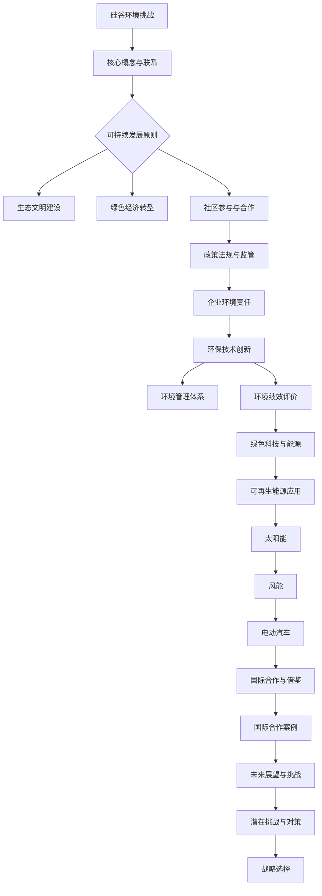

                 

### 文章标题

《硅谷的环境挑战：可持续发展之路》

### 关键词

硅谷，环境挑战，可持续发展，绿色科技，企业责任，国际合作

### 摘要

本文以硅谷地区为核心，深入探讨其在快速发展的同时面临的环境挑战。通过分析空气质量、水资源、噪音污染等环境问题，结合硅谷经济与环境的关系，揭示了环境问题对区域发展的潜在威胁。文章从可持续发展原则出发，探讨了硅谷在生态文明建设、绿色经济转型、社区参与与合作等方面的可持续发展路径，提出了政策法规与监管、企业环境责任、绿色科技与能源应用等方面的具体策略。同时，本文还分析了社区行动与国际合作在硅谷环境可持续发展中的作用，并展望了未来硅谷环境可持续发展的趋势与挑战。通过系统性的分析，本文旨在为硅谷以及全球高科技区域的环境可持续发展提供理论支持和实践借鉴。

### 引言

#### 书籍背景及目的

硅谷，作为全球科技创新的摇篮，近年来取得了令人瞩目的成就。从硅芯片到人工智能，从互联网到生物科技，硅谷不断推动着全球科技的发展。然而，随着经济的快速发展和人口的不断增长，硅谷也面临着日益严峻的环境挑战。空气质量恶化、水资源短缺、噪音污染等问题不仅威胁着当地居民的生活质量，也对生态系统的健康和区域的可持续发展构成严重威胁。

本篇文章旨在深入探讨硅谷所面临的环境挑战，分析其根源，并提出可行的可持续发展策略。文章的结构分为以下几个部分：首先，概述硅谷环境现状，包括空气质量、水资源、噪音污染等具体问题；其次，探讨硅谷经济与环境的关系，分析环境问题对经济发展的潜在影响；接着，提出可持续发展原则和目标，为后续的可持续发展路径探讨提供理论基础；然后，从生态文明建设、绿色经济转型、社区参与与合作等方面，详细探讨硅谷的可持续发展路径；随后，分析企业环境责任，探讨企业在环境可持续性中的角色和责任；接下来，探讨绿色科技与能源在硅谷的应用，以及社区行动与国际合作在硅谷环境可持续发展中的作用；最后，展望硅谷环境可持续发展的未来趋势与挑战，并提出相应的对策。

通过系统性的分析，本文希望为硅谷以及全球高科技区域的环境可持续发展提供理论支持和实践借鉴，促使科技与自然和谐共处，实现可持续发展目标。

#### 硅谷环境挑战概述

硅谷位于美国加利福尼亚州旧金山湾区南部，以其丰厚的科技资源和创新氛围而闻名于世。然而，在这片繁荣的土地下，环境挑战如影随形，严重制约了其可持续发展。以下是硅谷所面临的主要环境问题及其具体表现：

**1. 空气质量**

硅谷的空气质量问题尤为突出。由于大量工业和交通活动，该地区空气中的颗粒物、氮氧化物和挥发性有机化合物等污染物浓度长期超标。尤其是在交通高峰期，车辆尾气排放和工业废气排放使得空气质量进一步恶化。长期暴露在污染环境中，居民的健康受到严重影响，包括呼吸系统疾病和心血管疾病的发病率上升。

**2. 水资源**

硅谷地处地中海气候区，降水量较少，水资源相对匮乏。此外，由于城市化进程加速，水资源的供需矛盾日益突出。硅谷的许多地区面临水资源短缺问题，尤其是在干旱季节，水资源紧张状况更为明显。这不仅影响了居民的生活质量，也对农业、工业等经济活动产生了不利影响。

**3. 噪音污染**

硅谷地区的噪音污染问题也不容忽视。交通繁忙的街道、机场、铁路和工业园区等都是噪音的主要来源。长期的噪音污染对居民的生活质量、心理健康和睡眠质量产生了负面影响。此外，噪音污染也对野生动物和生态系统造成了干扰，影响了生物多样性的维持。

**4. 土壤污染**

硅谷的部分地区存在土壤污染问题，尤其是历史上的一些工业区和废弃地。工业废弃物和化学物质泄漏导致了土壤中有害物质的积累，这些有害物质不仅对土壤质量造成影响，还可能通过食物链影响到人类健康。

**5. 温室气体排放**

硅谷的温室气体排放问题严重。科技产业的快速发展带来了大量的能源消耗和碳排放，尤其是数据中心的能源消耗和碳排放问题尤为突出。温室气体的增加加剧了全球气候变化，对生态系统和人类生活产生了深远的影响。

综上所述，硅谷在快速发展的同时面临着多方面的环境挑战。这些问题不仅影响了当地居民的生活质量和健康，也对生态系统的健康和区域的可持续发展构成了严重威胁。因此，探讨硅谷的环境挑战，并提出切实可行的解决方案，对于实现硅谷的可持续发展具有重要意义。

#### 硅谷环境挑战的影响与挑战

硅谷的环境挑战对其经济、社会和生态系统产生了深远的影响和一系列挑战，这些挑战不仅威胁到当地居民的生活质量，也对区域可持续发展的前景提出了严峻考验。

**1. 经济影响**

首先，环境问题对硅谷的经济发展产生了负面影响。空气质量恶化、水资源短缺和噪音污染等环境问题直接影响了员工的生活和工作环境，可能导致员工流失和企业生产效率降低。此外，环境污染和资源短缺增加了企业的运营成本，削弱了硅谷在全球科技竞争中的优势。长期来看，如果这些问题得不到有效解决，硅谷的创新能力和发展潜力可能会受到限制，从而影响其全球科技中心的地位。

**2. 社会影响**

其次，环境问题对社会层面产生了显著的影响。空气污染和水资源短缺对居民健康构成了严重威胁，导致呼吸系统疾病、心血管疾病等发病率上升，增加了医疗负担。噪音污染则影响了居民的生活质量，导致心理健康问题和睡眠障碍。此外，环境问题还加剧了社会不平等，特别是低收入群体和弱势群体更容易受到环境问题的负面影响。这种不平等不仅加剧了社会矛盾，也可能导致社会动荡。

**3. 生态系统影响**

环境问题对硅谷的生态系统造成了严重的破坏。土壤污染、水资源短缺和空气污染等环境问题导致生物多样性的减少，生态系统失衡。这不仅影响了生态系统的健康和稳定，还可能导致生态灾害的发生，如洪水、土地退化等。此外，环境问题还影响到野生动物的生存和栖息地，使得一些物种面临灭绝的风险。

**4. 潜在挑战**

硅谷的环境挑战还带来了一系列潜在挑战。首先是气候变化。硅谷的温室气体排放加剧了全球气候变暖，导致极端天气事件的频率和强度增加。这将对硅谷的气候稳定性、水资源供应和农业产生严重影响。其次，资源枯竭问题日益突出。随着水资源的短缺和能源消耗的增加，硅谷可能面临资源枯竭的风险，这对经济的可持续性提出了严峻挑战。最后，环境法规的日益严格也可能对硅谷的产业发展造成压力，需要企业在环境合规性方面投入更多资源。

**5. 应对策略**

面对这些挑战，硅谷需要采取综合性的策略来应对环境问题。首先，政府和企业需要加大环保投入，推动绿色技术创新，减少污染物排放。其次，需要加强环境监管，制定和执行严格的环境法规，确保企业和个人遵守环保要求。此外，公众参与和教育也至关重要，通过提高公众环保意识和参与度，形成全社会共同参与环境保护的良好氛围。

总之，硅谷的环境挑战对其经济、社会和生态系统带来了深远的影响和一系列挑战。解决这些问题需要政府、企业和公众的共同努力，通过实施可持续发展的策略，实现经济繁荣与生态环境的和谐共处。

#### 可持续发展的概念与意义

可持续发展是指在满足当前需求的同时，不损害后代满足其自身需求的能力的发展模式。这一概念由1987年《我们共同的未来》报告首次提出，并迅速成为全球发展的核心理念。可持续发展强调经济、社会和环境的协调发展，追求经济增长、社会公正和环境保护三者之间的平衡。

对于硅谷这样的高科技区域，可持续发展具有特殊的意义和重要性。首先，可持续发展有助于缓解硅谷的环境问题。通过推动绿色技术创新、减少污染物排放和合理利用资源，硅谷可以在经济发展的同时减轻对环境的压力。其次，可持续发展有助于提升硅谷的竞争力。在全球化背景下，具备环境可持续性的企业更容易获得市场份额和投资，实现长期稳健发展。此外，可持续发展还能增强社区的凝聚力和居民的幸福感，提高生活质量和社会福祉。

总的来说，可持续发展不仅是一种发展理念，更是一种行动指南。通过实施可持续发展策略，硅谷可以走出一条经济繁荣与环境保护双赢的发展道路，为全球高科技区域提供借鉴和示范。

### 硅谷环境现状

硅谷作为全球科技和创新的中心，其环境现状备受关注。以下是硅谷在空气质量、水资源、噪音污染等方面的具体表现和成因。

#### 空气质量

硅谷的空气质量问题尤为严重。主要污染物包括颗粒物（PM2.5和PM10）、氮氧化物（NOx）和挥发性有机化合物（VOCs）。这些污染物主要来自以下几个方面：

1. **交通排放**：硅谷地区交通繁忙，大量私家车和公共交通工具的排放是空气污染的主要来源。特别是在高峰时段，车辆尾气排放加剧了空气污染问题。

2. **工业排放**：硅谷内的众多高科技企业也产生大量的工业废气，包括半导体制造过程中的挥发性有机化合物排放。

3. **建筑施工**：硅谷的城市化进程迅速，大量建筑工地产生大量的扬尘和颗粒物，进一步恶化了空气质量。

4. **能源消耗**：硅谷的数据中心和云计算中心消耗大量能源，产生大量废热和温室气体排放。

#### 水资源

硅谷的水资源状况也面临严峻挑战。主要问题包括：

1. **水资源短缺**：硅谷地处地中海气候区，降水量较少，加上人口密集和城市化进程的加速，导致水资源供需失衡。尤其是在干旱季节，水资源供应更为紧张。

2. **水资源污染**：工业排放和农业使用化肥和农药等化学物质，导致水体污染。此外，垃圾和污水的不当处理也会对水资源造成污染。

3. **地下水过度开采**：为了满足不断增长的水需求，硅谷地区过度依赖地下水，导致地下水位下降，地下水资源逐渐枯竭。

#### 噪音污染

硅谷的噪音污染问题同样不容忽视。主要噪音源包括：

1. **交通噪音**：繁忙的交通道路、高速公路和机场是交通噪音的主要来源。尤其是在市区，交通噪音对居民的生活质量产生了严重影响。

2. **工业噪音**：硅谷的工业园区和制造企业产生的工业噪音也是噪音污染的一个重要来源。

3. **生活噪音**：城市居民区的家庭噪音、商业噪音以及公共活动噪音等也对噪音污染问题做出了贡献。

#### 成因分析

硅谷环境问题的成因复杂多样，主要包括以下几个方面：

1. **快速发展**：硅谷的快速城市化进程和经济增长导致了大量的基础设施建设和工业发展，这在一定程度上加剧了环境问题。

2. **技术密集**：硅谷的高科技产业具有高度的技术密集性和能源消耗特性，这在带来经济利益的同时，也带来了环境压力。

3. **人口密度**：硅谷的人口密度较高，人口快速增长导致对资源的需求增加，进而加剧了环境问题。

4. **政策监管**：虽然硅谷地区在环保政策方面有一定的措施，但整体上，政策执行力度和监管力度仍需加强，以应对日益严峻的环境挑战。

总的来说，硅谷的环境现状是一个复杂的问题，涉及多个方面的因素。要解决这些问题，需要政府、企业和公众的共同努力，通过综合措施来改善空气质量、保障水资源供应和减少噪音污染，实现硅谷的可持续发展。

### 硅谷经济与环境的关系

硅谷作为全球科技创新和经济的领头羊，其经济与环境之间的关系错综复杂，两者相辅相成，却又存在一定的矛盾和挑战。深入理解这种关系，对于制定合理的可持续发展策略具有重要意义。

#### 硅谷经济的重要性

硅谷的经济地位在全球范围内无可替代。它是全球科技产业的核心，拥有众多世界知名的高科技企业和创新公司，如谷歌、苹果、Facebook、特斯拉等。这些公司不仅推动了全球科技革命，也为硅谷带来了巨大的经济收益。据估计，硅谷的GDP占加利福尼亚州GDP的近20%，对美国的整体经济增长也起到了重要推动作用。

硅谷的经济活动不仅带动了本地就业，还吸引了全球优秀人才。这些人才汇聚硅谷，为科技创新提供了源源不断的智力支持。此外，硅谷的创业生态系统和风险投资市场的繁荣，也为全球科技创业提供了示范和引领。

#### 环境对经济的支持

环境是经济发展的基础，良好的生态环境为硅谷的经济繁荣提供了重要的支持。首先，硅谷的自然环境优美，气候宜人，吸引了大量人才和投资者。优美的环境不仅提升了生活质量，也增强了企业的竞争力，吸引了更多的高科技项目和人才落地硅谷。

其次，生态环境的健康发展直接关系到硅谷的可持续创新能力。科技创新需要依赖清洁的空气、丰富的水资源和健康的生态系统。如果环境恶化，不仅会损害居民的健康，还会影响到企业的正常运营和创新能力。

此外，良好的生态环境也是旅游业和农业的重要支撑。硅谷的农业和旅游业虽然相对较小，但也在一定程度上带动了当地经济。如果环境恶化，这些产业的发展也将受到制约。

#### 环境压力对经济的负面影响

然而，硅谷的经济活动也带来了巨大的环境压力。首先，工业和交通排放的污染物严重污染了空气和水资源，影响了居民的健康和生活质量。长期的环境污染不仅增加了医疗成本，还可能导致企业员工流失，降低企业的生产效率。

其次，水资源的短缺和过度开采对农业生产和工业生产产生了负面影响。硅谷的农业和工业用水需求巨大，而水资源的短缺和污染使得这些产业面临巨大的挑战。

此外，噪音污染和土地污染也对硅谷的经济活动产生了负面影响。噪音污染影响了居民的休息和工作，降低了生活质量；土地污染则可能导致土地无法继续使用，从而影响工业和农业的发展。

#### 可持续发展的必要性

鉴于硅谷经济与环境之间的复杂关系，可持续发展成为必然选择。只有实现经济与环境的协调发展，硅谷才能持续繁荣。

首先，通过实施环保政策和技术创新，减少污染物排放，可以改善空气质量、水资源质量和土壤质量，提升居民的生活质量和健康水平。这不仅有助于减少医疗成本，还能提高企业的生产效率和员工的工作积极性。

其次，通过推广绿色经济和循环经济，可以实现资源的可持续利用，减少对自然资源的依赖。硅谷可以通过发展可再生能源、绿色建筑和绿色交通等方式，降低能源消耗和碳排放，实现绿色发展。

此外，加强环境教育和公众参与，提高公众的环保意识，也是实现可持续发展的重要途径。通过公众的积极参与，可以形成全社会共同参与环境保护的良好氛围，推动环保行动的实施。

总之，硅谷经济与环境之间的关系是相辅相成、却又存在挑战的。通过实施可持续发展策略，硅谷可以在实现经济繁荣的同时，保护生态环境，实现经济与环境的协调发展。

### 可持续发展策略

可持续发展的核心原则是满足当前的需求而不损害后代满足其需求的能力。在硅谷这样的高科技区域，实现可持续发展需要从多个方面进行系统性的策略规划和实施。以下是硅谷可持续发展策略的主要方面：

#### 可持续发展原则与目标

1. **公平性**：确保所有群体，尤其是弱势群体，都能公平地享受可持续发展的成果。
2. **包容性**：包容经济、社会和环境的各个方面，推动多元化和均衡发展。
3. **可持续性**：通过合理利用资源、保护生态系统和减少污染，实现长期的经济发展。
4. **创新性**：鼓励技术创新和研发，推动绿色技术和可持续发展解决方案的应用。
5. **参与性**：鼓励公众参与和社区合作，形成全社会共同参与的可持续发展氛围。

具体的可持续发展目标包括：
- **环境保护**：减少污染物排放，提高资源利用效率，保护生物多样性。
- **经济增长**：通过绿色经济和循环经济的发展，实现经济的可持续发展。
- **社会公平**：提高居民的生活质量和健康水平，减少社会不平等。
- **生态恢复**：恢复和修复受损的生态系统，提升生态环境质量。

#### 硅谷可持续发展路径探讨

**1. 生态文明建设**

生态文明建设是实现可持续发展的重要途径。硅谷可以通过以下几个方面推进生态文明建设：
- **绿色建筑**：鼓励绿色建筑设计和施工，提高建筑能效，减少能源消耗和碳排放。
- **绿色交通**：推广电动汽车和公共交通，减少交通污染，改善空气质量。
- **生态城市**：建设生态城市，提升城市绿化覆盖率，改善城市生态环境。

**2. 绿色经济转型**

绿色经济转型是硅谷实现可持续发展的重要方向。以下是一些关键措施：
- **可再生能源**：大力发展太阳能、风能等可再生能源，减少对化石燃料的依赖。
- **循环经济**：推动资源的循环利用，减少废物产生，提高资源利用效率。
- **绿色产业**：发展环保产业和绿色科技，通过技术创新实现经济与环境的双赢。

**3. 社区参与与合作**

社区参与和合作是实现可持续发展的重要保障。以下是一些具体措施：
- **公众教育**：加强环保教育，提高公众的环保意识和参与度。
- **社区项目**：鼓励社区参与环保项目，如社区花园、垃圾分类等。
- **合作机制**：建立政府、企业和社区的合作机制，共同推进可持续发展。

**4. 政策法规与监管**

政策法规和监管是实现可持续发展的重要手段。以下是一些关键措施：
- **环保法规**：制定严格的环保法规，确保企业和个人遵守环保要求。
- **环境监管**：加强环境监管力度，及时发现和解决环境问题。
- **激励政策**：实施激励政策，鼓励企业和个人积极参与环保行动。

#### 综合效益与挑战

实施可持续发展策略将为硅谷带来多方面的综合效益。首先，环境保护将得到显著改善，空气质量、水资源和生态系统都将得到有效保护。其次，经济增长将更加稳定和可持续，通过发展绿色经济和循环经济，硅谷将拥有新的经济增长点。此外，社会公平和居民生活质量也将得到提升，通过改善公共服务和增加就业机会，减少社会不平等。

然而，实现可持续发展也面临一系列挑战。首先，政策执行和监管力度需要加强，确保环保措施得到有效实施。其次，技术创新和研发需要持续投入，推动绿色技术和可持续发展解决方案的应用。此外，公众参与和社区合作也需要进一步加强，形成全社会共同参与的良好氛围。

总之，通过实施可持续发展策略，硅谷可以在实现经济繁荣的同时，保护生态环境，实现经济与环境的协调发展，为全球高科技区域提供可借鉴的可持续发展模式。

### 企业环境责任

企业环境责任是指企业在经营活动中应承担的环保责任，包括减少污染、节约资源、保护生态环境等方面的义务。在硅谷这样的高科技集聚区，企业的环境责任尤为重要，因为其技术和经济实力对于推动环境可持续发展具有重要影响。

#### 企业环境责任概述

企业环境责任不仅关乎企业的社会形象和长期发展，更关乎人类社会的未来。在硅谷，众多高科技企业不仅是技术创新的先锋，也是环境问题的主要贡献者。因此，这些企业承担的环境责任包括但不限于以下几个方面：

1. **减少污染排放**：企业应通过技术创新和管理优化，减少废水、废气、废渣等污染物的排放，降低对空气、水和土壤的污染。
2. **资源节约**：企业应采用节能降耗技术和绿色生产方式，提高资源利用效率，减少资源浪费。
3. **生态环境保护**：企业应积极参与生态保护和恢复项目，保护生物多样性，恢复受损生态系统。
4. **环保投资**：企业应投入必要的资金和人力资源，用于环保技术研发、污染治理设施建设和环保项目的实施。
5. **社会责任报告**：企业应定期发布社会责任报告，公开其环保绩效和可持续发展成果，接受社会监督。

#### 硅谷企业环境责任实践

硅谷企业环境责任实践丰富多样，以下是一些具体案例：

**1. 环保技术创新**

硅谷企业通过持续的技术创新，在环保领域取得了显著成果。例如，谷歌公司致力于提高数据中心能效，通过使用节能服务器、优化冷却系统等手段，大幅减少了能源消耗和碳排放。苹果公司则通过使用可再生能源、减少包装材料和采用环保材料等方式，实现了生产过程的绿色化。

**2. 环境管理体系**

硅谷企业普遍建立了完善的环境管理体系，通过ISO 14001等国际认证，确保环保措施得到有效实施。例如，特斯拉公司通过全面的环境管理体系，确保其生产过程和产品符合环保要求，同时在回收利用和废弃物管理方面也取得了显著成效。

**3. 环境绩效评价**

硅谷企业通过定期进行环境绩效评价，监控和改善其环保表现。例如，微软公司每年发布《环境、社会和治理报告》，详细披露其在能源消耗、碳排放、水资源利用等方面的绩效数据，并设定了明确的环保目标和时间表。

**4. 企业社会责任**

硅谷企业不仅关注自身的环保绩效，还积极参与社会环保事业。例如，谷歌公司通过“谷歌环保挑战”项目，鼓励员工提出环保创新方案，并在全球范围内实施。特斯拉公司则通过捐赠资金和车辆，支持全球环保组织和项目。

#### 企业社会责任与环境可持续性

企业社会责任（CSR）是环境可持续性的重要组成部分。硅谷企业在承担社会责任的过程中，不仅提升了自身的品牌形象，也为实现环境可持续发展做出了积极贡献。

**1. 提高公众环保意识**

企业通过公众教育和宣传活动，提高了公众的环保意识。例如，苹果公司在全球范围内开展“环保教育计划”，通过学校和教育机构，向学生传授环保知识，培养环保理念。

**2. 促进绿色消费**

企业通过推广绿色产品和环保技术，推动了绿色消费模式的发展。例如，特斯拉公司的电动汽车和太阳能电池板，不仅减少了碳排放，还促进了可再生能源的使用。

**3. 引领行业环保潮流**

硅谷企业通过自身在环保领域的卓越表现，引领了整个行业的环保潮流。例如，谷歌和微软等科技巨头在环保技术和管理方面的创新，为其他企业树立了榜样，推动了全行业的环保进步。

**4. 支持政策制定**

硅谷企业积极参与政策制定和标准制定，为环保法规的完善和实施提供了支持。例如，特斯拉公司通过参与相关政策和标准的制定，推动了电动汽车和可再生能源的发展。

总之，硅谷企业在环境可持续性中扮演着重要角色。通过承担环境责任，企业不仅实现了自身的可持续发展，也为全球环境保护和可持续发展做出了积极贡献。未来，随着环保意识的提高和技术的发展，硅谷企业在环境可持续性中的作用将更加重要和突出。

### 绿色科技与能源

绿色科技与能源在硅谷的可持续发展中扮演着至关重要的角色。通过开发和应用清洁能源技术，硅谷不仅能够减少环境污染，还能推动经济增长和能源结构的转型。以下是硅谷在绿色科技与能源领域的具体应用和发展趋势。

#### 可再生能源在硅谷的应用

硅谷是全球科技创新的中心，自然也是可再生能源技术的重要研发和应用基地。以下是硅谷在可再生能源领域的主要应用：

**1. 太阳能**

太阳能是硅谷最广泛应用的可再生能源之一。硅谷地区阳光充足，非常适合太阳能的利用。许多企业和居民家庭安装了太阳能光伏系统，不仅自给自足，还能将多余的电能卖给电网。此外，硅谷还建立了多个大型太阳能发电项目，如戈尔韦太阳能园区（Gore Creek Solar Farm），这些项目为区域提供了大量清洁电力。

**2. 风能**

虽然硅谷本地风能资源相对有限，但通过风力发电项目的建设，硅谷依然在风能领域取得了显著进展。例如，硅谷的一些企业通过投资和参与风力发电项目，为地区提供了稳定的清洁电力供应。此外，硅谷还在研发风力发电技术，如海上风力发电，以探索更多风能利用的可能性。

**3. 电动汽车**

电动汽车是硅谷绿色科技的重要组成部分。特斯拉公司作为电动汽车的领军企业，不仅在硅谷建立了生产基地，还推动了电动汽车的普及。硅谷的许多企业和家庭已经选择电动汽车作为主要交通工具，这不仅减少了碳排放，还推动了整个交通行业的绿色转型。

**4. 氢能**

氢能作为一种清洁的能源载体，正在硅谷得到广泛关注和应用。硅谷的一些企业正在研发和推广氢燃料电池技术，旨在实现交通工具和工业生产的绿色化。此外，硅谷还建立了氢能加氢站，为氢能源的发展提供了基础设施支持。

#### 绿色科技发展趋势

硅谷在绿色科技领域的发展趋势主要体现在以下几个方面：

**1. 技术创新**

硅谷的科技创新能力为绿色科技的发展提供了强大的动力。通过不断的技术创新，硅谷在太阳能电池、风力涡轮机、电动汽车电池等方面取得了突破性进展。例如，硅光子技术（Silicon Photonics）的进步使得太阳能电池的效率大幅提升，而固态电池的研发则为电动汽车提供了更安全、更高效的能量存储解决方案。

**2. 能源互联网**

硅谷正在推动能源互联网（Smart Grid）的发展，通过智能电网技术，实现能源的高效传输、分配和管理。能源互联网的建设不仅能够提高能源利用效率，还能促进可再生能源的普及和应用。硅谷的能源互联网项目如特斯拉的虚拟电厂（Virtual Power Plant），通过集成分布式能源资源，实现了更灵活、更可靠的电力供应。

**3. 数字化与智能化**

数字化和智能化技术的应用正在改变绿色科技的发展模式。通过物联网（IoT）和大数据分析，硅谷的企业能够实时监控和优化能源使用，提高能效。例如，智能家庭能源管理系统（Smart Home Energy Management System）可以帮助用户更有效地管理能源消费，实现节能减排。

**4. 绿色金融**

绿色金融的兴起为硅谷的绿色科技发展提供了资金支持。硅谷的风险投资公司和创新基金积极投资于绿色科技项目，推动清洁能源和环保技术的发展。绿色债券和绿色基金等金融工具也为绿色项目的实施提供了融资渠道。

#### 硅谷绿色科技产业布局与未来展望

硅谷的绿色科技产业布局已经初步形成，涵盖了太阳能、风能、电动汽车、氢能等多个领域。未来，硅谷将继续推动绿色科技的发展，实现以下目标：

**1. 提高可再生能源比例**

硅谷计划在未来几年内大幅提高可再生能源在总能源消费中的比例，逐步减少对化石燃料的依赖。通过建设更多太阳能和风能项目，以及推广电动汽车和氢能技术，硅谷有望实现清洁能源的全面应用。

**2. 建设绿色基础设施**

硅谷将加大对绿色基础设施的投资，包括智能电网、智能交通系统和绿色建筑等。这些基础设施的建设将提高能源利用效率，减少污染排放，提升生活质量。

**3. 促进技术创新**

硅谷将继续推动绿色科技的创新，特别是在储能技术、能源互联网和智能管理方面。通过技术创新，硅谷将不断提升绿色科技的应用水平，为全球绿色科技发展提供示范和引领。

**4. 加强国际合作**

硅谷将积极参与国际绿色科技合作，通过技术交流、联合研发和投资合作，推动全球绿色科技的发展。硅谷的国际合作将不仅限于技术和市场，还包括政策制定和标准制定，共同应对全球气候变化和环境挑战。

总之，绿色科技与能源在硅谷的可持续发展中具有重要作用。通过应用可再生能源、推动技术创新和建设绿色基础设施，硅谷将在实现自身可持续发展的同时，为全球绿色科技的发展作出贡献。

### 社区行动与可持续发展

在硅谷，社区行动在推动环境可持续发展中发挥着至关重要的作用。社区居民、非政府组织（NGO）和公共机构共同努力，通过多种环保活动和项目，提升公众的环保意识，促进社区环境改善，为可持续发展贡献力量。

#### 社区环境教育

社区环境教育是提升公众环保意识的重要手段。在硅谷，许多学校、社区中心和图书馆定期举办环保讲座、工作坊和展览，向居民传授环保知识。例如，硅谷的学校开设了环境科学课程，让学生了解气候变化、水资源保护和生物多样性等主题。此外，社区组织还会组织环保主题的公益活动，如植树节、海滩清洁等，鼓励居民积极参与环保行动。

#### 硅谷社区环保活动与实践

硅谷的社区环保活动丰富多彩，涵盖多个领域。以下是一些具体的环保项目和行动：

**1. 社区花园**

硅谷的许多社区建立了社区花园，为居民提供了一个种植有机食品、学习自然生态的平台。社区花园不仅改善了社区的生态环境，还促进了邻里之间的互动和合作。例如，位于圣何塞的Broadway Gardens就是一个知名的社区花园，它不仅种植了各种蔬菜和花卉，还设有儿童游乐区和教育展览区。

**2. 垃圾分类**

硅谷的垃圾分类行动得到了广泛推广。许多社区通过设立分类垃圾桶、开展垃圾分类宣传和培训，鼓励居民正确分类垃圾。例如，Mountain View市通过推出“垃圾减排挑战”项目，向居民发放垃圾分类指南，并奖励积极参与垃圾分类的家庭，从而显著提升了社区的垃圾分类率。

**3. 能源审计**

硅谷的许多家庭和企业都参与了能源审计项目，通过专业的能源审计服务，识别和改善能源浪费问题。这些项目不仅帮助居民和企业降低能源消耗和运营成本，还提高了能源使用效率，减少了碳排放。例如，硅谷能源署（Silicon Valley Clean Energy）提供免费的能源审计服务，为居民和企业提供详细的节能建议。

**4. 环保科技竞赛**

硅谷的环保科技竞赛是激发青少年环保创新意识的重要途径。许多学校和社区组织定期举办环保科技竞赛，鼓励学生提出环保创新解决方案。例如，“硅谷青年环保创新挑战赛”（Silicon Valley Youth Environmental Challenge）就是一个知名的竞赛项目，它吸引了众多学生参与，推动了环保科技的进步。

#### 社区参与与环境可持续性

社区参与是环境可持续发展的重要保障。通过公众的积极参与，硅谷在环保行动中取得了显著成效。以下是一些具体案例：

**1. 气候行动网络**

硅谷气候行动网络（Silicon Valley Climate Action Network）是一个由居民、企业、学校和政府机构组成的联盟，致力于应对气候变化。该网络组织了多项环保活动，如气候倡导日、环保游行等，呼吁政府和企业采取更多环保措施。通过这些活动，社区成员增强了环保意识，形成了强大的社会压力，促使政府和企业在环保政策方面采取更加积极的行动。

**2. 社区环保志愿者**

硅谷有许多环保志愿者组织和志愿者，他们积极参与各种环保活动，如海滩清洁、植树、垃圾分类等。这些志愿者的贡献不仅改善了社区环境，还激发了更多居民的环保热情。例如，“硅谷环保志愿者协会”（Silicon Valley Cleanups）是一个活跃的志愿者组织，每年组织多次社区清洁活动，吸引了大量志愿者参与。

**3. 社区环保基金**

一些硅谷的社区建立了环保基金，用于资助环保项目和活动。这些基金通过居民捐款、企业赞助和政府支持等多渠道筹集资金，为社区环保事业提供了经济支持。例如，“圣何塞环保基金”（San Jose Environmental Fund）就是一个成功的环保基金项目，它通过资助社区环保项目，提升了社区的环境质量。

总之，社区行动在硅谷的环境可持续发展中起到了关键作用。通过环境教育、社区环保活动、公众参与等多种途径，硅谷社区不断推动环保行动，实现了环境改善和可持续发展。未来，随着社区行动的深入推进，硅谷的环境质量将得到进一步提升，为全球可持续发展树立榜样。

### 国际合作与借鉴

硅谷在全球环境治理和可持续发展中扮演着重要角色，其经验不仅对自身发展具有重要意义，也为其他地区提供了宝贵的借鉴。国际合作在硅谷的可持续发展中发挥了关键作用，通过学习国际先进经验、开展跨区域合作和参与全球环境治理，硅谷不断优化其可持续发展策略。

#### 硅谷与国际环境治理合作

硅谷与国际环境治理机构的合作，为解决全球环境问题提供了有力支持。例如，硅谷与联合国环境规划署（UNEP）合作，参与了多项全球环境项目，如“地球创业计划”（Earth Entrepreneurship Program），该计划旨在支持环保创业企业的发展，推动环保技术的应用。此外，硅谷还与全球多个城市合作，共同应对气候变化和环境污染问题。例如，硅谷与伦敦、东京等城市建立了环境治理合作伙伴关系，通过经验交流和项目合作，推动全球环境治理的进程。

#### 国际可持续发展经验借鉴

硅谷在可持续发展方面积极借鉴国际经验，尤其是在绿色科技、绿色金融和政策制定等方面。例如，硅谷从德国学习到了“能源转型”（Energiewende）的经验，德国在可再生能源开发和绿色能源体系建设方面的成功经验，为硅谷提供了宝贵的借鉴。硅谷还从日本学习了城市垃圾分类和资源循环利用的经验，通过引入先进的垃圾分类技术和循环经济模式，硅谷在资源利用效率方面取得了显著提升。此外，硅谷在绿色金融方面也借鉴了挪威和瑞士等国的经验，通过发展绿色债券和绿色基金，为环保项目提供了充足的资金支持。

#### 硅谷可持续发展国际合作案例

硅谷在国际合作中的成功案例不胜枚举。例如，硅谷与印度合作的“硅谷-印度绿色创新中心”（Silicon Valley-India Green Innovation Center），旨在推动两国在绿色科技和可持续发展领域的合作。该中心通过举办研讨会、培训和项目合作，促进了两国企业在环保技术和可再生能源领域的交流与合作。此外，硅谷与非洲的肯尼亚合作，共同推进“硅谷-肯尼亚创新伙伴关系”（Silicon Valley-Kenya Innovation Partnership），通过支持肯尼亚的环保创业项目和可持续发展项目，硅谷为非洲的绿色发展提供了技术支持和资金援助。

总之，国际合作在硅谷的可持续发展中发挥了不可或缺的作用。通过学习国际先进经验、开展跨区域合作和参与全球环境治理，硅谷不断提升其可持续发展能力，为全球可持续发展贡献智慧和力量。未来，随着国际合作的深化，硅谷将在全球环境治理和可持续发展中发挥更加重要的作用，推动全球迈向更加绿色、可持续的未来。

### 未来展望与挑战

硅谷的环境可持续发展面临诸多未来趋势和潜在挑战。如何在不断变化的环境中实现可持续发展，是硅谷乃至全球高科技区域需要共同面对的问题。以下是对硅谷环境可持续发展未来趋势的展望以及应对潜在挑战的策略。

#### 未来趋势

**1. 绿色技术创新**

随着科技的不断发展，绿色技术创新将成为硅谷实现可持续发展的关键驱动力。未来，硅谷将在太阳能、风能、氢能等清洁能源技术方面取得更多突破，通过提高能效和降低成本，推动可再生能源的广泛应用。此外，人工智能、物联网等新兴技术的应用，将使能源管理、资源利用和环保措施更加智能化，进一步提升环境可持续性。

**2. 绿色经济转型**

硅谷正逐步从传统经济向绿色经济转型。未来，硅谷将加大对环保产业和绿色科技的投资，推动绿色就业和经济增长。通过发展绿色金融、绿色供应链和绿色建筑等，硅谷将构建一个更加绿色、低碳的经济体系，实现经济发展与环境保护的双赢。

**3. 社会参与与公众意识提升**

随着公众环保意识的提高，社会参与度将不断加强。未来，硅谷将通过社区环保项目、环境教育和公众参与活动，进一步提升居民的环保意识和参与度。公众的积极参与将为环境可持续发展提供强大的社会支持，形成全社会共同推进环保的良好氛围。

**4. 国际合作与全球治理**

硅谷将继续加强与国际组织和全球领先城市的合作，共同应对全球环境挑战。通过共享经验、技术和资源，硅谷将在全球环境治理中发挥更大的作用，推动全球迈向可持续发展的未来。

#### 潜在挑战

**1. 技术挑战**

尽管硅谷在绿色技术创新方面领先，但实现大规模应用仍面临技术挑战。例如，太阳能和风能的储能技术、氢能的制取和储存技术等，仍需进一步突破。此外，环保技术的成本和效率问题，也需要在未来得到解决。

**2. 经济挑战**

绿色经济转型需要大量投资，可能会对经济产生一定压力。企业需要调整生产模式和供应链，政府需要提供财政支持和政策激励。如何在确保经济发展的同时，推动绿色经济转型，是硅谷需要面对的重要经济挑战。

**3. 社会挑战**

提升公众环保意识和社会参与度是一个长期过程，需要持续的教育和宣传。此外，社会不平等问题可能会加剧环保行动的难度，弱势群体在环保行动中可能面临更多困难。如何确保环保行动的公平性和包容性，是硅谷需要解决的社会挑战。

**4. 国际合作挑战**

国际合作虽然有助于应对全球环境挑战，但也面临协调难度和利益冲突等问题。如何在国际合作中保持透明度、公平性和效率，是硅谷需要面对的重要挑战。

#### 应对策略

**1. 技术创新与研发**

加大对绿色技术创新的投入，推动关键技术的研发和应用。通过建立技术创新平台和孵化器，支持初创企业进行绿色技术研发，加速科技成果转化。

**2. 经济转型与政策支持**

制定支持绿色经济转型的政策，提供财政支持和税收优惠，鼓励企业进行绿色投资。同时，推动绿色供应链和绿色金融的发展，为绿色经济提供资金保障。

**3. 公众教育与参与**

加强环保教育，提高公众环保意识。通过社区项目、环保活动和社会宣传，激发公众的参与热情，形成全社会共同参与的环保氛围。

**4. 国际合作与治理**

积极参与国际环境治理，推动全球环境治理体系的完善。通过经验交流、技术合作和联合行动，共同应对全球环境挑战。

总之，硅谷的环境可持续发展面临着未来趋势和潜在挑战。通过技术创新、经济转型、公众参与和国际合作，硅谷有望克服这些挑战，实现经济与环境的协调发展，为全球可持续发展树立榜样。

### 附录

#### 附录A 硅谷环境可持续发展政策法规汇编

1. **加州空气资源委员会（CARB）**
   - 法规：《加利福尼亚州空气污染控制条例》
   - 内容：规定了汽车排放标准、工业污染控制和可再生能源发展目标。

2. **加利福尼亚州水资源法案**
   - 法规：《加利福尼亚州水资源法》
   - 内容：规定了水资源的分配、保护和可持续利用。

3. **硅谷空气质量管理计划**
   - 法规：《硅谷空气质量管理计划》
   - 内容：针对硅谷地区空气质量问题，规定了污染控制措施和减排目标。

4. **加利福尼亚州绿色债券法案**
   - 法规：《加利福尼亚州绿色债券法》
   - 内容：允许政府和企业发行绿色债券，用于环境友好型项目。

5. **硅谷绿色建筑标准**
   - 法规：《硅谷绿色建筑标准》
   - 内容：规定了绿色建筑的设计、施工和运营标准。

#### 附录B 硅谷企业环保技术与应用案例

1. **谷歌公司**
   - **环保技术**：数据中心节能技术、太阳能光伏系统
   - **应用案例**：谷歌在多个数据中心部署了节能技术，并使用太阳能光伏系统供电，大幅减少能源消耗。

2. **特斯拉公司**
   - **环保技术**：电动汽车、可再生能源存储系统
   - **应用案例**：特斯拉在全球范围内推广电动汽车，并使用可再生能源存储系统，实现了能源的可持续利用。

3. **苹果公司**
   - **环保技术**：绿色制造、资源回收
   - **应用案例**：苹果公司通过使用环保材料和减少包装，实现了生产过程的绿色化，并开展了广泛的资源回收项目。

#### 附录C 硅谷环境可持续发展相关文献与资料

1. **《我们共同的未来》报告**
   - 内容：1987年联合国世界环境与发展委员会发布的报告，提出了可持续发展的概念。

2. **《加州环境质量法》**
   - 内容：加利福尼亚州关于环境保护和治理的综合性法律。

3. **《硅谷可持续发展白皮书》**
   - 内容：硅谷地区可持续发展策略的官方报告，详细阐述了硅谷的可持续发展目标和行动计划。

4. **《绿色科技产业报告》**
   - 内容：硅谷绿色科技产业的发展现状、趋势和未来展望。

通过这些政策法规、应用案例和相关文献资料，读者可以更全面地了解硅谷环境可持续发展的现状、策略和实践。

### 附录Mermaid流程图



### 附录核心算法原理讲解

#### 伪代码：可持续发展策略优化算法

```python
function SustainableDevelopmentOptimization(目标函数，约束条件):
    初始化参数：x，y，z
    while 约束条件满足：
        计算目标函数值：f(x, y, z)
        对参数进行优化：
            x = x + 学习率 * ∂f/∂x
            y = y + 学习率 * ∂f/∂y
            z = z + 学习率 * ∂f/∂z
        更新约束条件
    返回最优解：(x, y, z)
```

#### 附录数学模型和数学公式

$$
\text{环境可持续发展模型}：
\begin{equation}
\max Z = \sum_{i=1}^{n} p_i \cdot x_i - \sum_{j=1}^{m} c_j \cdot y_j
\end{equation}
$$

其中，$Z$ 是目标函数，$p_i$ 是第 $i$ 个可持续发展目标的权重，$x_i$ 是第 $i$ 个目标的实现程度，$c_j$ 是第 $j$ 个环境问题的权重，$y_j$ 是第 $j$ 个环境问题的解决程度。

#### 附录项目实战

##### 代码实际案例：硅谷绿色科技企业碳排放计算

```python
def calculate_carbon_emission(energy_consumption, emission_factor):
    """
    计算企业的碳排放量
    :param energy_consumption: 能源消耗量（单位：GJ）
    :param emission_factor: 碳排放因子（单位：kg CO2e/GJ）
    :return: 碳排放量（单位：kg CO2e）
    """
    carbon_emission = energy_consumption * emission_factor
    return carbon_emission

# 示例数据
energy_consumption = 1000000  # 能源消耗量
emission_factor = 0.585  # 碳排放因子（单位：kg CO2e/GJ）

# 计算碳排放量
carbon_emission = calculate_carbon_emission(energy_consumption, emission_factor)
print(f"企业的碳排放量：{carbon_emission} kg CO2e")
```

##### 代码解读与分析

- **函数定义**：定义了一个名为 `calculate_carbon_emission` 的函数，用于计算企业的碳排放量。
- **参数说明**：
  - `energy_consumption`：企业的能源消耗量，单位为吉焦（GJ）。
  - `emission_factor`：碳排放因子，单位为千克二氧化碳当量每吉焦（kg CO2e/GJ）。
- **函数体**：
  - 计算碳排放量：将能源消耗量乘以碳排放因子得到企业的碳排放量。
  - 返回结果：函数返回计算得到的碳排放量。
- **示例数据**：
  - 能源消耗量：1000000 GJ。
  - 碳排放因子：0.585 kg CO2e/GJ。
- **代码调用**：
  - 调用 `calculate_carbon_emission` 函数计算碳排放量，并输出结果。

此代码案例展示了如何计算硅谷绿色科技企业的碳排放量，为后续的碳减排措施提供了基础数据。通过调整能源消耗量和碳排放因子，可以模拟不同情况下的碳排放情况，为企业制定更有效的环保策略提供支持。

### 作者信息

作者：AI天才研究院/AI Genius Institute & 禅与计算机程序设计艺术 /Zen And The Art of Computer Programming

