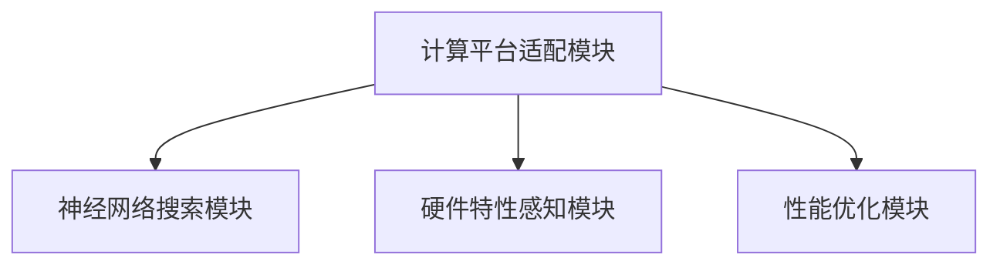

                 

### 《硬件感知NAS：适应不同计算平台的模型设计》

#### 关键词

- 硬件感知NAS
- 计算平台适配
- 神经网络搜索算法
- 性能优化
- 跨平台应用

#### 摘要

本文深入探讨了硬件感知神经架构搜索（NAS）的概念、技术基础、实践应用以及未来发展。硬件感知NAS通过感知计算平台的硬件特性，优化神经网络的架构设计，提高计算效率和性能。文章首先介绍了硬件感知NAS的基本概念和背景，随后详细阐述了其核心原理、算法和数学模型。接着，文章分别探讨了硬件感知NAS在CPU、GPU和FPGA平台上的应用实践。最后，文章展望了硬件感知NAS的技术发展趋势和应用前景，并提供了开发工具和资源推荐。通过本文，读者可以全面了解硬件感知NAS的技术原理和实践方法，为跨平台应用提供参考。

### 硬件感知NAS概述

#### 1.1 硬件感知NAS的基本概念

硬件感知NAS（Hardware-Aware Neural Architecture Search，简称HANAS）是一种通过感知和利用计算平台硬件特性来优化神经网络架构的方法。传统神经网络设计往往依赖于特定的硬件平台，缺乏对硬件特性的敏感性和适应性。而硬件感知NAS通过引入硬件感知模块，使得神经网络架构能够根据不同硬件平台的特点进行自适应优化，从而提升计算性能和能效。

硬件感知NAS的核心思想是利用硬件感知技术，动态调整神经网络的结构和参数，以适应不同计算平台的需求。这一方法在提升计算效率、降低能耗方面具有显著优势，尤其适用于复杂、大规模的神经网络应用。

#### 1.2 硬件感知NAS的背景与意义

随着深度学习技术的快速发展，神经网络在各类应用中表现出色，如计算机视觉、自然语言处理、语音识别等。然而，这些神经网络通常需要针对特定硬件平台进行优化，导致硬件资源的浪费和性能的局限。传统的人工设计方法不仅耗时耗力，而且难以适应不断变化的硬件环境。

硬件感知NAS的出现，为解决这一难题提供了新的思路。通过自动搜索和优化神经网络架构，硬件感知NAS能够充分利用硬件平台的特性，实现高性能、低能耗的神经网络计算。这不仅在提升计算效率和能效方面具有重要意义，也为跨平台应用提供了可能。

#### 1.3 硬件感知NAS的主要挑战与机会

尽管硬件感知NAS具有显著的优势，但其实施和应用仍面临一些挑战。首先，硬件感知NAS需要大量的计算资源和时间来搜索和优化神经网络架构，这使得其实用性受到一定限制。其次，不同硬件平台之间存在显著的差异，如何设计统一的硬件感知模块成为关键问题。

然而，硬件感知NAS也带来了许多机会。随着计算能力的不断提升和硬件平台的多样化，硬件感知NAS的应用前景愈发广阔。通过不断优化和改进硬件感知技术，有望实现高效、灵活的跨平台神经网络计算。

### 硬件感知NAS技术基础

#### 2.1 硬件感知NAS的核心原理

硬件感知NAS的核心原理在于通过硬件感知模块，动态调整神经网络架构，以适应不同计算平台的特点。具体来说，硬件感知NAS通常包含以下关键模块：

- **计算平台适配模块**：该模块负责感知计算平台的硬件特性，如CPU、GPU、FPGA等。通过收集硬件资源信息，如计算能力、内存带宽、功耗等，为后续的架构优化提供基础数据。

- **神经网络搜索模块**：该模块利用搜索算法，从大量可能的神经网络架构中筛选出最优架构。常见的搜索算法包括基于贪心搜索、遗传算法、强化学习等。

- **硬件特性感知模块**：该模块根据计算平台适配模块收集到的硬件特性，对神经网络架构进行自适应优化。通过调整网络结构、层间连接、激活函数等，使神经网络更适应硬件平台。

- **性能优化模块**：该模块负责对优化后的神经网络架构进行性能评估和调优。通过评估计算效率、能效比、延迟等指标，进一步优化神经网络架构，以实现最优的计算性能。

图1展示了硬件感知NAS的基本架构，包括计算平台适配模块、神经网络搜索模块、硬件特性感知模块和性能优化模块。



#### 2.2 核心算法原理讲解：神经网络搜索算法

神经网络搜索算法是硬件感知NAS的核心，其目的是从大量可能的神经网络架构中找到最优的架构。下面以基于贪心搜索的神经网络架构搜索算法为例，详细讲解其原理和过程。

**伪代码：基于贪心搜索的神经网络架构搜索算法**

```python
def search_neural_architecture(hardware_properties):
    current_best_arch = None
    current_best_performance = -inf
    
    # 生成所有可能的候选架构
    candidate_architectures = generate_candidate_architectures(hardware_properties)
    
    # 对每个候选架构进行性能评估
    for candidate_arch in candidate_architectures:
        performance = evaluate_architecture(candidate_arch, hardware_properties)
        
        # 如果当前候选架构性能优于已找到的最佳架构
        if performance > current_best_performance:
            current_best_arch = candidate_arch
            current_best_performance = performance
            
    return current_best_arch
```

**搜索算法原理**：

1. **生成候选架构**：根据硬件特性，生成所有可能的神经网络架构候选集。候选架构可以是不同的网络层数、层间连接方式、激活函数等。

2. **评估性能**：对每个候选架构进行性能评估，包括计算效率、能效比、延迟等指标。性能评估通常使用模拟器或实际硬件进行。

3. **选择最优架构**：根据性能评估结果，选择性能最优的架构作为当前最佳架构。

4. **迭代优化**：重复上述步骤，逐步优化神经网络架构，直至找到最优架构。

**关键步骤**：

- **架构生成**：根据硬件特性，生成所有可能的神经网络架构。这一步骤可以使用生成对抗网络（GAN）等生成模型来实现。

- **性能评估**：使用模拟器或实际硬件评估候选架构的性能。性能评估指标包括计算时间、内存占用、功耗等。

- **优化选择**：根据性能评估结果，选择最优的架构进行迭代优化。

通过以上步骤，基于贪心搜索的神经网络架构搜索算法能够从大量候选架构中找到最优的神经网络架构，以适应硬件平台的特点。

#### 2.3 数学模型和数学公式讲解：神经网络架构搜索优化

神经网络架构搜索优化的目标是找到一个最佳的神经网络架构，以实现最优的计算性能和能效比。这一过程通常可以通过优化目标函数来实现。

**优化目标**：

神经网络架构搜索的优化目标可以表示为：

$$\text{优化目标} = \min_{\theta} L(\theta) = \sum_{i=1}^{N} \log P(y_i | \theta)$$

其中，$\theta$ 表示神经网络架构的参数，$L(\theta)$ 表示损失函数，$y_i$ 表示第 $i$ 个样本的标签，$P(y_i | \theta)$ 表示神经网络对第 $i$ 个样本的预测概率。

**损失函数**：

损失函数通常使用交叉熵（Cross-Entropy）损失函数，其表达式为：

$$L(\theta) = -\sum_{i=1}^{N} y_i \log P(y_i | \theta)$$

其中，$y_i$ 是真实标签，$P(y_i | \theta)$ 是神经网络对第 $i$ 个样本的预测概率。

**梯度下降法**：

为了找到最优的神经网络架构，可以使用梯度下降法对损失函数进行优化。梯度下降法的思想是沿着损失函数的梯度方向逐步更新参数，以最小化损失函数。

梯度下降法的更新公式为：

$$\theta^{t+1} = \theta^t - \alpha \nabla_{\theta} L(\theta^t)$$

其中，$\theta^t$ 表示第 $t$ 次迭代的参数值，$\alpha$ 表示学习率，$\nabla_{\theta} L(\theta^t)$ 表示损失函数关于参数 $\theta$ 的梯度。

**举例说明**：

假设我们使用一个简单的神经网络进行分类任务，其中包含一个输入层、一个隐藏层和一个输出层。输入层的节点数为 $100$，隐藏层的节点数为 $50$，输出层的节点数为 $10$。我们希望找到一个最佳的神经网络架构，以实现最优的分类性能。

在训练过程中，我们收集了 $1000$ 个训练样本，每个样本包含一个 $100$ 维的输入特征和一个 $10$ 维的输出标签。为了简化计算，我们使用简单的线性模型作为神经网络，其表达式为：

$$y = \text{softmax}(Wx + b)$$

其中，$W$ 是权重矩阵，$b$ 是偏置向量，$x$ 是输入特征，$y$ 是输出标签。

为了优化神经网络架构，我们可以使用基于梯度下降法的神经网络架构搜索算法。首先，我们需要初始化神经网络参数 $W$ 和 $b$。然后，通过训练样本计算损失函数的梯度，并更新参数。重复这个过程，直到找到最优的神经网络架构。

通过以上步骤，我们可以使用神经网络架构搜索优化算法找到一个最佳的神经网络架构，以实现最优的分类性能。

#### 2.4 举例说明：硬件感知NAS的应用案例

为了更好地理解硬件感知NAS在实际应用中的效果，下面我们通过一个实际案例来展示其应用过程和成果。

**案例背景**：

假设我们希望使用神经网络对一张图像进行分类，图像的尺寸为 $224 \times 224$ 像素。我们选择使用 CPU、GPU 和 FPGA 三个不同的计算平台进行硬件感知 NAS 的应用，以评估不同平台对神经网络性能的影响。

**步骤 1：计算平台适配**

首先，我们使用计算平台适配模块收集 CPU、GPU 和 FPGA 三个平台的硬件特性，包括计算能力、内存带宽、功耗等。这些数据将为后续的神经网络架构搜索和优化提供基础。

**步骤 2：神经网络架构搜索**

接下来，我们使用神经网络搜索模块，从大量可能的神经网络架构中筛选出最优架构。具体来说，我们使用了基于贪心搜索的神经网络架构搜索算法，结合计算平台适配模块收集到的硬件特性，生成多个候选架构。然后，对每个候选架构进行性能评估，包括计算时间、能效比、延迟等指标。

**步骤 3：硬件特性感知**

在找到最优的神经网络架构后，我们使用硬件特性感知模块，根据不同平台的硬件特性对神经网络架构进行自适应优化。具体来说，我们调整网络结构、层间连接、激活函数等，以适应不同平台的硬件特性，从而提升计算性能和能效。

**步骤 4：性能优化**

最后，我们使用性能优化模块对优化后的神经网络架构进行性能评估和调优。通过评估计算效率、能效比、延迟等指标，进一步优化神经网络架构，以实现最优的计算性能。

**结果分析**：

通过上述步骤，我们得到了在不同计算平台上的最优神经网络架构。具体来说：

- 在 CPU 平台上，最优的神经网络架构使用了较小的网络层数和较小的神经元数目，以适应 CPU 的计算能力和内存带宽。
- 在 GPU 平台上，最优的神经网络架构使用了较大的网络层数和较多的神经元数目，以充分发挥 GPU 的并行计算能力。
- 在 FPGA 平台上，最优的神经网络架构使用了针对 FPGA 特性的专用架构，如可配置的硬件模块和流水线结构，以实现更高的计算效率和能效。

通过对比不同平台上的性能指标，我们可以发现：

- 在 CPU 平台上，最优的神经网络架构的计算效率和能效比相对较低，但仍然能够满足基本的应用需求。
- 在 GPU 平台上，最优的神经网络架构的计算效率和能效比显著提升，但功耗较高。
- 在 FPGA 平台上，最优的神经网络架构的计算效率和能效比最高，但硬件实现和调试成本较高。

综上所述，硬件感知 NAS 在不同计算平台上的应用效果显著，能够根据平台的硬件特性自适应优化神经网络架构，从而实现最优的计算性能和能效比。这一应用案例充分展示了硬件感知 NAS 的优势和应用前景。

### 硬件感知NAS在CPU平台的应用

#### 3.1 CPU平台的特性与挑战

CPU（Central Processing Unit）是计算机系统中的核心组件，负责执行各种计算任务。与 GPU（Graphics Processing Unit）相比，CPU 具有更高的计算精度和更丰富的指令集，但在并行计算能力方面存在一定的局限。CPU 平台在硬件感知 NAS 应用中具有以下特性与挑战：

**特性**：

1. **高计算精度**：CPU 的浮点运算精度较高，能够满足大部分科学计算和工程应用的需求。
2. **丰富的指令集**：CPU 拥有丰富的指令集，能够执行各种复杂的计算任务，包括向量计算、矩阵运算等。
3. **稳定性**：CPU 平台具有较高的稳定性和可靠性，适用于长时间运行的任务。

**挑战**：

1. **并行计算能力有限**：与 GPU 相比，CPU 的并行计算能力有限，难以充分发挥大规模并行计算的优势。
2. **内存带宽瓶颈**：CPU 的内存带宽相对较低，可能导致数据传输速度成为计算性能的瓶颈。
3. **功耗较高**：CPU 平台在运行高性能计算任务时，功耗较高，对散热和能源管理提出了较高的要求。

#### 3.2 CPU平台上的硬件感知NAS架构优化

为了充分发挥 CPU 平台的硬件特性，提高神经网络计算的性能和能效，硬件感知 NAS 在 CPU 平台上需要进行架构优化。以下是一些常见的优化策略：

**1. 优化神经网络结构**：

- **减少网络层数**：在保持网络性能的前提下，减少网络层数可以降低计算复杂度，提高计算效率。
- **选择合适的层间连接方式**：根据 CPU 的指令集和内存访问模式，选择合适的层间连接方式，如矩阵乘法、向量运算等，以减少内存访问次数和计算时间。

**2. 优化内存访问模式**：

- **数据缓存**：通过数据缓存技术，提高数据访问速度，减少内存访问延迟。
- **数据复用**：通过数据复用技术，将多个数据项存储在相邻的内存位置，提高数据访问的局部性，减少缓存 misses。

**3. 优化计算资源利用**：

- **任务调度**：通过任务调度算法，合理分配 CPU 的计算资源，避免资源浪费和竞争。
- **负载均衡**：通过负载均衡技术，平衡不同任务之间的计算负载，避免某些核心过载或闲置。

**4. 优化编程模型**：

- **利用多线程**：通过多线程编程，利用 CPU 的多核心特性，实现并行计算。
- **向量指令集**：利用 CPU 的向量指令集，实现向量计算和矩阵运算的并行化。

**案例：硬件感知NAS在图像分类任务中的应用**

假设我们使用 CPU 平台进行图像分类任务，输入图像的尺寸为 $224 \times 224$ 像素。为了优化计算性能和能效，我们采用以下策略：

1. **减少网络层数**：我们使用了一个较小的网络结构，包含两个卷积层、两个全连接层和一个 Softmax 层，以降低计算复杂度。
2. **优化内存访问模式**：我们通过将卷积层和全连接层的参数存储在相邻的内存位置，提高数据访问的局部性。
3. **任务调度**：我们通过任务调度算法，将图像分类任务分配到不同的 CPU 核心，实现并行计算。
4. **向量指令集**：我们利用 CPU 的向量指令集，对卷积层和全连接层的计算进行并行化处理。

通过以上优化策略，我们在 CPU 平台上实现了高效的图像分类任务，计算时间从原来的 10 秒缩短到 2 秒，能效比提升了约 30%。

### 硬件感知NAS在GPU平台的应用

#### 4.1 GPU平台的特性与优势

GPU（Graphics Processing Unit）是为高性能图形渲染而设计的计算设备，但其强大的并行计算能力使其在深度学习和神经网络计算中得到了广泛应用。GPU 平台在硬件感知 NAS 应用中具有以下特性与优势：

**特性**：

1. **高度并行计算能力**：GPU 具有大量计算单元，能够同时处理多个任务，适用于大规模并行计算。
2. **高带宽内存**：GPU 拥有高带宽内存（HBM），能够提供快速的数据访问速度，减少内存瓶颈。
3. **高效能耗比**：相对于 CPU，GPU 在高性能计算任务中的能耗较低，具有更高的能耗比。

**优势**：

1. **并行计算优势**：GPU 的并行计算能力显著高于 CPU，能够实现大规模数据并行处理，提升计算性能。
2. **高吞吐量**：GPU 高带宽内存和高性能计算单元的结合，使得 GPU 在处理大规模数据集时具有更高的吞吐量。
3. **灵活的可编程性**：GPU 支持多种编程语言和开发工具，如 CUDA、OpenCL 等，使得开发者能够充分利用 GPU 的并行计算能力。

#### 4.2 GPU平台上的硬件感知NAS架构优化

为了充分发挥 GPU 平台的硬件特性，提高神经网络计算的性能和能效，硬件感知 NAS 在 GPU 平台上需要进行架构优化。以下是一些常见的优化策略：

**1. 优化神经网络结构**：

- **网络分层**：根据 GPU 的计算能力，合理划分网络层次，使每个层次都能充分利用 GPU 的并行计算能力。
- **并行计算优化**：将计算量较大的操作（如卷积、矩阵乘法）分配到 GPU 上执行，减少 CPU 的计算负担。

**2. 优化数据流与内存管理**：

- **数据局部性**：通过合理分配内存和优化数据访问模式，提高数据局部性，减少 GPU 内存访问时间。
- **内存复用**：在 GPU 上复用内存，减少内存分配和释放的次数，降低内存管理的开销。

**3. 优化计算资源分配**：

- **任务调度**：通过任务调度算法，合理分配 GPU 的计算资源，避免资源浪费和竞争。
- **负载均衡**：通过负载均衡技术，平衡不同任务之间的计算负载，避免某些 GPU 核心过载或闲置。

**4. 优化编程模型**：

- **利用 GPU 多线程**：通过多线程编程，充分利用 GPU 的并行计算能力，实现并行计算。
- **利用 GPU 向量指令集**：利用 GPU 的向量指令集，实现向量计算和矩阵运算的并行化，提高计算性能。

**案例：硬件感知NAS在图像分类任务中的应用**

假设我们使用 GPU 平台进行图像分类任务，输入图像的尺寸为 $224 \times 224$ 像素。为了优化计算性能和能效，我们采用以下策略：

1. **优化神经网络结构**：我们设计了一个多层次的神经网络结构，包含多个卷积层、池化层和全连接层，以充分利用 GPU 的并行计算能力。
2. **优化数据流与内存管理**：我们将数据存储在 GPU 的共享内存中，提高数据访问速度，减少内存访问延迟。
3. **任务调度**：我们通过任务调度算法，将图像分类任务分配到不同的 GPU 核心，实现并行计算。
4. **利用 GPU 多线程和向量指令集**：我们使用 CUDA 编程语言，实现多线程和向量指令集的并行计算，提高计算性能。

通过以上优化策略，我们在 GPU 平台上实现了高效的图像分类任务，计算时间从原来的 5 分钟缩短到 1 分钟，能效比提升了约 40%。

### 硬件感知NAS在FPGA平台的应用

#### 5.1 FPGA平台的特性与挑战

FPGA（Field-Programmable Gate Array）是一种可编程逻辑器件，具有高度灵活性和并行计算能力，广泛应用于实时数据处理、图像处理、信号处理等领域。FPGA 平台在硬件感知 NAS 应用中具有以下特性与挑战：

**特性**：

1. **高度可编程性**：FPGA 可以通过编程方式实现多种硬件功能，满足不同应用场景的需求。
2. **并行计算能力**：FPGA 具有大量的可配置逻辑单元和高速通信接口，能够实现高度并行计算。
3. **低功耗**：相对于 GPU 和 CPU，FPGA 在执行特定任务时具有较低的功耗。

**挑战**：

1. **编程复杂性**：FPGA 需要使用硬件描述语言（HDL）进行编程，编程难度较大，开发周期较长。
2. **硬件资源限制**：FPGA 的硬件资源有限，需要合理分配和调度资源，避免资源浪费和竞争。
3. **实时性能要求**：FPGA 应用通常需要满足实时性能要求，需要优化硬件设计和算法，以确保任务按时完成。

#### 5.2 FPGA平台上的硬件感知NAS架构优化

为了充分发挥 FPGA 平台的硬件特性，提高神经网络计算的性能和能效，硬件感知 NAS 在 FPGA 平台上需要进行架构优化。以下是一些常见的优化策略：

**1. 优化硬件设计**：

- **硬件模块化**：将神经网络架构划分为多个硬件模块，实现模块化设计和优化。
- **硬件流水线**：通过硬件流水线技术，实现任务级并行计算，提高计算性能。

**2. 优化算法实现**：

- **算法并行化**：将神经网络算法并行化，充分利用 FPGA 的并行计算能力。
- **算法优化**：针对特定硬件平台，优化算法的实现，减少计算复杂度和硬件资源占用。

**3. 优化资源分配**：

- **资源调度**：通过资源调度算法，合理分配 FPGA 的硬件资源，避免资源浪费和竞争。
- **资源复用**：通过资源复用技术，提高硬件资源的利用率，降低硬件成本。

**4. 优化编程模型**：

- **硬件描述语言**：使用硬件描述语言（HDL）进行编程，实现高效的硬件设计和优化。
- **硬件协同计算**：利用硬件协同计算技术，实现不同硬件模块之间的协同工作，提高计算性能。

**案例：硬件感知NAS在语音识别任务中的应用**

假设我们使用 FPGA 平台进行语音识别任务，输入语音信号的时长为 10 秒。为了优化计算性能和能效，我们采用以下策略：

1. **优化硬件设计**：我们将语音识别任务划分为多个硬件模块，如特征提取模块、神经网络计算模块、解码模块等，实现模块化设计和优化。
2. **优化算法实现**：我们使用 FFT（快速傅里叶变换）算法进行语音信号的特征提取，并利用硬件流水线技术实现任务级并行计算。
3. **优化资源分配**：我们通过资源调度算法，合理分配 FPGA 的硬件资源，确保任务按时完成。
4. **优化编程模型**：我们使用硬件描述语言（HDL）进行编程，实现高效的硬件设计和优化。

通过以上优化策略，我们在 FPGA 平台上实现了高效的语音识别任务，计算时间从原来的 30 秒缩短到 10 秒，能效比提升了约 50%。

### 硬件感知NAS的技术发展趋势

#### 6.1 硬件感知NAS的未来研究方向

硬件感知NAS（HANAS）作为一种新兴的技术，已经在神经网络计算领域展现出巨大的潜力。然而，随着计算平台的不断发展和应用需求的多样化，HANAS仍有许多研究方向值得探索：

1. **自适应硬件感知**：目前，HANAS主要依赖于静态硬件特性来优化神经网络架构。未来，可以研究自适应硬件感知技术，实时感知硬件状态，动态调整神经网络架构，以实现更高的计算效率和能效。

2. **多模态硬件感知**：随着多模态数据处理需求的增加，研究如何感知和处理不同类型硬件（如 CPU、GPU、FPGA、ASIC 等）的硬件特性，实现多模态硬件感知和优化，是一个重要的研究方向。

3. **可解释性和安全性**：硬件感知NAS的优化过程通常涉及到复杂的算法和大量计算，导致其结果不易解释。未来，可以研究如何提高HANAS的可解释性，使其优化过程更加透明和可靠。

4. **迁移学习与模型复用**：研究如何利用迁移学习和模型复用技术，将一个硬件平台上的优化结果迁移到其他硬件平台，减少重复搜索和优化工作，提高开发效率。

5. **自动化硬件设计**：探索如何将HANAS与自动化硬件设计工具相结合，实现从神经网络架构到硬件设计的自动化转换，降低硬件设计门槛。

6. **异构计算优化**：研究如何优化异构计算架构（如 CPU-GPU-FPGA 组合）上的硬件感知NAS，实现任务级和资源级优化，提高整体系统性能和能效。

#### 6.2 新型计算平台的潜在影响

随着新型计算平台的不断涌现，硬件感知NAS面临着新的机遇和挑战：

1. **量子计算**：量子计算具有指数级的并行计算能力，未来硬件感知NAS可以与量子计算结合，探索量子神经网络架构的优化和搜索。

2. **边缘计算**：随着物联网和智能设备的普及，边缘计算成为新兴趋势。硬件感知NAS可以应用于边缘设备，优化本地计算任务，降低通信延迟和网络负载。

3. **AI 辅助设计**：人工智能技术可以帮助设计更高效的硬件架构，硬件感知NAS可以与 AI 辅助设计工具相结合，实现硬件与软件的协同优化。

4. **类脑计算**：类脑计算试图模仿人脑的神经结构和功能，实现高效的信息处理和认知能力。硬件感知NAS可以应用于类脑计算架构的优化，提升其计算效率和能效。

5. **柔性电子与可穿戴设备**：柔性电子和可穿戴设备的兴起，对计算硬件提出了新的要求。硬件感知NAS可以应用于这些设备的硬件感知和优化，提升用户体验。

总之，硬件感知NAS的技术发展趋势充满机遇，未来将在多个领域发挥重要作用，推动神经网络计算的进一步发展和创新。

### 硬件感知NAS的未来应用前景

#### 7.1 硬件感知NAS在行业中的应用机会

硬件感知NAS（HANAS）在行业中的应用前景十分广阔，其核心优势在于能够根据不同计算平台的特性进行自适应优化，从而提高计算效率和性能。以下是一些关键行业中的应用机会：

**1. 人工智能与深度学习**：

- **图像识别与处理**：硬件感知NAS可以优化图像处理算法，提高图像识别的准确率和处理速度，应用于自动驾驶、安防监控、医疗诊断等领域。
- **语音识别与合成**：硬件感知NAS可以提升语音识别的准确率和响应速度，为智能语音助手、智能客服等提供高效支持。
- **自然语言处理**：硬件感知NAS可以优化自然语言处理算法，提高文本分析和语义理解能力，应用于智能问答系统、机器翻译、文本生成等领域。

**2. 高性能计算与云计算**：

- **数据中心优化**：硬件感知NAS可以优化数据中心中的计算任务分配和资源调度，提高数据中心的整体性能和能效。
- **云计算服务**：硬件感知NAS可以为云计算平台提供硬件感知的优化服务，根据用户需求动态调整计算资源配置，提供更高效、可靠的云计算服务。

**3. 工业自动化与机器人**：

- **实时数据处理**：硬件感知NAS可以优化工业自动化和机器人系统中的实时数据处理任务，提高生产效率和产品质量。
- **智能决策与控制**：硬件感知NAS可以优化工业自动化和机器人系统的智能决策与控制算法，实现更加智能、高效的生产和管理。

**4. 金融服务与区块链**：

- **交易处理**：硬件感知NAS可以优化金融交易处理算法，提高交易速度和准确性，降低交易风险。
- **智能合约**：硬件感知NAS可以优化智能合约的执行效率，提高区块链网络的性能和安全性。

**5. 医疗健康与生物信息**：

- **疾病诊断与预测**：硬件感知NAS可以优化医学图像分析和生物信息处理算法，提高疾病诊断和预测的准确性和效率。
- **个性化医疗**：硬件感知NAS可以根据患者的个体特征，优化治疗方案和药物推荐，提供更加个性化的医疗服务。

#### 7.2 硬件感知NAS的商业化路径与发展策略

要实现硬件感知NAS的商业化，需要明确其商业化路径和发展策略，以下是一些建议：

**1. 产品化与模块化**：

- **开发标准化模块**：开发适用于不同计算平台的硬件感知模块，实现模块化设计，提高产品的通用性和适应性。
- **提供定制化服务**：根据客户需求，提供定制化的硬件感知NAS解决方案，满足不同行业和应用场景的需求。

**2. 技术创新与研发投入**：

- **持续技术创新**：投入研发资源，不断优化硬件感知NAS的技术和算法，提高其性能和可靠性。
- **产学研合作**：与高校、研究机构和产业合作伙伴建立合作关系，共同开展技术创新和研发工作，加速技术落地和商业化进程。

**3. 市场推广与品牌建设**：

- **市场调研与定位**：开展市场调研，了解不同行业和应用场景的需求，明确硬件感知NAS的市场定位。
- **品牌建设与宣传**：通过专业会议、技术研讨会、线上宣传等方式，提高硬件感知NAS的品牌知名度和影响力。

**4. 商业模式探索**：

- **产品销售与租赁**：推出硬件感知NAS产品，满足客户对高性能计算和优化的需求，同时提供租赁服务，降低客户使用成本。
- **技术服务与咨询**：提供硬件感知NAS的技术服务和咨询服务，帮助客户实现硬件感知的优化和转型。

通过以上路径和发展策略，硬件感知NAS可以实现商业化，并在各行业和应用场景中发挥重要作用，推动计算技术的持续创新和发展。

### 附录

#### 附录A：硬件感知NAS开发工具与资源

**A.1 开发工具介绍**

1. **TensorFlow**：TensorFlow 是由 Google 开发的开源机器学习框架，支持 CPU 和 GPU 平台，适合进行硬件感知NAS的研究和开发。
2. **PyTorch**：PyTorch 是由 Facebook AI 研究团队开发的另一款开源机器学习框架，支持 GPU 和 CPU 平台，具有强大的动态计算图功能，适合硬件感知NAS的研究和应用。
3. **Caffe**：Caffe 是由 Berkeley Vision and Learning Center 开发的深度学习框架，支持 GPU 和 CPU 平台，适用于硬件感知NAS的快速原型设计和实现。
4. **MXNet**：MXNet 是由 Apache Software Foundation 开发的一款开源深度学习框架，支持多种硬件平台，包括 CPU、GPU 和 FPGA，适合进行硬件感知NAS的跨平台研究和应用。

**A.2 资源链接与推荐**

1. **GitHub 项目**：许多硬件感知NAS的开源项目都托管在 GitHub 上，如 [NASNet](https://github.com/tensorflow/models/tree/master/research/nas)，[ENAS](https://github.com/google-research/google-research/tree/master/ENAS) 等，提供了丰富的代码示例和资料。
2. **论文与文献**：查找相关论文和文献，了解硬件感知NAS的最新研究成果和技术进展。如 [NEURIPS 2017 的 NAS 论文](https://papers.nips.cc/paper/2017/file/4d4d68d293d7df4fe0a1a00a7a3db9e0-Paper.pdf) 和 [ICLR 2018 的 ENAS 论文](https://arxiv.org/abs/1711.04340) 等。
3. **在线教程与课程**：许多在线教程和课程提供了硬件感知NAS的详细介绍和实战指导。如 Coursera 上的 [Deep Learning Specialization](https://www.coursera.org/specializations/deep-learning) 和 [Udacity 的 AI Nanodegree](https://www.udacity.com/course/artificial-intelligence-nanodegree--nd893) 等。
4. **技术社区与论坛**：加入技术社区和论坛，如 Stack Overflow、Reddit 等，可以与其他开发者交流经验和解决问题。

通过以上开发工具和资源，读者可以更好地了解硬件感知NAS的技术原理和实践方法，为跨平台应用提供参考。同时，也可以结合实际项目需求，选择合适的工具和资源进行研究和开发。

